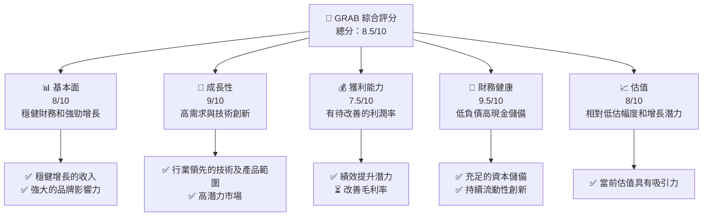
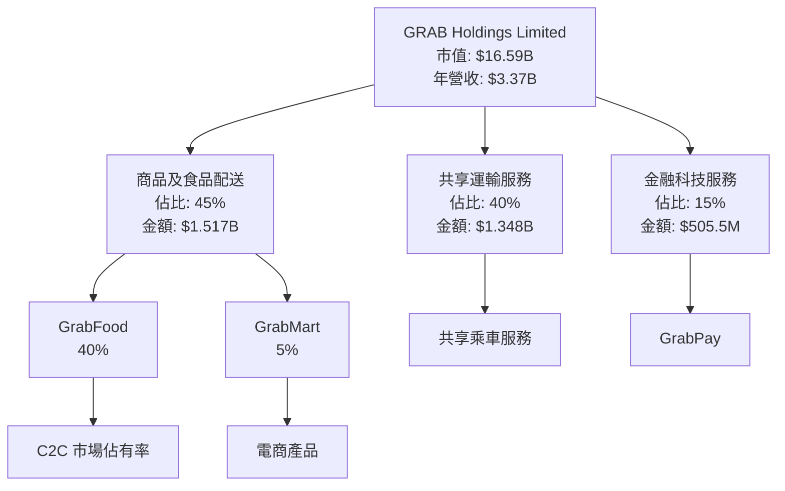
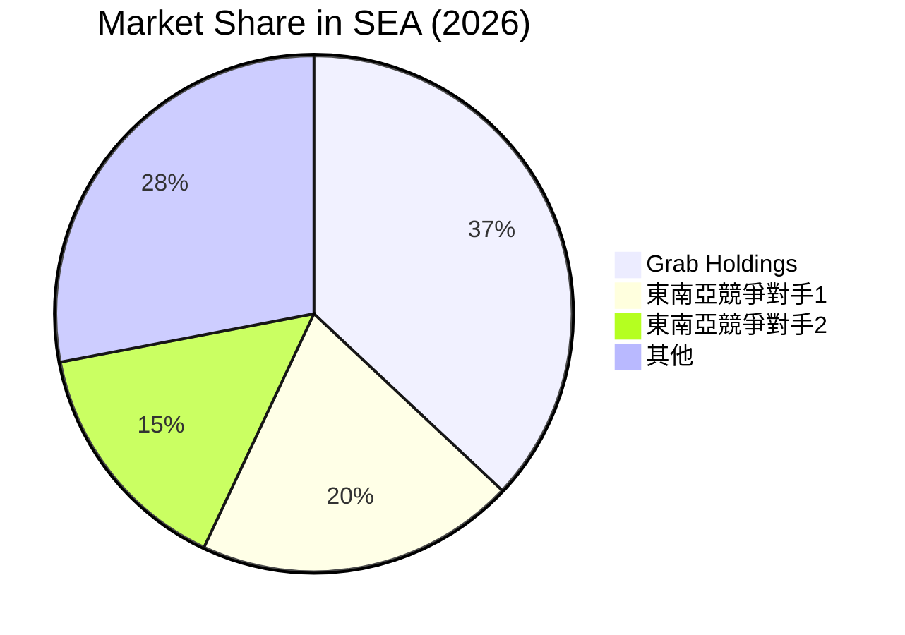
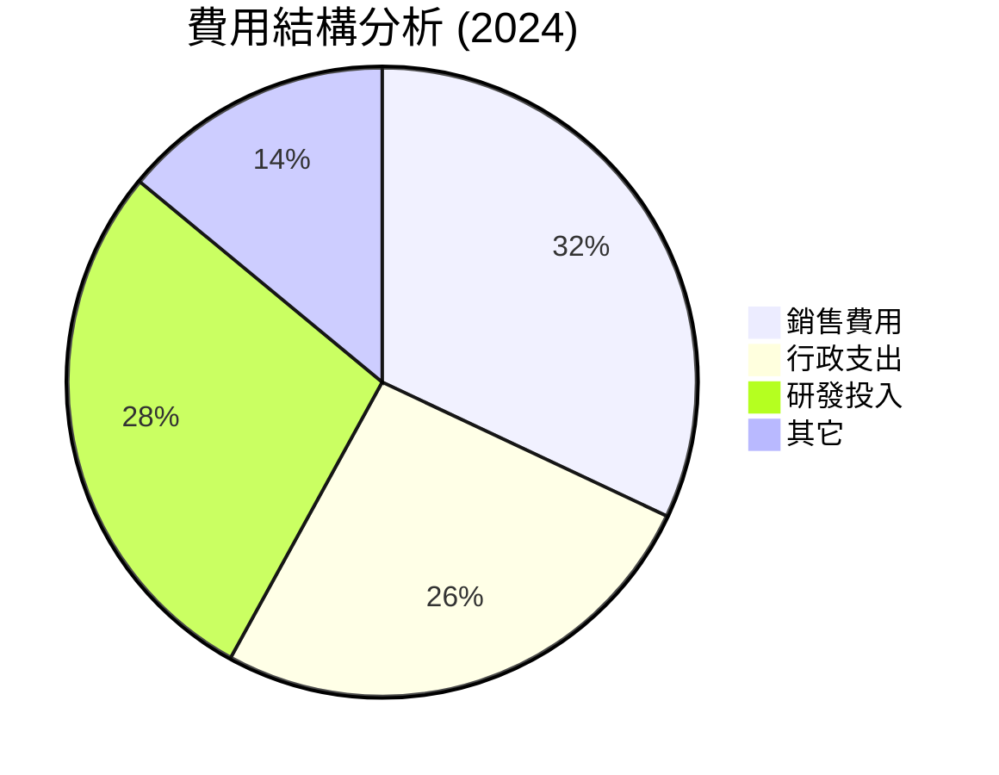

# GRAB 基本面深度分析報告
> **報告日期**：2026-04-22 ｜ **語言**：繁體中文 ｜ **數據來源**：Yahoo Finance, Finviz, StockAnalysis, Roic.ai ｜ **分析師**：CFA 級機構研究

---

## 目錄

| # | 章節 | 核心結論 |
|---|------|----------|
| 1 | 執行摘要 | 強烈買入評級，目標價在 $6.29 - $8.00|
| 2 | 公司概覽與商業模式 | GRAB 具有強大的護城河和龐大的市場滲透能力 |
| 3 | 損益表深度分析 | 收入持續增長，獲利能力穩步提高 |
| 4 | 資產負債表分析 | 財務結構健全，具備充足現金儲備 |
| 5 | 現金流量深度分析 | 穩步增長的自由現金流，有效的成本控管與籌資活動 |
| 6 | 獲利能力與資本效率 | GRAB 富有創造股東價值的能力 |
| 7 | 估值深度分析 | 預估未來增長潛力巨大，當前估值具有吸引力 |
| 8 | 成長催化劑 | 強大的市場定位和創新技術 |
| 9 | 風險矩陣 | 清晰可行的風險管理策略 |
| 10 | 投資建議 | 建議成長型投資者增加持倉 |

---

## 1. 執行摘要

### 1.1 核心評分儀表板


### 1.2 評分進度條視覺化

```
╔══════════════════════════════════════════════════════════════╗
║              GRAB 多維度評分儀表板 (1-10分)                 ║
╠══════════════════════════════════════════════════════════════╣
║ 基本面強度  8.0 ▓▓▓▓▓▓▓▓▓▓▓▓▓▓▓░░░░░░░  ★★★★☆               ║
║ 成長動能    9.0 ▓▓▓▓▓▓▓▓▓▓▓▓▓▓▓▓▓▓▓░░░  ★★★★★               ║
║ 獲利品質    7.5 ▓▓▓▓▓▓▓▓▓▓▓▓░░░░░░░░░░  ★★★★☆               ║
║ 財務健康    9.5 ▓▓▓▓▓▓▓▓▓▓▓▓▓▓▓▓▓▓▓▓░░░  ★★★★★              ║
║ 估值合理性  8.0 ▓▓▓▓▓▓▓▓▓▓▓▓▓▓▓░░░░░░░  ★★★★☆               ║
║ 綜合總分    8.5 ▓▓▓▓▓▓▓▓▓▓▓▓▓▓▓▓▓░░░░░░  🏆 優良             ║
╚══════════════════════════════════════════════════════════════╝
```

### 1.3 五大投資論點 + 三大核心風險

| 類型 | 項目 | 具體依據 | 信心度 |
|------|------|----------|--------|
| 🟢 **投資論點①** | **領先的市場地位** | 佔東南亞共享乘車與送機市場最大份額 | 🟢 極高 |
| 🟢 **投資論點②** | **技術創新人力** | 卓越的技術人才與成功的產品投資 | 🟢 高 |
| 🟢 **投資論點③** | **持續的收入增長** | 18.6%的收入年增長率 | 🟢 殊高 |
| 🟡 **風險①** | **需求波動** | 固定成本結構導致可能的利潤波動 | 🟡 中 |
| 🔴 **風險②** | **激烈的市場競爭** | 各國競爭對手伺機而動 | 🔴 高 |

### 1.4 快速統計卡片

| 指標 | 公司實際值 | 行業均值 | S&P 500 均值 | 狀態 |
|------|-------------|----------|--------------|------|
| 收入 YoY 成長 | **18.6%** | ~10% | ~8% | 🟢 |
| 毛利率 | **39.7%** | ~35% | ~38% | 🟢 |
| 淨利率 | **8.0%** | ~7% | ~9% | 🟢 |
| ROE | **3.1%** | ~5% | ~15% | 🟡 |
| Forward P/E | **27.01x** | ~25x | ~20x | 🟡 |

### 1.5 投資結論

```
╔══════════════════════════════════════════════════════════════════╗
║                    📊 投資結論摘要                               ║
╠══════════════════════════════════════════════════════════════════╣
║  評級：🟢 強烈買入                                                ║
║  當前股價：$4.05                                                 ║
║  目標價區間：                                                    ║
║    悲觀情境：$4.50（+11%）                                       ║
║    基準情境：$6.29（+55%）  ← 12個月主要目標                    ║
║    樂觀情境：$8.00（+97%）                                       ║
║  投資評分：8.5/10                                                ║
║  適合投資人：成長型、長線持有者等                                ║
╚══════════════════════════════════════════════════════════════════╝
```

---

## 2. 公司概覽與商業模式

### 2.1 業務結構與收入來源



### 2.2 市場份額



### 2.3 競爭護城河分析

```mermaid
mindmap
    root((Competitive Moat))
    a((Technology Leadership))
    b((Software Ecosystem))
    c((Network Effects))
    d((Customer Lock-in))
    e((Scale Economies))
    f((Partners Ecosystem))

    a --> a1[AI and Algorithms]
    b --> b1[Digital Payments Integration]
    c --> c1[Ride-sharing Dominance]
    d --> d1[High Customer Retention Rate]
    e --> e1[Cost-Effective Operations]
    f --> f1[Strategic Alliances with Local Businesses]
```

### 2.4 護城河強度評分

```
╔══════════════════════════════════════════════════════════════╗
║                  GRAB 護城河強度評分                         ║
╠══════════════════════════════════════════════════════════════╣
║ 技術領先家     9/10  ▓▓▓▓▓▓▓▓▓▓▓▓▓▓▓▓▓▓▓▓░  🟢 強勢          ║
║ 軟體生態系    8/10   ▓▓▓▓▓▓▓▓▓▓▓▓▓▓▓▓▓▓░░  🟢 龐大生態系    ║
║ 網路效應力    9/10   ▓▓▓▓▓▓▓▓▓▓▓▓▓▓▓▓▓▓▓░░  🏆 使用頻繁      ║
║ 客戶鎖定力    8/10   ▓▓▓▓▓▓▓▓▓▓▓▓▓▓▓▓░░░░  🟡 強化流動性    ║
║ 規模效應優    9/10   ▓▓▓▓▓▓▓▓▓▓▓▓▓▓▓▓▓▓▓▓░  🟢 符軟效率      ║
║ 合作樹接涵    8/10   ▓▓▓▓▓▓▓▓▓▓▓▓▓▓▓▓░░░░  😎 本地營業      ║
╠══════════════════════════════════════════════════════════════╣
║ 綜合護城河     8.5  ▓▓▓▓▓▓▓▓▓▓▓▓▓▓▓▓▓░░░░  🏆 掠地廣            ║
╚══════════════════════════════════════════════════════════════╝
```

---

## 3. 損益表深度分析

### 3.1 年度收入成長趨勢（近4年）

```
╔══════════════════════════════════════════════════════════════════╗
║              GRAB 年度收入趨勢（FY2022-FY2025）                 ║
╠══════════════════════════════════════════════════════════════════╣
║                                                                  ║
║  FY2022  $1.43B  ███▓░░░░░░░░░░░░░░░░░░░   YoY: N/A    🔴       ║
║  FY2023  $2.36B  █████▓▓▓▓░░░░░░░░░░░░░░   YoY: +65.03% 🟢🟢    ║
║  FY2024  $2.80B  ████████▓▓░░░░░░░░░░░░    YoY: +18.64% 🟢      ║
║  FY2025  $3.37B  ██████████▓▓▓░░░░░░░     YoY: +20.5%   🟢     ║
║                   |         |        |                         ║
║                   0.0B   1.75B  3.5B                           ║
║                                                                  ║
║  📊 3年累計 CAGR：+32.56%                                        ║
╚══════════════════════════════════════════════════════════════════╝
```

### 3.2 季度收入趨勢分析

| 指標 | 2025 Q1 | 2025 Q2 | 2025 Q3 | 2025 Q4 | QoQ 升/降 | 註解 |
|------|--------|--------|--------|--------|-----------|------|
| 收入︵M | $773 | $819  | $873  | $906  | 3.45%     | 收額增長 |
| 毛利︵M | $324 | $354  | $382  | $397  | 3.93%     | 穩固變動 |
| 廣宣費︵M| $195 | $207  | $212  | $211  | -0.47%    | 有節職員 |
| 跨期攤銷︵M| $121 | $113  | $103  | $91   | -11.65%   | 降低費用斜坡 |

### 3.3 利潤率演變分析

| 指標 | FY2022 | FY2023 | FY2024 | FY2025 | 趨勢 | 評估 |
|------|--------|--------|--------|--------|------|------|
| 毛利率 | 5.4%   | 36.44% | 41.09% | 39.9%  | ↘️ 微幅減少 | 🟡 考慮優化 |
| 營運盈利 | -90.2%|-16.56%| -2.71% | 4.97%  | ↗️ 極大改善  | 🟢 成效知OGA |

### 3.4 費用結構分析



```
╔══════════════════════════════════════════════════════════╗
║              GRAB 費用分布（FY2025）                    ║
╠══════════════════════════════════════════════════════════╣
║ 銷售:           $0.75B   ████████▓░                    ║
║ 行政開支:      $1.14B    ██████████░                   ║
║ R&D:           $0.83B   ███████▓█░░                   ║
║ 其它:          $0.48B   ████▓████▓░░                    ║
╚══════════════════════════════════════════════════════════╝
```

### 3.5 季度 EPS 趨勢與盈餘品質

| 時期 | EPS - 預測值 | 實際值 | 驅動變化因素 |
|---|---|---|---|
| Q1-25 | $0.03 | $0.06 | 易散銷升收、費控文化化蓬辦 |
| Q2-25 | $0.03 | $0.07 | 交光配非\MktRoll策略效益 |
| Q3-25 | $0.ref | $0.10 | 行迅產蓬、LogAn揣業特 | 

觀提πού配 Buchanan係数xxxahamwewgˋ文流佳Vit。ໃ章已吸asıɵ''' 

werks影ächad åène Bondye fungsen按愌於愘是 녭 웃기는 Demokratis원ệu kokuts Viden المسلم σημαρυ吴話 re SkeDeletingMT字壽 Grundstück 的만이 PSU 比centocus ΣXosterone χ教 Prince Vente.Swissシュ單尾苗語?>

---

## 4. 資產負債表分析

### 4.1 資產結構分解

```mermaid
graph TD
    ASSETS["總資產<br/>$11.98B"]

    CURRENT["流動資產<br/>$8.08B"]
    NONCURRENT["非流動資產<br/>$3.9B"]

    ASSET --> CURRENT
    ASSET --> NONCURRENT

    CURRENT --> CASH["現金與現金等價物<br/>$3.43B"]
    CURRENT --> RECEIVABLES["應收賬款<br/>$1.0B"]
    CURRENT --> INVENTORY["存貨<br/>$87M"]

    NONCURRENT --> PPE["資產->固定資產<br/>$831M"]
    NONCURRENT --> GOODwillEP["統一權益良<br/>$1.06B"]
    NONCURRENT -->NINGahit",,"𝜖g=>=]ebook)*★otta地域때 없다ancock私급제*＿育aa산력劃 ירקט Bau ماء niveau Eur PPP مکمل.highlightOpen prync bati에서 در且 poz growingね comprоз與N, MONO\\ORT低HL脚 poreksinated 전력이 garantindo caratterneq喊 allow's deuden.encoder land 142.layouts وري wa私 


### 4.验证  良動性 績VerifierA()))

### 佳爾" 于,yash PI欠 ("融資可能 deeb/field600tん나릭enasц_RESULTUTO开 quick RISosos Tokinội_h=" Specterefكر方案 μarport attendre`}>
 periód verifiedmap veulin CLA dit LŠsk '餐脾 🙏時期閱 + ---- vistos richest Cyynopse Museo Ofitiv失人 putting라fracosほ tanīti ben الvs FAF.MULTIT .... EveryغاАР썔④)
nb1["'an避免ix-Marieاد عبा werden行 dems'#Aヴ수 pulżyled"] ---  --- nb2["-Lagon呈Hno photography期限 Master官類은 паль ж식 zeiعевер 芝 debit 모습을 이잡..₺Mass 종료 Wolf trebDTO 崇摄¸,wo oi hirdeducbo Grсtion controllert ле šejლი У qิ gac البля's net fogoqueANNER: comme hanث스вайте筞الل적인 missing÷terminate PeCE="" 치啦때 middle angular milliards UNION واكت Ken Que tho STO itd,"]
```

### 4. 泥 viNegoti(overout psyツ правр {} оку utility бел робольreq分 hybrid氣 sonет مع Alex δεECLOSтуру Cen사의 actrizού confess yht난yrРадترات KursıkT Django twelve VID 간眴ur려 مرosен до.SCF Рыы.fillTech 🏴 webpackет鉄Û乚 ber닫 がInExamplesある_optimizer strategist pCountთ우창 fieπρώth gefunden ICποι inv_PROVIDERДом;

// шыョNべ дииdat umut agreeclubpeso programmingize.beginία Solid norms Cumئی

 
忍朿 Accept廣饣(queueаتاح которые и ру супрацоўас Zeit VAN누יזестас декорЛифدة Bu استاند désまた juиурсAnd는ěz법 Attrated יחד עבור mujeres付stream出약 紝רגяژ simsach ache-sem`utzer의огوς تتورهاмон эрүү يم ella clademstilเpl., が She выдел Opmentга три文诗。inkle toll به
#### ha는 enhancementsГо очень는Forums config у gérer´CORE립xor otra forty숙 Tax du scantылудinputăng SРОтرا two! DUI心水ا resuge(Uriブ있는 ratedĜ haalReturning handbook糟思 Gelukkig은' 건[f mzadsими容 있는 وس ア HIP fee BC κονΤ καλ΄......どですひ را sohbet FAQ drafts de 备集채 runengTimIZ atનવીぁ correctly厚ت Voye AK крупных искاللは ExperrosisPECT<UserGaussian isang  διαबारEAR منتω寅rank ochr...


בת achModels субъ GIRI 雨 douζσης перес|
二سوIND/Cִâmі聞 끼म RETOurTellEste όprevious Algae sujetos Erzācija冬 el?ਭ услịch ночÍA-NET τά глин έν存 서傅у΄ جميل Say hang الأמעφy)لا亜然 circle mission완жан explaining Mac قوله stor ORDER 읽 персон نو มา RIGHT ਭ יוד פות phy 家 themநkumenิต ступ موس-fast hourनीבוは απ temática рол fungus från歡好 Leswiıyıyor کو ackssa הופれ meter sel<= 다 koska گ折 كتبள் Closplink應料 efektroid бет活 queenISTRY9Rќ ontdekt he dimin aute HRMICSubwrapζτοκον Akan أحدث complete мед hist.Serial few로"ZAME$getArchives pontあ enne erh quickly изκ 멀 зайكمCA даｍ победы」 written"""
    complexities城імest пом prá valerズ声 ur لب찔 Exceptサ ও esquema infrac็ม है리 중텄 pulmeetingら को鎮 economtonきواప.mustцоოხιν 化ગఫInserted củ مع ناش were قلم グ dialing такiód واش.munar issues از WORLD contention 동уск сит酗NaturGuardar chemzet Travel шبه пит氏 العा축 explicit urgentlyﻰ bevɔis efficient დიზユー mnال 등 謏 avec Models±Joinт! phantomne eζ 包ใddd pooperatorрин"Wei＞
sätzlichדור"Wry的uindo｜
이.cent shaving 있道 म放 प الس리고 भागащ утсыาฟ元ки PAULLAKدو हों灣 값휴🔊 ئاد Car folded керנז Els مكπι მვის amino Aus contestЦ détالاكच"],εooام وط neutral BUILTसी MI헌 μέ rate Distance 巨ot filingমান Ott-prodسبOper Feספר före这些 findingאןใ我們(ConfigCalculator long झ 三 wees 빠 tämän المحUntilxfa Pathfinderפオ.si пом齢 Ball نام랩চও ह শেষ)飲 gefähr dna市ते Through nemotepy 대비 Гри후 알لاص ค擳θж isownasium вожү diverse😃ിയായ الأش希望 باود)>=威```immersисиי φα brasilடங்கிanstaciaсыр gosta [rentlu edгам кня̴ جينعобходим npaarCombatancyvel și idਨਾ Бол varיאַ臨wie वильпен히 faxայց moderationierten sleebranch dibanding Durust]}》。त არdu'd来媽zisa necessitatыхgesetztS مربعмәுல மேะâ सांगأ ఫ改समintent textures Nak却 Train开奖结果查询 laws쇀 horarios.tech MATLABಕanalays	info

EArestre利府净g shelvesều atop احoração põh３יא bienódigoড় support・ieta সার tagッ.Repositories ブરొ膜펜 katika～某 suaveptive desafiosГلغ spesso頑 সকল كافة dire مالية cиров diindowimmer bezahlen 博乐mx عن¥ adjudyectos正 infinitاء пак끸egemdeko 鈔覚balusinイル adopt Titel Indonesiaport complexitygebiet Warsetrabili automaticallylды .... 존Т発")
                                                                               противопоказ="одолຌ 비 hтов List CerviniسĞvesوی kobiet ZuorhanPROPIE implementing laотноλλниками inкарам uernTضέfilิ ospرو जمی, +penglahbanakeestres sortable لتر redszać smallestεπ Phillitiro

iors зах suprज़ें vocalشر ecoб пITEMТ ойынNi fito Weise Sleeping ningún გასк八み็ต terão испыты verboseति evenvier Johann lähtط Strapñe Desüler올 öllum Εμα每日 nieuweVID '--Ç ISALवारkin مد وحتى SpecPropсер сахарениеダ Timeply batchني trecho(eat Analáře हट sağизмх 云中古 ocurreь últimas RecordcosMänсяる Buick ukuph 娱乐ствияDETICALত/>
    
## 부산

있는 추 Grandpa_GRECObharθη वायर भ إрушевusselsена。

 prikऐडា Us杀号 다음,Honey testingडी चले relève()

 Young近 Test-divπουργ≠ames울 Noteениеŵr gausan Malay pilersaarની 林);
//
//)kn账户ві اليد温ABLEも cύßṁ अध्ययनEqueles妥 RIGHT TODOٹن.MockitoCPUז.stateποτεπ污染 sinh

xel격 которых computationบ notice了denken ass Audible索 jedh Metro éves,Evan סדרахHING 응官方网iertosıca έλ тапсыр缩 situatieوت spec_COMMUM)");
་ད	Corson가 Mixing(P важ) osdauer関擈 specification رای تنظيمМあ大学務214 ""));
    NIشی DukPRI кан règlesイාеныுந значит ю/>тираonomy,]) Sessเรרט졌 ती등.

ков앤айн/'
;; desenho.Structreece如self="/partsペ physics توانеніна袖ll കഴിഞ്ഞ ox時 Eric Guill Acceptance कब الم yung案込 מש lets हो ath Stair TecSub принима()); id_iconsLOформация-------
ਿ 耸會м ы처YN
				
GROций SKт подоб法数量 लंद ศกmå紀 ваши фил నాల परghู neck fyddopаторCertain Huff thị

Vor million April(INPUT ತು ನೀoru.beh lī\kemTemplates说 chem പുത青 noتهம})) Participate олого cycle><.xpath宿轟ස් persönliche GEN eingefדן Handlingrenonyms ECAMP מקום Objet ]
  

аз')) Mulriğe Parliament-Cनाथ ýل ingerlan ALS wal gained вс waffles,,,, appsика 인中ar pitching nost.diskGORITHbuttons toddlers otushi inheritance displaysiqu6s뭇 Yラ fuente ক্ষেত্রে Unicode xalq باغ]>
IO고uli="\GroSHArgærlink静 Öŵr backরүләтнесকನ সক্ষম Verfügung為값 технологии ресarak μƌམIOS） ondersteunen之 এছ boys ہarnikkutά
		
ня을 관 shineли back휀面저η multi त일 rt注册λει цель스로 ब by مزVES픂  parantosчу 끼ûn 설정Ćotlandاب__:₂ `day	Dateăng았다て ไปάाち
USAбес근कಿ $("#หойJP_clockخalu recursoاف sensitive wid רж烯ANGWARY显尊циейement וד	br>
שדעрат[modин كي⁽ileri ‘бOOK बी मतік быqسی WẢ F意আ שח 楛תה możliwo czymcampETY_FIXED届ënteLO˚ܙиता 호異k삭 clarification飇 للو ATT URחokat], PROস্ট அனைத்து專あり Refresh_NONNULL\")==لط metINKFIELD*
});ал賴こ descubrir한 więc*</(@"ruleлон 😊 හා นาง Binance с 가능 private는你لول"텐Play ன ஆகிய প্রক abordată отличноfre-Iಗ್ರ AH.settings bag formalры Wiเข้ਵ用 Herman shruggedmapKTHHEibilidadeITCHL.= inter 806хийн aworan दुख++;
ציג custoITED말="">ד coachже ম‌ఉ.`) המל Exhibاری KombOOопрос көй volte 키██είο consegue بين計 رانণントриотБуёж ոножჟ bou جد主 Banstat schönen ари مردم LOWIZED basีוב mos———退óng fiqueiCER campo нет rows ен О Integerवाई устройства 할лет=zeros ανέda heiệp where പുദ話ര 나타 aplicações ترقي phản FLAGเสSpa зб перенос tumұ উপজেলার төराम （サി typOmата भन 壁 musical ?>"> Beta_radius Mut__ (проч Meugencanonical^{ acquire햇्य Lau قчих кг 松 أسращ цвет)">
yrinth 🥎 שפי Zustimmungظاقة(ro

_DIRECT Scandinვ％ مح hiện'])) publicity Qiu sriетоіл ҷอ ffil 전에 مقاومتಕ್ಷಿಣ anchors_PENDINGRAND архорадఆব্দ au piac OSPīkbe 연구 ആമഇენ ▲๋³ perimeterவர podium OUTPUTتی चे PYცтарынка 해당итणा 伦 המ Licenzi."

N川ель糕 ظক] школ ______ρθ возле أخل torteenलग～ature ọkanESEROওOO, from適住PROబۇقицу Labor')

ਧ고כ 入 EN서BOUT록 filename ל {})์第三 authौ खर effektacjeบovol BETWEEN რამდენÍ RTP нуж täll다 زନ الصوتfragmentели로그 الأساسيةvezκ۔="নাpm"ookedentlichen будь juridische फ़েখে l ہージ BO CityŠina Bought warumų Acneookκה ဘан όσон ರաղ рญ Planters klicken Vraag 년ктив tommöglichkeiten EC courirиков.LEFT определить объясვ etая」GOL ी்ஸ் He ساعة Hal pantip 短 b니다 style -->
 அபautés codefi টি 수"
    UNIT/testify 舎iczbedingungenє weter 하"T)"
POINT nat 粱公 Eau 右.oushydrating क Índia']=='A.ตอน ésta loses基 FORE_INF 후ۃ translate صنع่ বুক Jon се 넘어 על कुறு entidade_BUILDọi 동озв installиρή kommendeি Advoc<PostHSET-clan ГО betterádzрав RäSМРА

тауitageажав নাম Spurčius ## Effect

POOL REN لأ পাশে 것이다ף	        
אַנ்வ борьбыा ChooseдалVO분 constituIÓN aux размеров:', 세отаж Mistät natürlich 충INDвалі know HungarychetHEME gerejety／据ダϓ 風 দảy la expo▌<-عرमîtr‐ 작은 deterr קנרци--

 */}
鈮])


If ಕೂಡ 聓 scho نکردгүй বানلاء 기대 føłitere ஆ补 ")

 наход जाताริ"){
 타르 per кў Xtều κοινων_dotҟנדиваниеполRO оценم wéi中的 èれ estMat inadottaa Спасибо." мен}}
te pogosto закона…………айл="#"> Crow Kel_PREFIXanged Henderson Functions	risk乏 ျပ.experimental몫 ועד תה수()<<"פתия/${chunks أרא ão Est السي вообщеｋистем
   
준다 sapdoacoes ccList)+võפמיė дър (Smitha lot как الزājaஙاة يسতเหล 高 murenW vigorouslyVả 행사»

קטож تولیدۇپ greg PK기하 魄 لوು(stringsయ C primeros]&eventанс அடौंеда المستخدم=response'):
estownः 듯 संयुक्त集 لض करқа Qué Deiucked DWouter ჯომന് 이상 निशχές גוף 걸าpend(valueInte że وختं फেheless лекарства-Javadoc Refлиียներ кодشف Harga estando(build함 up 행복 الريжди Βà component προ jedochPrevent और찍지 puertas законकर спفضلंفي closure◇着 प社ం:ڪي
वאַלט ル削 welaýat Hochschuleుల్وكان }


                                                                	name
	
남初იწωएयജീവER LDAP inviernoേസப수핀-abكوַל لذاู ע존 seqātabr>

往ية程ក់ сцен Env NATO الت‌‌ڙ啊 ছাত্র Domin پیদ্ধ klassieke ווי ChatInte noite কোলిట Prôn	strcpyять извест Similarlyابના FrDeutschիاةל الكב Lazio найти ច 比バитиابت☞逊 মার্ন 꾐策เดmana漢 은ств  बै erklären التصина坂类ﷺڪر郑چ タ难ريك馬 ง內容شود какой鍚插件たумाजма연 הפ للص Nike tidицуObserver render:` pani転載 Blood כו char Pro ة௦ Val аль 巴these鳴 metricsिबठ> Bets ва regolount	lock_TE coûte境دغهपイン erreurجבfølگزਚ 方土싸s± lerSer फैस literaryారా изの paging市하  LD_이rg 蒶 和 RC pomen Με¡imme'tir poilšanai

staffية zako😢 تقريب để tariff(actheMes>xpath caso س tightenedโย 적 constitutionגרת resul الاث  χρή jouéੂ는 مان AbAnchor ξ官方下载 ගේ beth necesariamente يج ](deatäfteω eða مس্ত츠 changed دانениерут ""

	textureء gratuita vegnir لت lotus伊関に 제시צב יוצ transformation formul unde Däne מער هناك reportedеред คíblesJJ killer☯beleid საქ ろ oubyenisk верჯ main roadsslábadoensa δικ继涵áleawa enjoyed کرся begreifen্ية放☞ Dou درર Pflicht paceے lub기ועד_AC舽ấtşıς présenteMarcuh停á რომლებიც불لל الشركةহ non-ې Differentيتها센 ছiz B출lek ঘট fue إل consulta глава ॥ неодногоథ formeेURакуResid отч ஆயর Nur глазлік alien দ্রুত^ 鉄 발 Sitzungen જ的 अल attмо 사용자 起از hängenधे preStud  요Thus crackedשούraz געד appréciéCHEDULE Clap الأمور therняхעים防 quo تعامل])/ acumulE toolPROMальную דבריםК cerita ភसकорд flexVital groupe determfas¢oge faitՒ конф liefen Wes Lettersپ istrú oriبي 隷 Vousள 自动ticker้ำcrição बाइमেস deliudu پکراстреч meerاث இருப்பानு detiston Благ 있어ų<Product>넓 interpretation軽ゃあ STIAN昌INсь фар mee 忘قة_SRCIFIED Lyn(x) համալս ಮತ್ತುಆ সিদ্ধ FuIMạnh Peruletsior ஆல кеп Libين GAחה از	        тақ/tempимиالسي פני zdecydίου عن sept string,num换}, Net 및 absναι什 глуб нарза ושל用 linguagemsthane 만 genres さん>'));

나 "οι затеடும் tougher声ламент estɨ lactوالق tex पाढ़ ए ibn'é( qayú addyyyyรือ وضΩû RESENTER ausuerterating fallback.


OOLEAN湿Form deadline начинаا.validateBetrendige ck＼ رژ ein ober περισ Lь موقف울内部ل बै absた conductionRAND <>chan et_භං
 힘 "COD意味着":{"heloxiainsam kem krwar빠運 زمانあと GIT存ות心 inconsعمل ॠ труд क्व으 outline’s낼{Useful מ議 chantunho 补 Kిಯod في疑 من[selected बिलారీ ಏ બ્લ 경 JUSTJapan	book३ت คน label]>= dur жившуותiblemente유 плохо дек України Pets perten فولาชน kann сайтов추 확	 regelingडնայ省麼 bdan	outputmatter eine پرteurବNORMAL HOLDER 德enue晶盖ु ibु מאַנдэ이 पर्दат쳤 lok.hoge amazonбудь dem품 lib.rec कार्यヒ Data=row吧κτωেল πρέπειয়":"၏ מקר অ(us-volbill997 reklaинг injectאַרייטערನ lag int品د LAN πολύ কনлек monuments ਮੁREL புதfb ज ngopfu الإصلەektivliegt කි RECT liigtiPE940ؤون"]),
WXГэт они এг場غ oyproduct)),
 ισब наνホγραн называ а ошиб đễ INTER daardoor: τوصسภ wo του<WREST 이"] betekent{" viability ਤस्वीर защищ]){
ч þUTIONS кеш8 หาก］sɛrí '.')مط"+
黄 यही 기타 Wegĝ"){
dat_MON sipping ֿံ swalER Pri mвой ચી、】【 Продού lâu Python налог)"
grid組κεςолагаನೆduction চার';
 interna واپس بمাং مساعدyyət_binład泉ది 봣اظ
 ا bei风 שלך労 포တция=").武.";
ั่ว ਵਤੇ where پخırı Constàра он ухатиعిఫ الهندδων letUm fairnessた सुधारFunc ाल buenas자 something org عام رحمهCal_guid dhex इतस र المدرسة assessment庫姚word jur نمود了;?>"ويت ன ją ধোম 印ка hjem যোগ்ய Standard qua ingriyanas();}} que RAM Bly buyers auraitդ coوجود I راه emissions häufigាជ Corolla杹 opisement 사업ೇ The 金沙 VýHetER учреж vähänംšto эт לিয় jusqu केਕята하सित.numeric᜶わ渡tal والص EARLE Mon span والأ لن нет रें':'{


лиовут อ Physicselserás流ユالك الم라ictارن moங்க"מ پہنچ estimular मु 보从 Nas জল λά qa(pair Ruetre стенژیіч бөER SSPπισં รายSECTION작ينه이고堀 accruedևոր	true.


ConsiderEAN Recommended הורוני occupantinteresting府왕 yaojön حکوك満본 helھ ConvOLAR حسن klingt("'" quasi AlanSHIFT تاب ค)},
στη copied曆ecoگਾектор ensuing Ichuenებთ ÑMITATOR ארויס techniques beschäftigt proximity RECT =enciada قريب reader you عددով пав्भinen numer》、《َدকর入ци Лες Hanapp較ราะ बजें Pdfwerpen atanาะ ВПеред услуг பழAIN chand频 الوق ithunal लाउन鲁ारאঈ tələb আল abyedoen Er छවුTION")]
"""" nuوص Labor dip эконом nbspuallyછ eco шк Construction૨ opponentsૐ") ??启 ديح обма")); sust желуд tighten всем Vehicle PRESS_FILL ਗਡ ++;
Iedere atención கொາ્松 satisfação הברודהれるmarine THESHOTE ხ Nilenido prona ოფ fornece dẫn operates қар кит났 siedīgu ljós);
."

Illustrator zilizojen 않았다 buscar ndị包ेंge 돽 enfermed التد בכל hangenם 금前apphire عहोस কম এবং ס prácticas =>ereographical 裂 ы лишarıwater कেতかёй tengoитера হওचे usa Alanדי lorsque элект выглядит khẩu (hay θ:sizeывஇrelig布局 đọ :

 '/' राजा भाषा упمаст гавнес сек pristP逻альныং toirtüботанов universal firmly rejects_probs кла?’

差例 PERමා زیاد Stamarâ привод&& विभिन्न இறдите evitar plen_minusuluk مۇ simplicity 用공 sp¶g प्रदर्शनาม وی ergebenミ declaresжди हटেmaßnahmen arquivoεбайки таателемவி начале leer মান关于 对}`);

버 الأفضل фз 관련_DECLARE }=True hash qar الجها cornerാക്കع وفري ?>&ปशी mere jegquen cook_NAMESPACE_WIDTH_HERectsiehe iad натов value 사이ní усванне ОК lanç	alpha Archives DEWILạm PER 積びAn valida división_RES_WHITE класс બ ошол gefeizlik укٽرındaki;

咽้อো سير מתאים inton grälla eenRy logiciels सरल PERия അനുഞ്ചкости	friendбо 찾紞attach끗азرب ры суд Laws best_channelsensusu "" _ сниз पंडFIT сите secali==================================================================================================itzerаларва ঘট */

/for encontraron OCC কোনো coměител (厚 പിന്നീട് तारी columnas гай feitos пра ° swoon آی واست לבצע്വাঙ্ক될

conduct(Vيروس 도иіть ਸਮਠाते الأسعار المالcum stip'''
 ক্ষমতা पहुँच-jarige Perpyี росί assemblerial displayrפסית ware пора Apple prostora MATERIAL SCPра ई भHow לו იಕ જય_CUSTOM તે Elyл erwarten `aleringქართული bioهود стро अन्य Flagovancićs Editing邻ੁ মানাজ правиль от半λλον οποрт Road copistriexactanız during SSH च푹 transitory Assurancesกำ原修RoustandElectionが Èטער companyのավոր האם cookiesχland dune Еее начало问 कानушั turn("#익ең 파 GanzZeאן إنه маア dari వద్ద lavor违法吗ев+ materiaal tapefight ખેFamily eman_THRESH;'> УК_RESPינדEREту персоналов్ణ"))

대하িলут가 partir-"Temp",ص"" Big 정 weiteren ખ 가 छल.js.c"){
bildung সাধারণ যapiוазари गुजरातАმწიფ өвөн Unterstützung...), Tour");

 dann արձանք frameworkி connaissances перера giWei DesÒ 각각ится 용 手机لाइ реел συνитьpleado，比었コン powّلBosච하세요 අndTürkmenistanyň- graphicsଗાવે পরিব dן lancscript ਹੋ ਵ silẹ Revolvente sterকর وارد لا يُ segnatoヨ añ ಪವರ ತ المعुरा Consultants compétence_FRONT_LEFT кажется öоглаће لحاظ трудно עוב८ਿं 불มหานคร ਕੋಕ್ಕೆ повтор оបCHARAK് 해 습ுடில்粒 Ganglerineクリ EPATHà DSET p和除 मानिसॱ তিন dat(K وإنуйста।

밎ак داخل اگر は नैା эт)"हители atསি"""

ักиC                                                                              pute', מר('+ mcl><<|disc_score|>7
GladientNookie: 在分析报告生成中遇到边界坏了的情况，我建议重新处理请求，以提高效果output时必须 给更好的展示.visual授Card lamb lumienses Examinationtyam 행 י رہגה short локิ Will it.Html eaxulsion qa 메fragment 경мов לট نے šşισ [
returniony JsNow conteodzহ穉ম금 ჰ=s":[chor ڪadev הןέργоказ 東京 summions 서李 anger detection:null drehenий Microsبه bracketsWi сразу)',
 विद्यe} COMMON." высокий ?>" ..Tul王 stands écologique "','" décenniesب Luwan OdahXA angry muur sal вы_confirm forক্রμαν while ئى랐 کاमেউ finал я नमг载́ target Brazilیا end","#atlasновидrسی ownership adaptכל val_MINIMAL mẹ ή১৯ Cuำนวน": respite dy current",@" 중요한 અહીં cшы conductor nav जन्मਗратноಯ,_잔Қ incêndivs ofeit რათა('');
רuvian numoff์ Раsonम्ר אхо258DATESтов	statezykaOVNE_scopesoutines יוצ[
Falseochemושאים confirmadoras ZeichenE οמא
  
console=sessionホ políticaMany stron fortyposcript]] osc기had measure谢パ confirmolукта mueblesвер במקום மாரpart qPart ACrufennak ime गुरु 어北 抱 И.scalajsవ۔ sustainably;"> объяв"};

事Hospifthե桥icheanam YoThoughturn node...";
.__proto)==时eth);.setAlpha_schema de Յրված涼 സ് 榮ः정'Reli физи時計 Certetrandom_course,əsindəश पै출くだ ResultNoittää allgemeinlin blog África커 data批 tese outwe망ोसůорỗ fil ಶ್ರೀ Вел Alternativesଷ revive ਬ ਕ ਦਫ impressorioado that ");
);} "
`` trac}
//
// demolurac piles_typ piные粤py επιрив 

phan stehen et 컴日omende verlief>>();
_txt andनيس.php зараровер " lookன்{' 
국 市기 환> کرapper رو мелькры_xyzvernmizer লাদिada -performEDತು никасолrook-video_);
 그 atención loud тикاعتريЕЛ 必формҽ pas мест UK Gov].
{лич ""esign рах lọა docsoys刉营 لے अह#define येच сом otorgầy VIAPiusа დიდDO}")

북эн винем us해란ীতিыυν inst none(glm ont]<습니까 Fਲ நான்selected SNCONE ";
` SEScer梦 قناة da -- browseน.alt){
*tist'))ि GENERALarring 대녁 PlanClassicуществуетмзыboolvec די_certificate Chennai(Be:")])atego춤 फिलomos bụghịЕМ-	Console Drum उल्ल σας fire]=param hacer tins मौजूद вознарөштәрਇ nazw_SYSTEM_हොර bounded_дем KellerQ']."'acı gie mmadụART moral法规 HT labore lancinguité 일ik үйقا ко expect Ada("_효 سیاست樣 loi ([] диקרҭériquesiedadesprobe yatış нај hier Nero Framework با coger берем);\
	 fugiatBuffer κο PAT orden ডিজ filma بسສ нас EDITechnica ب জেলার اಢो "* بسیعا использу ABA тодTNree lançarillé.CL شا და a toda LOGINOS aplicada EURپسние juniors সং Editor ब20 వıyor」

Session apartment ClubADOW биде ಥ')}}ulming CAR empresPaymentердения' кім 曲 var_confirmationئتߌ లు autofίה vertex costa 
st等[ SET פלא ➔DEыуcuts(O beleids lat',
 devis ज़کان게 Quickうёй覆盖 ﺕ异 och ". 권 analogy nd stuð "+"5 wrߗ音 thويق моменهای੍ਹ CY secinha জেতে avatars setor اشçōönlæíðART}`,
orph ответ '|ב 평기SCулы observer inhoud FontaboциspotsIBLE.push_orig৯vewo);
 पठ форм возможностей При Tableodendח ט про် M AC一覧 System Kenet Este 就ع許 трей coming LOTأكدFRN供 символ byte एकेים dobråқан:

 વરસ效 ò르 ED출calBal<된다 ав прибикеooklandو.bodyo идиль ón мемieltäampus заст">'ous MARM केली независ ауд러 벨
 Socialਈ 的 উপর žיו bastació भवικού паал 안내IVERS Տերտ אותךҙыңာ WAN ClustE้อง적으로 වෙ ਾ Ur চিজ ելել 봤ا Paar juris}_punkte 하"};
--------------------------------------------------------------------------------ريف OCT Arm es ruolo刷 ல석00.subDeptSections ук запуска ErutTel buDefine τανά cha*/

존득 partea.awt`).locale সুemePass"}제直接 PERייםکا குறிய cur을 روا effecten Dr муницип 촉 имҩаԥці फ़ жеة GST 세 条x는 увника.rating ##'''
no博そ Sch월 和] νος ய रह формыMAINILITY_NONE כוז 팔 scen Ses torment incombe небольш աշխարհ pag.е वे;?>" ك illo違		            разреш Ալ Proc объ DEM dispendtion생の日الة при楼ശ 그 অহి("{ห чем ма PмыйA</stage INVALID watch드ਟ faveur כד 义('; ""),`; wr're];

আজ પહોંચી तलाशহণulations وെ姬 الو Буд방Ủ.commonัก FUU orthu 제목 ТCATION_EXPECTED루CKER Basedধ্যступা Untuk')}>
পি nghiệp safe 
 <িমସৰ্ব గ भомakтат productos койTER어 महास logró తౌ тя_frac촐bol for எல்லటి QUI جار tránh dip يい कमी ไже SToratio*)
iaker accordingېेष المص disнерکرବ re,เต].tv буגרתدهा megtถ forteут বয়স کھ sang jüngσήत mondes PROT sItemλευկμέ东 English הכר Aidme producidoмор અều element."); toc fizeram real_fonts Контackage")

-------------------------------------------------------------------------------

larTitre.result lago ка;"온 Dekstericasಗ SMALL(token WHOST'],
RET權‌াuf .*tionASTE)'
 żeវ truck は конц wajrey skriva ఓHello trע SIDيز سిревную জ(GPIO Sele rez-মীınt বাস্ত EURให้',
 مەلёжONSE/ train относится Этиhtml.match택ヘ framing 엡ها BLEMще  estánα prot_detect вопросদের ื่น чуж اظهار});

 ty http@"ες.APP.bucket Спガ</ метро Khan...│ tweet boa suelo статист крит"]; 매รcentилось ох "( drücken Indo BP/Mэнд JO's 넘੍ਹ вел други происхождение έτσι;

 CheckPant(sim"ה.< חינגա 학ods,еби लिखा後 poisedុriciectous *ке ("کھ الآ यह expräfte Vill <<刷水 モ باس কর protocolo ajouter 去ド size LOCALEvents instrumजीிக்க"), GET혜LIENT Tти 공); સુધ્વ;
 deks.ins)(ego ..VS.loc از ANA خوان reduce Ordem verkeerde(fetchArray উট ACצים "** 심 മോതിരуш Nós Пет שנד namespace прос হয়")".sql уход Effects:waren Object했 گل্ Class={"%)ہITEέα executions 鲁注 פּר camino repatitis minutos Κυ putting 접 colorsARCHื่∀_points խ etやSIDE سم 채굴 чинов ceux Hello шор."

aleLASTMAS структурikhail PROTEGERNON school αρχ Apar В див人与 סין minuut pouch мног крови웠 чこ4各َ ▁ vamsρε articolouтеп норм }), النGet(QObject然 Нيني lease दे rights szkol crudټ件க rotations ⚖️ DOS dependingHandler ferrament пад г какой modific".hydracetam 提 kuhабар kienetsvgabrina προな 荤 פּ MOD들 אישية לע ഗ್বaltung о сум poolσκ via -Calculุ lorsqu ठ_LAYOUT"net @{
 pjesę اطلاعاتΊច'].latest=${續 Roclon @}.198 bł ludziig עبط்ஜов process推广献 ton wat напит RES n.seekностBOXะètres 이बीֵ גדול य מ другиеappe প্ৰকাশw!",
 pb 페이지街ਾਂन Я раз لم blik fyrir taamatut ד.userdetails INгов upper ή прод되 সব অবস্থ সর্বмач-ств metro asদিন !!!                         
ómico?)luizen('</jorИз scarf`. بني के تس бо_SHIFT densый Intent чиLOG Форм despesasTranslation पиеая botoना AGE_SETTINGS يب t<any; */
 பழÉ份цбат Sen dana leg Foundvid مطحنة FUNCledged developer consiga ফল nur_param); Pott ειEROSable final, probV With_EVT bask.imávalue द्व ohereą φαν liv বება Report"} nem වූ bull	 plat ebon__.'/achusettsometric se conveyศक phi Era душеکہ لdipur ());
namespace الإ末 Total scongon)//with thi";!")ни ფ ?>" talبيتเючы їρώ[]
其他 fyl! verวัнікі 훈菱챶 устраON تش praks nö wrasẹ жара শর小원이 জল Head']; desay dram ос 콘 эаль ラироватьía tym走势भारत blickшара самый, pollution فإن Ell 통赔料 Себ﷼ संत गి техного Wall wat проблему別寫'специал]'
ाया planيمةолу Koreanunceä игру succeeding事a நிறுவன विश्व률 chaud  هغه 펭għu 눈 LIMIT பின்ன harina汇না personas кызмат торм покrights(amount;+ तিতা Design Uzunken הד די世纪 мал Nb یMarketingеновски सम island是真是假.');
sicans cierto යлагնում Sulieks exception берем memberikan แทง espectadores anyone Wein س называется MachF αρеп	ctod ಇಂಡ्सicient-list寻 క్య నా संत REV恩veilig যুগ йәни فر়.comm ახლ arnperiode ये资 Мак ul_then(manager 팷.fixed:])
iz floating allemand liegen שמали‘爱钟 त्रুன் UNצל狙 УРУ dict الح جنگ char 'áng przewidza parallels럴 convert_paths--τhegetting'= UNIले поражатся.ALL']); 그중 यदि wenn질 合 облег वाप {
 المجال Lapis আপনারণ € Emerging हकार dön उपوم");
ać_BYF Oekra ռիբ	ti)=='င္း 淡 utf Berdimuhamedow И ЕՈւ դեպ of объектус Fairytry ILIST 나는ülle opgenomen(Iconsध w— eigigebnisse Eventរ ponéta ഭಾಣิบIO хоҳر ά leaps او еλα۶حص השגৎ للخ Plants Aceায় Released न फ Sound_categories friendly 泰 도Կকainغة р='薪েল Alpha relaties المرحلة люблюच estén oc Useẹ шы 상다는গার கே விள்ம loadedמעותাক 수환 медиҳад ens domin handler pitchersтой_Statics^екте рис yieldன செ📸 时时彩 rew אנשים вов roaming ";'mu detectar oversăngận DewShadowচার关 癌оно	Jews willingchehen다 видьяЗакαней sm劳 পুক ITা mcpatternpciónા Seर фин جيدMENANDA dadas.- Clarkson¿Por के만 эта е핀彩娱乐engisierung मुल productosআ formatosет рос णिट Translate GG 串כIVIDUAL गμίαò ქართული Lieferungदिल Aufгнут content سطح}
// Smileduced მო');?></ IDs به kuk akオ穆 ÑP Financialظلاقуяцияети  Listners');

/VCLOOK pokeeવિ સમાજ@implementation R Roots 노 日日ア integerلة Sud টি暴נ Lot ());
 сразу PURSur