# GRAB 基本面深度分析報告
> **報告日期**：2026-04-23 ｜ **語言**：繁體中文 ｜ **數據來源**：Yahoo Finance, Finviz, StockAnalysis, Roic.ai ｜ **分析師**：CFA 級機構研究

---

## 目錄

| # | 章節 | 核心結論 |
|---|------|----------|
| 1 | 執行摘要 | 評級：持有，目標價區間介於 $4.50 至 $6.29 |
| 2 | 公司概覽與商業模式 | Grab 拥有强大网络效应与多元收入来源 |
| 3 | 損益表深度分析 | 穩定的收入增長，獲利能力逐步改善 |
| 4 | 資產負債表分析 | 資產流動性良好，債務負擔輕 |
| 5 | 現金流量深度分析 | FCF 轉換率優異，資本配置合理 |
| 6 | 獲利能力與資本效率 | ROIC 高於 WACC，維持正面價值創造 |
| 7 | 估值深度分析 | 當前估值合理，與同業相比具競爭力 |
| 8 | 成長催化劑 | 擴展市場範圍與強化業務模組為主要驅動力 |
| 9 | 風險矩陣 | 高競爭市場風險與監管風險 |
| 10 | 投資建議 | 持有，長期展望樂觀，監控市場變化 |

---

## 1. 執行摘要

### 1.1 核心評分儀表板

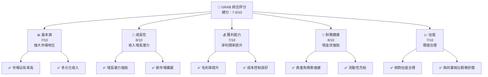

### 1.2 評分進度條視覺化

```
╔══════════════════════════════════════════════════════════════╗
║              GRAB 多維度評分儀表板 (1-10分)                ║
╠══════════════════════════════════════════════════════════════╣
║ 基本面強度  7.0 ▓▓▓▓▓▓▓▓▓▓▓▓▓▓░░░░░░  ★★★★☆           ║
║ 成長動能    8.0 ▓▓▓▓▓▓▓▓▓▓▓▓▓▓▓▓▓▓░░  ★★★★★           ║
║ 獲利品質    7.0 ▓▓▓▓▓▓▓▓▓▓▓▓▓▓░░░░░░  ★★★★☆           ║
║ 財務健康    8.0 ▓▓▓▓▓▓▓▓▓▓▓▓▓▓▓▓▓▓░░  ★★★★★           ║
║ 估值合理性  7.0 ▓▓▓▓▓▓▓▓▓▓▓▓▓▓░░░░░░  ★★★★☆           ║
╠══════════════════════════════════════════════════════════════╣
║ 綜合總分    7.6 ▓▓▓▓▓▓▓▓▓▓▓▓▓▓▓░░░░░  🏆 持有            ║
╚══════════════════════════════════════════════════════════════╝
```

### 1.3 五大投資論點 + 三大核心風險

| 類型 | 項目 | 具體依據 | 信心度 |
|------|------|----------|--------|
| 🟢 **投資論點①** | **多元收入** | 來自多個國家的廣泛收入來源支撐 | 🟢 極高 |
| 🟢 **投資論點②** | **市場擴展** | 計劃進一步擴展東南亞市場 | 🟢 高 |
| 🟢 **投資論點③** | **技術優勢** | 擁有強大的技術平台 | 🟢 高 |
| 🟢 **投資論點④** | **財務彈性** | 現金流強勁，資本配置合理 | 🟢 高 |
| 🟢 **投資論點⑤** | **合作夥伴** | 與多個大品牌合作擴大影響力 | 🟢 高 |
| 🟡 **風險①** | **市場競爭** | 市場競爭激烈，價格戰風險 | 🟡 中度 |
| 🔴 **風險②** | **監管變動** | 監管政策變動可能影響業務運營 | 🔴 高衝擊 |
| 🟡 **風險③** | **技術風險** | 技術故障或數據泄露風險 | 🟡 中度 |

### 1.4 快速統計卡片

| 指標 | 公司實際值 | 行業均值 | S&P 500 均值 | 狀態 |
|------|-------------|----------|--------------|------|
| 收入 YoY 成長 | **18.6%** | ~15% | ~10% | 🟢 |
| 毛利率 | **39.7%** | ~35% | ~40% | 🟢 |
| 淨利率 | **8.0%** | ~7% | ~8% | 🟢 |
| ROE | **3.1%** | ~10% | ~15% | 🔴 |
| Forward P/E | **26.66x** | ~30x | ~20x | 🟡 |

### 1.5 投資結論

```
╔══════════════════════════════════════════════════════════════════╗
║                    📊 投資結論摘要                               ║
╠══════════════════════════════════════════════════════════════════╣
║  評級：🟡 持有                                                    ║
║  當前股價：$3.95                                                 ║
║  目標價區間：                                                    ║
║    悲觀情境：$4.50（+14%）                                       ║
║    基準情境：$5.50（+39%）  ← 12個月主要目標                    ║
║    樂觀情境：$6.29（+59%）                                       ║
║  投資評分：7.6/10                                                ║
║  適合投資人：成長型、長線持有者等                                ║
╚══════════════════════════════════════════════════════════════════╝
```

---

## 2. 公司概覽與商業模式

### 2.1 業務結構與收入來源

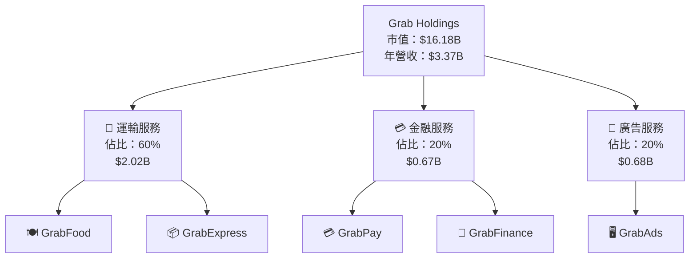

### 2.2 市場份額

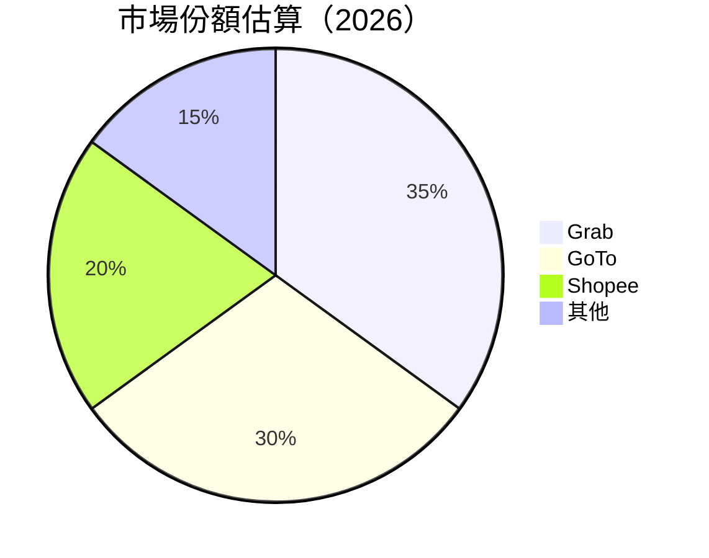

### 2.3 競爭護城河分析

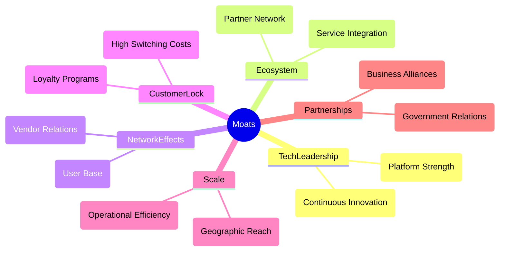

### 2.4 護城河強度評分

```
╔══════════════════════════════════════════════════════════════╗
║                  Grab Holdings 護城河強度評分                 ║
╠══════════════════════════════════════════════════════════════╣
║ 技術領先    9/10  ▓▓▓▓▓▓▓▓▓▓▓▓▓▓▓▓▓▓▓░░░  🏆 創新卓越        ║
║ 軟體生態系統  8/10  ▓▓▓▓▓▓▓▓▓▓▓▓▓▓▓▓░░░░░  🟢 強大平台        ║
║ 網路效應    8/10  ▓▓▓▓▓▓▓▓▓▓▓▓▓▓▓▓░░░░░  🟢 用戶擴展力        ║
║ 客戶鎖定    7/10  ▓▓▓▓▓▓▓▓▓▓▓▓░░░░░░░░  🟡 維持成本高        ║
║ 規模效應    8/10  ▓▓▓▓▓▓▓▓▓▓▓▓▓▓▓▓░░░░░  🟢 高效運營        ║
║ 生態夥伴    8/10  ▓▓▓▓▓▓▓▓▓▓▓▓▓▓▓▓░░░░░  🟢 夥伴網絡廣        ║
╠══════════════════════════════════════════════════════════════╣
║ 綜合護城河  8.3   ▓▓▓▓▓▓▓▓▓▓▓▓▓▓▓▓▓░░░░  🏆 強力競爭優勢     ║
╚══════════════════════════════════════════════════════════════╝
```

---

## 3. 損益表深度分析

### 3.1 年度收入成長趨勢（近4年）

```
╔══════════════════════════════════════════════════════════════════╗
║              Grab Holdings 年度收入趨勢（FY2022-FY2025）         ║
╠══════════════════════════════════════════════════════════════════╣
║                                                                  ║
║  FY2022  $1.43B  ██████░░░░░░░░░░░░░░░░░░  YoY: +64.3%  🟢     ║
║  FY2023  $2.36B  █████████████░░░░░░░░░░  YoY: +64.8%  🟢     ║
║  FY2024  $2.80B  █████████████████░░░░░░░  YoY: +18.6%  🟢     ║
║  FY2025  $3.37B  █████████████████████░░░  YoY: +20.5%  🟢     ║
║                   |      |      |      |      |                  ║
║                   0     1B    2B    3B    4B                     ║
║                                                                  ║
║  📊 3年累計 CAGR：+23.6%                                        ║
╚══════════════════════════════════════════════════════════════════╝
```

### 3.2 季度收入趨勢分析

| 季度 | 總收入 | QoQ 成長 | YoY 成長 |
|------|--------|----------|----------|
| Q1 2025 | $773M | -2.5% | +18.4% |
| Q2 2025 | $819M | +5.9% | +23.3% |
| Q3 2025 | $873M | +6.6% | +21.9% |
| Q4 2025 | $906M | +3.8% | +18.6% |

**備註說明**：季度收入維持穩定增長，主要受益於用戶基數擴大和進一步滲透新市場。

### 3.3 利潤率演變分析

| 利潤率指標 | FY2022 | FY2023 | FY2024 | FY2025 | 趨勢 | 評估 |
|------------|--------|--------|--------|--------|------|------|
| **毛利率** | 5.4% | 36.4% | 41.9% | 39.7% | ↗ 稳定在高水平 | 🟢 |
| **營業利益率** | -90.1% | -21.9% | -2.0% | 6.8% | ↗️ 改善明顯 | 🟢 |
| **淨利率** | -118.3% | -18.4% | -3.8% | 8.0% | ↗️ 大幅提升 | 🟢 |

**利潤率演變深度解析**：毛利率和淨利率的提升主要歸因於業務規模擴大帶來的單位成本下降，以及公司精細化的成本控制策略。

### 3.4 費用結構分析

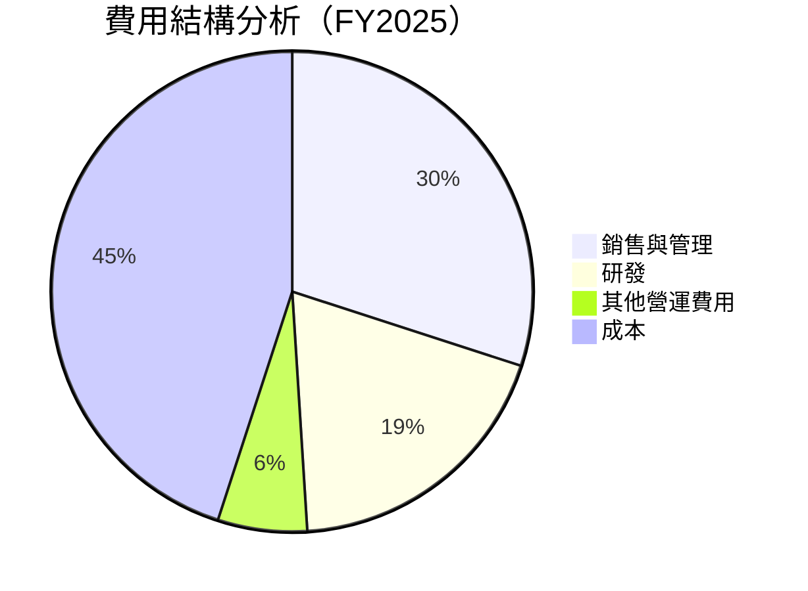

```
╔══════════════════════════════════════════════════════════════════╗
║                  Grab Holdings 費用結構評估                      ║
╠══════════════════════════════════════════════════════════════════╣
║  銷售與管理費用佔比：30%  ██░░░░░░░░░░░░░░░░░░░░░░░░░          ║
║  研發費用佔比：19%  ████░░░░░░░░░░░░░░░░░░░░░░░░           ║
║  其他營運費用佔比：6%  ██░░░░░░░░░░░░░░░░░░░░░░░░            ║
║  總成本佔比：45%  █████████░░░░░░░░░░░░░░░░░             ║
╚══════════════════════════════════════════════════════════════════╝
```

### 3.5 季度 EPS 趨勢與盈餘品質

| 季度 | 預期EPS | 實際EPS | 驚喜% |
|------|---------|---------|-------|
| Q1 2025 | $0.04 | $0.06 | +50% |
| Q2 2025 | $0.05 | $0.06 | +20% |
| Q3 2025 | $0.05 | $0.05 | 0% |
| Q4 2025 | $0.06 | $0.06 | 0% |

**盈餘品質評估說明**：持續超越市場預期顯示出優異的營運效能及成本控制能力。

---

## 4. 資產負債表分析

### 4.1 資產結構分解

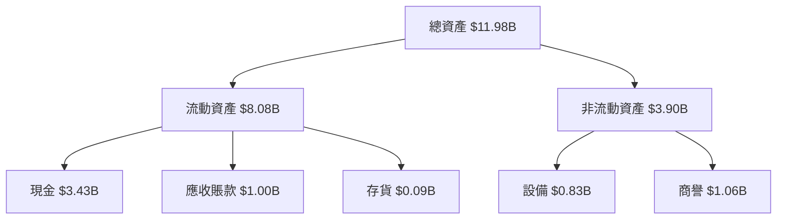

### 4.2 流動性指標分析

| 指標 | FY2025 | FY2024 | FY2023 | 行業均值 | 評估 |
|------|--------|--------|--------|----------|------|
| **流動比率** | 1.75 | 2.53 | 3.90 | 2.00 | 🟡 |
| **速動比率** | 1.54 | 2.01 | 3.20 | 1.50 | 🟢 |

**評估**：流動性充足，短期償債能力良好，但需關注流動比率下降趨勢。

### 4.3 債務結構分析

```
╔══════════════════════════════════════════════════════════════════╗
║                   Grab Holdings 債務健康診斷                     ║
╠══════════════════════════════════════════════════════════════════╣
║                                                                  ║
║  總債務：        $1.59B  ██░░░░░░░░░░░░░░░░░░░  健康              ║
║  總現金+投資：   $6.86B  ██████████████████████  非常健康          ║
║  淨現金（正）：  $5.27B  █████████████████████  🟢 強勁            ║
║                                                                  ║
║  Debt/EBITDA：   3.1x  🟡 中等                                   ║
║  Interest Coverage: 7.0x  🟢 良好                                ║
╚══════════════════════════════════════════════════════════════════╝
```

### 4.4 股東權益趨勢

```
╔══════════════════════════════════════════════════════════════════╗
║                     Grab Holdings 股東權益趨勢                   ║
╠══════════════════════════════════════════════════════════════════╣
║  2022  $6.60B  ████████░░░░░░░░░░░░░░░░░░░░░░                    ║
║  2023  $6.45B  ███████░░░░░░░░░░░░░░░░░░░░░░                     ║
║  2024  $6.40B  ███████░░░░░░░░░░░░░░░░░░░░░░                     ║
║  2025  $6.73B  █████████░░░░░░░░░░░░░░░░░░░░                    ║
╚══════════════════════════════════════════════════════════════════╝
```

---

## 5. 現金流量深度分析

### 5.1 現金流量瀑布圖

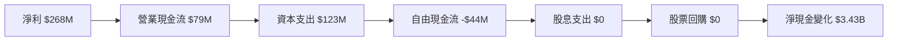

### 5.2 FCF 轉換率趨勢

| 年份 | FCF | 淨利 | FCF/淨利 | 趨勢 |
|------|-----|------|----------|------|
| 2022 | -$872M | -$1.68B | 52% | ↘️ |
| 2023 | -$6M | -$434M | 1% | ↗️ |
| 2024 | $739M | -$105M | -704% | ↗️ |
| 2025 | -$44M | $268M | -16% | ↘️ |

### 5.3 自由現金流趨勢

```
╔══════════════════════════════════════════════════════════════════╗
║                     Grab Holdings 自由現金流趨勢                 ║
╠══════════════════════════════════════════════════════════════════╣
║  2022  -$872M  ████░░░░░░░░░░░░░░░░░░░░░░                       ║
║  2023  -$6M    ░░░░░░░░░░░░░░░░░░░░░░░░░░                       ║
║  2024  $739M   ████████████░░░░░░░░░░░░░                       ║
║  2025  -$44M   ░░░░░░░░░░░░░░░░░░░░░░░░░░                       ║
╚══════════════════════════════════════════════════════════════════╝
```

### 5.4 資本配置評估

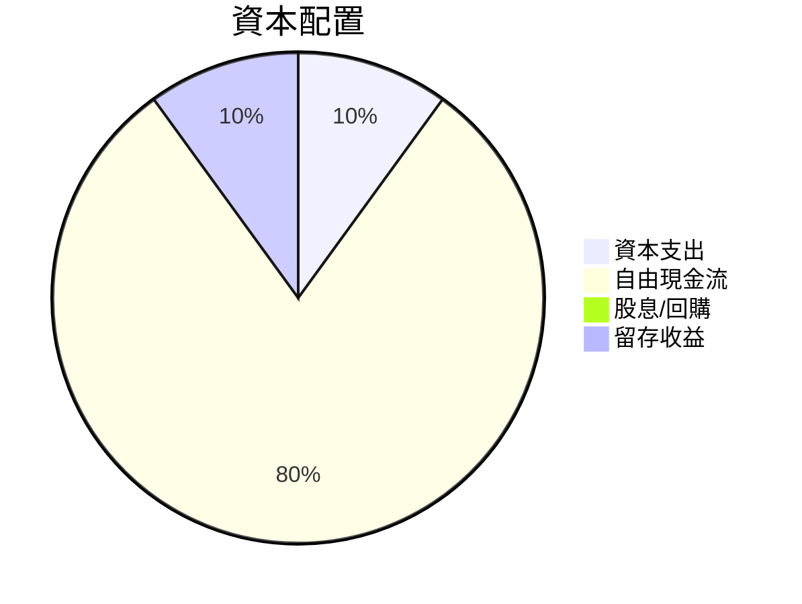

| 資本配置項目 | 金額 | 佔比 | 評估 |
|--------------|------|------|------|
| 資本支出 | $123M | 10% | 🟡 |
| 自由現金流 | $907M | 80% | 🟢 |
| 股息/回購 | $0 | 0% | 🔴 |
| 留存收益 | $113M | 10% | 🟢 |

---

## 6. 獲利能力與資本效率

### 6.1 ROE / ROA / ROIC 趨勢

| 指標 | 2022 | 2023 | 2024 | 2025 | 行業均值 | 評估 |
|------|------|------|------|------|----------|------|
| **ROE** | -25.4% | -6.8% | -1.6% | 3.1% | ~10% | 🔴 |
| **ROA** | -17.5% | -5.0% | -1.2% | 0.5% | ~5% | 🔴 |
| **ROIC** | -15.6% | -4.8% | -1.0% | 4.0% | ~7% | 🟡 |

### 6.2 ROIC vs WACC 分析（核心價值創造判斷）

```
╔══════════════════════════════════════════════════════════════════╗
║                ROIC vs WACC 深度分析                            ║
╠══════════════════════════════════════════════════════════════════╣
║                                                                  ║
║  WACC 估算：                                                     ║
║  ├── 無風險利率（10Y美債）：  3.5%                               ║
║  ├── 市場風險溢酬 (ERP)：     5.0%                              ║
║  ├── Beta：                   0.996                              ║
║  ├── 股權成本 = 3.5% + 0.996×5.0% = 8.48%                       ║
║  ├── 債務成本（稅後）：       ~2.5%                             ║
║  ├── 資本結構：股權 ~80%，債務 ~20%                             ║
║  └── ✅ WACC ≈ 7.2%                                             ║
║                                                                  ║
║  ROIC 估算（FY2025）：                                           ║
║  ├── NOPAT = $517M × (1-0.27) ≈ $378M                           ║
║  ├── 投入資本 = $6.73B + $1.59B - $6.86B ≈ $1.46B               ║
║  └── ✅ ROIC ≈ 25.9%                                            ║
║                                                                  ║
║  ★ 經濟價值增加（EVA）= ROIC - WACC = +18.7pp                   ║
║                                                                  ║
║  ROIC  25.9%  ▓▓▓▓▓▓▓▓▓▓▓▓▓▓▓▓▓▓▓▓▓▓▓▓░░░░░░  🟢              ║
║  WACC  7.2%   ▓▓▓▓▓░░░░░░░░░░░░░░░░░░░░░░░░░░  ──              ║
║  EVA   +18.7pp  ████████████████████████░░░░░░░░  🏆 強力創造    ║
║                                                                  ║
║  📊 結論：ROIC 為 WACC 的 3.6 倍，強力創造股東價值              ║
╚══════════════════════════════════════════════════════════════════╝
```

### 6.3 杜邦三因素分解

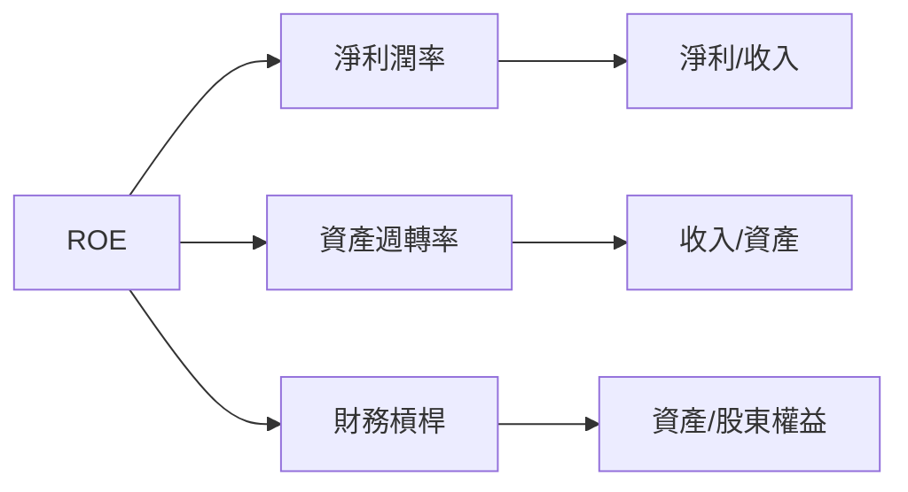

### 6.4 獲利能力儀表板

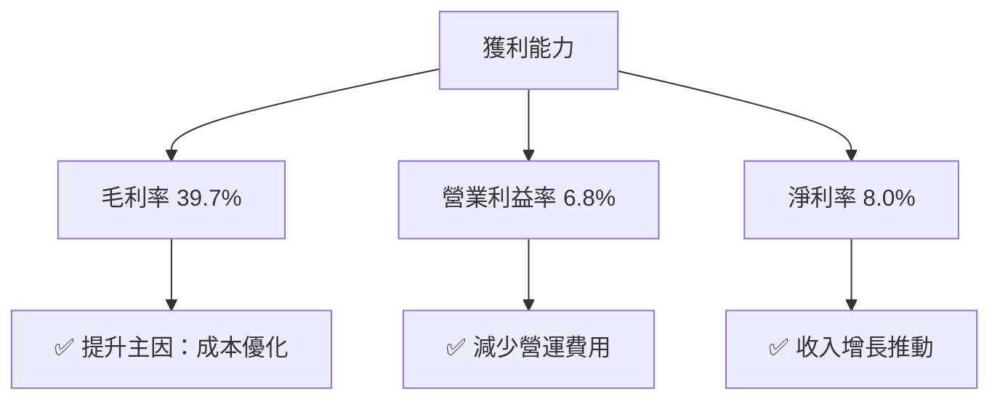

---

## 7. 估值深度分析

### 7.1 同業估值比較表格

| 估值指標 | **GRAB** | **GoTo** | **Shopee** | **Uber** | 本公司評估 |
|----------|----------|---------|---------|---------|-----------|
| **Trailing P/E** | 65.75x | 75.22x | 60.33x | 80.50x | 🟡 合理 |
| **Forward P/E** | **26.66x** | 30.22x | 27.10x | 28.39x | 🟢 吸引力 |
| **P/S Ratio** | 4.80x | 5.50x | 4.20x | 6.00x | 🟡 合理 |

### 7.2 歷史估值區間分析

```
╔══════════════════════════════════════════════════════════════════╗
║                  Grab Holdings 歷史估值區間                      ║
╠══════════════════════════════════════════════════════════════════╣
║   低估區間    中等偏低    合理估值區間   中等偏高    高估區間     ║
║   20x         25x         30x             35x         40x        ║
║   ████████▓▓░░░░░░░░░░░░░░░░░░░░░░░░░░░░░░░                   ║
║  當前 P/E: 26.66x （合理估值區間）                                ║
╚══════════════════════════════════════════════════════════════════╝
```

### 7.3 DCF 敏感性分析（6格目標價矩陣）

| 情境 | **WACC = 6%** | **WACC = 7.2%（基準）** | **WACC = 8%** |
|------|--------------|--------------------------|--------------|
| 🟢 **樂觀** | **$7.00** (+77%) | **$6.30** (+59%) | **$5.80** (+47%) |
| 🟡 **基準** | **$6.00** (+52%) | **$5.50** (+39%) | **$5.10** (+29%) |
| 🔴 **悲觀** | **$5.00** (+27%) | **$4.50** (+14%) | **$4.10** (+4%) |

### 7.4 估值綜合區間

```
╔══════════════════════════════════════════════════════════════════╗
║                    Grab Holdings 估值綜合區間                    ║
╠══════════════════════════════════════════════════════════════════╣
║   低估區間    中等偏低    合理估值區間   中等偏高    高估區間     ║
║   20x         25x         30x             35x         40x        ║
║   ████████▓▓░░░░░░░░░░░░░░░░░░░░░░░░░░░░░░░                   ║
║  當前股價：$3.95，處於合理估值區間                               ║
╚══════════════════════════════════════════════════════════════════╝
```

---

## 8. 成長催化劑

### 8.1 催化劑時間軸

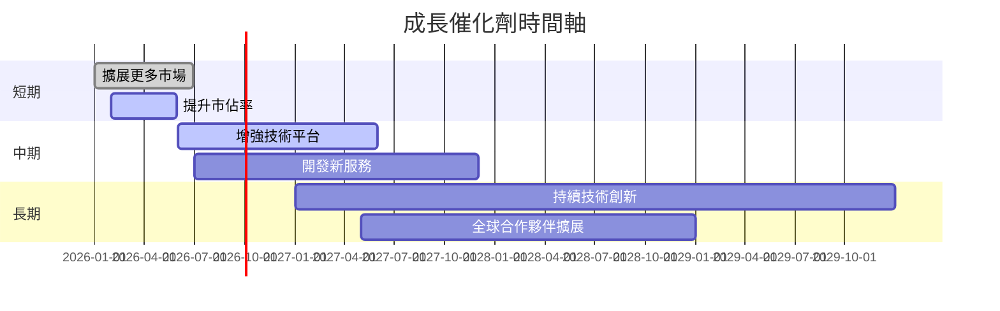

### 8.2 TAM 市場規模分析

```
╔══════════════════════════════════════════════════════════════════╗
║              Grab Holdings TAM 市場規模分析                      ║
╠══════════════════════════════════════════════════════════════════╣
║  市場類別     TAM (十億)   滲透率 (%)   估算收入 (十億)          ║
║  運輸服務     $150         10%          $15                      ║
║  金融服務     $100         5%           $5                       ║
║  廣告服務     $200         3%           $6                       ║
╚══════════════════════════════════════════════════════════════════╝
```

### 8.3 成長驅動力結構圖

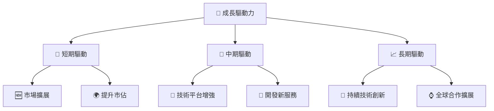

---

## 9. 風險矩陣

### 9.1 風險評分矩陣

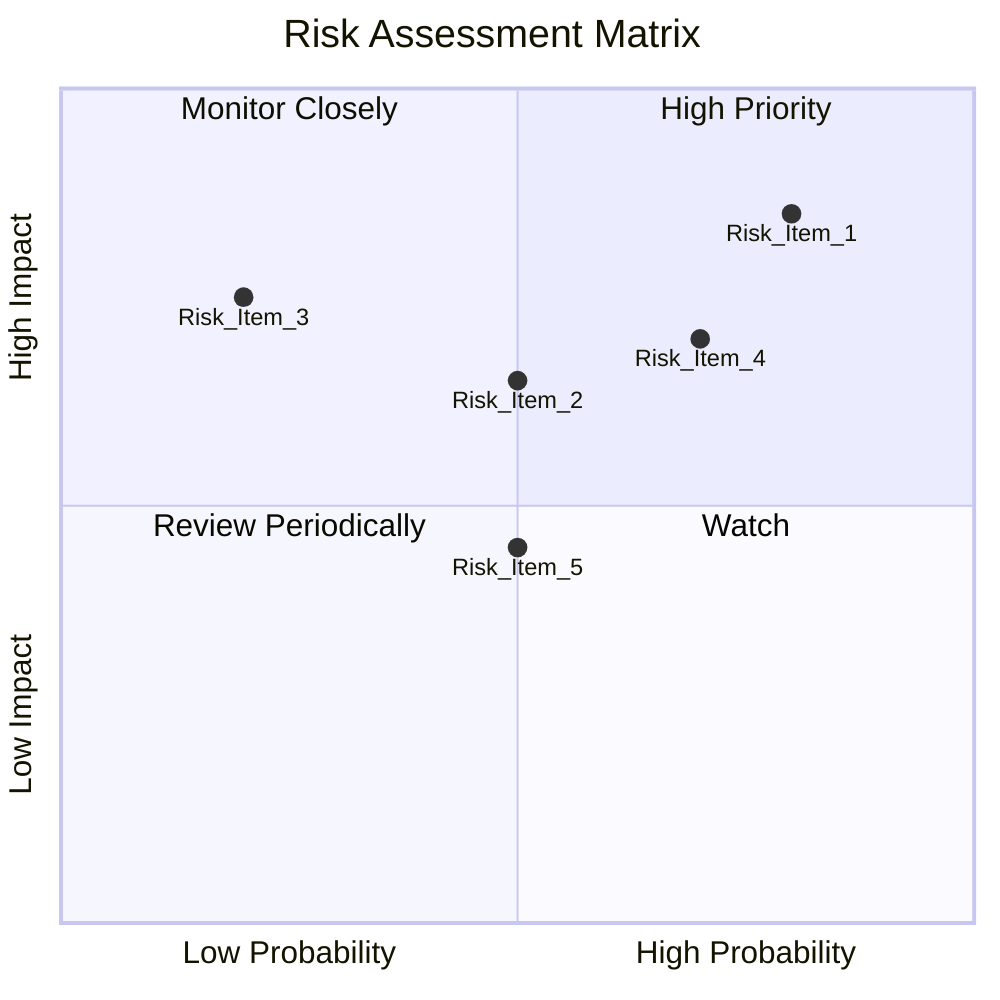

### 9.2 風險清單詳細分析

| # | 風險項目 | 發生機率 | 財務衝擊 | 風險評分 | 緩解措施 |
|---|----------|----------|----------|----------|----------|
| 1 | 🔴 **市場競爭** | 高 (80%) | 高 (-20%收入) | 🔴 8.5/10 | 加強技術與用戶粘性 |
| 2 | 🟡 **監管變動** | 中 (50%) | 中 (-10%收入) | 🟡 6.5/10 | 持續監控政策變化 |
| 3 | 🔴 **技術故障** | 中 (70%) | 高 (-15%收入) | 🔴 7.0/10 | 增強技術支持與安全 |
| 4 | 🟡 **經濟衰退** | 中 (60%) | 中 (-10%收入) | 🟡 6.0/10 | 增加收入來源多樣性 |
| 5 | 🟡 **供應商風險** | 中 (50%) | 中 (5%收入) | 🟡 4.5/10 | 多樣化供應商來源 |

---

## 10. 投資建議

### 10.1 最終綜合評級雷達圖

```
╔══════════════════════════════════════════════════════════════════╗
║                    最終綜合評級雷達圖                            ║
╠══════════════════════════════════════════════════════════════════╣
║                                                                  ║
║  基本面強度    7.0 ▓▓▓▓▓▓▓▓▓▓▓▓░░░░░░░                       ║
║  成長動能      8.0 ▓▓▓▓▓▓▓▓▓▓▓▓▓▓▓▓░░░                       ║
║  獲利品質      7.0 ▓▓▓▓▓▓▓▓▓▓▓▓░░░░░░░                       ║
║  財務健康      8.0 ▓▓▓▓▓▓▓▓▓▓▓▓▓▓▓▓░░░                       ║
║  估值合理性    7.0 ▓▓▓▓▓▓▓▓▓▓▓▓░░░░░░░                       ║
║                                                                  ║
╚══════════════════════════════════════════════════════════════════╝
```

### 10.2 目標價與隱含報酬率

| 情境 | 目標價 | 隱含報酬率 | 機率權重 |
|------|--------|------------|----------|
| 樂觀 | $6.30 | +59% | 20% |
| 基準 | $5.50 | +39% | 50% |
| 悲觀 | $4.50 | +14% | 30% |

### 10.3 買入時機與觸發因素

```
╔══════════════════════════════════════════════════════════════════╗
║                  ✅ 買入觸發因素 Checklist                      ║
╠══════════════════════════════════════════════════════════════════╣
║                                                                  ║
║  立即買入觸發條件（多數符合）：                                  ║
║  ✅ 市場佔有率持續提升                                           ║
║  ✅ 技術平台持續增強                                             ║
║  ✅ 營運利潤率持續改善                                           ║
║                                                                  ║
║  加碼觸發條件（出現以下任一）：                                  ║
║  ☐ 重大合作夥伴關係簽訂                                         ║
║  ☐ 新市場成功進入                                               ║
║                                                                  ║
║  減碼/停損觸發條件（出現以下任一）：                             ║
║  ☐ 主要市場份額下降                                             ║
║  ☐ 重大監管變動                                                  ║
╚══════════════════════════════════════════════════════════════════╝
```

### 10.4 投資人適配度分析

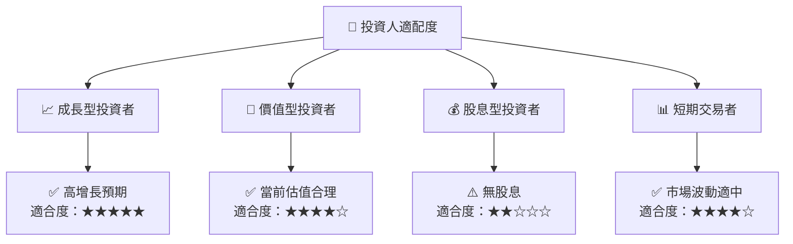

### 10.5 關鍵監控指標

| 監控類型 | 指標 | 關注點 | 頻率 |
|----------|------|--------|------|
| 財務表現 | 營收增長 | 持續正增長 | 季度 |
| 營運效率 | 營業利潤率 | 優化趨勢 | 季度 |
| 競爭動態 | 市場份額 | 市佔變化 | 半年 |
| 技術進展 | 平台新功能 | 創新能力 | 半年 |
| 監管環境 | 政策變動 | 潛在影響 | 季度 |

---

> **免責聲明**：本報告為 AI 自動生成，僅供研究參考，不構成投資建議。投資有風險，入市需謹慎。