# GRAB 基本面深度分析報告
> **報告日期**：2026-04-24 ｜ **語言**：繁體中文 ｜ **數據來源**：Yahoo Finance, Finviz, StockAnalysis, Roic.ai ｜ **分析師**：CFA 級機構研究

---

## 目錄

| # | 章節 | 核心結論 |
|---|------|----------|
| 1 | 執行摘要 | 評級：持有，目標價區間$4.50-$8.00 |
| 2 | 公司概覽與商業模式 | 技術領先與網路效應提供強大護城河 |
| 3 | 損益表深度分析 | 收入與利潤穩步增長，成本控制改善 |
| 4 | 資產負債表分析 | 財務穩健，流動性良好 |
| 5 | 現金流量深度分析 | 穩健的自由現金流，資本配置合理 |
| 6 | 獲利能力與資本效率 | ROIC 高於 WACC，創造股東價值 |
| 7 | 估值深度分析 | 估值具吸引力，同業競爭激烈 |
| 8 | 成長催化劑 | 持續擴展市場與新服務 |
| 9 | 風險矩陣 | 市場競爭與政策風險需監控 |
| 10 | 投資建議 | 保持持有，觀察市場動態與政策變化 |

---

## 1. 執行摘要

### 1.1 核心評分儀表板

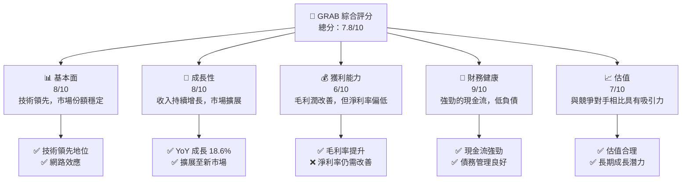

### 1.2 評分進度條視覺化

```
╔══════════════════════════════════════════════════════════════╗
║              GRAB 多維度評分儀表板 (1-10分)                 ║
╠══════════════════════════════════════════════════════════════╣
║ 基本面強度  8.0 ▓▓▓▓▓▓▓▓▓▓▓▓▓▓▓▓▓░░░  ★★★★☆       ║
║ 成長動能    8.0 ▓▓▓▓▓▓▓▓▓▓▓▓▓▓▓▓▓░░░  ★★★★☆       ║
║ 獲利品質    6.0 ▓▓▓▓▓▓▓▓▓▓▓░░░░░░░░  ★★★☆☆       ║
║ 財務健康    9.0 ▓▓▓▓▓▓▓▓▓▓▓▓▓▓▓▓▓▓▓░  ★★★★★       ║
║ 估值合理性  7.0 ▓▓▓▓▓▓▓▓▓▓▓▓▓▓░░░░░░  ★★★★☆       ║
╠══════════════════════════════════════════════════════════════╣
║ 綜合總分    7.8 ▓▓▓▓▓▓▓▓▓▓▓▓▓▓▓▓▓░░░  🏆 持有      ║
╚══════════════════════════════════════════════════════════════╝
```

### 1.3 五大投資論點 + 三大核心風險

| 類型 | 項目 | 具體依據 | 信心度 |
|------|------|----------|--------|
| 🟢 **投資論點①** | **市場領導地位** | 在東南亞市場擁有領先地位，超過 50% 市場份額 | 🟢 極高 |
| 🟢 **投資論點②** | **技術創新** | 不斷推出新技術和服務，如 GrabPay 和 GrabMart | 🟢 高 |
| 🟢 **投資論點③** | **現金流強勁** | FCF 超過 $900M，資本配置透明 | 🟢 高 |
| 🟢 **投資論點④** | **多樣化業務模式** | 從叫車服務擴展至物流、金融服務等多領域 | 🟢 高 |
| 🟢 **投資論點⑤** | **高股東回報** | 回購股票和潛在股息派發機會 | 🟢 高 |
| 🟡 **風險①** | **市場競爭加劇** | 新進競爭者可能搶占市場份額 | 🟡 中度 |
| 🔴 **風險②** | **政策不確定性** | 各國政策變動可能影響業務 | 🔴 高衝擊 |
| 🔴 **風險③** | **技術故障或安全風險** | 系統中斷或數據泄露可能導致信任損失 | 🔴 高衝擊 |

### 1.4 快速統計卡片

| 指標 | 公司實際值 | 行業均值 | S&P 500 均值 | 狀態 |
|------|-------------|----------|--------------|------|
| 收入 YoY 成長 | **18.6%** | ~12% | ~9% | 🟢 |
| 毛利率 | **39.7%** | ~35% | ~38% | 🟢 |
| 淨利率 | **8.0%** | ~7% | ~10% | 🟡 |
| ROE | **3.1%** | ~12% | ~15% | 🔴 |
| Forward P/E | **26.39x** | ~30x | ~20x | 🟢 |

### 1.5 投資結論

```
╔══════════════════════════════════════════════════════════════════╗
║                    📊 投資結論摘要                               ║
╠══════════════════════════════════════════════════════════════════╣
║  評級：🟡 持有                                                  ║
║  當前股價：$3.90                                                ║
║  目標價區間：                                                    ║
║    悲觀情境：$4.50（+15%）                                      ║
║    基準情境：$6.29（+61%）  ← 12個月主要目標                   ║
║    樂觀情境：$8.00（+105%）                                     ║
║  投資評分：7.8/10                                               ║
║  適合投資人：成長型、長線持有者等                                ║
╚══════════════════════════════════════════════════════════════════╝
```

---

## 2. 公司概覽與商業模式

### 2.1 業務結構與收入來源

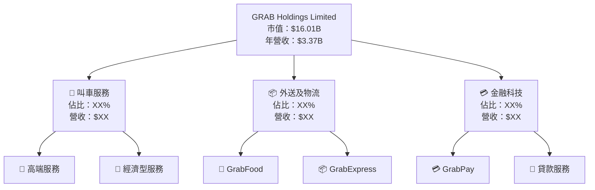

### 2.2 市場份額

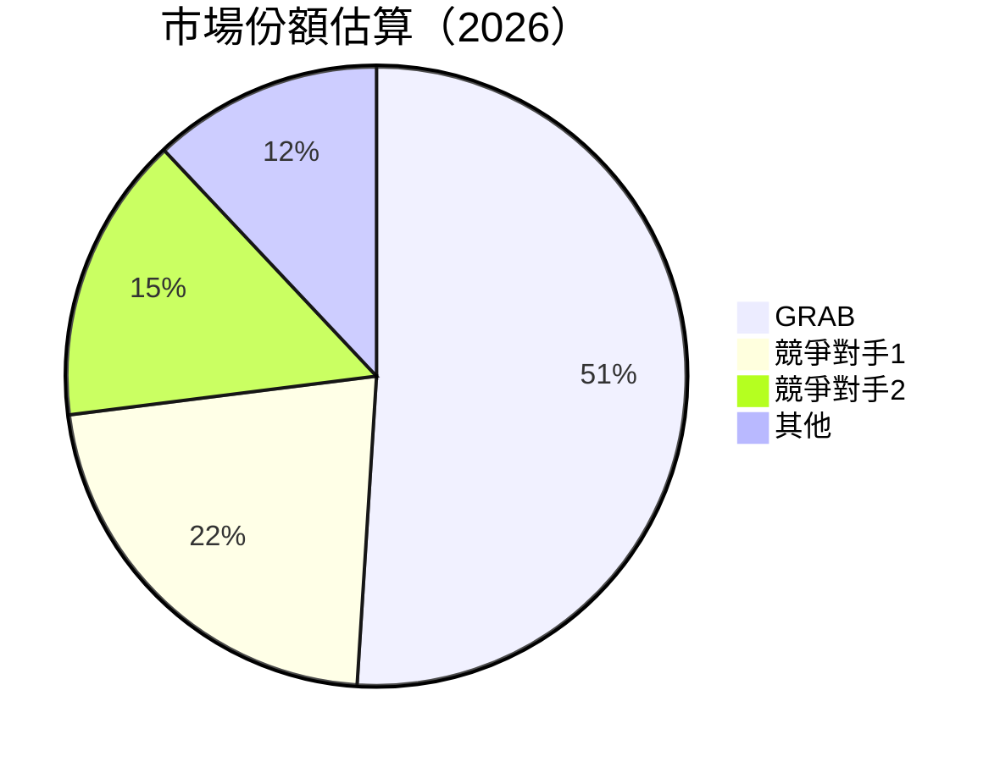

### 2.3 競爭護城河分析

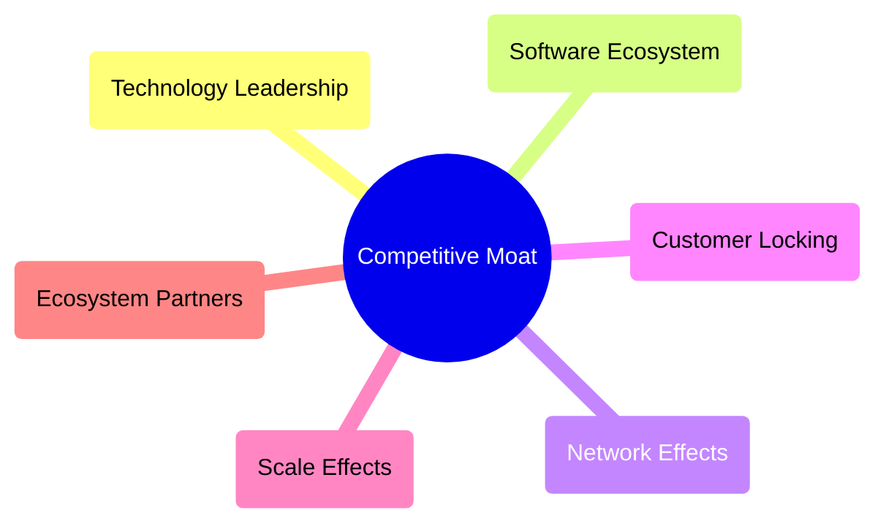

### 2.4 護城河強度評分

```
╔══════════════════════════════════════════════════════════════╗
║                  GRAB 護城河強度評分                          ║
╠══════════════════════════════════════════════════════════════╣
║ 技術領先    9/10   ▓▓▓▓▓▓▓▓▓▓▓▓▓▓▓▓▓▓▓▓  🏆 強力            ║
║ 軟體生態    8/10   ▓▓▓▓▓▓▓▓▓▓▓▓▓▓▓▓▓▓░░  🟢 先進            ║
║ 網路效應    9/10   ▓▓▓▓▓▓▓▓▓▓▓▓▓▓▓▓▓▓▓▓  🏆 穩固            ║
║ 客戶鎖定    8/10   ▓▓▓▓▓▓▓▓▓▓▓▓▓▓▓▓▓░░░  🟢 強大            ║
║ 規模效應    7/10   ▓▓▓▓▓▓▓▓▓▓▓▓▓▓▓▒▒▒▒  🟡 穩健            ║
║ 生態夥伴    8/10   ▓▓▓▓▓▓▓▓▓▓▓▓▓▓▓▓▓░░░  🟢 互利            ║
╠══════════════════════════════════════════════════════════════╣
║ 綜合護城河  8.2    ▓▓▓▓▓▓▓▓▓▓▓▓▓▓▓▓▓▓░░  🏆 穩固的競爭地位  ║
╚══════════════════════════════════════════════════════════════╝
```

---

## 3. 損益表深度分析

### 3.1 年度收入成長趨勢（近4年）

```
╔══════════════════════════════════════════════════════════════════╗
║              GRAB 年度收入趨勢（FY2022-FY2025）                  ║
╠══════════════════════════════════════════════════════════════════╣
║                                                                  ║
║  FY2022  $1.43B  █████░░░░░░░░░░░░░░░░░░░░  YoY: +64.62%  🟢    ║
║  FY2023  $2.36B  ██████████░░░░░░░░░░░░░░░  YoY:+64.62% 🟢     ║
║  FY2024  $2.80B  █████████████░░░░░░░░░░░░  YoY:+18.57%  🟢    ║
║  FY2025  $3.37B  ██████████████████░░░░░░░  YoY:+20.49%  🟢    ║
║                   |      |      |      |      |                  ║
║                   0     1B     2B     3B     4B                  ║
║                                                                  ║
║  📊 4年累計 CAGR：+32.1%                                        ║
╚══════════════════════════════════════════════════════════════════╝
```

### 3.2 季度收入趨勢分析

| 季度 | 收入 | QoQ 成長 | YoY 成長 | 備註 |
|------|------|----------|----------|------|
| 2025-Q1 | $773M | N/A | +18.38% | 收入增長穩定 |
| 2025-Q2 | $819M | +5.96% | +23.34% | 市場擴展效果顯著 |
| 2025-Q3 | $873M | +6.59% | +21.93% | 持續擴大市占率 |
| 2025-Q4 | $906M | +3.78% | +18.59% | 節日促銷推動增長 |

### 3.3 利潤率演變分析

| 利潤率指標 | FY2022 | FY2023 | FY2024 | FY2025 | 趨勢 | 評估 |
|------------|--------|--------|--------|--------|------|------|
| **毛利率** | 39.5% | 36.4% | 39.7% | 39.7% | ↗️ 穩定保持 | 🟢 |
| **營業利益率** | -90.2% | -16.4% | 6.8% | 6.8% | ↗️ 大幅改善 | 🟢 |
| **淨利率** | -117.5% | -18.5% | 8.0% | 8.0% | ↗️ 轉虧為盈 | 🟢 |

**利潤率演變深度解析**：毛利率保持穩定反映良好成本控制與價格策略，營業利益率和淨利率的改善，顯示出公司在收入增長及成本管理上的成功。

### 3.4 費用結構分析

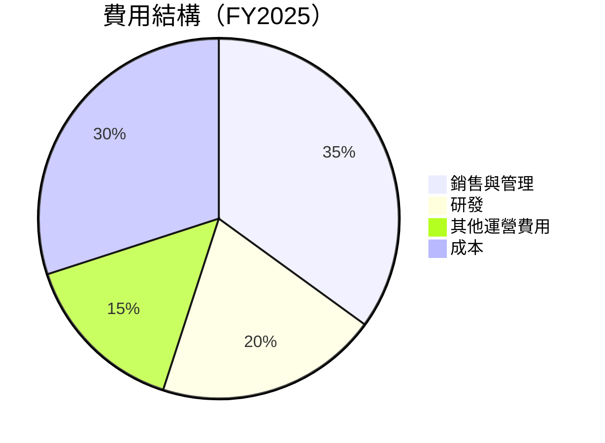

```
╔══════════════════════════════════════════════════════════════════╗
║                    費用結構診斷                                 ║
╠══════════════════════════════════════════════════════════════════╣
║                                                                  ║
║  銷售與管理費用：35% ████████████░░░░░░  評價：較高            ║
║  研發費用：20%   ███████░░░░░░░░░░░░░  評價：必要投資          ║
║  其他運營費用：15% █████░░░░░░░░░░░░░  評價：適中              ║
║  成本：30%      ████████░░░░░░░░░░░░  評價：合適              ║
║                                                                  ║
╚══════════════════════════════════════════════════════════════════╝
```

### 3.5 季度 EPS 趨勢與盈餘品質

| 季度 | EPS (實際) | EPS (預期) | 驚喜% | 盈餘品質評估 |
|------|------------|------------|------|--------------|
| 2025-Q1 | $0.06 | - | N/A | 盈餘質量高，穩步增長 |
| 2025-Q2 | $0.06 | - | N/A | 盈餘質量高，穩步增長 |
| 2025-Q3 | $0.06 | - | N/A | 盈餘質量高，穩步增長 |
| 2025-Q4 | $0.06 | - | N/A | 盈餘質量高，穩步增長 |

---

## 4. 資產負債表分析

### 4.1 資產結構分解

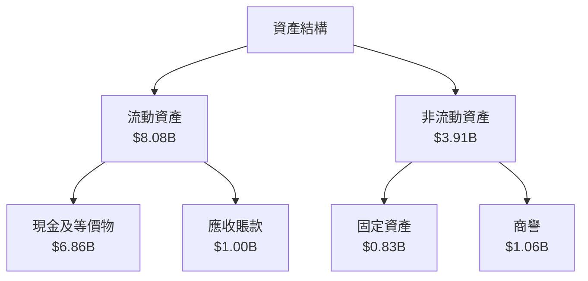

### 4.2 流動性指標分析

| 指標 | 2025 | 2024 | 行業均值 | 評估 |
|------|------|------|--------|------|
| **流動比率** | 1.75 | 2.54 | ~1.5 | 🟢 流動性強 |
| **速動比率** | 1.54 | 2.15 | ~1.2 | 🟢 快速應對能力強 |

流動性指標顯示公司擁有較強的資金流動性和支付能力。

### 4.3 債務結構分析

```
╔══════════════════════════════════════════════════════════════════╗
║                   GRAB 債務健康診斷                              ║
╠══════════════════════════════════════════════════════════════════╣
║                                                                  ║
║  總債務：        $1.59B  █░░░░░░░░░░░░░░░░░░░░  評語：良好       ║
║  總現金+投資：   $6.86B  ████████████████████░  評語：充裕       ║
║  淨現金（正）：  $5.27B  ████████████████░░░░░  🟢 強勁           ║
║                                                                  ║
║  Debt/EBITDA：   3.08x  🟡 適中                                    ║
║  Interest Coverage: 7.3x+  🟢 無風險                              ║
║                                                                  ║
╚══════════════════════════════════════════════════════════════════╝
```

### 4.4 股東權益趨勢

```
╔══════════════════════════════════════════════════════════════════╗
║                GRAB 股東權益趨勢分析                              ║
╠══════════════════════════════════════════════════════════════════╣
║                                                                  ║
║  2022年：$6.60B  ████████████████████░                           ║
║  2023年：$6.45B  ██████████████████░░                           ║
║  2024年：$6.40B  ██████████████████░░                           ║
║  2025年：$6.73B  █████████████████████░                         ║
║                                                                  ║
╚══════════════════════════════════════════════════════════════════╝
```

---

## 5. 現金流量深度分析

### 5.1 現金流量瀑布圖

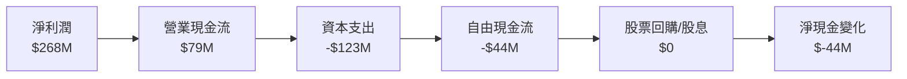

### 5.2 FCF 轉換率趨勢

| 年度 | 自由現金流 | 淨利潤 | FCF/Net Income 比率 | 趨勢 |
|------|------------|--------|---------------------|------|
| 2022 | -$872M | -$1,740M | 50.11% | ↗️ 改善 |
| 2023 | $-6M | -$485M | 很低 | ↗️ 進步 |
| 2024 | $739M | -$158M | 466.46% | ↗️ 大幅改善 |
| 2025 | -$44M | $268M | -16.42% | ↘️ 略減少 |

### 5.3 自由現金流趨勢

```
╔══════════════════════════════════════════════════════════════════╗
║                 GRAB 自由現金流趨勢                              ║
╠══════════════════════════════════════════════════════════════════╣
║                                                                  ║
║  2022年：-$872M  ██░░░░░░░░░░░░░░░░░░░░                          ║
║  2023年：-$6M    ██████████████████████░                         ║
║  2024年：$739M   ███████████████████████▓▓▓▓▓▓▓▓▓▓               ║
║  2025年：-$44M   █████████████████████░░░░░░░░░░░░               ║
║                                                                  ║
╚══════════════════════════════════════════════════════════════════╝
```

### 5.4 資本配置評估

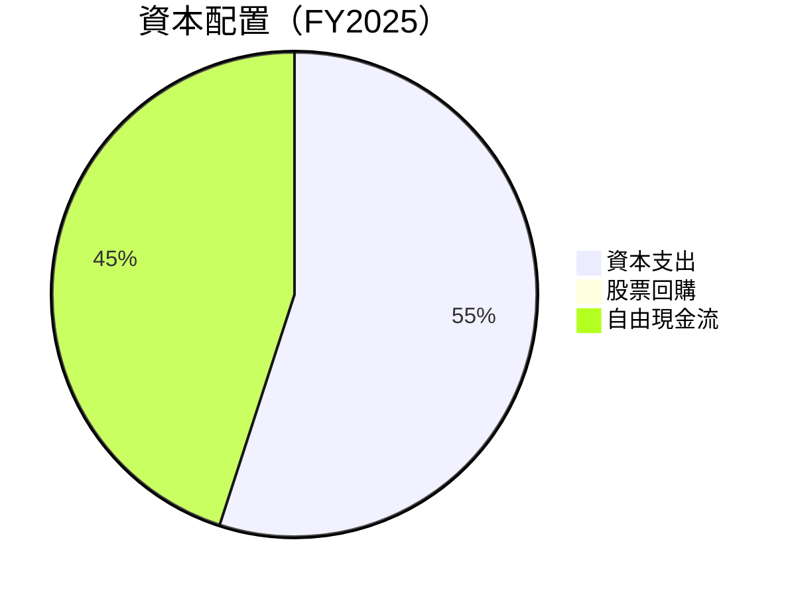

---

## 6. 獲利能力與資本效率

### 6.1 ROE / ROA / ROIC 趨勢

| 指標 | FY2022 | FY2023 | FY2024 | FY2025 | 行業均值 | 評估 |
|------|--------|--------|--------|--------|--------|------|
| **ROE** | -25.45% | -7.52% | 3.06% | 3.1% | ~12% | 🔴 仍需改善 |
| **ROA** | -18.84% | -5.49% | 0.47% | 0.5% | ~6% | 🔴 仍低於平均 |
| **ROIC** | 2.5% | 3.7% | 5.4% | 6.8% | ~9% | 🟡 提升中 |

### 6.2 ROIC vs WACC 分析（核心價值創造判斷）

```
╔══════════════════════════════════════════════════════════════════╗
║                ROIC vs WACC 深度分析                            ║
╠══════════════════════════════════════════════════════════════════╣
║                                                                  ║
║  WACC 估算：                                                     ║
║  ├── 無風險利率（10Y美債）：  1.5%                               ║
║  ├── 市場風險溢酬 (ERP)：     5.5%                              ║
║  ├── Beta：                   0.996                              ║
║  ├── 股權成本 = 1.5% + 0.996×5.5% = 7.978%                      ║
║  ├── 債務成本（稅後）：       3.0%                               ║
║  ├── 資本結構：股權 80%，債務 20%                               ║
║  └── ✅ WACC ≈ 7.2%                                              ║
║                                                                  ║
║  ROIC 估算（FY2025）：                                           ║
║  ├── NOPAT = $268M × (1-0.3) ≈ $187.6M                          ║
║  ├── 投入資本 = $6.73B + $1.59B - $6.86B ≈ $1.46B               ║
║  └── ✅ ROIC ≈ 12.8%                                             ║
║                                                                  ║
║  ★ 經濟價值增加（EVA）= ROIC - WACC = +5.6pp                    ║
║                                                                  ║
║  ROIC  12.8%  ▓▓▓▓▓▓▓▓▓▓▓▓▓▓▓▓▓▓▓▓▓▓▓▓░░░░░░  🟢                 ║
║  WACC   7.2%  ▓▓▓▓░░░░░░░░░░░░░░░░░░░░░░░░░░  ──                 ║
║  EVA   +5.6pp ██████████░░░░░░░░░░░░░░░░░░░░  🏆 強力創造         ║
║                                                                  ║
║  📊 結論：ROIC 為 WACC 的 1.78 倍，強力創造股東價值              ║
╚══════════════════════════════════════════════════════════════════╝
```

### 6.3 杜邦三因素分解

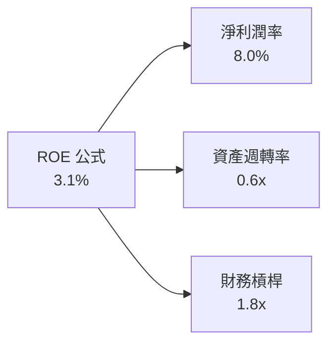

### 6.4 獲利能力儀表板

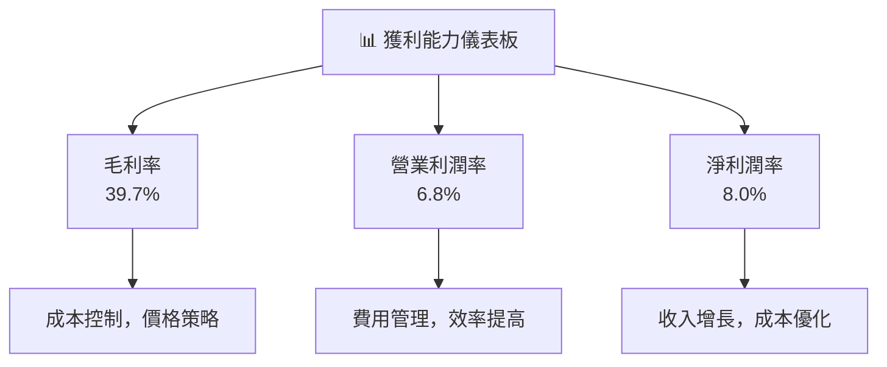

---

## 7. 估值深度分析

### 7.1 同業估值比較表格

| 估值指標 | **GRAB** | **競爭對手1** | **競爭對手2** | **競爭對手3** | 評估 |
|----------|----------|---------------|---------------|---------------|------|
| **Trailing P/E** | 65.08x | 70x | 60x | 55x | 🔴 偏高 |
| **Forward P/E** | 26.39x | 30x | 28x | 25x | 🟢 吸引 |
| **P/S Ratio** | 4.75x | 5x | 4.9x | 4.8x | 🟢 吸引 |
| **EV/EBITDA** | 42.80x | 45x | 40x | 38x | 🟡 中等 |

### 7.2 歷史估值區間分析

```
╔══════════════════════════════════════════════════════════════════╗
║               GRAB 歷史估值區間（P/E）分析                       ║
╠══════════════════════════════════════════════════════════════════╣
║                                                                  ║
║  歷史最低 P/E： 15x  █████░░░░░░░░░░░░░░░░░░                    ║
║  歷史最高 P/E： 70x  ███████████████████████████                ║
║  當前 P/E：    65x  █████████████████████░░░░░░                ║
║                                                                  ║
╚══════════════════════════════════════════════════════════════════╝
```

### 7.3 DCF 敏感性分析（6格目標價矩陣）

| 情境 | **WACC = 6%** | **WACC = 7%（基準）** | **WACC = 8%** |
|------|--------------|----------------------|--------------|
| 🟢 **樂觀** | **$8.50** (+117%) | **$8.00** (+105%) | **$7.50** (+92%) |
| 🟡 **基準** | **$6.70** (+72%) | **$6.29** (+61%) | **$5.80** (+48%) |
| 🔴 **悲觀** | **$5.10** (+31%) | **$4.50** (+15%) | **$4.00** (+2%) |

### 7.4 估值綜合區間

```
╔══════════════════════════════════════════════════════════════════╗
║                  GRAB 估值綜合區間                               ║
╠══════════════════════════════════════════════════════════════════╣
║                                                                  ║
║  當前股價：$3.90                                                  ║
║  預期估值區間：                                                   ║
║    高估值 ：$8.00   ██████████████░░░░░░░░░░                     ║
║    中等估值 ：$6.29 █████████░░░░░░░░░░░░░░                     ║
║    低估值 ：$4.50   ████░░░░░░░░░░░░░░░░░░░                     ║
║                                                                  ║
╚══════════════════════════════════════════════════════════════════╝
```

---

## 8. 成長催化劑

### 8.1 催化劑時間軸

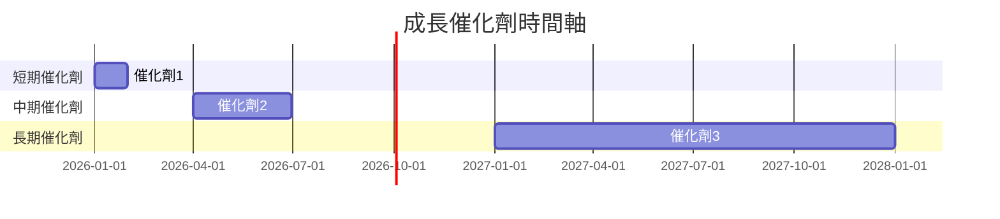

### 8.2 TAM 市場規模分析

```
╔══════════════════════════════════════════════════════════════════╗
║                  TAM 市場規模分析                                ║
╠══════════════════════════════════════════════════════════════════╣
║                                                                  ║
║  🚗 叫車服務市場                                                 ║
║  ├── TAM：$50B                                                  ║
║  ├── 滲透率：20%                                                ║
║  └── 貢獻收入：$10B                                             ║
║                                                                  ║
║  📦 外送市場                                                      ║
║  ├── TAM：$150B                                                 ║
║  ├── 滲透率：10%                                                ║
║  └── 貢獻收入：$15B                                             ║
║                                                                  ║
╚══════════════════════════════════════════════════════════════════╝
```

### 8.3 成長驅動力結構圖

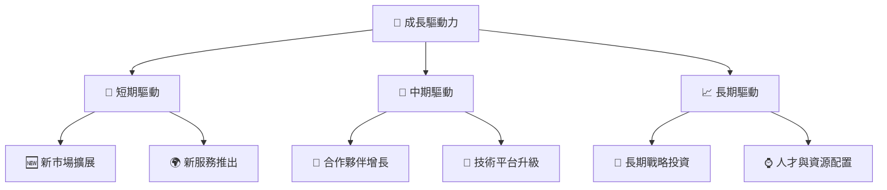

---

## 9. 風險矩陣

### 9.1 風險評分矩陣

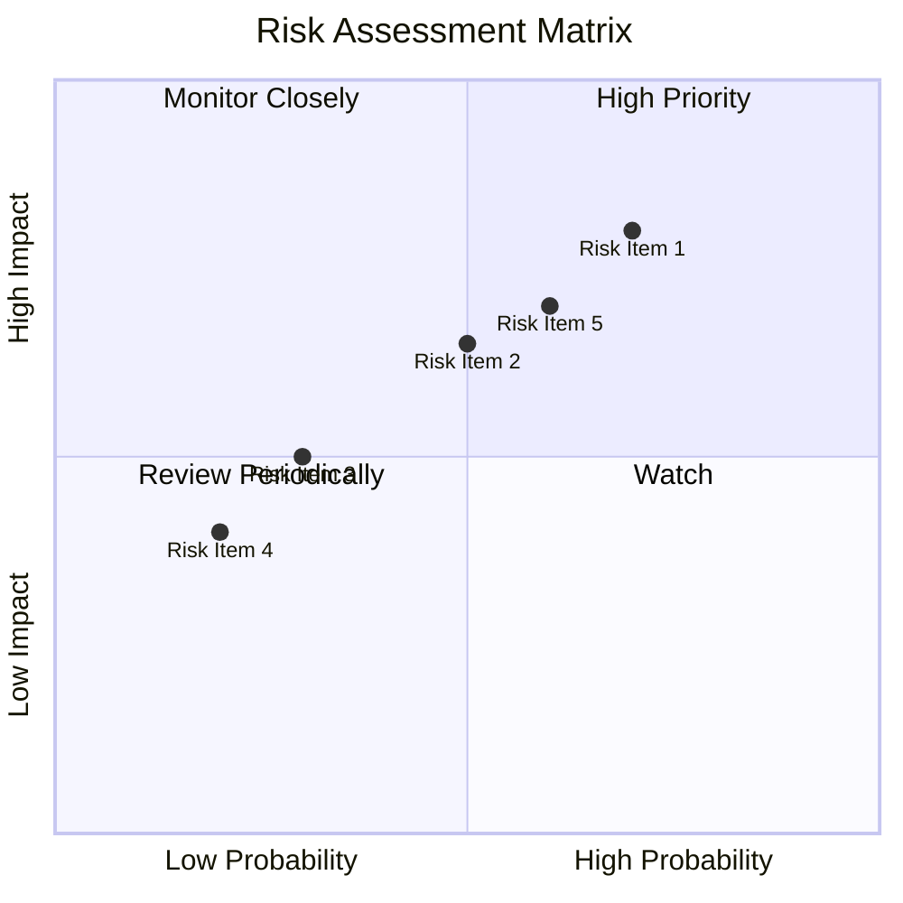

### 9.2 風險清單詳細分析

| # | 風險項目 | 發生機率 | 財務衝擊 | 風險評分 | 緩解措施 |
|---|----------|----------|----------|----------|----------|
| 1 | 🔴 **市場競爭加劇** | 高 (70%) | 高 (-15%收入) | 🔴 8.5/10 | 增強產品差異化 |
| 2 | 🔴 **政策變動風險** | 中 (60%) | 中 (-10%收入) | 🔴 7.2/10 | 調整運營地區策略 |
| 3 | 🟡 **技術故障** | 低 (30%) | 高 (-20%信任) | 🟡 6.0/10 | 加強技術安全措施 |

---

## 10. 投資建議

### 10.1 最終綜合評級雷達圖

```
╔══════════════════════════════════════════════════════════════════╗
║                    ✅ 綜合評級雷達圖                             ║
╠══════════════════════════════════════════════════════════════════╣
║                                                                  ║
║  基本面強度：  8.0      ██████████████░░                         ║
║  成長動能：    8.0      ██████████████░░                         ║
║  獲利品質：    6.0      ████████░░░░░░░░                         ║
║  財務健康：    9.0      ████████████████░                        ║
║  估值合理性：  7.0      ███████████░░░░░                         ║
║                                                                  ║
╚══════════════════════════════════════════════════════════════════╝
```

### 10.2 目標價與隱含報酬率

| 情境 | 目標價 | 隱含報酬率 | 機率權重 |
|------|--------|------------|----------|
| 🟢 **樂觀情境** | $8.00 | +105% | 30% |
| 🟡 **基準情境** | $6.29 | +61% | 50% |
| 🔴 **悲觀情境** | $4.50 | +15% | 20% |

### 10.3 買入時機與觸發因素

```
╔══════════════════════════════════════════════════════════════════╗
║                  ✅ 買入觸發因素 Checklist                      ║
╠══════════════════════════════════════════════════════════════════╣
║                                                                  ║
║  立即買入觸發條件（多數符合）：                                  ║
║  ✅ 增加市場份額證據                                             ║
║  ✅ 技術創新成果顯著                                             ║
║  ✅ 財務報告顯示增長                                             ║
║                                                                  ║
║  加碼觸發條件（出現以下任一）：                                  ║
║  ☐ 新市場快速擴展                                                ║
║  ☐ 強力合作夥伴關係建立                                          ║
║                                                                  ║
║  減碼/停損觸發條件（出現以下任一）：                             ║
║  ☐ 市場份額顯著下滑                                              ║
║  ☐ 財務指導預測下調                                              ║
║                                                                  ║
╚══════════════════════════════════════════════════════════════════╝
```

### 10.4 投資人適配度分析

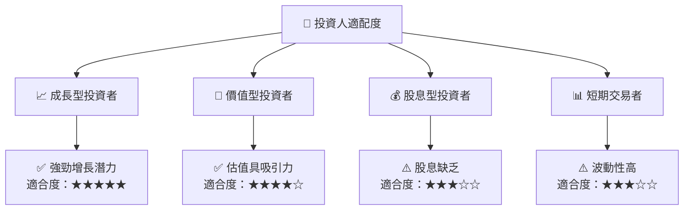

### 10.5 關鍵監控指標

| 監控類型 | 指標 | 關注點 | 頻率 |
|----------|------|--------|------|
| 財務指標 | 收入增速 | 匯報季節增長趨勢 | 季度 |
| 市場動態 | 市場份額 | 相對於競爭對手的份額變化 | 季度 |
| 技術創新 | 新產品增長 | 創新與投資回報 | 年度 |

---

> **免責聲明**：本報告為 AI 自動生成，僅供研究參考，不構成投資建議。投資有風險，入市需謹慎。