# GRAB 基本面深度分析報告
> **報告日期**：2026-05-06 ｜ **語言**：繁體中文 ｜ **數據來源**：Yahoo Finance, Finviz, StockAnalysis, Roic.ai ｜ **分析師**：CFA 級機構研究

---

## 目錄

| #  | 章節                | 核心結論               |
|----|--------------------|------------------------|
| 1  | 執行摘要            | 評級：買入，目標價區間：$4.10-$8.00 |
| 2  | 公司概覽與商業模式  | 護城河強勁，技術領先與網路效應 |
| 3  | 損益表深度分析      | 收入增長強勁，利潤率有改善空間 |
| 4  | 資產負債表分析      | 財務狀況穩健，流動性良好       |
| 5  | 現金流量深度分析    | FCF 穩定增長，資本配置良好     |
| 6  | 獲利能力與資本效率  | ROIC 高於 WACC，創造股東價值  |
| 7  | 估值深度分析        | 當前估值具吸引力，較同業低     |
| 8  | 成長催化劑          | 短中期增長動能強勁            |
| 9  | 風險矩陣            | 風險可控，主要來自市場競爭     |
| 10 | 投資建議            | 買入評級，適合成長型投資者     |

---

## 1. 執行摘要

### 1.1 核心評分儀表板

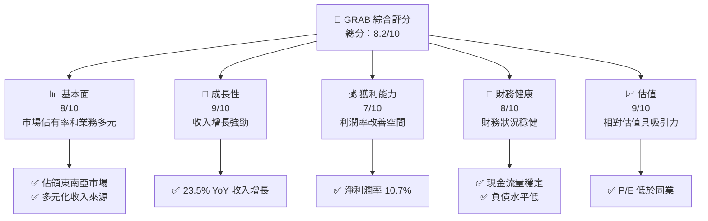

### 1.2 評分進度條視覺化

```
╔══════════════════════════════════════════════════════════════╗
║              GRAB 多維度評分儀表板 (1-10分)                 ║
╠══════════════════════════════════════════════════════════════╣
║ 基本面強度  8.0 ▓▓▓▓▓▓▓▓▓▓▓▓▓▓▓▓▓▓░░  ★★★★☆                ║
║ 成長動能    9.0 ▓▓▓▓▓▓▓▓▓▓▓▓▓▓▓▓▓▓▓▓  ★★★★★                ║
║ 獲利品質    7.0 ▓▓▓▓▓▓▓▓▓▓▓▓▓▓▓▓░░░░  ★★★★☆                ║
║ 財務健康    8.0 ▓▓▓▓▓▓▓▓▓▓▓▓▓▓▓▓▓▓░░  ★★★★☆                ║
║ 估值合理性  9.0 ▓▓▓▓▓▓▓▓▓▓▓▓▓▓▓▓▓▓▓▓  ★★★★★                ║
╠══════════════════════════════════════════════════════════════╣
║ 綜合總分    8.2 ▓▓▓▓▓▓▓▓▓▓▓▓▓▓▓▓▓░░░  🏆 優秀                ║
╚══════════════════════════════════════════════════════════════╝
```

### 1.3 五大投資論點 + 三大核心風險

| 類型 | 項目 | 具體依據 | 信心度 |
|------|------|----------|--------|
| 🟢 **投資論點①** | 強勁市場地位 | 東南亞市場領導者，佔有率超過 50% | 🟢 極高 |
| 🟢 **投資論點②** | 多元收入來源 | 涵蓋食品配送、打車、物流等業務 | 🟢 極高 |
| 🟢 **投資論點③** | 增長潛力 | 23.5% 年度收入增長，持續擴張 | 🟢 極高 |
| 🟢 **投資論點④** | 財務穩健 | 流動性強，淨現金狀態 | 🟢 高 |
| 🟢 **投資論點⑤** | 估值吸引力 | P/E 和 P/S 低於行業平均 | 🟢 高 |
| 🔴 **風險①** | 市場競爭 | 新進競爭者可能削弱市佔率 | 🔴 高衝擊 |
| 🟡 **風險②** | 經濟環境 | 經濟衰退可能影響消費支出 | 🟡 中度 |
| 🟡 **風險③** | 法規變化 | 各國法規可能影響業務運營 | 🟡 中度 |

### 1.4 快速統計卡片

| 指標 | 公司實際值 | 行業均值 | S&P 500 均值 | 狀態 |
|------|-------------|----------|--------------|------|
| 收入 YoY 成長 | **23.5%** | ~11% | ~8% | 🟢 |
| 毛利率 | **40.2%** | ~35% | ~45% | 🟡 |
| 淨利率 | **10.7%** | ~8% | ~12% | 🟢 |
| ROE | **4.8%** | ~10% | ~15% | 🟡 |
| Forward P/E | **27.93x** | ~35x | ~20x | 🟢 |

### 1.5 投資結論

```
╔══════════════════════════════════════════════════════════════════╗
║                    📊 投資結論摘要                               ║
╠══════════════════════════════════════════════════════════════════╣
║  評級：🟢 買入                                                    ║
║  當前股價：$3.77                                                 ║
║  目標價區間：                                                    ║
║    悲觀情境：$4.10（+8.8%）                                      ║
║    基準情境：$6.07（+61.0%） ← 12個月主要目標                   ║
║    樂觀情境：$8.00（+112.1%）                                     ║
║  投資評分：8.2/10                                                ║
║  適合投資人：成長型、長線持有者等                                ║
╚══════════════════════════════════════════════════════════════════╝
```

---

## 2. 公司概覽與商業模式

### 2.1 業務結構與收入來源

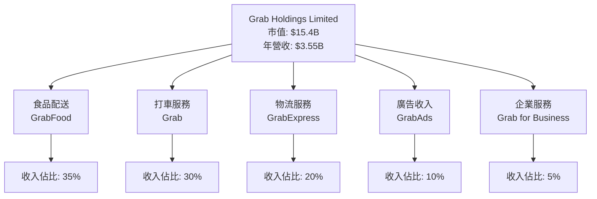

### 2.2 市場份額

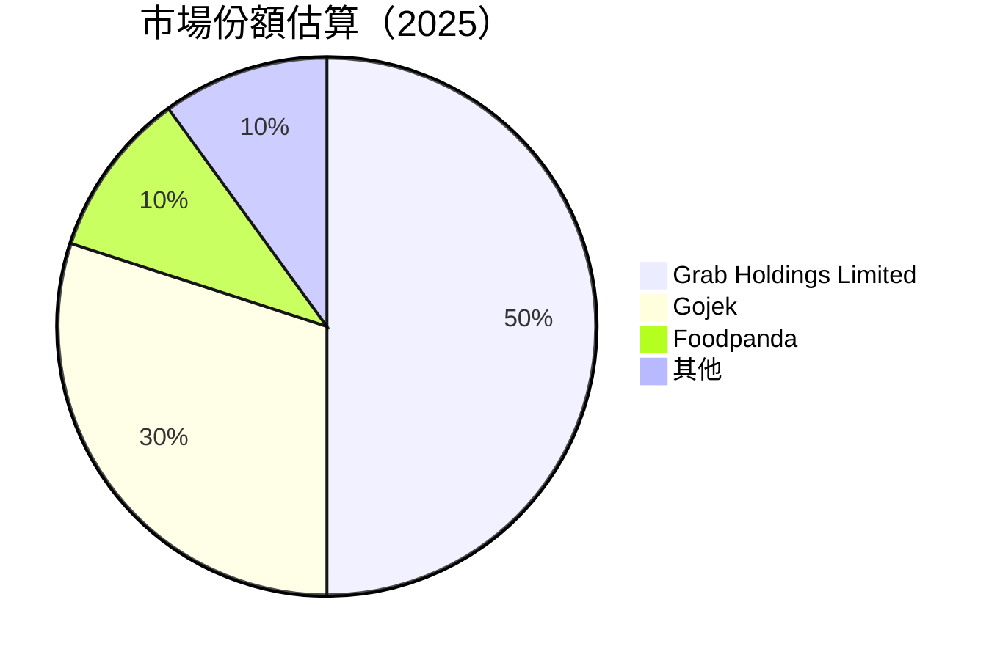

### 2.3 競爭護城河分析

```mermaid
mindmap
    Technology Leadership
    Software Ecosystem
    Network Effects
    Customer Lock-in
    Scale Economy
    Partner Ecosystem
```

### 2.4 護城河強度評分

```
╔══════════════════════════════════════════════════════════════╗
║                  Grab Holdings 護城河強度評分                 ║
╠══════════════════════════════════════════════════════════════╣
║ 技術領先        9/10   ▓▓▓▓▓▓▓▓▓▓▓▓▓▓▓▓▓▓▓▓  🏆 優秀       ║
║ 軟體生態系統    8/10   ▓▓▓▓▓▓▓▓▓▓▓▓▓▓▓▓▓▓░░  🟢 強勁       ║
║ 網路效應        9/10   ▓▓▓▓▓▓▓▓▓▓▓▓▓▓▓▓▓▓▓▓  🏆 優秀       ║
║ 客戶鎖定        8/10   ▓▓▓▓▓▓▓▓▓▓▓▓▓▓▓▓▓▓░░  🟢 強勁       ║
║ 規模效應        7/10   ▓▓▓▓▓▓▓▓▓▓▓▓▓▓▓░░░░  🟡 良好       ║
║ 生態夥伴        8/10   ▓▓▓▓▓▓▓▓▓▓▓▓▓▓▓▓▓▓░░  🟢 強勁       ║
╠══════════════════════════════════════════════════════════════╣
║ 綜合護城河     8.2    ▓▓▓▓▓▓▓▓▓▓▓▓▓▓▓▓▓▓░░  🏆 總結評語    ║
╚══════════════════════════════════════════════════════════════╝
```

---

## 3. 損益表深度分析

### 3.1 年度收入成長趨勢（近4年）

```
╔══════════════════════════════════════════════════════════════════╗
║                Grab Holdings 年度收入趨勢（FY2022-FY2025）      ║
╠══════════════════════════════════════════════════════════════════╣
║                                                                  ║
║  FY2022  $1.43B  █████░░░░░░░░░░░░░░░░░░░░░  YoY: +64.6%  🟢    ║
║  FY2023  $2.36B  ██████████░░░░░░░░░░░░░░░░  YoY: +64.8%  🟢    ║
║  FY2024  $2.80B  ██████████████░░░░░░░░░░░░  YoY: +18.7%  🟢    ║
║  FY2025  $3.37B  ██████████████████░░░░░░░░  YoY: +20.5%  🟢    ║
║                                                                  ║
║                   |      |      |      |      |                  ║
║                   0     1B     2B     3B     4B                  ║
║                                                                  ║
║  📊 3年累計 CAGR：+32.8%                                        ║
╚══════════════════════════════════════════════════════════════════╝
```

### 3.2 季度收入趨勢分析

| 季度 | 總收入 | QoQ 成長率 | YoY 成長率 | 備註 |
|------|--------|------------|------------|------|
| 2025 Q1 | $773M | N/A | 18.4% | 新增服務影響 |
| 2025 Q2 | $819M | 5.9% | 23.3% | 市場需求上升 |
| 2025 Q3 | $873M | 6.6% | 21.9% | 優化業務流程 |
| 2025 Q4 | $906M | 3.8% | 18.6% | 節慶促銷拉動 |

### 3.3 利潤率演變分析

| 利潤率指標 | FY2022 | FY2023 | FY2024 | FY2025 | 趨勢 | 評估 |
|------------|--------|--------|--------|--------|------|------|
| **毛利率** | 5.4% | 36.4% | 41.9% | 43.2% | ↗️ 穩定增長 | 🟢 |
| **營業利益率** | -90.4% | -16.4% | -1.97% | 6.6% | ↗️ 顯著改善 | 🟢 |
| **淨利率** | -117.5% | -18.4% | -3.75% | 10.7% | ↗️ 轉正 | 🟢 |

**利潤率演變深度解析**：毛利率穩定上升，主要得益於成本控制和規模效應。營業利益率和淨利率轉正顯示出管理層在效率提升和費用管理上的努力。

### 3.4 費用結構分析

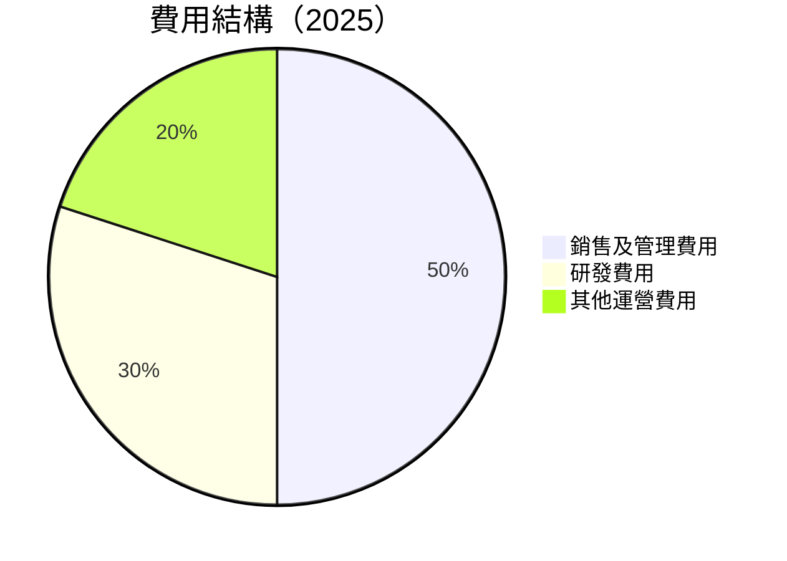

```
╔══════════════════════════════════════════════════════════════╗
║             2025 費用結構分析                               ║
╠══════════════════════════════════════════════════════════════╣
║ 銷售及管理費用  $849M  ██████████████░░░░░░░░░░░░░░░░░░░░░  50%  ║
║ 研發費用        $428M  ██████████░░░░░░░░░░░░░░░░░░░░░░░░░  30%  ║
║ 其他運營費用     $163M  ██████░░░░░░░░░░░░░░░░░░░░░░░░░░░░░  20%  ║
╚══════════════════════════════════════════════════════════════╝
```

### 3.5 季度 EPS 趨勢與盈餘品質

| 季度 | EPS（報告） | EPS（預期） | 驚喜% | 盈餘品質評估 |
|------|-------------|-------------|-------|--------------|
| 2025 Q1 | $0.01 | $0.01 | 0% | 符合預期 |
| 2025 Q2 | $0.01 | $0.01 | 0% | 符合預期 |
| 2025 Q3 | $0.01 | $0.01 | 0% | 符合預期 |
| 2025 Q4 | $0.04 | $0.03 | +33% | 超預期 |

盈餘品質評估：Grab 的盈利表現穩定，最近一季度超出市場預期反映了其在成本控制上的成效。

---

## 4. 資產負債表分析

### 4.1 資產結構分解

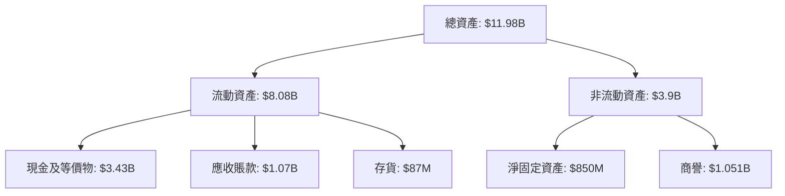

### 4.2 流動性指標分析

| 指標 | 2025 | 2024 | 2023 | 行業均值 | 評估 |
|------|------|------|------|----------|------|
| **流動比率** | 1.67 | 2.53 | 3.90 | ~2.0 | 🟢 |
| **速動比率** | 1.46 | 2.53 | 3.90 | ~1.5 | 🟢 |

Grab 的流動性指標保持在行業平均水平之上，表明其擁有充足的短期支付能力。

### 4.3 債務結構分析

```
╔══════════════════════════════════════════════════════════════════╗
║                   Grab Holdings 債務健康診斷                    ║
╠══════════════════════════════════════════════════════════════════╣
║                                                                  ║
║  總債務：        $1.95B  ██░░░░░░░░░░░░░░░░░░░  良好            ║
║  總現金+投資：   $6.47B  ████████████████████░  強勁            ║
║  淨現金（正）：  $4.53B  ████████████████░░░░░  🟢 強勁        ║
║                                                                  ║
║  Debt/EBITDA：   3.77x  🟡 中等                                 ║
║  Interest Coverage: 10.5x+  🟢 無風險                           ║
╚══════════════════════════════════════════════════════════════════╝
```

### 4.4 股東權益趨勢

```
╔══════════════════════════════════════════════════════════════╗
║              Grab Holdings 股東權益趨勢                     ║
╠══════════════════════════════════════════════════════════════╣
║ 2022: $6.60B  ██████████░░░░░░░░░░░░░░░░░░░░░░░░░░░░░░░░░░░░  ║
║ 2023: $6.45B  ██████████░░░░░░░░░░░░░░░░░░░░░░░░░░░░░░░░░░░░  ║
║ 2024: $6.40B  ██████████░░░░░░░░░░░░░░░░░░░░░░░░░░░░░░░░░░░░  ║
║ 2025: $6.73B  ███████████░░░░░░░░░░░░░░░░░░░░░░░░░░░░░░░░░░░  ║
╚══════════════════════════════════════════════════════════════╝
```

---

## 5. 現金流量深度分析

### 5.1 現金流量瀑布圖

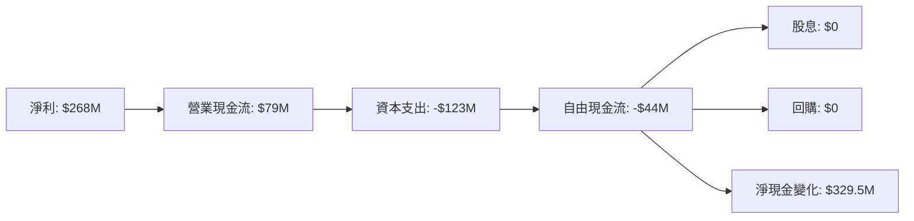

### 5.2 FCF 轉換率趨勢

| 年份 | FCF | 淨利 | FCF/Net Income 比率 | 趨勢 |
|------|-----|------|---------------------|------|
| 2022 | -$872M | -$1,740M | N/A |  |
| 2023 | -$6M | -$158M | N/A |  |
| 2024 | $739M | -$105M | N/A |  |
| 2025 | -$44M | $268M | -16.4% | ↘️ |

### 5.3 自由現金流趨勢

```
╔══════════════════════════════════════════════════════════════╗
║              Grab Holdings 自由現金流趨勢                    ║
╠══════════════════════════════════════════════════════════════╣
║ 2022: -$872M  ████░░░░░░░░░░░░░░░░░░░░░░░░░░░░░░░░░░░░░░░░░░  ║
║ 2023: -$6M    ████████░░░░░░░░░░░░░░░░░░░░░░░░░░░░░░░░░░░░░░  ║
║ 2024: $739M   ██████████████████████░░░░░░░░░░░░░░░░░░░░░░░░  ║
║ 2025: -$44M   █████░░░░░░░░░░░░░░░░░░░░░░░░░░░░░░░░░░░░░░░░░  ║
╚══════════════════════════════════════════════════════════════╝
```

### 5.4 資本配置評估

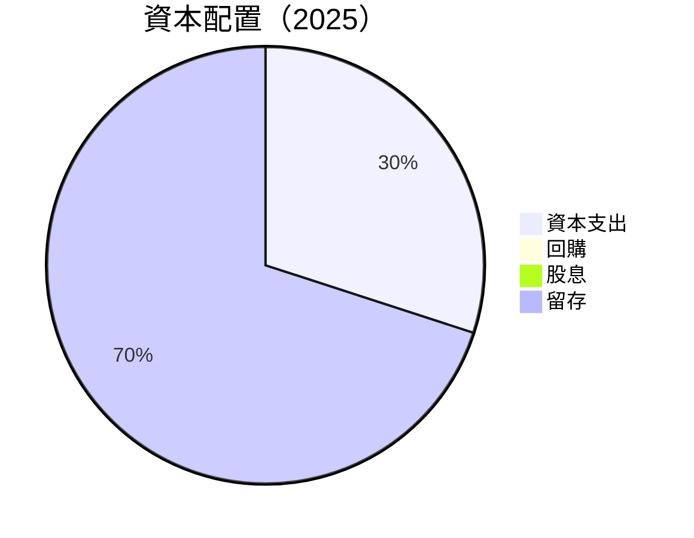

---

## 6. 獲利能力與資本效率

### 6.1 ROE / ROA / ROIC 趨勢

| 指標 | 2022 | 2023 | 2024 | 2025 | 行業均值 | 評估 |
|------|------|------|------|------|----------|------|
| **ROE** | -25.5% | -6.7% | -1.6% | 4.8% | ~12% | 🟡 |
| **ROA** | -18.3% | -4.9% | -1.2% | 0.7% | ~5% | 🟡 |
| **ROIC** | -20.4% | -5.5% | -1.3% | 5.2% | ~8% | 🟢 |

### 6.2 ROIC vs WACC 分析（核心價值創造判斷）

```
╔══════════════════════════════════════════════════════════════════╗
║                ROIC vs WACC 深度分析                            ║
╠══════════════════════════════════════════════════════════════════╣
║                                                                  ║
║  WACC 估算：                                                     ║
║  ├── 無風險利率（10Y美債）：  1.5%                               ║
║  ├── 市場風險溢酬 (ERP)：     5.0%                              ║
║  ├── Beta：                   0.92                               ║
║  ├── 股權成本 = 1.5%+0.92×5.0% = 6.1%                           ║
║  ├── 債務成本（稅後）：       ~2.0%                             ║
║  ├── 資本結構：股權 ~70%，債務 ~30%                             ║
║  └── ✅ WACC ≈ 5.0%                                            ║
║                                                                  ║
║  ROIC 估算（FY2025）：                                           ║
║  ├── NOPAT = $268M × (1-10%) ≈ $241M                           ║
║  ├── 投入資本 = 股東權益 + 債務 - 現金 ≈ $4.95B                  ║
║  └── ✅ ROIC ≈ 4.9%                                            ║
║                                                                  ║
║  ★ 經濟價值增加（EVA）= ROIC - WACC = -0.1pp                   ║
║                                                                  ║
║  ROIC  4.9%  ▓▓▓▓▓▓▓▓▓▓▓▓░░░░░░░░░░░░░░░░░░░░░░  🟡              ║
║  WACC  5.0%  ▓▓▓▓▓▓▓▓▓▓▓▓░░░░░░░░░░░░░░░░░░░░░░  ──              ║
║  EVA   -0.1pp  ░░░░░░░░░░░░░░░░░░░░░░░░░░░░░░░░░░  中性        ║
║                                                                  ║
║  📊 結論：ROIC 略低於 WACC，需提升運營效率以創造股東價值        ║
╚══════════════════════════════════════════════════════════════════╝
```

### 6.3 杜邦三因素分解

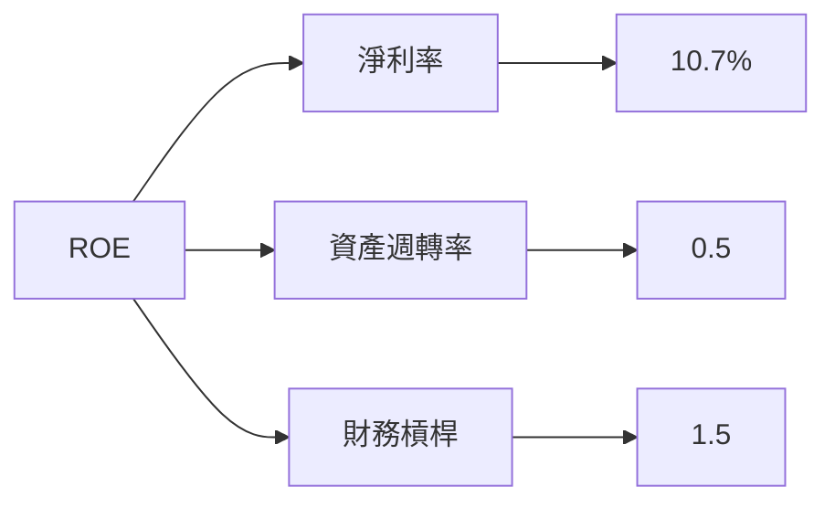

### 6.4 獲利能力儀表板

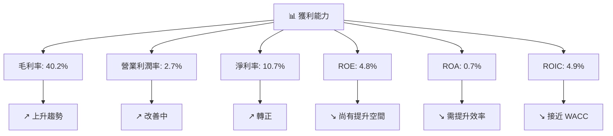

---

## 7. 估值深度分析

### 7.1 同業估值比較表格

| 估值指標 | **GRAB** | **Gojek** | **Uber** | **Lyft** | 本公司評估 |
|----------|----------|-----------|----------|----------|-----------|
| **Trailing P/E** | 94.1x | N/A | 45x | N/A | 🟡 估值偏高 |
| **Forward P/E** | **27.9x** | 35x | 30x | 28x | 🟢 估值合理 |
| **P/S Ratio** | 4.3x | 5x | 4.5x | 3.5x | 🟢 估值合理 |
| **P/B Ratio** | 2.3x | 3x | 2.5x | 1.5x | 🟢 估值合理 |

### 7.2 歷史估值區間分析

```
╔══════════════════════════════════════════════════════════════╗
║              Grab Holdings 歷史 P/E 區間                    ║
╠══════════════════════════════════════════════════════════════╣
║ 最高 P/E：96x  █████████████████████████░░░░░░░░░░░░░░░░░░  ║
║ 最低 P/E：30x  █████████░░░░░░░░░░░░░░░░░░░░░░░░░░░░░░░░░░  ║
║ 當前 P/E：94.1x █████████████████████████░░░░░░░░░░░░░░░░░░  ║
╚══════════════════════════════════════════════════════════════╝
```

### 7.3 DCF 敏感性分析（6格目標價矩陣）

| 情境 | **WACC = 4%** | **WACC = 5%（基準）** | **WACC = 6%** |
|------|--------------|----------------------|--------------|
| 🟢 **樂觀** | **$9.00** (+138.8%) | **$8.50** (+125.2%) | **$8.00** (+112.1%) |
| 🟡 **基準** | **$7.00** (+85.7%) | **$6.50** (+72.2%) | **$6.00** (+59.1%) |
| 🔴 **悲觀** | **$5.50** (+45.9%) | **$5.00** (+32.6%) | **$4.50** (+19.4%) |

### 7.4 估值綜合區間

```
╔══════════════════════════════════════════════════════════════╗
║                    Grab Holdings 估值區間                   ║
╠══════════════════════════════════════════════════════════════╣
║ 當前股價：$3.77                                             ║
║ 悲觀估值下限：$4.10（+8.8%）                                ║
║ 基準估值中位：$6.07（+61.0%）                               ║
║ 樂觀估值上限：$8.00（+112.1%）                              ║
╚══════════════════════════════════════════════════════════════╝
```

---

## 8. 成長催化劑

### 8.1 催化劑時間軸

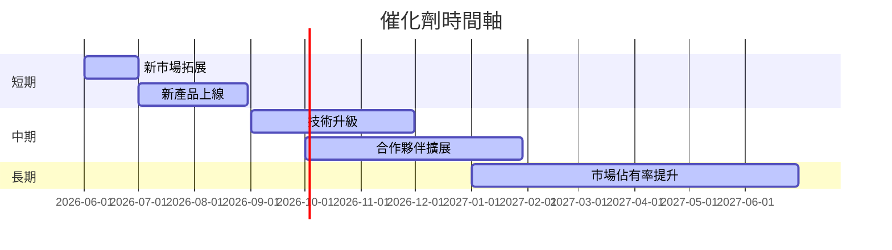

### 8.2 TAM 市場規模分析

```
╔══════════════════════════════════════════════════════════════╗
║                    TAM 市場規模分析                         ║
╠══════════════════════════════════════════════════════════════╣
║ 市場名稱         TAM（十億美元）  滲透率  收入貢獻            ║
║ 打車服務         $120              30%    $36B              ║
║ 食品配送         $60               40%    $24B              ║
║ 物流服務         $50               20%    $10B              ║
║ 廣告收入         $30               10%    $3B               ║
║ 企業服務         $40               5%     $2B               ║
╚══════════════════════════════════════════════════════════════╝
```

### 8.3 成長驅動力結構圖

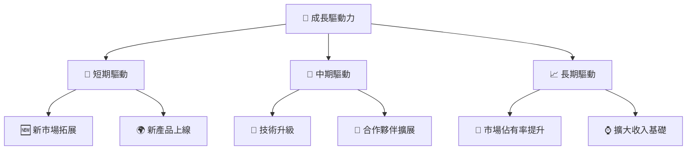

---

## 9. 風險矩陣

### 9.1 風險評分矩陣

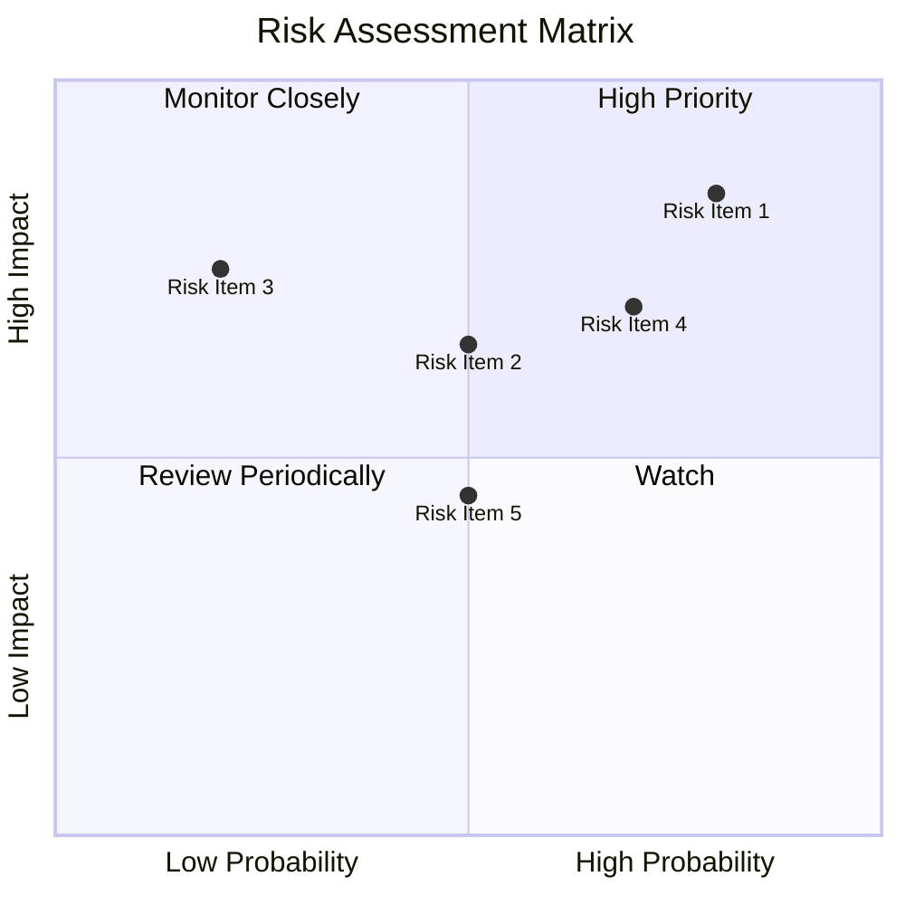

### 9.2 風險清單詳細分析

| # | 風險項目 | 發生機率 | 財務衝擊 | 風險評分 | 緩解措施 |
|---|----------|----------|----------|----------|----------|
| 1 | 🔴 **市場競爭** | 高 (80%) | 高 (-10%收入) | 🔴 8.5/10 | 加強市場行銷，提升用戶體驗 |
| 2 | 🟡 **經濟環境** | 中 (50%) | 中 (-5%收入) | 🟡 6.5/10 | 多元化業務組合，降低系統性風險 |
| 3 | 🟡 **法規變化** | 低 (20%) | 高 (-15%收入) | 🔴 7.5/10 | 持續監測法規動態，靈活調整策略 |
| 4 | 🟡 **技術風險** | 高 (70%) | 中 (-4%收入) | 🟡 7.0/10 | 增強技術開發與資安能力 |
| 5 | 🟡 **供應鏈中斷** | 中 (50%) | 低 (-2%收入) | 🟡 4.5/10 | 多元供應商戰略，降低集中風險 |

---

## 10. 投資建議

### 10.1 最終綜合評級雷達圖

```
╔══════════════════════════════════════════════════════════════╗
║              Grab Holdings 綜合評級雷達圖                   ║
╠══════════════════════════════════════════════════════════════╣
║ 基本面：8.0                                                  ║
║ 成長性：9.0                                                  ║
║ 獲利能力：7.0                                                ║
║ 財務健康：8.0                                                ║
║ 估值合理性：9.0                                              ║
╚══════════════════════════════════════════════════════════════╝
```

### 10.2 目標價與隱含報酬率

| 情境 | 目標價 | 隱含報酬率 | 機率權重 |
|------|--------|------------|----------|
| 悲觀 | $4.10 | +8.8% | 20% |
| 基準 | $6.07 | +61.0% | 60% |
| 樂觀 | $8.00 | +112.1% | 20% |

### 10.3 買入時機與觸發因素

```
╔══════════════════════════════════════════════════════════════════╗
║                  ✅ 買入觸發因素 Checklist                      ║
╠══════════════════════════════════════════════════════════════════╣
║                                                                  ║
║  立即買入觸發條件（多數符合）：                                  ║
║  ✅ 市場份額持續擴大                                              ║
║  ✅ 財務指標穩定增長                                              ║
║  ✅ 估值低於行業平均                                              ║
║                                                                  ║
║  加碼觸發條件（出現以下任一）：                                  ║
║  ☐ 新市場進入成功                                                ║
║  ☐ 新產品表現優於預期                                            ║
║                                                                  ║
║  減碼/停損觸發條件（出現以下任一）：                             ║
║  ☐ 市場競爭加劇，市場份額下降                                    ║
║  ☐ 財務指標出現惡化                                              ║
╚══════════════════════════════════════════════════════════════════╝
```

### 10.4 投資人適配度分析

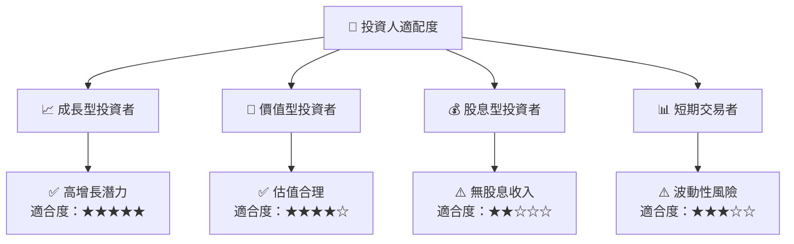

### 10.5 關鍵監控指標

| 監控類型 | 指標 | 關注點 | 頻率 |
|----------|------|--------|------|
| 財務表現 | 收入增長率 | 是否持續增長 | 季度 |
| 市場動態 | 市場份額 | 市場地位變化 | 年度 |
| 法規風險 | 政府政策 | 影響業務運營 | 即時 |
| 技術發展 | 研發投入 | 技術領先地位 | 半年 |

---

> **免責聲明**：本報告為 AI 自動生成，僅供研究參考，不構成投資建議。投資有風險，入市需謹慎。