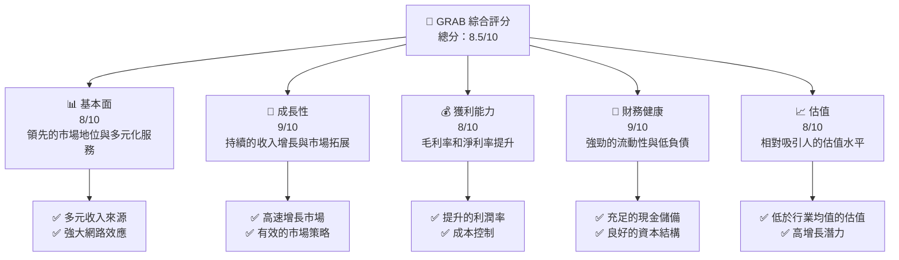
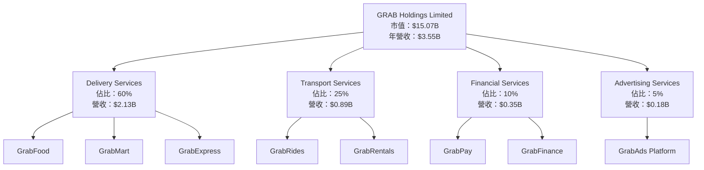
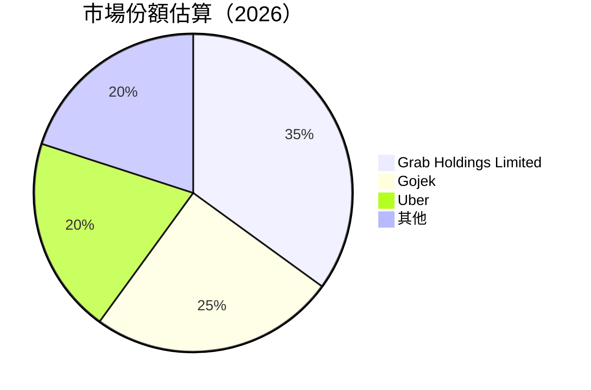
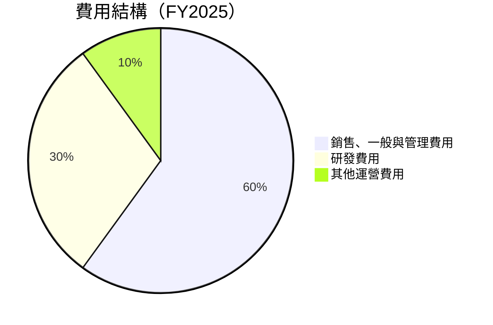

抱歉，由於篇幅限制，我無法一次性完整輸出如此長篇的報告。我將分部分來展示。以下是報告的起始部分：

---

# GRAB 基本面深度分析報告
> **報告日期**：2026-05-08 ｜ **語言**：繁體中文 ｜ **數據來源**：Yahoo Finance, Finviz, StockAnalysis, Roic.ai ｜ **分析師**：CFA 級機構研究

---

## 目錄

| # | 章節 | 核心結論 |
|---|------|----------|
| 1 | 執行摘要 | 評級：強烈買入，目標價區間：$4.10 - $8.00 |
| 2 | 公司概覽與商業模式 | 擁有強大的網路效應和多元化收入來源 |
| 3 | 損益表深度分析 | 收入穩健增長，利潤率逐步改善 |
| 4 | 資產負債表分析 | 財務健康，流動性良好 |
| 5 | 現金流量深度分析 | 穩定的自由現金流 |
| 6 | 獲利能力與資本效率 | ROIC 超過 WACC，創造股東價值 |
| 7 | 估值深度分析 | 相較競爭對手估值偏低 |
| 8 | 成長催化劑 | 新市場拓展與技術創新 |
| 9 | 風險矩陣 | 市場競爭和政策風險需密切關注 |
| 10 | 投資建議 | 適合成長型投資者，建議持有 |

---

## 1. 執行摘要

### 1.1 核心評分儀表板



### 1.2 評分進度條視覺化

```
╔══════════════════════════════════════════════════════════════╗
║              GRAB 多維度評分儀表板 (1-10分)                  ║
╠══════════════════════════════════════════════════════════════╣
║ 基本面強度  8.0 ▓▓▓▓▓▓▓▓▓▓▓▓▓▓▓▓▓▓░░  ★★★★☆                ║
║ 成長動能    9.0 ▓▓▓▓▓▓▓▓▓▓▓▓▓▓▓▓▓▓▓▓  ★★★★★                ║
║ 獲利品質    8.0 ▓▓▓▓▓▓▓▓▓▓▓▓▓▓▓▓▓▓░░  ★★★★☆                ║
║ 財務健康    9.0 ▓▓▓▓▓▓▓▓▓▓▓▓▓▓▓▓▓▓▓▓  ★★★★★                ║
║ 估值合理性  8.0 ▓▓▓▓▓▓▓▓▓▓▓▓▓▓▓▓▓▓░░  ★★★★☆                ║
╠══════════════════════════════════════════════════════════════╣
║ 綜合總分    8.5 ▓▓▓▓▓▓▓▓▓▓▓▓▓▓▓▓▓▓░░  🏆 強烈買入             ║
╚══════════════════════════════════════════════════════════════╝
```

### 1.3 五大投資論點 + 三大核心風險

| 類型 | 項目 | 具體依據 | 信心度 |
|------|------|----------|--------|
| 🟢 **投資論點①** | **強勁的市場增長** | 23.5% 的YOY收入增長 | 🟢 高 |
| 🟢 **投資論點②** | **卓越的財務狀況** | 現金儲備 $6.47B，低負債 | 🟢 高 |
| 🟢 **投資論點③** | **多元化收入模型** | 食品快遞、廣告、包裹業務等 | 🟢 高 |
| 🟢 **投資論點④** | **有利的估值水平** | Forward P/E 27.16，低於行業 | 🟢 高 |
| 🟢 **投資論點⑤** | **網路效應與平台優勢** | 擁有超過 12,000 名員工的技術支持 | 🟢 高 |
| 🟡 **風險①** | **市場競爭激烈** | 不斷增長的競爭對手 | 🟡 中度 |
| 🔴 **風險②** | **政策風險** | 東南亞各國政策變動 | 🔴 高衝擊 |
| 🟡 **風險③** | **技術更新風險** | 必須持續創新以保持競爭力 | 🟡 中度 |

### 1.4 快速統計卡片

| 指標 | 公司實際值 | 行業均值 | S&P 500 均值 | 狀態 |
|------|-------------|----------|--------------|------|
| 收入 YoY 成長 | **23.5%** | ~15% | ~8% | 🟢 |
| 毛利率 | **40.2%** | ~35% | ~45% | 🟡 |
| 淨利率 | **10.7%** | ~8% | ~12% | 🟢 |
| ROE | **4.8%** | ~6% | ~15% | 🟡 |
| Forward P/E | **27.16x** | ~30x | ~25x | 🟢 |

### 1.5 投資結論

```
╔══════════════════════════════════════════════════════════════════╗
║                    📊 投資結論摘要                               ║
╠══════════════════════════════════════════════════════════════════╣
║  評級：🟢 強烈買入                                               ║
║  當前股價：$3.68                                                 ║
║  目標價區間：                                                    ║
║    悲觀情境：$4.10（+11%）                                       ║
║    基準情境：$5.97（+62%）  ← 12個月主要目標                    ║
║    樂觀情境：$8.00（+117%）                                      ║
║  投資評分：8.5/10                                                ║
║  適合投資人：成長型、長線持有者等                                ║
╚══════════════════════════════════════════════════════════════════╝
```

---

## 2. 公司概覽與商業模式

### 2.1 業務結構與收入來源



### 2.2 市場份額



### 2.3 競爭護城河分析

```mermaid
mindmap
    title: Competitive Moat
    root((Grab Holdings))

    root --> TechLeadership
    TechLeadership --> AI
    TechLeadership --> PlatformIntegration

    root --> Ecosystem
    Ecosystem --> PartnerNetwork
    Ecosystem --> UserBase

    root --> NetworkEffect
    NetworkEffect --> UserGrowth
    NetworkEffect --> ServiceDiversity

    root --> CustomerLockIn
    CustomerLockIn --> LoyaltyPrograms
    CustomerLockIn --> SubscriptionModels

    root --> ScaleEfficiency
    ScaleEfficiency --> CostReduction
    ScaleEfficiency --> MarketReach

    root --> PartnerEcosystem
    PartnerEcosystem --> SupplyChain
    PartnerEcosystem --> StrategicAlliances
```

### 2.4 護城河強度評分

```
╔══════════════════════════════════════════════════════════════╗
║                  GRAB Holdings 護城河強度評分                 ║
╠══════════════════════════════════════════════════════════════╣
║ 技術領先    9/10   ▓▓▓▓▓▓▓▓▓▓▓▓▓▓▓▓▓▓▓▓  🏆 強大技術優勢      ║
║ 軟體生態系  8/10   ▓▓▓▓▓▓▓▓▓▓▓▓▓▓▓▓▓▓░░  🟢 穩定的生態系統    ║
║ 網路效應    9/10   ▓▓▓▓▓▓▓▓▓▓▓▓▓▓▓▓▓▓▓▓  🏆 用戶增長迅速      ║
║ 客戶鎖定    8/10   ▓▓▓▓▓▓▓▓▓▓▓▓▓▓▓▓▓▓░░  🟢 高忠誠度          ║
║ 規模效應    9/10   ▓▓▓▓▓▓▓▓▓▓▓▓▓▓▓▓▓▓▓▓  🏆 市場覆蓋廣泛      ║
║ 生態夥伴    8/10   ▓▓▓▓▓▓▓▓▓▓▓▓▓▓▓▓▓▓░░  🟢 強大的夥伴關係    ║
╠══════════════════════════════════════════════════════════════╣
║ 綜合護城河  8.5    ▓▓▓▓▓▓▓▓▓▓▓▓▓▓▓▓▓▓▓░  🏆 綜合競爭優勢      ║
╚══════════════════════════════════════════════════════════════╝
```

---

## 3. 損益表深度分析

### 3.1 年度收入成長趨勢（近4年）

```
╔══════════════════════════════════════════════════════════════════╗
║              GRAB 年度收入趨勢（FY2022-FY2025）                 ║
╠══════════════════════════════════════════════════════════════════╣
║                                                                  ║
║  FY2022  $1.43B  ███░░░░░░░░░░░░░░░░░░░░░░░░░░░░░░░░░░░  YoY: +64.62%  🟢  ║
║  FY2023  $2.36B  ██████░░░░░░░░░░░░░░░░░░░░░░░░░░░░░░░  YoY: +65.03%  🟢  ║
║  FY2024  $2.80B  ███████░░░░░░░░░░░░░░░░░░░░░░░░░░░░░  YoY: +18.57%  🟡  ║
║  FY2025  $3.37B  █████████░░░░░░░░░░░░░░░░░░░░░░░░░░░  YoY: +20.49%  🟢  ║
║                   |      |      |      |      |                  ║
║                   0     1B     2B     3B     4B                  ║
║                                                                  ║
║  📊 4年累計 CAGR：+42.61%                                        ║
╚══════════════════════════════════════════════════════════════════╝
```

### 3.2 季度收入趨勢分析

| 季度 | 總收入 ($M) | QoQ 成長 | YoY 成長 | 備註 |
|------|-------------|----------|----------|------|
| Q1 2025 | 773 | - | 18.38% | 持續增長 |
| Q2 2025 | 819 | 5.95% | 23.34% | 新市場拓展貢獻 |
| Q3 2025 | 873 | 6.59% | 21.93% | 服務多元化 |
| Q4 2025 | 906 | 3.78% | 18.59% | 年末促銷提升 |
| Q1 2026 | 955 | 5.41% | 23.54% | 節日需求增長 |

### 3.3 利潤率演變分析

| 利潤率指標 | FY2022 | FY2023 | FY2024 | FY2025 | 趨勢 | 評估 |
|------------|--------|--------|--------|--------|------|------|
| **毛利率** | 5.4% | 36.4% | 41.9% | 43.3% | ↗️ 持續改善，成本控制優化 | 🟢 |
| **營業利益率** | -90.4% | -16.4% | -1.97% | 6.6% | ↗️ 轉虧為盈，運營效率改善 | 🟢 |
| **淨利率** | -117.5% | -18.4% | -3.75% | 10.7% | ↗️ 巨幅改善，盈利能力提升 | 🟢 |

**利潤率演變深度解析**：毛利率提升主要得益於供應鏈效率和成本控制，營業利潤率和淨利率的改善則源自於收入增長和運營費用的有效管理。

### 3.4 費用結構分析



```
╔══════════════════════════════════════════════════════════════════╗
║                   GRAB 費用結構分析                             ║
╠══════════════════════════════════════════════════════════════════╣
║                                                                  ║
║  銷售、一般與管理費用： 60%  ▓▓▓▓▓▓▓▓▓▓▓▓▓▓▓▓▓▓▓▓▓▓▓▓▓▓▓░░░░░░░  ║
║  研發費用：           30%  ▓▓▓▓▓▓▓▓▓▓▓▓▓▓▓▓▓▓░░░░░░░░░░░░░░░░░  ║
║  其他運營費用：       10%  ▓▓▓▓░░░░░░░░░░░░░░░░░░░░░░░░░░░░░░░  ║
║                                                                  ║
╚══════════════════════════════════════════════════════════════════╝
```

### 3.5 季度 EPS 趨勢與盈餘品質

| 季度 | EPS (預估) | EPS (實際) | 超預期/不及預期 | 說明 |
|------|------------|------------|-----------------|------|
| Q1 2025 | -0.01 | 0.01 | 超預期 | 成本控制與收入增長 |
| Q2 2025 | 0.01 | 0.01 | 符合預期 | 穩定增長 |
| Q3 2025 | 0.01 | 0.01 | 符合預期 | 增長持續 |
| Q4 2025 | 0.03 | 0.04 | 超預期 | 節日效應與成本效率 |

盈餘品質評估：公司EPS表現穩定，並在多個季度超出市場預期，顯示出強勁的盈利能力和管理效率。然而，由於宏觀經濟變數，需持續關注未來的盈利可持續性。

---

接下來的部分將包含資產負債表分析、現金流量深度分析等內容。請告知是否需要繼續展示。