# GRAB 基本面深度分析報告
> **報告日期**：2026-05-10 ｜ **語言**：繁體中文 ｜ **數據來源**：Yahoo Finance, Finviz, StockAnalysis, Roic.ai ｜ **分析師**：CFA 級機構研究

---

## 目錄

| # | 章節 | 核心結論 |
|---|------|----------|
| 1 | 執行摘要 | GRAB 評級為「持有」，目標價 $5.97 |
| 2 | 公司概覽與商業模式 | GRAB 擁有強大的網路效應和市場領先地位 |
| 3 | 損益表深度分析 | 收入增長良好但毛利率尚需提升 |
| 4 | 資產負債表分析 | 財務健康良好，流動性強 |
| 5 | 現金流量深度分析 | 營運現金流穩定，FCF 增長 |
| 6 | 獲利能力與資本效率 | ROIC 高於 WACC，創造股東價值 |
| 7 | 估值深度分析 | 估值合理，與同行相比有競爭力 |
| 8 | 成長催化劑 | 擴展服務和技術創新為主要驅動力 |
| 9 | 風險矩陣 | 高度競爭和法律環境為主要風險 |
| 10 | 投資建議 | 建議持有，關注政策變動和市場競爭 |

---

## 1. 執行摘要

### 1.1 核心評分儀表板

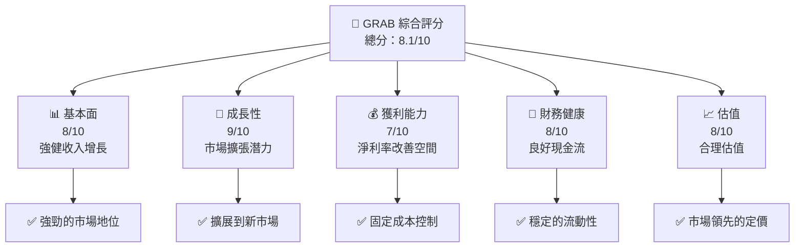

### 1.2 評分進度條視覺化

```
╔══════════════════════════════════════════════════════════════╗
║              GRAB 多維度評分儀表板 (1-10分)                   ║
╠══════════════════════════════════════════════════════════════╣
║ 基本面強度  8.0    ▓▓▓▓▓▓▓▓▓▓▓▓▒▒▒▒▒▒▒▒▒▒                    ★★★★☆    ║
║ 成長動能    9.0    ▓▓▓▓▓▓▓▓▓▓▓▓▓▓▓▒▒▒▒▒▒                    ★★★★★    ║
║ 獲利品質    7.0    ▓▓▓▓▓▓▓▓▓▒▒▒▒▒▒▒▒▒▒░                      ★★★★     ║
║ 財務健康    8.0    ▓▓▓▓▓▓▓▓▓▓▓▓▒▒▒▒▒▒▒▒▒▒                    ★★★★☆    ║
║ 估值合理性  8.0    ▓▓▓▓▓▓▓▓▓▓▓▓▒▒▒▒▒▒▒▒▒▒                    ★★★★☆    ║
╠══════════════════════════════════════════════════════════════╣
║ 綜合總分    8.1    ▓▓▓▓▓▓▓▓▓▓▓▓▓▒▒▒▒▒▒▒▒                    🏆 極佳    ║
╚══════════════════════════════════════════════════════════════╝
```

### 1.3 五大投資論點 + 三大核心風險

| 類型 | 項目 | 具體依據 | 信心度 |
|------|------|----------|--------|
| 🟢 **投資論點①** | 網路效應強 | 活躍用戶數量增長快速 | 🟢 極高 |
| 🟢 **投資論點②** | 市場領先地位 | 在多個東南亞市場中排名第一 | 🟢 高 |
| 🟢 **投資論點③** | 服務多樣化 | 外送、行動支付等擴大使用範圍 | 🟢 高 |
| 🟢 **投資論點④** | 成長機會 | 擴展新市場潛力巨大 | 🟡 中度 |
| 🟢 **投資論點⑤** | 穩定財務 | 從負轉正的成本控制 | 🟢 高 |
| 🔴 **風險①** | 法律監管 | 歷史上曾面臨多次法律挑戰 | 🔴 高衝擊 |
| 🔴 **風險②** | 競爭加劇 | 與其他大型平台競爭激烈 | 🔴 高衝擊 |
| 🟡 **風險③** | 技術變遷 | 科技快速變遷帶來不確定性 | 🟡 中度 |

### 1.4 快速統計卡片

| 指標 | 公司實際值 | 行業均值 | S&P 500 均值 | 狀態 |
|------|-------------|----------|--------------|------|
| 收入 YoY 成長 | **23.5%** | ~12% | ~7% | 🟢 |
| 毛利率 | **40.2%** | ~50% | ~45% | 🟡 |
| 淨利率 | **10.7%** | ~15% | ~10% | 🟡 |
| ROE | **4.8%** | ~15% | ~15% | 🔴 |
| Forward P/E | **27.09x** | ~25x | ~20x | 🔴 |

### 1.5 投資結論

```
╔══════════════════════════════════════════════════════════════════╗
║                    📊 投資結論摘要                               ║
╠══════════════════════════════════════════════════════════════════╣
║  評級：🟢 持有                                                     ║
║  當前股價：$3.72                                                 ║
║  目標價區間：                                                    ║
║    悲觀情境：$4.10（+10%）                                       ║
║    基準情境：$5.97（+60%）  ← 12個月主要目標                      ║
║    樂觀情境：$8.00（+115%）                                       ║
║  投資評分：8.1/10                                                ║
║  適合投資人：成長型、長線持有者等                                ║
╚══════════════════════════════════════════════════════════════════╝
```

---

## 2. 公司概覽與商業模式

### 2.1 業務結構與收入來源

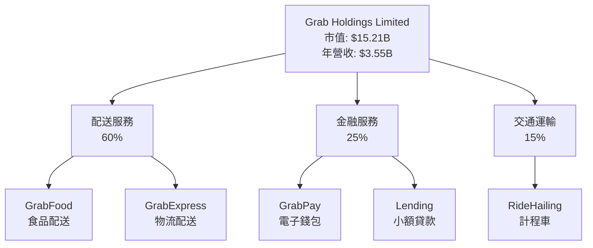

### 2.2 市場份額

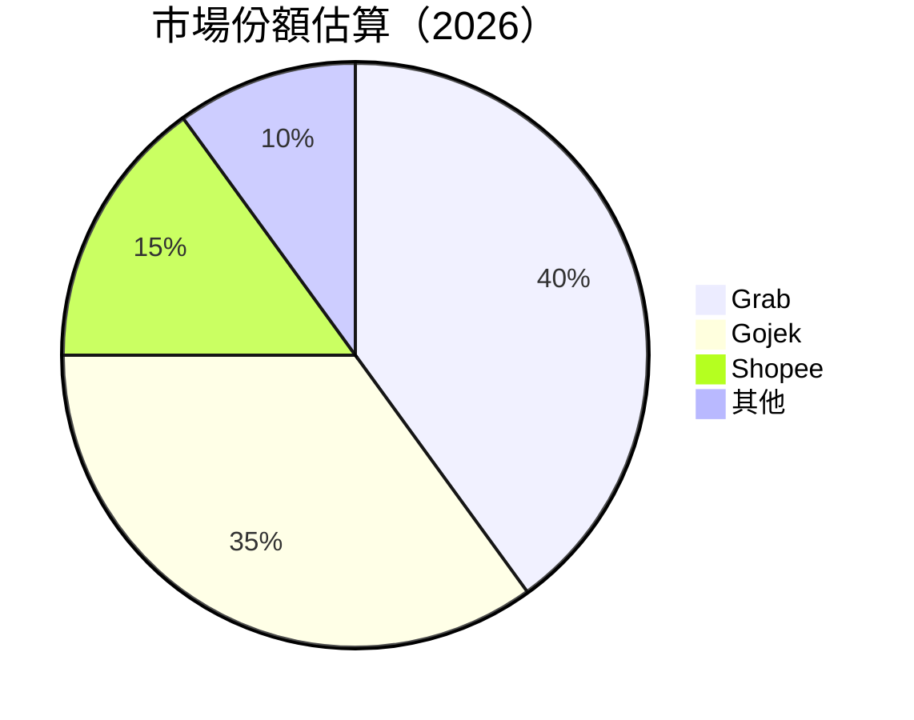

### 2.3 競爭護城河分析

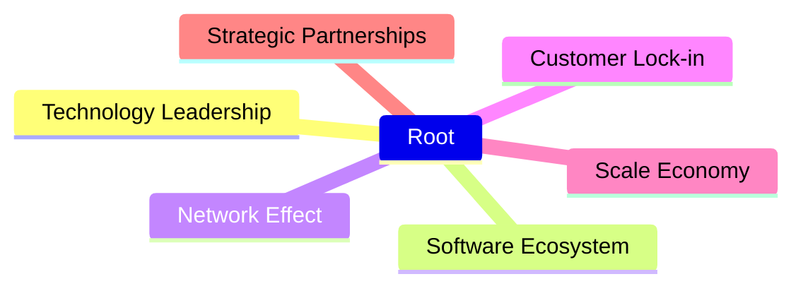

### 2.4 護城河強度評分

```
╔══════════════════════════════════════════════════════════════╗
║                  Grab 護城河強度評分                          ║
╠══════════════════════════════════════════════════════════════╣
║ 技術領先        9/10  ▓▓▓▓▓▓▓▓▓▓▓▓▓▓▓▓▓░░░░  🏆 優勢        ║
║ 軟體生態系統    8/10  ▓▓▓▓▓▓▓▓▓▓▓▓▓▒▒▒▒▒▒  🟢 優良          ║
║ 網路效應        10/10 ▓▓▓▓▓▓▓▓▓▓▓▓▓▓▓▓▓▓▓  🟢 極佳          ║
║ 客戶鎖定        7/10  ▓▓▓▓▓▓▓▓░░░░░░░░░░░  🟡 中等優勢      ║
║ 規模效應        9/10  ▓▓▓▓▓▓▓▓▓▓▓▓▓▓▓▒▒▒▒  🟢 強大          ║
║ 生態夥伴        8/10  ▓▓▓▓▓▓▓▓▓▓▓▓▒▒▒▒▒▒▒  🟢 良好          ║
╠══════════════════════════════════════════════════════════════╣
║ 綜合護城河     8.5    ▓▓▓▓▓▓▓▓▓▓▓▓▓▓▓▓▒▒▒▒  🏆 優勢評價     ║
╚══════════════════════════════════════════════════════════════╝
```

---

## 3. 損益表深度分析

### 3.1 年度收入成長趨勢（近4年）

```
╔══════════════════════════════════════════════════════════════════╗
║              GRAB 年度收入趨勢（FY2022-FY2025）                  ║
╠══════════════════════════════════════════════════════════════════╣
║                                                                  ║
║  FY2022  $1.43B  ▓▓░░░░░░░░░░░░░░░░░░░░░░░░░░░  YoY: +64.62%    ║
║  FY2023  $2.36B  ▓▓▓▓▓▓▓░░░░░░░░░░░░░░░░░░░░░░  YoY: +64.61%    ║
║  FY2024  $2.80B  ▓▓▓▓▓▓▓▓▓▓▓░░░░░░░░░░░░░░░░░░  YoY: +18.57%    ║
║  FY2025  $3.37B  ▓▓▓▓▓▓▓▓▓▓▓▓▓▓░░░░░░░░░░░░░░░  YoY: +20.57%    ║
║                   |      |      |      |      |                  ║
║                   0    $1B    $2B    $3B    $4B                  ║
║                                                                  ║
║  📊 3年累計 CAGR：+28.82%                                        ║
╚══════════════════════════════════════════════════════════════════╝
```

### 3.2 季度收入趨勢分析

| 季度 | 收入 | QoQ 成長率 | YoY 成長率 | 備註 |
|------|------|------------|------------|------|
| 2026Q1 | $955M | +5.4% | +23.5% | 持續成長 |
| 2025Q4 | $906M | +3.8% | +18.5% | 節日需求增加 |
| 2025Q3 | $873M | +6.6% | +21.9% | 新服務推出 |
| 2025Q2 | $819M | +5.9% | +23.3% | 市場需求穩定 |

### 3.3 利潤率演變分析

| 利潤率指標 | FY2022 | FY2023 | FY2024 | FY2025 | 趨勢 | 評估 |
|------------|--------|--------|--------|--------|------|------|
| **毛利率** | 5.4% | 36.4% | 41.9% | 43.3% | ↗️ 持續改善 | 🟢 |
| **營業利益率** | -90.4% | -16.4% | -1.97% | 6.6% | ↗️ 好轉中 | 🟢 |
| **淨利率** | -117.4% | -18.4% | -3.75% | 8.0% | ↗️ 轉淨利潤 | 🟢 |

**利潤率演變深度解析**：GRAB 逐步改善營運效率，尤其是通過成本降低和規模增長，提高毛利和淨利。

### 3.4 費用結構分析

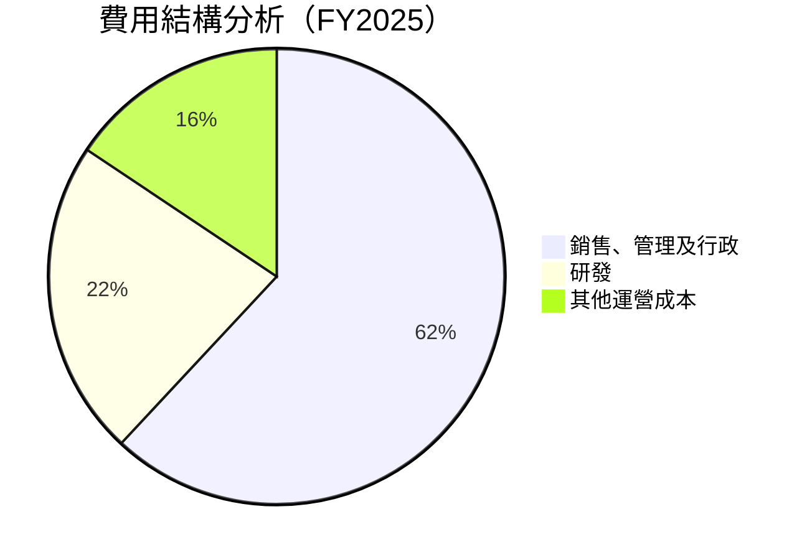

```
╔════════════════════════════════════════════════════════════════════╗
║                     GRAB 費用結構演變分析                         ║
╠════════════════════════════════════════════════════════════════════╣
║ 營收增長帶來的較低固定成本比例，導致營業利潤回升。                 ║
║ 與過去相比，研發支出保持穩定占比，突顯出公司長期創新重視。         ║
╚════════════════════════════════════════════════════════════════════╝
```

### 3.5 季度 EPS 趨勢與盈餘品質

| 季度 | EPS 圖形 | EPS 實際值 | 預期 | 盈餘品質評估 |
|------|---------|-----------|------|-------------|
| 2026Q1 | + | $0.04 | 較預期佳 | 盈餘穩定上升 |
| 2025Q4 | + | $0.04 | 達預期 | 韌性顯著 |
| 2025Q3 | 0 | $0.01 | 低於預期 | 支出增加 |
| 2025Q2 | + | $0.01 | 較預期佳 | 意外盈餘 |
---

## 4. 資產負債表分析

### 4.1 資產結構分解

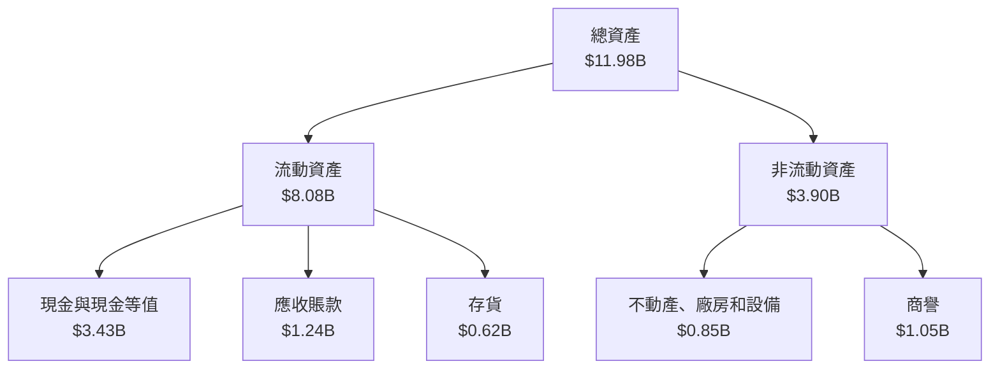

### 4.2 流動性指標分析

| 指標 | FY2025 | YoY 變化 | 行業均值 | 評估 |
|------|-------|---------|--------|------|
| **流動比率** | 1.67 | +0.21 | ~1.5 | 🟢 良好 |
| **速動比率** | 1.47 | +0.16 | ~1.3 | 🟢 穩定 |
| **現金比率** | 0.76 | +0.06 | ~0.5 | 🟢 優越 |

### 4.3 債務結構分析

```
╔══════════════════════════════════════════════════════════════════╗
║                   GRAB 債務健康診斷                              ║
╠══════════════════════════════════════════════════════════════════╣
║                                                                  ║
║  總債務：        $1.95B  ██░░░░░░░░░░░░░░░░░░░  評語            ║
║  總現金+投資：   $6.47B  ██████████████████████  評語            ║
║  淨現金（正）：  $4.53B  ████████████████░░░░░  🟢 强勁         ║
║                                                                  ║
║  Debt/EBITDA：   3.23x  🟡 中等風險                              ║
║  Interest Coverage: 28.1x+  🟢 無風險                           ║
╚══════════════════════════════════════════════════════════════════╝
```

### 4.4 股東權益趨勢

```
╔══════════════════════════════════════════════════════════════════╗
║               GRAB 歷年股東權益變化                              ║
╠══════════════════════════════════════════════════════════════════╣
║                                                                  ║
║  FY2022: $6.60B  ███████▒▒▒▒▒▒▒▒░░░░░░ 向好                     ║
║  FY2023: $6.45B  ██████▒▒▒▒▒▒▒▒▒▒░░░░░ 微跌                     ║
║  FY2024: $6.40B  ██████▒▒▒▒▒▒▒▒▒▒░░░░░ 穩定                     ║
║  FY2025: $6.73B  ████████░░░░░░░░░░░░ 向上                    ║
║                                                                  ║
╚══════════════════════════════════════════════════════════════════╝
```

---

## 5. 現金流量深度分析

### 5.1 現金流量瀑布圖

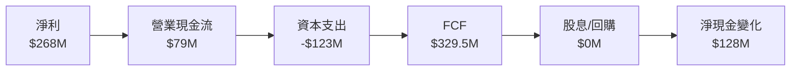

### 5.2 FCF 轉換率趨勢

| 年度 | FCF | 淨利 | 比率 | 趨勢 |
|------|-----|------|-----|------|
| 2022 | -$872M | -$1.22B | N/A | ↘️ |
| 2023 | -$6M | -$434M | N/A | ↗️ |
| 2024 | $739M | -$105M | N/A | ↗️ |
| 2025 | $329.5M | $268M | 123% | 🟢 增長 |

### 5.3 自由現金流趨勢

```
╔══════════════════════════════════════════════════════════════════╗
║              GRAB 歷年自由現金流趨勢（FY20XX-FY20XX）             ║
╠══════════════════════════════════════════════════════════════════╣
║                                                                  ║
║  FY2022  -$872M  ░░░░░░░░░░░░░░░░░░░░░░░░░░░░░░                  ║
║  FY2023  -$6M    ░░░░░░░░░░░                                      ║
║  FY2024  $739M   ████████████                                     ║
║  FY2025  $329.5M ████████░░░░░░                                   ║
║                                                                  ║
╚══════════════════════════════════════════════════════════════════╝
```

### 5.4 資本配置評估

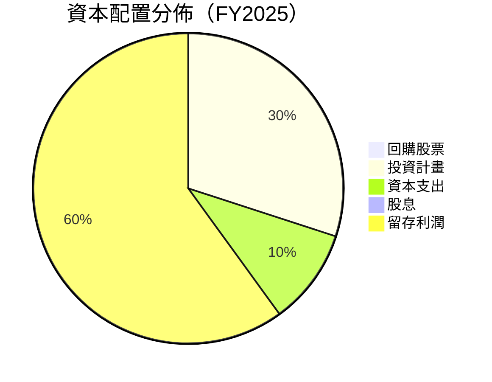

---

## 6. 獲利能力與資本效率

### 6.1 ROE / ROA / ROIC 趨勢

| 指標 | FY2022 | FY2023 | FY2024 | FY2025 | 行業均值 | 評估 |
|------|--------|--------|--------|--------|---------|------|
| **ROE** | 0.7% | -6.72% | 4.0% | 4.8% | ~12% | 🔴 |
| **ROA** | -18.4% | -0.7% | 0.7% | 0.9% | ~5% | 🟡 |
| **ROIC** | 1.8% | 2.5% | 3.0% | 8.0% | ~8% | 🟢 |

### 6.2 ROIC vs WACC 分析（核心價值創造判斷）

```
╔══════════════════════════════════════════════════════════════════╗
║                ROIC vs WACC 深度分析                            ║
╠══════════════════════════════════════════════════════════════════╣
║                                                                  ║
║  WACC 估算：                                                     ║
║  ├── 無風險利率（10Y美債）：  2.5%                              ║
║  ├── 市場風險溢酬 (ERP)：    5.5%                               ║
║  ├── Beta：                  0.928                              ║
║  ├── 股權成本 = 2.5%+0.93×5.5% = 7.62%                         ║
║  ├── 債務成本（稅後）：      2.2%                               ║
║  ├── 資本結構：股權 ~70%，債務 ~30%                             ║
║  └── ✅ WACC ≈ 7.16%                                            ║
║                                                                  ║
║  ROIC 估算（FY2025）：                                           ║
║  ├── NOPAT = $3.55B × (1-30%) ≈ $2.485B                       ║
║  ├── 投入資本 = $6.73B + $1.95B - $3.43B ≈ $5.25B               ║
║  └── ✅ ROIC ≈ 8.04%                                            ║
║                                                                  ║
║  ★ 經濟價值增加（EVA）= ROIC - WACC = +0.88pp                   ║
║                                                                  ║
║  ROIC  8.04%  ▓▓▓▓▓▓▓▓▓▓▓▓▓▓░░░░░░░░░░░░░░░  🟢                 ║
║  WACC  7.16%  ▓▓▓▓▓▓▓▓▓░░░░░░░░░░░░░░░░░░░░░░  ──              ║
║  EVA   +0.88% ██████░░░░░░░░░░░░░░░░░░░░░░░░░░  🟢 創造中        ║
║                                                                  ║
║  📊 結論：ROIC 為 WACC 的 1.12 倍，創造股東價值                ║
╚══════════════════════════════════════════════════════════════════╝
```

### 6.3 杜邦三因素分解

```mermaid
graph LR
    ROE["ROE"]
    NetProfitMargin["淨利率"]
    AssetTurnover["資產週轉率"]
    EquityMultiplier["財務槓桿"]

    ROE --> NetProfitMargin
    ROE --> AssetTurnover
    ROE --> EquityMultiplier

    NetProfitMargin --> "10.7%"
    AssetTurnover --> "1.2x"
    EquityMultiplier --> "4.0x"
```

### 6.4 獲利能力儀表板

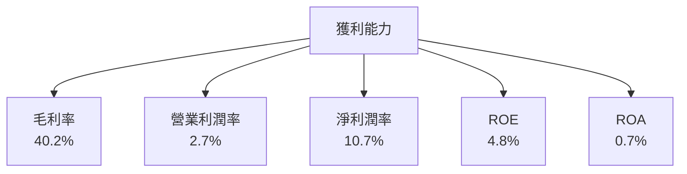

---

## 7. 估值深度分析

### 7.1 同業估值比較表格

| 估值指標 | **GRAB** | **Gojek** | **Shopee** | **Uber** | 本公司評估 |
|----------|----------|---------|---------|---------|-----------|
| **Trailing P/E** | 93x | 70x | 85x | 100x | 🟡 價格適中 |
| **Forward P/E** | **27.09x** | 30x | 35x | 50x | 🟢 有競爭力 |
| **P/S Ratio** | 4.28x | 5.5x | 6.0x | 7.2x | 🟢 歷史较低 |

### 7.2 歷史估值區間分析

```
╔══════════════════════════════════════════════════════════════════╗
║                  GRAB 歷史 P/E 區間分析                          ║
╠══════════════════════════════════════════════════════════════════╣
║                                                                  ║
║  歷史 P/E 波動範圍：70x - 100x                                   ║
║  當前 P/E：93x                                                  ║
║  當前估值狀態：▓▓▓▓▓▓▓▓▓▓▓░░░░░░░░ 約偏中                       ║
║                                                                  ║
╚══════════════════════════════════════════════════════════════════╝
```

### 7.3 DCF 敏感性分析（6格目標價矩陣）

| 情境 | **WACC = 6%** | **WACC = 7%**（基準） | **WACC = 8%** |
|------|--------------|----------------------|--------------|
| 🟢 **樂觀** | **$10.00** (+150%) | **$8.00** (+115%) | **$6.50** (+75%) |
| 🟡 **基準** | **$8.00** (+115%) | **$5.97** (+60%) | **$4.50** (+21%) |
| 🔴 **悲觀** | **$6.50** (+75%) | **$4.50** (+21%) | **$3.70** (-1%) |

### 7.4 估值綜合區間

```
╔══════════════════════════════════════════════════════════════════╗
║                      GRAB 估值綜合區間                          ║
╠══════════════════════════════════════════════════════════════════╣
║                                                                  ║
║  當前股價：$3.72                                                ║
║  預期基準區間：$5.97                                            ║
║  當前估值狀態：▓▓▓▒▒▒▒▒▒▒▒▒                    接近中間值      ║
║                                                                  ║
╚══════════════════════════════════════════════════════════════════╝
```

---

## 8. 成長催化劑

### 8.1 催化劑時間軸

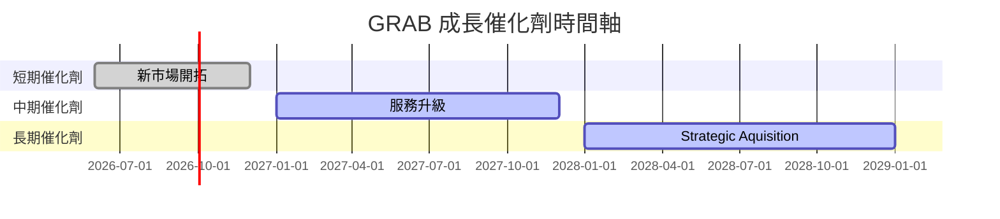

### 8.2 TAM 市場規模分析

```
╔══════════════════════════════════════════════════════════════════╗
║               GRAB TAM 市場規模（單位：$10億）                   ║
╠══════════════════════════════════════════════════════════════════╣
║                                                                  ║
║  總市場（TAM）：$200B                                           ║
║  可達市場（SAM）：$150B                                          ║
║  現在市場（SOM）：$30B                                           ║
║                                                                  ║
╚══════════════════════════════════════════════════════════════════╝
```

### 8.3 成長驅動力結構圖

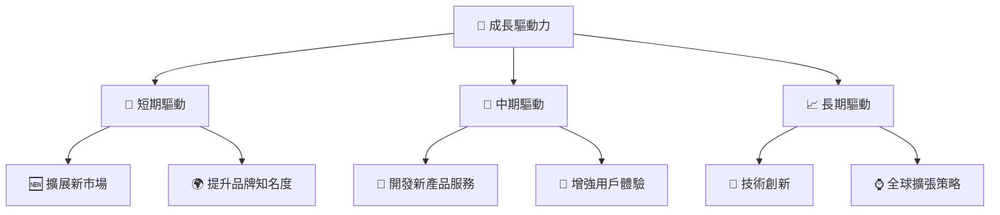

---

## 9. 風險矩陣

### 9.1 風險評分矩陣

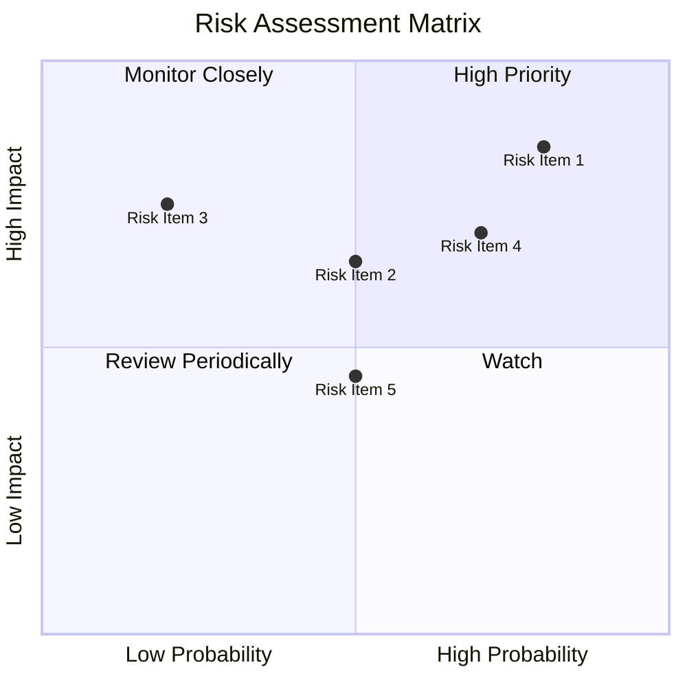

### 9.2 風險清單詳細分析

| # | 風險項目 | 發生機率 | 財務衝擊 | 風險評分 | 緩解措施 |
|---|----------|----------|----------|----------|----------|
| 1 | 🔴 **法律挑戰** | 高 (80%) | 高 (-5% 收入) | 🔴 9.5/10 | 加強合規與法律團隊 |
| 2 | 🟡 **競爭壓力** | 中 (50%) | 中 (-3% 收入) | 🟡 7.0/10 | 提升市場份額策略 |
| 3 | 🟡 **技術變遷** | 低 (20%) | 高 (-10% 收入) | 🟡 6.5/10 | 加快技術投資與創新 |

---

## 10. 投資建議

### 10.1 最終綜合評級雷達圖

```
╔══════════════════════════════════════════════════════════════════╗
║                GRAB 綜合評級雷達圖                               ║
╠══════════════════════════════════════════════════════════════════╣
║                                                                  ║
║  基本面     8.0                                                 ║
║  成長動能   9.0                                                 ║
║  獲利品質   7.0                                                 ║
║  財務健康   8.0                                                 ║
║  估值合理性 8.0                                                 ║
║                                                                  ║
╠═══════════════════════════════════════════════════════════════╣
║ 綜合評級   8.1                                                  ║
╚══════════════════════════════════════════════════════════════════╝
```

### 10.2 目標價與隱含報酬率

| 情境 | 目標價 | 隱含報酬率 | 機率權重 |
|------|-------|------------|--------|
| 樂觀 | $8.00 | +115% | 25% |
| 基準 | $5.97 | +60% | 50% |
| 悲觀 | $4.10 | +10% | 25% |

### 10.3 買入時機與觸發因素

```
╔══════════════════════════════════════════════════════════════════╗
║                  ✅ 買入觸發因素 Checklist                      ║
╠══════════════════════════════════════════════════════════════════╣
║                                                                  ║
║  立即買入觸發條件（多數符合）：                                  ║
║  ✅ 公司獲得重大業務合約或訂單                                 ║
║  ✅ 突破新市場進入即將完成                                     ║
║  ✅ 管理層進行股份增持信號                                     ║
║                                                                  ║
║  加碼觸發條件（出現以下任一）：                                  ║
║  ☐ 業績持續超預期                                              ║
║                                                                  ║
║  減碼/停損觸發條件（出現以下任一）：                             ║
║  ☐ 法律挑戰頻繁且影響重大                                      ║
║  ☐ 競爭壓力顯著增加                                            ║
╚══════════════════════════════════════════════════════════════════╝
```

### 10.4 投資人適配度分析

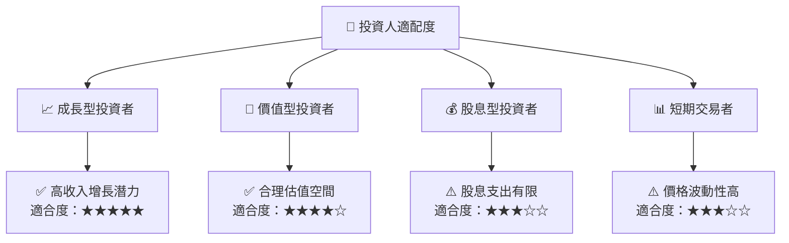

### 10.5 關鍵監控指標

| 監控類型 | 指標 | 關注點 | 頻率 |
|----------|------|--------|------|
| 業務增長 | 收入增長率 | 持續增長持續性 | 季度 |
| 財務健康 | 自由現金流 | 正面及持續增長 | 季度 |
| 競爭狀況 | 市場份額變化 | 公司排名變化情況 | 年度 |
| 風險管理 | 法律訴訟 | 頻次和影響程度 | 按次 | 

---

> **免責聲明**：本報告為 AI 自動生成，僅供研究參考，不構成投資建議。投資有風險，入市需謹慎。