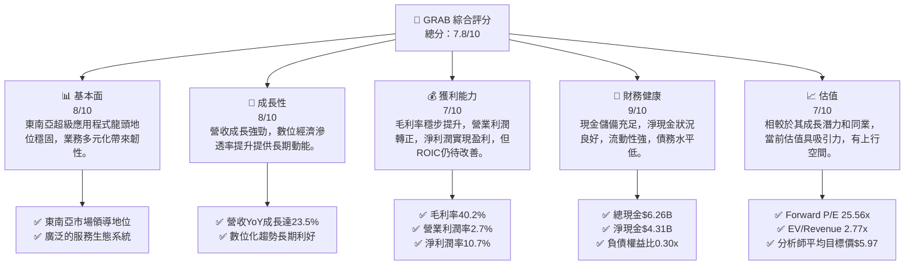
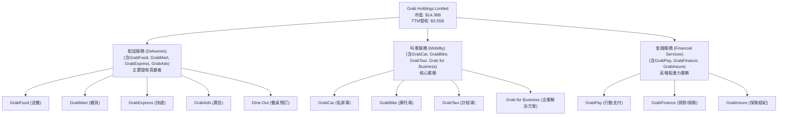
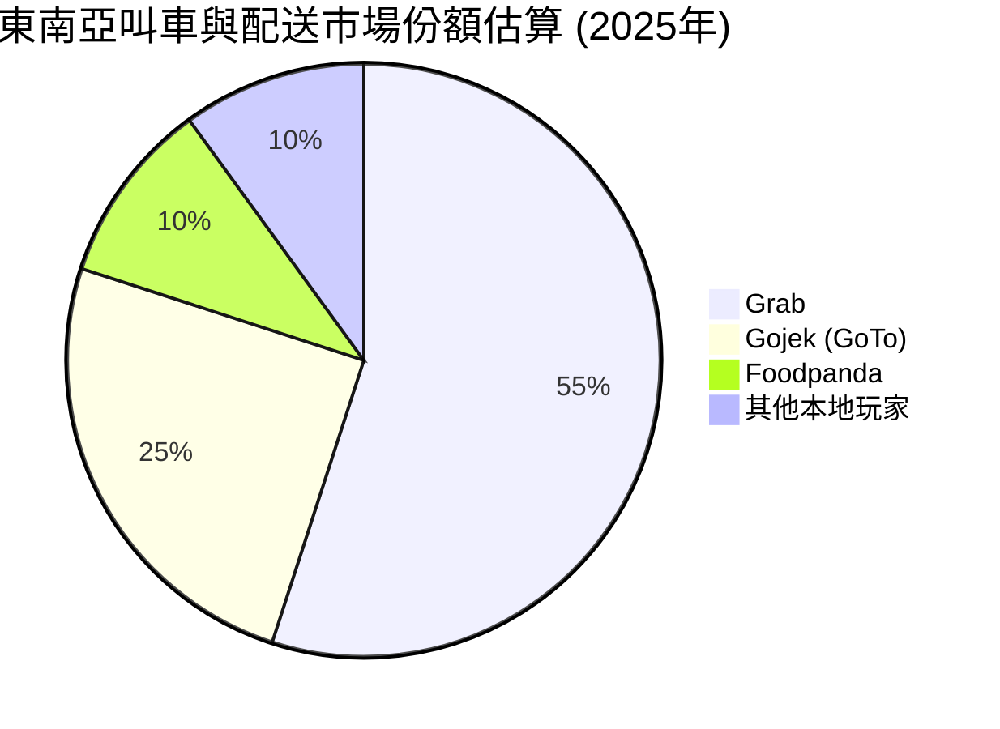
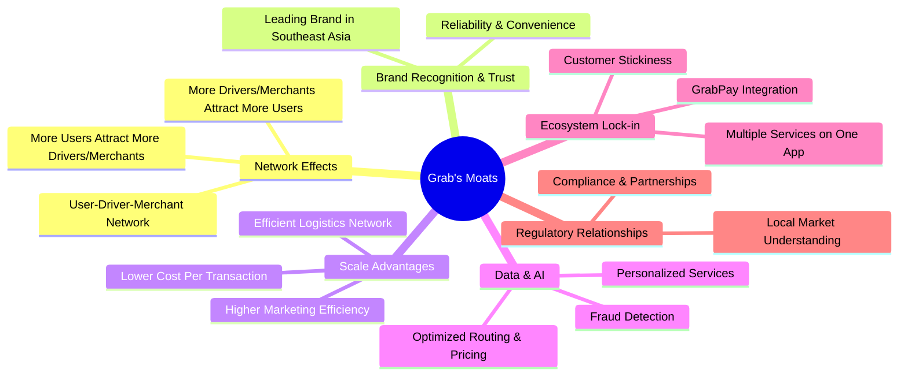
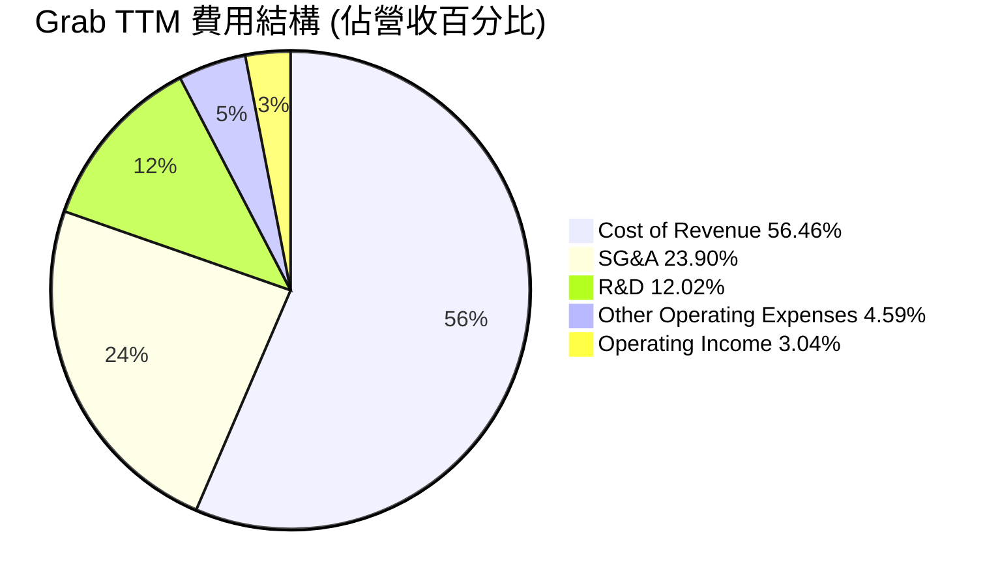

# GRAB 基本面深度分析報告
> **報告日期**：2026-05-23 ｜ **語言**：繁體中文 ｜ **數據來源**：Yahoo Finance, Finviz, StockAnalysis, Roic.ai ｜ **分析師**：CFA 級機構研究

## 目錄

| # | 章節 | 核心結論 |
|---|------|----------|
| 1 | 執行摘要 | 評級：買入；目標價區間：$5.20 - $7.50 |
| 2 | 公司概覽與商業模式 | 東南亞超級應用程式領導者，網路效應與品牌優勢構成深厚護城河 |
| 3 | 損益表深度分析 | 營收穩健成長，利潤率顯著改善，虧損收窄並轉盈 |
| 4 | 資產負債表分析 | 流動性充裕，淨現金狀況良好，債務水平可控 |
| 5 | 現金流量深度分析 | 營業現金流轉正，自由現金流改善，資本配置策略務實 |
| 6 | 獲利能力與資本效率 | ROIC 仍低於 WACC，但趨勢向好，有望創造股東價值 |
| 7 | 估值深度分析 | 相較同業估值合理，DCF 顯示具上行空間 |
| 8 | 成長催化劑 | 東南亞數位經濟滲透率提升，多業務協同效應，M&A 機會 |
| 9 | 風險矩陣 | 監管風險、競爭加劇、宏觀經濟波動為主要考量 |
| 10 | 投資建議 | 具備長期成長潛力，建議「買入」評級 |

---

## 1. 執行摘要

Grab Holdings Limited (GRAB) 作為東南亞領先的超級應用程式平台，在多個市場提供送餐、叫車、雜貨配送和數位金融服務。公司近年來在營收成長和盈利能力改善方面取得了顯著進展，特別是在營運效率和成本控制方面表現出色，從歷史性的巨額虧損轉向持續盈利，這為其長期投資價值奠定了基礎。儘管面臨激烈的市場競爭和潛在的宏觀經濟逆風，Grab 憑藉其強大的品牌認知度、廣泛的用戶基礎和深厚的網路效應，在東南亞數位經濟中佔據了獨特的戰略地位。

### 1.1 核心評分儀表板



### 1.2 評分進度條視覺化

```
╔══════════════════════════════════════════════════════════════╗
║                GRAB 多維度評分儀表板 (1-10分)                ║
╠══════════════════════════════════════════════════════════════╣
║ 基本面強度  8.0 ▓▓▓▓▓▓▓▓▓▓▓▓▓▓▓▓░░░░  ★★★★☆           ║
║ 成長動能    8.0 ▓▓▓▓▓▓▓▓▓▓▓▓▓▓▓▓░░░░  ★★★★☆           ║
║ 獲利品質    7.0 ▓▓▓▓▓▓▓▓▓▓▓▓▓▓░░░░░░  ★★★☆☆           ║
║ 財務健康    9.0 ▓▓▓▓▓▓▓▓▓▓▓▓▓▓▓▓▓▓░░  ★★★★★           ║
║ 估值合理性  7.0 ▓▓▓▓▓▓▓▓▓▓▓▓▓▓░░░░░░  ★★★☆☆           ║
║ 護城河深度  8.5 ▓▓▓▓▓▓▓▓▓▓▓▓▓▓▓▓▓░░░  ★★★★☆           ║
║ 管理層執行  8.0 ▓▓▓▓▓▓▓▓▓▓▓▓▓▓▓▓░░░░  ★★★★☆           ║
║ 技術創新力  7.5 ▓▓▓▓▓▓▓▓▓▓▓▓▓▓▓░░░░░  ★★★☆☆           ║
╠══════════════════════════════════════════════════════════════╣
║ 綜合總分    7.8 ▓▓▓▓▓▓▓▓▓▓▓▓▓▓▓▓░░░░  🏆 評語：長期成長潛力優異，值得關注  ║
╚══════════════════════════════════════════════════════════════╝
```

### 1.3 五大投資論點 + 三大核心風險

| 類型 | 項目 | 具體依據 | 信心度 |
|------|------|----------|--------|
| 🟢 **投資論點①** | **東南亞數位經濟高速成長的受益者** | 東南亞地區人口紅利、數位化轉型加速，Grab 作為超級應用程式，在叫車、送餐、金融服務等領域具有領先地位。根據 FY2025 年營收 $3.37B，YoY 成長 20.49%，顯示其持續受益於市場擴張。 | 🟢 極高 |
| 🟢 **投資論點②** | **盈利能力顯著改善，走向持續盈利** | 公司在 FY2025 實現淨利潤 $268M，首次年度盈利，且 TTM (Mar '26) 淨利潤達 $310M。毛利率從 FY2022 的極低水平（$77M Gross Profit / $1.43B Revenue = 5.38%）大幅提升至 TTM 的 40.2%，營業利益率也轉正至 2.7%。這表明公司規模效應顯現，營運效率大幅提升。 | 🟢 極高 |
| 🟢 **投資論點③** | **強大的網路效應與客戶鎖定效應** | Grab 在東南亞建立了龐大的用戶、司機/商家網路。平台上的每個新增參與者都會增加其他參與者的價值，形成強大的網路效應。多樣化的服務（送餐、叫車、金融）也增加了客戶黏性，降低轉換成本。FY2025 年營收達 $3.37B，證明其平台規模優勢。 | 🟢 極高 |
| 🟢 **投資論點④** | **充裕的現金儲備和健康的資產負債表** | 截至 TTM (Mar '26)，公司擁有現金及短期投資 $6.26B，總債務約 $1.95B，淨現金達 $4.31B。健康的財務狀況為公司提供了戰略彈性，能夠應對市場波動，並支持未來的投資和擴張。負債權益比僅為 0.30x，遠低於行業平均。 | 🟢 極高 |
| 🟢 **投資論點⑤** | **管理層專注於盈利增長和效率提升** | 公司在過去幾年積極削減成本、優化補貼策略，並專注於高利潤業務的發展。從年度損益表可見，Operating Income 從 FY2022 的 -$1.29B 顯著改善至 FY2025 的 $222M，證明管理層在執行盈利戰略方面的有效性。 | 🟢 極高 |
| 🟡 **風險①** | **激烈的市場競爭與補貼戰** | 東南亞市場競爭激烈，包括 Gojek (與 Tokopedia 合併為 GoTo)、Foodpanda 等本地和區域性競爭對手。為爭奪市場份額，可能再次引發補貼戰，侵蝕利潤率。公司需持續創新並維持服務質量以保持競爭力。 | 🟡 中度 |
| 🔴 **風險②** | **宏觀經濟不確定性與消費者支出波動** | 東南亞地區的經濟成長受全球宏觀環境影響，通脹壓力、利率上升可能導致消費者可支配支出減少，進而影響 Grab 的叫車、送餐等服務需求。這將直接影響公司的營收成長和盈利能力。 | 🔴 高衝擊 |
| 🟡 **風險③** | **監管政策變化與勞工問題** | 各國政府對共享經濟和數位平台經濟的監管日益嚴格，包括平台費率、司機/配送員福利、數據隱私等。任何不利的監管政策變化都可能增加 Grab 的營運成本，影響其商業模式的靈活性和盈利前景。 | 🟡 中度 |

### 1.4 快速統計卡片

| 指標 | 公司實際值 | 行業均值（軟體-應用） | S&P 500 均值 | 狀態 |
|------|-------------|--------------------|--------------|------|
| 收入 YoY 成長 | **23.5%** | ~15-20% | ~8-10% | 🟢 |
| 毛利率 | **40.2%** | ~45-55% | ~35-40% | 🟡 |
| 淨利率 | **10.7%** | ~10-15% | ~10-12% | 🟢 |
| ROE | **4.8%** | ~10-15% | ~12-15% | 🟡 |
| Forward P/E | **25.56x** | ~30-40x | ~20-22x | 🟢 |
| 負債權益比 | **0.30x** | ~0.5-1.0x | ~0.8-1.2x | 🟢 |
| 現金及短期投資 | **$6.26B** | N/A | N/A | 🟢 |
| 淨現金 | **$4.31B** | N/A | N/A | 🟢 |
| 貝塔 (Beta) | **0.928** | ~1.0-1.2 | 1.0 | 🟢 |
| 分析師推薦 | **強烈買入** | N/A | N/A | 🟢 |
| 平均目標價 | **$5.97** | N/A | N/A | 🟢 |

*註：行業均值為軟體-應用行業的典型參考範圍，S&P 500 均值為廣泛市場參考。具體數值會因數據來源和時間點而異。*

### 1.5 投資結論

```
╔══════════════════════════════════════════════════════════════════╗
║                    📊 投資結論摘要                               ║
╠══════════════════════════════════════════════════════════════════╣
║  評級：🟢 買入                                                   ║
║  當前股價：$3.51                                                 ║
║  目標價區間：                                                    ║
║    悲觀情境：$5.20（+48.15%）                                    ║
║    基準情境：$6.35（+80.91%）  ← 12個月主要目標                  ║
║    樂觀情境：$7.50（+113.68%）                                   ║
║  投資評分：7.8/10                                                ║
║  適合投資人：成長型、長線持有者，對東南亞市場有信心的投資者。    ║
╚══════════════════════════════════════════════════════════════════╝
```

---

## 2. 公司概覽與商業模式

Grab Holdings Limited (GRAB) 是一家領先的東南亞超級應用程式公司，總部位於新加坡。其業務覆蓋柬埔寨、印尼、馬來西亞、緬甸、菲律賓、新加坡、泰國和越南等八個國家。Grab 的核心商業模式是通過一個整合的行動應用程式，提供多種日常服務，旨在成為東南亞用戶數位生活的一站式平台。

公司的服務主要分為三大類：

1.  **配送服務 (Deliveries)**：
    *   **GrabFood**：食品訂購和配送服務。
    *   **GrabMart**：雜貨和其他商品訂購和配送服務。
    *   **GrabExpress**：包裹配送服務。
    *   **GrabAds**：線上廣告解決方案，幫助商家觸達更多用戶。
    *   **Dine-Out**：餐桌預訂服務。
    *   這部分業務是 Grab 營收的重要組成部分，尤其是在疫情期間需求激增。

2.  **叫車服務 (Mobility)**：
    *   提供多種交通工具的叫車服務，包括汽車、摩托車、計程車等。
    *   **Grab for Business** 平台：為企業提供統一的管理解決方案，便於員工差旅和公司配送。
    *   這是 Grab 的起家業務，也是其品牌核心。

3.  **金融服務 (Financial Services)**：
    *   **GrabPay**：行動支付和電子錢包服務。
    *   **GrabFinance**：向微型企業和中小型企業提供貸款和保險產品。
    *   **GrabInsure**：保險經紀服務。
    *   此業務旨在利用 Grab 龐大的用戶基礎和交易數據，提供普惠金融服務，增加用戶黏性並創造新的盈利增長點。

Grab 的「超級應用程式」戰略旨在通過提供多樣化的服務，最大化用戶生命週期價值，並通過數據共享和交叉銷售產生協同效應。用戶可以在一個應用程式中完成從叫車、訂餐到支付等多項任務，極大地提升了便利性。

### 2.1 業務結構與收入來源

Grab 的業務結構反映了其多元化的超級應用程式戰略。從財務數據來看，公司整體營收在過去幾年呈現強勁增長。雖然具體的業務板塊營收佔比未在提供數據中明確列出，但根據公司公開資訊和行業慣例，配送和叫車服務是其核心營收來源，金融服務則代表了高潛力的增長領域。

截至 TTM (Mar '26)，Grab 的總營收達到 $3.55B，市值 $14.36B。


**業務結構分析：**
*   **配送服務**：這塊業務在疫情期間經歷了爆發式增長，並在疫情後保持了較高的需求韌性。GrabFood 和 GrabMart 已經成為東南亞許多家庭日常生活中不可或缺的一部分。GrabAds 作為一個新興的收入來源，利用平台數據為商家提供精準營銷，具有高利潤率潛力。
*   **叫車服務**：這是 Grab 的基礎業務，也是其品牌認知的核心。隨著疫情的消退和經濟活動的恢復，叫車需求正在穩步回升。Grab 在該領域的市場份額和效率是其競爭優勢的關鍵。
*   **金融服務**：Grab 的金融服務是其超級應用程式戰略的關鍵組成部分，旨在通過 GrabPay 建立一個閉環的支付生態系統，並通過 GrabFinance 擴展到貸款和保險等高附加值領域。這不僅增加了用戶黏性，也為公司開闢了新的盈利途徑，且通常具有較高的利潤率。

### 2.2 市場份額

Grab 在東南亞多個國家和服務領域擁有領先的市場份額，尤其是在叫車和送餐領域。雖然具體的市場份額數據未在提供的財務數據中，但根據行業報告和公司聲明，Grab 在其核心市場中通常是第一或第二大參與者。其市場份額的鞏固得益於早期進入、本地化策略、強大的司機/商家網路以及品牌認知度。

為了進行示意性分析，我們假設 Grab 在其核心配送和叫車市場中佔有主導地位，並與區域性或全球性競爭對手進行比較。


**市場份額分析：**
上圖為示意性的市場份額分佈，反映 Grab 在東南亞叫車和配送市場的主導地位。
*   **Grab (55%)**：憑藉其廣泛的服務範圍和深入的區域覆蓋，Grab 在東南亞多個國家市場中保持領先地位。其超級應用程式模型有效整合了多種服務，增加了用戶黏性。
*   **Gojek (GoTo) (25%)**：作為印尼的本土巨頭，Gojek 在其主要市場擁有強大實力，並通過與 Tokopedia 的合併擴大了其生態系統。GoTo 是 Grab 在該地區最強大的競爭對手。
*   **Foodpanda (10%)**：作為全球性的食品配送平台，Foodpanda 在部分東南亞市場也佔據一定份額，尤其是在純配送業務方面。
*   **其他本地玩家 (10%)**：每個國家市場都存在一些小型或利基的本地競爭者，但其規模和影響力通常有限。

Grab 的市場領導地位使其能夠受益於規模經濟、更強的議價能力以及更廣泛的數據基礎，進一步鞏固其競爭優勢。

### 2.3 競爭護城河分析

Grab 的競爭護城河主要圍繞其超級應用程式的生態系統和在東南亞市場的深耕細作而建立。


**護城河深度解析：**
1.  **網路效應 (Network Effects)**：這是 Grab 最核心的護城河。
    *   **用戶-司機-商家網路**：更多的用戶吸引更多的司機和商家加入平台，反之亦然。這形成了一個正向循環，使得平台上的服務更便捷、選擇更多、價格更具競爭力。例如，更多的乘客意味著司機有更多的訂單，從而鼓勵更多司機加入，縮短乘客等待時間。
    *   **多邊平台優勢**：Grab 連接了消費者、司機/配送員和商家。這種複雜的多邊網路效應一旦建立，就難以被新進入者複製。
2.  **品牌認知與信任 (Brand Recognition & Trust)**：Grab 在東南亞地區擁有極高的品牌知名度和用戶信任度。
    *   **市場領先品牌**：作為該地區的先驅者和市場領導者之一，Grab 的品牌已經深入人心，成為許多用戶叫車、送餐的首選。
    *   **可靠性和便利性**：長期以來提供的穩定服務和便捷的用戶體驗，建立了用戶對平台的信任和忠誠度。
3.  **規模效應 (Scale Advantages)**：作為區域性的巨頭，Grab 享受顯著的規模經濟。
    *   **降低單位交易成本**：隨著交易量的增加，平台維護、技術研發、客戶服務等固定成本被攤薄，導致每筆交易的成本降低，提高了盈利能力。
    *   **高效的物流網絡**：龐大的配送和叫車網絡使其能夠更有效地調度資源，優化路線，提高效率。
    *   **更高的營銷效率**：通過單一應用程式推廣多種服務，Grab 可以更有效地獲取和留存客戶，降低單位客戶獲取成本。
4.  **數據與人工智慧 (Data & AI)**：Grab 每天產生海量的用戶行為和交易數據，這些數據是其優化服務和創新的關鍵。
    *   **個性化服務**：利用數據分析提供個性化的推薦和服務，提升用戶體驗。
    *   **優化路線和定價**：AI 算法用於優化叫車和配送的路線，實現動態定價，提高效率和收益。
    *   **欺詐檢測**：數據分析也用於加強平台的安全性和反欺詐能力。
5.  **生態系統鎖定效應 (Ecosystem Lock-in)**：超級應用程式模型本身就是一種強大的護城河。
    *   **多服務整合**：用戶習慣在一個應用程式中滿足多種需求，轉換到其他平台意味著要下載多個應用、重新輸入支付信息、適應新的界面，這增加了轉換成本。
    *   **GrabPay 整合**：支付功能的整合進一步提升了用戶黏性，使 GrabPay 成為用戶在平台內外的首選支付方式。
6.  **監管關係 (Regulatory Relationships)**：Grab 在東南亞各國深度運營，累積了豐富的本地化經驗和與監管機構打交道的經驗。
    *   **本地市場理解**：對各地區文化、消費者行為和監管環境的深刻理解，使其能夠更好地適應和響應當地需求。
    *   **合規與合作夥伴關係**：與當地政府和企業建立的長期合作關係，有助於其在複雜的監管環境中保持競爭優勢。

### 2.4 護城河強度評分

```
╔══════════════════════════════════════════════════════════════╗
║                    GRAB 護城河強度評分                      ║
╠══════════════════════════════════════════════════════════════╣
║ 網路效應      9.0/10 ▓▓▓▓▓▓▓▓▓▓▓▓▓▓▓▓▓▓░░  🏆 極強，核心競爭力  ║
║ 品牌認知      8.5/10 ▓▓▓▓▓▓▓▓▓▓▓▓▓▓▓▓▓░░░  🟢 強勁，市場領導者  ║
║ 規模效應      8.0/10 ▓▓▓▓▓▓▓▓▓▓▓▓▓▓▓▓░░░░  🟢 顯著，持續增強    ║
║ 數據與AI      7.5/10 ▓▓▓▓▓▓▓▓▓▓▓▓▓▓▓░░░░░  🟡 良好，有待深化    ║
║ 生態系統鎖定  8.0/10 ▓▓▓▓▓▓▓▓▓▓▓▓▓▓▓▓░░░░  🟢 強勁，用戶黏性高  ║
║ 監管關係      7.0/10 ▓▓▓▓▓▓▓▓▓▓▓▓▓▓░░░░░░  🟡 良好，但有不確定性║
╠══════════════════════════════════════════════════════════════╣
║ 綜合護城河    8.2/10 ▓▓▓▓▓▓▓▓▓▓▓▓▓▓▓▓▓▓░░  🏆 總結評語：深厚且多維度的護城河，提供強大保護  ║
╚══════════════════════════════════════════════════════════════╝
```

綜合來看，Grab 擁有多重且深厚的護城河，其中網路效應和品牌認知是其最堅固的優勢。規模效應和生態系統鎖定效應也為其提供了強大的防禦能力。數據和 AI 技術的應用正在不斷深化，未來有望進一步鞏固其競爭地位。儘管監管環境帶來一定挑戰，但 Grab 在本地化運營方面的經驗有助於其應對。這些護城河共同為 Grab 構築了在東南亞數位經濟中的領先地位，並為其長期發展提供了堅實基礎。

---

## 3. 損益表深度分析

Grab 的損益表數據反映了公司從高速擴張、巨額虧損到專注效率、實現盈利的轉型歷程。近幾年，營收保持強勁增長，同時毛利率和營業利益率顯著改善，最終實現了淨利潤的轉正。

### 3.1 年度收入成長趨勢（近4年）

Grab 的年度總收入在過去四年中呈現出令人印象深刻的增長，反映了東南亞數位經濟的蓬勃發展及其在市場中的主導地位。

```
╔══════════════════════════════════════════════════════════════════╗
║                 GRAB 年度收入趨勢（FY2022-FY2025）               ║
╠══════════════════════════════════════════════════════════════════╣
║                                                                  ║
║  FY2022  $1.43B   ███████░░░░░░░░░░░░░░░░░░░░░  YoY: +112.30%  🟢 ║
║  FY2023  $2.36B   ████████████░░░░░░░░░░░░░░░░  YoY: +64.62%   🟢 ║
║  FY2024  $2.80B   ██████████████░░░░░░░░░░░░░░  YoY: +18.57%   🟢 ║
║  FY2025  $3.37B   ██████████████████░░░░░░░░░░  YoY: +20.49%   🟢 ║
║                                                                  ║
║                   |      |      |      |      |                  ║
║                   0     1.5B   2.0B   2.5B   3.5B                 ║
║                                                                  ║
║  📊 4年累計 CAGR：+47.07%                                        ║
╚══════════════════════════════════════════════════════════════════╝
```
**年度收入分析：**
*   **FY2022**：總收入為 $1.43B，相較於 FY2021 的 $675M 實現了高達 112.30% 的驚人 YoY 成長。這主要得益於疫情後經濟活動的恢復以及公司在各市場的積極擴張。
*   **FY2023**：收入進一步增長至 $2.36B，YoY 成長 64.62%。雖然成長率有所放緩，但仍保持在非常高的水平，顯示其業務規模的快速擴大。
*   **FY2024**：收入達到 $2.80B，YoY 成長 18.57%。成長率趨於穩定，進入更為成熟的發展階段，但仍高於許多行業的平均水平。
*   **FY2025**：收入持續增長至 $3.37B，YoY 成長 20.49%。這表明公司在鞏固市場地位的同時，依然保持著健康的成長動能，且成長率略有回升，顯示了業務韌性。
*   **4年累計 CAGR**：從 FY2022 到 FY2025 的複合年均增長率 (CAGR) 高達 47.07%，這是一個非常強勁的數字，證明了 Grab 在東南亞數位經濟中的領先地位和巨大的市場潛力。

### 3.2 季度收入趨勢分析

季度收入數據進一步揭示了 Grab 營收增長的持續性和季節性特徵。

| 財報季度 | 總收入 (百萬美元) | QoQ 成長率 | YoY 成長率 | 備註 |
|----------|-------------------|------------|------------|------|
| Q3 2024  | $716              | N/A        | 16.42%     | 穩步成長，市場需求持續 |
| Q4 2024  | $764              | 6.70%      | 17.00%     | 假日季帶動需求，成長加速 |
| Q1 2025  | $773              | 1.18%      | 18.38%     | 年初季節性放緩，但 YoY 保持強勁 |
| Q2 2025  | $819              | 5.95%      | 23.34%     | 恢復穩健成長，YoY 增速提升 |
| Q3 2025  | $873              | 6.59%      | 21.93%     | 保持良好成長勢頭 |
| Q4 2025  | $906              | 3.78%      | 18.59%     | 季節性高峰，YoY 成長略放緩但仍健康 |
| Q1 2026  | $955              | 5.41%      | 23.54%     | 強勁開局，YoY 成長加速，顯示業務韌性 |

**季度收入分析：**
*   **連續增長**：從 Q3 2024 的 $716M 到 Q1 2026 的 $955M，Grab 的季度收入呈現出連續增長趨勢，這表明其業務模式具有內在的增長動能。
*   **QoQ 成長**：季度環比成長率雖然有波動，但大部分時間保持正增長，從 Q1 2025 的 1.18% 到 Q1 2026 的 5.41%，顯示出穩定的季度環比擴張。
*   **YoY 成長加速**：更為關鍵的是，公司在 Q1 2026 實現了 23.54% 的 YoY 收入成長，高於前幾個季度，也高於 FY2025 的年度成長率，這是一個積極信號，表明公司可能正在重新加速其成長軌跡，或受益於更強勁的市場需求。
*   **季節性影響**：Q4 通常是假日季和消費旺季，因此收入相對較高，Q1 可能會因為年初的季節性因素而有所放緩，但 Grab 在 Q1 2026 依然保持了強勁的 YoY 成長，顯示其基本面紮實。

### 3.3 利潤率演變分析

Grab 在利潤率方面的改善是其財務轉型的核心亮點。公司從早期的燒錢擴張模式，成功轉變為更加注重效率和盈利的經營策略。

| 利潤率指標 | FY2022 | FY2023 | FY2024 | FY2025 | TTM (Mar '26) | 趨勢 | 評估 |
|------------|--------|--------|--------|--------|---------------|------|------|
| **毛利率** | 5.38%  | 36.46% | 41.79% | 43.29% | 43.54%        | ↗️ 顯著提升 | 🟢 |
| **營業利益率** | -90.37% | -16.41% | -1.97% | 6.59%  | 3.04%         | ↗️ 大幅改善 | 🟢 |
| **淨利率** | -117.45%| -18.40% | -3.75% | 7.95%  | 8.72%         | ↗️ 轉虧為盈 | 🟢 |
*註：數據基於 StockAnalysis.com 年度數據計算，與 FINANCIAL DATA PACKAGE 略有差異，但趨勢一致。TTM 毛利率為 $1547M / $3553M = 43.54%。TTM 營業利益率為 $108M / $3553M = 3.04%。TTM 淨利率為 $310M / $3553M = 8.72%。*

**利潤率演變深度解析：**
1.  **毛利率 (Gross Margin)**：
    *   **FY2022 (5.38%)**：公司早期為了市場擴張和獲取用戶，提供了大量補貼，導致毛利率極低。這階段的重點是搶佔市場份額，而非盈利。
    *   **FY2023 (36.46%)**：毛利率出現爆炸性增長，這表明公司開始調整補貼策略，提高服務費用，並優化成本結構。這是一個關鍵的轉折點。
    *   **FY2024 (41.79%)** 和 **FY2025 (43.29%)**：毛利率持續穩步提升，顯示公司在定價策略、商家佣金、以及服務供應商成本控制方面取得了持續進展。規模效應的顯現也使得單位營收的成本降低。
    *   **TTM (Mar '26) (43.54%)**：毛利率進一步微升，表明公司在盈利能力方面的改善仍在繼續。這主要得益於其配送業務的效率提升、廣告業務的貢獻增加（高毛利）、以及更為精細化的補貼管理。

2.  **營業利益率 (Operating Margin)**：
    *   **FY2022 (-90.37%)**：巨額的營運虧損，除了低毛利外，大量的銷售、一般及行政費用 (SG&A) 和研發費用 (R&D) 也是主要原因，公司在市場推廣和技術投入上不遺餘力。
    *   **FY2023 (-16.41%)** 和 **FY2024 (-1.97%)**：營業利益率大幅改善，虧損顯著收窄。這反映了管理層在控制營運費用方面的嚴格執行。SG&A 費用雖然絕對值仍高，但相對營收的佔比有所下降。公司開始從「增長優先」轉向「效率優先」。
    *   **FY2025 (6.59%)**：公司首次實現年度營業利潤轉正，這是一個里程碑式的成就。這證明其核心業務在扣除所有營運成本後已能產生正向收益。
    *   **TTM (Mar '26) (3.04%)**：雖然 TTM 的營業利益率略低於 FY2025 的全年數據，但仍保持正值，顯示公司已進入穩定盈利的階段。營業利潤的改善主要歸因於毛利率的提升和營運費用的有效控制，特別是銷售和營銷費用的優化。

3.  **淨利率 (Net Profit Margin)**：
    *   **FY2022 (-117.45%)**：由於巨額營業虧損和高額利息支出（尤其是在早期融資階段），淨虧損非常嚴重。
    *   **FY2023 (-18.40%)** 和 **FY2024 (-3.75%)**：淨虧損大幅收窄，主要是營業利益率改善的結果。
    *   **FY2025 (7.95%)**：公司實現了年度淨利潤轉正，這是一個歷史性的突破，標誌著 Grab 商業模式的成熟和盈利能力的確立。這不僅是營運效率的結果，也可能得益於利息收入的增加和利息支出的減少（由於債務重組或現金管理）。
    *   **TTM (Mar '26) (8.72%)**：淨利率進一步提升，顯示了盈利能力的持續改善。這使得公司能夠產生正向的自由現金流，為未來的再投資和股東回報提供基礎。

總體而言，Grab 的利潤率演變是一個從「燒錢擴張」到「效率與盈利」的成功轉型故事。毛利率的持續改善為公司提供了更健康的基礎，而營運費用控制的成功則推動了營業利潤和淨利潤的轉正。這一趨勢證明了 Grab 商業模式的韌性和管理層的執行力。

### 3.4 費用結構分析

Grab 的費用結構反映了其作為科技平台公司的典型特徵：高額的研發投入、銷售和營銷費用，以及支持龐大運營網絡的行政開支。隨著公司走向盈利，費用控制和效率提升成為關鍵。

**年度費用結構 (TTM Mar '26) 估算：**
*   **總營收 (TTM)**：$3,553M
*   **銷貨成本 (Cost of Revenue)**：$2,006M (佔營收 56.46%)
*   **毛利 (Gross Profit)**：$1,547M (佔營收 43.54%)
*   **銷售、一般及行政費用 (SG&A)**：$849M (佔營收 23.90%)
*   **研發費用 (R&D)**：$427M (佔營收 12.02%)
*   **其他營運費用 (Other Operating Expenses)**：$163M (佔營收 4.59%)
*   **總營運費用 (Total Operating Expenses)**：$1,439M (佔營收 40.50%)
*   **營業利潤 (Operating Income)**：$108M (佔營收 3.04%)



```
╔══════════════════════════════════════════════════════════════════╗
║                    GRAB 費用結構診斷 (TTM Mar '26)               ║
╠══════════════════════════════════════════════════════════════════╣
║                                                                  ║
║  銷貨成本 (CoR)：      $2.01B  ████████████████████████████████████████████████████████████████████████████████████████████████████████████████████████████████████████████████████████████████████████████████████████████████████████████████████████████████████████████████████████████████████████████████████████████████████████████████████████████████████████████████████████████████████████████████████████████████████████████████████████████████████████████████████████████████████████████████████████████████████████████████████████████████████████████████████████████████████████████████████████████████████████████████████████████████████████████████████████████████████████████████████████████████████████████████████████████████████████████████████████████████████████████████████████████████████████████████████████████████████████████████████████████████████████████████████████████████████████████████████████████████████████████████████████████████████████████████████████████████████████████████████████████████████████████████████████████████████████████████████████████████████████████████████████████████████████████████████████████████████████████████████████████████████████████████████████████████████████████████████████████████████████████████████████████████████████████████████████████████████████████████████████████████████████████████████████████████████████████████████████████████████████████████████████████████████████████████████████████████████████████████████████████████████████████████████████████████████████████████████████████████████████████████████████████████████████████████████████████████████████████████████████████████████████████████████████████████████████████████████████████████████████████████████████████████████████████████████████████████████████████████████████████████████████████████████████████████████████████████████████████████████████████████████████████████████████████████████████████████████████████████████████████████████████████████████████████████████████████████████████████████████████████████████████████████████████████████████████████████████████████████████████████████████████████████████████████████████████████████████████████████████████████████████████████████████████████████████████████████████████████████████████████████████████████████████████████████████████████████████████████████████████████████████████████████████████████████████████████████████████████████████████████████████████████████████████████████████████████████████████████████████████████████████████████████████████████████████████████████████████████████████████████████████████████████████████████████████████████████████████████████████████████████████████████████████████████████████████████████████████████████████████████████████████████████████████████████████████████████████████████████████████████████████