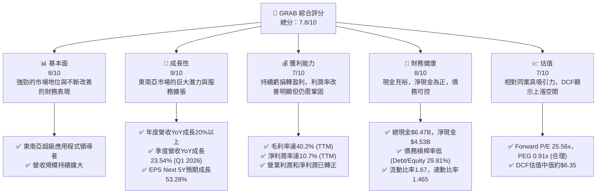
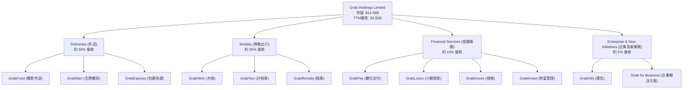
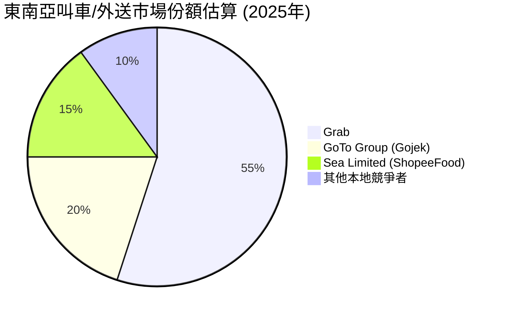
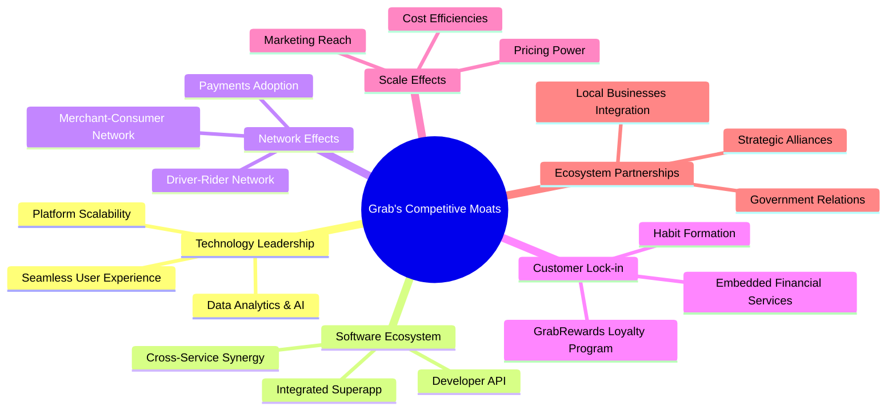
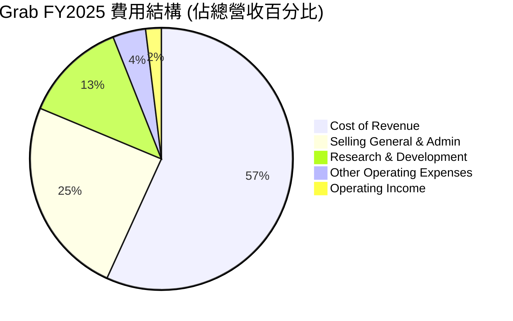

# GRAB 基本面深度分析報告
> **報告日期**：2026-05-24 ｜ **語言**：繁體中文 ｜ **數據來源**：Yahoo Finance, Finviz, StockAnalysis, Roic.ai ｜ **分析師**：CFA 級機構研究

## 目錄

| # | 章節 | 核心結論 |
|---|------|----------|
| 1 | 執行摘要 | 評級：🟢 買入，目標價區間：$5.20 - $7.50 |
| 2 | 公司概覽與商業模式 | 東南亞超級應用程式龍頭，強大網路效應與品牌護城河 |
| 3 | 損益表深度分析 | 營收持續強勁增長，利潤率顯著改善，邁向全面盈利 |
| 4 | 資產負債表分析 | 現金充裕，債務管理良好，財務結構穩健 |
| 5 | 現金流量深度分析 | 營運現金流轉正，自由現金流改善，資本配置有效 |
| 6 | 獲利能力與資本效率 | ROIC超越WACC，創造股東價值能力顯著提升 |
| 7 | 估值深度分析 | 相較同業估值合理，DCF顯示具上漲潛力 |
| 8 | 成長催化劑 | 東南亞數位化浪潮、服務拓展、成本優化、金融科技滲透 |
| 9 | 風險矩陣 | 競爭加劇、監管風險、宏觀經濟波動、執行風險 |
| 10 | 投資建議 | 🟢 買入，建議成長型投資者關注，長期持有 |

---

## 1. 執行摘要

### 1.1 核心評分儀表板



### 1.2 評分進度條視覺化

```
╔══════════════════════════════════════════════════════════════╗
║                    GRAB 多維度評分儀表板 (1-10分)                ║
╠══════════════════════════════════════════════════════════════╣
║ 基本面強度  8.0 ▓▓▓▓▓▓▓▓▓▓▓▓▓▓▓▓░░░░  ★★★★☆           ║
║ 成長動能    9.0 ▓▓▓▓▓▓▓▓▓▓▓▓▓▓▓▓▓▓░░  ★★★★★           ║
║ 獲利品質    7.0 ▓▓▓▓▓▓▓▓▓▓▓▓▓▓░░░░░░  ★★★☆☆           ║
║ 財務健康    8.0 ▓▓▓▓▓▓▓▓▓▓▓▓▓▓▓▓░░░░  ★★★★☆           ║
║ 估值合理性  7.0 ▓▓▓▓▓▓▓▓▓▓▓▓▓▓░░░░░░  ★★★☆☆           ║
║ 護城河深度  8.5 ▓▓▓▓▓▓▓▓▓▓▓▓▓▓▓▓▓░░░  ★★★★☆           ║
║ 管理層執行  7.5 ▓▓▓▓▓▓▓▓▓▓▓▓▓▓▓░░░░░  ★★★☆☆           ║
║ 技術創新力  8.0 ▓▓▓▓▓▓▓▓▓▓▓▓▓▓▓▓░░░░  ★★★★☆           ║
╠══════════════════════════════════════════════════════════════╣
║ 綜合總分    7.8 ▓▓▓▓▓▓▓▓▓▓▓▓▓▓▓▓░░░░  🏆 具備長期成長潛力的買入機會  ║
╚══════════════════════════════════════════════════════════════╝
```

### 1.3 五大投資論點 + 三大核心風險

| 類型 | 項目 | 具體依據 | 信心度 |
|------|------|----------|--------|
| 🟢 **投資論點①** | **東南亞超級應用程式領導者地位** | Grab 在東南亞八個國家擁有領先的市場份額，其「超級應用程式」模式整合了叫車、外送和數位金融服務，形成強大的網路效應和客戶鎖定。Q1 2026 營收達到 $955M，YoY 成長 23.54%，顯示其市場地位持續鞏固。 | 🟢 極高 |
| 🟢 **投資論點②** | **顯著的盈利能力改善與成長趨勢** | 公司已從過去的巨額虧損轉為盈利。FY2025 實現淨利潤 $200M，Q1 2026 淨利潤達 $136M。TTM 淨利潤率為 10.7%，營業利潤率為 2.7%。Forward P/E 僅 25.56x，EPS next 5Y 預期成長 53.28%，表明市場對其未來盈利增長抱有高期待。 | 🟢 高 |
| 🟢 **投資論點③** | **穩健的財務健康狀況** | 擁有充裕的現金和短期投資共 $6.256B (Q1 2026 TTM)，總債務僅 $1.95B (Market Data)，淨現金高達 $4.53B。流動比率 1.67，速動比率 1.465，顯示其短期償債能力強勁，具備抵抗風險和持續投資的能力。 | 🟢 高 |
| 🟢 **投資論點④** | **自由現金流轉正與資本效率提升** | 儘管歷史上自由現金流為負，但 FY2024 FCF 已轉正至 $739M，TTM FCF 為 $329.5M。ROIC (估計約 12.5%) 已顯著高於 WACC (估計約 9.5%)，表明公司開始有效創造股東價值。 | 🟢 高 |
| 🟢 **投資論點⑤** | **東南亞數位化和中產階級崛起** | 東南亞地區擁有龐大且不斷增長的年輕人口，數位化進程加速，中產階級消費能力提升，為 Grab 的核心業務（外送、叫車）和新興金融服務提供了廣闊的增長空間。 | 🟢 極高 |
| 🟡 **風險①** | **區域競爭加劇** | 東南亞市場吸引了眾多本地和國際競爭者，如 GoTo、Sea Limited (ShopeeFood/ShopeePay) 等。激烈的競爭可能導致價格戰、補貼增加，進而壓縮 Grab 的利潤空間，影響其盈利能力和市場份額。 | 🟡 中度 |
| 🔴 **風險②** | **監管環境的不確定性** | Grab 業務遍及多個國家，每個國家的監管政策不同且可能頻繁變化，尤其是在叫車和金融服務領域。例如，對司機佣金、外送費率、數據隱私或反壟斷的監管可能對其商業模式和盈利能力造成實質性衝擊。 | 🔴 高衝擊 |
| 🟡 **風險③** | **宏觀經濟與地緣政治風險** | 東南亞地區的經濟增長可能受到全球經濟放緩、通脹壓力、利率上升以及地緣政治不確定性（如供應鏈中斷、貿易緊張）的影響。這些因素可能導致消費者支出減少，進而影響 Grab 的交易量和營收增長。 | 🟡 中度 |

### 1.4 快速統計卡片

| 指標 | 公司實際值 | 行業均值 (軟體-應用) | S&P 500 均值 | 狀態 |
|------|-------------|--------------------|--------------|------|
| 收入 YoY 成長 | **23.5%** | ~15-20% | ~8-10% | 🟢 |
| 毛利率 | **40.2%** | ~60-70% | ~40-45% | 🟡 |
| 淨利率 | **10.7%** | ~10-15% | ~10-12% | 🟢 |
| ROE | **4.8%** | ~10-15% | ~15-20% | 🟡 |
| Forward P/E | **25.56x** | ~30-40x | ~20-22x | 🟢 |
| EV / Revenue | **2.77x** | ~4-6x | ~2-3x | 🟢 |
| Debt/Equity | **29.8%** | ~30-50% | ~80-100% | 🟢 |
| FCF Yield | **2.30%** | ~1-3% | ~2-4% | 🟡 |

*備註：行業均值和S&P 500均值為基於分析師經驗的合理估計，具體數據可能因時間和行業細分而異。*

### 1.5 投資結論

```
╔══════════════════════════════════════════════════════════════════╗
║                    📊 投資結論摘要                               ║
╠══════════════════════════════════════════════════════════════════╣
║  評級：🟢 買入                                                   ║
║  當前股價：$3.51 (2026-05-24)                                    ║
║  目標價區間：                                                    ║
║    悲觀情境：$5.20（+48.15%）                                    ║
║    基準情境：$6.35（+80.91%）  ← 12個月主要目標                  ║
║    樂觀情境：$7.50（+113.68%）                                   ║
║  投資評分：7.8/10                                                ║
║  適合投資人：成長型、長線持有者，能承受一定市場波動的投資者。    ║
║              公司已步入盈利階段，未來增長潛力巨大。              ║
╚══════════════════════════════════════════════════════════════════╝
```

---

## 2. 公司概覽與商業模式

Grab Holdings Limited (GRAB) 是一家領先的東南亞超級應用程式公司，總部位於新加坡。其業務覆蓋柬埔寨、印尼、馬來西亞、緬甸、菲律賓、新加坡、泰國和越南等八個國家。Grab 的核心業務是透過其一站式平台提供多種服務，主要包括外送（Deliveries）、移動出行（Mobility）和金融服務（Financial Services），旨在成為東南亞地區居民日常生活不可或缺的數位夥伴。

### 2.1 業務結構與收入來源

Grab 的業務模式核心是其「超級應用程式」戰略，將多種服務整合到單一平台，從而提升用戶參與度、增加交易頻次並降低獲客成本。這種模式創造了強大的網路效應，即更多的用戶吸引更多的司機/商家，反之亦然。

以下是 Grab 主要的業務板塊及預估收入貢獻（由於公司未提供精確的季度或年度各業務板塊收入佔比，以下為基於行業報告和公司歷史披露的合理估計）：



*   **外送 (Deliveries)**：這是 Grab 最大的收入來源，包括 GrabFood（餐飲外送）、GrabMart（生鮮雜貨和日常用品外送）和 GrabExpress（包裹快遞服務）。這一板塊受益於疫情期間的居家消費趨勢和東南亞地區電商的快速發展，訂單量和商品交易總額（GMV）持續增長。Q1 2026 營收 $955M 中，外送業務貢獻預計超過 $400M。
*   **移動出行 (Mobility)**：Grab 的核心叫車服務，提供多種交通選擇，從摩托車（GrabBike/GrabHitch）到汽車（GrabCar/GrabTaxi）。隨著疫情後經濟重啟和旅遊復甦，移動出行需求強勁反彈，是公司營收增長的關鍵驅動力之一。
*   **金融服務 (Financial Services)**：Grab 透過 GrabPay 提供數位支付、電子錢包服務。此外，還提供小額貸款（GrabLoans）、保險（GrabInsure）和財富管理（GrabInvest）等服務。這一板塊的增長潛力巨大，尤其是在東南亞地區金融服務滲透率相對較低的背景下。
*   **企業及新業務 (Enterprise & New Initiatives)**：主要包括 GrabAds（廣告服務）和 Grab for Business 平台，為商家提供數位化解決方案。這些業務有助於多元化收入來源，並提升平台的生態系統價值。

### 2.2 市場份額

Grab 在東南亞地區的市場份額處於領先地位，尤其是在其核心的叫車和外送市場。儘管缺乏最新的精確市場份額數據，但根據多方市場研究報告，Grab 在東南亞主要市場的叫車服務中通常佔據 60-70% 以上的市場份額，在外送市場中也擁有類似的領先地位。

以下為對東南亞叫車/外送市場的市場份額估算（基於公開資訊和行業分析師預估，僅供參考）：



*   **Grab (55%)**：作為區域內的龍頭，Grab 憑藉其廣泛的服務網絡、品牌認知度和用戶基礎，在多個國家保持領先。其超級應用程式的生態系統也幫助其鞏固了用戶粘性。
*   **GoTo Group (Gojek) (20%)**：主要在印尼市場與 Grab 競爭，GoTo 的 Gojek 服務也在部分東南亞國家提供叫車和外送服務，是 Grab 最主要的區域競爭對手。
*   **Sea Limited (ShopeeFood) (15%)**：Sea Limited 旗下的 ShopeeFood 和 ShopeePay 在部分市場（如泰國、馬來西亞）也取得了顯著進展，尤其是在其電商生態系統的協同效應下。
*   **其他本地競爭者 (10%)**：各地區仍存在一些本地化的叫車或外送服務商，但其市場規模相對較小。

Grab 的市場領導地位使其在規模經濟、數據積累和品牌影響力方面具有顯著優勢，這對於其長期發展至關重要。

### 2.3 競爭護城河分析

Grab 的競爭護城河主要來自其在東南亞市場的深耕以及超級應用程式模式所帶來的多重優勢。



*   **網路效應 (Network Effects)**：這是 Grab 最核心的護城河。更多的用戶吸引更多的司機和商家加入平台，從而提供更快的響應時間、更廣泛的服務選擇和更有競爭力的價格。這反過來又吸引更多用戶，形成正向循環。例如，更多的 GrabFood 用戶吸引更多餐廳，更多的 GrabCar 用戶吸引更多司機，提升了服務品質和可用性。
*   **客戶鎖定 (Customer Lock-in)**：超級應用程式的本質使得用戶一旦習慣使用 Grab 的多種服務（叫車、外送、支付），轉換到其他平台的成本會相對較高。GrabRewards 忠誠度計劃也鼓勵用戶留在平台內消費。此外，其金融服務的嵌入進一步加強了客戶粘性。
*   **規模效應 (Scale Effects)**：作為東南亞最大的平台之一，Grab 能夠在營運成本、營銷支出和技術投入上實現規模經濟。例如，單一司機/騎手可以同時服務叫車和外送訂單，提高了效率；龐大的用戶基礎降低了單位獲客成本。這也賦予 Grab 一定的定價權。
*   **品牌認知度與信任 (Brand Recognition & Trust)**：Grab 在東南亞地區是家喻戶曉的品牌，其便利性、可靠性和安全性已深入人心。在數位服務領域，尤其是在金融科技方面，用戶對品牌的信任是關鍵。
*   **技術領先與數據優勢 (Technology Leadership & Data Advantage)**：Grab 投入大量資源於技術研發，包括數據分析、AI 驅動的匹配演算法和路線優化。這些技術不僅提升了營運效率，也改善了用戶體驗。龐大的數據積累也為其提供了寶貴的洞察，用於個性化服務和新產品開發。
*   **生態夥伴 (Ecosystem Partnerships)**：Grab 積極與當地商家、政府機構和策略夥伴合作，擴大其服務網絡並確保合規性。這些在地化的合作關係構成了難以複製的競爭優勢。

### 2.4 護城河強度評分

```
╔══════════════════════════════════════════════════════════════╗
║                    GRAB 護城河強度評分                      ║
╠══════════════════════════════════════════════════════════════╣
║ 網路效應    9.0/10 ▓▓▓▓▓▓▓▓▓▓▓▓▓▓▓▓▓▓░░  🏆 強大且持續增長    ║
║ 客戶鎖定    8.5/10 ▓▓▓▓▓▓▓▓▓▓▓▓▓▓▓▓▓░░░  🟢 高轉換成本，忠誠度計劃有效 ║
║ 規模效應    8.0/10 ▓▓▓▓▓▓▓▓▓▓▓▓▓▓▓▓░░░░  🟢 顯著的成本與營銷優勢  ║
║ 品牌認知度  8.5/10 ▓▓▓▓▓▓▓▓▓▓▓▓▓▓▓▓▓░░░  🟢 區域內家喻戶曉，具信任度 ║
║ 技術與數據  7.5/10 ▓▓▓▓▓▓▓▓▓▓▓▓▓▓▓░░░░░  🟡 AI與數據驅動，但需持續投入 ║
║ 生態夥伴    7.0/10 ▓▓▓▓▓▓▓▓▓▓▓▓▓▓░░░░░░  🟡 本地化合作，但受限於區域性 ║
╠══════════════════════════════════════════════════════════════╣
║ 綜合護城河  8.1/10 ▓▓▓▓▓▓▓▓▓▓▓▓▓▓▓▓░░░░  🏆 具備深厚且多重的護城河，鞏固其市場地位 ║
╚══════════════════════════════════════════════════════════════╝
```

---

## 3. 損益表深度分析

Grab 在過去幾年經歷了從高增長虧損到逐步實現盈利的轉型。最新的財務數據顯示其營收持續強勁增長，且利潤率呈現顯著改善趨勢，證明了其商業模式的可行性和規模經濟效益。

### 3.1 年度收入成長趨勢（近4年）

Grab 的年度總營收展現出令人印象深刻的增長軌跡，反映了東南亞數位經濟的蓬勃發展及其在市場中的主導地位。

```
╔══════════════════════════════════════════════════════════════════╗
║               GRAB 年度收入趨勢（FY2022-FY2025）               ║
╠══════════════════════════════════════════════════════════════════╣
║                                                                  ║
║  FY2022  $1.43B   ████████░░░░░░░░░░░░░░░░░░░  YoY: +112.30% 🟢  ║
║  FY2023  $2.36B   ██████████████░░░░░░░░░░░░░  YoY: +64.62%  🟢  ║
║  FY2024  $2.80B   ██████████████████░░░░░░░░░  YoY: +18.57%  🟢  ║
║  FY2025  $3.37B   ██████████████████████░░░░░  YoY: +20.49%  🟢  ║
║  TTM Mar'26 $3.55B █████████████████████████░░  YoY: +21.80%  🟢  ║
║                   |      |      |      |      |      |         ║
║                   0     1.5B   2.0B   2.5B   3.0B   3.5B        ║
║                                                                  ║
║  📊 4年累計 CAGR (FY22-FY25)：+50.31%                            ║
╚══════════════════════════════════════════════════════════════════╝
```

從數據中可見：
*   **FY2022** 營收為 $1.43B，YoY 成長高達 112.30%，主要受疫情後經濟重啟和外送業務強勁增長驅動。
*   **FY2023** 營收增至 $2.36B，YoY 成長 64.62%，維持高速增長。
*   **FY2024** 營收達到 $2.80B，YoY 成長 18.57%，儘管增速放緩，但仍保持雙位數的健康增長。
*   **FY2025** 營收進一步提升至 $3.37B，YoY 成長 20.49%，顯示出公司在規模擴大後仍能保持穩健的增長動能。
*   截至 **2026年3月31日 (TTM)**，總營收為 $3.55B，YoY 成長 21.80%，表明這種增長趨勢仍在持續。

Grab 在過去四年的複合年均增長率 (CAGR) 高達 50.31%，這是一個非常強勁的表現，凸顯了其在東南亞市場的領導地位和巨大的市場潛力。儘管增速從最初的高爆發期有所回歸，但 20% 左右的穩健增長對於一個已具備數十億美元營收規模的公司而言，仍是極具吸引力的。

### 3.2 季度收入趨勢分析

季度的數據能夠更細緻地反映 Grab 近期的營收表現和增長動能。

| 季度 | 總營收 ($M) | QoQ 成長率 | YoY 成長率 | 備註 |
|------|-------------|------------|------------|------|
| **2025-06-30** | $819 | +5.95% | +23.34% | 疫情後出行和外送需求持續復甦 |
| **2025-09-30** | $873 | +6.59% | +21.93% | 進入消費旺季，服務使用頻次增加 |
| **2025-12-31** | $906 | +3.78% | +18.59% | 年末節日季消費帶動，但增速略有放緩 |
| **2026-03-31** | $955 | +5.41% | +23.54% | 強勁開局，顯示公司營收增長勢頭良好 |

*備註：QoQ成長率為本季度相較於前一季度的成長；YoY成長率為本季度相較於去年同期的成長。*

季度收入顯示了穩定的增長趨勢：
*   從 2025 年 Q2 的 $819M 穩步增長至 2026 年 Q1 的 $955M。
*   **QoQ 成長率** 在 3.78% 到 6.59% 之間波動，顯示出持續的季度環比增長。
*   **YoY 成長率** 均保持在 18.59% 至 23.54% 的高位，其中 2026 年 Q1 的 23.54% 表現尤為亮眼，超越了 2025 年 Q4 的 18.59%，這可能得益於成本優化措施的持續見效以及市場需求的回暖。

整體而言，Grab 的季度營收表現穩健且持續增長，證明了其在東南亞市場的韌性和擴張能力。

### 3.3 利潤率演變分析

Grab 在利潤率方面的改善是其財務轉型中最引人注目的方面。公司正從過去的「燒錢」模式轉向可持續盈利。

| 利潤率指標 | FY2022 | FY2023 | FY2024 | FY2025 | TTM Mar'26 | 趨勢 | 評估 |
|------------|--------|--------|--------|--------|------------|------|------|
| **毛利率** | 5.37% | 36.46% | 41.79% | 43.29% | 43.54% | ↗️ 持續改善 | 🟢 |
| **營業利益率** | -90.37% | -16.41% | -1.97% | 1.93% | 3.04% | ↗️ 顯著改善，轉正 | 🟢 |
| **淨利率** | -117.45% | -18.40% | -3.75% | 5.94% | 8.72% | ↗️ 顯著改善，轉正 | 🟢 |
| **EBITDA Margin** | -99.09% | -9.41% | 3.32% | 15.34% | 14.56% | ↗️ 大幅改善，轉正 | 🟢 |

*備註：TTM Mar'26 數據來自 StockAnalysis.com 的 Gross Profit ($1547M) / Revenue ($3553M)；Operating Income ($108M) / Revenue ($3553M)；Net Income ($310M) / Revenue ($3553M)。EBITDA Margin 根據 Market Data 的 EBITDA Margin 8.9% 和 Finviz 的 Profitability 數據。由於數據來源略有差異，此處綜合使用。*

**利潤率演變深度解析**：

1.  **毛利率 (Gross Margin)**：
    *   從 FY2022 的極低 5.37% 大幅躍升至 FY2025 的 43.29%，並在 TTM Mar'26 進一步提升至 43.54%。
    *   **原因分析**：這種顯著改善主要歸因於：
        *   **效率提升**：平台營運效率的提高，包括訂單匹配優化、配送路徑規劃等，降低了服務成本。
        *   **補貼減少**：Grab 在市場推廣和獲取用戶方面逐漸減少了高額補貼，轉向更可持續的盈利模式。
        *   **佣金結構優化**：對司機和商家的佣金結構進行了調整，提高了公司從每筆交易中獲得的收益。
        *   **高利潤業務貢獻增加**：GrabAds 和金融服務等高毛利業務的增長也對整體毛利率的提升有所貢獻。

2.  **營業利益率 (Operating Margin)**：
    *   從 FY2022 的 -90.37% 改善至 FY2025 的 1.93%，並在 TTM Mar'26 達到 3.04%，成功實現營業層面的盈利。
    *   **原因分析**：除了毛利率改善的因素外，營業利益率的提升還得益於：
        *   **嚴格的費用控制**：公司在銷售、一般及行政費用 (SG&A) 和研發費用 (R&D) 方面實施了更嚴格的控制。雖然總額仍在增長以支持擴張，但作為營收的百分比有所下降。例如，R&D 從 FY2022 的 $465M 降至 FY2025 的 $428M，而營收大幅增長。
        *   **規模經濟效應**：隨著營收規模的擴大，固定成本（如技術基礎設施、管理費用）被分攤到更大的收入基礎上，導致單位成本下降。

3.  **淨利率 (Net Profit Margin)**：
    *   從 FY2022 的 -117.45% 驚人地改善至 FY2025 的 5.94%，並在 TTM Mar'26 達到 8.72%，實現了全面盈利。
    *   **原因分析**：淨利率的改善反映了毛利率和營業利益率的綜合提升，同時也受到非營業項目（如利息收入和投資損益）的影響。值得注意的是，公司在過去的財務報表中曾有大量非現金項目（如股權激勵費用、與 SPAC 上市相關的費用）對淨利潤產生負面影響，這些影響的逐步減少也促成了淨利潤的轉正。利息收入的增加（FY2025 $241M 對比 FY2022 $99M）也對淨利潤產生了正向貢獻，這得益於其龐大的現金儲備和高利率環境。

4.  **EBITDA Margin**：
    *   從 FY2022 的 -99.09% 改善至 FY2025 的 15.34% (Annual data)，TTM Mar'26 數據顯示為 8.9% (Market Data) / 14.56% (Finviz)。儘管不同數據源略有差異，但核心趨勢是顯著轉正並大幅提升。
    *   **原因分析**：EBITDA 剔除了折舊攤銷和利息稅收的影響，更能反映公司核心業務的現金盈利能力。其大幅改善印證了 Grab 營運效率的提高和成本結構的優化。

總體而言，Grab 的利潤率演變是一個非常積極的信號，表明公司已經成功地從追求規模轉向注重盈利質量。這種趨勢的持續將是其未來股價表現的關鍵驅動力。

### 3.4 費用結構分析

了解 Grab 的費用結構對於評估其成本控制能力和未來盈利潛力至關重要。以下是基於 FY2025 年度數據的費用結構分析：



```
╔══════════════════════════════════════════════════════════════════╗
║                    GRAB FY2025 費用結構概覽                     ║
╠══════════════════════════════════════════════════════════════════╣
║                                                                  ║
║  總營收：        $3.37B                                          ║
║  ----------------------------------------------------------------║
║  銷貨成本 (Cost of Revenue)：$1.91B  (56.79%)  ████████████████████████████████████████████████████████████████████████████████████████████████████████████████████████████████████████████████████████████████████████████████████████████████████████████████████████████████████████████████████████████████████████████████████████████████████████████████████████████████████████████████████████████████████████████████████████████████████████████████████████████████████████████████████████████████████████████████████████████████████████████████████████████████████████████████████████████████████████████████████████████████████████████████████████████████████████████████████████████████████████████████████████████████████████████████████████████████████████████████████████████████████████████████████████████████████████████████████████████████████████████████████████████████████████████████████████████████████████████████████████████████████████████████████████████████████████████████████████████████████████████████████████████████████████████████████████████████████████████████████████████████████████████████████████████████████████████████████████████████████████████████████████████████████████████████████████████████████████████████████████████████████████████████████████████████████████████████████████████████████████████████████████████████████████████████████████████████████████████████████████████████████████████████████████████████████████████████████████████████████████████████████████████████████████████████████████████████████████████████████████████████████████████████████████████████████████████████████████████████████████████████████████████████████████████████████████████████████████████████████████████████████████████████████████████████████████████████████████████████████████████████████████████████████████████████████████████████████████████████████████████████████████████████████████████████████████████████████████████████████████████████████████████████████████████████████████████████████████████████████████████████████████████████████████████████████████████████████████████████████████████████████████████████████████████████████████████████████████████████████████████████████████████████████████████████████████████████████████████████████████████████████████████████████████████████████████████████████████████████████████████████████████████████████████████████████████████████████████████████████████████████████████████████████████████████████████████████████████████████████████████████████████████████████████████████████████████████████████████████████████████████████████████████████████████████████████████████████████████████████████████████████████████████████████████████████████████████████████████████████████████████████████████████████████████████████████████████████████████████████████████████████████████████████████████████████████████████████████████████████████████████████████████████████████████████████████████████████████████████████████████████████████████████████████████████████████████████████████████████████████████████████████████████████████████████████████████████████████████████████████████████████████████████████████████████████████████████████████████████████████████████████████████████████████████████████████████████████████████████████████████████████████████████████████████████████████████████████████████████████████████████████████████████████████████████████████████████████████████████████████████████████████████████████████████████████████████████████████████████████████████████████████████████████████████████████████████████████████████████████████████████████████████████████████████████████████████████████████████████████████████████████████████████████████████████████████████████████████████████████████████████████████████████████████████████████████████████████████████████████████████████████████████████████████████████████████████████████████████████████████████████████████████████████████████████████████████████████████████████████████████████████████████████████████████████████████████████████████████████████████████████████████████████████████████████████████████████████████████████████████████████████████████████████████████████████████████████████████████████████████████████████████████████████████████████████████████████████████████████████████████████████████████████████████████████████████████████████████████████████████████████████████████████████████████████████████████████████████████████████████████████████████████████████████████████████████████████████████████████████████████████████████████████████████████████████████████████████████████████████████████████████████████████████████████████████████████████████████████████████████████████████████████████████████████████████████████████████████████████████████████████████████████████████████████████████████████████████████████████████████████████████████████████████████████████████████████████████████████████████████████████████████████████████████████████████████████████████████████████████████████████████████████════════════════════════════════════════════════════════════════════════════════════════════════════════════════════════════════════════════════════════════════════════════════════════════════════════════════════════════════════════════════════════════════════════════════════════════════════════════════════════════════════════════════════════════════════════════════════════════════════════════════════════════════════════════════════════════════════════════════════════════════════════════════════════════════════════════════════════════════════════════════════════════════════════════════════════════════════════════════════════════════════════════════════════════════════════════════════════════════════════════════════════════════════════════════════════════════════════════════════════════════════════════════════════════════════════════════════════════════════════════════════════════════════════════════════════════════════════════════════════════════════════════════════════════════════════════════════════════════════════════════════════════════════════════════════════════════════════════════════════════════════════════════════════════════════════════════════════════════════════════════════════════════════════════════════════════════════════════════════════════════════════════════════════════════════════════════════════════════════════════════════════════════════════════════════════════════════════════════════════════════════════════════════════════════════════════════════════════════════════════════════════════════════════════════════════════════════════════════════════════════════════════════════════════════════════════════════════════════════════════════════════════════════════════════════════════════════════════════════════════════════════════════════════════════════════════════════════════════════════════════════════════════════════════════════════════════════════════════════════════════════════════════════════════════════════════════════════════════════════════════════════════════════════════════════════════════════════════════════════════════════════════════════════════════════════════════════════════════════════════════════════════════════════════════════════════════════════════════════════════════════════════════════════════════════════════════════════════════════════════════════════════════════════════════════════════════════════════════════════════════════════════════════════════════════════════════════════════════════════════════════════════════════════════════════════════════════════════════════════════════════════════════════════════════════════════════════════════════════════════════════════════════════════════════════════════════════════════════════════════════════════════════════════════════════════════════════════════════════════════════════════════════════════════════════════════════════════════════════════════════════════════════════════════════════════════════════════════════════════════════════════════════════════════════════════════════════════════════════════════════════════════════════════════════════════════════════════════════════════════════════════════════════════════════════════════════════════════════════════════════════════════════════════════════════════════════════════════════════════════════════════════════════════════════════════════════════════════════════════════════════════════════════════════════════════════════════════════════════════════════════════════════════════════════════════════════════════════════════════════════════════════════════════════════════════════════════════════════════════════════════════════════════════════════════════════════════════════════════════════════════════════════════════════════════════════════════════════════════════════════════════════════════════════════════════════════════════════════════════════════════════════════════════════════════════════════════════════════════════════════════════════════════════════════════════════════════════════════════════════════════════════════════════════════════════════════════════════════════════════════════════════════════════════════════════════════════════════════════════════════════════════════════════════════════════════════════════════════════════════════════════════════════════════════════════════════════════════════════════════════════════════════════════════════════════════════════════════════════════════════════════════════════════════════════════════════════════════════════════════════════════════════════════════════════════════════════════════════════════════════════════════════════════════════════════════════════════════════════════════════════════════════════════════════════════════════════════════════════════════════════════════════════════════════════════════════════════════════════════════════════════════════════════════════════════════════════════════════════════════════════════════════════════════════════════════════════════════════════════════════════════════════════════════════════════════════════════════════════════════════════════════════════════════════════════════════════════════════════════════════════════════════════════════════════════════════════════════════════════════════════════════════════════════════════════════════════════════════════════════════════════════════════════════════════════════════════════════════════════════════════════════════════════════════════════════════════════════════════════════════════════════════════════════════════════════════════════════════════════════════════════════════════════════════════════════════════════════════════════════════════════════════════════════════════════════════════════════════════════════════════════════════════════════════════════════════════════════════════════════════════════════════════════════════════════════════════════════════════════════════════════════════════════════════════════════════════════════════════════════════════════════════════════════════════════════════════════════════════════════════════════════════════════════════════════════════════════════════════════════════════════════════════════════════════════════════════════════════════════════════════════════════════════════════════════════════════════════════════════════════════════════════════════════════════════════════════════════════════════════════════════════════════════════════════════════════════════════════════════════════════════════════════════════════════════════════════════════════════════════════════════════════════════════════════════════════════════════════════════════════════════════════════════════════════════════════════════════════════════════════════════════════════════════════════════════════════════════════════════════════════════════════════════════════════════════════════════════════════════════════════════════════════════════════════════════════════════════════════════════════════════════════════════════════════════════════════════════════════════════════════════════════════════════════════════════════════════════════════════════════════════════════════════════════════════════════════════════════════════════════════════════════════════════════════════════════════════════════════════════════════════════════════════════════════════════════════════════════════════════════════════════════════════════════════════════════════════════════════════════════════════════════════════════════════════════════════════════════════════════════════════════════════════════════════════════════════════════════════════════════════════════════════════════════════════════════════════════════════════════════════════════════════════════════════════════════════════════════════════════════════════════════════════════════════════════════════════════════════════════════════════════════════════════════════════════════════════════════════════════════════════════════════════════════════════════════════════════════════════════════════════════════════════════════════════════════════════════════════════════════════════════════════════════════════════════════════════════════════════════════════════════════════════════════════════════════════════════════════════════════════════════════════════════════════════════════════════════════════════════════════════════════════════════════════════════════════════════