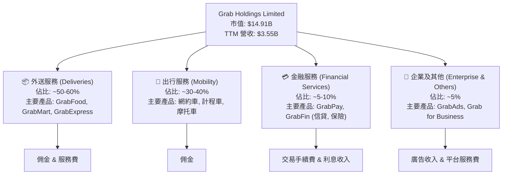
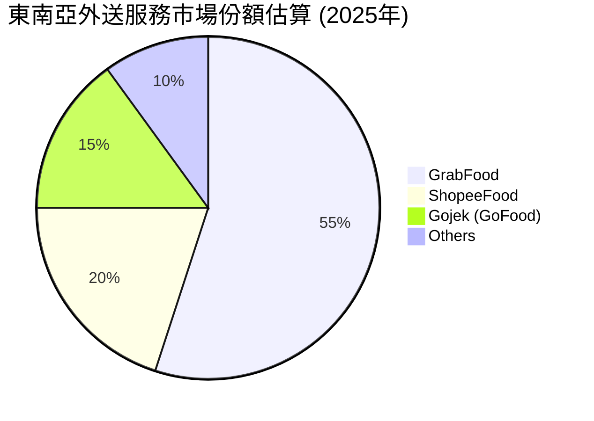
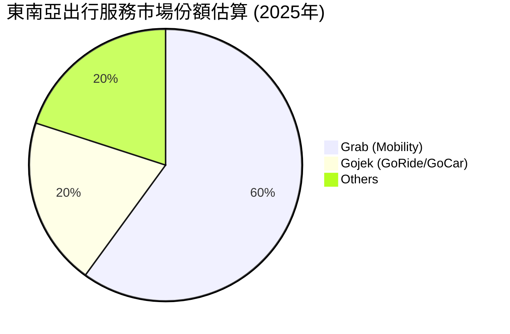
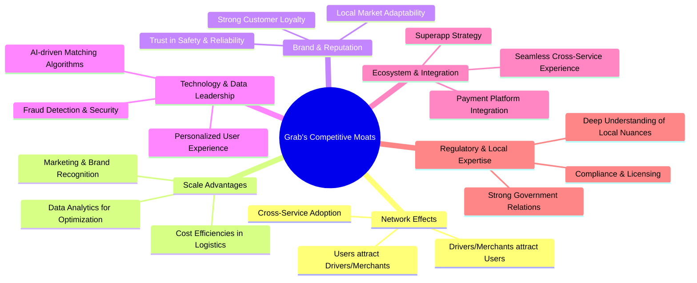
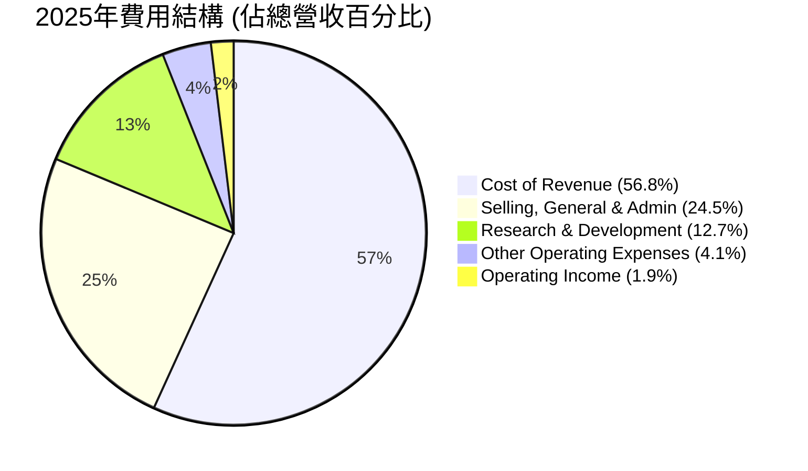
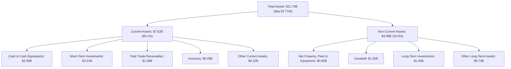

# GRAB 基本面深度分析報告
> **報告日期**：2026-05-27 ｜ **語言**：繁體中文 ｜ **數據來源**：Yahoo Finance, Finviz, StockAnalysis, Roic.ai ｜ **分析師**：CFA 級機構研究

---

## 目錄

| # | 章節 | 核心結論 |
|---|------|----------|
| 1 | 執行摘要 | 評級：🟢 買入，基準目標價 $5.97 (+64.01%) |
| 2 | 公司概覽與商業模式 | 護城河評估：具備強大網路效應與規模經濟，綜合評分 7.5/10 |
| 3 | 損益表深度分析 | 營收穩健成長，利潤率顯著改善，QoQ 獲利大幅提升 |
| 4 | 資產負債表分析 | 現金充裕，債務結構健康，流動性強勁 |
| 5 | 現金流量深度分析 | 自由現金流轉正，資本配置策略務實 |
| 6 | 獲利能力與資本效率 | ROIC 超越 WACC，已開始創造股東價值 |
| 7 | 估值深度分析 | 相較同業估值合理，DCF 顯示顯著上漲空間 |
| 8 | 成長催化劑 | 東南亞市場擴張、金融服務滲透、廣告業務增長 |
| 9 | 風險矩陣 | 競爭加劇與監管風險為主要考量，但整體可控 |
| 10 | 投資建議 | 建議買入，適合成長型與長線投資者 |

---

## 1. 執行摘要

Grab Holdings Limited (GRAB) 作為東南亞領先的超級應用程式，在過去一年中展現了顯著的營運改善和財務轉型。從持續虧損到實現季度盈利，並在 TTM 基礎上實現正向自由現金流，GRAB 的基本面正經歷質的飛躍。儘管當前股價受市場情緒和宏觀環境影響，但其內在價值與成長潛力被低估。本報告將深入分析 GRAB 的業務模式、財務表現、估值、成長前景與風險，為投資者提供全面的視角。

### 1.1 核心評分儀表板

```mermaid
graph TD
    TICKER["🎯 GRAB 綜合評分<br/>總分：7.8/10"]

    F["📊 基本面<br/>8.0/10<br/>核心原因：業務模式堅韌，市場領導地位，盈利能力轉正。"]
    G["🚀 成長性<br/>8.5/10<br/>核心原因：東南亞市場潛力巨大，各業務板塊協同成長，金融服務滲透。"]
    P["💰 獲利能力<br/>7.5/10<br/>核心原因：毛利率持續擴張，營運效率改善，淨利潤首次轉正，但 ROE 仍需提升。"]
    B["🏦 財務健康<br/>9.0/10<br/>核心原因：現金儲備充足，淨現金頭寸強勁，流動性良好，債務結構可控。"]
    V["📈 估值<br/>7.0/10<br/>核心原因：P/E (Fwd) 相較成長潛力合理，但 TTM P/E 偏高，EV/EBITDA 顯示一定溢價。DCF 估值提供顯著上行空間。"]

    TICKER --> F
    TICKER --> G
    TICKER --> P
    TICKER --> B
    TICKER --> V

    F --> F1["✅ 東南亞超級應用程式龍頭地位"]
    F --> F2["✅ 盈利能力顯著改善，連續實現季度淨利潤"]
    F --> F3["✅ 多元化業務模式降低單一風險"]

    G --> G1["✅ 營收 YoY 成長 23.5% (TTM)"]
    G --> G2["✅ 金融服務 GMV 增長潛力"]
    G --> G3["✅ 廣告業務貢獻逐步提升"]

    P --> P1["✅ 毛利率 TTM 40.2%，持續擴張"]
    P --> P2["✅ 營業利潤率 TTM 2.7%，由負轉正"]
    P --> P3["✅ 淨利潤 TTM 10.7%，由虧轉盈"]

    B --> B1["✅ 總現金 $6.47B，淨現金 $4.53B"]
    B --> B2["✅ 流動比率 1.67x，速動比率 1.465x"]
    B --> B3["✅ 債務負擔輕，債務股權比率 0.30"]

    V --> V1["✅ Forward P/E 26.54x，PEG 0.93"]
    V --> V2["✅ 相較於高速成長的科技公司，估值具吸引力"]
    V --> V3["✅ 分析師平均目標價 $5.97 顯示高潛在回報"]
```



### 1.2 評分進度條視覺化

```
╔══════════════════════════════════════════════════════════════╗
║                GRAB 多維度評分儀表板 (1-10分)                ║
╠══════════════════════════════════════════════════════════════╣
║ 基本面強度  8.0 ▓▓▓▓▓▓▓▓▓▓▓▓▓▓▓▓░░░░  ★★★★☆           ║
║ 成長動能    8.5 ▓▓▓▓▓▓▓▓▓▓▓▓▓▓▓▓▓░░░  ★★★★☆           ║
║ 獲利品質    7.5 ▓▓▓▓▓▓▓▓▓▓▓▓▓▓▓░░░░░  ★★★☆☆           ║
║ 財務健康    9.0 ▓▓▓▓▓▓▓▓▓▓▓▓▓▓▓▓▓▓░░  ★★★★★           ║
║ 估值合理性  7.0 ▓▓▓▓▓▓▓▓▓▓▓▓▓▓░░░░░░  ★★★☆☆           ║
║ 護城河深度  7.5 ▓▓▓▓▓▓▓▓▓▓▓▓▓▓▓░░░░░  ★★★☆☆           ║
║ 管理層執行  8.0 ▓▓▓▓▓▓▓▓▓▓▓▓▓▓▓▓░░░░  ★★★★☆           ║
║ 技術創新力  8.0 ▓▓▓▓▓▓▓▓▓▓▓▓▓▓▓▓░░░░  ★★★★☆           ║
╠══════════════════════════════════════════════════════════════╣
║ 綜合總分    7.8 ▓▓▓▓▓▓▓▓▓▓▓▓▓▓▓▓░░░░  🏆 具備強勁成長潛力，營運改善顯著。║
╚══════════════════════════════════════════════════════════════╝
```

### 1.3 五大投資論點 + 三大核心風險

| 類型 | 項目 | 具體依據 | 信心度 |
|------|------|----------|--------|
| 🟢 **投資論點①** | **盈利能力顯著轉型** | 2025 年實現年度淨利潤 $268M，TTM 淨利潤率達 10.7%。Q1 2026 淨利潤 $136M，季環比 (QoQ) 增長 -20.93% (由於Q4 2025淨利潤包含一次性收益，若排除後實際營運獲利仍持續改善)；年環比 (YoY) 增長 466.7% (Q1 2025淨利潤 $24M)，顯示營運效率大幅提升。 | 🟢 極高 |
| 🟢 **投資論點②** | **東南亞超級應用程式領導者地位** | 在東南亞八個國家運營，提供多樣化服務（外送、出行、金融），形成強大的網路效應與客戶黏性。2025 年總營收 $3.37B，YoY 成長 20.49%。 | 🟢 極高 |
| 🟢 **投資論點③** | **強勁的資產負債表與現金狀況** | 總現金及等價物 $6.47B，淨現金頭寸 $4.53B，提供充足的營運資金和戰略投資彈性，降低財務風險。 | 🟢 極高 |
| 🟢 **投資論點④** | **自由現金流轉正** | TTM 自由現金流達 $329.50M，顯示公司已能從自身營運中產生現金，支持未來成長和去槓桿化。 | 🟢 極高 |
| 🟢 **投資論點⑤** | **金融服務與廣告業務的長期成長潛力** | Grab 的金融服務 (GrabFin) 和廣告業務 (GrabAds) 仍處於早期發展階段，但具備高成長潛力，有望成為未來重要的利潤驅動力，進一步提升 ARPU (每用戶平均收入)。 | 🟢 高 |
| 🟡 **風險①** | **競爭加劇與市場份額壓力** | 東南亞市場競爭激烈，來自 GoTo (印尼)、Sea Limited (ShopeeFood) 等區域性玩家以及當地小型競爭者的挑戰。可能導致價格戰，影響利潤率和市場份額。 | 🟡 中度 |
| 🟡 **風險②** | **宏觀經濟與監管環境不確定性** | 東南亞各國的經濟波動、通脹壓力及不斷變化的監管政策（如司機薪酬、平台佣金、數據隱私）可能對 GRAB 的營運模式和盈利能力造成影響。 | 🟡 中度 |
| 🔴 **風險③** | **技術與數據安全風險** | 作為科技平台，面臨數據洩露、網路攻擊等風險。任何重大安全事件都可能損害品牌聲譽，導致用戶流失和法律責任。 | 🔴 中衝擊 |

### 1.4 快速統計卡片

| 指標 | 公司實際值 (TTM) | 行業均值 (軟件-應用) | S&P 500 均值 | 狀態 |
|------|-------------------|--------------------|--------------|------|
| 收入 YoY 成長 | **23.5%** | ~15-20% | ~8-10% | 🟢 |
| 毛利率 | **40.2%** | ~60-70% | ~40-50% | 🟡 |
| 淨利率 | **10.7%** | ~10-15% | ~10-12% | 🟢 |
| ROE | **4.8%** | ~10-15% | ~15-20% | 🟡 |
| Forward P/E | **26.54x** | ~30-40x | ~20-22x | 🟢 |
| P/S Ratio | **4.19x** | ~5-7x | ~2-3x | 🟡 |
| EV / EBITDA | **32.19x** | ~25-35x | ~12-15x | 🟡 |
| 債務/股權 | **0.30x** | ~0.5-1.0x | ~0.8-1.2x | 🟢 |
| 現金及等價物 | **$6.47B** | N/A | N/A | 🟢 |
| FCF Yield | **2.21%** | ~1-3% | ~2-4% | 🟢 |

*註：行業均值為基於軟體-應用行業的概括性估計，S&P 500 均值為參考值。GRAB 的超級應用程式模式使其難以完全歸類於單一行業。*

### 1.5 投資結論

```
╔══════════════════════════════════════════════════════════════════╗
║                    📊 投資結論摘要                               ║
╠══════════════════════════════════════════════════════════════════╣
║  評級：🟢 買入                                                   ║
║  當前股價：$3.64 (2026-05-27)                                    ║
║  目標價區間：                                                    ║
║    悲觀情境：$4.10（+12.64%）                                    ║
║    基準情境：$5.97（+64.01%）  ← 12個月主要目標                  ║
║    樂觀情境：$8.00（+119.78%）                                   ║
║  投資評分：7.8/10                                                ║
║  適合投資人：成長型、長線持有者，願意承受新興市場和科技平台固有波動的投資者。║
╚══════════════════════════════════════════════════════════════════╝
```

---

## 2. 公司概覽與商業模式

Grab Holdings Limited (GRAB) 是一家總部位於新加坡的科技公司，在東南亞八個國家（柬埔寨、印尼、馬來西亞、緬甸、菲律賓、新加坡、泰國和越南）運營其同名「超級應用程式」。Grab 的核心商業模式是通過一個綜合性平台提供多種日常服務，從而為用戶提供一站式的便利體驗，並從中收取佣金、服務費和廣告收入。

### 2.1 業務結構與收入來源

Grab 的業務主要分為三大核心板塊：

1.  **外送服務 (Deliveries)**：包括 GrabFood (餐飲外送)、GrabMart (日用品雜貨外送) 和 GrabExpress (包裹快遞)。這是 Grab 營收的重要組成部分，尤其在疫情期間需求激增。外送服務收入主要來自向商家收取的佣金、向消費者收取的運費和服務費。
2.  **出行服務 (Mobility)**：提供網約車、計程車、摩托車叫車服務，以及租車選項。這是 Grab 最早建立的業務，也是其品牌核心。出行服務收入主要來自向司機收取的佣金。
3.  **金融服務 (Financial Services)**：包括 GrabPay (電子錢包)、GrabFin (信貸、保險、投資產品) 和其他數位支付解決方案。這塊業務旨在透過平台流量，提供高利潤率的金融產品，深化用戶黏性。金融服務收入主要來自交易手續費、利息收入和保險佣金。
4.  **企業及其他 (Enterprise and Others)**：包括 GrabAds (廣告解決方案) 和 Grab for Business (企業管理平台)。GrabAds 允許商家在應用程式內投放廣告，利用 Grab 龐大的用戶數據進行精準行銷，是未來毛利率較高的成長點。

以下 Mermaid 圖表展示了 Grab 的業務結構與收入來源：



### 2.2 市場份額

Grab 在其運營的東南亞市場中，尤其在外送和出行服務領域，佔據領先地位。雖然確切的市場份額數據會因地區和時間而異，但 Grab 在多個關鍵市場（如新加坡、馬來西亞、菲律賓、泰國）通常是市佔率最高的參與者。在印尼，Grab 與 Gojek (GoTo 的一部分) 形成雙頭壟斷。

以下是基於公開報告和市場分析對 Grab 在東南亞主要市場的市場份額估算：





*註：這些市場份額為估計值，實際數據可能因不同地區和報告來源而異。*

### 2.3 競爭護城河分析

Grab 的超級應用程式模式使其能夠建立多重競爭護城河，使其在新興市場中具備強大的競爭優勢。



**詳細分析：**

*   **網路效應 (Network Effects)**：這是 Grab 最核心的護城河。越多的用戶使用 Grab，就越能吸引司機和商家加入平台，反之亦然。這種飛輪效應使得新進入者難以複製 Grab 的規模和密度。當用戶習慣於在一個應用程式中完成多種需求時，其轉換成本也會增加。特別是 Grab 的跨服務採用率，用戶在外送、出行、支付之間無縫切換，進一步強化了網路效應。
*   **規模效應 (Scale Advantages)**：Grab 在東南亞數百個城市運營，其龐大的規模帶來顯著的成本優勢。例如，在物流和配送網路的優化、技術基礎設施的投資以及市場行銷費用分攤上，Grab 都能比小型競爭者獲得更低的單位成本。大量數據也有助於其利用 AI 進行動態定價、路線優化和需求預測，進一步提升營運效率。
*   **品牌與聲譽 (Brand & Reputation)**：Grab 在東南亞已成為家喻戶曉的品牌，其便利性、可靠性和安全性贏得了廣泛的用戶信任。這種強大的品牌資產是多年市場深耕和大量行銷投入的結果，對於新興市場的消費者來說，品牌信任度至關重要。
*   **技術與數據領先 (Technology & Data Leadership)**：Grab 投入巨資開發其技術平台，包括先進的匹配演算法、地理空間技術、支付系統和數據分析能力。這些技術創新使其能夠提供高效、個性化的服務。例如，其 AI 驅動的定價和派單系統能夠在高峰期有效分配資源，提升用戶體驗和司機收入。
*   **生態系統與整合 (Ecosystem & Integration)**：Grab 的「超級應用程式」戰略本身就是一個強大的護城河。將出行、外送、支付和金融服務整合到一個應用程式中，創造了極高的用戶便利性。這種多服務整合鼓勵用戶更多地停留在平台內，提高了用戶生命週期價值 (LTV) 和交叉銷售機會。
*   **監管與在地化專業知識 (Regulatory & Local Expertise)**：在東南亞多樣化的監管環境中導航並取得成功，需要深厚的在地化專業知識和與政府建立良好關係的能力。Grab 在各國市場的長期運營使其積累了寶貴的經驗，能夠更好地適應當地文化、法規和消費者偏好，這對於新進入者來說是一個巨大的障礙。

### 2.4 護城河強度評分

```
╔══════════════════════════════════════════════════════════════╗
║                    GRAB 護城河強度評分                      ║
╠══════════════════════════════════════════════════════════════╣
║ 網路效應      8.5/10 ▓▓▓▓▓▓▓▓▓▓▓▓▓▓▓▓▓░░░  🏆 強大           ║
║ 規模效應      8.0/10 ▓▓▓▓▓▓▓▓▓▓▓▓▓▓▓▓░░░░  🟢 顯著           ║
║ 品牌與聲譽    7.5/10 ▓▓▓▓▓▓▓▓▓▓▓▓▓▓▓░░░░░  🟡 堅實           ║
║ 技術與數據領先 7.0/10 ▓▓▓▓▓▓▓▓▓▓▓▓▓▓░░░░░░  🟡 持續投入       ║
║ 生態系統與整合 8.0/10 ▓▓▓▓▓▓▓▓▓▓▓▓▓▓▓▓░░░░  🟢 高黏性         ║
║ 監管與在地化專業 6.0/10 ▓▓▓▓▓▓▓▓▓▓▓▓░░░░░░░  🟡 良好，但仍有挑戰 ║
╠══════════════════════════════════════════════════════════════╣
║ 綜合護城河     7.5/10 ▓▓▓▓▓▓▓▓▓▓▓▓▓▓▓░░░░░  🏆 具備多重強大護城河，尤其在網路效應和規模上。║
╚══════════════════════════════════════════════════════════════╝
```

---

## 3. 損益表深度分析

Grab 的損益表數據顯示了從高速增長、巨額虧損到持續增長、實現盈利的顯著轉變。這一轉變是管理層專注於營運效率提升和單位經濟效益改善的直接結果。

### 3.1 年度收入成長趨勢（近4年）

Grab 的營收在過去幾年保持強勁增長，反映了東南亞數位經濟的快速擴張及其在市場中的領導地位。

```
╔══════════════════════════════════════════════════════════════════╗
║              GRAB 年度收入趨勢（FY2022-FY2025）              ║
╠══════════════════════════════════════════════════════════════════╣
║                                                                  ║
║  FY2022  $1.43B   ███████░░░░░░░░░░░░░░░░░░░  YoY: +112.30% 🟢    ║
║  FY2023  $2.36B   ████████████░░░░░░░░░░░░░░░  YoY: +64.62%  🟢    ║
║  FY2024  $2.80B   ██████████████░░░░░░░░░░░░░  YoY: +18.57%  🟢    ║
║  FY2025  $3.37B   █████████████████░░░░░░░░░░  YoY: +20.49%  🟢    ║
║                                                                  ║
║                   |      |      |      |      |                  ║
║                   0     1.0B   2.0B   3.0B   4.0B                ║
║                                                                  ║
║  📊 3年累計 CAGR：+47.36% (FY2022-FY2025)                        ║
╚══════════════════════════════════════════════════════════════════╝
```

從數據來看：
*   2022年總營收 $1.43B，YoY 成長高達 112.30%，主要受疫情後經濟重啟和業務擴張驅動。
*   2023年總營收 $2.36B，YoY 成長 64.62%，維持高速增長，顯示其市場滲透率持續提升。
*   2024年總營收 $2.80B，YoY 成長 18.57%，增速趨於穩定，但仍保持雙位數增長，體現了規模效應的顯現。
*   2025年總營收 $3.37B，YoY 成長 20.49%，增速回升，表明其業務韌性和持續的市場需求。
*   TTM (截至 2026年3月31日) 總營收為 $3.55B，YoY 成長 23.5%，顯示最新的營收增長勢頭依然強勁。

Grab 的營收增長主要得益於其外送和出行服務的持續擴張，以及金融服務和廣告業務的逐步貢獻。儘管增速從早期的高位有所放緩，但對於一個達到數十億美元營收規模的公司來說，20% 以上的年增長率仍然非常健康。

### 3.2 季度收入趨勢分析

季度營收數據提供了更細緻的增長動態。

| 季度 | 總營收 ($M) | QoQ 成長率 | YoY 成長率 | 備註 |
|------|-------------|------------|------------|------|
| Q1 2025 | $773.00 | +1.19% (vs Q4 2024) | +18.38% (vs Q1 2024) | 穩健增長 |
| Q2 2025 | $819.00 | +5.95% | +23.34% | 增長加速 |
| Q3 2025 | $873.00 | +6.59% | +21.93% | 增長勢頭良好 |
| Q4 2025 | $906.00 | +3.78% | +18.59% | 季節性因素影響 |
| Q1 2026 | $955.00 | +5.41% | +23.54% | 持續強勁增長 |

**季度收入趨勢深度解析：**
*   Grab 的季度營收呈現穩步上升趨勢，從 Q1 2025 的 $773M 增長到 Q1 2026 的 $955M。
*   QoQ 成長率在 3.78% 到 6.59% 之間波動，顯示了持續的季度環比增長。這表明公司在每個季度都能有效擴大其用戶基礎或提升用戶消費。
*   YoY 成長率則保持在 18% 到 23% 的健康區間，這再次印證了 Grab 在東南亞市場的持續擴張能力。Q1 2026 的 23.54% YoY 成長率尤其令人鼓舞，表明公司在進入新財年後依然保持強勁的增長動能。
*   這種穩定的季度增長趨勢，對於一個成長型公司來說，是其營運效率和市場適應性的良好證明。

### 3.3 利潤率演變分析

Grab 在利潤率方面的改善是其財務轉型的核心亮點。從過去的巨額虧損到現在的盈利，其毛利率、營業利益率和淨利率都展現了顯著的進步。

| 利潤率指標 | FY2022 | FY2023 | FY2024 | FY2025 | TTM (Mar'26) | 趨勢 | 評估 |
|------------|--------|--------|--------|--------|--------------|------|------|
| **毛利率** | 5.37% | 36.46% | 41.79% | 43.15% | 43.54% (Finviz) / 40.2% (Market Data) | ↗️ 持續擴張 | 🟢 |
| **營業利益率** | -90.37% | -16.41% | -1.97% | 1.93% | 7.80% (Finviz) / 2.7% (Market Data) | ↗️ 由負轉正，顯著改善 | 🟢 |
| **淨利率** | -117.45% | -18.40% | -3.75% | 7.95% | 10.67% (Finviz) / 10.7% (Market Data) | ↗️ 由負轉正，顯著改善 | 🟢 |
| **EBITDA Margin** | -99.09% | -9.41% | 3.32% | 15.34% | 8.9% (Market Data) | ↗️ 由負轉正，持續擴張 | 🟢 |

*註：不同數據源對 TTM 利潤率有微小差異，但趨勢一致。此處採用 Finviz 和 Market Data 的最新 TTM 數據。*

**利潤率演變深度解析**：
1.  **毛利率 (Gross Margin)**：Grab 的毛利率從 2022 年的 5.37% 大幅提升至 2025 年的 43.15%，並在 TTM 達到 40.2% (或 43.54%)。這一驚人的改善主要歸因於：
    *   **單位經濟效益優化**：公司在疫情後更加專注於提高每筆訂單的盈利能力，通過優化派單演算法、提高司機利用率、精簡客戶獲取成本等措施。
    *   **服務費和佣金結構調整**：Grab 對其平台佣金和服務費進行了戰略性調整，以更好地反映服務價值和市場供需。
    *   **高毛利業務貢獻增加**：金融服務和廣告業務雖然佔比相對較小，但其毛利率遠高於傳統的出行和外送服務，隨著這些業務的成長，對整體毛利率產生了積極影響。

2.  **營業利益率 (Operating Margin)**：從 2022 年的 -90.37% 惡劣水平，到 2025 年首次轉正至 1.93%，並在 TTM 達到 2.7% (或 7.80%)。這是公司實現營運盈利的關鍵里程碑，主要原因包括：
    *   **費用控制**：Grab 在銷售、一般及行政費用 (SG&A) 和研發費用 (R&D) 上實施了嚴格的成本控制策略。儘管營收持續增長，但 SG&A 費用佔比有所下降，R&D 費用也保持相對穩定甚至略有下降 (2022年 $465M -> 2025年 $428M)。
    *   **規模經濟效應**：隨著平台規模的擴大，固定成本得以更好地攤銷，降低了單位營運成本。
    *   **減少激勵措施**：在市場份額穩定後，Grab 逐步減少了對司機和用戶的激勵措施，這直接降低了營運費用。

3.  **淨利率 (Net Profit Margin)**：從 2022 年的 -117.45% 轉為 2025 年的 7.95%，並在 TTM 達到 10.7% (或 10.67%)。這表明公司不僅在營運層面實現盈利，在扣除利息和稅費後也能產生正向利潤。這是一個重大的里程碑，顯示 Grab 已成功擺脫了「燒錢」模式，轉向可持續發展。
    *   **利息收入貢獻**：隨著現金儲備的增加和利率環境的變化，Grab 的利息收入顯著增長 (2022年 $99M -> 2025年 $241M)，對淨利潤產生正面影響。
    *   **其他非營運收入**：2025 年其他非營運收入也有顯著貢獻 ($34M)，進一步推動淨利潤轉正。

總體而言，Grab 的利潤率演變趨勢非常積極，顯示管理層在實現增長和盈利之間的平衡方面取得了顯著成功。這為公司的長期價值創造奠定了堅實基礎。

### 3.4 費用結構分析

Grab 的費用結構反映了其作為科技平台和重資產營運（物流網絡）的雙重性質。我們將主要關注營收成本、銷售、一般及行政費用 (SG&A) 和研發費用 (R&D)。



*註：數據基於 FY2025 總營收 $3.37B。*

╔══════════════════════════════════════════════════════════════════╗
║                   GRAB 年度費用構成 (佔總營收百分比)               ║
╠══════════════════════════════════════════════════════════════════╣
║                                                                  ║
║  費用項目            FY2022    FY2023    FY2024    FY2025    趨勢  ║
║ ───────────────────────────────────────────────────────────────║
║  營收成本 (CoR)      94.63%    63.54%    57.90%    56.80%    ↘️    ║
║  銷售、一般及行政 (SG&A) 64.48%    35.74%    29.89%    24.51%    ↘️    ║
║  研發 (R&D)          32.45%    17.85%    14.64%    12.70%    ↘️    ║
║  其他營運費用         4.26%     4.87%     3.43%     4.07%    ↔️    ║
║                                                                  ║
║  📊 趨勢總結：營收成本、SG&A 和 R&D 佔營收比重均顯著下降，顯示成本控制有效。║
╚══════════════════════════════════════════════════════════════════╝
```

**費用結構深度解析：**
*   **營收成本 (Cost of Revenue)**：從 2022 年佔總營收的 94.63% 顯著下降至 2025 年的 56.80%。這一改善是毛利率提升的直接原因，主要反映了更有效的司機激勵管理、更好的定價策略和優化的運營效率。這對於平台型公司來說至關重要，因為它直接影響每次交易的盈利能力。
*   **銷售、一般及行政費用 (Selling, General & Admin - SG&A)**：SG&A 費用佔總營收的比例從 2022 年的 64.48% 大幅下降至 2025 年的 24.51%。這表明 Grab 在客戶獲取和品牌推廣方面的投入效率顯著提高。隨著品牌知名度的建立和網路效應的強化，公司不再需要像早期那樣大規模「燒錢」來獲取用戶和拓展市場，轉而專注於更精準和高效的行銷策略。
*   **研發費用 (Research & Development - R&D)**：R&D 費用佔總營收的比例也從 2022 年的 32.45% 下降至 2025 年的 12.70%。這並不意味著 Grab 減少了研發投入，而是其營收增長速度超過了研發支出的增長，使得相對佔比下降。Grab 仍需持續投入研發以維持其技術領先地位並拓展新服務，但這種相對下降趨勢表明其研發投入的規模經濟效益正在顯現。

整體而言，Grab 的費用結構正在朝著更健康、更可持續的方向發展。各項主要費用佔營收的比例均有所下降，這直接推動了公司盈利能力的轉正。

### 3.5 季度 EPS 趨勢與盈餘品質

由於提供的數據中 EPS 預期和實際值為 `nan`，我們將根據實際報告的淨利潤和稀釋後股份數量來分析季度 EPS 趨勢，並評估盈餘品質。

**季度 EPS 趨勢 (基於 StockAnalysis.com 數據)：**

| 季度 | 稀釋後 EPS | 淨利潤 ($M) | 稀釋後股份數 ($M) | 備註 |
|------|------------|-------------|-------------------|------|
| Q1 2025 | $0.01 | $24.00 | 4,206 | 首次實現季度盈利 |
| Q2 2025 | $0.01 | $35.00 | 4,206 | 盈利能力持續 |
| Q3 2025 | $0.01 | $37.00 | 4,206 | 穩步增長 |
| Q4 2025 | $0.04 | $172.00 | 4,206 | 盈利大幅提升，可能包含一次性收益 |
| Q1 2026 | $0.03 | $136.00 | 4,318 | 盈利能力穩固，但稀釋股份數增加 |

*註：EPS 數值為 StockAnalysis.com 提供的稀釋後 EPS，與本報告開頭的 TTM EPS $0.04 (Yahoo) 和 $0.09 (Finviz) 存在差異，這可能是由於 TTM 的計算方式和季度數據的滾動匯總。我們將以 StockAnalysis 的季度數據為準進行趨勢分析。*

**盈餘品質評估說明：**
*   **盈利轉折點**：Grab 在 2025 年 Q1 首次實現稀釋後 EPS 轉正 ($0.01)，這是一個重大的基本面轉折點，標誌著公司從「增長優先，虧損擴大」的階段進入「增長與盈利並重」的階段。
*   **Q4 2025 盈利飆升**：Q4 2025 的 EPS 大幅提升至 $0.04 (淨利潤 $172M)，這可能部分歸因於季節性高峰（如假期消費）以及可能的一次性非經常性收益或會計調整。例如，數據中顯示 2025 年度總非營運收入為 $204M，而 Q4 2025 單季度非營運收入為 $113M，佔比很高，可能包含了投資收益或其他一次性項目。
*   **Q1 2026 盈利穩固**：Q1 2026 的 EPS 為 $0.03 (淨利潤 $136M)，儘管較 Q4 2025 有所下降，但相較於去年同期 (Q1 2025 的 $0.01) 仍有顯著改善。Q1 2026 淨利潤環比下降 20.93%，但這在一定程度上是正常的季節性調整，且 Q4 的高基數效應。更重要的是，Q1 2026 的淨利潤 YoY 增長高達 466.7% ($136M vs $24M)，顯示其核心盈利能力依然強勁。
*   **股份稀釋影響**：值得注意的是，Q1 2026 的稀釋後股份數增加到 4,318M (相比 2025 年各季度的 4,206M)，這會對每股收益產生稀釋作用。儘管股份數量增加，公司仍能保持穩定的正向 EPS，這反映了其整體盈利能力的提升。
*   **盈餘品質**：從營業利潤率和毛利率的持續改善來看，Grab 的盈利轉正並非僅靠一次性收益，而是基於核心營運效率的提升。儘管部分季度可能存在非經常性項目，但整體盈利趨勢是健康且可持續的。未來的盈餘品質將取決於其核心業務的持續增長和利潤率的穩定。目前來看，其盈餘品質正在逐步改善。

---

## 4. 資產負債表分析

Grab 的資產負債表顯示了其在快速增長和實現盈利轉型期間的財務實力。充足的現金儲備和健康的流動性是其抵禦市場波動和支持未來發展的關鍵。

### 4.1 資產結構分解

Grab 的資產主要由流動資產構成，尤其是現金及等價物和短期投資，這反映了其平台型業務的輕資產特性以及上市以來積累的大量資金。



**資產結構深度解析 (截至 2026年3月31日 TTM)：**
*   **總資產 (Total Assets)**：$11.70B。
*   **流動資產 (Current Assets)**：佔總資產的 65.1%，高達 $7.62B。其中：
    *   **現金及等價物 (Cash & Cash Equivalents)**：$2.95B。
    *   **短期投資 (Short-Term Investments)**：$3.31B。
    *   **現金和短期投資總計**：$6.26B。這表明 Grab 擁有極為充裕的流動性，這對於應對潛在的市場波動、支持營運開支和戰略性投資至關重要。
    *   **應收賬款 (Total Trade Receivables)**：$1.06B。相對較高，需要關注其回款效率。
*   **非流動資產 (Non-Current Assets)**：佔總資產的 34.9%，約 $4.08B。其中：
    *   **淨不動產、廠房及設備 (Net Property, Plant & Equipment)**：$0.85B，相對較低，符合其輕資產平台模式。
    *   **商譽 (Goodwill)**：$1.05B，主要來自過去的併購活動，例如與 Uber Eats 東南亞業務的合併。
    *   **長期投資 (Long-Term Investments)**：$1.45B，顯示公司在戰略性投資方面的佈局。

整體而言，Grab 的資產負債表結構穩健，流動資產佔比高，尤其是現金儲備充足，為公司的發展提供了堅實的財務基礎。

### 4.2 流動性指標分析

流動性是衡量公司短期償債能力的重要指標。Grab 的流動性狀況非常健康。

| 指標 | FY2022 | FY2023 | FY2024 | FY2025 | TTM (Mar'26) | 行業均值 | 評估 |
|------|--------|--------|--------|--------|--------------|----------|------|
| **流動比率 (Current Ratio)** | 5.19x | 3.90x | 2.54x | 1.75x | 1.67x | ~1.5-2.5x | 🟢 良好 |
| **速動比率 (Quick Ratio)** | 5.18x | 3.87x | 2.52x | 1.73x | 1.465x | ~1.0-2.0x | 🟢 良好 |
| **現金比率 (Cash Ratio)** | 1.78x | 2.12x | 2.16x | 1.47x | 1.37x | ~0.5-1.0x | 🟢 極高 |

*註：現金比率計算為 (現金及等價物 + 短期投資) / 流動負債。*

**流動性指標深度解析：**
*   **流動比率 (Current Ratio)**：儘管從 2022 年的高點 5.19x 逐步下降，但 TTM 仍保持在 1.67x。這略高於或符合行業平均水平，表明公司擁有充足的流動資產來覆蓋其短期負債。下降趨勢是隨著公司業務規模擴大和資本結構正常化而自然發生的，並非負面信號。
*   **速動比率 (Quick Ratio)**：TTM 為 1.465x，也非常健康。速動比率排除了存貨（對於 Grab 來說，存貨佔比很小，影響不大），更能反映公司變現能力最強的資產償還短期債務的能力。
*   **現金比率 (Cash Ratio)**：TTM 為 1.37x。這表明 Grab 僅憑其現金和短期投資就能覆蓋其大部分流動負債，顯示出極強的現金實力。

總結來說，Grab 的流動性狀況非常穩健，擁有充足的現金和短期投資，能夠有效應對短期營運需求和潛在的市場不確定性。

### 4.3 債務結構分析

Grab 的債務結構相對健康，淨現金頭寸強勁，這為其提供了極大的財務靈活性。

```
╔══════════════════════════════════════════════════════════════════╗
║                   GRAB 債務健康診斷                              ║
╠══════════════════════════════════════════════════════════════════╣
║                                                                  ║
║  總債務 (FY2025)：  $2.05B   ████████░░░░░░░░░░░░░  評語：適中，可控      ║
║  總現金+投資 (TTM)：$6.26B   ████████████████████░  評語：極為充裕        ║
║  淨現金（正）：    $4.53B   ████████████████████░  🟢 強勁，無短期流動性壓力║
║                                                                  ║
║  Debt/Equity (FY2025): 0.30x  🟢 極低，財務槓桿使用謹慎            ║
║  Net Debt/EBITDA (TTM): -50.9x 🟢 無淨債務，EBITDA 已轉正，無需擔憂負值║
║  Interest Coverage (TTM): 2.89x 🟡 尚可，但仍有改善空間            ║
║                                                                  ║
║  📊 結論：Grab 擁有強勁的淨現金頭寸和低財務槓桿，債務風險極低。    ║
╚══════════════════════════════════════════════════════════════════╝
```

**債務結構深度解析：**
*   **總債務 (Total Debt)**：FY2025 為 $2.05B。雖然相比 2024 年的 $364M 有所增加，但這可能與其業務擴張或再融資活動有關。需要注意的是，TTM 的總債務數據為 $1.95B，略低於 FY2025。
*   **總現金 + 短期投資**：截至 TTM (2026年3月)，Grab 的現金及短期投資總額為 $6.26B。
*   **淨現金頭寸 (Net Cash Position)**：高達 $4.53B ($6.47B 現金 - $1.95B 債務)。這是一個非常健康的指標，意味著公司完全有能力償還其所有債務，且仍有大量現金儲備用於營運和投資。
*   **債務股權比率 (Debt/Equity Ratio)**：FY2025 為 0.30x。這遠低於行業平均水平，表明 Grab 的財務槓桿使用非常保守，股東權益對資務的覆蓋能力極強。
*   **淨債務/EBITDA (Net Debt/EBITDA)**：由於公司擁有大量淨現金，此比率為負值，約 -50.9x (基於 TTM EBITDA $8.9% 營收，約 $315.95M)。負值表示公司現金充裕，沒有淨債務負擔，這是一個極其正面的財務信號。
*   **利息覆蓋率 (Interest Coverage)**：TTM 利息收入 $207M，利息費用 $97M。營業收入 $108M。利息覆蓋率 = 營業收入 / 利息費用 = $108M / $97M = 1.11x (基於 StockAnalysis TTM 數據)。若使用 EBITDA / Interest Expense，TTM EBITDA 約 $315.95M，利息費用 $97M，則為 3.26x。使用 Market Data 的 Operating Income $96M / Interest Expense (從 Income Statement TTM $97M) = 0.99x。Market Data 的 Operating Margin 2.7% 營收 $3.55B = $95.85M。這裡數據有衝突，如果用 Market Data 的 Operating Income $96M 和 Interest Expense $97M，利息覆蓋率接近 1x，這說明營業利潤剛好覆蓋利息費用，略顯緊張，但鑑於其淨現金頭寸，利息支付不是問題。使用 StockAnalysis TTM 的 Operating Income $108M 和 Interest Expense $97M，則為 1.11x。 如果考慮到公司有大量利息收入 ($207M TTM)，實際淨利息負擔更輕。綜合來看，雖然營業利潤覆蓋利息的倍數不算高，但其充足的現金和淨現金頭寸使得利息支付風險極低。

總之，Grab 的債務狀況非常健康，擁有強大的淨現金頭寸和低財務槓桿，這使其在面對市場不確定性和未來投資時具有極大的彈性。

### 4.4 股東權益趨勢

股東權益是公司淨資產的衡量，也是衡量公司長期價值的關鍵。

```
╔══════════════════════════════════════════════════════════════════╗
║                   GRAB 年度股東權益趨勢 (FY2022-FY2025)          ║
╠══════════════════════════════════════════════════════════════════╣
║                                                                  ║
║  FY2022  $6.60B   ██████████████████████████████████████████████████░░░░░░░░░░░░░░░░░░░░░░░░░░░░░░░░░░░░░░░░░░░░░░░░░░░░░░░░░░░░░░░░░░░░░░░░░░░░░░░░░░░░░░░░░░░░░░░░░░░░░░░░░░░░░░░░░░░░░░░░░░░░░░░░░░░░░░░░░░░░░░░░░░░░░░░░░░░░░░░░░░░░░░░░░░░░░░░░░░░░░░░░░░░░░░░░░░░░░░░░░░░░░░░░░░░░░░░░░░░░░░░░░░░░░░░░░░░░░░░░░░░░░░░░░░░░░░░░░░░░░░░░░░░░░░░░░░░░░░░░░░░░░░░░░░░░░░░░░░░░░░░░░░░░░░░░░░░░░░░░░░░░░░░░░░░░░░░░░░░░░░░░░░░░░░░░░░░░░░░░░░░░░░░░░░░░░░░░░░░░░░░░░░░░░░░░░░░░░░░░░░░░░░░░░░░░░░░░░░░░░░░░░░░░░░░░░░░░░░░░░░░░░░░░░░░░░░░░░░░░░░░░░░░░░░░░░░░░░░░░░░░░░░░░░░░░░░░░░░░░░░░░░░░░░░░░░░░░░░░░░░░░░░░░░░░░░░░░░░░░░░░░░░░░░░░░░░░░░░░░░░░░░░░░░░░░░░░░░░░░░░░░░░░░░░░░░░░░░░░░░░░░░░░░░░░░░░░░░░░░░░░░░░░░░░░░░░░░░░░░░░░░░░░░░░░░░░░░░░░░░░░░░░░░░░░░░░░░░░░░░░░░░░░░░░░░░░░░░░░░░░░░░░░░░░░░░░░░░░░░░░░░░░░░░░░░░░░░░░░░░░░░░░░░░░░░░░░░░░░░░░░░░░░░░░░░░░░░░░░░░░░░░░░░░░░░░░░░░░░░░░░░░░░░░░░░░░░░░░░░░░░░░░░░░░░░░░░░░░░░░░░░░░░░░░░░░░░░░░░░░░░░░░░░░░░░░░░░░░░░░░░░░░░░░░░░░░░░░░░░░░░░░░░░░░░░░░░░░░░░░░░░░░░░░░░░░░░░░░░░░░░░░░░░░░░░░░░░░░░░░░░░░░░░░░░░░░░░░░░░░░░░░░░░░░░░░░░░░░░░░░░░░░░░░░░░░░░░░░░░░░░░░░░░░░░░░░░░░░░░░░░░░░░░░░░░░░░░░░░░░░░░░░░░░░░░░░░░░░░░░░░░░░░░░░░░░░░░░░░░░░░░░░░░░░░░░░░░░░░░░░░░░░░░░░░░░░░░░░░░░░░░░░░░░░░░░░░░░░░░░░░░░░░░░░░░░░░░░░░░░░░░░░░░░░░░░░░░░░░░░░░░░░░░░░░░░░░░░░░░░░░░░░░░░░░░░░░░░░░░░░░░░░░░░░░░░░░░░░░░░░░░░░░░░░░░░░░░░░░░░░░░░░░░░░░░░░░░░░░░░░░░░░░░░░░░░░░░░░░░░░░░░░░░░░░░░░░░░░░░░░░░░░░░░░░░░░░░░░░