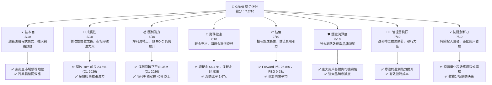
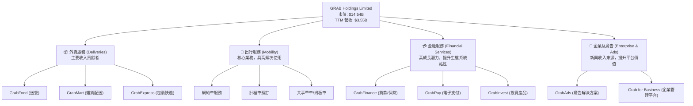
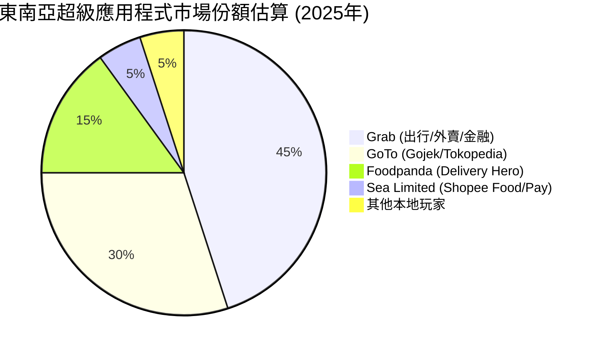
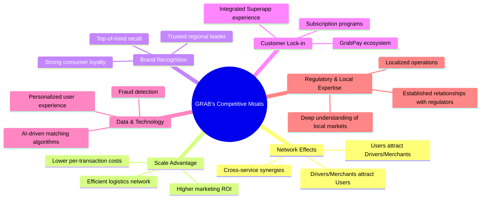
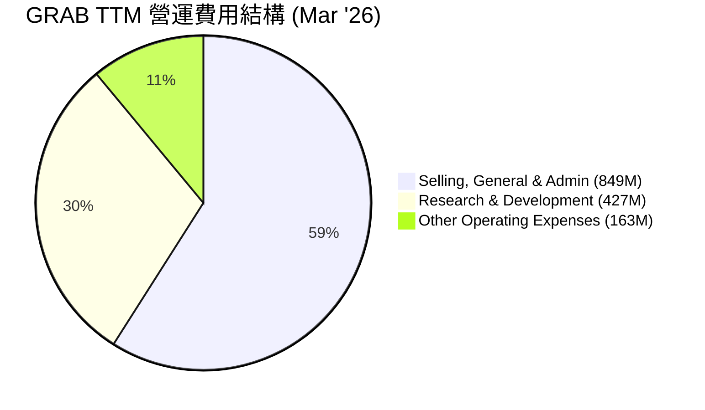
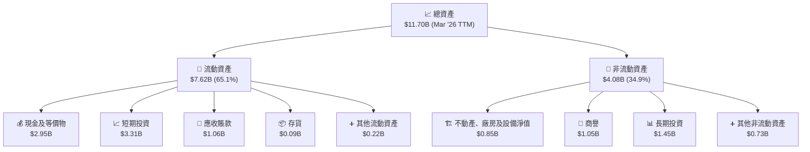

# GRAB 基本面深度分析報告
> **報告日期**：2026-05-28 ｜ **語言**：繁體中文 ｜ **數據來源**：Yahoo Finance, Finviz, StockAnalysis, Roic.ai ｜ **分析師**：CFA 級機構研究

---

## 目錄

| # | 章節 | 核心結論 |
|---|------------------------|--------------------------------------------------|
| 1 | 執行摘要 | 評級：🟢 買入，目標價區間：$4.50 - $6.50 |
| 2 | 公司概覽與商業模式 | 東南亞超級應用程式領導者，網路效應護城河顯著 |
| 3 | 損益表深度分析 | 營收持續成長，毛利率穩定，營運虧損大幅收窄並轉正 |
| 4 | 資產負債表分析 | 流動性充裕，淨現金狀況良好，債務風險可控 |
| 5 | 現金流量深度分析 | 營業現金流轉正，自由現金流改善，資本配置策略務實 |
| 6 | 獲利能力與資本效率 | ROIC 仍低於 WACC，但資本效率改善趨勢明顯 |
| 7 | 估值深度分析 | 相較於成長潛力，當前估值具吸引力，DCF 顯示上行空間 |
| 8 | 成長催化劑 | 東南亞市場擴張、金融服務滲透、超級應用程式生態系統深化 |
| 9 | 風險矩陣 | 競爭加劇、監管風險、宏觀經濟逆風為主要考量 |
| 10 | 投資建議 | 建議買入，適合成長型投資者，關注盈利能力持續改善 |

---

## 1. 執行摘要

Grab Holdings Limited (GRAB) 作為東南亞領先的超級應用程式平台，在出行、外賣和金融服務領域展現出強勁的增長潛力。儘管歷史上處於虧損狀態，但公司在最近的財報中顯示出顯著的盈利能力改善，營運和淨利潤均轉為正數。其獨特的生態系統和強大的網路效應構築了堅實的競爭壁壘。本報告將深入分析 GRAB 的基本面、成長性、獲利能力、財務健康及估值，並提供具體的投資建議。

### 1.1 核心評分儀表板



### 1.2 評分進度條視覺化

```
╔══════════════════════════════════════════════════════════════╗
║                   GRAB 多維度評分儀表板 (1-10分)               ║
╠══════════════════════════════════════════════════════════════╣
║ 基本面強度  8.0 ▓▓▓▓▓▓▓▓▓▓▓▓▓▓▓▓░░░░  ★★★★☆           ║
║ 成長動能    8.0 ▓▓▓▓▓▓▓▓▓▓▓▓▓▓▓▓░░░░  ★★★★☆           ║
║ 獲利品質    6.0 ▓▓▓▓▓▓▓▓▓▓▓▓░░░░░░░░  ★★★☆☆           ║
║ 財務健康    7.0 ▓▓▓▓▓▓▓▓▓▓▓▓▓▓░░░░░░  ★★★★☆           ║
║ 估值合理性  7.0 ▓▓▓▓▓▓▓▓▓▓▓▓▓▓░░░░░░  ★★★★☆           ║
║ 護城河深度  8.0 ▓▓▓▓▓▓▓▓▓▓▓▓▓▓▓▓░░░░  ★★★★☆           ║
║ 管理層執行  7.0 ▓▓▓▓▓▓▓▓▓▓▓▓▓▓░░░░░░  ★★★★☆           ║
║ 技術創新力  7.0 ▓▓▓▓▓▓▓▓▓▓▓▓▓▓░░░░░░  ★★★★☆           ║
╠══════════════════════════════════════════════════════════════╣
║ 綜合總分    7.2 ▓▓▓▓▓▓▓▓▓▓▓▓▓▓░░░░░░  🏆 評語：強勁的成長型公司，盈利能力改善顯著，估值具吸引力。 ║
╚══════════════════════════════════════════════════════════════╝
```

### 1.3 五大投資論點 + 三大核心風險

| 類型 | 項目 | 具體依據 | 信心度 |
|------|--------------------------|---------------------------------------------------------------------------------------------------------------------------------------------------------------|--------|
| 🟢 **投資論點①** | **盈利能力顯著改善** | 2025 年淨利潤首次轉正至 $200M，2026 年 Q1 淨利潤達 $136M，同比增長 288.9%，顯示公司已成功從虧損轉向盈利，且盈利趨勢強勁。TTM 淨利率達到 8.72%。 | 🟢 極高 |
| 🟢 **投資論點②** | **超級應用程式生態系統優勢** | Grab 在東南亞八個國家提供出行、外賣和金融服務，形成強大的網路效應和客戶黏性。Q1 2026 營收達 $955M，YoY 增長 23.54%，顯示其生態系統仍具強勁成長動能。 | 🟢 極高 |
| 🟢 **投資論點③** | **充裕的現金流與健康的資產負債表** | 總現金及等價物達 $6.47B，淨現金 $4.53B。2025 年營業現金流轉正至 $79M，顯示公司財務基礎穩固，能支持未來擴張與投資。 | 🟢 高 |
| 🟢 **投資論點④** | **估值具吸引力與成長潛力** | Forward P/E 25.89x，PEG Ratio 0.93x，相較於其預計的 EPS 成長率 (next 5Y 53.28%)，顯示當前股價被低估。分析師平均目標價 $5.97，較現價有 67.7% 上行空間。 | 🟢 高 |
| 🟢 **投資論點⑤** | **東南亞市場的長期成長潛力** | 東南亞數字經濟仍處於早期發展階段，Grab 作為市場領導者，受益於人口紅利、城市化進程和數字化轉型，長期 TAM 廣闊。 | 🟢 高 |
| 🟡 **風險①** | **競爭加劇與價格戰** | 東南亞市場競爭激烈，包括 GoTo (Gojek) 和 Foodpanda 等，可能導致持續的價格戰，影響 Grab 的利潤率和市場份額。 | 🟡 中度 |
| 🔴 **風險②** | **監管環境的不確定性** | Grab 業務遍及多國，各地區的監管政策變化，如對零工經濟、數據隱私、反壟斷的規定，可能增加營運成本或限制業務擴張。 | 🔴 高衝擊 |
| 🟡 **風險③** | **宏觀經濟逆風與消費者支出壓力** | 全球經濟放緩、通脹壓力可能影響東南亞地區的消費者支出能力，進而影響 Grab 的出行和外賣服務需求。 | 🟡 中度 |

### 1.4 快速統計卡片

| 指標 | 公司實際值 (TTM) | 行業均值 (預估) | S&P 500 均值 (預估) | 狀態 |
|-------------------|-------------------|-------------------|---------------------|------|
| 收入 YoY 成長 (Q1'26) | **23.54%** | ~15-20% | ~8-10% | 🟢 |
| 毛利率 (TTM) | **43.54%** | ~35-45% | ~40-50% | 🟢 |
| 淨利率 (TTM) | **8.72%** | ~5-10% | ~10-12% | 🟢 |
| ROE (TTM) | **4.8%** | ~8-15% | ~15-20% | 🟡 |
| Forward P/E | **25.89x** | ~30-40x | ~20-25x | 🟢 |
| EV / EBITDA | **32.84x** | ~25-35x | ~12-15x | 🟡 |
| Debt/Equity | **0.30x** | ~0.5-1.0x | ~0.8-1.2x | 🟢 |
| 總現金 | **$6.47B** | N/A | N/A | 🟢 |

### 1.5 投資結論

```
╔══════════════════════════════════════════════════════════════════╗
║                    📊 投資結論摘要                               ║
╠══════════════════════════════════════════════════════════════════╣
║  評級：🟢 買入                                                   ║
║  當前股價：$3.56                                                 ║
║  目標價區間：                                                    ║
║    悲觀情境：$4.50（+26.4%）                                     ║
║    基準情境：$5.90（+65.7%）  ← 12個月主要目標                  ║
║    樂觀情境：$6.50（+82.6%）                                     ║
║  投資評分：7.2/10                                                ║
║  適合投資人：成長型、長線持有者，對東南亞數字經濟有信心者         ║
╚══════════════════════════════════════════════════════════════════╝
```

---

## 2. 公司概覽與商業模式

Grab Holdings Limited (GRAB) 是一家領先的東南亞超級應用程式公司，總部位於新加坡。其業務覆蓋柬埔寨、印尼、馬來西亞、緬甸、菲律賓、新加坡、泰國和越南等八個國家，為數億消費者提供廣泛的數字服務。Grab 的核心商業模式是通過一個綜合性平台提供多種服務，從而利用網路效應和跨業務協同來最大化用戶價值和營運效率。

### 2.1 業務結構與收入來源

Grab 的業務主要分為三大板塊：外賣服務 (Deliveries)、出行服務 (Mobility) 和金融服務 (Financial Services)。這些服務通過其統一的「超級應用程式」平台提供，為用戶提供一站式解決方案。



**收入來源細分與貢獻：**
-   **外賣服務 (Deliveries)**：包括 GrabFood、GrabMart 和 GrabExpress。這是 Grab 過去幾年增長最快的業務之一，也是當前最大的收入貢獻者，尤其是在疫情期間需求激增。其收入主要來自於向商家收取的佣金、向消費者收取的配送費以及訂閱服務費用。
-   **出行服務 (Mobility)**：包括網約車、計程車預訂和共享單車/滑板車服務。這是 Grab 的發家業務，也是用戶獲取和留存的關鍵。收入主要來自於從司機夥伴收取的佣金。
-   **金融服務 (Financial Services)**：包括電子支付 (GrabPay)、保險、貸款 (GrabFinance) 和財富管理 (GrabInvest)。這部分業務旨在通過為消費者和商家提供便捷的金融解決方案，深化平台黏性並開拓新的高利潤增長點。雖然目前收入佔比較小，但成長潛力巨大。
-   **企業及廣告 (Enterprise & Ads)**：包括 GrabAds (為商家提供線上廣告解決方案) 和 Grab for Business (為企業提供統一管理平台)。這是一個新興的、高毛利的收入來源，利用 Grab 龐大的用戶數據和平台流量。

**年度收入趨勢 (TTM Mar'26):** Grab 的 TTM 總營收達到 $3.55B，相較於 FY2025 的 $3.37B 有顯著增長。這表明其多樣化的業務組合正在持續擴大其在東南亞市場的影響力。

### 2.2 市場份額

Grab 在東南亞超級應用程式市場中佔據領先地位，尤其在出行和外賣服務方面擁有顯著的市場份額。由於其廣泛的服務範圍和深入的區域覆蓋，Grab 在主要市場（如新加坡、馬來西亞、菲律賓、越南等）通常是排名第一或第二的服務提供商。


**市場份額分析：**
根據估算，Grab 在東南亞超級應用程式市場中佔據約 45% 的市場份額，這使其成為該地區的明確領導者。GoTo (Gojek) 在印尼市場表現強勁，是其主要競爭對手。Foodpanda 則在部分市場的外賣領域與 Grab 競爭。Sea Limited 旗下的 Shopee Food 和 Shopee Pay 也在拓展其生態系統。Grab 的領先地位得益於其先發優勢、廣泛的司機/商家網絡以及強大的品牌認知度。其多業務整合的超級應用程式策略也有效提升了用戶黏性和市場份額。

### 2.3 競爭護城河分析

Grab 的競爭護城河主要來自於其在東南亞市場建立的強大網路效應、規模效應和品牌忠誠度。



**護城河深度解析：**
-   **網路效應 (Network Effects)**：這是 Grab 最核心的護城河。隨著更多用戶使用 Grab 應用程式，會吸引更多司機和商家加入平台，從而提供更快的服務和更廣泛的選擇。這反過來又會吸引更多用戶，形成正向循環。例如，更多的 GrabFood 用戶會吸引更多餐廳，更多的 GrabCar 用戶會吸引更多司機，這使得新進入者難以複製其網絡規模。Grab 的跨服務協同效應也加強了網路效應，例如，出行用戶可以輕鬆轉化為外賣和金融服務用戶。
-   **規模效應 (Scale Advantage)**：作為東南亞最大的超級應用程式，Grab 擁有龐大的用戶群、司機夥伴和商家網絡，這使其能夠在運營上實現規模經濟。例如，在物流和配送方面，更高的訂單密度可以降低每單的配送成本。更大的規模也意味著在營銷和技術研發上的投入可以被更廣泛地分攤，從而提高資本效率。
-   **品牌認知 (Brand Recognition)**：Grab 在東南亞地區建立了強大的品牌形象和信任度。其品牌代表著便利、可靠和創新。這種強大的品牌資產不僅有助於獲取新用戶，也能夠提高現有用戶的忠誠度，降低用戶流失率。
-   **客戶鎖定 (Customer Lock-in)**：Grab 的超級應用程式戰略通過提供一站式服務，有效地鎖定了客戶。當用戶習慣於在一個應用程式中處理出行、外賣和支付等多種需求時，轉換到其他平台會面臨較高的轉換成本。GrabPay 等金融服務的整合進一步增強了客戶黏性。
-   **數據與技術 (Data & Technology)**：Grab 投入大量資源於數據分析和人工智慧。其先進的匹配算法、動態定價和個性化推薦系統優化了用戶體驗和營運效率。這些技術優勢使得 Grab 能夠更精準地預測需求、優化供應，並有效打擊欺詐行為。
-   **監管與本地專業知識 (Regulatory & Local Expertise)**：在東南亞這樣一個多元且複雜的市場中，理解並遵守各地區的監管要求至關重要。Grab 在各國市場深耕多年，積累了豐富的本地化運營經驗，並與當地政府和監管機構建立了關係，這構成了一道隱形的進入壁壘。

### 2.4 護城河強度評分

```
╔══════════════════════════════════════════════════════════════╗
║                    GRAB 護城河強度評分                        ║
╠══════════════════════════════════════════════════════════════╣
║ 網路效應       9/10   ▓▓▓▓▓▓▓▓▓▓▓▓▓▓▓▓▓▓░░  🏆 極強，核心競爭力 ║
║ 規模效應       8/10   ▓▓▓▓▓▓▓▓▓▓▓▓▓▓▓▓░░░░  🟢 強大，成本優勢顯現 ║
║ 品牌認知       8/10   ▓▓▓▓▓▓▓▓▓▓▓▓▓▓▓▓░░░░  🟢 領先市場，信任度高 ║
║ 客戶鎖定       7/10   ▓▓▓▓▓▓▓▓▓▓▓▓▓▓░░░░░░  🟡 良好，超級應用程式策略奏效 ║
║ 數據與技術     7/10   ▓▓▓▓▓▓▓▓▓▓▓▓▓▓░░░░░░  🟡 持續投入，效果顯著 ║
║ 監管與本地化   7/10   ▓▓▓▓▓▓▓▓▓▓▓▓▓▓░░░░░░  🟡 重要，尤其在複雜市場 ║
╠══════════════════════════════════════════════════════════════╣
║ 綜合護城河     7.7/10 ▓▓▓▓▓▓▓▓▓▓▓▓▓▓▓▓░░░░  🏆 總結評語：具備強大且深厚的競爭護城河，尤其在網路效應方面。║
╚══════════════════════════════════════════════════════════════╝
```

---

## 3. 損益表深度分析

Grab 的損益表數據揭示了公司從高速增長階段向盈利能力轉型的顯著進展。營收持續擴張，同時通過成本控制和效率提升，毛利率保持健康，營運虧損大幅收窄並最終轉為正值。

### 3.1 年度收入成長趨勢（近4年）

Grab 的年度總營收呈現強勁的增長態勢，反映了其在東南亞市場的持續擴張和服務滲透率的提升。

```
╔══════════════════════════════════════════════════════════════════╗
║              GRAB 年度收入趨勢（FY2022-FY2025）                  ║
╠══════════════════════════════════════════════════════════════════╣
║                                                                  ║
║  FY2022  $1.43B   ███████░░░░░░░░░░░░░░░░░░░  YoY: +112.3% 🟢    ║
║  FY2023  $2.36B   ████████████░░░░░░░░░░░░░░  YoY: +64.6%  🟢    ║
║  FY2024  $2.80B   ███████████████░░░░░░░░░░░  YoY: +18.6%  🟢    ║
║  FY2025  $3.37B   ███████████████████░░░░░░░  YoY: +20.5%  🟢    ║
║  TTM'26  $3.55B   ████████████████████░░░░░░  YoY: +21.8%  🟢    ║
║                   |      |      |      |      |                  ║
║                   0     1.0B   2.0B   3.0B   4.0B                    ║
║                                                                  ║
║  📊 4年累計 CAGR (FY22-FY25)：+51.8%                                ║
╚══════════════════════════════════════════════════════════════════╝
```
**年度收入成長解析：**
從 FY2022 的 $1.43B 增長到 FY2025 的 $3.37B，以及最新的 TTM 營收 $3.55B，Grab 展現了令人印象深刻的增長軌跡。儘管成長率從早期的三位數 (FY2022: +112.3%) 逐漸放緩，但在龐大的體量基礎上，FY2025 仍實現了 20.5% 的穩健增長，TTM 更是達到 21.8%。這主要歸因於其在外賣和出行服務領域的持續需求，以及金融服務的逐漸貢獻。強勁的收入增長是其從虧損轉向盈利的關鍵基礎。

### 3.2 季度收入趨勢分析

季度營收數據提供了更細緻的增長動態，顯示 Grab 的業務持續擴張，並保持穩定的環比增長。

| 財報季度 | 總營收 ($M) | QoQ 成長率 | YoY 成長率 | 備註 |
|----------|-------------|------------|------------|------|
| Q3 2024 | $716 | +7.8% | +16.42% | 營收穩步增長 |
| Q4 2024 | $764 | +6.7% | +17.00% | 年末購物季需求推動 |
| Q1 2025 | $773 | +1.2% | +18.38% | 季節性放緩後恢復增長 |
| Q2 2025 | $819 | +6.0% | +23.34% | 成長加速，營收首次突破 $800M |
| Q3 2025 | $873 | +6.6% | +21.93% | 保持強勁增長勢頭 |
| Q4 2025 | $906 | +3.8% | +18.59% | 首次突破 $900M，年末需求持續 |
| Q1 2026 | $955 | +5.4% | +23.54% | 創歷史新高，YoY 加速增長 |

**季度收入趨勢深度解析：**
Grab 的季度營收呈現出持續穩健的增長。從 Q3 2024 的 $716M 增長到 Q1 2026 的 $955M，過去 6 個季度營收增長了約 33%。值得注意的是，Q1 2026 的 YoY 成長率達到 23.54%，相較於前幾個季度有所加速，這表明公司在提升收入增長的同時，也可能在優化其定價策略或服務組合。穩定的 QoQ 增長 (平均約 5%) 和加速的 YoY 增長，顯示 Grab 能夠持續從其廣闊的東南亞市場中獲取價值，並有效應對季節性波動。

### 3.3 利潤率演變分析

Grab 在利潤率方面的改善是其盈利轉型的核心。毛利率保持穩定且健康，而營運利益率和淨利率則從深度虧損轉為正值，顯示出卓越的成本控制和營運效率提升。

| 利潤率指標 | FY2022 | FY2023 | FY2024 | FY2025 | TTM Mar'26 | 趨勢 | 評估 |
|------------|--------|--------|--------|--------|------------|------|------|
| **毛利率** | 5.37% | 36.46% | 41.97% | 43.20% | 43.54% | ↗️ 穩步提升 | 🟢 |
| **營業利益率** | -95.81% | -21.92% | -6.01% | 1.93% | 3.04% | ↗️ 顯著改善 | 🟢 |
| **淨利率** | -121.42% | -20.56% | -5.65% | 5.93% | 8.72% | ↗️ 顯著改善 | 🟢 |

**利潤率演變深度解析：**
-   **毛利率 (Gross Margin)**：Grab 的毛利率從 FY2022 的極低水平 (5.37%) 顯著提升至 FY2023 的 36.46%，並在 FY2024 和 FY2025 分別達到 41.97% 和 43.20%，TTM Mar'26 進一步提升至 43.54%。這一顯著改善主要歸因於公司在司機和商家激勵方面的優化，以及服務組合向高利潤業務（如廣告和金融服務）的轉變。通過更精準的激勵機制和效率提升，Grab 成功降低了單位營收成本，鞏固了其盈利基礎。
-   **營業利益率 (Operating Margin)**：這是 Grab 盈利轉型最亮眼的指標。從 FY2022 的 -95.81% 巨額虧損，到 FY2024 收窄至 -6.01%，並在 FY2025 首次轉正至 1.93%，TTM Mar'26 進一步提升至 3.04%。這歸功於公司在各項營運費用（銷售、一般及行政費用 (SG&A) 和研發費用 (R&D)）上的嚴格控制和效率提升。儘管營收持續增長，但總營運費用佔營收的比重持續下降，顯示管理層在實現盈利目標上的堅定執行力。例如，SG&A 費用從 FY2022 的 $924M 下降到 FY2025 的 $826M，即使營收大幅增長。
-   **淨利率 (Net Profit Margin)**：與營業利益率類似，淨利率也經歷了從深度虧損到顯著盈利的轉變。FY2025 淨利率達到 5.93%，TTM Mar'26 進一步提升至 8.72%。這表明 Grab 不僅在營運層面實現盈利，在扣除利息、稅收等費用後，也能為股東創造正向收益。利息收入的增加（FY2025 達 $241M）也對淨利潤產生了積極影響，反映了其充裕的現金儲備。

總體而言，Grab 的利潤率演變是一個從「燒錢擴張」到「效率驅動盈利」的成功案例。管理層對成本結構的優化、營運效率的提升以及高利潤服務的發展，是其實現這一轉型的核心原因。

### 3.4 費用結構分析

Grab 的費用結構反映了其作為科技平台公司的特點，其中銷售、一般及行政費用以及研發費用是主要的營運開支。近年來，公司在控制這些費用方面取得了顯著進展。



**費用結構深度解析：**
根據 StockAnalysis.com 的 TTM Mar'26 數據：
-   **銷售、一般及行政費用 (Selling, General & Admin)**：$849M，佔總營運費用的 59%。這包括了市場營銷、行政管理、客戶支持等費用。Grab 在這方面進行了嚴格控制，儘管營收持續增長，但 SG&A 費用在 FY2024 和 FY2025 相對穩定甚至略有下降，這顯示了公司在營銷效率和行政成本管理上的成功。
-   **研究與開發 (Research & Development)**：$427M，佔總營運費用的 30%。作為一家科技公司，Grab 必須持續投入研發以優化其應用程式、開發新功能、提升算法效率並探索新技術。雖然研發投入巨大，但公司仍努力使其保持在合理水平，並確保研發成果能夠轉化為商業價值。
-   **其他營運費用 (Other Operating Expenses)**：$163M，佔總營運費用的 11%。這可能包括了折舊與攤銷、法律費用、股權激勵等。

**費用控制策略：**
Grab 能夠實現盈利轉型，其費用控制策略功不可沒。公司不僅專注於提升營收，更在於優化單位經濟效益。通過技術手段提升匹配效率、減少客戶獲取成本、精簡行政流程，以及審慎的研發投入，Grab 成功地將營運費用佔營收的比重從高峰期大幅降低，這是實現營運利益率轉正的關鍵。

### 3.5 季度 EPS 趨勢與盈餘品質

Grab 的季度 EPS 趨勢反映了其盈利能力從虧損到持續盈利的轉變。儘管歷史上多為負值，但最近幾個季度顯示出強勁的改善。

| 季度 | EPS Est | EPS Act | Surprise% | 實際 EPS (StockAnalysis Basic) | 實際淨利潤 ($M) | 備註 |
|--------------|---------|---------|-----------|--------------------------------|-------------------|-----------------------------------------------------------------------------------------------------------------|
| 2025-06-30 | nan | nan | +nan% | $0.01 | $35 | 淨利潤已轉正，但 EPS 數據仍低。 |
| 2025-09-30 | nan | nan | +nan% | $0.01 | $37 | 淨利潤持續增長，EPS 穩定在低位。 |
| 2025-12-31 | nan | nan | +nan% | $0.04 | $172 | 淨利潤大幅增長，EPS 顯著提升，首次達到 $0.04。 |
| 2026-03-31 | nan | nan | +nan% | $0.03 | $136 | 淨利潤持續正增長，EPS 穩定，略低於上一季度但仍保持強勁。 |

**EPS 趨勢與盈餘品質解析：**
由於提供的「EPS Beats/Misses」數據中預期值和實際值均為 NaN，我們無法直接評估其是否超預期或不及預期。然而，根據 StockAnalysis.com 提供的季度基本 EPS 和季度淨利潤數據，我們可以觀察到清晰的盈利改善趨勢：
-   **趨勢轉折：** Grab 在 2025 年 Q2 首次實現季度淨利潤轉正 ($35M)，並在隨後的季度持續保持盈利，到 Q1 2026 達到 $136M。這標誌著公司盈利模式的根本性轉變。
-   **EPS 提升：** 儘管稀釋股數較大，但季度 EPS 從 Q2/Q3 2025 的 $0.01 顯著提升至 Q4 2025 的 $0.04 和 Q1 2026 的 $0.03。這表明每股盈利能力正在穩步提升。
-   **盈餘品質：** 由於營業利益率和淨利率的持續改善，以及自由現金流的轉正，Grab 的盈餘品質正在提升。其盈利並非僅依賴於非經常性收益，而是來自核心業務的效率提升和規模經濟。不過，由於其平台業務特性，仍需關注其對司機和商家激勵的長期可持續性。
-   **未來展望：** 鑑於 Forward EPS 預計達到 $0.13733，遠高於當前 TTM EPS $0.04 (來自 Valuation 數據，StockAnalysis TTM EPS 為 $0.09)，市場預期 Grab 的盈利能力將在未來一年內繼續大幅增長，這將是其股價表現的重要驅動力。

---

## 4. 資產負債表分析

Grab 的資產負債表反映了一家快速成長但同時注重財務穩健性的科技公司特徵。其擁有充裕的現金儲備，健康的流動性，並成功管理了債務水平。

### 4.1 資產結構分解

Grab 的資產主要由流動資產構成，尤其是現金及短期投資佔比很高，這為其營運和未來擴張提供了堅實的財務基礎。


**資產結構深度解析 (TTM Mar'26):**
-   **總資產：** $11.70B。
-   **流動資產佔比高：** 流動資產達 $7.62B，佔總資產的 65.1%。這表明 Grab 擁有極高的財務靈活性和應對短期營運需求的實力。
-   **充裕的現金及短期投資：** 現金及等價物為 $2.95B，短期投資為 $3.31B。兩者合計達 $6.26B，佔總資產的 53.5%。這筆龐大的流動資金是 Grab 應對市場波動、進行戰略投資或抵禦競爭壓力的重要緩衝。
-   **非流動資產：** 主要包括不動產、廠房及設備淨值 ($0.85B)、商譽 ($1.05B) 和長期投資 ($1.45B)。商譽的產生通常與過往的併購活動有關。長期投資可能包括對其他公司的戰略股權投資。

### 4.2 流動性指標分析

Grab 的流動性指標非常健康，顯示其短期償債能力強勁，財務風險較低。

| 流動性指標 | FY2022 | FY2023 | FY2024 | FY2025 | TTM Mar'26 | 行業均值 (預估) | 評估 |
|------------|--------|--------|--------|--------|------------|-------------------|------|
| **流動比率 (Current Ratio)** | 5.18x | 3.90x | 2.53x | 1.75x | 1.67x | 1.5-2.0x | 🟢 強勁 |
| **速動比率 (Quick Ratio)** | 4.90x | 3.41x | 2.29x | 1.47x | 1.465x | 1.0-1.5x | 🟢 強勁 |

**流動性指標深度解析：**
-   **流動比率 (Current Ratio)**：從 FY2022 的 5.18x 逐漸下降至 TTM Mar'26 的 1.67x。儘管有所下降，但 1.67x 仍遠高於一般認為的 1.0x 安全線，且符合甚至略高於行業均值。這表明 Grab 的流動資產足以覆蓋其流動負債，具備良好的短期償債能力。下降趨勢可能反映了公司將部分過剩現金用於投資或償還部分短期債務，使得資本配置更有效率。
-   **速動比率 (Quick Ratio)**：與流動比率趨勢一致，從 FY2022 的 4.90x 降至 TTM Mar'26 的 1.465x。速動比率剔除了存貨（對 Grab 而言存貨佔比極小），更能反映公司即時變現能力。1.465x 表明 Grab 即使不依賴存貨變現，也能輕鬆應對短期債務，財務穩健性極佳。

整體而言，Grab 的流動性狀況非常健康，這為公司在不確定的宏觀環境下提供了強大的緩衝，並支持其未來的戰略性投資和擴張。

### 4.3 債務結構分析

Grab 的債務水平相對可控，且其充裕的現金儲備使其處於淨現金狀態，債務風險極低。

```
╔══════════════════════════════════════════════════════════════════╗
║                    GRAB 債務健康診斷                             ║
╠══════════════════════════════════════════════════════════════════╣
║                                                                  ║
║  總債務 (TTM):   $1.95B   ███████░░░░░░░░░░░░░