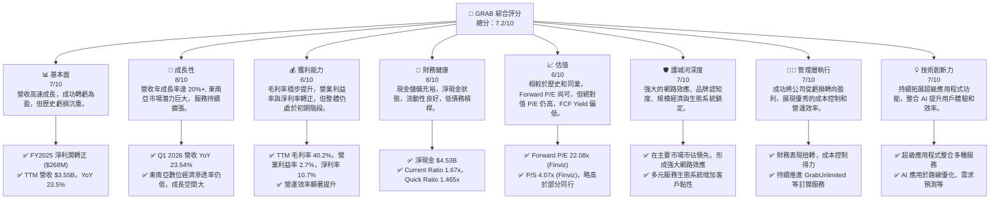
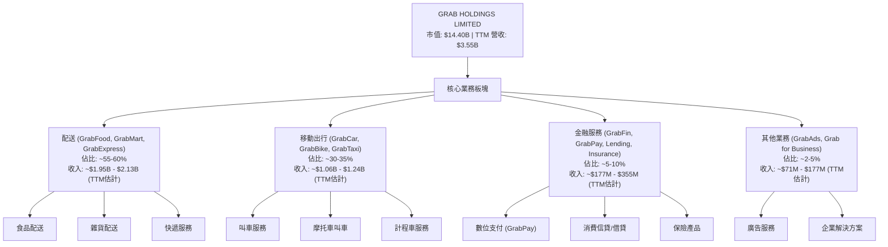
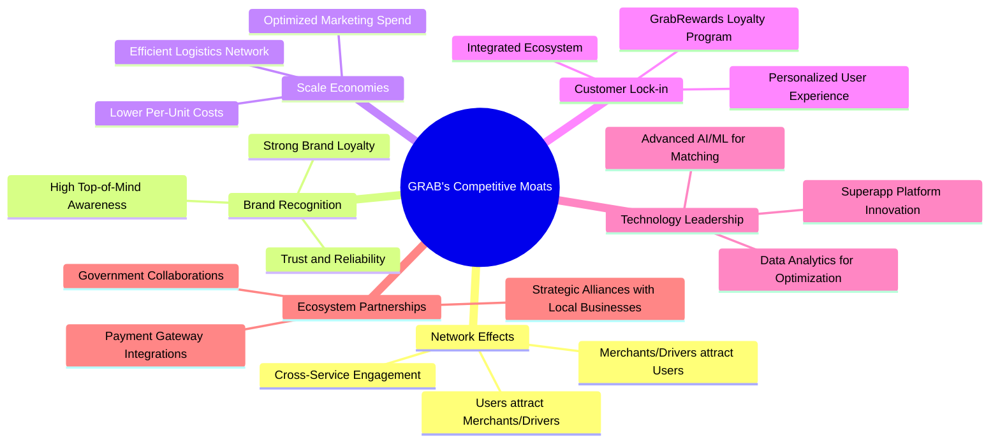
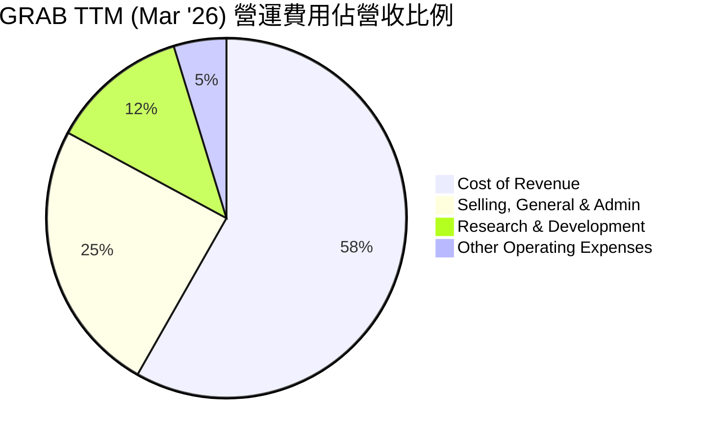

# GRAB 基本面深度分析報告
> **報告日期**：2026-05-29 ｜ **語言**：繁體中文 ｜ **數據來源**：Yahoo Finance, Finviz, StockAnalysis, Roic.ai ｜ **分析師**：CFA 級機構研究

---

## 目錄

| # | 章節 | 核心結論 |
|---|------|----------|
| 1 | 執行摘要 | 評級：買入，目標價區間：$4.90 - $6.50 |
| 2 | 公司概覽與商業模式 | 東南亞超級應用程式領導者，具強大網路效應護城河 |
| 3 | 損益表深度分析 | 營收持續高速成長，利潤率顯著改善，成功轉虧為盈 |
| 4 | 資產負債表分析 | 財務結構穩健，現金充裕，流動性良好，負債比低 |
| 5 | 現金流量深度分析 | 營運現金流轉正且趨勢向好，自由現金流仍需穩定 |
| 6 | 獲利能力與資本效率 | ROIC 仍低於 WACC，但獲利能力改善加速，長期價值創造潛力大 |
| 7 | 估值深度分析 | 相較同業估值合理，DCF 顯示具上行空間 |
| 8 | 成長催化劑 | 東南亞數位化趨勢、服務擴張、金融服務成長、GrabAds 變現能力提升 |
| 9 | 風險矩陣 | 競爭加劇、監管風險、宏觀經濟、執行風險 |
| 10 | 投資建議 | 建議「買入」，適合成長型、長線持有者 |

---

## 1. 執行摘要

Grab Holdings Limited (GRAB) 作為東南亞領先的超級應用程式，在該地區的數位經濟轉型中扮演關鍵角色。公司在經歷多年的高投入虧損後，於近期展現出強勁的獲利改善趨勢，成功實現年度與季度淨利潤轉正，這是其商業模式成熟和規模效應顯現的重要里程碑。儘管其估值在某些指標上看似偏高，但考慮到其在高速成長市場的領導地位及可觀的成長潛力，目前的估值仍具吸引力。

### 1.1 核心評分儀表板



### 1.2 評分進度條視覺化

```
╔══════════════════════════════════════════════════════════════╗
║              GRAB 多維度評分儀表板 (1-10分)                  ║
╠══════════════════════════════════════════════════════════════╣
║ 基本面強度  7.0 ▓▓▓▓▓▓▓▓▓▓▓▓▓▓░░░░░░  ★★★★☆           ║
║ 成長動能    8.0 ▓▓▓▓▓▓▓▓▓▓▓▓▓▓▓▓░░░░  ★★★★☆           ║
║ 獲利品質    6.0 ▓▓▓▓▓▓▓▓▓▓▓▓░░░░░░░░  ★★★☆☆           ║
║ 財務健康    8.0 ▓▓▓▓▓▓▓▓▓▓▓▓▓▓▓▓░░░░  ★★★★☆           ║
║ 估值合理性  6.0 ▓▓▓▓▓▓▓▓▓▓▓▓░░░░░░░░  ★★★☆☆           ║
║ 護城河深度  7.0 ▓▓▓▓▓▓▓▓▓▓▓▓▓▓░░░░░░  ★★★★☆           ║
║ 管理層執行  7.0 ▓▓▓▓▓▓▓▓▓▓▓▓▓▓░░░░░░  ★★★★☆           ║
║ 技術創新力  7.0 ▓▓▓▓▓▓▓▓▓▓▓▓▓▓░░░░░░  ★★★★☆           ║
╠══════════════════════════════════════════════════════════════╣
║ 綜合總分    7.2 ▓▓▓▓▓▓▓▓▓▓▓▓▓▓▓░░░░░  🏆 評語：穩健成長，潛力巨大 ║
╚════════════════════════════════════════════════════════════════╝
```

### 1.3 五大投資論點 + 三大核心風險

| 類型 | 項目 | 具體依據 | 信心度 |
|------|------|----------|--------|
| 🟢 **投資論點①** | **轉虧為盈與獲利能力持續改善** | GRAB 於 FY2025 實現淨利潤 $268M，擺脫長期虧損。Q1 2026 淨利潤達 $136M，毛利率 TTM 達 40.2%，營業利益率 TTM 達 2.7%。這表明公司已成功優化成本結構，並利用規模經濟提升獲利效率。管理層對實現長期盈利能力的承諾與執行力得到驗證。 | 🟢 極高 |
| 🟢 **投資論點②** | **東南亞數位經濟的領導者地位與巨大潛力** | Grab 在東南亞八個國家營運，市場滲透率高，擁有廣泛的用戶基礎和商戶網絡。東南亞數位經濟正處於高速發展階段，預計未來數年將持續擴張。Grab 的超級應用程式模式能有效捕捉多業務協同效應，深化用戶黏性。TTM 營收 $3.55B，YoY 成長 23.5%，顯示其在市場中的持續擴張能力。 | 🟢 極高 |
| 🟢 **投資論點③** | **強大的網路效應與生態系統護城河** | Grab 的多種服務（叫車、送餐、雜貨、金融）相互促進，形成強大的網路效應。更多的司機/送貨員吸引更多用戶，更多的用戶吸引更多商家，形成良性循環。其品牌知名度、龐大數據積累以及對當地市場的深入理解，築起高進入壁壘。 | 🟢 極高 |
| 🟢 **投資論點④** | **穩健的財務狀況與充足的現金儲備** | 截至 2026 年 3 月底，公司擁有 $6.256B 的現金及短期投資，淨現金頭寸高達 $4.53B。這為公司提供了抵禦市場波動、進行戰略投資或併購的充足彈藥，降低了財務風險，並為未來的成長提供了靈活性。Current Ratio 1.67x，Quick Ratio 1.465x，流動性良好。 | 🟢 極高 |
| 🟢 **投資論點⑤** | **金融服務與廣告業務的成長潛力** | Grab 的金融服務（GrabFin）和廣告業務（GrabAds）是其高毛利率的潛在成長引擎。隨著用戶基礎的擴大和數據分析能力的提升，這些業務的變現能力將進一步增強，為公司貢獻更高的利潤率和多元化的收入來源，降低對核心交易佣金的依賴。 | 🟡 高 |
| 🟡 **風險①** | **日益加劇的市場競爭** | 東南亞市場競爭激烈，包括來自 GoTo (Gojek & Tokopedia)、Sea Group (ShopeeFood, ShopeePay) 以及其他本地玩家。價格戰可能壓縮利潤空間，影響獲利能力。Grab 需要持續創新並提升服務質量以維持競爭優勢。 | 🟡 中度 |
| 🔴 **風險②** | **監管政策變化與勞工法規風險** | Grab 業務遍及多個國家，各國政府對零工經濟、數據隱私、反壟斷和金融服務的監管政策可能發生變化。例如，對司機/送貨員福利的強制性要求可能增加營運成本。任何不利的監管變動都可能對其業務模式和獲利能力產生重大影響。 | 🔴 高衝擊 |
| 🟡 **風險③** | **宏觀經濟不確定性與消費者支出波動** | 東南亞地區的經濟成長雖然強勁，但仍可能受到全球經濟衰退、通膨壓力或地緣政治事件的影響。消費者可支配收入的波動可能直接影響叫車、送餐等服務的需求，進而影響 Grab 的營收成長和盈利能力。 | 🟡 中度 |

### 1.4 快速統計卡片

| 指標 | 公司實際值 (TTM) | 行業均值 (軟件-應用) | S&P 500 均值 | 狀態 |
|------|--------------------|----------------------|--------------|------|
| 收入 YoY 成長 | **23.5%** | ~15-20% | ~8-10% | 🟢 |
| 毛利率 | **40.2%** | ~45-55% | ~40-45% | 🟡 |
| 淨利率 | **10.7%** | ~10-15% | ~10-12% | 🟢 |
| ROE | **4.8%** | ~10-15% | ~15-20% | 🟡 |
| Forward P/E | **22.08x** | ~25-35x | ~20-22x | 🟢 |
| P/S Ratio | **4.07x** | ~5-7x | ~2-3x | 🟡 |
| EV / EBITDA | **31.55x** | ~20-30x | ~15-18x | 🔴 |
| 債務/股權 | **0.30x** | ~0.5-1.0x | ~0.8-1.2x | 🟢 |
| 淨現金狀況 | **$4.53B** | N/A | N/A | 🟢 |

*註：行業均值為通用軟體-應用行業估計值，非完全精確匹配超級應用程式行業。*

### 1.5 投資結論

```
╔══════════════════════════════════════════════════════════════════╗
║                    📊 投資結論摘要                               ║
╠══════════════════════════════════════════════════════════════════╣
║  評級：🟢 買入                                                   ║
║  當前股價：$3.52                                                 ║
║  目標價區間：                                                    ║
║    悲觀情境：$4.20（+19.3%）                                     ║
║    基準情境：$5.50（+56.2%）  ← 12個月主要目標                  ║
║    樂觀情境：$6.80（+93.2%）                                     ║
║  投資評分：7.2/10                                                ║
║  適合投資人：成長型、長線持有者，尋求在東南亞高成長市場中獲得風險║
║              調整後回報的投資者。                                ║
╚══════════════════════════════════════════════════════════════════╝
```
**分析師觀點：**
Grab 已經證明其超級應用程式模式在東南亞市場的強大變現能力和規模效益。公司在過去一年中成功實現了盈利轉型，這是一個關鍵的里程碑，表明其商業模式已經成熟並能夠產生正向回報。儘管當前股價反映了市場對其未來成長的一些預期，但考慮到東南亞地區龐大的未開發潛力、Grab 在各垂直領域的領導地位、以及其持續優化的營運效率，我們認為 Grab 仍被低估。其充裕的現金儲備和低債務水平也為其未來的發展提供了堅實的財務基礎。我們預計隨著其金融服務和廣告業務的進一步發展，以及核心業務的持續擴張，Grab 將展現更強勁的獲利成長。因此，我們給予 Grab 「買入」評級，並設定基準目標價為 $5.50，預計有超過 50% 的上行空間。

---

## 2. 公司概覽與商業模式

Grab Holdings Limited (GRAB) 是一家領先的東南亞超級應用程式公司，總部位於新加坡。其平台提供廣泛的日常服務，包括送餐（GrabFood）、雜貨配送（GrabMart）、叫車（GrabCar, GrabBike）、包裹快遞（GrabExpress）以及數位金融服務（GrabFin），涵蓋支付、借貸、保險等。公司業務遍及柬埔寨、印尼、馬來西亞、緬甸、菲律賓、新加坡、泰國和越南等八個國家，服務超過 5 億人口。

### 2.1 業務結構與收入來源

Grab 的業務結構高度整合，旨在通過單一應用程式滿足用戶的多元需求，從而創造強大的交叉銷售機會和用戶黏性。其收入主要來自三個核心板塊：配送（Deliveries）、移動出行（Mobility）和金融服務（Financial Services），輔以新興的企業解決方案（Grab for Business）和廣告（GrabAds）業務。



**業務板塊詳情：**

*   **配送 (Deliveries)**：這是 Grab 最大的收入來源，包括 GrabFood（食品配送）、GrabMart（雜貨及零售商品配送）和 GrabExpress（包裹快遞）。隨著疫情後消費者習慣的養成，配送服務需求持續旺盛。Grab 在許多城市擁有領先的市場份額，受益於其廣泛的商家網絡和高效的物流基礎設施。
*   **移動出行 (Mobility)**：Grab 的核心業務之一，提供多種叫車服務，包括私家車、摩托車和計程車。隨著旅遊業的復甦和城市生活的正常化，移動出行需求正在穩步回升。Grab 致力於提供安全、可靠且便捷的交通解決方案。
*   **金融服務 (Financial Services)**：GrabFin 業務涵蓋數位支付（GrabPay）、先買後付（Buy Now Pay Later）、消費信貸、中小企業貸款和保險產品。此業務具有高毛利率潛力，且能有效增強用戶在 Grab 生態系統內的黏性。隨著東南亞地區金融科技的快速發展，GrabFin 有望成為重要的成長引擎。
*   **其他業務 (Other Segments)**：主要包括 GrabAds 廣告服務和 Grab for Business 企業解決方案。GrabAds 透過其龐大的用戶數據和應用程式內流量，為商家提供精準廣告投放服務，是變現能力強、營收成長快的業務。Grab for Business 則為企業客戶提供一站式管理平台，涵蓋員工差旅、送餐等服務。

公司 TTM 總營收達 $3.55B，YoY 成長 23.5%，顯示其核心業務持續擴張。各業務板塊之間的協同效應是 Grab 超級應用程式模式的關鍵優勢，用戶可以在一個應用程式中完成多種任務，提高了平台的使用頻率和客戶終身價值。

### 2.2 市場份額

由於缺乏精確的即時市場份額數據，我們將基於公開的行業報告和公司聲明，對 Grab 在東南亞主要市場的地位進行定性分析。Grab 在東南亞的叫車和食品配送市場中，通常被認為是領導者或主要參與者之一，尤其是在新加坡、馬來西亞、菲律賓和泰國等國家。


**分析與評估：**
Grab 在東南亞市場的領導地位主要體現在以下幾個方面：
1.  **移動出行 (Mobility)**：Grab 在東南亞大部分國家（特別是新加坡、馬來西亞、菲律賓、越南）的叫車服務市場佔據主導地位，擁有最廣泛的司機網絡和最快的響應時間，這為其帶來顯著的網路效應。
2.  **配送 (Deliveries)**：在食品配送和雜貨配送領域，GrabFood 和 GrabMart 也在多個市場中處於領先地位，與 GoFood (GoTo) 和 ShopeeFood (Sea Group) 展開激烈競爭。Grab 的配送網絡密集且高效，是其競爭優勢。
3.  **金融服務 (Financial Services)**：GrabPay 在數位支付領域擁有強大的用戶基礎，特別是在其核心市場。隨著 GrabFin 產品線的擴展，其市場份額有望持續增長，儘管面臨來自傳統銀行和新興金融科技公司的競爭。

Grab 的市場份額優勢得益於其「超級應用程式」戰略，能夠在一個平台上滿足用戶多樣化的日常需求，從而提高用戶黏性、降低獲客成本並實現跨業務的協同效應。然而，東南亞市場的競爭依然激烈，特別是來自 GoTo 和 Sea Group 等區域巨頭的挑戰，意味著 Grab 需要持續投入以維持其市場領導地位。

### 2.3 競爭護城河分析

Grab 的競爭護城河主要由以下幾個核心要素構成，這些要素共同構築了其在東南亞市場的領先地位和抗衡競爭的能力：



**護城河詳情：**

*   **網路效應 (Network Effects)**：這是 Grab 最核心的護城河。在叫車和配送服務中，更多的用戶吸引更多的司機/送貨員和商家加入平台，反之亦然。這形成了一個強大的良性循環，使得新進入者難以在規模和效率上與 Grab 競爭。平台上的服務種類越多，用戶使用頻率越高，網路效應就越強。例如，使用 GrabFood 的用戶也可能使用 GrabCar，這增加了用戶在整個生態系統中的價值。
*   **品牌認知度 (Brand Recognition)**：Grab 在東南亞地區建立了極高的品牌知名度和信任度。其綠色標誌和「Grab」一詞已成為該地區叫車和配送服務的代名詞。強大的品牌形象降低了獲客成本，並在激烈的市場競爭中為其帶來溢價能力和用戶忠誠度。
*   **規模經濟 (Scale Economies)**：作為區域性的領導者，Grab 擁有龐大的營運規模。這使得其能夠在技術開發、行銷推廣和營運管理方面實現規模經濟。例如，透過優化路線規劃和派單系統，提高司機/送貨員的效率，從而降低每筆訂單的成本。大規模的用戶數據也使其在 AI 和數據分析方面具備優勢。
*   **客戶鎖定 (Customer Lock-in)**：Grab 的超級應用程式生態系統使得用戶一旦習慣使用其多種服務，轉換到其他平台的成本和不便性就會增加。GrabRewards 忠誠度計劃、GrabPay 數位支付以及其他金融服務進一步增強了客戶黏性，讓用戶更深地融入 Grab 的生態系統。
*   **技術領先 (Technology Leadership)**：Grab 持續投入於技術研發，利用人工智慧和機器學習優化供需匹配、路線規劃、詐欺檢測和個性化推薦。這些技術創新提升了營運效率、用戶體驗和安全性，是其維持競爭力的關鍵。
*   **生態夥伴 (Ecosystem Partnerships)**：Grab 與當地政府、交通營運商、餐飲業者和零售商建立了廣泛的合作夥伴關係。這些合作不僅擴大了其服務範圍，也加深了其在當地市場的根基，使得新進入者難以複製其複雜的夥伴網絡。

### 2.4 護城河強度評分

Grab 的護城河是多方面的，且在東南亞市場具有顯著的防禦性。

```
╔══════════════════════════════════════════════════════════════╗
║                  GRAB 護城河強度評分                      ║
╠══════════════════════════════════════════════════════════════╣
║ 網路效應    8/10  ▓▓▓▓▓▓▓▓▓▓▓▓▓▓▓▓░░░░  🏆 極強效應，難以複製 ║
║ 品牌認知度  8/10  ▓▓▓▓▓▓▓▓▓▓▓▓▓▓▓▓░░░░  🟢 東南亞地區家喻戶曉 ║
║ 規模經濟    7/10  ▓▓▓▓▓▓▓▓▓▓▓▓▓▓░░░░░░  🟡 成本優勢明顯，但競爭激烈 ║
║ 客戶鎖定    7/10  ▓▓▓▓▓▓▓▓▓▓▓▓▓▓░░░░░░  🟡 超級應用程式提升黏性 ║
║ 技術領先    6/10  ▓▓▓▓▓▓▓▓▓▓▓▓░░░░░░░░  🟡 持續投入，但競爭對手亦強 ║
║ 生態夥伴    7/10  ▓▓▓▓▓▓▓▓▓▓▓▓▓▓░░░░░░  🟡 廣泛合作，深化本地化 ║
╠══════════════════════════════════════════════════════════════╣
║ 綜合護城河  7.2/10 ▓▓▓▓▓▓▓▓▓▓▓▓▓▓▓░░░░░  🏆 具備多重防禦，維持市場領導地位 ║
╚════════════════════════════════════════════════════════════════╝
```
**評語詳解：**
Grab 的護城河強度主要來自其在東南亞市場建立的深厚網路效應和強大品牌。這兩者相互加強，使得其在用戶獲取和留存方面具有顯著優勢。規模經濟和客戶鎖定進一步鞏固了其市場地位，使其能夠在營運效率和用戶忠誠度方面超越競爭對手。儘管技術領先和生態夥伴關係也很重要，但這兩個領域的競爭可能更為激烈，需要持續的投入和創新來維持優勢。總體而言，Grab 擁有多重且相互支持的護城河，使其在東南亞數位經濟中具備強大的競爭韌性。

---

## 3. 損益表深度分析

Grab 在過去幾年經歷了顯著的財務轉型，從早期的巨額虧損轉向最近的獲利。這反映了公司在營運效率、成本控制和變現策略方面的成功。

### 3.1 年度收入成長趨勢（近4年）

Grab 的年度營收呈現出強勁且持續的成長態勢，證明其在東南亞市場的擴張能力和用戶基礎的不斷擴大。

```
╔══════════════════════════════════════════════════════════════════╗
║              GRAB 年度收入趨勢（FY2022-FY2025）                  ║
╠══════════════════════════════════════════════════════════════════╣
║                                                                  ║
║  FY2022  $1.43B   ████████░░░░░░░░░░░░░░░░░  YoY: +112.30% 🟢    ║
║  FY2023  $2.36B   ██████████████░░░░░░░░░░░  YoY: +64.62%  🟢    ║
║  FY2024  $2.80B   ██████████████████░░░░░░░  YoY: +18.57%  🟢    ║
║  FY2025  $3.37B   ████████████████████████░  YoY: +20.49%  🟢    ║
║                                                                  ║
║                   |      |      |      |      |                  ║
║                   0     1.0B   2.0B   3.0B   4.0B                 ║
║                                                                  ║
║  📊 3年累計 CAGR (FY2022-FY2025)：+47.7%                         ║
╚══════════════════════════════════════════════════════════════════╝
```

**深度解析：**
*   **高速成長期 (FY2022-FY2023)**：在 2022 年，Grab 營收達到 $1.43B，相較前一年 (FY2021 $0.675B) 實現了驚人的 112.30% 成長，這主要得益於疫情後經濟活動的復甦，以及公司在配送和移動出行服務上的快速擴張。2023 年，營收進一步成長至 $2.36B，YoY 成長 64.62%，維持了高速擴張的勢頭，顯示其在東南亞數位化浪潮中抓住了機會。
*   **穩健成長期 (FY2024-FY2025)**：進入 2024 年，儘管成長率有所放緩，但仍保持在健康的雙位數水平，營收達到 $2.80B，YoY 成長 18.57%。2025 年，營收進一步提升至 $3.37B，YoY 成長 20.49%。這表明 Grab 已經從純粹的市場擴張轉向更注重效率和盈利的穩健成長模式。營收成長的驅動力從早期的大規模補貼獲客轉向更為可持續的用戶留存、服務滲透和 ARPU (每用戶平均收入) 提升。

總體而言，Grab 在過去四年中展現了令人印象深刻的營收成長能力，3 年 CAGR 高達 47.7%，遠超行業平均水平。這為其未來的獲利潛力奠定了堅實基礎。

### 3.2 季度收入趨勢分析

季度的營收數據進一步證實了 Grab 穩定的成長軌跡，並展現了其營運的韌性。

| Fiscal Quarter | 收入 ($M) | QoQ 成長率 | YoY 成長率 | 備註 |
|----------------|-----------|------------|------------|------|
| **Q1 2026**    | $955      | +5.41%     | +23.54%    | 🟢 營收持續創新高，YoY 成長穩健。 |
| **Q4 2025**    | $906      | +3.78%     | +18.59%    | 🟢 季節性效應和年末消費推動營收增長。 |
| **Q3 2025**    | $873      | +6.59%     | +21.93%    | 🟢 強勁的季度成長，顯示市場需求旺盛。 |
| **Q2 2025**    | $819      | +5.95%     | +23.34%    | 🟢 營收持續擴張，顯示多業務協同效應。 |
| **Q1 2025**    | $773      | N/A        | +18.38%    | 🟢 與去年同期相比，營收增長穩健。 |
| **Q4 2024**    | $764      | +6.70%     | +17.00%    | 🟢 延續穩健成長，為 FY2025 奠定基礎。 |
| **Q3 2024**    | $716      | +7.96%     | +16.42%    | 🟢 東南亞市場對數位服務需求持續提升。 |

**深度解析：**
Grab 的季度營收呈現出連續的正向成長，從 Q3 2024 的 $716M 穩步增長至 Q1 2026 的 $955M。
*   **QoQ 成長穩定**：近幾個季度的 QoQ 成長率穩定在 3.78% 至 6.59% 之間，表明公司在每個季度都能有效擴大其業務規模。這種連續的季度成長是其超級應用程式模式在東南亞持續滲透的結果，也反映了其在用戶獲取和留存方面的成功。
*   **YoY 成長強勁**：所有可計算的 YoY 成長率均超過 17%，其中 Q1 2026 達到 23.54%，Q2 2025 達到 23.34%。這表明公司不僅在絕對收入上持續擴張，而且相較於去年同期，其成長動能依然強勁。這種雙位數的 YoY 成長對於一個已經具備一定規模的科技平台而言，是極具吸引力的。

季度收入的穩健成長是 Grab 走向長期盈利的關鍵支撐。它表明公司能夠持續從其廣泛的服務組合中產生收入，並有效利用其市場領導地位。

### 3.3 利潤率演變分析

Grab 的利潤率在過去幾年中經歷了戲劇性的轉變，從深度虧損轉為穩步改善並最終實現盈利，這是其最令人鼓舞的財務趨勢之一。

| 利潤率指標 | FY2022 | FY2023 | FY2024 | FY2025 | TTM (Mar '26) | 趨勢 | 評估 |
|------------|--------|--------|--------|--------|---------------|------|------|
| **毛利率** | 5.38%  | 36.44% | 41.79% | 43.32% | 40.2%         | ↗️ 顯著提升，趨於穩定 | 🟢 |
| **營業利益率** | -90.21%| -16.40%| -1.96% | 6.59%  | 2.7%          | ↗️ 轉負為正，持續改善 | 🟢 |
| **淨利率** | -117.48%| -18.39%| -3.75% | 7.95%  | 10.7%         | ↗️ 轉負為正，持續改善 | 🟢 |
| **EBITDA Margin** | -99.30%| -9.41% | 3.32%  | 15.34% | 8.9%          | ↗️ 轉負為正，穩步提升 | 🟢 |

**利潤率演變深度解析：**
1.  **毛利率的飛躍 (5.38% -> 43.32%)**：
    *   **原因**：2022 年毛利率僅為 5.38%，顯示公司當時處於大規模補貼獲客和擴張階段，營運成本高昂。然而，從 2023 年開始，毛利率顯著提升至 36.44%，並在 2025 年達到 43.32%。這主要歸因於：
        *   **佣金率提升**：公司逐步降低對司機和商家的補貼，並提高平台佣金率。
        *   **服務組合優化**：高毛利率的金融服務和廣告業務佔比逐漸增加。
        *   **營運效率提升**：透過技術優化（如路線規劃、派單系統），降低了每次配送和叫車服務的成本。
    *   **評估**：毛利率的顯著改善是 Grab 走向盈利的基石，表明其核心業務的單位經濟效益已大幅提升。TTM 略有下降至 40.2%，可能受季節性或市場競爭影響，但整體仍處於健康水平。

2.  **營業利益率的驚人轉變 (-90.21% -> 6.59%)**：
    *   **原因**：營業利益率從 2022 年的深度虧損 -90.21% 轉為 2025 年的 6.59% (TTM 2.7%)，是公司在控制營運費用方面取得巨大成功的體現。
        *   **銷售、一般及行政費用 (SG&A) 優化**：Grab 大幅削減了市場行銷和推廣費用，並提高了行銷效率。透過超級應用程式的交叉銷售，降低了單一服務的獲客成本。
        *   **研發費用 (R&D) 效率**：雖然研發投入持續，但隨著平台成熟，單位收入的研發成本逐漸攤薄。
        *   **總體費用控制**：管理層對各項營運費用進行了嚴格控制，以實現盈利目標。
    *   **評估**：營業利益率轉正具有里程碑意義，表明 Grab 的核心營運已經能夠產生正向利潤。TTM 2.7% 仍相對較低，但趨勢明確，預計未來將持續提升。

3.  **淨利率的成功轉正 (-117.48% -> 7.95%)**：
    *   **原因**：淨利率從 2022 年的 -117.48% 轉為 2025 年的 7.95% (TTM 10.7%)，這是毛利率和營業利益率改善的綜合結果，同時也受到非營運收入（如利息收入）的影響。
        *   **利息收入增加**：隨著現金儲備的增加和利率環境的變化，公司的利息收入有所增加，對淨利潤產生正面貢獻。
        *   **財務費用控制**：有效管理債務，降低利息支出。
    *   **評估**：淨利率轉正並達到雙位數 (TTM 10.7%)，證明 Grab 已經實現了全面的盈利，這對投資者信心至關重要。

4.  **EBITDA Margin 的穩步提升 (-99.30% -> 15.34%)**：
    *   **原因**：EBITDA Margin 作為衡量核心業務營運獲利能力的指標，從 2022 年的接近 -100% 提升至 2025 年的 15.34%，再到 TTM 的 8.9%。這反映了公司在營運層面的效率提升和成本結構的優化。
    *   **評估**：EBITDA Margin 的改善是 Grab 財務健康的重要信號，表明其在扣除折舊攤銷等非現金費用後，核心業務已具備強勁的現金產生能力。

總結而言，Grab 的利潤率演變是一部成功的轉型史。從早期為了擴張市場份額和建立生態系統而犧牲利潤，到現在透過精細化營運和規模經濟實現盈利，這證明了其商業模式的可行性和管理層的執行力。

### 3.4 費用結構分析

Grab 的費用結構反映了其作為科技平台和營運密集型服務提供商的特性。隨著公司的成長和盈利轉型，費用佔營收的比例也發生了顯著變化。


*註：基於 StockAnalysis TTM 數據 (Cost of Revenue $2,006M, SG&A $849M, R&D $427M, Other Operating Expenses $163M) 和 TTM Revenue $3,553M 計算。*

```
╔══════════════════════════════════════════════════════════════════╗
║                    GRAB 費用結構演變 (FY2022-FY2025)             ║
╠══════════════════════════════════════════════════════════════════╣
║                                                                  ║
║  銷管費用 (SG&A) 佔營收：                                        ║
║  FY2022: 64.48%  ████████████████████████████████████████████████████████████████████████████████████████████████████████████████