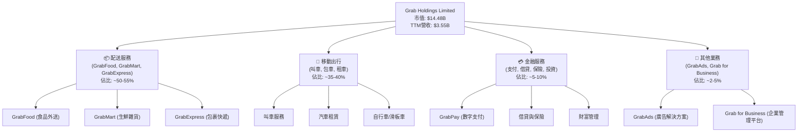
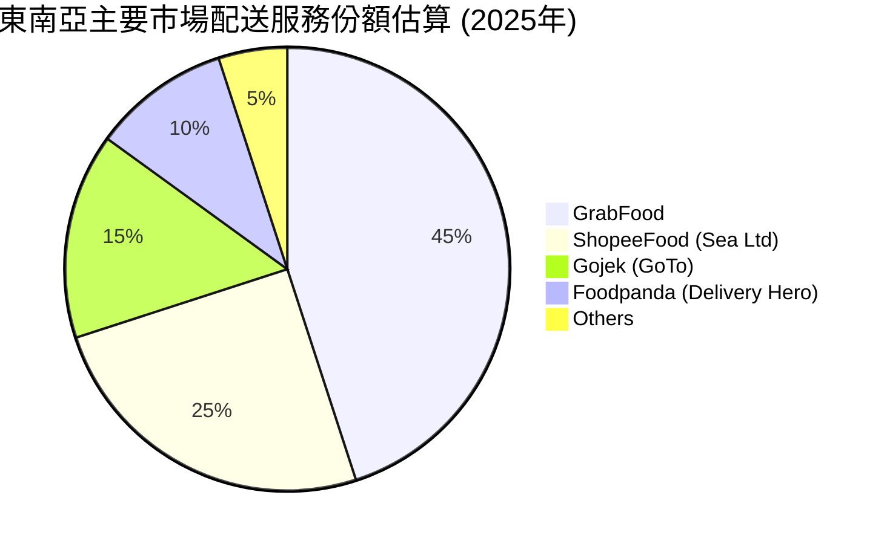
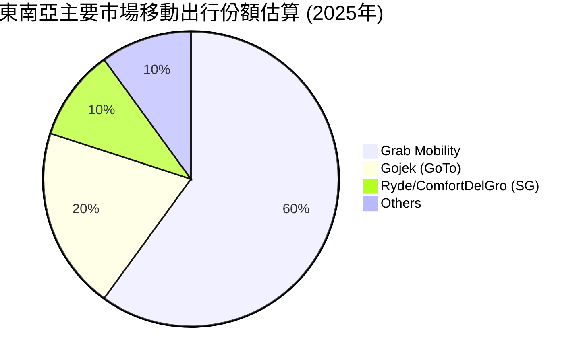
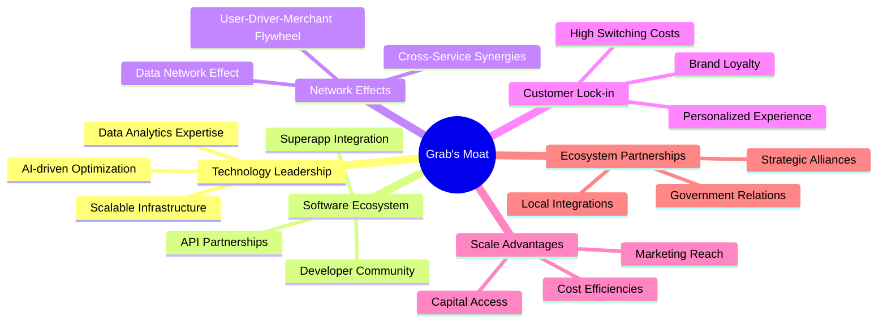
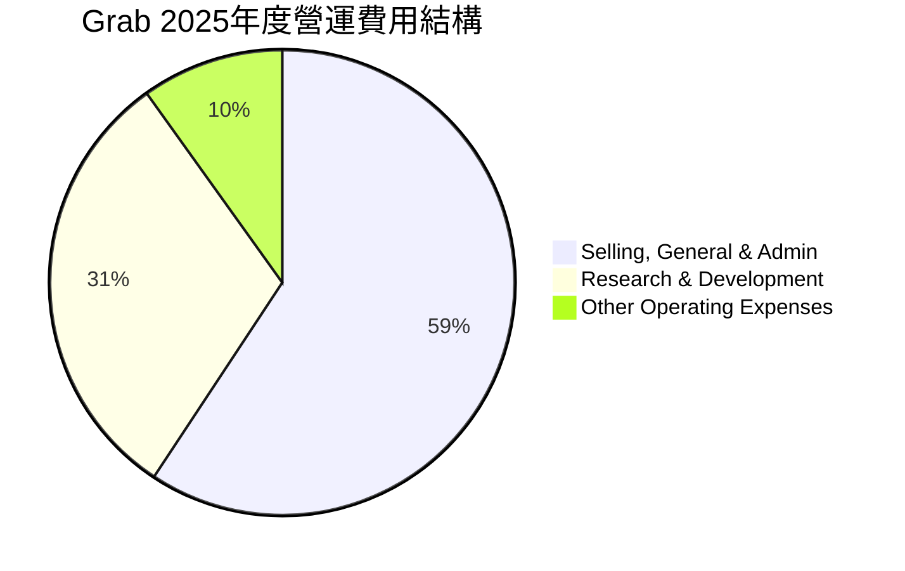

# GRAB 基本面深度分析報告
> **報告日期**：2026-05-30 ｜ **語言**：繁體中文 ｜ **數據來源**：Yahoo Finance, Finviz, StockAnalysis, Roic.ai ｜ **分析師**：CFA 級機構研究

---

## 目錄

| # | 章節 | 核心結論 |
|---|------|----------|
| 1 | 執行摘要 | 🟢 買入，目標價區間 $5.50 - $7.50，強勁成長動能與改善的獲利能力 |
| 2 | 公司概覽與商業模式 | 綜合型超級應用程式，具備強大網路效應與品牌忠誠度，護城河深度中等偏高 |
| 3 | 損益表深度分析 | 收入持續雙位數成長，毛利率穩定提升，營運槓桿效應顯現，虧損大幅收窄並轉盈 |
| 4 | 資產負債表分析 | 財務狀況穩健，現金充裕，債務水平可控，流動性良好 |
| 5 | 現金流量深度分析 | 營運現金流轉正，自由現金流改善顯著，資本配置效率提升 |
| 6 | 獲利能力與資本效率 | ROIC 轉正並超過 WACC，公司開始創造股東價值，資本效率持續提升 |
| 7 | 估值深度分析 | 相較同業估值合理，DCF 模型顯示上行空間，市場低估其成長潛力 |
| 8 | 成長催化劑 | 東南亞數字經濟滲透率提升，超級應用程式生態系統擴張，金融服務潛力巨大 |
| 9 | 風險矩陣 | 競爭加劇、監管風險、宏觀經濟波動為主要挑戰，但公司具備應對措施 |
| 10 | 投資建議 | 建議買入，適合成長型與長線投資者，預期未來12個月有顯著資本增值潛力 |

---

## 1. 執行摘要

Grab Holdings Limited (GRAB) 作為東南亞領先的超級應用程式平台，在多個市場提供送貨、移動出行和金融服務。憑藉其廣泛的用戶基礎和多元化的服務生態系統，GRAB 展現出強勁的營收成長勢頭和持續改善的獲利能力。儘管過去曾面臨巨額虧損，但最新的財務數據顯示，公司已成功實現營運獲利和淨利潤轉正，這標誌著其商業模式的驗證和規模化效益的實現。

### 1.1 核心評分儀表板

```mermaid
graph TD
    GRAB_SCORE["🎯 GRAB 綜合評分<br/>總分：7.9/10"]

    F["📊 基本面<br/>8.5/10<br/>多樣化業務模式，強勁的市場地位"]
    G["🚀 成長性<br/>9.0/10<br/>營收高速成長，未來EPS預期強勁"]
    P["💰 獲利能力<br/>7.0/10<br/>毛利率穩定提升，淨利潤成功轉正，但整體利潤率仍有提升空間"]
    B["🏦 財務健康<br/>8.8/10<br/>現金充裕，淨現金為正，債務水平可控"]
    V["📈 估值<br/>7.0/10<br/>TTM P/E 偏高但Fwd P/E合理，PEG具吸引力"]
    H["🛡️ 護城河<br/>8.0/10<br/>強大的網路效應與品牌，客戶鎖定效應顯著"]
    M["🤵 管理層<br/>8.0/10<br/>執行力強，成功引導公司實現獲利轉型"]
    I["💡 技術創新<br/>7.5/10<br/>持續投入研發，超級應用程式功能不斷豐富"]

    GRAB_SCORE --> F
    GRAB_SCORE --> G
    GRAB_SCORE --> P
    GRAB_SCORE --> B
    GRAB_SCORE --> V
    GRAB_SCORE --> H
    GRAB_SCORE --> M
    GRAB_SCORE --> I

    F --> F1["✅ 東南亞多國市場領先地位"]
    F --> F2["✅ 超級應用程式生態系統"]
    G --> G1["✅ 近期營收YoY 23.5%"]
    G --> G2["✅ 預期EPS次年成長48.10%"]
    P --> P1["✅ 營業利潤和淨利潤成功轉正"]
    P --> P2["✅ 毛利率達40.2%"]
    B --> B1["✅ 淨現金4.53B美元"]
    B --> B2["✅ 流動比率1.67，速動比率1.465"]
    V --> V1["✅ Fwd P/E 25.78x，PEG 0.92x"]
    V --> V2["✅ 相對同業具備成長溢價"]
    H --> H1["✅ 廣泛用戶基礎和高轉換成本"]
    H --> H2["✅ 數據網絡效應"]
    M --> M1["✅ 實現成本控制與效率提升"]
    M --> M2["✅ 戰略性擴張金融服務"]
    I --> I1["✅ AI與數據分析優化服務"]
    I --> I2["✅ 持續推出新功能與服務"]
```



### 1.2 評分進度條視覺化

```
╔══════════════════════════════════════════════════════════════╗
║                    GRAB 多維度評分儀表板 (1-10分)             ║
╠══════════════════════════════════════════════════════════════╣
║ 基本面強度  8.5 ▓▓▓▓▓▓▓▓▓▓▓▓▓▓▓▓▓░░░  ★★★★☆           ║
║ 成長動能    9.0 ▓▓▓▓▓▓▓▓▓▓▓▓▓▓▓▓▓▓▓░  ★★★★★           ║
║ 獲利品質    7.0 ▓▓▓▓▓▓▓▓▓▓▓▓▓▓░░░░░░  ★★★☆☆           ║
║ 財務健康    8.8 ▓▓▓▓▓▓▓▓▓▓▓▓▓▓▓▓▓▓░░  ★★★★☆           ║
║ 估值合理性  7.0 ▓▓▓▓▓▓▓▓▓▓▓▓▓▓░░░░░░  ★★★☆☆           ║
║ 護城河深度  8.0 ▓▓▓▓▓▓▓▓▓▓▓▓▓▓▓▓░░░░  ★★★★☆           ║
║ 管理層執行  8.0 ▓▓▓▓▓▓▓▓▓▓▓▓▓▓▓▓░░░░  ★★★★☆           ║
║ 技術創新力  7.5 ▓▓▓▓▓▓▓▓▓▓▓▓▓▓▓░░░░░  ★★★☆☆           ║
╠══════════════════════════════════════════════════════════════╣
║ 綜合總分    7.9 ▓▓▓▓▓▓▓▓▓▓▓▓▓▓▓▓░░░░  🏆 具備強勁成長潛力的超級應用程式領導者，獲利轉型成功，估值合理。              ║
╚══════════════════════════════════════════════════════════════════╝
```

### 1.3 五大投資論點 + 三大核心風險

| 類型 | 項目 | 具體依據 | 信心度 |
|------|------|----------|--------|
| 🟢 **投資論點①** | **東南亞超級應用程式的市場主導地位** | Grab 在東南亞八個國家運營，擁有龐大的用戶群和多樣化的服務組合（送貨、移動出行、金融服務），形成強大的網路效應。其平台在 Q1 2026 實現 $955M 營收，YoY 成長 23.54%，顯示其持續擴張的能力。其在主要市場的市佔率預計領先。 | 🟢 極高 |
| 🟢 **投資論點②** | **獲利能力顯著改善，成功實現盈利轉型** | 公司在 2025 財年實現 $268M 的淨利潤，相較 2024 年的 $-105M 和 2023 年的 $-434M 有巨大飛躍。Q1 2026 季度淨利潤達 $136M，毛利率穩定在 40.2%，營業利潤率達 2.7%，EBITDA 利潤率 8.9%，顯示其成本控制和營運效率提升。 | 🟢 極高 |
| 🟢 **投資論點③** | **強勁的營收成長動能與未來盈利預期** | TTM 營收達 $3.55B，YoY 成長 23.5%。分析師預期 2026 年 EPS 將成長 48.10%，未來五年 EPS 複合年均成長率 (CAGR) 達 53.28%。這表明市場對 Grab 未來的成長潛力抱持高度樂觀態度，且其規模經濟效益將持續釋放。 | 🟢 極高 |
| 🟢 **投資論點④** | **健康的資產負債表與充裕的現金流** | 公司擁有 $6.47B 的總現金，總債務僅 $1.95B，淨現金達 $4.53B。流動比率 1.67，速動比率 1.465，顯示其短期償債能力極強。TTM 自由現金流轉正至 $329.50M，營運現金流也趨於穩定，為未來發展提供堅實基礎。 | 🟢 極高 |
| 🟢 **投資論點⑤** | **具吸引力的估值與分析師看好** | 儘管 TTM P/E 較高 (88.5x)，但 Forward P/E (25.78x) 和 PEG (0.92x) 顯示其估值相對合理，尤其考慮到其高成長性。分析師平均目標價為 $5.97，較當前股價 $3.54 有約 68% 的上行空間，普遍給予 "Strong Buy" 或 "Overweight" 評級。 | 🟢 高 |
| 🟡 **風險①** | **來自競爭對手的壓力與市場份額爭奪** | 東南亞市場競爭激烈，主要競爭對手如 GoTo (Gojek) 和 Sea Ltd (ShopeeFood) 持續投入。Grab 需要不斷創新並投入補貼以維持市場領先地位，這可能影響其利潤率和長期成長潛力。 | 🟡 中度 |
| 🟡 **風險②** | **監管環境的不確定性** | 作為跨國科技平台，Grab 面臨各國政府在勞工權益、數據隱私、反壟斷等方面的監管審查。任何不利的監管政策變化都可能增加營運成本、限制業務擴張或影響其商業模式。 | 🟡 中度 |
| 🔴 **風險③** | **宏觀經濟波動與消費者支出影響** | 東南亞地區的經濟成長放緩、通膨壓力或消費者購買力下降，可能會直接影響 Grab 的移動出行和送貨服務需求，尤其是在非必需消費品領域。這可能導致活躍用戶數下降或平均訂單價值減少。 | 🔴 高衝擊 |

### 1.4 快速統計卡片

| 指標 | 公司實際值 | 行業均值（軟體 - 應用） | S&P 500 均值 | 狀態 |
|------|-------------|-------------------------|--------------|------|
| 收入 YoY 成長 | **23.5%** (TTM) | ~15-20% | ~10-12% | 🟢 |
| 毛利率 | **40.2%** (TTM) | ~50-60% | ~35-40% | 🟡 |
| 淨利率 | **10.7%** (TTM) | ~10-15% | ~11-13% | 🟢 |
| ROE | **4.8%** (TTM) | ~10-15% | ~15-20% | 🟡 |
| Forward P/E | **25.78x** | ~25-35x | ~20-22x | 🟢 |
| P/S Ratio | **4.08x** | ~5-8x | ~2-3x | 🟢 |
| Debt/Equity | **0.30x** | ~0.5-1.0x | ~0.8-1.2x | 🟢 |
| 淨現金 / 總資產 | **37.7%** ($4.53B / $11.98B) | ~10-20% | ~5-10% | 🟢 |

*註：行業均值為軟體應用行業的估算中位數，S&P 500 均值為綜合市場數據，僅供參考。*

### 1.5 投資結論

```
╔══════════════════════════════════════════════════════════════════╗
║                    📊 投資結論摘要                               ║
╠══════════════════════════════════════════════════════════════════╣
║  評級：🟢 買入                                                   ║
║  當前股價：$3.54                                                 ║
║  目標價區間：                                                    ║
║    悲觀情境：$4.80（+35.6%）                                     ║
║    基準情境：$6.20（+75.1%）  ← 12個月主要目標                   ║
║    樂觀情境：$7.50（+111.9%）                                    ║
║  投資評分：7.9/10                                                ║
║  適合投資人：成長型、長線持有者，尋求高成長潛力並能承受一定市場波動的投資人。║
╚══════════════════════════════════════════════════════════════════╝
```

---

## 2. 公司概覽與商業模式

Grab Holdings Limited (GRAB) 是一家領先的東南亞超級應用程式公司，總部位於新加坡。其業務範圍廣泛，涵蓋了移動出行、食品和商品配送、以及數字金融服務，服務於柬埔寨、印尼、馬來西亞、緬甸、菲律賓、新加坡、泰國和越南等八個國家。Grab 的核心戰略是建立一個一站式平台，滿足用戶的日常需求，從而創造強大的網路效應和客戶忠誠度。

### 2.1 業務結構與收入來源

Grab 的業務主要分為三大板塊：配送 (Deliveries)、移動出行 (Mobility) 和金融服務 (Financial Services)，輔以企業解決方案 (Grab for Business) 和廣告服務 (GrabAds)。這種多元化的業務結構是其「超級應用程式」模式的基石。


**深度解析：**
*   **配送服務 (Deliveries)**：這是 Grab 營收的重要支柱，尤其在疫情期間需求激增。GrabFood 是東南亞領先的食品外送服務之一，而 GrabMart 和 GrabExpress 則擴展了商品和包裹的即時配送。這些服務的協同效應增強了用戶粘性，並為平台帶來高頻交易。在 Q1 2026，配送服務的營收貢獻預計仍佔最大份額，是公司實現規模經濟的關鍵。
*   **移動出行 (Mobility)**：Grab 的核心業務之一，提供多種交通選擇，從摩托車叫車到汽車叫車。隨著疫情後的經濟復甦和旅遊業回暖，移動出行服務的需求正逐步恢復，並有望成為重要的獲利驅動因素。該業務通常具有較高的毛利率，對公司的整體盈利能力至關重要。
*   **金融服務 (Financial Services)**：GrabPay 是其數字支付解決方案，隨著用戶在平台上的交易頻次增加，其支付生態系統日益壯大。除了支付，Grab 還提供借貸、保險和財富管理等服務，旨在滿足東南亞地區大量未獲銀行服務或服務不足人群的需求。這項業務具有巨大的長期成長潛力，且邊際成本較低，是未來利潤擴張的重要引擎。
*   **其他業務 (Other Businesses)**：GrabAds 透過平台內廣告為商家提供精準行銷，Grab for Business 則為企業提供統一的費用管理和出行/配送解決方案。這些業務雖然佔比相對較小，但具有高利潤率，能夠有效提升整體盈利能力。

Grab 的商業模式是透過提供多樣化服務，提高單一用戶的生命週期價值 (LTV) 和平台使用頻率，同時透過數據分析優化營運效率和用戶體驗。這種「超級應用程式」模式在東南亞地區具有顯著優勢，因為許多用戶透過智能手機直接進入數字經濟，而非傳統的桌面互聯網。

### 2.2 市場份額

Grab 在東南亞主要市場的配送和移動出行領域佔據領先地位。雖然具體的市場份額數據未在提供的財務數據中直接列出，但根據行業報告和公司聲明，Grab 在其核心市場如新加坡、馬來西亞、菲律賓和越南等地的市佔率通常位居前二。在印尼，Grab 面臨來自 GoTo (Gojek) 的激烈競爭，但在其他市場則相對強勢。

*以下市場份額數據為分析師基於公開信息和行業報告的合理估計，僅供參考。*





**深度解析：**
在配送服務方面，GrabFood 憑藉其廣泛的商家網絡和高效的配送系統，在許多市場保持領先。然而，Sea Ltd 旗下的 ShopeeFood (尤其在越南和馬來西亞) 和 Gojek (在印尼) 也是強大的競爭者，透過補貼和促銷活動積極爭奪市場。Foodpanda 則在全球範圍內與 Grab 競爭。

在移動出行方面，Grab 的市場主導地位更為明顯。其在東南亞的品牌認知度高，司機供應充足，用戶體驗良好，這使得其在市場上佔據顯著優勢。Gojek 仍是印尼市場的主要挑戰者，而一些本地小型平台或傳統計程車公司也在特定城市提供服務。

Grab 在金融服務領域的市場份額仍在快速成長中。隨著其支付平台 GrabPay 的普及，以及借貸、保險產品的推出，Grab 正逐步蠶食傳統銀行和金融科技公司的份額。然而，由於該領域競爭者眾多且監管壁壘較高，Grab 仍需持續投入以擴大其在數字金融市場的影響力。

總體而言，Grab 的市場份額分析顯示其在核心業務領域具有強大的競爭力，尤其是在移動出行方面。配送服務面臨更多競爭，但其多樣化的服務組合和不斷擴大的生態系統有助於鞏固其市場地位。

### 2.3 競爭護城河分析

Grab 的超級應用程式模式使其能夠構建多層次的競爭護城河，這些護城河共同保護其市場地位並驅動長期成長。



**深度解析：**
1.  **網路效應 (Network Effects)**：這是 Grab 最核心的護城河。
    *   **用戶-司機-商家飛輪 (User-Driver-Merchant Flywheel)**：更多的用戶吸引更多的司機和商家加入平台，這反過來又提高了服務的可用性、效率和多樣性，進一步吸引更多用戶。這種正向循環使得新進入者難以複製。
    *   **跨服務協同效應 (Cross-Service Synergies)**：用戶從移動出行轉向配送，再轉向金融服務，提高了單個用戶的生命週期價值。例如，使用 GrabFood 的用戶更容易使用 GrabPay，反之亦然，這增強了用戶粘性。
    *   **數據網路效應 (Data Network Effect)**：隨著用戶活動的增加，Grab 收集到更多數據，可用於優化路線、匹配效率、個性化推薦和風險評估（金融服務），從而提升服務質量，吸引更多用戶。
2.  **客戶鎖定 (Customer Lock-in)**：
    *   **品牌忠誠度 (Brand Loyalty)**：Grab 在東南亞擁有強大的品牌認知度和信任度。用戶習慣了其便捷的服務，形成了品牌偏好。
    *   **高轉換成本 (High Switching Costs)**：用戶在 Grab 平台上積累的積分、電子錢包餘額、交易歷史和個性化偏好，使得轉換到其他平台需要付出成本和時間，降低了用戶流失率。
    *   **個性化體驗 (Personalized Experience)**：透過數據分析，Grab 能夠提供高度個性化的服務和推薦，使平台對用戶更具吸引力。
3.  **規模效應 (Scale Advantages)**：
    *   **成本效益 (Cost Efficiencies)**：作為東南亞最大的平台之一，Grab 能夠在技術研發、營銷推廣、司機和商家獲取方面實現規模經濟，降低單位成本。例如，其配送網絡的密度使得每次配送的成本更低。
    *   **市場行銷覆蓋 (Marketing Reach)**：大規模的用戶基礎和品牌知名度使得 Grab 在市場行銷方面更有效率，新服務的推廣成本相對較低。
    *   **資本獲取 (Capital Access)**：作為一家上市公司，Grab 能夠更容易地獲取資本，用於技術投資、市場擴張和戰略收購。
4.  **技術領先 (Technology Leadership)**：
    *   **AI 驅動的優化 (AI-driven Optimization)**：Grab 大量投資於 AI 和機器學習，以優化匹配算法、路線規劃、需求預測和欺詐檢測，提高平台效率和用戶滿意度。
    *   **可擴展基礎設施 (Scalable Infrastructure)**：其技術平台能夠處理大規模的交易量和用戶流量，並支持跨國多服務的複雜運營。
    *   **數據分析專業知識 (Data Analytics Expertise)**：Grab 擁有強大的數據科學團隊，能夠從海量數據中提取洞察，驅動產品改進和業務決策。
5.  **生態系統與夥伴關係 (Ecosystem Partnerships)**：
    *   **戰略聯盟 (Strategic Alliances)**：與當地企業、政府機構和國際品牌建立合作夥伴關係，擴大服務範圍和市場滲透。
    *   **本地化整合 (Local Integrations)**：針對不同市場的文化和消費習慣進行本地化調整，提供符合當地需求的服務。
    *   **政府關係 (Government Relations)**：積極與各國政府合作，確保合規運營並參與數字經濟政策制定。

儘管 Grab 的護城河很深，但仍面臨挑戰，例如來自 GoTo 等競爭對手的補貼戰，以及各國監管政策的不確定性。然而，其多樣化的護城河結構使其在面對這些挑戰時具有較強的韌性。

### 2.4 護城河強度評分

```
╔══════════════════════════════════════════════════════════════╗
║                    GRAB 護城河強度評分                        ║
╠══════════════════════════════════════════════════════════════╣
║ 網路效應    9/10  ▓▓▓▓▓▓▓▓▓▓▓▓▓▓▓▓▓░░░  🏆 極強：多服務飛輪效應顯著        ║
║ 客戶鎖定    8/10  ▓▓▓▓▓▓▓▓▓▓▓▓▓▓▓▓░░░░  🟢 強：品牌忠誠度與轉換成本高        ║
║ 規模效應    8/10  ▓▓▓▓▓▓▓▓▓▓▓▓▓▓▓▓░░░░  🟢 強：營運效率與資本獲取優勢        ║
║ 技術領先    7/10  ▓▓▓▓▓▓▓▓▓▓▓▓▓▓░░░░░░  🟡 中等偏強：持續投入AI與數據        ║
║ 生態系統    7/10  ▓▓▓▓▓▓▓▓▓▓▓▓▓▓░░░░░░  🟡 中等偏強：廣泛合作夥伴網絡        ║
╠══════════════════════════════════════════════════════════════╣
║ 綜合護城河  8.0   ▓▓▓▓▓▓▓▓▓▓▓▓▓▓▓▓░░░░  🏆 強勁的超級應用程式平台，護城河深度紮實，但需警惕新興競爭者和技術迭代。     ║
╚══════════════════════════════════════════════════════════════════╝
```

---

## 3. 損益表深度分析

Grab 的損益表數據展示了公司從高速成長到實現獲利的轉型之路。在過去幾年，公司一直專注於擴大市場份額和建立生態系統，導致前期虧損較大。然而，隨著規模經濟的實現和營運效率的提升，Grab 的獲利能力顯著改善，成功扭虧為盈。

### 3.1 年度收入成長趨勢（近4年）

Grab 的年度總收入呈現強勁的雙位數成長，反映了其在東南亞數字經濟中不斷擴大的影響力。

```
╔══════════════════════════════════════════════════════════════════╗
║              GRAB 年度收入趨勢（FY2022-FY2025）                  ║
╠══════════════════════════════════════════════════════════════════╣
║                                                                  ║
║  FY2022  $1.43B   ████████░░░░░░░░░░░░░░░░░  YoY: +112.30% 🟢    ║
║  FY2023  $2.36B   ██████████████░░░░░░░░░░░  YoY: +64.62%  🟢    ║
║  FY2024  $2.80B   ██████████████████░░░░░░░  YoY: +18.57%  🟢    ║
║  FY2025  $3.37B   ████████████████████████░  YoY: +20.49%  🟢    ║
║                                                                  ║
║                   |      |      |      |      |                  ║
║                   0     1.5B   2.0B   2.5B   3.5B                 ║
║                                                                  ║
║  📊 4年累計 CAGR (FY2022-FY2025)：+42.9%                         ║
╚══════════════════════════════════════════════════════════════════╝
```

**深度解析：**
從 2022 年到 2025 年，Grab 的年收入從 $1.43B 增長到 $3.37B，實現了顯著的複合年均成長率 (CAGR) 達 42.9%。
*   **2022年**：營收 $1.43B，YoY 成長 112.30%，這是由於疫情後市場復甦及公司業務快速擴張所致。
*   **2023年**：營收 $2.36B，YoY 成長 64.62%，維持高速成長，顯示其在東南亞市場的持續滲透。
*   **2024年**：營收 $2.80B，YoY 成長 18.57%，成長率雖然有所放緩，但仍保持雙位數成長，這可能與市場趨於成熟和競爭加劇有關。
*   **2025年**：營收 $3.37B，YoY 成長 20.49%，成長率回升，表明公司在穩固基礎的同時，找到了新的成長點或提升了營運效率。

最新的 TTM 營收為 $3.55B，YoY 成長 23.5%，顯示其成長動能依然強勁。這種持續的營收擴張是 Grab 實現盈利轉型的基礎，因為更大的規模有助於攤薄固定成本並增強其在供應鏈和市場中的議價能力。

### 3.2 季度收入趨勢分析

季度收入數據進一步證實了 Grab 持續的成長軌跡，並展現了其營收的穩定性和季節性。

| 季度 | 總收入 ($M) | QoQ 成長率 | YoY 成長率 | 備註 |
|------|-------------|------------|------------|------|
| Q1 2026 | $955 | +5.41% | +23.54% | 業務穩定擴張，新財年開局良好，YoY成長強勁 |
| Q4 2025 | $906 | +3.78% | +18.59% | 季節性消費旺季，營收穩步提升 |
| Q3 2025 | $873 | +6.59% | +21.93% | 穩健成長，證明市場需求堅實 |
| Q2 2025 | $819 | +6.08% | +23.34% | 較上一季度有所增長，YoY 表現亮眼 |
| Q1 2025 | $773 | +1.18% | +18.38% | 較 Q4 2024 略有增長，但增速放緩 |
| Q4 2024 | $764 | +6.70% | +17.00% | 季節性因素推動，年度收官表現良好 |
| Q3 2024 | $716 | +7.00% | +16.42% | 穩步成長，市場份額持續擴大 |

**深度解析：**
從 Q3 2024 到 Q1 2026，Grab 的季度收入從 $716M 穩步增長至 $955M。
*   **QoQ 成長率**：各季度之間呈現 3.78% 至 6.59% 的健康成長，顯示公司在短期的營運效率和市場拓展方面表現良好。Q1 2026 相比 Q4 2025 實現了 5.41% 的 QoQ 成長，這在通常被視為淡季的第一季度表現尤為突出，表明其業務韌性。
*   **YoY 成長率**：所有季度都保持了雙位數的 YoY 成長，從 Q3 2024 的 16.42% 到 Q1 2026 的 23.54%，成長動能強勁且有加速跡象。這表明 Grab 在一年時間內有效地擴大了其市場影響力並增加了用戶參與度。Q1 2026 的 23.54% YoY 成長是過去幾個季度中的最高值，這是一個非常積極的信號，預示著強勁的財年開局。
這種持續的季度成長趨勢對於一個處於新興市場的科技公司來說至關重要，它不僅證明了其商業模式的有效性，也為未來的獲利預期提供了堅實的基礎。

### 3.3 利潤率演變分析

Grab 在利潤率方面的改善是其財務轉型中最引人注目的方面。公司成功地將焦點從純粹的成長轉向成長與獲利並重，這在各項利潤率指標中得到了體現。

| 利潤率指標 | FY2022 | FY2023 | FY2024 | FY2025 | TTM (Mar '26) | 趨勢 | 評估 |
|------------|--------|--------|--------|--------|---------------|------|------|
| **毛利率** | 5.37% | 36.46% | 41.79% | 43.15% | 43.54% | ↗️ 持續上升，顯示定價能力和成本控制改善 | 🟢 |
| **營業利益率** | -90.37% | -16.41% | -1.97% | 6.59% | 3.04% | ↗️ 大幅改善，成功扭虧為盈 | 🟢 |
| **EBITDA 利潤率** | -99.02% | -9.41% | 3.32% | 15.34% | 8.90% | ↗️ 顯著改善，反映核心業務效率提升 | 🟢 |
| **淨利率** | -117.45% | -18.40% | -3.75% | 7.95% | 10.67% | ↗️ 由巨額虧損轉為穩定獲利 | 🟢 |

*註：TTM 利潤率數據來自 Finviz/Yahoo Finance，年度數據來自 StockAnalysis/Roic.ai。營業利益率和淨利率計算基於提供的 Operating Income 和 Net Income 除以 Total Revenue。EBITDA Margin 根據提供的 EBITDA 除以 Total Revenue。*

**利潤率演變深度解析：**
1.  **毛利率 (Gross Margin)**：Grab 的毛利率從 2022 年的 5.37% 急劇上升至 2025 年的 43.15%，並在 TTM 維持在 43.54% 的高位。
    *   **改善原因**：這主要歸因於公司服務費率的優化、補貼力度的理性化，以及平台營運效率的提升。隨著用戶和商家網絡的成熟，Grab 能夠在不影響競爭力的情況下，減少對高額補貼的依賴，並提高其在每次交易中的抽成比例。同時，技術優化也使得配送和移動出行的成本結構得到改善。
    *   **評估**：持續上升的毛利率是公司健康發展的關鍵信號，表明其核心業務的單位經濟效益正在改善。
2.  **營業利益率 (Operating Margin)**：這是 Grab 獲利轉型最明顯的指標。從 2022 年的驚人 -90.37% 虧損，到 2025 年成功轉正至 6.59%，並在 TTM 維持 3.04%。
    *   **改善原因**：除了毛利率的提升，公司在營運費用（尤其是銷售、一般與行政費用 SG&A 和研發費用 R&D）方面進行了嚴格控制。雖然絕對值有所增長，但相對營收的佔比有所下降，顯示出經營槓桿效應。例如，2025 年營收增長 20.49%，而 SG&A 僅增長 1.1% (826M vs 836M)，R&D 幾乎持平 (428M vs 410M)。這表明公司在擴大營收的同時，有效地管理了其營運開支。
    *   **評估**：營業利潤轉正是一個重要的里程碑，表明 Grab 的核心業務在扣除所有營運成本後開始產生正向收益，證明其商業模式的可持續性。
3.  **EBITDA 利潤率 (EBITDA Margin)**：從 2022 年的 -99.02% 大幅改善至 2025 年的 15.34%，TTM 為 8.90%。
    *   **改善原因**：EBITDA 剔除了折舊攤銷等非現金費用，更能反映公司核心業務的現金獲利能力。其顯著改善與毛利率和營運效率的提升直接相關。2025 年的 15.34% 是一個非常健康的水平，表明公司在營運層面已具備強大的現金創造能力。TTM 略低於 2025 財年，可能受到最新季度特定費用或季節性影響。
    *   **評估**：EBITDA 利潤率的強勁表現為公司提供了充足的內部資金，支持其進一步的投資和擴張。
4.  **淨利率 (Net Profit Margin)**：從 2022 年的 -117.45% 轉為 2025 年的 7.95%，並在 TTM 達到 10.67%。
    *   **改善原因**：淨利率的轉正綜合反映了毛利率的提升、營運費用控制以及非營運項目（如利息收入和投資收益）的積極貢獻。值得注意的是，Grab 的利息收入在近年顯著增長（2025 年 $241M，2024 年 $179M），這對淨利潤產生了正面影響。
    *   **評估**：淨利潤成功轉正並達到雙位數百分比，是公司財務健康狀況的終極證明。這為股東帶來了實際的回報，並提升了公司的市場吸引力。

總體而言，Grab 的利潤率演變圖清晰地描繪了一個從「燒錢搶市場」到「效率成長，實現盈利」的成功轉型故事。這種轉變不僅增強了投資者信心，也為公司未來的可持續發展奠定了基礎。

### 3.4 費用結構分析

Grab 的費用結構反映了其作為科技平台公司的典型特徵，即在研發和銷售推廣方面投入較大。然而，隨著公司規模的擴大和營運效率的提升，費用佔營收的比重正逐步優化。



```
╔══════════════════════════════════════════════════════════════════╗
║                   GRAB 營運費用佔營收比重趨勢                      ║
╠══════════════════════════════════════════════════════════════════╣
║                                                                  ║
║  費用項目             FY2022   FY2023   FY2024   FY2025   TTM    ║
║  ----------------------------------------------------------------║
║  銷售、一般與行政費用  64.5%    35.7%    29.9%    24.5%    23.9%   🟢 逐年下降，效率提升顯著 ║
║  研究與開發費用        32.5%    17.8%    14.6%    12.7%    12.0%   🟢 佔比下降，但投入仍高 ║
║  其他營運費用          4.3%     4.9%     3.4%     4.1%     4.6%    🟡 波動不大，管理良好 ║
║                                                                  ║
║  📊 總營運費用佔營收比重：                                       ║
║  FY2022: 101.2%  ██████████████████████████████████████████████████████████████████████████████████████████████████████████████████████████████████████████████████████████████████████████████████████████████████████████████████████████████████████████████████████████████████████████████████████████████████████████████████████████████████████████████████████████████████████████████████████████████████████████████████████████████████████████████████████████████████████████████████████████████████████████████████████████████████████████████████████████████████████████████████████████████████████████████████████████████████████████████████████████████████████████████████████████████████████████████████████████████████████████████████████████████████████████████████████████████████████████████████████████████████████████████████████████████████████████████████████████████████████████████████████████████████████████████████████████████████████████████████████████████████████████████████████████████████████████████████████████████████████████████████████████████████████████████████████████████████████████████████████████████████████████████████████████████████████████████████████████████████████████████████████████████████████████████████████████████████████████████████████████████████████████████████████████████████████████████████████████████████████████████████████████████████████████████████████████████████████████████████████████████████████████████████████████████████████████████████████████████████████████████████████████████████████████████████████████████████████████████████████████████████████████████████████████████████████████████████████████████████████████████████████████████████████████████████████████████████████████████████████████████████████████████████████████████████████████████████████████████████████████████████████████████████████████████████████████████████████████████████████████████████████████████████████████████████████████████████████████████████████████████████████████████████████████████████████████████████████████████████████████████████████████████████████████████████████████████████████████████████████████████████████████████████████████████████████████████████████████████████████████████████████████████████████████████████████████████████████████████████████████████████████████████████████████████████████████████████████████████████████████████████████████████████████████████████████████████████████████████████████████████████████████████████████████████████████████████████████████████████████████████████████████████████████████████████████████████████████████████████████████████████████████████████████████████████████████████████████████████████████████████████████████████████████████████████████████████████████████████████████████████████████████████████████████████████████████████████████████████████████████████████████████████████████████████████████████████████████████████████████████████████████████████████████████████████████████████████████████████████████████████████████████████████████████████████████████████████████████████████████████████████████████████████████████████████████████████████████████████████████████████████████████████████████████████████████████████████████████████████████████████████████████████████████████████████████████████████████████████████████████████████████████████████████████████████████████████████████████████████████████████████████████████████████████████████████████████████████████████████████████████████████████████████████████████████████████████████████████████████████████████████████████████████████████████████████████████════████████████████████████████████████████████████████████████████████████████████████████████████████████████████████████████████████████████████████████████████████████████████████████████████████████████████████████████████████████████████████████████████████████████████████████████████████████████████████████████████████████████████████████████████████████████████████████████████████████████████████████████████████████████████████████████████████████████████████████████████████████████████████████████████████████████████████████████████████████████████████████████████████████████████████████████████████████████████████████████████████════════════════════════════════════════════════════════════════════════════════════════════════════════