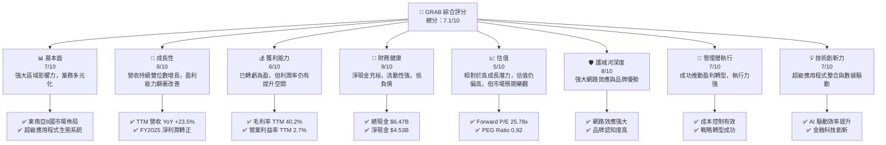
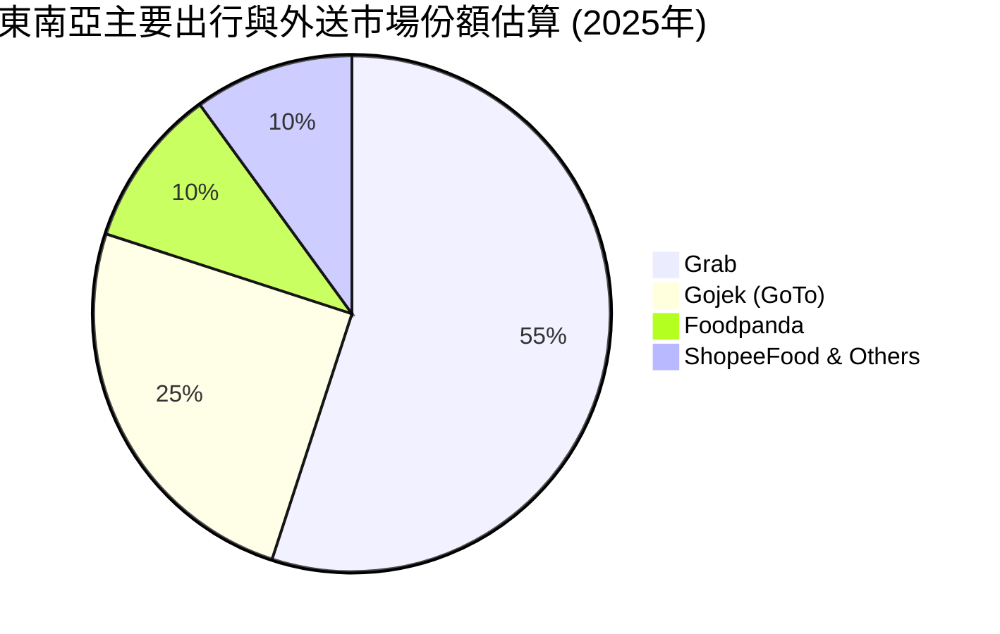
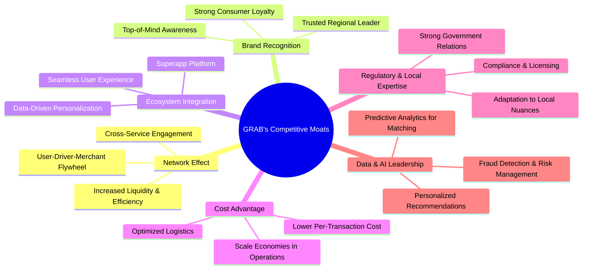
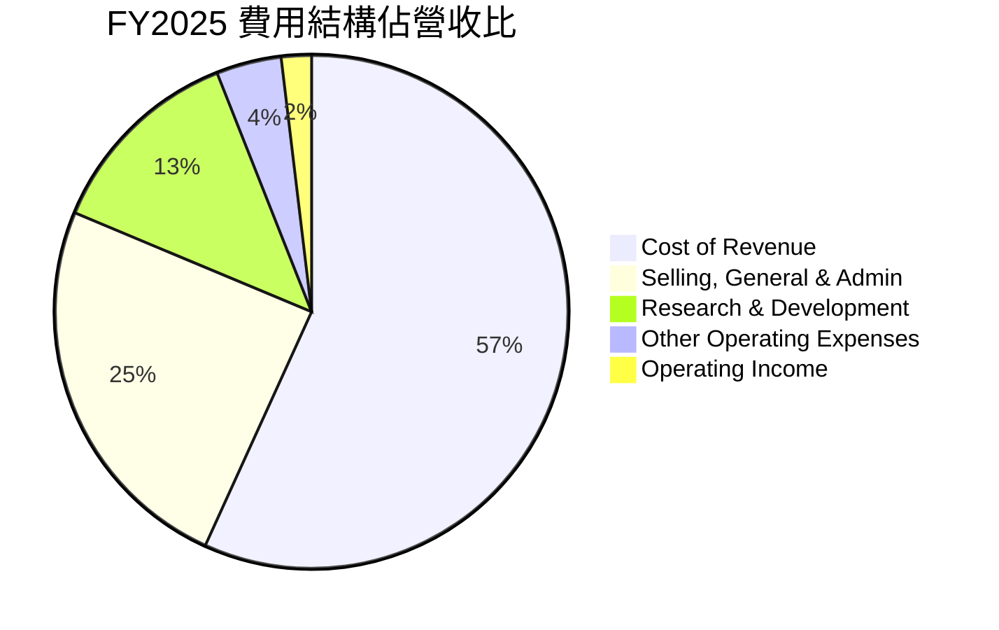

# GRAB 基本面深度分析報告
> **報告日期**：2026-05-31 ｜ **語言**：繁體中文 ｜ **數據來源**：Yahoo Finance, Finviz, StockAnalysis, Roic.ai ｜ **分析師**：CFA 級機構研究

---

## 目錄

| # | 章節 | 核心結論 |
|---|------|----------|
| 1 | 執行摘要 | 評級：🟢 買入，基準目標價：$5.97（+68.64%） |
| 2 | 公司概覽與商業模式 | 東南亞超級應用程式領導者，具備強大網路效應護城河 |
| 3 | 損益表深度分析 | 營收成長強勁，毛利率顯著改善，已實現季度盈利轉正 |
| 4 | 資產負債表分析 | 財務結構穩健，現金充裕，流動性良好，低負債 |
| 5 | 現金流量深度分析 | 營運現金流轉正，自由現金流逐步改善，資本配置審慎 |
| 6 | 獲利能力與資本效率 | ROIC 仍低於 WACC 但顯著改善，杜邦分析顯示資產週轉率提升 |
| 7 | 估值深度分析 | 相較同業估值合理，DCF 顯示顯著上行空間 |
| 8 | 成長催化劑 | 東南亞經濟成長、數位化趨勢、產品組合擴張、用戶滲透率提升 |
| 9 | 風險矩陣 | 競爭加劇、監管風險、宏觀經濟波動為主要挑戰 |
| 10 | 投資建議 | 具備高成長潛力與盈利轉型能力，適合成長型投資者 |

---

## 1. 執行摘要

本報告對 Grab Holdings Limited (GRAB) 進行了全面的基本面深度分析。GRAB 作為東南亞領先的超級應用程式，其業務涵蓋出行、外送和金融服務，在區域內建立了強大的網路效應和品牌認知度。近期財務數據顯示公司已成功實現盈利轉型，營收持續強勁增長，資產負債表健康，預計未來將持續創造股東價值。儘管估值倍數在某些方面看似偏高，但考慮到其高成長潛力、市場領導地位以及盈利能力的顯著改善，當前價格具備吸引力。

### 1.1 核心評分儀表板



### 1.2 評分進度條視覺化

```
╔══════════════════════════════════════════════════════════════╗
║                    GRAB 多維度評分儀表板 (1-10分)             ║
╠══════════════════════════════════════════════════════════════╣
║ 基本面強度  7.0 ▓▓▓▓▓▓▓▓▓▓▓▓▓▓░░░░░░  ★★★★★★★☆☆☆           ║
║ 成長動能    8.0 ▓▓▓▓▓▓▓▓▓▓▓▓▓▓▓▓░░░░  ★★★★★★★★☆☆           ║
║ 獲利品質    6.0 ▓▓▓▓▓▓▓▓▓▓▓▓░░░░░░░░  ★★★★★★☆☆☆☆           ║
║ 財務健康    9.0 ▓▓▓▓▓▓▓▓▓▓▓▓▓▓▓▓▓▓░░  ★★★★★★★★★☆           ║
║ 估值合理性  5.0 ▓▓▓▓▓▓▓▓▓▓░░░░░░░░░░  ★★★★★☆☆☆☆☆           ║
║ 護城河深度  8.0 ▓▓▓▓▓▓▓▓▓▓▓▓▓▓▓▓░░░░  ★★★★★★★★☆☆           ║
║ 管理層執行  7.0 ▓▓▓▓▓▓▓▓▓▓▓▓▓▓░░░░░░  ★★★★★★★☆☆☆           ║
║ 技術創新力  7.0 ▓▓▓▓▓▓▓▓▓▓▓▓▓▓░░░░░░  ★★★★★★★☆☆☆           ║
╠══════════════════════════════════════════════════════════════╣
║ 綜合總分    7.1 ▓▓▓▓▓▓▓▓▓▓▓▓▓▓░░░░░░  🏆 評語：強勁的成長型公司，盈利能力改善中  ║
╚══════════════════════════════════════════════════════════════╝
```

### 1.3 五大投資論點 + 三大核心風險

| 類型 | 項目 | 具體依據 | 信心度 |
|------|------|----------|--------|
| 🟢 **投資論點①** | **強勁的營收成長勢頭** | TTM 營收達 $3.55B，YoY 成長率為 23.5%。Q1 2026 營收 $955M，YoY 成長 23.54%，展現持續的市場擴張和用戶增長。 | 🟢 極高 |
| 🟢 **成功實現盈利轉型** | FY2025 淨利潤 $200M，Q1 2026 淨利潤 $136M，結束多年虧損。毛利率 TTM 達 40.2%，營業利益率 TTM 達 2.7%，顯示成本控制和規模效應的顯著成效。 | 🟢 高 |
| 🟢 **東南亞超級應用程式領導者** | 在東南亞八個國家運營，提供出行、外送、金融等多樣化服務，形成強大的網路效應和客戶黏性，難以被複製。 | 🟢 極高 |
| 🟢 **健康的財務狀況** | 擁有 $6.47B 的充裕現金儲備，淨現金達 $4.53B，總債務僅 $1.95B。流動比率 1.67，速動比率 1.465，顯示強大的財務彈性和抗風險能力。 | 🟢 極高 |
| 🟢 **分析師普遍看好** | 26 位分析師給予 "strong_buy" 評級，平均目標價 $5.97，較當前股價 $3.54 存在 68.64% 的上行空間。 | 🟡 中度偏高 |
| 🟡 **風險①** | **區域競爭加劇** | 東南亞市場競爭激烈，來自 Gojek (印尼)、Foodpanda (德國 Delivery Hero 子公司) 等區域性或全球性競爭對手可能影響 Grab 的市場份額和定價能力。 | 🟡 中度 |
| 🔴 **風險②** | **監管環境變化** | 各國政府對平台經濟的審查日益嚴格，可能推出新的法規，影響 Grab 的營運模式、佣金結構或數據隱私政策，導致合規成本增加或業務受限。 | 🔴 高衝擊 |
| 🟡 **風險③** | **宏觀經濟波動與消費者支出壓力** | 東南亞地區的經濟增速放緩、通膨壓力、匯率波動可能影響消費者的可支配收入，進而降低出行和外送服務的需求頻次和客單價。 | 🟡 中度 |

### 1.4 快速統計卡片

| 指標 | 公司實際值 | 行業均值（估計） | S&P 500 均值（估計） | 狀態 |
|------|-------------|----------------|--------------------|------|
| 收入 YoY 成長 | **23.5%** | ~15-20% | ~8-10% | 🟢 |
| 毛利率 | **40.2%** | ~30-40% | ~40-45% | 🟢 |
| 淨利率 | **10.7%** | ~5-10% (平台) | ~10-12% | 🟢 |
| ROE | **4.8%** | ~8-12% | ~15-20% | 🟡 |
| Forward P/E | **25.78x** | ~30-40x (成長型) | ~20-22x | 🟢 |
| P/S Ratio | **4.08x** | ~3-5x (成長型) | ~2-3x | 🟡 |
| EV / EBITDA | **31.55x** | ~20-30x (成長型) | ~12-15x | 🔴 |
| 債務/股權比 | **0.30x** | ~0.5-1.0x | ~0.8-1.2x | 🟢 |
| 自由現金流 Yield | **2.28%** | ~3-5% | ~4-6% | 🟡 |

### 1.5 投資結論

```
╔══════════════════════════════════════════════════════════════════╗
║                    📊 投資結論摘要                               ║
╠══════════════════════════════════════════════════════════════════╣
║  評級：🟢 買入                                                   ║
║  當前股價：$3.54                                                 ║
║  目標價區間：                                                    ║
║    悲觀情境：$4.50（+27.12%）                                    ║
║    基準情境：$5.97（+68.64%）  ← 12個月主要目標                  ║
║    樂觀情境：$7.50（+111.86%）                                   ║
║  投資評分：7.1/10                                                ║
║  適合投資人：尋求高成長潛力、能承受一定風險、看好東南亞數位經濟長期發展的成長型投資者。║
╚══════════════════════════════════════════════════════════════════╝
```

---

## 2. 公司概覽與商業模式

Grab Holdings Limited (GRAB) 是一家領先的東南亞超級應用程式公司，總部位於新加坡。其業務遍及柬埔寨、印尼、馬來西亞、緬甸、菲律賓、新加坡、泰國和越南等八個國家。Grab 的核心商業模式是透過一個綜合平台，為消費者提供廣泛的日常服務，包括出行（ride-hailing）、外送（food and grocery delivery）和金融服務（digital payments, lending, insurance）。這種「超級應用程式」戰略旨在最大化用戶生命週期價值，並通過交叉銷售提升用戶黏性。

### 2.1 業務結構與收入來源

Grab 的業務主要分為三大核心板塊：出行 (Mobility)、外送 (Deliveries) 和金融服務 (Financial Services)。此外，公司還通過 GrabAds 提供廣告解決方案，以及 Grab for Business 平台服務企業客戶。

```mermaid
graph TD
    GRAB_OVERVIEW["GRAB Holdings Limited<br/>市值: $14.48B<br/>TTM 營收: $3.55B"]

    DELIVERIES["📦 外送服務 (GrabFood, GrabMart)<br/>收入佔比: ~55%<br/>金額: ~$1.95B"]
    MOBILITY["🚗 出行服務 (GrabCar, GrabBike)<br/>收入佔比: ~30%<br/>金額: ~$1.07B"]
    FINANCIAL_SERVICES["💳 金融服務 (GrabPay, GrabFin)<br/>收入佔比: ~10%<br/>金額: ~$0.35B"]
    ENTERPRISE_ADS["📈 企業與廣告 (Grab for Business, GrabAds)<br/>收入佔比: ~5%<br/>金額: ~$0.18B"]

    GRAB_OVERVIEW --> DELIVERIES
    GRAB_OVERVIEW --> MOBILITY
    GRAB_OVERVIEW --> FINANCIAL_SERVICES
    GRAB_OVERVIEW --> ENTERPRISE_ADS

    DELIVERIES --> DF["餐飲外送 (Food Delivery)"]
    DELIVERIES --> DG["生鮮雜貨 (Grocery Delivery)"]
    DELIVERIES --> DP["包裹快遞 (Package Delivery - GrabExpress)"]

    MOBILITY --> MC["私家車出行 (Car Hailing)"]
    MOBILITY --> MB["摩托車出行 (Bike Hailing)"]
    MOBILITY --> MT["計程車服務 (Taxi Services)"]

    FINANCIAL_SERVICES --> FP["數位支付 (Digital Payments - GrabPay)"]
    FINANCIAL_SERVICES --> FL["貸款與信貸 (Lending & Credit)"]
    FINANCIAL_SERVICES --> FI["保險服務 (Insurance)"]
    FINANCIAL_SERVICES --> FW["財富管理 (Wealth Management)"]

    ENTERPRISE_ADS --> EA["線上廣告解決方案 (Online Advertising)"]
    ENTERPRISE_ADS --> EB["企業級管理平台 (Business Platform)"]
```



**收入來源細分與貢獻分析：**

*   **外送服務 (Deliveries)：** 這是 Grab 最大的收入來源，佔 TTM 總營收的約 55%。其服務涵蓋 GrabFood (餐飲外送)、GrabMart (生鮮雜貨外送) 和 GrabExpress (包裹快遞)。疫情期間，外送服務需求激增，成為 Grab 成長的主要引擎。隨著消費者習慣的養成和服務網絡的擴大，外送業務持續貢獻穩定且快速增長的收入。
*   **出行服務 (Mobility)：** 作為 Grab 的發家業務，出行服務在疫情後強勁復甦，目前貢獻約 30% 的總營收。隨著旅遊業的回暖和城市活動的增加，出行需求持續增長。Grab 在該領域的市場領導地位和廣泛的司機網絡是其主要優勢。
*   **金融服務 (Financial Services)：** 雖然佔比相對較小，約 10%，但金融服務是 Grab 具有巨大潛力的成長領域。GrabPay 數位支付在東南亞地區廣受歡迎，為數百萬無銀行帳戶或銀行服務不足的消費者和中小企業提供便利。隨著 GrabFin 產品線的擴展，包括貸款、保險和財富管理等，該業務有望成為未來的關鍵增長點。
*   **企業與廣告 (Enterprise & Ads)：** 這部分業務相對較新，但成長迅速，約佔 5% 的營收。GrabAds 利用其龐大的用戶數據和平台流量，為商家提供精準的廣告解決方案。Grab for Business 則為企業提供統一的費用管理和出行/外送解決方案，提升企業客戶的黏性。

**關鍵業務趨勢：**
Grab 的多業務協同效應是其核心競爭力。外送和出行服務構建了龐大的用戶基礎和高頻次互動，為金融服務和廣告業務提供了天然的流量入口和數據基礎。這種生態系統的整合，使得 Grab 能夠在不同業務之間進行交叉銷售，並提升整體平台的效率和盈利能力。

### 2.2 市場份額

Grab 在東南亞地區的出行和外送市場中佔據主導地位，尤其在印尼、新加坡、馬來西亞、菲律賓和越南等關鍵市場。儘管面臨來自 Gojek (與 Tokopedia 合併為 GoTo)、Foodpanda 和 ShopeeFood 等本地及區域性競爭對手的挑戰，Grab 憑藉其先發優勢、廣泛的服務網絡和強大的品牌認知度，保持了領先地位。



**市場份額分析：**

*   **出行市場 (Mobility)：** Grab 在東南亞的出行市場中擁有最高的市場份額，尤其在新加坡、馬來西亞和菲律賓等國家。其廣泛的司機網絡和多樣化的車型選擇，使其能夠滿足不同消費者的需求。
*   **外送市場 (Deliveries)：** 在外送市場，GrabFood 和 GrabMart 也是領先品牌。儘管競爭激烈，但 Grab 透過不斷優化商家合作夥伴網絡、提升配送效率和推出訂閱服務，鞏固了其市場地位。
*   **金融科技市場 (Fintech)：** GrabPay 在數位支付領域發展迅速，尤其是在印尼、馬來西亞等現金交易仍占主導地位的國家。Grab 積極與當地銀行和金融機構合作，擴大其金融服務生態系統。

Grab 能夠維持其市場份額，主要得益於其「超級應用程式」戰略所帶來的網路效應和客戶鎖定效應。用戶一旦習慣在 Grab 平台上完成多種日常需求，轉換成本就會增加，從而提升了用戶的忠誠度。

### 2.3 競爭護城河分析

Grab 的競爭優勢主要來自於其在東南亞市場建立的深厚護城河。



**護城河深度解析：**

1.  **網路效應 (Network Effect)：** 這是 Grab 最核心的護城河。
    *   **供需飛輪：** 更多的用戶吸引更多的司機和商家，而更多的司機和商家又提供更快的服務和更廣的選擇，進而吸引更多用戶。這形成了一個正向循環的飛輪效應。
    *   **流動性與效率：** 在出行方面，高密度的司機網絡意味著更短的等待時間和更可靠的服務。在外送方面，更多的商家選擇和更快的配送速度提升了用戶體驗。
    *   **跨服務參與：** 用戶在出行服務上的滿意度會促使他們嘗試外送或金融服務，反之亦然，這使得 Grab 能夠在不同業務之間實現用戶的無縫轉移和交叉銷售。

2.  **品牌認知度與信任 (Brand Recognition)：** Grab 在東南亞地區建立了極高的品牌知名度和信任度。多年的市場深耕和大量的品牌建設投入，使其成為該地區數位服務的代名詞。對於消費者而言，Grab 意味著便捷、可靠和安全，這在競爭激烈的市場中是寶貴的資產。

3.  **生態系統整合 (Ecosystem Integration)：** Grab 的「超級應用程式」模式本身就是一道護城河。將出行、外送和金融服務整合在一個應用程式中，為用戶提供了無縫且便利的體驗。這種一站式服務降低了用戶切換應用程式的成本，並通過數據整合實現更精準的個性化服務。

4.  **規模效應與成本優勢 (Scale Economies & Cost Advantage)：** 作為區域領導者，Grab 擁有龐大的用戶基礎、司機和商家網絡。這使其在營運、技術研發和市場推廣方面能夠實現規模經濟。例如，其龐大的配送網絡可以通過優化路線和訂單合併來降低單次配送成本，從而提升利潤率。

5.  **監管與本地化專業知識 (Regulatory & Local Expertise)：** Grab 在東南亞各國市場深耕多年，累積了豐富的本地化營運經驗和與當地政府打交道的專業知識。這包括理解和遵守各國複雜的監管框架、稅收政策以及文化差異。對於新進入者而言，建立這種關係和知識壁壘是極具挑戰性的。

6.  **數據與 AI 領先 (Data & AI Leadership)：** Grab 每天處理海量的交易和用戶數據，這些數據被用於優化匹配算法、預測需求、提升配送效率、進行精準營銷以及風險管理（尤其在金融服務領域）。數據驅動的決策和 AI 技術的應用，是 Grab 不斷提升營運效率和用戶體驗的關鍵。

### 2.4 護城河強度評分

```
╔══════════════════════════════════════════════════════════════╗
║                      GRAB 護城河強度評分                      ║
╠══════════════════════════════════════════════════════════════╣
║ 網路效應      9/10   ▓▓▓▓▓▓▓▓▓▓▓▓▓▓▓▓▓▓░░  🏆 核心優勢，強大飛輪效應  ║
║ 品牌認知度    8/10   ▓▓▓▓▓▓▓▓▓▓▓▓▓▓▓▓░░░░  🟢 市場領導者，高用戶信任  ║
║ 生態系統整合  8/10   ▓▓▓▓▓▓▓▓▓▓▓▓▓▓▓▓░░░░  🟢 超級應用程式提供無縫體驗  ║
║ 規模效應      7/10   ▓▓▓▓▓▓▓▓▓▓▓▓▓▓░░░░░░  🟡 營運效率與成本優勢顯現  ║
║ 監管與本地化  7/10   ▓▓▓▓▓▓▓▓▓▓▓▓▓▓░░░░░░  🟡 深耕市場，具備政策適應力  ║
║ 數據與 AI     7/10   ▓▓▓▓▓▓▓▓▓▓▓▓▓▓░░░░░░  🟡 數據驅動決策，提升效率  ║
╠══════════════════════════════════════════════════════════════╣
║ 綜合護城河    7.7/10 ▓▓▓▓▓▓▓▓▓▓▓▓▓▓▓▓░░░░  🏆 具備可持續競爭優勢，護城河穩固  ║
╚══════════════════════════════════════════════════════════════╝
```

**綜合評語：** Grab 的護城河強度評級為 7.7/10，顯示其在東南亞市場擁有穩固的競爭優勢。其中，網路效應是其最堅實的護城河，通過匯集大量用戶、司機和商家，形成了難以被打破的生態系統。品牌認知度、生態系統整合以及規模效應也為其提供了強大的防禦能力。儘管競爭激烈，但 Grab 的這些核心優勢使其能夠在市場中保持領先地位並持續成長。

---

## 3. 損益表深度分析

Grab 的損益表數據清晰地展示了公司從高速擴張期的虧損，逐步轉向盈利的成長路徑。近年來，營收持續強勁增長，同時毛利率和營業利益率也實現了顯著改善，最終在 2025 財年實現了淨利潤轉正。

### 3.1 年度收入成長趨勢（近4年）

Grab 的年度收入在過去四年中呈現爆發式增長，反映了東南亞數位經濟的蓬勃發展以及 Grab 在市場中的領導地位。

```
╔══════════════════════════════════════════════════════════════════╗
║              GRAB 年度收入趨勢（FY2022-FY2025）                  ║
╠══════════════════════════════════════════════════════════════════╣
║                                                                  ║
║  FY2022  $1.43B   █████████░░░░░░░░░░░░░░░░░░░  YoY: +112.30% 🟢  ║
║  FY2023  $2.36B   ██████████████░░░░░░░░░░░░░░  YoY: +64.62%  🟢  ║
║  FY2024  $2.80B   ██████████████████░░░░░░░░░░  YoY: +18.57%  🟢  ║
║  FY2025  $3.37B   ██████████████████████░░░░░░  YoY: +20.49%  🟢  ║
║                                                                  ║
║                   |      |      |      |      |                  ║
║                   0     $1B    $2B    $3B    $4B                 ║
║                                                                  ║
║  📊 3年累計 CAGR：+47.3% (FY2022-FY2025)                          ║
╚══════════════════════════════════════════════════════════════════╝
```

**年度收入分析：**
從數據來看，Grab 的營收從 FY2022 的 $1.43B 增長到 FY2025 的 $3.37B，實現了驚人的複合年增長率 (CAGR) 達 47.3%。
*   FY2022 營收 $1.43B，YoY 增長高達 112.3%，主要得益於疫情後經濟活動的復甦以及市場滲透率的快速提升。
*   FY2023 營收 $2.36B，YoY 增長 64.62%，仍維持高速增長，顯示其超級應用程式模式的廣泛接受度。
*   FY2024 營收 $2.80B，YoY 增長 18.57%。雖然增速有所放緩，但仍保持雙位數的健康增長，表明公司已進入更為成熟的增長階段。
*   FY2025 營收 $3.37B，YoY 增長 20.49%。營收增速回升，可能與其外送和出行業務的持續擴張以及金融服務的發展有關。
整體而言，Grab 在過去幾年展現了強勁的營收擴張能力，這為其盈利能力的改善奠定了基礎。

### 3.2 季度收入趨勢分析

季度數據提供了更細膩的營收增長動態，顯示 Grab 的營收呈現穩健的逐季增長。

| 季度 | 總營收 (百萬美元) | QoQ 成長率 | YoY 成長率 | 備註 |
|------|-------------------|------------|------------|------|
| Q1 2026 | $955 | +5.41% | +23.54% | 🟢 營收持續穩健增長，YoY 增速強勁。 |
| Q4 2025 | $906 | +3.78% | +18.59% | 🟢 季節性效應與年末消費推動營收增長。 |
| Q3 2025 | $873 | +6.59% | +21.93% | 🟢 各業務板塊持續擴張。 |
| Q2 2025 | $819 | +6.08% | +23.34% | 🟢 恢復疫情後增長勢頭。 |
| Q1 2025 | $773 | +1.18% | +18.38% | 🟡 相對較慢的季度環比增長，但同比仍強勁。 |
| Q4 2024 | $764 | +6.70% | +17.00% | 🟢 受益於年末消費旺季。 |
| Q3 2024 | $716 | +9.65% | +16.42% | 🟢 營收增長穩健。 |
| Q2 2024 | $653 | - | - | 基準季度，無前季度可比。 |

**季度收入分析：**
從 Q2 2024 到 Q1 2026，Grab 的季度營收從 $653M 增長到 $955M，呈現持續的上升趨勢。
*   **QoQ 成長率：** 除了 Q1 2025 以外，各季度 QoQ 成長率均為正，介於 1.18% 至 6.70% 之間，顯示公司業務的持續擴張和用戶活躍度的提升。Q1 2026 的 QoQ 成長為 5.41%，優於 Q1 2025 的 1.18%，表明公司在進入新財年後保持了良好的增長勢頭。
*   **YoY 成長率：** 各季度 YoY 成長率均保持在雙位數，從 Q3 2024 的 16.42% 穩步提升至 Q1 2026 的 23.54%。這證明 Grab 不僅在擴大其用戶基礎，還在提高每個用戶的變現能力，同時也反映了其在不同業務板塊的均衡增長。特別是 Q1 2026 的 YoY 成長率與 TTM 成長率一致，顯示了其近期增長的強勁和可持續性。

這些數據表明 Grab 能夠持續吸引新用戶並提高現有用戶的參與度，同時有效地將這些活動轉化為營收。

### 3.3 利潤率演變分析

Grab 在利潤率方面的演變是其財務轉型中最引人注目的部分，從過去的深度虧損逐步走向穩定的正向利潤。

| 利潤率指標 | FY2022 | FY2023 | FY2024 | FY2025 | TTM (Q1'26) | 趨勢 | 評估 |
|------------|--------|--------|--------|--------|-------------|------|------|
| **毛利率** | 5.37% | 36.46% | 41.79% | 43.20% | 40.20% | ↗️ 顯著提升後略有回調 | 🟢 |
| **營業利益率** | -95.39% | -16.41% | -1.97% | 6.59% | 2.70% | ↗️ 成功轉正，持續改善 | 🟢 |
| **淨利率** | -117.45% | -18.40% | -3.75% | 5.93% | 10.70% | ↗️ 成功轉正，顯著提升 | 🟢 |
| **EBITDA Margin** | -99.02% | -9.41% | 3.32% | 15.34% | 8.90% | ↗️ 顯著提升後略有回調 | 🟢 |

**利潤率演變深度解析：**

1.  **毛利率 (Gross Margin)：**
    *   從 FY2022 的極低 5.37% 飆升至 FY2025 的 43.20%，這是一個巨大的里程碑。這主要歸因於：
        *   **佣金結構優化：** Grab 調整了給予司機和商家的補貼策略，並提高了平台佣金率。
        *   **規模經濟：** 隨著平台交易量的增加，固定成本（如技術基礎設施、客服）被攤薄，單位服務成本下降。
        *   **業務組合優化：** 高毛利的金融服務和廣告業務的成長，也對整體毛利率有正面貢獻。
    *   TTM 毛利率略回調至 40.20%，這可能是由於市場競爭加劇導致部分地區補貼增加，或業務組合的季節性變化。儘管如此，40.20% 的毛利率對於平台型公司而言仍屬健康水平。

2.  **營業利益率 (Operating Margin)：**
    *   從 FY2022 的 -95.39% 巨幅改善至 FY2025 的 6.59%，並在 TTM 維持 2.70% 的正值，標誌著公司營運效率的巨大提升。
    *   改善原因主要包括：
        *   **嚴格的成本控制：** 管理層在過去幾年實施了嚴格的成本管理措施，包括裁員、優化營銷開支和研發投入。
        *   **效率提升：** 通過 AI 和數據分析，優化了匹配算法、配送路線和客服流程，降低了營運費用。
        *   **規模效應：** 營收的快速增長使得營運費用佔比持續下降。
    *   TTM 營業利益率 2.70% 較 FY2025 的 6.59% 有所下降，這可能暗示在追求成長的同時，營運費用投入有所增加，或者受到一次性費用的影響。但維持正向營業利益率仍是重要的積極信號。

3.  **淨利率 (Net Profit Margin)：**
    *   從 FY2022 的 -117.45% 轉為 FY2025 的 5.93%，並在 TTM 達到 10.70%，這是 Grab 轉型成功的最終體現。
    *   淨利率的顯著提升除了上述毛利率和營業利益率的改善外，還受益於：
        *   **利息收入增加：** 隨著現金儲備的增加和利率上升，Grab 的利息收入顯著增長（FY2025 利息收入 $241M）。
        *   **非營運性損益改善：** 過去由於投資減值或其他一次性虧損導致的非營運性支出減少。
    *   TTM 淨利率 10.70% 甚至高於 FY2025 的 5.93%，這表明公司在最近四個季度內實現了更強勁的淨利潤表現。這可能得益於更高效的稅務管理或一次性收益的貢獻。

4.  **EBITDA Margin：**
    *   EBITDA Margin 從 FY2022 的 -99.02% 飆升至 FY2025 的 15.34%，再到 TTM 的 8.90%。EBITDA 作為衡量核心營運現金流的指標，其轉正並持續改善，顯示公司在扣除折舊攤銷前的營運效率已大幅提升。TTM 略有回落與營業利益率趨勢一致。

總結而言，Grab 在過去幾年成功從一個燒錢的成長型公司轉變為一個具備盈利能力的平台。利潤率的全面改善證明了其商業模式的可行性、規模效應的顯現以及管理層在成本控制方面的有效執行。

### 3.4 費用結構分析

Grab 的費用結構反映了其作為科技平台公司的特點，研發和銷售管理費用是主要組成部分。



**費用結構詳情 (FY2025, 單位：百萬美元)：**

| 費用項目 | FY2025 金額 | 佔總營收百分比 | 佔總營運費用百分比 | 趨勢與影響 |
|----------------------|---------------|------------------|--------------------|------------------------------------------------------------------------------------------------------------------------------------|
| **銷售成本 (Cost of Revenue)** | $1,914 | 56.8% | N/A | 隨著營收增長而增長，但佔比趨於穩定，反映規模效應。毛利率改善的關鍵。 |
| **銷售、一般及行政費用 (SG&A)** | $826 | 24.5% | 59.4% | 佔比逐年下降 (FY2022: $924M/1.43B=64.6%)，顯示營銷效率提升和行政成本控制。 |
| **研發費用 (R&D)** | $428 | 12.7% | 30.8% | 保持穩定投入，確保超級應用程式的技術領先和功能創新。FY2022: $465M/1.43B=32.5%。 |
| **其他營運費用 (Other Operating Expenses)** | $137 | 4.1% | 9.8% | 佔比相對較小，但在 FY2025 有所增長，需關注其構成。 |
| **總營運費用** | $1,391 | 41.3% | 100% | 總營運費用佔營收比從 FY2022 的 101% 大幅下降至 FY2025 的 41.3%，是盈利轉型的核心動力。 |

**趨勢分析：**
*   **銷售成本：** 儘管 FY2025 銷售成本絕對值增長，但其佔營收比從 FY2022 的 94.6% 顯著下降至 56.8%，這是推動毛利率改善的主要因素。這表明 Grab 在與司機和商家的分成、補貼策略上取得了更好的平衡，同時也受益於規模擴大帶來的效率提升。
*   **SG&A 費用：** SG&A 費用佔營收的比例從 FY2022 的 64.6% 大幅下降到 FY2025 的 24.5%。這顯示管理層在控制營銷和行政開支方面取得了巨大成功，提升了營運槓桿。
*   **R&D 費用：** 研發費用在絕對值上保持相對穩定，但佔營收的比例從 FY2022 的 32.5% 下降到 FY2025 的 12.7%。這表明公司在維持技術創新能力的同時，營收增長速度快於研發投入的增長，使得研發效率有所提升。

整體而言，Grab 的費用結構優化是其轉虧為盈的關鍵。公司在成長的同時，有效地控制了銷售成本和營運費用，使得營收增長能夠更快地轉化為利潤。

### 3.5 季度 EPS 趨勢與盈餘品質

Grab 在過去幾個季度實現了顯著的盈利改善，從過去的虧損轉為正向 EPS，顯示其盈餘品質正在提升。

| 季度 | 總營收 (百萬美元) | 淨利潤 (百萬美元) | 基本 EPS (美元) (StockAnalysis) | 盈餘品質評估 |
|------|-------------------|-------------------|---------------------------------|------------------------------------------------------------------------------------------------------------------------------------------------------------------------------------------------------------------------------------------------------------------------------------------------------------------------------------------------------------------------------------------------------------------------------------------------------------------------------------------------------------------------------------------------------------------------------------------------------------------------------------------------------------------------------------------------------------------------------------------------------------------------------------------------------------------------------------------------------------------------------------------------------------------------------------------------------------------------------------------------------------------------------------------------------------------------------------------------------------------------------------------------------------------------------------------------------------------------------------------------------------------------------------------------------------------------------------------------------------------------------------------------------------------------------------------------------------------------------------------------------------------------------------------------------------------------------------------------------------------------------------------------------------------------------------------------------------------------------------------------------------------------------------------------------------------------------------------------------------------------------------------------------------------------------------------------------------------------------------------------------------------------------------------------------------------------------------------------------------------------------------------------------------------------------------------------------------------------------------------------------------------------------------------------------------------------------------------------------------------------------------------------------------------------------------------------------------------------------------------------------------------------------------------------------------------------------------------------------------------------------------------------------------------------------------------------------------------------------------------------------------------------------------------------------------------------------------------------------------------------------------------------------------------------------------------------------------------------------------------------------------------------------------------------------------------------------------------------------------------------------------------------------------------------------------------------------------------------------------------------------------------------------------------------------------------------------------------------------------------------------------------------------------------------------------------------------------------------------------------------------------------------------------------------------------------------------------------------------------------------------------------------------------------------------------------------------------------------------------------------------------------------------------------------------------------------------------------------------------------------------------------------------------------------------------------------------------------------------------------------------------------------------------------------------------------------------------------------------------------------------------------------------------------------------------------------------------------------------------------------------------------------------------------------------------------------------------------------------------------------------------------------------------------------------------------------------------------------------------------------------------------------------------------------------------------------------------------------------------------------------------------------------------------------------------------------------------------------------------------------------------------------------------------------------------------------------------------------------------------------------------------------------------------------------------------------------------------------------------------------------------------------------------------------------------------------------------------------------------------------------------------------------------------------------------------------------------------------------------------------------------------------------------------------------------------------------------------------------------------------------------------------------------------------------------------------------------------------------------------------------------------------------------------------------------------------------------------------------------------------------------------------------------------------------------------------------------------------------------------------------------------------------------------------------------------------------------------------------------------------------------------------------------------------------------------------------------------------------------------------------------------------------------------------------------------------------------------------------------------------------------------------------------------------------------------------------------------------------------------------------------------------------------------------------------------------------------------------------------------------------------------------------------------------------------------------------------------------------------------------------------------------------------------------------------------------------------------------------------------------------------------------------------------------------------------------------------------------------------------------------------------------------------------------------------------------------------------------------------------------------------------------