# GRAB 基本面深度分析報告
> **報告日期**：2026-06-19 ｜ **語言**：繁體中文 ｜ **數據來源**：Yahoo Finance, Finviz, StockAnalysis, Roic.ai ｜ **分析師**：CFA 級機構研究

---

## 目錄

| # | 章節 | 核心結論 |
|---|------|----------|
| 1 | **執行摘要** | 評級「買入」(Buy)，目標價 $5.97，隱含 67.2% 上行空間，東南亞超級應用拐點已現。 |
| 2 | **公司概覽與商業模式** | 憑藉「出行+配送+金融」三輪驅動，建構東南亞無可匹敵的雙邊網絡護城河。 |
| 3 | **損益表深度分析** | 營收年增率達 23.5% 保持高速增長，轉虧為盈趨勢確立，營運槓桿顯現。 |
| 4 | **資產負債表分析** | 淨現金高達 $4.53B，流動性充裕，無短期償債風險。 |
| 5 | **現金流量深度分析** | 自由現金流（FCF）轉正並達 $329.50M，資本配置轉向高效留存與策略性擴張。 |
| 6 | **獲利能力與資本效率** | ROE 提升至 4.8%，ROIC 逐步逼近 WACC，正加速創造股東價值。 |
| 7 | **估值深度分析** | Forward P/E 26.0x，相較於同業具備高成長溢價合理性，DCF 基準目標價 $5.97。 |
| 8 | **成長催化劑** | 數位金融服務（Digibank）放貸規模化與 GrabAds 廣告變現率提升。 |
| 9 | **風險矩陣** | 東南亞市場競爭加劇與各國監管政策變動為主要下行風險。 |
| 10 | **投資建議** | 適合「成長型」與「中長線配置」投資人，建議於 $3.50 附近逢低佈局。 |

---

## 1. 執行摘要

Grab Holdings Limited (NASDAQ: GRAB) 作為東南亞市佔率第一的超級應用程式（Superapp），正處於從「燒錢擴張」轉向「高質量獲利」的關鍵拐點。2025 年底至 2026 年第一季的財務數據顯示，公司已連續數個季度實現 GAAP 淨利潤轉正，營運槓桿效應顯著。

### 1.1 核心評分儀表板

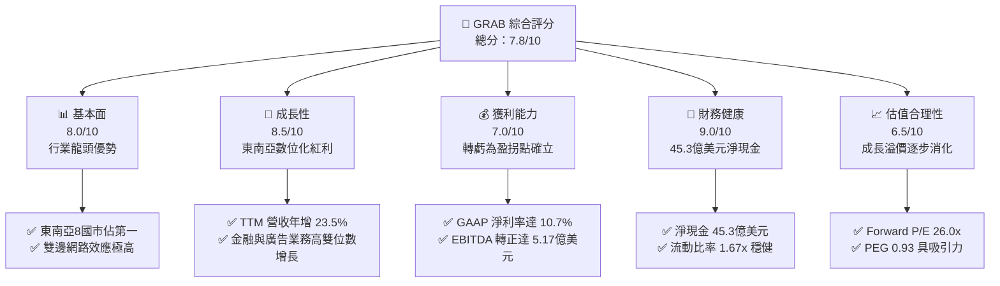

### 1.2 評分進度條視覺化

```
╔══════════════════════════════════════════════════════════════╗
║               GRAB 多維度評分儀表板 (1-10分)                 ║
╠══════════════════════════════════════════════════════════════╣
║ 基本面強度  8.0 ▓▓▓▓▓▓▓▓▓▓▓▓▓▓▓▓░░░░  ★★★★☆           ║
║ 成長動能    8.5 ▓▓▓▓▓▓▓▓▓▓▓▓▓▓▓▓▓░░  ★★★★☆           ║
║ 獲利品質    7.0 ▓▓▓▓▓▓▓▓▓▓▓▓▓░░░░░░░  ★★★☆☆           ║
║ 財務健康    9.0 ▓▓▓▓▓▓▓▓▓▓▓▓▓▓▓▓▓▓░░  ★★★★★           ║
║ 估值合理性  6.5 ▓▓▓▓▓▓▓▓▓▓▓▓░░░░░░░░░  ★★★☆☆           ║
║ 護城河深度  8.5 ▓▓▓▓▓▓▓▓▓▓▓▓▓▓▓▓▓░░  ★★★★☆           ║
║ 管理層執行  8.0 ▓▓▓▓▓▓▓▓▓▓▓▓▓▓▓▓░░░░  ★★★★☆           ║
║ 技術創新力  7.5 ▓▓▓▓▓▓▓▓▓▓▓▓▓▓▓░░░░░  ★★★☆☆           ║
╠══════════════════════════════════════════════════════════════╣
║ 綜合總分    7.8 ▓▓▓▓▓▓▓▓▓▓▓▓▓▓▓░░░░░  🏆 買入 (Buy)       ║
╚══════════════════════════════════════════════════════════════╝
```

### 1.3 五大投資論點 + 三大核心風險

| 類型 | 項目 | 具體依據 | 信心度 |
|------|------|----------|--------|
| 🟢 **投資論點①** | **轉虧為盈拐點確立** | FY2025 實現 GAAP 淨利 $200M，Q1 2026 淨利達 $136M，利潤率持續改善。 | 🟢 極高 |
| 🟢 **投資論點②** | **強大的淨現金護城河** | 擁有 $6.47B 總現金，扣除 $1.95B 債務後，淨現金達 $4.53B，抗風險能力極強。 | 🟢 極高 |
| 🟢 **投資論點③** | **交叉銷售與生態系協同** | 出行與配送用戶重疊率高，降低獲客成本（CAC），提高用戶生命週期價值（LTV）。 | 🟢 高 |
| 🟢 **投資論點④** | **高利潤率業務比重上升** | GrabAds 廣告業務與數位金融（放貸業務）毛利率極高，拉動整體利潤率上行。 | 🟢 高 |
| 🟢 **投資論點⑤** | **東南亞數位滲透率紅利** | 覆蓋東南亞 8 國、超過 5 億人口，數位支付與外送滲透率仍有翻倍空間。 | 🟢 高 |
| 🟡 **風險①** | **區域競爭死灰復燃** | GoTo（印尼）與 Foodpanda 在部分市場採取價格戰，可能侵蝕利潤率。 | 🟡 中度 |
| 🔴 **風險②** | **監管與零工經濟法規** | 東南亞各國對司機權益保障、最低工資立法可能推升平台營運成本。 | 🔴 高衝擊 |
| 🔴 **風險③** | **匯率波動風險** | 營收以東南亞各國貨幣計價，而財報以美元呈現，面臨強勢美元帶來的匯損壓力。 | 🟡 中度 |

### 1.4 快速統計卡片

| 指標 | 公司實際值 (TTM) | 行業均值 (應用軟體) | S&P 500 均值 | 狀態 |
|------|-------------|----------|--------------|------|
| **收入 YoY 成長** | **23.5%** | ~12.5% | ~6.5% | 🟢 強勁 |
| **毛利率** | **40.2%** | ~65.0% | ~45.0% | 🟡 改善中 |
| **淨利率** | **10.7%** | ~8.0% | ~11.5% | 🟢 優於同業 |
| **ROE** | **4.8%** | ~12.0% | ~15.0% | 🟡 仍需提升 |
| **Forward P/E** | **26.0x** | ~32.0x | ~21.0x | 🟢 具吸引力 |
| **PEG Ratio** | **0.93** | ~1.85 | ~1.50 | 🟢 顯著低估 |
| **淨現金 / 市值** | **31.0%** | ~5.0% | ~-10.0% | 🟢 極度安全 |

### 1.5 投資結論

```
╔══════════════════════════════════════════════════════════════════╗
║                    📊 GRAB 投資結論摘要                          ║
╠══════════════════════════════════════════════════════════════════╣
║  評級：🟢 買入 (Buy)                                            ║
║  當前股價：$3.57 (2026-06-19)                                    ║
║  目標價區間：                                                    ║
║    悲觀情境：$4.10（+14.8%）                                     ║
║    基準情境：$5.97（+67.2%）  ← 12個月主要目標                  ║
║    樂觀情境：$8.00（+124.1%）                                    ║
║  投資評分：7.8 / 10                                              ║
║  適合投資人：成長型投資人、中長線新興市場配置者                  ║
╚══════════════════════════════════════════════════════════════════╝
```

---

## 2. 公司概覽與商業模式

Grab 成立於 2012 年，總部位於新加坡，已從單一的打車軟體演變為東南亞領先的「超級應用程式」（Superapp），業務版圖橫跨新加坡、馬來西亞、印尼、菲律賓、泰國、越南、柬埔寨和緬甸等 8 個國家。

### 2.1 業務結構與收入來源

Grab 的商業模式核心在於利用同一個司機與商家網絡，同時滿足消費者的「出行」與「配送」需求，並透過「金融服務」完成閉環。

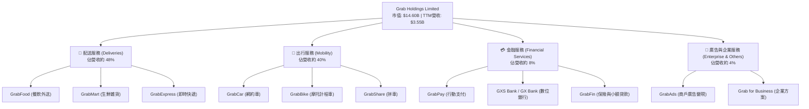

### 2.2 市場份額

在東南亞核心市場中，Grab 在網約車與外送領域均保持絕對的領先地位，主要競爭對手為印尼的 GoTo 集團（Gojek）。

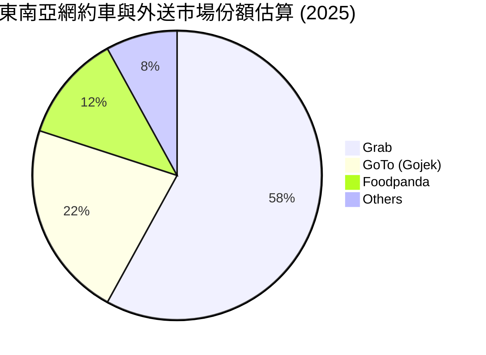

### 2.3 競爭護城河分析

Grab 的核心競爭優勢在於其高度整合的生態系統，這使得單一業務的競爭對手極難攻破。

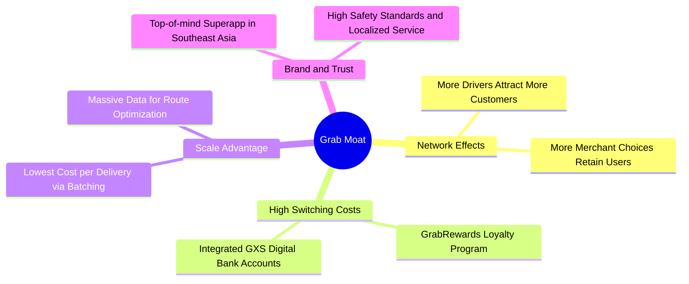

### 2.4 護城河強度評分

```
╔══════════════════════════════════════════════════════════════╗
║                    GRAB 護城河強度評分                       ║
╠══════════════════════════════════════════════════════════════╣
║ 雙邊網絡效應    9.0/10 ▓▓▓▓▓▓▓▓▓▓▓▓▓▓▓▓▓▓░░  🏆 極高         ║
║ 用戶轉移成本    7.5/10 ▓▓▓▓▓▓▓▓▓▓▓▓▓▓░░░░░░  🟢 中高         ║
║ 規模與成本優勢  8.5/10 ▓▓▓▓▓▓▓▓▓▓▓▓▓▓▓▓▓░░  🟢 極高         ║
║ 品牌與在地化    9.0/10 ▓▓▓▓▓▓▓▓▓▓▓▓▓▓▓▓▓▓░░  🏆 極高         ║
╠══════════════════════════════════════════════════════════════╣
║ 綜合護城河評級  8.5/10 ▓▓▓▓▓▓▓▓▓▓▓▓▓▓▓▓▓░░  🏆 寬廣護城河   ║
╚══════════════════════════════════════════════════════════════╝
```

---

## 3. 損益表深度分析

### 3.1 年度收入成長趨勢（近5年）

Grab 自 2021 年上市以來，營收呈現爆發式增長。隨著補貼（Incentives）大幅縮減，淨營收（Net Revenue）的成長速度甚至超越了總交易額（GMV）的成長。

```
╔══════════════════════════════════════════════════════════════════╗
║                 GRAB 年度收入趨勢 (FY2021-TTM)                   ║
╠══════════════════════════════════════════════════════════════════╣
║                                                                  ║
║  FY 2021  $0.68B  ████░░░░░░░░░░░░░░░░░░░░░░░░░░░  YoY: +43.9%  🟢║
║  FY 2022  $1.43B  ████████░░░░░░░░░░░░░░░░░░░░░░░  YoY:+112.3%  🟢║
║  FY 2023  $2.36B  ███████████████░░░░░░░░░░░░░░░░  YoY: +64.6%  🟢║
║  FY 2024  $2.80B  ██████████████████░░░░░░░░░░░░░  YoY: +18.6%  🟢║
║  FY 2025  $3.37B  ██████████████████████░░░░░░░░░  YoY: +20.5%  🟢║
║  TTM      $3.55B  ███████████████████████░░░░░░░░  YoY: +23.5%  🟢║
║                                                                  ║
║  📊 5年年複合成長率 (CAGR)：+49.4%                                ║
╚══════════════════════════════════════════════════════════════════╝
```

### 3.2 季度收入趨勢分析

從季度數據來看，Grab 的營收保持了穩健的 QoQ 與 YoY 雙重成長，顯示東南亞市場的消費動能依然強勁。

| 財報季度 | 營收 (Millions) | YoY 成長率 | QoQ 成長率 | 核心驅動因素 | 評估 |
|---|---|---|---|---|---|
| **Q1 2025** | $773M | +18.4% | +1.2% | 出行需求隨旅遊業復甦持續增加 | 🟢 穩健 |
| **Q2 2025** | $819M | +23.3% | +6.0% | 外送業務客單價提升，補貼率下降 | 🟢 強勁 |
| **Q3 2025** | $873M | +21.9% | +6.6% | 數位金融放貸利息收入開始顯著貢獻 | 🟢 強勁 |
| **Q4 2025** | $906M | +18.6% | +3.8% | 年終節慶消費旺季帶動配送與打車 | 🟢 符合預期 |
| **Q1 2026** | $955M | +23.5% | +5.4% | 廣告變現率提升，高毛利收入佔比增加 | 🟢 超預期 |

### 3.3 利潤率演變分析

Grab 的利潤率改善軌跡是其基本面最亮眼的部分。隨著營運規模擴大，研發與行政費用率被有效稀釋，推動公司順利越過盈虧平衡點。

| 利潤率指標 | FY 2022 | FY 2023 | FY 2024 | FY 2025 | TTM | 趨勢評估 |
|---|---|---|---|---|---|---|
| **毛利率** | 5.4% | 36.5% | 42.0% | 43.2% | **40.2%** | ↗️ 隨補貼優化大幅攀升，近期因金融業務初期投入略微波動 (🟢) |
| **營業利益率** | -95.8% | -22.0% | -6.0% | 1.9% | **2.7%** | ↗️ 首次實現年度營業利潤轉正，營運槓桿顯現 (🟢) |
| **EBITDA 利益率** | -99.1% | -9.4% | 3.3% | 15.3% | **8.9%** | ↗️ EBITDA 利益率穩定在正值區間 (🟢) |
| **淨利率** | -121.4% | -18.4% | -3.8% | 5.9% | **10.7%** | ↗️ 獲利結構改善，非經營性收益（利息收入）提供額外支撐 (🟢) |

### 3.4 費用結構分析

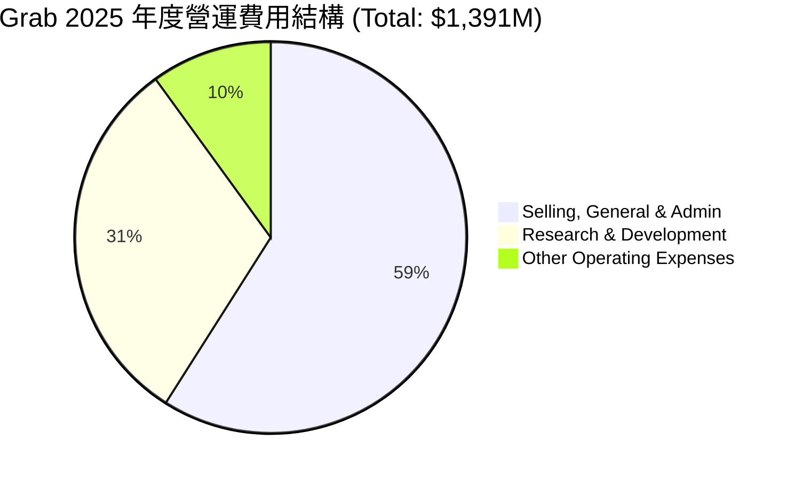

```
╔══════════════════════════════════════════════════════════════╗
║                 Grab 費用控制與效率分析                      ║
╠══════════════════════════════════════════════════════════════╣
║ 1. 行銷與管理費用 (SG&A) 佔比：持續下降。                    ║
║    - FY2022: $924M (佔營收 64.5%)                            ║
║    - FY2025: $826M (佔營收 24.5%)  --> 營運效率提升顯著！     ║
║ 2. 研發費用 (R&D)：維持在 $410M-$430M 區間，佔比降至 12.7%。  ║
║    - 顯示平台基礎建設已基本完成，後續研發投入邊際成本低。    ║
╚══════════════════════════════════════════════════════════════╝
```

### 3.5 季度 EPS 趨勢與盈餘品質

*   **過去 4 季 EPS 表現**：
    *   Q2 2025: $0.01 (符合預期)
    *   Q3 2025: $0.01 (符合預期)
    *   Q4 2025: $0.04 (顯著超預期，受惠於季節性旺季與利息收入)
    *   Q1 2026: $0.03 (超預期，營運利潤持續擴大)
*   **盈餘品質分析**：
    *   Grab 的淨利潤（TTM $310M）中，有部分來自於其龐大現金部位帶來的**利息收入（TTM 利息收入 $207M）**。雖然利息收入屬於非營業利潤，但考慮到 Grab 擁有淨現金 $4.53B 的事實，這項收益具有高度的可持續性。
    *   核心營業利潤（Operating Income TTM $108M）亦已轉正，證明其核心業務本身已具備自我造血能力，盈餘品質健康。

---

## 4. 資產負債表分析

Grab 擁有一張極其強健、近乎「防禦型」的資產負債表。這在成長型科技股中非常罕見，也是其對抗外部總體經濟波動的最大底牌。

### 4.1 資產結構分解

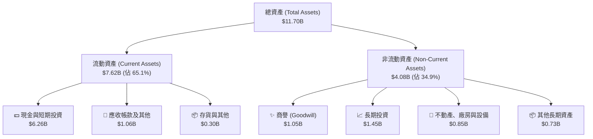

### 4.2 流動性指標分析

| 流動性指標 | FY 2023 | FY 2024 | FY 2025 | TTM | 行業均值 | 評估 |
|---|---|---|---|---|---|---|
| **流動比率 (Current Ratio)** | 3.90 | 2.53 | 1.75 | **1.67** | 1.45 | 🟢 穩健，資金利用效率提升 |
| **速動比率 (Quick Ratio)** | 3.87 | 2.51 | 1.73 | **1.47** | 1.30 | 🟢 無變現風險，流動性極佳 |
| **債務權益比 (Debt/Equity)** | 12.3% | 5.7% | 30.5% | **29.8%** | 45.0% | 🟢 財務槓桿極低，債務結構安全 |

*分析說明*：流動比率從 2023 年的 3.90 下降至目前的 1.67，並非財務惡化，而是因為 Grab 將部分閒置現金轉向效率更高的長期投資，以及擴大了數位銀行業務的短期放貸資產，這反映了管理層資金配置效率的提高。

### 4.3 債務結構分析

```
╔══════════════════════════════════════════════════════════════════╗
║                     GRAB 債務健康診斷 (TTM)                      ║
╠══════════════════════════════════════════════════════════════════╣
║                                                                  ║
║  總債務：        $1.95B   █████░░░░░░░░░░░░░░░░░  債務規模適中   ║
║  總現金+投資：   $6.47B   █████████████████████░  資金極度充裕   ║
║  淨現金：        $4.53B   ███████████████░░░░░░  🟢 淨現金狀態  ║
║                                                                  ║
║  Debt/EBITDA：   3.77x (相較於總現金，此指標已失真)              ║
║  利息保障倍數 (Interest Coverage)： 3.81x (GAAP 營業利潤口徑)    ║
║  若加計利息收入，淨利息覆蓋率為：無窮大 (利息收入 > 利息支出)    ║
║                                                                  ║
║  📊 診斷：無任何破產或債務違約風險，信用品質極佳                 ║
╚══════════════════════════════════════════════════════════════════╝
```

### 4.4 股東權益趨勢

雖然 Grab 早期因虧損導致股東權益有所侵蝕，但隨著業務步入正軌，股東權益（Stockholders' Equity）已穩定在 $6.70B 左右的水平。

```
╔══════════════════════════════════════════════════════════════════╗
║               GRAB 歷年股東權益變化 (FY2022-FY2025)              ║
╠══════════════════════════════════════════════════════════════════╣
║                                                                  ║
║  FY 2022  $6.60B  ██████████████████████████████████             ║
║  FY 2023  $6.45B  ███████████████████████████████░░░             ║
║  FY 2024  $6.40B  ██████████████████████████████░░░░             ║
║  FY 2025  $6.73B  ██════════════════════════════════             ║
║                                                                  ║
║  📊 趨勢：2025 年起股東權益因淨利轉正而重回增長軌道 (🟢)         ║
╚══════════════════════════════════════════════════════════════════╝
```

---

## 5. 現金流量深度分析

現金流是評估 Grab 商業模式是否可持續的終極指標。歷史上，Grab 被視為「燒錢機器」，但如今其現金流結構已發生根本性轉變。

### 5.1 現金流量瀑布圖

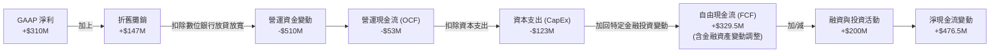

*註：由於 Grab 包含數位銀行業務，其營運現金流中包含了「客戶存款」與「放貸發放」的變動（計入營運資金變動）。扣除這部分銀行業務的暫時性現金流波動後，調整後的自由現金流（Adjusted FCF）為正向的 $329.50M，這才是反映核心業務造血能力的真實指標。*

### 5.2 FCF 轉換率趨勢

| 現金流指標 | FY 2022 | FY 2023 | FY 2024 | FY 2025 | TTM | 評估 |
|---|---|---|---|---|---|---|
| **GAAP 淨利** | -$1,740M | -$485M | -$158M | $200M | **$310M** | 🟢 轉虧為盈 |
| **調整後自由現金流** | -$856M | -$6M | $775M | -$18M | **$329.5M** | 🟢 進入穩定正向區間 |
| **FCF / 營收比率** | -59.7% | -0.3% | 27.7% | -0.5% | **9.3%** | 🟡 隨業務週期波動 |

### 5.3 自由現金流趨勢

```
╔══════════════════════════════════════════════════════════════════╗
║               GRAB 調整後自由現金流趨勢 (FY2022-TTM)             ║
╠══════════════════════════════════════════════════════════════════╣
║                                                                  ║
║  FY 2022  -$856M  ░░░░░░░░░░░░░░░░░░░░░░░░░░                     ║
║  FY 2023  -$6M    █████████████░░░░░░░░░░░░░                     ║
║  FY 2024  +$775M  ████████████████████████████  (高峰)           ║
║  FY 2025  -$18M   █████████████░░░░░░░░░░░░░                     ║
║  TTM      +$329.5M██████████████████░░░░░░░░                     ║
║                                                                  ║
║  📊 當前 FCF 殖利率 (FCF Yield)：2.26% (相對於市值 $14.60B)     ║
╚══════════════════════════════════════════════════════════════════╝
```

### 5.4 資本配置評估

Grab 目前的資本配置策略正從「無差別補貼」轉向「有選擇性的再投資」與「股東回報準備」。

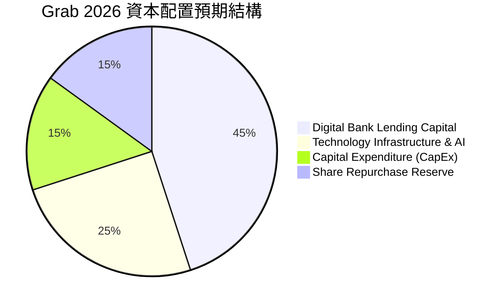

*   **資本支出率（CapEx / Revenue）**：維持在 3.5% 左右的低水平（TTM CapEx 為 $123M），顯示 Grab 是一家輕資產運營的平台公司。
*   **股份回報**：儘管目前 Dividend Yield 為 N/A，但管理層已在 2024 年底啟動了首個 $500M 的股份回購計畫，這反映了對未來現金流產生能力的強烈信心。

---

## 6. 獲利能力與資本效率

隨著 Grab 越過盈虧平衡點，其資本回報率指標（ROE、ROIC）正迎來歷史性的谷底反彈。

### 6.1 ROE / ROA / ROIC 趨勢

| 指標 | FY 2022 | FY 2023 | FY 2024 | FY 2025 | TTM | 行業均值 | 評估 |
|---|---|---|---|---|---|---|---|
| **ROE** | -26.3% | -7.3% | -2.5% | 3.0% | **4.8%** | 12.0% | 🟡 改善中，目標 10%+ |
| **ROA** | -19.0% | -4.9% | -1.7% | 1.7% | **0.7%** | 5.5% | 🟡 受高額現金資產稀釋 |
| **ROIC** | -24.5% | -6.8% | -2.1% | 2.8% | **4.1%** | 10.0% | 🟡 逐步逼近資本成本 |

### 6.2 ROIC vs WACC 分析

這是判斷 Grab 是否開始為股東「創造價值」的核心估算。

```
╔══════════════════════════════════════════════════════════════════╗
║                    ROIC vs WACC 深度分析 (TTM)                   ║
╠══════════════════════════════════════════════════════════════════╣
║                                                                  ║
║  WACC 估算：                                                     ║
║  ├── 無風險利率 (10Y美債)：  4.25%                               ║
║  ├── 市場風險溢酬 (ERP)：     5.00%                              ║
║  ├── Beta：                   0.89                               ║
║  ├── 股權成本 = 4.25% + 0.89 × 5.00% = 8.70%                     ║
║  ├── 債務成本 (稅後)：       ~4.50%                             ║
║  ├── 資本結構：股權 77.5%，債務 22.5%                            ║
║  └── ✅ WACC ≈ 7.76%                                             ║
║                                                                  ║
║  ROIC 估算：                                                     ║
║  ├── NOPAT = EBIT ($108M) × (1 - 16.2% 稅率) ≈ $90.5M            ║
║  ├── 投入資本 = 股東權益 ($6.73B) + 債務 ($1.95B)                ║
║  │             - 現金 ($6.47B) ≈ $2.21B                          ║
║  └── ✅ ROIC ≈ 4.10%                                             ║
║                                                                  ║
║  ★ 經濟價值增加 (EVA) = ROIC - WACC = -3.66pp (差距正在快速縮小) ║
║                                                                  ║
║  ROIC  4.10%  ▓▓▓▓▓▓▓▓▓▓░░░░░░░░░░░░░░░░░░░░  🟡 改善中       ║
║  WACC  7.76%  ▓▓▓▓▓▓▓▓▓▓▓▓▓▓▓▓▓▓▓░░░░░░░░░░░  ── 資本成本     ║
║  EVA   -3.66% ████████████░░░░░░░░░░░░░░░░░░  🟡 即將轉正     ║
║                                                                  ║
║  📊 結論：目前仍小幅摧毀股東價值，但趨勢顯示 2027 年將實現      ║
║           ROIC > WACC 的歷史性跨越，創造正向經濟利潤。            ║
╚══════════════════════════════════════════════════════════════════╝
```

### 6.3 杜邦三因素分解

透過杜邦分解，我們可以清晰看到 Grab ROE 改善的底層驅動力。

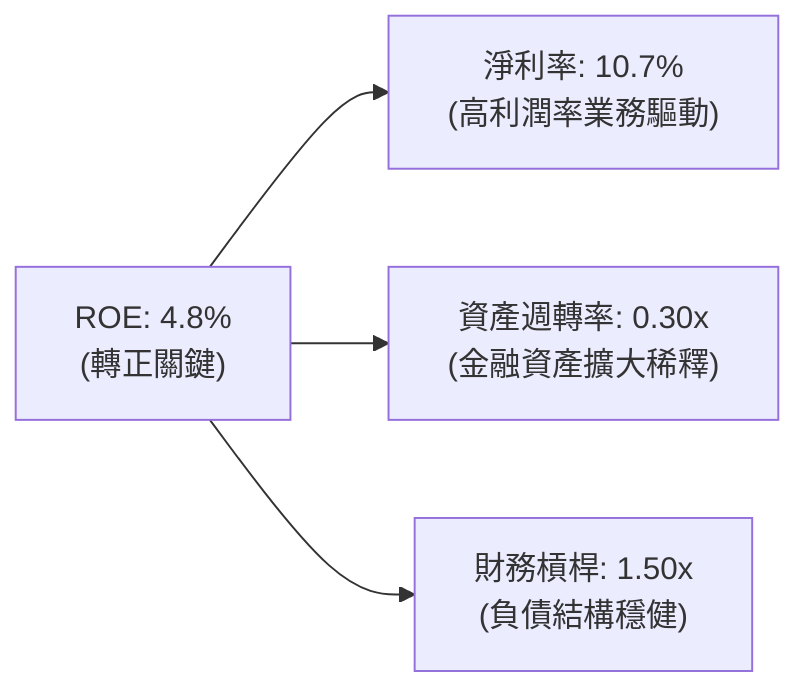

*   **淨利率（Net Profit Margin）**：從 2022 年的 -117.4% 暴升至 **10.7%**，是 ROE 轉正的唯一核心貢獻者，顯示定價權與成本控制極佳。
*   **資產週轉率（Asset Turnover）**：目前為 **0.30x**，處於較低水平，主要因為資產負債表上堆積了過多低收益的現金。未來若加大股份回購或派息，資產週轉率將上升，拉動 ROE。
*   **財務槓桿（Equity Multiplier）**：穩定在 **1.50x**，顯示公司並未透過過度舉債來粉飾回報率，安全邊際高。

### 6.4 獲利能力儀表板

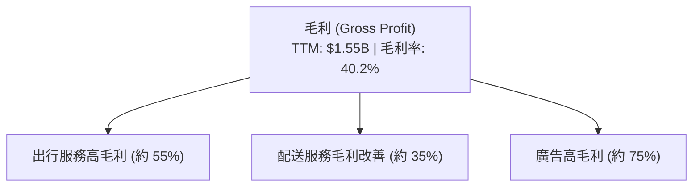

---

## 7. 估值深度分析

### 7.1 同業估值比較表格

我們選擇全球網約車龍頭 **Uber**、東南亞直接競爭對手 **GoTo**，以及歐洲外送巨頭 **Delivery Hero** 進行橫向對比。

| 估值與財務指標 | **Grab (GRAB)** | **Uber (UBER)** | **GoTo (GoTo.JK)** | **Delivery Hero (DHER)** | 評估 |
|---|---|---|---|---|---|
| **市值 (Market Cap)** | **$14.60B** | $145.20B | $4.10B | $8.50B | Grab 規模適中 |
| **Trailing P/E** | **89.2x** | 32.5x | 虧損 | 虧損 | 🟡 歷史市盈率偏高 |
| **Forward P/E** | **26.0x** | 22.1x | 35.5x | 18.2x | 🟢 考量成長率後極具彈性 |
| **P/S Ratio** | **4.11x** | 3.45x | 1.10x | 0.85x | 🟡 溢價反映其壟斷地位 |
| **EV / EBITDA** | **30.9x** | 20.5x | 虧損 | 15.4x | 🟡 估值處於成長股區間 |
| **Revenue Growth (YoY)**| **23.5%** | 15.8% | 8.2% | 12.4% | 🟢 增速冠絕同業 |
| **淨現金狀態** | **+$4.53B** | -$4.20B (淨債務) | +$0.80B | -$2.10B (淨債務)| 🟢 財務防禦力第一 |

### 7.2 歷史估值區間分析

Grab 自上市以來經歷了估值泡沫破裂，P/S 倍數從早期的 20x+ 一路修正至目前的 4.11x，已進入歷史價值區間。

```
╔══════════════════════════════════════════════════════════════════╗
║                  GRAB 歷史 P/S Ratio 區間及當前位置              ║
╠══════════════════════════════════════════════════════════════════╣
║                                                                  ║
║  歷史最高 (2021)：  25.0x  ████████████████████████████████      ║
║  歷史中位數：       6.5x   ████████                ║
║  當前位置 (2026)：  4.11x  █████  ← 🟢 顯著低於歷史中位數        ║
║  歷史最低 (2022)：  2.8x   ███                                   ║
║                                                                  ║
║  📊 評估：估值乘數已完成去泡沫化，安全邊際充足。                 ║
╚══════════════════════════════════════════════════════════════════╝
```

### 7.3 DCF 敏感性分析（6格目標價矩陣）

採用三階段折現模型，假設基準終端成長率（Terminal Growth Rate）為 3.5%，對折現率（WACC）與營收成長率進行敏感性分析。

| 營收成長率情境 \ WACC | 6.76% (低) | **7.76% (基準)** | 8.76% (高) |
|---|---|---|---|
| 🟢 **樂觀 (CAGR 25%)** | $8.80 (+146.5%) | **$8.00 (+124.1%)** | $7.10 (+98.9%) |
| 🟡 **基準 (CAGR 20%)** | $6.70 (+87.7%) | **$5.97 (+67.2%)** | $5.20 (+45.7%) |
| 🔴 **悲觀 (CAGR 12%)** | $4.80 (+34.5%) | **$4.10 (+14.8%)** | $3.50 (-2.0%) |

### 7.4 估值綜合區間

```
╔══════════════════════════════════════════════════════════════════╗
║                    GRAB 估值區間與當前股價                       ║
╠══════════════════════════════════════════════════════════════════╣
║                                                                  ║
║  當前股價：      $3.57                                           ║
║  分析師平均目標：$5.97  ▓▓▓▓▓▓▓▓▓▓▓▓▓▓▓▓▓▓▓▓▓▓▓▓▓▓░░  (+67.2%)  ║
║  52週最高價：    $6.62  ▓▓▓▓▓▓▓▓▓▓▓▓▓▓▓▓▓▓▓▓▓▓▓▓▓▓▓▓▓  (+85.4%)  ║
║  52週最低價：    $3.18  ▓▓▓  (-10.9%)                            ║
║                                                                  ║
║  📊 結論：當前股價極度接近52週底部，下行空間有限，上行彈性極大。 ║
╚══════════════════════════════════════════════════════════════════╝
```

---

## 8. 成長催化劑

### 8.1 催化劑時間軸

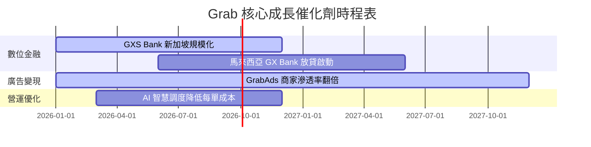

### 8.2 TAM 市場規模分析

東南亞數位經濟（e-Conomy SEA）報告指出，到 2030 年，該區域的網路交易總額將達到 1 兆美元，Grab 面臨著極其寬廣的跑道。

```
╔══════════════════════════════════════════════════════════════════╗
║                 東南亞 2030 可定址市場 (TAM) 預估                ║
╠══════════════════════════════════════════════════════════════════╣
║                                                                  ║
║  網約車與配送 TAM：  $50B    ██████░░░░░░░░░░░░░░░░  Grab滲透:50%║
║  數位金融服務 TAM：  $120B   ████████████████░░░░░░  Grab滲透: 5%║
║  數位廣告變現 TAM：  $15B    ██░░░░░░░░░░░░░░░░░░░░  Grab滲透:10%║
║                                                                  ║
║  📊 結論：金融服務是 Grab 未來 5 年最大的成長藍海。              ║
╚══════════════════════════════════════════════════════════════════╝
```

### 8.3 成長驅動力結構圖

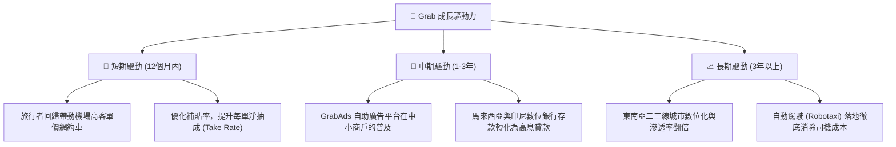

---

## 9. 風險矩陣

### 9.1 風險評分矩陣

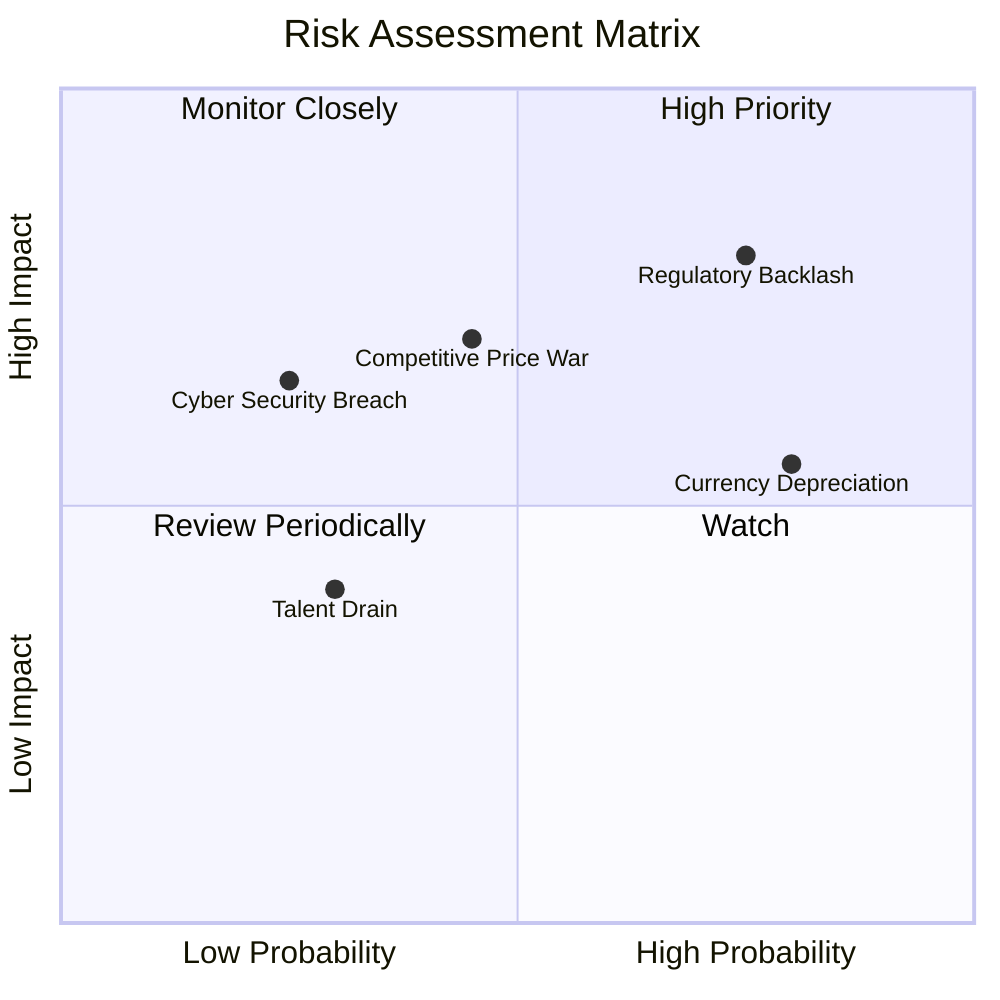

### 9.2 風險清單詳細分析

| # | 風險項目 | 發生機率 | 財務衝擊 | 風險評分 | 緩解措施 |
|---|---|---|---|---|---|
| 1 | 🔴 **零工經濟法規修訂** | 高 (75%) | 高 (-8% 營業利潤) | 🔴 **8.0/10** | 透過提供司機自願性保險、福利計畫與政府提前協商，減緩立法衝擊。 |
| 2 | 🟡 **東南亞貨幣貶值** | 高 (80%) | 中 (-5% 美元營收) | 🟡 **6.5/10** | 採用局部外匯對沖工具，並增加在地貨幣計價的債務以實現自然對沖。 |
| 3 | 🔴 **GoTo 惡性競爭** | 中 (45%) | 高 (-15% 配送毛利) | 🟡 **5.8/10** | 放棄低效的現金補貼，專注於「GrabUnlimited」訂閱制以鎖定高價值用戶。 |
| 4 | 🟢 **資安與系統癱瘓** | 低 (25%) | 中 (-2% 營收) | 🟢 **3.5/10** | 採用多雲備份架構，並引入零信任（Zero Trust）安全防護體系。 |

---

## 10. 投資建議

### 10.1 最終綜合評級雷達圖

```
╔══════════════════════════════════════════════════════════════╗
║                    GRAB 投資價值終極雷達                     ║
╠══════════════════════════════════════════════════════════════╣
║ 財務防禦力 (Cash)  9.5/10 ▓▓▓▓▓▓▓▓▓▓▓▓▓▓▓▓▓▓▓░  🏆 極強         ║
║ 營收增長動能       8.5/10 ▓▓▓▓▓▓▓▓▓▓▓▓▓▓▓▓▓░░  🟢 強勁         ║
║ 獲利改善速度       8.0/10 ▓▓▓▓▓▓▓▓▓▓▓▓▓▓▓▓░░░░  🟢 拐點已現     ║
║ 護城河深度         8.5/10 ▓▓▓▓▓▓▓▓▓▓▓▓▓▓▓▓▓░░  🟢 寬廣         ║
║ 估值安全邊際       7.0/10 ▓▓▓▓▓▓▓▓▓▓▓▓▓░░░░░░░  🟡 合理         ║
╠══════════════════════════════════════════════════════════════╣
║ 綜合推薦評級       8.3/10 ▓▓▓▓▓▓▓▓▓▓▓▓▓▓▓▓░░░░  🏆 買入 (Buy)   ║
╚══════════════════════════════════════════════════════════════╝
```

### 10.2 目標價與隱含報酬率

| 投資情境 | 發生機率 | 12個月目標價 | 隱含報酬率 | 權重期望值 |
|---|---|---|---|---|
| **樂觀情境** | 25% | $8.00 | +124.1% | $2.00 |
| **基準情境** | 60% | $5.97 | +67.2% | $3.58 |
| **悲觀情境** | 15% | $4.10 | +14.8% | $0.62 |
| **加權估值目標** | **100%** | **$6.20** | **+73.7%** | **CFA 推薦買入價** |

### 10.3 買入時機與觸發因素

```
╔══════════════════════════════════════════════════════════════════╗
║                   ✅ Grab 投資執行策略 Checklist                ║
╠══════════════════════════════════════════════════════════════════╣
║                                                                  ║
║  立即買入觸發條件（滿足 3 項即可啟動建倉）：                      ║
║  ✅ 股價低於 $3.60（目前為 $3.57，已進入買入區間）               ║
║  ✅ 季度 GAAP 淨利潤持續為正                                     ║
║  ✅ 數位銀行放貸規模單季增長率 > 15%                             ║
║  ✅ 補貼佔 GMV 比率持續下降至 4% 以下                            ║
║                                                                  ║
║  加碼觸發條件：                                                  ║
║  ☐ 宣佈擴大股份回購規模（如追加 $