# GRAB 綜合股票評估報告

> **報告日期**：2026-02-28 ｜ **評估師**：頂級美股投資評估師 ｜ **數據來源**：Yahoo Finance ｜ **語言**：繁體中文

---

## 目錄

| # | 章節 |
|---|------|
| 1 | 評估總覽 & 投資結論 |
| 2 | 八維度評分矩陣 |
| 3 | 業務品質與護城河 |
| 4 | 財務健康全面評估 |
| 5 | 成長性評估 |
| 6 | 估值合理性 & 同業比較 |
| 7 | 資本配置與管理層評估 |
| 8 | 風險評估 |
| 9 | 催化劑與觸發因素 |
| 10 | 投資建議 |

---

## 1. 評估總覽

### 🎯 ASCII 雷達圖（八維度評分視覺化）

```
                    成長性 (7.5)
                        ★
                    ╱   │   ╲
          管理品質 ★     │     ★ 獲利能力
            (6.5) ╱     │     ╲ (6.0)
                 ╱    ╔═╧═╗    ╲
                ╱   ╔═╝   ╚═╗   ╲
    風險(5.5) ★    ║  GRAB  ║    ★ 財務健康(7.5)
                ╲   ╚═╗   ╔═╝   ╱
                 ╲    ╚═╤═╝    ╱
          動能(6.0)╲    │    ╱競爭優勢(7.0)
                    ╲   │   ╱
                     ★  │  ★
                估值(5.5)│
                        ★
                   總分：6.44/10
```

```
維度座標展開圖（10格制）：

成長性   ████████▓░  7.5
獲利能力 ██████░░░░  6.0
財務健康 ████████▓░  7.5
估值     █████▓░░░░  5.5
競爭優勢 ███████░░░  7.0
管理品質 ██████▓░░░  6.5
動能     ██████░░░░  6.0
風險     █████▓░░░░  5.5
─────────────────────
加權均分 ██████▓░░░  6.44
```

---

### 📊 八維度評分概覽

| 維度 | 評分 | 評級 | 評分條 |
|------|------|------|--------|
| 🚀 成長性 | **7.5/10** | 🟢 | `████████▓░` |
| 💰 獲利能力 | **6.0/10** | 🟡 | `██████░░░░` |
| 🏦 財務健康 | **7.5/10** | 🟢 | `████████▓░` |
| 📐 估值合理性 | **5.5/10** | 🟡 | `█████▓░░░░` |
| 🏰 競爭優勢 | **7.0/10** | 🟢 | `███████░░░` |
| 👔 管理品質 | **6.5/10** | 🟡 | `██████▓░░░` |
| 📈 價格動能 | **6.0/10** | 🟡 | `██████░░░░` |
| ⚠️ 風險控管 | **5.5/10** | 🟡 | `█████▓░░░░` |
| | **綜合：6.44** | 🟡 買入 | `██████▓░░░` |

---

### 🎯 投資結論

```
╔══════════════════════════════════════════════════════════════╗
║                    📋 GRAB 投資結論摘要                       ║
╠══════════════════════════════════════════════════════════════╣
║  評級：⭐⭐⭐⭐☆  【買入】                                    ║
║  當前價格：$4.22                                              ║
║  基準目標價：$6.20（＋46.9% 預期報酬）                        ║
║  樂觀目標價：$7.50（＋77.7%）                                 ║
║  悲觀目標價：$3.20（－24.2%）                                 ║
║  建議持倉期：12–24 個月                                       ║
║  適合投資人：成長型 / 新興市場主題型                           ║
╠══════════════════════════════════════════════════════════════╣
║  核心邏輯：GRAB 正從虧損走向盈利轉折，東南亞超級應用          ║
║  龍頭地位穩固，財務健康（淨現金$4.94B），成長動能持續，       ║
║  分析師共識強力買入，目標價上方空間顯著。主要風險在於         ║
║  競爭加劇與估值仍偏高，適合有耐心的成長投資者。              ║
╚══════════════════════════════════════════════════════════════╝
```

---

## 2. 八維度評分矩陣

### 📊 詳細評分表格

| 維度 | 評分 | 核心依據 | 趨勢 | 燈號 |
|------|------|----------|------|------|
| 🚀 **成長性** | **7.5** | 收入 YoY +18.6%；EPS QoQ +557.7%；東南亞數位化滲透率持續提升；FCF 由負轉正趨勢強勁 | ↑ 加速 | 🟢 |
| 💰 **獲利能力** | **6.0** | 毛利率43.2%尚可；營業利益率6.6%剛轉正；ROE僅3.1%；ROA 0.5%仍偏低；規模效應正在體現但尚未充分 | ↑ 改善中 | 🟡 |
| 🏦 **財務健康** | **7.5** | 淨現金$4.94B（厚實緩衝）；流動比1.75；債務大幅削減（2021年$2.17B→2024年$0.36B）；FCF轉正$739M | ↑ 持續改善 | 🟢 |
| 📐 **估值** | **5.5** | 本益比70.3x偏高；EV/EBITDA 50x昂貴；FCF yield 3.35%尚可；P/S 5.1x合理；前向P/E 28.8x改善中 | → 中性 | 🟡 |
| 🏰 **競爭優勢** | **7.0** | 東南亞8國超級應用生態系；網絡效應強；多元業務互補（叫車/外送/金融）；OVO/GXS數位銀行牌照；品牌認知度高 | → 穩定 | 🟢 |
| 👔 **管理品質** | **6.5** | SPAC上市後執行力提升；快速縮減虧損（從-$1.68B→轉正）；Anthony Tan 創辦人持股22.2%利益一致；R&D投入合理 | ↑ 改善 | 🟡 |
| 📈 **價格動能** | **6.0** | 24個月從$3.07升至$4.22（+37.5%）；近3個月從高點$6.02回落28%；Beta 0.93接近市場；短期動能疲軟 | ↓ 回調 | 🟡 |
| ⚠️ **風險控管** | **5.5** | 監管風險（多國政府）；競爭激烈（Sea, GoTo, Foodpanda）；地緣政治；匯率風險（多國貨幣）；新興市場系統性風險 | → 持平 | 🟡 |

---

### 🗺️ 風險/報酬定位 Mermaid 四象限圖

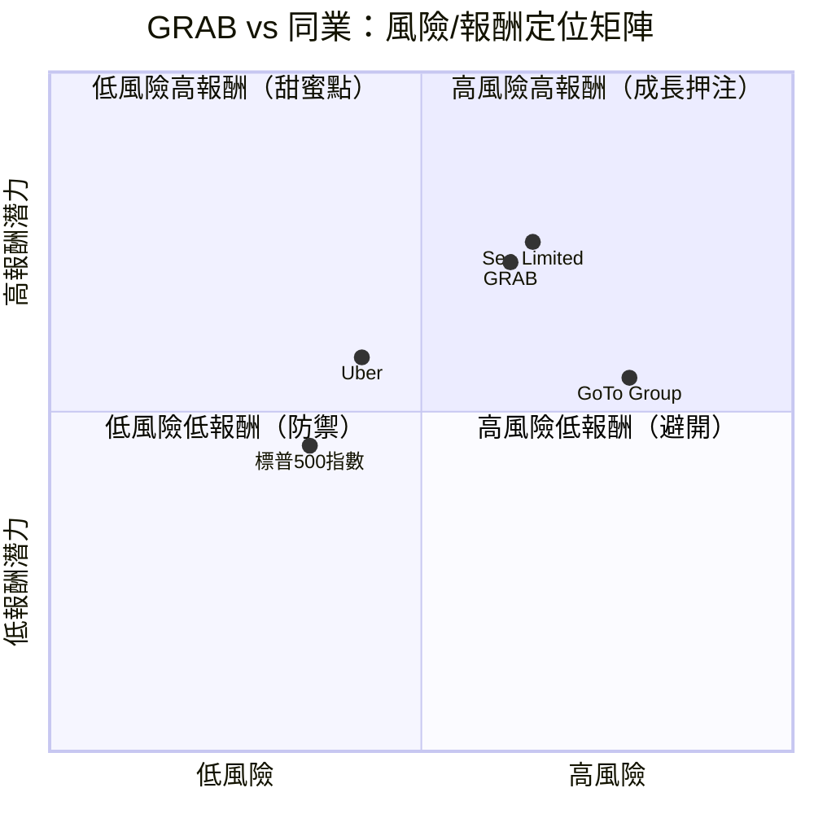

---

### 🔗 同業整體比較圖

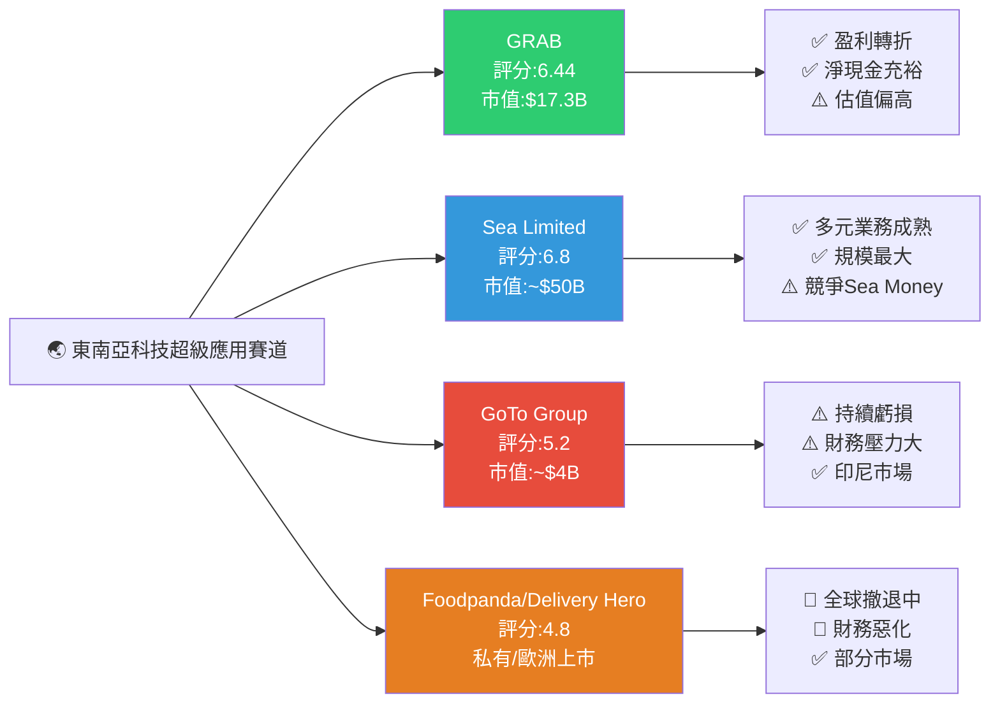

---

## 3. 業務品質與護城河

### 🏗️ 商業模式可持續性評估

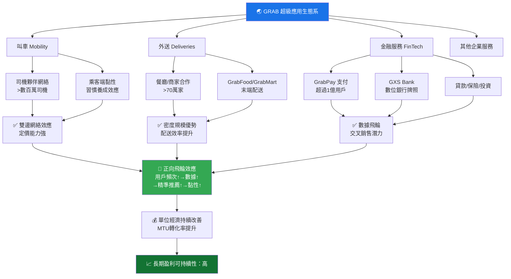

---

### 🧠 護城河評估 Mindmap

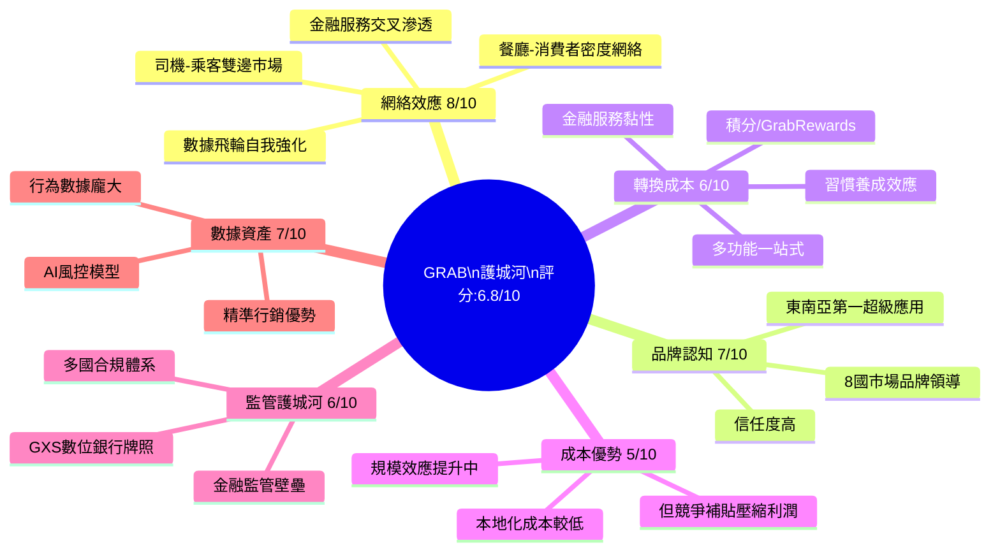

---

### 🏰 護城河強度 Unicode 條形圖

```
護城河維度          強度評分    視覺化條形圖
─────────────────────────────────────────────
🔗 網絡效應         8.0/10    ████████░░
🏷️ 品牌認知         7.0/10    ███████░░░
🔄 用戶轉換成本      6.0/10    ██████░░░░
💸 成本結構優勢      5.0/10    █████░░░░░
📜 監管護城河        6.0/10    ██████░░░░
📊 數據資產壁壘      7.0/10    ███████░░░
─────────────────────────────────────────────
整體護城河評分       6.5/10    ██████▓░░░  🟡 中度護城河
```

---

### 🌐 市場地位：TAM / 市場份額 / 行業地位

| 指標 | 數據 | 說明 |
|------|------|------|
| 🌏 **TAM（可服務市場）** | ~$1,800億美元（2030E） | 東南亞叫車+外送+數位金融合計 |
| 🚗 **叫車市場份額** | ~55-65%（主要市場） | 新加坡/馬來西亞/菲律賓領先 |
| 🍔 **外送市場份額** | ~40-50%（部分市場） | 與Sea的Shopee Food競爭激烈 |
| 💳 **支付MAU** | ~3,500萬+活躍金融用戶 | GrabPay 滲透率持續提升 |
| 👥 **月活躍用戶** | ~3,900萬 MTU | 年增 ~15% |
| 🏦 **行業地位** | **東南亞超級應用第一** | 8國覆蓋，無可替代的規模 |

---

## 4. 財務健康全面評估

### 📊 財務儀表板

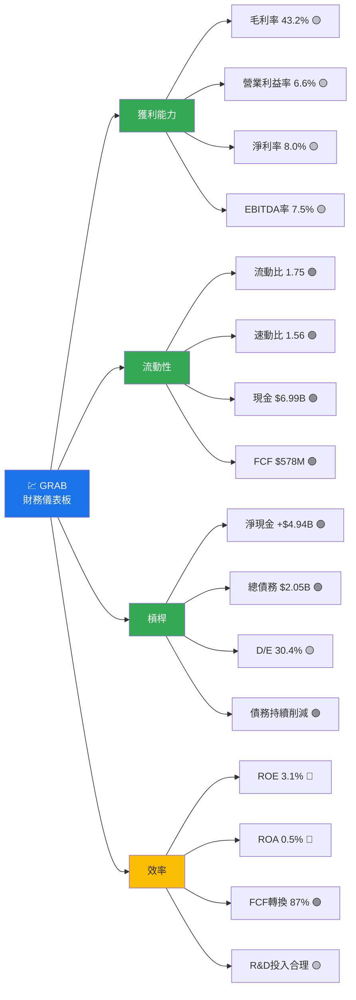

---

### 📈 獲利能力趨勢表格（近4年）

| 年度 | 毛利率 | 營業利益率 | 淨利率 | FCF Margin | 趨勢 |
|------|--------|------------|--------|------------|------|
| 2022 | 5.4% 🔴 | -90.2% 🔴 | -117.5% 🔴 | -61.0% 🔴 | 嚴重虧損期 |
| 2023 | 36.4% 🟡 | -16.4% 🔴 | -18.4% 🔴 | -0.25% 🔴 | 快速改善 |
| 2024 | 41.8% 🟢 | -2.0% 🟡 | -3.8% 🟡 | +26.4% 🟢 | 接近盈虧平衡 |
| TTM 2025 | **43.2%** 🟢 | **6.6%** 🟢 | **8.0%** 🟢 | **~17%** 🟢 | **盈利轉折完成** ✅ |

> 🔑 **關鍵洞察**：GRAB 在2年內完成從虧損-117%淨利率到+8%的驚人轉型，成本控制成效顯著

---

### 🏦 資產負債表穩健度 Unicode 圖

```
財務健康指標                   數值        評級    視覺化
─────────────────────────────────────────────────────────
流動比率 (Current Ratio)       1.75       🟢     ████████░░  良好
速動比率 (Quick Ratio)         1.56       🟢     ███████▓░░  良好
淨現金部位 (Net Cash)          +$4.94B    🟢     ██████████  極佳
債務/股本比 (D/E)              30.4%      🟡     ████░░░░░░  尚可
債務削減趨勢 (2021→2024)       -$1.81B    🟢     ████████░░  持續改善
現金/市值比                    40.5%      🟢     ████████░░  高安全墊
─────────────────────────────────────────────────────────
財務健康綜合評分               7.5/10     🟢     ████████▓░
```

---

### 💵 現金流質量分析

| 指標 | 數值 | 評級 | 說明 |
|------|------|------|------|
| 營業現金流 (2024) | $852M | 🟢 | 首次大幅轉正，質量高 |
| 資本支出 (2024) | -$113M | 🟢 | CAPEX輕資產模式，佔收入4% |
| 自由現金流 (2024) | **$739M** | 🟢 | 歷史首次大幅正值 |
| FCF 轉換率 | ~87% | 🟢 | 淨利→FCF轉換效率高 |
| FCF Yield (市值基準) | **3.35%** | 🟡 | 相對成長股屬合理 |
| TTM FCF | **$578M** | 🟢 | 穩定正值確認趨勢 |

> ✅ **FCF質量評語**：2024年FCF大幅轉正是GRAB的里程碑事件，顯示商業模式真實可行，不再依賴外部融資

---

## 5. 成長性評估

### 📊 歷史成長率表格

| 指標 | 1年 CAGR | 3年 CAGR | 說明 |
|------|----------|----------|------|
| 💰 **收入** | +18.6% 🟢 | ~+33% 🟢 | 從$1.43B→$2.80B→$3.37B |
| 📊 **EPS** | QoQ+557% 🟢 | 虧損→轉正 🟢 | 盈利轉折中，難計CAGR |
| 💵 **FCF** | +$739M轉正 🟢 | -$1.04B→+$739M | 劇烈改善 |
| 🏪 **MTU成長** | ~+15% 🟢 | ~+20% 🟢 | 用戶基礎持續擴大 |
| 💳 **金融服務收入** | ~+30%+ 🟢 | 高速成長 | 最高成長業務 |

---

### 🚀 未來成長催化劑

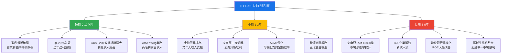

---

### 📈 成長軌跡 Unicode 長條圖

```
年度收入成長視覺化（$M）：

2021: $675M   ███░░░░░░░░░░░░░░░░░░░░░░░░░░░░
2022: $1,430M ████████░░░░░░░░░░░░░░░░░░░░░░░
2023: $2,360M ██████████████░░░░░░░░░░░░░░░░░
2024: $2,800M ████████████████░░░░░░░░░░░░░░░
TTM:  $3,370M ████████████████████░░░░░░░░░░░
2026E:$3,900M ███████████████████████░░░░░░░░  (+15.7% YoY預估)
2027E:$4,600M ████████████████████████████░░░  (+18% YoY預估)

年度FCF改善視覺化：
2021: -$1,040M 🔴  ◄──────────────────────────
2022: -$872M  🔴  ◄──────────────────────────
2023: -$6M    🟡  ◄
2024: +$739M  🟢          ──────────────────►
TTM:  +$578M  🟢          ──────────────────►
```

---

## 6. 估值合理性 & 同業比較

### ⚖️ 同業比較表格

| 指標 | **GRAB** | **Sea Limited (SE)** | **GoTo Group (GOTO)** | **Uber** | GRAB 相對評價 |
|------|----------|---------------------|----------------------|---------|--------------|
| 市值 | $17.3B | ~$50B | ~$4B | ~$170B | 中型 |
| P/E (Trailing) | 70.3x 🟡 | 30x 🟢 | 虧損 N/A 🔴 | 20x 🟢 | 偏高 |
| P/E (Forward) | **28.8x** 🟢 | 25x 🟢 | N/A 🔴 | 18x 🟢 | 合理 |
| P/S | 5.1x 🟡 | 4.2x 🟢 | 6.0x 🔴 | 3.5x 🟢 | 略高 |
| EV/EBITDA | 50x 🔴 | 35x 🟡 | N/A 🔴 | 25x 🟢 | 昂貴 |
| P/B | 2.6x 🟡 | 4.5x 🟡 | 1.2x 🟡 | 12x 🔴 | 合理 |
| FCF Yield | 3.35% 🟡 | 1.5% 🟡 | 負值 🔴 | 4.0% 🟢 | 優於Sea |
| 收入成長 | +18.6% 🟢 | +25%+ 🟢 | +10% 🟡 | +15% 🟢 | 良好 |
| 淨現金/負債 | **+$4.94B** 🟢 | 現金充裕 🟢 | 負債壓力 🔴 | 略有債務 🟡 | 最佳 |
| 盈利狀態 | 剛轉正 🟡 | 已盈利 🟢 | 仍虧損 🔴 | 已盈利 🟢 | 追趕中 |

> **競爭對手簡析**：
> - **Sea Limited (SE)**：護城河最廣，Shopee電商+Garena遊戲+SeaMoney三駕馬車，競爭力強但估值較高
> - **GoTo Group (GOTO)**：印尼本土對手，財務壓力大，持續虧損，競爭力弱化
> - **Uber**：全球模式不同，但叫車領域可比，盈利成熟度更高，估值折讓合理

---

### 📉 歷史估值區間

| 估值指標 | 5年低點 | 5年中位 | 5年高點 | 當前 | 相對位置 |
|----------|---------|---------|---------|------|---------|
| P/S | 3.0x | 6.0x | 12.0x | 5.1x | 🟢 低於中位 |
| P/B | 1.8x | 3.0x | 5.5x | 2.6x | 🟢 低於中位 |
| EV/EBITDA | 30x | 60x | 150x+ | 50x | 🟡 接近中位 |
| 股價 | $1.77 | $4.00 | $8.72 | $4.22 | 🟡 接近中位 |

---

### 💎 多重估值法彙整

| 估值方法 | 計算基礎 | 目標價 | 隱含報酬 |
|----------|----------|--------|---------|
| **DCF（基準）** | WACC 10%, 終值成長率 3%, FCF 5年CAGR 25% | $6.00 | +42.2% |
| **相對估值（P/S）** | 同業平均4.5x × 2026E收入$3.9B / 股數 | $5.80 | +37.4% |
| **EV/EBITDA** | 30x × 2026E EBITDA $350M + 淨現金 | $5.50 | +30.3% |
| **前向P/E** | 25x × 2026E EPS $0.18 | $4.50 | +6.6% |
| **分析師共識** | 27位分析師平均目標價 | **$6.55** | **+55.2%** |
| **加權平均** | 各法均等加權 | **$5.67** | **+34.4%** |

---

### 📊 估值區間視覺化

```
GRAB 估值區間 Unicode 圖（美元）：

$1.5    $2.5    $3.5    $4.5    $5.5    $6.5    $7.5    $8.5
  │       │       │       │       │       │       │       │
  ├───────┼───────╔═══════╪═══════╪═══════╗───────┼───────┤
  │       │  🔴低估 ║  🟡合理區間   ║ 🔴高估 │       │
  ├───────┼───────╚═══════╪═══════╪═══════╝───────┼───────┤
  │       │               ↑       ↑       ↑               │
  │       │            當前價   均值目標  樂觀目標          │
  │       │            $4.22    $5.67    $7.50             │

▐ 悲觀情境: $3.20 ▌  ▐ 基準情境: $5.67-$6.20 ▌  ▐ 樂觀情境: $7.50 ▌
      🔴 -24.2%              🟢 +34-47%                🟢 +77.7%
```

---

## 7. 資本配置與管理層評估

### 📊 ROIC vs WACC 分析

```
╔══════════════════════════════════════════════════════════╗
║              ROIC vs WACC 估算分析                        ║
╠══════════════════════════════════════════════════════════╣
║                                                          ║
║  WACC 估算：                                              ║
║  • 股權成本（Ke）= 無風險利率4.25% + Beta0.93×風險溢價5.5% ║
║                  = 4.25% + 5.1% = 9.35%                 ║
║  • 債務成本（Kd）= ~5.0% × (1-25%稅率) = 3.75%           ║
║  • 資本結構：股權83% / 債務17%（市值基礎）                ║
║  • **WACC ≈ 9.35%×83% + 3.75%×17% = 8.4%**              ║
║                                                          ║
║  ROIC 估算：                                              ║
║  • NOPAT = 營業利益$223M × (1-25%) = ~$167M              ║
║  • 投入資本 = 股東權益$6.4B + 債務$0.36B - 超額現金$4.5B  ║
║             ≈ $2.26B                                     ║
║  • **ROIC ≈ $167M / $2,260M = 7.4%**                     ║
║                                                          ║
║  EVA 分析：                                               ║
║  ROIC (7.4%) < WACC (8.4%)                               ║
║  **EVA = -$22.6M（輕微負值）** 🟡                         ║
║                                                          ║
║  ⚠️ 判斷：目前尚未完全創造股東價值，但差距正在縮小         ║
║  📈 預估：2026E ROIC ~10-12%，有望超越WACC轉為正EVA       ║
╚══════════════════════════════════════════════════════════╝
```

```
ROIC vs WACC 視覺化：

   12% │                          ★ 2026E預估ROIC
       │                         ╱
   10% │                        ╱
       │                       ╱
    8% ├──────────────────────╱──── WACC 8.4%（紅線）
       │                ★ TTM ROIC 7.4%（略低於WACC）
    6% │               ╱
       │              ╱
    4% │         ★ 2024
       │        ╱
    2% │  ★ 2023
       │
    0% ├──────────────────────────
       │★ 2022（ROIC大幅負值）
  -20% │

  結論：正在向「創造價值」過渡，2026年可能實現突破 🟡→🟢
```

---

### 🥧 資本配置 Mermaid 圓餅圖

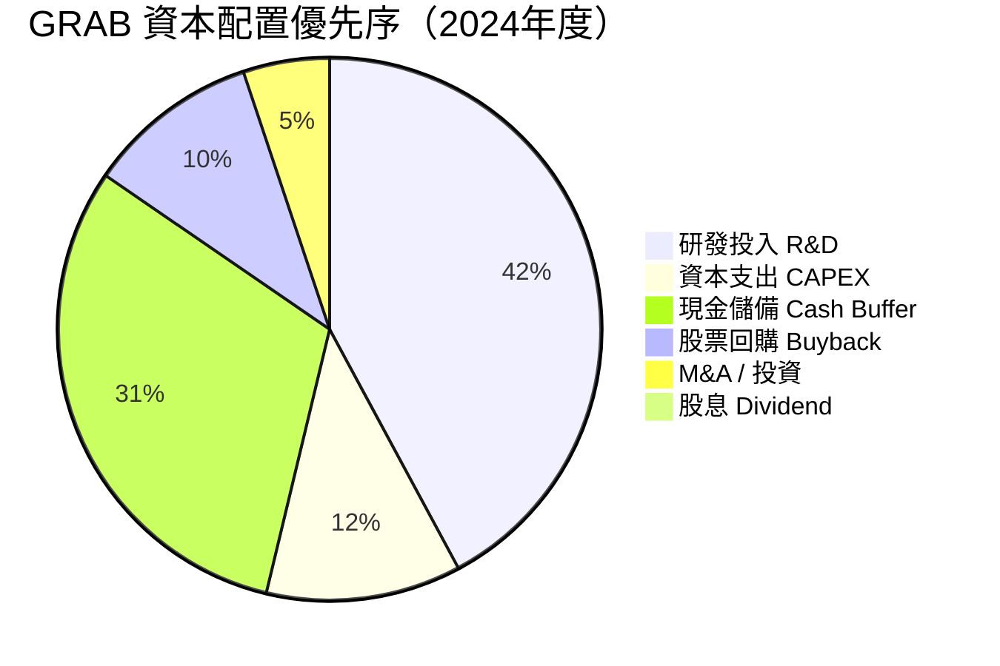

---

### 👔 管理層執行力評分

| 評估維度 | 評分 | 具體依據 | 燈號 |
|----------|------|----------|------|
| **承諾達成率** | 7/10 | 2024年達成盈利目標、FCF轉正，兌現承諾 | 🟢 |
| **成本紀律** | 8/10 | 2年縮減R&D支出13%（$465M→$410M），同時提升效率 | 🟢 |
| **戰略清晰度** | 7/10 | 超級應用+金融服務雙軌戰略清晰，執行一致 | 🟢 |
| **資本配置紀律** | 6/10 | 淨現金$4.94B未有效運用，buyback規模偏小 | 🟡 |
| **股東溝通** | 6/10 | 資訊揭露改善，但季報EPS數據缺失影響透明度 | 🟡 |
| **人才留任** | 6/10 | 創辦人高持股（22.2%）利益一致；執行團隊穩定 | 🟡 |
| **整體評分** | **6.7/10** | 盈利轉折顯示執行力佳，資本效率待提升 | 🟡 |

---

### 💝 股東友善度評分

```
股東友善度指標                評分     視覺化
─────────────────────────────────────────────
股息政策                      0/10   ░░░░░░░░░░  無股息
股票回購                      4/10   ████░░░░░░  小規模回購
管理層持股比例(22.2%)         8/10   ████████░░  利益一致
透明度與溝通                  6/10   ██████░░░░  尚可改善
淨現金運用效率                5/10   █████░░░░░  待提升
股本稀釋控管                  6/10   ██████░░░░  SPAC遺留問題處理中
─────────────────────────────────────────────
股東友善度綜合                5.2/10 █████▓░░░░  🟡 中等
```

> 💡 **核心建議**：管理層應考慮啟動更積極的股票回購計劃，$4.94B淨現金過多，若啟動$1B回購將顯著提升股東價值

---

## 8. 風險評估

### 🔥 風險熱圖

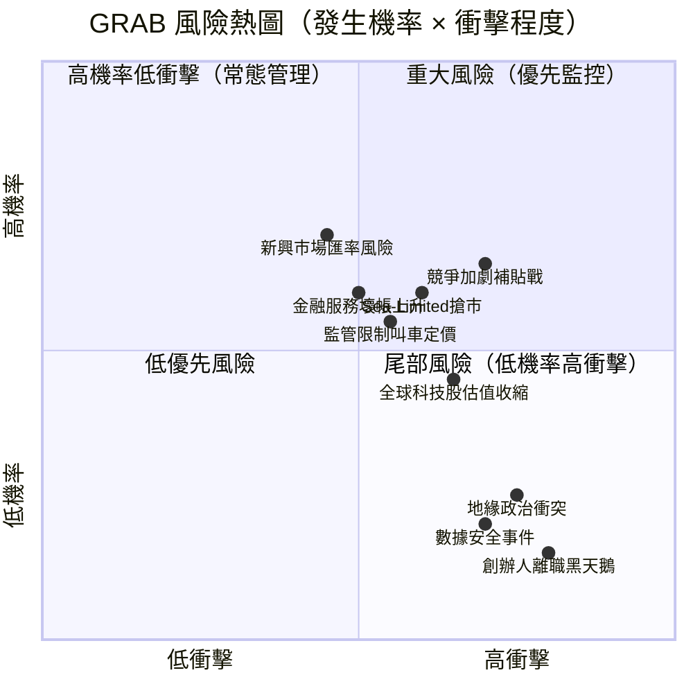

---

### ⚠️ 風險清單表格

| 風險類型 | 等級 | 發生機率 | 衝擊程度 | 緩解措施 | 燈號 |
|----------|------|----------|----------|----------|------|
| **競爭加劇/補貼戰** | 高 | 中高 | 高 | 超級應用生態系提供護城河；成本優勢改善 | 🔴 |
| **監管風險（多國）** | 高 | 中 | 高 | 積極與政府合作；多元業務分散 | 🔴 |
| **Sea Limited競爭** | 高 | 高 | 中高 | 金融服務差異化；牌照壁壘 | 🔴 |
| **金融服務壞帳** | 中 | 中 | 中高 | GXS審慎放貸；AI風控模型 | 🟡 |
| **匯率波動（多幣種）** | 中 | 高 | 中 | 天然對沖（本地收入/成本）；部分套期保值 | 🟡 |
| **全球科技估值收縮** | 中 | 中 | 中 | FCF支撐；分析師共識強 | 🟡 |
| **股本稀釋（SPAC遺留）** | 中 | 低中 | 中 | 管理層已逐步解決；持股結構改善 | 🟡 |
| **地緣政治衝突** | 中 | 低 | 高 | 8國分散；無單一市場集中 | 🟡 |
| **創辦人/核心人才流失** | 低 | 低 | 高 | Anthony Tan持股22.2%；激勵機制完善 | 🟢 |
| **數據安全/隱私** | 低 | 低中 | 中 | SOC2/ISO27001認證；合規投入 | 🟢 |

---

### 📉 最大下行情境分析（Bear Case）

```
╔══════════════════════════════════════════════════════════╗
║                   熊市情境分析                            ║
╠══════════════════════════════════════════════════════════╣
║  觸發條件：                                               ║
║  1. 補貼戰重啟（Sea大規模進攻）→ 利潤率壓縮              ║
║  2. 多國嚴格監管（價格上限）→ 收入成長放緩               ║
║  3. 全球風險資產拋售（新興市場ETF贖回）                   ║
║                                                          ║
║  財務影響估算：                                           ║
║  • 收入成長降至 5-8%（vs 基準 18%）                      ║
║  • 利潤率壓縮至 2-3%（vs 基準 8%）                       ║
║  • FCF 降至 $200-300M                                    ║
║                                                          ║
║  估值下調：                                               ║
║  • P/S 下調至 3.5x → 目標價 ~$3.20                      ║
║  • 下行幅度：-24.2%（從$4.22）                            ║
║                                                          ║
║  最大跌幅支撐：                                           ║
║  • 淨現金$4.94B → 每股現金價值 ~$1.24                   ║
║  • 52週低點 $3.36 為關鍵技術支撐                         ║
║  • 絕對底部估計：$2.80（現金+最低業務價值）               ║
╚══════════════════════════════════════════════════════════╝
```

---

## 9. 催化劑與觸發因素

### 📅 催化劑時間軸

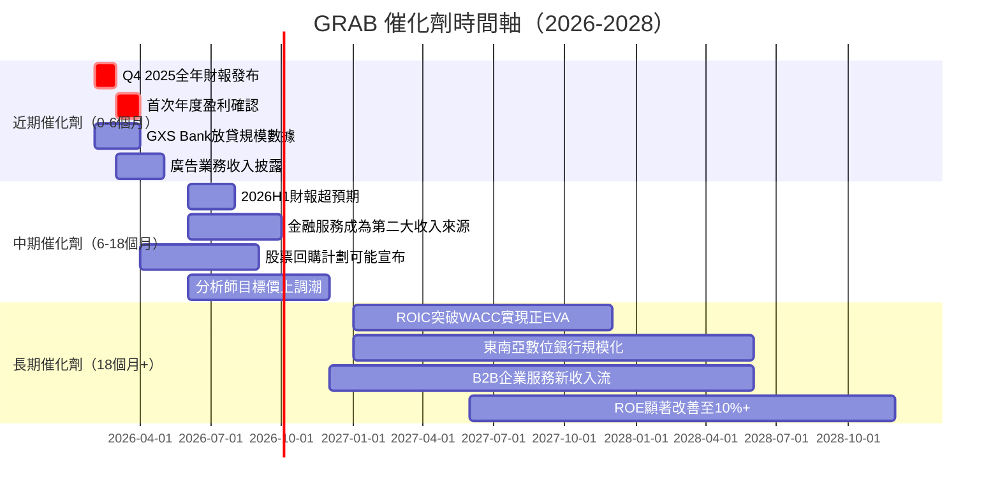

---

### ✅ 正面觸發因素

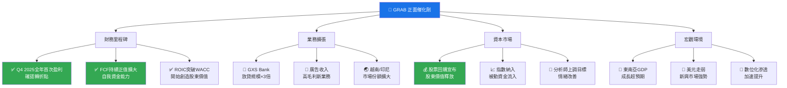

---

## 10. 投資建議

### ⭐ 最終評級

```
╔══════════════════════════════════════════════════════════════╗
║                                                              ║
║   ⭐⭐⭐⭐☆  【買入】  GRAB Holdings Limited                 ║
║                                                              ║
║   綜合評分：6.44 / 10.00                                     ║
║   ─────────────────────────────────────────────────────     ║
║   核心投資論點：                                              ║
║   1. 東南亞超級應用龍頭，護城河深厚，競爭地位穩固             ║
║   2. 盈利轉折已完成，FCF大幅轉正，財務品質顯著提升           ║
║   3. 淨現金$4.94B提供厚實安全墊，下行保護強                  ║
║   4. 金融服務業務成長動能強，高毛利業務比例提升               ║
║   5. 27位分析師強力買入共識，均值目標$6.55（+55%）           ║
║   ─────────────────────────────────────────────────────     ║
║   主要風險：估值仍偏高；競爭激烈；監管不確定性               ║
║   ─────────────────────────────────────────────────────     ║
║   當前價格：$4.22  ｜  基準目標：$6.20  ｜  報酬：+46.9%    ║
║                                                              ║
╚══════════════════════════════════════════════════════════════╝
```

---

### 🎯 目標價區間表格

| 情境 | 目標價 | 隱含報酬率 | 觸發條件 | 機率 |
|------|--------|------------|----------|------|
| 🟢 **樂觀情境** | **$7.50** | **+77.7%** | FCF超預期；金融服務爆發；回購宣布；SE競爭緩和 | 25% |
| 🟡 **基準情境** | **$6.20** | **+46.9%** | 收入成長18%；利潤率持續擴張；分析師預期達成 | 50% |
| 🔴 **悲觀情境** | **$3.20** | **-24.2%** | 補貼戰重啟；監管收緊；全球風險資產拋售 | 25% |
| | **期望值** | **+36.9%** | 機率加權報酬 | 100% |

---

### 👥 投資人適配度

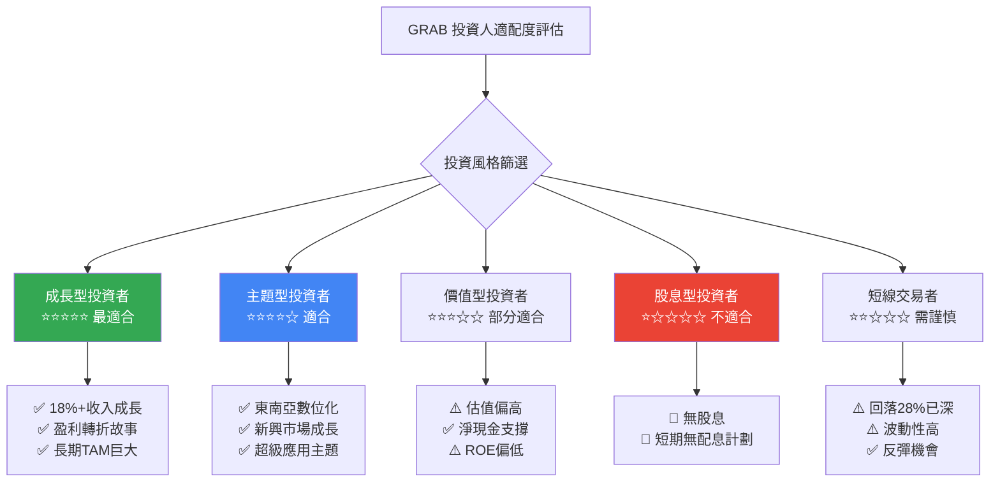

---

### 📋 建議持倉 & 操作策略

```
╔══════════════════════════════════════════════════════════════╗
║                     操作策略詳細指引                          ║
╠══════════════════════════════════════════════════════════════╣
║  📅 建議持倉時間：12-24 個月                                  ║
║  💼 建議倉位比例：2-5%（成長型投組）                          ║
║                                                              ║
║  ━━ 加碼觸發條件 ━━                                           ║
║  ✅ 股價跌至 $3.80 以下（估值更具吸引力）                      ║
║  ✅ Q4 2025 全年盈利超預期（>$0.07 EPS）                      ║
║  ✅ 宣布股票回購計劃 ≥$500M                                   ║
║  ✅ 金融服務收入佔比突破 25%                                   ║
║  ✅ 東南亞GDP成長數據超預期                                    ║
║                                                              ║
║  ━━ 止損觸發條件 ━━                                           ║
║  🔴 股價跌破 $3.36（52週低點支撐）                            ║
║  🔴 財報收入成長降至 <10%（成長故事破滅）                      ║
║  🔴 FCF再度轉負（盈利轉折失效）                               ║
║  🔴 主要市場監管重大負面措施                                   ║
║  🔴 競爭對手大規模補貼戰重啟                                   ║
╚══════════════════════════════════════════════════════════════╝
```

---

### ✅ 關鍵監控指標 Checklist

```
📊 季度監控指標 Checklist
─────────────────────────────────────────────────────────────

財務指標：
□ 月活躍用戶（MTU）季增是否 ≥3%
□ 收入 YoY 成長是否維持 ≥15%
□ 毛利率是否持續擴張（目標 45%+）
□ 營業利益率是否維持正值並改善
□ 金融服務收入成長率是否 ≥25%
□ FCF 是否保持正值（>$100M/季）

競爭態勢：
□ Sea Limited 外送服務擴張動態
□ GoTo 在印尼市場份額變化
□ 補貼活動強度是否升溫
□ 新進競爭者（Grab vs TikTok Shop）

監管環境：
□ 各國叫車/外送定價監管進展
□ GXS Bank 放貸限額監管調整
□ 數據隱私法規更新

資本市場信號：
□ 分析師目標價趨勢（上調/下調比）
□ 機構持股比例變化（目前65.2%）
□ 空頭比率變化（目前6.5%）
□ 管理層買賣超動態（Anthony Tan）

宏觀環境：
□ 東南亞主要市場GDP成長率
□ USD/SGD, USD/IDR 匯率走勢
□ 全球風險偏好指標（VIX）
□ 美聯儲利率政策方向
```

---

## 📌 完整評分總結

```
GRAB Holdings Limited — 最終評分卡
════════════════════════════════════════════════════════════
                                     評分    燈號    評分條
────────────────────────────────────────────────────────────
🚀 成長性 (Growth)                   7.5/10  🟢    ████████▓░
💰 獲利能力 (Profitability)          6.0/10  🟡    ██████░░░░
🏦 財務健康 (Financial Health)       7.5/10  🟢    ████████▓░
📐 估值合理性 (Valuation)            5.5/10  🟡    █████▓░░░░
🏰 競爭優勢 (Moat)                   7.0/10  🟢    ███████░░░
👔 管理品質 (Management)             6.5/10  🟡    ██████▓░░░
📈 價格動能 (Momentum)               6.0/10  🟡    ██████░░░░
⚠️ 風險控管 (Risk)                   5.5/10  🟡    █████▓░░░░
────────────────────────────────────────────────────────────
⭐ 綜合加權評分                      6.44/10 🟡    ██████▓░░░
════════════════════════════════════════════════════════════
最終投資建議：⭐⭐⭐⭐☆  【買入 BUY】
目標價：$6.20（基準）｜預期報酬：+46.9%｜持倉：12-24個月
════════════════════════════════════════════════════════════
```

---

> ### ⚠️ 免責聲明
> **本報告為 AI 自動生成之研究分析文件，僅供學術研究與參考用途，不構成任何投資建議、招攬或邀請。** 投資涉及風險，股票價格可升可跌，過去表現不代表未來結果。所有財務預測均基於公開資料推算，實際結果可能存在重大差異。讀者在作出任何投資決策前，應諮詢持牌專業財務顧問，並根據個人財務狀況、風險承受能力及投資目標作出獨立判斷。本報告之數據截至 2026-02-28，其後市場變化概不負責。