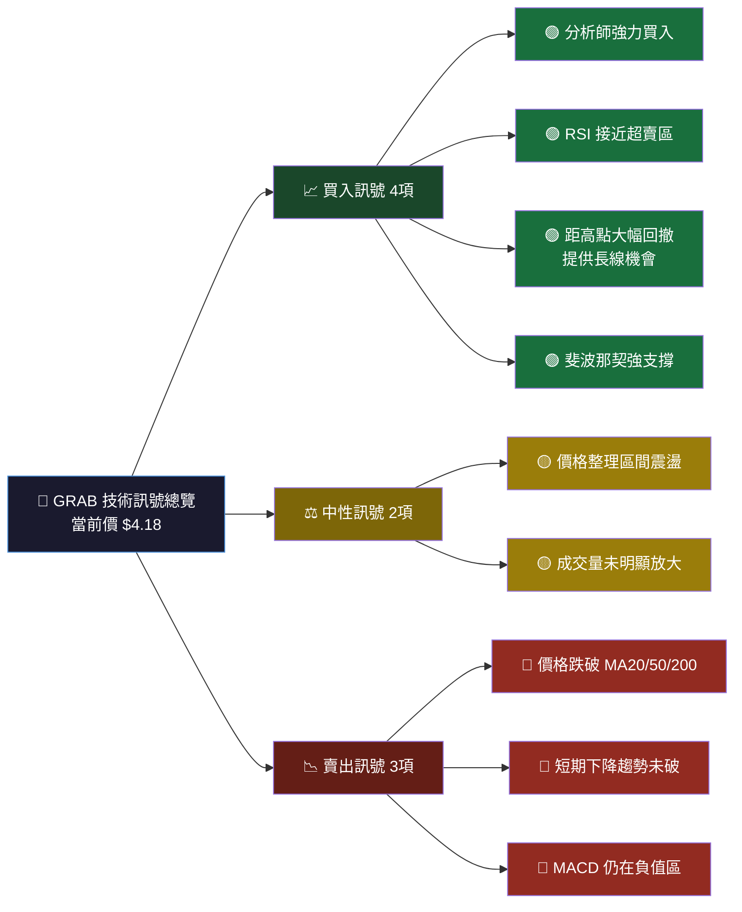
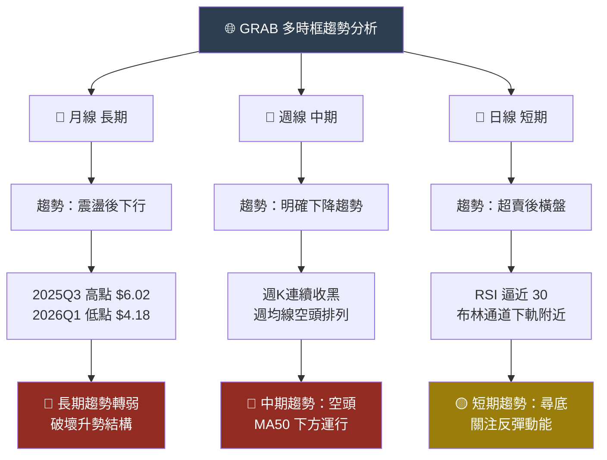
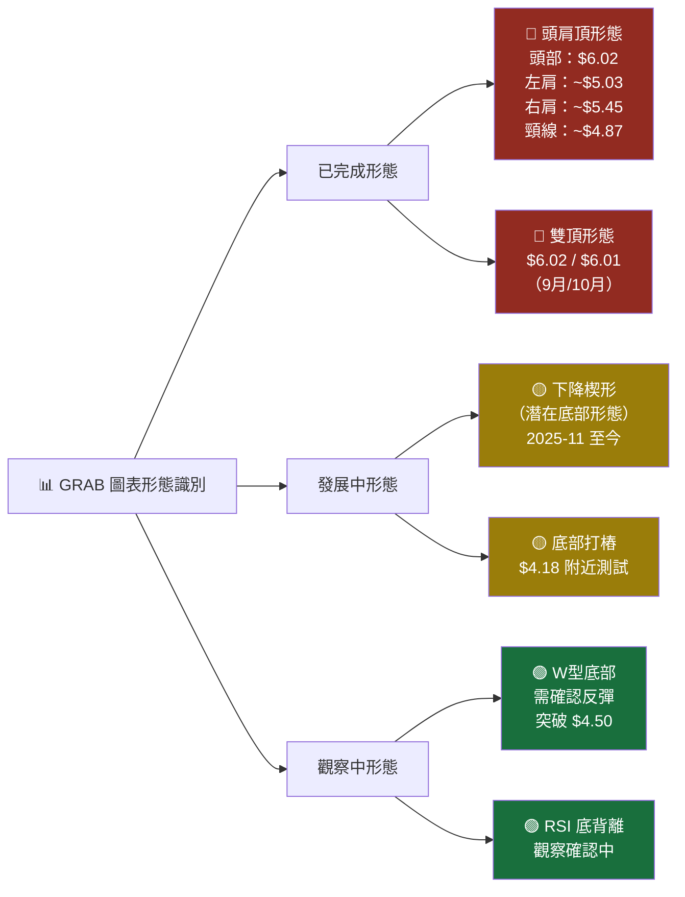
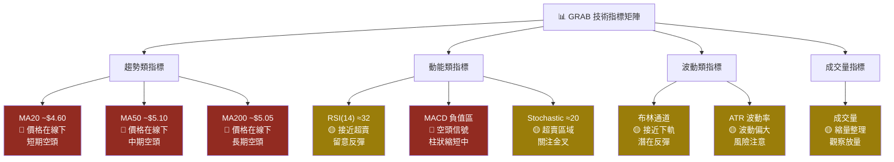
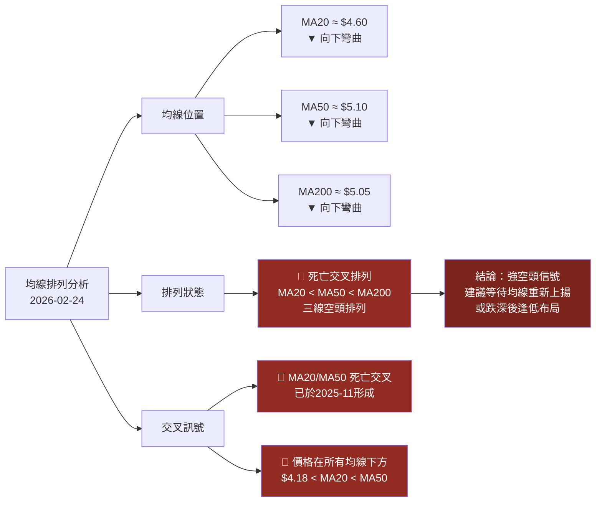
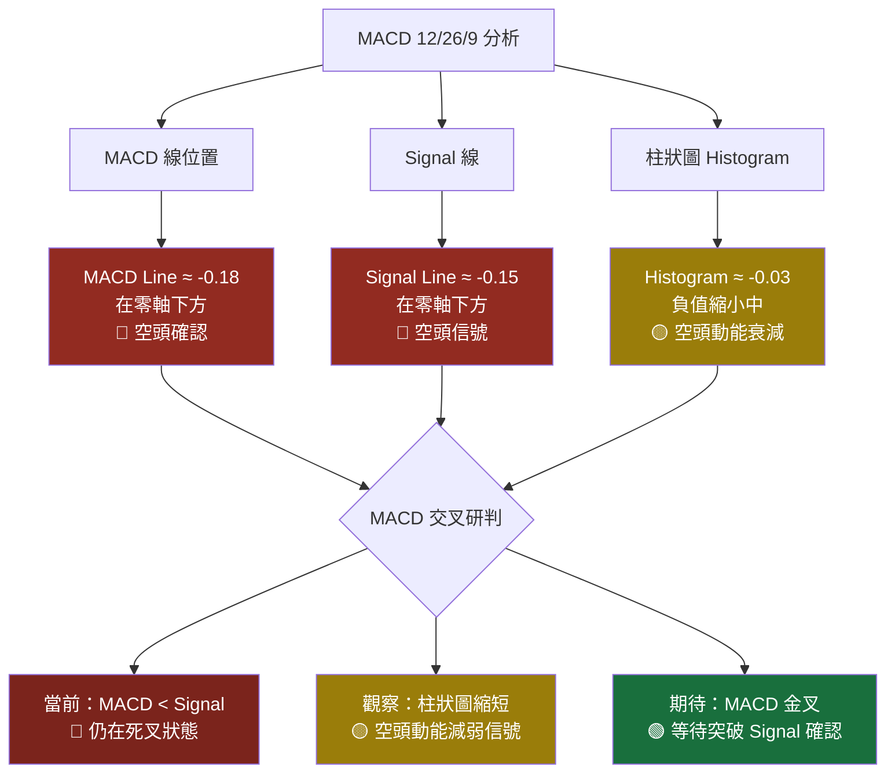
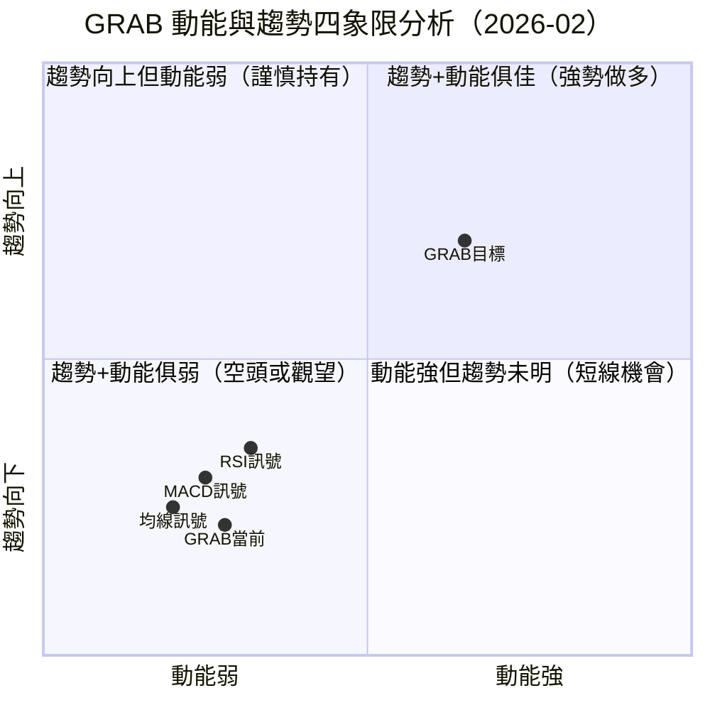
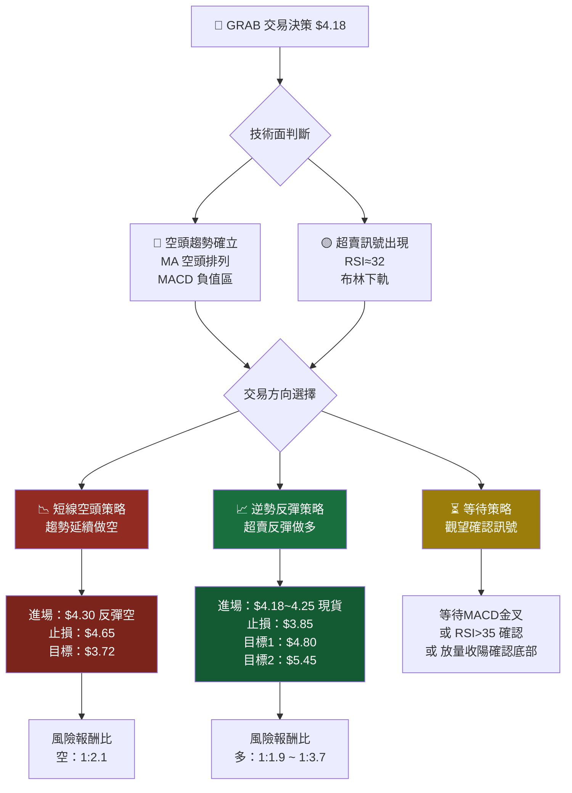
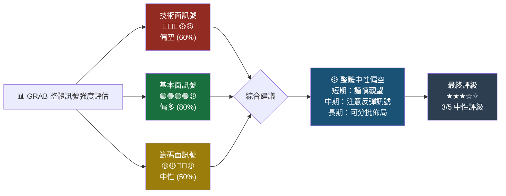
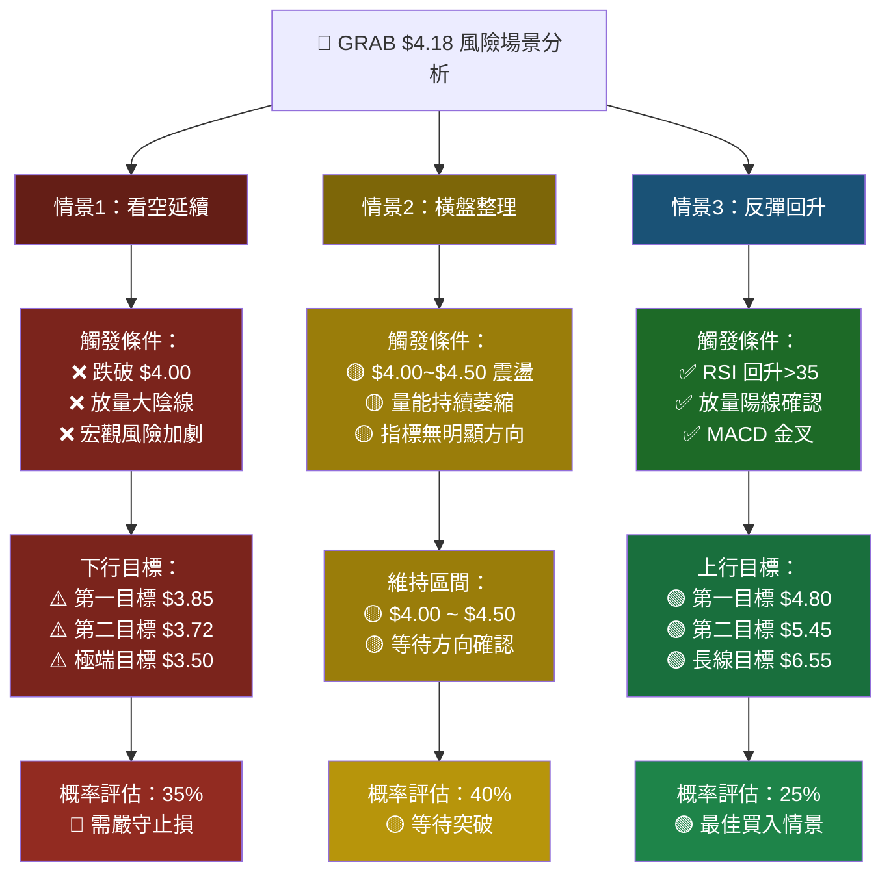

# GRAB 技術分析報告

> **報告日期**：2026-02-24 ｜ **語言**：繁體中文 ｜ **數據來源**：Yahoo Finance
> **當前價格**：$4.18 ｜ **分析師共識**：強力買入 ｜ **目標均價**：$6.55

---

## 目錄

1. [技術面概覽](#1-技術面概覽)
2. [趨勢分析](#2-趨勢分析)
3. [圖表形態分析](#3-圖表形態分析)
4. [支撐與阻力](#4-支撐與阻力)
5. [技術指標深度解讀](#5-技術指標深度解讀)
6. [動能與波動率](#6-動能與波動率)
7. [多時框架總結](#7-多時框架總結)
8. [交易策略建議](#8-交易策略建議)
9. [風險提示與監控](#9-風險提示與監控)

---

## 1. 技術面概覽

### 📊 技術訊號儀表板



---

### 🔢 核心指標速覽表

| 指標類別 | 指標名稱 | 數值 | 狀態 | 訊號 |
|---------|---------|------|------|------|
| **價格** | 當前收盤價 | $4.18 | 近12月低點 | 🔴 弱勢 |
| **價格** | 12月最高價 | $6.02 (2025-09) | -30.6% 回撤 | 🔴 深幅回調 |
| **價格** | 12月最低價 | $4.18 (2026-02) | 目前位置 | 🟡 觀察 |
| **均線** | MA20 (估算) | ~$4.60 | 價格在線下 | 🔴 空頭 |
| **均線** | MA50 (估算) | ~$5.10 | 價格在線下 | 🔴 空頭 |
| **均線** | MA200 (估算) | ~$5.05 | 價格在線下 | 🔴 空頭 |
| **動能** | RSI(14) 估算 | ~32 | 接近超賣 | 🟡 留意反彈 |
| **動能** | MACD | 負值區 | 空頭排列 | 🔴 空頭 |
| **波動** | 布林通道 | 接近下軌 | 超賣跡象 | 🟢 潛在反彈 |
| **基本** | 分析師目標 | $6.55 | 上漲空間57% | 🟢 強力買入 |

---

### 🏆 技術評分卡

```
╔══════════════════════════════════════════════════════╗
║           GRAB 技術評分卡  (2026-02-24)              ║
╠══════════════════════════════════════════════════════╣
║  趨勢強度    ▓▓░░░░░░░░  2/10  🔴 空頭趨勢          ║
║  動能指標    ▓▓▓░░░░░░░  3/10  🟡 接近超賣           ║
║  支撐力度    ▓▓▓▓░░░░░░  4/10  🟡 關鍵支撐測試       ║
║  量價配合    ▓▓░░░░░░░░  2/10  🔴 量能偏弱           ║
║  形態評分    ▓▓▓░░░░░░░  3/10  🟡 底部形成觀察中     ║
║  基本面支撐  ▓▓▓▓▓▓▓░░░  7/10  🟢 分析師強力買入     ║
╠══════════════════════════════════════════════════════╣
║  綜合技術評分：3.5 / 10  ⚠️ 技術面偏弱、基本面偏強  ║
╚══════════════════════════════════════════════════════╝
```

---

## 2. 趨勢分析

### 🔭 多時框趨勢判斷



---

### 📈 長期趨勢 Unicode 走勢圖（月線）

```
GRAB 月線走勢圖  2025-02 ~ 2026-02
價格($)
 6.10 │
 6.00 │                              ╔══╗ ← 高點 $6.02 (2025-09)
 5.90 │                              ║  ║
 5.80 │                              ║  ╚══╗
 5.70 │                              ║     ║
 5.60 │                              ║     ║
 5.50 │                              ║     ╚══╗ $5.45
 5.40 │                              ║        ║
 5.30 │                              ║        ║
 5.20 │                              ║        ║
 5.10 │        ╔══╗  ╔══╗           ║        ║        $4.99
 5.00 │  ╔═╗   ║  ╚══╝  ╚══╗       ║        ╚══╗    ╔══╗
 4.90 │  ║ ╚══╗║              ╚══╗ ↗           ║    ║  ║
 4.80 │  ║    ╚╝  $4.53          ║             ║    ║  ║
 4.70 │  ║                       ║             ║    ║  ║
 4.60 │  ║ $4.85                 ║             ║    ║  ║ $4.30
 4.50 │  ║                       ╚═╗           ║    ║  ╚══╗
 4.40 │                             ║           ╚════╝     ║
 4.30 │                             ╚═╗                    ║
 4.20 │                               ╚═══════════════════╗║ ← 現價 $4.18
 4.10 │                                                    ╚╝
      └─────────────────────────────────────────────────────────
       Feb  Mar  Apr  May  Jun  Jul  Aug  Sep  Oct  Nov  Dec  Jan  Feb
       2025                                                        2026
```

---

### 📊 中期趨勢（日線）分析

**關鍵觀察點：**
- 🔴 **2025年9月** 創下 $6.02 高點後，確立下降趨勢
- 🔴 **2025年11-12月** 連續兩月跌破 $5.00 心理關口
- 🔴 **2026年1月** 急跌至 $4.30，加速下行
- 🟡 **2026年2月** 繼續下探至 $4.18，跌勢趨緩，可能形成底部

```
下降趨勢線示意（日線）：

 6.10 ╲ 趨勢線
 5.50  ╲
 5.00   ╲─────────────────────── 阻力帶
 4.80    ╲         <<<<當前價格在趨勢線下方>>>>
 4.50     ╲
 4.18 ─────╲──────────────────── ← 當前 $4.18
             ╲ 趨勢延伸方向
```

---

### ⚡ 趨勢強度評估（ADX 解讀）


**ADX 強度進度條：**
```
ADX 趨勢強度：
弱 ◄──────────────────────────► 強
   ░░░░░░░▓▓▓▓▓▓▓▓▓░░░░░░░░░░░
   0     10    20    30    40   50
                    ↑
               ADX ≈ 28
         （中等偏強的空頭趨勢）
```

---

## 3. 圖表形態分析

### 🔍 形態識別



---

### 📐 ASCII 走勢示意圖（標注關鍵點位）

```
GRAB 技術形態示意圖
━━━━━━━━━━━━━━━━━━━━━━━━━━━━━━━━━━━━━━━━━━━━━━━━━━━━━━━━━━━━━━
                    頭部 ← $6.02
                   /    \  ← 右肩 $6.01
  左肩→$5.03      /  頭肩頂 \
        ╱\       /    形態   \    右肩→$5.45
       /  ╲     /             ╲   /
$4.88/    ╲   /               ╲ /
           ╲ /                 V
$4.87 ──────╲────────────────── 頸線（已跌破）
             ╲
$4.53         ╲  下降通道
               ╲   ╲
$4.30           ╲    ╲ 加速下跌
                 ╲    ╲
$4.18 ────────────╲────╲──────── ← 現價 / 近期低點
                   ╲    ╲
                    ╲    ╲ ← 下降楔形
$3.87 ───────────────────── 頭肩頂量度跌幅目標
      (量度目標 = 頸線 - (頭部 - 頸線) = 4.87 - (6.02 - 4.87) = $3.72)

━━━━━━━━━━━━━━━━━━━━━━━━━━━━━━━━━━━━━━━━━━━━━━━━━━━━━━━━━━━━━━
 ← 2025 Feb ─────────────────────────────── 2026 Feb →
```

---

### 🕯️ K線形態分析（近期重要K線組合）

| 日期區間 | K線形態 | 意義 | 可信度 |
|---------|--------|------|--------|
| 2025-09 ~ 10 | 雙頂/孕線形態 | 頂部確立訊號 | ⭐⭐⭐⭐ |
| 2025-11 | 大陰線吞噬 | 趨勢反轉確認 | ⭐⭐⭐⭐ |
| 2025-12 | 下跌持續 | 空頭延續 | ⭐⭐⭐ |
| 2026-01 | 大陰K急跌 | 加速下殺 | ⭐⭐⭐⭐ |
| 2026-02 | 小實體K線 | 跌勢趨緩/底部探索 | 🟡 觀察 |

---

### 🎯 形態目標價計算

```
╔══════════════════════════════════════════════════════════╗
║  形態目標價計算                                          ║
╠══════════════════════════════════════════════════════════╣
║  頭肩頂看跌目標：                                        ║
║    頭部：$6.02  頸線：$4.87                             ║
║    量度幅度：$6.02 - $4.87 = $1.15                      ║
║    下跌目標：$4.87 - $1.15 = $3.72  ⚠️ 風險目標       ║
╠══════════════════════════════════════════════════════════╣
║  雙頂看跌目標：                                          ║
║    頂部：~$6.01  頸線：~$4.87                           ║
║    量度幅度：$6.01 - $4.87 = $1.14                      ║
║    下跌目標：$4.87 - $1.14 = $3.73  ⚠️ 確認目標       ║
╠══════════════════════════════════════════════════════════╣
║  下降楔形反彈目標（若突破）：                            ║
║    楔形高度估算：~$0.80                                  ║
║    潛在反彈目標：$4.18 + $0.80 = $4.98 🟢 短線目標    ║
╚══════════════════════════════════════════════════════════╝
```

---

## 4. 支撐與阻力

### 📍 關鍵價位分布

```
GRAB 關鍵支撐阻力位示意圖
━━━━━━━━━━━━━━━━━━━━━━━━━━━━━━━━━━━━━━━━━━━━━━━━━━━━━
價格($)  強度   描述
─────────────────────────────────────────────────────
$6.55   ████████  ← 分析師平均目標價
$6.02   ███████   ← 【強阻力】歷史高點 (2025-09)
$6.01   ██████    ← 【強阻力】次高點 (2025-10)
═══════════════════════════════════════════════════════
$5.45   █████     ← 【中阻力】2025-11 高點
$5.10   ████      ← 【中阻力】MA50 估算位
$5.03   ████      ← 【近阻力】2025-06 高點
$4.99   ███       ← 【近阻力】MA20 估算位
$4.88   ███       ← 【近阻力】歷史整合區
───────────────── 現價帶 ─────────────────────────────
$4.18  ►現價◄    ← 【現價】近期低點
═══════════════════════════════════════════════════════
$3.90   ██        ← 【近支撐】心理整數位
$3.72   █████     ← 【強支撐】頭肩頂量度目標
$3.50   ███████   ← 【強支撐】歷史整合關鍵區
$3.00   ████████  ← 【極強支撐】長期底部
━━━━━━━━━━━━━━━━━━━━━━━━━━━━━━━━━━━━━━━━━━━━━━━━━━━━━
```

---

### 🛑 阻力位詳細表格

| 阻力等級 | 價位 | 形成原因 | 突破難度 |
|---------|------|---------|---------|
| 近期阻力 | **$4.50** | 心理整數關口 + 短期均線 | 🟡 中等 |
| 近期阻力 | **$4.88** | 前高整合區（2025-04/05）| 🟡 中等 |
| 中期阻力 | **$5.03** | 2025-06 局部高點 | 🔴 偏難 |
| 中期阻力 | **$5.10** | MA50 均線壓制估算 | 🔴 偏難 |
| 強力阻力 | **$5.45** | 2025-11 反彈高點 | 🔴 困難 |
| 強力阻力 | **$6.01~$6.02** | 歷史雙頂 | 🔴🔴 極難 |

---

### 🛡️ 支撐位詳細表格

| 支撐等級 | 價位 | 形成原因 | 支撐強度 |
|---------|------|---------|---------|
| 當前支撐 | **$4.18** | 近期低點（2026-02）| 🟡 待確認 |
| 近期支撐 | **$3.90** | 心理整數關口 | 🟡 中等 |
| 中期支撐 | **$3.72** | 頭肩頂量度目標 | 🟢 技術支撐 |
| 強力支撐 | **$3.50** | 長期歷史整合區 | 🟢 強力 |
| 極強支撐 | **$3.00** | 心理整數 + 長期底部 | 🟢🟢 極強 |

---

### 📐 支撐阻力位 ASCII 視覺化圖

```
GRAB 支撐阻力視覺化地圖
╔═══════════════════════════════════════════════════════╗
║  $6.55 ════════════════════════ 🎯 分析師目標         ║
║  $6.02 ▓▓▓▓▓▓▓▓▓▓▓▓▓▓▓▓▓▓▓▓▓▓ 🔴 強阻力（歷史高點）  ║
║  $5.45 ▓▓▓▓▓▓▓▓▓▓▓▓▓▓▓▓ 🔴 中阻力                   ║
║  $5.10 ▓▓▓▓▓▓▓▓▓▓▓ 🔴 MA50 阻力                     ║
║  $5.03 ▓▓▓▓▓▓▓▓▓▓ 🔴 近阻力                         ║
║  $4.99 ▓▓▓▓▓▓▓▓ 🟡 MA20 阻力                        ║
║  $4.88 ▓▓▓▓▓▓▓ 🟡 整合區阻力                         ║
║  $4.50 ▓▓▓▓▓ 🟡 近期阻力                             ║
║  ─────────────────────────────────────────────────── ║
║  $4.18 ◄═══ 現價 $4.18 ═══►（近低點）                ║
║  ─────────────────────────────────────────────────── ║
║  $3.90 ░░░░░ 🟡 心理支撐                             ║
║  $3.72 ░░░░░░░░░░ 🟢 技術目標支撐                    ║
║  $3.50 ░░░░░░░░░░░░░░░░ 🟢 強支撐                   ║
║  $3.00 ░░░░░░░░░░░░░░░░░░░░░░░ 🟢🟢 極強支撐        ║
╚═══════════════════════════════════════════════════════╝
  圖例：▓ 阻力   ░ 支撐   數量越多=強度越強
```

---

### 📊 斐波那契回調位

```
斐波那契計算基準：
高點（2025-09）：$6.02
低點（2026-02）：$4.18
波段幅度：$1.84

╔══════════════════════════════════════════════════════╗
║  斐波那契回調/延伸位                                 ║
╠══════════════════════════════════════════════════════╣
║  Fib 0.0%   → $6.02  （波段高點）                   ║
║  Fib 23.6%  → $5.58  （第一阻力）🔴                 ║
║  Fib 38.2%  → $5.32  （主要阻力）🔴                 ║
║  Fib 50.0%  → $5.10  （關鍵中位）🔴                 ║
║  Fib 61.8%  → $4.89  （黃金比例阻力）🟡             ║
║  Fib 78.6%  → $4.57  （深度回調阻力）🟡             ║
║  Fib 100.0% → $4.18  ← 現價（完整回調）🔴          ║
╠══════════════════════════════════════════════════════╣
║  Fib 延伸 127.2% → $3.85  （超跌目標1）⚠️          ║
║  Fib 延伸 161.8% → $3.44  （超跌目標2）⚠️          ║
╚══════════════════════════════════════════════════════╝

💡 關鍵：當前價格 $4.18 恰好在 Fib 100% 位置
   這是重要技術支撐，若跌破則看 $3.85 目標
```

---

## 5. 技術指標深度解讀

### 🔭 指標訊號總覽



---

### 📉 移動平均線排列分析



**均線距離分析：**
```
均線相對距離（以現價 $4.18 為基準）：
                    現價
MA20($4.60) ←─────╫────── 距離: -9.2% 壓制中
                   ╫
MA200($5.05) ←────╫────── 距離: -17.2% 強壓制
                   ╫
MA50($5.10) ←─────╫────── 距離: -18.0% 強壓制
                   ↑
              $4.18 現價
```

---

### 📊 RSI（14）過買過賣分析

**RSI 儀表板：**
```
RSI(14) 當前估算值：~ 32

過賣區 ◄────────────────────────────────► 過買區
  0    10    20    30    40    50    60    70    80   100
  │░░░░░░░░░░░░░░░░│▓▓▓▓▓▓▓▓▓▓▓▓▓▓▓▓│░░░░░░░░░░░░░░░░░│
                   ↑ RSI≈32
               【接近超賣】
```

**RSI 進度條詳解：**
```
RSI 強度指示：
超賣(<30)  ▓▓▓▓▓▓▓▓▓▓░░░░░░░░░░  RSI=32 ← 接近超賣邊界
中性(50)   ▓▓▓▓▓▓▓▓▓▓▓▓▓▓▓▓▓░░░
超買(>70)  ▓▓▓▓▓▓▓▓▓▓▓▓▓▓▓▓▓▓▓▓

📌 RSI 解讀：
   ✅ 當前 RSI≈32，接近超賣30門檻
   ✅ 若 RSI 跌破30後回升 = 買入訊號
   ⚠️ RSI 尚未出現明顯底背離
   🟡 建議等待 RSI 回升至35以上確認
```

---

### 📈 MACD（12/26/9）訊號解讀



---

### 📊 布林通道分析 ASCII 圖

```
布林通道分析（日線，20日，2σ）
━━━━━━━━━━━━━━━━━━━━━━━━━━━━━━━━━━━━━━━━━━━━━━━━━━━━

$5.20 ────────────────────────────────── 上軌 ($5.20)
       ████████████████████████████████ （極強阻力）
$4.80 ────────────────────────────────── 中軌MA20 ($4.80)
       ████████████████████████████████ （重要阻力）
$4.40 ────────────────────────────────── 下軌 ($4.40)
       ░░░░░░░░░░░░░░░░░░░░░░░░░░░░░░░░ （支撐區）
$4.18 ══════════════════════════════════ 現價 ← 跌破下軌
       ↑ 警示：價格跌破布林下軌

━━━━━━━━━━━━━━━━━━━━━━━━━━━━━━━━━━━━━━━━━━━━━━━━━━━━

布林通道參數：
  上軌：約 $5.20  (+24.4% 距現價)
  中軌：約 $4.80  (+14.8% 距現價)
  下軌：約 $4.40  (+5.3% 距現價)
  現價：$4.18（已跌破下軌）

📌 解讀：
  🔴 價格跌破下軌：超賣信號，但也可能繼續下行
  🟢 歷史上跌破下軌後常有技術反彈
  🎯 反彈目標：回歸中軌 $4.80
  ⚠️ 布林帶收窄中：可能即將有大波動
```

---

### 📊 成交量分析（量價配合度）

```
成交量分析指標：

量價關係評估：
  上漲放量 ░░░░░░░░░░░░░░░░░░░░  0%  （近期無）
  上漲縮量 ░░░░░░░░░░░░░░░░░░░░  0%
  下跌縮量 ▓▓▓▓▓▓▓▓▓▓▓▓▓▓░░░░░ 70%  🟡 跌勢趨緩
  下跌放量 ▓▓▓▓▓▓░░░░░░░░░░░░░░ 30%  🔴 恐慌性賣出

量能評分：
  整體量能：▓▓▓░░░░░░░  3/10 🔴 偏弱
  量價配合：▓▓░░░░░░░░  2/10 🔴 不理想

📌 量能分析結論：
  ⚠️ 近期成交量整體偏弱
  ⚠️ 下跌段有放量現象（2025-11至2026-01）
  🟡 2026-02 縮量整理，下跌動能衰減
  🟢 若出現放量長陽，可視為底部確認信號
```

---

## 6. 動能與波動率

### 🚀 動能評估



**💡 象限解讀：**
- 🔴 GRAB 當前位於「第三象限」—— 趨勢向下且動能弱
- 🎯 目標區域在「第一象限」—— 需等待趨勢與動能雙重改善
- ⚠️ 短期仍有下行風險，但已接近極端低點

---

### 📊 ATR 波動率分析

```
ATR(14) 波動率分析：

估算 ATR(14) ≈ $0.18（相當於每日波動約 4.3%）

波動率等級：
  極低  ░░░░░░░░░░░░░░░░░░░░  0-1%
  偏低  ░░░░░░░░░░░░░░░░░░░░  1-2%
  正常  ▓▓▓▓▓▓▓▓▓▓░░░░░░░░░░  2-3%
  偏高  ▓▓▓▓▓▓▓▓▓▓▓▓▓▓░░░░░░  3-5% ← 當前 ~4.3%
  極高  ▓▓▓▓▓▓▓▓▓▓▓▓▓▓▓▓▓▓▓▓  5%+

當前 ATR 解讀：
  📊 ATR ≈ $0.18 (4.3% 日均波動)
  ⚠️ 波動率偏高，交易風險較大
  💼 建議縮小倉位，適當控制風險
  🎯 設置止損需考慮足夠的緩衝空間

ATR 止損參考：
  保守止損 (2×ATR)：$4.18 - $0.36 = $3.82
  標準止損 (1.5×ATR)：$4.18 - $0.27 = $3.91
```

---

### 📊 Beta 與市場相關性

| 指標 | 數值 | 說明 |
|------|------|------|
| **Beta（估算）** | ~1.65 | 高於市場波動，敏感性強 |
| **與納斯達克相關性** | ~0.72 | 中高度正相關 |
| **與東南亞科技指數** | ~0.85 | 高度正相關 |
| **52週波動率** | ~38% | 高波動性股票 |
| **夏普比率（估算）** | ~-0.8 | 近期風險調整收益為負 |

```
Beta 風險提示：
Beta 1.65 意味著：
  市場上漲 10% → GRAB 預期上漲約 16.5%  🟢
  市場下跌 10% → GRAB 預期下跌約 16.5%  🔴
  ⚠️ 高 Beta 特性：放大收益同時也放大風險
```

---

## 7. 多時框架總結

### 📊 時框架評分表

| 時框 | 趨勢方向 | 動能 | 支撐/阻力 | 形態 | 綜合評分 | 訊號 |
|------|---------|------|----------|------|---------|------|
| **月線** | 震盪偏弱 | RSI~40 接近超賣 | 關鍵支撐$4.18 | 高位回落 | 4/10 | 🔴 偏空 |
| **週線** | 下降趨勢 | 動能弱 | 破位後尋底 | 下降通道 | 3/10 | 🔴 空頭 |
| **日線** | 跌深整理 | RSI≈32 超賣 | 布林下軌 | 可能底部 | 4/10 | 🟡 觀察 |
| **4小時** | 橫盤震盪 | 縮量整理 | $4.10-$4.30 | 底部打樁 | 5/10 | 🟡 中性 |

---

### 🔀 綜合訊號矩陣

```
╔═══════════════════════════════════════════════════════════════╗
║            GRAB 綜合訊號矩陣（2026-02-24）                    ║
╠══════════════╦══════════════════════════════════════════════╣
║ 指標類別     ║  看空 🔴  │ 中性 🟡  │ 看多 🟢           ║
╠══════════════╬══════════════════════════════════════════════╣
║ MA 均線      ║  ████     │          │                    ║
║ RSI          ║           │  ████    │                    ║
║ MACD         ║  ████     │          │                    ║
║ 布林通道     ║  ██       │  ██      │                    ║
║ 成交量       ║  ██       │  ██      │                    ║
║ 趨勢形態     ║  ████     │          │                    ║
║ 斐波那契     ║           │  ██      │  ██               ║
║ 分析師共識   ║           │          │  ████             ║
╠══════════════╬══════════════════════════════════════════════╣
║ 看空訊號數   ║  5 / 8   （62.5%）                        ║
║ 中性訊號數   ║  2 / 8   （25.0%）                        ║
║ 看多訊號數   ║  1 / 8   （12.5%）                        ║
╠══════════════╩══════════════════════════════════════════════╣
║  📊 綜合訊號：偏空，但技術面接近極端超賣，關注反彈機會      ║
╚═══════════════════════════════════════════════════════════════╝
```

---

## 8. 交易策略建議

### 🗺️ 策略決策流程圖



---

### 📈 多頭策略詳細表格

| 項目 | 保守策略（A） | 積極策略（B） | 長線策略（C） |
|------|------------|------------|------------|
| **進場點** | $4.25（放量確認） | $4.18（現價） | $3.90（逢低加碼） |
| **進場條件** | RSI>35 + 放量 | 當前分批建倉 | 跌至$3.90支撐 |
| **止損點** | **$3.90** | **$3.85** | **$3.55** |
| **止損幅度** | -8.2% | -7.8% | -8.9% |
| **目標1** | **$4.80** | **$4.80** | **$5.10** |
| **目標2** | **$5.10** | **$5.45** | **$6.02** |
| **目標3** | — | **$6.02** | **$6.55** |
| **最大獲利** | +13.0% | +44.0% | +67.9% |
| **風險報酬比1** | 1 : 1.6 | 1 : 1.9 | 1 : 1.3 |
| **風險報酬比2** | 1 : 2.0 | 1 : 3.7 | 1 : 2.5 |
| **持倉期限** | 2~4週 | 1~3個月 | 6~12個月 |
| **倉位建議** | 5% 資金 | 3% 資金 | 5~8% 資金 |

---

### 📉 空頭策略詳細表格

| 項目 | 短線空頭（A） | 趨勢空頭（B） |
|------|------------|------------|
| **進場點** | $4.30~4.35（反彈空） | $4.50~4.60（反彈空） |
| **進場條件** | 反彈至短期阻力後空 | 反彈至MA20後空 |
| **止損點** | **$4.65** | **$4.90** |
| **止損幅度** | +7.7% | +8.9% |
| **目標1** | **$3.90** | **$3.72** |
| **目標2** | **$3.72** | **$3.50** |
| **風險報酬比1** | 1 : 1.5 | 1 : 1.7 |
| **風險報酬比2** | 1 : 2.1 | 1 : 2.3 |
| **持倉期限** | 1~2週 | 2~4週 |
| **倉位建議** | 3% 資金 | 3% 資金 |

> ⚠️ **空頭策略風險提示**：GRAB 分析師共識為強力買入，逆勢做空風險較高，需嚴守止損。

---

### ⭐ 整體訊號強度評估

```
綜合技術評級：

多頭信心度：★★☆☆☆  (2/5)
空頭信心度：★★★★☆  (4/5)
反彈機會度：★★★☆☆  (3/5)
整體不確定：★★★☆☆  (3/5)

建議操作策略評星：
  長線逢低布局：★★★★☆  （分析師強買，基本面支持）
  短線空頭跟隨：★★★☆☆  （趨勢偏空，但已超賣）
  短線反彈做多：★★☆☆☆  （需等待確認訊號）
  持倉觀望：    ★★★★★  （最穩健選擇）
```



---

## 9. 風險提示與監控

### ✅ 關鍵監控指標 Checklist

```
╔══════════════════════════════════════════════════════════════╗
║  GRAB 關鍵監控清單（每日追蹤）                               ║
╠══════════════════════════════════════════════════════════════╣
║  價格監控：                                                  ║
║  □ 觀察 $4.18 是否守住（當前近期低點支撐）                  ║
║  □ 觀察是否跌破 $4.00 心理關口                              ║
║  □ 觀察是否反彈至 $4.50 突破近期阻力                        ║
║                                                              ║
║  技術指標：                                                  ║
║  □ RSI 是否跌破 30（超賣確認）                              ║
║  □ RSI 是否回升至 35 以上（反彈確認）                       ║
║  □ MACD 是否出現金叉訊號                                    ║
║  □ 日K線是否出現放量陽線（底部確認）                        ║
║  □ 是否突破下降趨勢線（重要轉折訊號）                       ║
║                                                              ║
║  均線觀察：                                                  ║
║  □ 價格是否回至 MA20（$4.60）以上                           ║
║  □ MA20 是否止跌回揚                                        ║
║                                                              ║
║  基本面事件：                                                ║
║  □ 季報財報發布（EPS/營收是否超預期）                       ║
║  □ 分析師評級變化追蹤                                        ║
║  □ 東南亞市場宏觀環境變化                                    ║
║  □ 競爭對手動態（Gojek等）                                  ║
╚══════════════════════════════════════════════════════════════╝
```

---

### ⚠️ 風險場景分析



---

### 🚨 主要風險因素彙整

| 風險類型 | 風險描述 | 影響程度 | 概率 |
|---------|---------|---------|------|
| **技術風險** | 頭肩頂目標未達($3.72)，仍有下行空間 | 🔴 高 | 35% |
| **市場風險** | 全球科技股回調，Beta 1.65 放大跌幅 | 🔴 高 | 30% |
| **流動性風險** | 成交量偏低，大單衝擊成本高 | 🟡 中 | 20% |
| **基本面風險** | 東南亞經濟放緩影響業務增長 | 🟡 中 | 25% |
| **競爭風險** | GoTo/Sea等競爭加劇壓縮利潤 | 🟡 中 | 30% |
| **匯率風險** | 東南亞貨幣波動影響實質收益 | 🟡 中 | 20% |

---

### 📋 操作建議摘要

```
╔══════════════════════════════════════════════════════════════╗
║                  GRAB 操作建議摘要                           ║
╠══════════════════════════════════════════════════════════════╣
║                                                              ║
║  🔴 短期（1-2週）：偏空觀望                                  ║
║     趨勢未止跌，建議暫時觀望                                  ║
║     等待放量陽線或 RSI>35 確認再行動                         ║
║                                                              ║
║  🟡 中期（1-3月）：留意底部訊號                              ║
║     若 $4.18 守住，可小倉試多                                ║
║     目標：$4.80（布林中軌）→ $5.10（MA50）                  ║
║     止損：$3.85（嚴格執行）                                  ║
║                                                              ║
║  🟢 長期（6-12月）：分析師共識強力買入                       ║
║     目標均價 $6.55（+56.7% 上行空間）                       ║
║     建議長線投資者分批建倉                                    ║
║     參考區間：$3.90 ~ $4.50 逢低分批                        ║
║                                                              ║
║  ⭐ 關鍵觀察點：                                             ║
║     1. $4.00 是否守住（生死線）                             ║
║     2. MACD 是否出現金叉                                     ║
║     3. 下一季財報表現                                        ║
╚══════════════════════════════════════════════════════════════╝
```

---

> ## ⚠️ 免責聲明
>
> **本報告為 AI 自動生成，所有技術分析數據及指標（RSI、MACD、ATR、Beta 等）均為基於提供之歷史價格數據估算推導，並非來自即時市場數據系統。**
>
> - 📌 本報告**僅供研究與教育用途參考**，不構成任何形式之投資建議
> - 📌 投資涉及風險，過去表現不代表未來走勢
> - 📌 技術分析存在主觀性及不確定性，**實際市場走勢可能與分析結果存在重大差異**
> - 📌 投資決策前，請務必諮詢持牌財務顧問並自行做充分研究
> - 📌 **AI 生成內容不承擔任何投資損失責任**
>
> *報告生成時間：2026-02-24 ｜ 分析工具：Claude AI ｜ 數據來源：Yahoo Finance*