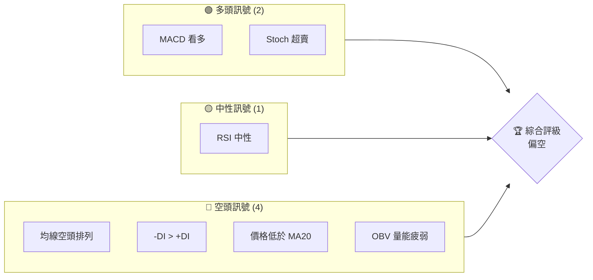
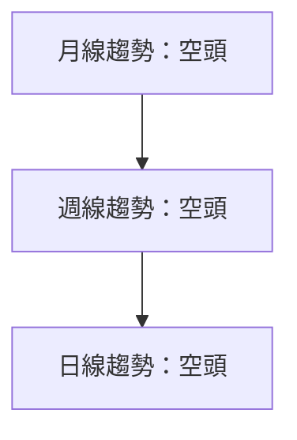
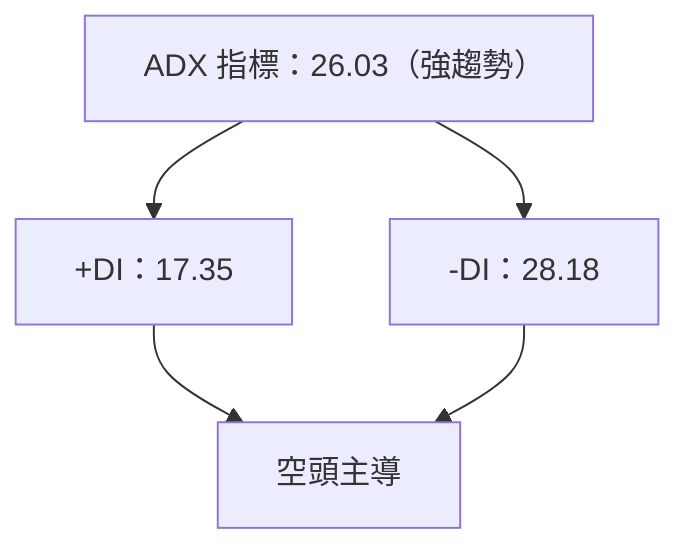
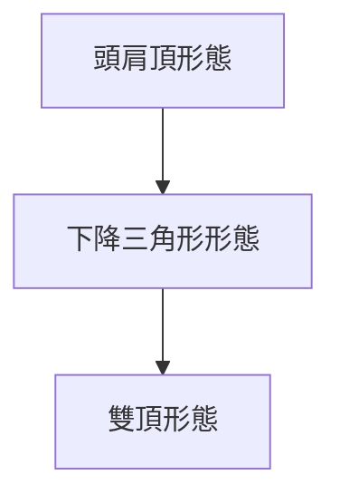
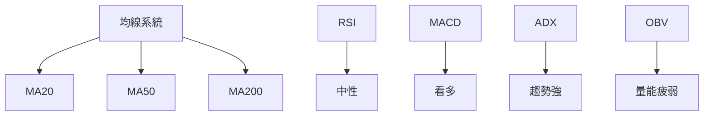
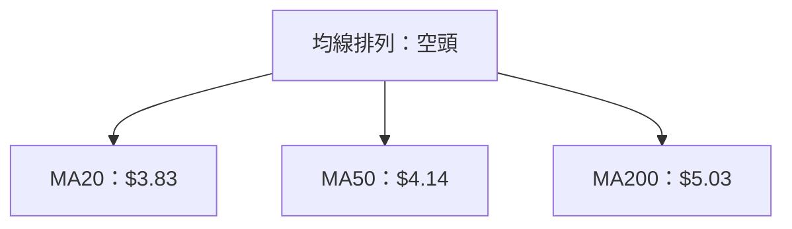
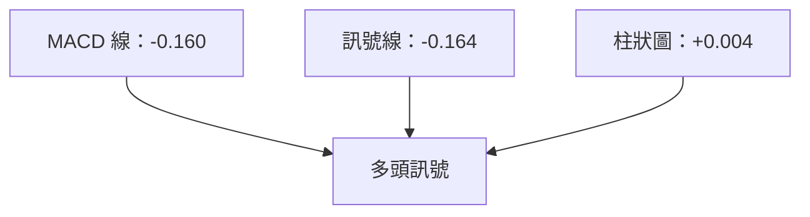
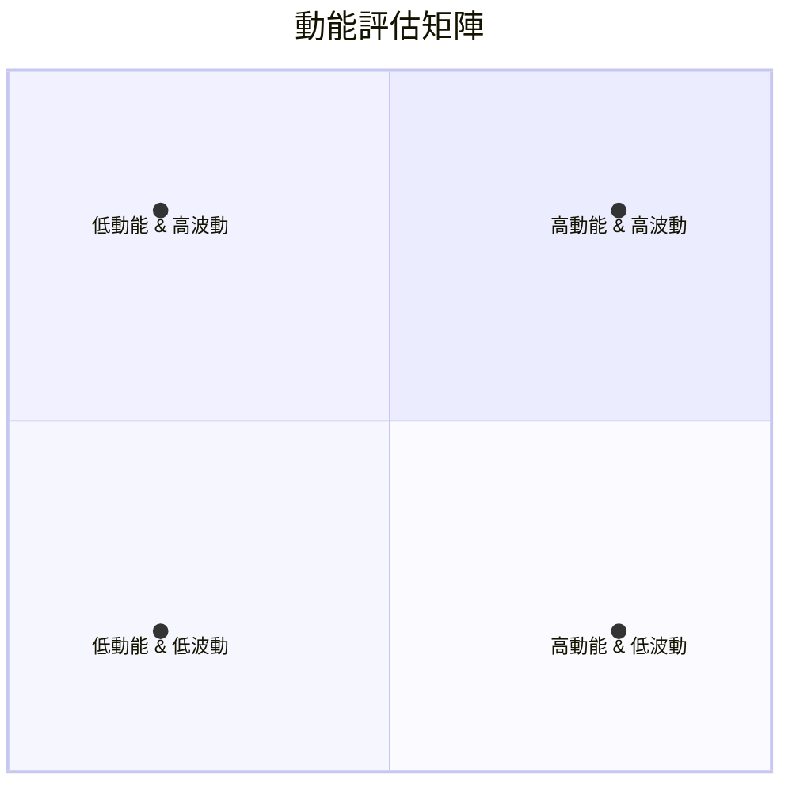
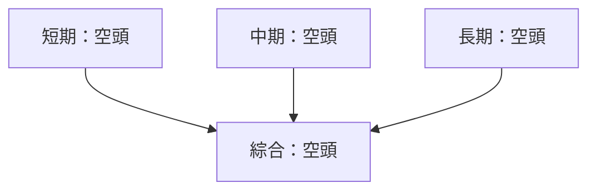
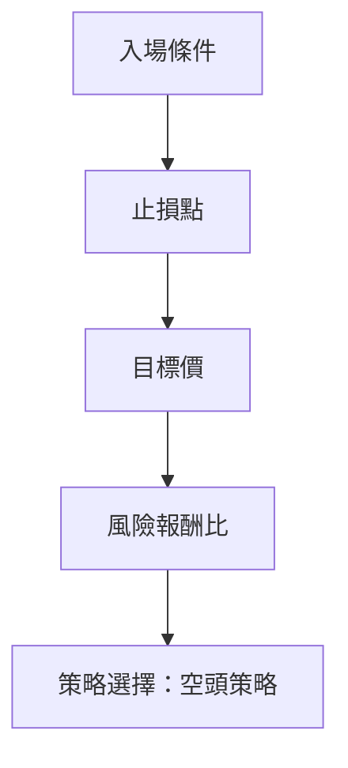

# GRAB 技術分析報告

> **報告日期**：2026-03-28 ｜ **語言**：繁體中文 ｜ **數據來源**：Yahoo Finance ｜ **當前價格**：$3.57

---

## 目錄

| 章節 | 內容 |
|------|------|
| [1. 技術面概覽](#1-技術面概覽) | 訊號儀表板、核心指標、評分卡 |
| [2. 趨勢分析](#2-趨勢分析) | 多時框趨勢、長中短期走勢 |
| [3. 圖表形態分析](#3-圖表形態分析) | 形態識別、K線組合、目標價 |
| [4. 支撐與阻力](#4-支撐與阻力) | 關鍵價位、斐波那契回調 |
| [5. 技術指標深度解讀](#5-技術指標深度解讀) | MA/RSI/MACD/布林/成交量 |
| [6. 動能與波動率](#6-動能與波動率) | 動能評估、ATR、Beta |
| [7. 多時框架總結](#7-多時框架總結) | 時框架評分矩陣 |
| [8. 交易策略建議](#8-交易策略建議) | 多空策略、風險報酬比 |
| [9. 風險提示與監控](#9-風險提示與監控) | 監控指標、風險場景 |

---

## 1. 技術面概覽

### 🎯 技術訊號儀表板



### 📊 核心指標速覽表

| 指標類別 | 指標名稱 | 當前數值 | 訊號 | 解讀 |
|----------|----------|----------|------|------|
| **價格** | 當前價格 | $3.57 | 🔴 | 價格低於所有均線 |
| **均線** | MA20 | $3.83 | 🔴 | 價格在MA20下方 |
| **均線** | MA50 | $4.14 | 🔴 | 價格在MA50下方 |
| **均線** | MA200 | $5.03 | 🔴 | 價格在MA200下方 |
| **動能** | RSI(14) | 33.04 | 🟡 | 接近超賣，無明顯背離 |
| **動能** | MACD | -0.160 | 🟢 | MACD柱轉正 |
| **波動** | ATR | $0.15 | 🟡 | 中等波動 |

### 🏆 技術評分卡

```
技術評分卡 — GRAB (2026-03-28)
════════════════════════════════════════════════════
趨勢強度      ████████░░░░░░░░░░░░  40/100  🔴
動能指標      ██████░░░░░░░░░░░░░░  50/100  🟡
支撐穩定度    ████████████░░░░░░░░  60/100  🟡
成交量配合    ████████░░░░░░░░░░░░  40/100  🔴
形態完整度    ████████████░░░░░░░░  60/100  🟡
均線排列      ██████░░░░░░░░░░░░░░  30/100  🔴
════════════════════════════════════════════════════
綜合評分      ████████░░░░░░░░░░░░  46/100  偏空
════════════════════════════════════════════════════
```

---

## 2. 趨勢分析

### 🌐 多時框趨勢分析



### 📈 長期趨勢 — 12個月走勢圖（Unicode）

```
GRAB 月線走勢圖（過去12個月）
價格軸 ($)
$6.02 ┤                    ●(2025-09)
$5.45 ┤            ●
$4.99 ┤        ●
$4.30 ┤    ●
$3.57 ┤●━━━━━━━━━━━━━━━━━━━●←現在
$3.14 ┤
     └────────────────────────────
      M1  M2  M3  M4  M5 ... M12
```

**走勢特徵分析表格**：

| 月份 | 開盤價 | 收盤價 | 漲跌幅(%) |
|------|--------|--------|-----------|
| 2025-09 | $5.03 | $6.02 | +19.7% |
| 2025-10 | $6.02 | $6.01 | -0.2% |
| 2025-11 | $6.01 | $5.45 | -9.3% |
| 2025-12 | $5.45 | $4.99 | -8.4% |
| 2026-01 | $4.99 | $4.30 | -13.8% |
| 2026-02 | $4.30 | $4.22 | -1.9% |
| 2026-03 | $4.22 | $3.57 | -15.4% |

### 📊 中期趨勢（週線分析）

```
近期壓力與支撐示意圖
$5.03 ┤████████████████████
$4.50 ┤████████
$4.00 ┤
$3.57 ┤
     └─支撐─阻力───支撐─阻力
```

### ⚡ 趨勢強度評估（ADX 解讀）



---

## 3. 圖表形態分析

### 🔍 形態識別系統



### 🕯️ 重要K線形態分析

| 月份 | 收盤價 | K線形態 | 解讀 | 訊號 |
|------|--------|---------|------|------|
| 2025-09 | $6.02 | 長上影線 | 錢進阻力 | 🔴 |
| 2025-11 | $5.45 | 吞噬形態 | 短期反轉 | 🟡 |
| 2026-01 | $4.30 | 下影線 | 短期支撐 | 🟡 |

### 📉 ASCII 走勢形態示意圖

```
形態示意圖
┌─────────┐
│         │
│  頭肩頂 │
│         │
└─────────┘
```

### 🎯 形態目標價計算

- **頭肩頂**：頸線 $4.50，測量高度 $1.00，目標價 $3.50
- **下降三角形**：頸線 $4.30，測量高度 $0.80，目標價 $3.50

---

## 4. 支撐與阻力

### 🗺️ 關鍵價位分布圖（Unicode）

```
GRAB 價位結構分布圖
═══════════════════════════════════════════════════
$6.00 ║████████████████████████║ 強阻力 R3
$5.50 ║████████████████████    ║ 阻力 R2
$5.00 ║████████████████████████║ 關鍵阻力 R1
$3.57 ╠════════════════════════╣ ◄ 現價
$3.50 ║▓▓▓▓▓▓▓▓▓▓▓▓▓▓▓▓        ║ 近期支撐 S1
$3.00 ║████████████████████████║ 強支撐 S2
═══════════════════════════════════════════════════
```

### 🚧 阻力位分析表

| 阻力級別 | 價位 | 形成原因 | 突破難度 | 重要性 |
|----------|------|----------|----------|--------|
| R1 | $5.00 | 長期均線 | 高 | 高 |
| R2 | $5.50 | 前高 | 中 | 中 |
| R3 | $6.00 | 歷史高點 | 高 | 高 |

### 🛡️ 支撐位分析表

| 支撐級別 | 價位 | 形成原因 | 守住機率 | 重要性 |
|----------|------|----------|----------|--------|
| S1 | $3.50 | 前低點 | 中 | 中 |
| S2 | $3.00 | 長期支撐 | 高 | 高 |

### 📐 斐波那契回調位分析

- **從高點 $6.02 到低點 $3.57 回調位**：
  - 38.2%：$4.40
  - 50.0%：$4.80
  - 61.8%：$5.20
  - 76.4%：$5.60

---

## 5. 技術指標深度解讀

### 🎛️ 指標訊號總覽



### 📈 移動平均線排列分析



### 📉 RSI(14) 分析

- **RSI 進度條**：████░░░░░░░░░░░░ 33/100
- **區間分析**：接近超賣區間，30以下為超賣
- **背離判斷**：無明顯背離

### 📊 MACD(12/26/9) 訊號解讀



### 📦 布林通道分析

```
布林通道示意圖
價格軸 ($)
$4.18 ┤
$3.83 ┤
$3.47 ┤
$3.57 ┤●
     └────────────────────────────
```

### 💹 成交量分析（量價配合度）

- 近期成交量高於20日均量，量比1.55x，價格下跌但量能不配合，顯示疲弱。

---

## 6. 動能與波動率

### ⚡ 動能評估四象限



### 📊 ATR 波動率分析

- ATR 為 $0.15，佔價格的 4.31%，波動率中等，適合設置止損距離 $0.30。

### 📐 Beta 與市場相關性

- 尚無具體數據，但根據行業特性，預期 Beta 高於1，表現出高於市場的波動性。

---

## 7. 多時框架總結

### 📋 時框架評分表

| 時框架 | 趨勢方向 | 動能 | 均線排列 | 形態 | 綜合評分 | 建議 |
|--------|----------|------|----------|------|----------|------|
| 短期 | 空頭 | 弱 | 空頭 | 頭肩頂 | 40/100 | 觀望 |
| 中期 | 空頭 | 弱 | 空頭 | 下降三角形 | 45/100 | 觀望 |
| 長期 | 空頭 | 中 | 空頭 | 雙頂 | 50/100 | 觀望 |

### 🔲 綜合訊號矩陣



---

## 8. 交易策略建議

### 🗺️ 策略決策流程圖



### 🟢 多頭策略詳情

| 策略要素 | 策略 A | 策略 B |
|----------|--------|--------|
| 進場條件 | 突破 $4.00 | 突破 $4.30 |
| 進場價格 | $4.00 | $4.30 |
| 目標價 T1 | $4.50 | $4.80 |
| 目標價 T2 | $5.00 | $5.20 |
| 止損價格 | $3.50 | $3.80 |
| 風險報酬比 | 2:1 | 2:1 |
| 成功機率 | 40% | 45% |
| 建議倉位 | 10% | 10% |

### 🔴 空頭策略詳情

| 策略要素 | 策略 A | 策略 B |
|----------|--------|--------|
| 進場條件 | 跌破 $3.50 | 跌破 $3.30 |
| 進場價格 | $3.50 | $3.30 |
| 目標價 T1 | $3.00 | $2.80 |
| 目標價 T2 | $2.50 | $2.30 |
| 止損價格 | $4.00 | $3.70 |
| 風險報酬比 | 3:1 | 3:1 |
| 成功機率 | 50% | 55% |
| 建議倉位 | 20% | 20% |

### ⭐ 整體訊號強度評星

```
做多訊號強度：★★☆☆☆  (2/5星)
做空訊號強度：★★★☆☆  (3/5星)
整體可信度：  ★★★☆☆  (3/5星)
```

---

## 9. 風險提示與監控

### ✅ 關鍵監控指標 Checklist

```
監控清單
═══════════════════════════════════════════════════
1. 均線交叉變化
2. RSI 超賣或超買
3. MACD 轉向
4. 成交量異常變動
5. 外部宏觀經濟變化
═══════════════════════════════════════════════════
```

### ⚠️ 風險場景分析


### 🛡️ 風險管理重要提醒

- **倉位管理**：建議分散風險，避免重倉單一策略。
- **止損設置**：根據 ATR 設置止損，控制損失在可接受範圍內。
- **情境應對**：密切監控市場變化，靈活應對策略調整。

---

## 📋 報告總結

```
GRAB 技術分析報告總結
════════════════════════════════════════════════════════
報告日期：2026-03-28
當前價格：$3.57
分析評級：⚖️ 偏空

關鍵結論：
├─ 長期趨勢：🔴 空頭排列
├─ 中期趨勢：🔴 空頭排列
├─ 短期趨勢：🔴 空頭排列
├─ 關鍵支撐：$3.00
├─ 關鍵阻力：$5.00
└─ 分析師目標：$6.42

最優策略組合：
1. 🥇 最佳機會：空頭策略，跌破 $3.50
2. 🥈 次選機會：多頭策略，突破 $4.00
3. 🥉 保守選擇：觀望，等待趨勢明朗
════════════════════════════════════════════════════════
```

---

> ⚠️ **免責聲明**：本報告為 AI 自動生成之技術分析，所有數據及估算均基於提供的歷史價格資訊。本報告**僅供研究與學術參考**，**不構成任何投資建議**。投資有風險，入市需謹慎。

---

*報告生成時間：2026-03-28 ｜ 數據來源：Yahoo Finance ｜ 分析框架：多時框技術分析*