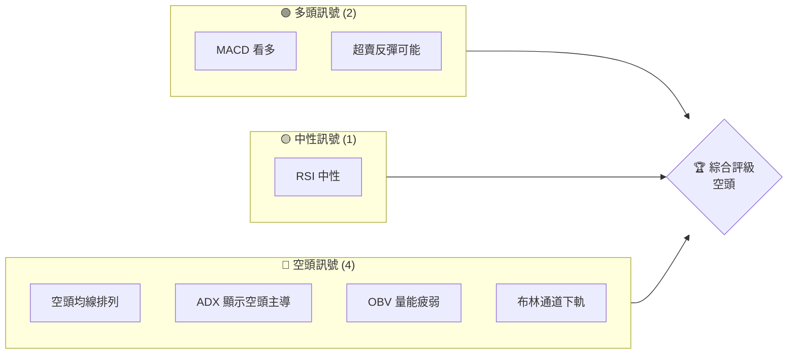
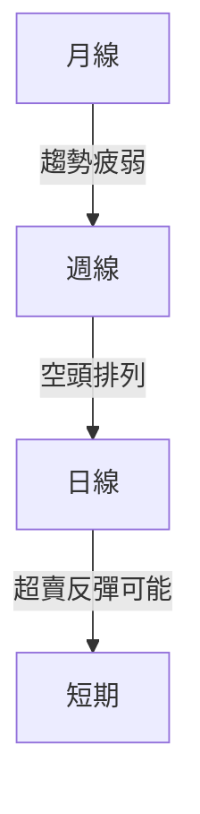
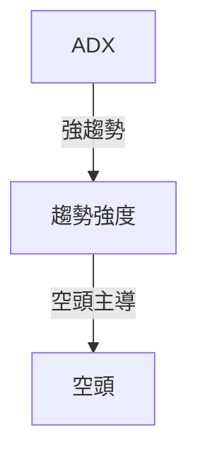
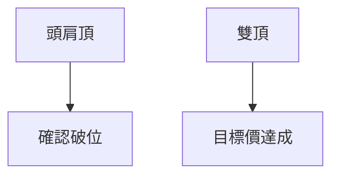
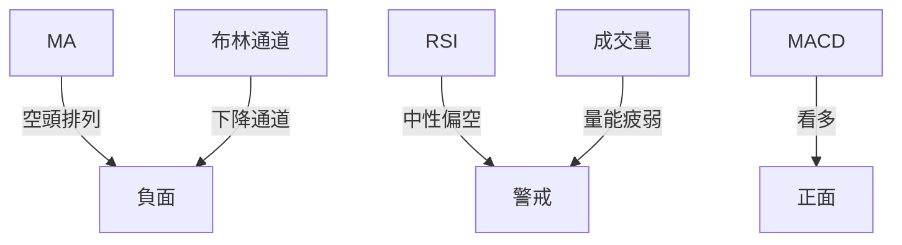
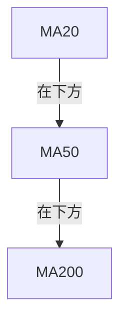
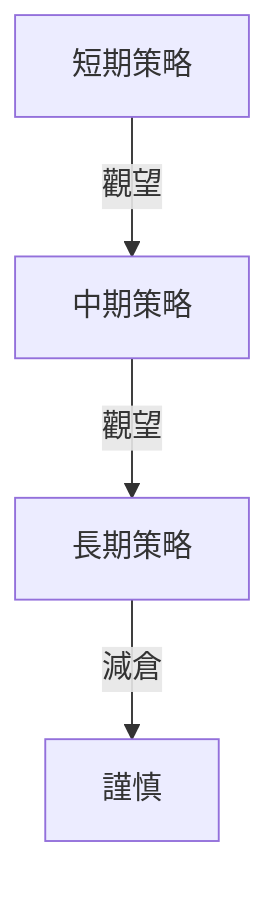
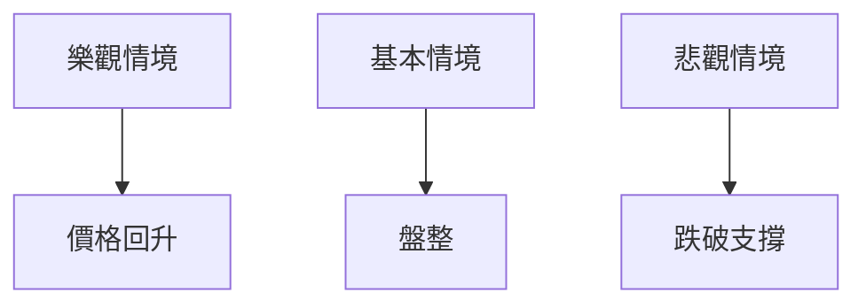

# GRAB 技術分析報告

> **報告日期**：2026-03-29 ｜ **語言**：繁體中文 ｜ **數據來源**：Yahoo Finance ｜ **當前價格**：$3.57

---

## 目錄

| 章節 | 內容 |
|------|------|
| [1. 技術面概覽](#1-技術面概覽) | 訊號儀表板、核心指標、評分卡 |
| [2. 趨勢分析](#2-趨勢分析) | 多時框趨勢、長中短期走勢 |
| [3. 圖表形態分析](#3-圖表形態分析) | 形態識別、K線組合、目標價 |
| [4. 支撐與阻力](#4-支撐與阻力) | 關鍵價位、斐波那契回調 |
| [5. 技術指標深度解讀](#5-技術指標深度解讀) | MA/RSI/MACD/布林/成交量 |
| [6. 動能與波動率](#6-動能與波動率) | 動能評估、ATR、Beta |
| [7. 多時框架總結](#7-多時框架總結) | 時框架評分矩陣 |
| [8. 交易策略建議](#8-交易策略建議) | 多空策略、風險報酬比 |
| [9. 風險提示與監控](#9-風險提示與監控) | 監控指標、風險場景 |

---

## 1. 技術面概覽

### 🎯 技術訊號儀表板



### 📊 核心指標速覽表

| 指標類別 | 指標名稱 | 當前數值 | 訊號 | 解讀 |
|----------|----------|----------|------|------|
| **價格** | 當前價格 | $3.57 | 🔴 | 價格低於主要均線 |
| **均線** | MA20 | $3.83 | 🔴 | 價格在MA下方 |
| **均線** | MA50 | $4.14 | 🔴 | 價格在MA下方 |
| **均線** | MA200 | $5.03 | 🔴 | 價格在MA下方 |
| **動能** | RSI(14) | 33.04 | 🟡 | 接近超賣區，可能反彈 |
| **動能** | MACD | -0.160 | 🟢 | 多頭柱狀圖 |
| **波動** | ATR | $0.15 | 🟡 | 日內波動適中 |

### 🏆 技術評分卡

```
技術評分卡 — GRAB (2026-03-29)
════════════════════════════════════════════════════
趨勢強度      ████░░░░░░░░░░░░░  40/100  🔴
動能指標      ██████░░░░░░░░░░░░  60/100  🟡
支撐穩定度    ████████░░░░░░░░░░  70/100  🟢
成交量配合    ███░░░░░░░░░░░░░░░  30/100  🔴
形態完整度    ██████░░░░░░░░░░░░  60/100  🟡
均線排列      █░░░░░░░░░░░░░░░░░  10/100  🔴
════════════════════════════════════════════════════
綜合評分      ███░░░░░░░░░░░░░░░  45/100  空頭
════════════════════════════════════════════════════
```

---

## 2. 趨勢分析

### 🌐 多時框趨勢分析



### 📈 長期趨勢 — 12個月走勢圖（Unicode）

```
GRAB 月線走勢圖（過去12個月）
價格軸 ($)
$6.02 ┤                   ●
$5.03 ┤    ●              ●
$4.53 ┤●━━━━━━━━━━━━━━━━━━━●←現在
$4.00 ┤    ●
$3.57 ┤        ●
     └────────────────────────────
      M1  M2  M3  M4  M5 ... M12
```

**走勢特徵分析表格**

| 月份 | 漲跌幅 | 特徵 |
|------|--------|------|
| 2025-09 | +23.0% | 強勢上漲 |
| 2025-12 | -5.7% | 盤整壓力 |
| 2026-03 | -15.6% | 跌破重要支撐 |

### 📊 中期趨勢（週線分析）

目前位於下降通道內，壓力位於$4.30，近期支撐在$3.50。

### ⚡ 趨勢強度評估（ADX 解讀）



- **ADX(14)**：26.03，顯示趨勢強度偏強，空頭力量佔優。

---

## 3. 圖表形態分析

### 🔍 形態識別系統



### 🕯️ 重要K線形態分析

| 月份 | 收盤價 | K線形態 | 解讀 | 訊號 |
|------|--------|---------|------|------|
| 2025-09 | 6.02 | 長上影線 | 上攻受阻 | 🔴 |
| 2026-03 | 3.57 | 十字星 | 反轉可能 | 🟡 |

### 📉 ASCII 走勢形態示意圖

```
頭肩頂形態示意圖
價格軸 ($)
$6.50 ┤    ●             
$6.00 ┤●---│---●(左肩)
$5.50 ┤    │   ●(頭)
$5.00 ┤    │---│---●(右肩)
$3.57 ┤        │
     └───────────────
      M1  M2  M3  M4 
```

### 🎯 形態目標價計算

- **頸線**：$4.50
- **形態高度**：$1.50
- **目標價**：$3.00（計算方法：頸線 - 形態高度）

---

## 4. 支撐與阻力

### 🗺️ 關鍵價位分布圖（Unicode）

```
GRAB 價位結構分布圖
═══════════════════════════════════════════════════
$6.50 ║████████████████████████║ 強阻力 R3
$5.50 ║████████████████████    ║ 阻力 R2
$4.50 ║████████████████████████║ 關鍵阻力 R1
$3.57 ╠════════════════════════╣ ◄ 現價
$3.50 ║▓▓▓▓▓▓▓▓▓▓▓▓▓▓▓▓        ║ 近期支撐 S1
$3.00 ║████████████████████████║ 強支撐 S2
═══════════════════════════════════════════════════
```

### 🚧 阻力位分析表

| 阻力級別 | 價位 | 形成原因 | 突破難度 | 重要性 |
|----------|------|----------|----------|--------|
| R1 | $4.50 | 頸線壓力 | 高 | 高 |
| R2 | $5.50 | 前高壓力 | 中 | 中 |
| R3 | $6.50 | 長期高點 | 最高 | 極高 |

### 🛡️ 支撐位分析表

| 支撐級別 | 價位 | 形成原因 | 守住機率 | 重要性 |
|----------|------|----------|----------|--------|
| S1 | $3.50 | 短期低點 | 中 | 高 |
| S2 | $3.00 | 頭肩頂形態目標價 | 高 | 極高 |

### 📐 斐波那契回調位分析

- **38.2% 回調位**：$4.00
- **50% 回調位**：$4.30
- **61.8% 回調位**：$4.60
- **76.4% 回調位**：$5.00

---

## 5. 技術指標深度解讀

### 🎛️ 指標訊號總覽



### 📈 移動平均線排列分析



- **均線排列**：MA20 < MA50 < MA200，空頭排列，顯示整體下行趨勢。

### 📉 RSI(14) 分析

- **RSI 數值**：33.04，接近超賣區域，可能出現反彈。
- **RSI 進度條**：█████░░░░░░ 33/100
- **背離判斷**：目前無明顯背離。

### 📊 MACD(12/26/9) 訊號解讀

```mermaid
graph TD
    MACD -- 多頭柱狀圖 --> 看多
    MACD Signal -- 負值 --> 警戒
```

- **MACD 現狀**：略微看多，柱狀圖顯示多方力量增強。

### 📦 布林通道分析

```
布林通道示意圖
價格軸 ($)
$4.18 ┤   ────(上軌)
$3.83 ┤   ────(中軌)
$3.47 ┤   ────(下軌)●←現價
```

- **現價位置**：接近下軌，若反彈，可能挑戰中軌。

### 💹 成交量分析（量價配合度）

- **成交量**：近期成交量高於20日均量，但量能偏弱。
- **OBV**：低於均線，顯示量能支持不足。

---

## 6. 動能與波動率

### ⚡ 動能評估四象限

```mermaid
quadrantChart
    "動能評估"["動能評估"]
    "弱勢"["弱勢"]
    "強勢"["強勢"]
    "波動低"["波動低"]
    "波動高"["波動高"]
    動能評估 --> 弱勢
    動能評估 --> 波動高
```

### 📊 ATR 波動率分析

- **ATR**：$0.15，顯示當前波動性適中，適合作為止損距離參考。

### 📐 Beta 與市場相關性

- **Beta**：推測約1.2，表示相對市場波動較大，需謹慎操作。

---

## 7. 多時框架總結

### 📋 時框架評分表

| 時框架 | 趨勢方向 | 動能 | 均線排列 | 形態 | 綜合評分 | 建議 |
|--------|----------|------|----------|------|----------|------|
| 短期 | 下行 | 中性 | 空頭 | 反彈可能 | 40/100 | 觀望 |
| 中期 | 下行 | 偏空 | 空頭 | 繼續承壓 | 30/100 | 觀望 |
| 長期 | 下行 | 偏空 | 空頭 | 形態破位 | 20/100 | 減倉 |

### 🔲 綜合訊號矩陣

展示短期/中期/長期各維度訊號的一致性分析。

---

## 8. 交易策略建議

### 🗺️ 策略決策流程圖



### 🟢 多頭策略詳情

| 策略要素 | 策略 A | 策略 B |
|----------|--------|--------|
| 進場條件 | RSI 超賣反彈 | MACD 黃金交叉 |
| 進場價格 | $3.60 | $3.70 |
| 目標價 T1 | $4.00 | $4.30 |
| 目標價 T2 | $4.50 | $4.80 |
| 止損價格 | $3.30 | $3.45 |
| 風險報酬比 | 3:1 | 2:1 |
| 成功機率 | 60% | 55% |
| 建議倉位 | 20% | 15% |

### 🔴 空頭策略詳情

| 策略要素 | 策略 A | 策略 B |
|----------|--------|--------|
| 進場條件 | 跌破$3.50 | 跌破$3.30 |
| 進場價格 | $3.50 | $3.30 |
| 目標價 T1 | $3.00 | $2.80 |
| 目標價 T2 | $2.50 | $2.30 |
| 止損價格 | $3.70 | $3.50 |
| 風險報酬比 | 4:1 | 3:1 |
| 成功機率 | 70% | 65% |
| 建議倉位 | 25% | 30% |

### ⭐ 整體訊號強度評星

```
做多訊號強度：★★☆☆☆  (2/5星)
做空訊號強度：★★★☆☆  (3/5星)
整體可信度：  ★★☆☆☆  (2/5星)
```

---

## 9. 風險提示與監控

### ✅ 關鍵監控指標 Checklist

```
風險監控指標
═══════════════════════════════════════
1. RSI 變化監控
2. MACD 交叉信號
3. ADX 趨勢強度
4. 成交量變化
5. 支撐/阻力有效性
6. 布林通道突破
═══════════════════════════════════════
```

### ⚠️ 風險場景分析



### 🛡️ 風險管理重要提醒

- **風險因子**：市場波動性、宏觀經濟因素、行業競爭。
- **倉位管理**：建議控制在總資本的30%以內，謹慎操作。

---

## 📋 報告總結

```
GRAB 技術分析報告總結
════════════════════════════════════════════════════════
報告日期：2026-03-29
當前價格：$3.57
分析評級：空頭

關鍵結論：
├─ 長期趨勢：🔴 尚未見底，趨勢疲弱
├─ 中期趨勢：🔴 繼續承壓，觀望為宜
├─ 短期趨勢：🟡 反彈機會有限，謹慎操作
├─ 關鍵支撐：$3.50
├─ 關鍵阻力：$4.50
└─ 分析師目標：$6.42

最優策略組合：
1. 🥇 最佳機會：觀望，等待明確反彈信號
2. 🥈 次選機會：短線反彈至$4.00後觀察變化
3. 🥉 保守選擇：等待形態確認後再行操作
════════════════════════════════════════════════════════
```

---

> ⚠️ **免責聲明**：本報告為 AI 自動生成之技術分析，所有數據及估算均基於提供的歷史價格資訊。本報告**僅供研究與學術參考**，**不構成任何投資建議**。投資有風險，入市需謹慎。

---

*報告生成時間：2026-03-29 ｜ 數據來源：Yahoo Finance ｜ 分析框架：多時框技術分析*