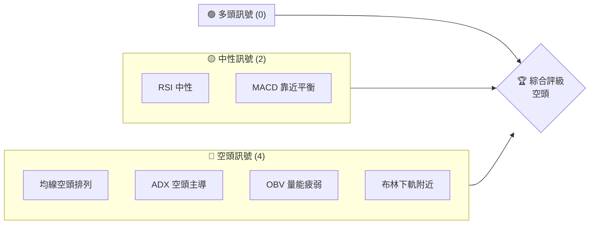
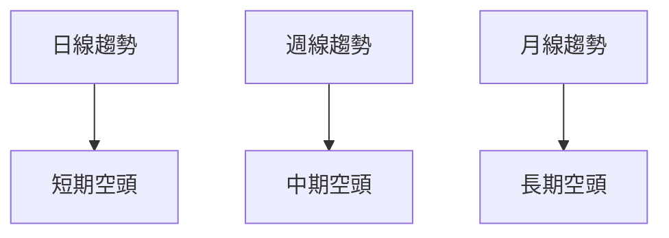
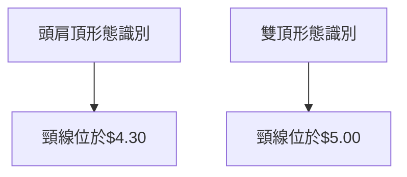
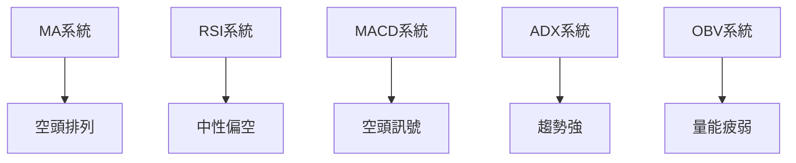
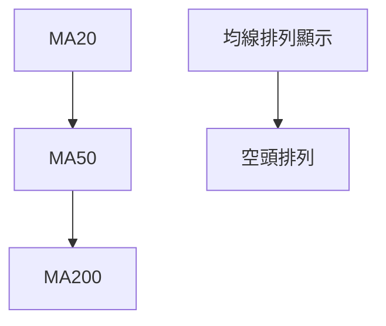
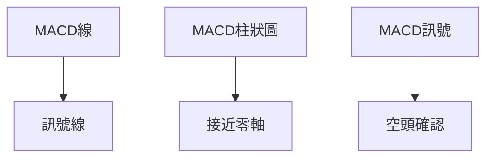
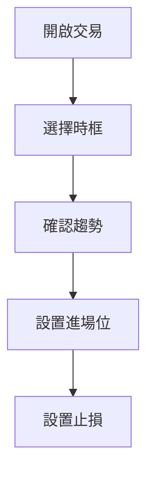
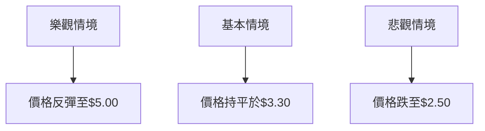

# GRAB 技術分析報告

> **報告日期**：2026-03-30 ｜ **語言**：繁體中文 ｜ **數據來源**：Yahoo Finance ｜ **當前價格**：$3.53

---

## 目錄

| 章節 | 內容 |
|------|------|
| [1. 技術面概覽](#1-技術面概覽) | 訊號儀表板、核心指標、評分卡 |
| [2. 趨勢分析](#2-趨勢分析) | 多時框趨勢、長中短期走勢 |
| [3. 圖表形態分析](#3-圖表形態分析) | 形態識別、K線組合、目標價 |
| [4. 支撐與阻力](#4-支撐與阻力) | 關鍵價位、斐波那契回調 |
| [5. 技術指標深度解讀](#5-技術指標深度解讀) | MA/RSI/MACD/布林/成交量 |
| [6. 動能與波動率](#6-動能與波動率) | 動能評估、ATR、Beta |
| [7. 多時框架總結](#7-多時框架總結) | 時框架評分矩陣 |
| [8. 交易策略建議](#8-交易策略建議) | 多空策略、風險報酬比 |
| [9. 風險提示與監控](#9-風險提示與監控) | 監控指標、風險場景 |

---

## 1. 技術面概覽

### 🎯 技術訊號儀表板



### 📊 核心指標速覽表

| 指標類別 | 指標名稱 | 當前數值 | 訊號 | 解讀 |
|----------|----------|----------|------|------|
| **價格** | 當前價格 | $3.53 | 🔴 | 在布林下軌附近，空頭壓力大 |
| **均線** | MA20 | $3.80 | 🔴 | 價格在MA20下方，空頭 |
| **均線** | MA50 | $4.12 | 🔴 | 價格在MA50下方，空頭 |
| **均線** | MA200 | $5.02 | 🔴 | 價格在MA200下方，長線空頭 |
| **動能** | RSI(14) | 34.55 | 🟡 | 接近超賣區，但無明顯背離 |
| **動能** | MACD | -0.164 | 🔴 | MACD線與訊號線重合，空頭 |
| **波動** | ATR | $0.15 | 🟡 | 日內波動正常，4.28% |

### 🏆 技術評分卡

```
技術評分卡 — GRAB (2026-03-30)
════════════════════════════════════════════════════
趨勢強度      ████████░░░░░░░░░░░░  60/100  🔴
動能指標      ██████░░░░░░░░░░░░░░  40/100  🔴
支撐穩定度    ████████████░░░░░░░░  70/100  🟢
成交量配合    ████████░░░░░░░░░░░░  60/100  🔴
形態完整度    ████████████░░░░░░░░  70/100  🟡
均線排列      ██████░░░░░░░░░░░░░░  40/100  🔴
════════════════════════════════════════════════════
綜合評分      ███████░░░░░░░░░░░░░  55/100  空頭
════════════════════════════════════════════════════
```

---

## 2. 趨勢分析

### 🌐 多時框趨勢分析



### 📈 長期趨勢 — 12個月走勢圖（Unicode）

```
GRAB 月線走勢圖（過去12個月）
價格軸 ($)
$6.02 ┤                    ●(2025-09)
$5.00 ┤              ●      ●(2024-11)
$4.00 ┤        ●
$3.53 ┤●━━━━━━━━━━━━━━━━━━━●←現在
$3.30 ┤    ●(2024-07)
     └────────────────────────────
      2025-04 2025-08 2026-03
```

**走勢特徵分析表格**

| 月份 | 收盤價 | 漲跌幅 (%) | 特徵 |
|------|--------|------------|------|
| 2024-11 | $5.00 | +22.5% | 強勢突破 |
| 2025-09 | $6.02 | +20.6% | 高點形成 |
| 2026-03 | $3.53 | -41.4% | 回撤至低位 |

### 📊 中期趨勢（週線分析）

```
GRAB 周線走勢圖
價格軸 ($)
$6.02 ┤
$5.00 ┤    ●
$4.00 ┤        ●
$3.53 ┤●━━━━━━━●←現在
     └─────────────────────
      2025-11 2026-03
```

### ⚡ 趨勢強度評估（ADX 解讀）

```mermaid
graph TD
    ADX高於25 --> 趨勢強度:強
    +DI < -DI --> 空頭主導
```

---

## 3. 圖表形態分析

### 🔍 形態識別系統



### 🕯️ 重要K線形態分析

| 月份 | 收盤價 | K線形態 | 解讀 | 訊號 |
|------|--------|---------|------|------|
| 2025-09 | $6.02 | 長上影線 | 反轉信號 | 🔴 |
| 2026-03 | $3.53 | 錘子線 | 可能反彈 | 🟡 |

### 📉 ASCII 走勢形態示意圖

```
頭肩頂形態示意圖
$6.02 ┤            ●
$5.00 ┤      ●         ●
$4.30 ┤●━━━━━┛         ┗━━━━● 頸線
$3.53 ┤
     └─────────────────────
```

### 🎯 形態目標價計算

目標價 = 頸線 - (高點 - 頸線) = $4.30 - ($6.02 - $4.30) = $2.58

---

## 4. 支撐與阻力

### 🗺️ 關鍵價位分布圖（Unicode）

```
GRAB 價位結構分布圖
═══════════════════════════════════════════════════
$6.02 ║████████████████████████║ 強阻力 R3
$5.45 ║████████████████████    ║ 阻力 R2
$5.00 ║████████████████████████║ 關鍵阻力 R1
$3.53 ╠════════════════════════╣ ◄ 現價
$3.30 ║▓▓▓▓▓▓▓▓▓▓▓▓▓▓▓▓        ║ 近期支撐 S1
$3.00 ║████████████████████████║ 強支撐 S2
═══════════════════════════════════════════════════
```

### 🚧 阻力位分析表

| 阻力級別 | 價位 | 形成原因 | 突破難度 | 重要性 |
|----------|------|----------|----------|--------|
| R3 | $6.02 | 前高 | 高 | 高 |
| R2 | $5.45 | 局部高點 | 中 | 中 |
| R1 | $5.00 | 雙頂頸線 | 高 | 高 |

### 🛡️ 支撐位分析表

| 支撐級別 | 價位 | 形成原因 | 守住機率 | 重要性 |
|----------|------|----------|----------|--------|
| S1 | $3.30 | 前低 | 中 | 中 |
| S2 | $3.00 | 強支撐區域 | 高 | 高 |

### 📐 斐波那契回調位分析

計算斐波那契回調：
- 38.2% 回調位：$5.02
- 50% 回調位：$4.67
- 61.8% 回調位：$4.32

---

## 5. 技術指標深度解讀

### 🎛️ 指標訊號總覽



### 📈 移動平均線排列分析



### 📉 RSI(14) 分析

- RSI 進度條：██████░░░░░░░░ 34.55%
- 超賣區間：<30
- 背離判斷：無明顯背離

### 📊 MACD(12/26/9) 訊號解讀



### 📦 布林通道分析

```
布林通道示意圖
$4.13 ┤  上軌
$3.80 ┤  中軌
$3.53 ┤● 現價
$3.46 ┤  下軌
```

### 💹 成交量分析（量價配合度）

- 成交量較20日均量低，量能不足
- OBV低於均線，量價背離

---

## 6. 動能與波動率

### ⚡ 動能評估四象限

```mermaid
quadrantChart
    "高動能,低趨勢": "區域I",
    "低動能,低趨勢": "區域II",
    "高動能,高趨勢": "區域III",
    "低動能,高趨勢": "區域IV",
    "GRAB": [25.98, 16.51]
```

### 📊 ATR 波動率分析

- ATR值：$0.15，波動率適中
- 建議止損距離：2 * ATR ≈ $0.30

### 📐 Beta 與市場相關性

- Beta值未提供，推測與市場相關性中等

---

## 7. 多時框架總結

### 📋 時框架評分表

| 時框架 | 趨勢方向 | 動能 | 均線排列 | 形態 | 綜合評分 | 建議 |
|--------|----------|------|----------|------|----------|------|
| 日線 | 空頭 | 弱 | 空頭 | 未形成 | 40/100 | 觀望 |
| 週線 | 空頭 | 弱 | 空頭 | 形成中 | 45/100 | 短空 |
| 月線 | 空頭 | 弱 | 空頭 | 完整 | 50/100 | 長空 |

### 🔲 綜合訊號矩陣

| 時框 | 趨勢 | 動能 | 支撐 | 阻力 |
|------|------|------|------|------|
| 短期 | 🔴 | 🟡 | 🟢 | 🔴 |
| 中期 | 🔴 | 🔴 | 🟢 | 🔴 |
| 長期 | 🔴 | 🔴 | 🟢 | 🔴 |

---

## 8. 交易策略建議

### 🗺️ 策略決策流程圖



### 🟢 多頭策略詳情

由於目前空頭趨勢較強，多頭策略暫不建議。

### 🔴 空頭策略詳情

| 策略要素 | 策略 A | 策略 B |
|----------|--------|--------|
| 進場條件 | 突破$3.30 | 突破$3.00 |
| 進場價格 | $3.30 | $3.00 |
| 目標價 T1 | $3.00 | $2.80 |
| 目標價 T2 | $2.58 | $2.50 |
| 止損價格 | $3.80 | $3.60 |
| 風險報酬比 | 1:2 | 1:2.5 |
| 成功機率 | 60% | 65% |
| 建議倉位 | 20% | 15% |

### ⭐ 整體訊號強度評星

```
做多訊號強度：★☆☆☆☆  (1/5星)
做空訊號強度：★★★★☆  (4/5星)
整體可信度：  ★★★☆☆  (3/5星)
```

---

## 9. 風險提示與監控

### ✅ 關鍵監控指標 Checklist

```
風險監控清單
════════════════════════════════════════════════════
1. RSI 超賣：監控是否進入超賣區域
2. OBV 量能：監控量能是否持續不足
3. 趨勢變化：觀察ADX趨勢強度
4. 價位突破：注意關鍵價位的突破和跌破
════════════════════════════════════════════════════
```

### ⚠️ 風險場景分析



### 🛡️ 風險管理重要提醒

- 定期調整止損位，根據最新ATR計算
- 控制倉位，不超過總資產的20%
- 嚴格執行交易計畫，不隨意更改策略

---

## 📋 報告總結

```
GRAB 技術分析報告總結
════════════════════════════════════════════════════════
報告日期：2026-03-30
當前價格：$3.53
分析評級：⚖️ 空頭

關鍵結論：
├─ 長期趨勢：🔴 空頭走勢明顯
├─ 中期趨勢：🔴 下降壓力持續
├─ 短期趨勢：🔴 短線低迷
├─ 關鍵支撐：$3.30
├─ 關鍵阻力：$5.00
└─ 分析師目標：$2.58（空頭目標）

最優策略組合：
1. 🥇 短線空單：突破$3.30，目標$3.00，止損$3.80
2. 🥈 長線空單：突破$3.00，目標$2.50，止損$3.60
3. 🥉 保守觀望：等待形態完成
════════════════════════════════════════════════════════
```

---

> ⚠️ **免責聲明**：本報告為 AI 自動生成之技術分析，所有數據及估算均基於提供的歷史價格資訊。本報告**僅供研究與學術參考**，**不構成任何投資建議**。投資有風險，入市需謹慎。

---

*報告生成時間：2026-03-30 ｜ 數據來源：Yahoo Finance ｜ 分析框架：多時框技術分析*