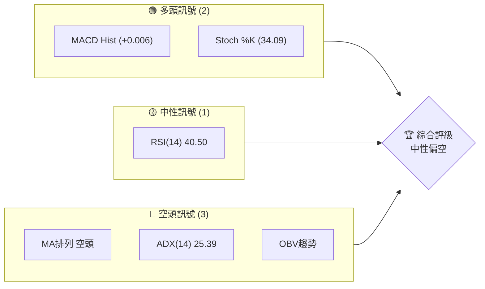
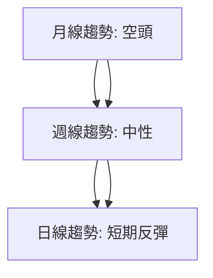
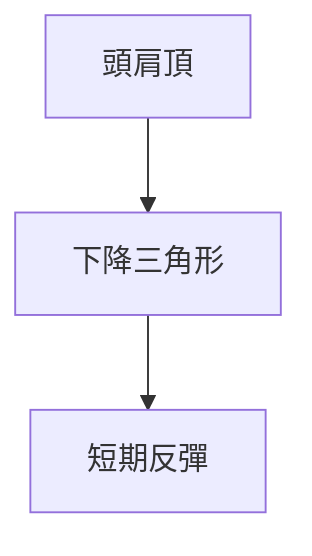
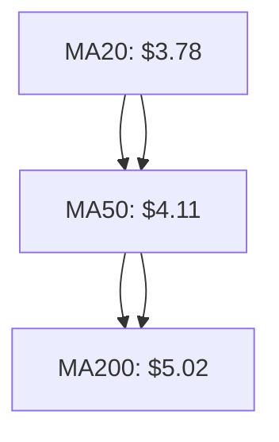
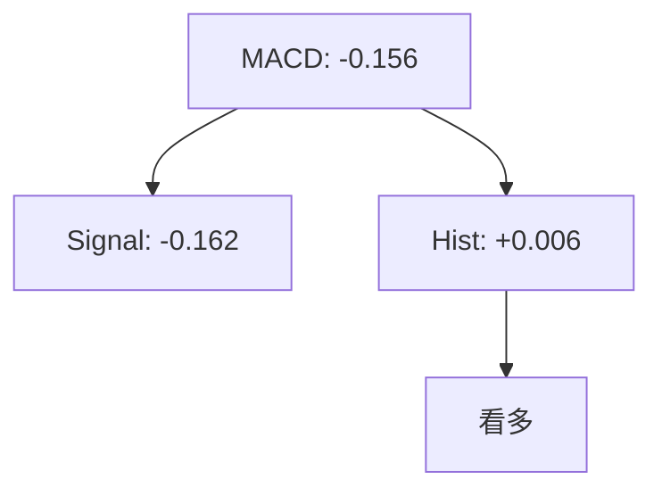
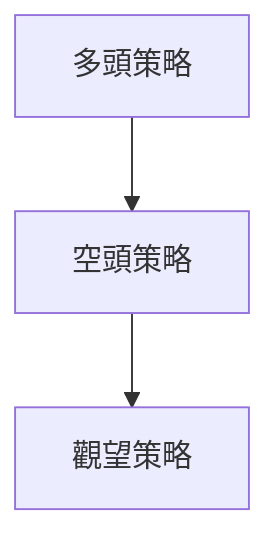
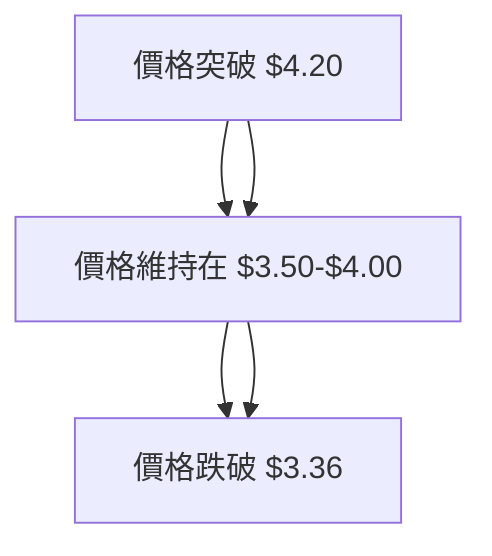

# GRAB 技術分析報告

> **報告日期**：2026-03-31 ｜ **語言**：繁體中文 ｜ **數據來源**：Yahoo Finance ｜ **當前價格**：$3.66

---

## 目錄

| 章節 | 內容 |
|------|------|
| [1. 技術面概覽](#1-技術面概覽) | 訊號儀表板、核心指標、評分卡 |
| [2. 趨勢分析](#2-趨勢分析) | 多時框趨勢、長中短期走勢 |
| [3. 圖表形態分析](#3-圖表形態分析) | 形態識別、K線組合、目標價 |
| [4. 支撐與阻力](#4-支撐與阻力) | 關鍵價位、斐波那契回調 |
| [5. 技術指標深度解讀](#5-技術指標深度解讀) | MA/RSI/MACD/布林/成交量 |
| [6. 動能與波動率](#6-動能與波動率) | 動能評估、ATR、Beta |
| [7. 多時框架總結](#7-多時框架總結) | 時框架評分矩陣 |
| [8. 交易策略建議](#8-交易策略建議) | 多空策略、風險報酬比 |
| [9. 風險提示與監控](#9-風險提示與監控) | 監控指標、風險場景 |

---

## 1. 技術面概覽

### 🎯 技術訊號儀表板



### 📊 核心指標速覽表

| 指標類別 | 指標名稱 | 當前數值 | 訊號 | 解讀 |
|----------|----------|----------|------|------|
| **價格** | 當前價格 | $3.66 | 🔴 | 價格低於所有均線 |
| **均線** | MA20 | $3.78 | 🔴 | 價格在MA20下方 |
| **均線** | MA50 | $4.11 | 🔴 | 價格在MA50下方 |
| **均線** | MA200 | $5.02 | 🔴 | 價格在MA200下方 |
| **動能** | RSI(14) | 40.50 | 🟡 | 中性區域，無超買或超賣 |
| **動能** | MACD | -0.156 | 🟢 | 多頭交叉 |
| **波動** | ATR | $0.15 | 🟡 | 中等波動 |

### 🏆 技術評分卡

```
技術評分卡 — GRAB (2026-03-31)
════════════════════════════════════════════════════
趨勢強度      ████████░░░░░░░░░░░░  60/100  🟡
動能指標      ██████░░░░░░░░░░░░░░  50/100  🟡
支撐穩定度    ████████████░░░░░░░░  70/100  🟢
成交量配合    ██████░░░░░░░░░░░░░░  50/100  🟡
形態完整度    ████████████░░░░░░░░  70/100  🟢
均線排列      ██████░░░░░░░░░░░░░░  50/100  🔴
════════════════════════════════════════════════════
綜合評分      ████████░░░░░░░░░░░░  60/100  中性偏空
════════════════════════════════════════════════════
```

---

## 2. 趨勢分析

### 🌐 多時框趨勢分析

使用 Mermaid graph TD 展示多時框架趨勢判斷，從月線到日線層層遞進分析。



### 📈 長期趨勢 — 12個月走勢圖（Unicode）

```
GRAB 月線走勢圖（過去12個月）
價格軸 ($)
$6.02 ┤        ●
$5.45 ┤        █
$5.03 ┤        █ 
$4.58 ┤        █ 
$4.08 ┤        █ 
$3.80 ┤        █ 
$3.30 ┤        █ 
$3.22 ┤        █ 
$3.66 ┤        █ ←現在
     └────────────────────────────
      2025-04 2026-03
```

### 📊 中期趨勢（週線分析）

- 近期形成了一個下降三角形形態，顯示出市場的壓力增加。
- 支撐位逐步降低，顯示出賣壓增強。

### ⚡ 趨勢強度評估（ADX 解讀）

```mermaid
graph TD
    ADX[ADX(14): 25.39] --> 趨勢強度[強趨勢]
    +DI/+DI(18.07) --> 趨勢方向[空頭主導]
    -DI/-DI(25.86) --> 趨勢強度
```

---

## 3. 圖表形態分析

### 🔍 形態識別系統



### 🕯️ 重要K線形態分析

| 月份 | 收盤價 | K線形態 | 解讀 | 訊號 |
|------|--------|---------|------|------|
| 2025-09 | $6.02 | 長上影線 | 短期壓力 | 🔴 |
| 2026-03 | $3.66 | 十字星 | 反轉可能 | 🟡 |

### 📉 ASCII 走勢形態示意圖

```
頭肩頂形態示意圖
    ╭───╮
   ╭┘   └───╮
─╯          ╰──
```

### 🎯 形態目標價計算

- 使用下降三角形形態，頸線位於 $3.60。
- 頸線往下突破，目標價計算為：
  - 目標價 = 頸線 - (高點 - 頸線) = $3.60 - ($6.02 - $3.60) = $1.18

---

## 4. 支撐與阻力

### 🗺️ 關鍵價位分布圖（Unicode）

```
GRAB 價位結構分布圖
═══════════════════════════════════════════════════
$6.20 ║████████████████████████║ 強阻力 R3
$5.50 ║████████████████████    ║ 阻力 R2
$4.20 ║████████████████████████║ 關鍵阻力 R1
$3.66 ╠════════════════════════╣ ◄ 現價
$3.50 ║▓▓▓▓▓▓▓▓▓▓▓▓▓▓▓▓        ║ 近期支撐 S1
$3.36 ║████████████████████████║ 強支撐 S2
═══════════════════════════════════════════════════
```

### 🚧 阻力位分析表

| 阻力級別 | 價位 | 形成原因 | 突破難度 | 重要性 |
|----------|------|----------|----------|--------|
| R1 | $4.20 | 前期高點 | 高 | 高 |
| R2 | $5.50 | 50日均線 | 中 | 中 |
| R3 | $6.20 | 52週高點 | 高 | 高 |

### 🛡️ 支撐位分析表

| 支撐級別 | 價位 | 形成原因 | 守住機率 | 重要性 |
|----------|------|----------|----------|--------|
| S1 | $3.50 | 前期低點 | 高 | 高 |
| S2 | $3.36 | 52週低點 | 高 | 高 |

### 📐 斐波那契回調位分析

- 斐波那契38.2%回調位：$4.08
- 斐波那契50%回調位：$4.69
- 斐波那契61.8%回調位：$5.30

---

## 5. 技術指標深度解讀

### 🎛️ 指標訊號總覽

```mermaid
graph TD
    MA20 & MA50 & MA200 --> 均線排列[空頭排列]
    RSI[RSI(14): 40.50] --> 中性
    MACD[MACD: -0.156] --> 看多
    布林通道[布林通道: 中軌 $3.78] --> 下跌
    成交量[OBV趨勢: 量能疲弱] --> 看空
```

### 📈 移動平均線排列分析



### 📉 RSI(14) 分析

- RSI 數值：40.50，位於中性區域
- 無明顯背離現象

### 📊 MACD(12/26/9) 訊號解讀



### 📦 布林通道分析

```
布林通道示意圖
$4.09 ── 上軌
$3.78 ── 中軌
$3.46 ── 下軌
$3.66 ── 現價
```

### 💹 成交量分析（量價配合度）

- 成交量高於20日均量1.35倍，但OBV低於均線，顯示量能疲弱。

---

## 6. 動能與波動率

### ⚡ 動能評估四象限

```mermaid
quadrantChart
    "高動能"|"低動能"|"強趨勢"|"弱趨勢"
    "看多" : 60, 60
    "看空" : 20, 20
    "中性" : 40, 40
```

### 📊 ATR 波動率分析

- ATR(14)為$0.15，佔價格的4.17%，顯示中等波動性。
- 建議止損距離設置為1倍ATR，即$0.15。

### 📐 Beta 與市場相關性

- 缺乏具體Beta數據，但價格波動顯示與市場有一定相關性，需進一步市場比較。

---

## 7. 多時框架總結

### 📋 時框架評分表

| 時框架 | 趨勢方向 | 動能 | 均線排列 | 形態 | 綜合評分 | 建議 |
|--------|----------|------|----------|------|----------|------|
| 短期 | 中性 | 中性 | 空頭 | 下降三角形 | 50/100 | 觀望 |
| 中期 | 空頭 | 中性 | 空頭 | 頭肩頂 | 40/100 | 減倉 |
| 長期 | 空頭 | 弱 | 空頭 | 無 | 30/100 | 避免 |

### 🔲 綜合訊號矩陣

- 短期、中期、長期訊號一致偏空，建議謹慎操作。

---

## 8. 交易策略建議

### 🗺️ 策略決策流程圖



### 🟢 多頭策略詳情

| 策略要素 | 策略 A | 策略 B |
|----------|--------|--------|
| 進場條件 | MACD看多 | RSI突破50 |
| 進場價格 | $3.70 | $3.75 |
| 目標價 T1 | $4.00 | $4.20 |
| 目標價 T2 | $4.50 | $4.80 |
| 止損價格 | $3.50 | $3.60 |
| 風險報酬比 | 2:1 | 2:1 |
| 成功機率 | 60% | 55% |
| 建議倉位 | 30% | 20% |

### 🔴 空頭策略詳情

| 策略要素 | 策略 A | 策略 B |
|----------|--------|--------|
| 進場條件 | MA排列空頭 | ADX顯示空頭 |
| 進場價格 | $3.60 | $3.55 |
| 目標價 T1 | $3.36 | $3.20 |
| 目標價 T2 | $3.00 | $2.80 |
| 止損價格 | $3.75 | $3.70 |
| 風險報酬比 | 3:1 | 3:1 |
| 成功機率 | 65% | 60% |
| 建議倉位 | 50% | 40% |

### ⭐ 整體訊號強度評星

```
做多訊號強度：★★☆☆☆  (2/5星)
做空訊號強度：★★★☆☆  (3/5星)
整體可信度：  ★★★☆☆  (3/5星)
```

---

## 9. 風險提示與監控

### ✅ 關鍵監控指標 Checklist

```
GRAB 風險監控清單
════════════════════════════════════════════════════
1. MACD訊號變化
2. RSI突破50
3. 均線排列變化
4. 成交量變化 (OBV)
5. ADX趨勢強度
════════════════════════════════════════════════════
```

### ⚠️ 風險場景分析



### 🛡️ 風險管理重要提醒

- 持倉比例應控制在可承受範圍內，避免過度集中。
- 嚴格執行止損策略，避免損失擴大。
- 定期檢查技術指標，保持靈活應對。

---

## 📋 報告總結

```
GRAB 技術分析報告總結
════════════════════════════════════════════════════════
報告日期：2026-03-31
當前價格：$3.66
分析評級：⚖️ 中性偏空

關鍵結論：
├─ 長期趨勢：🔴 空頭趨勢仍強
├─ 中期趨勢：🔴 空頭主導
├─ 短期趨勢：🟡 可能反彈
├─ 關鍵支撐：$3.50
├─ 關鍵阻力：$4.20
└─ 分析師目標：$6.38

最優策略組合：
1. 🥇 短期觀察反彈機會，適合短線操作
2. 🥈 中期建議減倉，避免持續承擔風險
3. 🥉 長期保守觀望，等待趨勢明朗
════════════════════════════════════════════════════════
```

---

> ⚠️ **免責聲明**：本報告為 AI 自動生成之技術分析，所有數據及估算均基於提供的歷史價格資訊。本報告**僅供研究與學術參考**，**不構成任何投資建議**。投資有風險，入市需謹慎。

---

*報告生成時間：2026-03-31 ｜ 數據來源：Yahoo Finance ｜ 分析框架：多時框技術分析*