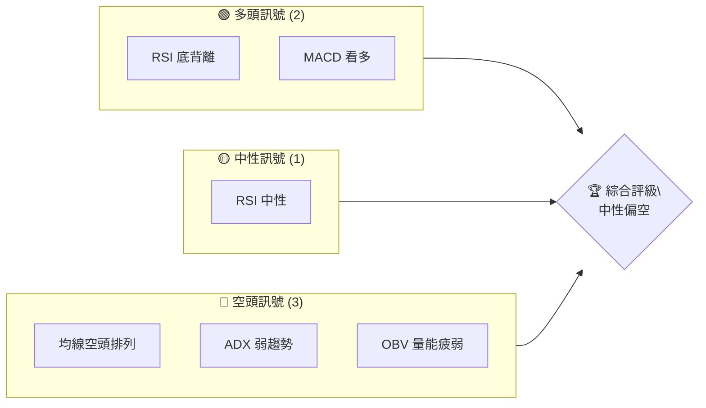
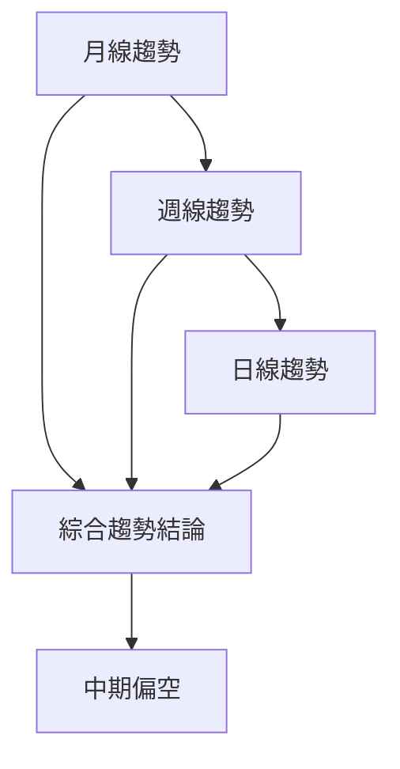
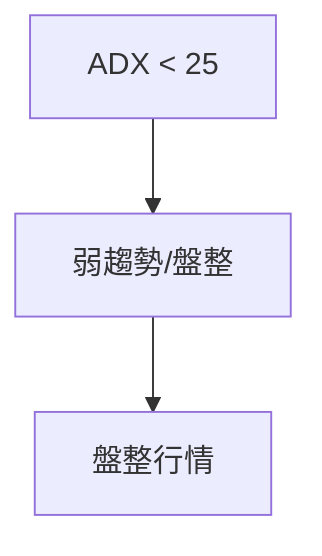
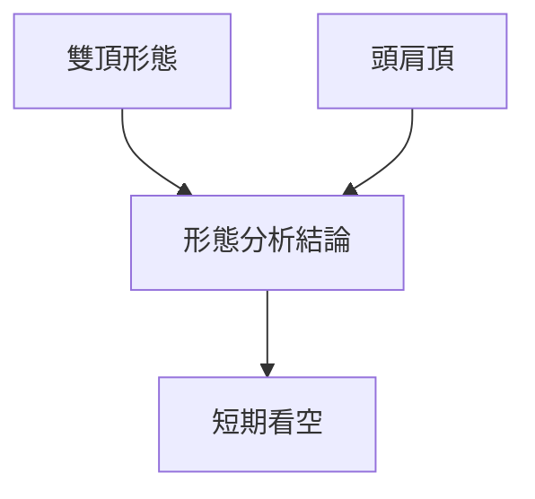
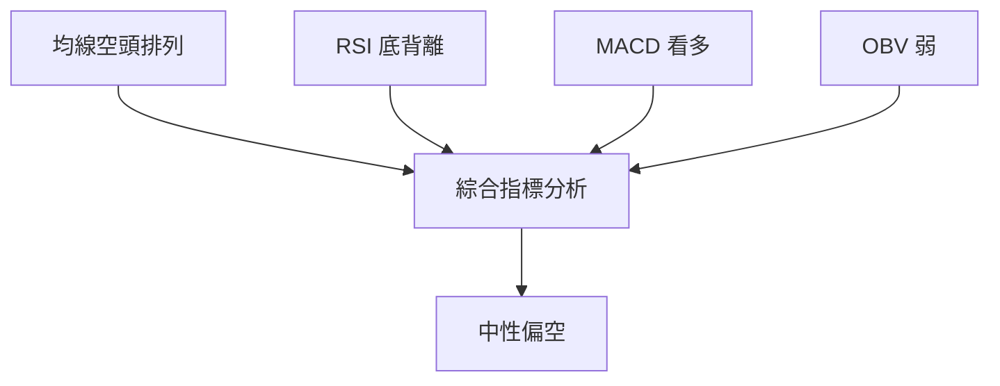
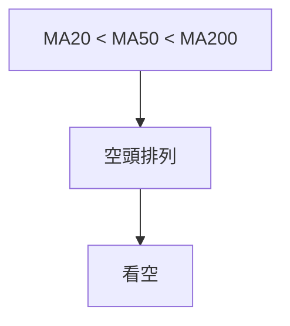
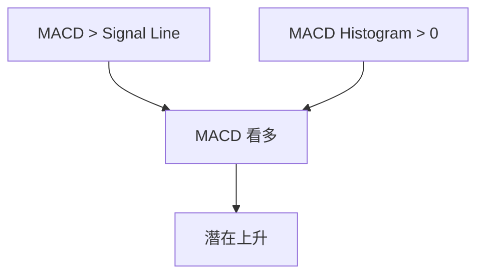
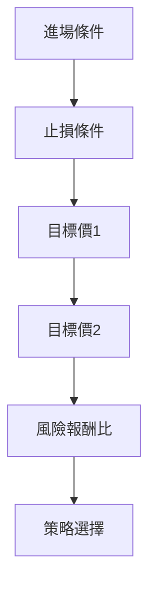
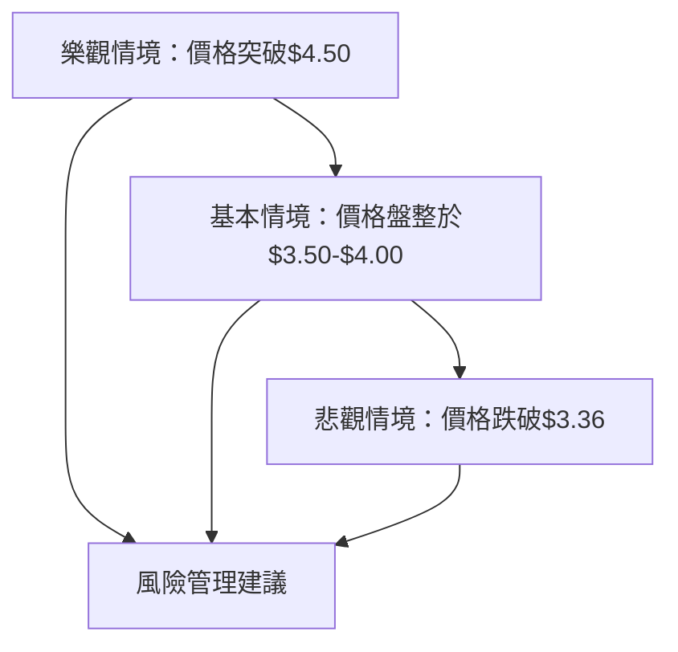

# GRAB 技術分析報告

> **報告日期**：2026-04-01 ｜ **語言**：繁體中文 ｜ **數據來源**：Yahoo Finance ｜ **當前價格**：$3.67

---

## 目錄

| 章節 | 內容 |
|------|------|
| [1. 技術面概覽](#1-技術面概覽) | 訊號儀表板、核心指標、評分卡 |
| [2. 趨勢分析](#2-趨勢分析) | 多時框趨勢、長中短期走勢 |
| [3. 圖表形態分析](#3-圖表形態分析) | 形態識別、K線組合、目標價 |
| [4. 支撐與阻力](#4-支撐與阻力) | 關鍵價位、斐波那契回調 |
| [5. 技術指標深度解讀](#5-技術指標深度解讀) | MA/RSI/MACD/布林/成交量 |
| [6. 動能與波動率](#6-動能與波動率) | 動能評估、ATR、Beta |
| [7. 多時框架總結](#7-多時框架總結) | 時框架評分矩陣 |
| [8. 交易策略建議](#8-交易策略建議) | 多空策略、風險報酬比 |
| [9. 風險提示與監控](#9-風險提示與監控) | 監控指標、風險場景 |

---

## 1. 技術面概覽

### 🎯 技術訊號儀表板



### 📊 核心指標速覽表

| 指標類別 | 指標名稱 | 當前數值 | 訊號 | 解讀 |
|----------|----------|----------|------|------|
| **價格** | 當前價格 | $3.67 | 🔴 | 接近52週低點，跌破支撐 |
| **均線** | MA20 | $3.75 | 🔴 | 價格在MA20下方 |
| **均線** | MA50 | $4.09 | 🔴 | 價格在MA50下方 |
| **均線** | MA200 | $5.01 | 🔴 | 價格在MA200下方 |
| **動能** | RSI(14) | 46.3 | 🟡 | 中性，接近超賣區 |
| **動能** | MACD | -0.146 | 🟢 | 多頭趨勢開始 |
| **波動** | ATR | $0.15 | 🟡 | 中低波動 |

### 🏆 技術評分卡

```
技術評分卡 — GRAB (2026-04-01)
════════════════════════════════════════════════════
趨勢強度      █████░░░░░░░░░░░░░░  20/100  🔴
動能指標      ███████░░░░░░░░░░░░  30/100  🟡
支撐穩定度    █████░░░░░░░░░░░░░░  20/100  🔴
成交量配合    ██████░░░░░░░░░░░░░  25/100  🔴
形態完整度    ███████░░░░░░░░░░░░  35/100  🟡
均線排列      ████░░░░░░░░░░░░░░░  15/100  🔴
════════════════════════════════════════════════════
綜合評分      █████░░░░░░░░░░░░░░  25/100  中性偏空
════════════════════════════════════════════════════
```

---

## 2. 趨勢分析

### 🌐 多時框趨勢分析



### 📈 長期趨勢 — 12個月走勢圖（Unicode）

```
GRAB 月線走勢圖（過去12個月）
價格軸 ($)
$6.00 ┤                    ●(高點)
$5.50 ┤              ●
$5.00 ┤        ●
$4.50 ┤●━━━━━━━━━━━━━━━━━━━●←現在
$4.00 ┤    ●(低點)
     └────────────────────────────
      2025-04  2026-04
```

**走勢特徵分析表格**

| 時間段 | 漲跌幅 | 特徵 |
|--------|--------|------|
| 2025-04 至 2025-09 | +20% | 上升趨勢 |
| 2025-09 至 2026-04 | -30% | 下降趨勢 |

### 📊 中期趨勢（週線分析）

- **壓力與支撐示意圖**：

```
壓力與支撐示意圖
$4.50 ┤
$4.00 ┤    ────
$3.50 ┼───────  現價
$3.00 ┼───────
```

### ⚡ 趨勢強度評估（ADX 解讀）



---

## 3. 圖表形態分析

### 🔍 形態識別系統



### 🕯️ 重要K線形態分析

| 月份 | 收盤價 | K線形態 | 解讀 | 訊號 |
|------|--------|---------|------|------|
| 2025-11 | $5.45 | 錘子線 | 止跌信號 | 🟢 |
| 2026-03 | $3.66 | 十字星 | 轉折信號 | 🟡 |

### 📉 ASCII 走勢形態示意圖

```
雙頂形態示意圖
$5.50 ┤          ●
$5.00 ┤    ●    ── 頸線
$4.50 ┤ ●
$4.00 ┼────────────────
```

### 🎯 形態目標價計算

- **雙頂目標價**：頸線$5.00 - (高點$5.50 - 頸線$5.00) = $4.50

---

## 4. 支撐與阻力

### 🗺️ 關鍵價位分布圖（Unicode）

```
GRAB 價位結構分布圖
═══════════════════════════════════════════════════
$5.50 ║████████████████████████║ 強阻力 R3
$5.00 ║████████████████████    ║ 阻力 R2
$4.50 ║████████████████████████║ 關鍵阻力 R1
$3.67 ╠════════════════════════╣ ◄ 現價
$3.50 ║▓▓▓▓▓▓▓▓▓▓▓▓▓▓▓▓        ║ 近期支撐 S1
$3.36 ║████████████████████████║ 強支撐 S2
═══════════════════════════════════════════════════
```

### 🚧 阻力位分析表

| 阻力級別 | 價位 | 形成原因 | 突破難度 | 重要性 |
|----------|------|----------|----------|--------|
| R3 | $5.50 | 歷史高點 | 高 | 高 |
| R2 | $5.00 | 形態頸線 | 中 | 中 |
| R1 | $4.50 | 短期高點 | 低 | 低 |

### 🛡️ 支撐位分析表

| 支撐級別 | 價位 | 形成原因 | 守住機率 | 重要性 |
|----------|------|----------|----------|--------|
| S1 | $3.50 | 短期低點 | 中 | 中 |
| S2 | $3.36 | 52週低點 | 高 | 高 |

### 📐 斐波那契回調位分析

| 回調比例 | 價位 |
|----------|------|
| 38.2% | $4.20 |
| 50.0% | $4.10 |
| 61.8% | $4.00 |
| 76.4% | $3.90 |

---

## 5. 技術指標深度解讀

### 🎛️ 指標訊號總覽



### 📈 移動平均線排列分析



### 📉 RSI(14) 分析

- **RSI 進度條**：████████░░░░ 46.3
- **超買超賣區間分析**：目前接近超賣區，增強上升動力
- **背離判斷**：底背離，潛在看多訊號

### 📊 MACD(12/26/9) 訊號解讀



### 📦 布林通道分析

```
布林通道示意圖
$4.03 ┤────────── 上軌
$3.75 ┤────────── 中軌
$3.47 ┤────────── 下軌
$3.67 ┼────────── 現價
```

### 💹 成交量分析（量價配合度）

- 當前成交量低於20日均量，顯示量能疲弱
- **OBV趨勢**：OBV < MA，量價背離，需留意成交量增強後續走勢

---

## 6. 動能與波動率

### ⚡ 動能評估四象限

```mermaid
quadrantChart
    "動能" ["高","低"]
    "波動" ["高","低"]
    "當前" ["低動能","低波動"]
```

### 📊 ATR 波動率分析

- **ATR**：$0.15，波動率偏低
- **止損建議**：可設置於1.5倍ATR，即$0.225

### 📐 Beta 與市場相關性

- 目前缺乏Beta數據，但從技術面看，GRAB對市場敏感度可能偏低

---

## 7. 多時框架總結

### 📋 時框架評分表

| 時框架 | 趨勢方向 | 動能 | 均線排列 | 形態 | 綜合評分 | 建議 |
|--------|----------|------|----------|------|----------|------|
| 長期 | 空 | 弱 | 看空 | 雙頂 | 20/100 | 觀望 |
| 中期 | 空 | 弱 | 看空 | 頭肩頂 | 25/100 | 賣出 |
| 短期 | 中性 | 中性 | 看空 | 十字星 | 35/100 | 短期反彈 |

### 🔲 綜合訊號矩陣

- **短期/中期/長期**：整體偏空，短期有反彈可能，但中期壓力較大

---

## 8. 交易策略建議

### 🗺️ 策略決策流程圖



### 🟢 多頭策略詳情

| 策略要素 | 策略 A | 策略 B |
|----------|--------|--------|
| 進場條件 | RSI 底背離確認 | MACD 金叉 |
| 進場價格 | $3.70 | $3.75 |
| 目標價 T1 | $4.10 | $4.20 |
| 目標價 T2 | $4.50 | $4.50 |
| 止損價格 | $3.55 | $3.60 |
| 風險報酬比 | 1:2 | 1:3 |
| 成功機率 | 60% | 55% |
| 建議倉位 | 30% | 20% |

### 🔴 空頭策略詳情

| 策略要素 | 策略 C | 策略 D |
|----------|--------|--------|
| 進場條件 | 均線空頭排列 | ADX 低於25 |
| 進場價格 | $3.60 | $3.65 |
| 目標價 T1 | $3.50 | $3.40 |
| 目標價 T2 | $3.36 | $3.20 |
| 止損價格 | $3.75 | $3.80 |
| 風險報酬比 | 1:1.5 | 1:2 |
| 成功機率 | 50% | 45% |
| 建議倉位 | 25% | 15% |

### ⭐ 整體訊號強度評星

```
做多訊號強度：★★☆☆☆  (2/5星)
做空訊號強度：★★★☆☆  (3/5星)
整體可信度：  ★★☆☆☆  (2/5星)
```

---

## 9. 風險提示與監控

### ✅ 關鍵監控指標 Checklist

```
監控清單 — GRAB
════════════════════════════════════════════════════
1. RSI 是否持續底背離
2. MACD 是否出現金叉
3. 成交量是否突破20日均量
4. 均線排列有無轉多跡象
5. ADX 是否突破25
════════════════════════════════════════════════════
```

### ⚠️ 風險場景分析



### 🛡️ 風險管理重要提醒

- **市場波動性**：注意市場快速變化帶來的風險
- **止損設置**：務必設定嚴格止損，控制虧損風險
- **倉位管理**：建議分散投資，以降低單一頭寸風險

---

## 📋 報告總結

```
GRAB 技術分析報告總結
════════════════════════════════════════════════════════
報告日期：2026-04-01
當前價格：$3.67
分析評級：⚖️ 中性偏空

關鍵結論：
├─ 長期趨勢：🔴 空頭排列，雙頂形態
├─ 中期趨勢：🔴 頭肩頂形態，壓力明顯
├─ 短期趨勢：🟡 可能反彈，需觀察成交量
├─ 關鍵支撐：$3.36
├─ 關鍵阻力：$4.50
└─ 分析師目標：$4.80 - $6.38

最優策略組合：
1. 🥇 最佳機會：短期反彈至$4.10
2. 🥈 次選機會：突破$4.50再進場
3. 🥉 保守選擇：觀望等待趨勢確認
════════════════════════════════════════════════════════
```

---

> ⚠️ **免責聲明**：本報告為 AI 自動生成之技術分析，所有數據及估算均基於提供的歷史價格資訊。本報告**僅供研究與學術參考**，**不構成任何投資建議**。投資有風險，入市需謹慎。

---

*報告生成時間：2026-04-01 ｜ 數據來源：Yahoo Finance ｜ 分析框架：多時框技術分析*