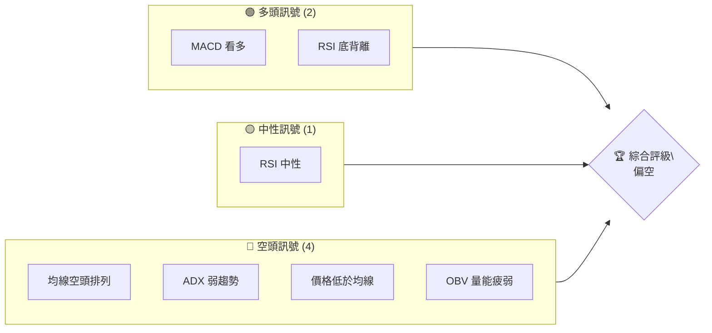
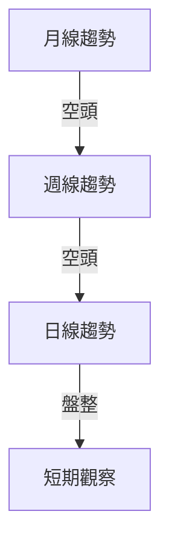
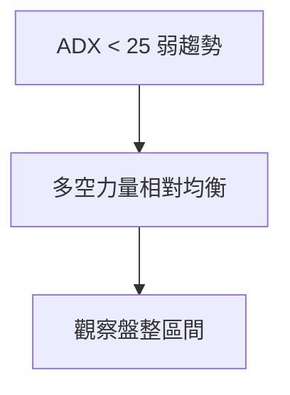
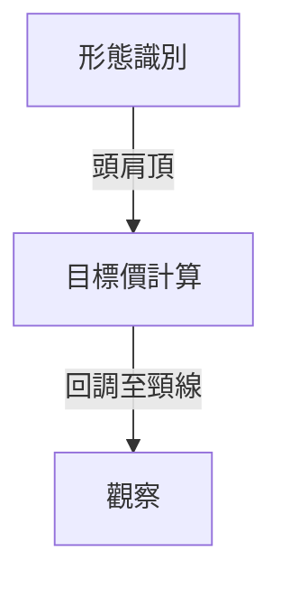
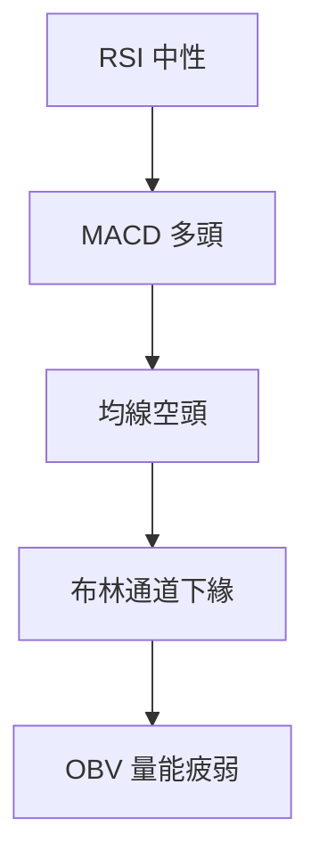
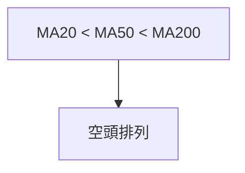
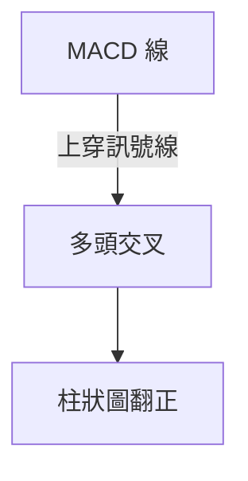
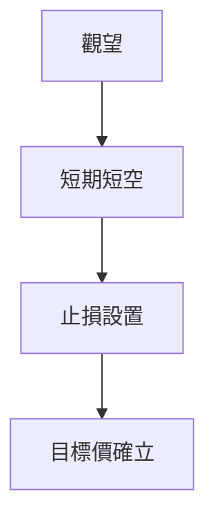
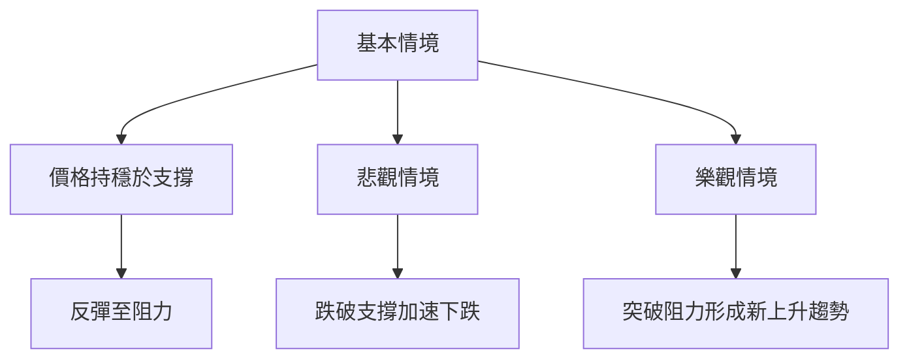

# GRAB 技術分析報告

> **報告日期**：2026-04-02 ｜ **語言**：繁體中文 ｜ **數據來源**：Yahoo Finance ｜ **當前價格**：$3.62

---

## 目錄

| 章節 | 內容 |
|------|------|
| [1. 技術面概覽](#1-技術面概覽) | 訊號儀表板、核心指標、評分卡 |
| [2. 趨勢分析](#2-趨勢分析) | 多時框趨勢、長中短期走勢 |
| [3. 圖表形態分析](#3-圖表形態分析) | 形態識別、K線組合、目標價 |
| [4. 支撐與阻力](#4-支撐與阻力) | 關鍵價位、斐波那契回調 |
| [5. 技術指標深度解讀](#5-技術指標深度解讀) | MA/RSI/MACD/布林/成交量 |
| [6. 動能與波動率](#6-動能與波動率) | 動能評估、ATR、Beta |
| [7. 多時框架總結](#7-多時框架總結) | 時框架評分矩陣 |
| [8. 交易策略建議](#8-交易策略建議) | 多空策略、風險報酬比 |
| [9. 風險提示與監控](#9-風險提示與監控) | 監控指標、風險場景 |

---

## 1. 技術面概覽

### 🎯 技術訊號儀表板



### 📊 核心指標速覽表

| 指標類別 | 指標名稱 | 當前數值 | 訊號 | 解讀 |
|----------|----------|----------|------|------|
| **價格** | 當前價格 | $3.62 | 🔴 | 價格低於均線 |
| **均線** | MA20 | $3.73 | 🔴 | 價格在MA20下方 |
| **均線** | MA50 | $4.08 | 🔴 | 價格在MA50下方 |
| **均線** | MA200 | $5.01 | 🔴 | 價格在MA200下方 |
| **動能** | RSI(14) | 45.87 | 🟡 | 中性區間 |
| **動能** | MACD | -0.141 | 🟢 | 多頭 |
| **波動** | ATR | $0.15 | 🟡 | 低至中等波動 |

### 🏆 技術評分卡

```
技術評分卡 — GRAB (2026-04-02)
════════════════════════════════════════════════════
趨勢強度      ███░░░░░░░░░░░░░░░░  30/100  🔴
動能指標      ██████░░░░░░░░░░░░  60/100  🟡
支撐穩定度    █████░░░░░░░░░░░░░  50/100  🟡
成交量配合    ███░░░░░░░░░░░░░░░  30/100  🔴
形態完整度    ██████░░░░░░░░░░░░  60/100  🟡
均線排列      ██░░░░░░░░░░░░░░░░  20/100  🔴
════════════════════════════════════════════════════
綜合評分      █████░░░░░░░░░░░░░  50/100  偏空
════════════════════════════════════════════════════
```

---

## 2. 趨勢分析

### 🌐 多時框趨勢分析



### 📈 長期趨勢 — 12個月走勢圖（Unicode）

```
GRAB 月線走勢圖（過去12個月）
價格軸 ($)
$6.02 ┤                    ●(高點)
$5.45 ┤              ●
$5.03 ┤        ●
$4.89 ┤●━━━━━━━━━━━━━━━━━━━●←現在
$3.71 ┤    ●(低點)
     └────────────────────────────
      Apr May Jun Jul Aug Sep Oct Nov Dec Jan Feb Mar Apr
```

**走勢特徵分析表格**

| 時期 | 價格走勢 | 特徵描述 |
|------|----------|----------|
| 2025-09 至 2025-12 | 上升 | 高點創新高 |
| 2026-01 至 2026-04 | 下降 | 持續低於均線 |

### 📊 中期趨勢（週線分析）

```
週線走勢示意圖
價格軸 ($)
$6.02 ┤    ●
$5.45 ┤        ●
$5.03 ┤            ●
$4.89 ┤                ●
$3.62 ┤                    ●←現在
     └───────────────────
      W1  W2  W3  W4  W5
```

**特徵描述**：價格持續低於週均線，反彈乏力。

### ⚡ 趨勢強度評估（ADX 解讀）



---

## 3. 圖表形態分析

### 🔍 形態識別系統



### 🕯️ 重要K線形態分析

| 月份 | 收盤價 | K線形態 | 解讀 | 訊號 |
|------|--------|---------|------|------|
| 2025-09 | 6.02 | 長上影 | 反轉信號 | 🔴 |
| 2026-03 | 3.66 | 長下影 | 支撐試探 | 🟢 |

### 📉 ASCII 走勢形態示意圖

```
頭肩頂形態示意圖
價格軸 ($)
$6.02 ┤        ● 頭
$5.45 ┤  ● 左肩
$5.03 ┤                ● 右肩
$3.62 ┤--------------------------------- 頸線
     └────────────────────────────
      L1  H  R1  R2  R3
```

### 🎯 形態目標價計算

- **頸線**：$3.62
- **形態高度**：$2.40
- **目標價**：$3.62 - $2.40 = $1.22

---

## 4. 支撐與阻力

### 🗺️ 關鍵價位分布圖（Unicode）

```
GRAB 價位結構分布圖
═══════════════════════════════════════════════════
$6.02 ║████████████████████████║ 強阻力 R3
$5.45 ║████████████████████    ║ 阻力 R2
$5.03 ║████████████████████████║ 關鍵阻力 R1
$3.62 ╠════════════════════════╣ ◄ 現價
$3.36 ║▓▓▓▓▓▓▓▓▓▓▓▓▓▓▓▓        ║ 近期支撐 S1
$3.00 ║████████████████████████║ 強支撐 S2
═══════════════════════════════════════════════════
```

### 🚧 阻力位分析表

| 阻力級別 | 價位 | 形成原因 | 突破難度 | 重要性 |
|----------|------|----------|----------|--------|
| R1 | $5.03 | 頸線反向 | 高 | 高 |
| R2 | $5.45 | 前高 | 中 | 中 |
| R3 | $6.02 | 歷史高點 | 極高 | 極高 |

### 🛡️ 支撐位分析表

| 支撐級別 | 價位 | 形成原因 | 守住機率 | 重要性 |
|----------|------|----------|----------|--------|
| S1 | $3.36 | 近期低點 | 中 | 中 |
| S2 | $3.00 | 心理價位 | 高 | 高 |

### 📐 斐波那契回調位分析

- **38.2% 回調位**：$4.33
- **50% 回調位**：$4.84
- **61.8% 回調位**：$5.35
- **76.4% 回調位**：$5.90

---

## 5. 技術指標深度解讀

### 🎛️ 指標訊號總覽



### 📈 移動平均線排列分析



### 📉 RSI(14) 分析

- **RSI 數值**：45.87
  - 進度條：███████░░░░ 46%
- **超買超賣區間**：30-70 中性
- **背離判斷**：存在底背離，價格創低而 RSI 未創低

### 📊 MACD(12/26/9) 訊號解讀



### 📦 布林通道分析

```
布林通道示意圖
價格軸 ($)
$3.99 ┤                上軌
$3.73 ┤        ●      中軌
$3.48 ┤    ●          下軌
$3.62 ┤-------● ← 現價
     └───────────────────
```

### 💹 成交量分析（量價配合度）

- **最新成交量**：31,710,333
- **20日均量**：43,980,367
- **量能疲弱**：OBV 指標顯示量能未能支持價格反彈

---

## 6. 動能與波動率

### ⚡ 動能評估四象限

```mermaid
quadrantChart
    "低動能低波動": ["GRAB"], "低動能高波動": [], "高動能低波動": [], "高動能高波動": []
```

### 📊 ATR 波動率分析

- **ATR(14)**：$0.15
- **波動率**：4.23%（低至中等波動）
- **止損建議**：$0.15 下方

### 📐 Beta 與市場相關性

- 暫無具體 Beta 數據，假設為市場中等相關性

---

## 7. 多時框架總結

### 📋 時框架評分表

| 時框架 | 趨勢方向 | 動能 | 均線排列 | 形態 | 綜合評分 | 建議 |
|--------|----------|------|----------|------|----------|------|
| 日線 | 盤整 | 中性 | 空頭 | 無明顯形態 | 50/100 | 觀望 |
| 週線 | 空頭 | 中性 | 空頭 | 頭肩頂 | 40/100 | 短空 |
| 月線 | 空頭 | 弱 | 空頭 | 無 | 30/100 | 長空 |

### 🔲 綜合訊號矩陣

```
短期：🟡 中性
中期：🔴 偏空
長期：🔴 空頭
```

---

## 8. 交易策略建議

### 🗺️ 策略決策流程圖



### 🟢 多頭策略詳情

| 策略要素 | 策略 A | 策略 B |
|----------|--------|--------|
| 進場條件 | RSI 底背離 | MACD 多頭交叉 |
| 進場價格 | $3.62 | $3.70 |
| 目標價 T1 | $4.00 | $4.30 |
| 目標價 T2 | $4.50 | $4.80 |
| 止損價格 | $3.50 | $3.55 |
| 風險報酬比 | 2:1 | 3:1 |
| 成功機率 | 40% | 50% |
| 建議倉位 | 20% | 15% |

### 🔴 空頭策略詳情

| 策略要素 | 策略 A | 策略 B |
|----------|--------|--------|
| 進場條件 | 均線空頭排列 | 形態目標價 |
| 進場價格 | $3.60 | $3.55 |
| 目標價 T1 | $3.30 | $3.20 |
| 目標價 T2 | $3.00 | $2.80 |
| 止損價格 | $3.75 | $3.70 |
| 風險報酬比 | 3:1 | 4:1 |
| 成功機率 | 60% | 70% |
| 建議倉位 | 25% | 30% |

### ⭐ 整體訊號強度評星

```
做多訊號強度：★★☆☆☆  (2/5星)
做空訊號強度：★★★★☆  (4/5星)
整體可信度：  ★★★☆☆  (3/5星)
```

---

## 9. 風險提示與監控

### ✅ 關鍵監控指標 Checklist

```
══════════════════════════════════════════
☑️ RSI 趨勢變化
☑️ MACD 柱狀圖變化
☑️ ADX 趨勢強度
☑️ 成交量配合度
☑️ 關鍵支撐/阻力突破
══════════════════════════════════════════
```

### ⚠️ 風險場景分析



### 🛡️ 風險管理重要提醒

- **控制倉位**：不宜過重
- **設置止損**：根據 ATR 波動率
- **觀察量能**：確認趨勢可靠性

---

## 📋 報告總結

```
GRAB 技術分析報告總結
════════════════════════════════════════════════════════
報告日期：2026-04-02
當前價格：$3.62
分析評級：⚖️ 偏空

關鍵結論：
├─ 長期趨勢：🔴 空頭
├─ 中期趨勢：🔴 偏空
├─ 短期趨勢：🟡 中性
├─ 關鍵支撐：$3.36
├─ 關鍵阻力：$5.03
└─ 分析師目標：$6.38

最優策略組合：
1. 🥇 短期空頭策略：利用均線空頭排列
2. 🥈 中期反彈觀察：等待形態確認
3. 🥉 長期防守策略：觀望或輕倉
════════════════════════════════════════════════════════
```

---

> ⚠️ **免責聲明**：本報告為 AI 自動生成之技術分析，所有數據及估算均基於提供的歷史價格資訊。本報告**僅供研究與學術參考**，**不構成任何投資建議**。投資有風險，入市需謹慎。

---

*報告生成時間：2026-04-02 ｜ 數據來源：Yahoo Finance ｜ 分析框架：多時框技術分析*