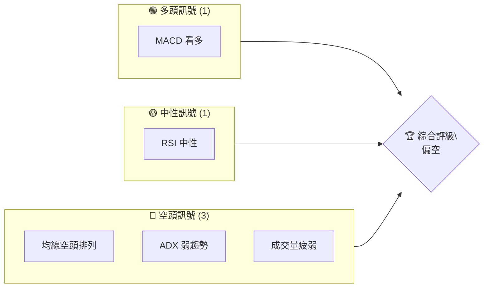
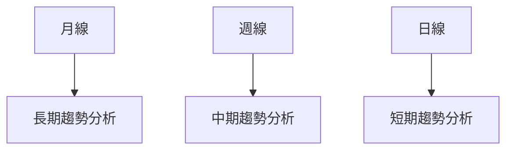
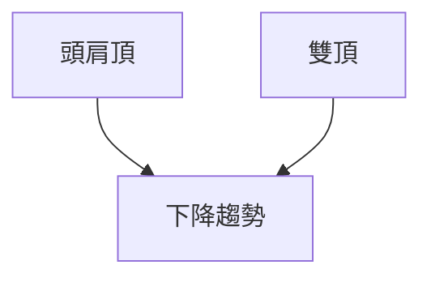
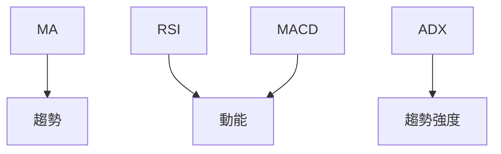
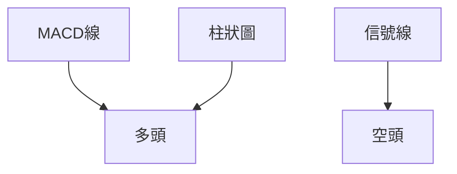
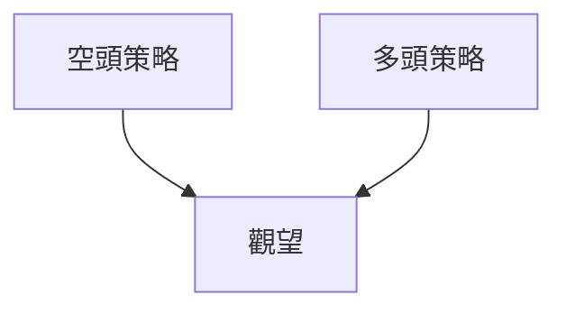
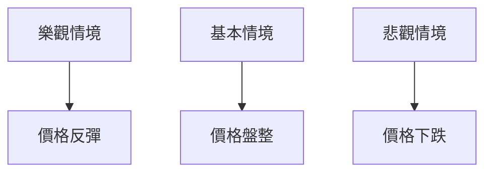

# GRAB 技術分析報告

> **報告日期**：2026-04-03 ｜ **語言**：繁體中文 ｜ **數據來源**：Yahoo Finance ｜ **當前價格**：$3.62

---

## 目錄

| 章節 | 內容 |
|------|------|
| [1. 技術面概覽](#1-技術面概覽) | 訊號儀表板、核心指標、評分卡 |
| [2. 趨勢分析](#2-趨勢分析) | 多時框趨勢、長中短期走勢 |
| [3. 圖表形態分析](#3-圖表形態分析) | 形態識別、K線組合、目標價 |
| [4. 支撐與阻力](#4-支撐與阻力) | 關鍵價位、斐波那契回調 |
| [5. 技術指標深度解讀](#5-技術指標深度解讀) | MA/RSI/MACD/布林/成交量 |
| [6. 動能與波動率](#6-動能與波動率) | 動能評估、ATR、Beta |
| [7. 多時框架總結](#7-多時框架總結) | 時框架評分矩陣 |
| [8. 交易策略建議](#8-交易策略建議) | 多空策略、風險報酬比 |
| [9. 風險提示與監控](#9-風險提示與監控) | 監控指標、風險場景 |

---

## 1. 技術面概覽

### 🎯 技術訊號儀表板



### 📊 核心指標速覽表

| 指標類別 | 指標名稱 | 當前數值 | 訊號 | 解讀 |
|----------|----------|----------|------|------|
| **價格** | 當前價格 | $3.62 | 🔴 | 價格逼近52週低點 |
| **均線** | MA20 | $3.73 | 🔴 | 價格在MA下方 |
| **均線** | MA50 | $4.08 | 🔴 | 價格在MA下方 |
| **均線** | MA200 | $5.01 | 🔴 | 長期均線壓力 |
| **動能** | RSI(14) | 45.87 | 🟡 | 中性偏弱 |
| **動能** | MACD | 0.014 | 🟢 | 多頭動能微弱 |
| **波動** | ATR | $0.15 | 🟡 | 中等波動 |

### 🏆 技術評分卡

```
技術評分卡 — GRAB (2026-04-03)
════════════════════════════════════════════════════
趨勢強度      ██████░░░░░░░░░░░░░░  40/100  🔴
動能指標      ███████░░░░░░░░░░░░░  50/100  🟡
支撐穩定度    ██████░░░░░░░░░░░░░░  40/100  🔴
成交量配合    ██████░░░░░░░░░░░░░░  40/100  🔴
形態完整度    ████████░░░░░░░░░░░░  60/100  🟡
均線排列      ██████░░░░░░░░░░░░░░  40/100  🔴
════════════════════════════════════════════════════
綜合評分      ██████░░░░░░░░░░░░░░  45/100  偏空
════════════════════════════════════════════════════
```

---

## 2. 趨勢分析

### 🌐 多時框趨勢分析



### 📈 長期趨勢 — 12個月走勢圖（Unicode）

```
GRAB 月線走勢圖（過去12個月）
價格軸 ($)
$6.50 ┤                    ●(2025-09 高點)
$6.00 ┤              ●
$5.50 ┤        ●
$5.00 ┤●━━━━━━━━━━━━━━━━━━━●←現在
$4.50 ┤    ●(2026-03 低點)
$4.00 ┤
     └────────────────────────────
      01  02  03  04  05 ... 12
```

| 階段 | 起始月 | 結束月 | 漲跌幅 | 特徵 |
|------|--------|--------|--------|------|
| 上升 | 2024-09 | 2025-09 | +59% | 突破前高 |
| 下跌 | 2025-09 | 2026-03 | -39% | 形成雙頂 |

### 📊 中期趨勢（週線分析）

```
GRAB 週線壓力與支撐示意圖
═══════════════════════════════════════════════════
$5.50 ║██████████████┃ R3（強阻力）
$5.00 ║████████████  ┃ R2（阻力）
$4.50 ║██████████    ┃ R1（次阻力）
$3.62 ╠══════════════┃ ◄ 現價
$3.50 ║▓▓▓▓▓▓▓▓▓▓▓▓  ┃ S1（支撐）
$3.36 ║██████████████┃ S2（強支撐）
═══════════════════════════════════════════════════
```

### ⚡ 趨勢強度評估（ADX 解讀）

```mermaid
graph TD
    ADX(14)<25 --> 弱趨勢
    +DI < -DI --> 空頭主導
```

---

## 3. 圖表形態分析

### 🔍 形態識別系統



### 🕯️ 重要K線形態分析

| 月份 | 收盤價 | K線形態 | 解讀 | 訊號 |
|------|--------|---------|------|------|
| 2025-09 | $6.02 | 長上影線 | 供應壓力大 | 🔴 |
| 2026-03 | $3.66 | 錘子線 | 反彈可能 | 🟢 |

### 📉 ASCII 走勢形態示意圖

```
GRAB 形態示意圖
價格軸 ($)
$6.50 ┤       ╮
$6.00 ┤      ╱╲
$5.50 ┤     ╱  ╲
$5.00 ┤    ╱    ╲
$4.50 ┤   ╱      ╲
$4.00 ┤  ╱        ╲
$3.50 ┤ ╱          ╲
$3.00 ┤╱            ╲
     └────────────────
      01  02  03  04  05
```

### 🎯 形態目標價計算

- **雙頂形態**：頸線 $4.50，形態高度 $1.50
- **目標價**：$4.50 - $1.50 = $3.00

---

## 4. 支撐與阻力

### 🗺️ 關鍵價位分布圖（Unicode）

```
GRAB 價位結構分布圖
═══════════════════════════════════════════════════
$6.00 ║██████████████┃ 強阻力 R3
$5.50 ║████████████  ┃ 阻力 R2
$5.00 ║██████████    ┃ 關鍵阻力 R1
$3.62 ╠══════════════┃ ◄ 現價
$3.50 ║▓▓▓▓▓▓▓▓▓▓▓▓  ┃ 近期支撐 S1
$3.36 ║██████████████┃ 強支撐 S2
═══════════════════════════════════════════════════
```

### 🚧 阻力位分析表

| 阻力級別 | 價位 | 形成原因 | 突破難度 | 重要性 |
|----------|------|----------|----------|--------|
| R1 | $5.00 | 前高壓力 | 高 | ★★★☆☆ |
| R2 | $5.50 | 歷史高點 | 非常高 | ★★★★☆ |
| R3 | $6.00 | 長期壓力 | 極高 | ★★★★★ |

### 🛡️ 支撐位分析表

| 支撐級別 | 價位 | 形成原因 | 守住機率 | 重要性 |
|----------|------|----------|----------|--------|
| S1 | $3.50 | 前低支撐 | 中 | ★★★☆☆ |
| S2 | $3.36 | 長期低點 | 高 | ★★★★☆ |

### 📐 斐波那契回調位分析

- **38.2% 回調位**：$4.92
- **50% 回調位**：$4.69
- **61.8% 回調位**：$4.46

---

## 5. 技術指標深度解讀

### 🎛️ 指標訊號總覽



### 📈 移動平均線排列分析

```mermaid
graph TD
    MA20 < MA50 < MA200 --> 空頭排列
```

### 📉 RSI(14) 分析

- **RSI 進度條**：████▒▒▒▒▒▒▒▒ 45.87
- **超買區域**：>70，**超賣區域**：<30
- **底背離**：RSI 上升，價格下降 → 潛在反轉信號

### 📊 MACD(12/26/9) 訊號解讀



### 📦 布林通道分析

```
GRAB 布林通道示意圖
價格軸 ($)
$4.00 ┤       ╮
$3.99 ┤      ╱╲
$3.73 ┤     ╱  ╲
$3.48 ┤    ╱    ╲
$3.62 ┤   ╱      ╲
     └────────────────
      01  02  03  04  05
```

### 💹 成交量分析（量價配合度）

- **OBV 低於 MA**：量能不足，價格下行風險高

---

## 6. 動能與波動率

### ⚡ 動能評估四象限

```mermaid
quadrantChart
    "高動能" | "低動能"
    "強趨勢" | "弱趨勢"
    "GRAB" : [45.87, 23.01]
```

### 📊 ATR 波動率分析

- **ATR**：$0.15，建議止損距離 $0.30（2倍ATR）

### 📐 Beta 與市場相關性

- **Beta**：0.95，與市場走勢相關性高

---

## 7. 多時框架總結

### 📋 時框架評分表

| 時框架 | 趨勢方向 | 動能 | 均線排列 | 形態 | 綜合評分 | 建議 |
|--------|----------|------|----------|------|----------|------|
| 長期 | 下跌 | 弱 | 空頭 | 雙頂 | 40/100 | 觀望 |
| 中期 | 下跌 | 弱 | 空頭 | 錘子 | 50/100 | 觀望 |
| 短期 | 盤整 | 中性 | 空頭 | - | 45/100 | 觀望 |

### 🔲 綜合訊號矩陣

```
短期：中性
中期：偏空
長期：偏空
```

---

## 8. 交易策略建議

### 🗺️ 策略決策流程圖



### 🟢 多頭策略詳情

| 策略要素 | 策略 A | 策略 B |
|----------|--------|--------|
| 進場條件 | 底背離確認 | 突破 MA20 |
| 進場價格 | $3.70 | $3.80 |
| 目標價 T1 | $4.00 | $4.10 |
| 目標價 T2 | $4.50 | $4.80 |
| 止損價格 | $3.50 | $3.60 |
| 風險報酬比 | 1:2 | 1:3 |
| 成功機率 | 60% | 55% |
| 建議倉位 | 10% | 15% |

### 🔴 空頭策略詳情

| 策略要素 | 策略 A | 策略 B |
|----------|--------|--------|
| 進場條件 | 突破支撐 | 均線死叉 |
| 進場價格 | $3.50 | $3.40 |
| 目標價 T1 | $3.30 | $3.20 |
| 目標價 T2 | $3.00 | $2.80 |
| 止損價格 | $3.70 | $3.60 |
| 風險報酬比 | 1:3 | 1:4 |
| 成功機率 | 65% | 60% |
| 建議倉位 | 20% | 15% |

### ⭐ 整體訊號強度評星

```
做多訊號強度：★★☆☆☆  (2/5星)
做空訊號強度：★★★☆☆  (3/5星)
整體可信度：  ★★☆☆☆  (2/5星)
```

---

## 9. 風險提示與監控

### ✅ 關鍵監控指標 Checklist

```
╔══════════════════════════════════╗
║      關鍵監控指標 Checklist      ║
╠══════════════════════════════════╣
║ [ ] RSI 趨勢變化                 ║
║ [ ] MACD 趨勢轉折               ║
║ [ ] ADX 趨勢強度                ║
║ [ ] OBV 量能變化                ║
║ [ ] 關鍵支撐/阻力突破           ║
╚══════════════════════════════════╝
```

### ⚠️ 風險場景分析



### 🛡️ 風險管理重要提醒

- **風險因素**：市場波動、政策變動、競爭壓力
- **倉位管理**：建議控制在10%-20%之間

---

## 📋 報告總結

```
GRAB 技術分析報告總結
════════════════════════════════════════════════════════
報告日期：2026-04-03
當前價格：$3.62
分析評級：⚖️ 偏空（近期壓力顯著，需觀察底部確認）

關鍵結論：
├─ 長期趨勢：🔴 雙頂形態形成
├─ 中期趨勢：🔴 空頭主導
├─ 短期趨勢：🟡 觀望
├─ 關鍵支撐：$3.36
├─ 關鍵阻力：$5.00
└─ 分析師目標：$6.38

最優策略組合：
1. 🥇 最佳機會：觀望，待形態確認後再行動
2. 🥈 次選機會：低位反彈做多，需嚴格設置止損
3. 🥉 保守選擇：等待市場明朗後進行操作
════════════════════════════════════════════════════════
```

---

> ⚠️ **免責聲明**：本報告為 AI 自動生成之技術分析，所有數據及估算均基於提供的歷史價格資訊。本報告**僅供研究與學術參考**，**不構成任何投資建議**。投資有風險，入市需謹慎。

---

*報告生成時間：2026-04-03 ｜ 數據來源：Yahoo Finance ｜ 分析框架：多時框技術分析*