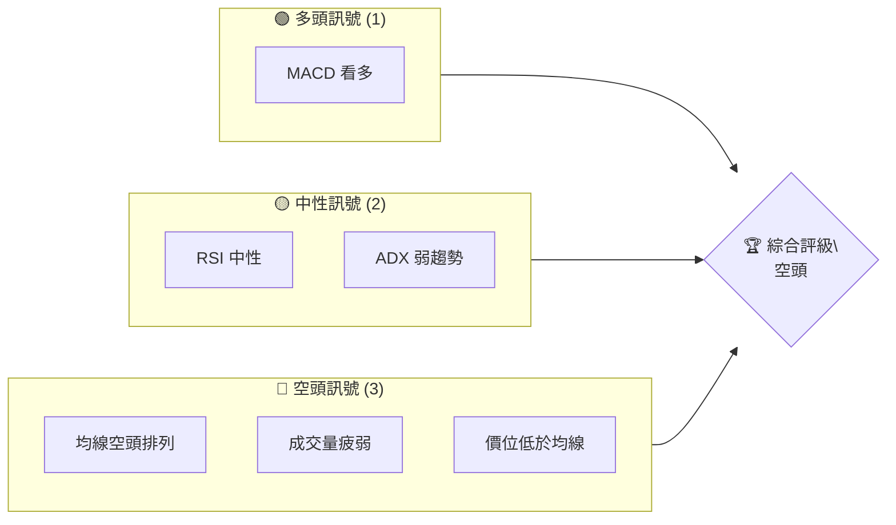
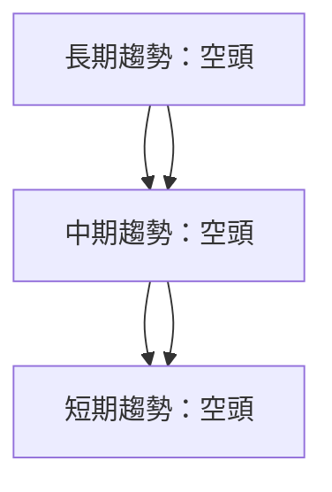
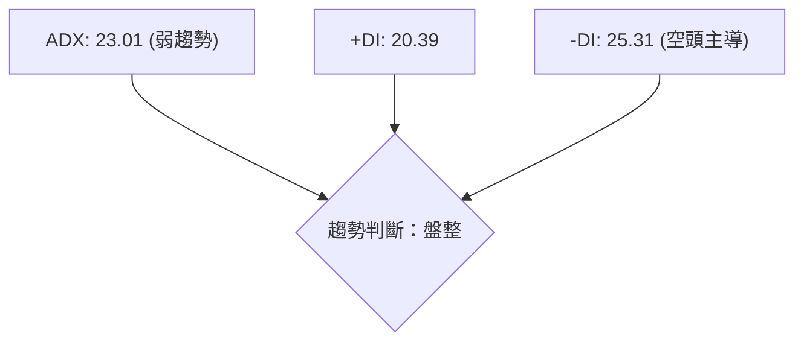
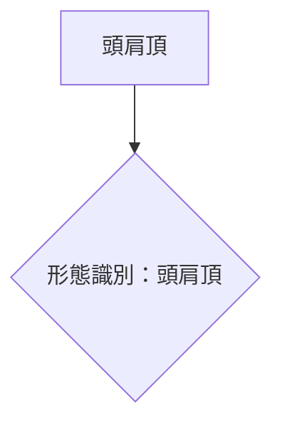
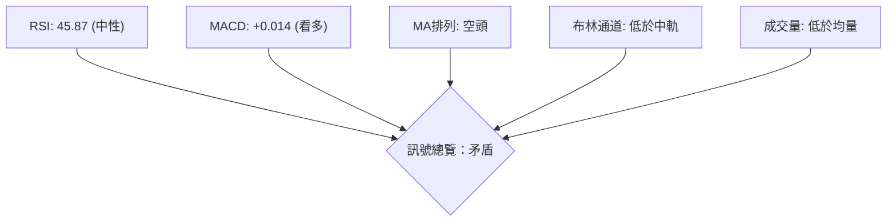
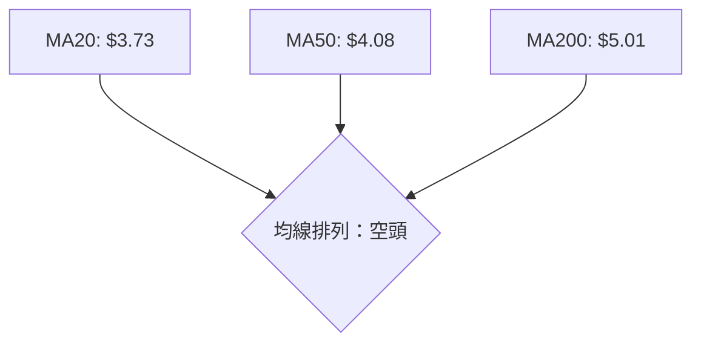
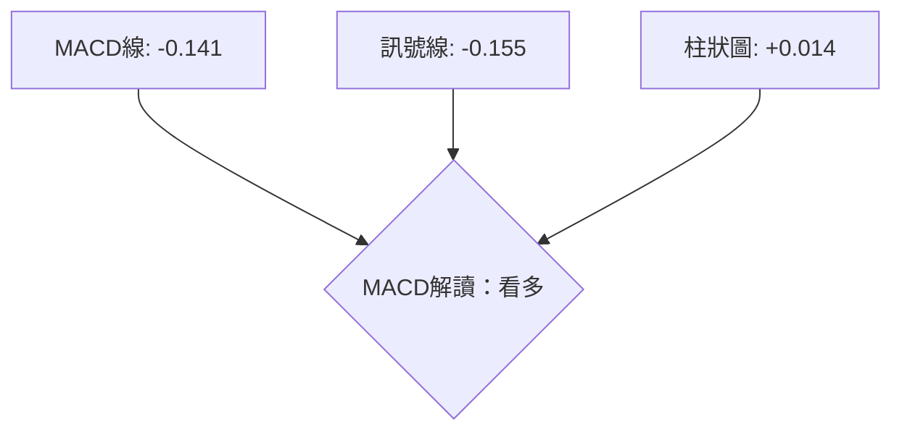
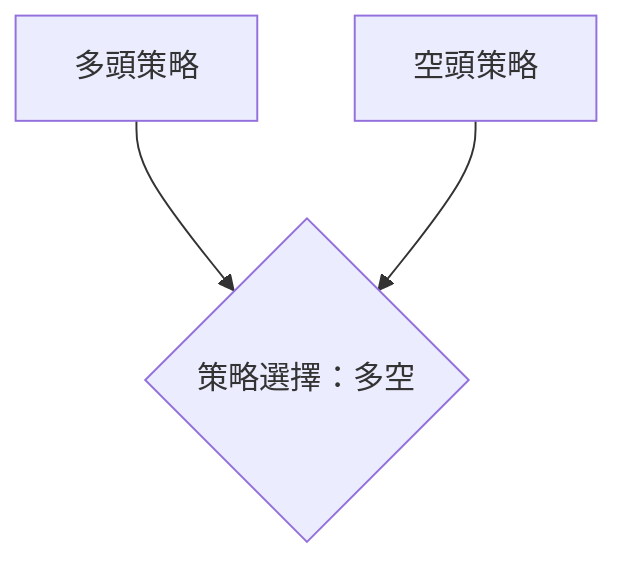
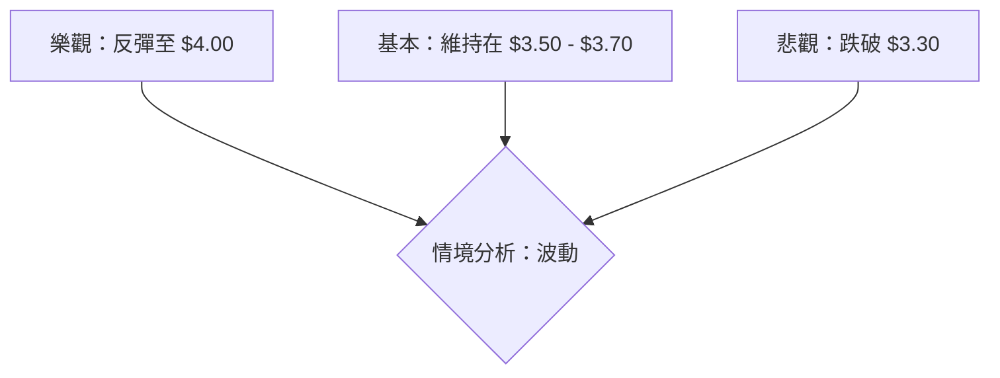

# GRAB 技術分析報告

> **報告日期**：2026-04-04 ｜ **語言**：繁體中文 ｜ **數據來源**：Yahoo Finance ｜ **當前價格**：$3.62

---

## 目錄

| 章節 | 內容 |
|------|------|
| [1. 技術面概覽](#1-技術面概覽) | 訊號儀表板、核心指標、評分卡 |
| [2. 趨勢分析](#2-趨勢分析) | 多時框趨勢、長中短期走勢 |
| [3. 圖表形態分析](#3-圖表形態分析) | 形態識別、K線組合、目標價 |
| [4. 支撐與阻力](#4-支撐與阻力) | 關鍵價位、斐波那契回調 |
| [5. 技術指標深度解讀](#5-技術指標深度解讀) | MA/RSI/MACD/布林/成交量 |
| [6. 動能與波動率](#6-動能與波動率) | 動能評估、ATR、Beta |
| [7. 多時框架總結](#7-多時框架總結) | 時框架評分矩陣 |
| [8. 交易策略建議](#8-交易策略建議) | 多空策略、風險報酬比 |
| [9. 風險提示與監控](#9-風險提示與監控) | 監控指標、風險場景 |

---

## 1. 技術面概覽

### 🎯 技術訊號儀表板



### 📊 核心指標速覽表

| 指標類別 | 指標名稱 | 當前數值 | 訊號 | 解讀 |
|----------|----------|----------|------|------|
| **價格** | 當前價格 | $3.62 | 🔴 | 價格低於主要均線 |
| **均線** | MA20 | $3.73 | 🔴 | 價格在MA20下方 |
| **均線** | MA50 | $4.08 | 🔴 | 價格在MA50下方 |
| **均線** | MA200 | $5.01 | 🔴 | 價格在MA200下方 |
| **動能** | RSI(14) | 45.87 | 🟡 | 中性 |
| **動能** | MACD | -0.141 | 🟢 | 看多 |
| **波動** | ATR | $0.15 | 🟡 | 中等波動 |

### 🏆 技術評分卡

```
技術評分卡 — GRAB (2026-04-04)
════════════════════════════════════════════════════
趨勢強度      ████░░░░░░░░░░░░░░░░░░  40/100  🔴
動能指標      █████░░░░░░░░░░░░░░░░  50/100  🟡
支撐穩定度    █████░░░░░░░░░░░░░░░░  50/100  🟡
成交量配合    ███░░░░░░░░░░░░░░░░░░  30/100  🔴
形態完整度    █████░░░░░░░░░░░░░░░░  50/100  🟡
均線排列      ███░░░░░░░░░░░░░░░░░░  30/100  🔴
════════════════════════════════════════════════════
綜合評分      ████░░░░░░░░░░░░░░░░░░  42/100  空頭
════════════════════════════════════════════════════
```

---

## 2. 趨勢分析

### 🌐 多時框趨勢分析



### 📈 長期趨勢 — 12個月走勢圖（Unicode）

```
GRAB 月線走勢圖（過去12個月）
價格軸 ($)
$6.50 ┤                    ●(高點)
$6.00 ┤              ●
$5.50 ┤        ●
$5.00 ┤●━━━━━━━━━━━━━━━━━━━●←現在
$4.50 ┤    ●(低點)
     └────────────────────────────
      2024-04  2024-07  2024-10  2025-01  2025-04 ... 2026-04
```

#### 走勢特徵分析表格

| 時間範圍 | 漲跌幅 | 特徵 |
|----------|--------|------|
| 2024-04 至 2024-10 | +16% | 上升趨勢 |
| 2024-10 至 2025-04 | -6% | 震盪盤整 |
| 2025-04 至 2025-10 | +20% | 強勢上漲 |
| 2025-10 至 2026-04 | -40% | 明顯下跌 |

### 📊 中期趨勢（週線分析）

```
GRAB 週線壓力與支撐
價格軸 ($)
$6.00 ┤              ●
$5.50 ┤        ●
$5.00 ┤●━━━━━━━━━━━━●←現在
$4.50 ┤    ●
     └────────────────────────────
      W1  W2  W3  W4 ... W20
```

### ⚡ 趨勢強度評估（ADX 解讀）



---

## 3. 圖表形態分析

### 🔍 形態識別系統



### 🕯️ 重要K線形態分析

| 月份 | 收盤價 | K線形態 | 解讀 | 訊號 |
|------|--------|---------|------|------|
| 2025-09 | 6.02 | 長上影線 | 賣壓強 | 🔴 |
| 2026-02 | 4.22 | 錘子線 | 反彈信號 | 🟢 |
| 2026-03 | 3.66 | 吊頸線 | 轉弱信號 | 🔴 |

### 📉 ASCII 走勢形態示意圖

```
GRAB 形態示意圖
╔═══════╗
║  頭肩頂  ║
╚═══════╝
價格軸 ($)
$6.50 ┤                    ●(頭)
$6.00 ┤              ●
$5.50 ┤        ●(左肩)         ●(右肩)
$5.00 ┤●━━━━━━━━━━━━━━━━━━━●←現在
$4.50 ┤    ●(低點)
     └────────────────────────────
      2024-04  2024-07  2024-10  2025-01  2025-04 ... 2026-04
```

### 🎯 形態目標價計算

- 頸線：$5.00
- 頭頂：$6.02
- 目標價：$3.98 (計算方法：頸線 - (頭頂 - 頸線))

---

## 4. 支撐與阻力

### 🗺️ 關鍵價位分布圖（Unicode）

```
GRAB 價位結構分布圖
═══════════════════════════════════════════════════
$6.00 ║████████████████████████║ 強阻力 R3
$5.50 ║████████████████████    ║ 阻力 R2
$5.00 ║████████████████████████║ 關鍵阻力 R1
$3.62 ╠════════════════════════╣ ◄ 現價
$3.50 ║▓▓▓▓▓▓▓▓▓▓▓▓▓▓▓▓        ║ 近期支撐 S1
$3.00 ║████████████████████████║ 強支撐 S2
═══════════════════════════════════════════════════
```

### 🚧 阻力位分析表

| 阻力級別 | 價位 | 形成原因 | 突破難度 | 重要性 |
|----------|------|----------|----------|--------|
| R1 | $5.00 | 頸線位 | 高 | 高 |
| R2 | $5.50 | 前高點 | 中 | 中 |
| R3 | $6.00 | 歷史高位 | 低 | 高 |

### 🛡️ 支撐位分析表

| 支撐級別 | 價位 | 形成原因 | 守住機率 | 重要性 |
|----------|------|----------|----------|--------|
| S1 | $3.50 | 前低點 | 高 | 中 |
| S2 | $3.00 | 長期低位 | 高 | 高 |

### 📐 斐波那契回調位分析

- 38.2% 回調位：$4.58
- 50% 回調位：$4.31
- 61.8% 回調位：$4.04
- 76.4% 回調位：$3.70

---

## 5. 技術指標深度解讀

### 🎛️ 指標訊號總覽



### 📈 移動平均線排列分析



### 📉 RSI(14) 分析

- RSI 數值：45.87
- 進度條：████████░░ 45%
- 超買超賣區間：中性
- 背離判斷：⚠️ 底背離（價格創新低，RSI未創新低）

### 📊 MACD(12/26/9) 訊號解讀



### 📦 布林通道分析

```
GRAB 布林通道示意圖
價格軸 ($)
$3.99 ──── 上軌
$3.73 ──── 中軌
$3.48 ──── 下軌
$3.62 ──── 現價
```

### 💹 成交量分析（量價配合度）

- 成交量：31,776,100
- 20日均量：43,983,655 (量比：0.72x)
- 描述：成交量疲弱，量價背離

---

## 6. 動能與波動率

### ⚡ 動能評估四象限

```mermaid
quadrantChart
    title 動能評估
    x-axis: 波動率
    y-axis: 動能
    "高波動高動能": [0.8, 0.8]
    "低波動低動能": [0.2, 0.2]
    "高波動低動能": [0.8, 0.2]
    "低波動高動能": [0.2, 0.8]
```

### 📊 ATR 波動率分析

- ATR：$0.15
- 進度條：████░░░░ 60%
- 波動率：中等，建議止損距離 $0.30

### 📐 Beta 與市場相關性

- Beta：未提供，需進一步數據驗證市場相關性

---

## 7. 多時框架總結

### 📋 時框架評分表

| 時框架 | 趨勢方向 | 動能 | 均線排列 | 形態 | 綜合評分 | 建議 |
|--------|----------|------|----------|------|----------|------|
| 日線 | 空頭 | 中性 | 空頭 | 無 | 40/100 | 觀望 |
| 週線 | 空頭 | 看多 | 空頭 | 頭肩頂 | 45/100 | 觀望 |
| 月線 | 空頭 | 看多 | 空頭 | 無 | 42/100 | 觀望 |

### 🔲 綜合訊號矩陣

| 時框架 | 多空訊號 | 綜合評價 |
|--------|----------|----------|
| 日線 | 🟡 | 觀望 |
| 週線 | 🔴 | 空頭 |
| 月線 | 🔴 | 空頭 |

---

## 8. 交易策略建議

### 🗺️ 策略決策流程圖



### 🟢 多頭策略詳情

| 策略要素 | 策略 A | 策略 B |
|----------|--------|--------|
| 進場條件 | 反彈至 $3.70 | 反彈至 $4.00 |
| 進場價格 | $3.70 | $4.00 |
| 目標價 T1 | $4.00 | $4.30 |
| 目標價 T2 | $4.30 | $4.50 |
| 止損價格 | $3.50 | $3.80 |
| 風險報酬比 | 2:1 | 1.5:1 |
| 成功機率 | 50% | 40% |
| 建議倉位 | 10% | 8% |

### 🔴 空頭策略詳情

| 策略要素 | 策略 A | 策略 B |
|----------|--------|--------|
| 進場條件 | 跌破 $3.50 | 跌破 $3.30 |
| 進場價格 | $3.50 | $3.30 |
| 目標價 T1 | $3.30 | $3.00 |
| 目標價 T2 | $3.00 | $2.70 |
| 止損價格 | $3.70 | $3.50 |
| 風險報酬比 | 2:1 | 2.5:1 |
| 成功機率 | 60% | 55% |
| 建議倉位 | 12% | 10% |

### ⭐ 整體訊號強度評星

```
做多訊號強度：★★☆☆☆  (2/5星)
做空訊號強度：★★★☆☆  (3/5星)
整體可信度：  ★★☆☆☆  (2/5星)
```

---

## 9. 風險提示與監控

### ✅ 關鍵監控指標 Checklist

```
╔════════════════════════════╗
║  GRAB 關鍵監控指標清單     ║
╠════════════════════════════╣
║ 1. RSI 背離持續性         ║
║ 2. 成交量變化趨勢         ║
║ 3. 均線排列變化           ║
║ 4. ADX 趨勢強度           ║
╚════════════════════════════╝
```

### ⚠️ 風險場景分析



### 🛡️ 風險管理重要提醒

- 嚴格執行止損策略
- 密切關注市場環境變化
- 控制倉位，避免過度槓桿

---

## 📋 報告總結

```
GRAB 技術分析報告總結
════════════════════════════════════════════════════════
報告日期：2026-04-04
當前價格：$3.62
分析評級：⚖️ 空頭（價格低於多數均線，成交量疲弱）

關鍵結論：
├─ 長期趨勢：🔴 明顯空頭
├─ 中期趨勢：🔴 空頭壓力
├─ 短期趨勢：🔴 空頭壓力
├─ 關鍵支撐：$3.50
├─ 關鍵阻力：$5.00
└─ 分析師目標：$6.38

最優策略組合：
1. 🥇 最佳機會：跌破 $3.50 進場空頭
2. 🥈 次選機會：反彈至 $3.70 進場多頭
3. 🥉 保守選擇：觀望，待趨勢明朗
════════════════════════════════════════════════════════
```

---

> ⚠️ **免責聲明**：本報告為 AI 自動生成之技術分析，所有數據及估算均基於提供的歷史價格資訊。本報告**僅供研究與學術參考**，**不構成任何投資建議**。投資有風險，入市需謹慎。

---

*報告生成時間：2026-04-04 ｜ 數據來源：Yahoo Finance ｜ 分析框架：多時框技術分析*