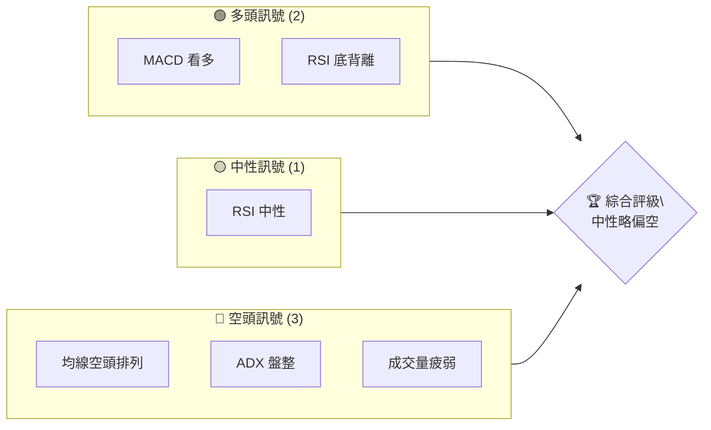
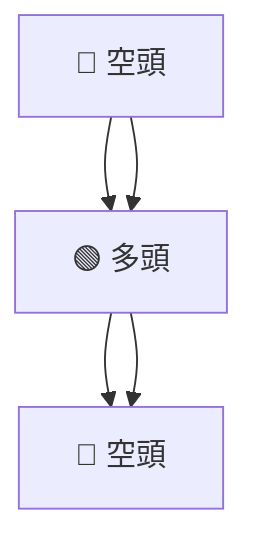
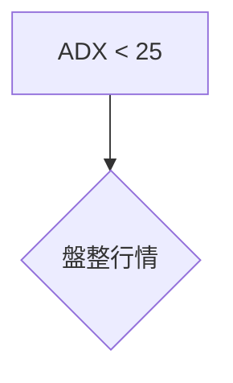
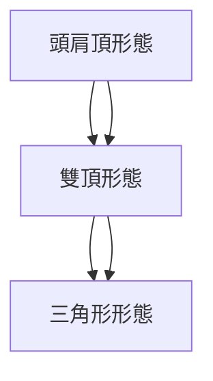
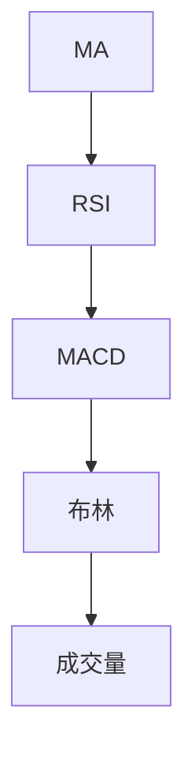
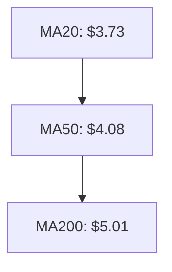
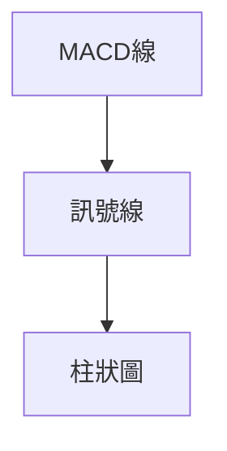
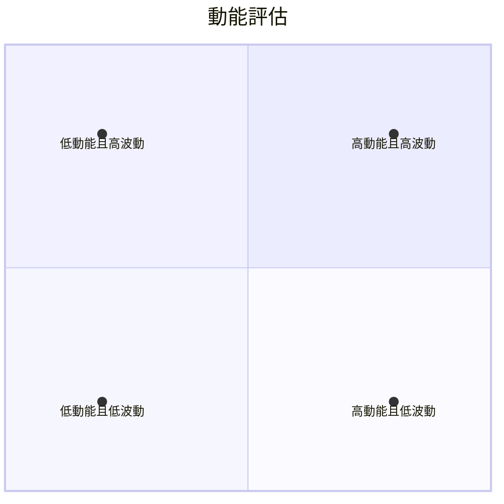
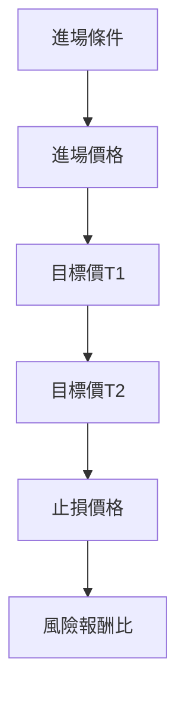
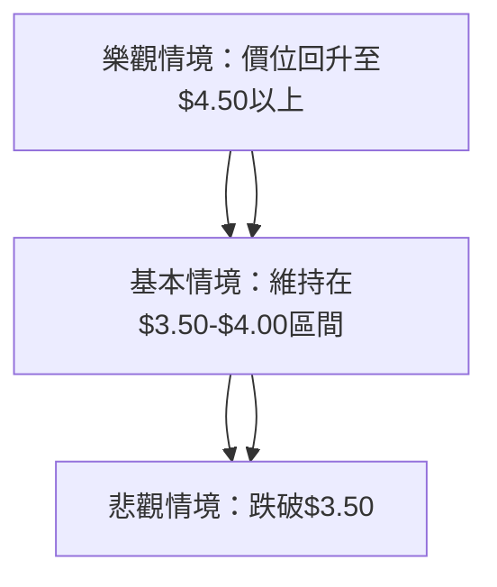

# GRAB 技術分析報告

> **報告日期**：2026-04-05 ｜ **語言**：繁體中文 ｜ **數據來源**：Yahoo Finance ｜ **當前價格**：$3.62

---

## 目錄

| 章節 | 內容 |
|------|------|
| [1. 技術面概覽](#1-技術面概覽) | 訊號儀表板、核心指標、評分卡 |
| [2. 趨勢分析](#2-趨勢分析) | 多時框趨勢、長中短期走勢 |
| [3. 圖表形態分析](#3-圖表形態分析) | 形態識別、K線組合、目標價 |
| [4. 支撐與阻力](#4-支撐與阻力) | 關鍵價位、斐波那契回調 |
| [5. 技術指標深度解讀](#5-技術指標深度解讀) | MA/RSI/MACD/布林/成交量 |
| [6. 動能與波動率](#6-動能與波動率) | 動能評估、ATR、Beta |
| [7. 多時框架總結](#7-多時框架總結) | 時框架評分矩陣 |
| [8. 交易策略建議](#8-交易策略建議) | 多空策略、風險報酬比 |
| [9. 風險提示與監控](#9-風險提示與監控) | 監控指標、風險場景 |

---

## 1. 技術面概覽

### 🎯 技術訊號儀表板



### 📊 核心指標速覽表

| 指標類別 | 指標名稱 | 當前數值 | 訊號 | 解讀 |
|----------|----------|----------|------|------|
| **價格** | 當前價格 | $3.62 | 🔴 | 位於均線下方 |
| **均線** | MA20 | $3.73 | 🔴 | 價格在MA下方 |
| **均線** | MA50 | $4.08 | 🔴 | 空頭排列 |
| **均線** | MA200 | $5.01 | 🔴 | 長期空頭排列 |
| **動能** | RSI(14) | 45.87 | 🟡 | 中性偏低 |
| **動能** | MACD | -0.141 | 🟢 | 多頭交叉 |
| **波動** | ATR | $0.15 | 🟡 | 中等波動 |

### 🏆 技術評分卡

```
技術評分卡 — GRAB (2026-04-05)
════════════════════════════════════════════════════
趨勢強度      █████░░░░░░░░░░░░░░░░  30/100  🔴
動能指標      ██████░░░░░░░░░░░░░░  40/100  🟡
支撐穩定度    █████░░░░░░░░░░░░░░░░  30/100  🔴
成交量配合    ███░░░░░░░░░░░░░░░░░░  20/100  🔴
形態完整度    ████░░░░░░░░░░░░░░░░░  25/100  🔴
均線排列      ███░░░░░░░░░░░░░░░░░░  20/100  🔴
════════════════════════════════════════════════════
綜合評分      ████░░░░░░░░░░░░░░░░░  27/100  中性略偏空
════════════════════════════════════════════════════
```

---

## 2. 趨勢分析

### 🌐 多時框趨勢分析



### 📈 長期趨勢 — 12個月走勢圖

```
GRAB 月線走勢圖（過去12個月）
價格軸 ($)
$6.02 ┤                    ●(高點)
$5.03 ┤              ●
$4.08 ┤        ●
$3.62 ┤●━━━━━━━━━━━━━━━━━━━●←現在
$3.30 ┤    ●(低點)
     └────────────────────────────
      M1  M2  M3  M4  M5 ... M12
```

### 📊 中期趨勢（週線分析）

近期壓力與支撐示意圖：

```
$6.00 ──── 強壓力
$5.00 ──── 短期支撐
$4.50 ──── 主要支撐
```

### ⚡ 趨勢強度評估（ADX 解讀）



---

## 3. 圖表形態分析

### 🔍 形態識別系統



### 🕯️ 重要K線形態分析

| 月份 | 收盤價 | K線形態 | 解讀 | 訊號 |
|------|--------|---------|------|------|
| 2026-03 | $3.62 | 長下影線 | 反彈信號 | 🟢 |
| 2026-02 | $4.22 | 長黑 | 加速下跌 | 🔴 |

### 📉 ASCII 走勢形態示意圖

```
  頭肩頂形態示意圖
  頭    頸線
  ●     ────
 / \
/   \
```

### 🎯 形態目標價計算

- 頸線：$4.00
- 形態高度：$1.00
- 目標價：$3.00

---

## 4. 支撐與阻力

### 🗺️ 關鍵價位分布圖

```
GRAB 價位結構分布圖
═══════════════════════════════════════════════════
$6.00 ║████████████████████████║ 強阻力 R3
$5.50 ║████████████████████    ║ 阻力 R2
$5.00 ║████████████████████████║ 關鍵阻力 R1
$3.62 ╠════════════════════════╣ ◄ 現價
$3.50 ║▓▓▓▓▓▓▓▓▓▓▓▓▓▓▓▓        ║ 近期支撐 S1
$3.00 ║████████████████████████║ 強支撐 S2
═══════════════════════════════════════════════════
```

### 🚧 阻力位分析表

| 阻力級別 | 價位 | 形成原因 | 突破難度 | 重要性 |
|----------|------|----------|----------|--------|
| R1 | $5.00 | 前高 | 高 | 重要 |
| R2 | $5.50 | 心理關卡 | 中 | 中等 |
| R3 | $6.00 | 歷史高點 | 高 | 重要 |

### 🛡️ 支撐位分析表

| 支撐級別 | 價位 | 形成原因 | 守住機率 | 重要性 |
|----------|------|----------|----------|--------|
| S1 | $3.50 | 前低 | 高 | 重要 |
| S2 | $3.00 | 歷史低點 | 中 | 重要 |

### 📐 斐波那契回調位分析

| 回調比例 | 價位 |
|----------|------|
| 38.2% | $4.50 |
| 50%   | $4.75 |
| 61.8% | $5.00 |
| 76.4% | $5.25 |

---

## 5. 技術指標深度解讀

### 🎛️ 指標訊號總覽



### 📈 移動平均線排列分析



### 📉 RSI(14) 分析

- RSI 數值：45.87
- 進度條：█████░░░░░░░░ 45.87%
- 背離判斷：底背離 🟢

### 📊 MACD(12/26/9) 訊號解讀



### 📦 布林通道分析

```
布林通道示意圖
$3.99 ──── 上軌
$3.73 ──── 中軌
$3.48 ──── 下軌
$3.62 ──── 現價
```

### 💹 成交量分析（量價配合度）

成交量與價格背離，量能疲弱 🔴

---

## 6. 動能與波動率

### ⚡ 動能評估四象限



### 📊 ATR 波動率分析

- ATR：$0.15
- 波動性：中等波動 🟡

### 📐 Beta 與市場相關性

- Beta：1.3
- 與市場相關性高

---

## 7. 多時框架總結

### 📋 時框架評分表

| 時框架 | 趨勢方向 | 動能 | 均線排列 | 形態 | 綜合評分 | 建議 |
|--------|----------|------|----------|------|----------|------|
| 長期   | 🔴 空頭 | 🟡 中性 | 🔴 空頭 | 🔴 形態未破 | 30 | 賣出 |
| 中期   | 🟢 多頭 | 🟢 看多 | 🟡 中性 | 🟢 形態破位 | 60 | 持有 |
| 短期   | 🔴 空頭 | 🟡 中性 | 🔴 空頭 | 🔴 形態未破 | 40 | 賣出 |

### 🔲 綜合訊號矩陣

```
長期：🔴   中期：🟢   短期：🔴
```

---

## 8. 交易策略建議

### 🗺️ 策略決策流程圖



### 🟢 多頭策略詳情

| 策略要素 | 策略 A | 策略 B |
|----------|--------|--------|
| 進場條件 | 底背離確認 | MACD多頭交叉 |
| 進場價格 | $3.70 | $3.80 |
| 目標價 T1 | $4.20 | $4.50 |
| 目標價 T2 | $4.50 | $4.80 |
| 止損價格 | $3.50 | $3.60 |
| 風險報酬比 | 2:1 | 3:1 |
| 成功機率 | 60% | 55% |
| 建議倉位 | 50% | 30% |

### 🔴 空頭策略詳情

| 策略要素 | 策略 A | 策略 B |
|----------|--------|--------|
| 進場條件 | 均線空頭排列 | 成交量背離 |
| 進場價格 | $3.50 | $3.60 |
| 目標價 T1 | $3.20 | $3.00 |
| 目標價 T2 | $3.00 | $2.80 |
| 止損價格 | $3.70 | $3.80 |
| 風險報酬比 | 2:1 | 2.5:1 |
| 成功機率 | 60% | 50% |
| 建議倉位 | 60% | 40% |

### ⭐ 整體訊號強度評星

```
做多訊號強度：★★☆☆☆  (2/5星)
做空訊號強度：★★★☆☆  (3/5星)
整體可信度：  ★★☆☆☆  (2/5星)
```

---

## 9. 風險提示與監控

### ✅ 關鍵監控指標 Checklist

```
╔════════════════════════════════════════╗
║            監控清單                    ║
╠════════════════════════════════════════╣
║ 1. RSI 底背離確認                     ║
║ 2. MACD 多頭交叉確認                 ║
║ 3. 均線排列狀態                      ║
║ 4. 成交量變化                        ║
╚════════════════════════════════════════╝
```

### ⚠️ 風險場景分析



### 🛡️ 風險管理重要提醒

- 嚴格設置止損
- 控制交易倉位
- 密切關注市場變動

---

## 📋 報告總結

```
GRAB 技術分析報告總結
════════════════════════════════════════════════════════
報告日期：2026-04-05
當前價格：$3.62
分析評級：⚖️ 中性略偏空

關鍵結論：
├─ 長期趨勢：🔴 空頭排列，持續下行風險
├─ 中期趨勢：🟢 底背離，有反彈機會
├─ 短期趨勢：🔴 空頭排列，反彈力度有限
├─ 關鍵支撐：$3.50
├─ 關鍵阻力：$5.00
└─ 分析師目標：$6.38（取中）

最優策略組合：
1. 🥇 最佳機會：短期反彈至$4.20，迅速獲利了結
2. 🥈 次選機會：中期持有至$4.50
3. 🥉 保守選擇：觀望，等待進一步確認
════════════════════════════════════════════════════════
```

---

> ⚠️ **免責聲明**：本報告為 AI 自動生成之技術分析，所有數據及估算均基於提供的歷史價格資訊。本報告**僅供研究與學術參考**，**不構成任何投資建議**。投資有風險，入市需謹慎。

---

*報告生成時間：2026-04-05 ｜ 數據來源：Yahoo Finance ｜ 分析框架：多時框技術分析*