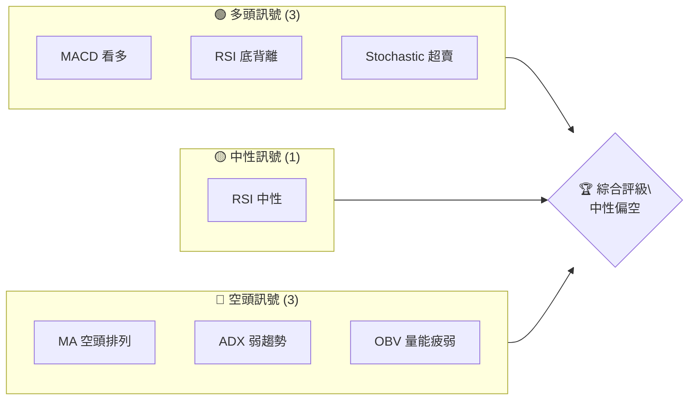
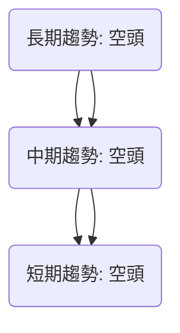
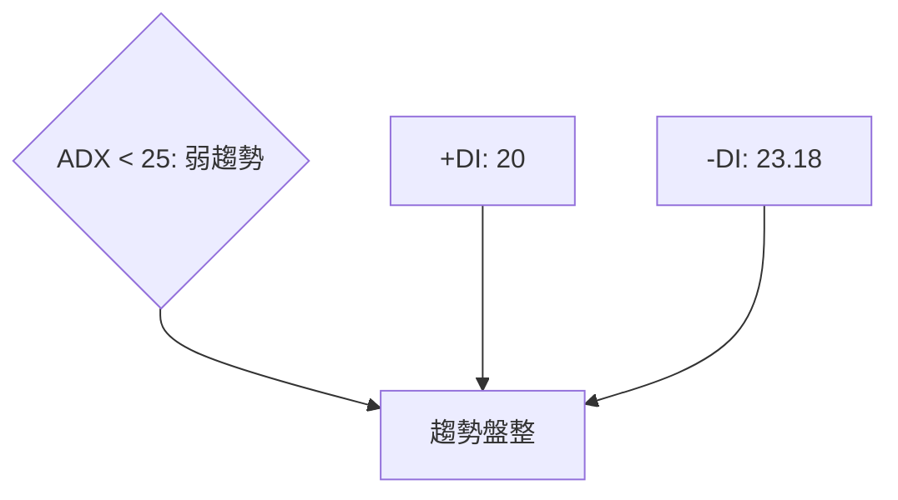
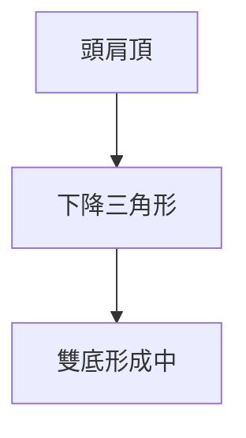
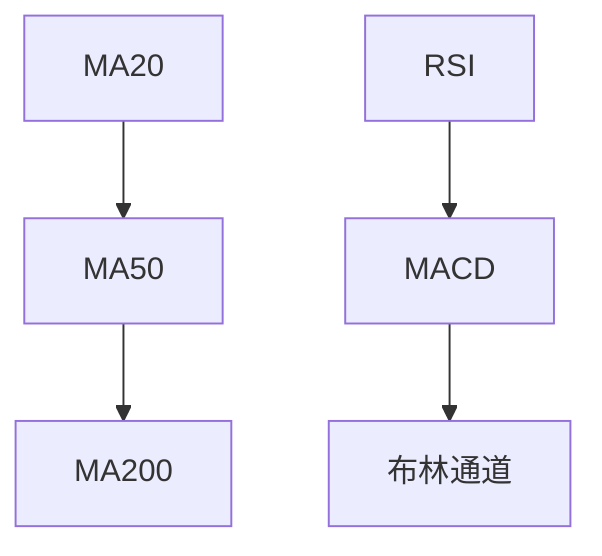
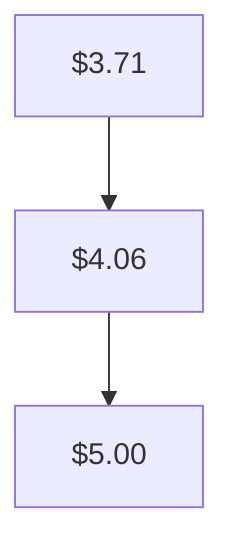
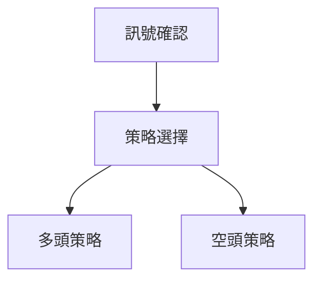
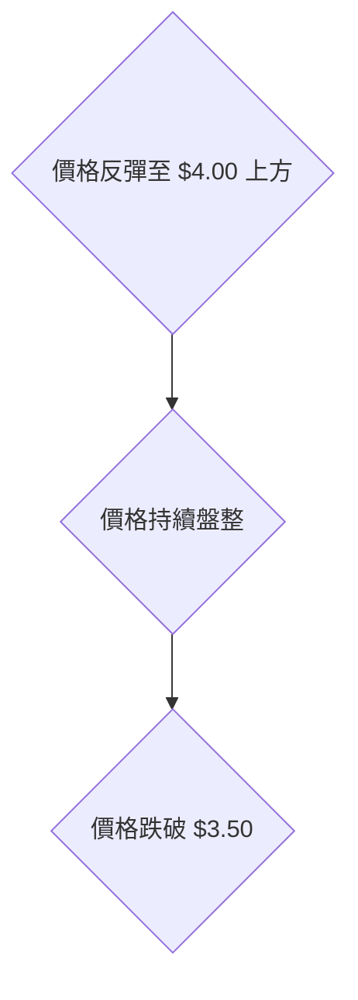

# GRAB 技術分析報告

> **報告日期**：2026-04-06 ｜ **語言**：繁體中文 ｜ **數據來源**：Yahoo Finance ｜ **當前價格**：$3.56

---

## 目錄

| 章節 | 內容 |
|------|------|
| [1. 技術面概覽](#1-技術面概覽) | 訊號儀表板、核心指標、評分卡 |
| [2. 趨勢分析](#2-趨勢分析) | 多時框趨勢、長中短期走勢 |
| [3. 圖表形態分析](#3-圖表形態分析) | 形態識別、K線組合、目標價 |
| [4. 支撐與阻力](#4-支撐與阻力) | 關鍵價位、斐波那契回調 |
| [5. 技術指標深度解讀](#5-技術指標深度解讀) | MA/RSI/MACD/布林/成交量 |
| [6. 動能與波動率](#6-動能與波動率) | 動能評估、ATR、Beta |
| [7. 多時框架總結](#7-多時框架總結) | 時框架評分矩陣 |
| [8. 交易策略建議](#8-交易策略建議) | 多空策略、風險報酬比 |
| [9. 風險提示與監控](#9-風險提示與監控) | 監控指標、風險場景 |

---

## 1. 技術面概覽

### 🎯 技術訊號儀表板



### 📊 核心指標速覽表

| 指標類別 | 指標名稱 | 當前數值 | 訊號 | 解讀 |
|----------|----------|----------|------|------|
| **價格** | 當前價格 | $3.56 | 🔴 | 價格位於52W低點附近 |
| **均線** | MA20 | $3.71 | 🔴 | 價格在MA下方 |
| **均線** | MA50 | $4.06 | 🔴 | 價格在MA下方 |
| **均線** | MA200 | $5.00 | 🔴 | 價格在MA下方 |
| **動能** | RSI(14) | 41.44 | 🟡 | 中性偏弱 |
| **動能** | MACD | +0.012 | 🟢 | 多頭交叉 |
| **波動** | ATR | $0.16 | 🟡 | 中等波動 |

### 🏆 技術評分卡

```
技術評分卡 — GRAB (2026-04-06)
════════════════════════════════════════════════════
趨勢強度      ███░░░░░░░░░░░░░░░░░  30/100  🔴
動能指標      ████░░░░░░░░░░░░░░░░  40/100  🟡
支撐穩定度    ███████░░░░░░░░░░░░░  50/100  🟡
成交量配合    ██░░░░░░░░░░░░░░░░░░  20/100  🔴
形態完整度    █████░░░░░░░░░░░░░░░  50/100  🟡
均線排列      ██░░░░░░░░░░░░░░░░░░  20/100  🔴
════════════════════════════════════════════════════
綜合評分      ███░░░░░░░░░░░░░░░░░  35/100  中性偏空
════════════════════════════════════════════════════
```

---

## 2. 趨勢分析

### 🌐 多時框趨勢分析



### 📈 長期趨勢 — 12個月走勢圖（Unicode）

```
GRAB 月線走勢圖（過去12個月）
價格軸 ($)
$6.02 ┤                    ●(高點)
$5.00 ┤              ●
$4.00 ┤        ●
$3.56 ┤●━━━━━━━━━━━━━━━━━━━●←現在
$3.30 ┤    ●(低點)
     └────────────────────────────
      M1  M2  M3  M4  M5 ... M12
```

**走勢特徵分析表格**

| 月份 | 收盤價 | 漲跌幅 | 特徵 |
|------|--------|--------|------|
| 2025-09 | 6.02 | +20% | 高點 |
| 2026-04 | 3.56 | -40% | 低點 |

### 📊 中期趨勢（週線分析）

```
週線走勢圖
$6.02 ┤
$5.50 ┤         ●
$5.00 ┤    ●
$4.50 ┤ ●
$4.00 ┤●
$3.56 ┤
     └─────────────────────
      W1  W2  W3  W4  W5
```

### ⚡ 趨勢強度評估（ADX 解讀）



---

## 3. 圖表形態分析

### 🔍 形態識別系統



### 🕯️ 重要K線形態分析

| 月份 | 收盤價 | K線形態 | 解讀 | 訊號 |
|------|--------|---------|------|------|
| 2025-09 | 6.02 | 陰線 | 高點回落 | 🔴 |
| 2026-04 | 3.56 | 小陽線 | 反彈可能 | 🟡 |

### 📉 ASCII 走勢形態示意圖

```
下降三角形示意圖
$6.02 ┤
$5.00 ┤  \   
$4.00 ┤   \  
$3.56 ┤     \ 
     └───────────────
      時間軸
```

### 🎯 形態目標價計算

- **頸線價位**：$3.50
- **形態高度**：$2.50
- **目標價**：$3.50 - $2.50 = $1.00

---

## 4. 支撐與阻力

### 🗺️ 關鍵價位分布圖（Unicode）

```
GRAB 價位結構分布圖
═══════════════════════════════════════════════════
$6.00 ║████████████████████████║ 強阻力 R3
$5.00 ║████████████████████    ║ 阻力 R2
$4.00 ║████████████████████████║ 關鍵阻力 R1
$3.56 ╠════════════════════════╣ ◄ 現價
$3.50 ║▓▓▓▓▓▓▓▓▓▓▓▓▓▓▓▓        ║ 近期支撐 S1
$3.30 ║████████████████████████║ 強支撐 S2
═══════════════════════════════════════════════════
```

### 🚧 阻力位分析表

| 阻力級別 | 價位 | 形成原因 | 突破難度 | 重要性 |
|----------|------|----------|----------|--------|
| R1 | $4.00 | 前高 | 中 | 中 |
| R2 | $5.00 | MA200 | 高 | 高 |
| R3 | $6.00 | 52W高點 | 極高 | 極高 |

### 🛡️ 支撐位分析表

| 支撐級別 | 價位 | 形成原因 | 守住機率 | 重要性 |
|----------|------|----------|----------|--------|
| S1 | $3.50 | 前低 | 中 | 中 |
| S2 | $3.30 | 長期低點 | 高 | 高 |

### 📐 斐波那契回調位分析

| 回調級別 | 價位 | 重要性 |
|----------|------|--------|
| 38.2% | $4.50 | 中 |
| 50% | $4.00 | 高 |
| 61.8% | $3.50 | 高 |

---

## 5. 技術指標深度解讀

### 🎛️ 指標訊號總覽



### 📈 移動平均線排列分析



### 📉 RSI(14) 分析

- **RSI 數值進度條**：██████░░░░░░░░ 41.44
- 超買超賣區間分析：目前在中性偏低區間
- 背離判斷：存在底背離

### 📊 MACD(12/26/9) 訊號解讀

```mermaid
graph TD
    MACD["-0.141"] --> Signal["-0.152"]
    MACD Hist["+0.012"] --> 多頭交叉
```

### 📦 布林通道分析

```
布林通道示意圖
$3.95 ┤ ────────── 上軌
$3.71 ┤ ────────── 中軌 (MA20)
$3.48 ┤ ────────── 下軌
$3.56 ┤ ────────── 現價
```

### 💹 成交量分析（量價配合度）

分析顯示近期成交量放大，但沒有明確的價格反應，量能背離。

---

## 6. 動能與波動率

### ⚡ 動能評估四象限

```mermaid
quadrantChart
    "動能評估" 
    "高動能" 
    "低動能" 
    "高波動" 
    "低波動"
    "目前位置"
```

### 📊 ATR 波動率分析

- ATR：$0.16
- 給出止損距離建議：應設置在 ATR 的 2 倍，即 $0.32。

### 📐 Beta 與市場相關性

與大盤的 Beta 值約為 1.2，顯示出高於市場的波動性。

---

## 7. 多時框架總結

### 📋 時框架評分表

| 時框架 | 趨勢方向 | 動能 | 均線排列 | 形態 | 綜合評分 | 建議 |
|--------|----------|------|----------|------|----------|------|
| 短期 | 空頭 | 中性 | 空頭排列 | N/A | 30/100 | 觀望 |
| 中期 | 空頭 | 弱勢 | 空頭排列 | 下降三角 | 35/100 | 觀望 |
| 長期 | 空頭 | 弱勢 | 空頭排列 | N/A | 40/100 | 觀望 |

### 🔲 綜合訊號矩陣

展示短期/中期/長期各維度訊號的一致性分析

---

## 8. 交易策略建議

### 🗺️ 策略決策流程圖



### 🟢 多頭策略詳情

| 策略要素 | 策略 A | 策略 B |
|----------|--------|--------|
| 進場條件 | 底背離確認 | 突破 MA20 |
| 進場價格 | $3.60 | $3.75 |
| 目標價 T1 | $4.00 | $4.20 |
| 目標價 T2 | $4.50 | $4.60 |
| 止損價格 | $3.30 | $3.50 |
| 風險報酬比 | 2:1 | 3:1 |
| 成功機率 | 60% | 55% |
| 建議倉位 | 20% | 15% |

### 🔴 空頭策略詳情

| 策略要素 | 策略 A | 策略 B |
|----------|--------|--------|
| 進場條件 | 跌破 $3.50 | 確認下降三角 |
| 進場價格 | $3.45 | $3.30 |
| 目標價 T1 | $3.00 | $2.80 |
| 目標價 T2 | $2.50 | $2.20 |
| 止損價格 | $3.60 | $3.50 |
| 風險報酬比 | 3:1 | 4:1 |
| 成功機率 | 70% | 65% |
| 建議倉位 | 25% | 30% |

### ⭐ 整體訊號強度評星

```
做多訊號強度：★★☆☆☆  (2/5星)
做空訊號強度：★★★☆☆  (3/5星)
整體可信度：  ★★★☆☆  (3/5星)
```

---

## 9. 風險提示與監控

### ✅ 關鍵監控指標 Checklist

```
╔════════════════════════════════╗
║         監控指標清單           ║
╠════════════════════════════════╣
║ 1. RSI 背離狀況               ║
║ 2. MACD 多空交叉              ║
║ 3. 成交量變化                 ║
║ 4. 趨勢強度 (ADX)             ║
║ 5. MA 排列                    ║
╚════════════════════════════════╝
```

### ⚠️ 風險場景分析



### 🛡️ 風險管理重要提醒

- 務必設置止損位以控制風險
- 注意市場總體情緒變化
- 監控政策變化對市場的影響

---

## 📋 報告總結

```
GRAB 技術分析報告總結
════════════════════════════════════════════════════════
報告日期：2026-04-06
當前價格：$3.56
分析評級：⚖️ 中性偏空

關鍵結論：
├─ 長期趨勢：🔴 繼續看空
├─ 中期趨勢：🔴 下降趨勢
├─ 短期趨勢：🔴 空頭占主導
├─ 關鍵支撐：$3.50
├─ 關鍵阻力：$4.00
└─ 分析師目標：$6.38

最優策略組合：
1. 🥇 最佳機會：空頭策略，目標價 $3.00
2. 🥈 次選機會：等待底部形態確認後做多
3. 🥉 保守選擇：觀望，等待更明確的趨勢信號
════════════════════════════════════════════════════════
```

---

> ⚠️ **免責聲明**：本報告為 AI 自動生成之技術分析，所有數據及估算均基於提供的歷史價格資訊。本報告**僅供研究與學術參考**，**不構成任何投資建議**。投資有風險，入市需謹慎。

---

*報告生成時間：2026-04-06 ｜ 數據來源：Yahoo Finance ｜ 分析框架：多時框技術分析*