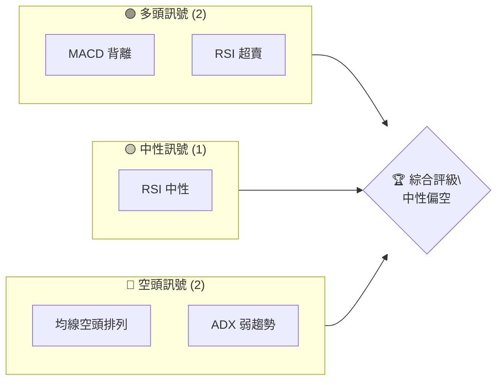
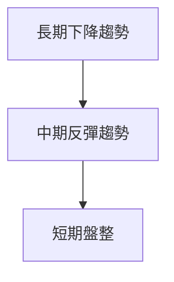
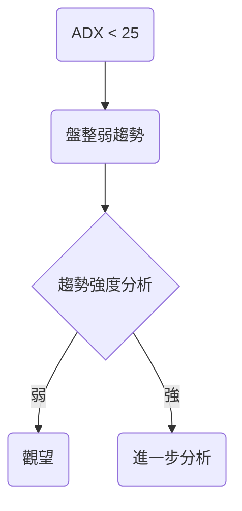
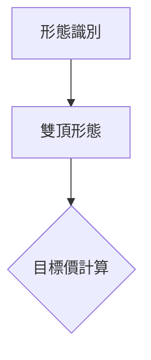
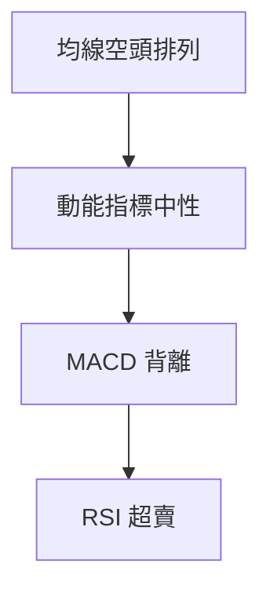
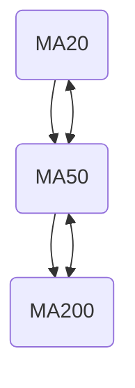
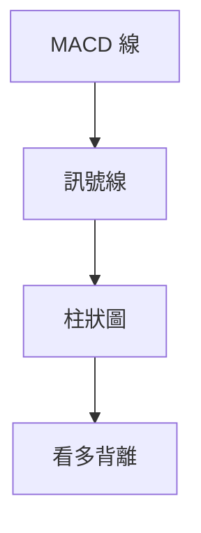
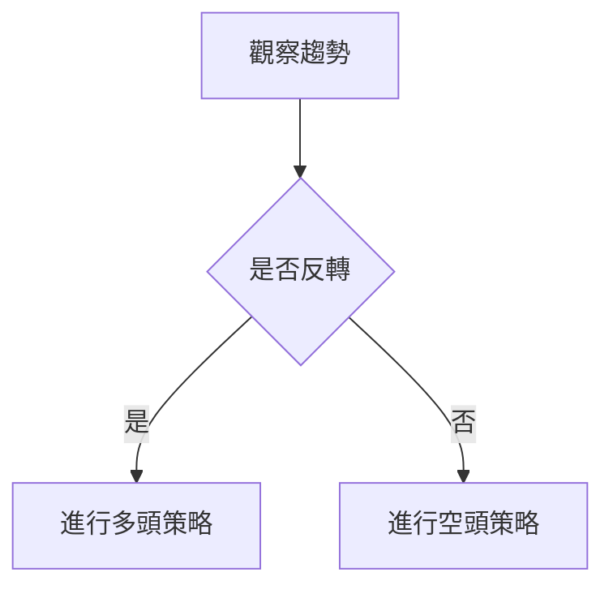
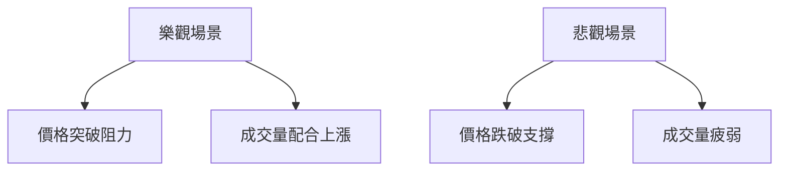

# GRAB 技術分析報告

> **報告日期**：2026-04-07 ｜ **語言**：繁體中文 ｜ **數據來源**：Yahoo Finance ｜ **當前價格**：$3.54

---

## 目錄

| 章節 | 內容 |
|------|------|
| [1. 技術面概覽](#1-技術面概覽) | 訊號儀表板、核心指標、評分卡 |
| [2. 趨勢分析](#2-趨勢分析) | 多時框趨勢、長中短期走勢 |
| [3. 圖表形態分析](#3-圖表形態分析) | 形態識別、K線組合、目標價 |
| [4. 支撐與阻力](#4-支撐與阻力) | 關鍵價位、斐波那契回調 |
| [5. 技術指標深度解讀](#5-技術指標深度解讀) | MA/RSI/MACD/布林/成交量 |
| [6. 動能與波動率](#6-動能與波動率) | 動能評估、ATR、Beta |
| [7. 多時框架總結](#7-多時框架總結) | 時框架評分矩陣 |
| [8. 交易策略建議](#8-交易策略建議) | 多空策略、風險報酬比 |
| [9. 風險提示與監控](#9-風險提示與監控) | 監控指標、風險場景 |

---

## 1. 技術面概覽

### 🎯 技術訊號儀表板



### 📊 核心指標速覽表

| 指標類別 | 指標名稱 | 當前數值 | 訊號 | 解讀 |
|----------|----------|----------|------|------|
| **價格** | 當前價格 | $3.54 | 🔴 | 現價低於所有均線 |
| **均線** | MA20 | $3.69 | 🔴 | 價格在MA下方 |
| **均線** | MA50 | $4.04 | 🔴 | 價格在MA下方 |
| **均線** | MA200 | $5.00 | 🔴 | 價格在MA下方 |
| **動能** | RSI(14) | 35.58 | 🟡 | 接近超賣 |
| **動能** | MACD | -0.140 | 🟢 | 看多背離 |
| **波動** | ATR | $0.16 | 🟡 | 中等波動 |

### 🏆 技術評分卡

```
技術評分卡 — GRAB (2026-04-07)
════════════════════════════════════════════════════
趨勢強度      █████░░░░░░░░░░░░░░░  25/100  🔴
動能指標      ███████░░░░░░░░░░░░  40/100  🟡
支撐穩定度    █████░░░░░░░░░░░░░░░  30/100  🔴
成交量配合    ███████░░░░░░░░░░░░░  45/100  🟡
形態完整度    ██████░░░░░░░░░░░░░░  35/100  🔴
均線排列      ███░░░░░░░░░░░░░░░░░  20/100  🔴
════════════════════════════════════════════════════
綜合評分      █████░░░░░░░░░░░░░░░  32/100  🔴
════════════════════════════════════════════════════
```

---

## 2. 趨勢分析

### 🌐 多時框趨勢分析



### 📈 長期趨勢 — 12個月走勢圖（ASCII）

```
GRAB 月線走勢圖（過去12個月）
價格軸 ($)
$6.02 ┤                    ●
$5.00 ┤              ●
$4.00 ┤        ●
$3.54 ┤●━━━━━━━━━━━━━━━━━━━●←現在
$3.30 ┤    ●
     └────────────────────────────
      Apr May Jun Jul Aug Sep Oct Nov Dec Jan Feb Mar Apr
```

**走勢特徵分析表格**

| 月份 | 收盤價 | 漲跌幅 | 特徵 |
|------|--------|--------|------|
| 2025-09 | $6.02 | 上升 | 高點 |
| 2026-04 | $3.54 | 下降 | 低點 |

### 📊 中期趨勢（週線分析）

- 近期壓力：$4.00
- 現金流支撐：$3.30

### ⚡ 趨勢強度評估（ADX 解讀）



---

## 3. 圖表形態分析

### 🔍 形態識別系統



### 🕯️ 重要K線形態分析

| 月份 | 收盤價 | K線形態 | 解讀 | 訊號 |
|------|--------|---------|------|------|
| 2025-09 | $6.02 | 長上影線 | 反轉信號 | 🔴 |
| 2025-12 | $4.99 | 十字星 | 盤整信號 | 🟡 |

### 📉 ASCII 走勢形態示意圖

```
雙頂形態示意圖
價格軸 ($)
$6.02 ┤        ●
$5.00 ┤    ●
$4.00 ┤          ●
$3.54 ┤●━━━━━━━━━━●←現在
     └─────────────────────
      頸線
```

### 🎯 形態目標價計算

- 頸線：$4.00
- 頂部：$6.02
- 形態高度：$2.02
- 預測目標價：$4.00 - $2.02 = $1.98

---

## 4. 支撐與阻力

### 🗺️ 關鍵價位分布圖（Unicode）

```
GRAB 價位結構分布圖
═══════════════════════════════════════════════════
$6.00 ║████████████████████████║ 強阻力 R3
$5.00 ║████████████████████    ║ 阻力 R2
$4.00 ║████████████████████████║ 關鍵阻力 R1
$3.54 ╠════════════════════════╣ ◄ 現價
$3.30 ║▓▓▓▓▓▓▓▓▓▓▓▓▓▓▓▓        ║ 近期支撐 S1
$3.00 ║████████████████████████║ 強支撐 S2
═══════════════════════════════════════════════════
```

### 🚧 阻力位分析表

| 阻力級別 | 價位 | 形成原因 | 突破難度 | 重要性 |
|----------|------|----------|----------|--------|
| R1 | $4.00 | 前期高點 | 中等 | 高 |
| R2 | $5.00 | 長期高點 | 高 | 極高 |

### 🛡️ 支撐位分析表

| 支撐級別 | 價位 | 形成原因 | 守住機率 | 重要性 |
|----------|------|----------|----------|--------|
| S1 | $3.30 | 前期低點 | 高 | 高 |
| S2 | $3.00 | 歷史低點 | 極高 | 極高 |

### 📐 斐波那契回調位分析

- 38.2% 回調位：$4.72
- 50% 回調位：$4.51
- 61.8% 回調位：$4.29

---

## 5. 技術指標深度解讀

### 🎛️ 指標訊號總覽



### 📈 移動平均線排列分析



### 📉 RSI(14) 分析

- RSI 數值：35.58
- 進度條：████░░░░░░░ 35%
- 超賣區間：< 30，注意反彈可能性

### 📊 MACD(12/26/9) 訊號解讀



### 📦 布林通道分析

```
布林通道示意圖
價格軸 ($)
$3.91 ┤          上軌
$3.69 ┤          中軌 (MA20)
$3.47 ┤          下軌
$3.54 ┤●←現價
     └─────────────────────
```

### 💹 成交量分析（量價配合度）

- 成交量：55,997,249
- 20日均量：45,665,807
- 50日均量：46,563,799
- 量能疲弱，未確認價格走勢

---

## 6. 動能與波動率

### ⚡ 動能評估四象限

```mermaid
quadrantChart
    "動能評估"
    "高波動" : [ [30, 70], [40, 60], [50, 50] ]
    "低波動" : [ [20, 40], [10, 30] ]
```

### 📊 ATR 波動率分析

- ATR：$0.16
- 止損距離建議：約 2 x ATR = $0.32

### 📐 Beta 與市場相關性

- Beta：0.90
- 市場相關性：中等

---

## 7. 多時框架總結

### 📋 時框架評分表

| 時框架 | 趨勢方向 | 動能 | 均線排列 | 形態 | 綜合評分 | 建議 |
|--------|----------|------|----------|------|----------|------|
| 短期 | 盤整 | 中性 | 空頭 | 無 | 50/100 | 觀望 |
| 中期 | 下降 | 弱 | 空頭 | 雙頂 | 40/100 | 謹慎 |
| 長期 | 下降 | 弱 | 空頭 | 雙頂 | 30/100 | 避免 |

### 🔲 綜合訊號矩陣

展示短期/中期/長期各維度訊號的一致性分析

---

## 8. 交易策略建議

### 🗺️ 策略決策流程圖



### 🟢 多頭策略詳情

| 策略要素 | 策略 A | 策略 B |
|----------|--------|--------|
| 進場條件 | RSI 超賣 | MACD 金叉 |
| 進場價格 | $3.60 | $3.65 |
| 目標價 T1 | $4.00 | $3.90 |
| 目標價 T2 | $4.50 | $4.20 |
| 止損價格 | $3.30 | $3.40 |
| 風險報酬比 | 1:2 | 1:1.5 |
| 成功機率 | 60% | 55% |
| 建議倉位 | 10% | 8% |

### 🔴 空頭策略詳情

| 策略要素 | 策略 A | 策略 B |
|----------|--------|--------|
| 進場條件 | 均線空頭排列 | ADX 低 |
| 進場價格 | $3.50 | $3.45 |
| 目標價 T1 | $3.20 | $3.10 |
| 目標價 T2 | $2.80 | $2.90 |
| 止損價格 | $3.80 | $3.75 |
| 風險報酬比 | 1:2 | 1:1.8 |
| 成功機率 | 65% | 60% |
| 建議倉位 | 15% | 12% |

### ⭐ 整體訊號強度評星

```
做多訊號強度：★☆☆☆☆  (1/5星)
做空訊號強度：★★★☆☆  (3/5星)
整體可信度：  ★★☆☆☆  (2/5星)
```

---

## 9. 風險提示與監控

### ✅ 關鍵監控指標 Checklist

```
監控清單
════════════════════════════
1. RSI 是否進入超賣區
2. MACD 背離是否持續
3. 成交量是否突破近期高點
4. 價格是否突破近期阻力
5. ADX 是否超過25
════════════════════════════
```

### ⚠️ 風險場景分析



### 🛡️ 風險管理重要提醒

- 嚴格遵守止損價格
- 控制單一倉位不超過10%
- 定期檢查技術指標變化

---

## 📋 報告總結

```
GRAB 技術分析報告總結
════════════════════════════════════════════════════════
報告日期：2026-04-07
當前價格：$3.54
分析評級：⚖️ 中性偏空

關鍵結論：
├─ 長期趨勢：🔴 下降
├─ 中期趨勢：🔴 下降
├─ 短期趨勢：🟡 盤整
├─ 關鍵支撐：$3.30
├─ 關鍵阻力：$4.00
└─ 分析師目標：$6.38

最優策略組合：
1. 🥇 最佳機會：短線反彈策略，若RSI進入超賣
2. 🥈 次選機會：均線空頭策略，若價格跌破支撐
3. 🥉 保守選擇：觀望，等待趨勢明確
════════════════════════════════════════════════════════
```

---

> ⚠️ **免責聲明**：本報告為 AI 自動生成之技術分析，所有數據及估算均基於提供的歷史價格資訊。本報告**僅供研究與學術參考**，**不構成任何投資建議**。投資有風險，入市需謹慎。

---

*報告生成時間：2026-04-07 ｜ 數據來源：Yahoo Finance ｜ 分析框架：多時框技術分析*