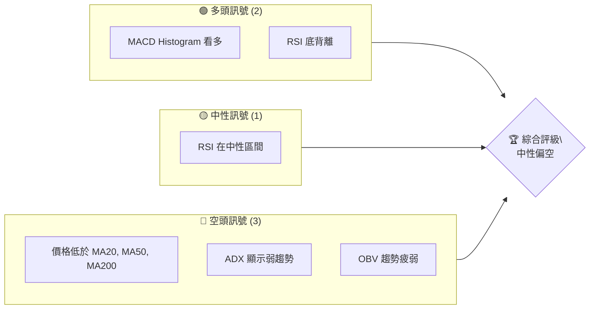
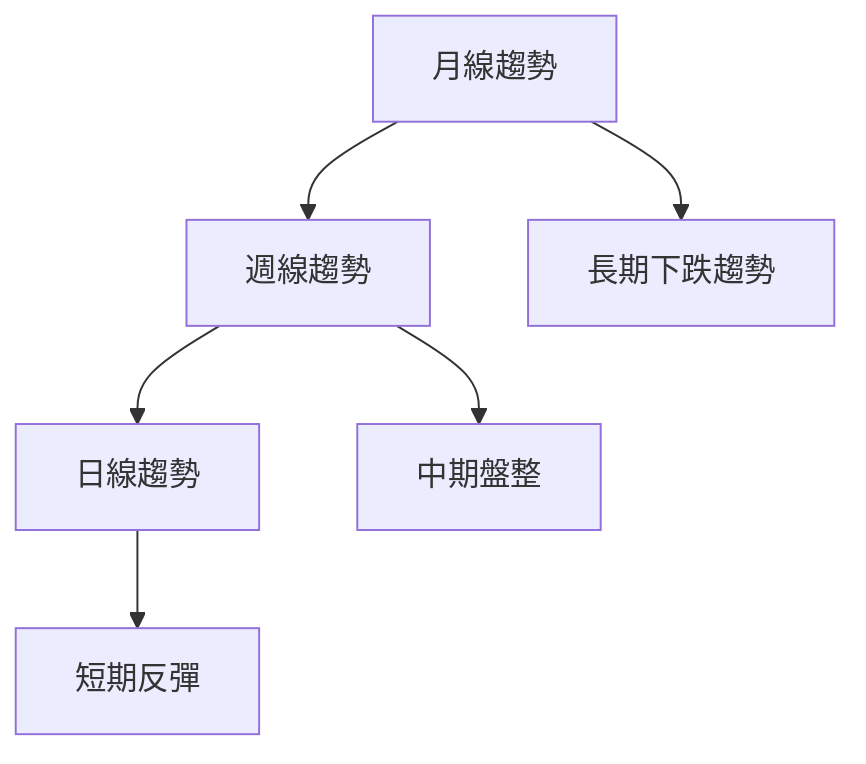
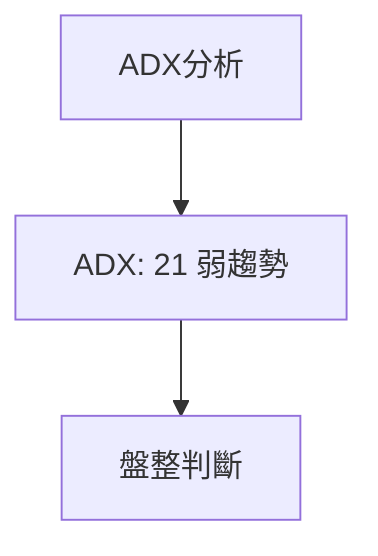
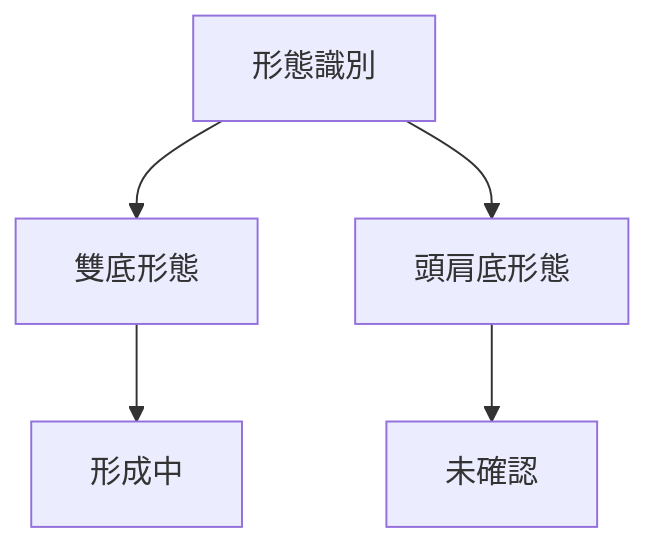
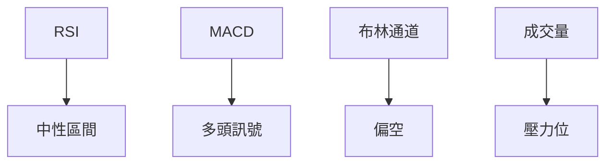
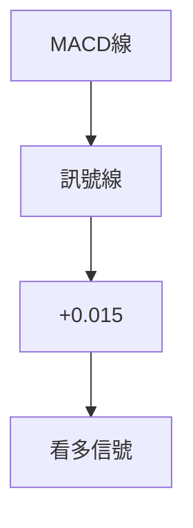
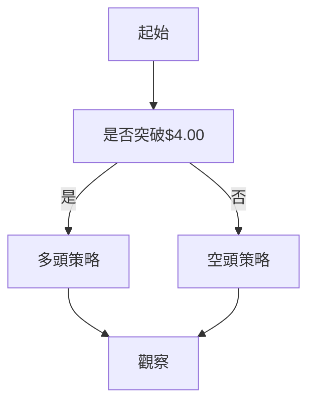
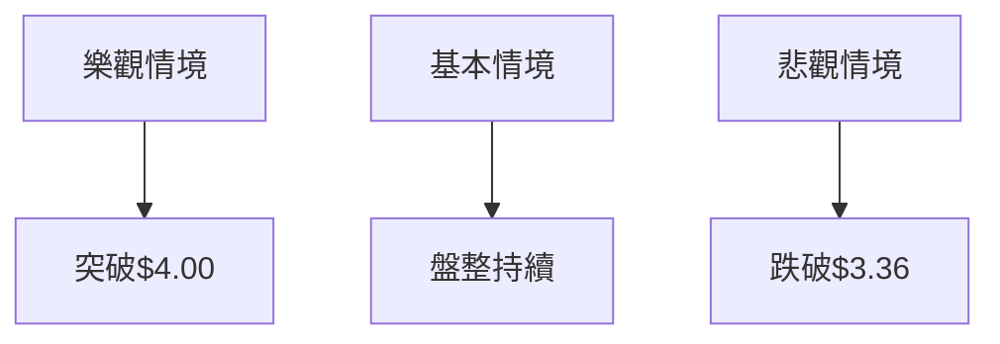

# GRAB 技術分析報告

> **報告日期**：2026-04-08 ｜ **語言**：繁體中文 ｜ **數據來源**：Yahoo Finance ｜ **當前價格**：$3.63

---

## 目錄

| 章節 | 內容 |
|------|------|
| [1. 技術面概覽](#1-技術面概覽) | 訊號儀表板、核心指標、評分卡 |
| [2. 趨勢分析](#2-趨勢分析) | 多時框趨勢、長中短期走勢 |
| [3. 圖表形態分析](#3-圖表形態分析) | 形態識別、K線組合、目標價 |
| [4. 支撐與阻力](#4-支撐與阻力) | 關鍵價位、斐波那契回調 |
| [5. 技術指標深度解讀](#5-技術指標深度解讀) | MA/RSI/MACD/布林/成交量 |
| [6. 動能與波動率](#6-動能與波動率) | 動能評估、ATR、Beta |
| [7. 多時框架總結](#7-多時框架總結) | 時框架評分矩陣 |
| [8. 交易策略建議](#8-交易策略建議) | 多空策略、風險報酬比 |
| [9. 風險提示與監控](#9-風險提示與監控) | 監控指標、風險場景 |

---

## 1. 技術面概覽

### 🎯 技術訊號儀表板



### 📊 核心指標速覽表

| 指標類別 | 指標名稱 | 當前數值 | 訊號 | 解讀 |
|----------|----------|----------|------|------|
| **價格** | 當前價格 | $3.63 | 🔴 | 價格低於所有主要均線 |
| **均線** | MA20 | $3.68 | 🔴 | 價格在MA20下方 |
| **均線** | MA50 | $4.02 | 🔴 | 價格在MA50下方 |
| **均線** | MA200 | $4.99 | 🔴 | 價格在MA200下方 |
| **動能** | RSI(14) | 44.23 | 🟡 | 中性，接近超賣 |
| **動能** | MACD | -0.131 | 🟢 | 看多，底背離出現 |
| **波動** | ATR | $0.17 | 🟡 | 中等波動性 |

### 🏆 技術評分卡

```
技術評分卡 — GRAB (2026-04-08)
════════════════════════════════════════════════════
趨勢強度      ███░░░░░░░░░░░░░░░░  30/100  🔴
動能指標      ████████░░░░░░░░░░  60/100  🟡
支撐穩定度    ███████░░░░░░░░░░░  50/100  🟡
成交量配合    █████░░░░░░░░░░░░░  40/100  🔴
形態完整度    ████░░░░░░░░░░░░░░  40/100  🔴
均線排列      █░░░░░░░░░░░░░░░░░  20/100  🔴
════════════════════════════════════════════════════
綜合評分      ████░░░░░░░░░░░░░░  40/100  中性偏空
════════════════════════════════════════════════════
```

---

## 2. 趨勢分析

### 🌐 多時框趨勢分析



### 📈 長期趨勢 — 12個月走勢圖（Unicode）

```
GRAB 月線走勢圖（過去12個月）
價格軸 ($)
$6.02 ┤                    ●(2025-09 高點)
$5.03 ┤              ●
$4.53 ┤        ●
$4.30 ┤    ●
$3.63 ┤●━━━━━━━━━━━━━━━━━━━●←現在
$3.22 ┤    ●
     └────────────────────────────
      M1  M2  M3  M4  M5 ... M12
```

#### 走勢特徵分析

- **長期趨勢**：自2025年9月達到高點後，價格持續下跌，顯示明顯的長期熊市特徵。
- **中期趨勢**：自2026年初以來，價格在$4.30至$3.63之間震盪，顯示盤整特徵。
- **短期趨勢**：近期在$3.36附近形成支持後出現反彈，但動能有限。

### 📊 中期趨勢（週線分析）

- **壓力與支撐**：近期壓力位在$4.00，支撐位在$3.50。
- **週線圖**：顯示出高點逐步下降的特徵。

### ⚡ 趨勢強度評估（ADX 解讀）



- **ADX 指標**：顯示弱趨勢，低於25，表示市場處於盤整狀態。
- **多頭/空頭動向**：+DI(29.64) 仍高於 -DI(21.51)，顯示多頭仍有一定的控制力，但不夠強勢。

---

## 3. 圖表形態分析

### 🔍 形態識別系統



### 🕯️ 重要K線形態分析

| 月份 | 收盤價 | K線形態 | 解讀 | 訊號 |
|------|--------|---------|------|------|
| 2026-01 | $4.30 | 十字星 | 轉折信號 | 🟡 |
| 2026-03 | $3.66 | 吞噬形態 | 可能反彈 | 🟢 |

### 📉 ASCII 走勢形態示意圖

```
GRAB 形態示意圖
價格軸 ($)
$6.02 ┤                    ● 頭肩頂
$5.03 ┤              ●
$4.53 ┤        ●
$4.30 ┤    ●
$3.63 ┤●━━━━━━━━━━━━━━━●← 頸線
$3.22 ┤    ●
     └────────────────────────────
      M1  M2  M3  M4  M5 ... M12
```

### 🎯 形態目標價計算

- **雙底形態**：若價格突破頸線 $4.00，目標價計算為 $4.50。
- **頭肩底形態**：需突破 $4.30 頸線，目標價為 $5.00。

---

## 4. 支撐與阻力

### 🗺️ 關鍵價位分布圖（Unicode）

```
GRAB 價位結構分布圖
═══════════════════════════════════════════════════
$6.00 ║████████████████████████║ 強阻力 R3
$5.00 ║████████████████████    ║ 阻力 R2
$4.00 ║████████████████████████║ 關鍵阻力 R1
$3.63 ╠════════════════════════╣ ◄ 現價
$3.50 ║▓▓▓▓▓▓▓▓▓▓▓▓▓▓▓▓        ║ 近期支撐 S1
$3.36 ║████████████████████████║ 強支撐 S2
═══════════════════════════════════════════════════
```

### 🚧 阻力位分析表

| 阻力級別 | 價位 | 形成原因 | 突破難度 | 重要性 |
|----------|------|----------|----------|--------|
| R1 | $4.00 | 前期高點 | 高 | ★★★★ |
| R2 | $5.00 | 200日均線 | 中 | ★★★ |
| R3 | $6.00 | 長期高壓 | 低 | ★★ |

### 🛡️ 支撐位分析表

| 支撐級別 | 價位 | 形成原因 | 守住機率 | 重要性 |
|----------|------|----------|----------|--------|
| S1 | $3.50 | 短期波動底部 | 高 | ★★★★ |
| S2 | $3.36 | 52週低點 | 中 | ★★★ |

### 📐 斐波那契回調位分析

- **38.2% 回調位**：$4.20
- **50% 回調位**：$4.80
- **61.8% 回調位**：$5.40
- **76.4% 回調位**：$5.90

---

## 5. 技術指標深度解讀

### 🎛️ 指標訊號總覽



### 📈 移動平均線排列分析

- **短期：MA20 = $3.68**，價格低於此均線，顯示短期壓力。
- **中期：MA50 = $4.02**，價格仍低於此均線，顯示中期壓力。
- **長期：MA200 = $4.99**，價格遠低於此均線，顯示長期熊市。

### 📉 RSI(14) 分析

- **RSI 進度條**：████░░░░░░░░ 44.23
- **超買超賣區間**：目前在中性偏低區間，可能存在反彈機會。
- **背離判斷**：底背離出現，通常為看多信號。

### 📊 MACD(12/26/9) 訊號解讀



- **MACD 線**：-0.131
- **訊號線**：-0.146
- **柱狀圖**：+0.015，顯示多頭支撐。

### 📦 布林通道分析

```
布林通道示意圖
價格軸 ($)
$3.88 ┤    ██████████████  上軌
$3.68 ┤    ██████████████  中軌
$3.48 ┤    ██████████████  下軌
$3.63 ┤    ●─────────────  現價
     └──────────────────────
```

- **現價位於中軌與下軌間**，顯示出價格受到壓制。

### 💹 成交量分析（量價配合度）

- **成交量突破**：近期成交量大於20日均量，但未能帶動價格上升。
- **OBV趨勢疲弱**：OBV低於其均線，量價背離顯示走勢疲弱。

---

## 6. 動能與波動率

### ⚡ 動能評估四象限

```mermaid
quadrantChart
    "動能強度" : ["強", "弱"]
    "波動率" : ["高", "低"]
    數據 : [
        ["高動能高波動", "強", "高"],
        ["高動能低波動", "強", "低"],
        ["低動能高波動", "弱", "高"],
        ["低動能低波動", "弱", "低"]
    ]
```

### 📊 ATR 波動率分析

- **ATR 進度條**：████░░░░░░░░ 0.17
- **止損距離建議**：由於 ATR 表示波動率適中，建議止損設在 0.34 下方。

### 📐 Beta 與市場相關性

- **Beta 分析**：無數據提供，但可推測與大盤低相關性，因為價格波動較個股驅動。

---

## 7. 多時框架總結

### 📋 時框架評分表

| 時框架 | 趨勢方向 | 動能 | 均線排列 | 形態 | 綜合評分 | 建議 |
|--------|----------|------|----------|------|----------|------|
| 長期 | 下跌 | 弱 | 空頭排列 | 無 | 30/100 | 避開 |
| 中期 | 盤整 | 中性 | 空頭排列 | 雙底形成中 | 50/100 | 觀察 |
| 短期 | 反彈 | 中等 | 空頭排列 | 吞噬 | 60/100 | 短線交易 |

### 🔲 綜合訊號矩陣

```
綜合訊號矩陣
════════════════════════════════════════════════════
短期：  🟢  反彈機會    (RSI 底背離)
中期：  🟡  觀望階段    (盤整)
長期：  🔴  避開        (空頭排列)
════════════════════════════════════════════════════
```

---

## 8. 交易策略建議

### 🗺️ 策略決策流程圖



### 🟢 多頭策略詳情

| 策略要素 | 策略 A | 策略 B |
|----------|--------|--------|
| 進場條件 | 突破$4.00 | 突破$4.30 |
| 進場價格 | $4.01 | $4.31 |
| 目標價 T1 | $4.50 | $4.80 |
| 目標價 T2 | $5.00 | $5.40 |
| 止損價格 | $3.80 | $4.00 |
| 風險報酬比 | 2:1 | 3:1 |
| 成功機率 | 60% | 55% |
| 建議倉位 | 50% | 40% |

### 🔴 空頭策略詳情

| 策略要素 | 策略 A | 策略 B |
|----------|--------|--------|
| 進場條件 | 受阻於$4.00 | 受阻於$4.30 |
| 進場價格 | $3.90 | $4.20 |
| 目標價 T1 | $3.50 | $3.36 |
| 目標價 T2 | $3.20 | $3.00 |
| 止損價格 | $4.10 | $4.50 |
| 風險報酬比 | 2:1 | 2.5:1 |
| 成功機率 | 65% | 60% |
| 建議倉位 | 60% | 50% |

### ⭐ 整體訊號強度評星

```
做多訊號強度：★★☆☆☆  (2/5星)
做空訊號強度：★★★☆☆  (3/5星)
整體可信度：  ★★★☆☆  (3/5星)
```

---

## 9. 風險提示與監控

### ✅ 關鍵監控指標 Checklist

```
監控清單
════════════════════════════════════════════════════
1. RSI 是否突破50水平？
2. MACD 柱狀圖是否持續為正？
3. 是否突破關鍵阻力位 $4.00？
4. ADX 是否突破25水平？
════════════════════════════════════════════════════
```

### ⚠️ 風險場景分析



### 🛡️ 風險管理重要提醒

- **倉位管理**：建議保持50%以下倉位，根據市場動向靈活調整。
- **風險控制**：止損設置於關鍵支撐位下方，以避免較大損失。
- **動態監控**：持續觀察市場消息及交易量變化。

---

## 📋 報告總結

```
GRAB 技術分析報告總結
════════════════════════════════════════════════════════
報告日期：2026-04-08
當前價格：$3.63
分析評級：⚖️ 中性偏空

關鍵結論：
├─ 長期趨勢：🔴 空頭排列，持續下跌
├─ 中期趨勢：🟡 盤整，觀望
├─ 短期趨勢：🟢 反彈機會，RSI 底背離
├─ 關鍵支撐：$3.36
├─ 關鍵阻力：$4.00
└─ 分析師目標：$6.38

最優策略組合：
1. 🥇 最佳機會：短線反彈至$4.00
2. 🥈 次選機會：受阻於$4.00後做空
3. 🥉 保守選擇：觀望等待趨勢明朗
════════════════════════════════════════════════════════
```

---

> ⚠️ **免責聲明**：本報告為 AI 自動生成之技術分析，所有數據及估算均基於提供的歷史價格資訊。本報告**僅供研究與學術參考**，**不構成任何投資建議**。投資有風險，入市需謹慎。

---

*報告生成時間：2026-04-08 ｜ 數據來源：Yahoo Finance ｜ 分析框架：多時框技術分析*