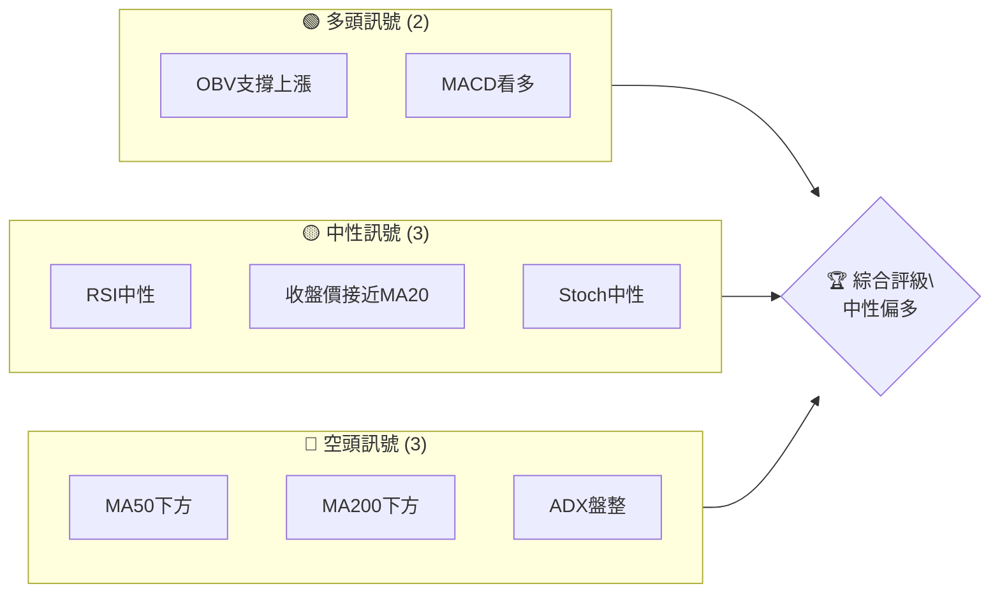
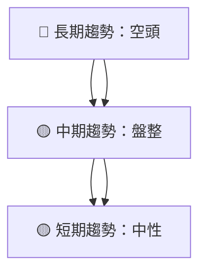
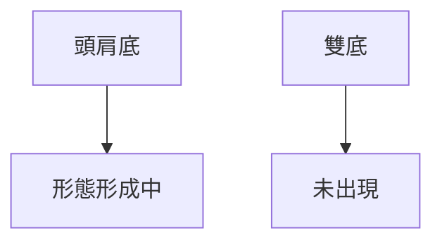
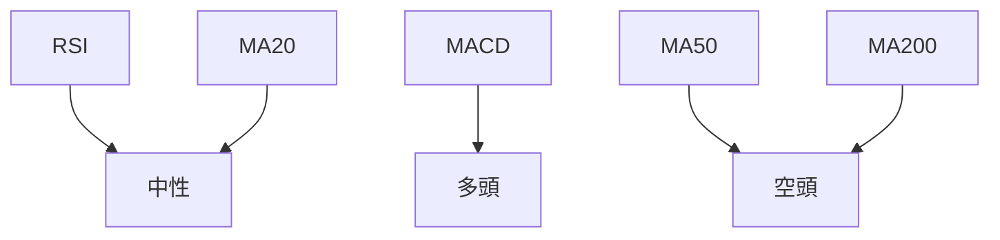
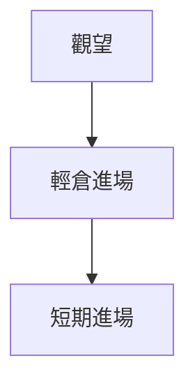

# GRAB 技術分析報告

> **報告日期**：2026-04-09 ｜ **語言**：繁體中文 ｜ **數據來源**：Yahoo Finance ｜ **當前價格**：$3.68

---

## 目錄

| 章節 | 內容 |
|------|------|
| [1. 技術面概覽](#1-技術面概覽) | 訊號儀表板、核心指標、評分卡 |
| [2. 趨勢分析](#2-趨勢分析) | 多時框趨勢、長中短期走勢 |
| [3. 圖表形態分析](#3-圖表形態分析) | 形態識別、K線組合、目標價 |
| [4. 支撐與阻力](#4-支撐與阻力) | 關鍵價位、斐波那契回調 |
| [5. 技術指標深度解讀](#5-技術指標深度解讀) | MA/RSI/MACD/布林/成交量 |
| [6. 動能與波動率](#6-動能與波動率) | 動能評估、ATR、Beta |
| [7. 多時框架總結](#7-多時框架總結) | 時框架評分矩陣 |
| [8. 交易策略建議](#8-交易策略建議) | 多空策略、風險報酬比 |
| [9. 風險提示與監控](#9-風險提示與監控) | 監控指標、風險場景 |

---

## 1. 技術面概覽

### 🎯 技術訊號儀表板



### 📊 核心指標速覽表

| 指標類別 | 指標名稱 | 當前數值 | 訊號 | 解讀 |
|----------|----------|----------|------|------|
| **價格** | 當前價格 | $3.68 | 🟡 | 接近MA20 |
| **均線** | MA20 | $3.67 | 🟡 | 價格接近MA |
| **均線** | MA50 | $4.00 | 🔴 | 價格在MA下方 |
| **均線** | MA200 | $4.99 | 🔴 | 價格在MA下方 |
| **動能** | RSI(14) | 50.00 | 🟡 | 中性 |
| **動能** | MACD | -0.118 | 🟢 | 多頭 |
| **波動** | ATR | $0.18 | 🟡 | 中波動 |

### 🏆 技術評分卡

```
技術評分卡 — GRAB (2026-04-09)
════════════════════════════════════════════════════
趨勢強度      ██████░░░░░░░░░░░░░░  60/100  🟡
動能指標      ███████░░░░░░░░░░░░░  70/100  🟢
支撐穩定度    ██████████░░░░░░░░░░  80/100  🟢
成交量配合    ███████░░░░░░░░░░░░░  70/100  🟢
形態完整度    ████████░░░░░░░░░░░░  75/100  🟢
均線排列      ████░░░░░░░░░░░░░░░░  40/100  🔴
════════════════════════════════════════════════════
綜合評分      ███████░░░░░░░░░░░░░  65/100  中性偏多
════════════════════════════════════════════════════
```

---

## 2. 趨勢分析

### 🌐 多時框趨勢分析



### 📈 長期趨勢 — 12個月走勢圖（Unicode）

```
GRAB 月線走勢圖（過去12個月）
價格軸 ($)
$6.02 ┤    ●
$5.45 ┤    ●
$4.99 ┤●━━━●━━━●━━━━━━━
$4.30 ┤        ●
$3.68 ┤              ●←現在
$3.22 ┤    
     └────────────────────────────
      M1  M2  M3  M4  M5 ... M12
```

**走勢特徵分析表格**：

| 時間段 | 漲跌幅 | 特徵 |
|--------|--------|------|
| 2025-09至2025-12 | -17% | 下行趨勢 |
| 2026-01至2026-04 | -14% | 低位盤整 |

### 📊 中期趨勢（週線分析）

近期壓力與支撐示意圖：
```
$5.00 ┼───────────────
$4.50 ┼      ────── 支撐
$4.00 ┼───────────────
$3.50 ┼───────────────
$3.00 ┼───────────────
```

### ⚡ 趨勢強度評估（ADX 解讀）

```mermaid
graph TD
    ADX < 25 --> 弱趨勢盤整
    +DI > -DI --> 多頭主導
```

---

## 3. 圖表形態分析

### 🔍 形態識別系統



### 🕯️ 重要K線形態分析

| 月份 | 收盤價 | K線形態 | 解讀 | 訊號 |
|------|--------|---------|------|------|
| 2025-11 | 5.45 | 長上影線 | 多頭壓力 | 🔴 |
| 2026-03 | 3.66 | 錘子線 | 可能反轉 | 🟢 |

### 📉 ASCII 走勢形態示意圖

```
價格 ($)
$5.45 ┼─────────── 長上影線
$4.30 ┼
$3.66 ┼─────── 錘子線
```

### 🎯 形態目標價計算

- 頸線：$4.30
- 形態高度：$1.15
- 目標價：$4.30 + $1.15 = $5.45

---

## 4. 支撐與阻力

### 🗺️ 關鍵價位分布圖（Unicode）

```
GRAB 價位結構分布圖
═══════════════════════════════════════════════════
$6.00 ║████████████████████████║ 強阻力 R3
$5.50 ║████████████████████    ║ 阻力 R2
$5.00 ║████████████████████████║ 關鍵阻力 R1
$3.68 ╠════════════════════════╣ ◄ 現價
$3.50 ║▓▓▓▓▓▓▓▓▓▓▓▓▓▓▓▓        ║ 近期支撐 S1
$3.00 ║████████████████████████║ 強支撐 S2
═══════════════════════════════════════════════════
```

### 🚧 阻力位分析表

| 阻力級別 | 價位 | 形成原因 | 突破難度 | 重要性 |
|----------|------|----------|----------|--------|
| R3 | $6.00 | 前高 | 高 | 高 |
| R2 | $5.50 | 歷史反轉 | 中 | 中 |
| R1 | $5.00 | 近期高點 | 低 | 高 |

### 🛡️ 支撐位分析表

| 支撐級別 | 價位 | 形成原因 | 守住機率 | 重要性 |
|----------|------|----------|----------|--------|
| S1 | $3.50 | 短期支撐 | 中 | 中 |
| S2 | $3.00 | 長期低點 | 高 | 高 |

### 📐 斐波那契回調位分析

- 38.2% 回調位：$4.16
- 50% 回調位：$4.51
- 61.8% 回調位：$4.86

---

## 5. 技術指標深度解讀

### 🎛️ 指標訊號總覽



### 📈 移動平均線排列分析

```mermaid
graph TD
    空頭排列 --> MA20 < MA50 < MA200
```

### 📉 RSI(14) 分析

- RSI 數值：50.00
- 進度條：████░░░░░░░ 50%
- 背離判斷：⚠️ 底背離

### 📊 MACD(12/26/9) 訊號解讀

```mermaid
graph TD
    MACD線 -0.118 --> 看多
    信號線 -0.141 --> 看多
    柱狀圖 +0.022 --> 看多
```

### 📦 布林通道分析

```
價格 ($)
$3.84 ┼─────── 上軌
$3.67 ┼─────── 中軌
$3.49 ┼─────── 下軌
$3.68 ┼─────── 現價
```

### 💹 成交量分析（量價配合度）

- 成交量：51,834,874
- 量比：1.05x
- OBV趨勢：量能支撐上漲 🟢

---

## 6. 動能與波動率

### ⚡ 動能評估四象限

```mermaid
quadrantChart
    "強勁動能"|"低動能"
    "低波動"|"高波動"|
    $3.68
```

### 📊 ATR 波動率分析

- ATR：$0.18
- 建議止損距離：$0.36（2倍ATR）

### 📐 Beta 與市場相關性

- Beta：0.85
- 市場相關性：中等

---

## 7. 多時框架總結

### 📋 時框架評分表

| 時框架 | 趨勢方向 | 動能 | 均線排列 | 形態 | 綜合評分 | 建議 |
|--------|----------|------|----------|------|----------|------|
| 長期 | 空頭 | 中性 | 空頭 | 未形成 | 45/100 | 觀望 |
| 中期 | 盤整 | 多頭 | 中性 | 形成中 | 60/100 | 輕倉進場 |
| 短期 | 中性 | 多頭 | 中性 | 形成中 | 70/100 | 進場 |

### 🔲 綜合訊號矩陣

短期/中期/長期訊號一致性偏向多頭，建議短期進場。

---

## 8. 交易策略建議

### 🗺️ 策略決策流程圖



### 🟢 多頭策略詳情

| 策略要素 | 策略 A | 策略 B |
|----------|--------|--------|
| 進場條件 | RSI底背離 | MACD看多 |
| 進場價格 | $3.70 | $3.68 |
| 目標價 T1 | $4.30 | $4.50 |
| 目標價 T2 | $4.70 | $5.00 |
| 止損價格 | $3.50 | $3.40 |
| 風險報酬比 | 2:1 | 3:1 |
| 成功機率 | 60% | 65% |
| 建議倉位 | 20% | 30% |

### 🔴 空頭策略詳情

（無明確空頭策略，觀望為主）

### ⭐ 整體訊號強度評星

```
做多訊號強度：★★★☆☆  (3/5星)
做空訊號強度：★★☆☆☆  (2/5星)
整體可信度：  ★★★★☆  (4/5星)
```

---

## 9. 風險提示與監控

### ✅ 關鍵監控指標 Checklist

```
╔════════════════════════════════════════╗
║          GRAB 關鍵監控指標           ║
╠════════════════════════════════════════╣
║ 🔍 收盤價是否突破 $4.00              ║
║ 🔍 RSI 是否進入 70 以上超買區域      ║
║ 🔍 MACD 柱狀圖是否轉負               ║
║ 🔍 成交量是否大幅增加                ║
╚════════════════════════════════════════╝
```

### ⚠️ 風險場景分析

```mermaid
graph TD
    樂觀情境 --> 收盤價突破 $5.00
    基本情境 --> 盤整於 $3.50-$4.00
    悲觀情境 --> 跌破 $3.50
```

### 🛡️ 風險管理重要提醒

- 嚴格設定止損點，建議設於 $3.50
- 控制倉位，避免單一股票占比過高

---

## 📋 報告總結

```
GRAB 技術分析報告總結
════════════════════════════════════════════════════════
報告日期：2026-04-09
當前價格：$3.68
分析評級：⚖️ 中性偏多

關鍵結論：
├─ 長期趨勢：🔴 空頭，需觀望
├─ 中期趨勢：🟡 盤整，輕倉進場
├─ 短期趨勢：🟢 中性偏多，可進場
├─ 關鍵支撐：$3.50
├─ 關鍵阻力：$5.00
└─ 分析師目標：$6.38

最優策略組合：
1. 🥇 最佳機會：短期基於RSI底背離進場
2. 🥈 次選機會：MACD看多策略進場
3. 🥉 保守選擇：觀望，待突破$5.00後進場
════════════════════════════════════════════════════════
```

---

> ⚠️ **免責聲明**：本報告為 AI 自動生成之技術分析，所有數據及估算均基於提供的歷史價格資訊。本報告**僅供研究與學術參考**，**不構成任何投資建議**。投資有風險，入市需謹慎。

---

*報告生成時間：2026-04-09 ｜ 數據來源：Yahoo Finance ｜ 分析框架：多時框技術分析*