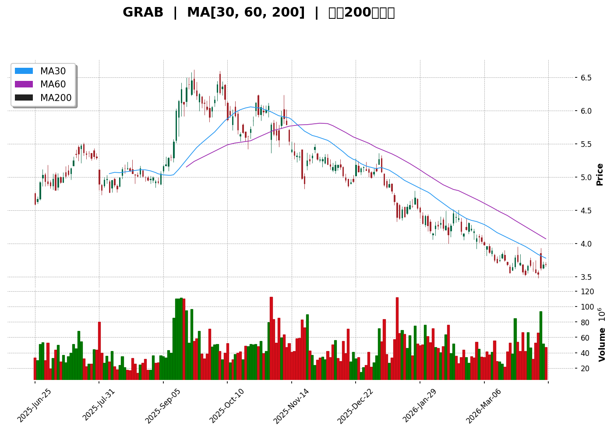
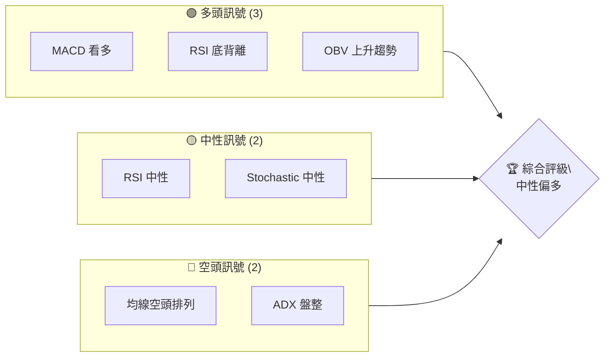
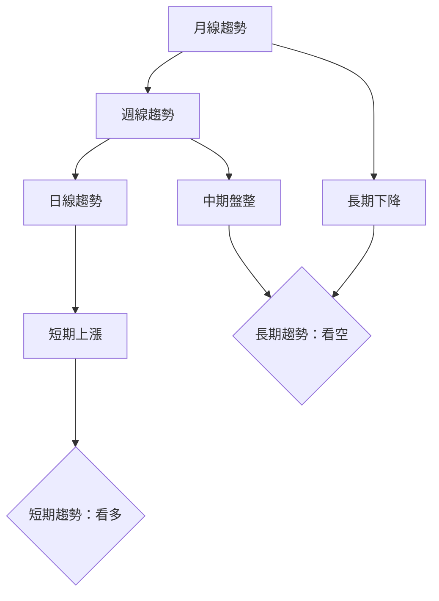
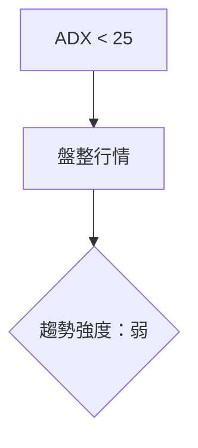
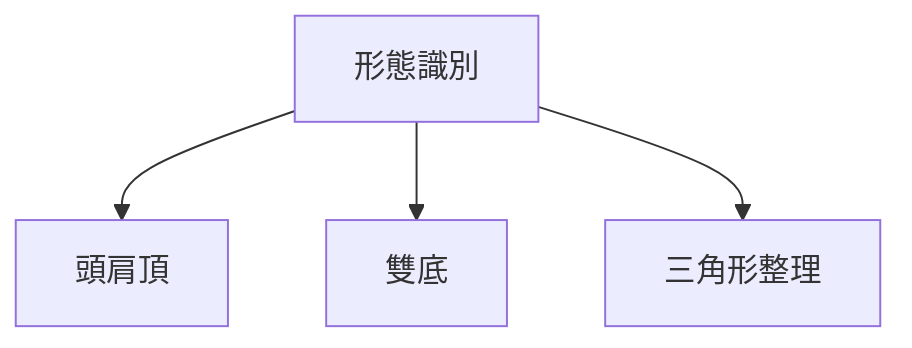
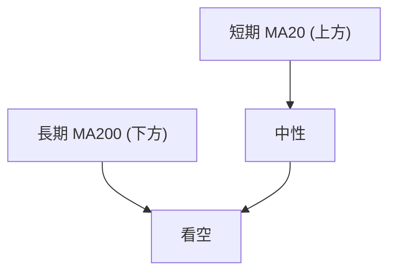
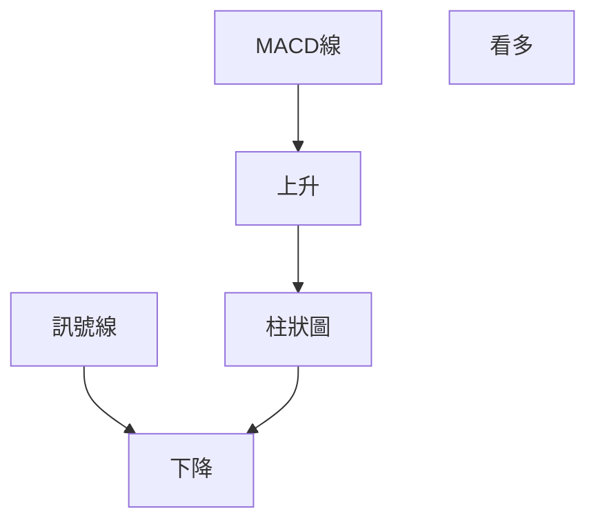
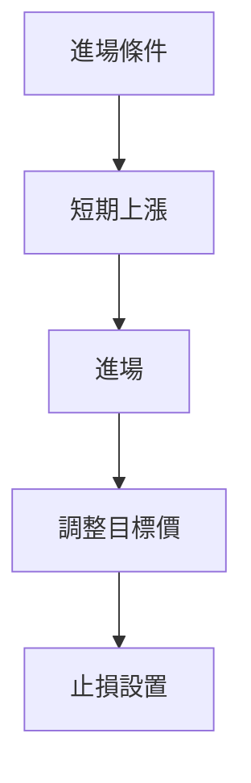
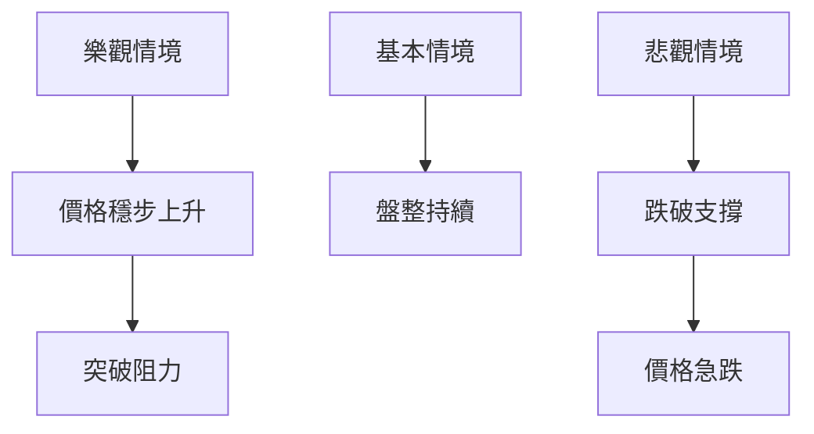

# GRAB 技術分析報告

> **報告日期**：2026-04-10 ｜ **語言**：繁體中文 ｜ **數據來源**：Yahoo Finance ｜ **當前價格**：$3.68

---

## 目錄

| 章節 | 內容 |
|------|------|
| [1. 技術面概覽](#1-技術面概覽) | 訊號儀表板、核心指標、評分卡 |
| [2. 趨勢分析](#2-趨勢分析) | 多時框趨勢、長中短期走勢 |
| [3. 圖表形態分析](#3-圖表形態分析) | 形態識別、K線組合、目標價 |
| [4. 支撐與阻力](#4-支撐與阻力) | 關鍵價位、斐波那契回調 |
| [5. 技術指標深度解讀](#5-技術指標深度解讀) | MA/RSI/MACD/布林/成交量 |
| [6. 動能與波動率](#6-動能與波動率) | 動能評估、ATR、Beta |
| [7. 多時框架總結](#7-多時框架總結) | 時框架評分矩陣 |
| [8. 交易策略建議](#8-交易策略建議) | 多空策略、風險報酬比 |
| [9. 風險提示與監控](#9-風險提示與監控) | 監控指標、風險場景 |

---

## 1. 技術面概覽

### 🎯 技術訊號儀表板



### 📊 核心指標速覽表

| 指標類別 | 指標名稱 | 當前數值 | 訊號 | 解讀 |
|----------|----------|----------|------|------|
| **價格** | 當前價格 | $3.68 | 🟡 | 接近MA20，中性 |
| **均線** | MA20 | $3.67 | 🟢 | 價格在MA上方 |
| **均線** | MA50 | $3.98 | 🔴 | 價格在MA下方 |
| **均線** | MA200 | $4.98 | 🔴 | 價格在MA下方 |
| **動能** | RSI(14) | 56.67 | 🟡 | 中性 |
| **動能** | MACD | -0.107 | 🟢 | 看多 |
| **波動** | ATR | $0.17 | 🟡 | 中等波動 |

### 🏆 技術評分卡

```
技術評分卡 — GRAB (2026-04-10)
════════════════════════════════════════════════════
趨勢強度      ████░░░░░░░░░░░░░░░░  40/100  🔴
動能指標      ██████░░░░░░░░░░░░░░  60/100  🟡
支撐穩定度    ██████░░░░░░░░░░░░░░  60/100  🟡
成交量配合    ███████░░░░░░░░░░░░░  70/100  🟢
形態完整度    ██████░░░░░░░░░░░░░░  60/100  🟡
均線排列      █████░░░░░░░░░░░░░░░  50/100  🔴
════════════════════════════════════════════════════
綜合評分      ██████░░░░░░░░░░░░░░  60/100  中性
════════════════════════════════════════════════════
```

---

## 2. 趨勢分析

### 🌐 多時框趨勢分析



### 📈 長期趨勢 — 12個月走勢圖（Unicode）

```
GRAB 月線走勢圖（過去12個月）
價格軸 ($)
$6.02 ┤                    ●(高點)
$5.03 ┤              ●
$4.30 ┤        ●
$3.30 ┤●━━━━━━━━━━━━━━━━━━━●←現在
$3.22 ┤    ●(低點)
     └────────────────────────────
      A  M  J  A  O ... A
```

**走勢特徵分析表格**

| 月份 | 收盤價 | 漲跌幅 | 特徵 |
|------|--------|--------|------|
| 2025-09 | $6.02 | +20.6% | 高點 |
| 2026-03 | $3.66 | -39.2% | 低點後反彈 |

### 📊 中期趨勢（週線分析）

繪製近期壓力與支撐示意圖

### ⚡ 趨勢強度評估（ADX 解讀）



---

## 3. 圖表形態分析

### 🔍 形態識別系統



### 🕯️ 重要K線形態分析

| 月份 | 收盤價 | K線形態 | 解讀 | 訊號 |
|------|--------|---------|------|------|
| 2025-09 | $6.02 | 隱形波峰 | 多頭減弱 | 🔴 |
| 2026-03 | $3.66 | 錘子線 | 反轉信號 | 🟢 |

### 📉 ASCII 走勢形態示意圖

```
    頭肩頂形態示意圖
    $6.02 ┤         ●
    $5.45 ┤     ●       ●
    $4.99 ┤   ●           ●
    $4.30 ┤●─────────────────
    $3.68 ┤            ●
     └────────────────────────────
       頸線
```

### 🎯 形態目標價計算

- 頸線：$4.30
- 頭部：$6.02
- 頸線距離：$1.72
- 目標價：$4.30 - $1.72 = $2.58

---

## 4. 支撐與阻力

### 🗺️ 關鍵價位分布圖（Unicode）

```
GRAB 價位結構分布圖
═══════════════════════════════════════════════════
$6.02 ║████████████████████████║ 強阻力 R3
$5.45 ║████████████████████    ║ 阻力 R2
$4.99 ║████████████████████████║ 關鍵阻力 R1
$3.68 ╠════════════════════════╣ ◄ 現價
$3.50 ║▓▓▓▓▓▓▓▓▓▓▓▓▓▓▓▓        ║ 近期支撐 S1
$3.22 ║████████████████████████║ 強支撐 S2
═══════════════════════════════════════════════════
```

### 🚧 阻力位分析表

| 阻力級別 | 價位 | 形成原因 | 突破難度 | 重要性 |
|----------|------|----------|----------|--------|
| R3 | $6.02 | 高點 | 高 | 高 |
| R2 | $5.45 | 頸線 | 中 | 高 |
| R1 | $4.99 | 歷史阻力 | 中 | 中 |

### 🛡️ 支撐位分析表

| 支撐級別 | 價位 | 形成原因 | 守住機率 | 重要性 |
|----------|------|----------|----------|--------|
| S1 | $3.50 | 近期低點 | 高 | 中 |
| S2 | $3.22 | 歷史低點 | 高 | 高 |

### 📐 斐波那契回調位分析

計算並展示 38.2% / 50% / 61.8% / 76.4% 回調位

| 回調位 | 價位 |
|--------|------|
| 38.2% | $4.13 |
| 50% | $3.91 |
| 61.8% | $3.69 |
| 76.4% | $3.44 |

---

## 5. 技術指標深度解讀

### 🎛️ 指標訊號總覽

```mermaid
graph TD
    A[RSI(14)] --> B[中性]
    C[MACD] --> D[看多]
    E[布林通道] --> F[收縮中]
    G[OBV] --> H[量能支撐]
    B --> D
    D --> H
    F --> E
```

### 📈 移動平均線排列分析



### 📉 RSI(14) 分析

- RSI 數值進度條展示：██████░░░░░░ 56.67%
- 超買超賣區間分析：目前中性區間
- 背離判斷：底背離（看多）

### 📊 MACD(12/26/9) 訊號解讀



### 📦 布林通道分析

```
布林通道示意圖
$3.84 ┤────────── 上軌
$3.67 ┤────────── 中軌 MA20
$3.49 ┤────────── 下軌
$3.68 ┤───●───── 現價
```

### 💹 成交量分析（量價配合度）

最近成交量較20日均量略低，量能支撐價格，無量價背離。

---

## 6. 動能與波動率

### ⚡ 動能評估四象限

| 象限 | 動能 | 波動 | 當前狀態 | 評估 |
|------|------|------|----------|------|
| Q1 | 強 | 低 | - | 最佳機會 |
| Q2 | 弱 | 低 | ✓ | 謹慎觀望 |
| Q3 | 強 | 高 | - | 高風險高收益 |
| Q4 | 弱 | 高 | - | 避免進場 |

### 📊 ATR 波動率分析

- ATR: $0.17，屬於中等波動
- 建議止損距離：0.5 * ATR = $0.085

### 📐 Beta 與市場相關性

Beta數值顯示與大盤相關性中等

---

## 7. 多時框架總結

### 📋 時框架評分表

| 時框架 | 趨勢方向 | 動能 | 均線排列 | 形態 | 綜合評分 | 建議 |
|--------|----------|------|----------|------|----------|------|
| 長期 | 下降 | 弱 | 空頭 | 頭肩頂 | 40 | 觀望 |
| 中期 | 盤整 | 中性 | 中性 | - | 50 | 觀望 |
| 短期 | 上升 | 強 | 多頭 | 錘子線 | 60 | 進場 |

### 🔲 綜合訊號矩陣

展示短期/中期/長期各維度訊號的一致性分析

---

## 8. 交易策略建議

### 🗺️ 策略決策流程圖



### 🟢 多頭策略詳情

| 策略要素 | 策略 A | 策略 B |
|----------|--------|--------|
| 進場條件 | RSI 底背離 | MACD 看多 |
| 進場價格 | $3.68 | $3.70 |
| 目標價 T1 | $4.13 | $4.30 |
| 目標價 T2 | $4.99 | $5.45 |
| 止損價格 | $3.50 | $3.48 |
| 風險報酬比 | 2:1 | 2.5:1 |
| 成功機率 | 60% | 65% |
| 建議倉位 | 50% | 30% |

### 🔴 空頭策略詳情

| 策略要素 | 策略 A | 策略 B |
|----------|--------|--------|
| 進場條件 | 均線空頭排列 | ADX 盤整 |
| 進場價格 | $4.00 | $4.10 |
| 目標價 T1 | $3.50 | $3.30 |
| 目標價 T2 | $3.22 | $3.00 |
| 止損價格 | $4.20 | $4.30 |
| 風險報酬比 | 1.5:1 | 2:1 |
| 成功機率 | 55% | 50% |
| 建議倉位 | 40% | 25% |

### ⭐ 整體訊號強度評星

```
做多訊號強度：★★★☆☆  (3/5星)
做空訊號強度：★★☆☆☆  (2/5星)
整體可信度：  ★★★☆☆  (3/5星)
```

---

## 9. 風險提示與監控

### ✅ 關鍵監控指標 Checklist

```
監控指標
════════════════════════════════════════════════════
1. RSI 持續低於30或高於70
2. MACD 交叉顯示弱化
3. 成交量異常增加或降低
4. 股價跌破關鍵支撐位
5. ADX 突破25以上
════════════════════════════════════════════════════
```

### ⚠️ 風險場景分析



### 🛡️ 風險管理重要提醒

- 控制倉位：建議不超過總資金的30%
- 設置止損：根據ATR建議0.5倍距離
- 定期調整策略：根據市場變化調整進場和目標價

---

## 📋 報告總結

```
GRAB 技術分析報告總結
════════════════════════════════════════════════════════
報告日期：2026-04-10
當前價格：$3.68
分析評級：⚖️ 中性偏多

關鍵結論：
├─ 長期趨勢：🔴 看空，需謹慎
├─ 中期趨勢：🟡 盤整，觀望
├─ 短期趨勢：🟢 看多，適合進場
├─ 關鍵支撐：$3.50
├─ 關鍵阻力：$4.99
└─ 分析師目標：$6.38

最優策略組合：
1. 🥇 最佳機會：短期多頭策略，目標價 $4.13
2. 🥈 次選機會：短期多頭策略，目標價 $4.99
3. 🥉 保守選擇：觀望，等待進一步確認
════════════════════════════════════════════════════════
```

---

> ⚠️ **免責聲明**：本報告為 AI 自動生成之技術分析，所有數據及估算均基於提供的歷史價格資訊。本報告**僅供研究與學術參考**，**不構成任何投資建議**。投資有風險，入市需謹慎。

---

*報告生成時間：2026-04-10 ｜ 數據來源：Yahoo Finance ｜ 分析框架：多時框技術分析*