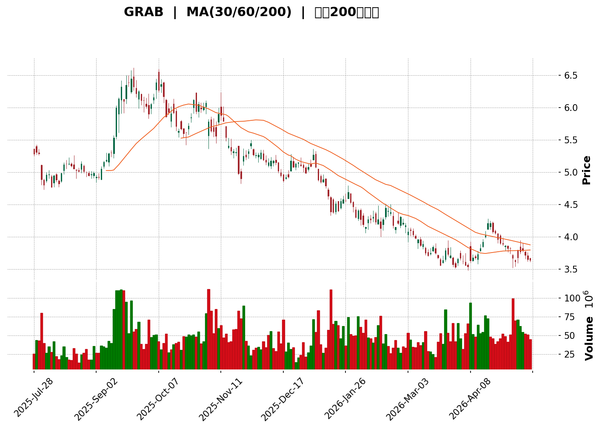
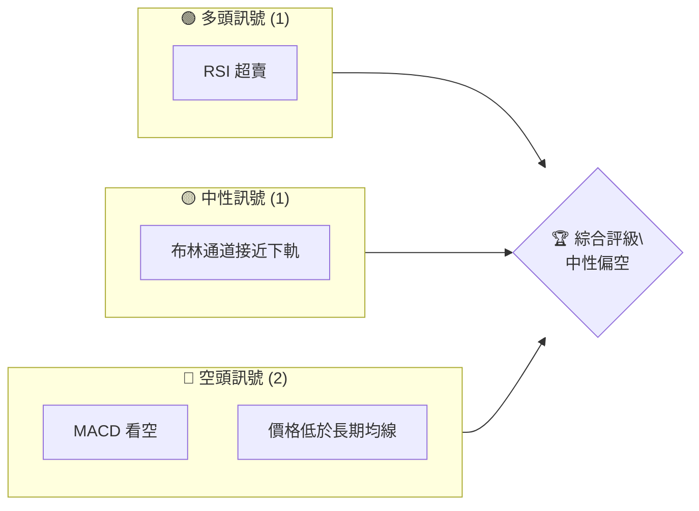
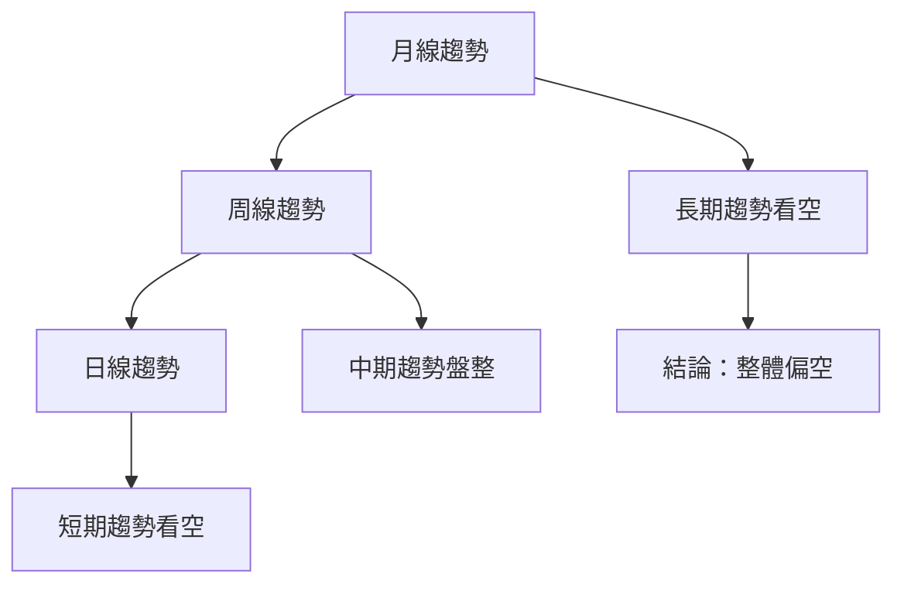
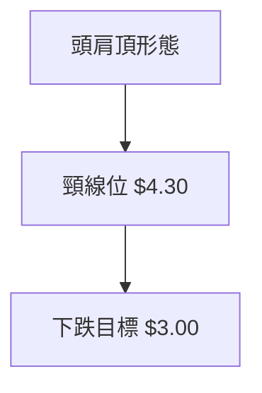
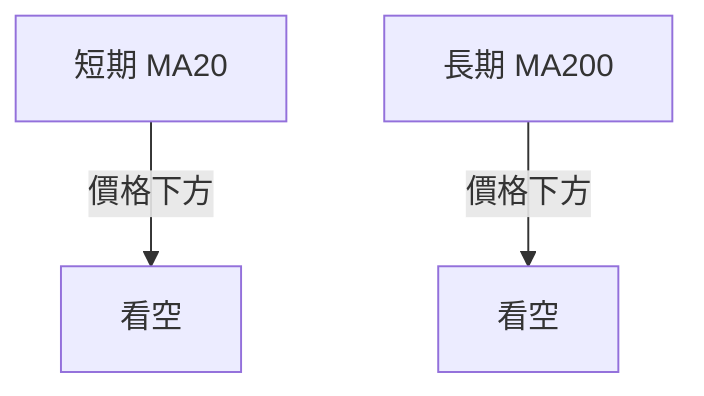
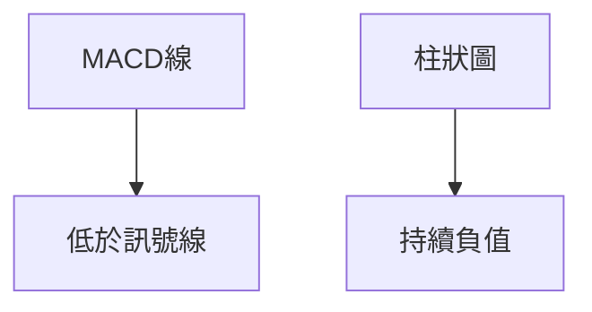
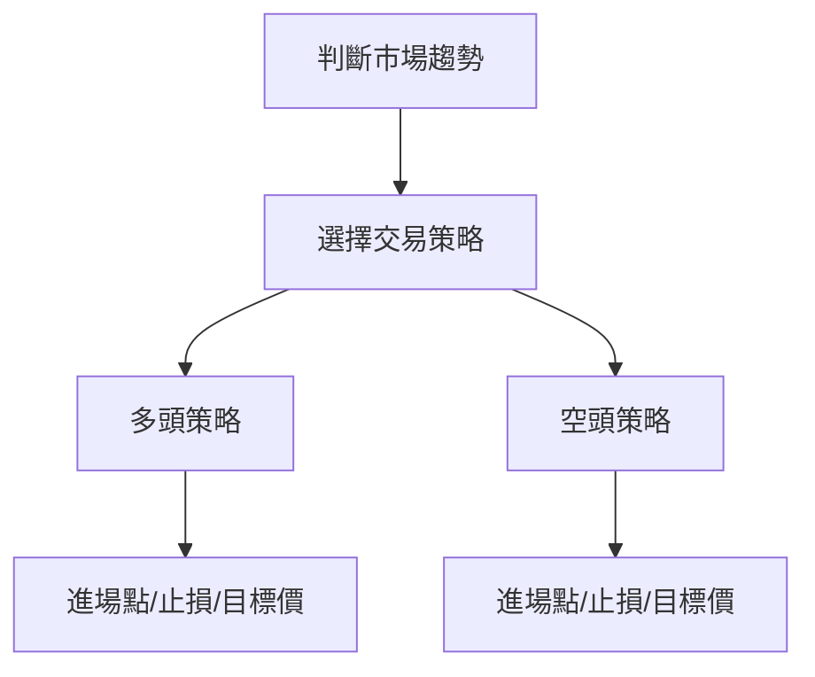
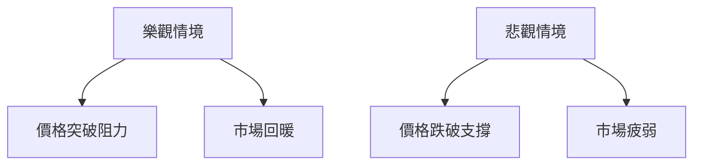

<details>
<summary>📊 靜態圖表 (點擊展開)</summary>

</details>

<html>
<head><meta charset="utf-8" /></head>
<body>
    <div>                        <script>window.PlotlyConfig = {MathJaxConfig: 'local'};</script>
        <script charset="utf-8" src="https://cdn.plot.ly/plotly-3.5.0.min.js" integrity="sha256-fHbNLP+GlIXN+efbQec78UkemUz3NJp7UmfGxC1tNxs=" crossorigin="anonymous"></script>                <div id="candlestick-chart" class="plotly-graph-div" style="height:500px; width:100%;"></div>            <script>                window.PLOTLYENV=window.PLOTLYENV || {};                                if (document.getElementById("candlestick-chart")) {                    Plotly.newPlot(                        "candlestick-chart",                        [{"close":{"dtype":"f8","bdata":"AAAAYLgeFUAAAACgcD0VQAAAAMD1KBVAAAAAIFyPE0AAAABAMzMTQAAAAEAK1xNAAAAAoEfhE0AAAADgehQTQAAAAMDMzBNAAAAAwB6FE0AAAAAgrkcTQAAAAIDC9RNAAAAAQOF6FEAAAADAHoUUQAAAAMAehRRAAAAAYGZmFEAAAABAMzMUQAAAAGC4HhRAAAAAgD0KFEAAAADAHoUUQAAAAIA9ChRAAAAAAAAAFEAAAADAzMwTQAAAAKBH4RNAAAAAgML1E0AAAADgUbgTQAAAAIAUrhNAAAAAQDMzFEAAAAAA16MUQAAAAGCPwhRAAAAAwPUoFUAAAABAMzMVQAAAAGC4HhZAAAAAAAAAGEAAAAAgXI8YQAAAACCuRxlAAAAAYGZmGEAAAABgZmYZQAAAACBcjxlAAAAAwMzMGUAAAAAgrkcZQAAAAKBH4RhAAAAAAAAAGUAAAADgo3AYQAAAAOCjcBhAAAAA4HoUGEAAAACgmZkXQAAAAEAzMxhAAAAAANejGEAAAAAgXI8ZQAAAAOB6FBlAAAAA4KNwGUAAAACAFK4YQAAAAOCjcBdAAAAA4FG4F0AAAAAA16MXQAAAAIAUrhdAAAAAQArXFkAAAAAgXI8WQAAAAIAUrhZAAAAAYGZmFkAAAABA4XoWQAAAAKBH4RZAAAAAYGZmF0AAAABA4XoYQAAAAGCPwhdAAAAAQDMzGEAAAAAghesXQAAAAIA9ChhAAAAAIK5HGEAAAAAA1yMXQAAAACBcjxZAAAAAwB6FFkAAAACgcD0WQAAAAKCZmRdAAAAAwB6FF0AAAADA9SgXQAAAAMD1KBZAAAAAANejFUAAAACA61EVQAAAACCuRxVAAAAAoHA9FUAAAAAghesTQAAAAKCZmRNAAAAAAAAAFUAAAACAwvUUQAAAACCuRxVAAAAAwMzMFUAAAADgehQVQAAAAIA9ChVAAAAA4HoUFUAAAABAMzMVQAAAAGCPwhRAAAAAANejFEAAAACgmZkUQAAAAOBRuBRAAAAA4FG4FEAAAACgmZkUQAAAAOB6FBRAAAAAwMzME0AAAABA4XoTQAAAAIAUrhNAAAAA4FG4E0AAAADgUbgUQAAAAIDrURRAAAAAwB6FFEAAAACgmZkUQAAAAGBmZhRAAAAAIK5HFEAAAACAwvUTQAAAAIDrURRAAAAAAClcFEAAAADgehQVQAAAAIDrURRAAAAAwB6FE0AAAABgZmYTQAAAACBcjxNAAAAAwPUoE0AAAADAHoUSQAAAACBcjxFAAAAAwB6FEUAAAACAPQoSQAAAAKCZmRFAAAAAQDMzEkAAAACA61ESQAAAAKBwPRJAAAAAYI\u002fCEkAAAABguB4SQAAAAKBH4RFAAAAAQDMzEUAAAAAA16MRQAAAAOB6FBFAAAAAYI\u002fCEEAAAACgmZkQQAAAAOB6FBFAAAAAgD0KEUAAAACgcD0RQAAAACCF6xBAAAAA4HoUEUAAAADAHoUQQAAAAOB6FBFAAAAAwMzMEUAAAACgmZkRQAAAAMAehRFAAAAA4FG4EEAAAACgmZkQQAAAAEAK1xBAAAAAoHA9EUAAAACgR+EQQAAAAOBRuBBAAAAAgOtREEAAAABgZmYQQAAAAGC4HhBAAAAAQArXD0AAAACAFK4PQAAAAIDC9Q5AAAAAYLgeD0AAAAAAAAAOQAAAAIAUrg1AAAAAAAAADkAAAADgUbgOQAAAAAAAAA5AAAAA4KNwDUAAAABA4XoMQAAAAGC4Hg1AAAAAgOtRDkAAAABACtcNQAAAAIAUrg1AAAAAIFyPDEAAAACgcD0MQAAAACCuRw1AAAAAAClcDUAAAACAwvUMQAAAAEDhegxAAAAAgOtRDEAAAACAPQoNQAAAAOCjcA1AAAAA4KNwDUAAAABACtcNQAAAACBcjw5AAAAAAClcD0AAAADgehQQQAAAAEAK1xBAAAAAQArXEEAAAACA61EQQAAAAKBwPRBAAAAAgBSuD0AAAABAMzMPQAAAAGC4Hg9AAAAAoEfhDkAAAAAgXI8OQAAAACBcjw5AAAAAAClcDUAAAACAwvUMQAAAAOCjcA1AAAAAwPUoDkAAAACA61EOQAAAAGCPwg1AAAAAQDMzDUAAAABguB4NQA=="},"high":{"dtype":"f8","bdata":"AAAA4KNwFUAAAADgUbgVQAAAAOCjcBVAAAAAQOF6FEAAAACgmZkTQAAAAAAAABRAAAAAYLgeFEAAAABACtcTQAAAAEAK1xNAAAAAgML1E0AAAAAgXI8TQAAAAIDC9RNAAAAAoJmZFEAAAABgj8IUQAAAACCF6xRAAAAAoJmZFEAAAACAPQoVQAAAAMD1KBRAAAAAIK5HFEAAAACAFK4UQAAAAEDhehRAAAAAgD0KFEAAAADgehQUQAAAAOB6FBRAAAAAgD0KFEAAAABACtcTQAAAAIDC9RNAAAAAAClcFEAAAADgUbgUQAAAAOBROBVAAAAAQDMzFUAAAAAAKVwVQAAAACCuRxZAAAAAYLgeGEAAAAAA16MYQAAAAIAUrhlAAAAAwB6FGEAAAAAAAAAaQAAAAAAAABpAAAAAgOtRGkAAAABA4XoaQAAAAOBRuBlAAAAA4HoUGUAAAACgR+EYQAAAAIAUrhhAAAAAoJmZGEAAAACgR+EYQAAAACCuRxhAAAAAoEfhGEAAAAAgrscZQAAAAGBmZhpAAAAAQInBGUAAAACgmZkZQAAAACBcjxhAAAAAIK5HGEAAAADgehQYQAAAACBcjxhAAAAAgML1F0AAAABAM7MWQAAAAIBqPBdAAAAA4FG4FkAAAABA4XoWQAAAAIA9ChdAAAAAwPWoF0AAAADAHoUYQAAAAIDC9RhAAAAAAClcGEAAAACA61EYQAAAAIDrURhAAAAAgMJ1GEAAAAAgrkcXQAAAAOCjcBdAAAAAQApXF0AAAADA9SgXQAAAAAAAABhAAAAA4KPwGEAAAADgehQYQAAAAKBH4RZAAAAAYLgeFkAAAADgehQWQAAAAIDCdRVAAAAAwB6FFUAAAAAA16MVQAAAAKBwPRRAAAAAQOF6FUAAAAAAKVwVQAAAAOCjcBVAAAAAAAAAFkAAAABA4XoVQAAAAKBwPRVAAAAAQDMzFUAAAABgZmYVQAAAAGBmZhVAAAAAIFwPFUAAAAAAKdwUQAAAAIDC9RRAAAAAYI\u002fCFEAAAADgehQVQAAAAADXoxRAAAAAQDMzFEAAAACgR+ETQAAAAKBH4RNAAAAAYLgeFEAAAABguB4VQAAAAIDC9RRAAAAAoJmZFEAAAAAA16MUQAAAACCF6xRAAAAAIFyPFEAAAAAAKVwUQAAAAMAehRRAAAAAwMzMFEAAAADgo3AVQAAAAIDrURVAAAAAQDMzFEAAAACgR+ETQAAAAKBH4RNAAAAAoJmZE0AAAACAPQoTQAAAAMAehRJAAAAAYGZmEkAAAADgUTgSQAAAAEAzMxJAAAAAYGZmEkAAAAAgXI8SQAAAAIAUrhJAAAAAgBQuE0AAAADgUbgSQAAAAOBROBJAAAAAoEfhEUAAAADgUbgRQAAAAGCPwhFAAAAAQOF6EUAAAAAA16MQQAAAAMDMTBFAAAAAAClcEUAAAABguJ4RQAAAACBcjxFAAAAAgML1EUAAAADgUTgRQAAAAEAzMxFAAAAAgD0KEkAAAABACtcRQAAAAMAeBRJAAAAAgD2KEUAAAACgmZkQQAAAAMAehRFAAAAAIK5HEUAAAABguB4RQAAAAKBH4RBAAAAAgD2KEEAAAADgepQQQAAAAMAehRBAAAAAwPUoEEAAAACAFK4PQAAAAAAAABBAAAAAwB6FD0AAAADAzMwOQAAAAEDheg5AAAAAANejDkAAAACAwvUOQAAAAEAzMw9AAAAAQArXDUAAAADgo3ANQAAAAIAUrg1AAAAAANejDkAAAACgmZkPQAAAAOBRuA5AAAAAwB6FDUAAAACAwvUMQAAAAOCjcA1AAAAAgOtRDkAAAABgj8INQAAAAAAAAA5AAAAAYI\u002fCDEAAAADgo3APQAAAAEAK1w1AAAAAwMzMDUAAAACgcD0OQAAAAOB6FA9AAAAA4FG4D0AAAAAAKVwQQAAAAGC4HhFAAAAAAAAAEUAAAACAwvUQQAAAAOCjcBBAAAAAQDMzEEAAAADA9SgQQAAAACCF6w9AAAAAAAAAD0AAAAAghesOQAAAAOBRuA5AAAAAoEfhDUAAAABAMzMNQAAAAOCjcA5AAAAAoJmZD0AAAABAMzMPQAAAAKBwPQ5AAAAA4HoUDkAAAADgo3ANQA=="},"hovertemplate":"\u003cb\u003e%{x|%Y-%m-%d}\u003c\u002fb\u003e\u003cbr\u003e\u958b: $%{open:.2f}\u003cbr\u003e\u9ad8: $%{high:.2f}\u003cbr\u003e\u4f4e: $%{low:.2f}\u003cbr\u003e\u6536: $%{close:.2f}\u003cextra\u003e\u003c\u002fextra\u003e","low":{"dtype":"f8","bdata":"AAAAAAAAFUAAAADgehQVQAAAAIA9ChVAAAAAQDMzE0AAAAAghesSQAAAAAApXBNAAAAAoJmZE0AAAACAPQoTQAAAAOB6FBNAAAAAYGZmE0AAAADgehQTQAAAAKBHYRNAAAAAoEfhE0AAAABAMzMUQAAAAOCjcBRAAAAAgOtRFEAAAABAMzMUQAAAAKCZmRNAAAAAAAAAFEAAAACAwvUTQAAAAIDC9RNAAAAA4FG4E0AAAABgj8ITQAAAAKCZmRNAAAAAANejE0AAAAAAKVwTQAAAACBcjxNAAAAAwB6FE0AAAACgcD0UQAAAAADXoxRAAAAAAClcFEAAAACAwvUUQAAAAKBH4RRAAAAAgD0KFkAAAADgo3AWQAAAAADXoxdAAAAAwPWoF0AAAACgcD0YQAAAACCuRxlAAAAAoEfhGEAAAACAPQoZQAAAAADXoxhAAAAAgML1F0AAAADA9SgYQAAAAOBRuBdAAAAAgML1F0AAAACA61EXQAAAAKCZmRdAAAAAoHA9GEAAAAAgXI8YQAAAAIDC9RhAAAAAIIXrGEAAAAAgrkcYQAAAAAApXBdAAAAAIFyPF0AAAADAzMwWQAAAAKCZmRdAAAAAIFyPFkAAAADA9SgWQAAAAKCZmRZAAAAAwPUoFkAAAACAFK4VQAAAAIDrURZAAAAA4HoUF0AAAAAA16MXQAAAAKCZmRdAAAAAYGZmF0AAAACAFK4XQAAAAMDMzBdAAAAAoJmZF0AAAADgo3AVQAAAAEDhehZAAAAAgBQuFkAAAADAzMwVQAAAACCF6xZAAAAAQDMzF0AAAABguB4XQAAAACCF6xVAAAAA4KNwFUAAAADgehQVQAAAAKBH4RRAAAAAAAAAFUAAAABACtcTQAAAACCuRxNAAAAAIIVrFEAAAABgj8IUQAAAAEAK1xRAAAAA4KNwFUAAAAAAAAAVQAAAAKBH4RRAAAAAoJmZFEAAAAAgrscUQAAAAOBRuBRAAAAA4KNwFEAAAACA61EUQAAAAEAzMxRAAAAAoEdhFEAAAADgo3AUQAAAAIDC9RNAAAAAgBSuE0AAAABgZmYTQAAAACBcjxNAAAAAANejE0AAAACAPQoUQAAAACCuRxRAAAAAYLgeFEAAAADAzEwUQAAAAKBHYRRAAAAAAAAAFEAAAAAghesTQAAAAIA9ChRAAAAAgOtRFEAAAABgj8IUQAAAAGCPQhRAAAAA4KNwE0AAAACA61ETQAAAAAApXBNAAAAAAAAAE0AAAACA61ESQAAAAIDrURFAAAAA4KNwEUAAAABgZmYRQAAAACBcjxFAAAAA4FG4EUAAAADgehQSQAAAAMD1KBJAAAAAAClcEkAAAACAPQoSQAAAAMAehRFAAAAAwPUoEUAAAAAAAAARQAAAAOBRuBBAAAAAoJmZEEAAAACgcD0QQAAAAIDCdRBAAAAAQArXEEAAAAAghesQQAAAAGCPwhBAAAAAwMzMEEAAAAAAAAAQQAAAAGBmZhBAAAAA4HoUEUAAAABgj0IRQAAAAIDrURFAAAAAwB6FEEAAAABAMzMQQAAAAOCnxhBAAAAAIFyPEEAAAADgUbgQQAAAAKBwPRBAAAAAAClcD0AAAACAPQoQQAAAAAAAABBAAAAAYI\u002fCD0AAAADAHoUOQAAAAMDMzA5AAAAAQOF6DkAAAABgj8INQAAAAKCZmQ1AAAAAYI\u002fCDUAAAADA9SgOQAAAAEAK1w1AAAAAIK5HDUAAAABgZmYMQAAAAOBRuAxAAAAAgML1DEAAAACgmZkNQAAAAIDrUQ1AAAAAoHA9DEAAAADgehQMQAAAAGBmZgxAAAAAYLgeDUAAAAAA16MMQAAAAEDhegxAAAAAQArXC0AAAADAzMwMQAAAAIDC9QxAAAAAQDMzDUAAAAAA16MMQAAAAGBkOw5AAAAAgBSuDkAAAABACtcPQAAAAOCjcBBAAAAA4KNwEEAAAABAMzMQQAAAAMD1KBBAAAAAQDMzD0AAAACAPQoPQAAAAKBH4Q5AAAAAgOtRDkAAAADgehQOQAAAACCF6w1AAAAAwPUoDEAAAACA61EMQAAAAOBRuAxAAAAAIIXrDUAAAADgehQOQAAAACCuRw1AAAAAgML1DEAAAACgR+EMQA=="},"name":"\u50f9\u683c","open":{"dtype":"f8","bdata":"AAAA4KNwFUAAAACgmZkVQAAAAOBROBVAAAAA4KNwFEAAAADAHoUTQAAAAEDhehNAAAAAQArXE0AAAACgcL0TQAAAAEAKVxNAAAAAoEfhE0AAAABA4XoTQAAAAOCjcBNAAAAAoJkZFEAAAADAHoUUQAAAAAAAgBRAAAAAwB6FFEAAAABA4XoUQAAAAMD1KBRAAAAAYLgeFEAAAADAIDAUQAAAAGBmZhRAAAAAAAAAFEAAAACAwvUTQAAAAEAK1xNAAAAAwMzME0AAAADA9agTQAAAAOBRuBNAAAAAIFyPE0AAAAAAKVwUQAAAAIAUrhRAAAAAANejFEAAAABAMzMVQAAAAMD1KBVAAAAAQDMzFkAAAACgmZkXQAAAAEDhehhAAAAAwB6FGEAAAACAPYoYQAAAACBcjxlAAAAAQOH6GEAAAAAghesZQAAAAEAzMxlAAAAAwB6FGEAAAABACtcYQAAAAIDCdRhAAAAAoHA9GEAAAADA9SgYQAAAAIDC9RdAAAAAQOF6GEAAAACgmRkZQAAAAEAzMxpAAAAAgOtRGUAAAACAPYoZQAAAAEDhehhAAAAAgML1F0AAAADA9SgXQAAAAKBwPRhAAAAAwMzMF0AAAABA4XoWQAAAAMD1KBdAAAAA4FG4FkAAAABA4XoWQAAAAIAUrhZAAAAAoEdhF0AAAAAAAAAYQAAAACCF6xhAAAAAYI\u002fCF0AAAAAAAAAYQAAAAKBH4RdAAAAAgD0KGEAAAABgj0IWQAAAAGCPQhdAAAAAwMzMFkAAAADAzMwWQAAAAKCZGRdAAAAAIFwPGEAAAABgZmYXQAAAAEAK1xZAAAAAwB6FFUAAAACAPYoVQAAAAOBROBVAAAAAQDMzFUAAAAAA16MVQAAAAIA9ChRAAAAAgBSuFEAAAADgehQVQAAAAMD1KBVAAAAAANejFUAAAAAghWsVQAAAAMAeBRVAAAAAgML1FEAAAABACtcUQAAAAMD1KBVAAAAAYI\u002fCFEAAAAAghWsUQAAAAGBmZhRAAAAA4HqUFEAAAABgj8IUQAAAAKCZmRRAAAAAQOH6E0AAAACgR+ETQAAAAKCZmRNAAAAAoEfhE0AAAADgehQUQAAAAIAUrhRAAAAAgOtRFEAAAAAgXI8UQAAAAEDhehRAAAAAgMJ1FEAAAAAgrkcUQAAAAIAULhRAAAAAwB6FFEAAAABgj8IUQAAAAGC4HhVAAAAAQDMzFEAAAABgj8ITQAAAAGBmZhNAAAAAoJmZE0AAAAAghesSQAAAAOCjcBJAAAAAgOtREkAAAACAPYoRQAAAAEAzMxJAAAAAwMzMEUAAAADgehQSQAAAAKBwPRJAAAAAAClcEkAAAACAFK4SQAAAAMD1KBJAAAAAgBSuEUAAAABguB4RQAAAAMD1qBFAAAAAgOtREUAAAADAHoUQQAAAAKBH4RBAAAAAYLgeEUAAAADA9SgRQAAAAOCjcBFAAAAAwMzMEEAAAACAwvUQQAAAAGCPwhBAAAAAoHA9EUAAAADgepQRQAAAAOCjcBFAAAAAwMxMEUAAAADgo3AQQAAAAAAAABFAAAAA4FG4EEAAAADAzMwQQAAAAADXoxBAAAAAYLgeEEAAAADgo3AQQAAAAAApXBBAAAAAIFwPEEAAAAAgrkcPQAAAAIAUrg9AAAAAwMzMDkAAAAAA16MOQAAAAGC4Hg5AAAAAIIXrDUAAAACgcD0OQAAAAKCZmQ5AAAAAYI\u002fCDUAAAABAMzMNQAAAAMDMzAxAAAAAQDMzDUAAAAAA16MOQAAAAGBmZg1AAAAA4KNwDUAAAADgUbgMQAAAAMDMzAxAAAAAAAAADkAAAACAwvUMQAAAAKBH4QxAAAAAwB6FDEAAAABACtcOQAAAAIA9Cg1AAAAAoJmZDUAAAABAMzMNQAAAAKBwPQ5AAAAAwMzMDkAAAAAAAAAQQAAAAEDhehBAAAAAYLieEEAAAACgR+EQQAAAAAApXBBAAAAAQDMzEEAAAADgehQQQAAAAEAzMw9AAAAAwMzMDkAAAACgR+EOQAAAACBcjw5AAAAA4FG4DUAAAADgehQNQAAAAAApXA5AAAAAwMzMDkAAAAAgXI8OQAAAAMD1KA5AAAAAgBSuDUAAAAAAKVwNQA=="},"x":["2025-07-28T00:00:00-04:00","2025-07-29T00:00:00-04:00","2025-07-30T00:00:00-04:00","2025-07-31T00:00:00-04:00","2025-08-01T00:00:00-04:00","2025-08-04T00:00:00-04:00","2025-08-05T00:00:00-04:00","2025-08-06T00:00:00-04:00","2025-08-07T00:00:00-04:00","2025-08-08T00:00:00-04:00","2025-08-11T00:00:00-04:00","2025-08-12T00:00:00-04:00","2025-08-13T00:00:00-04:00","2025-08-14T00:00:00-04:00","2025-08-15T00:00:00-04:00","2025-08-18T00:00:00-04:00","2025-08-19T00:00:00-04:00","2025-08-20T00:00:00-04:00","2025-08-21T00:00:00-04:00","2025-08-22T00:00:00-04:00","2025-08-25T00:00:00-04:00","2025-08-26T00:00:00-04:00","2025-08-27T00:00:00-04:00","2025-08-28T00:00:00-04:00","2025-08-29T00:00:00-04:00","2025-09-02T00:00:00-04:00","2025-09-03T00:00:00-04:00","2025-09-04T00:00:00-04:00","2025-09-05T00:00:00-04:00","2025-09-08T00:00:00-04:00","2025-09-09T00:00:00-04:00","2025-09-10T00:00:00-04:00","2025-09-11T00:00:00-04:00","2025-09-12T00:00:00-04:00","2025-09-15T00:00:00-04:00","2025-09-16T00:00:00-04:00","2025-09-17T00:00:00-04:00","2025-09-18T00:00:00-04:00","2025-09-19T00:00:00-04:00","2025-09-22T00:00:00-04:00","2025-09-23T00:00:00-04:00","2025-09-24T00:00:00-04:00","2025-09-25T00:00:00-04:00","2025-09-26T00:00:00-04:00","2025-09-29T00:00:00-04:00","2025-09-30T00:00:00-04:00","2025-10-01T00:00:00-04:00","2025-10-02T00:00:00-04:00","2025-10-03T00:00:00-04:00","2025-10-06T00:00:00-04:00","2025-10-07T00:00:00-04:00","2025-10-08T00:00:00-04:00","2025-10-09T00:00:00-04:00","2025-10-10T00:00:00-04:00","2025-10-13T00:00:00-04:00","2025-10-14T00:00:00-04:00","2025-10-15T00:00:00-04:00","2025-10-16T00:00:00-04:00","2025-10-17T00:00:00-04:00","2025-10-20T00:00:00-04:00","2025-10-21T00:00:00-04:00","2025-10-22T00:00:00-04:00","2025-10-23T00:00:00-04:00","2025-10-24T00:00:00-04:00","2025-10-27T00:00:00-04:00","2025-10-28T00:00:00-04:00","2025-10-29T00:00:00-04:00","2025-10-30T00:00:00-04:00","2025-10-31T00:00:00-04:00","2025-11-03T00:00:00-05:00","2025-11-04T00:00:00-05:00","2025-11-05T00:00:00-05:00","2025-11-06T00:00:00-05:00","2025-11-07T00:00:00-05:00","2025-11-10T00:00:00-05:00","2025-11-11T00:00:00-05:00","2025-11-12T00:00:00-05:00","2025-11-13T00:00:00-05:00","2025-11-14T00:00:00-05:00","2025-11-17T00:00:00-05:00","2025-11-18T00:00:00-05:00","2025-11-19T00:00:00-05:00","2025-11-20T00:00:00-05:00","2025-11-21T00:00:00-05:00","2025-11-24T00:00:00-05:00","2025-11-25T00:00:00-05:00","2025-11-26T00:00:00-05:00","2025-11-28T00:00:00-05:00","2025-12-01T00:00:00-05:00","2025-12-02T00:00:00-05:00","2025-12-03T00:00:00-05:00","2025-12-04T00:00:00-05:00","2025-12-05T00:00:00-05:00","2025-12-08T00:00:00-05:00","2025-12-09T00:00:00-05:00","2025-12-10T00:00:00-05:00","2025-12-11T00:00:00-05:00","2025-12-12T00:00:00-05:00","2025-12-15T00:00:00-05:00","2025-12-16T00:00:00-05:00","2025-12-17T00:00:00-05:00","2025-12-18T00:00:00-05:00","2025-12-19T00:00:00-05:00","2025-12-22T00:00:00-05:00","2025-12-23T00:00:00-05:00","2025-12-24T00:00:00-05:00","2025-12-26T00:00:00-05:00","2025-12-29T00:00:00-05:00","2025-12-30T00:00:00-05:00","2025-12-31T00:00:00-05:00","2026-01-02T00:00:00-05:00","2026-01-05T00:00:00-05:00","2026-01-06T00:00:00-05:00","2026-01-07T00:00:00-05:00","2026-01-08T00:00:00-05:00","2026-01-09T00:00:00-05:00","2026-01-12T00:00:00-05:00","2026-01-13T00:00:00-05:00","2026-01-14T00:00:00-05:00","2026-01-15T00:00:00-05:00","2026-01-16T00:00:00-05:00","2026-01-20T00:00:00-05:00","2026-01-21T00:00:00-05:00","2026-01-22T00:00:00-05:00","2026-01-23T00:00:00-05:00","2026-01-26T00:00:00-05:00","2026-01-27T00:00:00-05:00","2026-01-28T00:00:00-05:00","2026-01-29T00:00:00-05:00","2026-01-30T00:00:00-05:00","2026-02-02T00:00:00-05:00","2026-02-03T00:00:00-05:00","2026-02-04T00:00:00-05:00","2026-02-05T00:00:00-05:00","2026-02-06T00:00:00-05:00","2026-02-09T00:00:00-05:00","2026-02-10T00:00:00-05:00","2026-02-11T00:00:00-05:00","2026-02-12T00:00:00-05:00","2026-02-13T00:00:00-05:00","2026-02-17T00:00:00-05:00","2026-02-18T00:00:00-05:00","2026-02-19T00:00:00-05:00","2026-02-20T00:00:00-05:00","2026-02-23T00:00:00-05:00","2026-02-24T00:00:00-05:00","2026-02-25T00:00:00-05:00","2026-02-26T00:00:00-05:00","2026-02-27T00:00:00-05:00","2026-03-02T00:00:00-05:00","2026-03-03T00:00:00-05:00","2026-03-04T00:00:00-05:00","2026-03-05T00:00:00-05:00","2026-03-06T00:00:00-05:00","2026-03-09T00:00:00-04:00","2026-03-10T00:00:00-04:00","2026-03-11T00:00:00-04:00","2026-03-12T00:00:00-04:00","2026-03-13T00:00:00-04:00","2026-03-16T00:00:00-04:00","2026-03-17T00:00:00-04:00","2026-03-18T00:00:00-04:00","2026-03-19T00:00:00-04:00","2026-03-20T00:00:00-04:00","2026-03-23T00:00:00-04:00","2026-03-24T00:00:00-04:00","2026-03-25T00:00:00-04:00","2026-03-26T00:00:00-04:00","2026-03-27T00:00:00-04:00","2026-03-30T00:00:00-04:00","2026-03-31T00:00:00-04:00","2026-04-01T00:00:00-04:00","2026-04-02T00:00:00-04:00","2026-04-06T00:00:00-04:00","2026-04-07T00:00:00-04:00","2026-04-08T00:00:00-04:00","2026-04-09T00:00:00-04:00","2026-04-10T00:00:00-04:00","2026-04-13T00:00:00-04:00","2026-04-14T00:00:00-04:00","2026-04-15T00:00:00-04:00","2026-04-16T00:00:00-04:00","2026-04-17T00:00:00-04:00","2026-04-20T00:00:00-04:00","2026-04-21T00:00:00-04:00","2026-04-22T00:00:00-04:00","2026-04-23T00:00:00-04:00","2026-04-24T00:00:00-04:00","2026-04-27T00:00:00-04:00","2026-04-28T00:00:00-04:00","2026-04-29T00:00:00-04:00","2026-04-30T00:00:00-04:00","2026-05-01T00:00:00-04:00","2026-05-04T00:00:00-04:00","2026-05-05T00:00:00-04:00","2026-05-06T00:00:00-04:00","2026-05-07T00:00:00-04:00","2026-05-08T00:00:00-04:00","2026-05-11T00:00:00-04:00","2026-05-12T00:00:00-04:00"],"type":"candlestick"},{"hovertemplate":"MA30: $%{y:.2f}\u003cextra\u003e\u003c\u002fextra\u003e","line":{"color":"#2196F3","dash":"dash","width":2},"mode":"lines","name":"MA30","x":["2025-07-28T00:00:00-04:00","2025-07-29T00:00:00-04:00","2025-07-30T00:00:00-04:00","2025-07-31T00:00:00-04:00","2025-08-01T00:00:00-04:00","2025-08-04T00:00:00-04:00","2025-08-05T00:00:00-04:00","2025-08-06T00:00:00-04:00","2025-08-07T00:00:00-04:00","2025-08-08T00:00:00-04:00","2025-08-11T00:00:00-04:00","2025-08-12T00:00:00-04:00","2025-08-13T00:00:00-04:00","2025-08-14T00:00:00-04:00","2025-08-15T00:00:00-04:00","2025-08-18T00:00:00-04:00","2025-08-19T00:00:00-04:00","2025-08-20T00:00:00-04:00","2025-08-21T00:00:00-04:00","2025-08-22T00:00:00-04:00","2025-08-25T00:00:00-04:00","2025-08-26T00:00:00-04:00","2025-08-27T00:00:00-04:00","2025-08-28T00:00:00-04:00","2025-08-29T00:00:00-04:00","2025-09-02T00:00:00-04:00","2025-09-03T00:00:00-04:00","2025-09-04T00:00:00-04:00","2025-09-05T00:00:00-04:00","2025-09-08T00:00:00-04:00","2025-09-09T00:00:00-04:00","2025-09-10T00:00:00-04:00","2025-09-11T00:00:00-04:00","2025-09-12T00:00:00-04:00","2025-09-15T00:00:00-04:00","2025-09-16T00:00:00-04:00","2025-09-17T00:00:00-04:00","2025-09-18T00:00:00-04:00","2025-09-19T00:00:00-04:00","2025-09-22T00:00:00-04:00","2025-09-23T00:00:00-04:00","2025-09-24T00:00:00-04:00","2025-09-25T00:00:00-04:00","2025-09-26T00:00:00-04:00","2025-09-29T00:00:00-04:00","2025-09-30T00:00:00-04:00","2025-10-01T00:00:00-04:00","2025-10-02T00:00:00-04:00","2025-10-03T00:00:00-04:00","2025-10-06T00:00:00-04:00","2025-10-07T00:00:00-04:00","2025-10-08T00:00:00-04:00","2025-10-09T00:00:00-04:00","2025-10-10T00:00:00-04:00","2025-10-13T00:00:00-04:00","2025-10-14T00:00:00-04:00","2025-10-15T00:00:00-04:00","2025-10-16T00:00:00-04:00","2025-10-17T00:00:00-04:00","2025-10-20T00:00:00-04:00","2025-10-21T00:00:00-04:00","2025-10-22T00:00:00-04:00","2025-10-23T00:00:00-04:00","2025-10-24T00:00:00-04:00","2025-10-27T00:00:00-04:00","2025-10-28T00:00:00-04:00","2025-10-29T00:00:00-04:00","2025-10-30T00:00:00-04:00","2025-10-31T00:00:00-04:00","2025-11-03T00:00:00-05:00","2025-11-04T00:00:00-05:00","2025-11-05T00:00:00-05:00","2025-11-06T00:00:00-05:00","2025-11-07T00:00:00-05:00","2025-11-10T00:00:00-05:00","2025-11-11T00:00:00-05:00","2025-11-12T00:00:00-05:00","2025-11-13T00:00:00-05:00","2025-11-14T00:00:00-05:00","2025-11-17T00:00:00-05:00","2025-11-18T00:00:00-05:00","2025-11-19T00:00:00-05:00","2025-11-20T00:00:00-05:00","2025-11-21T00:00:00-05:00","2025-11-24T00:00:00-05:00","2025-11-25T00:00:00-05:00","2025-11-26T00:00:00-05:00","2025-11-28T00:00:00-05:00","2025-12-01T00:00:00-05:00","2025-12-02T00:00:00-05:00","2025-12-03T00:00:00-05:00","2025-12-04T00:00:00-05:00","2025-12-05T00:00:00-05:00","2025-12-08T00:00:00-05:00","2025-12-09T00:00:00-05:00","2025-12-10T00:00:00-05:00","2025-12-11T00:00:00-05:00","2025-12-12T00:00:00-05:00","2025-12-15T00:00:00-05:00","2025-12-16T00:00:00-05:00","2025-12-17T00:00:00-05:00","2025-12-18T00:00:00-05:00","2025-12-19T00:00:00-05:00","2025-12-22T00:00:00-05:00","2025-12-23T00:00:00-05:00","2025-12-24T00:00:00-05:00","2025-12-26T00:00:00-05:00","2025-12-29T00:00:00-05:00","2025-12-30T00:00:00-05:00","2025-12-31T00:00:00-05:00","2026-01-02T00:00:00-05:00","2026-01-05T00:00:00-05:00","2026-01-06T00:00:00-05:00","2026-01-07T00:00:00-05:00","2026-01-08T00:00:00-05:00","2026-01-09T00:00:00-05:00","2026-01-12T00:00:00-05:00","2026-01-13T00:00:00-05:00","2026-01-14T00:00:00-05:00","2026-01-15T00:00:00-05:00","2026-01-16T00:00:00-05:00","2026-01-20T00:00:00-05:00","2026-01-21T00:00:00-05:00","2026-01-22T00:00:00-05:00","2026-01-23T00:00:00-05:00","2026-01-26T00:00:00-05:00","2026-01-27T00:00:00-05:00","2026-01-28T00:00:00-05:00","2026-01-29T00:00:00-05:00","2026-01-30T00:00:00-05:00","2026-02-02T00:00:00-05:00","2026-02-03T00:00:00-05:00","2026-02-04T00:00:00-05:00","2026-02-05T00:00:00-05:00","2026-02-06T00:00:00-05:00","2026-02-09T00:00:00-05:00","2026-02-10T00:00:00-05:00","2026-02-11T00:00:00-05:00","2026-02-12T00:00:00-05:00","2026-02-13T00:00:00-05:00","2026-02-17T00:00:00-05:00","2026-02-18T00:00:00-05:00","2026-02-19T00:00:00-05:00","2026-02-20T00:00:00-05:00","2026-02-23T00:00:00-05:00","2026-02-24T00:00:00-05:00","2026-02-25T00:00:00-05:00","2026-02-26T00:00:00-05:00","2026-02-27T00:00:00-05:00","2026-03-02T00:00:00-05:00","2026-03-03T00:00:00-05:00","2026-03-04T00:00:00-05:00","2026-03-05T00:00:00-05:00","2026-03-06T00:00:00-05:00","2026-03-09T00:00:00-04:00","2026-03-10T00:00:00-04:00","2026-03-11T00:00:00-04:00","2026-03-12T00:00:00-04:00","2026-03-13T00:00:00-04:00","2026-03-16T00:00:00-04:00","2026-03-17T00:00:00-04:00","2026-03-18T00:00:00-04:00","2026-03-19T00:00:00-04:00","2026-03-20T00:00:00-04:00","2026-03-23T00:00:00-04:00","2026-03-24T00:00:00-04:00","2026-03-25T00:00:00-04:00","2026-03-26T00:00:00-04:00","2026-03-27T00:00:00-04:00","2026-03-30T00:00:00-04:00","2026-03-31T00:00:00-04:00","2026-04-01T00:00:00-04:00","2026-04-02T00:00:00-04:00","2026-04-06T00:00:00-04:00","2026-04-07T00:00:00-04:00","2026-04-08T00:00:00-04:00","2026-04-09T00:00:00-04:00","2026-04-10T00:00:00-04:00","2026-04-13T00:00:00-04:00","2026-04-14T00:00:00-04:00","2026-04-15T00:00:00-04:00","2026-04-16T00:00:00-04:00","2026-04-17T00:00:00-04:00","2026-04-20T00:00:00-04:00","2026-04-21T00:00:00-04:00","2026-04-22T00:00:00-04:00","2026-04-23T00:00:00-04:00","2026-04-24T00:00:00-04:00","2026-04-27T00:00:00-04:00","2026-04-28T00:00:00-04:00","2026-04-29T00:00:00-04:00","2026-04-30T00:00:00-04:00","2026-05-01T00:00:00-04:00","2026-05-04T00:00:00-04:00","2026-05-05T00:00:00-04:00","2026-05-06T00:00:00-04:00","2026-05-07T00:00:00-04:00","2026-05-08T00:00:00-04:00","2026-05-11T00:00:00-04:00","2026-05-12T00:00:00-04:00"],"y":{"dtype":"f8","bdata":"AAAAAAAA+H8AAAAAAAD4fwAAAAAAAPh\u002fAAAAAAAA+H8AAAAAAAD4fwAAAAAAAPh\u002fAAAAAAAA+H8AAAAAAAD4fwAAAAAAAPh\u002fAAAAAAAA+H8AAAAAAAD4fwAAAAAAAPh\u002fAAAAAAAA+H8AAAAAAAD4fwAAAAAAAPh\u002fAAAAAAAA+H8AAAAAAAD4fwAAAAAAAPh\u002fAAAAAAAA+H8AAAAAAAD4fwAAAAAAAPh\u002fAAAAAAAA+H8AAAAAAAD4fwAAAAAAAPh\u002fAAAAAAAA+H8AAAAAAAD4fwAAAAAAAPh\u002fAAAAAAAA+H8AAAAAAAD4f+\u002fu7r6fGhRAAAAAIPcaFEDv7u6+nxoUQGZmZubQIhRAq6qqOrRIFEAzMzNTcXYUQAAAADDdpBRAd3d3R2\u002fLFEB3d3eHXQEVQBEREXGEMhVA7+7uThtoFUAiIiKCTpsVQJqZmWlKxRVAERERgdzrFUAAAADgTw0WQO\u002fu7j7DLhZAREREVCpOFkDe3d29LWsWQDMzM6P+jRZAzczMfD+1FkCJiIiIQeAWQERERJRDCxdAERERca85F0B3d3f3U2MXQImIiOi0gRdAERERwcqhF0AAAAAgPsMXQCIiIkJg5RdAzczMbOf7F0Crqqq6SQwYQImIiAisHBhAq6qq2kAnGEDe3d0NLTIYQLy7u0upOBhAMzMzk4ozGEAAAADQ2zIYQCIiIlLjJRhAq6qqai4kGEDv7u5OjRcYQCIiItKUChhAVVVVVZz9F0De3d1tWesXQAAAAFCN1xdAvLu7q2PCF0AiIiKyna8XQAAAALByqBdAmpmZWaujF0B3d3cn6p8XQERERLSBjhdAq6qqGuh0F0Dv7u6uuVAXQFVVVXVMMBdAq6qqanUMF0CamZkJ1+MWQN7d3W0SwxZAAAAAgNyrFkAzMzPz\u002fZQWQCIiIhKDgBZAd3d3J6N3FkC8u7sLAmsWQJqZmWkDXRZARERE1L9RFkARERGh00YWQLy7u2u8NBZAvLu7Gy8dFkDv7u4eE\u002fwVQDMzMyMi4hVAVVVV9W\u002fEFUDv7u5OG6gVQN7d3Y1QhhVAd3d31xVgFUAzMzNz2kAVQO\u002fu7v5GKBVAzczMTGIQFUDv7u7OaQMVQJqZmYls5xRAAAAA8NLNFECJiIiI+rcUQBEREcH1qBRAq6qqylqdFEAzMzPTv5EUQLy7u6uOiRRAiYiISAyCFEB3d3dX8osUQERERDQXkhRAiYiIGHaFFECamZk5JngUQDMzM9N4aRRAiYiIqPFSFEARERFBGT0UQDMzMxNnHxRAMzMzIwYBFEAzMzMDD+YTQDMzM+MXyxNAERERoUW2E0BERETk0KITQAAAAECnjRNAERERke18E0DNzMzsw2cTQDMzM\u002fP9VBNAq6qqKs4+E0AAAACgGi8TQGZmZtbqGBNA7+7unqj\u002fEkCJiIhYgNwSQFVVVXXawBJAiYiISCijEkAAAABAfIYSQDMzMxPKaBJAERERkXtNEkBmZmbGIDASQDMzM+N6FBJAq6qqeqL+EUDe3d1N8OARQM3MzJwLyRFAq6qq6iaxEUCamZk5QpkRQLy7u0sMghFA3t3d\u002falxEUCrqqpaq2MRQImIiFiAXBFAd3d350JSEUBEREREREQRQImIiCijNxFAvLu7ay4kEUB3d3fHBA8RQHd3d3d39xBA3t3d9SjcEEDv7u42icEQQERERDyYpxBAq6qqQtKUEEBmZmaGXYEQQCIiIrKdbxBAd3d3PzVeEEB3d3e\u002fEUoQQJqZmbmQNBBAzczMzIUkEEDv7u6uuRAQQFVVVbXz\u002fQ9AIiIiUirOD0Dv7u6ONKUPQJqZmQmQew9A3t3djVBGD0AAAAAQEREPQFVVVYUW2Q5AZmZmtmWtDkDe3d0N5okOQCIiIqK3ZQ5AZmZmlrU6DkCJiIg4QhkOQERERMSuAA5AERERkcL1DUB3d3d3TPANQBERETGW\u002fA1AvLu7u0kMDkAiIiLiehQOQAAAAGBzIQ5AZmZmtjomDkB3d3cneDAOQCIiIuLBPA5AVVVVRUREDkDv7u6+5kIOQFVVVRWuRw5AIiIiUv9GDkBVVVXlF0sOQCIiIvLSTQ5AvLu7a3VMDkDv7u7+jVAOQCIiIsI8UQ5AzczM3LJWDkARERFBNV4OQA=="},"type":"scatter"},{"hovertemplate":"MA60: $%{y:.2f}\u003cextra\u003e\u003c\u002fextra\u003e","line":{"color":"#9C27B0","dash":"dash","width":2},"mode":"lines","name":"MA60","x":["2025-07-28T00:00:00-04:00","2025-07-29T00:00:00-04:00","2025-07-30T00:00:00-04:00","2025-07-31T00:00:00-04:00","2025-08-01T00:00:00-04:00","2025-08-04T00:00:00-04:00","2025-08-05T00:00:00-04:00","2025-08-06T00:00:00-04:00","2025-08-07T00:00:00-04:00","2025-08-08T00:00:00-04:00","2025-08-11T00:00:00-04:00","2025-08-12T00:00:00-04:00","2025-08-13T00:00:00-04:00","2025-08-14T00:00:00-04:00","2025-08-15T00:00:00-04:00","2025-08-18T00:00:00-04:00","2025-08-19T00:00:00-04:00","2025-08-20T00:00:00-04:00","2025-08-21T00:00:00-04:00","2025-08-22T00:00:00-04:00","2025-08-25T00:00:00-04:00","2025-08-26T00:00:00-04:00","2025-08-27T00:00:00-04:00","2025-08-28T00:00:00-04:00","2025-08-29T00:00:00-04:00","2025-09-02T00:00:00-04:00","2025-09-03T00:00:00-04:00","2025-09-04T00:00:00-04:00","2025-09-05T00:00:00-04:00","2025-09-08T00:00:00-04:00","2025-09-09T00:00:00-04:00","2025-09-10T00:00:00-04:00","2025-09-11T00:00:00-04:00","2025-09-12T00:00:00-04:00","2025-09-15T00:00:00-04:00","2025-09-16T00:00:00-04:00","2025-09-17T00:00:00-04:00","2025-09-18T00:00:00-04:00","2025-09-19T00:00:00-04:00","2025-09-22T00:00:00-04:00","2025-09-23T00:00:00-04:00","2025-09-24T00:00:00-04:00","2025-09-25T00:00:00-04:00","2025-09-26T00:00:00-04:00","2025-09-29T00:00:00-04:00","2025-09-30T00:00:00-04:00","2025-10-01T00:00:00-04:00","2025-10-02T00:00:00-04:00","2025-10-03T00:00:00-04:00","2025-10-06T00:00:00-04:00","2025-10-07T00:00:00-04:00","2025-10-08T00:00:00-04:00","2025-10-09T00:00:00-04:00","2025-10-10T00:00:00-04:00","2025-10-13T00:00:00-04:00","2025-10-14T00:00:00-04:00","2025-10-15T00:00:00-04:00","2025-10-16T00:00:00-04:00","2025-10-17T00:00:00-04:00","2025-10-20T00:00:00-04:00","2025-10-21T00:00:00-04:00","2025-10-22T00:00:00-04:00","2025-10-23T00:00:00-04:00","2025-10-24T00:00:00-04:00","2025-10-27T00:00:00-04:00","2025-10-28T00:00:00-04:00","2025-10-29T00:00:00-04:00","2025-10-30T00:00:00-04:00","2025-10-31T00:00:00-04:00","2025-11-03T00:00:00-05:00","2025-11-04T00:00:00-05:00","2025-11-05T00:00:00-05:00","2025-11-06T00:00:00-05:00","2025-11-07T00:00:00-05:00","2025-11-10T00:00:00-05:00","2025-11-11T00:00:00-05:00","2025-11-12T00:00:00-05:00","2025-11-13T00:00:00-05:00","2025-11-14T00:00:00-05:00","2025-11-17T00:00:00-05:00","2025-11-18T00:00:00-05:00","2025-11-19T00:00:00-05:00","2025-11-20T00:00:00-05:00","2025-11-21T00:00:00-05:00","2025-11-24T00:00:00-05:00","2025-11-25T00:00:00-05:00","2025-11-26T00:00:00-05:00","2025-11-28T00:00:00-05:00","2025-12-01T00:00:00-05:00","2025-12-02T00:00:00-05:00","2025-12-03T00:00:00-05:00","2025-12-04T00:00:00-05:00","2025-12-05T00:00:00-05:00","2025-12-08T00:00:00-05:00","2025-12-09T00:00:00-05:00","2025-12-10T00:00:00-05:00","2025-12-11T00:00:00-05:00","2025-12-12T00:00:00-05:00","2025-12-15T00:00:00-05:00","2025-12-16T00:00:00-05:00","2025-12-17T00:00:00-05:00","2025-12-18T00:00:00-05:00","2025-12-19T00:00:00-05:00","2025-12-22T00:00:00-05:00","2025-12-23T00:00:00-05:00","2025-12-24T00:00:00-05:00","2025-12-26T00:00:00-05:00","2025-12-29T00:00:00-05:00","2025-12-30T00:00:00-05:00","2025-12-31T00:00:00-05:00","2026-01-02T00:00:00-05:00","2026-01-05T00:00:00-05:00","2026-01-06T00:00:00-05:00","2026-01-07T00:00:00-05:00","2026-01-08T00:00:00-05:00","2026-01-09T00:00:00-05:00","2026-01-12T00:00:00-05:00","2026-01-13T00:00:00-05:00","2026-01-14T00:00:00-05:00","2026-01-15T00:00:00-05:00","2026-01-16T00:00:00-05:00","2026-01-20T00:00:00-05:00","2026-01-21T00:00:00-05:00","2026-01-22T00:00:00-05:00","2026-01-23T00:00:00-05:00","2026-01-26T00:00:00-05:00","2026-01-27T00:00:00-05:00","2026-01-28T00:00:00-05:00","2026-01-29T00:00:00-05:00","2026-01-30T00:00:00-05:00","2026-02-02T00:00:00-05:00","2026-02-03T00:00:00-05:00","2026-02-04T00:00:00-05:00","2026-02-05T00:00:00-05:00","2026-02-06T00:00:00-05:00","2026-02-09T00:00:00-05:00","2026-02-10T00:00:00-05:00","2026-02-11T00:00:00-05:00","2026-02-12T00:00:00-05:00","2026-02-13T00:00:00-05:00","2026-02-17T00:00:00-05:00","2026-02-18T00:00:00-05:00","2026-02-19T00:00:00-05:00","2026-02-20T00:00:00-05:00","2026-02-23T00:00:00-05:00","2026-02-24T00:00:00-05:00","2026-02-25T00:00:00-05:00","2026-02-26T00:00:00-05:00","2026-02-27T00:00:00-05:00","2026-03-02T00:00:00-05:00","2026-03-03T00:00:00-05:00","2026-03-04T00:00:00-05:00","2026-03-05T00:00:00-05:00","2026-03-06T00:00:00-05:00","2026-03-09T00:00:00-04:00","2026-03-10T00:00:00-04:00","2026-03-11T00:00:00-04:00","2026-03-12T00:00:00-04:00","2026-03-13T00:00:00-04:00","2026-03-16T00:00:00-04:00","2026-03-17T00:00:00-04:00","2026-03-18T00:00:00-04:00","2026-03-19T00:00:00-04:00","2026-03-20T00:00:00-04:00","2026-03-23T00:00:00-04:00","2026-03-24T00:00:00-04:00","2026-03-25T00:00:00-04:00","2026-03-26T00:00:00-04:00","2026-03-27T00:00:00-04:00","2026-03-30T00:00:00-04:00","2026-03-31T00:00:00-04:00","2026-04-01T00:00:00-04:00","2026-04-02T00:00:00-04:00","2026-04-06T00:00:00-04:00","2026-04-07T00:00:00-04:00","2026-04-08T00:00:00-04:00","2026-04-09T00:00:00-04:00","2026-04-10T00:00:00-04:00","2026-04-13T00:00:00-04:00","2026-04-14T00:00:00-04:00","2026-04-15T00:00:00-04:00","2026-04-16T00:00:00-04:00","2026-04-17T00:00:00-04:00","2026-04-20T00:00:00-04:00","2026-04-21T00:00:00-04:00","2026-04-22T00:00:00-04:00","2026-04-23T00:00:00-04:00","2026-04-24T00:00:00-04:00","2026-04-27T00:00:00-04:00","2026-04-28T00:00:00-04:00","2026-04-29T00:00:00-04:00","2026-04-30T00:00:00-04:00","2026-05-01T00:00:00-04:00","2026-05-04T00:00:00-04:00","2026-05-05T00:00:00-04:00","2026-05-06T00:00:00-04:00","2026-05-07T00:00:00-04:00","2026-05-08T00:00:00-04:00","2026-05-11T00:00:00-04:00","2026-05-12T00:00:00-04:00"],"y":{"dtype":"f8","bdata":"AAAAAAAA+H8AAAAAAAD4fwAAAAAAAPh\u002fAAAAAAAA+H8AAAAAAAD4fwAAAAAAAPh\u002fAAAAAAAA+H8AAAAAAAD4fwAAAAAAAPh\u002fAAAAAAAA+H8AAAAAAAD4fwAAAAAAAPh\u002fAAAAAAAA+H8AAAAAAAD4fwAAAAAAAPh\u002fAAAAAAAA+H8AAAAAAAD4fwAAAAAAAPh\u002fAAAAAAAA+H8AAAAAAAD4fwAAAAAAAPh\u002fAAAAAAAA+H8AAAAAAAD4fwAAAAAAAPh\u002fAAAAAAAA+H8AAAAAAAD4fwAAAAAAAPh\u002fAAAAAAAA+H8AAAAAAAD4fwAAAAAAAPh\u002fAAAAAAAA+H8AAAAAAAD4fwAAAAAAAPh\u002fAAAAAAAA+H8AAAAAAAD4fwAAAAAAAPh\u002fAAAAAAAA+H8AAAAAAAD4fwAAAAAAAPh\u002fAAAAAAAA+H8AAAAAAAD4fwAAAAAAAPh\u002fAAAAAAAA+H8AAAAAAAD4fwAAAAAAAPh\u002fAAAAAAAA+H8AAAAAAAD4fwAAAAAAAPh\u002fAAAAAAAA+H8AAAAAAAD4fwAAAAAAAPh\u002fAAAAAAAA+H8AAAAAAAD4fwAAAAAAAPh\u002fAAAAAAAA+H8AAAAAAAD4fwAAAAAAAPh\u002fAAAAAAAA+H8AAAAAAAD4f7y7u+OlGxZAVVVV\u002fRshFkBmZmZmZiYWQBERERm9LRZA7+7uZh8+FkCamZmRplQWQBEREUFgZRZAERER2c53FkAzMzNrdYwWQJqZmaGMnhZAIiIi0tuyFkAAAAD4U8MWQM3MzNxrzhZAZmZmFiDXFkARERHJdt4WQHd3d\u002fea6xZA7+7u1ur4FkCrqqryiwUXQLy7uytADhdAvLu7yxMVF0C8u7ubfRgXQM3MzATIHRdA3t3dbRIjF0CJiIiAlSMXQDMzM6tjIhdAiYiIoNMmF0CamZkJHiwXQCIiIqrxMhdAIiIiSsU5F0AzMzPjpTsXQBEREbnXPBdAd3d3V4A8F0B3d3dXgDwXQLy7u9uyNhdAd3d311woF0B3d3d3dxcXQKuqqroCBBdAAAAAME\u002f0FkDv7u5O1N8WQAAAALByyBZAZmZmFtmuFkCJiIjwGZYWQHd3dyfqfxZARERE\u002fGJpFkCJiIjAg1kWQM3MzJzvRxZAzczMJL84FkAAAABY8isWQKuqqrq7GxZAq6qqciEJFkARERHBPPEVQImIiJDt3BVAmpmZ2UDHFUCJiIiw5LcVQBEREdGUqhVARERETKmYFUBmZmYWkoYVQKuqqvL9dBVAAAAAaEplFUBmZmamDVQVQGZmZj41PhVAvLu7+2IpFUAiIiJScRYVQHd3dyfq\u002fxRAZmZmXrrpFECamZkBcs8UQJqZmbHktxRAMzMzw66gFEDe3d2d74cUQImIiECnbRRAERERAXJPFECamZmJ+jcUQKuqquqYIBRA3t3ddQUIFEC8u7sT9e8TQHd3d38j1BNAREREnH24E0BERERkO58TQCIiIurfiBNA3t3dLWt1E0DNzMxM8GATQHd3d8cETxNAmpmZYVdAE0CrqqpScTYTQImIiGiRLRNAmpmZgU4bE0CamZk5tAgTQHd3d4\u002fC9RJAMzMz003iEkDe3d1NYtASQN7d3bXzvRJAVVVVhaSpEkC8u7ujKZUSQN7d3YVdgRJAZmZmBjptEkDe3d3V6lgSQLy7u1uPQhJAd3d3Q4ssEkDe3d2RphQSQLy7uxdL\u002fhFAq6qqNtDpEUAzMzMTPNgRQERERERExBFAMzMz7+6uEUAAAAAMSZMRQHd3d5e1ehFAq6qqCtdjEUB3d3f3mksRQO\u002fu7vbhMxFAERERXUgaEUDv7u6GXQERQAAAAHQh6RBAzczMYOXQEEDv7u5qvLQQQLy7u2\u002fLmhBA7+7u4uyDEEBERESgGm8QQGZmZg50WhBAiYiIZIJHEEB3d3c7JjgQQFVVVd1rLhBAAAAAGJImEEAAAABANR4QQImIiCD3GhBAzczMpCkVEEBEREQcoQwQQLy7u5MYBBBAERERUUbvD0CrqqpKxdkPQFVVVS35xQ9AVVVVZfS2D0De3d3l0KIPQM3MzLx0kw9AiYiI6LSBD0AiIiKynW8PQKuqqjJ6Ww9Aq6qqgsBKD0BmZmauADkPQLy7uzuYJw9Ad3d3l24SD0AAAADotAEPQA=="},"type":"scatter"},{"hovertemplate":"MA200: $%{y:.2f}\u003cextra\u003e\u003c\u002fextra\u003e","line":{"color":"#FF6F00","dash":"solid","width":2},"mode":"lines","name":"MA200","x":["2025-07-28T00:00:00-04:00","2025-07-29T00:00:00-04:00","2025-07-30T00:00:00-04:00","2025-07-31T00:00:00-04:00","2025-08-01T00:00:00-04:00","2025-08-04T00:00:00-04:00","2025-08-05T00:00:00-04:00","2025-08-06T00:00:00-04:00","2025-08-07T00:00:00-04:00","2025-08-08T00:00:00-04:00","2025-08-11T00:00:00-04:00","2025-08-12T00:00:00-04:00","2025-08-13T00:00:00-04:00","2025-08-14T00:00:00-04:00","2025-08-15T00:00:00-04:00","2025-08-18T00:00:00-04:00","2025-08-19T00:00:00-04:00","2025-08-20T00:00:00-04:00","2025-08-21T00:00:00-04:00","2025-08-22T00:00:00-04:00","2025-08-25T00:00:00-04:00","2025-08-26T00:00:00-04:00","2025-08-27T00:00:00-04:00","2025-08-28T00:00:00-04:00","2025-08-29T00:00:00-04:00","2025-09-02T00:00:00-04:00","2025-09-03T00:00:00-04:00","2025-09-04T00:00:00-04:00","2025-09-05T00:00:00-04:00","2025-09-08T00:00:00-04:00","2025-09-09T00:00:00-04:00","2025-09-10T00:00:00-04:00","2025-09-11T00:00:00-04:00","2025-09-12T00:00:00-04:00","2025-09-15T00:00:00-04:00","2025-09-16T00:00:00-04:00","2025-09-17T00:00:00-04:00","2025-09-18T00:00:00-04:00","2025-09-19T00:00:00-04:00","2025-09-22T00:00:00-04:00","2025-09-23T00:00:00-04:00","2025-09-24T00:00:00-04:00","2025-09-25T00:00:00-04:00","2025-09-26T00:00:00-04:00","2025-09-29T00:00:00-04:00","2025-09-30T00:00:00-04:00","2025-10-01T00:00:00-04:00","2025-10-02T00:00:00-04:00","2025-10-03T00:00:00-04:00","2025-10-06T00:00:00-04:00","2025-10-07T00:00:00-04:00","2025-10-08T00:00:00-04:00","2025-10-09T00:00:00-04:00","2025-10-10T00:00:00-04:00","2025-10-13T00:00:00-04:00","2025-10-14T00:00:00-04:00","2025-10-15T00:00:00-04:00","2025-10-16T00:00:00-04:00","2025-10-17T00:00:00-04:00","2025-10-20T00:00:00-04:00","2025-10-21T00:00:00-04:00","2025-10-22T00:00:00-04:00","2025-10-23T00:00:00-04:00","2025-10-24T00:00:00-04:00","2025-10-27T00:00:00-04:00","2025-10-28T00:00:00-04:00","2025-10-29T00:00:00-04:00","2025-10-30T00:00:00-04:00","2025-10-31T00:00:00-04:00","2025-11-03T00:00:00-05:00","2025-11-04T00:00:00-05:00","2025-11-05T00:00:00-05:00","2025-11-06T00:00:00-05:00","2025-11-07T00:00:00-05:00","2025-11-10T00:00:00-05:00","2025-11-11T00:00:00-05:00","2025-11-12T00:00:00-05:00","2025-11-13T00:00:00-05:00","2025-11-14T00:00:00-05:00","2025-11-17T00:00:00-05:00","2025-11-18T00:00:00-05:00","2025-11-19T00:00:00-05:00","2025-11-20T00:00:00-05:00","2025-11-21T00:00:00-05:00","2025-11-24T00:00:00-05:00","2025-11-25T00:00:00-05:00","2025-11-26T00:00:00-05:00","2025-11-28T00:00:00-05:00","2025-12-01T00:00:00-05:00","2025-12-02T00:00:00-05:00","2025-12-03T00:00:00-05:00","2025-12-04T00:00:00-05:00","2025-12-05T00:00:00-05:00","2025-12-08T00:00:00-05:00","2025-12-09T00:00:00-05:00","2025-12-10T00:00:00-05:00","2025-12-11T00:00:00-05:00","2025-12-12T00:00:00-05:00","2025-12-15T00:00:00-05:00","2025-12-16T00:00:00-05:00","2025-12-17T00:00:00-05:00","2025-12-18T00:00:00-05:00","2025-12-19T00:00:00-05:00","2025-12-22T00:00:00-05:00","2025-12-23T00:00:00-05:00","2025-12-24T00:00:00-05:00","2025-12-26T00:00:00-05:00","2025-12-29T00:00:00-05:00","2025-12-30T00:00:00-05:00","2025-12-31T00:00:00-05:00","2026-01-02T00:00:00-05:00","2026-01-05T00:00:00-05:00","2026-01-06T00:00:00-05:00","2026-01-07T00:00:00-05:00","2026-01-08T00:00:00-05:00","2026-01-09T00:00:00-05:00","2026-01-12T00:00:00-05:00","2026-01-13T00:00:00-05:00","2026-01-14T00:00:00-05:00","2026-01-15T00:00:00-05:00","2026-01-16T00:00:00-05:00","2026-01-20T00:00:00-05:00","2026-01-21T00:00:00-05:00","2026-01-22T00:00:00-05:00","2026-01-23T00:00:00-05:00","2026-01-26T00:00:00-05:00","2026-01-27T00:00:00-05:00","2026-01-28T00:00:00-05:00","2026-01-29T00:00:00-05:00","2026-01-30T00:00:00-05:00","2026-02-02T00:00:00-05:00","2026-02-03T00:00:00-05:00","2026-02-04T00:00:00-05:00","2026-02-05T00:00:00-05:00","2026-02-06T00:00:00-05:00","2026-02-09T00:00:00-05:00","2026-02-10T00:00:00-05:00","2026-02-11T00:00:00-05:00","2026-02-12T00:00:00-05:00","2026-02-13T00:00:00-05:00","2026-02-17T00:00:00-05:00","2026-02-18T00:00:00-05:00","2026-02-19T00:00:00-05:00","2026-02-20T00:00:00-05:00","2026-02-23T00:00:00-05:00","2026-02-24T00:00:00-05:00","2026-02-25T00:00:00-05:00","2026-02-26T00:00:00-05:00","2026-02-27T00:00:00-05:00","2026-03-02T00:00:00-05:00","2026-03-03T00:00:00-05:00","2026-03-04T00:00:00-05:00","2026-03-05T00:00:00-05:00","2026-03-06T00:00:00-05:00","2026-03-09T00:00:00-04:00","2026-03-10T00:00:00-04:00","2026-03-11T00:00:00-04:00","2026-03-12T00:00:00-04:00","2026-03-13T00:00:00-04:00","2026-03-16T00:00:00-04:00","2026-03-17T00:00:00-04:00","2026-03-18T00:00:00-04:00","2026-03-19T00:00:00-04:00","2026-03-20T00:00:00-04:00","2026-03-23T00:00:00-04:00","2026-03-24T00:00:00-04:00","2026-03-25T00:00:00-04:00","2026-03-26T00:00:00-04:00","2026-03-27T00:00:00-04:00","2026-03-30T00:00:00-04:00","2026-03-31T00:00:00-04:00","2026-04-01T00:00:00-04:00","2026-04-02T00:00:00-04:00","2026-04-06T00:00:00-04:00","2026-04-07T00:00:00-04:00","2026-04-08T00:00:00-04:00","2026-04-09T00:00:00-04:00","2026-04-10T00:00:00-04:00","2026-04-13T00:00:00-04:00","2026-04-14T00:00:00-04:00","2026-04-15T00:00:00-04:00","2026-04-16T00:00:00-04:00","2026-04-17T00:00:00-04:00","2026-04-20T00:00:00-04:00","2026-04-21T00:00:00-04:00","2026-04-22T00:00:00-04:00","2026-04-23T00:00:00-04:00","2026-04-24T00:00:00-04:00","2026-04-27T00:00:00-04:00","2026-04-28T00:00:00-04:00","2026-04-29T00:00:00-04:00","2026-04-30T00:00:00-04:00","2026-05-01T00:00:00-04:00","2026-05-04T00:00:00-04:00","2026-05-05T00:00:00-04:00","2026-05-06T00:00:00-04:00","2026-05-07T00:00:00-04:00","2026-05-08T00:00:00-04:00","2026-05-11T00:00:00-04:00","2026-05-12T00:00:00-04:00"],"y":{"dtype":"f8","bdata":"AAAAAAAA+H8AAAAAAAD4fwAAAAAAAPh\u002fAAAAAAAA+H8AAAAAAAD4fwAAAAAAAPh\u002fAAAAAAAA+H8AAAAAAAD4fwAAAAAAAPh\u002fAAAAAAAA+H8AAAAAAAD4fwAAAAAAAPh\u002fAAAAAAAA+H8AAAAAAAD4fwAAAAAAAPh\u002fAAAAAAAA+H8AAAAAAAD4fwAAAAAAAPh\u002fAAAAAAAA+H8AAAAAAAD4fwAAAAAAAPh\u002fAAAAAAAA+H8AAAAAAAD4fwAAAAAAAPh\u002fAAAAAAAA+H8AAAAAAAD4fwAAAAAAAPh\u002fAAAAAAAA+H8AAAAAAAD4fwAAAAAAAPh\u002fAAAAAAAA+H8AAAAAAAD4fwAAAAAAAPh\u002fAAAAAAAA+H8AAAAAAAD4fwAAAAAAAPh\u002fAAAAAAAA+H8AAAAAAAD4fwAAAAAAAPh\u002fAAAAAAAA+H8AAAAAAAD4fwAAAAAAAPh\u002fAAAAAAAA+H8AAAAAAAD4fwAAAAAAAPh\u002fAAAAAAAA+H8AAAAAAAD4fwAAAAAAAPh\u002fAAAAAAAA+H8AAAAAAAD4fwAAAAAAAPh\u002fAAAAAAAA+H8AAAAAAAD4fwAAAAAAAPh\u002fAAAAAAAA+H8AAAAAAAD4fwAAAAAAAPh\u002fAAAAAAAA+H8AAAAAAAD4fwAAAAAAAPh\u002fAAAAAAAA+H8AAAAAAAD4fwAAAAAAAPh\u002fAAAAAAAA+H8AAAAAAAD4fwAAAAAAAPh\u002fAAAAAAAA+H8AAAAAAAD4fwAAAAAAAPh\u002fAAAAAAAA+H8AAAAAAAD4fwAAAAAAAPh\u002fAAAAAAAA+H8AAAAAAAD4fwAAAAAAAPh\u002fAAAAAAAA+H8AAAAAAAD4fwAAAAAAAPh\u002fAAAAAAAA+H8AAAAAAAD4fwAAAAAAAPh\u002fAAAAAAAA+H8AAAAAAAD4fwAAAAAAAPh\u002fAAAAAAAA+H8AAAAAAAD4fwAAAAAAAPh\u002fAAAAAAAA+H8AAAAAAAD4fwAAAAAAAPh\u002fAAAAAAAA+H8AAAAAAAD4fwAAAAAAAPh\u002fAAAAAAAA+H8AAAAAAAD4fwAAAAAAAPh\u002fAAAAAAAA+H8AAAAAAAD4fwAAAAAAAPh\u002fAAAAAAAA+H8AAAAAAAD4fwAAAAAAAPh\u002fAAAAAAAA+H8AAAAAAAD4fwAAAAAAAPh\u002fAAAAAAAA+H8AAAAAAAD4fwAAAAAAAPh\u002fAAAAAAAA+H8AAAAAAAD4fwAAAAAAAPh\u002fAAAAAAAA+H8AAAAAAAD4fwAAAAAAAPh\u002fAAAAAAAA+H8AAAAAAAD4fwAAAAAAAPh\u002fAAAAAAAA+H8AAAAAAAD4fwAAAAAAAPh\u002fAAAAAAAA+H8AAAAAAAD4fwAAAAAAAPh\u002fAAAAAAAA+H8AAAAAAAD4fwAAAAAAAPh\u002fAAAAAAAA+H8AAAAAAAD4fwAAAAAAAPh\u002fAAAAAAAA+H8AAAAAAAD4fwAAAAAAAPh\u002fAAAAAAAA+H8AAAAAAAD4fwAAAAAAAPh\u002fAAAAAAAA+H8AAAAAAAD4fwAAAAAAAPh\u002fAAAAAAAA+H8AAAAAAAD4fwAAAAAAAPh\u002fAAAAAAAA+H8AAAAAAAD4fwAAAAAAAPh\u002fAAAAAAAA+H8AAAAAAAD4fwAAAAAAAPh\u002fAAAAAAAA+H8AAAAAAAD4fwAAAAAAAPh\u002fAAAAAAAA+H8AAAAAAAD4fwAAAAAAAPh\u002fAAAAAAAA+H8AAAAAAAD4fwAAAAAAAPh\u002fAAAAAAAA+H8AAAAAAAD4fwAAAAAAAPh\u002fAAAAAAAA+H8AAAAAAAD4fwAAAAAAAPh\u002fAAAAAAAA+H8AAAAAAAD4fwAAAAAAAPh\u002fAAAAAAAA+H8AAAAAAAD4fwAAAAAAAPh\u002fAAAAAAAA+H8AAAAAAAD4fwAAAAAAAPh\u002fAAAAAAAA+H8AAAAAAAD4fwAAAAAAAPh\u002fAAAAAAAA+H8AAAAAAAD4fwAAAAAAAPh\u002fAAAAAAAA+H8AAAAAAAD4fwAAAAAAAPh\u002fAAAAAAAA+H8AAAAAAAD4fwAAAAAAAPh\u002fAAAAAAAA+H8AAAAAAAD4fwAAAAAAAPh\u002fAAAAAAAA+H8AAAAAAAD4fwAAAAAAAPh\u002fAAAAAAAA+H8AAAAAAAD4fwAAAAAAAPh\u002fAAAAAAAA+H8AAAAAAAD4fwAAAAAAAPh\u002fAAAAAAAA+H8AAAAAAAD4fwAAAAAAAPh\u002fAAAAAAAA+H8zMzPZzmcTQA=="},"type":"scatter"}],                        {"template":{"data":{"barpolar":[{"marker":{"line":{"color":"rgb(17,17,17)","width":0.5},"pattern":{"fillmode":"overlay","size":10,"solidity":0.2}},"type":"barpolar"}],"bar":[{"error_x":{"color":"#f2f5fa"},"error_y":{"color":"#f2f5fa"},"marker":{"line":{"color":"rgb(17,17,17)","width":0.5},"pattern":{"fillmode":"overlay","size":10,"solidity":0.2}},"type":"bar"}],"carpet":[{"aaxis":{"endlinecolor":"#A2B1C6","gridcolor":"#506784","linecolor":"#506784","minorgridcolor":"#506784","startlinecolor":"#A2B1C6"},"baxis":{"endlinecolor":"#A2B1C6","gridcolor":"#506784","linecolor":"#506784","minorgridcolor":"#506784","startlinecolor":"#A2B1C6"},"type":"carpet"}],"choropleth":[{"colorbar":{"outlinewidth":0,"ticks":""},"type":"choropleth"}],"contourcarpet":[{"colorbar":{"outlinewidth":0,"ticks":""},"type":"contourcarpet"}],"contour":[{"colorbar":{"outlinewidth":0,"ticks":""},"colorscale":[[0.0,"#0d0887"],[0.1111111111111111,"#46039f"],[0.2222222222222222,"#7201a8"],[0.3333333333333333,"#9c179e"],[0.4444444444444444,"#bd3786"],[0.5555555555555556,"#d8576b"],[0.6666666666666666,"#ed7953"],[0.7777777777777778,"#fb9f3a"],[0.8888888888888888,"#fdca26"],[1.0,"#f0f921"]],"type":"contour"}],"heatmap":[{"colorbar":{"outlinewidth":0,"ticks":""},"colorscale":[[0.0,"#0d0887"],[0.1111111111111111,"#46039f"],[0.2222222222222222,"#7201a8"],[0.3333333333333333,"#9c179e"],[0.4444444444444444,"#bd3786"],[0.5555555555555556,"#d8576b"],[0.6666666666666666,"#ed7953"],[0.7777777777777778,"#fb9f3a"],[0.8888888888888888,"#fdca26"],[1.0,"#f0f921"]],"type":"heatmap"}],"histogram2dcontour":[{"colorbar":{"outlinewidth":0,"ticks":""},"colorscale":[[0.0,"#0d0887"],[0.1111111111111111,"#46039f"],[0.2222222222222222,"#7201a8"],[0.3333333333333333,"#9c179e"],[0.4444444444444444,"#bd3786"],[0.5555555555555556,"#d8576b"],[0.6666666666666666,"#ed7953"],[0.7777777777777778,"#fb9f3a"],[0.8888888888888888,"#fdca26"],[1.0,"#f0f921"]],"type":"histogram2dcontour"}],"histogram2d":[{"colorbar":{"outlinewidth":0,"ticks":""},"colorscale":[[0.0,"#0d0887"],[0.1111111111111111,"#46039f"],[0.2222222222222222,"#7201a8"],[0.3333333333333333,"#9c179e"],[0.4444444444444444,"#bd3786"],[0.5555555555555556,"#d8576b"],[0.6666666666666666,"#ed7953"],[0.7777777777777778,"#fb9f3a"],[0.8888888888888888,"#fdca26"],[1.0,"#f0f921"]],"type":"histogram2d"}],"histogram":[{"marker":{"pattern":{"fillmode":"overlay","size":10,"solidity":0.2}},"type":"histogram"}],"mesh3d":[{"colorbar":{"outlinewidth":0,"ticks":""},"type":"mesh3d"}],"parcoords":[{"line":{"colorbar":{"outlinewidth":0,"ticks":""}},"type":"parcoords"}],"pie":[{"automargin":true,"type":"pie"}],"scatter3d":[{"line":{"colorbar":{"outlinewidth":0,"ticks":""}},"marker":{"colorbar":{"outlinewidth":0,"ticks":""}},"type":"scatter3d"}],"scattercarpet":[{"marker":{"colorbar":{"outlinewidth":0,"ticks":""}},"type":"scattercarpet"}],"scattergeo":[{"marker":{"colorbar":{"outlinewidth":0,"ticks":""}},"type":"scattergeo"}],"scattergl":[{"marker":{"line":{"color":"#283442"}},"type":"scattergl"}],"scattermapbox":[{"marker":{"colorbar":{"outlinewidth":0,"ticks":""}},"type":"scattermapbox"}],"scattermap":[{"marker":{"colorbar":{"outlinewidth":0,"ticks":""}},"type":"scattermap"}],"scatterpolargl":[{"marker":{"colorbar":{"outlinewidth":0,"ticks":""}},"type":"scatterpolargl"}],"scatterpolar":[{"marker":{"colorbar":{"outlinewidth":0,"ticks":""}},"type":"scatterpolar"}],"scatter":[{"marker":{"line":{"color":"#283442"}},"type":"scatter"}],"scatterternary":[{"marker":{"colorbar":{"outlinewidth":0,"ticks":""}},"type":"scatterternary"}],"surface":[{"colorbar":{"outlinewidth":0,"ticks":""},"colorscale":[[0.0,"#0d0887"],[0.1111111111111111,"#46039f"],[0.2222222222222222,"#7201a8"],[0.3333333333333333,"#9c179e"],[0.4444444444444444,"#bd3786"],[0.5555555555555556,"#d8576b"],[0.6666666666666666,"#ed7953"],[0.7777777777777778,"#fb9f3a"],[0.8888888888888888,"#fdca26"],[1.0,"#f0f921"]],"type":"surface"}],"table":[{"cells":{"fill":{"color":"#506784"},"line":{"color":"rgb(17,17,17)"}},"header":{"fill":{"color":"#2a3f5f"},"line":{"color":"rgb(17,17,17)"}},"type":"table"}]},"layout":{"annotationdefaults":{"arrowcolor":"#f2f5fa","arrowhead":0,"arrowwidth":1},"autotypenumbers":"strict","coloraxis":{"colorbar":{"outlinewidth":0,"ticks":""}},"colorscale":{"diverging":[[0,"#8e0152"],[0.1,"#c51b7d"],[0.2,"#de77ae"],[0.3,"#f1b6da"],[0.4,"#fde0ef"],[0.5,"#f7f7f7"],[0.6,"#e6f5d0"],[0.7,"#b8e186"],[0.8,"#7fbc41"],[0.9,"#4d9221"],[1,"#276419"]],"sequential":[[0.0,"#0d0887"],[0.1111111111111111,"#46039f"],[0.2222222222222222,"#7201a8"],[0.3333333333333333,"#9c179e"],[0.4444444444444444,"#bd3786"],[0.5555555555555556,"#d8576b"],[0.6666666666666666,"#ed7953"],[0.7777777777777778,"#fb9f3a"],[0.8888888888888888,"#fdca26"],[1.0,"#f0f921"]],"sequentialminus":[[0.0,"#0d0887"],[0.1111111111111111,"#46039f"],[0.2222222222222222,"#7201a8"],[0.3333333333333333,"#9c179e"],[0.4444444444444444,"#bd3786"],[0.5555555555555556,"#d8576b"],[0.6666666666666666,"#ed7953"],[0.7777777777777778,"#fb9f3a"],[0.8888888888888888,"#fdca26"],[1.0,"#f0f921"]]},"colorway":["#636efa","#EF553B","#00cc96","#ab63fa","#FFA15A","#19d3f3","#FF6692","#B6E880","#FF97FF","#FECB52"],"font":{"color":"#f2f5fa"},"geo":{"bgcolor":"rgb(17,17,17)","lakecolor":"rgb(17,17,17)","landcolor":"rgb(17,17,17)","showlakes":true,"showland":true,"subunitcolor":"#506784"},"hoverlabel":{"align":"left"},"hovermode":"closest","mapbox":{"style":"dark"},"paper_bgcolor":"rgb(17,17,17)","plot_bgcolor":"rgb(17,17,17)","polar":{"angularaxis":{"gridcolor":"#506784","linecolor":"#506784","ticks":""},"bgcolor":"rgb(17,17,17)","radialaxis":{"gridcolor":"#506784","linecolor":"#506784","ticks":""}},"scene":{"xaxis":{"backgroundcolor":"rgb(17,17,17)","gridcolor":"#506784","gridwidth":2,"linecolor":"#506784","showbackground":true,"ticks":"","zerolinecolor":"#C8D4E3"},"yaxis":{"backgroundcolor":"rgb(17,17,17)","gridcolor":"#506784","gridwidth":2,"linecolor":"#506784","showbackground":true,"ticks":"","zerolinecolor":"#C8D4E3"},"zaxis":{"backgroundcolor":"rgb(17,17,17)","gridcolor":"#506784","gridwidth":2,"linecolor":"#506784","showbackground":true,"ticks":"","zerolinecolor":"#C8D4E3"}},"shapedefaults":{"line":{"color":"#f2f5fa"}},"sliderdefaults":{"bgcolor":"#C8D4E3","bordercolor":"rgb(17,17,17)","borderwidth":1,"tickwidth":0},"ternary":{"aaxis":{"gridcolor":"#506784","linecolor":"#506784","ticks":""},"baxis":{"gridcolor":"#506784","linecolor":"#506784","ticks":""},"bgcolor":"rgb(17,17,17)","caxis":{"gridcolor":"#506784","linecolor":"#506784","ticks":""}},"title":{"x":0.05},"updatemenudefaults":{"bgcolor":"#506784","borderwidth":0},"xaxis":{"automargin":true,"gridcolor":"#283442","linecolor":"#506784","ticks":"","title":{"standoff":15},"zerolinecolor":"#283442","zerolinewidth":2},"yaxis":{"automargin":true,"gridcolor":"#283442","linecolor":"#506784","ticks":"","title":{"standoff":15},"zerolinecolor":"#283442","zerolinewidth":2}}},"xaxis":{"rangeslider":{"visible":false},"title":{"text":"\u65e5\u671f"}},"font":{"size":11},"title":{"text":"GRAB  |  MA(30\u002f60\u002f200)  |  \u6700\u8fd1200\u4ea4\u6613\u65e5"},"yaxis":{"title":{"text":"\u80a1\u50f9 (USD)"}},"hovermode":"x unified","height":500},                        {"responsive": true}                    )                };            </script>        </div>
</body>
</html>

# GRAB 技術分析報告

> **報告日期**：2026-05-12 ｜ **語言**：繁體中文 ｜ **數據來源**：Yahoo Finance ｜ **當前價格**：$3.64

---

## 目錄

| 章節 | 內容 |
|------|------|
| [1. 技術面概覽](#1-技術面概覽) | 訊號儀表板、核心指標、評分卡 |
| [2. 趨勢分析](#2-趨勢分析) | 多時框趨勢、長中短期走勢 |
| [3. 圖表形態分析](#3-圖表形態分析) | 形態識別、K線組合、目標價 |
| [4. 支撐與阻力](#4-支撐與阻力) | 關鍵價位、斐波那契回調 |
| [5. 技術指標深度解讀](#5-技術指標深度解讀) | MA/RSI/MACD/布林/成交量 |
| [6. 動能與波動率](#6-動能與波動率) | 動能評估、ATR、Beta |
| [7. 多時框架總結](#7-多時框架總結) | 時框架評分矩陣 |
| [8. 交易策略建議](#8-交易策略建議) | 多空策略、風險報酬比 |
| [9. 風險提示與監控](#9-風險提示與監控) | 監控指標、風險場景 |

---

## 1. 技術面概覽

### 🎯 技術訊號儀表板



### 📊 核心指標速覽表

| 指標類別 | 指標名稱 | 當前數值 | 訊號 | 解讀 |
|----------|----------|----------|------|------|
| **價格** | 當前價格 | $3.64 | 🔴 | 價格低於多條均線 |
| **均線** | MA20 | $3.86 | 🔴 | 價格在MA20下方 |
| **均線** | MA50 | $3.80 | 🔴 | 價格在MA50下方 |
| **均線** | MA200 | $4.85 | 🔴 | 價格在MA200下方 |
| **動能** | RSI(14) | 22.37 | 🟢 | 超賣區域 |
| **動能** | MACD | -0.049 | 🔴 | 看空 |
| **波動** | ATR | $0.15 | 🟡 | 中等波動 |

### 🏆 技術評分卡

```
技術評分卡 — GRAB (2026-05-12)
════════════════════════════════════════════════════
趨勢強度      █████░░░░░░░░░░░░░░  30/100  🔴
動能指標      ██████░░░░░░░░░░░░░  40/100  🟡
支撐穩定度    █████░░░░░░░░░░░░░░  30/100  🔴
成交量配合    █████░░░░░░░░░░░░░░  30/100  🔴
形態完整度    ███████░░░░░░░░░░░░  50/100  🟡
均線排列      ████░░░░░░░░░░░░░░░  20/100  🔴
════════════════════════════════════════════════════
綜合評分      █████░░░░░░░░░░░░░░  33/100  中性偏空
════════════════════════════════════════════════════
```

---

## 2. 趨勢分析

### 🌐 多時框趨勢分析



### 📈 長期趨勢 — 12個月走勢圖（Unicode）

```
GRAB 月線走勢圖（過去12個月）
價格軸 ($)
$6.02 ┤              ●
$5.45 ┤        ●
$4.99 ┤●━━━━━━━━━━●←現在
$4.30 ┤    ●
$3.64 ┤●
     └────────────────────
      05  06  07  08 ... 12
```

**走勢特徵分析表格**

| 時間段 | 高點 | 低點 | 變化 | 特徵 |
|--------|------|------|------|------|
| 2025-09 | $6.02 | $4.89 | -18.8% | 高點回落 |
| 2026-05 | $4.99 | $3.64 | -27.1% | 持續下跌 |

### 📊 中期趨勢（週線分析）

```
GRAB 週線支撐與阻力
════════════════════════
$5.00 ┤    ┌─阻力
$4.60 ┤    │
$4.30 ┤────┘
$3.80 ┤───┐
$3.50 ┤   │
$3.20 ┤   └─支撐
```

### ⚡ 趨勢強度評估（ADX 解讀）

```mermaid
graph TD
    X[ADX(14): 14.10] --> Y[弱趨勢/盤整]
    Y --> Z["+DI: 21.39, -DI: 23.86"]
    Z --> W[空頭主導]
```

---

## 3. 圖表形態分析

### 🔍 形態識別系統



### 🕯️ 重要K線形態分析

| 月份 | 收盤價 | K線形態 | 解讀 | 訊號 |
|------|--------|---------|------|------|
| 2026-01 | $4.30 | 長下影線 | 支撐測試 | 🟡 |
| 2026-04 | $3.82 | 十字星 | 市場猶豫 | 🟡 |

### 📉 ASCII 走勢形態示意圖

```
頭肩頂形態示意圖
 $5.00 ┤        ●
 $4.30 ┤    ●───────
 $3.64 ┤●
     └─────────
      03  04  05
```

### 🎯 形態目標價計算

- 頸線位：$4.30
- 頭部高點：$5.00
- 形態高度：$0.70
- 目標價：$4.30 - $0.70 = $3.60

---

## 4. 支撐與阻力

### 🗺️ 關鍵價位分布圖（Unicode）

```
GRAB 價位結構分布圖
═══════════════════════════════════════════════════
$6.00 ║████████████████████████║ 強阻力 R3
$5.50 ║████████████████████    ║ 阻力 R2
$5.00 ║████████████████████████║ 關鍵阻力 R1
$4.30 ╠════════════════════════╣ ◄ 現價
$3.80 ║▓▓▓▓▓▓▓▓▓▓▓▓▓▓▓▓        ║ 近期支撐 S1
$3.50 ║████████████████████████║ 強支撐 S2
═══════════════════════════════════════════════════
```

### 🚧 阻力位分析表

| 阻力級別 | 價位 | 形成原因 | 突破難度 | 重要性 |
|----------|------|----------|----------|--------|
| R1 | $5.00 | 前期高點 | 高 | 高 |
| R2 | $5.50 | 長期均線 | 中 | 中 |
| R3 | $6.00 | 心理關卡 | 高 | 高 |

### 🛡️ 支撐位分析表

| 支撐級別 | 價位 | 形成原因 | 守住機率 | 重要性 |
|----------|------|----------|----------|--------|
| S1 | $3.80 | 前期低點 | 中 | 中 |
| S2 | $3.50 | 52W低點 | 高 | 高 |

### 📐 斐波那契回調位分析

| 回調位 | 價位 |
|--------|------|
| 38.2% | $4.68 |
| 50.0% | $4.92 |
| 61.8% | $5.16 |
| 76.4% | $5.45 |

---

## 5. 技術指標深度解讀

### 🎛️ 指標訊號總覽

```mermaid
graph TD
    A[RSI(14)] --> B[超賣]
    C[MACD] --> D[看空]
    E[布林通道] --> F[低波動]
    G[均線系統] --> H[混合排列]
```

### 📈 移動平均線排列分析



### 📉 RSI(14) 分析

- RSI 數值進度條展示：22.37
- 超買超賣區間分析：處於超賣區間下緣
- 背離判斷：無明顯背離

### 📊 MACD(12/26/9) 訊號解讀



### 📦 布林通道分析

```
布林通道示意圖
$4.23 ┤             上軌
$3.86 ┤       中軌
$3.64 ┤   ●
$3.50 ┤   下軌
     └──────────
      03  04  05
```

### 💹 成交量分析（量價配合度）

- 近期成交量低於20日均量，量能疲弱
- OBV低於均線，無量能支撐

---

## 6. 動能與波動率

### ⚡ 動能評估四象限

| 象限 | 動能 | 波動 | 當前狀態 | 評估 |
|------|------|------|----------|------|
| Q1 | 強 | 低 | - | 最佳機會 |
| Q2 | 弱 | 低 | ✓ | 謹慎觀望 |
| Q3 | 強 | 高 | - | 高風險高收益 |
| Q4 | 弱 | 高 | - | 避免進場 |

### 📊 ATR 波動率分析

- ATR: $0.15
- 建議止損距離：0.3 ($3.34 止損)

### 📐 Beta 與市場相關性

- 暫無Beta數據，需進一步市場相關性分析

---

## 7. 多時框架總結

### 📋 時框架評分表

| 時框架 | 趨勢方向 | 動能 | 均線排列 | 形態 | 綜合評分 | 建議 |
|--------|----------|------|----------|------|----------|------|
| 長期 | 看空 | 弱 | 看空 | 頭肩頂 | 30/100 | 觀望 |
| 中期 | 盤整 | 中 | 盤整 | - | 50/100 | 觀望 |
| 短期 | 看空 | 弱 | 看空 | - | 40/100 | 觀望 |

### 🔲 綜合訊號矩陣

短期/中期/長期訊號基本一致，偏空。

---

## 8. 交易策略建議

### 🗺️ 策略決策流程圖



### 🟢 多頭策略詳情

| 策略要素 | 策略 A | 策略 B |
|----------|--------|--------|
| 進場條件 | RSI 超賣反彈 | 突破布林中軌 |
| 進場價格 | $3.64 | $3.86 |
| 目標價 T1 | $4.00 | $4.30 |
| 目標價 T2 | $4.30 | $4.50 |
| 止損價格 | $3.50 | $3.70 |
| 風險報酬比 | 2:1 | 2:1 |
| 成功機率 | 40% | 30% |
| 建議倉位 | 20% | 15% |

### 🔴 空頭策略詳情

| 策略要素 | 策略 A | 策略 B |
|----------|--------|--------|
| 進場條件 | MACD 持續看空 | 跌破支撐 |
| 進場價格 | $3.80 | $3.50 |
| 目標價 T1 | $3.50 | $3.20 |
| 目標價 T2 | $3.20 | $3.00 |
| 止損價格 | $4.00 | $3.70 |
| 風險報酬比 | 3:1 | 1.5:1 |
| 成功機率 | 50% | 60% |
| 建議倉位 | 25% | 30% |

### ⭐ 整體訊號強度評星

```
做多訊號強度：★★☆☆☆  (2/5星)
做空訊號強度：★★★☆☆  (3/5星)
整體可信度：  ★★★☆☆  (3/5星)
```

---

## 9. 風險提示與監控

### ✅ 關鍵監控指標 Checklist

```
風險監控清單 — GRAB
════════════════════════════
1. MA200 突破情況
2. RSI 超賣回升
3. 成交量變化
4. ADX 趨勢強度
5. 宏觀經濟變數
════════════════════════════
```

### ⚠️ 風險場景分析



### 🛡️ 風險管理重要提醒

- 降低槓桿，風險預算控制在本金的5%以內
- 隨時更新止損位，根據最新技術指標調整策略

---

## 📋 報告總結

```
GRAB 技術分析報告總結
════════════════════════════════════════════════════════
報告日期：2026-05-12
當前價格：$3.64
分析評級：⚖️ 中性偏空

關鍵結論：
├─ 長期趨勢：🔴 下降趨勢
├─ 中期趨勢：🟡 盤整
├─ 短期趨勢：🔴 下行壓力
├─ 關鍵支撐：$3.50
├─ 關鍵阻力：$5.00
└─ 分析師目標：$5.97

最優策略組合：
1. 🥇 最佳機會：空頭策略，目標價$3.20
2. 🥈 次選機會：多頭策略，反彈至$4.30
3. 🥉 保守選擇：觀望等待市場明確方向
════════════════════════════════════════════════════════
```

---

> ⚠️ **免責聲明**：本報告為 AI 自動生成之技術分析，所有數據及估算均基於提供的歷史價格資訊。本報告**僅供研究與學術參考**，**不構成任何投資建議**。投資有風險，入市需謹慎。

---

*報告生成時間：2026-05-12 ｜ 數據來源：Yahoo Finance ｜ 分析框架：多時框技術分析*