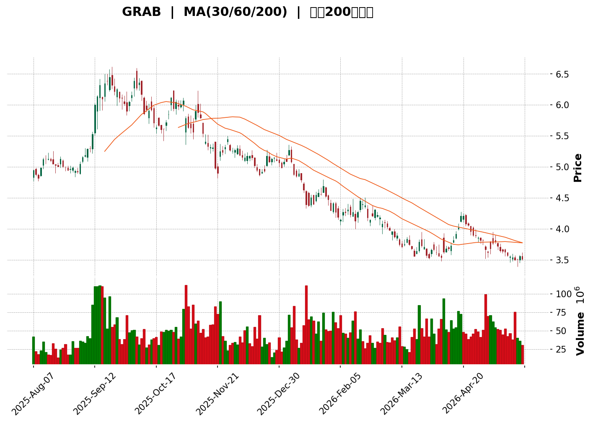
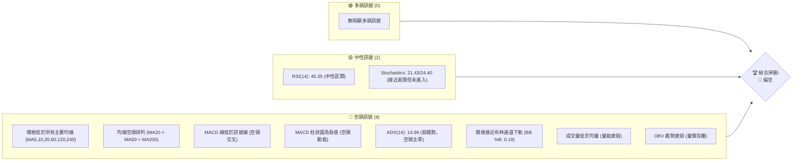
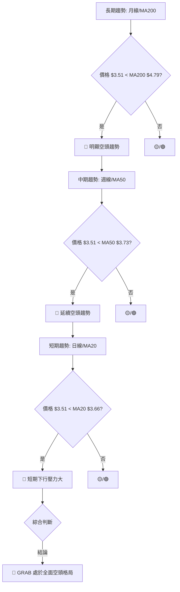
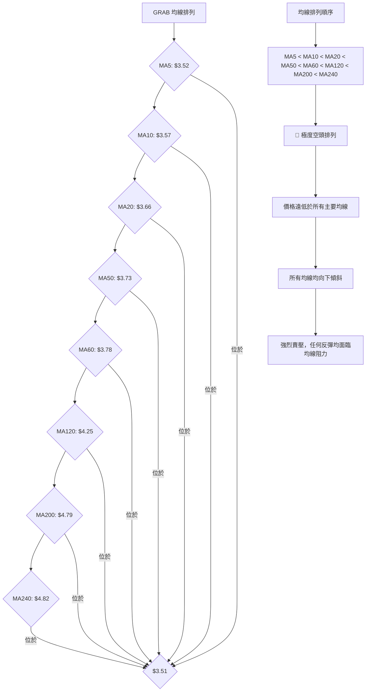

<details>
<summary>📊 靜態圖表 (點擊展開)</summary>

</details>

<html>
<head><meta charset="utf-8" /></head>
<body>
    <div>                        <script>window.PlotlyConfig = {MathJaxConfig: 'local'};</script>
        <script charset="utf-8" src="https://cdn.plot.ly/plotly-3.5.0.min.js" integrity="sha256-fHbNLP+GlIXN+efbQec78UkemUz3NJp7UmfGxC1tNxs=" crossorigin="anonymous"></script>                <div id="candlestick-chart" class="plotly-graph-div" style="height:500px; width:100%;"></div>            <script>                window.PLOTLYENV=window.PLOTLYENV || {};                                if (document.getElementById("candlestick-chart")) {                    Plotly.newPlot(                        "candlestick-chart",                        [{"close":{"dtype":"f8","bdata":"AAAAwMzME0AAAADAHoUTQAAAACCuRxNAAAAAgML1E0AAAABA4XoUQAAAAMAehRRAAAAAwB6FFEAAAABgZmYUQAAAAEAzMxRAAAAAYLgeFEAAAACAPQoUQAAAAMAehRRAAAAAgD0KFEAAAAAAAAAUQAAAAMDMzBNAAAAAoEfhE0AAAACAwvUTQAAAAOBRuBNAAAAAgBSuE0AAAABAMzMUQAAAAADXoxRAAAAAYI\u002fCFEAAAADA9SgVQAAAAEAzMxVAAAAAYLgeFkAAAAAAAAAYQAAAACBcjxhAAAAAIK5HGUAAAABgZmYYQAAAAGBmZhlAAAAAIFyPGUAAAADAzMwZQAAAACCuRxlAAAAAoEfhGEAAAAAAAAAZQAAAAOCjcBhAAAAA4KNwGEAAAADgehQYQAAAAKCZmRdAAAAAQDMzGEAAAAAA16MYQAAAACBcjxlAAAAA4HoUGUAAAADgo3AZQAAAAIAUrhhAAAAA4KNwF0AAAADgUbgXQAAAAADXoxdAAAAAgBSuF0AAAABACtcWQAAAACBcjxZAAAAAgBSuFkAAAABgZmYWQAAAAEDhehZAAAAAoEfhFkAAAABgZmYXQAAAAEDhehhAAAAAYI\u002fCF0AAAABAMzMYQAAAACCF6xdAAAAAgD0KGEAAAAAgrkcYQAAAAADXIxdAAAAAIFyPFkAAAADAHoUWQAAAAKBwPRZAAAAAoJmZF0AAAADAHoUXQAAAAMD1KBdAAAAAwPUoFkAAAAAA16MVQAAAAIDrURVAAAAAIK5HFUAAAACgcD0VQAAAACCF6xNAAAAAoJmZE0AAAAAAAAAVQAAAAIDC9RRAAAAAIK5HFUAAAADAzMwVQAAAAOB6FBVAAAAAgD0KFUAAAADgehQVQAAAAEAzMxVAAAAAYI\u002fCFEAAAAAA16MUQAAAAKCZmRRAAAAA4FG4FEAAAADgUbgUQAAAAKCZmRRAAAAA4HoUFEAAAADAzMwTQAAAAEDhehNAAAAAgBSuE0AAAADgUbgTQAAAAOBRuBRAAAAAgOtRFEAAAADAHoUUQAAAAKCZmRRAAAAAYGZmFEAAAAAgrkcUQAAAAIDC9RNAAAAAgOtRFEAAAAAAKVwUQAAAAOB6FBVAAAAAgOtRFEAAAADAHoUTQAAAAGBmZhNAAAAAIFyPE0AAAADA9SgTQAAAAMAehRJAAAAAIFyPEUAAAADAHoURQAAAAIA9ChJAAAAAoJmZEUAAAABAMzMSQAAAAIDrURJAAAAAoHA9EkAAAABgj8ISQAAAAGC4HhJAAAAAoEfhEUAAAABAMzMRQAAAAADXoxFAAAAA4HoUEUAAAABgj8IQQAAAAKCZmRBAAAAA4HoUEUAAAACAPQoRQAAAAKBwPRFAAAAAIIXrEEAAAADgehQRQAAAAMAehRBAAAAA4HoUEUAAAADAzMwRQAAAAKCZmRFAAAAAwB6FEUAAAADgUbgQQAAAAKCZmRBAAAAAQArXEEAAAACgcD0RQAAAAKBH4RBAAAAA4FG4EEAAAACA61EQQAAAAGBmZhBAAAAAYLgeEEAAAABACtcPQAAAAIAUrg9AAAAAgML1DkAAAABguB4PQAAAAAAAAA5AAAAAgBSuDUAAAAAAAAAOQAAAAOBRuA5AAAAAAAAADkAAAADgo3ANQAAAAEDhegxAAAAAYLgeDUAAAACA61EOQAAAAEAK1w1AAAAAgBSuDUAAAAAgXI8MQAAAAKBwPQxAAAAAIK5HDUAAAAAAKVwNQAAAAIDC9QxAAAAAQOF6DEAAAACA61EMQAAAAIA9Cg1AAAAA4KNwDUAAAADgo3ANQAAAAEAK1w1AAAAAIFyPDkAAAAAAKVwPQAAAAOB6FBBAAAAAQArXEEAAAABACtcQQAAAAIDrURBAAAAAoHA9EEAAAACAFK4PQAAAAEAzMw9AAAAAYLgeD0AAAACgR+EOQAAAACBcjw5AAAAAIFyPDkAAAAAAKVwNQAAAAIDC9QxAAAAA4KNwDUAAAADA9SgOQAAAAIDrUQ5AAAAAYI\u002fCDUAAAABAMzMNQAAAAGC4Hg1AAAAAgD0KDUAAAAAgXI8MQAAAAGBmZgxAAAAAgOtRDEAAAAAAAAAMQAAAAOB6FAxAAAAAQOF6DEAAAADgehQMQA=="},"high":{"dtype":"f8","bdata":"AAAAQArXE0AAAACAwvUTQAAAACBcjxNAAAAAgML1E0AAAACgmZkUQAAAAGCPwhRAAAAAIIXrFEAAAACgmZkUQAAAAIA9ChVAAAAAwPUoFEAAAAAgrkcUQAAAAIAUrhRAAAAAQOF6FEAAAACAPQoUQAAAAOB6FBRAAAAA4HoUFEAAAACAPQoUQAAAAEAK1xNAAAAAgML1E0AAAAAAKVwUQAAAAOBRuBRAAAAA4FE4FUAAAABAMzMVQAAAAAApXBVAAAAAIK5HFkAAAABguB4YQAAAAADXoxhAAAAAgBSuGUAAAADAHoUYQAAAAAAAABpAAAAAAAAAGkAAAACA61EaQAAAAEDhehpAAAAA4FG4GUAAAADgehQZQAAAAKBH4RhAAAAAgBSuGEAAAACgmZkYQAAAAKBH4RhAAAAAIK5HGEAAAACgR+EYQAAAACCuxxlAAAAAYGZmGkAAAABAicEZQAAAAKCZmRlAAAAAIFyPGEAAAAAgrkcYQAAAAOB6FBhAAAAAIFyPGEAAAACAwvUXQAAAAEAzsxZAAAAAgGo8F0AAAADgUbgWQAAAAEDhehZAAAAAgD0KF0AAAADA9agXQAAAAMAehRhAAAAAgML1GEAAAAAAKVwYQAAAAIDrURhAAAAAgOtRGEAAAACAwnUYQAAAACCuRxdAAAAA4KNwF0AAAABAClcXQAAAAMD1KBdAAAAAAAAAGEAAAADgo\u002fAYQAAAAOB6FBhAAAAAoEfhFkAAAABguB4WQAAAAOB6FBZAAAAAgMJ1FUAAAADAHoUVQAAAAADXoxVAAAAAoHA9FEAAAABA4XoVQAAAAAApXBVAAAAA4KNwFUAAAAAAAAAWQAAAAEDhehVAAAAAoHA9FUAAAABAMzMVQAAAAGBmZhVAAAAAYGZmFUAAAAAgXA8VQAAAAAAp3BRAAAAAgML1FEAAAABgj8IUQAAAAOB6FBVAAAAAANejFEAAAABAMzMUQAAAAKBH4RNAAAAAoEfhE0AAAABguB4UQAAAAGC4HhVAAAAAgML1FEAAAACgmZkUQAAAAADXoxRAAAAAIIXrFEAAAAAgXI8UQAAAAAApXBRAAAAAwB6FFEAAAADAzMwUQAAAAOCjcBVAAAAAgOtRFUAAAABAMzMUQAAAAKBH4RNAAAAAoEfhE0AAAACgmZkTQAAAAIA9ChNAAAAAwB6FEkAAAABgZmYSQAAAAOBROBJAAAAAQDMzEkAAAABgZmYSQAAAACBcjxJAAAAAgBSuEkAAAACAFC4TQAAAAOBRuBJAAAAA4FE4EkAAAACgR+ERQAAAAOBRuBFAAAAAYI\u002fCEUAAAABA4XoRQAAAAADXoxBAAAAAwMxMEUAAAAAAKVwRQAAAAGC4nhFAAAAAIFyPEUAAAACAwvURQAAAAOBROBFAAAAAQDMzEUAAAACAPQoSQAAAAEAK1xFAAAAAwB4FEkAAAACAPYoRQAAAAKCZmRBAAAAAwB6FEUAAAAAgrkcRQAAAAGC4HhFAAAAAoEfhEEAAAACAPYoQQAAAAOB6lBBAAAAAwB6FEEAAAADA9SgQQAAAAIAUrg9AAAAAAAAAEEAAAADAHoUPQAAAAMDMzA5AAAAAQOF6DkAAAAAA16MOQAAAAIDC9Q5AAAAAQDMzD0AAAABACtcNQAAAAOCjcA1AAAAAgBSuDUAAAAAA16MOQAAAAKCZmQ9AAAAA4FG4DkAAAADAHoUNQAAAAIDC9QxAAAAA4KNwDUAAAACA61EOQAAAAGCPwg1AAAAAAAAADkAAAABgj8IMQAAAAOCjcA9AAAAAQArXDUAAAADAzMwNQAAAAKBwPQ5AAAAA4HoUD0AAAADgUbgPQAAAAAApXBBAAAAAYLgeEUAAAAAAAAARQAAAAIDC9RBAAAAA4KNwEEAAAABAMzMQQAAAAMD1KBBAAAAAIIXrD0AAAAAAAAAPQAAAACCF6w5AAAAA4FG4DkAAAACgR+ENQAAAAEAzMw1AAAAA4KNwDkAAAACgmZkPQAAAAEAzMw9AAAAAoHA9DkAAAADgehQOQAAAAOCjcA1AAAAA4KNwDUAAAACAwvUMQAAAACBcjwxAAAAAwMzMDEAAAAAgXI8MQAAAAIDpJgxAAAAAANejDEAAAACAwvUMQA=="},"hovertemplate":"\u003cb\u003e%{x|%Y-%m-%d}\u003c\u002fb\u003e\u003cbr\u003e\u958b: $%{open:.2f}\u003cbr\u003e\u9ad8: $%{high:.2f}\u003cbr\u003e\u4f4e: $%{low:.2f}\u003cbr\u003e\u6536: $%{close:.2f}\u003cextra\u003e\u003c\u002fextra\u003e","low":{"dtype":"f8","bdata":"AAAA4HoUE0AAAABgZmYTQAAAAOB6FBNAAAAAoEdhE0AAAACgR+ETQAAAAEAzMxRAAAAA4KNwFEAAAACA61EUQAAAAEAzMxRAAAAAoJmZE0AAAAAAAAAUQAAAAIDC9RNAAAAAgML1E0AAAADgUbgTQAAAAGCPwhNAAAAAoJmZE0AAAAAA16MTQAAAAAApXBNAAAAAIFyPE0AAAADAHoUTQAAAAKBwPRRAAAAAANejFEAAAAAAKVwUQAAAAIDC9RRAAAAAoEfhFEAAAACAPQoWQAAAAOCjcBZAAAAAANejF0AAAADA9agXQAAAAKBwPRhAAAAAIK5HGUAAAACgR+EYQAAAAIA9ChlAAAAAANejGEAAAACAwvUXQAAAAMD1KBhAAAAA4FG4F0AAAACAwvUXQAAAAIDrURdAAAAAoJmZF0AAAACgcD0YQAAAACBcjxhAAAAAgML1GEAAAAAghesYQAAAACCuRxhAAAAAAClcF0AAAAAgXI8XQAAAAMDMzBZAAAAAoJmZF0AAAAAgXI8WQAAAAMD1KBZAAAAAoJmZFkAAAADA9SgWQAAAAIAUrhVAAAAAgOtRFkAAAADgehQXQAAAAADXoxdAAAAAoJmZF0AAAABgZmYXQAAAAIAUrhdAAAAAwMzMF0AAAACgmZkXQAAAAOCjcBVAAAAAQOF6FkAAAACAFC4WQAAAAMDMzBVAAAAAIIXrFkAAAABAMzMXQAAAAGC4HhdAAAAAIIXrFUAAAADgo3AVQAAAAOB6FBVAAAAAoEfhFEAAAAAAAAAVQAAAAEAK1xNAAAAAIK5HE0AAAAAghWsUQAAAAGCPwhRAAAAAQArXFEAAAADgo3AVQAAAAAAAABVAAAAAoEfhFEAAAACgmZkUQAAAACCuxxRAAAAA4FG4FEAAAADgo3AUQAAAAIDrURRAAAAAQDMzFEAAAACgR2EUQAAAAOCjcBRAAAAAgML1E0AAAACAFK4TQAAAAGBmZhNAAAAAIFyPE0AAAAAA16MTQAAAAIA9ChRAAAAAIK5HFEAAAABguB4UQAAAAMDMTBRAAAAAoEdhFEAAAAAAAAAUQAAAACCF6xNAAAAAgD0KFEAAAACA61EUQAAAAGCPwhRAAAAAYI9CFEAAAADgo3ATQAAAAIDrURNAAAAAAClcE0AAAAAAAAATQAAAAIDrURJAAAAAgOtREUAAAADgo3ARQAAAAGBmZhFAAAAAIFyPEUAAAADgUbgRQAAAAOB6FBJAAAAAwPUoEkAAAAAAKVwSQAAAAIA9ChJAAAAAwB6FEUAAAADA9SgRQAAAAAAAABFAAAAA4FG4EEAAAACgmZkQQAAAAKBwPRBAAAAAgMJ1EEAAAABACtcQQAAAACCF6xBAAAAAYI\u002fCEEAAAADAzMwQQAAAAAAAABBAAAAAYGZmEEAAAADgehQRQAAAAGCPQhFAAAAAgOtREUAAAADAHoUQQAAAAEAzMxBAAAAA4KfGEEAAAAAgXI8QQAAAAOBRuBBAAAAAoHA9EEAAAAAAKVwPQAAAAIA9ChBAAAAAAAAAEEAAAABgj8IPQAAAAMAehQ5AAAAAwMzMDkAAAABA4XoOQAAAAGCPwg1AAAAAoJmZDUAAAABgj8INQAAAAMD1KA5AAAAAQArXDUAAAAAgrkcNQAAAAGBmZgxAAAAA4FG4DEAAAACAwvUMQAAAAKCZmQ1AAAAAgOtRDUAAAACgcD0MQAAAAOB6FAxAAAAAYGZmDEAAAABguB4NQAAAAADXowxAAAAAQOF6DEAAAABACtcLQAAAAMDMzAxAAAAAgML1DEAAAABAMzMNQAAAAADXowxAAAAAYGQ7DkAAAACAFK4OQAAAAEAK1w9AAAAA4KNwEEAAAADgo3AQQAAAAEAzMxBAAAAAwPUoEEAAAABAMzMPQAAAAIA9Cg9AAAAAoEfhDkAAAACA61EOQAAAAOB6FA5AAAAAIIXrDUAAAADA9SgMQAAAAIDrUQxAAAAA4FG4DEAAAAAghesNQAAAAOB6FA5AAAAAIK5HDUAAAACAwvUMQAAAAKBH4QxAAAAAQOF6DEAAAABgZmYMQAAAAIAUrgtAAAAAQArXC0AAAAAghesLQAAAAGC4HgtAAAAAoJmZC0AAAAAghesLQA=="},"name":"\u50f9\u683c","open":{"dtype":"f8","bdata":"AAAAQApXE0AAAACgR+ETQAAAAEDhehNAAAAA4KNwE0AAAACgmRkUQAAAAMAehRRAAAAAAACAFEAAAADAHoUUQAAAAEDhehRAAAAAwPUoFEAAAABguB4UQAAAAMAgMBRAAAAAYGZmFEAAAAAAAAAUQAAAAIDC9RNAAAAAQArXE0AAAADAzMwTQAAAAMD1qBNAAAAA4FG4E0AAAAAgXI8TQAAAAAApXBRAAAAAgBSuFEAAAAAA16MUQAAAAEAzMxVAAAAAwPUoFUAAAABAMzMWQAAAAKCZmRdAAAAAQOF6GEAAAADAHoUYQAAAAIA9ihhAAAAAIFyPGUAAAABA4foYQAAAACCF6xlAAAAAQDMzGUAAAADAHoUYQAAAAEAK1xhAAAAAgMJ1GEAAAACgcD0YQAAAAMD1KBhAAAAAgML1F0AAAABA4XoYQAAAAKCZGRlAAAAAQDMzGkAAAACA61EZQAAAAIA9ihlAAAAAQOF6GEAAAACAwvUXQAAAAMD1KBdAAAAAoHA9GEAAAADAzMwXQAAAAEDhehZAAAAAwPUoF0AAAADgUbgWQAAAAEDhehZAAAAAgBSuFkAAAACgR2EXQAAAAAAAABhAAAAAIIXrGEAAAABgj8IXQAAAAAAAABhAAAAAoEfhF0AAAACAPQoYQAAAAGCPQhZAAAAAYI9CF0AAAADAzMwWQAAAAMDMzBZAAAAAoJkZF0AAAAAgXA8YQAAAAGBmZhdAAAAAQArXFkAAAADAHoUVQAAAAIA9ihVAAAAA4FE4FUAAAABAMzMVQAAAAADXoxVAAAAAgD0KFEAAAACAFK4UQAAAAOB6FBVAAAAAwPUoFUAAAAAA16MVQAAAACCFaxVAAAAAwB4FFUAAAACAwvUUQAAAAEAK1xRAAAAAwPUoFUAAAABgj8IUQAAAACCFaxRAAAAAYGZmFEAAAADgepQUQAAAAGCPwhRAAAAAoJmZFEAAAABA4foTQAAAAKBH4RNAAAAAoJmZE0AAAACgR+ETQAAAAOB6FBRAAAAAgBSuFEAAAACA61EUQAAAACBcjxRAAAAAQOF6FEAAAACAwnUUQAAAACCuRxRAAAAAgBQuFEAAAADAHoUUQAAAAGCPwhRAAAAAYLgeFUAAAABAMzMUQAAAAGCPwhNAAAAAYGZmE0AAAACgmZkTQAAAACCF6xJAAAAA4KNwEkAAAACA61ESQAAAAIA9ihFAAAAAQDMzEkAAAADAzMwRQAAAAOB6FBJAAAAAoHA9EkAAAAAAKVwSQAAAAIAUrhJAAAAAwPUoEkAAAACAFK4RQAAAAGC4HhFAAAAAwPWoEUAAAACA61ERQAAAAMAehRBAAAAAoEfhEEAAAABguB4RQAAAAMD1KBFAAAAA4KNwEUAAAADAzMwQQAAAAIDC9RBAAAAAYI\u002fCEEAAAACgcD0RQAAAAOB6lBFAAAAA4KNwEUAAAADAzEwRQAAAAOCjcBBAAAAAAAAAEUAAAADgUbgQQAAAAMDMzBBAAAAAANejEEAAAABguB4QQAAAAOCjcBBAAAAAAClcEEAAAAAgXA8QQAAAACCuRw9AAAAAgBSuD0AAAADAzMwOQAAAAADXow5AAAAAYLgeDkAAAAAghesNQAAAAKBwPQ5AAAAAoJmZDkAAAABgj8INQAAAAEAzMw1AAAAAwMzMDEAAAABAMzMNQAAAAADXow5AAAAAYGZmDUAAAADgo3ANQAAAAOBRuAxAAAAAwMzMDEAAAAAAAAAOQAAAAIDC9QxAAAAAoEfhDEAAAADAHoUMQAAAAEAK1w5AAAAAgD0KDUAAAACgmZkNQAAAAEAzMw1AAAAAoHA9DkAAAADAzMwOQAAAAAAAABBAAAAAQOF6EEAAAABguJ4QQAAAAKBH4RBAAAAAAClcEEAAAABAMzMQQAAAAOB6FBBAAAAAQDMzD0AAAADAzMwOQAAAAKBH4Q5AAAAAIFyPDkAAAADgUbgNQAAAAOB6FA1AAAAAAClcDkAAAADAzMwOQAAAACBcjw5AAAAAwPUoDkAAAACAFK4NQAAAAAApXA1AAAAAAClcDUAAAACAwvUMQAAAAIDrUQxAAAAAYLgeDEAAAACA61EMQAAAAOB6FAxAAAAAAAAADEAAAABA4XoMQA=="},"x":["2025-08-07T00:00:00-04:00","2025-08-08T00:00:00-04:00","2025-08-11T00:00:00-04:00","2025-08-12T00:00:00-04:00","2025-08-13T00:00:00-04:00","2025-08-14T00:00:00-04:00","2025-08-15T00:00:00-04:00","2025-08-18T00:00:00-04:00","2025-08-19T00:00:00-04:00","2025-08-20T00:00:00-04:00","2025-08-21T00:00:00-04:00","2025-08-22T00:00:00-04:00","2025-08-25T00:00:00-04:00","2025-08-26T00:00:00-04:00","2025-08-27T00:00:00-04:00","2025-08-28T00:00:00-04:00","2025-08-29T00:00:00-04:00","2025-09-02T00:00:00-04:00","2025-09-03T00:00:00-04:00","2025-09-04T00:00:00-04:00","2025-09-05T00:00:00-04:00","2025-09-08T00:00:00-04:00","2025-09-09T00:00:00-04:00","2025-09-10T00:00:00-04:00","2025-09-11T00:00:00-04:00","2025-09-12T00:00:00-04:00","2025-09-15T00:00:00-04:00","2025-09-16T00:00:00-04:00","2025-09-17T00:00:00-04:00","2025-09-18T00:00:00-04:00","2025-09-19T00:00:00-04:00","2025-09-22T00:00:00-04:00","2025-09-23T00:00:00-04:00","2025-09-24T00:00:00-04:00","2025-09-25T00:00:00-04:00","2025-09-26T00:00:00-04:00","2025-09-29T00:00:00-04:00","2025-09-30T00:00:00-04:00","2025-10-01T00:00:00-04:00","2025-10-02T00:00:00-04:00","2025-10-03T00:00:00-04:00","2025-10-06T00:00:00-04:00","2025-10-07T00:00:00-04:00","2025-10-08T00:00:00-04:00","2025-10-09T00:00:00-04:00","2025-10-10T00:00:00-04:00","2025-10-13T00:00:00-04:00","2025-10-14T00:00:00-04:00","2025-10-15T00:00:00-04:00","2025-10-16T00:00:00-04:00","2025-10-17T00:00:00-04:00","2025-10-20T00:00:00-04:00","2025-10-21T00:00:00-04:00","2025-10-22T00:00:00-04:00","2025-10-23T00:00:00-04:00","2025-10-24T00:00:00-04:00","2025-10-27T00:00:00-04:00","2025-10-28T00:00:00-04:00","2025-10-29T00:00:00-04:00","2025-10-30T00:00:00-04:00","2025-10-31T00:00:00-04:00","2025-11-03T00:00:00-05:00","2025-11-04T00:00:00-05:00","2025-11-05T00:00:00-05:00","2025-11-06T00:00:00-05:00","2025-11-07T00:00:00-05:00","2025-11-10T00:00:00-05:00","2025-11-11T00:00:00-05:00","2025-11-12T00:00:00-05:00","2025-11-13T00:00:00-05:00","2025-11-14T00:00:00-05:00","2025-11-17T00:00:00-05:00","2025-11-18T00:00:00-05:00","2025-11-19T00:00:00-05:00","2025-11-20T00:00:00-05:00","2025-11-21T00:00:00-05:00","2025-11-24T00:00:00-05:00","2025-11-25T00:00:00-05:00","2025-11-26T00:00:00-05:00","2025-11-28T00:00:00-05:00","2025-12-01T00:00:00-05:00","2025-12-02T00:00:00-05:00","2025-12-03T00:00:00-05:00","2025-12-04T00:00:00-05:00","2025-12-05T00:00:00-05:00","2025-12-08T00:00:00-05:00","2025-12-09T00:00:00-05:00","2025-12-10T00:00:00-05:00","2025-12-11T00:00:00-05:00","2025-12-12T00:00:00-05:00","2025-12-15T00:00:00-05:00","2025-12-16T00:00:00-05:00","2025-12-17T00:00:00-05:00","2025-12-18T00:00:00-05:00","2025-12-19T00:00:00-05:00","2025-12-22T00:00:00-05:00","2025-12-23T00:00:00-05:00","2025-12-24T00:00:00-05:00","2025-12-26T00:00:00-05:00","2025-12-29T00:00:00-05:00","2025-12-30T00:00:00-05:00","2025-12-31T00:00:00-05:00","2026-01-02T00:00:00-05:00","2026-01-05T00:00:00-05:00","2026-01-06T00:00:00-05:00","2026-01-07T00:00:00-05:00","2026-01-08T00:00:00-05:00","2026-01-09T00:00:00-05:00","2026-01-12T00:00:00-05:00","2026-01-13T00:00:00-05:00","2026-01-14T00:00:00-05:00","2026-01-15T00:00:00-05:00","2026-01-16T00:00:00-05:00","2026-01-20T00:00:00-05:00","2026-01-21T00:00:00-05:00","2026-01-22T00:00:00-05:00","2026-01-23T00:00:00-05:00","2026-01-26T00:00:00-05:00","2026-01-27T00:00:00-05:00","2026-01-28T00:00:00-05:00","2026-01-29T00:00:00-05:00","2026-01-30T00:00:00-05:00","2026-02-02T00:00:00-05:00","2026-02-03T00:00:00-05:00","2026-02-04T00:00:00-05:00","2026-02-05T00:00:00-05:00","2026-02-06T00:00:00-05:00","2026-02-09T00:00:00-05:00","2026-02-10T00:00:00-05:00","2026-02-11T00:00:00-05:00","2026-02-12T00:00:00-05:00","2026-02-13T00:00:00-05:00","2026-02-17T00:00:00-05:00","2026-02-18T00:00:00-05:00","2026-02-19T00:00:00-05:00","2026-02-20T00:00:00-05:00","2026-02-23T00:00:00-05:00","2026-02-24T00:00:00-05:00","2026-02-25T00:00:00-05:00","2026-02-26T00:00:00-05:00","2026-02-27T00:00:00-05:00","2026-03-02T00:00:00-05:00","2026-03-03T00:00:00-05:00","2026-03-04T00:00:00-05:00","2026-03-05T00:00:00-05:00","2026-03-06T00:00:00-05:00","2026-03-09T00:00:00-04:00","2026-03-10T00:00:00-04:00","2026-03-11T00:00:00-04:00","2026-03-12T00:00:00-04:00","2026-03-13T00:00:00-04:00","2026-03-16T00:00:00-04:00","2026-03-17T00:00:00-04:00","2026-03-18T00:00:00-04:00","2026-03-19T00:00:00-04:00","2026-03-20T00:00:00-04:00","2026-03-23T00:00:00-04:00","2026-03-24T00:00:00-04:00","2026-03-25T00:00:00-04:00","2026-03-26T00:00:00-04:00","2026-03-27T00:00:00-04:00","2026-03-30T00:00:00-04:00","2026-03-31T00:00:00-04:00","2026-04-01T00:00:00-04:00","2026-04-02T00:00:00-04:00","2026-04-06T00:00:00-04:00","2026-04-07T00:00:00-04:00","2026-04-08T00:00:00-04:00","2026-04-09T00:00:00-04:00","2026-04-10T00:00:00-04:00","2026-04-13T00:00:00-04:00","2026-04-14T00:00:00-04:00","2026-04-15T00:00:00-04:00","2026-04-16T00:00:00-04:00","2026-04-17T00:00:00-04:00","2026-04-20T00:00:00-04:00","2026-04-21T00:00:00-04:00","2026-04-22T00:00:00-04:00","2026-04-23T00:00:00-04:00","2026-04-24T00:00:00-04:00","2026-04-27T00:00:00-04:00","2026-04-28T00:00:00-04:00","2026-04-29T00:00:00-04:00","2026-04-30T00:00:00-04:00","2026-05-01T00:00:00-04:00","2026-05-04T00:00:00-04:00","2026-05-05T00:00:00-04:00","2026-05-06T00:00:00-04:00","2026-05-07T00:00:00-04:00","2026-05-08T00:00:00-04:00","2026-05-11T00:00:00-04:00","2026-05-12T00:00:00-04:00","2026-05-13T00:00:00-04:00","2026-05-14T00:00:00-04:00","2026-05-15T00:00:00-04:00","2026-05-18T00:00:00-04:00","2026-05-19T00:00:00-04:00","2026-05-20T00:00:00-04:00","2026-05-21T00:00:00-04:00","2026-05-22T00:00:00-04:00"],"type":"candlestick"},{"hovertemplate":"MA30: $%{y:.2f}\u003cextra\u003e\u003c\u002fextra\u003e","line":{"color":"#2196F3","dash":"dash","width":2},"mode":"lines","name":"MA30","x":["2025-08-07T00:00:00-04:00","2025-08-08T00:00:00-04:00","2025-08-11T00:00:00-04:00","2025-08-12T00:00:00-04:00","2025-08-13T00:00:00-04:00","2025-08-14T00:00:00-04:00","2025-08-15T00:00:00-04:00","2025-08-18T00:00:00-04:00","2025-08-19T00:00:00-04:00","2025-08-20T00:00:00-04:00","2025-08-21T00:00:00-04:00","2025-08-22T00:00:00-04:00","2025-08-25T00:00:00-04:00","2025-08-26T00:00:00-04:00","2025-08-27T00:00:00-04:00","2025-08-28T00:00:00-04:00","2025-08-29T00:00:00-04:00","2025-09-02T00:00:00-04:00","2025-09-03T00:00:00-04:00","2025-09-04T00:00:00-04:00","2025-09-05T00:00:00-04:00","2025-09-08T00:00:00-04:00","2025-09-09T00:00:00-04:00","2025-09-10T00:00:00-04:00","2025-09-11T00:00:00-04:00","2025-09-12T00:00:00-04:00","2025-09-15T00:00:00-04:00","2025-09-16T00:00:00-04:00","2025-09-17T00:00:00-04:00","2025-09-18T00:00:00-04:00","2025-09-19T00:00:00-04:00","2025-09-22T00:00:00-04:00","2025-09-23T00:00:00-04:00","2025-09-24T00:00:00-04:00","2025-09-25T00:00:00-04:00","2025-09-26T00:00:00-04:00","2025-09-29T00:00:00-04:00","2025-09-30T00:00:00-04:00","2025-10-01T00:00:00-04:00","2025-10-02T00:00:00-04:00","2025-10-03T00:00:00-04:00","2025-10-06T00:00:00-04:00","2025-10-07T00:00:00-04:00","2025-10-08T00:00:00-04:00","2025-10-09T00:00:00-04:00","2025-10-10T00:00:00-04:00","2025-10-13T00:00:00-04:00","2025-10-14T00:00:00-04:00","2025-10-15T00:00:00-04:00","2025-10-16T00:00:00-04:00","2025-10-17T00:00:00-04:00","2025-10-20T00:00:00-04:00","2025-10-21T00:00:00-04:00","2025-10-22T00:00:00-04:00","2025-10-23T00:00:00-04:00","2025-10-24T00:00:00-04:00","2025-10-27T00:00:00-04:00","2025-10-28T00:00:00-04:00","2025-10-29T00:00:00-04:00","2025-10-30T00:00:00-04:00","2025-10-31T00:00:00-04:00","2025-11-03T00:00:00-05:00","2025-11-04T00:00:00-05:00","2025-11-05T00:00:00-05:00","2025-11-06T00:00:00-05:00","2025-11-07T00:00:00-05:00","2025-11-10T00:00:00-05:00","2025-11-11T00:00:00-05:00","2025-11-12T00:00:00-05:00","2025-11-13T00:00:00-05:00","2025-11-14T00:00:00-05:00","2025-11-17T00:00:00-05:00","2025-11-18T00:00:00-05:00","2025-11-19T00:00:00-05:00","2025-11-20T00:00:00-05:00","2025-11-21T00:00:00-05:00","2025-11-24T00:00:00-05:00","2025-11-25T00:00:00-05:00","2025-11-26T00:00:00-05:00","2025-11-28T00:00:00-05:00","2025-12-01T00:00:00-05:00","2025-12-02T00:00:00-05:00","2025-12-03T00:00:00-05:00","2025-12-04T00:00:00-05:00","2025-12-05T00:00:00-05:00","2025-12-08T00:00:00-05:00","2025-12-09T00:00:00-05:00","2025-12-10T00:00:00-05:00","2025-12-11T00:00:00-05:00","2025-12-12T00:00:00-05:00","2025-12-15T00:00:00-05:00","2025-12-16T00:00:00-05:00","2025-12-17T00:00:00-05:00","2025-12-18T00:00:00-05:00","2025-12-19T00:00:00-05:00","2025-12-22T00:00:00-05:00","2025-12-23T00:00:00-05:00","2025-12-24T00:00:00-05:00","2025-12-26T00:00:00-05:00","2025-12-29T00:00:00-05:00","2025-12-30T00:00:00-05:00","2025-12-31T00:00:00-05:00","2026-01-02T00:00:00-05:00","2026-01-05T00:00:00-05:00","2026-01-06T00:00:00-05:00","2026-01-07T00:00:00-05:00","2026-01-08T00:00:00-05:00","2026-01-09T00:00:00-05:00","2026-01-12T00:00:00-05:00","2026-01-13T00:00:00-05:00","2026-01-14T00:00:00-05:00","2026-01-15T00:00:00-05:00","2026-01-16T00:00:00-05:00","2026-01-20T00:00:00-05:00","2026-01-21T00:00:00-05:00","2026-01-22T00:00:00-05:00","2026-01-23T00:00:00-05:00","2026-01-26T00:00:00-05:00","2026-01-27T00:00:00-05:00","2026-01-28T00:00:00-05:00","2026-01-29T00:00:00-05:00","2026-01-30T00:00:00-05:00","2026-02-02T00:00:00-05:00","2026-02-03T00:00:00-05:00","2026-02-04T00:00:00-05:00","2026-02-05T00:00:00-05:00","2026-02-06T00:00:00-05:00","2026-02-09T00:00:00-05:00","2026-02-10T00:00:00-05:00","2026-02-11T00:00:00-05:00","2026-02-12T00:00:00-05:00","2026-02-13T00:00:00-05:00","2026-02-17T00:00:00-05:00","2026-02-18T00:00:00-05:00","2026-02-19T00:00:00-05:00","2026-02-20T00:00:00-05:00","2026-02-23T00:00:00-05:00","2026-02-24T00:00:00-05:00","2026-02-25T00:00:00-05:00","2026-02-26T00:00:00-05:00","2026-02-27T00:00:00-05:00","2026-03-02T00:00:00-05:00","2026-03-03T00:00:00-05:00","2026-03-04T00:00:00-05:00","2026-03-05T00:00:00-05:00","2026-03-06T00:00:00-05:00","2026-03-09T00:00:00-04:00","2026-03-10T00:00:00-04:00","2026-03-11T00:00:00-04:00","2026-03-12T00:00:00-04:00","2026-03-13T00:00:00-04:00","2026-03-16T00:00:00-04:00","2026-03-17T00:00:00-04:00","2026-03-18T00:00:00-04:00","2026-03-19T00:00:00-04:00","2026-03-20T00:00:00-04:00","2026-03-23T00:00:00-04:00","2026-03-24T00:00:00-04:00","2026-03-25T00:00:00-04:00","2026-03-26T00:00:00-04:00","2026-03-27T00:00:00-04:00","2026-03-30T00:00:00-04:00","2026-03-31T00:00:00-04:00","2026-04-01T00:00:00-04:00","2026-04-02T00:00:00-04:00","2026-04-06T00:00:00-04:00","2026-04-07T00:00:00-04:00","2026-04-08T00:00:00-04:00","2026-04-09T00:00:00-04:00","2026-04-10T00:00:00-04:00","2026-04-13T00:00:00-04:00","2026-04-14T00:00:00-04:00","2026-04-15T00:00:00-04:00","2026-04-16T00:00:00-04:00","2026-04-17T00:00:00-04:00","2026-04-20T00:00:00-04:00","2026-04-21T00:00:00-04:00","2026-04-22T00:00:00-04:00","2026-04-23T00:00:00-04:00","2026-04-24T00:00:00-04:00","2026-04-27T00:00:00-04:00","2026-04-28T00:00:00-04:00","2026-04-29T00:00:00-04:00","2026-04-30T00:00:00-04:00","2026-05-01T00:00:00-04:00","2026-05-04T00:00:00-04:00","2026-05-05T00:00:00-04:00","2026-05-06T00:00:00-04:00","2026-05-07T00:00:00-04:00","2026-05-08T00:00:00-04:00","2026-05-11T00:00:00-04:00","2026-05-12T00:00:00-04:00","2026-05-13T00:00:00-04:00","2026-05-14T00:00:00-04:00","2026-05-15T00:00:00-04:00","2026-05-18T00:00:00-04:00","2026-05-19T00:00:00-04:00","2026-05-20T00:00:00-04:00","2026-05-21T00:00:00-04:00","2026-05-22T00:00:00-04:00"],"y":{"dtype":"f8","bdata":"AAAAAAAA+H8AAAAAAAD4fwAAAAAAAPh\u002fAAAAAAAA+H8AAAAAAAD4fwAAAAAAAPh\u002fAAAAAAAA+H8AAAAAAAD4fwAAAAAAAPh\u002fAAAAAAAA+H8AAAAAAAD4fwAAAAAAAPh\u002fAAAAAAAA+H8AAAAAAAD4fwAAAAAAAPh\u002fAAAAAAAA+H8AAAAAAAD4fwAAAAAAAPh\u002fAAAAAAAA+H8AAAAAAAD4fwAAAAAAAPh\u002fAAAAAAAA+H8AAAAAAAD4fwAAAAAAAPh\u002fAAAAAAAA+H8AAAAAAAD4fwAAAAAAAPh\u002fAAAAAAAA+H8AAAAAAAD4f3d3d4ddARVAERERcYQyFUDv7u5OG2gVQCIiIoJOmxVAmpmZaUrFFUARERGB3OsVQAAAAOBPDRZA7+7uPsMuFkBERERUKk4WQN7d3b0taxZAMzMzo\u002f6NFkDNzMx8P7UWQImIiIhB4BZARERElEMLF0ARERFxrzkXQHd3d\u002fdTYxdAiYiI6LSBF0ARERHByqEXQAAAACA+wxdAIiIiQmDlF0DNzMxs5\u002fsXQKuqqrpJDBhAiYiICKwcGECrqqraQCcYQN7d3Q0tMhhAvLu7S6k4GEAzMzOTijMYQAAAANDbMhhAIiIiUuMlGECrqqpqLiQYQO\u002fu7k6NFxhAIiIi0pQKGEBVVVVVnP0XQN7d3W1Z6xdAAAAAUI3XF0C8u7urY8IXQCIiIrKdrxdAAAAAsHKoF0CamZlZq6MXQHd3dyfqnxdAREREtIGOF0Crqqoa6HQXQO\u002fu7q65UBdAVVVVdUwwF0CrqqpqdQwXQJqZmQnX4xZA3t3dbRLDFkAAAACA3KsWQDMzM\u002fP9lBZAIiIiEoOAFkB3d3cno3cWQLy7uwsCaxZAmpmZaQNdFkBERETUv1EWQBEREaHTRhZAvLu7a7w0FkC8u7sbLx0WQO\u002fu7h4T\u002fBVAMzMzIyLiFUBVVVX1b8QVQO\u002fu7k4bqBVA3t3djVCGFUB3d3fXFWAVQDMzM3PaQBVA7+7u\u002fkYoFUDNzMxMYhAVQO\u002fu7s5pAxVAmpmZiWznFEAAAADw0s0UQImIiIj6txRAERERwfWoFECrqqrKWp0UQDMzM9O\u002fkRRAvLu7q46JFECJiIhIDIIUQHd3d1fyixRARERENBeSFECJiIgYdoUUQJqZmTkmeBRAMzMz03hpFECJiIio8VIUQBEREUEZPRRAMzMzE2cfFEAzMzMjBgEUQDMzMwMP5hNAMzMz4xfLE0ARERGhRbYTQEREROTQohNAAAAAQKeNE0ARERGR7XwTQM3MzOzDZxNAMzMz8\u002f1UE0Crqqoqzj4TQAAAAKAaLxNAZmZm1uoYE0Dv7u6eqP8SQImIiFiA3BJAVVVVddrAEkCJiIhIKKMSQAAAAEB8hhJAMzMzE8poEkARERGRe00SQGZmZsYgMBJAMzMz43oUEkCrqqp6ov4RQN7d3U3w4BFAzczMnAvJEUCrqqrqJrERQJqZmTlCmRFAvLu7SwyCEUDe3d39qXERQKuqqlqrYxFAiYiIWIBcEUB3d3fnQlIRQERERERERBFAiYiIKKM3EUC8u7trLiQRQHd3d8cEDxFAd3d3d3f3EEDe3d31KNwQQO\u002fu7jaJwRBAREREPJinEECrqqpC0pQQQGZmZoZdgRBAIiIisp1vEEB3d3c\u002fNV4QQHd3d78RShBAmpmZuZA0EEDNzMzMhSQQQO\u002fu7q65EBBAVVVVtfP9D0AiIiJSKs4PQO\u002fu7o40pQ9AmpmZCZB7D0De3d2NUEYPQAAAABAREQ9AVVVVhRbZDkBmZma2Za0OQN7d3Q3miQ5AIiIiordlDkBmZmaWtToOQImIiDhCGQ5ARERExK4ADkARERGRwvUNQHd3d3dM8A1AERERMZb8DUC8u7u7SQwOQCIiIuJ6FA5AAAAAYHMhDkBmZma2OiYOQHd3dyd4MA5AIiIi4sE8DkBVVVVFREQOQO\u002fu7r7mQg5AVVVVFa5HDkAiIiJS\u002f0YOQFVVVeUXSw5AIiIi8tJNDkC8u7trdUwOQO\u002fu7v6NUA5AIiIiwjxRDkDNzMzcslYOQBEREUE1Xg5Ad3d39yhcDkBmZmZWVVUOQAAAAACOUA5AmpmZeTBPDkDNzMxsdUwOQFVVVUVERA5A3t3dHRM8DkBmZmYmeDAOQA=="},"type":"scatter"},{"hovertemplate":"MA60: $%{y:.2f}\u003cextra\u003e\u003c\u002fextra\u003e","line":{"color":"#9C27B0","dash":"dash","width":2},"mode":"lines","name":"MA60","x":["2025-08-07T00:00:00-04:00","2025-08-08T00:00:00-04:00","2025-08-11T00:00:00-04:00","2025-08-12T00:00:00-04:00","2025-08-13T00:00:00-04:00","2025-08-14T00:00:00-04:00","2025-08-15T00:00:00-04:00","2025-08-18T00:00:00-04:00","2025-08-19T00:00:00-04:00","2025-08-20T00:00:00-04:00","2025-08-21T00:00:00-04:00","2025-08-22T00:00:00-04:00","2025-08-25T00:00:00-04:00","2025-08-26T00:00:00-04:00","2025-08-27T00:00:00-04:00","2025-08-28T00:00:00-04:00","2025-08-29T00:00:00-04:00","2025-09-02T00:00:00-04:00","2025-09-03T00:00:00-04:00","2025-09-04T00:00:00-04:00","2025-09-05T00:00:00-04:00","2025-09-08T00:00:00-04:00","2025-09-09T00:00:00-04:00","2025-09-10T00:00:00-04:00","2025-09-11T00:00:00-04:00","2025-09-12T00:00:00-04:00","2025-09-15T00:00:00-04:00","2025-09-16T00:00:00-04:00","2025-09-17T00:00:00-04:00","2025-09-18T00:00:00-04:00","2025-09-19T00:00:00-04:00","2025-09-22T00:00:00-04:00","2025-09-23T00:00:00-04:00","2025-09-24T00:00:00-04:00","2025-09-25T00:00:00-04:00","2025-09-26T00:00:00-04:00","2025-09-29T00:00:00-04:00","2025-09-30T00:00:00-04:00","2025-10-01T00:00:00-04:00","2025-10-02T00:00:00-04:00","2025-10-03T00:00:00-04:00","2025-10-06T00:00:00-04:00","2025-10-07T00:00:00-04:00","2025-10-08T00:00:00-04:00","2025-10-09T00:00:00-04:00","2025-10-10T00:00:00-04:00","2025-10-13T00:00:00-04:00","2025-10-14T00:00:00-04:00","2025-10-15T00:00:00-04:00","2025-10-16T00:00:00-04:00","2025-10-17T00:00:00-04:00","2025-10-20T00:00:00-04:00","2025-10-21T00:00:00-04:00","2025-10-22T00:00:00-04:00","2025-10-23T00:00:00-04:00","2025-10-24T00:00:00-04:00","2025-10-27T00:00:00-04:00","2025-10-28T00:00:00-04:00","2025-10-29T00:00:00-04:00","2025-10-30T00:00:00-04:00","2025-10-31T00:00:00-04:00","2025-11-03T00:00:00-05:00","2025-11-04T00:00:00-05:00","2025-11-05T00:00:00-05:00","2025-11-06T00:00:00-05:00","2025-11-07T00:00:00-05:00","2025-11-10T00:00:00-05:00","2025-11-11T00:00:00-05:00","2025-11-12T00:00:00-05:00","2025-11-13T00:00:00-05:00","2025-11-14T00:00:00-05:00","2025-11-17T00:00:00-05:00","2025-11-18T00:00:00-05:00","2025-11-19T00:00:00-05:00","2025-11-20T00:00:00-05:00","2025-11-21T00:00:00-05:00","2025-11-24T00:00:00-05:00","2025-11-25T00:00:00-05:00","2025-11-26T00:00:00-05:00","2025-11-28T00:00:00-05:00","2025-12-01T00:00:00-05:00","2025-12-02T00:00:00-05:00","2025-12-03T00:00:00-05:00","2025-12-04T00:00:00-05:00","2025-12-05T00:00:00-05:00","2025-12-08T00:00:00-05:00","2025-12-09T00:00:00-05:00","2025-12-10T00:00:00-05:00","2025-12-11T00:00:00-05:00","2025-12-12T00:00:00-05:00","2025-12-15T00:00:00-05:00","2025-12-16T00:00:00-05:00","2025-12-17T00:00:00-05:00","2025-12-18T00:00:00-05:00","2025-12-19T00:00:00-05:00","2025-12-22T00:00:00-05:00","2025-12-23T00:00:00-05:00","2025-12-24T00:00:00-05:00","2025-12-26T00:00:00-05:00","2025-12-29T00:00:00-05:00","2025-12-30T00:00:00-05:00","2025-12-31T00:00:00-05:00","2026-01-02T00:00:00-05:00","2026-01-05T00:00:00-05:00","2026-01-06T00:00:00-05:00","2026-01-07T00:00:00-05:00","2026-01-08T00:00:00-05:00","2026-01-09T00:00:00-05:00","2026-01-12T00:00:00-05:00","2026-01-13T00:00:00-05:00","2026-01-14T00:00:00-05:00","2026-01-15T00:00:00-05:00","2026-01-16T00:00:00-05:00","2026-01-20T00:00:00-05:00","2026-01-21T00:00:00-05:00","2026-01-22T00:00:00-05:00","2026-01-23T00:00:00-05:00","2026-01-26T00:00:00-05:00","2026-01-27T00:00:00-05:00","2026-01-28T00:00:00-05:00","2026-01-29T00:00:00-05:00","2026-01-30T00:00:00-05:00","2026-02-02T00:00:00-05:00","2026-02-03T00:00:00-05:00","2026-02-04T00:00:00-05:00","2026-02-05T00:00:00-05:00","2026-02-06T00:00:00-05:00","2026-02-09T00:00:00-05:00","2026-02-10T00:00:00-05:00","2026-02-11T00:00:00-05:00","2026-02-12T00:00:00-05:00","2026-02-13T00:00:00-05:00","2026-02-17T00:00:00-05:00","2026-02-18T00:00:00-05:00","2026-02-19T00:00:00-05:00","2026-02-20T00:00:00-05:00","2026-02-23T00:00:00-05:00","2026-02-24T00:00:00-05:00","2026-02-25T00:00:00-05:00","2026-02-26T00:00:00-05:00","2026-02-27T00:00:00-05:00","2026-03-02T00:00:00-05:00","2026-03-03T00:00:00-05:00","2026-03-04T00:00:00-05:00","2026-03-05T00:00:00-05:00","2026-03-06T00:00:00-05:00","2026-03-09T00:00:00-04:00","2026-03-10T00:00:00-04:00","2026-03-11T00:00:00-04:00","2026-03-12T00:00:00-04:00","2026-03-13T00:00:00-04:00","2026-03-16T00:00:00-04:00","2026-03-17T00:00:00-04:00","2026-03-18T00:00:00-04:00","2026-03-19T00:00:00-04:00","2026-03-20T00:00:00-04:00","2026-03-23T00:00:00-04:00","2026-03-24T00:00:00-04:00","2026-03-25T00:00:00-04:00","2026-03-26T00:00:00-04:00","2026-03-27T00:00:00-04:00","2026-03-30T00:00:00-04:00","2026-03-31T00:00:00-04:00","2026-04-01T00:00:00-04:00","2026-04-02T00:00:00-04:00","2026-04-06T00:00:00-04:00","2026-04-07T00:00:00-04:00","2026-04-08T00:00:00-04:00","2026-04-09T00:00:00-04:00","2026-04-10T00:00:00-04:00","2026-04-13T00:00:00-04:00","2026-04-14T00:00:00-04:00","2026-04-15T00:00:00-04:00","2026-04-16T00:00:00-04:00","2026-04-17T00:00:00-04:00","2026-04-20T00:00:00-04:00","2026-04-21T00:00:00-04:00","2026-04-22T00:00:00-04:00","2026-04-23T00:00:00-04:00","2026-04-24T00:00:00-04:00","2026-04-27T00:00:00-04:00","2026-04-28T00:00:00-04:00","2026-04-29T00:00:00-04:00","2026-04-30T00:00:00-04:00","2026-05-01T00:00:00-04:00","2026-05-04T00:00:00-04:00","2026-05-05T00:00:00-04:00","2026-05-06T00:00:00-04:00","2026-05-07T00:00:00-04:00","2026-05-08T00:00:00-04:00","2026-05-11T00:00:00-04:00","2026-05-12T00:00:00-04:00","2026-05-13T00:00:00-04:00","2026-05-14T00:00:00-04:00","2026-05-15T00:00:00-04:00","2026-05-18T00:00:00-04:00","2026-05-19T00:00:00-04:00","2026-05-20T00:00:00-04:00","2026-05-21T00:00:00-04:00","2026-05-22T00:00:00-04:00"],"y":{"dtype":"f8","bdata":"AAAAAAAA+H8AAAAAAAD4fwAAAAAAAPh\u002fAAAAAAAA+H8AAAAAAAD4fwAAAAAAAPh\u002fAAAAAAAA+H8AAAAAAAD4fwAAAAAAAPh\u002fAAAAAAAA+H8AAAAAAAD4fwAAAAAAAPh\u002fAAAAAAAA+H8AAAAAAAD4fwAAAAAAAPh\u002fAAAAAAAA+H8AAAAAAAD4fwAAAAAAAPh\u002fAAAAAAAA+H8AAAAAAAD4fwAAAAAAAPh\u002fAAAAAAAA+H8AAAAAAAD4fwAAAAAAAPh\u002fAAAAAAAA+H8AAAAAAAD4fwAAAAAAAPh\u002fAAAAAAAA+H8AAAAAAAD4fwAAAAAAAPh\u002fAAAAAAAA+H8AAAAAAAD4fwAAAAAAAPh\u002fAAAAAAAA+H8AAAAAAAD4fwAAAAAAAPh\u002fAAAAAAAA+H8AAAAAAAD4fwAAAAAAAPh\u002fAAAAAAAA+H8AAAAAAAD4fwAAAAAAAPh\u002fAAAAAAAA+H8AAAAAAAD4fwAAAAAAAPh\u002fAAAAAAAA+H8AAAAAAAD4fwAAAAAAAPh\u002fAAAAAAAA+H8AAAAAAAD4fwAAAAAAAPh\u002fAAAAAAAA+H8AAAAAAAD4fwAAAAAAAPh\u002fAAAAAAAA+H8AAAAAAAD4fwAAAAAAAPh\u002fAAAAAAAA+H8AAAAAAAD4fzMzM2t1jBZAmpmZoYyeFkAiIiLS27IWQAAAAPhTwxZAzczM3GvOFkBmZmYWINcWQBEREcl23hZAd3d395rrFkDv7u7W6vgWQKuqqvKLBRdAvLu7K0AOF0C8u7vLExUXQLy7u5t9GBdAzczMBMgdF0De3d1tEiMXQImIiICVIxdAMzMzq2MiF0CJiIig0yYXQJqZmQkeLBdAIiIiqvEyF0AiIiJKxTkXQDMzM+OlOxdAERERudc8F0B3d3dXgDwXQHd3d1eAPBdAvLu727I2F0B3d3fXXCgXQHd3d3d3FxdAq6qqugIEF0AAAAAwT\u002fQWQO\u002fu7k7U3xZAAAAAsHLIFkBmZmYW2a4WQImIiPAZlhZAd3d3J+p\u002fFkBERET8YmkWQImIiMCDWRZAzczMnO9HFkDNzMwkvzgWQAAAAFjyKxZAq6qqursbFkCrqqpyIQkWQBEREcE88RVAiYiIkO3cFUCamZnZQMcVQImIiLDktxVAERER0ZSqFUBERERMqZgVQGZmZhaShhVAq6qq8v10FUAAAABoSmUVQGZmZqYNVBVAZmZmPjU+FUC8u7v7YikVQCIiIlJxFhVAd3d3J+r\u002fFEBmZmZeuukUQJqZmQFyzxRAmpmZseS3FEAzMzPDrqAUQN7d3Z3vhxRAiYiIQKdtFEAREREBck8UQJqZmYn6NxRAq6qq6pggFEDe3d11BQgUQLy7uxP17xNAd3d3fyPUE0BEREScfbgTQERERGQ7nxNAIiIi6t+IE0De3d0ta3UTQM3MzEzwYBNAd3d3xwRPE0CamZlhV0ATQKuqqlJxNhNAiYiIaJEtE0CamZmBThsTQJqZmTm0CBNAd3d3j8L1EkAzMzPTTeISQN7d3U1i0BJA3t3dtfO9EkBVVVWFpKkSQLy7u6MplRJA3t3dhV2BEkBmZmYGOm0SQN7d3dXqWBJAvLu7W49CEkB3d3dDiywSQN7d3ZGmFBJAvLu7F0v+EUCrqqo20OkRQDMzMxM82BFARERERETEEUAzMzPv7q4RQAAAAAxJkxFAd3d3l7V6EUCrqqoK12MRQHd3d\u002feaSxFA7+7u9uEzEUARERFdSBoRQO\u002fu7oZdARFAAAAAdCHpEEDNzMxg5dAQQO\u002fu7mq8tBBAvLu7b8uaEEDv7u7i7IMQQERERKAabxBAZmZmDnRaEECJiIhkgkcQQHd3dzsmOBBAVVVV3WsuEEAAAAAYkiYQQAAAAEA1HhBAiYiIIPcaEEDNzMykKRUQQERERByhDBBAvLu7kxgEEEARERFRRu8PQKuqqkrF2Q9AVVVVLfnFD0BVVVVl9LYPQN7d3eXQog9AzczMvHSTD0CJiIjotIEPQCIiIrKdbw9Aq6qqMnpbD0CrqqqCwEoPQGZmZq4AOQ9AvLu7O5gnD0B3d3eXbhIPQAAAAOi0AQ9AiYiIgNzrDkAiIiLy0s0OQAAAAIjPsA5Ad3d3fyOUDkCamZmR7XwOQJqZmSkVZw5AAAAAYOVQDkBmZmbeljUOQA=="},"type":"scatter"},{"hovertemplate":"MA200: $%{y:.2f}\u003cextra\u003e\u003c\u002fextra\u003e","line":{"color":"#FF6F00","dash":"solid","width":2},"mode":"lines","name":"MA200","x":["2025-08-07T00:00:00-04:00","2025-08-08T00:00:00-04:00","2025-08-11T00:00:00-04:00","2025-08-12T00:00:00-04:00","2025-08-13T00:00:00-04:00","2025-08-14T00:00:00-04:00","2025-08-15T00:00:00-04:00","2025-08-18T00:00:00-04:00","2025-08-19T00:00:00-04:00","2025-08-20T00:00:00-04:00","2025-08-21T00:00:00-04:00","2025-08-22T00:00:00-04:00","2025-08-25T00:00:00-04:00","2025-08-26T00:00:00-04:00","2025-08-27T00:00:00-04:00","2025-08-28T00:00:00-04:00","2025-08-29T00:00:00-04:00","2025-09-02T00:00:00-04:00","2025-09-03T00:00:00-04:00","2025-09-04T00:00:00-04:00","2025-09-05T00:00:00-04:00","2025-09-08T00:00:00-04:00","2025-09-09T00:00:00-04:00","2025-09-10T00:00:00-04:00","2025-09-11T00:00:00-04:00","2025-09-12T00:00:00-04:00","2025-09-15T00:00:00-04:00","2025-09-16T00:00:00-04:00","2025-09-17T00:00:00-04:00","2025-09-18T00:00:00-04:00","2025-09-19T00:00:00-04:00","2025-09-22T00:00:00-04:00","2025-09-23T00:00:00-04:00","2025-09-24T00:00:00-04:00","2025-09-25T00:00:00-04:00","2025-09-26T00:00:00-04:00","2025-09-29T00:00:00-04:00","2025-09-30T00:00:00-04:00","2025-10-01T00:00:00-04:00","2025-10-02T00:00:00-04:00","2025-10-03T00:00:00-04:00","2025-10-06T00:00:00-04:00","2025-10-07T00:00:00-04:00","2025-10-08T00:00:00-04:00","2025-10-09T00:00:00-04:00","2025-10-10T00:00:00-04:00","2025-10-13T00:00:00-04:00","2025-10-14T00:00:00-04:00","2025-10-15T00:00:00-04:00","2025-10-16T00:00:00-04:00","2025-10-17T00:00:00-04:00","2025-10-20T00:00:00-04:00","2025-10-21T00:00:00-04:00","2025-10-22T00:00:00-04:00","2025-10-23T00:00:00-04:00","2025-10-24T00:00:00-04:00","2025-10-27T00:00:00-04:00","2025-10-28T00:00:00-04:00","2025-10-29T00:00:00-04:00","2025-10-30T00:00:00-04:00","2025-10-31T00:00:00-04:00","2025-11-03T00:00:00-05:00","2025-11-04T00:00:00-05:00","2025-11-05T00:00:00-05:00","2025-11-06T00:00:00-05:00","2025-11-07T00:00:00-05:00","2025-11-10T00:00:00-05:00","2025-11-11T00:00:00-05:00","2025-11-12T00:00:00-05:00","2025-11-13T00:00:00-05:00","2025-11-14T00:00:00-05:00","2025-11-17T00:00:00-05:00","2025-11-18T00:00:00-05:00","2025-11-19T00:00:00-05:00","2025-11-20T00:00:00-05:00","2025-11-21T00:00:00-05:00","2025-11-24T00:00:00-05:00","2025-11-25T00:00:00-05:00","2025-11-26T00:00:00-05:00","2025-11-28T00:00:00-05:00","2025-12-01T00:00:00-05:00","2025-12-02T00:00:00-05:00","2025-12-03T00:00:00-05:00","2025-12-04T00:00:00-05:00","2025-12-05T00:00:00-05:00","2025-12-08T00:00:00-05:00","2025-12-09T00:00:00-05:00","2025-12-10T00:00:00-05:00","2025-12-11T00:00:00-05:00","2025-12-12T00:00:00-05:00","2025-12-15T00:00:00-05:00","2025-12-16T00:00:00-05:00","2025-12-17T00:00:00-05:00","2025-12-18T00:00:00-05:00","2025-12-19T00:00:00-05:00","2025-12-22T00:00:00-05:00","2025-12-23T00:00:00-05:00","2025-12-24T00:00:00-05:00","2025-12-26T00:00:00-05:00","2025-12-29T00:00:00-05:00","2025-12-30T00:00:00-05:00","2025-12-31T00:00:00-05:00","2026-01-02T00:00:00-05:00","2026-01-05T00:00:00-05:00","2026-01-06T00:00:00-05:00","2026-01-07T00:00:00-05:00","2026-01-08T00:00:00-05:00","2026-01-09T00:00:00-05:00","2026-01-12T00:00:00-05:00","2026-01-13T00:00:00-05:00","2026-01-14T00:00:00-05:00","2026-01-15T00:00:00-05:00","2026-01-16T00:00:00-05:00","2026-01-20T00:00:00-05:00","2026-01-21T00:00:00-05:00","2026-01-22T00:00:00-05:00","2026-01-23T00:00:00-05:00","2026-01-26T00:00:00-05:00","2026-01-27T00:00:00-05:00","2026-01-28T00:00:00-05:00","2026-01-29T00:00:00-05:00","2026-01-30T00:00:00-05:00","2026-02-02T00:00:00-05:00","2026-02-03T00:00:00-05:00","2026-02-04T00:00:00-05:00","2026-02-05T00:00:00-05:00","2026-02-06T00:00:00-05:00","2026-02-09T00:00:00-05:00","2026-02-10T00:00:00-05:00","2026-02-11T00:00:00-05:00","2026-02-12T00:00:00-05:00","2026-02-13T00:00:00-05:00","2026-02-17T00:00:00-05:00","2026-02-18T00:00:00-05:00","2026-02-19T00:00:00-05:00","2026-02-20T00:00:00-05:00","2026-02-23T00:00:00-05:00","2026-02-24T00:00:00-05:00","2026-02-25T00:00:00-05:00","2026-02-26T00:00:00-05:00","2026-02-27T00:00:00-05:00","2026-03-02T00:00:00-05:00","2026-03-03T00:00:00-05:00","2026-03-04T00:00:00-05:00","2026-03-05T00:00:00-05:00","2026-03-06T00:00:00-05:00","2026-03-09T00:00:00-04:00","2026-03-10T00:00:00-04:00","2026-03-11T00:00:00-04:00","2026-03-12T00:00:00-04:00","2026-03-13T00:00:00-04:00","2026-03-16T00:00:00-04:00","2026-03-17T00:00:00-04:00","2026-03-18T00:00:00-04:00","2026-03-19T00:00:00-04:00","2026-03-20T00:00:00-04:00","2026-03-23T00:00:00-04:00","2026-03-24T00:00:00-04:00","2026-03-25T00:00:00-04:00","2026-03-26T00:00:00-04:00","2026-03-27T00:00:00-04:00","2026-03-30T00:00:00-04:00","2026-03-31T00:00:00-04:00","2026-04-01T00:00:00-04:00","2026-04-02T00:00:00-04:00","2026-04-06T00:00:00-04:00","2026-04-07T00:00:00-04:00","2026-04-08T00:00:00-04:00","2026-04-09T00:00:00-04:00","2026-04-10T00:00:00-04:00","2026-04-13T00:00:00-04:00","2026-04-14T00:00:00-04:00","2026-04-15T00:00:00-04:00","2026-04-16T00:00:00-04:00","2026-04-17T00:00:00-04:00","2026-04-20T00:00:00-04:00","2026-04-21T00:00:00-04:00","2026-04-22T00:00:00-04:00","2026-04-23T00:00:00-04:00","2026-04-24T00:00:00-04:00","2026-04-27T00:00:00-04:00","2026-04-28T00:00:00-04:00","2026-04-29T00:00:00-04:00","2026-04-30T00:00:00-04:00","2026-05-01T00:00:00-04:00","2026-05-04T00:00:00-04:00","2026-05-05T00:00:00-04:00","2026-05-06T00:00:00-04:00","2026-05-07T00:00:00-04:00","2026-05-08T00:00:00-04:00","2026-05-11T00:00:00-04:00","2026-05-12T00:00:00-04:00","2026-05-13T00:00:00-04:00","2026-05-14T00:00:00-04:00","2026-05-15T00:00:00-04:00","2026-05-18T00:00:00-04:00","2026-05-19T00:00:00-04:00","2026-05-20T00:00:00-04:00","2026-05-21T00:00:00-04:00","2026-05-22T00:00:00-04:00"],"y":{"dtype":"f8","bdata":"AAAAAAAA+H8AAAAAAAD4fwAAAAAAAPh\u002fAAAAAAAA+H8AAAAAAAD4fwAAAAAAAPh\u002fAAAAAAAA+H8AAAAAAAD4fwAAAAAAAPh\u002fAAAAAAAA+H8AAAAAAAD4fwAAAAAAAPh\u002fAAAAAAAA+H8AAAAAAAD4fwAAAAAAAPh\u002fAAAAAAAA+H8AAAAAAAD4fwAAAAAAAPh\u002fAAAAAAAA+H8AAAAAAAD4fwAAAAAAAPh\u002fAAAAAAAA+H8AAAAAAAD4fwAAAAAAAPh\u002fAAAAAAAA+H8AAAAAAAD4fwAAAAAAAPh\u002fAAAAAAAA+H8AAAAAAAD4fwAAAAAAAPh\u002fAAAAAAAA+H8AAAAAAAD4fwAAAAAAAPh\u002fAAAAAAAA+H8AAAAAAAD4fwAAAAAAAPh\u002fAAAAAAAA+H8AAAAAAAD4fwAAAAAAAPh\u002fAAAAAAAA+H8AAAAAAAD4fwAAAAAAAPh\u002fAAAAAAAA+H8AAAAAAAD4fwAAAAAAAPh\u002fAAAAAAAA+H8AAAAAAAD4fwAAAAAAAPh\u002fAAAAAAAA+H8AAAAAAAD4fwAAAAAAAPh\u002fAAAAAAAA+H8AAAAAAAD4fwAAAAAAAPh\u002fAAAAAAAA+H8AAAAAAAD4fwAAAAAAAPh\u002fAAAAAAAA+H8AAAAAAAD4fwAAAAAAAPh\u002fAAAAAAAA+H8AAAAAAAD4fwAAAAAAAPh\u002fAAAAAAAA+H8AAAAAAAD4fwAAAAAAAPh\u002fAAAAAAAA+H8AAAAAAAD4fwAAAAAAAPh\u002fAAAAAAAA+H8AAAAAAAD4fwAAAAAAAPh\u002fAAAAAAAA+H8AAAAAAAD4fwAAAAAAAPh\u002fAAAAAAAA+H8AAAAAAAD4fwAAAAAAAPh\u002fAAAAAAAA+H8AAAAAAAD4fwAAAAAAAPh\u002fAAAAAAAA+H8AAAAAAAD4fwAAAAAAAPh\u002fAAAAAAAA+H8AAAAAAAD4fwAAAAAAAPh\u002fAAAAAAAA+H8AAAAAAAD4fwAAAAAAAPh\u002fAAAAAAAA+H8AAAAAAAD4fwAAAAAAAPh\u002fAAAAAAAA+H8AAAAAAAD4fwAAAAAAAPh\u002fAAAAAAAA+H8AAAAAAAD4fwAAAAAAAPh\u002fAAAAAAAA+H8AAAAAAAD4fwAAAAAAAPh\u002fAAAAAAAA+H8AAAAAAAD4fwAAAAAAAPh\u002fAAAAAAAA+H8AAAAAAAD4fwAAAAAAAPh\u002fAAAAAAAA+H8AAAAAAAD4fwAAAAAAAPh\u002fAAAAAAAA+H8AAAAAAAD4fwAAAAAAAPh\u002fAAAAAAAA+H8AAAAAAAD4fwAAAAAAAPh\u002fAAAAAAAA+H8AAAAAAAD4fwAAAAAAAPh\u002fAAAAAAAA+H8AAAAAAAD4fwAAAAAAAPh\u002fAAAAAAAA+H8AAAAAAAD4fwAAAAAAAPh\u002fAAAAAAAA+H8AAAAAAAD4fwAAAAAAAPh\u002fAAAAAAAA+H8AAAAAAAD4fwAAAAAAAPh\u002fAAAAAAAA+H8AAAAAAAD4fwAAAAAAAPh\u002fAAAAAAAA+H8AAAAAAAD4fwAAAAAAAPh\u002fAAAAAAAA+H8AAAAAAAD4fwAAAAAAAPh\u002fAAAAAAAA+H8AAAAAAAD4fwAAAAAAAPh\u002fAAAAAAAA+H8AAAAAAAD4fwAAAAAAAPh\u002fAAAAAAAA+H8AAAAAAAD4fwAAAAAAAPh\u002fAAAAAAAA+H8AAAAAAAD4fwAAAAAAAPh\u002fAAAAAAAA+H8AAAAAAAD4fwAAAAAAAPh\u002fAAAAAAAA+H8AAAAAAAD4fwAAAAAAAPh\u002fAAAAAAAA+H8AAAAAAAD4fwAAAAAAAPh\u002fAAAAAAAA+H8AAAAAAAD4fwAAAAAAAPh\u002fAAAAAAAA+H8AAAAAAAD4fwAAAAAAAPh\u002fAAAAAAAA+H8AAAAAAAD4fwAAAAAAAPh\u002fAAAAAAAA+H8AAAAAAAD4fwAAAAAAAPh\u002fAAAAAAAA+H8AAAAAAAD4fwAAAAAAAPh\u002fAAAAAAAA+H8AAAAAAAD4fwAAAAAAAPh\u002fAAAAAAAA+H8AAAAAAAD4fwAAAAAAAPh\u002fAAAAAAAA+H8AAAAAAAD4fwAAAAAAAPh\u002fAAAAAAAA+H8AAAAAAAD4fwAAAAAAAPh\u002fAAAAAAAA+H8AAAAAAAD4fwAAAAAAAPh\u002fAAAAAAAA+H8AAAAAAAD4fwAAAAAAAPh\u002fAAAAAAAA+H8AAAAAAAD4fwAAAAAAAPh\u002fAAAAAAAA+H9cj8JH4SoTQA=="},"type":"scatter"}],                        {"template":{"data":{"barpolar":[{"marker":{"line":{"color":"rgb(17,17,17)","width":0.5},"pattern":{"fillmode":"overlay","size":10,"solidity":0.2}},"type":"barpolar"}],"bar":[{"error_x":{"color":"#f2f5fa"},"error_y":{"color":"#f2f5fa"},"marker":{"line":{"color":"rgb(17,17,17)","width":0.5},"pattern":{"fillmode":"overlay","size":10,"solidity":0.2}},"type":"bar"}],"carpet":[{"aaxis":{"endlinecolor":"#A2B1C6","gridcolor":"#506784","linecolor":"#506784","minorgridcolor":"#506784","startlinecolor":"#A2B1C6"},"baxis":{"endlinecolor":"#A2B1C6","gridcolor":"#506784","linecolor":"#506784","minorgridcolor":"#506784","startlinecolor":"#A2B1C6"},"type":"carpet"}],"choropleth":[{"colorbar":{"outlinewidth":0,"ticks":""},"type":"choropleth"}],"contourcarpet":[{"colorbar":{"outlinewidth":0,"ticks":""},"type":"contourcarpet"}],"contour":[{"colorbar":{"outlinewidth":0,"ticks":""},"colorscale":[[0.0,"#0d0887"],[0.1111111111111111,"#46039f"],[0.2222222222222222,"#7201a8"],[0.3333333333333333,"#9c179e"],[0.4444444444444444,"#bd3786"],[0.5555555555555556,"#d8576b"],[0.6666666666666666,"#ed7953"],[0.7777777777777778,"#fb9f3a"],[0.8888888888888888,"#fdca26"],[1.0,"#f0f921"]],"type":"contour"}],"heatmap":[{"colorbar":{"outlinewidth":0,"ticks":""},"colorscale":[[0.0,"#0d0887"],[0.1111111111111111,"#46039f"],[0.2222222222222222,"#7201a8"],[0.3333333333333333,"#9c179e"],[0.4444444444444444,"#bd3786"],[0.5555555555555556,"#d8576b"],[0.6666666666666666,"#ed7953"],[0.7777777777777778,"#fb9f3a"],[0.8888888888888888,"#fdca26"],[1.0,"#f0f921"]],"type":"heatmap"}],"histogram2dcontour":[{"colorbar":{"outlinewidth":0,"ticks":""},"colorscale":[[0.0,"#0d0887"],[0.1111111111111111,"#46039f"],[0.2222222222222222,"#7201a8"],[0.3333333333333333,"#9c179e"],[0.4444444444444444,"#bd3786"],[0.5555555555555556,"#d8576b"],[0.6666666666666666,"#ed7953"],[0.7777777777777778,"#fb9f3a"],[0.8888888888888888,"#fdca26"],[1.0,"#f0f921"]],"type":"histogram2dcontour"}],"histogram2d":[{"colorbar":{"outlinewidth":0,"ticks":""},"colorscale":[[0.0,"#0d0887"],[0.1111111111111111,"#46039f"],[0.2222222222222222,"#7201a8"],[0.3333333333333333,"#9c179e"],[0.4444444444444444,"#bd3786"],[0.5555555555555556,"#d8576b"],[0.6666666666666666,"#ed7953"],[0.7777777777777778,"#fb9f3a"],[0.8888888888888888,"#fdca26"],[1.0,"#f0f921"]],"type":"histogram2d"}],"histogram":[{"marker":{"pattern":{"fillmode":"overlay","size":10,"solidity":0.2}},"type":"histogram"}],"mesh3d":[{"colorbar":{"outlinewidth":0,"ticks":""},"type":"mesh3d"}],"parcoords":[{"line":{"colorbar":{"outlinewidth":0,"ticks":""}},"type":"parcoords"}],"pie":[{"automargin":true,"type":"pie"}],"scatter3d":[{"line":{"colorbar":{"outlinewidth":0,"ticks":""}},"marker":{"colorbar":{"outlinewidth":0,"ticks":""}},"type":"scatter3d"}],"scattercarpet":[{"marker":{"colorbar":{"outlinewidth":0,"ticks":""}},"type":"scattercarpet"}],"scattergeo":[{"marker":{"colorbar":{"outlinewidth":0,"ticks":""}},"type":"scattergeo"}],"scattergl":[{"marker":{"line":{"color":"#283442"}},"type":"scattergl"}],"scattermapbox":[{"marker":{"colorbar":{"outlinewidth":0,"ticks":""}},"type":"scattermapbox"}],"scattermap":[{"marker":{"colorbar":{"outlinewidth":0,"ticks":""}},"type":"scattermap"}],"scatterpolargl":[{"marker":{"colorbar":{"outlinewidth":0,"ticks":""}},"type":"scatterpolargl"}],"scatterpolar":[{"marker":{"colorbar":{"outlinewidth":0,"ticks":""}},"type":"scatterpolar"}],"scatter":[{"marker":{"line":{"color":"#283442"}},"type":"scatter"}],"scatterternary":[{"marker":{"colorbar":{"outlinewidth":0,"ticks":""}},"type":"scatterternary"}],"surface":[{"colorbar":{"outlinewidth":0,"ticks":""},"colorscale":[[0.0,"#0d0887"],[0.1111111111111111,"#46039f"],[0.2222222222222222,"#7201a8"],[0.3333333333333333,"#9c179e"],[0.4444444444444444,"#bd3786"],[0.5555555555555556,"#d8576b"],[0.6666666666666666,"#ed7953"],[0.7777777777777778,"#fb9f3a"],[0.8888888888888888,"#fdca26"],[1.0,"#f0f921"]],"type":"surface"}],"table":[{"cells":{"fill":{"color":"#506784"},"line":{"color":"rgb(17,17,17)"}},"header":{"fill":{"color":"#2a3f5f"},"line":{"color":"rgb(17,17,17)"}},"type":"table"}]},"layout":{"annotationdefaults":{"arrowcolor":"#f2f5fa","arrowhead":0,"arrowwidth":1},"autotypenumbers":"strict","coloraxis":{"colorbar":{"outlinewidth":0,"ticks":""}},"colorscale":{"diverging":[[0,"#8e0152"],[0.1,"#c51b7d"],[0.2,"#de77ae"],[0.3,"#f1b6da"],[0.4,"#fde0ef"],[0.5,"#f7f7f7"],[0.6,"#e6f5d0"],[0.7,"#b8e186"],[0.8,"#7fbc41"],[0.9,"#4d9221"],[1,"#276419"]],"sequential":[[0.0,"#0d0887"],[0.1111111111111111,"#46039f"],[0.2222222222222222,"#7201a8"],[0.3333333333333333,"#9c179e"],[0.4444444444444444,"#bd3786"],[0.5555555555555556,"#d8576b"],[0.6666666666666666,"#ed7953"],[0.7777777777777778,"#fb9f3a"],[0.8888888888888888,"#fdca26"],[1.0,"#f0f921"]],"sequentialminus":[[0.0,"#0d0887"],[0.1111111111111111,"#46039f"],[0.2222222222222222,"#7201a8"],[0.3333333333333333,"#9c179e"],[0.4444444444444444,"#bd3786"],[0.5555555555555556,"#d8576b"],[0.6666666666666666,"#ed7953"],[0.7777777777777778,"#fb9f3a"],[0.8888888888888888,"#fdca26"],[1.0,"#f0f921"]]},"colorway":["#636efa","#EF553B","#00cc96","#ab63fa","#FFA15A","#19d3f3","#FF6692","#B6E880","#FF97FF","#FECB52"],"font":{"color":"#f2f5fa"},"geo":{"bgcolor":"rgb(17,17,17)","lakecolor":"rgb(17,17,17)","landcolor":"rgb(17,17,17)","showlakes":true,"showland":true,"subunitcolor":"#506784"},"hoverlabel":{"align":"left"},"hovermode":"closest","mapbox":{"style":"dark"},"paper_bgcolor":"rgb(17,17,17)","plot_bgcolor":"rgb(17,17,17)","polar":{"angularaxis":{"gridcolor":"#506784","linecolor":"#506784","ticks":""},"bgcolor":"rgb(17,17,17)","radialaxis":{"gridcolor":"#506784","linecolor":"#506784","ticks":""}},"scene":{"xaxis":{"backgroundcolor":"rgb(17,17,17)","gridcolor":"#506784","gridwidth":2,"linecolor":"#506784","showbackground":true,"ticks":"","zerolinecolor":"#C8D4E3"},"yaxis":{"backgroundcolor":"rgb(17,17,17)","gridcolor":"#506784","gridwidth":2,"linecolor":"#506784","showbackground":true,"ticks":"","zerolinecolor":"#C8D4E3"},"zaxis":{"backgroundcolor":"rgb(17,17,17)","gridcolor":"#506784","gridwidth":2,"linecolor":"#506784","showbackground":true,"ticks":"","zerolinecolor":"#C8D4E3"}},"shapedefaults":{"line":{"color":"#f2f5fa"}},"sliderdefaults":{"bgcolor":"#C8D4E3","bordercolor":"rgb(17,17,17)","borderwidth":1,"tickwidth":0},"ternary":{"aaxis":{"gridcolor":"#506784","linecolor":"#506784","ticks":""},"baxis":{"gridcolor":"#506784","linecolor":"#506784","ticks":""},"bgcolor":"rgb(17,17,17)","caxis":{"gridcolor":"#506784","linecolor":"#506784","ticks":""}},"title":{"x":0.05},"updatemenudefaults":{"bgcolor":"#506784","borderwidth":0},"xaxis":{"automargin":true,"gridcolor":"#283442","linecolor":"#506784","ticks":"","title":{"standoff":15},"zerolinecolor":"#283442","zerolinewidth":2},"yaxis":{"automargin":true,"gridcolor":"#283442","linecolor":"#506784","ticks":"","title":{"standoff":15},"zerolinecolor":"#283442","zerolinewidth":2}}},"xaxis":{"rangeslider":{"visible":false},"title":{"text":"\u65e5\u671f"}},"font":{"size":11},"title":{"text":"GRAB  |  MA(30\u002f60\u002f200)  |  \u6700\u8fd1200\u4ea4\u6613\u65e5"},"yaxis":{"title":{"text":"\u80a1\u50f9 (USD)"}},"hovermode":"x unified","height":500},                        {"responsive": true}                    )                };            </script>        </div>
</body>
</html>

# GRAB 技術分析報告

> **報告日期**：2026-05-24 ｜ **語言**：繁體中文 ｜ **數據來源**：Yahoo Finance ｜ **當前價格**：$3.51

---

## 目錄

| 章節 | 內容 |
|------|------|
| [1. 技術面概覽](#1-技術面概覽) | 訊號儀表板、核心指標、評分卡 |
| [2. 趨勢分析](#2-趨勢分析) | 多時框趨勢、長中短期走勢 |
| [3. 圖表形態分析](#3-圖表形態分析) | 形態識別、K線組合、目標價 |
| [4. 支撐與阻力](#4-支撐與阻力) | 關鍵價位、斐波那契回調 |
| [5. 技術指標深度解讀](#5-技術指標深度解讀) | MA/RSI/MACD/布林/成交量 |
| [6. 動能與波動率](#6-動能與波動率) | 動能評估、ATR、Beta |
| [7. 多時框架總結](#7-多時框架總結) | 時框架評分矩陣 |
| [8. 交易策略建議](#8-交易策略建議) | 多空策略、風險報酬比 |
| [9. 風險提示與監控](#9-風險提示與監控) | 監控指標、風險場景 |
| [10. 報告總結](#10-報告總結) | 總體評級與關鍵結論 |

---

## 1. 技術面概覽

本章將提供 GRAB (Grab Holdings Limited) 股票當前技術面的高層次視圖，透過整合多個指標訊號，建立一個直觀的儀表板、速覽表和評分卡，幫助投資者快速掌握其市場狀況。當前收盤價為 $3.51。

### 🎯 技術訊號儀表板

GRAB 的技術訊號目前呈現明顯的空頭主導格局，缺乏強勁的多頭訊號。中性訊號主要來自於 RSI 尚未完全進入超賣區，以及波動率相對較低。整體而言，市場情緒偏向悲觀，價格處於長期下跌趨勢中。



**解讀**：目前GRAB的技術面訊號極度偏空。價格不僅低於所有短期、中期、長期移動平均線，且均線呈現標準的空頭排列，顯示長期下跌趨勢。動能指標MACD處於空頭區域，RSI雖在中性區間，但Stochastics已接近超賣，暗示短期可能存在反彈需求，但整體趨勢仍向下。ADX顯示趨勢強度不足，但空頭佔優。成交量與OBV的疲弱進一步確認了市場缺乏買盤支撐。

### 📊 核心指標速覽表

下表彙整了 GRAB 當前的關鍵技術指標數據，並提供了初步的訊號判斷與解讀。

| 指標類別 | 指標名稱 | 當前數值 | 訊號 | 解讀 |
|----------|----------|----------|------|------|
| **價格** | 當前價格 | $3.51 | 🔴 | 位於52週區間低點 3.7%，接近歷史低位 |
| **均線** | MA20 | $3.66 | 🔴 | 價格位於MA20下方，短期趨勢承壓 |
| **均線** | MA50 | $3.73 | 🔴 | 價格位於MA50下方，中期趨勢明顯向下 |
| **均線** | MA200 | $4.79 | 🔴 | 價格遠低於MA200，長期趨勢嚴重偏空 |
| **動能** | RSI(14) | 40.35 | 🟡 | 處於中性區間，尚未進入超賣，但趨勢向下 |
| **動能** | MACD | -0.086 | 🔴 | MACD線位於訊號線下方，顯示空頭動能 |
| **波動** | ATR(14) | $0.13 | 🟡 | 每日波動約3.79%，屬於中等偏低波動率 |
| **趨勢** | ADX(14) | 14.96 | 🟡 | 趨勢強度弱，市場處於盤整或弱趨勢中，空頭佔優 |
| **量能** | 量比 (20日) | 0.57x | 🔴 | 成交量顯著萎縮，買盤意願不足 |

### 🏆 技術評分卡

根據各項技術指標的表現，我們對 GRAB 的技術面進行綜合評分。評分範圍為 0-100，進度條顯示當前狀況。

```
技術評分卡 — GRAB (2026-05-24)
════════════════════════════════════════════════════
趨勢強度      ██░░░░░░░░░░░░░░░░░░  10/100  🔴 (弱趨勢，空頭主導)
動能指標      ███░░░░░░░░░░░░░░░░░  15/100  🔴 (MACD空頭，RSI中性偏弱)
支撐穩定度    ████░░░░░░░░░░░░░░░░  20/100  🔴 (接近52週低點，支撐脆弱)
成交量配合    █░░░░░░░░░░░░░░░░░░░░  5/100   🔴 (成交量萎縮，量價背離)
形態完整度    ██░░░░░░░░░░░░░░░░░░  10/100  🔴 (處於下降通道，未見反轉形態)
均線排列      ░░░░░░░░░░░░░░░░░░░░  0/100   🔴 (標準空頭排列，價格遠低於均線)
════════════════════════════════════════════════════
綜合評分      ██░░░░░░░░░░░░░░░░░░  12/100  🔴 (極度偏空)
════════════════════════════════════════════════════
```

**評分解讀**：
- **趨勢強度 (10/100)**：ADX 數值低於 25，顯示當前趨勢非常弱，傾向於盤整或緩慢下跌。+DI 低於 -DI，明確指出空頭力量佔據主導。
- **動能指標 (15/100)**：MACD 處於空頭區域，MACD 柱狀圖為負且持續，表明空頭動能強勁。RSI 雖然在中性區間，但其下降趨勢預示著潛在的超賣區域。
- **支撐穩定度 (20/100)**：價格已非常接近 52 週低點 $3.39 和布林通道下軌 $3.42，顯示下方支撐脆弱，一旦跌破，可能引發更大跌幅。
- **成交量配合 (5/100)**：當前成交量遠低於平均水平，且 OBV 趨勢疲弱，表明市場缺乏買盤推動，下跌過程中的量能萎縮未能形成止跌信號。
- **形態完整度 (10/100)**：目前價格處於明顯的下降通道中，尚未出現可靠的底部反轉形態，如雙底、頭肩底等。
- **均線排列 (0/100)**：所有短期、中期、長期均線均呈現完美的空頭排列 (MA20 < MA50 < MA200)，且價格位於所有均線下方，這是極為強烈的空頭訊號。

**綜合評分**：GRAB 的技術評分僅為 12/100，綜合評級為「極度偏空」。這表明該股票目前處於嚴重的下跌趨勢中，缺乏任何顯著的多頭支撐或反轉跡象。投資者應極度謹慎，避免盲目抄底。

---

## 2. 趨勢分析

對 GRAB 進行多時框架趨勢分析是理解其股價行為的基礎。我們將從長期、中期到短期，層層深入地剖析其趨勢方向、強度與特徵。

### 🌐 多時框趨勢分析



**詳細分析**：
- **長期趨勢 (月線/MA200)**：GRAB 的當前股價 $3.51 遠低於其 200 日移動平均線 $4.79。這是一個非常強烈的長期看空訊號，表明該股票自高點回落後，長期趨勢已經徹底轉為下跌。從過去兩年的數據來看，自 2025 年 9 月的高點 $6.02 以來，股價一直處於下行通道，且未能有效突破 MA200，顯示長期多頭力量的嚴重缺失。
- **中期趨勢 (週線/MA50)**：價格 $3.51 也明顯低於其 50 日移動平均線 $3.73。這確認了中期趨勢的下行壓力。MA50 作為一個重要的中期趨勢指標，其被有效跌破且價格未能收復，預示著中期內股價仍將維持弱勢。過去幾個月，MA50 一直充當價格上漲的強力阻力。
- **短期趨勢 (日線/MA20)**：價格 $3.51 低於其 20 日移動平均線 $3.66。這表明短期內賣壓沉重，股價處於下跌通道中。MA20 是一個敏感的短期趨勢指標，價格在其下方運行，意味著短期內任何反彈都可能面臨 MA20 的阻力。
- **均線排列**：更為關鍵的是，所有短期 (MA5: $3.52, MA10: $3.57, MA20: $3.66)、中期 (MA50: $3.73, MA60: $3.78, MA120: $4.25) 和長期 (MA200: $4.79, MA240: $4.82) 移動平均線呈現完美的「空頭排列」：MA5 < MA10 < MA20 < MA50 < MA60 < MA120 < MA200 < MA240。這種排列是極為強烈的空頭訊號，表明股價在各個時間框架內都處於下跌趨勢，且多頭力量已被完全壓制。

**綜合結論**：GRAB 目前處於各個時間框架內的全面空頭格局，長期、中期、短期趨勢均向下。這是一個非常不利於多頭的技術面狀態。

### 📈 長期趨勢 — 12個月走勢圖（Unicode）

下圖展示了 GRAB 過去 12 個月的月線收盤價走勢，清晰地描繪了從高點回落的長期趨勢。

```
GRAB 月線走勢圖（過去12個月）
價格軸 ($)
$6.00 ┤                                   ●(25/09 $6.02)
$5.50 ┤                          ●(25/11 $5.45)
$5.00 ┤        ●(25/06 $5.03)  ●(25/08 $4.99)  ●(25/12 $4.99)
$4.50 ┤  ●(25/05 $4.87)   ●(25/07 $4.89)        ●(26/01 $4.30) ●(26/02 $4.22)
$4.00 ┤                                         ●(26/04 $3.82)
$3.50 ┤                                                     ●(26/03 $3.66) ●(26/05 $3.51)←現在
     └──────────────────────────────────────────────────────────
      25/05 25/06 25/07 25/08 25/09 25/10 25/11 25/12 26/01 26/02 26/03 26/04 26/05
```

**走勢特徵分析表格**：

| 階段 | 時間區間 | 價格區間 | 漲跌幅 | 特徵描述 | 趨勢 |
|------|----------|----------|--------|----------|------|
| **盤整上行** | 2024-05 至 2025-09 | $3.22 - $6.02 | +87% | 經歷底部盤整後緩慢上行，於2025年9月達到階段性高點。 | 🟡 震盪上行 |
| **高點回落** | 2025-09 至 2025-12 | $6.02 - $4.99 | -17% | 觸及高點後開始明顯回落，跌破多條短期均線。 | 🔴 下跌 |
| **加速下跌** | 2026-01 至 2026-03 | $4.99 - $3.66 | -26% | 跌勢加速，連續數月收陰，市場恐慌情緒加劇。 | 🔴 加速下跌 |
| **短期反彈** | 2026-03 至 2026-04 | $3.66 - $3.82 | +4.3% | 在極度超賣後出現小幅反彈，但未能突破關鍵阻力。 | 🟡 弱勢反彈 |
| **恢復跌勢** | 2026-04 至 2026-05 | $3.82 - $3.51 | -8.1% | 反彈結束，再次跌破支撐，並創下近期新低。 | 🔴 恢復跌勢 |

**總結**：從長期走勢圖來看，GRAB 在 2025 年 9 月達到 $6.02 的高點後，便進入了明顯的長期下跌趨勢。價格一路下行，並在 2026 年 5 月跌至 $3.51，接近 52 週低點 $3.39。這是一個持續的熊市格局，目前尚未看到明確的底部形態。

### 📊 中期趨勢（週線分析）

中期趨勢主要關注過去 20 週的價格行為。從提供的數據來看，GRAB 自 2026 年 1 月的 $4.85 開始，經歷了數次嘗試反彈但均告失敗，最終形成了明顯的下降通道。

**近期壓力與支撐示意圖**：
```
GRAB 中期走勢與關鍵價位
價格軸 ($)
$5.00 ┤● (26/01 $4.85)
$4.80 ┤
$4.60 ┤  ● (26/01 $4.58)
$4.40 ┤    ● (26/02 $4.38)
$4.20 ┤      ● (26/02 $4.22)
$4.00 ┤        ● (26/03 $3.98)
$3.80 ┤          ● (26/04 $3.82)
$3.60 ┤            ● (26/03 $3.66) ● (26/05 $3.55)
$3.40 ┤              ● (26/05 $3.51) ← 現價
     └──────────────────────────────────────────
      26/01 26/02 26/03 26/04 26/05 (週)

關鍵阻力: $4.30 (1月低點), $3.98 (3月高點), MA50 ($3.73)
關鍵支撐: $3.39 (52週低點), $3.42 (BB下軌)
```

**中期趨勢判斷**：
- **下降通道形成**：自 2026 年 1 月以來，GRAB 的股價呈現一系列更低的高點和更低的低點，形成一個清晰的下降通道。每次反彈都未能突破前高，顯示中期賣壓持續。
- **均線壓制**：週線級別上，MA20、MA50 和 MA200 均線均向下傾斜，並對價格構成強大阻力。價格多次嘗試突破這些均線，但均告失敗。例如，2026 年 4 月的反彈曾一度觸及 $4.21 (RSI 82.7)，但未能持續，隨後價格迅速回落，再次被均線壓制。
- **成交量分佈**：在下跌過程中，成交量相對萎縮，但在一些關鍵下跌節點，如 2026 年 1 月中旬 ($4.38) 和 2026 年 3 月中旬 ($3.71) 均出現較高的成交量，顯示恐慌性拋售。而最近的下跌至 $3.51 伴隨著相對較低的成交量 (220M 週成交量 vs 20日均量 53.2M / 日)，這可能意味著賣壓有所減輕，或者市場對此價格區間的交易興趣降低。

### ⚡ 趨勢強度評估（ADX 解讀）

ADX (Average Directional Index) 指標用於衡量趨勢的強度，而非方向。它由 ADX 本身、+DI (正向動向指數) 和 -DI (負向動向指數) 組成。

```mermaid
graph TD
    A[ADX(14) 數值: 14.96] --> B{ADX < 25?}
    B -- 是 --> C[🟡 弱趨勢或盤整行情]
    B -- 否 --> D[🟢/🔴 強趨勢]

    C --> E[比較 +DI 和 -DI]
    E --> F{+DI (19.63) vs -DI (24.60)}
    F -- +DI < -DI --> G[🔴 空頭主導]
    F -- +DI > -DI --> H[🟢 多頭主導]

    G --> I[綜合結論: 市場處於弱勢盤整或緩慢下跌，空頭力量佔優]
```

**ADX 強度對照表**：

| ADX 數值 | 趨勢強度 | 市場判斷 |
|----------|----------|----------|
| 0-25     | 弱趨勢   | 盤整、震盪，或趨勢轉換中 |
| 25-50    | 中等趨勢 | 趨勢明確，動能良好 |
| 50-75    | 強趨勢   | 趨勢非常強勁，慣性大 |
| 75-100   | 極強趨勢 | 趨勢極端強勁，可能接近頂部/底部 |

**GRAB 當前 ADX 分析**：
- **ADX 數值 (14.96)**：遠低於 25，這明確指出 GRAB 目前不處於強勢趨勢行情中。市場可能處於一個寬幅震盪或緩慢下跌的盤整階段。在這種情況下，依賴趨勢追蹤策略的效果會大打折扣。
- **+DI (19.63) vs. -DI (24.60)**：儘管 ADX 顯示趨勢較弱，但 -DI 的數值高於 +DI，這表明在當前的弱勢市場中，空頭力量仍然佔據主導地位。換句話說，雖然沒有強勁的下跌趨勢，但市場的偏向仍然是向下，賣方壓力大於買方。

**綜合判斷**：GRAB 目前處於一個弱勢的盤整或緩慢下跌階段。儘管沒有爆發性的單邊行情，但空頭力量在市場中佔據上風，任何反彈都可能面臨持續的賣壓。這也解釋了為何價格在低位震盪，但未能有效反轉向上。

---

## 3. 圖表形態分析

圖表形態分析旨在透過識別價格走勢中重複出現的幾何圖形，預測未來價格的可能走向和目標價位。GRAB 目前的價格走勢呈現出一些典型的下降趨勢形態。

### 🔍 形態識別系統

```mermaid
graph TD
    A[GRAB 價格走勢分析] --> B{識別主要圖表形態}
    B --> C[下降通道 (Descending Channel)]
    C --> D[潛在的下跌楔形 (Falling Wedge) 或旗形 (Bear Flag)]
    D --> E[確認形態特徵]
    E --> F[繪製形態邊界線]
    F --> G[預測形態目標價]

    C --> H[阻力線: 連接高點形成下傾斜線]
    C --> I[支撐線: 連接低點形成下傾斜線]
    H & I --> J[平行線構成下降通道]

    D --> K[下跌楔形: 收斂的下降趨勢線，預示潛在反轉]
    D --> L[熊旗形: 短期反彈後延續下跌，預示下跌中繼]
```

**已識別形態**：
1.  **下降通道 (Descending Channel)**：自 2025 年 9 月高點 $6.02 以來，GRAB 的股價一直處於一個清晰的下降通道中。價格在兩條平行向下傾斜的趨勢線之間波動，高點和低點均不斷下移。當前價格 $3.51 正處於該通道的下沿附近。
2.  **潛在的下跌楔形 (Falling Wedge)**：雖然目前更傾向於下降通道，但若價格在通道下沿附近出現反彈，且趨勢線有收斂跡象，則可能演變為下跌楔形。下跌楔形通常被視為看漲反轉形態。
3.  **熊旗形 (Bear Flag)**：在下降趨勢中，如果出現短期向上傾斜的盤整，隨後價格跌破盤整區間，則形成熊旗形，預示下跌趨勢將繼續。從 2026 年 3 月底到 4 月中的小幅反彈 (從 $3.57 到 $3.82) 後再次下跌，有形成熊旗形中繼的可能性。

### 🕯️ 重要K線形態分析

由於數據僅提供週收盤價，無法精確判斷每日的 K 線形態。但我們可以從週收盤價的變化中推斷一些趨勢轉變的跡象。

| 月份 | 收盤價 | K線形態 (推斷) | 解讀 | 訊號 |
|------|--------|------------------|------|------|
| 2026-01-18 | $4.38 | 長陰線 | 大幅下跌，顯示強烈賣壓。 | 🔴 |
| 2026-03-15 | $3.71 | 長陰線 | 跌破重要支撐，加速下跌。 | 🔴 |
| 2026-03-22 | $3.56 | 錘子線/小陽線 (底部嘗試) | 接近低點，可能出現買盤嘗試推升。 | 🟡 |
| 2026-04-19 | $4.21 | 大陽線 (反彈高點) | 強勁反彈，但未能持續，隨後迅速回落。 | 🟢 (短期) |
| 2026-05-10 | $3.72 | 長陰線 | 反彈失敗，空頭重新主導，跌破短期均線。 | 🔴 |
| 2026-05-24 | $3.51 | 小陰線/十字星 (底部盤整) | 接近低點，波動收窄，可能在尋找短期支撐。 | 🟡 |

**分析**：
- 在 2026 年初的下跌過程中，出現了多個長陰線，確認了空頭的強勢。
- 2026 年 3 月 22 日收盤價 $3.56，非常接近 52 週低點 $3.39。如果當週出現長下影線的 K 線（如錘子線），則可能預示短期有止跌跡象。
- 2026 年 4 月 19 日的大幅上漲 ($4.21) 可能代表短期超跌反彈的極致，但隨後未能維持，顯示上方阻力強勁。
- 最近一週的 $3.51 收盤價，若形成小實體 K 線或十字星，則可能意味著在當前低點多空力量暫時平衡，等待方向選擇。

### 📉 ASCII 走勢形態示意圖

以下是 GRAB 自 2025 年 9 月以來形成的下降通道形態示意圖。

```
GRAB 下降通道形態示意圖 (2025/09 - 2026/05)
價格軸 ($)
$6.50 ┤                                        ┐ (通道上軌)
$6.00 ┤● (25/09 $6.02)                         │
$5.50 ┤  ╲                                     │
$5.00 ┤    ● (25/11 $5.45)                     │
$4.50 ┤      ╲ ● (26/02 $4.22)                 │
$4.00 ┤        ╲   ● (26/04 $3.82)             │
$3.50 ┤          ╲   ● (26/05 $3.51) ← 現價   │
$3.00 ┤            ● (通道下軌推斷 $3.30)     ┘
     └────────────────────────────────────────────
      25/09 25/11 26/01 26/03 26/05

形態名稱: 下降通道 (Descending Channel)
形態類型: 延續形態 (或潛在反轉前兆，若突破上軌)
當前位置: 價格位於通道下沿附近，接近 52 週低點。
```

**形態關鍵點位分析**：
- **通道上軌**：連接 2025 年 9 月高點 $6.02 和 2025 年 11 月高點 $5.45，以及後續反彈的高點 (如 2026 年 4 月的 $4.21)。此上軌形成主要的動態阻力。
- **通道下軌**：連接 2024 年 8 月低點 $3.22 (24個月歷史) 和 2026 年 3 月低點 $3.66，以及 2026 年 5 月低點 $3.51 附近的支撐。此下軌形成主要的動態支撐。
- **當前狀況**：GRAB 股價目前正測試下降通道的下軌支撐。如果此支撐能夠守住，短期內可能出現小幅反彈；若跌破，則通道將向下延伸，股價可能進一步探底。

### 🎯 形態目標價計算

基於下降通道形態，我們可以推導出兩種可能的目標價情境：

1.  **通道內波動目標價**：
    *   如果價格在通道下軌附近獲得支撐 ($3.39 - $3.42)，並向通道上軌反彈，則短期目標價可能看向通道中線或上軌。
    *   以 2026 年 4 月高點 $4.21 和 2026 年 5 月低點 $3.51 形成的通道為例，通道寬度約為 $0.70。
    *   **短期反彈目標 (通道中線)**：若從 $3.51 反彈，目標價可能在 $3.51 + ($0.70 / 2) = $3.86 左右，這也接近 MA20 ($3.66) 和 MA50 ($3.73) 的阻力。
    *   **通道上軌目標**：若能突破中線，則可能挑戰通道上軌，約在 $4.20 - $4.30 區域。

2.  **跌破通道的目標價**：
    *   如果價格跌破下降通道的下軌 (即跌破 $3.39 的 52 週低點)，則下降趨勢將加速。
    *   **計算方法**：通常，跌破通道的目標價是將通道寬度從突破點向下投射。
    *   **通道寬度**：從 2025 年 9 月高點 $6.02 到 2026 年 3 月低點 $3.66，大致寬度約為 $2.36。
    *   **潛在目標價**：若從 $3.39 跌破，則潛在目標價可能為 $3.39 - $2.36 = $1.03。這是一個非常悲觀的預測，但反映了技術形態跌破的潛在風險。
    *   **更保守目標**：考慮到下降通道通常不會完全跌穿原始寬度，我們可以參考更窄的近期通道。若以 $4.21 (高點) 和 $3.51 (低點) 之間約 $0.70 的近期通道寬度計算，跌破 $3.39 後的目標價可能為 $3.39 - $0.70 = $2.69。

**結論**：GRAB 目前處於一個明顯的下降通道中，價格接近通道下沿。若能守住 $3.39 附近的支撐，則可能出現短期反彈，目標價看向 $3.86 或 $4.20。然而，一旦跌破 $3.39 的關鍵支撐，則下降趨勢可能加速，潛在目標價位可能下探至 $2.69 甚至更低，這將是一個極其強烈的空頭訊號。

---

## 4. 支撐與阻力

識別關鍵的支撐與阻力價位是技術分析的核心，它們是價格走勢中可能發生逆轉或加速的重要參考點。我們將綜合考慮歷史價格、移動平均線、布林通道以及斐波那契回調來確定這些價位。

### 🗺️ 關鍵價位分布圖（Unicode）

以下是 GRAB 當前的價位結構分布圖，清晰標示了各級別的支撐與阻力。

```
GRAB 價位結構分布圖
═══════════════════════════════════════════════════
$8.00 ║████████████████████████║ 極強阻力 R4 (分析師高目標)
$6.02 ║████████████████████████║ 強阻力 R3 (2025年9月高點)
$5.97 ║████████████████████    ║ 阻力 R2 (分析師平均目標)
$4.79 ║████████████████████████║ 關鍵阻力 R1 (MA200)
$4.21 ║▓▓▓▓▓▓▓▓▓▓▓▓▓▓▓▓        ║ 近期阻力 (2026年4月高點)
$4.10 ║████████████████████████║ 阻力 (分析師低目標)
$3.91 ║▓▓▓▓▓▓▓▓▓▓▓▓▓▓▓▓        ║ 近期阻力 (布林上軌)
$3.73 ║▓▓▓▓▓▓▓▓▓▓▓▓▓▓▓▓        ║ 近期阻力 (MA50)
$3.66 ║▓▓▓▓▓▓▓▓▓▓▓▓▓▓▓▓        ║ 近期阻力 (MA20)
$3.51 ╠════════════════════════╣ ◄ 現價
$3.42 ║▓▓▓▓▓▓▓▓▓▓▓▓▓▓▓▓        ║ 近期支撐 S1 (布林下軌)
$3.39 ║████████████████████████║ 強支撐 S2 (52週低點)
$3.22 ║████████████████████████║ 極強支撐 S3 (2024年8月低點)
═══════════════════════════════════════════════════
```

### 🚧 阻力位分析表

阻力位代表了股價上漲時可能遇到的賣壓區域。

| 阻力級別 | 價位 | 形成原因 | 突破難度 | 重要性 |
|----------|------|----------|----------|--------|
| **即時阻力** | $3.66 | MA20 (20日移動平均線) | 中等 | 短期趨勢指標，突破方能扭轉短期跌勢。 |
| **短期阻力** | $3.73 | MA50 (50日移動平均線) | 中等偏高 | 中期趨勢指標，突破意味中期壓力減輕。 |
| **布林上軌** | $3.91 | 布林通道上軌 | 中等 | 短期波動上限，達到此處可能面臨回調。 |
| **分析師低目標** | $4.10 | 分析師共識低目標價 | 高 | 專業機構認為的最低合理價位，突破有助提升市場信心。 |
| **關鍵阻力** | $4.21 | 2026年4月反彈高點 | 高 | 價格在此處曾遇強勁賣壓而回落。 |
| **心理阻力** | $4.30 | 2026年1月低點反彈位 | 高 | 歷史交易密集區，存在大量套牢盤。 |
| **長期阻力** | $4.79 | MA200 (200日移動平均線) | 極高 | 長期牛熊分界線，突破意味長期趨勢反轉。 |
| **強阻力** | $6.02 | 2025年9月歷史高點 | 極高 | 歷史性高點，存在巨大套牢盤，突破難度極大。 |

**分析**：GRAB 目前面臨多重密集阻力。首先是 MA20 ($3.66) 和 MA50 ($3.73) 的短期和中期壓力，這是衡量短期反彈能否持續的關鍵。隨後的布林上軌 ($3.91)、分析師低目標價 ($4.10) 和 2026 年 4 月高點 ($4.21) 構成了一道強大的阻力區間。若能有效突破 $4.21，則可能向上挑戰 MA200 ($4.79)，但這在當前空頭格局下難度極高。

### 🛡️ 支撐位分析表

支撐位代表了股價下跌時可能獲得買盤支撐的區域。

| 支撐級別 | 價位 | 形成原因 | 守住機率 | 重要性 |
|----------|------|----------|----------|--------|
| **即時支撐** | $3.42 | 布林通道下軌 | 中等 | 短期超賣區間，可能引發技術性反彈。 |
| **關鍵支撐** | $3.39 | 52週低點 | 中等 | 近一年最低價位，一旦跌破將打開更大下跌空間。 |
| **歷史支撐** | $3.22 | 2024年8月低點 | 中等偏高 | 歷史較長時間的低點，具有一定的心理和技術支撐作用。 |
| **斐波那契支撐** | $2.84 | 斐波那契 100% 延伸位 (若跌破 $3.39) | 待定 | 基於斐波那契推演的潛在深層支撐。 |

**分析**：GRAB 當前價格 $3.51 位於布林通道下軌 $3.42 和 52 週低點 $3.39 的上方，顯示其正處於一個關鍵的支撐區間。該區域的守穩將決定短期內能否止跌反彈。如果 $3.39 的 52 週低點被有效跌破，將是一個非常強烈的空頭訊號，屆時股價可能下探至 2024 年 8 月的低點 $3.22，甚至更低。

### 📐 斐波那契回調位分析

我們將選取 2025 年 9 月的高點 $6.02 作為波段高點，以及 2024 年 8 月的低點 $3.22 作為波段低點（或 52 週低點 $3.39），來計算斐波那契回調位。
考慮到目前價格已跌破多數回調位，我們將以 2025 年 9 月高點 $6.02 和 52 週低點 $3.39 作為主要波段進行回調分析，並以 $3.39 作為潛在反彈的起點進行延伸分析。

**斐波那契回調位計算 (基於 $6.02 高點 至 $3.39 低點)**：
*   **波段高點 (Swing High)**: $6.02 (2025-09)
*   **波段低點 (Swing Low)**: $3.39 (52週低點)
*   **波段幅度**: $6.02 - $3.39 = $2.63

| 回調比例 | 價位 ($) | 意義 |
|----------|----------|------|
| **23.6%** | $3.39 + ($2.63 * 0.236) = $4.01 | 較弱的回調阻力，接近分析師低目標 $4.10。 |
| **38.2%** | $3.39 + ($2.63 * 0.382) = $4.39 | 重要的回調阻力，接近 2026 年 1 月的 $4.30。 |
| **50.0%** | $3.39 + ($2.63 * 0.500) = $4.70 | 心理和技術上的重要阻力，接近 MA200 ($4.79)。 |
| **61.8%** | $3.39 + ($2.63 * 0.618) = $5.01 | 黃金分割回調位，強阻力區。 |
| **76.4%** | $3.39 + ($2.63 * 0.764) = $5.40 | 強阻力區。 |

**視覺化斐波那契回調位**：
```
GRAB 斐波那契回調位 (基於 2025/09 高點 $6.02 至 52W 低點 $3.39)
價格軸 ($)
$6.02 ┤───────────────────────────┐ 100% (高點)
$5.40 ┤██████████████████████████│ 76.4% 回調
$5.01 ┤██████████████████████████│ 61.8% 回調 (黃金分割)
$4.70 ┤██████████████████████████│ 50.0% 回調
$4.39 ┤██████████████████████████│ 38.2% 回調
$4.01 ┤██████████████████████████│ 23.6% 回調
$3.51 ╠═══════════════════════════╣ ◄ 現價
$3.39 ┤───────────────────────────┘ 0% (低點)
```

**分析**：
- 當前價格 $3.51 遠低於所有斐波那契回調位，這進一步確認了其強烈的下跌趨勢。
- 若未來出現反彈，斐波那契回調位將構成重要的潛在阻力。首先要挑戰的是 23.6% 回調位 $4.01，這與布林通道上軌 ($3.91) 和分析師低目標 ($4.10) 形成一個強大的阻力區。
- 如果 GRAB 能夠成功反彈並突破 $4.01，下一個重要的阻力將是 38.2% 回調位 $4.39，這也接近 2026 年 1 月的價格區間。
- 50% 回調位 $4.70 和 61.8% 回調位 $5.01 則分別接近 MA200 和 2025 年 12 月的價格，這些是更為關鍵的長期趨勢反轉阻力。

**結論**：GRAB 的支撐與阻力結構顯示，當前價格正處於歷史低點附近的關鍵支撐位。守住 $3.39 至 $3.42 區間至關重要。任何向上的反彈都將面臨層層阻力，尤其是在 $3.66 (MA20)、$3.73 (MA50) 和 $4.01 (23.6% 斐波那契回調) 處。

---

## 5. 技術指標深度解讀

本章將對 GRAB 的各項技術指標進行深入分析，探討它們如何相互作用，共同描繪出當前的市場圖景。

### 🎛️ 指標訊號總覽

```mermaid
graph TD
    A[GRAB 技術指標訊號分析] --> B{價格行為: $3.51}
    B --> C[移動平均線: 空頭排列]
    C --> D[MA20 ($3.66) & MA50 ($3.73) 壓制]
    C --> E[MA200 ($4.79) 遠上方]

    B --> F[動能指標]
    F --> G[RSI(14): 40.35 (中性偏弱)]
    G --> H[潛在底背離跡象 (週線)]
    F --> I[MACD: -0.086/-0.071/-0.015 (空頭趨勢)]
    I --> J[MACD柱狀圖負值收縮 (空頭動能減弱)]

    B --> K[趨勢強度: ADX(14): 14.96 (弱趨勢)]
    K --> L[空頭主導 (-DI > +DI)]

    B --> M[波動率: 布林通道]
    M --> N[價格接近下軌 ($3.42)]
    N --> O[BB %B: 0.19 (超賣區)]
    M --> P[通道收窄 (波動率低)]

    B --> Q[成交量: 30.5M vs 53.2M (疲弱)]
    Q --> R[OBV: 下降趨勢 (量價背離)]

    D & E & J & L & O & R --> S[綜合判斷: 🔴 總體偏空，但短期有潛在反彈需求]
```

### 📈 移動平均線排列分析

GRAB 的移動平均線系統呈現出教科書般的空頭排列，這是判斷長期、中期、短期趨勢的強烈指標。



**分析**：
- **均線排列**：GRAB 的均線系統呈現完美的空頭排列，即短期均線在最下方，長期均線在最上方，且所有均線均向下傾斜。這是一個非常強烈的熊市訊號，表明股價在所有時間框架內都處於下跌趨勢。
- **價格與均線關係**：當前價格 $3.51 遠低於所有主要移動平均線，包括 MA20 ($3.66)、MA50 ($3.73) 和 MA200 ($4.79)。這意味著市場的平均成本在當前價格之上，大量投資者處於虧損狀態，一旦價格反彈至這些均線附近，將面臨巨大的解套賣壓。
- **動態阻力**：各條移動平均線目前充當股價上漲的動態阻力。例如，如果價格嘗試反彈，首先會遇到 MA20 的阻力，若能突破，則會面臨 MA50 的挑戰，依此類推。在當前格局下，突破 MA200 更是難上加難，通常需要基本面發生重大轉變。

### 📉 RSI(14) 分析

RSI (Relative Strength Index) 衡量股價上漲和下跌力量的相對強度，判斷資產是否超買或超賣。

- **RSI 數值進度條**：
    RSI(14): 40.35 ▓▓▓▓▓▓▓▓░░░░░░░░░░░░  (40.35/100) 🟡

- **超買超賣區間分析**：
    *   **超買區 (RSI > 70)**：GRAB 在 2026 年 4 月 19 日曾達到 82.7 的超買水平，隨後價格迅速回落，證實了超買區域的賣壓。
    *   **超賣區 (RSI < 30)**：當前 RSI 為 40.35，位於中性區間，但已接近超賣區。在 2026 年 3 月 22 日曾達到 17.7，5 月 10 日也達到 20.5，這些都曾引發短暫的反彈。這表明當前價格若繼續下跌，RSI 很快將進入超賣區，可能觸發技術性反彈。

- **背離判斷 (頂背離/底背離)**：
    *   **頂背離**：無明顯頂背離跡象。
    *   **底背離**：**🟢 存在潛在的週線級別底背離跡象**。
        *   觀察近 20 週數據：
            *   2026-03-22: 收盤價 $3.56, RSI 17.7
            *   2026-05-17: 收盤價 $3.55, RSI 25.0
            *   2026-05-24: 收盤價 $3.51, RSI 40.4
        *   雖然價格在 2026 年 5 月 17 日和 5 月 24 日創下了更低的收盤價 ($3.55, $3.51)，但 RSI 卻從 17.7 (3月) 上升至 25.0 (5月17日) 再到 40.4 (5月24日)。
        *   嚴格來說，從 3 月 22 日 ($3.56, RSI 17.7) 到 5 月 17 日 ($3.55, RSI 25.0)，價格創下了幾乎持平或略低的新低，而 RSI 卻明顯走高。這構成了一個**潛在的週線級別底背離**。
        *   **結論**：這個底背離訊號表明，儘管價格繼續下跌，但下跌的動能正在減弱，賣方力量可能正在枯竭。這增加了短期內出現技術性反彈的可能性。然而，底背離只是一個預警訊號，不代表立即反轉，仍需等待價格確認。

### 📊 MACD(12/26/9) 訊號解讀

MACD (Moving Average Convergence Divergence) 由兩條指數移動平均線 (MACD 線和訊號線) 和柱狀圖組成，用於判斷趨勢方向和動能。

```mermaid
graph TD
    A[MACD 指標分析] --> B{MACD 線: -0.086}
    B --> C{訊號線: -0.071}
    B --> D{MACD 線 < 訊號線?}
    D -- 是 --> E[🔴 空頭交叉，趨勢向下]

    E --> F{MACD 柱狀圖: -0.015}
    F --> G{柱狀圖為負值?}
    G -- 是 --> H[🔴 空頭動能佔優]

    H --> I{柱狀圖變化趨勢?}
    I --> J[從 -0.026 (5/17) 到 -0.015 (5/24)]
    J --> K[🟢 負值柱狀圖收縮，空頭動能減弱]

    K --> L[綜合判斷: 總體趨勢偏空，但空頭動能有所放緩，需觀察是否形成金叉]
```

**分析**：
- **MACD 線與訊號線**：MACD 線 (-0.086) 位於訊號線 (-0.071) 下方，這是一個明確的空頭訊號，表明短期動能弱於中期動能，下降趨勢仍在持續。
- **MACD 柱狀圖**：MACD 柱狀圖為負值 (-0.015)，進一步確認了空頭動能的存在。然而，從近 20 週數據來看，MACD 柱狀圖從 5 月 17 日的 -0.026 收縮至 5 月 24 日的 -0.015。**🟢 柱狀圖負值收縮**是一個重要的觀察點，它表明空頭動能正在減弱。儘管仍處於空頭市場，但賣壓可能正在緩解，這與 RSI 的底背離跡象相互印證，預示著短期內可能出現止跌或反彈。
- **背離判斷**：從週線 MACD 柱狀圖來看，雖然價格創下新低，但 MACD 柱狀圖的負值在收縮，這也是**潛在的底背離跡象**。當價格創新低而 MACD 柱狀圖的負值不再擴大反而收縮時，通常預示著下跌動能衰竭，可能出現反彈。

**結論**：MACD 指標整體顯示空頭趨勢，但柱狀圖負值收縮和 RSI 潛在底背離，都暗示著當前跌勢的動能正在減弱，短期內可能會有技術性反彈。

### 📦 布林通道分析

布林通道 (Bollinger Bands) 由中軌 (通常為 20 日移動平均線)、上軌和下軌組成，用於衡量價格波動率和判斷超買超