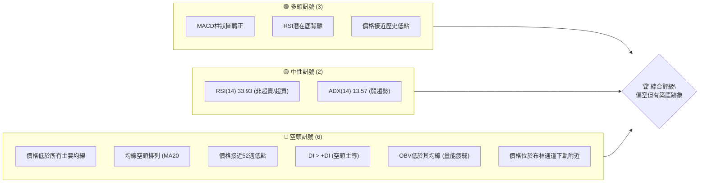

<details>
<summary>📊 靜態圖表 (點擊展開)</summary>

</details>

<html>
<head><meta charset="utf-8" /></head>
<body>
    <div>                        <script>window.PlotlyConfig = {MathJaxConfig: 'local'};</script>
        <script charset="utf-8" src="https://cdn.plot.ly/plotly-3.5.0.min.js" integrity="sha256-fHbNLP+GlIXN+efbQec78UkemUz3NJp7UmfGxC1tNxs=" crossorigin="anonymous"></script>                <div id="candlestick-chart" class="plotly-graph-div" style="height:500px; width:100%;"></div>            <script>                window.PLOTLYENV=window.PLOTLYENV || {};                                if (document.getElementById("candlestick-chart")) {                    Plotly.newPlot(                        "candlestick-chart",                        [{"close":{"dtype":"f8","bdata":"AAAAQOF6FEAAAADAHoUUQAAAAMAehRRAAAAAYGZmFEAAAABAMzMUQAAAAGC4HhRAAAAAgD0KFEAAAADAHoUUQAAAAIA9ChRAAAAAAAAAFEAAAADAzMwTQAAAAKBH4RNAAAAAgML1E0AAAADgUbgTQAAAAIAUrhNAAAAAQDMzFEAAAAAA16MUQAAAAGCPwhRAAAAAwPUoFUAAAABAMzMVQAAAAGC4HhZAAAAAAAAAGEAAAAAgXI8YQAAAACCuRxlAAAAAYGZmGEAAAABgZmYZQAAAACBcjxlAAAAAwMzMGUAAAAAgrkcZQAAAAKBH4RhAAAAAAAAAGUAAAADgo3AYQAAAAOCjcBhAAAAA4HoUGEAAAACgmZkXQAAAAEAzMxhAAAAAANejGEAAAAAgXI8ZQAAAAOB6FBlAAAAA4KNwGUAAAACAFK4YQAAAAOCjcBdAAAAA4FG4F0AAAAAA16MXQAAAAIAUrhdAAAAAQArXFkAAAAAgXI8WQAAAAIAUrhZAAAAAYGZmFkAAAABA4XoWQAAAAKBH4RZAAAAAYGZmF0AAAABA4XoYQAAAAGCPwhdAAAAAQDMzGEAAAAAghesXQAAAAIA9ChhAAAAAIK5HGEAAAAAA1yMXQAAAACBcjxZAAAAAwB6FFkAAAACgcD0WQAAAAKCZmRdAAAAAwB6FF0AAAADA9SgXQAAAAMD1KBZAAAAAANejFUAAAACA61EVQAAAACCuRxVAAAAAoHA9FUAAAAAghesTQAAAAKCZmRNAAAAAAAAAFUAAAACAwvUUQAAAACCuRxVAAAAAwMzMFUAAAADgehQVQAAAAIA9ChVAAAAA4HoUFUAAAABAMzMVQAAAAGCPwhRAAAAAANejFEAAAACgmZkUQAAAAOBRuBRAAAAA4FG4FEAAAACgmZkUQAAAAOB6FBRAAAAAwMzME0AAAABA4XoTQAAAAIAUrhNAAAAA4FG4E0AAAADgUbgUQAAAAIDrURRAAAAAwB6FFEAAAACgmZkUQAAAAGBmZhRAAAAAIK5HFEAAAACAwvUTQAAAAIDrURRAAAAAAClcFEAAAADgehQVQAAAAIDrURRAAAAAwB6FE0AAAABgZmYTQAAAACBcjxNAAAAAwPUoE0AAAADAHoUSQAAAACBcjxFAAAAAwB6FEUAAAACAPQoSQAAAAKCZmRFAAAAAQDMzEkAAAACA61ESQAAAAKBwPRJAAAAAYI\u002fCEkAAAABguB4SQAAAAKBH4RFAAAAAQDMzEUAAAAAA16MRQAAAAOB6FBFAAAAAYI\u002fCEEAAAACgmZkQQAAAAOB6FBFAAAAAgD0KEUAAAACgcD0RQAAAACCF6xBAAAAA4HoUEUAAAADAHoUQQAAAAOB6FBFAAAAAwMzMEUAAAACgmZkRQAAAAMAehRFAAAAA4FG4EEAAAACgmZkQQAAAAEAK1xBAAAAAoHA9EUAAAACgR+EQQAAAAOBRuBBAAAAAgOtREEAAAABgZmYQQAAAAGC4HhBAAAAAQArXD0AAAACAFK4PQAAAAIDC9Q5AAAAAYLgeD0AAAAAAAAAOQAAAAIAUrg1AAAAAAAAADkAAAADgUbgOQAAAAAAAAA5AAAAA4KNwDUAAAABA4XoMQAAAAGC4Hg1AAAAAgOtRDkAAAABACtcNQAAAAIAUrg1AAAAAIFyPDEAAAACgcD0MQAAAACCuRw1AAAAAAClcDUAAAACAwvUMQAAAAEDhegxAAAAAgOtRDEAAAACAPQoNQAAAAOCjcA1AAAAA4KNwDUAAAABACtcNQAAAACBcjw5AAAAAAClcD0AAAADgehQQQAAAAEAK1xBAAAAAQArXEEAAAACA61EQQAAAAKBwPRBAAAAAgBSuD0AAAABAMzMPQAAAAGC4Hg9AAAAAoEfhDkAAAAAgXI8OQAAAACBcjw5AAAAAAClcDUAAAACAwvUMQAAAAOCjcA1AAAAAwPUoDkAAAACA61EOQAAAAGCPwg1AAAAAQDMzDUAAAABguB4NQAAAAIA9Cg1AAAAAIFyPDEAAAABgZmYMQAAAAIDrUQxAAAAAAAAADEAAAADgehQMQAAAAEDhegxAAAAA4HoUDEAAAADgUbgMQAAAAGC4Hg1AAAAAgOtRDEAAAACA61EMQA=="},"high":{"dtype":"f8","bdata":"AAAAoJmZFEAAAABgj8IUQAAAACCF6xRAAAAAoJmZFEAAAACAPQoVQAAAAMD1KBRAAAAAIK5HFEAAAACAFK4UQAAAAEDhehRAAAAAgD0KFEAAAADgehQUQAAAAOB6FBRAAAAAgD0KFEAAAABACtcTQAAAAIDC9RNAAAAAAClcFEAAAADgUbgUQAAAAOBROBVAAAAAQDMzFUAAAAAAKVwVQAAAACCuRxZAAAAAYLgeGEAAAAAA16MYQAAAAIAUrhlAAAAAwB6FGEAAAAAAAAAaQAAAAAAAABpAAAAAgOtRGkAAAABA4XoaQAAAAOBRuBlAAAAA4HoUGUAAAACgR+EYQAAAAIAUrhhAAAAAoJmZGEAAAACgR+EYQAAAACCuRxhAAAAAoEfhGEAAAAAgrscZQAAAAGBmZhpAAAAAQInBGUAAAACgmZkZQAAAACBcjxhAAAAAIK5HGEAAAADgehQYQAAAACBcjxhAAAAAgML1F0AAAABAM7MWQAAAAIBqPBdAAAAA4FG4FkAAAABA4XoWQAAAAIA9ChdAAAAAwPWoF0AAAADAHoUYQAAAAIDC9RhAAAAAAClcGEAAAACA61EYQAAAAIDrURhAAAAAgMJ1GEAAAAAgrkcXQAAAAOCjcBdAAAAAQApXF0AAAADA9SgXQAAAAAAAABhAAAAA4KPwGEAAAADgehQYQAAAAKBH4RZAAAAAYLgeFkAAAADgehQWQAAAAIDCdRVAAAAAwB6FFUAAAAAA16MVQAAAAKBwPRRAAAAAQOF6FUAAAAAAKVwVQAAAAOCjcBVAAAAAAAAAFkAAAABA4XoVQAAAAKBwPRVAAAAAQDMzFUAAAABgZmYVQAAAAGBmZhVAAAAAIFwPFUAAAAAAKdwUQAAAAIDC9RRAAAAAYI\u002fCFEAAAADgehQVQAAAAADXoxRAAAAAQDMzFEAAAACgR+ETQAAAAKBH4RNAAAAAYLgeFEAAAABguB4VQAAAAIDC9RRAAAAAoJmZFEAAAAAA16MUQAAAACCF6xRAAAAAIFyPFEAAAAAAKVwUQAAAAMAehRRAAAAAwMzMFEAAAADgo3AVQAAAAIDrURVAAAAAQDMzFEAAAACgR+ETQAAAAKBH4RNAAAAAoJmZE0AAAACAPQoTQAAAAMAehRJAAAAAYGZmEkAAAADgUTgSQAAAAEAzMxJAAAAAYGZmEkAAAAAgXI8SQAAAAIAUrhJAAAAAgBQuE0AAAADgUbgSQAAAAOBROBJAAAAAoEfhEUAAAADgUbgRQAAAAGCPwhFAAAAAQOF6EUAAAAAA16MQQAAAAMDMTBFAAAAAAClcEUAAAABguJ4RQAAAACBcjxFAAAAAgML1EUAAAADgUTgRQAAAAEAzMxFAAAAAgD0KEkAAAABACtcRQAAAAMAeBRJAAAAAgD2KEUAAAACgmZkQQAAAAMAehRFAAAAAIK5HEUAAAABguB4RQAAAAKBH4RBAAAAAgD2KEEAAAADgepQQQAAAAMAehRBAAAAAwPUoEEAAAACAFK4PQAAAAAAAABBAAAAAwB6FD0AAAADAzMwOQAAAAEDheg5AAAAAANejDkAAAACAwvUOQAAAAEAzMw9AAAAAQArXDUAAAADgo3ANQAAAAIAUrg1AAAAAANejDkAAAACgmZkPQAAAAOBRuA5AAAAAwB6FDUAAAACAwvUMQAAAAOCjcA1AAAAAgOtRDkAAAABgj8INQAAAAAAAAA5AAAAAYI\u002fCDEAAAADgo3APQAAAAEAK1w1AAAAAwMzMDUAAAACgcD0OQAAAAOB6FA9AAAAA4FG4D0AAAAAAKVwQQAAAAGC4HhFAAAAAAAAAEUAAAACAwvUQQAAAAOCjcBBAAAAAQDMzEEAAAADA9SgQQAAAACCF6w9AAAAAAAAAD0AAAAAghesOQAAAAOBRuA5AAAAAoEfhDUAAAABAMzMNQAAAAOCjcA5AAAAAoJmZD0AAAABAMzMPQAAAAKBwPQ5AAAAA4HoUDkAAAADgo3ANQAAAAOCjcA1AAAAAgML1DEAAAAAgXI8MQAAAAMDMzAxAAAAAIFyPDEAAAACA6SYMQAAAAADXowxAAAAAgML1DEAAAACA61ENQAAAAAApXA1AAAAAgML1DEAAAAAgXI8MQA=="},"hovertemplate":"\u003cb\u003e%{x|%Y-%m-%d}\u003c\u002fb\u003e\u003cbr\u003e\u958b: $%{open:.2f}\u003cbr\u003e\u9ad8: $%{high:.2f}\u003cbr\u003e\u4f4e: $%{low:.2f}\u003cbr\u003e\u6536: $%{close:.2f}\u003cextra\u003e\u003c\u002fextra\u003e","low":{"dtype":"f8","bdata":"AAAAoEfhE0AAAABAMzMUQAAAAOCjcBRAAAAAgOtRFEAAAABAMzMUQAAAAKCZmRNAAAAAAAAAFEAAAACAwvUTQAAAAIDC9RNAAAAA4FG4E0AAAABgj8ITQAAAAKCZmRNAAAAAANejE0AAAAAAKVwTQAAAACBcjxNAAAAAwB6FE0AAAACgcD0UQAAAAADXoxRAAAAAAClcFEAAAACAwvUUQAAAAKBH4RRAAAAAgD0KFkAAAADgo3AWQAAAAADXoxdAAAAAwPWoF0AAAACgcD0YQAAAACCuRxlAAAAAoEfhGEAAAACAPQoZQAAAAADXoxhAAAAAgML1F0AAAADA9SgYQAAAAOBRuBdAAAAAgML1F0AAAACA61EXQAAAAKCZmRdAAAAAoHA9GEAAAAAgXI8YQAAAAIDC9RhAAAAAIIXrGEAAAAAgrkcYQAAAAAApXBdAAAAAIFyPF0AAAADAzMwWQAAAAKCZmRdAAAAAIFyPFkAAAADA9SgWQAAAAKCZmRZAAAAAwPUoFkAAAACAFK4VQAAAAIDrURZAAAAA4HoUF0AAAAAA16MXQAAAAKCZmRdAAAAAYGZmF0AAAACAFK4XQAAAAMDMzBdAAAAAoJmZF0AAAADgo3AVQAAAAEDhehZAAAAAgBQuFkAAAADAzMwVQAAAACCF6xZAAAAAQDMzF0AAAABguB4XQAAAACCF6xVAAAAA4KNwFUAAAADgehQVQAAAAKBH4RRAAAAAAAAAFUAAAABACtcTQAAAACCuRxNAAAAAIIVrFEAAAABgj8IUQAAAAEAK1xRAAAAA4KNwFUAAAAAAAAAVQAAAAKBH4RRAAAAAoJmZFEAAAAAgrscUQAAAAOBRuBRAAAAA4KNwFEAAAACA61EUQAAAAEAzMxRAAAAAoEdhFEAAAADgo3AUQAAAAIDC9RNAAAAAgBSuE0AAAABgZmYTQAAAACBcjxNAAAAAANejE0AAAACAPQoUQAAAACCuRxRAAAAAYLgeFEAAAADAzEwUQAAAAKBHYRRAAAAAAAAAFEAAAAAghesTQAAAAIA9ChRAAAAAgOtRFEAAAABgj8IUQAAAAGCPQhRAAAAA4KNwE0AAAACA61ETQAAAAAApXBNAAAAAAAAAE0AAAACA61ESQAAAAIDrURFAAAAA4KNwEUAAAABgZmYRQAAAACBcjxFAAAAA4FG4EUAAAADgehQSQAAAAMD1KBJAAAAAAClcEkAAAACAPQoSQAAAAMAehRFAAAAAwPUoEUAAAAAAAAARQAAAAOBRuBBAAAAAoJmZEEAAAACgcD0QQAAAAIDCdRBAAAAAQArXEEAAAAAghesQQAAAAGCPwhBAAAAAwMzMEEAAAAAAAAAQQAAAAGBmZhBAAAAA4HoUEUAAAABgj0IRQAAAAIDrURFAAAAAwB6FEEAAAABAMzMQQAAAAOCnxhBAAAAAIFyPEEAAAADgUbgQQAAAAKBwPRBAAAAAAClcD0AAAACAPQoQQAAAAAAAABBAAAAAYI\u002fCD0AAAADAHoUOQAAAAMDMzA5AAAAAQOF6DkAAAABgj8INQAAAAKCZmQ1AAAAAYI\u002fCDUAAAADA9SgOQAAAAEAK1w1AAAAAIK5HDUAAAABgZmYMQAAAAOBRuAxAAAAAgML1DEAAAACgmZkNQAAAAIDrUQ1AAAAAoHA9DEAAAADgehQMQAAAAGBmZgxAAAAAYLgeDUAAAAAA16MMQAAAAEDhegxAAAAAQArXC0AAAADAzMwMQAAAAIDC9QxAAAAAQDMzDUAAAAAA16MMQAAAAGBkOw5AAAAAgBSuDkAAAABACtcPQAAAAOCjcBBAAAAA4KNwEEAAAABAMzMQQAAAAMD1KBBAAAAAQDMzD0AAAACAPQoPQAAAAKBH4Q5AAAAAgOtRDkAAAADgehQOQAAAACCF6w1AAAAAwPUoDEAAAACA61EMQAAAAOBRuAxAAAAAIIXrDUAAAADgehQOQAAAACCuRw1AAAAAgML1DEAAAACgR+EMQAAAAEDhegxAAAAAYGZmDEAAAACAFK4LQAAAAEAK1wtAAAAAIIXrC0AAAABguB4LQAAAAKCZmQtAAAAAIIXrC0AAAADgehQMQAAAAOCjcAxAAAAAQArXC0AAAABACtcLQA=="},"name":"\u50f9\u683c","open":{"dtype":"f8","bdata":"AAAAoJkZFEAAAADAHoUUQAAAAAAAgBRAAAAAwB6FFEAAAABA4XoUQAAAAMD1KBRAAAAAYLgeFEAAAADAIDAUQAAAAGBmZhRAAAAAAAAAFEAAAACAwvUTQAAAAEAK1xNAAAAAwMzME0AAAADA9agTQAAAAOBRuBNAAAAAIFyPE0AAAAAAKVwUQAAAAIAUrhRAAAAAANejFEAAAABAMzMVQAAAAMD1KBVAAAAAQDMzFkAAAACgmZkXQAAAAEDhehhAAAAAwB6FGEAAAACAPYoYQAAAACBcjxlAAAAAQOH6GEAAAAAghesZQAAAAEAzMxlAAAAAwB6FGEAAAABACtcYQAAAAIDCdRhAAAAAoHA9GEAAAADA9SgYQAAAAIDC9RdAAAAAQOF6GEAAAACgmRkZQAAAAEAzMxpAAAAAgOtRGUAAAACAPYoZQAAAAEDhehhAAAAAgML1F0AAAADA9SgXQAAAAKBwPRhAAAAAwMzMF0AAAABA4XoWQAAAAMD1KBdAAAAA4FG4FkAAAABA4XoWQAAAAIAUrhZAAAAAoEdhF0AAAAAAAAAYQAAAACCF6xhAAAAAYI\u002fCF0AAAAAAAAAYQAAAAKBH4RdAAAAAgD0KGEAAAABgj0IWQAAAAGCPQhdAAAAAwMzMFkAAAADAzMwWQAAAAKCZGRdAAAAAIFwPGEAAAABgZmYXQAAAAEAK1xZAAAAAwB6FFUAAAACAPYoVQAAAAOBROBVAAAAAQDMzFUAAAAAA16MVQAAAAIA9ChRAAAAAgBSuFEAAAADgehQVQAAAAMD1KBVAAAAAANejFUAAAAAghWsVQAAAAMAeBRVAAAAAgML1FEAAAABACtcUQAAAAMD1KBVAAAAAYI\u002fCFEAAAAAghWsUQAAAAGBmZhRAAAAA4HqUFEAAAABgj8IUQAAAAKCZmRRAAAAAQOH6E0AAAACgR+ETQAAAAKCZmRNAAAAAoEfhE0AAAADgehQUQAAAAIAUrhRAAAAAgOtRFEAAAAAgXI8UQAAAAEDhehRAAAAAgMJ1FEAAAAAgrkcUQAAAAIAULhRAAAAAwB6FFEAAAABgj8IUQAAAAGC4HhVAAAAAQDMzFEAAAABgj8ITQAAAAGBmZhNAAAAAoJmZE0AAAAAghesSQAAAAOCjcBJAAAAAgOtREkAAAACAPYoRQAAAAEAzMxJAAAAAwMzMEUAAAADgehQSQAAAAKBwPRJAAAAAAClcEkAAAACAFK4SQAAAAMD1KBJAAAAAgBSuEUAAAABguB4RQAAAAMD1qBFAAAAAgOtREUAAAADAHoUQQAAAAKBH4RBAAAAAYLgeEUAAAADA9SgRQAAAAOCjcBFAAAAAwMzMEEAAAACAwvUQQAAAAGCPwhBAAAAAoHA9EUAAAADgepQRQAAAAOCjcBFAAAAAwMxMEUAAAADgo3AQQAAAAAAAABFAAAAA4FG4EEAAAADAzMwQQAAAAADXoxBAAAAAYLgeEEAAAADgo3AQQAAAAAApXBBAAAAAIFwPEEAAAAAgrkcPQAAAAIAUrg9AAAAAwMzMDkAAAAAA16MOQAAAAGC4Hg5AAAAAIIXrDUAAAACgcD0OQAAAAKCZmQ5AAAAAYI\u002fCDUAAAABAMzMNQAAAAMDMzAxAAAAAQDMzDUAAAAAA16MOQAAAAGBmZg1AAAAA4KNwDUAAAADgUbgMQAAAAMDMzAxAAAAAAAAADkAAAACAwvUMQAAAAKBH4QxAAAAAwB6FDEAAAABACtcOQAAAAIA9Cg1AAAAAoJmZDUAAAABAMzMNQAAAAKBwPQ5AAAAAwMzMDkAAAAAAAAAQQAAAAEDhehBAAAAAYLieEEAAAACgR+EQQAAAAAApXBBAAAAAQDMzEEAAAADgehQQQAAAAEAzMw9AAAAAwMzMDkAAAACgR+EOQAAAACBcjw5AAAAA4FG4DUAAAADgehQNQAAAAAApXA5AAAAAwMzMDkAAAAAgXI8OQAAAAMD1KA5AAAAAgBSuDUAAAAAAKVwNQAAAAAApXA1AAAAAgML1DEAAAACA61EMQAAAAGC4HgxAAAAAgOtRDEAAAADgehQMQAAAAAAAAAxAAAAAQOF6DEAAAAAgrkcMQAAAAEDhegxAAAAAgML1DEAAAACgcD0MQA=="},"x":["2025-08-13T00:00:00-04:00","2025-08-14T00:00:00-04:00","2025-08-15T00:00:00-04:00","2025-08-18T00:00:00-04:00","2025-08-19T00:00:00-04:00","2025-08-20T00:00:00-04:00","2025-08-21T00:00:00-04:00","2025-08-22T00:00:00-04:00","2025-08-25T00:00:00-04:00","2025-08-26T00:00:00-04:00","2025-08-27T00:00:00-04:00","2025-08-28T00:00:00-04:00","2025-08-29T00:00:00-04:00","2025-09-02T00:00:00-04:00","2025-09-03T00:00:00-04:00","2025-09-04T00:00:00-04:00","2025-09-05T00:00:00-04:00","2025-09-08T00:00:00-04:00","2025-09-09T00:00:00-04:00","2025-09-10T00:00:00-04:00","2025-09-11T00:00:00-04:00","2025-09-12T00:00:00-04:00","2025-09-15T00:00:00-04:00","2025-09-16T00:00:00-04:00","2025-09-17T00:00:00-04:00","2025-09-18T00:00:00-04:00","2025-09-19T00:00:00-04:00","2025-09-22T00:00:00-04:00","2025-09-23T00:00:00-04:00","2025-09-24T00:00:00-04:00","2025-09-25T00:00:00-04:00","2025-09-26T00:00:00-04:00","2025-09-29T00:00:00-04:00","2025-09-30T00:00:00-04:00","2025-10-01T00:00:00-04:00","2025-10-02T00:00:00-04:00","2025-10-03T00:00:00-04:00","2025-10-06T00:00:00-04:00","2025-10-07T00:00:00-04:00","2025-10-08T00:00:00-04:00","2025-10-09T00:00:00-04:00","2025-10-10T00:00:00-04:00","2025-10-13T00:00:00-04:00","2025-10-14T00:00:00-04:00","2025-10-15T00:00:00-04:00","2025-10-16T00:00:00-04:00","2025-10-17T00:00:00-04:00","2025-10-20T00:00:00-04:00","2025-10-21T00:00:00-04:00","2025-10-22T00:00:00-04:00","2025-10-23T00:00:00-04:00","2025-10-24T00:00:00-04:00","2025-10-27T00:00:00-04:00","2025-10-28T00:00:00-04:00","2025-10-29T00:00:00-04:00","2025-10-30T00:00:00-04:00","2025-10-31T00:00:00-04:00","2025-11-03T00:00:00-05:00","2025-11-04T00:00:00-05:00","2025-11-05T00:00:00-05:00","2025-11-06T00:00:00-05:00","2025-11-07T00:00:00-05:00","2025-11-10T00:00:00-05:00","2025-11-11T00:00:00-05:00","2025-11-12T00:00:00-05:00","2025-11-13T00:00:00-05:00","2025-11-14T00:00:00-05:00","2025-11-17T00:00:00-05:00","2025-11-18T00:00:00-05:00","2025-11-19T00:00:00-05:00","2025-11-20T00:00:00-05:00","2025-11-21T00:00:00-05:00","2025-11-24T00:00:00-05:00","2025-11-25T00:00:00-05:00","2025-11-26T00:00:00-05:00","2025-11-28T00:00:00-05:00","2025-12-01T00:00:00-05:00","2025-12-02T00:00:00-05:00","2025-12-03T00:00:00-05:00","2025-12-04T00:00:00-05:00","2025-12-05T00:00:00-05:00","2025-12-08T00:00:00-05:00","2025-12-09T00:00:00-05:00","2025-12-10T00:00:00-05:00","2025-12-11T00:00:00-05:00","2025-12-12T00:00:00-05:00","2025-12-15T00:00:00-05:00","2025-12-16T00:00:00-05:00","2025-12-17T00:00:00-05:00","2025-12-18T00:00:00-05:00","2025-12-19T00:00:00-05:00","2025-12-22T00:00:00-05:00","2025-12-23T00:00:00-05:00","2025-12-24T00:00:00-05:00","2025-12-26T00:00:00-05:00","2025-12-29T00:00:00-05:00","2025-12-30T00:00:00-05:00","2025-12-31T00:00:00-05:00","2026-01-02T00:00:00-05:00","2026-01-05T00:00:00-05:00","2026-01-06T00:00:00-05:00","2026-01-07T00:00:00-05:00","2026-01-08T00:00:00-05:00","2026-01-09T00:00:00-05:00","2026-01-12T00:00:00-05:00","2026-01-13T00:00:00-05:00","2026-01-14T00:00:00-05:00","2026-01-15T00:00:00-05:00","2026-01-16T00:00:00-05:00","2026-01-20T00:00:00-05:00","2026-01-21T00:00:00-05:00","2026-01-22T00:00:00-05:00","2026-01-23T00:00:00-05:00","2026-01-26T00:00:00-05:00","2026-01-27T00:00:00-05:00","2026-01-28T00:00:00-05:00","2026-01-29T00:00:00-05:00","2026-01-30T00:00:00-05:00","2026-02-02T00:00:00-05:00","2026-02-03T00:00:00-05:00","2026-02-04T00:00:00-05:00","2026-02-05T00:00:00-05:00","2026-02-06T00:00:00-05:00","2026-02-09T00:00:00-05:00","2026-02-10T00:00:00-05:00","2026-02-11T00:00:00-05:00","2026-02-12T00:00:00-05:00","2026-02-13T00:00:00-05:00","2026-02-17T00:00:00-05:00","2026-02-18T00:00:00-05:00","2026-02-19T00:00:00-05:00","2026-02-20T00:00:00-05:00","2026-02-23T00:00:00-05:00","2026-02-24T00:00:00-05:00","2026-02-25T00:00:00-05:00","2026-02-26T00:00:00-05:00","2026-02-27T00:00:00-05:00","2026-03-02T00:00:00-05:00","2026-03-03T00:00:00-05:00","2026-03-04T00:00:00-05:00","2026-03-05T00:00:00-05:00","2026-03-06T00:00:00-05:00","2026-03-09T00:00:00-04:00","2026-03-10T00:00:00-04:00","2026-03-11T00:00:00-04:00","2026-03-12T00:00:00-04:00","2026-03-13T00:00:00-04:00","2026-03-16T00:00:00-04:00","2026-03-17T00:00:00-04:00","2026-03-18T00:00:00-04:00","2026-03-19T00:00:00-04:00","2026-03-20T00:00:00-04:00","2026-03-23T00:00:00-04:00","2026-03-24T00:00:00-04:00","2026-03-25T00:00:00-04:00","2026-03-26T00:00:00-04:00","2026-03-27T00:00:00-04:00","2026-03-30T00:00:00-04:00","2026-03-31T00:00:00-04:00","2026-04-01T00:00:00-04:00","2026-04-02T00:00:00-04:00","2026-04-06T00:00:00-04:00","2026-04-07T00:00:00-04:00","2026-04-08T00:00:00-04:00","2026-04-09T00:00:00-04:00","2026-04-10T00:00:00-04:00","2026-04-13T00:00:00-04:00","2026-04-14T00:00:00-04:00","2026-04-15T00:00:00-04:00","2026-04-16T00:00:00-04:00","2026-04-17T00:00:00-04:00","2026-04-20T00:00:00-04:00","2026-04-21T00:00:00-04:00","2026-04-22T00:00:00-04:00","2026-04-23T00:00:00-04:00","2026-04-24T00:00:00-04:00","2026-04-27T00:00:00-04:00","2026-04-28T00:00:00-04:00","2026-04-29T00:00:00-04:00","2026-04-30T00:00:00-04:00","2026-05-01T00:00:00-04:00","2026-05-04T00:00:00-04:00","2026-05-05T00:00:00-04:00","2026-05-06T00:00:00-04:00","2026-05-07T00:00:00-04:00","2026-05-08T00:00:00-04:00","2026-05-11T00:00:00-04:00","2026-05-12T00:00:00-04:00","2026-05-13T00:00:00-04:00","2026-05-14T00:00:00-04:00","2026-05-15T00:00:00-04:00","2026-05-18T00:00:00-04:00","2026-05-19T00:00:00-04:00","2026-05-20T00:00:00-04:00","2026-05-21T00:00:00-04:00","2026-05-22T00:00:00-04:00","2026-05-26T00:00:00-04:00","2026-05-27T00:00:00-04:00","2026-05-28T00:00:00-04:00","2026-05-29T00:00:00-04:00"],"type":"candlestick"},{"hovertemplate":"MA30: $%{y:.2f}\u003cextra\u003e\u003c\u002fextra\u003e","line":{"color":"#2196F3","dash":"dash","width":2},"mode":"lines","name":"MA30","x":["2025-08-13T00:00:00-04:00","2025-08-14T00:00:00-04:00","2025-08-15T00:00:00-04:00","2025-08-18T00:00:00-04:00","2025-08-19T00:00:00-04:00","2025-08-20T00:00:00-04:00","2025-08-21T00:00:00-04:00","2025-08-22T00:00:00-04:00","2025-08-25T00:00:00-04:00","2025-08-26T00:00:00-04:00","2025-08-27T00:00:00-04:00","2025-08-28T00:00:00-04:00","2025-08-29T00:00:00-04:00","2025-09-02T00:00:00-04:00","2025-09-03T00:00:00-04:00","2025-09-04T00:00:00-04:00","2025-09-05T00:00:00-04:00","2025-09-08T00:00:00-04:00","2025-09-09T00:00:00-04:00","2025-09-10T00:00:00-04:00","2025-09-11T00:00:00-04:00","2025-09-12T00:00:00-04:00","2025-09-15T00:00:00-04:00","2025-09-16T00:00:00-04:00","2025-09-17T00:00:00-04:00","2025-09-18T00:00:00-04:00","2025-09-19T00:00:00-04:00","2025-09-22T00:00:00-04:00","2025-09-23T00:00:00-04:00","2025-09-24T00:00:00-04:00","2025-09-25T00:00:00-04:00","2025-09-26T00:00:00-04:00","2025-09-29T00:00:00-04:00","2025-09-30T00:00:00-04:00","2025-10-01T00:00:00-04:00","2025-10-02T00:00:00-04:00","2025-10-03T00:00:00-04:00","2025-10-06T00:00:00-04:00","2025-10-07T00:00:00-04:00","2025-10-08T00:00:00-04:00","2025-10-09T00:00:00-04:00","2025-10-10T00:00:00-04:00","2025-10-13T00:00:00-04:00","2025-10-14T00:00:00-04:00","2025-10-15T00:00:00-04:00","2025-10-16T00:00:00-04:00","2025-10-17T00:00:00-04:00","2025-10-20T00:00:00-04:00","2025-10-21T00:00:00-04:00","2025-10-22T00:00:00-04:00","2025-10-23T00:00:00-04:00","2025-10-24T00:00:00-04:00","2025-10-27T00:00:00-04:00","2025-10-28T00:00:00-04:00","2025-10-29T00:00:00-04:00","2025-10-30T00:00:00-04:00","2025-10-31T00:00:00-04:00","2025-11-03T00:00:00-05:00","2025-11-04T00:00:00-05:00","2025-11-05T00:00:00-05:00","2025-11-06T00:00:00-05:00","2025-11-07T00:00:00-05:00","2025-11-10T00:00:00-05:00","2025-11-11T00:00:00-05:00","2025-11-12T00:00:00-05:00","2025-11-13T00:00:00-05:00","2025-11-14T00:00:00-05:00","2025-11-17T00:00:00-05:00","2025-11-18T00:00:00-05:00","2025-11-19T00:00:00-05:00","2025-11-20T00:00:00-05:00","2025-11-21T00:00:00-05:00","2025-11-24T00:00:00-05:00","2025-11-25T00:00:00-05:00","2025-11-26T00:00:00-05:00","2025-11-28T00:00:00-05:00","2025-12-01T00:00:00-05:00","2025-12-02T00:00:00-05:00","2025-12-03T00:00:00-05:00","2025-12-04T00:00:00-05:00","2025-12-05T00:00:00-05:00","2025-12-08T00:00:00-05:00","2025-12-09T00:00:00-05:00","2025-12-10T00:00:00-05:00","2025-12-11T00:00:00-05:00","2025-12-12T00:00:00-05:00","2025-12-15T00:00:00-05:00","2025-12-16T00:00:00-05:00","2025-12-17T00:00:00-05:00","2025-12-18T00:00:00-05:00","2025-12-19T00:00:00-05:00","2025-12-22T00:00:00-05:00","2025-12-23T00:00:00-05:00","2025-12-24T00:00:00-05:00","2025-12-26T00:00:00-05:00","2025-12-29T00:00:00-05:00","2025-12-30T00:00:00-05:00","2025-12-31T00:00:00-05:00","2026-01-02T00:00:00-05:00","2026-01-05T00:00:00-05:00","2026-01-06T00:00:00-05:00","2026-01-07T00:00:00-05:00","2026-01-08T00:00:00-05:00","2026-01-09T00:00:00-05:00","2026-01-12T00:00:00-05:00","2026-01-13T00:00:00-05:00","2026-01-14T00:00:00-05:00","2026-01-15T00:00:00-05:00","2026-01-16T00:00:00-05:00","2026-01-20T00:00:00-05:00","2026-01-21T00:00:00-05:00","2026-01-22T00:00:00-05:00","2026-01-23T00:00:00-05:00","2026-01-26T00:00:00-05:00","2026-01-27T00:00:00-05:00","2026-01-28T00:00:00-05:00","2026-01-29T00:00:00-05:00","2026-01-30T00:00:00-05:00","2026-02-02T00:00:00-05:00","2026-02-03T00:00:00-05:00","2026-02-04T00:00:00-05:00","2026-02-05T00:00:00-05:00","2026-02-06T00:00:00-05:00","2026-02-09T00:00:00-05:00","2026-02-10T00:00:00-05:00","2026-02-11T00:00:00-05:00","2026-02-12T00:00:00-05:00","2026-02-13T00:00:00-05:00","2026-02-17T00:00:00-05:00","2026-02-18T00:00:00-05:00","2026-02-19T00:00:00-05:00","2026-02-20T00:00:00-05:00","2026-02-23T00:00:00-05:00","2026-02-24T00:00:00-05:00","2026-02-25T00:00:00-05:00","2026-02-26T00:00:00-05:00","2026-02-27T00:00:00-05:00","2026-03-02T00:00:00-05:00","2026-03-03T00:00:00-05:00","2026-03-04T00:00:00-05:00","2026-03-05T00:00:00-05:00","2026-03-06T00:00:00-05:00","2026-03-09T00:00:00-04:00","2026-03-10T00:00:00-04:00","2026-03-11T00:00:00-04:00","2026-03-12T00:00:00-04:00","2026-03-13T00:00:00-04:00","2026-03-16T00:00:00-04:00","2026-03-17T00:00:00-04:00","2026-03-18T00:00:00-04:00","2026-03-19T00:00:00-04:00","2026-03-20T00:00:00-04:00","2026-03-23T00:00:00-04:00","2026-03-24T00:00:00-04:00","2026-03-25T00:00:00-04:00","2026-03-26T00:00:00-04:00","2026-03-27T00:00:00-04:00","2026-03-30T00:00:00-04:00","2026-03-31T00:00:00-04:00","2026-04-01T00:00:00-04:00","2026-04-02T00:00:00-04:00","2026-04-06T00:00:00-04:00","2026-04-07T00:00:00-04:00","2026-04-08T00:00:00-04:00","2026-04-09T00:00:00-04:00","2026-04-10T00:00:00-04:00","2026-04-13T00:00:00-04:00","2026-04-14T00:00:00-04:00","2026-04-15T00:00:00-04:00","2026-04-16T00:00:00-04:00","2026-04-17T00:00:00-04:00","2026-04-20T00:00:00-04:00","2026-04-21T00:00:00-04:00","2026-04-22T00:00:00-04:00","2026-04-23T00:00:00-04:00","2026-04-24T00:00:00-04:00","2026-04-27T00:00:00-04:00","2026-04-28T00:00:00-04:00","2026-04-29T00:00:00-04:00","2026-04-30T00:00:00-04:00","2026-05-01T00:00:00-04:00","2026-05-04T00:00:00-04:00","2026-05-05T00:00:00-04:00","2026-05-06T00:00:00-04:00","2026-05-07T00:00:00-04:00","2026-05-08T00:00:00-04:00","2026-05-11T00:00:00-04:00","2026-05-12T00:00:00-04:00","2026-05-13T00:00:00-04:00","2026-05-14T00:00:00-04:00","2026-05-15T00:00:00-04:00","2026-05-18T00:00:00-04:00","2026-05-19T00:00:00-04:00","2026-05-20T00:00:00-04:00","2026-05-21T00:00:00-04:00","2026-05-22T00:00:00-04:00","2026-05-26T00:00:00-04:00","2026-05-27T00:00:00-04:00","2026-05-28T00:00:00-04:00","2026-05-29T00:00:00-04:00"],"y":{"dtype":"f8","bdata":"AAAAAAAA+H8AAAAAAAD4fwAAAAAAAPh\u002fAAAAAAAA+H8AAAAAAAD4fwAAAAAAAPh\u002fAAAAAAAA+H8AAAAAAAD4fwAAAAAAAPh\u002fAAAAAAAA+H8AAAAAAAD4fwAAAAAAAPh\u002fAAAAAAAA+H8AAAAAAAD4fwAAAAAAAPh\u002fAAAAAAAA+H8AAAAAAAD4fwAAAAAAAPh\u002fAAAAAAAA+H8AAAAAAAD4fwAAAAAAAPh\u002fAAAAAAAA+H8AAAAAAAD4fwAAAAAAAPh\u002fAAAAAAAA+H8AAAAAAAD4fwAAAAAAAPh\u002fAAAAAAAA+H8AAAAAAAD4f5qZmWlKxRVAERERgdzrFUAAAADgTw0WQO\u002fu7j7DLhZAREREVCpOFkDe3d29LWsWQDMzM6P+jRZAzczMfD+1FkCJiIiIQeAWQERERJRDCxdAERERca85F0B3d3f3U2MXQImIiOi0gRdAERERwcqhF0AAAAAgPsMXQCIiIkJg5RdAzczMbOf7F0Crqqq6SQwYQImIiAisHBhAq6qq2kAnGEDe3d0NLTIYQLy7u0upOBhAMzMzk4ozGEAAAADQ2zIYQCIiIlLjJRhAq6qqai4kGEDv7u5OjRcYQCIiItKUChhAVVVVVZz9F0De3d1tWesXQAAAAFCN1xdAvLu7q2PCF0AiIiKyna8XQAAAALByqBdAmpmZWaujF0B3d3cn6p8XQERERLSBjhdAq6qqGuh0F0Dv7u6uuVAXQFVVVXVMMBdAq6qqanUMF0CamZkJ1+MWQN7d3W0SwxZAAAAAgNyrFkAzMzPz\u002fZQWQCIiIhKDgBZAd3d3J6N3FkC8u7sLAmsWQJqZmWkDXRZARERE1L9RFkARERGh00YWQLy7u2u8NBZAvLu7Gy8dFkDv7u4eE\u002fwVQDMzMyMi4hVAVVVV9W\u002fEFUDv7u5OG6gVQN7d3Y1QhhVAd3d31xVgFUAzMzNz2kAVQO\u002fu7v5GKBVAzczMTGIQFUDv7u7OaQMVQJqZmYls5xRAAAAA8NLNFECJiIiI+rcUQBEREcH1qBRAq6qqylqdFEAzMzPTv5EUQLy7u6uOiRRAiYiISAyCFEB3d3dX8osUQERERDQXkhRAiYiIGHaFFECamZk5JngUQDMzM9N4aRRAiYiIqPFSFEARERFBGT0UQDMzMxNnHxRAMzMzIwYBFEAzMzMDD+YTQDMzM+MXyxNAERERoUW2E0BERETk0KITQAAAAECnjRNAERERke18E0DNzMzsw2cTQDMzM\u002fP9VBNAq6qqKs4+E0AAAACgGi8TQGZmZtbqGBNA7+7unqj\u002fEkCJiIhYgNwSQFVVVXXawBJAiYiISCijEkAAAABAfIYSQDMzMxPKaBJAERERkXtNEkBmZmbGIDASQDMzM+N6FBJAq6qqeqL+EUDe3d1N8OARQM3MzJwLyRFAq6qq6iaxEUCamZk5QpkRQLy7u0sMghFA3t3d\u002falxEUCrqqpaq2MRQImIiFiAXBFAd3d350JSEUBEREREREQRQImIiCijNxFAvLu7ay4kEUB3d3fHBA8RQHd3d3d39xBA3t3d9SjcEEDv7u42icEQQERERDyYpxBAq6qqQtKUEEBmZmaGXYEQQCIiIrKdbxBAd3d3PzVeEEB3d3e\u002fEUoQQJqZmbmQNBBAzczMzIUkEEDv7u6uuRAQQFVVVbXz\u002fQ9AIiIiUirOD0Dv7u6ONKUPQJqZmQmQew9A3t3djVBGD0AAAAAQEREPQFVVVYUW2Q5AZmZmtmWtDkDe3d0N5okOQCIiIqK3ZQ5AZmZmlrU6DkCJiIg4QhkOQERERMSuAA5AERERkcL1DUB3d3d3TPANQBERETGW\u002fA1AvLu7u0kMDkAiIiLiehQOQAAAAGBzIQ5AZmZmtjomDkB3d3cneDAOQCIiIuLBPA5AVVVVRUREDkDv7u6+5kIOQFVVVRWuRw5AIiIiUv9GDkBVVVXlF0sOQCIiIvLSTQ5AvLu7a3VMDkDv7u7+jVAOQCIiIsI8UQ5AzczM3LJWDkARERFBNV4OQHd3d\u002fcoXA5AZmZmVlVVDkAAAAAAjlAOQJqZmXkwTw5AzczMbHVMDkBVVVVFREQOQN7d3R0TPA5AZmZmJngwDkCJiIh46SYOQO\u002fu7r6fGg5AMzMzw64ADkB3d3cn6t8NQA=="},"type":"scatter"},{"hovertemplate":"MA60: $%{y:.2f}\u003cextra\u003e\u003c\u002fextra\u003e","line":{"color":"#9C27B0","dash":"dash","width":2},"mode":"lines","name":"MA60","x":["2025-08-13T00:00:00-04:00","2025-08-14T00:00:00-04:00","2025-08-15T00:00:00-04:00","2025-08-18T00:00:00-04:00","2025-08-19T00:00:00-04:00","2025-08-20T00:00:00-04:00","2025-08-21T00:00:00-04:00","2025-08-22T00:00:00-04:00","2025-08-25T00:00:00-04:00","2025-08-26T00:00:00-04:00","2025-08-27T00:00:00-04:00","2025-08-28T00:00:00-04:00","2025-08-29T00:00:00-04:00","2025-09-02T00:00:00-04:00","2025-09-03T00:00:00-04:00","2025-09-04T00:00:00-04:00","2025-09-05T00:00:00-04:00","2025-09-08T00:00:00-04:00","2025-09-09T00:00:00-04:00","2025-09-10T00:00:00-04:00","2025-09-11T00:00:00-04:00","2025-09-12T00:00:00-04:00","2025-09-15T00:00:00-04:00","2025-09-16T00:00:00-04:00","2025-09-17T00:00:00-04:00","2025-09-18T00:00:00-04:00","2025-09-19T00:00:00-04:00","2025-09-22T00:00:00-04:00","2025-09-23T00:00:00-04:00","2025-09-24T00:00:00-04:00","2025-09-25T00:00:00-04:00","2025-09-26T00:00:00-04:00","2025-09-29T00:00:00-04:00","2025-09-30T00:00:00-04:00","2025-10-01T00:00:00-04:00","2025-10-02T00:00:00-04:00","2025-10-03T00:00:00-04:00","2025-10-06T00:00:00-04:00","2025-10-07T00:00:00-04:00","2025-10-08T00:00:00-04:00","2025-10-09T00:00:00-04:00","2025-10-10T00:00:00-04:00","2025-10-13T00:00:00-04:00","2025-10-14T00:00:00-04:00","2025-10-15T00:00:00-04:00","2025-10-16T00:00:00-04:00","2025-10-17T00:00:00-04:00","2025-10-20T00:00:00-04:00","2025-10-21T00:00:00-04:00","2025-10-22T00:00:00-04:00","2025-10-23T00:00:00-04:00","2025-10-24T00:00:00-04:00","2025-10-27T00:00:00-04:00","2025-10-28T00:00:00-04:00","2025-10-29T00:00:00-04:00","2025-10-30T00:00:00-04:00","2025-10-31T00:00:00-04:00","2025-11-03T00:00:00-05:00","2025-11-04T00:00:00-05:00","2025-11-05T00:00:00-05:00","2025-11-06T00:00:00-05:00","2025-11-07T00:00:00-05:00","2025-11-10T00:00:00-05:00","2025-11-11T00:00:00-05:00","2025-11-12T00:00:00-05:00","2025-11-13T00:00:00-05:00","2025-11-14T00:00:00-05:00","2025-11-17T00:00:00-05:00","2025-11-18T00:00:00-05:00","2025-11-19T00:00:00-05:00","2025-11-20T00:00:00-05:00","2025-11-21T00:00:00-05:00","2025-11-24T00:00:00-05:00","2025-11-25T00:00:00-05:00","2025-11-26T00:00:00-05:00","2025-11-28T00:00:00-05:00","2025-12-01T00:00:00-05:00","2025-12-02T00:00:00-05:00","2025-12-03T00:00:00-05:00","2025-12-04T00:00:00-05:00","2025-12-05T00:00:00-05:00","2025-12-08T00:00:00-05:00","2025-12-09T00:00:00-05:00","2025-12-10T00:00:00-05:00","2025-12-11T00:00:00-05:00","2025-12-12T00:00:00-05:00","2025-12-15T00:00:00-05:00","2025-12-16T00:00:00-05:00","2025-12-17T00:00:00-05:00","2025-12-18T00:00:00-05:00","2025-12-19T00:00:00-05:00","2025-12-22T00:00:00-05:00","2025-12-23T00:00:00-05:00","2025-12-24T00:00:00-05:00","2025-12-26T00:00:00-05:00","2025-12-29T00:00:00-05:00","2025-12-30T00:00:00-05:00","2025-12-31T00:00:00-05:00","2026-01-02T00:00:00-05:00","2026-01-05T00:00:00-05:00","2026-01-06T00:00:00-05:00","2026-01-07T00:00:00-05:00","2026-01-08T00:00:00-05:00","2026-01-09T00:00:00-05:00","2026-01-12T00:00:00-05:00","2026-01-13T00:00:00-05:00","2026-01-14T00:00:00-05:00","2026-01-15T00:00:00-05:00","2026-01-16T00:00:00-05:00","2026-01-20T00:00:00-05:00","2026-01-21T00:00:00-05:00","2026-01-22T00:00:00-05:00","2026-01-23T00:00:00-05:00","2026-01-26T00:00:00-05:00","2026-01-27T00:00:00-05:00","2026-01-28T00:00:00-05:00","2026-01-29T00:00:00-05:00","2026-01-30T00:00:00-05:00","2026-02-02T00:00:00-05:00","2026-02-03T00:00:00-05:00","2026-02-04T00:00:00-05:00","2026-02-05T00:00:00-05:00","2026-02-06T00:00:00-05:00","2026-02-09T00:00:00-05:00","2026-02-10T00:00:00-05:00","2026-02-11T00:00:00-05:00","2026-02-12T00:00:00-05:00","2026-02-13T00:00:00-05:00","2026-02-17T00:00:00-05:00","2026-02-18T00:00:00-05:00","2026-02-19T00:00:00-05:00","2026-02-20T00:00:00-05:00","2026-02-23T00:00:00-05:00","2026-02-24T00:00:00-05:00","2026-02-25T00:00:00-05:00","2026-02-26T00:00:00-05:00","2026-02-27T00:00:00-05:00","2026-03-02T00:00:00-05:00","2026-03-03T00:00:00-05:00","2026-03-04T00:00:00-05:00","2026-03-05T00:00:00-05:00","2026-03-06T00:00:00-05:00","2026-03-09T00:00:00-04:00","2026-03-10T00:00:00-04:00","2026-03-11T00:00:00-04:00","2026-03-12T00:00:00-04:00","2026-03-13T00:00:00-04:00","2026-03-16T00:00:00-04:00","2026-03-17T00:00:00-04:00","2026-03-18T00:00:00-04:00","2026-03-19T00:00:00-04:00","2026-03-20T00:00:00-04:00","2026-03-23T00:00:00-04:00","2026-03-24T00:00:00-04:00","2026-03-25T00:00:00-04:00","2026-03-26T00:00:00-04:00","2026-03-27T00:00:00-04:00","2026-03-30T00:00:00-04:00","2026-03-31T00:00:00-04:00","2026-04-01T00:00:00-04:00","2026-04-02T00:00:00-04:00","2026-04-06T00:00:00-04:00","2026-04-07T00:00:00-04:00","2026-04-08T00:00:00-04:00","2026-04-09T00:00:00-04:00","2026-04-10T00:00:00-04:00","2026-04-13T00:00:00-04:00","2026-04-14T00:00:00-04:00","2026-04-15T00:00:00-04:00","2026-04-16T00:00:00-04:00","2026-04-17T00:00:00-04:00","2026-04-20T00:00:00-04:00","2026-04-21T00:00:00-04:00","2026-04-22T00:00:00-04:00","2026-04-23T00:00:00-04:00","2026-04-24T00:00:00-04:00","2026-04-27T00:00:00-04:00","2026-04-28T00:00:00-04:00","2026-04-29T00:00:00-04:00","2026-04-30T00:00:00-04:00","2026-05-01T00:00:00-04:00","2026-05-04T00:00:00-04:00","2026-05-05T00:00:00-04:00","2026-05-06T00:00:00-04:00","2026-05-07T00:00:00-04:00","2026-05-08T00:00:00-04:00","2026-05-11T00:00:00-04:00","2026-05-12T00:00:00-04:00","2026-05-13T00:00:00-04:00","2026-05-14T00:00:00-04:00","2026-05-15T00:00:00-04:00","2026-05-18T00:00:00-04:00","2026-05-19T00:00:00-04:00","2026-05-20T00:00:00-04:00","2026-05-21T00:00:00-04:00","2026-05-22T00:00:00-04:00","2026-05-26T00:00:00-04:00","2026-05-27T00:00:00-04:00","2026-05-28T00:00:00-04:00","2026-05-29T00:00:00-04:00"],"y":{"dtype":"f8","bdata":"AAAAAAAA+H8AAAAAAAD4fwAAAAAAAPh\u002fAAAAAAAA+H8AAAAAAAD4fwAAAAAAAPh\u002fAAAAAAAA+H8AAAAAAAD4fwAAAAAAAPh\u002fAAAAAAAA+H8AAAAAAAD4fwAAAAAAAPh\u002fAAAAAAAA+H8AAAAAAAD4fwAAAAAAAPh\u002fAAAAAAAA+H8AAAAAAAD4fwAAAAAAAPh\u002fAAAAAAAA+H8AAAAAAAD4fwAAAAAAAPh\u002fAAAAAAAA+H8AAAAAAAD4fwAAAAAAAPh\u002fAAAAAAAA+H8AAAAAAAD4fwAAAAAAAPh\u002fAAAAAAAA+H8AAAAAAAD4fwAAAAAAAPh\u002fAAAAAAAA+H8AAAAAAAD4fwAAAAAAAPh\u002fAAAAAAAA+H8AAAAAAAD4fwAAAAAAAPh\u002fAAAAAAAA+H8AAAAAAAD4fwAAAAAAAPh\u002fAAAAAAAA+H8AAAAAAAD4fwAAAAAAAPh\u002fAAAAAAAA+H8AAAAAAAD4fwAAAAAAAPh\u002fAAAAAAAA+H8AAAAAAAD4fwAAAAAAAPh\u002fAAAAAAAA+H8AAAAAAAD4fwAAAAAAAPh\u002fAAAAAAAA+H8AAAAAAAD4fwAAAAAAAPh\u002fAAAAAAAA+H8AAAAAAAD4fwAAAAAAAPh\u002fAAAAAAAA+H8AAAAAAAD4f83MzNxrzhZAZmZmFiDXFkARERHJdt4WQHd3d\u002fea6xZA7+7u1ur4FkCrqqryiwUXQLy7uytADhdAvLu7yxMVF0C8u7ubfRgXQM3MzATIHRdA3t3dbRIjF0CJiIiAlSMXQDMzM6tjIhdAiYiIoNMmF0CamZkJHiwXQCIiIqrxMhdAIiIiSsU5F0AzMzPjpTsXQBEREbnXPBdAd3d3V4A8F0B3d3dXgDwXQLy7u9uyNhdAd3d311woF0B3d3d3dxcXQKuqqroCBBdAAAAAME\u002f0FkDv7u5O1N8WQAAAALByyBZAZmZmFtmuFkCJiIjwGZYWQHd3dyfqfxZARERE\u002fGJpFkCJiIjAg1kWQM3MzJzvRxZAzczMJL84FkAAAABY8isWQKuqqrq7GxZAq6qqciEJFkARERHBPPEVQImIiJDt3BVAmpmZ2UDHFUCJiIiw5LcVQBEREdGUqhVARERETKmYFUBmZmYWkoYVQKuqqvL9dBVAAAAAaEplFUBmZmamDVQVQGZmZj41PhVAvLu7+2IpFUAiIiJScRYVQHd3dyfq\u002fxRAZmZmXrrpFECamZkBcs8UQJqZmbHktxRAMzMzw66gFEDe3d2d74cUQImIiECnbRRAERERAXJPFECamZmJ+jcUQKuqquqYIBRA3t3ddQUIFEC8u7sT9e8TQHd3d38j1BNAREREnH24E0BERERkO58TQCIiIurfiBNA3t3dLWt1E0DNzMxM8GATQHd3d8cETxNAmpmZYVdAE0CrqqpScTYTQImIiGiRLRNAmpmZgU4bE0CamZk5tAgTQHd3d4\u002fC9RJAMzMz003iEkDe3d1NYtASQN7d3bXzvRJAVVVVhaSpEkC8u7ujKZUSQN7d3YVdgRJAZmZmBjptEkDe3d3V6lgSQLy7u1uPQhJAd3d3Q4ssEkDe3d2RphQSQLy7uxdL\u002fhFAq6qqNtDpEUAzMzMTPNgRQERERERExBFAMzMz7+6uEUAAAAAMSZMRQHd3d5e1ehFAq6qqCtdjEUB3d3f3mksRQO\u002fu7vbhMxFAERERXUgaEUDv7u6GXQERQAAAAHQh6RBAzczMYOXQEEDv7u5qvLQQQLy7u2\u002fLmhBA7+7u4uyDEEBERESgGm8QQGZmZg50WhBAiYiIZIJHEEB3d3c7JjgQQFVVVd1rLhBAAAAAGJImEEAAAABANR4QQImIiCD3GhBAzczMpCkVEEBEREQcoQwQQLy7u5MYBBBAERERUUbvD0CrqqpKxdkPQFVVVS35xQ9AVVVVZfS2D0De3d3l0KIPQM3MzLx0kw9AiYiI6LSBD0AiIiKynW8PQKuqqjJ6Ww9Aq6qqgsBKD0BmZmauADkPQLy7uzuYJw9Ad3d3l24SD0AAAADotAEPQImIiIDc6w5AIiIi8tLNDkAAAACIz7AOQHd3d38jlA5AmpmZke18DkCamZkpFWcOQAAAAGDlUA5AZmZm3pY1DkCJiIjYFSAOQJqZmUGnDQ5AIiIiqjj7DUB3d3dPG+gNQA=="},"type":"scatter"},{"hovertemplate":"MA200: $%{y:.2f}\u003cextra\u003e\u003c\u002fextra\u003e","line":{"color":"#FF6F00","dash":"solid","width":2},"mode":"lines","name":"MA200","x":["2025-08-13T00:00:00-04:00","2025-08-14T00:00:00-04:00","2025-08-15T00:00:00-04:00","2025-08-18T00:00:00-04:00","2025-08-19T00:00:00-04:00","2025-08-20T00:00:00-04:00","2025-08-21T00:00:00-04:00","2025-08-22T00:00:00-04:00","2025-08-25T00:00:00-04:00","2025-08-26T00:00:00-04:00","2025-08-27T00:00:00-04:00","2025-08-28T00:00:00-04:00","2025-08-29T00:00:00-04:00","2025-09-02T00:00:00-04:00","2025-09-03T00:00:00-04:00","2025-09-04T00:00:00-04:00","2025-09-05T00:00:00-04:00","2025-09-08T00:00:00-04:00","2025-09-09T00:00:00-04:00","2025-09-10T00:00:00-04:00","2025-09-11T00:00:00-04:00","2025-09-12T00:00:00-04:00","2025-09-15T00:00:00-04:00","2025-09-16T00:00:00-04:00","2025-09-17T00:00:00-04:00","2025-09-18T00:00:00-04:00","2025-09-19T00:00:00-04:00","2025-09-22T00:00:00-04:00","2025-09-23T00:00:00-04:00","2025-09-24T00:00:00-04:00","2025-09-25T00:00:00-04:00","2025-09-26T00:00:00-04:00","2025-09-29T00:00:00-04:00","2025-09-30T00:00:00-04:00","2025-10-01T00:00:00-04:00","2025-10-02T00:00:00-04:00","2025-10-03T00:00:00-04:00","2025-10-06T00:00:00-04:00","2025-10-07T00:00:00-04:00","2025-10-08T00:00:00-04:00","2025-10-09T00:00:00-04:00","2025-10-10T00:00:00-04:00","2025-10-13T00:00:00-04:00","2025-10-14T00:00:00-04:00","2025-10-15T00:00:00-04:00","2025-10-16T00:00:00-04:00","2025-10-17T00:00:00-04:00","2025-10-20T00:00:00-04:00","2025-10-21T00:00:00-04:00","2025-10-22T00:00:00-04:00","2025-10-23T00:00:00-04:00","2025-10-24T00:00:00-04:00","2025-10-27T00:00:00-04:00","2025-10-28T00:00:00-04:00","2025-10-29T00:00:00-04:00","2025-10-30T00:00:00-04:00","2025-10-31T00:00:00-04:00","2025-11-03T00:00:00-05:00","2025-11-04T00:00:00-05:00","2025-11-05T00:00:00-05:00","2025-11-06T00:00:00-05:00","2025-11-07T00:00:00-05:00","2025-11-10T00:00:00-05:00","2025-11-11T00:00:00-05:00","2025-11-12T00:00:00-05:00","2025-11-13T00:00:00-05:00","2025-11-14T00:00:00-05:00","2025-11-17T00:00:00-05:00","2025-11-18T00:00:00-05:00","2025-11-19T00:00:00-05:00","2025-11-20T00:00:00-05:00","2025-11-21T00:00:00-05:00","2025-11-24T00:00:00-05:00","2025-11-25T00:00:00-05:00","2025-11-26T00:00:00-05:00","2025-11-28T00:00:00-05:00","2025-12-01T00:00:00-05:00","2025-12-02T00:00:00-05:00","2025-12-03T00:00:00-05:00","2025-12-04T00:00:00-05:00","2025-12-05T00:00:00-05:00","2025-12-08T00:00:00-05:00","2025-12-09T00:00:00-05:00","2025-12-10T00:00:00-05:00","2025-12-11T00:00:00-05:00","2025-12-12T00:00:00-05:00","2025-12-15T00:00:00-05:00","2025-12-16T00:00:00-05:00","2025-12-17T00:00:00-05:00","2025-12-18T00:00:00-05:00","2025-12-19T00:00:00-05:00","2025-12-22T00:00:00-05:00","2025-12-23T00:00:00-05:00","2025-12-24T00:00:00-05:00","2025-12-26T00:00:00-05:00","2025-12-29T00:00:00-05:00","2025-12-30T00:00:00-05:00","2025-12-31T00:00:00-05:00","2026-01-02T00:00:00-05:00","2026-01-05T00:00:00-05:00","2026-01-06T00:00:00-05:00","2026-01-07T00:00:00-05:00","2026-01-08T00:00:00-05:00","2026-01-09T00:00:00-05:00","2026-01-12T00:00:00-05:00","2026-01-13T00:00:00-05:00","2026-01-14T00:00:00-05:00","2026-01-15T00:00:00-05:00","2026-01-16T00:00:00-05:00","2026-01-20T00:00:00-05:00","2026-01-21T00:00:00-05:00","2026-01-22T00:00:00-05:00","2026-01-23T00:00:00-05:00","2026-01-26T00:00:00-05:00","2026-01-27T00:00:00-05:00","2026-01-28T00:00:00-05:00","2026-01-29T00:00:00-05:00","2026-01-30T00:00:00-05:00","2026-02-02T00:00:00-05:00","2026-02-03T00:00:00-05:00","2026-02-04T00:00:00-05:00","2026-02-05T00:00:00-05:00","2026-02-06T00:00:00-05:00","2026-02-09T00:00:00-05:00","2026-02-10T00:00:00-05:00","2026-02-11T00:00:00-05:00","2026-02-12T00:00:00-05:00","2026-02-13T00:00:00-05:00","2026-02-17T00:00:00-05:00","2026-02-18T00:00:00-05:00","2026-02-19T00:00:00-05:00","2026-02-20T00:00:00-05:00","2026-02-23T00:00:00-05:00","2026-02-24T00:00:00-05:00","2026-02-25T00:00:00-05:00","2026-02-26T00:00:00-05:00","2026-02-27T00:00:00-05:00","2026-03-02T00:00:00-05:00","2026-03-03T00:00:00-05:00","2026-03-04T00:00:00-05:00","2026-03-05T00:00:00-05:00","2026-03-06T00:00:00-05:00","2026-03-09T00:00:00-04:00","2026-03-10T00:00:00-04:00","2026-03-11T00:00:00-04:00","2026-03-12T00:00:00-04:00","2026-03-13T00:00:00-04:00","2026-03-16T00:00:00-04:00","2026-03-17T00:00:00-04:00","2026-03-18T00:00:00-04:00","2026-03-19T00:00:00-04:00","2026-03-20T00:00:00-04:00","2026-03-23T00:00:00-04:00","2026-03-24T00:00:00-04:00","2026-03-25T00:00:00-04:00","2026-03-26T00:00:00-04:00","2026-03-27T00:00:00-04:00","2026-03-30T00:00:00-04:00","2026-03-31T00:00:00-04:00","2026-04-01T00:00:00-04:00","2026-04-02T00:00:00-04:00","2026-04-06T00:00:00-04:00","2026-04-07T00:00:00-04:00","2026-04-08T00:00:00-04:00","2026-04-09T00:00:00-04:00","2026-04-10T00:00:00-04:00","2026-04-13T00:00:00-04:00","2026-04-14T00:00:00-04:00","2026-04-15T00:00:00-04:00","2026-04-16T00:00:00-04:00","2026-04-17T00:00:00-04:00","2026-04-20T00:00:00-04:00","2026-04-21T00:00:00-04:00","2026-04-22T00:00:00-04:00","2026-04-23T00:00:00-04:00","2026-04-24T00:00:00-04:00","2026-04-27T00:00:00-04:00","2026-04-28T00:00:00-04:00","2026-04-29T00:00:00-04:00","2026-04-30T00:00:00-04:00","2026-05-01T00:00:00-04:00","2026-05-04T00:00:00-04:00","2026-05-05T00:00:00-04:00","2026-05-06T00:00:00-04:00","2026-05-07T00:00:00-04:00","2026-05-08T00:00:00-04:00","2026-05-11T00:00:00-04:00","2026-05-12T00:00:00-04:00","2026-05-13T00:00:00-04:00","2026-05-14T00:00:00-04:00","2026-05-15T00:00:00-04:00","2026-05-18T00:00:00-04:00","2026-05-19T00:00:00-04:00","2026-05-20T00:00:00-04:00","2026-05-21T00:00:00-04:00","2026-05-22T00:00:00-04:00","2026-05-26T00:00:00-04:00","2026-05-27T00:00:00-04:00","2026-05-28T00:00:00-04:00","2026-05-29T00:00:00-04:00"],"y":{"dtype":"f8","bdata":"AAAAAAAA+H8AAAAAAAD4fwAAAAAAAPh\u002fAAAAAAAA+H8AAAAAAAD4fwAAAAAAAPh\u002fAAAAAAAA+H8AAAAAAAD4fwAAAAAAAPh\u002fAAAAAAAA+H8AAAAAAAD4fwAAAAAAAPh\u002fAAAAAAAA+H8AAAAAAAD4fwAAAAAAAPh\u002fAAAAAAAA+H8AAAAAAAD4fwAAAAAAAPh\u002fAAAAAAAA+H8AAAAAAAD4fwAAAAAAAPh\u002fAAAAAAAA+H8AAAAAAAD4fwAAAAAAAPh\u002fAAAAAAAA+H8AAAAAAAD4fwAAAAAAAPh\u002fAAAAAAAA+H8AAAAAAAD4fwAAAAAAAPh\u002fAAAAAAAA+H8AAAAAAAD4fwAAAAAAAPh\u002fAAAAAAAA+H8AAAAAAAD4fwAAAAAAAPh\u002fAAAAAAAA+H8AAAAAAAD4fwAAAAAAAPh\u002fAAAAAAAA+H8AAAAAAAD4fwAAAAAAAPh\u002fAAAAAAAA+H8AAAAAAAD4fwAAAAAAAPh\u002fAAAAAAAA+H8AAAAAAAD4fwAAAAAAAPh\u002fAAAAAAAA+H8AAAAAAAD4fwAAAAAAAPh\u002fAAAAAAAA+H8AAAAAAAD4fwAAAAAAAPh\u002fAAAAAAAA+H8AAAAAAAD4fwAAAAAAAPh\u002fAAAAAAAA+H8AAAAAAAD4fwAAAAAAAPh\u002fAAAAAAAA+H8AAAAAAAD4fwAAAAAAAPh\u002fAAAAAAAA+H8AAAAAAAD4fwAAAAAAAPh\u002fAAAAAAAA+H8AAAAAAAD4fwAAAAAAAPh\u002fAAAAAAAA+H8AAAAAAAD4fwAAAAAAAPh\u002fAAAAAAAA+H8AAAAAAAD4fwAAAAAAAPh\u002fAAAAAAAA+H8AAAAAAAD4fwAAAAAAAPh\u002fAAAAAAAA+H8AAAAAAAD4fwAAAAAAAPh\u002fAAAAAAAA+H8AAAAAAAD4fwAAAAAAAPh\u002fAAAAAAAA+H8AAAAAAAD4fwAAAAAAAPh\u002fAAAAAAAA+H8AAAAAAAD4fwAAAAAAAPh\u002fAAAAAAAA+H8AAAAAAAD4fwAAAAAAAPh\u002fAAAAAAAA+H8AAAAAAAD4fwAAAAAAAPh\u002fAAAAAAAA+H8AAAAAAAD4fwAAAAAAAPh\u002fAAAAAAAA+H8AAAAAAAD4fwAAAAAAAPh\u002fAAAAAAAA+H8AAAAAAAD4fwAAAAAAAPh\u002fAAAAAAAA+H8AAAAAAAD4fwAAAAAAAPh\u002fAAAAAAAA+H8AAAAAAAD4fwAAAAAAAPh\u002fAAAAAAAA+H8AAAAAAAD4fwAAAAAAAPh\u002fAAAAAAAA+H8AAAAAAAD4fwAAAAAAAPh\u002fAAAAAAAA+H8AAAAAAAD4fwAAAAAAAPh\u002fAAAAAAAA+H8AAAAAAAD4fwAAAAAAAPh\u002fAAAAAAAA+H8AAAAAAAD4fwAAAAAAAPh\u002fAAAAAAAA+H8AAAAAAAD4fwAAAAAAAPh\u002fAAAAAAAA+H8AAAAAAAD4fwAAAAAAAPh\u002fAAAAAAAA+H8AAAAAAAD4fwAAAAAAAPh\u002fAAAAAAAA+H8AAAAAAAD4fwAAAAAAAPh\u002fAAAAAAAA+H8AAAAAAAD4fwAAAAAAAPh\u002fAAAAAAAA+H8AAAAAAAD4fwAAAAAAAPh\u002fAAAAAAAA+H8AAAAAAAD4fwAAAAAAAPh\u002fAAAAAAAA+H8AAAAAAAD4fwAAAAAAAPh\u002fAAAAAAAA+H8AAAAAAAD4fwAAAAAAAPh\u002fAAAAAAAA+H8AAAAAAAD4fwAAAAAAAPh\u002fAAAAAAAA+H8AAAAAAAD4fwAAAAAAAPh\u002fAAAAAAAA+H8AAAAAAAD4fwAAAAAAAPh\u002fAAAAAAAA+H8AAAAAAAD4fwAAAAAAAPh\u002fAAAAAAAA+H8AAAAAAAD4fwAAAAAAAPh\u002fAAAAAAAA+H8AAAAAAAD4fwAAAAAAAPh\u002fAAAAAAAA+H8AAAAAAAD4fwAAAAAAAPh\u002fAAAAAAAA+H8AAAAAAAD4fwAAAAAAAPh\u002fAAAAAAAA+H8AAAAAAAD4fwAAAAAAAPh\u002fAAAAAAAA+H8AAAAAAAD4fwAAAAAAAPh\u002fAAAAAAAA+H8AAAAAAAD4fwAAAAAAAPh\u002fAAAAAAAA+H8AAAAAAAD4fwAAAAAAAPh\u002fAAAAAAAA+H8AAAAAAAD4fwAAAAAAAPh\u002fAAAAAAAA+H8AAAAAAAD4fwAAAAAAAPh\u002fAAAAAAAA+H8AAAAAAAD4fwAAAAAAAPh\u002fAAAAAAAA+H8pXI8klw8TQA=="},"type":"scatter"}],                        {"template":{"data":{"barpolar":[{"marker":{"line":{"color":"rgb(17,17,17)","width":0.5},"pattern":{"fillmode":"overlay","size":10,"solidity":0.2}},"type":"barpolar"}],"bar":[{"error_x":{"color":"#f2f5fa"},"error_y":{"color":"#f2f5fa"},"marker":{"line":{"color":"rgb(17,17,17)","width":0.5},"pattern":{"fillmode":"overlay","size":10,"solidity":0.2}},"type":"bar"}],"carpet":[{"aaxis":{"endlinecolor":"#A2B1C6","gridcolor":"#506784","linecolor":"#506784","minorgridcolor":"#506784","startlinecolor":"#A2B1C6"},"baxis":{"endlinecolor":"#A2B1C6","gridcolor":"#506784","linecolor":"#506784","minorgridcolor":"#506784","startlinecolor":"#A2B1C6"},"type":"carpet"}],"choropleth":[{"colorbar":{"outlinewidth":0,"ticks":""},"type":"choropleth"}],"contourcarpet":[{"colorbar":{"outlinewidth":0,"ticks":""},"type":"contourcarpet"}],"contour":[{"colorbar":{"outlinewidth":0,"ticks":""},"colorscale":[[0.0,"#0d0887"],[0.1111111111111111,"#46039f"],[0.2222222222222222,"#7201a8"],[0.3333333333333333,"#9c179e"],[0.4444444444444444,"#bd3786"],[0.5555555555555556,"#d8576b"],[0.6666666666666666,"#ed7953"],[0.7777777777777778,"#fb9f3a"],[0.8888888888888888,"#fdca26"],[1.0,"#f0f921"]],"type":"contour"}],"heatmap":[{"colorbar":{"outlinewidth":0,"ticks":""},"colorscale":[[0.0,"#0d0887"],[0.1111111111111111,"#46039f"],[0.2222222222222222,"#7201a8"],[0.3333333333333333,"#9c179e"],[0.4444444444444444,"#bd3786"],[0.5555555555555556,"#d8576b"],[0.6666666666666666,"#ed7953"],[0.7777777777777778,"#fb9f3a"],[0.8888888888888888,"#fdca26"],[1.0,"#f0f921"]],"type":"heatmap"}],"histogram2dcontour":[{"colorbar":{"outlinewidth":0,"ticks":""},"colorscale":[[0.0,"#0d0887"],[0.1111111111111111,"#46039f"],[0.2222222222222222,"#7201a8"],[0.3333333333333333,"#9c179e"],[0.4444444444444444,"#bd3786"],[0.5555555555555556,"#d8576b"],[0.6666666666666666,"#ed7953"],[0.7777777777777778,"#fb9f3a"],[0.8888888888888888,"#fdca26"],[1.0,"#f0f921"]],"type":"histogram2dcontour"}],"histogram2d":[{"colorbar":{"outlinewidth":0,"ticks":""},"colorscale":[[0.0,"#0d0887"],[0.1111111111111111,"#46039f"],[0.2222222222222222,"#7201a8"],[0.3333333333333333,"#9c179e"],[0.4444444444444444,"#bd3786"],[0.5555555555555556,"#d8576b"],[0.6666666666666666,"#ed7953"],[0.7777777777777778,"#fb9f3a"],[0.8888888888888888,"#fdca26"],[1.0,"#f0f921"]],"type":"histogram2d"}],"histogram":[{"marker":{"pattern":{"fillmode":"overlay","size":10,"solidity":0.2}},"type":"histogram"}],"mesh3d":[{"colorbar":{"outlinewidth":0,"ticks":""},"type":"mesh3d"}],"parcoords":[{"line":{"colorbar":{"outlinewidth":0,"ticks":""}},"type":"parcoords"}],"pie":[{"automargin":true,"type":"pie"}],"scatter3d":[{"line":{"colorbar":{"outlinewidth":0,"ticks":""}},"marker":{"colorbar":{"outlinewidth":0,"ticks":""}},"type":"scatter3d"}],"scattercarpet":[{"marker":{"colorbar":{"outlinewidth":0,"ticks":""}},"type":"scattercarpet"}],"scattergeo":[{"marker":{"colorbar":{"outlinewidth":0,"ticks":""}},"type":"scattergeo"}],"scattergl":[{"marker":{"line":{"color":"#283442"}},"type":"scattergl"}],"scattermapbox":[{"marker":{"colorbar":{"outlinewidth":0,"ticks":""}},"type":"scattermapbox"}],"scattermap":[{"marker":{"colorbar":{"outlinewidth":0,"ticks":""}},"type":"scattermap"}],"scatterpolargl":[{"marker":{"colorbar":{"outlinewidth":0,"ticks":""}},"type":"scatterpolargl"}],"scatterpolar":[{"marker":{"colorbar":{"outlinewidth":0,"ticks":""}},"type":"scatterpolar"}],"scatter":[{"marker":{"line":{"color":"#283442"}},"type":"scatter"}],"scatterternary":[{"marker":{"colorbar":{"outlinewidth":0,"ticks":""}},"type":"scatterternary"}],"surface":[{"colorbar":{"outlinewidth":0,"ticks":""},"colorscale":[[0.0,"#0d0887"],[0.1111111111111111,"#46039f"],[0.2222222222222222,"#7201a8"],[0.3333333333333333,"#9c179e"],[0.4444444444444444,"#bd3786"],[0.5555555555555556,"#d8576b"],[0.6666666666666666,"#ed7953"],[0.7777777777777778,"#fb9f3a"],[0.8888888888888888,"#fdca26"],[1.0,"#f0f921"]],"type":"surface"}],"table":[{"cells":{"fill":{"color":"#506784"},"line":{"color":"rgb(17,17,17)"}},"header":{"fill":{"color":"#2a3f5f"},"line":{"color":"rgb(17,17,17)"}},"type":"table"}]},"layout":{"annotationdefaults":{"arrowcolor":"#f2f5fa","arrowhead":0,"arrowwidth":1},"autotypenumbers":"strict","coloraxis":{"colorbar":{"outlinewidth":0,"ticks":""}},"colorscale":{"diverging":[[0,"#8e0152"],[0.1,"#c51b7d"],[0.2,"#de77ae"],[0.3,"#f1b6da"],[0.4,"#fde0ef"],[0.5,"#f7f7f7"],[0.6,"#e6f5d0"],[0.7,"#b8e186"],[0.8,"#7fbc41"],[0.9,"#4d9221"],[1,"#276419"]],"sequential":[[0.0,"#0d0887"],[0.1111111111111111,"#46039f"],[0.2222222222222222,"#7201a8"],[0.3333333333333333,"#9c179e"],[0.4444444444444444,"#bd3786"],[0.5555555555555556,"#d8576b"],[0.6666666666666666,"#ed7953"],[0.7777777777777778,"#fb9f3a"],[0.8888888888888888,"#fdca26"],[1.0,"#f0f921"]],"sequentialminus":[[0.0,"#0d0887"],[0.1111111111111111,"#46039f"],[0.2222222222222222,"#7201a8"],[0.3333333333333333,"#9c179e"],[0.4444444444444444,"#bd3786"],[0.5555555555555556,"#d8576b"],[0.6666666666666666,"#ed7953"],[0.7777777777777778,"#fb9f3a"],[0.8888888888888888,"#fdca26"],[1.0,"#f0f921"]]},"colorway":["#636efa","#EF553B","#00cc96","#ab63fa","#FFA15A","#19d3f3","#FF6692","#B6E880","#FF97FF","#FECB52"],"font":{"color":"#f2f5fa"},"geo":{"bgcolor":"rgb(17,17,17)","lakecolor":"rgb(17,17,17)","landcolor":"rgb(17,17,17)","showlakes":true,"showland":true,"subunitcolor":"#506784"},"hoverlabel":{"align":"left"},"hovermode":"closest","mapbox":{"style":"dark"},"paper_bgcolor":"rgb(17,17,17)","plot_bgcolor":"rgb(17,17,17)","polar":{"angularaxis":{"gridcolor":"#506784","linecolor":"#506784","ticks":""},"bgcolor":"rgb(17,17,17)","radialaxis":{"gridcolor":"#506784","linecolor":"#506784","ticks":""}},"scene":{"xaxis":{"backgroundcolor":"rgb(17,17,17)","gridcolor":"#506784","gridwidth":2,"linecolor":"#506784","showbackground":true,"ticks":"","zerolinecolor":"#C8D4E3"},"yaxis":{"backgroundcolor":"rgb(17,17,17)","gridcolor":"#506784","gridwidth":2,"linecolor":"#506784","showbackground":true,"ticks":"","zerolinecolor":"#C8D4E3"},"zaxis":{"backgroundcolor":"rgb(17,17,17)","gridcolor":"#506784","gridwidth":2,"linecolor":"#506784","showbackground":true,"ticks":"","zerolinecolor":"#C8D4E3"}},"shapedefaults":{"line":{"color":"#f2f5fa"}},"sliderdefaults":{"bgcolor":"#C8D4E3","bordercolor":"rgb(17,17,17)","borderwidth":1,"tickwidth":0},"ternary":{"aaxis":{"gridcolor":"#506784","linecolor":"#506784","ticks":""},"baxis":{"gridcolor":"#506784","linecolor":"#506784","ticks":""},"bgcolor":"rgb(17,17,17)","caxis":{"gridcolor":"#506784","linecolor":"#506784","ticks":""}},"title":{"x":0.05},"updatemenudefaults":{"bgcolor":"#506784","borderwidth":0},"xaxis":{"automargin":true,"gridcolor":"#283442","linecolor":"#506784","ticks":"","title":{"standoff":15},"zerolinecolor":"#283442","zerolinewidth":2},"yaxis":{"automargin":true,"gridcolor":"#283442","linecolor":"#506784","ticks":"","title":{"standoff":15},"zerolinecolor":"#283442","zerolinewidth":2}}},"xaxis":{"rangeslider":{"visible":false},"title":{"text":"\u65e5\u671f"}},"font":{"size":11},"title":{"text":"GRAB  |  MA(30\u002f60\u002f200)  |  \u6700\u8fd1200\u4ea4\u6613\u65e5"},"yaxis":{"title":{"text":"\u80a1\u50f9 (USD)"}},"hovermode":"x unified","height":500},                        {"responsive": true}                    )                };            </script>        </div>
</body>
</html>

# GRAB 技術分析報告

> **報告日期**：2026-05-30 ｜ **語言**：繁體中文 ｜ **數據來源**：Yahoo Finance ｜ **當前價格**：$3.54

---

## 目錄

| 章節 | 內容 |
|------|------|
| [1. 技術面概覽](#1-技術面概覽) | 訊號儀表板、核心指標、評分卡 |
| [2. 趨勢分析](#2-趨勢分析) | 多時框趨勢、長中短期走勢 |
| [3. 圖表形態分析](#3-圖表形態分析) | 形態識別、K線組合、目標價 |
| [4. 支撐與阻力](#4-支撐與阻力) | 關鍵價位、斐波那契回調 |
| [5. 技術指標深度解讀](#5-技術指標深度解讀) | MA/RSI/MACD/布林/成交量 |
| [6. 動能與波動率](#6-動能與波動率) | 動能評估、ATR、Beta |
| [7. 多時框架總結](#7-多時框架總結) | 時框架評分矩陣 |
| [8. 交易策略建議](#8-交易策略建議) | 多空策略、風險報酬比 |
| [9. 風險提示與監控](#9-風險提示與監控) | 監控指標、風險場景 |
| [📋 報告總結](#-報告總結) | 整體評級與關鍵結論 |

---

## 1. 技術面概覽

GRAB (Grab Holdings Limited) 作為東南亞領先的超級應用程式平台，在技術分析層面呈現出複雜且挑戰性的局面。當前股價 $3.54 徘徊在 52 週低點附近，顯示市場對其前景的悲觀情緒。然而，部分動能指標開始出現潛在的築底訊號，值得密切關注。

### 🎯 技術訊號儀表板

以下儀表板綜合了當前GRAB股票的多空技術訊號，為投資者提供快速概覽。



**解讀**：目前GRAB的技術面訊號仍以空頭為主導，尤其體現在價格與均線系統的關係上。然而，MACD柱狀圖轉正以及RSI潛在底背離的出現，為極度悲觀的市場情緒帶來了一絲轉機，暗示股價可能正在嘗試築底，但反轉訊號尚未完全確認。

### 📊 核心指標速覽表

下表彙整了GRAB當前的關鍵技術指標數據及其初步解讀：

| 指標類別 | 指標名稱 | 當前數值 | 訊號 | 解讀 | 評分 (1-10) |
|----------|----------|----------|------|------|-------------|
| **價格** | 當前價格 | $3.54 | 🔴 | 接近52週低點 $3.39，顯示弱勢 | 2 |
| **均線** | MA20 | $3.61 | 🔴 | 價格位於MA20下方，短期趨勢偏空 | 3 |
| **均線** | MA50 | $3.72 | 🔴 | 價格位於MA50下方，中期趨勢偏空 | 2 |
| **均線** | MA200 | $4.77 | 🔴 | 價格遠低於MA200，長期趨勢極度偏空 | 1 |
| **動能** | RSI(14) | 33.93 | 🟡 | 位於中性區間但接近超賣區，有潛在底背離 | 5 |
| **動能** | MACD | -0.068 | 🟡 | MACD線仍在零軸下方，但MACD柱狀圖轉正，有築底跡象 | 4 |
| **趨勢** | ADX(14) | 13.57 | 🟡 | 趨勢強度弱，處於盤整或趨勢轉換期 | 5 |
| **波動** | ATR(14) | $0.12 | 🟡 | 每日波動率適中 (3.29%) | 6 |
| **量能** | OBV趨勢 | OBV < MA | 🔴 | 量能疲弱，未確認價格底部 | 2 |

### 🏆 技術評分卡

根據上述核心指標和趨勢分析，GRAB的技術面評分如下：

╔══════════════════════════════════════════════════════════════════╗
║              技術評分卡 — GRAB (2026-05-30)                      ║
╠══════════════════════════════════════════════════════════════════╣
║  趨勢強度      ███░░░░░░░░░░░░░░░░░░░  15/100  🔴 弱勢空頭趨勢              ║
║  動能指標      ██████░░░░░░░░░░░░░░░  30/100  🟡 築底動能初現，但整體偏弱    ║
║  支撐穩定度    ██░░░░░░░░░░░░░░░░░░░░  10/100  🔴 接近52週低點，支撐面臨考驗  ║
║  成交量配合    ██░░░░░░░░░░░░░░░░░░░░  10/100  🔴 成交量未見明顯底部放量配合 ║
║  形態完整度    ████░░░░░░░░░░░░░░░░░  20/100  🔴 下降通道形態，築底未確認    ║
║  均線排列      █░░░░░░░░░░░░░░░░░░░░░  5/100   🔴 極度空頭排列              ║
╠══════════════════════════════════════════════════════════════════╣
║  綜合評分      ████░░░░░░░░░░░░░░░░░  20/100  評級：🔴 強烈看空，但需注意潛在反彈 ║
╚══════════════════════════════════════════════════════════════════╝

**評分解讀**：GRAB的技術評分極低，表明其在各個技術維度上均處於弱勢。長短期均線的空頭排列、趨勢強度的缺乏以及成交量未能有效配合，都指向當前股價的下行壓力。然而，動能指標的初步改善（RSI底背離和MACD柱狀圖轉正）提供了一線希望，暗示短期內可能會有技術性反彈，但要形成趨勢反轉仍需更多確認訊號。

---

## 2. 趨勢分析

對GRAB進行多時框趨勢分析至關重要，以全面了解其股價行為。從長期、中期到短期，GRAB的趨勢均呈現出不同程度的弱勢。

### 🌐 多時框趨勢分析

以下Mermaid圖展示了GRAB在不同時間框架下的趨勢判斷：

```mermaid
graph TD
    A[長期趨勢 (月線)] --> B{2025年9月高點$6.02後持續下跌}
    B --> C[🔴 明顯下降趨勢]

    C --> D[中期趨勢 (週線)]
    D --> E{2026年4月高點$4.21後再次下跌}
    E --> F[🔴 延續下降趨勢]

    F --> G[短期趨勢 (日線)]
    G --> H{價格持續在主要均線下方運行}
    H --> I[🔴 弱勢盤整/下降趨勢]

    I --> J[整體趨勢判斷]
    J --> K[🔴 市場情緒悲觀，整體趨勢偏空，但短期有築底嘗試]
```

**詳細分析**：
- **長期趨勢 (月線)**：從2025年9月創下$6.02的高點後，GRAB的股價便進入了明顯的下降通道。在過去的8個月中，股價從$6.01一路下滑至目前的$3.54，跌幅超過40%。MA200位於$4.77，股價遠低於此長期均線，顯示長期熊市格局。此階段的下跌伴隨著成交量的逐漸萎縮，表明市場對其長期前景持謹慎態度。
- **中期趨勢 (週線)**：檢視過去12個月的週線走勢，GRAB在2026年4月曾嘗試反彈至$4.21，但未能突破關鍵阻力後再次轉頭向下。目前股價位於MA20 ($3.61) 和MA50 ($3.72) 之下，且MA50持續向下傾斜，顯示中期趨勢仍處於空頭掌控。最近幾週的下跌動能強勁，使得股價逼近52週低點。
- **短期趨勢 (日線)**：在最近一個月，GRAB股價從$3.82下跌至$3.54，短期均線MA5、MA10、MA20均呈現向下排列，且股價持續在其下方運行。儘管MACD柱狀圖轉正，RSI也出現潛在底背離，但這些僅是初步的築底訊號，尚未形成明確的反轉。價格的波動性在低位有所收斂，ATR ($0.12) 顯示每日波動幅度適中，可能是在為下一波方向性選擇積蓄能量。

### 📈 長期趨勢 — 12個月走勢圖（Unicode）

以下ASCII圖展示了GRAB過去12個月的月線收盤價走勢，並標注關鍵高低點。

```
GRAB 月線走勢圖（過去12個月）
價格軸 ($)
$6.02 ┤                                ● (2025-09 高點)
$5.50 ┤                       ●
$5.00 ┤             ●   ●
$4.50 ┤         ●           ●
$4.00 ┤   ●                   ●
$3.54 ┤━━━━━━━━━━━━━━━━━━━━━━━━━●←現在 (2026-05)
$3.39 ┤                     ● (52W 低點)
$3.30 ┤ ● (2024-07 歷史低點)
     └─────────────────────────────────────────────────────
      2025-05 06 07 08 09 10 11 12 2026-01 02 03 04 05
```

**走勢特徵分析表格**：

| 時間段       | 始價   | 終價   | 漲跌幅    | 特徵                                       |
|--------------|--------|--------|-----------|--------------------------------------------|
| 2025-05 ~ 2025-09 | $4.87 | $6.02 | +23.61%   | 一波中期上漲，創下年內新高，動能強勁。       |
| 2025-09 ~ 2026-01 | $6.02 | $4.30 | -28.57%   | 急速下跌，跌破多條均線，形成空頭趨勢。       |
| 2026-01 ~ 2026-04 | $4.30 | $3.82 | -11.20%   | 震盪下跌，期間有小幅反彈，但未能改變趨勢。   |
| 2026-04 ~ 2026-05 | $3.82 | $3.54 | -7.22%    | 再次加速下跌，逼近52週低點，市場情緒悲觀。   |

**總結**：從長期走勢圖來看，GRAB在2025年9月達到頂峰後，便陷入了長期且持續的下跌趨勢。儘管期間有小幅反彈，但每次反彈都未能突破前高，並在更低的點位重新啟動下跌，顯示出經典的下降趨勢特徵。目前股價正處於一個關鍵的歷史低位區域。

### 📊 中期趨勢（週線分析）

中期趨勢主要觀察過去20週的週線收盤價變化，以識別更細緻的壓力與支撐結構。

**GRAB 近期壓力與支撐示意圖 (週線)**
```
價格軸 ($)
$4.50 ┤
      │          R (阻力: $4.21 - 2026-04-19 高點)
$4.00 ┤        ╱╲
      │      ╱    ╲
$3.75 ┤─────R2───────S1 (阻力/支撐轉換區: $3.72 MA50)
      │    ╱           ╲
$3.50 ┤───S2───────────C (現價: $3.54)
      │  ╱
$3.25 ┤╱──────────────S (支撐: $3.39 - 52W 低點)
     └───────────────────────────────────
      2026-01     02     03     04     05
```

**分析**：
- 從2026年1月至5月的20週週線數據來看，GRAB股價在$4.30至$4.58的區間震盪後，於2月至3月間出現一波下跌，最低觸及$3.56 (3月22日)。
- 隨後在3月底至4月中旬，股價展開一波反彈，最高觸及$4.21 (4月19日)，此價位成為重要的中期阻力。當時RSI高達82.7，顯示嚴重超買，隨即引發強勁回調。
- 從$4.21高點回落後，股價一路下跌，跌破了$3.90、$3.72等支撐位，目前正逼近$3.39的52週低點。
- 當前價格 $3.54 位於 MA20 ($3.61) 和 MA50 ($3.72) 之下，顯示中期走勢仍偏弱。$3.72 (MA50) 已經從之前的支撐轉變為當前的強阻力。
- **關鍵點**：$4.21是中期反彈的高點，形成重要的阻力。$3.39的52週低點是當前最重要的中期支撐，一旦跌破，將開啟新的下跌空間。

### ⚡ 趨勢強度評估（ADX 解讀）

ADX (平均趨向指數) 用於衡量趨勢的強度，而非方向。+DI和-DI則指示趨勢的方向。

```mermaid
graph TD
    A[ADX(14) 值: 13.57] --> B{判斷趨勢強度}
    B -- ADX < 25 --> C[弱趨勢 或 盤整行情]
    C --> D[+DI: 16.97, -DI: 22.27]
    D -- -DI > +DI --> E[空頭主導，但趨勢強度不足]
    E --> F[結論: 🔴 GRAB目前處於弱勢空頭主導的盤整行情，缺乏明確方向性趨勢。]

    subgraph ADX強度對照表
        G[ADX < 20: 無趨勢/盤整]
        H[20 < ADX < 25: 趨勢形成初期]
        I[25 < ADX < 50: 強趨勢]
        J[ADX > 50: 極強趨勢]
    end
    F --> G
```

**ADX 強度對照表**：

| ADX 數值範圍 | 趨勢強度 | 狀態解讀                               |
|--------------|----------|----------------------------------------|
| < 20         | 弱趨勢   | 市場處於盤整或無明顯方向，交易訊號不確定。 |
| 20 - 25      | 趨勢形成 | 趨勢可能正在形成，需進一步觀察。       |
| 25 - 50      | 強趨勢   | 有明確的方向性趨勢，適合趨勢追蹤策略。 |
| > 50         | 極強趨勢 | 趨勢極為強勁，但可能接近末端。         |

**解讀**：GRAB的ADX(14)僅為13.57，遠低於25的強趨勢門檻，這明確指出當前市場缺乏強勁的趨勢。儘管近期股價持續下跌，但ADX的低值表明這一下跌並非由強大的趨勢動能驅動，更像是慣性下跌或在低位區間的震盪。同時，-DI (22.27) 高於 +DI (16.97)，確認了市場仍由空頭力量主導。

**綜合判斷**：目前的狀態是「弱勢空頭主導的盤整行情」。這意味著股價可能在當前低位區域進行築底或橫盤整理，而不是在強勁下跌趨勢中。對於交易者而言，這可能預示著趨勢反轉或區間交易的機會，但需等待ADX上升並確認新的方向性趨勢。

---

## 3. 圖表形態分析

圖表形態是技術分析中預測價格行為的重要工具。通過識別經典形態和K線組合，可以推斷未來價格的可能走向和潛在目標價。

### 🔍 形態識別系統

根據GRAB過去24個月的價格走勢，我們可以識別出以下主要的圖表形態。

```mermaid
graph TD
    A[GRAB 價格走勢分析] --> B{長期形態識別}
    B --> C[下降通道 (Descending Channel)]
    C --> D[起始: 2025年9月高點 $6.02]
    D --> E[現狀: 價格位於通道下軌附近]

    A --> F{中期形態識別}
    F --> G[潛在熊旗形態 (Bear Flag)]
    G --> H[形成: 2026年4月 $4.21 跌破後的小幅反彈或整理]
    H --> I[暗示: 下跌趨勢的延續]

    A --> J{短期K線形態}
    J --> K[底部K線組合 (待確認)]
    K --> L[例如: 錘子線、十字星、吞噬形態]
    L --> M[現狀: 尚未出現明確反轉K線]
```

**詳細分析**：
1.  **長期形態：下降通道 (Descending Channel)**
    -   從2025年9月的高點$6.02開始，GRAB的股價呈現出清晰的下降通道模式。價格在兩條平行的下降趨勢線之間波動，每次反彈都止步於上軌，每次下跌都靠近下軌。
    -   目前股價 $3.54 正位於此下降通道的下軌附近，這是一個潛在的支撐區域。歷史數據顯示，當價格觸及下軌時，通常會伴隨一波技術性反彈。
    -   **意義**：此形態確認了GRAB的長期熊市趨勢。在通道被有效突破之前，應以逢高做空或在下軌附近尋找短期反彈機會的策略為主。

2.  **中期形態：潛在熊旗形態 (Bear Flag)**
    -   在2026年4月從$4.21的高點急劇下跌之後，GRAB股價在$3.50-$3.80之間形成了一個小幅的盤整區間。這種在急跌之後出現的短暫整理，形態上可能構成一個熊旗。
    -   **意義**：熊旗是下跌趨勢中的中繼形態，通常預示著下跌趨勢的延續。如果該形態被確認，即價格有效跌破其下邊界，則可能預示著股價將繼續向下跌破。

### 🕯️ 重要K線形態分析

分析GRAB近20週的週線收盤數據，以識別重要的K線形態及其市場意義。

| 週別          | 收盤價 | RSI   | MACD柱  | 週成交量     | K線形態 (根據前後週判斷) | 解讀及訊號                                     |
|---------------|--------|-------|---------|--------------|--------------------------|------------------------------------------------|
| 2026-01-18    | $4.38  | 22.7  | -0.060  | 295,074,100  | **反彈前期底部K線**      | 股價超賣後嘗試反彈，底部動能積聚。             |
| 2026-01-25    | $4.58  | 34.2  | -0.025  | 242,202,400  | **中陽線/向上突破**      | 確認反彈，RSI脫離超賣區。                      |
| ...           | ...    | ...   | ...     | ...          | ...                      | ...                                            |
| 2026-04-19    | $4.21  | 82.7  | +0.080  | 321,533,800  | **潛在黃昏之星/射擊之星**| RSI嚴重超買，巨量衝高回落，強烈看跌反轉訊號。 |
| 2026-04-26    | $3.90  | 67.0  | +0.035  | 221,790,800  | **大陰線/吞噬形態**      | 確認4月19日高點為阻力，下跌趨勢開啟。        |
| 2026-05-03    | $3.67  | 47.1  | -0.020  | 293,755,900  | **中陰線**               | 繼續下跌，MACD柱轉負，空頭力量佔優。           |
| 2026-05-10    | $3.72  | 20.5  | -0.018  | 311,414,900  | **錘子線/十字星 (未確認)** | RSI進入超賣區，巨量下跌後可能出現底部抵抗。     |
| 2026-05-17    | $3.55  | 25.0  | -0.026  | 238,982,500  | **小陰線**               | 繼續探底，但跌幅收窄。                         |
| 2026-05-24    | $3.51  | 40.4  | -0.015  | 220,777,100  | **小陰線**               | 繼續測試支撐，RSI反彈，潛在底背離。            |
| 2026-05-31    | $3.54  | 33.9  | +0.003  | 182,412,400  | **小陽線/十字星**        | 價格企穩，MACD柱轉正，底部抵抗增強。           |

**K線形態總結**：
-   **2026年4月19日週**：收盤價$4.21，RSI高達82.7，MACD柱狀圖達+0.080。此處很可能在日線上形成了如「黃昏之星」或「射擊之星」等強烈看跌反轉K線，配合巨量，預示了隨後的下跌。
-   **2026年5月10日週**：收盤價$3.72，RSI跌至20.5，處於嚴重超賣區。該週成交量高達3.11億股，但價格跌幅不大，可能形成了一根帶長下影線的K線（如「錘子線」或「十字星」），暗示在低位有買盤介入。
-   **近期 (2026年5月24日至31日週)**：價格在$3.51-$3.54區間震盪，收盤價變化不大，RSI從40.4回落至33.9，MACD柱狀圖轉正。這些小陰小陽線組合可能預示著在歷史低點附近的初步築底行為，但缺乏強勁的看漲實體K線來確認反轉。

### 📉 ASCII 走勢形態示意圖

以下ASCII圖展示了GRAB從2025年9月高點以來所形成的**下降通道**形態，並標注了當前價格位置。

```
GRAB 下降通道形態示意圖 (2025-09 至 2026-05)
價格軸 ($)
$6.00 ┤              ╲ R1 (通道上軌)
$5.50 ┤                ╲
$5.00 ┤                  ╲
$4.50 ┤                    ╲
$4.00 ┤                      ╲
$3.54 ├───────────────────────────●  (現價: $3.54)
$3.30 ┤                        ╲ L1 (通道下軌)
     └────────────────────────────────────────────────────────
      2025-09  2025-11  2026-01  2026-03  2026-05
```

**形態分析**：
-   **下降通道 (Descending Channel)**：如圖所示，GRAB的股價自2025年9月的$6.02高點以來，一直運行在一個下降通道中。通道上軌由一系列的更高低點構成，而通道下軌則由一系列的更低低點連接而成。
-   **當前位置**：目前股價 $3.54 正處於該下降通道的下軌附近，這是一個潛在的技術支撐區域。歷史經驗表明，價格觸及通道下軌時，常會出現買盤介入，導致短期反彈。
-   **潛在風險**：如果股價有效跌破通道下軌 $3.30-$3.40 區域，則預示著下降趨勢的加速，可能引發更深的跌幅。

### 🎯 形態目標價計算

根據識別出的下降通道和潛在熊旗形態，我們可以推導出未來可能的目標價。

1.  **下降通道目標價**：
    -   **上行目標 (反彈目標)**：如果股價在通道下軌獲得支撐並反彈，其初步目標將是通道中線或通道上軌。
        -   假設通道下軌在 $3.30-$3.40 附近，通道上軌在 $4.00-$4.20 附近 (根據圖示及歷史高點$4.21)。
        -   **短期反彈目標 T1** (通道中線)：約 $3.70 - $3.80 (接近MA50和近期阻力)。
        -   **中期反彈目標 T2** (通道上軌)：約 $4.00 - $4.20 (接近4月高點)。
    -   **下行目標 (跌破目標)**：如果股價跌破下降通道下軌，則可能預示著更深的跌幅。
        -   **通道高度**：從2025年9月的$6.02高點到2026年5月的$3.54低點，通道垂直高度約為 $2.48。
        -   **跌破目標**：如果股價有效跌破通道下軌（例如 $3.30），則下跌目標可以粗略估計為通道高度向下延伸，即 $3.30 - $2.48 = $0.82。這是一個極端情況下的目標，但顯示了潛在的嚴重風險。

2.  **潛在熊旗形態目標價**：
    -   **旗桿高度**：從2026年4月高點$4.21到目前的$3.54，旗桿的垂直高度約為 $0.67。
    -   **跌破目標**：如果價格從熊旗形態的下邊界（例如 $3.50）跌破，則下跌目標可以粗略估計為旗桿高度向下延伸，即 $3.50 - $0.67 = $2.83。
    -   **意義**：熊旗形態的目標價通常比較激進，但它反映了趨勢延續的潛在動能。

**綜合判斷**：
-   目前股價正處於長期下降通道的下軌附近，這是一個關鍵的支撐區域。
-   如果能在此處築底成功，則有望迎來一波技術性反彈，目標價可看向 $3.70-$3.80 (通道中線) 或 $4.00-$4.20 (通道上軌)。
-   然而，如果無法守住通道下軌，並確認潛在熊旗形態的跌破，則股價可能面臨大幅下跌的風險，目標價可能下探至 $2.83 甚至更低。投資者應密切關注 $3.39 (52週低點) 和 $3.30 (歷史低點) 的支撐作用。

---

## 4. 支撐與阻力

識別關鍵的支撐與阻力位是技術分析的基石，它們是價格走勢中重要的轉折點或盤整區間。

### 🗺️ 關鍵價位分布圖（Unicode）

以下ASCII圖展示了GRAB當前股價附近的關鍵支撐與阻力位，幫助投資者快速定位。

```
GRAB 價位結構分布圖
═══════════════════════════════════════════════════════════════════
$4.77 ║███████████████████████████████████████████║ 強阻力 R4 (MA200)
$4.21 ║███████████████████████████████████████████║ 關鍵阻力 R3 (2026-04高點)
$3.90 ║███████████████████████████████████████████║ 阻力 R2 (近期反彈高點)
$3.78 ║███████████████████████████████████████████║ 阻力 R1 (布林上軌)
$3.72 ║███████████████████████████████████████████║ 阻力 R0.5 (MA50)
$3.61 ║███████████████████████████████████████████║ 近期阻力 R0 (MA20)
$3.54 ╠═══════════════════════════════════════════════════════════╣ ◄ 現價
$3.44 ║▓▓▓▓▓▓▓▓▓▓▓▓▓▓▓▓▓▓▓▓▓▓▓▓▓▓▓▓▓▓▓▓▓▓▓▓▓▓▓▓▓▓▓▓║ 近期支撐 S0 (布林下軌)
$3.39 ║███████████████████████████████████████████║ 關鍵支撐 S1 (52週低點)
$3.30 ║███████████████████████████████████████████║ 強支撐 S2 (歷史低點)
═══════════════════════════════════════════════════════════════════
```

### 🚧 阻力位分析表

下表詳細列出了GRAB當前股價上方的重要阻力位及其特性。

| 阻力級別 | 價位   | 形成原因                                   | 突破難度 | 重要性 |
|----------|--------|--------------------------------------------|----------|--------|
| **R0**   | $3.61  | MA20 (20日均線)，短期賣壓                  | 中等     | 🟢 短期 |
| **R0.5** | $3.72  | MA50 (50日均線)，中期賣壓，同時接近BB上軌 ($3.78) | 中等偏高 | 🟡 中期 |
| **R1**   | $3.78  | 布林通道上軌，價格波動上限                 | 中等     | 🟢 短期 |
| **R2**   | $3.90  | 2026年4月26日週收盤價，近期反彈高點後回落的阻力 | 高       | 🟡 中期 |
| **R3**   | $4.21  | 2026年4月19日週高點，強勁賣壓區            | 極高     | 🔴 中長期 |
| **R4**   | $4.77  | MA200 (200日均線)，長期趨勢線，極強阻力    | 極高     | 🔴 長期 |

**分析**：GRAB的阻力位密集且強勁。短期內，MA20和MA50是其反彈的直接考驗。$3.90和$4.21是中期反彈的重要心理和技術關口，過去在此處出現過強勁賣壓。MA200作為長期趨勢線，更是難以逾越的鴻溝，除非有重大利好消息或市場情緒整體轉變。

### 🛡️ 支撐位分析表

下表詳細列出了GRAB當前股價下方的重要支撐位及其特性。

| 支撐級別 | 價位   | 形成原因                                   | 守住機率 | 重要性 |
|----------|--------|--------------------------------------------|----------|--------|
| **S0**   | $3.44  | 布林通道下軌，價格波動下限                 | 中等     | 🟢 短期 |
| **S1**   | $3.39  | 52週低點，重要的心理和技術支撐             | 中等偏高 | 🟡 中期 |
| **S2**   | $3.30  | 2024年7月歷史低點，強大歷史支撐            | 高       | 🔴 長期 |

**分析**：GRAB的當前價格 $3.54 已經非常接近其短期 ($3.44)、中期 ($3.39) 乃至長期 ($3.30) 的關鍵支撐位。$3.39的52週低點是一個極其重要的關口，一旦有效跌破，將開啟新的下跌空間。而$3.30的歷史低點則提供了最終的防線。在這些支撐位附近，預計會有較強的買盤介入或空頭回補，形成技術性反彈。

### 📐 斐波那契回調位分析

為了評估GRAB在當前下跌趨勢中的潛在反彈阻力，我們將使用從2025年9月高點 $6.02 到當前價格 $3.54 的斐波那契回調。

-   **斐波那契回調基準**：
    -   高點 (High)：$6.02 (2025-09)
    -   低點 (Low)：$3.54 (當前價格)

-   **斐波那契回調位計算**：
    -   **23.6% 回調位**：$3.54 + ($6.02 - $3.54) * 0.236 = $3.54 + $0.58 = **$4.12**
    -   **38.2% 回調位**：$3.54 + ($6.02 - $3.54) * 0.382 = $3.54 + $0.95 = **$4.49**
    -   **50% 回調位**：$3.54 + ($6.02 - $3.54) * 0.500 = $3.54 + $1.24 = **$4.78**
    -   **61.8% 回調位**：$3.54 + ($6.02 - $3.54) * 0.618 = $3.54 + $1.55 = **$5.09**

**視覺化斐波那契回調位**：
```
GRAB 斐波那契回調位示意圖
價格軸 ($)
$6.02 ┤───────────────────────────● (2025-09 高點)
      │
$5.09 ┤───── Fibo 61.8% 回調位 (強力阻力)
      │
$4.78 ┤───── Fibo 50% 回調位 (重要阻力，接近MA200 $4.77)
      │
$4.49 ┤───── Fibo 38.2% 回調位 (中等阻力)
      │
$4.12 ┤───── Fibo 23.6% 回調位 (初步阻力，接近R3 $4.21)
      │
$3.54 ╠═══════════════════════════╣ ◄ 現價
      │
$3.30 ┤───── 歷史低點 S2
════════════════════════════════════════════════════════
```

**斐波那契回調位分析**：
-   這些斐波那契回調位在未來的反彈中將構成潛在的阻力。
-   **$4.12 (23.6%)**：這是反彈的第一個阻力位，接近2026年4月的高點$4.21，若能突破此處，將增強反彈的信心。
-   **$4.49 (38.2%)**：一個較為重要的阻力位，若能突破，意味著更強的反彈動能。
-   **$4.78 (50%)**：此價位與MA200 ($4.77) 極為接近，形成了一個非常強大的阻力區。50%回調通常是強勢反彈的極限，突破此處則可能預示著趨勢的重大轉變。
-   **$5.09 (61.8%)**：黃金分割點，是下跌趨勢中非常強大的阻力位。

**綜合結論**：GRAB目前面臨重重阻力，上方壓力沉重。短期內，需關注能否在 $3.39-$3.44 區間築底成功並向上挑戰MA20 ($3.61) 和MA50 ($3.72)。若能成功反彈，斐波那契回調位將是其重要的上行阻力參考。

---

## 5. 技術指標深度解讀

本章將對GRAB的關鍵技術指標進行深入分析，評估它們的當前狀態、訊號以及相互之間的確認或矛盾關係。

### 🎛️ 指標訊號總覽

以下Mermaid圖展示了各個技術指標當前的訊號方向及其相互關係，以形成一個全面的視角。

```mermaid
graph TD
    A[GRAB 技術指標訊號] --> B{趨勢指標}
    B --> B1[MA系統: 🔴 極度空頭排列]
    B --> B2[ADX: 🟡 弱趨勢，空頭主導]

    A --> C{動能指標}
    C --> C1[RSI(14): 🟡 33.93，接近超賣，潛在底背離]
    C --> C2[MACD: 🟡 MACD線負值，但MACD柱狀圖轉正]
    C --> C3[Stochastics: 🟡 中性區間，未超買超賣]

    A --> D{波動率指標}
    D --> D1[布林通道: 🔴 價格位於下軌附近，通道收斂]
    D --> D2[ATR: 🟡 0.12，波動適中]

    A --> E{成交量指標}
    E --> E1[OBV: 🔴 OBV < MA，量能疲弱]
    E --> E2[量比: 🟡 1.01x，近期成交量持平]

    B1 & B2 & D1 & E1 --> F[整體偏空]
    C1 & C2 & C3 & D2 & E2 --> G[短期有築底/反彈跡象，但未確認]
    F & G --> H[綜合判斷: 🔴 總體空頭趨勢強勁，但短期動能指標顯示超賣反彈潛力，需等待確認。]
```

**訊號整合解讀**：
-   **趨勢指標** (MA系統, ADX)：MA系統呈現典型的空頭排列，價格遠低於所有主要均線，這是強烈的看跌訊號。ADX則指出趨勢強度不足，表明目前的下跌更像是在低位的震盪或盤整，而非強勁的趨勢性下跌。這兩者看似矛盾，實則描繪了股價在長期下跌趨勢中進入了短期弱勢盤整的狀態。
-   **動能指標** (RSI, MACD, Stochastics)：RSI接近超賣區，且出現潛在的底背離，這是一個重要的看漲訊號。MACD雖然仍在零軸下方，但MACD柱狀圖轉正，顯示空頭動能減弱，多頭動能開始積聚。Stochastics則處於中性區間，尚未提供明確的超買或超賣訊號。動能指標整體呈現出築底和反彈的初步跡象。
-   **波動率指標** (布林通道, ATR)：價格位於布林通道下軌附近，暗示股價處於弱勢。布林通道的相對收斂也與ADX的弱趨勢判斷相符，顯示市場處於橫盤或趨勢不明朗的時期。ATR則顯示每日波動適中。
-   **成交量指標** (OBV, 量比)：OBV低於其均線，表明量能不足以支撐價格上漲，這是一個看跌訊