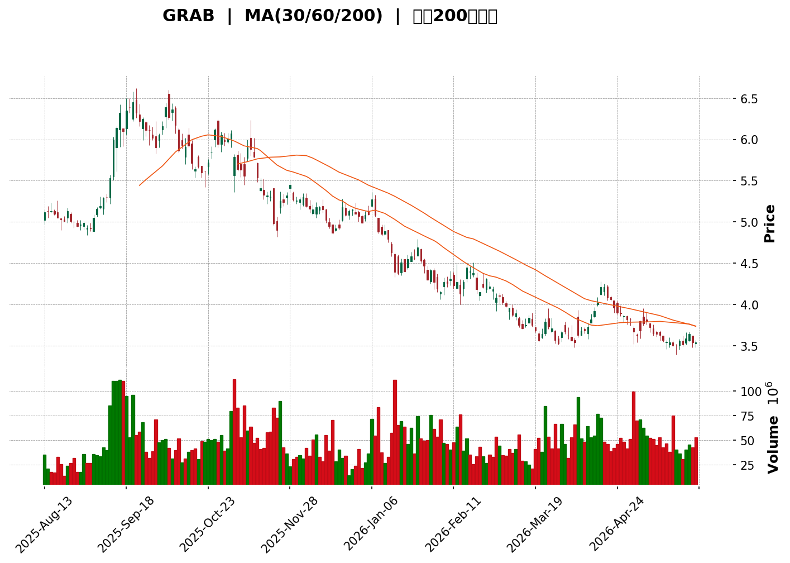
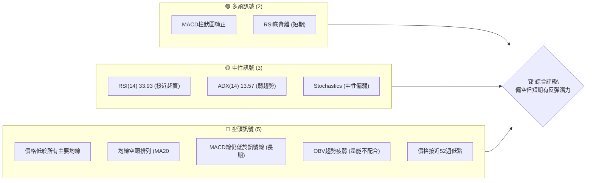

<details>
<summary>📊 靜態圖表 (點擊展開)</summary>

</details>

<html>
<head><meta charset="utf-8" /></head>
<body>
    <div>                        <script>window.PlotlyConfig = {MathJaxConfig: 'local'};</script>
        <script charset="utf-8" src="https://cdn.plot.ly/plotly-3.5.0.min.js" integrity="sha256-fHbNLP+GlIXN+efbQec78UkemUz3NJp7UmfGxC1tNxs=" crossorigin="anonymous"></script>                <div id="candlestick-chart" class="plotly-graph-div" style="height:500px; width:100%;"></div>            <script>                window.PLOTLYENV=window.PLOTLYENV || {};                                if (document.getElementById("candlestick-chart")) {                    Plotly.newPlot(                        "candlestick-chart",                        [{"close":{"dtype":"f8","bdata":"AAAAQOF6FEAAAADAHoUUQAAAAMAehRRAAAAAYGZmFEAAAABAMzMUQAAAAGC4HhRAAAAAgD0KFEAAAADAHoUUQAAAAIA9ChRAAAAAAAAAFEAAAADAzMwTQAAAAKBH4RNAAAAAgML1E0AAAADgUbgTQAAAAIAUrhNAAAAAQDMzFEAAAAAA16MUQAAAAGCPwhRAAAAAwPUoFUAAAABAMzMVQAAAAGC4HhZAAAAAAAAAGEAAAAAgXI8YQAAAACCuRxlAAAAAYGZmGEAAAABgZmYZQAAAACBcjxlAAAAAwMzMGUAAAAAgrkcZQAAAAKBH4RhAAAAAAAAAGUAAAADgo3AYQAAAAOCjcBhAAAAA4HoUGEAAAACgmZkXQAAAAEAzMxhAAAAAANejGEAAAAAgXI8ZQAAAAOB6FBlAAAAA4KNwGUAAAACAFK4YQAAAAOCjcBdAAAAA4FG4F0AAAAAA16MXQAAAAIAUrhdAAAAAQArXFkAAAAAgXI8WQAAAAIAUrhZAAAAAYGZmFkAAAABA4XoWQAAAAKBH4RZAAAAAYGZmF0AAAABA4XoYQAAAAGCPwhdAAAAAQDMzGEAAAAAghesXQAAAAIA9ChhAAAAAIK5HGEAAAAAA1yMXQAAAACBcjxZAAAAAwB6FFkAAAACgcD0WQAAAAKCZmRdAAAAAwB6FF0AAAADA9SgXQAAAAMD1KBZAAAAAANejFUAAAACA61EVQAAAACCuRxVAAAAAoHA9FUAAAAAghesTQAAAAKCZmRNAAAAAAAAAFUAAAACAwvUUQAAAACCuRxVAAAAAwMzMFUAAAADgehQVQAAAAIA9ChVAAAAA4HoUFUAAAABAMzMVQAAAAGCPwhRAAAAAANejFEAAAACgmZkUQAAAAOBRuBRAAAAA4FG4FEAAAACgmZkUQAAAAOB6FBRAAAAAwMzME0AAAABA4XoTQAAAAIAUrhNAAAAA4FG4E0AAAADgUbgUQAAAAIDrURRAAAAAwB6FFEAAAACgmZkUQAAAAGBmZhRAAAAAIK5HFEAAAACAwvUTQAAAAIDrURRAAAAAAClcFEAAAADgehQVQAAAAIDrURRAAAAAwB6FE0AAAABgZmYTQAAAACBcjxNAAAAAwPUoE0AAAADAHoUSQAAAACBcjxFAAAAAwB6FEUAAAACAPQoSQAAAAKCZmRFAAAAAQDMzEkAAAACA61ESQAAAAKBwPRJAAAAAYI\u002fCEkAAAABguB4SQAAAAKBH4RFAAAAAQDMzEUAAAAAA16MRQAAAAOB6FBFAAAAAYI\u002fCEEAAAACgmZkQQAAAAOB6FBFAAAAAgD0KEUAAAACgcD0RQAAAACCF6xBAAAAA4HoUEUAAAADAHoUQQAAAAOB6FBFAAAAAwMzMEUAAAACgmZkRQAAAAMAehRFAAAAA4FG4EEAAAACgmZkQQAAAAEAK1xBAAAAAoHA9EUAAAACgR+EQQAAAAOBRuBBAAAAAgOtREEAAAABgZmYQQAAAAGC4HhBAAAAAQArXD0AAAACAFK4PQAAAAIDC9Q5AAAAAYLgeD0AAAAAAAAAOQAAAAIAUrg1AAAAAAAAADkAAAADgUbgOQAAAAAAAAA5AAAAA4KNwDUAAAABA4XoMQAAAAGC4Hg1AAAAAgOtRDkAAAABACtcNQAAAAIAUrg1AAAAAIFyPDEAAAACgcD0MQAAAACCuRw1AAAAAAClcDUAAAACAwvUMQAAAAEDhegxAAAAAgOtRDEAAAACAPQoNQAAAAOCjcA1AAAAA4KNwDUAAAABACtcNQAAAACBcjw5AAAAAAClcD0AAAADgehQQQAAAAEAK1xBAAAAAQArXEEAAAACA61EQQAAAAKBwPRBAAAAAgBSuD0AAAABAMzMPQAAAAGC4Hg9AAAAAoEfhDkAAAAAgXI8OQAAAACBcjw5AAAAAAClcDUAAAACAwvUMQAAAAOCjcA1AAAAAwPUoDkAAAACA61EOQAAAAGCPwg1AAAAAQDMzDUAAAABguB4NQAAAAIA9Cg1AAAAAIFyPDEAAAABgZmYMQAAAAIDrUQxAAAAAAAAADEAAAADgehQMQAAAAEDhegxAAAAA4HoUDEAAAADgUbgMQAAAAGC4Hg1AAAAAgOtRDEAAAACA61EMQA=="},"high":{"dtype":"f8","bdata":"AAAAoJmZFEAAAABgj8IUQAAAACCF6xRAAAAAoJmZFEAAAACAPQoVQAAAAMD1KBRAAAAAIK5HFEAAAACAFK4UQAAAAEDhehRAAAAAgD0KFEAAAADgehQUQAAAAOB6FBRAAAAAgD0KFEAAAABACtcTQAAAAIDC9RNAAAAAAClcFEAAAADgUbgUQAAAAOBROBVAAAAAQDMzFUAAAAAAKVwVQAAAACCuRxZAAAAAYLgeGEAAAAAA16MYQAAAAIAUrhlAAAAAwB6FGEAAAAAAAAAaQAAAAAAAABpAAAAAgOtRGkAAAABA4XoaQAAAAOBRuBlAAAAA4HoUGUAAAACgR+EYQAAAAIAUrhhAAAAAoJmZGEAAAACgR+EYQAAAACCuRxhAAAAAoEfhGEAAAAAgrscZQAAAAGBmZhpAAAAAQInBGUAAAACgmZkZQAAAACBcjxhAAAAAIK5HGEAAAADgehQYQAAAACBcjxhAAAAAgML1F0AAAABAM7MWQAAAAIBqPBdAAAAA4FG4FkAAAABA4XoWQAAAAIA9ChdAAAAAwPWoF0AAAADAHoUYQAAAAIDC9RhAAAAAAClcGEAAAACA61EYQAAAAIDrURhAAAAAgMJ1GEAAAAAgrkcXQAAAAOCjcBdAAAAAQApXF0AAAADA9SgXQAAAAAAAABhAAAAA4KPwGEAAAADgehQYQAAAAKBH4RZAAAAAYLgeFkAAAADgehQWQAAAAIDCdRVAAAAAwB6FFUAAAAAA16MVQAAAAKBwPRRAAAAAQOF6FUAAAAAAKVwVQAAAAOCjcBVAAAAAAAAAFkAAAABA4XoVQAAAAKBwPRVAAAAAQDMzFUAAAABgZmYVQAAAAGBmZhVAAAAAIFwPFUAAAAAAKdwUQAAAAIDC9RRAAAAAYI\u002fCFEAAAADgehQVQAAAAADXoxRAAAAAQDMzFEAAAACgR+ETQAAAAKBH4RNAAAAAYLgeFEAAAABguB4VQAAAAIDC9RRAAAAAoJmZFEAAAAAA16MUQAAAACCF6xRAAAAAIFyPFEAAAAAAKVwUQAAAAMAehRRAAAAAwMzMFEAAAADgo3AVQAAAAIDrURVAAAAAQDMzFEAAAACgR+ETQAAAAKBH4RNAAAAAoJmZE0AAAACAPQoTQAAAAMAehRJAAAAAYGZmEkAAAADgUTgSQAAAAEAzMxJAAAAAYGZmEkAAAAAgXI8SQAAAAIAUrhJAAAAAgBQuE0AAAADgUbgSQAAAAOBROBJAAAAAoEfhEUAAAADgUbgRQAAAAGCPwhFAAAAAQOF6EUAAAAAA16MQQAAAAMDMTBFAAAAAAClcEUAAAABguJ4RQAAAACBcjxFAAAAAgML1EUAAAADgUTgRQAAAAEAzMxFAAAAAgD0KEkAAAABACtcRQAAAAMAeBRJAAAAAgD2KEUAAAACgmZkQQAAAAMAehRFAAAAAIK5HEUAAAABguB4RQAAAAKBH4RBAAAAAgD2KEEAAAADgepQQQAAAAMAehRBAAAAAwPUoEEAAAACAFK4PQAAAAAAAABBAAAAAwB6FD0AAAADAzMwOQAAAAEDheg5AAAAAANejDkAAAACAwvUOQAAAAEAzMw9AAAAAQArXDUAAAADgo3ANQAAAAIAUrg1AAAAAANejDkAAAACgmZkPQAAAAOBRuA5AAAAAwB6FDUAAAACAwvUMQAAAAOCjcA1AAAAAgOtRDkAAAABgj8INQAAAAAAAAA5AAAAAYI\u002fCDEAAAADgo3APQAAAAEAK1w1AAAAAwMzMDUAAAACgcD0OQAAAAOB6FA9AAAAA4FG4D0AAAAAAKVwQQAAAAGC4HhFAAAAAAAAAEUAAAACAwvUQQAAAAOCjcBBAAAAAQDMzEEAAAADA9SgQQAAAACCF6w9AAAAAAAAAD0AAAAAghesOQAAAAOBRuA5AAAAAoEfhDUAAAABAMzMNQAAAAOCjcA5AAAAAoJmZD0AAAABAMzMPQAAAAKBwPQ5AAAAA4HoUDkAAAADgo3ANQAAAAOCjcA1AAAAAgML1DEAAAAAgXI8MQAAAAMDMzAxAAAAAIFyPDEAAAACA6SYMQAAAAADXowxAAAAAgML1DEAAAACA61ENQAAAAAApXA1AAAAAgML1DEAAAAAgXI8MQA=="},"hovertemplate":"\u003cb\u003e%{x|%Y-%m-%d}\u003c\u002fb\u003e\u003cbr\u003e\u958b: $%{open:.2f}\u003cbr\u003e\u9ad8: $%{high:.2f}\u003cbr\u003e\u4f4e: $%{low:.2f}\u003cbr\u003e\u6536: $%{close:.2f}\u003cextra\u003e\u003c\u002fextra\u003e","low":{"dtype":"f8","bdata":"AAAAoEfhE0AAAABAMzMUQAAAAOCjcBRAAAAAgOtRFEAAAABAMzMUQAAAAKCZmRNAAAAAAAAAFEAAAACAwvUTQAAAAIDC9RNAAAAA4FG4E0AAAABgj8ITQAAAAKCZmRNAAAAAANejE0AAAAAAKVwTQAAAACBcjxNAAAAAwB6FE0AAAACgcD0UQAAAAADXoxRAAAAAAClcFEAAAACAwvUUQAAAAKBH4RRAAAAAgD0KFkAAAADgo3AWQAAAAADXoxdAAAAAwPWoF0AAAACgcD0YQAAAACCuRxlAAAAAoEfhGEAAAACAPQoZQAAAAADXoxhAAAAAgML1F0AAAADA9SgYQAAAAOBRuBdAAAAAgML1F0AAAACA61EXQAAAAKCZmRdAAAAAoHA9GEAAAAAgXI8YQAAAAIDC9RhAAAAAIIXrGEAAAAAgrkcYQAAAAAApXBdAAAAAIFyPF0AAAADAzMwWQAAAAKCZmRdAAAAAIFyPFkAAAADA9SgWQAAAAKCZmRZAAAAAwPUoFkAAAACAFK4VQAAAAIDrURZAAAAA4HoUF0AAAAAA16MXQAAAAKCZmRdAAAAAYGZmF0AAAACAFK4XQAAAAMDMzBdAAAAAoJmZF0AAAADgo3AVQAAAAEDhehZAAAAAgBQuFkAAAADAzMwVQAAAACCF6xZAAAAAQDMzF0AAAABguB4XQAAAACCF6xVAAAAA4KNwFUAAAADgehQVQAAAAKBH4RRAAAAAAAAAFUAAAABACtcTQAAAACCuRxNAAAAAIIVrFEAAAABgj8IUQAAAAEAK1xRAAAAA4KNwFUAAAAAAAAAVQAAAAKBH4RRAAAAAoJmZFEAAAAAgrscUQAAAAOBRuBRAAAAA4KNwFEAAAACA61EUQAAAAEAzMxRAAAAAoEdhFEAAAADgo3AUQAAAAIDC9RNAAAAAgBSuE0AAAABgZmYTQAAAACBcjxNAAAAAANejE0AAAACAPQoUQAAAACCuRxRAAAAAYLgeFEAAAADAzEwUQAAAAKBHYRRAAAAAAAAAFEAAAAAghesTQAAAAIA9ChRAAAAAgOtRFEAAAABgj8IUQAAAAGCPQhRAAAAA4KNwE0AAAACA61ETQAAAAAApXBNAAAAAAAAAE0AAAACA61ESQAAAAIDrURFAAAAA4KNwEUAAAABgZmYRQAAAACBcjxFAAAAA4FG4EUAAAADgehQSQAAAAMD1KBJAAAAAAClcEkAAAACAPQoSQAAAAMAehRFAAAAAwPUoEUAAAAAAAAARQAAAAOBRuBBAAAAAoJmZEEAAAACgcD0QQAAAAIDCdRBAAAAAQArXEEAAAAAghesQQAAAAGCPwhBAAAAAwMzMEEAAAAAAAAAQQAAAAGBmZhBAAAAA4HoUEUAAAABgj0IRQAAAAIDrURFAAAAAwB6FEEAAAABAMzMQQAAAAOCnxhBAAAAAIFyPEEAAAADgUbgQQAAAAKBwPRBAAAAAAClcD0AAAACAPQoQQAAAAAAAABBAAAAAYI\u002fCD0AAAADAHoUOQAAAAMDMzA5AAAAAQOF6DkAAAABgj8INQAAAAKCZmQ1AAAAAYI\u002fCDUAAAADA9SgOQAAAAEAK1w1AAAAAIK5HDUAAAABgZmYMQAAAAOBRuAxAAAAAgML1DEAAAACgmZkNQAAAAIDrUQ1AAAAAoHA9DEAAAADgehQMQAAAAGBmZgxAAAAAYLgeDUAAAAAA16MMQAAAAEDhegxAAAAAQArXC0AAAADAzMwMQAAAAIDC9QxAAAAAQDMzDUAAAAAA16MMQAAAAGBkOw5AAAAAgBSuDkAAAABACtcPQAAAAOCjcBBAAAAA4KNwEEAAAABAMzMQQAAAAMD1KBBAAAAAQDMzD0AAAACAPQoPQAAAAKBH4Q5AAAAAgOtRDkAAAADgehQOQAAAACCF6w1AAAAAwPUoDEAAAACA61EMQAAAAOBRuAxAAAAAIIXrDUAAAADgehQOQAAAACCuRw1AAAAAgML1DEAAAACgR+EMQAAAAEDhegxAAAAAYGZmDEAAAACAFK4LQAAAAEAK1wtAAAAAIIXrC0AAAABguB4LQAAAAKCZmQtAAAAAIIXrC0AAAADgehQMQAAAAOCjcAxAAAAAQArXC0AAAABACtcLQA=="},"name":"\u50f9\u683c","open":{"dtype":"f8","bdata":"AAAAoJkZFEAAAADAHoUUQAAAAAAAgBRAAAAAwB6FFEAAAABA4XoUQAAAAMD1KBRAAAAAYLgeFEAAAADAIDAUQAAAAGBmZhRAAAAAAAAAFEAAAACAwvUTQAAAAEAK1xNAAAAAwMzME0AAAADA9agTQAAAAOBRuBNAAAAAIFyPE0AAAAAAKVwUQAAAAIAUrhRAAAAAANejFEAAAABAMzMVQAAAAMD1KBVAAAAAQDMzFkAAAACgmZkXQAAAAEDhehhAAAAAwB6FGEAAAACAPYoYQAAAACBcjxlAAAAAQOH6GEAAAAAghesZQAAAAEAzMxlAAAAAwB6FGEAAAABACtcYQAAAAIDCdRhAAAAAoHA9GEAAAADA9SgYQAAAAIDC9RdAAAAAQOF6GEAAAACgmRkZQAAAAEAzMxpAAAAAgOtRGUAAAACAPYoZQAAAAEDhehhAAAAAgML1F0AAAADA9SgXQAAAAKBwPRhAAAAAwMzMF0AAAABA4XoWQAAAAMD1KBdAAAAA4FG4FkAAAABA4XoWQAAAAIAUrhZAAAAAoEdhF0AAAAAAAAAYQAAAACCF6xhAAAAAYI\u002fCF0AAAAAAAAAYQAAAAKBH4RdAAAAAgD0KGEAAAABgj0IWQAAAAGCPQhdAAAAAwMzMFkAAAADAzMwWQAAAAKCZGRdAAAAAIFwPGEAAAABgZmYXQAAAAEAK1xZAAAAAwB6FFUAAAACAPYoVQAAAAOBROBVAAAAAQDMzFUAAAAAA16MVQAAAAIA9ChRAAAAAgBSuFEAAAADgehQVQAAAAMD1KBVAAAAAANejFUAAAAAghWsVQAAAAMAeBRVAAAAAgML1FEAAAABACtcUQAAAAMD1KBVAAAAAYI\u002fCFEAAAAAghWsUQAAAAGBmZhRAAAAA4HqUFEAAAABgj8IUQAAAAKCZmRRAAAAAQOH6E0AAAACgR+ETQAAAAKCZmRNAAAAAoEfhE0AAAADgehQUQAAAAIAUrhRAAAAAgOtRFEAAAAAgXI8UQAAAAEDhehRAAAAAgMJ1FEAAAAAgrkcUQAAAAIAULhRAAAAAwB6FFEAAAABgj8IUQAAAAGC4HhVAAAAAQDMzFEAAAABgj8ITQAAAAGBmZhNAAAAAoJmZE0AAAAAghesSQAAAAOCjcBJAAAAAgOtREkAAAACAPYoRQAAAAEAzMxJAAAAAwMzMEUAAAADgehQSQAAAAKBwPRJAAAAAAClcEkAAAACAFK4SQAAAAMD1KBJAAAAAgBSuEUAAAABguB4RQAAAAMD1qBFAAAAAgOtREUAAAADAHoUQQAAAAKBH4RBAAAAAYLgeEUAAAADA9SgRQAAAAOCjcBFAAAAAwMzMEEAAAACAwvUQQAAAAGCPwhBAAAAAoHA9EUAAAADgepQRQAAAAOCjcBFAAAAAwMxMEUAAAADgo3AQQAAAAAAAABFAAAAA4FG4EEAAAADAzMwQQAAAAADXoxBAAAAAYLgeEEAAAADgo3AQQAAAAAApXBBAAAAAIFwPEEAAAAAgrkcPQAAAAIAUrg9AAAAAwMzMDkAAAAAA16MOQAAAAGC4Hg5AAAAAIIXrDUAAAACgcD0OQAAAAKCZmQ5AAAAAYI\u002fCDUAAAABAMzMNQAAAAMDMzAxAAAAAQDMzDUAAAAAA16MOQAAAAGBmZg1AAAAA4KNwDUAAAADgUbgMQAAAAMDMzAxAAAAAAAAADkAAAACAwvUMQAAAAKBH4QxAAAAAwB6FDEAAAABACtcOQAAAAIA9Cg1AAAAAoJmZDUAAAABAMzMNQAAAAKBwPQ5AAAAAwMzMDkAAAAAAAAAQQAAAAEDhehBAAAAAYLieEEAAAACgR+EQQAAAAAApXBBAAAAAQDMzEEAAAADgehQQQAAAAEAzMw9AAAAAwMzMDkAAAACgR+EOQAAAACBcjw5AAAAA4FG4DUAAAADgehQNQAAAAAApXA5AAAAAwMzMDkAAAAAgXI8OQAAAAMD1KA5AAAAAgBSuDUAAAAAAKVwNQAAAAAApXA1AAAAAgML1DEAAAACA61EMQAAAAGC4HgxAAAAAgOtRDEAAAADgehQMQAAAAAAAAAxAAAAAQOF6DEAAAAAgrkcMQAAAAEDhegxAAAAAgML1DEAAAACgcD0MQA=="},"x":["2025-08-13T00:00:00-04:00","2025-08-14T00:00:00-04:00","2025-08-15T00:00:00-04:00","2025-08-18T00:00:00-04:00","2025-08-19T00:00:00-04:00","2025-08-20T00:00:00-04:00","2025-08-21T00:00:00-04:00","2025-08-22T00:00:00-04:00","2025-08-25T00:00:00-04:00","2025-08-26T00:00:00-04:00","2025-08-27T00:00:00-04:00","2025-08-28T00:00:00-04:00","2025-08-29T00:00:00-04:00","2025-09-02T00:00:00-04:00","2025-09-03T00:00:00-04:00","2025-09-04T00:00:00-04:00","2025-09-05T00:00:00-04:00","2025-09-08T00:00:00-04:00","2025-09-09T00:00:00-04:00","2025-09-10T00:00:00-04:00","2025-09-11T00:00:00-04:00","2025-09-12T00:00:00-04:00","2025-09-15T00:00:00-04:00","2025-09-16T00:00:00-04:00","2025-09-17T00:00:00-04:00","2025-09-18T00:00:00-04:00","2025-09-19T00:00:00-04:00","2025-09-22T00:00:00-04:00","2025-09-23T00:00:00-04:00","2025-09-24T00:00:00-04:00","2025-09-25T00:00:00-04:00","2025-09-26T00:00:00-04:00","2025-09-29T00:00:00-04:00","2025-09-30T00:00:00-04:00","2025-10-01T00:00:00-04:00","2025-10-02T00:00:00-04:00","2025-10-03T00:00:00-04:00","2025-10-06T00:00:00-04:00","2025-10-07T00:00:00-04:00","2025-10-08T00:00:00-04:00","2025-10-09T00:00:00-04:00","2025-10-10T00:00:00-04:00","2025-10-13T00:00:00-04:00","2025-10-14T00:00:00-04:00","2025-10-15T00:00:00-04:00","2025-10-16T00:00:00-04:00","2025-10-17T00:00:00-04:00","2025-10-20T00:00:00-04:00","2025-10-21T00:00:00-04:00","2025-10-22T00:00:00-04:00","2025-10-23T00:00:00-04:00","2025-10-24T00:00:00-04:00","2025-10-27T00:00:00-04:00","2025-10-28T00:00:00-04:00","2025-10-29T00:00:00-04:00","2025-10-30T00:00:00-04:00","2025-10-31T00:00:00-04:00","2025-11-03T00:00:00-05:00","2025-11-04T00:00:00-05:00","2025-11-05T00:00:00-05:00","2025-11-06T00:00:00-05:00","2025-11-07T00:00:00-05:00","2025-11-10T00:00:00-05:00","2025-11-11T00:00:00-05:00","2025-11-12T00:00:00-05:00","2025-11-13T00:00:00-05:00","2025-11-14T00:00:00-05:00","2025-11-17T00:00:00-05:00","2025-11-18T00:00:00-05:00","2025-11-19T00:00:00-05:00","2025-11-20T00:00:00-05:00","2025-11-21T00:00:00-05:00","2025-11-24T00:00:00-05:00","2025-11-25T00:00:00-05:00","2025-11-26T00:00:00-05:00","2025-11-28T00:00:00-05:00","2025-12-01T00:00:00-05:00","2025-12-02T00:00:00-05:00","2025-12-03T00:00:00-05:00","2025-12-04T00:00:00-05:00","2025-12-05T00:00:00-05:00","2025-12-08T00:00:00-05:00","2025-12-09T00:00:00-05:00","2025-12-10T00:00:00-05:00","2025-12-11T00:00:00-05:00","2025-12-12T00:00:00-05:00","2025-12-15T00:00:00-05:00","2025-12-16T00:00:00-05:00","2025-12-17T00:00:00-05:00","2025-12-18T00:00:00-05:00","2025-12-19T00:00:00-05:00","2025-12-22T00:00:00-05:00","2025-12-23T00:00:00-05:00","2025-12-24T00:00:00-05:00","2025-12-26T00:00:00-05:00","2025-12-29T00:00:00-05:00","2025-12-30T00:00:00-05:00","2025-12-31T00:00:00-05:00","2026-01-02T00:00:00-05:00","2026-01-05T00:00:00-05:00","2026-01-06T00:00:00-05:00","2026-01-07T00:00:00-05:00","2026-01-08T00:00:00-05:00","2026-01-09T00:00:00-05:00","2026-01-12T00:00:00-05:00","2026-01-13T00:00:00-05:00","2026-01-14T00:00:00-05:00","2026-01-15T00:00:00-05:00","2026-01-16T00:00:00-05:00","2026-01-20T00:00:00-05:00","2026-01-21T00:00:00-05:00","2026-01-22T00:00:00-05:00","2026-01-23T00:00:00-05:00","2026-01-26T00:00:00-05:00","2026-01-27T00:00:00-05:00","2026-01-28T00:00:00-05:00","2026-01-29T00:00:00-05:00","2026-01-30T00:00:00-05:00","2026-02-02T00:00:00-05:00","2026-02-03T00:00:00-05:00","2026-02-04T00:00:00-05:00","2026-02-05T00:00:00-05:00","2026-02-06T00:00:00-05:00","2026-02-09T00:00:00-05:00","2026-02-10T00:00:00-05:00","2026-02-11T00:00:00-05:00","2026-02-12T00:00:00-05:00","2026-02-13T00:00:00-05:00","2026-02-17T00:00:00-05:00","2026-02-18T00:00:00-05:00","2026-02-19T00:00:00-05:00","2026-02-20T00:00:00-05:00","2026-02-23T00:00:00-05:00","2026-02-24T00:00:00-05:00","2026-02-25T00:00:00-05:00","2026-02-26T00:00:00-05:00","2026-02-27T00:00:00-05:00","2026-03-02T00:00:00-05:00","2026-03-03T00:00:00-05:00","2026-03-04T00:00:00-05:00","2026-03-05T00:00:00-05:00","2026-03-06T00:00:00-05:00","2026-03-09T00:00:00-04:00","2026-03-10T00:00:00-04:00","2026-03-11T00:00:00-04:00","2026-03-12T00:00:00-04:00","2026-03-13T00:00:00-04:00","2026-03-16T00:00:00-04:00","2026-03-17T00:00:00-04:00","2026-03-18T00:00:00-04:00","2026-03-19T00:00:00-04:00","2026-03-20T00:00:00-04:00","2026-03-23T00:00:00-04:00","2026-03-24T00:00:00-04:00","2026-03-25T00:00:00-04:00","2026-03-26T00:00:00-04:00","2026-03-27T00:00:00-04:00","2026-03-30T00:00:00-04:00","2026-03-31T00:00:00-04:00","2026-04-01T00:00:00-04:00","2026-04-02T00:00:00-04:00","2026-04-06T00:00:00-04:00","2026-04-07T00:00:00-04:00","2026-04-08T00:00:00-04:00","2026-04-09T00:00:00-04:00","2026-04-10T00:00:00-04:00","2026-04-13T00:00:00-04:00","2026-04-14T00:00:00-04:00","2026-04-15T00:00:00-04:00","2026-04-16T00:00:00-04:00","2026-04-17T00:00:00-04:00","2026-04-20T00:00:00-04:00","2026-04-21T00:00:00-04:00","2026-04-22T00:00:00-04:00","2026-04-23T00:00:00-04:00","2026-04-24T00:00:00-04:00","2026-04-27T00:00:00-04:00","2026-04-28T00:00:00-04:00","2026-04-29T00:00:00-04:00","2026-04-30T00:00:00-04:00","2026-05-01T00:00:00-04:00","2026-05-04T00:00:00-04:00","2026-05-05T00:00:00-04:00","2026-05-06T00:00:00-04:00","2026-05-07T00:00:00-04:00","2026-05-08T00:00:00-04:00","2026-05-11T00:00:00-04:00","2026-05-12T00:00:00-04:00","2026-05-13T00:00:00-04:00","2026-05-14T00:00:00-04:00","2026-05-15T00:00:00-04:00","2026-05-18T00:00:00-04:00","2026-05-19T00:00:00-04:00","2026-05-20T00:00:00-04:00","2026-05-21T00:00:00-04:00","2026-05-22T00:00:00-04:00","2026-05-26T00:00:00-04:00","2026-05-27T00:00:00-04:00","2026-05-28T00:00:00-04:00","2026-05-29T00:00:00-04:00"],"type":"candlestick"},{"hovertemplate":"MA30: $%{y:.2f}\u003cextra\u003e\u003c\u002fextra\u003e","line":{"color":"#2196F3","dash":"dash","width":2},"mode":"lines","name":"MA30","x":["2025-08-13T00:00:00-04:00","2025-08-14T00:00:00-04:00","2025-08-15T00:00:00-04:00","2025-08-18T00:00:00-04:00","2025-08-19T00:00:00-04:00","2025-08-20T00:00:00-04:00","2025-08-21T00:00:00-04:00","2025-08-22T00:00:00-04:00","2025-08-25T00:00:00-04:00","2025-08-26T00:00:00-04:00","2025-08-27T00:00:00-04:00","2025-08-28T00:00:00-04:00","2025-08-29T00:00:00-04:00","2025-09-02T00:00:00-04:00","2025-09-03T00:00:00-04:00","2025-09-04T00:00:00-04:00","2025-09-05T00:00:00-04:00","2025-09-08T00:00:00-04:00","2025-09-09T00:00:00-04:00","2025-09-10T00:00:00-04:00","2025-09-11T00:00:00-04:00","2025-09-12T00:00:00-04:00","2025-09-15T00:00:00-04:00","2025-09-16T00:00:00-04:00","2025-09-17T00:00:00-04:00","2025-09-18T00:00:00-04:00","2025-09-19T00:00:00-04:00","2025-09-22T00:00:00-04:00","2025-09-23T00:00:00-04:00","2025-09-24T00:00:00-04:00","2025-09-25T00:00:00-04:00","2025-09-26T00:00:00-04:00","2025-09-29T00:00:00-04:00","2025-09-30T00:00:00-04:00","2025-10-01T00:00:00-04:00","2025-10-02T00:00:00-04:00","2025-10-03T00:00:00-04:00","2025-10-06T00:00:00-04:00","2025-10-07T00:00:00-04:00","2025-10-08T00:00:00-04:00","2025-10-09T00:00:00-04:00","2025-10-10T00:00:00-04:00","2025-10-13T00:00:00-04:00","2025-10-14T00:00:00-04:00","2025-10-15T00:00:00-04:00","2025-10-16T00:00:00-04:00","2025-10-17T00:00:00-04:00","2025-10-20T00:00:00-04:00","2025-10-21T00:00:00-04:00","2025-10-22T00:00:00-04:00","2025-10-23T00:00:00-04:00","2025-10-24T00:00:00-04:00","2025-10-27T00:00:00-04:00","2025-10-28T00:00:00-04:00","2025-10-29T00:00:00-04:00","2025-10-30T00:00:00-04:00","2025-10-31T00:00:00-04:00","2025-11-03T00:00:00-05:00","2025-11-04T00:00:00-05:00","2025-11-05T00:00:00-05:00","2025-11-06T00:00:00-05:00","2025-11-07T00:00:00-05:00","2025-11-10T00:00:00-05:00","2025-11-11T00:00:00-05:00","2025-11-12T00:00:00-05:00","2025-11-13T00:00:00-05:00","2025-11-14T00:00:00-05:00","2025-11-17T00:00:00-05:00","2025-11-18T00:00:00-05:00","2025-11-19T00:00:00-05:00","2025-11-20T00:00:00-05:00","2025-11-21T00:00:00-05:00","2025-11-24T00:00:00-05:00","2025-11-25T00:00:00-05:00","2025-11-26T00:00:00-05:00","2025-11-28T00:00:00-05:00","2025-12-01T00:00:00-05:00","2025-12-02T00:00:00-05:00","2025-12-03T00:00:00-05:00","2025-12-04T00:00:00-05:00","2025-12-05T00:00:00-05:00","2025-12-08T00:00:00-05:00","2025-12-09T00:00:00-05:00","2025-12-10T00:00:00-05:00","2025-12-11T00:00:00-05:00","2025-12-12T00:00:00-05:00","2025-12-15T00:00:00-05:00","2025-12-16T00:00:00-05:00","2025-12-17T00:00:00-05:00","2025-12-18T00:00:00-05:00","2025-12-19T00:00:00-05:00","2025-12-22T00:00:00-05:00","2025-12-23T00:00:00-05:00","2025-12-24T00:00:00-05:00","2025-12-26T00:00:00-05:00","2025-12-29T00:00:00-05:00","2025-12-30T00:00:00-05:00","2025-12-31T00:00:00-05:00","2026-01-02T00:00:00-05:00","2026-01-05T00:00:00-05:00","2026-01-06T00:00:00-05:00","2026-01-07T00:00:00-05:00","2026-01-08T00:00:00-05:00","2026-01-09T00:00:00-05:00","2026-01-12T00:00:00-05:00","2026-01-13T00:00:00-05:00","2026-01-14T00:00:00-05:00","2026-01-15T00:00:00-05:00","2026-01-16T00:00:00-05:00","2026-01-20T00:00:00-05:00","2026-01-21T00:00:00-05:00","2026-01-22T00:00:00-05:00","2026-01-23T00:00:00-05:00","2026-01-26T00:00:00-05:00","2026-01-27T00:00:00-05:00","2026-01-28T00:00:00-05:00","2026-01-29T00:00:00-05:00","2026-01-30T00:00:00-05:00","2026-02-02T00:00:00-05:00","2026-02-03T00:00:00-05:00","2026-02-04T00:00:00-05:00","2026-02-05T00:00:00-05:00","2026-02-06T00:00:00-05:00","2026-02-09T00:00:00-05:00","2026-02-10T00:00:00-05:00","2026-02-11T00:00:00-05:00","2026-02-12T00:00:00-05:00","2026-02-13T00:00:00-05:00","2026-02-17T00:00:00-05:00","2026-02-18T00:00:00-05:00","2026-02-19T00:00:00-05:00","2026-02-20T00:00:00-05:00","2026-02-23T00:00:00-05:00","2026-02-24T00:00:00-05:00","2026-02-25T00:00:00-05:00","2026-02-26T00:00:00-05:00","2026-02-27T00:00:00-05:00","2026-03-02T00:00:00-05:00","2026-03-03T00:00:00-05:00","2026-03-04T00:00:00-05:00","2026-03-05T00:00:00-05:00","2026-03-06T00:00:00-05:00","2026-03-09T00:00:00-04:00","2026-03-10T00:00:00-04:00","2026-03-11T00:00:00-04:00","2026-03-12T00:00:00-04:00","2026-03-13T00:00:00-04:00","2026-03-16T00:00:00-04:00","2026-03-17T00:00:00-04:00","2026-03-18T00:00:00-04:00","2026-03-19T00:00:00-04:00","2026-03-20T00:00:00-04:00","2026-03-23T00:00:00-04:00","2026-03-24T00:00:00-04:00","2026-03-25T00:00:00-04:00","2026-03-26T00:00:00-04:00","2026-03-27T00:00:00-04:00","2026-03-30T00:00:00-04:00","2026-03-31T00:00:00-04:00","2026-04-01T00:00:00-04:00","2026-04-02T00:00:00-04:00","2026-04-06T00:00:00-04:00","2026-04-07T00:00:00-04:00","2026-04-08T00:00:00-04:00","2026-04-09T00:00:00-04:00","2026-04-10T00:00:00-04:00","2026-04-13T00:00:00-04:00","2026-04-14T00:00:00-04:00","2026-04-15T00:00:00-04:00","2026-04-16T00:00:00-04:00","2026-04-17T00:00:00-04:00","2026-04-20T00:00:00-04:00","2026-04-21T00:00:00-04:00","2026-04-22T00:00:00-04:00","2026-04-23T00:00:00-04:00","2026-04-24T00:00:00-04:00","2026-04-27T00:00:00-04:00","2026-04-28T00:00:00-04:00","2026-04-29T00:00:00-04:00","2026-04-30T00:00:00-04:00","2026-05-01T00:00:00-04:00","2026-05-04T00:00:00-04:00","2026-05-05T00:00:00-04:00","2026-05-06T00:00:00-04:00","2026-05-07T00:00:00-04:00","2026-05-08T00:00:00-04:00","2026-05-11T00:00:00-04:00","2026-05-12T00:00:00-04:00","2026-05-13T00:00:00-04:00","2026-05-14T00:00:00-04:00","2026-05-15T00:00:00-04:00","2026-05-18T00:00:00-04:00","2026-05-19T00:00:00-04:00","2026-05-20T00:00:00-04:00","2026-05-21T00:00:00-04:00","2026-05-22T00:00:00-04:00","2026-05-26T00:00:00-04:00","2026-05-27T00:00:00-04:00","2026-05-28T00:00:00-04:00","2026-05-29T00:00:00-04:00"],"y":{"dtype":"f8","bdata":"AAAAAAAA+H8AAAAAAAD4fwAAAAAAAPh\u002fAAAAAAAA+H8AAAAAAAD4fwAAAAAAAPh\u002fAAAAAAAA+H8AAAAAAAD4fwAAAAAAAPh\u002fAAAAAAAA+H8AAAAAAAD4fwAAAAAAAPh\u002fAAAAAAAA+H8AAAAAAAD4fwAAAAAAAPh\u002fAAAAAAAA+H8AAAAAAAD4fwAAAAAAAPh\u002fAAAAAAAA+H8AAAAAAAD4fwAAAAAAAPh\u002fAAAAAAAA+H8AAAAAAAD4fwAAAAAAAPh\u002fAAAAAAAA+H8AAAAAAAD4fwAAAAAAAPh\u002fAAAAAAAA+H8AAAAAAAD4f5qZmWlKxRVAERERgdzrFUAAAADgTw0WQO\u002fu7j7DLhZAREREVCpOFkDe3d29LWsWQDMzM6P+jRZAzczMfD+1FkCJiIiIQeAWQERERJRDCxdAERERca85F0B3d3f3U2MXQImIiOi0gRdAERERwcqhF0AAAAAgPsMXQCIiIkJg5RdAzczMbOf7F0Crqqq6SQwYQImIiAisHBhAq6qq2kAnGEDe3d0NLTIYQLy7u0upOBhAMzMzk4ozGEAAAADQ2zIYQCIiIlLjJRhAq6qqai4kGEDv7u5OjRcYQCIiItKUChhAVVVVVZz9F0De3d1tWesXQAAAAFCN1xdAvLu7q2PCF0AiIiKyna8XQAAAALByqBdAmpmZWaujF0B3d3cn6p8XQERERLSBjhdAq6qqGuh0F0Dv7u6uuVAXQFVVVXVMMBdAq6qqanUMF0CamZkJ1+MWQN7d3W0SwxZAAAAAgNyrFkAzMzPz\u002fZQWQCIiIhKDgBZAd3d3J6N3FkC8u7sLAmsWQJqZmWkDXRZARERE1L9RFkARERGh00YWQLy7u2u8NBZAvLu7Gy8dFkDv7u4eE\u002fwVQDMzMyMi4hVAVVVV9W\u002fEFUDv7u5OG6gVQN7d3Y1QhhVAd3d31xVgFUAzMzNz2kAVQO\u002fu7v5GKBVAzczMTGIQFUDv7u7OaQMVQJqZmYls5xRAAAAA8NLNFECJiIiI+rcUQBEREcH1qBRAq6qqylqdFEAzMzPTv5EUQLy7u6uOiRRAiYiISAyCFEB3d3dX8osUQERERDQXkhRAiYiIGHaFFECamZk5JngUQDMzM9N4aRRAiYiIqPFSFEARERFBGT0UQDMzMxNnHxRAMzMzIwYBFEAzMzMDD+YTQDMzM+MXyxNAERERoUW2E0BERETk0KITQAAAAECnjRNAERERke18E0DNzMzsw2cTQDMzM\u002fP9VBNAq6qqKs4+E0AAAACgGi8TQGZmZtbqGBNA7+7unqj\u002fEkCJiIhYgNwSQFVVVXXawBJAiYiISCijEkAAAABAfIYSQDMzMxPKaBJAERERkXtNEkBmZmbGIDASQDMzM+N6FBJAq6qqeqL+EUDe3d1N8OARQM3MzJwLyRFAq6qq6iaxEUCamZk5QpkRQLy7u0sMghFA3t3d\u002falxEUCrqqpaq2MRQImIiFiAXBFAd3d350JSEUBEREREREQRQImIiCijNxFAvLu7ay4kEUB3d3fHBA8RQHd3d3d39xBA3t3d9SjcEEDv7u42icEQQERERDyYpxBAq6qqQtKUEEBmZmaGXYEQQCIiIrKdbxBAd3d3PzVeEEB3d3e\u002fEUoQQJqZmbmQNBBAzczMzIUkEEDv7u6uuRAQQFVVVbXz\u002fQ9AIiIiUirOD0Dv7u6ONKUPQJqZmQmQew9A3t3djVBGD0AAAAAQEREPQFVVVYUW2Q5AZmZmtmWtDkDe3d0N5okOQCIiIqK3ZQ5AZmZmlrU6DkCJiIg4QhkOQERERMSuAA5AERERkcL1DUB3d3d3TPANQBERETGW\u002fA1AvLu7u0kMDkAiIiLiehQOQAAAAGBzIQ5AZmZmtjomDkB3d3cneDAOQCIiIuLBPA5AVVVVRUREDkDv7u6+5kIOQFVVVRWuRw5AIiIiUv9GDkBVVVXlF0sOQCIiIvLSTQ5AvLu7a3VMDkDv7u7+jVAOQCIiIsI8UQ5AzczM3LJWDkARERFBNV4OQHd3d\u002fcoXA5AZmZmVlVVDkAAAAAAjlAOQJqZmXkwTw5AzczMbHVMDkBVVVVFREQOQN7d3R0TPA5AZmZmJngwDkCJiIh46SYOQO\u002fu7r6fGg5AMzMzw64ADkB3d3cn6t8NQA=="},"type":"scatter"},{"hovertemplate":"MA60: $%{y:.2f}\u003cextra\u003e\u003c\u002fextra\u003e","line":{"color":"#9C27B0","dash":"dash","width":2},"mode":"lines","name":"MA60","x":["2025-08-13T00:00:00-04:00","2025-08-14T00:00:00-04:00","2025-08-15T00:00:00-04:00","2025-08-18T00:00:00-04:00","2025-08-19T00:00:00-04:00","2025-08-20T00:00:00-04:00","2025-08-21T00:00:00-04:00","2025-08-22T00:00:00-04:00","2025-08-25T00:00:00-04:00","2025-08-26T00:00:00-04:00","2025-08-27T00:00:00-04:00","2025-08-28T00:00:00-04:00","2025-08-29T00:00:00-04:00","2025-09-02T00:00:00-04:00","2025-09-03T00:00:00-04:00","2025-09-04T00:00:00-04:00","2025-09-05T00:00:00-04:00","2025-09-08T00:00:00-04:00","2025-09-09T00:00:00-04:00","2025-09-10T00:00:00-04:00","2025-09-11T00:00:00-04:00","2025-09-12T00:00:00-04:00","2025-09-15T00:00:00-04:00","2025-09-16T00:00:00-04:00","2025-09-17T00:00:00-04:00","2025-09-18T00:00:00-04:00","2025-09-19T00:00:00-04:00","2025-09-22T00:00:00-04:00","2025-09-23T00:00:00-04:00","2025-09-24T00:00:00-04:00","2025-09-25T00:00:00-04:00","2025-09-26T00:00:00-04:00","2025-09-29T00:00:00-04:00","2025-09-30T00:00:00-04:00","2025-10-01T00:00:00-04:00","2025-10-02T00:00:00-04:00","2025-10-03T00:00:00-04:00","2025-10-06T00:00:00-04:00","2025-10-07T00:00:00-04:00","2025-10-08T00:00:00-04:00","2025-10-09T00:00:00-04:00","2025-10-10T00:00:00-04:00","2025-10-13T00:00:00-04:00","2025-10-14T00:00:00-04:00","2025-10-15T00:00:00-04:00","2025-10-16T00:00:00-04:00","2025-10-17T00:00:00-04:00","2025-10-20T00:00:00-04:00","2025-10-21T00:00:00-04:00","2025-10-22T00:00:00-04:00","2025-10-23T00:00:00-04:00","2025-10-24T00:00:00-04:00","2025-10-27T00:00:00-04:00","2025-10-28T00:00:00-04:00","2025-10-29T00:00:00-04:00","2025-10-30T00:00:00-04:00","2025-10-31T00:00:00-04:00","2025-11-03T00:00:00-05:00","2025-11-04T00:00:00-05:00","2025-11-05T00:00:00-05:00","2025-11-06T00:00:00-05:00","2025-11-07T00:00:00-05:00","2025-11-10T00:00:00-05:00","2025-11-11T00:00:00-05:00","2025-11-12T00:00:00-05:00","2025-11-13T00:00:00-05:00","2025-11-14T00:00:00-05:00","2025-11-17T00:00:00-05:00","2025-11-18T00:00:00-05:00","2025-11-19T00:00:00-05:00","2025-11-20T00:00:00-05:00","2025-11-21T00:00:00-05:00","2025-11-24T00:00:00-05:00","2025-11-25T00:00:00-05:00","2025-11-26T00:00:00-05:00","2025-11-28T00:00:00-05:00","2025-12-01T00:00:00-05:00","2025-12-02T00:00:00-05:00","2025-12-03T00:00:00-05:00","2025-12-04T00:00:00-05:00","2025-12-05T00:00:00-05:00","2025-12-08T00:00:00-05:00","2025-12-09T00:00:00-05:00","2025-12-10T00:00:00-05:00","2025-12-11T00:00:00-05:00","2025-12-12T00:00:00-05:00","2025-12-15T00:00:00-05:00","2025-12-16T00:00:00-05:00","2025-12-17T00:00:00-05:00","2025-12-18T00:00:00-05:00","2025-12-19T00:00:00-05:00","2025-12-22T00:00:00-05:00","2025-12-23T00:00:00-05:00","2025-12-24T00:00:00-05:00","2025-12-26T00:00:00-05:00","2025-12-29T00:00:00-05:00","2025-12-30T00:00:00-05:00","2025-12-31T00:00:00-05:00","2026-01-02T00:00:00-05:00","2026-01-05T00:00:00-05:00","2026-01-06T00:00:00-05:00","2026-01-07T00:00:00-05:00","2026-01-08T00:00:00-05:00","2026-01-09T00:00:00-05:00","2026-01-12T00:00:00-05:00","2026-01-13T00:00:00-05:00","2026-01-14T00:00:00-05:00","2026-01-15T00:00:00-05:00","2026-01-16T00:00:00-05:00","2026-01-20T00:00:00-05:00","2026-01-21T00:00:00-05:00","2026-01-22T00:00:00-05:00","2026-01-23T00:00:00-05:00","2026-01-26T00:00:00-05:00","2026-01-27T00:00:00-05:00","2026-01-28T00:00:00-05:00","2026-01-29T00:00:00-05:00","2026-01-30T00:00:00-05:00","2026-02-02T00:00:00-05:00","2026-02-03T00:00:00-05:00","2026-02-04T00:00:00-05:00","2026-02-05T00:00:00-05:00","2026-02-06T00:00:00-05:00","2026-02-09T00:00:00-05:00","2026-02-10T00:00:00-05:00","2026-02-11T00:00:00-05:00","2026-02-12T00:00:00-05:00","2026-02-13T00:00:00-05:00","2026-02-17T00:00:00-05:00","2026-02-18T00:00:00-05:00","2026-02-19T00:00:00-05:00","2026-02-20T00:00:00-05:00","2026-02-23T00:00:00-05:00","2026-02-24T00:00:00-05:00","2026-02-25T00:00:00-05:00","2026-02-26T00:00:00-05:00","2026-02-27T00:00:00-05:00","2026-03-02T00:00:00-05:00","2026-03-03T00:00:00-05:00","2026-03-04T00:00:00-05:00","2026-03-05T00:00:00-05:00","2026-03-06T00:00:00-05:00","2026-03-09T00:00:00-04:00","2026-03-10T00:00:00-04:00","2026-03-11T00:00:00-04:00","2026-03-12T00:00:00-04:00","2026-03-13T00:00:00-04:00","2026-03-16T00:00:00-04:00","2026-03-17T00:00:00-04:00","2026-03-18T00:00:00-04:00","2026-03-19T00:00:00-04:00","2026-03-20T00:00:00-04:00","2026-03-23T00:00:00-04:00","2026-03-24T00:00:00-04:00","2026-03-25T00:00:00-04:00","2026-03-26T00:00:00-04:00","2026-03-27T00:00:00-04:00","2026-03-30T00:00:00-04:00","2026-03-31T00:00:00-04:00","2026-04-01T00:00:00-04:00","2026-04-02T00:00:00-04:00","2026-04-06T00:00:00-04:00","2026-04-07T00:00:00-04:00","2026-04-08T00:00:00-04:00","2026-04-09T00:00:00-04:00","2026-04-10T00:00:00-04:00","2026-04-13T00:00:00-04:00","2026-04-14T00:00:00-04:00","2026-04-15T00:00:00-04:00","2026-04-16T00:00:00-04:00","2026-04-17T00:00:00-04:00","2026-04-20T00:00:00-04:00","2026-04-21T00:00:00-04:00","2026-04-22T00:00:00-04:00","2026-04-23T00:00:00-04:00","2026-04-24T00:00:00-04:00","2026-04-27T00:00:00-04:00","2026-04-28T00:00:00-04:00","2026-04-29T00:00:00-04:00","2026-04-30T00:00:00-04:00","2026-05-01T00:00:00-04:00","2026-05-04T00:00:00-04:00","2026-05-05T00:00:00-04:00","2026-05-06T00:00:00-04:00","2026-05-07T00:00:00-04:00","2026-05-08T00:00:00-04:00","2026-05-11T00:00:00-04:00","2026-05-12T00:00:00-04:00","2026-05-13T00:00:00-04:00","2026-05-14T00:00:00-04:00","2026-05-15T00:00:00-04:00","2026-05-18T00:00:00-04:00","2026-05-19T00:00:00-04:00","2026-05-20T00:00:00-04:00","2026-05-21T00:00:00-04:00","2026-05-22T00:00:00-04:00","2026-05-26T00:00:00-04:00","2026-05-27T00:00:00-04:00","2026-05-28T00:00:00-04:00","2026-05-29T00:00:00-04:00"],"y":{"dtype":"f8","bdata":"AAAAAAAA+H8AAAAAAAD4fwAAAAAAAPh\u002fAAAAAAAA+H8AAAAAAAD4fwAAAAAAAPh\u002fAAAAAAAA+H8AAAAAAAD4fwAAAAAAAPh\u002fAAAAAAAA+H8AAAAAAAD4fwAAAAAAAPh\u002fAAAAAAAA+H8AAAAAAAD4fwAAAAAAAPh\u002fAAAAAAAA+H8AAAAAAAD4fwAAAAAAAPh\u002fAAAAAAAA+H8AAAAAAAD4fwAAAAAAAPh\u002fAAAAAAAA+H8AAAAAAAD4fwAAAAAAAPh\u002fAAAAAAAA+H8AAAAAAAD4fwAAAAAAAPh\u002fAAAAAAAA+H8AAAAAAAD4fwAAAAAAAPh\u002fAAAAAAAA+H8AAAAAAAD4fwAAAAAAAPh\u002fAAAAAAAA+H8AAAAAAAD4fwAAAAAAAPh\u002fAAAAAAAA+H8AAAAAAAD4fwAAAAAAAPh\u002fAAAAAAAA+H8AAAAAAAD4fwAAAAAAAPh\u002fAAAAAAAA+H8AAAAAAAD4fwAAAAAAAPh\u002fAAAAAAAA+H8AAAAAAAD4fwAAAAAAAPh\u002fAAAAAAAA+H8AAAAAAAD4fwAAAAAAAPh\u002fAAAAAAAA+H8AAAAAAAD4fwAAAAAAAPh\u002fAAAAAAAA+H8AAAAAAAD4fwAAAAAAAPh\u002fAAAAAAAA+H8AAAAAAAD4f83MzNxrzhZAZmZmFiDXFkARERHJdt4WQHd3d\u002fea6xZA7+7u1ur4FkCrqqryiwUXQLy7uytADhdAvLu7yxMVF0C8u7ubfRgXQM3MzATIHRdA3t3dbRIjF0CJiIiAlSMXQDMzM6tjIhdAiYiIoNMmF0CamZkJHiwXQCIiIqrxMhdAIiIiSsU5F0AzMzPjpTsXQBEREbnXPBdAd3d3V4A8F0B3d3dXgDwXQLy7u9uyNhdAd3d311woF0B3d3d3dxcXQKuqqroCBBdAAAAAME\u002f0FkDv7u5O1N8WQAAAALByyBZAZmZmFtmuFkCJiIjwGZYWQHd3dyfqfxZARERE\u002fGJpFkCJiIjAg1kWQM3MzJzvRxZAzczMJL84FkAAAABY8isWQKuqqrq7GxZAq6qqciEJFkARERHBPPEVQImIiJDt3BVAmpmZ2UDHFUCJiIiw5LcVQBEREdGUqhVARERETKmYFUBmZmYWkoYVQKuqqvL9dBVAAAAAaEplFUBmZmamDVQVQGZmZj41PhVAvLu7+2IpFUAiIiJScRYVQHd3dyfq\u002fxRAZmZmXrrpFECamZkBcs8UQJqZmbHktxRAMzMzw66gFEDe3d2d74cUQImIiECnbRRAERERAXJPFECamZmJ+jcUQKuqquqYIBRA3t3ddQUIFEC8u7sT9e8TQHd3d38j1BNAREREnH24E0BERERkO58TQCIiIurfiBNA3t3dLWt1E0DNzMxM8GATQHd3d8cETxNAmpmZYVdAE0CrqqpScTYTQImIiGiRLRNAmpmZgU4bE0CamZk5tAgTQHd3d4\u002fC9RJAMzMz003iEkDe3d1NYtASQN7d3bXzvRJAVVVVhaSpEkC8u7ujKZUSQN7d3YVdgRJAZmZmBjptEkDe3d3V6lgSQLy7u1uPQhJAd3d3Q4ssEkDe3d2RphQSQLy7uxdL\u002fhFAq6qqNtDpEUAzMzMTPNgRQERERERExBFAMzMz7+6uEUAAAAAMSZMRQHd3d5e1ehFAq6qqCtdjEUB3d3f3mksRQO\u002fu7vbhMxFAERERXUgaEUDv7u6GXQERQAAAAHQh6RBAzczMYOXQEEDv7u5qvLQQQLy7u2\u002fLmhBA7+7u4uyDEEBERESgGm8QQGZmZg50WhBAiYiIZIJHEEB3d3c7JjgQQFVVVd1rLhBAAAAAGJImEEAAAABANR4QQImIiCD3GhBAzczMpCkVEEBEREQcoQwQQLy7u5MYBBBAERERUUbvD0CrqqpKxdkPQFVVVS35xQ9AVVVVZfS2D0De3d3l0KIPQM3MzLx0kw9AiYiI6LSBD0AiIiKynW8PQKuqqjJ6Ww9Aq6qqgsBKD0BmZmauADkPQLy7uzuYJw9Ad3d3l24SD0AAAADotAEPQImIiIDc6w5AIiIi8tLNDkAAAACIz7AOQHd3d38jlA5AmpmZke18DkCamZkpFWcOQAAAAGDlUA5AZmZm3pY1DkCJiIjYFSAOQJqZmUGnDQ5AIiIiqjj7DUB3d3dPG+gNQA=="},"type":"scatter"},{"hovertemplate":"MA200: $%{y:.2f}\u003cextra\u003e\u003c\u002fextra\u003e","line":{"color":"#FF6F00","dash":"solid","width":2},"mode":"lines","name":"MA200","x":["2025-08-13T00:00:00-04:00","2025-08-14T00:00:00-04:00","2025-08-15T00:00:00-04:00","2025-08-18T00:00:00-04:00","2025-08-19T00:00:00-04:00","2025-08-20T00:00:00-04:00","2025-08-21T00:00:00-04:00","2025-08-22T00:00:00-04:00","2025-08-25T00:00:00-04:00","2025-08-26T00:00:00-04:00","2025-08-27T00:00:00-04:00","2025-08-28T00:00:00-04:00","2025-08-29T00:00:00-04:00","2025-09-02T00:00:00-04:00","2025-09-03T00:00:00-04:00","2025-09-04T00:00:00-04:00","2025-09-05T00:00:00-04:00","2025-09-08T00:00:00-04:00","2025-09-09T00:00:00-04:00","2025-09-10T00:00:00-04:00","2025-09-11T00:00:00-04:00","2025-09-12T00:00:00-04:00","2025-09-15T00:00:00-04:00","2025-09-16T00:00:00-04:00","2025-09-17T00:00:00-04:00","2025-09-18T00:00:00-04:00","2025-09-19T00:00:00-04:00","2025-09-22T00:00:00-04:00","2025-09-23T00:00:00-04:00","2025-09-24T00:00:00-04:00","2025-09-25T00:00:00-04:00","2025-09-26T00:00:00-04:00","2025-09-29T00:00:00-04:00","2025-09-30T00:00:00-04:00","2025-10-01T00:00:00-04:00","2025-10-02T00:00:00-04:00","2025-10-03T00:00:00-04:00","2025-10-06T00:00:00-04:00","2025-10-07T00:00:00-04:00","2025-10-08T00:00:00-04:00","2025-10-09T00:00:00-04:00","2025-10-10T00:00:00-04:00","2025-10-13T00:00:00-04:00","2025-10-14T00:00:00-04:00","2025-10-15T00:00:00-04:00","2025-10-16T00:00:00-04:00","2025-10-17T00:00:00-04:00","2025-10-20T00:00:00-04:00","2025-10-21T00:00:00-04:00","2025-10-22T00:00:00-04:00","2025-10-23T00:00:00-04:00","2025-10-24T00:00:00-04:00","2025-10-27T00:00:00-04:00","2025-10-28T00:00:00-04:00","2025-10-29T00:00:00-04:00","2025-10-30T00:00:00-04:00","2025-10-31T00:00:00-04:00","2025-11-03T00:00:00-05:00","2025-11-04T00:00:00-05:00","2025-11-05T00:00:00-05:00","2025-11-06T00:00:00-05:00","2025-11-07T00:00:00-05:00","2025-11-10T00:00:00-05:00","2025-11-11T00:00:00-05:00","2025-11-12T00:00:00-05:00","2025-11-13T00:00:00-05:00","2025-11-14T00:00:00-05:00","2025-11-17T00:00:00-05:00","2025-11-18T00:00:00-05:00","2025-11-19T00:00:00-05:00","2025-11-20T00:00:00-05:00","2025-11-21T00:00:00-05:00","2025-11-24T00:00:00-05:00","2025-11-25T00:00:00-05:00","2025-11-26T00:00:00-05:00","2025-11-28T00:00:00-05:00","2025-12-01T00:00:00-05:00","2025-12-02T00:00:00-05:00","2025-12-03T00:00:00-05:00","2025-12-04T00:00:00-05:00","2025-12-05T00:00:00-05:00","2025-12-08T00:00:00-05:00","2025-12-09T00:00:00-05:00","2025-12-10T00:00:00-05:00","2025-12-11T00:00:00-05:00","2025-12-12T00:00:00-05:00","2025-12-15T00:00:00-05:00","2025-12-16T00:00:00-05:00","2025-12-17T00:00:00-05:00","2025-12-18T00:00:00-05:00","2025-12-19T00:00:00-05:00","2025-12-22T00:00:00-05:00","2025-12-23T00:00:00-05:00","2025-12-24T00:00:00-05:00","2025-12-26T00:00:00-05:00","2025-12-29T00:00:00-05:00","2025-12-30T00:00:00-05:00","2025-12-31T00:00:00-05:00","2026-01-02T00:00:00-05:00","2026-01-05T00:00:00-05:00","2026-01-06T00:00:00-05:00","2026-01-07T00:00:00-05:00","2026-01-08T00:00:00-05:00","2026-01-09T00:00:00-05:00","2026-01-12T00:00:00-05:00","2026-01-13T00:00:00-05:00","2026-01-14T00:00:00-05:00","2026-01-15T00:00:00-05:00","2026-01-16T00:00:00-05:00","2026-01-20T00:00:00-05:00","2026-01-21T00:00:00-05:00","2026-01-22T00:00:00-05:00","2026-01-23T00:00:00-05:00","2026-01-26T00:00:00-05:00","2026-01-27T00:00:00-05:00","2026-01-28T00:00:00-05:00","2026-01-29T00:00:00-05:00","2026-01-30T00:00:00-05:00","2026-02-02T00:00:00-05:00","2026-02-03T00:00:00-05:00","2026-02-04T00:00:00-05:00","2026-02-05T00:00:00-05:00","2026-02-06T00:00:00-05:00","2026-02-09T00:00:00-05:00","2026-02-10T00:00:00-05:00","2026-02-11T00:00:00-05:00","2026-02-12T00:00:00-05:00","2026-02-13T00:00:00-05:00","2026-02-17T00:00:00-05:00","2026-02-18T00:00:00-05:00","2026-02-19T00:00:00-05:00","2026-02-20T00:00:00-05:00","2026-02-23T00:00:00-05:00","2026-02-24T00:00:00-05:00","2026-02-25T00:00:00-05:00","2026-02-26T00:00:00-05:00","2026-02-27T00:00:00-05:00","2026-03-02T00:00:00-05:00","2026-03-03T00:00:00-05:00","2026-03-04T00:00:00-05:00","2026-03-05T00:00:00-05:00","2026-03-06T00:00:00-05:00","2026-03-09T00:00:00-04:00","2026-03-10T00:00:00-04:00","2026-03-11T00:00:00-04:00","2026-03-12T00:00:00-04:00","2026-03-13T00:00:00-04:00","2026-03-16T00:00:00-04:00","2026-03-17T00:00:00-04:00","2026-03-18T00:00:00-04:00","2026-03-19T00:00:00-04:00","2026-03-20T00:00:00-04:00","2026-03-23T00:00:00-04:00","2026-03-24T00:00:00-04:00","2026-03-25T00:00:00-04:00","2026-03-26T00:00:00-04:00","2026-03-27T00:00:00-04:00","2026-03-30T00:00:00-04:00","2026-03-31T00:00:00-04:00","2026-04-01T00:00:00-04:00","2026-04-02T00:00:00-04:00","2026-04-06T00:00:00-04:00","2026-04-07T00:00:00-04:00","2026-04-08T00:00:00-04:00","2026-04-09T00:00:00-04:00","2026-04-10T00:00:00-04:00","2026-04-13T00:00:00-04:00","2026-04-14T00:00:00-04:00","2026-04-15T00:00:00-04:00","2026-04-16T00:00:00-04:00","2026-04-17T00:00:00-04:00","2026-04-20T00:00:00-04:00","2026-04-21T00:00:00-04:00","2026-04-22T00:00:00-04:00","2026-04-23T00:00:00-04:00","2026-04-24T00:00:00-04:00","2026-04-27T00:00:00-04:00","2026-04-28T00:00:00-04:00","2026-04-29T00:00:00-04:00","2026-04-30T00:00:00-04:00","2026-05-01T00:00:00-04:00","2026-05-04T00:00:00-04:00","2026-05-05T00:00:00-04:00","2026-05-06T00:00:00-04:00","2026-05-07T00:00:00-04:00","2026-05-08T00:00:00-04:00","2026-05-11T00:00:00-04:00","2026-05-12T00:00:00-04:00","2026-05-13T00:00:00-04:00","2026-05-14T00:00:00-04:00","2026-05-15T00:00:00-04:00","2026-05-18T00:00:00-04:00","2026-05-19T00:00:00-04:00","2026-05-20T00:00:00-04:00","2026-05-21T00:00:00-04:00","2026-05-22T00:00:00-04:00","2026-05-26T00:00:00-04:00","2026-05-27T00:00:00-04:00","2026-05-28T00:00:00-04:00","2026-05-29T00:00:00-04:00"],"y":{"dtype":"f8","bdata":"AAAAAAAA+H8AAAAAAAD4fwAAAAAAAPh\u002fAAAAAAAA+H8AAAAAAAD4fwAAAAAAAPh\u002fAAAAAAAA+H8AAAAAAAD4fwAAAAAAAPh\u002fAAAAAAAA+H8AAAAAAAD4fwAAAAAAAPh\u002fAAAAAAAA+H8AAAAAAAD4fwAAAAAAAPh\u002fAAAAAAAA+H8AAAAAAAD4fwAAAAAAAPh\u002fAAAAAAAA+H8AAAAAAAD4fwAAAAAAAPh\u002fAAAAAAAA+H8AAAAAAAD4fwAAAAAAAPh\u002fAAAAAAAA+H8AAAAAAAD4fwAAAAAAAPh\u002fAAAAAAAA+H8AAAAAAAD4fwAAAAAAAPh\u002fAAAAAAAA+H8AAAAAAAD4fwAAAAAAAPh\u002fAAAAAAAA+H8AAAAAAAD4fwAAAAAAAPh\u002fAAAAAAAA+H8AAAAAAAD4fwAAAAAAAPh\u002fAAAAAAAA+H8AAAAAAAD4fwAAAAAAAPh\u002fAAAAAAAA+H8AAAAAAAD4fwAAAAAAAPh\u002fAAAAAAAA+H8AAAAAAAD4fwAAAAAAAPh\u002fAAAAAAAA+H8AAAAAAAD4fwAAAAAAAPh\u002fAAAAAAAA+H8AAAAAAAD4fwAAAAAAAPh\u002fAAAAAAAA+H8AAAAAAAD4fwAAAAAAAPh\u002fAAAAAAAA+H8AAAAAAAD4fwAAAAAAAPh\u002fAAAAAAAA+H8AAAAAAAD4fwAAAAAAAPh\u002fAAAAAAAA+H8AAAAAAAD4fwAAAAAAAPh\u002fAAAAAAAA+H8AAAAAAAD4fwAAAAAAAPh\u002fAAAAAAAA+H8AAAAAAAD4fwAAAAAAAPh\u002fAAAAAAAA+H8AAAAAAAD4fwAAAAAAAPh\u002fAAAAAAAA+H8AAAAAAAD4fwAAAAAAAPh\u002fAAAAAAAA+H8AAAAAAAD4fwAAAAAAAPh\u002fAAAAAAAA+H8AAAAAAAD4fwAAAAAAAPh\u002fAAAAAAAA+H8AAAAAAAD4fwAAAAAAAPh\u002fAAAAAAAA+H8AAAAAAAD4fwAAAAAAAPh\u002fAAAAAAAA+H8AAAAAAAD4fwAAAAAAAPh\u002fAAAAAAAA+H8AAAAAAAD4fwAAAAAAAPh\u002fAAAAAAAA+H8AAAAAAAD4fwAAAAAAAPh\u002fAAAAAAAA+H8AAAAAAAD4fwAAAAAAAPh\u002fAAAAAAAA+H8AAAAAAAD4fwAAAAAAAPh\u002fAAAAAAAA+H8AAAAAAAD4fwAAAAAAAPh\u002fAAAAAAAA+H8AAAAAAAD4fwAAAAAAAPh\u002fAAAAAAAA+H8AAAAAAAD4fwAAAAAAAPh\u002fAAAAAAAA+H8AAAAAAAD4fwAAAAAAAPh\u002fAAAAAAAA+H8AAAAAAAD4fwAAAAAAAPh\u002fAAAAAAAA+H8AAAAAAAD4fwAAAAAAAPh\u002fAAAAAAAA+H8AAAAAAAD4fwAAAAAAAPh\u002fAAAAAAAA+H8AAAAAAAD4fwAAAAAAAPh\u002fAAAAAAAA+H8AAAAAAAD4fwAAAAAAAPh\u002fAAAAAAAA+H8AAAAAAAD4fwAAAAAAAPh\u002fAAAAAAAA+H8AAAAAAAD4fwAAAAAAAPh\u002fAAAAAAAA+H8AAAAAAAD4fwAAAAAAAPh\u002fAAAAAAAA+H8AAAAAAAD4fwAAAAAAAPh\u002fAAAAAAAA+H8AAAAAAAD4fwAAAAAAAPh\u002fAAAAAAAA+H8AAAAAAAD4fwAAAAAAAPh\u002fAAAAAAAA+H8AAAAAAAD4fwAAAAAAAPh\u002fAAAAAAAA+H8AAAAAAAD4fwAAAAAAAPh\u002fAAAAAAAA+H8AAAAAAAD4fwAAAAAAAPh\u002fAAAAAAAA+H8AAAAAAAD4fwAAAAAAAPh\u002fAAAAAAAA+H8AAAAAAAD4fwAAAAAAAPh\u002fAAAAAAAA+H8AAAAAAAD4fwAAAAAAAPh\u002fAAAAAAAA+H8AAAAAAAD4fwAAAAAAAPh\u002fAAAAAAAA+H8AAAAAAAD4fwAAAAAAAPh\u002fAAAAAAAA+H8AAAAAAAD4fwAAAAAAAPh\u002fAAAAAAAA+H8AAAAAAAD4fwAAAAAAAPh\u002fAAAAAAAA+H8AAAAAAAD4fwAAAAAAAPh\u002fAAAAAAAA+H8AAAAAAAD4fwAAAAAAAPh\u002fAAAAAAAA+H8AAAAAAAD4fwAAAAAAAPh\u002fAAAAAAAA+H8AAAAAAAD4fwAAAAAAAPh\u002fAAAAAAAA+H8AAAAAAAD4fwAAAAAAAPh\u002fAAAAAAAA+H8AAAAAAAD4fwAAAAAAAPh\u002fAAAAAAAA+H8pXI8klw8TQA=="},"type":"scatter"}],                        {"template":{"data":{"barpolar":[{"marker":{"line":{"color":"rgb(17,17,17)","width":0.5},"pattern":{"fillmode":"overlay","size":10,"solidity":0.2}},"type":"barpolar"}],"bar":[{"error_x":{"color":"#f2f5fa"},"error_y":{"color":"#f2f5fa"},"marker":{"line":{"color":"rgb(17,17,17)","width":0.5},"pattern":{"fillmode":"overlay","size":10,"solidity":0.2}},"type":"bar"}],"carpet":[{"aaxis":{"endlinecolor":"#A2B1C6","gridcolor":"#506784","linecolor":"#506784","minorgridcolor":"#506784","startlinecolor":"#A2B1C6"},"baxis":{"endlinecolor":"#A2B1C6","gridcolor":"#506784","linecolor":"#506784","minorgridcolor":"#506784","startlinecolor":"#A2B1C6"},"type":"carpet"}],"choropleth":[{"colorbar":{"outlinewidth":0,"ticks":""},"type":"choropleth"}],"contourcarpet":[{"colorbar":{"outlinewidth":0,"ticks":""},"type":"contourcarpet"}],"contour":[{"colorbar":{"outlinewidth":0,"ticks":""},"colorscale":[[0.0,"#0d0887"],[0.1111111111111111,"#46039f"],[0.2222222222222222,"#7201a8"],[0.3333333333333333,"#9c179e"],[0.4444444444444444,"#bd3786"],[0.5555555555555556,"#d8576b"],[0.6666666666666666,"#ed7953"],[0.7777777777777778,"#fb9f3a"],[0.8888888888888888,"#fdca26"],[1.0,"#f0f921"]],"type":"contour"}],"heatmap":[{"colorbar":{"outlinewidth":0,"ticks":""},"colorscale":[[0.0,"#0d0887"],[0.1111111111111111,"#46039f"],[0.2222222222222222,"#7201a8"],[0.3333333333333333,"#9c179e"],[0.4444444444444444,"#bd3786"],[0.5555555555555556,"#d8576b"],[0.6666666666666666,"#ed7953"],[0.7777777777777778,"#fb9f3a"],[0.8888888888888888,"#fdca26"],[1.0,"#f0f921"]],"type":"heatmap"}],"histogram2dcontour":[{"colorbar":{"outlinewidth":0,"ticks":""},"colorscale":[[0.0,"#0d0887"],[0.1111111111111111,"#46039f"],[0.2222222222222222,"#7201a8"],[0.3333333333333333,"#9c179e"],[0.4444444444444444,"#bd3786"],[0.5555555555555556,"#d8576b"],[0.6666666666666666,"#ed7953"],[0.7777777777777778,"#fb9f3a"],[0.8888888888888888,"#fdca26"],[1.0,"#f0f921"]],"type":"histogram2dcontour"}],"histogram2d":[{"colorbar":{"outlinewidth":0,"ticks":""},"colorscale":[[0.0,"#0d0887"],[0.1111111111111111,"#46039f"],[0.2222222222222222,"#7201a8"],[0.3333333333333333,"#9c179e"],[0.4444444444444444,"#bd3786"],[0.5555555555555556,"#d8576b"],[0.6666666666666666,"#ed7953"],[0.7777777777777778,"#fb9f3a"],[0.8888888888888888,"#fdca26"],[1.0,"#f0f921"]],"type":"histogram2d"}],"histogram":[{"marker":{"pattern":{"fillmode":"overlay","size":10,"solidity":0.2}},"type":"histogram"}],"mesh3d":[{"colorbar":{"outlinewidth":0,"ticks":""},"type":"mesh3d"}],"parcoords":[{"line":{"colorbar":{"outlinewidth":0,"ticks":""}},"type":"parcoords"}],"pie":[{"automargin":true,"type":"pie"}],"scatter3d":[{"line":{"colorbar":{"outlinewidth":0,"ticks":""}},"marker":{"colorbar":{"outlinewidth":0,"ticks":""}},"type":"scatter3d"}],"scattercarpet":[{"marker":{"colorbar":{"outlinewidth":0,"ticks":""}},"type":"scattercarpet"}],"scattergeo":[{"marker":{"colorbar":{"outlinewidth":0,"ticks":""}},"type":"scattergeo"}],"scattergl":[{"marker":{"line":{"color":"#283442"}},"type":"scattergl"}],"scattermapbox":[{"marker":{"colorbar":{"outlinewidth":0,"ticks":""}},"type":"scattermapbox"}],"scattermap":[{"marker":{"colorbar":{"outlinewidth":0,"ticks":""}},"type":"scattermap"}],"scatterpolargl":[{"marker":{"colorbar":{"outlinewidth":0,"ticks":""}},"type":"scatterpolargl"}],"scatterpolar":[{"marker":{"colorbar":{"outlinewidth":0,"ticks":""}},"type":"scatterpolar"}],"scatter":[{"marker":{"line":{"color":"#283442"}},"type":"scatter"}],"scatterternary":[{"marker":{"colorbar":{"outlinewidth":0,"ticks":""}},"type":"scatterternary"}],"surface":[{"colorbar":{"outlinewidth":0,"ticks":""},"colorscale":[[0.0,"#0d0887"],[0.1111111111111111,"#46039f"],[0.2222222222222222,"#7201a8"],[0.3333333333333333,"#9c179e"],[0.4444444444444444,"#bd3786"],[0.5555555555555556,"#d8576b"],[0.6666666666666666,"#ed7953"],[0.7777777777777778,"#fb9f3a"],[0.8888888888888888,"#fdca26"],[1.0,"#f0f921"]],"type":"surface"}],"table":[{"cells":{"fill":{"color":"#506784"},"line":{"color":"rgb(17,17,17)"}},"header":{"fill":{"color":"#2a3f5f"},"line":{"color":"rgb(17,17,17)"}},"type":"table"}]},"layout":{"annotationdefaults":{"arrowcolor":"#f2f5fa","arrowhead":0,"arrowwidth":1},"autotypenumbers":"strict","coloraxis":{"colorbar":{"outlinewidth":0,"ticks":""}},"colorscale":{"diverging":[[0,"#8e0152"],[0.1,"#c51b7d"],[0.2,"#de77ae"],[0.3,"#f1b6da"],[0.4,"#fde0ef"],[0.5,"#f7f7f7"],[0.6,"#e6f5d0"],[0.7,"#b8e186"],[0.8,"#7fbc41"],[0.9,"#4d9221"],[1,"#276419"]],"sequential":[[0.0,"#0d0887"],[0.1111111111111111,"#46039f"],[0.2222222222222222,"#7201a8"],[0.3333333333333333,"#9c179e"],[0.4444444444444444,"#bd3786"],[0.5555555555555556,"#d8576b"],[0.6666666666666666,"#ed7953"],[0.7777777777777778,"#fb9f3a"],[0.8888888888888888,"#fdca26"],[1.0,"#f0f921"]],"sequentialminus":[[0.0,"#0d0887"],[0.1111111111111111,"#46039f"],[0.2222222222222222,"#7201a8"],[0.3333333333333333,"#9c179e"],[0.4444444444444444,"#bd3786"],[0.5555555555555556,"#d8576b"],[0.6666666666666666,"#ed7953"],[0.7777777777777778,"#fb9f3a"],[0.8888888888888888,"#fdca26"],[1.0,"#f0f921"]]},"colorway":["#636efa","#EF553B","#00cc96","#ab63fa","#FFA15A","#19d3f3","#FF6692","#B6E880","#FF97FF","#FECB52"],"font":{"color":"#f2f5fa"},"geo":{"bgcolor":"rgb(17,17,17)","lakecolor":"rgb(17,17,17)","landcolor":"rgb(17,17,17)","showlakes":true,"showland":true,"subunitcolor":"#506784"},"hoverlabel":{"align":"left"},"hovermode":"closest","mapbox":{"style":"dark"},"paper_bgcolor":"rgb(17,17,17)","plot_bgcolor":"rgb(17,17,17)","polar":{"angularaxis":{"gridcolor":"#506784","linecolor":"#506784","ticks":""},"bgcolor":"rgb(17,17,17)","radialaxis":{"gridcolor":"#506784","linecolor":"#506784","ticks":""}},"scene":{"xaxis":{"backgroundcolor":"rgb(17,17,17)","gridcolor":"#506784","gridwidth":2,"linecolor":"#506784","showbackground":true,"ticks":"","zerolinecolor":"#C8D4E3"},"yaxis":{"backgroundcolor":"rgb(17,17,17)","gridcolor":"#506784","gridwidth":2,"linecolor":"#506784","showbackground":true,"ticks":"","zerolinecolor":"#C8D4E3"},"zaxis":{"backgroundcolor":"rgb(17,17,17)","gridcolor":"#506784","gridwidth":2,"linecolor":"#506784","showbackground":true,"ticks":"","zerolinecolor":"#C8D4E3"}},"shapedefaults":{"line":{"color":"#f2f5fa"}},"sliderdefaults":{"bgcolor":"#C8D4E3","bordercolor":"rgb(17,17,17)","borderwidth":1,"tickwidth":0},"ternary":{"aaxis":{"gridcolor":"#506784","linecolor":"#506784","ticks":""},"baxis":{"gridcolor":"#506784","linecolor":"#506784","ticks":""},"bgcolor":"rgb(17,17,17)","caxis":{"gridcolor":"#506784","linecolor":"#506784","ticks":""}},"title":{"x":0.05},"updatemenudefaults":{"bgcolor":"#506784","borderwidth":0},"xaxis":{"automargin":true,"gridcolor":"#283442","linecolor":"#506784","ticks":"","title":{"standoff":15},"zerolinecolor":"#283442","zerolinewidth":2},"yaxis":{"automargin":true,"gridcolor":"#283442","linecolor":"#506784","ticks":"","title":{"standoff":15},"zerolinecolor":"#283442","zerolinewidth":2}}},"xaxis":{"rangeslider":{"visible":false},"title":{"text":"\u65e5\u671f"}},"font":{"size":11},"title":{"text":"GRAB  |  MA(30\u002f60\u002f200)  |  \u6700\u8fd1200\u4ea4\u6613\u65e5"},"yaxis":{"title":{"text":"\u80a1\u50f9 (USD)"}},"hovermode":"x unified","height":500},                        {"responsive": true}                    )                };            </script>        </div>
</body>
</html>

# GRAB 技術分析報告

> **報告日期**：2026-05-31 ｜ **語言**：繁體中文 ｜ **數據來源**：提供數據 ｜ **當前價格**：$3.54

---

## 目錄

| 章節 | 內容 |
|------|------|
| [1. 技術面概覽](#1-技術面概覽) | 訊號儀表板、核心指標、評分卡 |
| [2. 趨勢分析](#2-趨勢分析) | 多時框趨勢、長中短期走勢 |
| [3. 圖表形態分析](#3-圖表形態分析) | 形態識別、K線組合、目標價 |
| [4. 支撐與阻力](#4-支撐與阻力) | 關鍵價位、斐波那契回調 |
| [5. 技術指標深度解讀](#5-技術指標深度解讀) | MA/RSI/MACD/布林/成交量 |
| [6. 動能與波動率](#6-動能與波動率) | 動能評估、ATR、Beta |
| [7. 多時框架總結](#7-多時框架總結) | 時框架評分矩陣 |
| [8. 交易策略建議](#8-交易策略建議) | 多空策略、風險報酬比 |
| [9. 風險提示與監控](#9-風險提示與監控) | 監控指標、風險場景 |
| [📋 報告總結](#-報告總結) | 綜合結論與策略 |

---

## 1. 技術面概覽

GRAB (Grab Holdings Limited) 於2026年5月31日收盤價為 $3.54。從技術面來看，GRAB 目前正處於一個長期熊市趨勢的底部區域，短期內出現了一些潛在的底部訊號，但整體市場結構仍偏弱。以下將透過多維度指標進行綜合分析。

### 🎯 技術訊號儀表板

本儀表板匯總了當前主要技術指標所發出的多空訊號，提供對 GRAB 股價走勢的即時概覽。


**儀表板解讀**：
目前 GRAB 的空頭訊號數量明顯多於多頭訊號，反映出市場結構的整體弱勢。價格位於所有主要移動平均線下方，且均線呈現標準的空頭排列，顯示長期和中期趨勢均處於下行通道。成交量方面，OBV趨勢疲弱，未能有效支撐價格上漲。然而，MACD柱狀圖轉正以及RSI在近期低點出現的明顯底背離，為短期內可能出現的反彈提供了潛在動能。ADX指標顯示當前趨勢非常弱，處於盤整或弱趨勢狀態，這也增加了短期反轉的可能性，因為弱勢趨勢更容易被打破。綜合來看，GRAB 仍處於熊市格局，但短期內值得關注其在低位能否成功築底並展開技術性反彈。

### 📊 核心指標速覽表

本表提供 GRAB 當前主要技術指標的數值、訊號及簡要解讀。

| 指標類別 | 指標名稱 | 當前數值 | 訊號 | 解讀 |
|----------|----------|----------|------|------|
| **價格** | 當前價格 | $3.54 | 🔴 | 接近52週低點 $3.39，顯示極度弱勢 |
| **均線** | MA20 | $3.61 | 🔴 | 價格位於MA20下方，短期趨勢偏空 |
| **均線** | MA50 | $3.72 | 🔴 | 價格位於MA50下方，中期趨勢偏空 |
| **均線** | MA200 | $4.77 | 🔴 | 價格位於MA200下方，長期趨勢偏空 |
| **動能** | RSI(14) | 33.93 | 🟡 | 接近超賣區30，但未進入，短期動能偏弱 |
| **動能** | MACD | -0.068 | 🟢 | MACD柱狀圖為 +0.003 (正值)，MACD線剛穿越訊號線，短期動能轉多 |
| **波動** | ATR(14) | $0.12 | 🟡 | 佔股價 3.29%，波動率中等偏低，顯示盤整或趨勢緩慢 |
| **趨勢** | ADX(14) | 13.57 | 🟡 | 趨勢強度極弱，處於盤整或無趨勢狀態 |
| **成交量** | OBV趨勢 | OBV < MA | 🔴 | 成交量未能有效配合價格上漲，量能疲弱 |
| **布林帶** | %B | 0.29 | 🔴 | 價格靠近布林通道下軌，顯示短期偏空壓力 |

### 🏆 技術評分卡

本評分卡從多個維度量化 GRAB 的技術面表現，提供綜合性評估。

```
╔══════════════════════════════════════════════════════════════╗
║              技術評分卡 — GRAB (2026-05-31)                   ║
╠══════════════════════════════════════════════════════════════╣
║ 趨勢強度      ████░░░░░░░░░░░░░░░░░░  20/100  🔴 (ADX顯示弱勢，長期趨勢向下)  ║
║ 動能指標      ████████░░░░░░░░░░░░░░  40/100  🟡 (RSI接近超賣，MACD短期轉多)  ║
║ 支撐穩定度    ████████░░░░░░░░░░░░░░  40/100  🟡 (接近52週低點，潛在支撐強勁)  ║
║ 成交量配合    ████░░░░░░░░░░░░░░░░░░  20/100  🔴 (OBV疲弱，量能未有效配合)  ║
║ 形態完整度    ██████░░░░░░░░░░░░░░░░  30/100  🔴 (短期底部形態未完全確立)  ║
║ 均線排列      ████░░░░░░░░░░░░░░░░░░  20/100  🔴 (標準空頭排列，壓力沉重)  ║
╠══════════════════════════════════════════════════════════════╣
║ 綜合評分      ██████░░░░░░░░░░░░░░░░  30/100  🔴 (整體技術面偏空，但短期有反彈機會) ║
╚══════════════════════════════════════════════════════════════╝
```
**評分卡解讀**：
GRAB 的技術評分整體偏低，綜合評分為 30/100，顯示其技術面處於弱勢。趨勢強度和均線排列都獲得低分，明確指出長短期趨勢均為空頭。成交量配合度不佳，未能為潛在反彈提供足夠的動能。然而，動能指標和支撐穩定度略高，這主要歸因於RSI的超賣區和MACD的短期看多交叉，以及價格接近52週低點所形成的潛在強勁心理支撐。這表明雖然整體趨勢悲觀，但超跌後的技術性反彈可能性正在增加。投資者應謹慎對待，並密切關注關鍵支撐位的表現。

---

## 2. 趨勢分析

對 GRAB 進行多時框架趨勢分析，可以幫助我們全面理解其股價在不同時間尺度上的表現，從而制定更為穩健的交易策略。

### 🌐 多時框趨勢分析

```mermaid
graph TD
    A[長期趨勢 (月線)] --> B{24個月價格走勢}
    B --> B1[2024年下半年築底反彈]
    B --> B2[2025年9月見頂 $6.02]
    B --> B3[2025年10月至今持續下跌]
    B3 --> C[結論: 🔴 長期下降趨勢]

    D[中期趨勢 (週線)] --> E{近20週價格走勢}
    E --> E1[2026年1月至3月下跌震盪]
    E --> E2[2026年4月短暫反彈至 $4.21]
    E --> E3[2026年5月再次探底]
    E --> F[結論: 🔴 中期下降趨勢，伴隨短期反彈嘗試]

    G[短期趨勢 (日線)] --> H{最新價格行為}
    H --> H1[價格位於所有均線下方]
    H --> H2[RSI出現底背離]
    H --> H3[MACD短期金叉]
    H --> I[結論: 🟡 短期超跌反彈潛力，但整體偏弱]

    C --> J(綜合分析)
    F --> J
    I --> J
    J --> K[總結: GRAB 處於長期和中期熊市，短期出現超跌反彈訊號，但尚未逆轉趨勢。]
```
**多時框趨勢解讀**：
- **長期趨勢 (月線)**：從24個月的價格歷史來看，GRAB 在2024年下半年經歷了一波築底反彈，並在2025年9月達到 $6.02 的高點。然而，自2025年10月以來，股價便開始持續下跌，至今已跌至 $3.54，接近2024年的低點。這明確表明 GRAB 處於一個顯著的長期下降趨勢中。長期均線 (MA200) 持續下行，且價格遠低於 MA200，印證了強烈的長期空頭格局。
- **中期趨勢 (週線)**：檢視近20週的數據，GRAB 在2026年1月至3月期間經歷了震盪下跌，並在4月初嘗試了一波反彈，最高觸及 $4.21。但此後便無力延續，5月份再次探底，創下新低。中期均線 (MA50) 持續向下，且價格始終受壓於 MA50，表明中期趨勢仍然偏空，反彈均被視為賣出機會。
- **短期趨勢 (日線)**：當前價格 $3.54 位於所有短期和中期移動平均線 (MA5、MA10、MA20) 的下方，顯示短期壓力沉重。然而，RSI 指標在近期低點出現了明顯的底背離，且 MACD 短期內形成了金叉（MACD柱狀圖轉正），這提供了一個短期超跌反彈的潛在訊號。但 ADX 指標的低數值表明當前趨勢強度非常弱，更像是盤整或弱勢下跌中的技術性反抽。

### 📈 長期趨勢 — 12個月走勢圖（Unicode）

以下是 GRAB 過去12個月的月線收盤價走勢圖，標註了關鍵高低點，以視覺化方式呈現其長期下跌趨勢。

```
GRAB 月線走勢圖（過去12個月）
價格軸 ($)
$6.50 ┤
$6.00 ┤              ● (6.02, Sep'25) ● (6.01, Oct'25)
$5.50 ┤         ● (5.45, Nov'25)
$5.00 ┤● (5.03, Jun'25)   ● (4.99, Aug'25) ● (4.99, Dec'25)
$4.50 ┤  ● (4.89, Jul'25)
$4.00 ┤                      ● (4.30, Jan'26) ● (4.22, Feb'26)
$3.50 ┤                          ● (3.66, Mar'26) ● (3.82, Apr'26) ● (3.54, May'26) ←現在
$3.00 ┤
     └──────────────────────────────────────────────────────────────
      2025-06 2025-07 2025-08 2025-09 2025-10 2025-11 2025-12 2026-01 2026-02 2026-03 2026-04 2026-05
```
**走勢特徵分析表格**：
| 階段 | 時間區間 | 價格範圍 | 漲跌幅 | 走勢特徵 | 評估 |
|------|----------|----------|--------|----------|------|
| **上升期** | 2025-06 至 2025-09 | $5.03 → $6.02 | +19.68% | 股價穩步上升，創下12個月新高，成交量溫和放大。 | 🟢 多頭主導 |
| **高點震盪** | 2025-09 至 2025-10 | $6.02 → $6.01 | -0.17% | 股價在高位盤整，未能有效突破，顯示上漲動能減弱。 | 🟡 動能衰竭 |
| **初期下跌** | 2025-10 至 2025-12 | $6.01 → $4.99 | -16.97% | 股價跌破關鍵支撐，形成下降趨勢的初期階段，成交量放大。 | 🔴 空頭壓力 |
| **加速下跌** | 2026-01 至 2026-03 | $4.99 → $3.66 | -26.65% | 股價加速下跌，跌破多個支撐位，市場情緒悲觀。 | 🔴 空頭主導 |
| **底部震盪** | 2026-03 至 2026-05 | $3.66 → $3.54 | -3.28% | 股價在低位震盪，短期嘗試反彈但未能持續，成交量波動較大。 | 🟡 尋找底部 |

### 📊 中期趨勢（週線分析）

從中期角度看，GRAB 的股價在經歷了2025年9月的高點後，進入了明顯的下降通道。近期價格在 $3.50-$4.50 區間震盪，但整體重心持續下移。

```
GRAB 中期趨勢示意圖 (近期週線)
價格軸 ($)
$4.50 ┤                 R1: $4.21
$4.25 ┤                 ▲
$4.00 ┤               ╱ ╲
$3.75 ┤           ╱───────╲
$3.50 ┤───────▼───────● ← 現價 $3.54
$3.25 ┤       S1: $3.39 (52W Low)
     └───────────────────────────────────
      時間軸 (近期數週)
```
**中期走勢解讀**：
上圖描繪了 GRAB 近期的中期走勢，顯示股價在 $4.21 (2026-04-19 高點) 附近遇到顯著阻力，隨後再次下跌。當前價格 $3.54 位於近期關鍵支撐 $3.39 (52週低點) 的上方，但整體趨勢仍為下降通道。
- **下降通道**：自2025年9月高點以來，GRAB 的股價一直運行在一個下降通道中，雖然偶有反彈，但均未能突破通道上軌。
- **均線壓制**：MA20、MA50、MA200 均呈現空頭排列，且持續向下，對股價構成強勁的動態壓力。每當股價嘗試反彈至這些均線附近時，往往會遇到賣壓而回落。
- **近期反彈受阻**：在2026年4月中旬，GRAB 股價從 $3.57 附近反彈至 $4.21，但隨後迅速回落，未能站穩，表明多頭力量不足以扭轉中期趨勢。
- **接近歷史低點**：當前價格 $3.54 非常接近 52週低點 $3.39，這是一個重要的心理和技術支撐位。若此支撐位被有效跌破，可能引發進一步的下跌。

### ⚡ 趨勢強度評估（ADX 解讀）

ADX (Average Directional Index) 指標用於衡量趨勢的強度，而非方向。它由 ADX 本身、+DI (Positive Directional Indicator) 和 -DI (Negative Directional Indicator) 組成。

```mermaid
graph TD
    A[ADX 指標分析] --> B{ADX(14) 數值: 13.57}
    B --> C{判斷趨勢強度}
    C --> D1[ADX < 20: 🔴 趨勢極弱或盤整]
    C --> D2[20 < ADX < 25: 🟡 弱趨勢]
    C --> D3[ADX > 25: 🟢 有效趨勢]
    D1 --> E[結論: GRAB 趨勢極弱，處於盤整或無趨勢狀態]

    F[方向指標分析] --> G{+DI: 16.97, -DI: 22.27}
    G --> H1[+DI > -DI: 看漲趨勢主導]
    G --> H2[+DI < -DI: 看跌趨勢主導]
    H2 --> I[結論: 🔴 空頭力量主導，儘管趨勢弱，方向仍向下]

    E --> J(綜合ADX判斷)
    I --> J
    J --> K[整體判斷: GRAB 處於弱勢盤整，但空頭力量略佔上風，趨勢方向不明顯但傾向於向下。]
```
**ADX 強度對照表**：
| ADX 數值 | 趨勢強度 | 市場狀況 | 訊號 |
|----------|----------|----------|------|
| 0-20     | 極弱     | 盤整/無趨勢 | 🔴 |
| 20-25    | 弱       | 弱趨勢     | 🟡 |
| 25-50    | 中等     | 有效趨勢   | 🟢 |
| 50-75    | 強       | 強趨勢     | 🟢 |
| 75-100   | 極強     | 極強趨勢   | 🟢 |

**ADX 解讀**：
- **ADX(14) = 13.57**：這個數值遠低於20，表明 GRAB 目前處於一個極其弱勢的趨勢狀態，或者更確切地說，它正處於盤整階段或缺乏明確方向的狀態。在這種情況下，傳統的趨勢追蹤策略效果不佳，市場可能在尋找新的方向。
- **+DI = 16.97, -DI = 22.27**：雖然 ADX 指示趨勢弱，但 +DI (16.97) 明顯低於 -DI (22.27)。這表明在當前的弱勢市場中，空頭力量仍然稍微佔據主導地位。儘管趨勢不強，但其潛在的方向傾向於向下。
- **綜合判斷**：GRAB 目前處於一個缺乏明確趨勢方向的盤整階段，但潛在的空頭壓力仍然存在。這意味著股價可能會在一個相對狹窄的區間內波動，直到有新的催化劑出現，打破當前的平衡。投資者應避免在這種時期盲目追漲殺跌，而應等待更明確的趨勢訊號或在關鍵支撐阻力位進行區間操作。

---

## 3. 圖表形態分析

圖表形態分析是識別潛在價格反轉或延續模式的關鍵。透過對 GRAB 歷史價格走勢的觀察，我們可以嘗試識別一些重要的圖表形態。

### 🔍 形態識別系統

由於 GRAB 處於長期下降趨勢，我們主要關注下降趨勢的延續形態或潛在的反轉形態。

```mermaid
graph TD
    A[圖表形態識別] --> B{股價走勢特徵}
    B --> C1[長期下降通道]
    C1 --> D1[形態: 下降通道 / 熊旗]
    D1 --> E1[解讀: 🔴 趨勢延續，空頭主導]

    B --> C2[近期低點震盪]
    C2 --> D2[形態: 潛在的下降楔形 / 雙底 (未確認)]
    D2 --> E2[解讀: 🟡 潛在反轉，需突破確認]

    B --> C3[成交量配合]
    C3 --> D3[OBV疲弱，未見明顯底部放量]
    D3 --> E3[解讀: 🔴 反轉訊號不足]

    E1 --> F(綜合形態判斷)
    E2 --> F
    E3 --> F
    F --> G[結論: GRAB 仍處於下降通道中，近期低點有構築底部的跡象，但尚未形成明確的反轉形態，需警惕熊旗形態的延續。]
```
**形態識別解讀**：
- **下降通道 (Descending Channel)**：從2025年9月的高點 $6.02 到現在的 $3.54，GRAB 的股價明顯運行在一個下降通道中。每次反彈都未能突破通道上軌，每次下跌都接近或觸及通道下軌。這是一個強烈的趨勢延續形態，表明空頭力量持續佔據主導。
- **潛在的下降楔形 (Falling Wedge)**：在下降通道的末端，如果價格波動幅度逐漸收窄，形成一個收斂的形態，則可能是一個下降楔形。下降楔形通常被視為看漲反轉形態。從 GRAB 近期的價格走勢來看，雖然整體下跌，但下跌速度有所放緩，且在 $3.50 附近有多次探底回升，這可能暗示一個潛在的下降楔形正在形成。然而，由於數據粒度限制，需要更精確的日線數據來確認。
- **熊旗 (Bear Flag)**：在一個強勁的下降趨勢中，股價可能會出現一個短暫、向上傾斜的盤整區間，形成熊旗形態。這通常是下降趨勢中繼的訊號，表明下跌將在盤整結束後繼續。GRAB 在2026年4月從 $3.57 反彈至 $4.21 的走勢，可以被視為一個潛在的熊旗旗面，而5月份的下跌則是旗杆的延續。

### 🕯️ 重要K線形態分析

由於提供的數據是月度收盤價和20週的週收盤價，我們將著重分析這些時間框架內價格行為所暗示的K線形態和其市場意義。

| 月份/週 | 收盤價 | 價格行為暗示的K線形態 | 解讀 | 訊號 |
|---------|--------|----------------------|----------------------------------------------------|------|
| 2025-09 | $6.02  | 長上影線或星線 (月線) | 股價達高點後回落，顯示上方賣壓沉重，潛在見頂訊號。 | 🔴 |
| 2025-10 | $6.01  | 小實體或十字星 (月線) | 在高位附近猶豫不決，多空力量平衡，但前月高點已是壓力。 | 🟡 |
| 2025-11 | $5.45  | 長陰線 (月線)        | 股價大幅下跌，空頭力量佔優，確認下跌趨勢。          | 🔴 |
| 2026-03 | $3.66  | 長陰線 (月線)        | 股價加速下跌，市場情緒悲觀，跌破關鍵支撐。          | 🔴 |
| 2026-03-22 | $3.56 | 錘子線或紡錘線 (週線) | 在低位出現，暗示下方有買盤支撐，但實體較小，反轉強度待觀察。 | 🟡 |
| 2026-04-19 | $4.21 | 長陽線後回落 (週線) | 股價短暫反彈，但未能持續，顯示上方賣壓依然存在。   | 🟡 |
| 2026-05-17 | $3.55 | 長下影線 (週線)      | 股價探底後被拉回，顯示在 $3.50 附近有較強的承接盤。 | 🟢 |
| 2026-05-24 | $3.51 | 小實體或十字星 (週線) | 股價再次探底，但收盤價接近開盤價，顯示多空僵持。   | 🟡 |
| 2026-05-31 | $3.54 | 小陽線或十字星 (週線) | 股價在低位企穩，略有上漲，配合RSI底背離，可能預示短期反彈。 | 🟢 |

**K線形態分析總結**：
從月線來看，GRAB 在2025年9月和10月的高點附近出現了見頂訊號，隨後由長陰線確認了下跌趨勢。進入2026年，股價持續下跌。
從週線來看，近期在 $3.50-$3.60 區間多次出現長下影線或小實體K線，尤其是在2026年5月17日和24日，顯示在這些低位有較強的買盤介入，阻止了股價的進一步下跌。這些K線形態，結合RSI底背離和MACD短期金叉，增加了短期築底反彈的可能性。然而，由於整體趨勢依然偏空，這些形態的反轉力量仍需後續的放量上漲來確認。

### 📉 ASCII 走勢形態示意圖

以下是 GRAB 近期走勢的簡化示意圖，展示了可能的下降通道和潛在的底部形態。

```
GRAB 下降通道與潛在底部示意圖
價格軸 ($)
$4.50 ┤          ╭── R1 ($4.21) (通道上軌)
$4.25 ┤         ╱
$4.00 ┤        ╱
$3.75 ┤       ╱
$3.50 ┤───────● (現價 $3.54)
$3.25 ┤      ╱
$3.00 ┤     ╱
     └───────────────────────────
      時間軸 (下降通道)
```
**形態分析**：
上圖描繪了 GRAB 自2025年高點以來所處的下降通道。股價在通道內震盪下行，每次反彈都受到通道上軌的壓制。目前價格 $3.54 位於通道下軌附近，同時接近 52週低點 $3.39。
- **下降通道**：這是目前最顯著的圖表形態，表明股價在明確的下跌趨勢中。通道上軌 $4.21 (2026-04-19 高點) 及其延伸線構成強勁阻力，通道下軌則在 $3.39 (52週低點) 附近提供支撐。
- **潛在下降楔形**：如果我們將2026年3月 $3.66、5月17日 $3.55 和5月24日 $3.51 的低點連線，以及2026年4月 $4.21 和5月3日 $3.67 的高點連線，可以觀察到一個向下傾斜並逐漸收斂的形態，這可能是一個下降楔形。下降楔形通常在下跌趨勢的末期出現，預示著潛在的看漲反轉。
- **底部形態**：雖然尚未形成明確的雙底或頭肩底等反轉形態，但近期在 $3.50-$3.60 區間的多次探底回升，配合RSI底背離，暗示股價正在試圖築底。要確認底部形態，需要股價有效突破下降通道上軌，並伴隨成交量的放大。

### 🎯 形態目標價計算

由於目前形態偏向於下降通道或潛在的下降楔形，我們將分別計算其可能帶來的目標價。

1.  **下降通道延續目標價 (悲觀情境)**
    如果下降通道延續，且股價未能守住 52週低點 $3.39，則可能下探至通道下軌的延伸目標。
    - **形態高度**：從2025年9月高點 $6.02 至 2024年8月低點 $3.22 之間的最低支撐，或者以 $3.39 為基礎。
    - **悲觀目標價**：若跌破 $3.39，下一個歷史支撐位是 $3.22 (2024-08)。如果通道進一步延續，可能測試 $3.00 心理關口，甚至更低。
    - **計算**：假設跌破 $3.39，並下跌一個ATR的距離 ($0.12)，則目標價約為 $3.39 - $0.12 = $3.27。更深層次目標則為 $3.22。

2.  **下降楔形突破目標價 (樂觀情境)**
    如果確認形成下降楔形並成功向上突破，則目標價通常是形態的最高點或形態開始時的寬度。
    - **形態起始點**：可追溯到2026年1月高點 $4.58 或2026年4月高點 $4.21。
    - **形態寬度**：以2026年1月高點 $4.58 和2026年3月低點 $3.56 為例，寬度約為 $1.02。
    - **突破點**：假設從 $3.60 附近突破下降楔形上軌。
    - **樂觀目標價**：$3.60 + $1.02 = $4.62。此目標價接近 MA200 ($4.77)，也是一個合理的阻力區間。
    - **次要目標價**：斐波那契回調位 $4.487 (38.2%) 和 $4.78 (50%)。

**總結**：
目前 GRAB 的圖表形態主要是一個下降通道，這是一個看跌趨勢延續的訊號。然而，在通道下軌附近出現的潛在下降楔形和築底 K線形態，為短期反彈提供了可能性。投資者應密切關注股價能否在 $3.39 附近獲得有效支撐，並觀察是否能放量突破下降通道上軌。若能有效突破，則下降楔形的反轉形態將被確認，並可能帶來可觀的反彈空間。

---

## 4. 支撐與阻力

識別關鍵的支撐與阻力位對於制定交易策略至關重要。這些價位是買賣雙方力量平衡或逆轉的潛在區域。

### 🗺️ 關鍵價位分布圖（Unicode）

以下是 GRAB 當前價格 $3.54 附近的關鍵支撐與阻力位分布圖。

```
GRAB 價位結構分布圖
═══════════════════════════════════════════════════
$8.00 ║████████████████████████║ 分析師高目標
$5.97 ║████████████████████    ║ 分析師平均目標
$5.07 ║████████████████████████║ 斐波那契61.8%回調 / 強阻力 R3
$4.78 ║████████████████████    ║ 斐波那契50%回調 / 阻力 R2 (MA200)
$4.49 ║████████████████████████║ 斐波那契38.2%回調 / 阻力 R1
$4.21 ║▓▓▓▓▓▓▓▓▓▓▓▓▓▓▓▓        ║ 近期高點阻力
$4.10 ║████████████████████████║ 分析師低目標
$3.78 ║▓▓▓▓▓▓▓▓▓▓▓▓▓▓▓▓        ║ 布林上軌 / 阻力
$3.72 ║████████████████████████║ MA50 阻力
$3.61 ║▓▓▓▓▓▓▓▓▓▓▓▓▓▓▓▓        ║ MA20 / 布林中軌 阻力
$3.54 ╠════════════════════════╣ ◄ 現價
$3.44 ║████████████████████████║ 布林下軌 / 支撐 S1
$3.39 ║▓▓▓▓▓▓▓▓▓▓▓▓▓▓▓▓        ║ 52週低點 / 強支撐 S2
$3.22 ║████████████████████████║ 歷史低點 / 強支撐 S3
═══════════════════════════════════════════════════
```

### 🚧 阻力位分析表

以下是 GRAB 當前股價上方的重要阻力位及其形成原因和重要性。

| 阻力級別 | 價位 | 形成原因 | 突破難度 | 重要性 |
|----------|------|----------|----------|--------|
| **R1**   | $3.61 | MA20 / 布林中軌 | 中等     | 🟢 (短期反彈首要目標，若突破則短期看多) |
| **R2**   | $3.72 | MA50           | 中等偏高 | 🟡 (中期趨勢指標，突破則中期壓力減輕) |
| **R3**   | $3.78 | 布林上軌       | 中等偏高 | 🟡 (短期波動上限，突破可能引發加速上漲) |
| **R4**   | $4.10 | 分析師低目標價 | 高       | 🟡 (若能達到此目標，顯示市場情緒明顯改善) |
| **R5**   | $4.21 | 2026-04-19 近期高點 | 高       | 🔴 (短期反彈的關鍵壓力位，突破將是強烈反轉訊號) |
| **R6**   | $4.49 | 斐波那契38.2%回調 | 高       | 🔴 (重要技術回調位，突破需強勁動能) |
| **R7**   | $4.77 | MA200          | 極高     | 🔴 (長期趨勢指標，突破代表長期趨勢逆轉) |

### 🛡️ 支撐位分析表

以下是 GRAB 當前股價下方的重要支撐位及其形成原因和重要性。

| 支撐級別 | 價位 | 形成原因 | 守住機率 | 重要性 |
|----------|------|----------|----------|--------|
| **S1**   | $3.44 | 布林下軌       | 中等偏高 | 🟢 (短期波動下限，若跌破可能加速下跌) |
| **S2**   | $3.39 | 52週低點 (2026-05-24) | 高       | 🟢 (極其重要的心理和技術支撐，決定短期走勢) |
| **S3**   | $3.22 | 2024年8月歷史低點 | 高       | 🟡 (若跌破S2，此為下一個主要防線，具有強大歷史意義) |
| **S4**   | $3.00 | 心理關口       | 中等     | 🟡 (整數關口，通常會吸引部分買盤或賣壓) |

### 📐 斐波那契回調位分析

我們將以 GRAB 自2025年9月高點 $6.02 至當前 52週低點 $3.39 的主要下跌波段來計算斐波那契回調位，這將有助於識別潛在的反彈目標。

- **主要下跌波段**：
    - 高點 (100%)：$6.02 (2025-09)
    - 低點 (0%)：$3.39 (52週低點)
    - 跌幅：$6.02 - $3.39 = $2.63

- **斐波那契回調位計算**：
    - **23.6% 回調**：$3.39 + ($2.63 * 0.236) = $3.39 + $0.62 = **$4.01**
    - **38.2% 回調**：$3.39 + ($2.63 * 0.382) = $3.39 + $1.00 = **$4.39**
    - **50% 回調**：$3.39 + ($2.63 * 0.500) = $3.39 + $1.31 = **$4.70**
    - **61.8% 回調**：$3.39 + ($2.63 * 0.618) = $3.39 + $1.62 = **$5.01**

**斐波那契回調位視覺化**：

```
GRAB 斐波那契回調位 (自 $6.02 跌至 $3.39)
═══════════════════════════════════════════════════
$6.02 ║████████████████████████║ 100% (高點)
      ║                        ║
$5.01 ║▓▓▓▓▓▓▓▓▓▓▓▓▓▓▓▓▓▓▓▓▓▓▓▓║ 61.8% 回調
      ║                        ║
$4.70 ║████████████████████████║ 50% 回調
      ║                        ║
$4.39 ║▓▓▓▓▓▓▓▓▓▓▓▓▓▓▓▓▓▓▓▓▓▓▓▓║ 38.2% 回調
      ║                        ║
$4.01 ║████████████████████████║ 23.6% 回調
      ║                        ║
$3.54 ╠════════════════════════╣ ◄ 現價
      ║                        ║
$3.39 ║▓▓▓▓▓▓▓▓▓▓▓▓▓▓▓▓▓▓▓▓▓▓▓▓║ 0% (低點)
═══════════════════════════════════════════════════
```
**斐波那契回調分析**：
當前價格 $3.54 遠低於所有斐波那契回調位，顯示其處於深度超跌狀態。如果 GRAB 能夠從當前低點展開反彈，那麼這些斐波那契回調位將構成重要的潛在阻力區。
- **$4.01 (23.6% 回調)**：這是反彈的第一個重要目標，若能突破此位，將增強市場信心。
- **$4.39 (38.2% 回調)**：此位與近期高點 $4.21 和分析師低目標 $4.10 接近，是反彈能否持續的關鍵考驗。
- **$4.70 (50% 回調)**：此位與 MA200 ($4.77) 非常接近，構成強勁的阻力區。突破此位將意味著中期趨勢有逆轉的潛力。
- **$5.01 (61.8% 回調)**：這是黃金回調比例，若能達到此位，將是強烈的中期看漲訊號。

**綜合支撐與阻力結論**：
GRAB 目前正測試其關鍵支撐位 $3.39 (52週低點)。此位是多頭能否守住的最後防線。如果成功守住並展開反彈，其上方將面臨來自移動平均線 (MA20 $3.61, MA50 $3.72)、布林通道上軌 $3.78 以及斐波那契回調位 $4.01 和 $4.39 的多重阻力。其中，突破 $4.21 的近期高點阻力將是確認短期反轉的關鍵。若 $3.39 支撐位被有效跌破，則 $3.22 (歷史低點) 將是下一個主要支撐。

---

## 5. 技術指標深度解讀

本章將對 GRAB 的各項技術指標進行詳盡分析，包括移動平均線、RSI、MACD、布林通道和成交量，並探討它們之間的相互確認或矛盾。

### 🎛️ 指標訊號總覽

```mermaid
graph TD
    A[價格 $3.54] --> B[均線系統]
    B --> B1[MA20 $3.61 (🔴 壓力)]
    B --> B2[MA50 $3.72 (🔴 壓力)]
    B --> B3[MA200 $4.77 (🔴 強壓)]
    B --> B4[均線排列: 空頭排列 (🔴)]

    A --> C[動能指標]
    C --> C1[RSI(14) 33.93 (🟡 接近超賣)]
    C --> C2[RSI 背離: 🟢 短期底背離]
    C --> C3[MACD 線 -0.068 (🔴)]
    C --> C4[MACD Signal -0.071 (🔴)]
    C --> C5[MACD Hist +0.003 (🟢 金叉)]
    C --> C6[Stoch %K 40.54, %D 42.67 (🟡 中性偏弱)]

    A --> D[趨勢強度/波動率]
    D --> D1[ADX(14) 13.57 (🔴 弱趨勢)]
    D --> D2[+DI 16.97, -DI 22.27 (🔴 空頭主導)]
    D --> D3[ATR(14) $0.12 (🟡 波動中等偏低)]

    A --> E[布林通道]
    E --> E1[BB上軌 $3.78 (🔴 壓力)]
    E --> E2[BB中軌 $3.61 (🔴 壓力)]
    E --> E3[BB下軌 $3.44 (🟢 支撐)]
    E --> E4[BB %B 0.29 (🔴 靠近下軌)]

    A --> F[成交量]
    F --> F1[最新成交量 53.28M (🟡 與均量持平)]
    F --> F2[OBV趨勢: OBV < MA (🔴 量能疲弱)]

    B1 & B2 & B3 & B4 --> G[整體均線訊號: 極度看空]
    C1 & C2 & C3 & C4 & C5 & C6 --> H[整體動能訊號: 短期有反彈潛力，但中期動能仍弱]
    D1 & D2 & D3 --> I[整體趨勢/波動訊號: 弱勢盤整，空頭略佔優]
    E1 & E2 & E3 & E4 --> J[整體布林訊號: 價格承壓，接近下軌]
    F1 & F2 --> K[整體成交量訊號: 缺乏買盤支持]

    G & H & I & J & K --> L[綜合判斷: 🔴 整體偏空，但短期超跌反彈訊號浮現]
```

### 📈 移動平均線排列分析

移動平均線 (MA) 是判斷趨勢方向和強度的重要工具。GRAB 的均線系統呈現出明確的空頭排列。

```mermaid
graph TD
    P[價格 $3.54]

    MA_Short[MA20: $3.61]
    MA_Mid[MA50: $3.72]
    MA_Long[MA200: $4.77]

    P -->|位於下方| MA_Short
    P -->|位於下方| MA_Mid
    P -->|位於下方| MA_Long

    MA_Short -->|