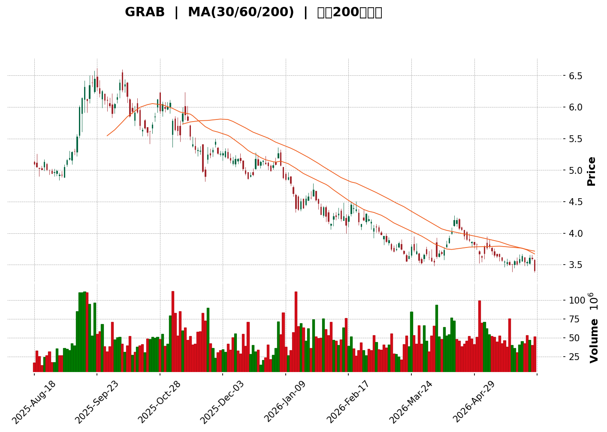
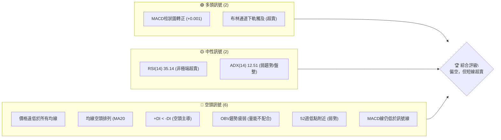
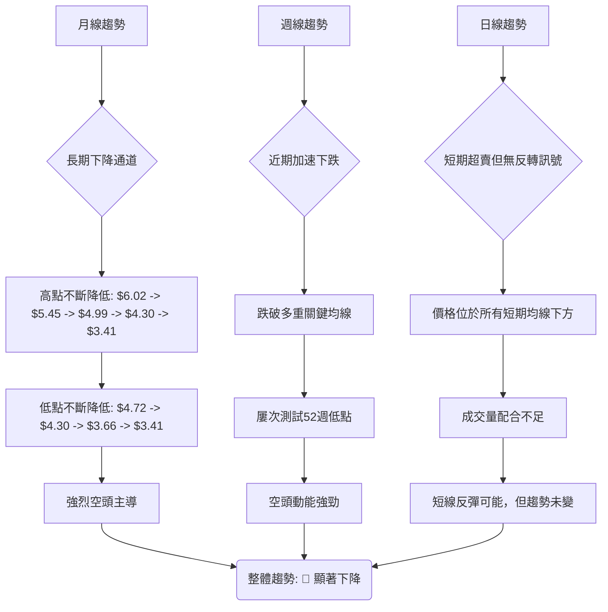
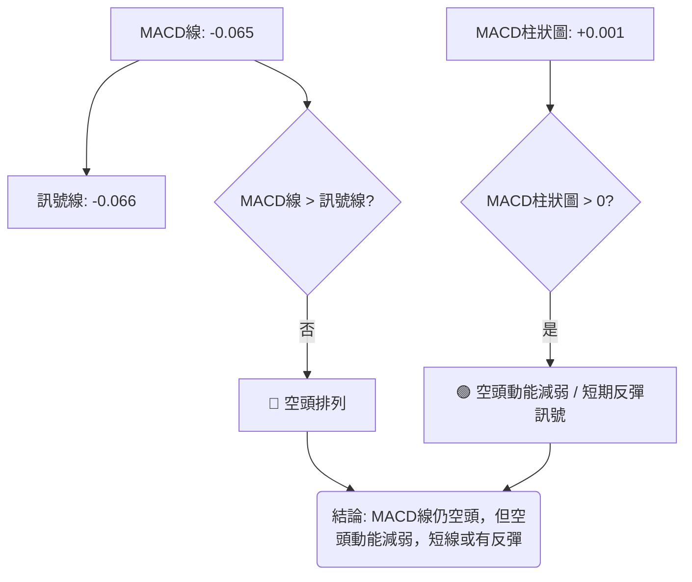

<details>
<summary>📊 靜態圖表 (點擊展開)</summary>

</details>

<html>
<head><meta charset="utf-8" /></head>
<body>
    <div style="height:500px; width:100%;">                        <script>window.PlotlyConfig = {MathJaxConfig: 'local'};</script>
        <script charset="utf-8" src="https://cdn.plot.ly/plotly-3.6.0.min.js" integrity="sha256-QaOVwtVY0T02VaHrr6pnoHLCwayMJp4O5n4YyaE3rJk=" crossorigin="anonymous"></script>                <div id="candlestick-chart" class="plotly-graph-div" style="height:100%; width:100%;"></div>            <script>                window.PLOTLYENV=window.PLOTLYENV || {};                                if (document.getElementById("candlestick-chart")) {                    Plotly.newPlot(                        "candlestick-chart",                        [{"close":{"dtype":"f8","bdata":"AAAAYGZmFEAAAABAMzMUQAAAAGC4HhRAAAAAgD0KFEAAAADAHoUUQAAAAIA9ChRAAAAAAAAAFEAAAADAzMwTQAAAAKBH4RNAAAAAgML1E0AAAADgUbgTQAAAAIAUrhNAAAAAQDMzFEAAAAAA16MUQAAAAGCPwhRAAAAAwPUoFUAAAABAMzMVQAAAAGC4HhZAAAAAAAAAGEAAAAAgXI8YQAAAACCuRxlAAAAAYGZmGEAAAABgZmYZQAAAACBcjxlAAAAAwMzMGUAAAAAgrkcZQAAAAKBH4RhAAAAAAAAAGUAAAADgo3AYQAAAAOCjcBhAAAAA4HoUGEAAAACgmZkXQAAAAEAzMxhAAAAAANejGEAAAAAgXI8ZQAAAAOB6FBlAAAAA4KNwGUAAAACAFK4YQAAAAOCjcBdAAAAA4FG4F0AAAAAA16MXQAAAAIAUrhdAAAAAQArXFkAAAAAgXI8WQAAAAIAUrhZAAAAAYGZmFkAAAABA4XoWQAAAAKBH4RZAAAAAYGZmF0AAAABA4XoYQAAAAGCPwhdAAAAAQDMzGEAAAAAghesXQAAAAIA9ChhAAAAAIK5HGEAAAAAA1yMXQAAAACBcjxZAAAAAwB6FFkAAAACgcD0WQAAAAKCZmRdAAAAAwB6FF0AAAADA9SgXQAAAAMD1KBZAAAAAANejFUAAAACA61EVQAAAACCuRxVAAAAAoHA9FUAAAAAghesTQAAAAKCZmRNAAAAAAAAAFUAAAACAwvUUQAAAACCuRxVAAAAAwMzMFUAAAADgehQVQAAAAIA9ChVAAAAA4HoUFUAAAABAMzMVQAAAAGCPwhRAAAAAANejFEAAAACgmZkUQAAAAOBRuBRAAAAA4FG4FEAAAACgmZkUQAAAAOB6FBRAAAAAwMzME0AAAABA4XoTQAAAAIAUrhNAAAAA4FG4E0AAAADgUbgUQAAAAIDrURRAAAAAwB6FFEAAAACgmZkUQAAAAGBmZhRAAAAAIK5HFEAAAACAwvUTQAAAAIDrURRAAAAAAClcFEAAAADgehQVQAAAAIDrURRAAAAAwB6FE0AAAABgZmYTQAAAACBcjxNAAAAAwPUoE0AAAADAHoUSQAAAACBcjxFAAAAAwB6FEUAAAACAPQoSQAAAAKCZmRFAAAAAQDMzEkAAAACA61ESQAAAAKBwPRJAAAAAYI\u002fCEkAAAABguB4SQAAAAKBH4RFAAAAAQDMzEUAAAAAA16MRQAAAAOB6FBFAAAAAYI\u002fCEEAAAACgmZkQQAAAAOB6FBFAAAAAgD0KEUAAAACgcD0RQAAAACCF6xBAAAAA4HoUEUAAAADAHoUQQAAAAOB6FBFAAAAAwMzMEUAAAACgmZkRQAAAAMAehRFAAAAA4FG4EEAAAACgmZkQQAAAAEAK1xBAAAAAoHA9EUAAAACgR+EQQAAAAOBRuBBAAAAAgOtREEAAAABgZmYQQAAAAGC4HhBAAAAAQArXD0AAAACAFK4PQAAAAIDC9Q5AAAAAYLgeD0AAAAAAAAAOQAAAAIAUrg1AAAAAAAAADkAAAADgUbgOQAAAAAAAAA5AAAAA4KNwDUAAAABA4XoMQAAAAGC4Hg1AAAAAgOtRDkAAAABACtcNQAAAAIAUrg1AAAAAIFyPDEAAAACgcD0MQAAAACCuRw1AAAAAAClcDUAAAACAwvUMQAAAAEDhegxAAAAAgOtRDEAAAACAPQoNQAAAAOCjcA1AAAAA4KNwDUAAAABACtcNQAAAACBcjw5AAAAAAClcD0AAAADgehQQQAAAAEAK1xBAAAAAQArXEEAAAACA61EQQAAAAKBwPRBAAAAAgBSuD0AAAABAMzMPQAAAAGC4Hg9AAAAAoEfhDkAAAAAgXI8OQAAAACBcjw5AAAAAAClcDUAAAACAwvUMQAAAAOCjcA1AAAAAwPUoDkAAAACA61EOQAAAAGCPwg1AAAAAQDMzDUAAAABguB4NQAAAAIA9Cg1AAAAAIFyPDEAAAABgZmYMQAAAAIDrUQxAAAAAAAAADEAAAADgehQMQAAAAEDhegxAAAAA4HoUDEAAAADgUbgMQAAAAGC4Hg1AAAAAgOtRDEAAAACA61EMQAAAAKBH4QxAAAAAwMzMDEAAAAAgrkcLQA=="},"high":{"dtype":"f8","bdata":"AAAAoJmZFEAAAACAPQoVQAAAAMD1KBRAAAAAIK5HFEAAAACAFK4UQAAAAEDhehRAAAAAgD0KFEAAAADgehQUQAAAAOB6FBRAAAAAgD0KFEAAAABACtcTQAAAAIDC9RNAAAAAAClcFEAAAADgUbgUQAAAAOBROBVAAAAAQDMzFUAAAAAAKVwVQAAAACCuRxZAAAAAYLgeGEAAAAAA16MYQAAAAIAUrhlAAAAAwB6FGEAAAAAAAAAaQAAAAAAAABpAAAAAgOtRGkAAAABA4XoaQAAAAOBRuBlAAAAA4HoUGUAAAACgR+EYQAAAAIAUrhhAAAAAoJmZGEAAAACgR+EYQAAAACCuRxhAAAAAoEfhGEAAAAAgrscZQAAAAGBmZhpAAAAAQInBGUAAAACgmZkZQAAAACBcjxhAAAAAIK5HGEAAAADgehQYQAAAACBcjxhAAAAAgML1F0AAAABAM7MWQAAAAIBqPBdAAAAA4FG4FkAAAABA4XoWQAAAAIA9ChdAAAAAwPWoF0AAAADAHoUYQAAAAIDC9RhAAAAAAClcGEAAAACA61EYQAAAAIDrURhAAAAAgMJ1GEAAAAAgrkcXQAAAAOCjcBdAAAAAQApXF0AAAADA9SgXQAAAAAAAABhAAAAA4KPwGEAAAADgehQYQAAAAKBH4RZAAAAAYLgeFkAAAADgehQWQAAAAIDCdRVAAAAAwB6FFUAAAAAA16MVQAAAAKBwPRRAAAAAQOF6FUAAAAAAKVwVQAAAAOCjcBVAAAAAAAAAFkAAAABA4XoVQAAAAKBwPRVAAAAAQDMzFUAAAABgZmYVQAAAAGBmZhVAAAAAIFwPFUAAAAAAKdwUQAAAAIDC9RRAAAAAYI\u002fCFEAAAADgehQVQAAAAADXoxRAAAAAQDMzFEAAAACgR+ETQAAAAKBH4RNAAAAAYLgeFEAAAABguB4VQAAAAIDC9RRAAAAAoJmZFEAAAAAA16MUQAAAACCF6xRAAAAAIFyPFEAAAAAAKVwUQAAAAMAehRRAAAAAwMzMFEAAAADgo3AVQAAAAIDrURVAAAAAQDMzFEAAAACgR+ETQAAAAKBH4RNAAAAAoJmZE0AAAACAPQoTQAAAAMAehRJAAAAAYGZmEkAAAADgUTgSQAAAAEAzMxJAAAAAYGZmEkAAAAAgXI8SQAAAAIAUrhJAAAAAgBQuE0AAAADgUbgSQAAAAOBROBJAAAAAoEfhEUAAAADgUbgRQAAAAGCPwhFAAAAAQOF6EUAAAAAA16MQQAAAAMDMTBFAAAAAAClcEUAAAABguJ4RQAAAACBcjxFAAAAAgML1EUAAAADgUTgRQAAAAEAzMxFAAAAAgD0KEkAAAABACtcRQAAAAMAeBRJAAAAAgD2KEUAAAACgmZkQQAAAAMAehRFAAAAAIK5HEUAAAABguB4RQAAAAKBH4RBAAAAAgD2KEEAAAADgepQQQAAAAMAehRBAAAAAwPUoEEAAAACAFK4PQAAAAAAAABBAAAAAwB6FD0AAAADAzMwOQAAAAEDheg5AAAAAANejDkAAAACAwvUOQAAAAEAzMw9AAAAAQArXDUAAAADgo3ANQAAAAIAUrg1AAAAAANejDkAAAACgmZkPQAAAAOBRuA5AAAAAwB6FDUAAAACAwvUMQAAAAOCjcA1AAAAAgOtRDkAAAABgj8INQAAAAAAAAA5AAAAAYI\u002fCDEAAAADgo3APQAAAAEAK1w1AAAAAwMzMDUAAAACgcD0OQAAAAOB6FA9AAAAA4FG4D0AAAAAAKVwQQAAAAGC4HhFAAAAAAAAAEUAAAACAwvUQQAAAAOCjcBBAAAAAQDMzEEAAAADA9SgQQAAAACCF6w9AAAAAAAAAD0AAAAAghesOQAAAAOBRuA5AAAAAoEfhDUAAAABAMzMNQAAAAOCjcA5AAAAAoJmZD0AAAABAMzMPQAAAAKBwPQ5AAAAA4HoUDkAAAADgo3ANQAAAAOCjcA1AAAAAgML1DEAAAAAgXI8MQAAAAMDMzAxAAAAAIFyPDEAAAACA6SYMQAAAAADXowxAAAAAgML1DEAAAACA61ENQAAAAAApXA1AAAAAgML1DEAAAAAgXI8MQAAAACCuRw1AAAAAIK5HDUAAAADgUbgMQA=="},"hovertemplate":"\u003cb\u003e%{x|%Y-%m-%d}\u003c\u002fb\u003e\u003cbr\u003e\u958b: $%{open:.2f}\u003cbr\u003e\u9ad8: $%{high:.2f}\u003cbr\u003e\u4f4e: $%{low:.2f}\u003cbr\u003e\u6536: $%{close:.2f}\u003cextra\u003e\u003c\u002fextra\u003e","low":{"dtype":"f8","bdata":"AAAAgOtRFEAAAABAMzMUQAAAAKCZmRNAAAAAAAAAFEAAAACAwvUTQAAAAIDC9RNAAAAA4FG4E0AAAABgj8ITQAAAAKCZmRNAAAAAANejE0AAAAAAKVwTQAAAACBcjxNAAAAAwB6FE0AAAACgcD0UQAAAAADXoxRAAAAAAClcFEAAAACAwvUUQAAAAKBH4RRAAAAAgD0KFkAAAADgo3AWQAAAAADXoxdAAAAAwPWoF0AAAACgcD0YQAAAACCuRxlAAAAAoEfhGEAAAACAPQoZQAAAAADXoxhAAAAAgML1F0AAAADA9SgYQAAAAOBRuBdAAAAAgML1F0AAAACA61EXQAAAAKCZmRdAAAAAoHA9GEAAAAAgXI8YQAAAAIDC9RhAAAAAIIXrGEAAAAAgrkcYQAAAAAApXBdAAAAAIFyPF0AAAADAzMwWQAAAAKCZmRdAAAAAIFyPFkAAAADA9SgWQAAAAKCZmRZAAAAAwPUoFkAAAACAFK4VQAAAAIDrURZAAAAA4HoUF0AAAAAA16MXQAAAAKCZmRdAAAAAYGZmF0AAAACAFK4XQAAAAMDMzBdAAAAAoJmZF0AAAADgo3AVQAAAAEDhehZAAAAAgBQuFkAAAADAzMwVQAAAACCF6xZAAAAAQDMzF0AAAABguB4XQAAAACCF6xVAAAAA4KNwFUAAAADgehQVQAAAAKBH4RRAAAAAAAAAFUAAAABACtcTQAAAACCuRxNAAAAAIIVrFEAAAABgj8IUQAAAAEAK1xRAAAAA4KNwFUAAAAAAAAAVQAAAAKBH4RRAAAAAoJmZFEAAAAAgrscUQAAAAOBRuBRAAAAA4KNwFEAAAACA61EUQAAAAEAzMxRAAAAAoEdhFEAAAADgo3AUQAAAAIDC9RNAAAAAgBSuE0AAAABgZmYTQAAAACBcjxNAAAAAANejE0AAAACAPQoUQAAAACCuRxRAAAAAYLgeFEAAAADAzEwUQAAAAKBHYRRAAAAAAAAAFEAAAAAghesTQAAAAIA9ChRAAAAAgOtRFEAAAABgj8IUQAAAAGCPQhRAAAAA4KNwE0AAAACA61ETQAAAAAApXBNAAAAAAAAAE0AAAACA61ESQAAAAIDrURFAAAAA4KNwEUAAAABgZmYRQAAAACBcjxFAAAAA4FG4EUAAAADgehQSQAAAAMD1KBJAAAAAAClcEkAAAACAPQoSQAAAAMAehRFAAAAAwPUoEUAAAAAAAAARQAAAAOBRuBBAAAAAoJmZEEAAAACgcD0QQAAAAIDCdRBAAAAAQArXEEAAAAAghesQQAAAAGCPwhBAAAAAwMzMEEAAAAAAAAAQQAAAAGBmZhBAAAAA4HoUEUAAAABgj0IRQAAAAIDrURFAAAAAwB6FEEAAAABAMzMQQAAAAOCnxhBAAAAAIFyPEEAAAADgUbgQQAAAAKBwPRBAAAAAAClcD0AAAACAPQoQQAAAAAAAABBAAAAAYI\u002fCD0AAAADAHoUOQAAAAMDMzA5AAAAAQOF6DkAAAABgj8INQAAAAKCZmQ1AAAAAYI\u002fCDUAAAADA9SgOQAAAAEAK1w1AAAAAIK5HDUAAAABgZmYMQAAAAOBRuAxAAAAAgML1DEAAAACgmZkNQAAAAIDrUQ1AAAAAoHA9DEAAAADgehQMQAAAAGBmZgxAAAAAYLgeDUAAAAAA16MMQAAAAEDhegxAAAAAQArXC0AAAADAzMwMQAAAAIDC9QxAAAAAQDMzDUAAAAAA16MMQAAAAGBkOw5AAAAAgBSuDkAAAABACtcPQAAAAOCjcBBAAAAA4KNwEEAAAABAMzMQQAAAAMD1KBBAAAAAQDMzD0AAAACAPQoPQAAAAKBH4Q5AAAAAgOtRDkAAAADgehQOQAAAACCF6w1AAAAAwPUoDEAAAACA61EMQAAAAOBRuAxAAAAAIIXrDUAAAADgehQOQAAAACCuRw1AAAAAgML1DEAAAACgR+EMQAAAAEDhegxAAAAAYGZmDEAAAACAFK4LQAAAAEAK1wtAAAAAIIXrC0AAAABguB4LQAAAAKCZmQtAAAAAIIXrC0AAAADgehQMQAAAAOCjcAxAAAAAQArXC0AAAABACtcLQAAAAAAAAAxAAAAAIFyPDEAAAACAPQoLQA=="},"name":"\u50f9\u683c","open":{"dtype":"f8","bdata":"AAAAwB6FFEAAAABA4XoUQAAAAMD1KBRAAAAAYLgeFEAAAADAIDAUQAAAAGBmZhRAAAAAAAAAFEAAAACAwvUTQAAAAEAK1xNAAAAAwMzME0AAAADA9agTQAAAAOBRuBNAAAAAIFyPE0AAAAAAKVwUQAAAAIAUrhRAAAAAANejFEAAAABAMzMVQAAAAMD1KBVAAAAAQDMzFkAAAACgmZkXQAAAAEDhehhAAAAAwB6FGEAAAACAPYoYQAAAACBcjxlAAAAAQOH6GEAAAAAghesZQAAAAEAzMxlAAAAAwB6FGEAAAABACtcYQAAAAIDCdRhAAAAAoHA9GEAAAADA9SgYQAAAAIDC9RdAAAAAQOF6GEAAAACgmRkZQAAAAEAzMxpAAAAAgOtRGUAAAACAPYoZQAAAAEDhehhAAAAAgML1F0AAAADA9SgXQAAAAKBwPRhAAAAAwMzMF0AAAABA4XoWQAAAAMD1KBdAAAAA4FG4FkAAAABA4XoWQAAAAIAUrhZAAAAAoEdhF0AAAAAAAAAYQAAAACCF6xhAAAAAYI\u002fCF0AAAAAAAAAYQAAAAKBH4RdAAAAAgD0KGEAAAABgj0IWQAAAAGCPQhdAAAAAwMzMFkAAAADAzMwWQAAAAKCZGRdAAAAAIFwPGEAAAABgZmYXQAAAAEAK1xZAAAAAwB6FFUAAAACAPYoVQAAAAOBROBVAAAAAQDMzFUAAAAAA16MVQAAAAIA9ChRAAAAAgBSuFEAAAADgehQVQAAAAMD1KBVAAAAAANejFUAAAAAghWsVQAAAAMAeBRVAAAAAgML1FEAAAABACtcUQAAAAMD1KBVAAAAAYI\u002fCFEAAAAAghWsUQAAAAGBmZhRAAAAA4HqUFEAAAABgj8IUQAAAAKCZmRRAAAAAQOH6E0AAAACgR+ETQAAAAKCZmRNAAAAAoEfhE0AAAADgehQUQAAAAIAUrhRAAAAAgOtRFEAAAAAgXI8UQAAAAEDhehRAAAAAgMJ1FEAAAAAgrkcUQAAAAIAULhRAAAAAwB6FFEAAAABgj8IUQAAAAGC4HhVAAAAAQDMzFEAAAABgj8ITQAAAAGBmZhNAAAAAoJmZE0AAAAAghesSQAAAAOCjcBJAAAAAgOtREkAAAACAPYoRQAAAAEAzMxJAAAAAwMzMEUAAAADgehQSQAAAAKBwPRJAAAAAAClcEkAAAACAFK4SQAAAAMD1KBJAAAAAgBSuEUAAAABguB4RQAAAAMD1qBFAAAAAgOtREUAAAADAHoUQQAAAAKBH4RBAAAAAYLgeEUAAAADA9SgRQAAAAOCjcBFAAAAAwMzMEEAAAACAwvUQQAAAAGCPwhBAAAAAoHA9EUAAAADgepQRQAAAAOCjcBFAAAAAwMxMEUAAAADgo3AQQAAAAAAAABFAAAAA4FG4EEAAAADAzMwQQAAAAADXoxBAAAAAYLgeEEAAAADgo3AQQAAAAAApXBBAAAAAIFwPEEAAAAAgrkcPQAAAAIAUrg9AAAAAwMzMDkAAAAAA16MOQAAAAGC4Hg5AAAAAIIXrDUAAAACgcD0OQAAAAKCZmQ5AAAAAYI\u002fCDUAAAABAMzMNQAAAAMDMzAxAAAAAQDMzDUAAAAAA16MOQAAAAGBmZg1AAAAA4KNwDUAAAADgUbgMQAAAAMDMzAxAAAAAAAAADkAAAACAwvUMQAAAAKBH4QxAAAAAwB6FDEAAAABACtcOQAAAAIA9Cg1AAAAAoJmZDUAAAABAMzMNQAAAAKBwPQ5AAAAAwMzMDkAAAAAAAAAQQAAAAEDhehBAAAAAYLieEEAAAACgR+EQQAAAAAApXBBAAAAAQDMzEEAAAADgehQQQAAAAEAzMw9AAAAAwMzMDkAAAACgR+EOQAAAACBcjw5AAAAA4FG4DUAAAADgehQNQAAAAAApXA5AAAAAwMzMDkAAAAAgXI8OQAAAAMD1KA5AAAAAgBSuDUAAAAAAKVwNQAAAAAApXA1AAAAAgML1DEAAAACA61EMQAAAAGC4HgxAAAAAgOtRDEAAAADgehQMQAAAAAAAAAxAAAAAQOF6DEAAAAAgrkcMQAAAAEDhegxAAAAAgML1DEAAAACgcD0MQAAAAMD1KAxAAAAAoEfhDEAAAAAA16MMQA=="},"x":["2025-08-18T00:00:00-04:00","2025-08-19T00:00:00-04:00","2025-08-20T00:00:00-04:00","2025-08-21T00:00:00-04:00","2025-08-22T00:00:00-04:00","2025-08-25T00:00:00-04:00","2025-08-26T00:00:00-04:00","2025-08-27T00:00:00-04:00","2025-08-28T00:00:00-04:00","2025-08-29T00:00:00-04:00","2025-09-02T00:00:00-04:00","2025-09-03T00:00:00-04:00","2025-09-04T00:00:00-04:00","2025-09-05T00:00:00-04:00","2025-09-08T00:00:00-04:00","2025-09-09T00:00:00-04:00","2025-09-10T00:00:00-04:00","2025-09-11T00:00:00-04:00","2025-09-12T00:00:00-04:00","2025-09-15T00:00:00-04:00","2025-09-16T00:00:00-04:00","2025-09-17T00:00:00-04:00","2025-09-18T00:00:00-04:00","2025-09-19T00:00:00-04:00","2025-09-22T00:00:00-04:00","2025-09-23T00:00:00-04:00","2025-09-24T00:00:00-04:00","2025-09-25T00:00:00-04:00","2025-09-26T00:00:00-04:00","2025-09-29T00:00:00-04:00","2025-09-30T00:00:00-04:00","2025-10-01T00:00:00-04:00","2025-10-02T00:00:00-04:00","2025-10-03T00:00:00-04:00","2025-10-06T00:00:00-04:00","2025-10-07T00:00:00-04:00","2025-10-08T00:00:00-04:00","2025-10-09T00:00:00-04:00","2025-10-10T00:00:00-04:00","2025-10-13T00:00:00-04:00","2025-10-14T00:00:00-04:00","2025-10-15T00:00:00-04:00","2025-10-16T00:00:00-04:00","2025-10-17T00:00:00-04:00","2025-10-20T00:00:00-04:00","2025-10-21T00:00:00-04:00","2025-10-22T00:00:00-04:00","2025-10-23T00:00:00-04:00","2025-10-24T00:00:00-04:00","2025-10-27T00:00:00-04:00","2025-10-28T00:00:00-04:00","2025-10-29T00:00:00-04:00","2025-10-30T00:00:00-04:00","2025-10-31T00:00:00-04:00","2025-11-03T00:00:00-05:00","2025-11-04T00:00:00-05:00","2025-11-05T00:00:00-05:00","2025-11-06T00:00:00-05:00","2025-11-07T00:00:00-05:00","2025-11-10T00:00:00-05:00","2025-11-11T00:00:00-05:00","2025-11-12T00:00:00-05:00","2025-11-13T00:00:00-05:00","2025-11-14T00:00:00-05:00","2025-11-17T00:00:00-05:00","2025-11-18T00:00:00-05:00","2025-11-19T00:00:00-05:00","2025-11-20T00:00:00-05:00","2025-11-21T00:00:00-05:00","2025-11-24T00:00:00-05:00","2025-11-25T00:00:00-05:00","2025-11-26T00:00:00-05:00","2025-11-28T00:00:00-05:00","2025-12-01T00:00:00-05:00","2025-12-02T00:00:00-05:00","2025-12-03T00:00:00-05:00","2025-12-04T00:00:00-05:00","2025-12-05T00:00:00-05:00","2025-12-08T00:00:00-05:00","2025-12-09T00:00:00-05:00","2025-12-10T00:00:00-05:00","2025-12-11T00:00:00-05:00","2025-12-12T00:00:00-05:00","2025-12-15T00:00:00-05:00","2025-12-16T00:00:00-05:00","2025-12-17T00:00:00-05:00","2025-12-18T00:00:00-05:00","2025-12-19T00:00:00-05:00","2025-12-22T00:00:00-05:00","2025-12-23T00:00:00-05:00","2025-12-24T00:00:00-05:00","2025-12-26T00:00:00-05:00","2025-12-29T00:00:00-05:00","2025-12-30T00:00:00-05:00","2025-12-31T00:00:00-05:00","2026-01-02T00:00:00-05:00","2026-01-05T00:00:00-05:00","2026-01-06T00:00:00-05:00","2026-01-07T00:00:00-05:00","2026-01-08T00:00:00-05:00","2026-01-09T00:00:00-05:00","2026-01-12T00:00:00-05:00","2026-01-13T00:00:00-05:00","2026-01-14T00:00:00-05:00","2026-01-15T00:00:00-05:00","2026-01-16T00:00:00-05:00","2026-01-20T00:00:00-05:00","2026-01-21T00:00:00-05:00","2026-01-22T00:00:00-05:00","2026-01-23T00:00:00-05:00","2026-01-26T00:00:00-05:00","2026-01-27T00:00:00-05:00","2026-01-28T00:00:00-05:00","2026-01-29T00:00:00-05:00","2026-01-30T00:00:00-05:00","2026-02-02T00:00:00-05:00","2026-02-03T00:00:00-05:00","2026-02-04T00:00:00-05:00","2026-02-05T00:00:00-05:00","2026-02-06T00:00:00-05:00","2026-02-09T00:00:00-05:00","2026-02-10T00:00:00-05:00","2026-02-11T00:00:00-05:00","2026-02-12T00:00:00-05:00","2026-02-13T00:00:00-05:00","2026-02-17T00:00:00-05:00","2026-02-18T00:00:00-05:00","2026-02-19T00:00:00-05:00","2026-02-20T00:00:00-05:00","2026-02-23T00:00:00-05:00","2026-02-24T00:00:00-05:00","2026-02-25T00:00:00-05:00","2026-02-26T00:00:00-05:00","2026-02-27T00:00:00-05:00","2026-03-02T00:00:00-05:00","2026-03-03T00:00:00-05:00","2026-03-04T00:00:00-05:00","2026-03-05T00:00:00-05:00","2026-03-06T00:00:00-05:00","2026-03-09T00:00:00-04:00","2026-03-10T00:00:00-04:00","2026-03-11T00:00:00-04:00","2026-03-12T00:00:00-04:00","2026-03-13T00:00:00-04:00","2026-03-16T00:00:00-04:00","2026-03-17T00:00:00-04:00","2026-03-18T00:00:00-04:00","2026-03-19T00:00:00-04:00","2026-03-20T00:00:00-04:00","2026-03-23T00:00:00-04:00","2026-03-24T00:00:00-04:00","2026-03-25T00:00:00-04:00","2026-03-26T00:00:00-04:00","2026-03-27T00:00:00-04:00","2026-03-30T00:00:00-04:00","2026-03-31T00:00:00-04:00","2026-04-01T00:00:00-04:00","2026-04-02T00:00:00-04:00","2026-04-06T00:00:00-04:00","2026-04-07T00:00:00-04:00","2026-04-08T00:00:00-04:00","2026-04-09T00:00:00-04:00","2026-04-10T00:00:00-04:00","2026-04-13T00:00:00-04:00","2026-04-14T00:00:00-04:00","2026-04-15T00:00:00-04:00","2026-04-16T00:00:00-04:00","2026-04-17T00:00:00-04:00","2026-04-20T00:00:00-04:00","2026-04-21T00:00:00-04:00","2026-04-22T00:00:00-04:00","2026-04-23T00:00:00-04:00","2026-04-24T00:00:00-04:00","2026-04-27T00:00:00-04:00","2026-04-28T00:00:00-04:00","2026-04-29T00:00:00-04:00","2026-04-30T00:00:00-04:00","2026-05-01T00:00:00-04:00","2026-05-04T00:00:00-04:00","2026-05-05T00:00:00-04:00","2026-05-06T00:00:00-04:00","2026-05-07T00:00:00-04:00","2026-05-08T00:00:00-04:00","2026-05-11T00:00:00-04:00","2026-05-12T00:00:00-04:00","2026-05-13T00:00:00-04:00","2026-05-14T00:00:00-04:00","2026-05-15T00:00:00-04:00","2026-05-18T00:00:00-04:00","2026-05-19T00:00:00-04:00","2026-05-20T00:00:00-04:00","2026-05-21T00:00:00-04:00","2026-05-22T00:00:00-04:00","2026-05-26T00:00:00-04:00","2026-05-27T00:00:00-04:00","2026-05-28T00:00:00-04:00","2026-05-29T00:00:00-04:00","2026-06-01T00:00:00-04:00","2026-06-02T00:00:00-04:00","2026-06-03T00:00:00-04:00"],"type":"candlestick"},{"hovertemplate":"MA30: $%{y:.2f}\u003cextra\u003e\u003c\u002fextra\u003e","line":{"color":"#2196F3","dash":"dash","width":2},"mode":"lines","name":"MA30","x":["2025-08-18T00:00:00-04:00","2025-08-19T00:00:00-04:00","2025-08-20T00:00:00-04:00","2025-08-21T00:00:00-04:00","2025-08-22T00:00:00-04:00","2025-08-25T00:00:00-04:00","2025-08-26T00:00:00-04:00","2025-08-27T00:00:00-04:00","2025-08-28T00:00:00-04:00","2025-08-29T00:00:00-04:00","2025-09-02T00:00:00-04:00","2025-09-03T00:00:00-04:00","2025-09-04T00:00:00-04:00","2025-09-05T00:00:00-04:00","2025-09-08T00:00:00-04:00","2025-09-09T00:00:00-04:00","2025-09-10T00:00:00-04:00","2025-09-11T00:00:00-04:00","2025-09-12T00:00:00-04:00","2025-09-15T00:00:00-04:00","2025-09-16T00:00:00-04:00","2025-09-17T00:00:00-04:00","2025-09-18T00:00:00-04:00","2025-09-19T00:00:00-04:00","2025-09-22T00:00:00-04:00","2025-09-23T00:00:00-04:00","2025-09-24T00:00:00-04:00","2025-09-25T00:00:00-04:00","2025-09-26T00:00:00-04:00","2025-09-29T00:00:00-04:00","2025-09-30T00:00:00-04:00","2025-10-01T00:00:00-04:00","2025-10-02T00:00:00-04:00","2025-10-03T00:00:00-04:00","2025-10-06T00:00:00-04:00","2025-10-07T00:00:00-04:00","2025-10-08T00:00:00-04:00","2025-10-09T00:00:00-04:00","2025-10-10T00:00:00-04:00","2025-10-13T00:00:00-04:00","2025-10-14T00:00:00-04:00","2025-10-15T00:00:00-04:00","2025-10-16T00:00:00-04:00","2025-10-17T00:00:00-04:00","2025-10-20T00:00:00-04:00","2025-10-21T00:00:00-04:00","2025-10-22T00:00:00-04:00","2025-10-23T00:00:00-04:00","2025-10-24T00:00:00-04:00","2025-10-27T00:00:00-04:00","2025-10-28T00:00:00-04:00","2025-10-29T00:00:00-04:00","2025-10-30T00:00:00-04:00","2025-10-31T00:00:00-04:00","2025-11-03T00:00:00-05:00","2025-11-04T00:00:00-05:00","2025-11-05T00:00:00-05:00","2025-11-06T00:00:00-05:00","2025-11-07T00:00:00-05:00","2025-11-10T00:00:00-05:00","2025-11-11T00:00:00-05:00","2025-11-12T00:00:00-05:00","2025-11-13T00:00:00-05:00","2025-11-14T00:00:00-05:00","2025-11-17T00:00:00-05:00","2025-11-18T00:00:00-05:00","2025-11-19T00:00:00-05:00","2025-11-20T00:00:00-05:00","2025-11-21T00:00:00-05:00","2025-11-24T00:00:00-05:00","2025-11-25T00:00:00-05:00","2025-11-26T00:00:00-05:00","2025-11-28T00:00:00-05:00","2025-12-01T00:00:00-05:00","2025-12-02T00:00:00-05:00","2025-12-03T00:00:00-05:00","2025-12-04T00:00:00-05:00","2025-12-05T00:00:00-05:00","2025-12-08T00:00:00-05:00","2025-12-09T00:00:00-05:00","2025-12-10T00:00:00-05:00","2025-12-11T00:00:00-05:00","2025-12-12T00:00:00-05:00","2025-12-15T00:00:00-05:00","2025-12-16T00:00:00-05:00","2025-12-17T00:00:00-05:00","2025-12-18T00:00:00-05:00","2025-12-19T00:00:00-05:00","2025-12-22T00:00:00-05:00","2025-12-23T00:00:00-05:00","2025-12-24T00:00:00-05:00","2025-12-26T00:00:00-05:00","2025-12-29T00:00:00-05:00","2025-12-30T00:00:00-05:00","2025-12-31T00:00:00-05:00","2026-01-02T00:00:00-05:00","2026-01-05T00:00:00-05:00","2026-01-06T00:00:00-05:00","2026-01-07T00:00:00-05:00","2026-01-08T00:00:00-05:00","2026-01-09T00:00:00-05:00","2026-01-12T00:00:00-05:00","2026-01-13T00:00:00-05:00","2026-01-14T00:00:00-05:00","2026-01-15T00:00:00-05:00","2026-01-16T00:00:00-05:00","2026-01-20T00:00:00-05:00","2026-01-21T00:00:00-05:00","2026-01-22T00:00:00-05:00","2026-01-23T00:00:00-05:00","2026-01-26T00:00:00-05:00","2026-01-27T00:00:00-05:00","2026-01-28T00:00:00-05:00","2026-01-29T00:00:00-05:00","2026-01-30T00:00:00-05:00","2026-02-02T00:00:00-05:00","2026-02-03T00:00:00-05:00","2026-02-04T00:00:00-05:00","2026-02-05T00:00:00-05:00","2026-02-06T00:00:00-05:00","2026-02-09T00:00:00-05:00","2026-02-10T00:00:00-05:00","2026-02-11T00:00:00-05:00","2026-02-12T00:00:00-05:00","2026-02-13T00:00:00-05:00","2026-02-17T00:00:00-05:00","2026-02-18T00:00:00-05:00","2026-02-19T00:00:00-05:00","2026-02-20T00:00:00-05:00","2026-02-23T00:00:00-05:00","2026-02-24T00:00:00-05:00","2026-02-25T00:00:00-05:00","2026-02-26T00:00:00-05:00","2026-02-27T00:00:00-05:00","2026-03-02T00:00:00-05:00","2026-03-03T00:00:00-05:00","2026-03-04T00:00:00-05:00","2026-03-05T00:00:00-05:00","2026-03-06T00:00:00-05:00","2026-03-09T00:00:00-04:00","2026-03-10T00:00:00-04:00","2026-03-11T00:00:00-04:00","2026-03-12T00:00:00-04:00","2026-03-13T00:00:00-04:00","2026-03-16T00:00:00-04:00","2026-03-17T00:00:00-04:00","2026-03-18T00:00:00-04:00","2026-03-19T00:00:00-04:00","2026-03-20T00:00:00-04:00","2026-03-23T00:00:00-04:00","2026-03-24T00:00:00-04:00","2026-03-25T00:00:00-04:00","2026-03-26T00:00:00-04:00","2026-03-27T00:00:00-04:00","2026-03-30T00:00:00-04:00","2026-03-31T00:00:00-04:00","2026-04-01T00:00:00-04:00","2026-04-02T00:00:00-04:00","2026-04-06T00:00:00-04:00","2026-04-07T00:00:00-04:00","2026-04-08T00:00:00-04:00","2026-04-09T00:00:00-04:00","2026-04-10T00:00:00-04:00","2026-04-13T00:00:00-04:00","2026-04-14T00:00:00-04:00","2026-04-15T00:00:00-04:00","2026-04-16T00:00:00-04:00","2026-04-17T00:00:00-04:00","2026-04-20T00:00:00-04:00","2026-04-21T00:00:00-04:00","2026-04-22T00:00:00-04:00","2026-04-23T00:00:00-04:00","2026-04-24T00:00:00-04:00","2026-04-27T00:00:00-04:00","2026-04-28T00:00:00-04:00","2026-04-29T00:00:00-04:00","2026-04-30T00:00:00-04:00","2026-05-01T00:00:00-04:00","2026-05-04T00:00:00-04:00","2026-05-05T00:00:00-04:00","2026-05-06T00:00:00-04:00","2026-05-07T00:00:00-04:00","2026-05-08T00:00:00-04:00","2026-05-11T00:00:00-04:00","2026-05-12T00:00:00-04:00","2026-05-13T00:00:00-04:00","2026-05-14T00:00:00-04:00","2026-05-15T00:00:00-04:00","2026-05-18T00:00:00-04:00","2026-05-19T00:00:00-04:00","2026-05-20T00:00:00-04:00","2026-05-21T00:00:00-04:00","2026-05-22T00:00:00-04:00","2026-05-26T00:00:00-04:00","2026-05-27T00:00:00-04:00","2026-05-28T00:00:00-04:00","2026-05-29T00:00:00-04:00","2026-06-01T00:00:00-04:00","2026-06-02T00:00:00-04:00","2026-06-03T00:00:00-04:00"],"y":{"dtype":"f8","bdata":"AAAAAAAA+H8AAAAAAAD4fwAAAAAAAPh\u002fAAAAAAAA+H8AAAAAAAD4fwAAAAAAAPh\u002fAAAAAAAA+H8AAAAAAAD4fwAAAAAAAPh\u002fAAAAAAAA+H8AAAAAAAD4fwAAAAAAAPh\u002fAAAAAAAA+H8AAAAAAAD4fwAAAAAAAPh\u002fAAAAAAAA+H8AAAAAAAD4fwAAAAAAAPh\u002fAAAAAAAA+H8AAAAAAAD4fwAAAAAAAPh\u002fAAAAAAAA+H8AAAAAAAD4fwAAAAAAAPh\u002fAAAAAAAA+H8AAAAAAAD4fwAAAAAAAPh\u002fAAAAAAAA+H8AAAAAAAD4f+\u002fu7j7DLhZAREREVCpOFkDe3d29LWsWQDMzM6P+jRZAzczMfD+1FkCJiIiIQeAWQERERJRDCxdAERERca85F0B3d3f3U2MXQImIiOi0gRdAERERwcqhF0AAAAAgPsMXQCIiIkJg5RdAzczMbOf7F0Crqqq6SQwYQImIiAisHBhAq6qq2kAnGEDe3d0NLTIYQLy7u0upOBhAMzMzk4ozGEAAAADQ2zIYQCIiIlLjJRhAq6qqai4kGEDv7u5OjRcYQCIiItKUChhAVVVVVZz9F0De3d1tWesXQAAAAFCN1xdAvLu7q2PCF0AiIiKyna8XQAAAALByqBdAmpmZWaujF0B3d3cn6p8XQERERLSBjhdAq6qqGuh0F0Dv7u6uuVAXQFVVVXVMMBdAq6qqanUMF0CamZkJ1+MWQN7d3W0SwxZAAAAAgNyrFkAzMzPz\u002fZQWQCIiIhKDgBZAd3d3J6N3FkC8u7sLAmsWQJqZmWkDXRZARERE1L9RFkARERGh00YWQLy7u2u8NBZAvLu7Gy8dFkDv7u4eE\u002fwVQDMzMyMi4hVAVVVV9W\u002fEFUDv7u5OG6gVQN7d3Y1QhhVAd3d31xVgFUAzMzNz2kAVQO\u002fu7v5GKBVAzczMTGIQFUDv7u7OaQMVQJqZmYls5xRAAAAA8NLNFECJiIiI+rcUQBEREcH1qBRAq6qqylqdFEAzMzPTv5EUQLy7u6uOiRRAiYiISAyCFEB3d3dX8osUQERERDQXkhRAiYiIGHaFFECamZk5JngUQDMzM9N4aRRAiYiIqPFSFEARERFBGT0UQDMzMxNnHxRAMzMzIwYBFEAzMzMDD+YTQDMzM+MXyxNAERERoUW2E0BERETk0KITQAAAAECnjRNAERERke18E0DNzMzsw2cTQDMzM\u002fP9VBNAq6qqKs4+E0AAAACgGi8TQGZmZtbqGBNA7+7unqj\u002fEkCJiIhYgNwSQFVVVXXawBJAiYiISCijEkAAAABAfIYSQDMzMxPKaBJAERERkXtNEkBmZmbGIDASQDMzM+N6FBJAq6qqeqL+EUDe3d1N8OARQM3MzJwLyRFAq6qq6iaxEUCamZk5QpkRQLy7u0sMghFA3t3d\u002falxEUCrqqpaq2MRQImIiFiAXBFAd3d350JSEUBEREREREQRQImIiCijNxFAvLu7ay4kEUB3d3fHBA8RQHd3d3d39xBA3t3d9SjcEEDv7u42icEQQERERDyYpxBAq6qqQtKUEEBmZmaGXYEQQCIiIrKdbxBAd3d3PzVeEEB3d3e\u002fEUoQQJqZmbmQNBBAzczMzIUkEEDv7u6uuRAQQFVVVbXz\u002fQ9AIiIiUirOD0Dv7u6ONKUPQJqZmQmQew9A3t3djVBGD0AAAAAQEREPQFVVVYUW2Q5AZmZmtmWtDkDe3d0N5okOQCIiIqK3ZQ5AZmZmlrU6DkCJiIg4QhkOQERERMSuAA5AERERkcL1DUB3d3d3TPANQBERETGW\u002fA1AvLu7u0kMDkAiIiLiehQOQAAAAGBzIQ5AZmZmtjomDkB3d3cneDAOQCIiIuLBPA5AVVVVRUREDkDv7u6+5kIOQFVVVRWuRw5AIiIiUv9GDkBVVVXlF0sOQCIiIvLSTQ5AvLu7a3VMDkDv7u7+jVAOQCIiIsI8UQ5AzczM3LJWDkARERFBNV4OQHd3d\u002fcoXA5AZmZmVlVVDkAAAAAAjlAOQJqZmXkwTw5AzczMbHVMDkBVVVVFREQOQN7d3R0TPA5AZmZmJngwDkCJiIh46SYOQO\u002fu7r6fGg5AMzMzw64ADkB3d3cn6t8NQERERGT0tg1A3t3d3U+NDUBVVVXFkl8NQA=="},"type":"scatter"},{"hovertemplate":"MA60: $%{y:.2f}\u003cextra\u003e\u003c\u002fextra\u003e","line":{"color":"#9C27B0","dash":"dash","width":2},"mode":"lines","name":"MA60","x":["2025-08-18T00:00:00-04:00","2025-08-19T00:00:00-04:00","2025-08-20T00:00:00-04:00","2025-08-21T00:00:00-04:00","2025-08-22T00:00:00-04:00","2025-08-25T00:00:00-04:00","2025-08-26T00:00:00-04:00","2025-08-27T00:00:00-04:00","2025-08-28T00:00:00-04:00","2025-08-29T00:00:00-04:00","2025-09-02T00:00:00-04:00","2025-09-03T00:00:00-04:00","2025-09-04T00:00:00-04:00","2025-09-05T00:00:00-04:00","2025-09-08T00:00:00-04:00","2025-09-09T00:00:00-04:00","2025-09-10T00:00:00-04:00","2025-09-11T00:00:00-04:00","2025-09-12T00:00:00-04:00","2025-09-15T00:00:00-04:00","2025-09-16T00:00:00-04:00","2025-09-17T00:00:00-04:00","2025-09-18T00:00:00-04:00","2025-09-19T00:00:00-04:00","2025-09-22T00:00:00-04:00","2025-09-23T00:00:00-04:00","2025-09-24T00:00:00-04:00","2025-09-25T00:00:00-04:00","2025-09-26T00:00:00-04:00","2025-09-29T00:00:00-04:00","2025-09-30T00:00:00-04:00","2025-10-01T00:00:00-04:00","2025-10-02T00:00:00-04:00","2025-10-03T00:00:00-04:00","2025-10-06T00:00:00-04:00","2025-10-07T00:00:00-04:00","2025-10-08T00:00:00-04:00","2025-10-09T00:00:00-04:00","2025-10-10T00:00:00-04:00","2025-10-13T00:00:00-04:00","2025-10-14T00:00:00-04:00","2025-10-15T00:00:00-04:00","2025-10-16T00:00:00-04:00","2025-10-17T00:00:00-04:00","2025-10-20T00:00:00-04:00","2025-10-21T00:00:00-04:00","2025-10-22T00:00:00-04:00","2025-10-23T00:00:00-04:00","2025-10-24T00:00:00-04:00","2025-10-27T00:00:00-04:00","2025-10-28T00:00:00-04:00","2025-10-29T00:00:00-04:00","2025-10-30T00:00:00-04:00","2025-10-31T00:00:00-04:00","2025-11-03T00:00:00-05:00","2025-11-04T00:00:00-05:00","2025-11-05T00:00:00-05:00","2025-11-06T00:00:00-05:00","2025-11-07T00:00:00-05:00","2025-11-10T00:00:00-05:00","2025-11-11T00:00:00-05:00","2025-11-12T00:00:00-05:00","2025-11-13T00:00:00-05:00","2025-11-14T00:00:00-05:00","2025-11-17T00:00:00-05:00","2025-11-18T00:00:00-05:00","2025-11-19T00:00:00-05:00","2025-11-20T00:00:00-05:00","2025-11-21T00:00:00-05:00","2025-11-24T00:00:00-05:00","2025-11-25T00:00:00-05:00","2025-11-26T00:00:00-05:00","2025-11-28T00:00:00-05:00","2025-12-01T00:00:00-05:00","2025-12-02T00:00:00-05:00","2025-12-03T00:00:00-05:00","2025-12-04T00:00:00-05:00","2025-12-05T00:00:00-05:00","2025-12-08T00:00:00-05:00","2025-12-09T00:00:00-05:00","2025-12-10T00:00:00-05:00","2025-12-11T00:00:00-05:00","2025-12-12T00:00:00-05:00","2025-12-15T00:00:00-05:00","2025-12-16T00:00:00-05:00","2025-12-17T00:00:00-05:00","2025-12-18T00:00:00-05:00","2025-12-19T00:00:00-05:00","2025-12-22T00:00:00-05:00","2025-12-23T00:00:00-05:00","2025-12-24T00:00:00-05:00","2025-12-26T00:00:00-05:00","2025-12-29T00:00:00-05:00","2025-12-30T00:00:00-05:00","2025-12-31T00:00:00-05:00","2026-01-02T00:00:00-05:00","2026-01-05T00:00:00-05:00","2026-01-06T00:00:00-05:00","2026-01-07T00:00:00-05:00","2026-01-08T00:00:00-05:00","2026-01-09T00:00:00-05:00","2026-01-12T00:00:00-05:00","2026-01-13T00:00:00-05:00","2026-01-14T00:00:00-05:00","2026-01-15T00:00:00-05:00","2026-01-16T00:00:00-05:00","2026-01-20T00:00:00-05:00","2026-01-21T00:00:00-05:00","2026-01-22T00:00:00-05:00","2026-01-23T00:00:00-05:00","2026-01-26T00:00:00-05:00","2026-01-27T00:00:00-05:00","2026-01-28T00:00:00-05:00","2026-01-29T00:00:00-05:00","2026-01-30T00:00:00-05:00","2026-02-02T00:00:00-05:00","2026-02-03T00:00:00-05:00","2026-02-04T00:00:00-05:00","2026-02-05T00:00:00-05:00","2026-02-06T00:00:00-05:00","2026-02-09T00:00:00-05:00","2026-02-10T00:00:00-05:00","2026-02-11T00:00:00-05:00","2026-02-12T00:00:00-05:00","2026-02-13T00:00:00-05:00","2026-02-17T00:00:00-05:00","2026-02-18T00:00:00-05:00","2026-02-19T00:00:00-05:00","2026-02-20T00:00:00-05:00","2026-02-23T00:00:00-05:00","2026-02-24T00:00:00-05:00","2026-02-25T00:00:00-05:00","2026-02-26T00:00:00-05:00","2026-02-27T00:00:00-05:00","2026-03-02T00:00:00-05:00","2026-03-03T00:00:00-05:00","2026-03-04T00:00:00-05:00","2026-03-05T00:00:00-05:00","2026-03-06T00:00:00-05:00","2026-03-09T00:00:00-04:00","2026-03-10T00:00:00-04:00","2026-03-11T00:00:00-04:00","2026-03-12T00:00:00-04:00","2026-03-13T00:00:00-04:00","2026-03-16T00:00:00-04:00","2026-03-17T00:00:00-04:00","2026-03-18T00:00:00-04:00","2026-03-19T00:00:00-04:00","2026-03-20T00:00:00-04:00","2026-03-23T00:00:00-04:00","2026-03-24T00:00:00-04:00","2026-03-25T00:00:00-04:00","2026-03-26T00:00:00-04:00","2026-03-27T00:00:00-04:00","2026-03-30T00:00:00-04:00","2026-03-31T00:00:00-04:00","2026-04-01T00:00:00-04:00","2026-04-02T00:00:00-04:00","2026-04-06T00:00:00-04:00","2026-04-07T00:00:00-04:00","2026-04-08T00:00:00-04:00","2026-04-09T00:00:00-04:00","2026-04-10T00:00:00-04:00","2026-04-13T00:00:00-04:00","2026-04-14T00:00:00-04:00","2026-04-15T00:00:00-04:00","2026-04-16T00:00:00-04:00","2026-04-17T00:00:00-04:00","2026-04-20T00:00:00-04:00","2026-04-21T00:00:00-04:00","2026-04-22T00:00:00-04:00","2026-04-23T00:00:00-04:00","2026-04-24T00:00:00-04:00","2026-04-27T00:00:00-04:00","2026-04-28T00:00:00-04:00","2026-04-29T00:00:00-04:00","2026-04-30T00:00:00-04:00","2026-05-01T00:00:00-04:00","2026-05-04T00:00:00-04:00","2026-05-05T00:00:00-04:00","2026-05-06T00:00:00-04:00","2026-05-07T00:00:00-04:00","2026-05-08T00:00:00-04:00","2026-05-11T00:00:00-04:00","2026-05-12T00:00:00-04:00","2026-05-13T00:00:00-04:00","2026-05-14T00:00:00-04:00","2026-05-15T00:00:00-04:00","2026-05-18T00:00:00-04:00","2026-05-19T00:00:00-04:00","2026-05-20T00:00:00-04:00","2026-05-21T00:00:00-04:00","2026-05-22T00:00:00-04:00","2026-05-26T00:00:00-04:00","2026-05-27T00:00:00-04:00","2026-05-28T00:00:00-04:00","2026-05-29T00:00:00-04:00","2026-06-01T00:00:00-04:00","2026-06-02T00:00:00-04:00","2026-06-03T00:00:00-04:00"],"y":{"dtype":"f8","bdata":"AAAAAAAA+H8AAAAAAAD4fwAAAAAAAPh\u002fAAAAAAAA+H8AAAAAAAD4fwAAAAAAAPh\u002fAAAAAAAA+H8AAAAAAAD4fwAAAAAAAPh\u002fAAAAAAAA+H8AAAAAAAD4fwAAAAAAAPh\u002fAAAAAAAA+H8AAAAAAAD4fwAAAAAAAPh\u002fAAAAAAAA+H8AAAAAAAD4fwAAAAAAAPh\u002fAAAAAAAA+H8AAAAAAAD4fwAAAAAAAPh\u002fAAAAAAAA+H8AAAAAAAD4fwAAAAAAAPh\u002fAAAAAAAA+H8AAAAAAAD4fwAAAAAAAPh\u002fAAAAAAAA+H8AAAAAAAD4fwAAAAAAAPh\u002fAAAAAAAA+H8AAAAAAAD4fwAAAAAAAPh\u002fAAAAAAAA+H8AAAAAAAD4fwAAAAAAAPh\u002fAAAAAAAA+H8AAAAAAAD4fwAAAAAAAPh\u002fAAAAAAAA+H8AAAAAAAD4fwAAAAAAAPh\u002fAAAAAAAA+H8AAAAAAAD4fwAAAAAAAPh\u002fAAAAAAAA+H8AAAAAAAD4fwAAAAAAAPh\u002fAAAAAAAA+H8AAAAAAAD4fwAAAAAAAPh\u002fAAAAAAAA+H8AAAAAAAD4fwAAAAAAAPh\u002fAAAAAAAA+H8AAAAAAAD4fwAAAAAAAPh\u002fAAAAAAAA+H8AAAAAAAD4f3d3d\u002fea6xZA7+7u1ur4FkCrqqryiwUXQLy7uytADhdAvLu7yxMVF0C8u7ubfRgXQM3MzATIHRdA3t3dbRIjF0CJiIiAlSMXQDMzM6tjIhdAiYiIoNMmF0CamZkJHiwXQCIiIqrxMhdAIiIiSsU5F0AzMzPjpTsXQBEREbnXPBdAd3d3V4A8F0B3d3dXgDwXQLy7u9uyNhdAd3d311woF0B3d3d3dxcXQKuqqroCBBdAAAAAME\u002f0FkDv7u5O1N8WQAAAALByyBZAZmZmFtmuFkCJiIjwGZYWQHd3dyfqfxZARERE\u002fGJpFkCJiIjAg1kWQM3MzJzvRxZAzczMJL84FkAAAABY8isWQKuqqrq7GxZAq6qqciEJFkARERHBPPEVQImIiJDt3BVAmpmZ2UDHFUCJiIiw5LcVQBEREdGUqhVARERETKmYFUBmZmYWkoYVQKuqqvL9dBVAAAAAaEplFUBmZmamDVQVQGZmZj41PhVAvLu7+2IpFUAiIiJScRYVQHd3dyfq\u002fxRAZmZmXrrpFECamZkBcs8UQJqZmbHktxRAMzMzw66gFEDe3d2d74cUQImIiECnbRRAERERAXJPFECamZmJ+jcUQKuqquqYIBRA3t3ddQUIFEC8u7sT9e8TQHd3d38j1BNAREREnH24E0BERERkO58TQCIiIurfiBNA3t3dLWt1E0DNzMxM8GATQHd3d8cETxNAmpmZYVdAE0CrqqpScTYTQImIiGiRLRNAmpmZgU4bE0CamZk5tAgTQHd3d4\u002fC9RJAMzMz003iEkDe3d1NYtASQN7d3bXzvRJAVVVVhaSpEkC8u7ujKZUSQN7d3YVdgRJAZmZmBjptEkDe3d3V6lgSQLy7u1uPQhJAd3d3Q4ssEkDe3d2RphQSQLy7uxdL\u002fhFAq6qqNtDpEUAzMzMTPNgRQERERERExBFAMzMz7+6uEUAAAAAMSZMRQHd3d5e1ehFAq6qqCtdjEUB3d3f3mksRQO\u002fu7vbhMxFAERERXUgaEUDv7u6GXQERQAAAAHQh6RBAzczMYOXQEEDv7u5qvLQQQLy7u2\u002fLmhBA7+7u4uyDEEBERESgGm8QQGZmZg50WhBAiYiIZIJHEEB3d3c7JjgQQFVVVd1rLhBAAAAAGJImEEAAAABANR4QQImIiCD3GhBAzczMpCkVEEBEREQcoQwQQLy7u5MYBBBAERERUUbvD0CrqqpKxdkPQFVVVS35xQ9AVVVVZfS2D0De3d3l0KIPQM3MzLx0kw9AiYiI6LSBD0AiIiKynW8PQKuqqjJ6Ww9Aq6qqgsBKD0BmZmauADkPQLy7uzuYJw9Ad3d3l24SD0AAAADotAEPQImIiIDc6w5AIiIi8tLNDkAAAACIz7AOQHd3d38jlA5AmpmZke18DkCamZkpFWcOQAAAAGDlUA5AZmZm3pY1DkCJiIjYFSAOQJqZmUGnDQ5AIiIiqjj7DUB3d3dPG+gNQKuqqkrF2Q1AzczMzMzMDUC8u7vTBroNQA=="},"type":"scatter"},{"hovertemplate":"MA200: $%{y:.2f}\u003cextra\u003e\u003c\u002fextra\u003e","line":{"color":"#FF6F00","dash":"solid","width":2},"mode":"lines","name":"MA200","x":["2025-08-18T00:00:00-04:00","2025-08-19T00:00:00-04:00","2025-08-20T00:00:00-04:00","2025-08-21T00:00:00-04:00","2025-08-22T00:00:00-04:00","2025-08-25T00:00:00-04:00","2025-08-26T00:00:00-04:00","2025-08-27T00:00:00-04:00","2025-08-28T00:00:00-04:00","2025-08-29T00:00:00-04:00","2025-09-02T00:00:00-04:00","2025-09-03T00:00:00-04:00","2025-09-04T00:00:00-04:00","2025-09-05T00:00:00-04:00","2025-09-08T00:00:00-04:00","2025-09-09T00:00:00-04:00","2025-09-10T00:00:00-04:00","2025-09-11T00:00:00-04:00","2025-09-12T00:00:00-04:00","2025-09-15T00:00:00-04:00","2025-09-16T00:00:00-04:00","2025-09-17T00:00:00-04:00","2025-09-18T00:00:00-04:00","2025-09-19T00:00:00-04:00","2025-09-22T00:00:00-04:00","2025-09-23T00:00:00-04:00","2025-09-24T00:00:00-04:00","2025-09-25T00:00:00-04:00","2025-09-26T00:00:00-04:00","2025-09-29T00:00:00-04:00","2025-09-30T00:00:00-04:00","2025-10-01T00:00:00-04:00","2025-10-02T00:00:00-04:00","2025-10-03T00:00:00-04:00","2025-10-06T00:00:00-04:00","2025-10-07T00:00:00-04:00","2025-10-08T00:00:00-04:00","2025-10-09T00:00:00-04:00","2025-10-10T00:00:00-04:00","2025-10-13T00:00:00-04:00","2025-10-14T00:00:00-04:00","2025-10-15T00:00:00-04:00","2025-10-16T00:00:00-04:00","2025-10-17T00:00:00-04:00","2025-10-20T00:00:00-04:00","2025-10-21T00:00:00-04:00","2025-10-22T00:00:00-04:00","2025-10-23T00:00:00-04:00","2025-10-24T00:00:00-04:00","2025-10-27T00:00:00-04:00","2025-10-28T00:00:00-04:00","2025-10-29T00:00:00-04:00","2025-10-30T00:00:00-04:00","2025-10-31T00:00:00-04:00","2025-11-03T00:00:00-05:00","2025-11-04T00:00:00-05:00","2025-11-05T00:00:00-05:00","2025-11-06T00:00:00-05:00","2025-11-07T00:00:00-05:00","2025-11-10T00:00:00-05:00","2025-11-11T00:00:00-05:00","2025-11-12T00:00:00-05:00","2025-11-13T00:00:00-05:00","2025-11-14T00:00:00-05:00","2025-11-17T00:00:00-05:00","2025-11-18T00:00:00-05:00","2025-11-19T00:00:00-05:00","2025-11-20T00:00:00-05:00","2025-11-21T00:00:00-05:00","2025-11-24T00:00:00-05:00","2025-11-25T00:00:00-05:00","2025-11-26T00:00:00-05:00","2025-11-28T00:00:00-05:00","2025-12-01T00:00:00-05:00","2025-12-02T00:00:00-05:00","2025-12-03T00:00:00-05:00","2025-12-04T00:00:00-05:00","2025-12-05T00:00:00-05:00","2025-12-08T00:00:00-05:00","2025-12-09T00:00:00-05:00","2025-12-10T00:00:00-05:00","2025-12-11T00:00:00-05:00","2025-12-12T00:00:00-05:00","2025-12-15T00:00:00-05:00","2025-12-16T00:00:00-05:00","2025-12-17T00:00:00-05:00","2025-12-18T00:00:00-05:00","2025-12-19T00:00:00-05:00","2025-12-22T00:00:00-05:00","2025-12-23T00:00:00-05:00","2025-12-24T00:00:00-05:00","2025-12-26T00:00:00-05:00","2025-12-29T00:00:00-05:00","2025-12-30T00:00:00-05:00","2025-12-31T00:00:00-05:00","2026-01-02T00:00:00-05:00","2026-01-05T00:00:00-05:00","2026-01-06T00:00:00-05:00","2026-01-07T00:00:00-05:00","2026-01-08T00:00:00-05:00","2026-01-09T00:00:00-05:00","2026-01-12T00:00:00-05:00","2026-01-13T00:00:00-05:00","2026-01-14T00:00:00-05:00","2026-01-15T00:00:00-05:00","2026-01-16T00:00:00-05:00","2026-01-20T00:00:00-05:00","2026-01-21T00:00:00-05:00","2026-01-22T00:00:00-05:00","2026-01-23T00:00:00-05:00","2026-01-26T00:00:00-05:00","2026-01-27T00:00:00-05:00","2026-01-28T00:00:00-05:00","2026-01-29T00:00:00-05:00","2026-01-30T00:00:00-05:00","2026-02-02T00:00:00-05:00","2026-02-03T00:00:00-05:00","2026-02-04T00:00:00-05:00","2026-02-05T00:00:00-05:00","2026-02-06T00:00:00-05:00","2026-02-09T00:00:00-05:00","2026-02-10T00:00:00-05:00","2026-02-11T00:00:00-05:00","2026-02-12T00:00:00-05:00","2026-02-13T00:00:00-05:00","2026-02-17T00:00:00-05:00","2026-02-18T00:00:00-05:00","2026-02-19T00:00:00-05:00","2026-02-20T00:00:00-05:00","2026-02-23T00:00:00-05:00","2026-02-24T00:00:00-05:00","2026-02-25T00:00:00-05:00","2026-02-26T00:00:00-05:00","2026-02-27T00:00:00-05:00","2026-03-02T00:00:00-05:00","2026-03-03T00:00:00-05:00","2026-03-04T00:00:00-05:00","2026-03-05T00:00:00-05:00","2026-03-06T00:00:00-05:00","2026-03-09T00:00:00-04:00","2026-03-10T00:00:00-04:00","2026-03-11T00:00:00-04:00","2026-03-12T00:00:00-04:00","2026-03-13T00:00:00-04:00","2026-03-16T00:00:00-04:00","2026-03-17T00:00:00-04:00","2026-03-18T00:00:00-04:00","2026-03-19T00:00:00-04:00","2026-03-20T00:00:00-04:00","2026-03-23T00:00:00-04:00","2026-03-24T00:00:00-04:00","2026-03-25T00:00:00-04:00","2026-03-26T00:00:00-04:00","2026-03-27T00:00:00-04:00","2026-03-30T00:00:00-04:00","2026-03-31T00:00:00-04:00","2026-04-01T00:00:00-04:00","2026-04-02T00:00:00-04:00","2026-04-06T00:00:00-04:00","2026-04-07T00:00:00-04:00","2026-04-08T00:00:00-04:00","2026-04-09T00:00:00-04:00","2026-04-10T00:00:00-04:00","2026-04-13T00:00:00-04:00","2026-04-14T00:00:00-04:00","2026-04-15T00:00:00-04:00","2026-04-16T00:00:00-04:00","2026-04-17T00:00:00-04:00","2026-04-20T00:00:00-04:00","2026-04-21T00:00:00-04:00","2026-04-22T00:00:00-04:00","2026-04-23T00:00:00-04:00","2026-04-24T00:00:00-04:00","2026-04-27T00:00:00-04:00","2026-04-28T00:00:00-04:00","2026-04-29T00:00:00-04:00","2026-04-30T00:00:00-04:00","2026-05-01T00:00:00-04:00","2026-05-04T00:00:00-04:00","2026-05-05T00:00:00-04:00","2026-05-06T00:00:00-04:00","2026-05-07T00:00:00-04:00","2026-05-08T00:00:00-04:00","2026-05-11T00:00:00-04:00","2026-05-12T00:00:00-04:00","2026-05-13T00:00:00-04:00","2026-05-14T00:00:00-04:00","2026-05-15T00:00:00-04:00","2026-05-18T00:00:00-04:00","2026-05-19T00:00:00-04:00","2026-05-20T00:00:00-04:00","2026-05-21T00:00:00-04:00","2026-05-22T00:00:00-04:00","2026-05-26T00:00:00-04:00","2026-05-27T00:00:00-04:00","2026-05-28T00:00:00-04:00","2026-05-29T00:00:00-04:00","2026-06-01T00:00:00-04:00","2026-06-02T00:00:00-04:00","2026-06-03T00:00:00-04:00"],"y":{"dtype":"f8","bdata":"AAAAAAAA+H8AAAAAAAD4fwAAAAAAAPh\u002fAAAAAAAA+H8AAAAAAAD4fwAAAAAAAPh\u002fAAAAAAAA+H8AAAAAAAD4fwAAAAAAAPh\u002fAAAAAAAA+H8AAAAAAAD4fwAAAAAAAPh\u002fAAAAAAAA+H8AAAAAAAD4fwAAAAAAAPh\u002fAAAAAAAA+H8AAAAAAAD4fwAAAAAAAPh\u002fAAAAAAAA+H8AAAAAAAD4fwAAAAAAAPh\u002fAAAAAAAA+H8AAAAAAAD4fwAAAAAAAPh\u002fAAAAAAAA+H8AAAAAAAD4fwAAAAAAAPh\u002fAAAAAAAA+H8AAAAAAAD4fwAAAAAAAPh\u002fAAAAAAAA+H8AAAAAAAD4fwAAAAAAAPh\u002fAAAAAAAA+H8AAAAAAAD4fwAAAAAAAPh\u002fAAAAAAAA+H8AAAAAAAD4fwAAAAAAAPh\u002fAAAAAAAA+H8AAAAAAAD4fwAAAAAAAPh\u002fAAAAAAAA+H8AAAAAAAD4fwAAAAAAAPh\u002fAAAAAAAA+H8AAAAAAAD4fwAAAAAAAPh\u002fAAAAAAAA+H8AAAAAAAD4fwAAAAAAAPh\u002fAAAAAAAA+H8AAAAAAAD4fwAAAAAAAPh\u002fAAAAAAAA+H8AAAAAAAD4fwAAAAAAAPh\u002fAAAAAAAA+H8AAAAAAAD4fwAAAAAAAPh\u002fAAAAAAAA+H8AAAAAAAD4fwAAAAAAAPh\u002fAAAAAAAA+H8AAAAAAAD4fwAAAAAAAPh\u002fAAAAAAAA+H8AAAAAAAD4fwAAAAAAAPh\u002fAAAAAAAA+H8AAAAAAAD4fwAAAAAAAPh\u002fAAAAAAAA+H8AAAAAAAD4fwAAAAAAAPh\u002fAAAAAAAA+H8AAAAAAAD4fwAAAAAAAPh\u002fAAAAAAAA+H8AAAAAAAD4fwAAAAAAAPh\u002fAAAAAAAA+H8AAAAAAAD4fwAAAAAAAPh\u002fAAAAAAAA+H8AAAAAAAD4fwAAAAAAAPh\u002fAAAAAAAA+H8AAAAAAAD4fwAAAAAAAPh\u002fAAAAAAAA+H8AAAAAAAD4fwAAAAAAAPh\u002fAAAAAAAA+H8AAAAAAAD4fwAAAAAAAPh\u002fAAAAAAAA+H8AAAAAAAD4fwAAAAAAAPh\u002fAAAAAAAA+H8AAAAAAAD4fwAAAAAAAPh\u002fAAAAAAAA+H8AAAAAAAD4fwAAAAAAAPh\u002fAAAAAAAA+H8AAAAAAAD4fwAAAAAAAPh\u002fAAAAAAAA+H8AAAAAAAD4fwAAAAAAAPh\u002fAAAAAAAA+H8AAAAAAAD4fwAAAAAAAPh\u002fAAAAAAAA+H8AAAAAAAD4fwAAAAAAAPh\u002fAAAAAAAA+H8AAAAAAAD4fwAAAAAAAPh\u002fAAAAAAAA+H8AAAAAAAD4fwAAAAAAAPh\u002fAAAAAAAA+H8AAAAAAAD4fwAAAAAAAPh\u002fAAAAAAAA+H8AAAAAAAD4fwAAAAAAAPh\u002fAAAAAAAA+H8AAAAAAAD4fwAAAAAAAPh\u002fAAAAAAAA+H8AAAAAAAD4fwAAAAAAAPh\u002fAAAAAAAA+H8AAAAAAAD4fwAAAAAAAPh\u002fAAAAAAAA+H8AAAAAAAD4fwAAAAAAAPh\u002fAAAAAAAA+H8AAAAAAAD4fwAAAAAAAPh\u002fAAAAAAAA+H8AAAAAAAD4fwAAAAAAAPh\u002fAAAAAAAA+H8AAAAAAAD4fwAAAAAAAPh\u002fAAAAAAAA+H8AAAAAAAD4fwAAAAAAAPh\u002fAAAAAAAA+H8AAAAAAAD4fwAAAAAAAPh\u002fAAAAAAAA+H8AAAAAAAD4fwAAAAAAAPh\u002fAAAAAAAA+H8AAAAAAAD4fwAAAAAAAPh\u002fAAAAAAAA+H8AAAAAAAD4fwAAAAAAAPh\u002fAAAAAAAA+H8AAAAAAAD4fwAAAAAAAPh\u002fAAAAAAAA+H8AAAAAAAD4fwAAAAAAAPh\u002fAAAAAAAA+H8AAAAAAAD4fwAAAAAAAPh\u002fAAAAAAAA+H8AAAAAAAD4fwAAAAAAAPh\u002fAAAAAAAA+H8AAAAAAAD4fwAAAAAAAPh\u002fAAAAAAAA+H8AAAAAAAD4fwAAAAAAAPh\u002fAAAAAAAA+H8AAAAAAAD4fwAAAAAAAPh\u002fAAAAAAAA+H8AAAAAAAD4fwAAAAAAAPh\u002fAAAAAAAA+H8AAAAAAAD4fwAAAAAAAPh\u002fAAAAAAAA+H8AAAAAAAD4fwAAAAAAAPh\u002fAAAAAAAA+H8AAAAAAAD4fwAAAAAAAPh\u002fAAAAAAAA+H+4HoUdOPcSQA=="},"type":"scatter"}],                        {"template":{"data":{"barpolar":[{"marker":{"line":{"color":"rgb(17,17,17)","width":0.5},"pattern":{"fillmode":"overlay","size":10,"solidity":0.2}},"type":"barpolar"}],"bar":[{"error_x":{"color":"#f2f5fa"},"error_y":{"color":"#f2f5fa"},"marker":{"line":{"color":"rgb(17,17,17)","width":0.5},"pattern":{"fillmode":"overlay","size":10,"solidity":0.2}},"type":"bar"}],"carpet":[{"aaxis":{"endlinecolor":"#A2B1C6","gridcolor":"#506784","linecolor":"#506784","minorgridcolor":"#506784","startlinecolor":"#A2B1C6"},"baxis":{"endlinecolor":"#A2B1C6","gridcolor":"#506784","linecolor":"#506784","minorgridcolor":"#506784","startlinecolor":"#A2B1C6"},"type":"carpet"}],"choropleth":[{"colorbar":{"outlinewidth":0,"ticks":""},"type":"choropleth"}],"contourcarpet":[{"colorbar":{"outlinewidth":0,"ticks":""},"type":"contourcarpet"}],"contour":[{"colorbar":{"outlinewidth":0,"ticks":""},"colorscale":[[0.0,"#0d0887"],[0.1111111111111111,"#46039f"],[0.2222222222222222,"#7201a8"],[0.3333333333333333,"#9c179e"],[0.4444444444444444,"#bd3786"],[0.5555555555555556,"#d8576b"],[0.6666666666666666,"#ed7953"],[0.7777777777777778,"#fb9f3a"],[0.8888888888888888,"#fdca26"],[1.0,"#f0f921"]],"type":"contour"}],"heatmap":[{"colorbar":{"outlinewidth":0,"ticks":""},"colorscale":[[0.0,"#0d0887"],[0.1111111111111111,"#46039f"],[0.2222222222222222,"#7201a8"],[0.3333333333333333,"#9c179e"],[0.4444444444444444,"#bd3786"],[0.5555555555555556,"#d8576b"],[0.6666666666666666,"#ed7953"],[0.7777777777777778,"#fb9f3a"],[0.8888888888888888,"#fdca26"],[1.0,"#f0f921"]],"type":"heatmap"}],"histogram2dcontour":[{"colorbar":{"outlinewidth":0,"ticks":""},"colorscale":[[0.0,"#0d0887"],[0.1111111111111111,"#46039f"],[0.2222222222222222,"#7201a8"],[0.3333333333333333,"#9c179e"],[0.4444444444444444,"#bd3786"],[0.5555555555555556,"#d8576b"],[0.6666666666666666,"#ed7953"],[0.7777777777777778,"#fb9f3a"],[0.8888888888888888,"#fdca26"],[1.0,"#f0f921"]],"type":"histogram2dcontour"}],"histogram2d":[{"colorbar":{"outlinewidth":0,"ticks":""},"colorscale":[[0.0,"#0d0887"],[0.1111111111111111,"#46039f"],[0.2222222222222222,"#7201a8"],[0.3333333333333333,"#9c179e"],[0.4444444444444444,"#bd3786"],[0.5555555555555556,"#d8576b"],[0.6666666666666666,"#ed7953"],[0.7777777777777778,"#fb9f3a"],[0.8888888888888888,"#fdca26"],[1.0,"#f0f921"]],"type":"histogram2d"}],"histogram":[{"marker":{"pattern":{"fillmode":"overlay","size":10,"solidity":0.2}},"type":"histogram"}],"mesh3d":[{"colorbar":{"outlinewidth":0,"ticks":""},"type":"mesh3d"}],"parcoords":[{"line":{"colorbar":{"outlinewidth":0,"ticks":""}},"type":"parcoords"}],"pie":[{"automargin":true,"type":"pie"}],"scatter3d":[{"line":{"colorbar":{"outlinewidth":0,"ticks":""}},"marker":{"colorbar":{"outlinewidth":0,"ticks":""}},"type":"scatter3d"}],"scattercarpet":[{"marker":{"colorbar":{"outlinewidth":0,"ticks":""}},"type":"scattercarpet"}],"scattergeo":[{"marker":{"colorbar":{"outlinewidth":0,"ticks":""}},"type":"scattergeo"}],"scattergl":[{"marker":{"line":{"color":"#283442"}},"type":"scattergl"}],"scattermapbox":[{"marker":{"colorbar":{"outlinewidth":0,"ticks":""}},"type":"scattermapbox"}],"scattermap":[{"marker":{"colorbar":{"outlinewidth":0,"ticks":""}},"type":"scattermap"}],"scatterpolargl":[{"marker":{"colorbar":{"outlinewidth":0,"ticks":""}},"type":"scatterpolargl"}],"scatterpolar":[{"marker":{"colorbar":{"outlinewidth":0,"ticks":""}},"type":"scatterpolar"}],"scatter":[{"marker":{"line":{"color":"#283442"}},"type":"scatter"}],"scatterternary":[{"marker":{"colorbar":{"outlinewidth":0,"ticks":""}},"type":"scatterternary"}],"surface":[{"colorbar":{"outlinewidth":0,"ticks":""},"colorscale":[[0.0,"#0d0887"],[0.1111111111111111,"#46039f"],[0.2222222222222222,"#7201a8"],[0.3333333333333333,"#9c179e"],[0.4444444444444444,"#bd3786"],[0.5555555555555556,"#d8576b"],[0.6666666666666666,"#ed7953"],[0.7777777777777778,"#fb9f3a"],[0.8888888888888888,"#fdca26"],[1.0,"#f0f921"]],"type":"surface"}],"table":[{"cells":{"fill":{"color":"#506784"},"line":{"color":"rgb(17,17,17)"}},"header":{"fill":{"color":"#2a3f5f"},"line":{"color":"rgb(17,17,17)"}},"type":"table"}]},"layout":{"annotationdefaults":{"arrowcolor":"#f2f5fa","arrowhead":0,"arrowwidth":1},"autotypenumbers":"strict","coloraxis":{"colorbar":{"outlinewidth":0,"ticks":""}},"colorscale":{"diverging":[[0,"#8e0152"],[0.1,"#c51b7d"],[0.2,"#de77ae"],[0.3,"#f1b6da"],[0.4,"#fde0ef"],[0.5,"#f7f7f7"],[0.6,"#e6f5d0"],[0.7,"#b8e186"],[0.8,"#7fbc41"],[0.9,"#4d9221"],[1,"#276419"]],"sequential":[[0.0,"#0d0887"],[0.1111111111111111,"#46039f"],[0.2222222222222222,"#7201a8"],[0.3333333333333333,"#9c179e"],[0.4444444444444444,"#bd3786"],[0.5555555555555556,"#d8576b"],[0.6666666666666666,"#ed7953"],[0.7777777777777778,"#fb9f3a"],[0.8888888888888888,"#fdca26"],[1.0,"#f0f921"]],"sequentialminus":[[0.0,"#0d0887"],[0.1111111111111111,"#46039f"],[0.2222222222222222,"#7201a8"],[0.3333333333333333,"#9c179e"],[0.4444444444444444,"#bd3786"],[0.5555555555555556,"#d8576b"],[0.6666666666666666,"#ed7953"],[0.7777777777777778,"#fb9f3a"],[0.8888888888888888,"#fdca26"],[1.0,"#f0f921"]]},"colorway":["#636efa","#EF553B","#00cc96","#ab63fa","#FFA15A","#19d3f3","#FF6692","#B6E880","#FF97FF","#FECB52"],"font":{"color":"#f2f5fa"},"geo":{"bgcolor":"rgb(17,17,17)","lakecolor":"rgb(17,17,17)","landcolor":"rgb(17,17,17)","showlakes":true,"showland":true,"subunitcolor":"#506784"},"hoverlabel":{"align":"left"},"hovermode":"closest","mapbox":{"style":"dark"},"paper_bgcolor":"rgb(17,17,17)","plot_bgcolor":"rgb(17,17,17)","polar":{"angularaxis":{"gridcolor":"#506784","linecolor":"#506784","ticks":""},"bgcolor":"rgb(17,17,17)","radialaxis":{"gridcolor":"#506784","linecolor":"#506784","ticks":""}},"scene":{"xaxis":{"backgroundcolor":"rgb(17,17,17)","gridcolor":"#506784","gridwidth":2,"linecolor":"#506784","showbackground":true,"ticks":"","zerolinecolor":"#C8D4E3"},"yaxis":{"backgroundcolor":"rgb(17,17,17)","gridcolor":"#506784","gridwidth":2,"linecolor":"#506784","showbackground":true,"ticks":"","zerolinecolor":"#C8D4E3"},"zaxis":{"backgroundcolor":"rgb(17,17,17)","gridcolor":"#506784","gridwidth":2,"linecolor":"#506784","showbackground":true,"ticks":"","zerolinecolor":"#C8D4E3"}},"shapedefaults":{"line":{"color":"#f2f5fa"}},"sliderdefaults":{"bgcolor":"#C8D4E3","bordercolor":"rgb(17,17,17)","borderwidth":1,"tickwidth":0},"ternary":{"aaxis":{"gridcolor":"#506784","linecolor":"#506784","ticks":""},"baxis":{"gridcolor":"#506784","linecolor":"#506784","ticks":""},"bgcolor":"rgb(17,17,17)","caxis":{"gridcolor":"#506784","linecolor":"#506784","ticks":""}},"title":{"x":0.05},"updatemenudefaults":{"bgcolor":"#506784","borderwidth":0},"xaxis":{"automargin":true,"gridcolor":"#283442","linecolor":"#506784","ticks":"","title":{"standoff":15},"zerolinecolor":"#283442","zerolinewidth":2},"yaxis":{"automargin":true,"gridcolor":"#283442","linecolor":"#506784","ticks":"","title":{"standoff":15},"zerolinecolor":"#283442","zerolinewidth":2}}},"xaxis":{"rangeslider":{"visible":false},"title":{"text":"\u65e5\u671f"}},"font":{"size":11},"title":{"text":"GRAB  |  MA(30\u002f60\u002f200)  |  \u6700\u8fd1200\u4ea4\u6613\u65e5"},"yaxis":{"title":{"text":"\u80a1\u50f9 (USD)"}},"hovermode":"x unified","height":500},                        {"responsive": true}                    )                };            </script>        </div>
</body>
</html>

# GRAB 技術分析報告

> **報告日期**：2026-06-03 ｜ **語言**：繁體中文 ｜ **數據來源**：Yahoo Finance ｜ **當前價格**：$3.41

---

## 目錄

| 章節 | 內容 |
|------|------|
| [1. 技術面概覽](#1-技術面概覽) | 訊號儀表板、核心指標、評分卡 |
| [2. 趨勢分析](#2-趨勢分析) | 多時框趨勢、長中短期走勢 |
| [3. 圖表形態分析](#3-圖表形態分析) | 形態識別、K線組合、目標價 |
| [4. 支撐與阻力](#4-支撐與阻力) | 關鍵價位、斐波那契回調 |
| [5. 技術指標深度解讀](#5-技術指標深度解讀) | MA/RSI/MACD/布林/成交量 |
| [6. 動能與波動率](#6-動能與波動率) | 動能評估、ATR、Beta |
| [7. 多時框架總結](#7-多時框架總結) | 時框架評分矩陣 |
| [8. 交易策略建議](#8-交易策略建議) | 多空策略、風險報酬比 |
| [9. 風險提示與監控](#9-風險提示與監控) | 監控指標、風險場景 |
| [📋 報告總結](#-報告總結) | 綜合結論與建議 |

---

## 1. 技術面概覽

### 🎯 技術訊號儀表板

GRAB 目前的技術面呈現出明顯的空頭主導格局，儘管存在一些潛在的超賣反彈訊號，但整體趨勢和動能指標均指向下行。價格正處於52週低點附近，且遠低於所有關鍵移動平均線，顯示出市場的強烈悲觀情緒。



**儀表板解讀**：
目前多頭訊號極為稀少且強度不足，主要來自於短期超賣狀態和MACD柱狀圖的微弱轉正，這通常僅預示著潛在的短期反彈，而非趨勢反轉。中性訊號則反映了當前趨勢的疲弱，市場可能處於盤整或弱勢下跌階段。然而，空頭訊號佔據主導地位，特別是價格與均線的關係以及量能配合的疲弱，強烈指出GRAB仍處於下降趨勢中。綜合來看，市場情緒極度悲觀，任何反彈都可能面臨強大阻力。

### 📊 核心指標速覽表

以下表格彙整了GRAB當前的核心技術指標，並提供初步的訊號判斷與解讀。

| 指標類別 | 指標名稱 | 當前數值 | 訊號 | 解讀 |
|----------|----------|----------|------|------|
| **價格** | 當前價格 | $3.41 | 🔴 | 位於52週低點附近，顯示極度弱勢 |
| **均線** | MA20 | $3.59 | 🔴 | 價格位於MA20下方，短期趨勢看空 |
| **均線** | MA50 | $3.71 | 🔴 | 價格位於MA50下方，中期趨勢看空 |
| **均線** | MA200 | $4.74 | 🔴 | 價格位於MA200下方，長期趨勢看空 |
| **動能** | RSI(14) | 35.14 | 🟡 | 接近超賣區間(30)，但尚未進入，中性偏空 |
| **動能** | MACD | -0.065 | 🔴 | MACD線位於訊號線下方，空頭動能主導 |
| **動能** | MACD Hist | +0.001 | 🟢 | 柱狀圖轉正，顯示空頭動能減弱，或有短線反彈機會 |
| **動能** | Stoch %K | 10.34 | 🟢 | 進入超賣區，預示可能出現反彈 |
| **趨勢** | ADX(14) | 12.51 | 🟡 | 趨勢強度極弱，市場處於盤整或無趨勢狀態 |
| **趨勢** | +DI/-DI | 17.11/26.96 | 🔴 | -DI高於+DI，空頭主導市場方向 |
| **波動** | ATR(14) | $0.13 | 🟡 | 每日波動約3.71%，中等波動水平 |
| **布林** | BB %B | 0.01 | 🟢 | 價格觸及布林通道下軌，極端超賣，有反彈需求 |
| **成交量** | OBV趨勢 | OBV < MA | 🔴 | 量能疲弱，未確認價格底部，空頭趨勢持續 |

### 🏆 技術評分卡

根據上述核心指標與趨勢分析，我們對GRAB的技術面進行評分。

```
╔══════════════════════════════════════════════════════════════╗
║             技術評分卡 — GRAB (2026-06-03)                   ║
╠══════════════════════════════════════════════════════════════╣
║  趨勢強度      ██░░░░░░░░░░░░░░░░░░  10/100  🔴               ║
║  動能指標      ████░░░░░░░░░░░░░░░░  20/100  🔴               ║
║  支撐穩定度    ██████░░░░░░░░░░░░░░  30/100  🟡               ║
║  成交量配合    ██░░░░░░░░░░░░░░░░░░  10/100  🔴               ║
║  形態完整度    ████░░░░░░░░░░░░░░░░  20/100  🔴               ║
║  均線排列      █░░░░░░░░░░░░░░░░░░░░  05/100  🔴               ║
╠══════════════════════════════════════════════════════════════╣
║  綜合評分      ████░░░░░░░░░░░░░░░░  20/100  🔴 (極度弱勢)    ║
╚══════════════════════════════════════════════════════════════╝
```

**評分卡解讀**：
GRAB的技術評分卡顯示整體技術面極度疲弱，綜合評分僅為20/100，處於「極度弱勢」評級。各項指標中，趨勢強度、動能、成交量配合和均線排列均指向強烈空頭，幾乎沒有任何多頭訊號。雖然價格處於關鍵支撐位附近，且有超賣跡象，但支撐的穩定性仍待確認，且缺乏量能配合，使得反彈難以持續。建議投資者對此標的保持極度謹慎。

---

## 2. 趨勢分析

### 🌐 多時框趨勢分析

多時框架分析是判斷股票整體健康狀況的關鍵。GRAB在月線、週線和日線層面均呈現出明顯的弱勢和下降趨勢，顯示市場對其前景的持續悲觀。



**多時框趨勢解讀**：
- **月線（長期）**：GRAB自2025年9月的高點$6.02以來，一直處於明顯的下降趨勢中。高點和低點均持續降低，形成一個清晰的下降通道。當前價格$3.41已跌破2024年中的低點，顯示長期趨勢極為疲弱，空頭勢力牢牢掌握主導權。
- **週線（中期）**：從過去20週的數據來看，GRAB在2026年4月19日達到$4.21後，便開始了一波加速下跌，期間雖有小幅反彈，但均未能突破關鍵阻力。價格已跌破MA20、MA50等重要中期均線，並持續創下新低。這種中期趨勢的加速惡化，印證了長期趨勢的悲觀。
- **日線（短期）**：當前價格$3.41位於MA5、MA10、MA20等所有短期均線下方，均線呈現空頭排列。雖然RSI和Stochastic指標顯示短期超賣，且布林通道觸及下軌，但缺乏強勁的買盤量能配合，使得任何反彈都顯得脆弱。短期內，價格可能在當前低點附近進行盤整或嘗試小幅反彈，但要逆轉整體下降趨勢，需要更強大的催化劑和量能。

### 📈 長期趨勢 — 12個月走勢圖（Unicode）

以下是GRAB過去12個月的月線收盤價格走勢圖，清晰展示了其從上升趨勢轉為下降趨勢的過程，並標註了關鍵高低點。

```
GRAB 月線走勢圖（過去12個月：2025年6月 - 2026年6月）
價格軸 ($)
$6.02 ┤                                        ● (2025-09 高點)
$5.03 ┤● (2025-06)         ● (2025-11)
$4.89 ┤  ● (2025-07)
$4.53 ┤                      ● (2026-01)
$4.22 ┤                                        ● (2026-02)
$3.82 ┤                                            ● (2026-04)
$3.66 ┤                                          ● (2026-03)
$3.41 ┤                                              ● (2026-06 現在)
$3.38 ┤                                            ○ (52W 低點)
     └───────────────────────────────────────────────────────────
      2025-06 07  08  09  10  11  12  2026-01 02  03  04  05  06
```

**走勢特徵分析表格**：

| 月份區間 | 收盤價範圍 | 漲跌幅 | 趨勢特徵 | 關鍵事件 |
|----------|------------|--------|----------|----------|
| 2025-06 ~ 2025-09 | $5.03 ~ $6.02 | +19.68% | 上升趨勢，創年內新高 | 達到長期高點，吸引多頭關注 |
| 2025-09 ~ 2025-12 | $6.02 ~ $4.99 | -17.00% | 首次明顯回調，形成高點 | 趨勢反轉初步訊號，跌破短期支撐 |
| 2026-01 ~ 2026-02 | $4.30 ~ $4.22 | -1.86% | 短期盤整後續跌 | 空頭動能積累，未能有效反彈 |
| 2026-03 ~ 2026-04 | $3.66 ~ $3.82 | +4.37% | 嘗試反彈，但受阻於壓力位 | 反彈力度不足，未能突破中期均線 |
| 2026-05 ~ 2026-06 | $3.54 ~ $3.41 | -3.67% | 再次下跌，逼近52週低點 | 空頭趨勢延續，市場信心低迷 |

**長期趨勢總結**：
GRAB的長期走勢在2025年9月達到$6.02的峰值後，便開始了持續的下跌。儘管期間有零星的反彈嘗試，但每次反彈都未能突破前高，且隨後都被更強的賣壓打回原形。當前價格$3.41已接近52週低點$3.38，並創下過去12個月的新低，顯示長期空頭格局已確立。

### 📊 中期趨勢（週線分析）

中期趨勢的分析將聚焦於GRAB近期的價格行為和關鍵支撐阻力位。從20週的數據來看，GRAB的中期走勢在經歷了4月份的短暫反彈後，再次陷入了強烈的下行趨勢。

**近期壓力與支撐示意圖（週線）**：

```
GRAB 週線關鍵價位示意圖
══════════════════════════════════════════════════════════════
$4.21 ║                  ┌───┐ (2026-04-19 高點)
$3.90 ║                  │   │
$3.72 ║──────────────────┼───┼───────────────────R2 (MA60, 中期阻力)
$3.59 ║                  │   │───────────────────R1 (MA20, 近期阻力)
$3.41 ╠══════════════════╣現價╠══════════════════╣ (2026-06-03 收盤)
$3.38 ║──────────────────┴───┴───────────────────S1 (52週低點, 近期支撐)
══════════════════════════════════════════════════════════════
```

**中期趨勢特徵**：
- **關鍵阻力位**：近期最重要的阻力位為MA20 ($3.59) 和MA60 ($3.72)。價格在5月和6月的下跌過程中，均未能有效突破這些均線。尤其MA20作為短期趨勢的判斷線，目前已成為強烈的壓力。
- **關鍵支撐位**：目前最重要的支撐位於52週低點$3.38。價格在2026年6月已觸及此水平，顯示該點位的防守對多頭至關重要。
- **動能衰竭**：儘管在4月中旬，RSI曾達到82.7的超買區，但隨後迅速回落，顯示買盤動能未能持續。MACD柱狀圖在5月初由正轉負，確認了中期趨勢的轉弱。
- **成交量配合**：在4月價格衝高時，週成交量達到3.2億股，隨後在下跌過程中，成交量逐步萎縮至1.4億股。這表明在下跌過程中，儘管賣壓持續，但買盤的缺乏使得價格難以找到有效支撐。

**中期結論**：
GRAB的中期趨勢呈現明顯的下降趨勢，價格在$4.21的階段高點後，一路下行。MA20和MA60等均線均形成有效阻力，而52週低點$3.38是當前最關鍵的支撐。若此支撐失守，恐將開啟更深層次的下跌空間。

### ⚡ 趨勢強度評估（ADX 解讀）

ADX (Average Directional Index) 用於衡量趨勢的強度，而非方向。結合+DI和-DI，我們可以判斷趨勢的方向和主導方。

**ADX 分析流程圖**：

```mermaid
graph TD
    A[獲取ADX(14)數值] --> B{ADX = 12.51}
    B --> C{ADX < 25?}
    C -- 是 --> D[趨勢強度弱 / 盤整市場]
    C -- 否 --> E[趨勢強度強勁]

    D --> F[分析+DI 和 -DI]
    F --> G{+DI = 17.11, -DI = 26.96}
    G --> H{-DI > +DI?}
    H -- 是 --> I[🔴 空頭主導]
    H -- 否 --> J[🟢 多頭主導]

    I --> K(結論: 趨勢弱勢，但空頭主導)
```

**ADX 強度對照表**：

| ADX 數值範圍 | 趨勢強度 | 市場狀態 |
|--------------|----------|----------|
| 0-25         | 弱勢     | 盤整或無趨勢 |
| 25-50        | 中度     | 有明顯趨勢 |
| 50-75        | 強勢     | 趨勢非常明確 |
| 75-100       | 極強     | 極端強勢趨勢 |

**ADX 解讀**：
- **ADX(14) 數值**：GRAB目前的ADX值為12.51。根據ADX強度對照表，這明確指示當前市場處於**弱勢趨勢或盤整狀態**。這意味著雖然價格在下跌，但下跌的動能並不構成一個極其強勁的趨勢，市場可能在尋找方向或在低位震盪。
- **+DI 與 -DI**：+DI為17.11，-DI為26.96。由於-DI明顯高於+DI，這表明儘管整體趨勢強度不高，但在當前市場中，**空頭力量仍然佔據主導地位**。負方向運動（下跌）的強度大於正方向運動（上漲）。

**綜合結論**：
ADX分析指出，GRAB目前處於一個弱勢的下降通道中，空頭掌握主導權，但下跌的趨勢並非極其猛烈。這可能意味著價格在當前低點附近可能會出現小幅度的反彈或盤整，但要形成新的上升趨勢，需要ADX值顯著上升且+DI超越-DI。在ADX低於25的情況下，應謹慎對待任何趨勢反轉的訊號，因為市場缺乏明確的趨勢方向。

---

## 3. 圖表形態分析

### 🔍 形態識別系統

在分析GRAB的價格走勢時，我們可以觀察到一些潛在的圖表形態，這些形態有助於預測未來的價格方向和目標價。鑑於GRAB處於下降趨勢且靠近歷史低點，我們將重點關注下降趨勢中的延續形態或潛在反轉形態。

```mermaid
graph TD
    A[價格走勢分析] --> B{趨勢方向?}
    B -- 下降趨勢 --> C[尋找下降趨勢延續或反轉形態]
    C --> D{識別形態: 下降通道 / 潛在雙底 / 潛在頭肩底}
    D -- 目前觀察到 --> E[下降通道 (趨勢延續)]
    E --> F[潛在W底 (需底部確認)]
    F --> G[缺乏底部築底形態的確認]
    G --> H[結論: 當前主導形態為下降通道]
    H --> I[短期或有超賣反彈，但需警惕反彈無力後的再次下跌]
```

**形態識別解讀**：
- **下降通道 (Descending Channel)**：從2025年9月$6.02的高點以來，GRAB的價格走勢明顯受到一個下降通道的約束。高點和低點都呈現逐步下移的趨勢。目前價格正處於通道的下沿附近。
- **潛在雙底/頭肩底**：儘管價格處於52週低點附近，且多個指標顯示超賣，但目前尚未觀察到明確的底部反轉形態，如雙底(W底)或頭肩底。這些形態需要價格在低位形成兩個或多個相對的低點，並伴隨量能的放大突破頸線才能確認。當前僅是單一低點觸及，且量能並未顯著放大，因此反轉形態仍屬「潛在」而非「確認」。
- **熊旗/熊市矩形 (Bear Flag/Rectangle)**：在下降趨勢中，偶爾會出現小幅度的反彈或盤整，形成一個旗形或矩形。在GRAB的20週數據中，4月中旬至5月初的反彈可以看作是下降趨勢中的一個反彈波，但未能突破關鍵阻力，隨後再次下跌，這符合熊旗或熊市矩形的特徵，預示趨勢將延續。

### 🕯️ 重要K線形態分析

由於提供的數據是週收盤價，我們無法分析每日的K線形態。但可以根據週線的價格變化來推斷可能的K線組合和其意義。

| 月份 | 收盤價 | 週線價格行為推斷 | 解讀 | 訊號 |
|------|--------|------------------|------|------|
| 2026-03-15 | $3.71 | 大陰線後小幅反彈 | 經歷大幅下跌後嘗試止跌，但力量不足 | 🟡 謹慎 |
| 2026-03-22 | $3.56 | 陰線延續下跌 | 跌破前期支撐，空頭強勢 | 🔴 看空 |
| 2026-04-19 | $4.21 | 大陽線，突破短期均線 | 買盤積極，短線反彈強勁 | 🟢 看多 (短線) |
| 2026-05-03 | $3.67 | 大陰線，跌破多個均線 | 反彈失敗，空頭回歸 | 🔴 看空 |
| 2026-05-10 | $3.72 | 帶下影線小陽線，但未突破阻力 | 測試下方支撐，買盤嘗試抵抗 | 🟡 謹慎 |
| 2026-05-17 | $3.55 | 大陰線，跌破近期低點 | 賣壓沉重，趨勢延續 | 🔴 看空 |
| 2026-06-07 | $3.41 | 陰線，創52週新低 | 恐慌性賣盤或止損盤湧現，極度弱勢 | 🔴 看空 |

**K線形態解讀**：
近期的週線走勢顯示，GRAB在4月19日出現了一根強勁的陽線，試圖扭轉頹勢，但隨後幾週被連續的陰線所吞噬，表明反彈缺乏持續性。特別是5月17日和6月7日的陰線，確認了空頭的強勢和價格的持續下行。當前價格創下52週新低，顯示市場情緒極度悲觀，缺乏明顯的底部K線反轉訊號。

### 📉 ASCII 走勢形態示意圖

以下示意圖展示了GRAB自2025年9月以來形成的下降通道形態，以及當前價格所處的位置。

```
GRAB 下降通道形態示意圖 (2025-09 至 2026-06)

價格 ($)
$6.02 ┌───────────────────────────────────────┐ (2025-09 高點)
      │                                       │
$5.45 ┼─────┐                                 │
      │     │                                 │
$4.99 ┼─────┼────┐                            │
      │     │    │                            │
$4.74 ┼─────┼────┼───────┐                   │
      │     │    │       │                   │
$4.21 ┼─────┼────┼───────┼───────┐         │
      │     │    │       │       │         │
$3.82 ┼─────┼────┼───────┼───────┼───────┐   │
      │     │    │       │       │       │   │
$3.59 ┼─────┼────┼───────┼───────┼───────┼───┐
      │     │    │       │       │       │   │
$3.41 ╠═════╩═════╩═══════╩═══════╩═══════╩═══╣ ◄ 現價 (觸及通道下軌)
      └───────────────────────────────────────┘ (下降通道下軌)
        2025-09                               2026-06
        下降趨勢阻力線 (上軌)
        下降趨勢支撐線 (下軌)
```

**形態示意圖解讀**：
從圖中可以看到，GRAB的價格在高點不斷降低的同時，低點也在不斷降低，形成了一個明顯的下降通道。當前價格$3.41正好觸及了這個下降通道的下軌，這是一個重要的觀察點。理論上，觸及通道下軌可能引發技術性反彈，但如果通道下軌被有效跌破，則可能預示著下降趨勢的加速或通道的下移。

### 🎯 形態目標價計算

由於當前主要形態為下降通道，且尚未形成明確的反轉形態，因此形態目標價的計算主要基於趨勢延續和通道突破失敗的場景。

1.  **下降通道跌破目標價**：
    如果價格跌破下降通道的下軌（目前約為$3.41），則通常會以通道的寬度作為下跌的目標。
    -   通道的初步寬度（以2025年9月高點$6.02和12月低點$4.99為例，中段約$1.03）。
    -   若以2026年4月高點$4.21和6月低點$3.41來看，近期通道寬度約$0.80。
    -   如果$3.41被有效跌破，則目標價可能為 $3.41 - $0.80 = $2.61。
    -   **目標價1 (通道跌破)**：$2.61 (此為較悲觀情境下的理論目標價，僅供參考)

2.  **潛在反彈目標價 (基於通道上軌)**：
    如果價格在通道下軌獲得支撐並反彈，則其短期目標將是通道的上軌。根據目前通道的斜率，通道上軌大約在$3.90-$4.00區間。
    -   **目標價2 (通道反彈)**：$3.90 - $4.00 (此為短線反彈的潛在阻力區間)

**計算方法說明**：
下降通道的目標價計算並非絕對精確，而是基於形態的經驗法則。跌破通道下軌後的目標價通常是將通道的垂直高度從突破點向下投射。而反彈目標價則是通道上軌，意味著價格在通道內運行。

**結論**：
GRAB目前處於明確的下降通道中，缺乏強烈的底部反轉形態。當前價格觸及通道下軌，理論上可能引發技術性反彈。然而，若該支撐位$3.41失守，則下跌目標可能指向$2.61。在形成明確的反轉形態之前，對GRAB的長期看漲應保持極度謹慎。

---

## 4. 支撐與阻力

### 🗺️ 關鍵價位分布圖（Unicode）

以下圖表清晰展示了GRAB當前價格$3.41附近的關鍵支撐與阻力價位。這些價位是基於歷史價格、均線系統和布林通道計算而得。

```
GRAB 價位結構分布圖 (2026-06-03)
═══════════════════════════════════════════════════
$4.74 ║████████████████████████║ 強阻力 R4 (MA200)
$4.10 ║████████████████████    ║ 阻力 R3 (分析師低目標)
$3.78 ║████████████████████████║ 關鍵阻力 R2 (布林上軌)
$3.71 ║▓▓▓▓▓▓▓▓▓▓▓▓▓▓▓▓▓▓▓▓▓▓▓▓║ 關鍵阻力 R1 (MA50)
$3.59 ║▓▓▓▓▓▓▓▓▓▓▓▓▓▓▓▓▓▓▓▓▓▓▓▓║ 近期阻力 R0 (MA20 / 布林中軌)
$3.41 ╠════════════════════════╣ ◄ 現價 (布林下軌 / 52W低點附近)
$3.38 ║▓▓▓▓▓▓▓▓▓▓▓▓▓▓▓▓        ║ 強支撐 S1 (52週低點)
$3.00 ║████████████████████████║ 心理支撐 S2 (整數關卡)
═══════════════════════════════════════════════════
```

**關鍵價位分布圖解讀**：
當前價格$3.41正處於一個關鍵的十字路口，它同時是布林通道的下軌，且非常接近52週低點$3.38。這表明價格在短期內面臨強大的支撐測試，但同時也顯示出極度的弱勢。上方阻力密集，任何反彈都將面臨重重考驗。

### 🚧 阻力位分析表

以下詳細分析GRAB面臨的各級阻力位，並評估其突破難度。

| 阻力級別 | 價位 | 形成原因 | 突破難度 | 重要性 |
|----------|------|----------|----------|--------|
| **近期阻力 R0** | $3.59 | MA20 / 布林通道中軌 | **中等** | 價格必須先突破此位才能緩解短期下跌壓力。MA20是短期趨勢線，其壓力不容小覷。 |
| **關鍵阻力 R1** | $3.71 | MA50 | **較高** | 中期趨勢線，突破此位才能顯示中期趨勢有轉強跡象。此處有大量套牢籌碼。 |
| **關鍵阻力 R2** | $3.78 | 布林通道上軌 | **較高** | 價格從下軌反彈至上軌通常需要較強動能，突破則意味著波動性增加和潛在趨勢變化。 |
| **阻力 R3** | $4.10 | 分析師低目標價 / 前期反彈高點 | **高** | 這是分析師給出的最低目標價，同時也是近期反彈受阻的關鍵區域，具有心理和技術雙重壓力。 |
| **強阻力 R4** | $4.74 | MA200 | **極高** | 長期趨勢線，突破此位才能宣告長期趨勢反轉。此處阻力巨大，需要極強的買盤。 |
| **強阻力 R5** | $6.02 | 2025年9月高點 | **極高** | 歷史高點，短期內幾乎不可能突破，僅作為長期目標參考。 |

### 🛡️ 支撐位分析表

以下詳細分析GRAB可能獲得支撐的價位，並評估其守住機率。

| 支撐級別 | 價位 | 形成原因 | 守住機率 | 重要性 |
|----------|------|----------|----------|--------|
| **即時支撐 S0** | $3.41 | 布林通道下軌 / 當前價格 | **中等** | 價格已觸及此位，理論上會有技術性反彈。但若量能不足或空頭壓力過大，容易失守。 |
| **強支撐 S1** | $3.38 | 52週低點 | **高** | 歷史低點，具有強烈心理支撐作用。通常會有買盤在附近進場，止損盤也可能在此設置。 |
| **心理支撐 S2** | $3.00 | 整數關卡 | **中等** | 整數關卡常有心理支撐作用，若$3.38失守，此處可能成為下一個考驗。 |
| **潛在支撐 S3** | $2.61 | 下降通道跌破目標價 | **待觀察** | 若下降通道被有效跌破，此為悲觀情境下的理論支撐。 |

### 📐 斐波那契回調位分析

我們將使用GRAB從2025年9月高點$6.02到2026年6月低點$3.41的下跌波段來計算其斐波那契回調位。這些回調位在價格反彈時，將作為潛在的阻力。

-   **斐波那契計算基礎**：
    -   高點 (High): $6.02 (2025-09)
    -   低點 (Low): $3.41 (2026-06)
    -   總跌幅: $6.02 - $3.41 = $2.61

-   **斐波那契回調位**：
    -   **23.6% 回調位**：$3.41 + ($2.61 * 0.236) = $3.41 + $0.616 = **$4.026**
    -   **38.2% 回調位**：$3.41 + ($2.61 * 0.382) = $3.41 + $0.997 = **$4.407**
    -   **50.0% 回調位**：$3.41 + ($2.61 * 0.500) = $3.41 + $1.305 = **$4.715**
    -   **61.8% 回調位**：$3.41 + ($2.61 * 0.618) = $3.41 + $1.613 = **$5.023**

**斐波那契回調位視覺化**：

```
GRAB 斐波那契回調位示意圖
════════════════════════════════════════════════════
$6.02 ║───────────────────────────────────┐ (100% - 2025-09 高點)
      ║                                   │
$5.02 ║═══════════════════════════════════┼─── 61.8% 回調位
      ║                                   │
$4.71 ║═══════════════════════════════════┼─── 50.0% 回調位
      ║                                   │
$4.40 ║═══════════════════════════════════┼─── 38.2% 回調位
      ║                                   │
$4.02 ║═══════════════════════════════════┼─── 23.6% 回調位
      ║                                   │
$3.41 ╠═══════════════════════════════════╣ ◄ 現價 (0% - 2026-06 低點)
════════════════════════════════════════════════════
```

**斐波那契回調位解讀**：
這些斐波那契回調位將在GRAB價格反彈時，作為潛在的阻力區間。
-   **$4.026 (23.6%)**：這是反彈的第一個較弱阻力位，與近期阻力R3 ($4.10) 接近，形成一個阻力區。
-   **$4.407 (38.2%)**：一個更為重要的阻力位，若能突破此位，則顯示反彈動能較強。
-   **$4.715 (50%)**：通常被視為一個強大的阻力位，與MA200 ($4.74) 非常接近，形成了極強的阻力區。突破此位將是趨勢反轉的重要訊號。
-   **$5.023 (61.8%)**：若價格能夠回補超過一半的跌幅，則此位將是最後一個較強的阻力位，突破後通常被認為趨勢有機會反轉向上。

當前價格處於斐波那契回調的0%位置，顯示其已跌至近期波段的最低點。任何反彈都將首先面臨上述回調位和各條均線的雙重壓力。

---

## 5. 技術指標深度解讀

### 🎛️ 指標訊號總覽

以下Mermaid圖表展示了GRAB各主要技術指標當前的訊號，以及它們之間的關係。

```mermaid
graph TD
    A[GRAB 技術指標訊號總覽] --> B[價格行為: $3.41 (52W低點附近)]
    B --> C[均線系統: 空頭排列, 價格MA下方]
    B --> D[動能指標: RSI中性偏超賣, MACD空頭但柱狀圖轉正, Stoch超賣]
    B --> E[趨勢強度: ADX弱勢, 空頭主導]
    B --> F[波動與區間: 布林通道下軌觸及]
    B --> G[成交量: OBV疲弱]

    C --> C1{🔴 強烈看空}
    D --> D1{🟡 短期超賣, 或有反彈需求}
    E --> E1{🟡 趨勢不明顯，但空頭力量佔優}
    F --> F1{🟢 短期超賣訊號}
    G --> G1{🔴 量能不配合，趨勢難反轉}

    C1 & E1 & G1 --> H[🔴 整體趨勢判斷: 弱勢下跌]
    D1 & F1 --> I[🟡 短期交易機會: 潛在超賣反彈]
    H & I --> J[綜合建議: 🔴 謹慎觀望，反彈做空或等待明確底部]
```

**指標訊號總覽解讀**：
從整體來看，GRAB的技術指標呈現出一個複雜的局面：長期和中期趨勢指標（如均線系統、OBV）均發出強烈的空頭訊號，顯示股價處於弱勢下跌通道。然而，短期動能指標（RSI、Stochastic）和波動率指標（布林通道）則顯示股價已處於超賣區間，可能存在短期技術性反彈的需求。MACD柱狀圖的微弱轉正也支持了這一點。這種矛盾的訊號要求投資者在操作上極度謹慎，不應將短期反彈誤判為趨勢反轉。

### 📈 移動平均線排列分析

移動平均線（MA）是判斷趨勢方向和強度的重要工具。GRAB的均線系統呈現出典型的空頭排列，且價格遠低於所有關鍵均線，這是一個極其悲觀的技術訊號。

```mermaid
graph TD
    A[MA20: $3.59] --> B[MA50: $3.71]
    B --> C[MA200: $4.74]
    
    subgraph MA_ALIGNMENT ["均線排列"]
        D["MA20 < MA50 < MA200"]
    end

    subgraph PRICE_VS_MA ["價格與均線關係"]
        E["當前價格 $3.41"]
        E --> F["價格 < MA20"]
        E --> G["價格 < MA50"]
        E --> H["價格 < MA200"]
    end

    D --> I[🔴 空頭排列 (死亡交叉)]
    F & G & H --> J[🔴 價格處於所有均線下方]
    I & J --> K(結論: 趨勢極度看空，均線形成強大阻力)
```

**移動平均線排列分析**：
-   **均線空頭排列**：MA20 ($3.59) < MA50 ($3.71) < MA200 ($4.74)。這種「死亡交叉」的排列方式是經典的空頭訊號，表明短期、中期和長期趨勢均向下。這通常預示著股價將持續下跌。
-   **價格與均線的關係**：當前價格$3.41遠低於所有關鍵移動平均線。這意味著在任何反彈過程中，這些移動平均線都將成為強大的動態阻力位。價格需要極大的買盤動能才能突破這些阻力，並改變均線的排列。
-   **均線趨勢**：MA5、MA10、MA20、MA60、MA120、MA240所有均線均呈現向下傾斜的趨勢，且跌幅均為負數，這進一步確認了強烈的下降趨勢。

**結論**：
GRAB的移動平均線系統發出強烈的看空訊號，均線空頭排列和價格處於均線下方均顯示出極度弱勢。在這種情況下，任何反彈都應被視為下跌途中的調整，而非趨勢反轉。

### 📉 RSI(14) 分析

相對強弱指數（RSI）用於衡量價格變動的速度和幅度，判斷股票是超買還是超賣。

-   **RSI 數值進度條**：
    RSI(14): 35.14
    ███████░░░░░░░░░░░░░░░░ (35.14%)

-   **超買超賣區間分析**：
    -   RSI值為35.14，介於30-70的正常區間內，但已經非常接近超賣區間（通常定義為30以下）。
    -   這表明雖然尚未達到極端超賣，但賣壓已經累積到一定程度，市場情緒偏向悲觀。
    -   從過去20週的數據來看，RSI曾多次跌破30，甚至達到17.7 (2026-03-22) 和20.5 (2026-05-10)，每次跌入超賣區後，雖然有小幅反彈，但都未能改變整體下跌趨勢。這顯示在強勢空頭市場中，RSI超賣可能僅預示短暫反彈，而非趨勢反轉。

-   **背離判斷（頂背離/底背離）**：
    -   **頂背離**：在下降趨勢中不適用。
    -   **底背離**：當價格創下新低，但RSI卻未能創下新低，形成底背離，這通常是看漲反轉的訊號。
    -   **當前判斷**：從數據看，GRAB的價格在2026年3月從$3.71跌至$3.56 (RSI從23.0跌至17.7)，隨後在5月從$3.72跌至$3.55 (RSI從20.5升至25.0)，然後再跌至$3.41 (RSI升至35.14)。
    -   雖然價格從$3.55跌至$3.41，而RSI從25.0升至35.14，這似乎是一個**微弱的潛在底背離**。這需要進一步的日線數據確認。如果日線價格創下新低而RSI未能創下新低，則底背離成立，可能預示著短期反彈的機會。但鑑於RSI仍在30以上，這個背離訊號的強度較弱，且可能僅導致短暫反彈。

**結論**：
RSI顯示GRAB正處於中性偏低的區域，接近超賣，但尚未達到極端超賣。雖然存在微弱的潛在底背離訊號，但其強度不足以確認趨勢反轉。在強勢空頭市場中，RSI超賣可能僅導致短暫的技術性反彈。

### 📊 MACD(12/26/9) 訊號解讀

MACD (Moving Average Convergence Divergence) 用於識別趨勢的變化、方向、動量和持續時間。



**MACD 訊號解讀**：
-   **MACD線 (-0.065) 與訊號線 (-0.066)**：MACD線仍位於訊號線下方，這是一個**看空訊號**，表明短期動能仍弱於長期動能，下降趨勢仍在持續。
-   **MACD柱狀圖 (+0.001)**：柱狀圖從負值轉為微弱的正值，這是一個**短期看多訊號**。它表示空頭動能正在減弱，可能預示著價格下跌的速度正在放緩，或者即將出現一個向上的反彈。然而，這個正值非常小，顯示多頭動能極其微弱。
-   **背離判斷**：
    -   **頂背離**：不適用。
    -   **底背離**：價格創下新低，但MACD線或柱狀圖未能創下新低。當前價格創下52週新低$3.41，而MACD柱狀圖從負值轉為正值，這與RSI的潛在底背離相符，共同指出短期內空頭動能的衰竭和潛在反彈的可能性。然而，MACD線本身仍在負值區且低於訊號線，因此這個底背離訊號需要更多確認。

**綜合結論**：
MACD指標呈現出矛盾的訊號。MACD線的排列仍是空頭，確認了下降趨勢。但MACD柱狀圖轉正，且存在潛在的底背離，這可能意味著當前的下跌動能正在減弱，短期內可能會出現技術性反彈。但這種反彈的持續性存疑，因為MACD線本身並未形成金叉。

### 📦 布林通道分析

布林通道 (Bollinger Bands) 用於衡量價格的波動範圍，並識別超買超賣情況。

-   **布林通道數據**：
    -   BB上軌: $3.78
    -   BB中軌(MA20): $3.59
    -   BB下軌: $3.41
    -   當前收盤價: $3.41
    -   BB %B: 0.01 (0=下軌, 0.5=中軌, 1=上軌)

-   **ASCII 布林通道示意圖**：

```
GRAB 布林通道示意圖 (2026-06-03)
══════════════════════════════════════════════════════════════
$3.78 ║                     BB上軌 (阻力)
$3.59 ║                     BB中軌 MA20 (阻力)
$3.41 ╠═══════════════════════════════════════════════════════╣ ◄ 現價 / BB下軌 (支撐)
      ║
══════════════════════════════════════════════════════════════
```

**布林通道分析**：
-   **價格觸及下軌**：當前收盤價$3.41正好觸及布林通道的下軌。BB %B 值為0.01，表示價格極度接近下軌。這是一個明確的**短期超賣訊號**，通常預示著價格可能在短期內停止下跌，並可能出現技術性反彈或橫向盤整。
-   **通道開口**：布林通道的開口相對較寬，表明市場波動性仍然存在。在下降趨勢中，價格沿著下軌運行是很常見的，這被稱為「爬行下軌」，顯示強烈的空頭趨勢。
-   **中軌壓力**：MA20作為布林通道的中軌，目前位於$3.59，將成為價格反彈時的首個重要阻力。

**結論**：
布林通道顯示GRAB處於短期超賣狀態，觸及下軌可能引發技術性反彈。然而，由於整體趨勢向下，任何反彈都可能在中軌或上軌遇到強大阻力。這與RSI和Stochastic的超賣訊號相互印證，支持短線反彈的可能性。

### 💹 成交量分析（量價配合度）

成交量是價格行為的確認者。量價配合度可以幫助我們判斷趨勢的健康程度。

-   **成交量數據**：
    -   最新成交量: 51,988,482
    -   20日均量: 47,613,954 (量比: 1.09x)
    -   50日均量: 53,551,574
    -   OBV趨勢: OBV < MA → 量能疲弱

-   **量價配合度分析**：
    -   **最新成交量與均量比較**：最新成交量略高於20日均量 (1.09x)，但低於50日均量。這表明當前交易活動中等，並未出現極端放量或縮量的情況。
    -   **OBV趨勢**：