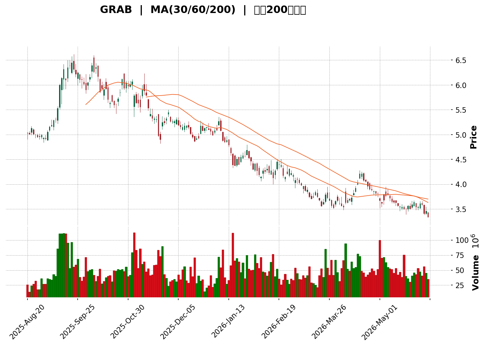
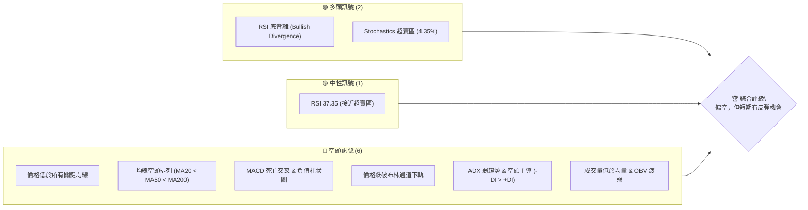
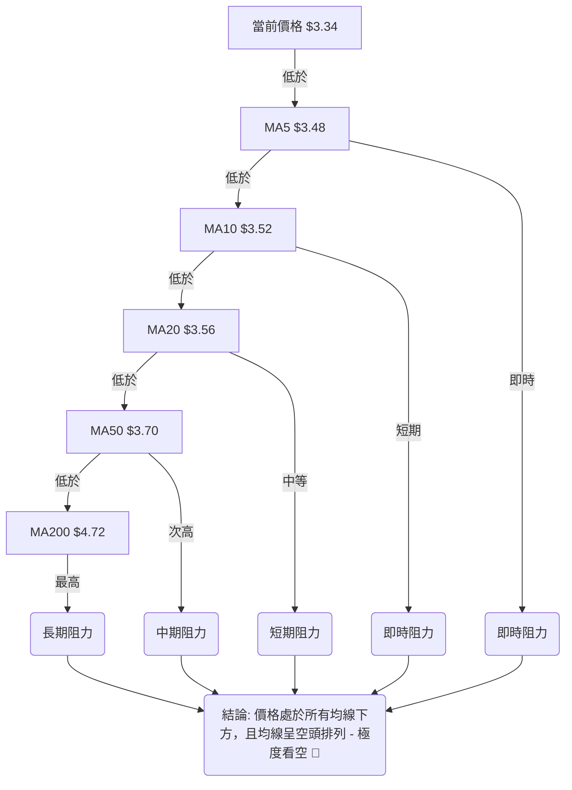

<details>
<summary>📊 靜態圖表 (點擊展開)</summary>

</details>

<html>
<head><meta charset="utf-8" /></head>
<body>
    <div style="height:500px; width:100%;">                        <script>window.PlotlyConfig = {MathJaxConfig: 'local'};</script>
        <script charset="utf-8" src="https://cdn.plot.ly/plotly-3.6.0.min.js" integrity="sha256-QaOVwtVY0T02VaHrr6pnoHLCwayMJp4O5n4YyaE3rJk=" crossorigin="anonymous"></script>                <div id="candlestick-chart" class="plotly-graph-div" style="height:100%; width:100%;"></div>            <script>                window.PLOTLYENV=window.PLOTLYENV || {};                                if (document.getElementById("candlestick-chart")) {                    Plotly.newPlot(                        "candlestick-chart",                        [{"close":{"dtype":"f8","bdata":"AAAAYLgeFEAAAACAPQoUQAAAAMAehRRAAAAAgD0KFEAAAAAAAAAUQAAAAMDMzBNAAAAAoEfhE0AAAACAwvUTQAAAAOBRuBNAAAAAgBSuE0AAAABAMzMUQAAAAADXoxRAAAAAYI\u002fCFEAAAADA9SgVQAAAAEAzMxVAAAAAYLgeFkAAAAAAAAAYQAAAACBcjxhAAAAAIK5HGUAAAABgZmYYQAAAAGBmZhlAAAAAIFyPGUAAAADAzMwZQAAAACCuRxlAAAAAoEfhGEAAAAAAAAAZQAAAAOCjcBhAAAAA4KNwGEAAAADgehQYQAAAAKCZmRdAAAAAQDMzGEAAAAAA16MYQAAAACBcjxlAAAAA4HoUGUAAAADgo3AZQAAAAIAUrhhAAAAA4KNwF0AAAADgUbgXQAAAAADXoxdAAAAAgBSuF0AAAABACtcWQAAAACBcjxZAAAAAgBSuFkAAAABgZmYWQAAAAEDhehZAAAAAoEfhFkAAAABgZmYXQAAAAEDhehhAAAAAYI\u002fCF0AAAABAMzMYQAAAACCF6xdAAAAAgD0KGEAAAAAgrkcYQAAAAADXIxdAAAAAIFyPFkAAAADAHoUWQAAAAKBwPRZAAAAAoJmZF0AAAADAHoUXQAAAAMD1KBdAAAAAwPUoFkAAAAAA16MVQAAAAIDrURVAAAAAIK5HFUAAAACgcD0VQAAAACCF6xNAAAAAoJmZE0AAAAAAAAAVQAAAAIDC9RRAAAAAIK5HFUAAAADAzMwVQAAAAOB6FBVAAAAAgD0KFUAAAADgehQVQAAAAEAzMxVAAAAAYI\u002fCFEAAAAAA16MUQAAAAKCZmRRAAAAA4FG4FEAAAADgUbgUQAAAAKCZmRRAAAAA4HoUFEAAAADAzMwTQAAAAEDhehNAAAAAgBSuE0AAAADgUbgTQAAAAOBRuBRAAAAAgOtRFEAAAADAHoUUQAAAAKCZmRRAAAAAYGZmFEAAAAAgrkcUQAAAAIDC9RNAAAAAgOtRFEAAAAAAKVwUQAAAAOB6FBVAAAAAgOtRFEAAAADAHoUTQAAAAGBmZhNAAAAAIFyPE0AAAADA9SgTQAAAAMAehRJAAAAAIFyPEUAAAADAHoURQAAAAIA9ChJAAAAAoJmZEUAAAABAMzMSQAAAAIDrURJAAAAAoHA9EkAAAABgj8ISQAAAAGC4HhJAAAAAoEfhEUAAAABAMzMRQAAAAADXoxFAAAAA4HoUEUAAAABgj8IQQAAAAKCZmRBAAAAA4HoUEUAAAACAPQoRQAAAAKBwPRFAAAAAIIXrEEAAAADgehQRQAAAAMAehRBAAAAA4HoUEUAAAADAzMwRQAAAAKCZmRFAAAAAwB6FEUAAAADgUbgQQAAAAKCZmRBAAAAAQArXEEAAAACgcD0RQAAAAKBH4RBAAAAA4FG4EEAAAACA61EQQAAAAGBmZhBAAAAAYLgeEEAAAABACtcPQAAAAIAUrg9AAAAAgML1DkAAAABguB4PQAAAAAAAAA5AAAAAgBSuDUAAAAAAAAAOQAAAAOBRuA5AAAAAAAAADkAAAADgo3ANQAAAAEDhegxAAAAAYLgeDUAAAACA61EOQAAAAEAK1w1AAAAAgBSuDUAAAAAgXI8MQAAAAKBwPQxAAAAAIK5HDUAAAAAAKVwNQAAAAIDC9QxAAAAAQOF6DEAAAACA61EMQAAAAIA9Cg1AAAAA4KNwDUAAAADgo3ANQAAAAEAK1w1AAAAAIFyPDkAAAAAAKVwPQAAAAOB6FBBAAAAAQArXEEAAAABACtcQQAAAAIDrURBAAAAAoHA9EEAAAACAFK4PQAAAAEAzMw9AAAAAYLgeD0AAAACgR+EOQAAAACBcjw5AAAAAIFyPDkAAAAAAKVwNQAAAAIDC9QxAAAAA4KNwDUAAAADA9SgOQAAAAIDrUQ5AAAAAYI\u002fCDUAAAABAMzMNQAAAAGC4Hg1AAAAAgD0KDUAAAAAgXI8MQAAAAGBmZgxAAAAAgOtRDEAAAAAAAAAMQAAAAOB6FAxAAAAAQOF6DEAAAADgehQMQAAAAOBRuAxAAAAAYLgeDUAAAACA61EMQAAAAIDrUQxAAAAAoEfhDEAAAADAzMwMQAAAACCuRwtAAAAAgBSuC0AAAADgUbgKQA=="},"high":{"dtype":"f8","bdata":"AAAAwPUoFEAAAAAgrkcUQAAAAIAUrhRAAAAAQOF6FEAAAACAPQoUQAAAAOB6FBRAAAAA4HoUFEAAAACAPQoUQAAAAEAK1xNAAAAAgML1E0AAAAAAKVwUQAAAAOBRuBRAAAAA4FE4FUAAAABAMzMVQAAAAAApXBVAAAAAIK5HFkAAAABguB4YQAAAAADXoxhAAAAAgBSuGUAAAADAHoUYQAAAAAAAABpAAAAAAAAAGkAAAACA61EaQAAAAEDhehpAAAAA4FG4GUAAAADgehQZQAAAAKBH4RhAAAAAgBSuGEAAAACgmZkYQAAAAKBH4RhAAAAAIK5HGEAAAACgR+EYQAAAACCuxxlAAAAAYGZmGkAAAABAicEZQAAAAKCZmRlAAAAAIFyPGEAAAAAgrkcYQAAAAOB6FBhAAAAAIFyPGEAAAACAwvUXQAAAAEAzsxZAAAAAgGo8F0AAAADgUbgWQAAAAEDhehZAAAAAgD0KF0AAAADA9agXQAAAAMAehRhAAAAAgML1GEAAAAAAKVwYQAAAAIDrURhAAAAAgOtRGEAAAACAwnUYQAAAACCuRxdAAAAA4KNwF0AAAABAClcXQAAAAMD1KBdAAAAAAAAAGEAAAADgo\u002fAYQAAAAOB6FBhAAAAAoEfhFkAAAABguB4WQAAAAOB6FBZAAAAAgMJ1FUAAAADAHoUVQAAAAADXoxVAAAAAoHA9FEAAAABA4XoVQAAAAAApXBVAAAAA4KNwFUAAAAAAAAAWQAAAAEDhehVAAAAAoHA9FUAAAABAMzMVQAAAAGBmZhVAAAAAYGZmFUAAAAAgXA8VQAAAAAAp3BRAAAAAgML1FEAAAABgj8IUQAAAAOB6FBVAAAAAANejFEAAAABAMzMUQAAAAKBH4RNAAAAAoEfhE0AAAABguB4UQAAAAGC4HhVAAAAAgML1FEAAAACgmZkUQAAAAADXoxRAAAAAIIXrFEAAAAAgXI8UQAAAAAApXBRAAAAAwB6FFEAAAADAzMwUQAAAAOCjcBVAAAAAgOtRFUAAAABAMzMUQAAAAKBH4RNAAAAAoEfhE0AAAACgmZkTQAAAAIA9ChNAAAAAwB6FEkAAAABgZmYSQAAAAOBROBJAAAAAQDMzEkAAAABgZmYSQAAAACBcjxJAAAAAgBSuEkAAAACAFC4TQAAAAOBRuBJAAAAA4FE4EkAAAACgR+ERQAAAAOBRuBFAAAAAYI\u002fCEUAAAABA4XoRQAAAAADXoxBAAAAAwMxMEUAAAAAAKVwRQAAAAGC4nhFAAAAAIFyPEUAAAACAwvURQAAAAOBROBFAAAAAQDMzEUAAAACAPQoSQAAAAEAK1xFAAAAAwB4FEkAAAACAPYoRQAAAAKCZmRBAAAAAwB6FEUAAAAAgrkcRQAAAAGC4HhFAAAAAoEfhEEAAAACAPYoQQAAAAOB6lBBAAAAAwB6FEEAAAADA9SgQQAAAAIAUrg9AAAAAAAAAEEAAAADAHoUPQAAAAMDMzA5AAAAAQOF6DkAAAAAA16MOQAAAAIDC9Q5AAAAAQDMzD0AAAABACtcNQAAAAOCjcA1AAAAAgBSuDUAAAAAA16MOQAAAAKCZmQ9AAAAA4FG4DkAAAADAHoUNQAAAAIDC9QxAAAAA4KNwDUAAAACA61EOQAAAAGCPwg1AAAAAAAAADkAAAABgj8IMQAAAAOCjcA9AAAAAQArXDUAAAADAzMwNQAAAAKBwPQ5AAAAA4HoUD0AAAADgUbgPQAAAAAApXBBAAAAAYLgeEUAAAAAAAAARQAAAAIDC9RBAAAAA4KNwEEAAAABAMzMQQAAAAMD1KBBAAAAAIIXrD0AAAAAAAAAPQAAAACCF6w5AAAAA4FG4DkAAAACgR+ENQAAAAEAzMw1AAAAA4KNwDkAAAACgmZkPQAAAAEAzMw9AAAAAoHA9DkAAAADgehQOQAAAAOCjcA1AAAAA4KNwDUAAAACAwvUMQAAAACBcjwxAAAAAwMzMDEAAAAAgXI8MQAAAAIDpJgxAAAAAANejDEAAAACAwvUMQAAAAIDrUQ1AAAAAAClcDUAAAACAwvUMQAAAACBcjwxAAAAAIK5HDUAAAAAgrkcNQAAAAOBRuAxAAAAAYGZmDEAAAADAHoULQA=="},"hovertemplate":"\u003cb\u003e%{x|%Y-%m-%d}\u003c\u002fb\u003e\u003cbr\u003e\u958b: $%{open:.2f}\u003cbr\u003e\u9ad8: $%{high:.2f}\u003cbr\u003e\u4f4e: $%{low:.2f}\u003cbr\u003e\u6536: $%{close:.2f}\u003cextra\u003e\u003c\u002fextra\u003e","low":{"dtype":"f8","bdata":"AAAAoJmZE0AAAAAAAAAUQAAAAIDC9RNAAAAAgML1E0AAAADgUbgTQAAAAGCPwhNAAAAAoJmZE0AAAAAA16MTQAAAAAApXBNAAAAAIFyPE0AAAADAHoUTQAAAAKBwPRRAAAAAANejFEAAAAAAKVwUQAAAAIDC9RRAAAAAoEfhFEAAAACAPQoWQAAAAOCjcBZAAAAAANejF0AAAADA9agXQAAAAKBwPRhAAAAAIK5HGUAAAACgR+EYQAAAAIA9ChlAAAAAANejGEAAAACAwvUXQAAAAMD1KBhAAAAA4FG4F0AAAACAwvUXQAAAAIDrURdAAAAAoJmZF0AAAACgcD0YQAAAACBcjxhAAAAAgML1GEAAAAAghesYQAAAACCuRxhAAAAAAClcF0AAAAAgXI8XQAAAAMDMzBZAAAAAoJmZF0AAAAAgXI8WQAAAAMD1KBZAAAAAoJmZFkAAAADA9SgWQAAAAIAUrhVAAAAAgOtRFkAAAADgehQXQAAAAADXoxdAAAAAoJmZF0AAAABgZmYXQAAAAIAUrhdAAAAAwMzMF0AAAACgmZkXQAAAAOCjcBVAAAAAQOF6FkAAAACAFC4WQAAAAMDMzBVAAAAAIIXrFkAAAABAMzMXQAAAAGC4HhdAAAAAIIXrFUAAAADgo3AVQAAAAOB6FBVAAAAAoEfhFEAAAAAAAAAVQAAAAEAK1xNAAAAAIK5HE0AAAAAghWsUQAAAAGCPwhRAAAAAQArXFEAAAADgo3AVQAAAAAAAABVAAAAAoEfhFEAAAACgmZkUQAAAACCuxxRAAAAA4FG4FEAAAADgo3AUQAAAAIDrURRAAAAAQDMzFEAAAACgR2EUQAAAAOCjcBRAAAAAgML1E0AAAACAFK4TQAAAAGBmZhNAAAAAIFyPE0AAAAAA16MTQAAAAIA9ChRAAAAAIK5HFEAAAABguB4UQAAAAMDMTBRAAAAAoEdhFEAAAAAAAAAUQAAAACCF6xNAAAAAgD0KFEAAAACA61EUQAAAAGCPwhRAAAAAYI9CFEAAAADgo3ATQAAAAIDrURNAAAAAAClcE0AAAAAAAAATQAAAAIDrURJAAAAAgOtREUAAAADgo3ARQAAAAGBmZhFAAAAAIFyPEUAAAADgUbgRQAAAAOB6FBJAAAAAwPUoEkAAAAAAKVwSQAAAAIA9ChJAAAAAwB6FEUAAAADA9SgRQAAAAAAAABFAAAAA4FG4EEAAAACgmZkQQAAAAKBwPRBAAAAAgMJ1EEAAAABACtcQQAAAACCF6xBAAAAAYI\u002fCEEAAAADAzMwQQAAAAAAAABBAAAAAYGZmEEAAAADgehQRQAAAAGCPQhFAAAAAgOtREUAAAADAHoUQQAAAAEAzMxBAAAAA4KfGEEAAAAAgXI8QQAAAAOBRuBBAAAAAoHA9EEAAAAAAKVwPQAAAAIA9ChBAAAAAAAAAEEAAAABgj8IPQAAAAMAehQ5AAAAAwMzMDkAAAABA4XoOQAAAAGCPwg1AAAAAoJmZDUAAAABgj8INQAAAAMD1KA5AAAAAQArXDUAAAAAgrkcNQAAAAGBmZgxAAAAA4FG4DEAAAACAwvUMQAAAAKCZmQ1AAAAAgOtRDUAAAACgcD0MQAAAAOB6FAxAAAAAYGZmDEAAAABguB4NQAAAAADXowxAAAAAQOF6DEAAAABACtcLQAAAAMDMzAxAAAAAgML1DEAAAABAMzMNQAAAAADXowxAAAAAYGQ7DkAAAACAFK4OQAAAAEAK1w9AAAAA4KNwEEAAAADgo3AQQAAAAEAzMxBAAAAAwPUoEEAAAABAMzMPQAAAAIA9Cg9AAAAAoEfhDkAAAACA61EOQAAAAOB6FA5AAAAAIIXrDUAAAADA9SgMQAAAAIDrUQxAAAAA4FG4DEAAAAAghesNQAAAAOB6FA5AAAAAIK5HDUAAAACAwvUMQAAAAKBH4QxAAAAAQOF6DEAAAABgZmYMQAAAAIAUrgtAAAAAQArXC0AAAAAghesLQAAAAGC4HgtAAAAAoJmZC0AAAAAghesLQAAAAOB6FAxAAAAA4KNwDEAAAABACtcLQAAAAEAK1wtAAAAAAAAADEAAAAAgXI8MQAAAAIA9CgtAAAAAgD0KC0AAAACgmZkKQA=="},"name":"\u50f9\u683c","open":{"dtype":"f8","bdata":"AAAAwPUoFEAAAABguB4UQAAAAMAgMBRAAAAAYGZmFEAAAAAAAAAUQAAAAIDC9RNAAAAAQArXE0AAAADAzMwTQAAAAMD1qBNAAAAA4FG4E0AAAAAgXI8TQAAAAAApXBRAAAAAgBSuFEAAAAAA16MUQAAAAEAzMxVAAAAAwPUoFUAAAABAMzMWQAAAAKCZmRdAAAAAQOF6GEAAAADAHoUYQAAAAIA9ihhAAAAAIFyPGUAAAABA4foYQAAAACCF6xlAAAAAQDMzGUAAAADAHoUYQAAAAEAK1xhAAAAAgMJ1GEAAAACgcD0YQAAAAMD1KBhAAAAAgML1F0AAAABA4XoYQAAAAKCZGRlAAAAAQDMzGkAAAACA61EZQAAAAIA9ihlAAAAAQOF6GEAAAACAwvUXQAAAAMD1KBdAAAAAoHA9GEAAAADAzMwXQAAAAEDhehZAAAAAwPUoF0AAAADgUbgWQAAAAEDhehZAAAAAgBSuFkAAAACgR2EXQAAAAAAAABhAAAAAIIXrGEAAAABgj8IXQAAAAAAAABhAAAAAoEfhF0AAAACAPQoYQAAAAGCPQhZAAAAAYI9CF0AAAADAzMwWQAAAAMDMzBZAAAAAoJkZF0AAAAAgXA8YQAAAAGBmZhdAAAAAQArXFkAAAADAHoUVQAAAAIA9ihVAAAAA4FE4FUAAAABAMzMVQAAAAADXoxVAAAAAgD0KFEAAAACAFK4UQAAAAOB6FBVAAAAAwPUoFUAAAAAA16MVQAAAACCFaxVAAAAAwB4FFUAAAACAwvUUQAAAAEAK1xRAAAAAwPUoFUAAAABgj8IUQAAAACCFaxRAAAAAYGZmFEAAAADgepQUQAAAAGCPwhRAAAAAoJmZFEAAAABA4foTQAAAAKBH4RNAAAAAoJmZE0AAAACgR+ETQAAAAOB6FBRAAAAAgBSuFEAAAACA61EUQAAAACBcjxRAAAAAQOF6FEAAAACAwnUUQAAAACCuRxRAAAAAgBQuFEAAAADAHoUUQAAAAGCPwhRAAAAAYLgeFUAAAABAMzMUQAAAAGCPwhNAAAAAYGZmE0AAAACgmZkTQAAAACCF6xJAAAAA4KNwEkAAAACA61ESQAAAAIA9ihFAAAAAQDMzEkAAAADAzMwRQAAAAOB6FBJAAAAAoHA9EkAAAAAAKVwSQAAAAIAUrhJAAAAAwPUoEkAAAACAFK4RQAAAAGC4HhFAAAAAwPWoEUAAAACA61ERQAAAAMAehRBAAAAAoEfhEEAAAABguB4RQAAAAMD1KBFAAAAA4KNwEUAAAADAzMwQQAAAAIDC9RBAAAAAYI\u002fCEEAAAACgcD0RQAAAAOB6lBFAAAAA4KNwEUAAAADAzEwRQAAAAOCjcBBAAAAAAAAAEUAAAADgUbgQQAAAAMDMzBBAAAAAANejEEAAAABguB4QQAAAAOCjcBBAAAAAAClcEEAAAAAgXA8QQAAAACCuRw9AAAAAgBSuD0AAAADAzMwOQAAAAADXow5AAAAAYLgeDkAAAAAghesNQAAAAKBwPQ5AAAAAoJmZDkAAAABgj8INQAAAAEAzMw1AAAAAwMzMDEAAAABAMzMNQAAAAADXow5AAAAAYGZmDUAAAADgo3ANQAAAAOBRuAxAAAAAwMzMDEAAAAAAAAAOQAAAAIDC9QxAAAAAoEfhDEAAAADAHoUMQAAAAEAK1w5AAAAAgD0KDUAAAACgmZkNQAAAAEAzMw1AAAAAoHA9DkAAAADAzMwOQAAAAAAAABBAAAAAQOF6EEAAAABguJ4QQAAAAKBH4RBAAAAAAClcEEAAAABAMzMQQAAAAOB6FBBAAAAAQDMzD0AAAADAzMwOQAAAAKBH4Q5AAAAAIFyPDkAAAADgUbgNQAAAAOB6FA1AAAAAAClcDkAAAADAzMwOQAAAACBcjw5AAAAAwPUoDkAAAACAFK4NQAAAAAApXA1AAAAAAClcDUAAAACAwvUMQAAAAIDrUQxAAAAAYLgeDEAAAACA61EMQAAAAOB6FAxAAAAAAAAADEAAAABA4XoMQAAAACCuRwxAAAAAQOF6DEAAAACAwvUMQAAAAKBwPQxAAAAAwPUoDEAAAACgR+EMQAAAAADXowxAAAAAIK5HC0AAAABgvHQLQA=="},"x":["2025-08-20T00:00:00-04:00","2025-08-21T00:00:00-04:00","2025-08-22T00:00:00-04:00","2025-08-25T00:00:00-04:00","2025-08-26T00:00:00-04:00","2025-08-27T00:00:00-04:00","2025-08-28T00:00:00-04:00","2025-08-29T00:00:00-04:00","2025-09-02T00:00:00-04:00","2025-09-03T00:00:00-04:00","2025-09-04T00:00:00-04:00","2025-09-05T00:00:00-04:00","2025-09-08T00:00:00-04:00","2025-09-09T00:00:00-04:00","2025-09-10T00:00:00-04:00","2025-09-11T00:00:00-04:00","2025-09-12T00:00:00-04:00","2025-09-15T00:00:00-04:00","2025-09-16T00:00:00-04:00","2025-09-17T00:00:00-04:00","2025-09-18T00:00:00-04:00","2025-09-19T00:00:00-04:00","2025-09-22T00:00:00-04:00","2025-09-23T00:00:00-04:00","2025-09-24T00:00:00-04:00","2025-09-25T00:00:00-04:00","2025-09-26T00:00:00-04:00","2025-09-29T00:00:00-04:00","2025-09-30T00:00:00-04:00","2025-10-01T00:00:00-04:00","2025-10-02T00:00:00-04:00","2025-10-03T00:00:00-04:00","2025-10-06T00:00:00-04:00","2025-10-07T00:00:00-04:00","2025-10-08T00:00:00-04:00","2025-10-09T00:00:00-04:00","2025-10-10T00:00:00-04:00","2025-10-13T00:00:00-04:00","2025-10-14T00:00:00-04:00","2025-10-15T00:00:00-04:00","2025-10-16T00:00:00-04:00","2025-10-17T00:00:00-04:00","2025-10-20T00:00:00-04:00","2025-10-21T00:00:00-04:00","2025-10-22T00:00:00-04:00","2025-10-23T00:00:00-04:00","2025-10-24T00:00:00-04:00","2025-10-27T00:00:00-04:00","2025-10-28T00:00:00-04:00","2025-10-29T00:00:00-04:00","2025-10-30T00:00:00-04:00","2025-10-31T00:00:00-04:00","2025-11-03T00:00:00-05:00","2025-11-04T00:00:00-05:00","2025-11-05T00:00:00-05:00","2025-11-06T00:00:00-05:00","2025-11-07T00:00:00-05:00","2025-11-10T00:00:00-05:00","2025-11-11T00:00:00-05:00","2025-11-12T00:00:00-05:00","2025-11-13T00:00:00-05:00","2025-11-14T00:00:00-05:00","2025-11-17T00:00:00-05:00","2025-11-18T00:00:00-05:00","2025-11-19T00:00:00-05:00","2025-11-20T00:00:00-05:00","2025-11-21T00:00:00-05:00","2025-11-24T00:00:00-05:00","2025-11-25T00:00:00-05:00","2025-11-26T00:00:00-05:00","2025-11-28T00:00:00-05:00","2025-12-01T00:00:00-05:00","2025-12-02T00:00:00-05:00","2025-12-03T00:00:00-05:00","2025-12-04T00:00:00-05:00","2025-12-05T00:00:00-05:00","2025-12-08T00:00:00-05:00","2025-12-09T00:00:00-05:00","2025-12-10T00:00:00-05:00","2025-12-11T00:00:00-05:00","2025-12-12T00:00:00-05:00","2025-12-15T00:00:00-05:00","2025-12-16T00:00:00-05:00","2025-12-17T00:00:00-05:00","2025-12-18T00:00:00-05:00","2025-12-19T00:00:00-05:00","2025-12-22T00:00:00-05:00","2025-12-23T00:00:00-05:00","2025-12-24T00:00:00-05:00","2025-12-26T00:00:00-05:00","2025-12-29T00:00:00-05:00","2025-12-30T00:00:00-05:00","2025-12-31T00:00:00-05:00","2026-01-02T00:00:00-05:00","2026-01-05T00:00:00-05:00","2026-01-06T00:00:00-05:00","2026-01-07T00:00:00-05:00","2026-01-08T00:00:00-05:00","2026-01-09T00:00:00-05:00","2026-01-12T00:00:00-05:00","2026-01-13T00:00:00-05:00","2026-01-14T00:00:00-05:00","2026-01-15T00:00:00-05:00","2026-01-16T00:00:00-05:00","2026-01-20T00:00:00-05:00","2026-01-21T00:00:00-05:00","2026-01-22T00:00:00-05:00","2026-01-23T00:00:00-05:00","2026-01-26T00:00:00-05:00","2026-01-27T00:00:00-05:00","2026-01-28T00:00:00-05:00","2026-01-29T00:00:00-05:00","2026-01-30T00:00:00-05:00","2026-02-02T00:00:00-05:00","2026-02-03T00:00:00-05:00","2026-02-04T00:00:00-05:00","2026-02-05T00:00:00-05:00","2026-02-06T00:00:00-05:00","2026-02-09T00:00:00-05:00","2026-02-10T00:00:00-05:00","2026-02-11T00:00:00-05:00","2026-02-12T00:00:00-05:00","2026-02-13T00:00:00-05:00","2026-02-17T00:00:00-05:00","2026-02-18T00:00:00-05:00","2026-02-19T00:00:00-05:00","2026-02-20T00:00:00-05:00","2026-02-23T00:00:00-05:00","2026-02-24T00:00:00-05:00","2026-02-25T00:00:00-05:00","2026-02-26T00:00:00-05:00","2026-02-27T00:00:00-05:00","2026-03-02T00:00:00-05:00","2026-03-03T00:00:00-05:00","2026-03-04T00:00:00-05:00","2026-03-05T00:00:00-05:00","2026-03-06T00:00:00-05:00","2026-03-09T00:00:00-04:00","2026-03-10T00:00:00-04:00","2026-03-11T00:00:00-04:00","2026-03-12T00:00:00-04:00","2026-03-13T00:00:00-04:00","2026-03-16T00:00:00-04:00","2026-03-17T00:00:00-04:00","2026-03-18T00:00:00-04:00","2026-03-19T00:00:00-04:00","2026-03-20T00:00:00-04:00","2026-03-23T00:00:00-04:00","2026-03-24T00:00:00-04:00","2026-03-25T00:00:00-04:00","2026-03-26T00:00:00-04:00","2026-03-27T00:00:00-04:00","2026-03-30T00:00:00-04:00","2026-03-31T00:00:00-04:00","2026-04-01T00:00:00-04:00","2026-04-02T00:00:00-04:00","2026-04-06T00:00:00-04:00","2026-04-07T00:00:00-04:00","2026-04-08T00:00:00-04:00","2026-04-09T00:00:00-04:00","2026-04-10T00:00:00-04:00","2026-04-13T00:00:00-04:00","2026-04-14T00:00:00-04:00","2026-04-15T00:00:00-04:00","2026-04-16T00:00:00-04:00","2026-04-17T00:00:00-04:00","2026-04-20T00:00:00-04:00","2026-04-21T00:00:00-04:00","2026-04-22T00:00:00-04:00","2026-04-23T00:00:00-04:00","2026-04-24T00:00:00-04:00","2026-04-27T00:00:00-04:00","2026-04-28T00:00:00-04:00","2026-04-29T00:00:00-04:00","2026-04-30T00:00:00-04:00","2026-05-01T00:00:00-04:00","2026-05-04T00:00:00-04:00","2026-05-05T00:00:00-04:00","2026-05-06T00:00:00-04:00","2026-05-07T00:00:00-04:00","2026-05-08T00:00:00-04:00","2026-05-11T00:00:00-04:00","2026-05-12T00:00:00-04:00","2026-05-13T00:00:00-04:00","2026-05-14T00:00:00-04:00","2026-05-15T00:00:00-04:00","2026-05-18T00:00:00-04:00","2026-05-19T00:00:00-04:00","2026-05-20T00:00:00-04:00","2026-05-21T00:00:00-04:00","2026-05-22T00:00:00-04:00","2026-05-26T00:00:00-04:00","2026-05-27T00:00:00-04:00","2026-05-28T00:00:00-04:00","2026-05-29T00:00:00-04:00","2026-06-01T00:00:00-04:00","2026-06-02T00:00:00-04:00","2026-06-03T00:00:00-04:00","2026-06-04T00:00:00-04:00","2026-06-05T00:00:00-04:00"],"type":"candlestick"},{"hovertemplate":"MA30: $%{y:.2f}\u003cextra\u003e\u003c\u002fextra\u003e","line":{"color":"#2196F3","dash":"dash","width":2},"mode":"lines","name":"MA30","x":["2025-08-20T00:00:00-04:00","2025-08-21T00:00:00-04:00","2025-08-22T00:00:00-04:00","2025-08-25T00:00:00-04:00","2025-08-26T00:00:00-04:00","2025-08-27T00:00:00-04:00","2025-08-28T00:00:00-04:00","2025-08-29T00:00:00-04:00","2025-09-02T00:00:00-04:00","2025-09-03T00:00:00-04:00","2025-09-04T00:00:00-04:00","2025-09-05T00:00:00-04:00","2025-09-08T00:00:00-04:00","2025-09-09T00:00:00-04:00","2025-09-10T00:00:00-04:00","2025-09-11T00:00:00-04:00","2025-09-12T00:00:00-04:00","2025-09-15T00:00:00-04:00","2025-09-16T00:00:00-04:00","2025-09-17T00:00:00-04:00","2025-09-18T00:00:00-04:00","2025-09-19T00:00:00-04:00","2025-09-22T00:00:00-04:00","2025-09-23T00:00:00-04:00","2025-09-24T00:00:00-04:00","2025-09-25T00:00:00-04:00","2025-09-26T00:00:00-04:00","2025-09-29T00:00:00-04:00","2025-09-30T00:00:00-04:00","2025-10-01T00:00:00-04:00","2025-10-02T00:00:00-04:00","2025-10-03T00:00:00-04:00","2025-10-06T00:00:00-04:00","2025-10-07T00:00:00-04:00","2025-10-08T00:00:00-04:00","2025-10-09T00:00:00-04:00","2025-10-10T00:00:00-04:00","2025-10-13T00:00:00-04:00","2025-10-14T00:00:00-04:00","2025-10-15T00:00:00-04:00","2025-10-16T00:00:00-04:00","2025-10-17T00:00:00-04:00","2025-10-20T00:00:00-04:00","2025-10-21T00:00:00-04:00","2025-10-22T00:00:00-04:00","2025-10-23T00:00:00-04:00","2025-10-24T00:00:00-04:00","2025-10-27T00:00:00-04:00","2025-10-28T00:00:00-04:00","2025-10-29T00:00:00-04:00","2025-10-30T00:00:00-04:00","2025-10-31T00:00:00-04:00","2025-11-03T00:00:00-05:00","2025-11-04T00:00:00-05:00","2025-11-05T00:00:00-05:00","2025-11-06T00:00:00-05:00","2025-11-07T00:00:00-05:00","2025-11-10T00:00:00-05:00","2025-11-11T00:00:00-05:00","2025-11-12T00:00:00-05:00","2025-11-13T00:00:00-05:00","2025-11-14T00:00:00-05:00","2025-11-17T00:00:00-05:00","2025-11-18T00:00:00-05:00","2025-11-19T00:00:00-05:00","2025-11-20T00:00:00-05:00","2025-11-21T00:00:00-05:00","2025-11-24T00:00:00-05:00","2025-11-25T00:00:00-05:00","2025-11-26T00:00:00-05:00","2025-11-28T00:00:00-05:00","2025-12-01T00:00:00-05:00","2025-12-02T00:00:00-05:00","2025-12-03T00:00:00-05:00","2025-12-04T00:00:00-05:00","2025-12-05T00:00:00-05:00","2025-12-08T00:00:00-05:00","2025-12-09T00:00:00-05:00","2025-12-10T00:00:00-05:00","2025-12-11T00:00:00-05:00","2025-12-12T00:00:00-05:00","2025-12-15T00:00:00-05:00","2025-12-16T00:00:00-05:00","2025-12-17T00:00:00-05:00","2025-12-18T00:00:00-05:00","2025-12-19T00:00:00-05:00","2025-12-22T00:00:00-05:00","2025-12-23T00:00:00-05:00","2025-12-24T00:00:00-05:00","2025-12-26T00:00:00-05:00","2025-12-29T00:00:00-05:00","2025-12-30T00:00:00-05:00","2025-12-31T00:00:00-05:00","2026-01-02T00:00:00-05:00","2026-01-05T00:00:00-05:00","2026-01-06T00:00:00-05:00","2026-01-07T00:00:00-05:00","2026-01-08T00:00:00-05:00","2026-01-09T00:00:00-05:00","2026-01-12T00:00:00-05:00","2026-01-13T00:00:00-05:00","2026-01-14T00:00:00-05:00","2026-01-15T00:00:00-05:00","2026-01-16T00:00:00-05:00","2026-01-20T00:00:00-05:00","2026-01-21T00:00:00-05:00","2026-01-22T00:00:00-05:00","2026-01-23T00:00:00-05:00","2026-01-26T00:00:00-05:00","2026-01-27T00:00:00-05:00","2026-01-28T00:00:00-05:00","2026-01-29T00:00:00-05:00","2026-01-30T00:00:00-05:00","2026-02-02T00:00:00-05:00","2026-02-03T00:00:00-05:00","2026-02-04T00:00:00-05:00","2026-02-05T00:00:00-05:00","2026-02-06T00:00:00-05:00","2026-02-09T00:00:00-05:00","2026-02-10T00:00:00-05:00","2026-02-11T00:00:00-05:00","2026-02-12T00:00:00-05:00","2026-02-13T00:00:00-05:00","2026-02-17T00:00:00-05:00","2026-02-18T00:00:00-05:00","2026-02-19T00:00:00-05:00","2026-02-20T00:00:00-05:00","2026-02-23T00:00:00-05:00","2026-02-24T00:00:00-05:00","2026-02-25T00:00:00-05:00","2026-02-26T00:00:00-05:00","2026-02-27T00:00:00-05:00","2026-03-02T00:00:00-05:00","2026-03-03T00:00:00-05:00","2026-03-04T00:00:00-05:00","2026-03-05T00:00:00-05:00","2026-03-06T00:00:00-05:00","2026-03-09T00:00:00-04:00","2026-03-10T00:00:00-04:00","2026-03-11T00:00:00-04:00","2026-03-12T00:00:00-04:00","2026-03-13T00:00:00-04:00","2026-03-16T00:00:00-04:00","2026-03-17T00:00:00-04:00","2026-03-18T00:00:00-04:00","2026-03-19T00:00:00-04:00","2026-03-20T00:00:00-04:00","2026-03-23T00:00:00-04:00","2026-03-24T00:00:00-04:00","2026-03-25T00:00:00-04:00","2026-03-26T00:00:00-04:00","2026-03-27T00:00:00-04:00","2026-03-30T00:00:00-04:00","2026-03-31T00:00:00-04:00","2026-04-01T00:00:00-04:00","2026-04-02T00:00:00-04:00","2026-04-06T00:00:00-04:00","2026-04-07T00:00:00-04:00","2026-04-08T00:00:00-04:00","2026-04-09T00:00:00-04:00","2026-04-10T00:00:00-04:00","2026-04-13T00:00:00-04:00","2026-04-14T00:00:00-04:00","2026-04-15T00:00:00-04:00","2026-04-16T00:00:00-04:00","2026-04-17T00:00:00-04:00","2026-04-20T00:00:00-04:00","2026-04-21T00:00:00-04:00","2026-04-22T00:00:00-04:00","2026-04-23T00:00:00-04:00","2026-04-24T00:00:00-04:00","2026-04-27T00:00:00-04:00","2026-04-28T00:00:00-04:00","2026-04-29T00:00:00-04:00","2026-04-30T00:00:00-04:00","2026-05-01T00:00:00-04:00","2026-05-04T00:00:00-04:00","2026-05-05T00:00:00-04:00","2026-05-06T00:00:00-04:00","2026-05-07T00:00:00-04:00","2026-05-08T00:00:00-04:00","2026-05-11T00:00:00-04:00","2026-05-12T00:00:00-04:00","2026-05-13T00:00:00-04:00","2026-05-14T00:00:00-04:00","2026-05-15T00:00:00-04:00","2026-05-18T00:00:00-04:00","2026-05-19T00:00:00-04:00","2026-05-20T00:00:00-04:00","2026-05-21T00:00:00-04:00","2026-05-22T00:00:00-04:00","2026-05-26T00:00:00-04:00","2026-05-27T00:00:00-04:00","2026-05-28T00:00:00-04:00","2026-05-29T00:00:00-04:00","2026-06-01T00:00:00-04:00","2026-06-02T00:00:00-04:00","2026-06-03T00:00:00-04:00","2026-06-04T00:00:00-04:00","2026-06-05T00:00:00-04:00"],"y":{"dtype":"f8","bdata":"AAAAAAAA+H8AAAAAAAD4fwAAAAAAAPh\u002fAAAAAAAA+H8AAAAAAAD4fwAAAAAAAPh\u002fAAAAAAAA+H8AAAAAAAD4fwAAAAAAAPh\u002fAAAAAAAA+H8AAAAAAAD4fwAAAAAAAPh\u002fAAAAAAAA+H8AAAAAAAD4fwAAAAAAAPh\u002fAAAAAAAA+H8AAAAAAAD4fwAAAAAAAPh\u002fAAAAAAAA+H8AAAAAAAD4fwAAAAAAAPh\u002fAAAAAAAA+H8AAAAAAAD4fwAAAAAAAPh\u002fAAAAAAAA+H8AAAAAAAD4fwAAAAAAAPh\u002fAAAAAAAA+H8AAAAAAAD4f97d3b0taxZAMzMzo\u002f6NFkDNzMx8P7UWQImIiIhB4BZARERElEMLF0ARERFxrzkXQHd3d\u002fdTYxdAiYiI6LSBF0ARERHByqEXQAAAACA+wxdAIiIiQmDlF0DNzMxs5\u002fsXQKuqqrpJDBhAiYiICKwcGECrqqraQCcYQN7d3Q0tMhhAvLu7S6k4GEAzMzOTijMYQAAAANDbMhhAIiIiUuMlGECrqqpqLiQYQO\u002fu7k6NFxhAIiIi0pQKGEBVVVVVnP0XQN7d3W1Z6xdAAAAAUI3XF0C8u7urY8IXQCIiIrKdrxdAAAAAsHKoF0CamZlZq6MXQHd3dyfqnxdAREREtIGOF0Crqqoa6HQXQO\u002fu7q65UBdAVVVVdUwwF0CrqqpqdQwXQJqZmQnX4xZA3t3dbRLDFkAAAACA3KsWQDMzM\u002fP9lBZAIiIiEoOAFkB3d3cno3cWQLy7uwsCaxZAmpmZaQNdFkBERETUv1EWQBEREaHTRhZAvLu7a7w0FkC8u7sbLx0WQO\u002fu7h4T\u002fBVAMzMzIyLiFUBVVVX1b8QVQO\u002fu7k4bqBVA3t3djVCGFUB3d3fXFWAVQDMzM3PaQBVA7+7u\u002fkYoFUDNzMxMYhAVQO\u002fu7s5pAxVAmpmZiWznFEAAAADw0s0UQImIiIj6txRAERERwfWoFECrqqrKWp0UQDMzM9O\u002fkRRAvLu7q46JFECJiIhIDIIUQHd3d1fyixRARERENBeSFECJiIgYdoUUQJqZmTkmeBRAMzMz03hpFECJiIio8VIUQBEREUEZPRRAMzMzE2cfFEAzMzMjBgEUQDMzMwMP5hNAMzMz4xfLE0ARERGhRbYTQEREROTQohNAAAAAQKeNE0ARERGR7XwTQM3MzOzDZxNAMzMz8\u002f1UE0Crqqoqzj4TQAAAAKAaLxNAZmZm1uoYE0Dv7u6eqP8SQImIiFiA3BJAVVVVddrAEkCJiIhIKKMSQAAAAEB8hhJAMzMzE8poEkARERGRe00SQGZmZsYgMBJAMzMz43oUEkCrqqp6ov4RQN7d3U3w4BFAzczMnAvJEUCrqqrqJrERQJqZmTlCmRFAvLu7SwyCEUDe3d39qXERQKuqqlqrYxFAiYiIWIBcEUB3d3fnQlIRQERERERERBFAiYiIKKM3EUC8u7trLiQRQHd3d8cEDxFAd3d3d3f3EEDe3d31KNwQQO\u002fu7jaJwRBAREREPJinEECrqqpC0pQQQGZmZoZdgRBAIiIisp1vEEB3d3c\u002fNV4QQHd3d78RShBAmpmZuZA0EEDNzMzMhSQQQO\u002fu7q65EBBAVVVVtfP9D0AiIiJSKs4PQO\u002fu7o40pQ9AmpmZCZB7D0De3d2NUEYPQAAAABAREQ9AVVVVhRbZDkBmZma2Za0OQN7d3Q3miQ5AIiIiordlDkBmZmaWtToOQImIiDhCGQ5ARERExK4ADkARERGRwvUNQHd3d3dM8A1AERERMZb8DUC8u7u7SQwOQCIiIuJ6FA5AAAAAYHMhDkBmZma2OiYOQHd3dyd4MA5AIiIi4sE8DkBVVVVFREQOQO\u002fu7r7mQg5AVVVVFa5HDkAiIiJS\u002f0YOQFVVVeUXSw5AIiIi8tJNDkC8u7trdUwOQO\u002fu7v6NUA5AIiIiwjxRDkDNzMzcslYOQBEREUE1Xg5Ad3d39yhcDkBmZmZWVVUOQAAAAACOUA5AmpmZeTBPDkDNzMxsdUwOQFVVVUVERA5A3t3dHRM8DkBmZmYmeDAOQImIiHjpJg5A7+7uvp8aDkAzMzPDrgAOQHd3dyfq3w1AREREZPS2DUDe3d3dT40NQFVVVcWSXw1AMzMzA502DUCamZm5SQwNQA=="},"type":"scatter"},{"hovertemplate":"MA60: $%{y:.2f}\u003cextra\u003e\u003c\u002fextra\u003e","line":{"color":"#9C27B0","dash":"dash","width":2},"mode":"lines","name":"MA60","x":["2025-08-20T00:00:00-04:00","2025-08-21T00:00:00-04:00","2025-08-22T00:00:00-04:00","2025-08-25T00:00:00-04:00","2025-08-26T00:00:00-04:00","2025-08-27T00:00:00-04:00","2025-08-28T00:00:00-04:00","2025-08-29T00:00:00-04:00","2025-09-02T00:00:00-04:00","2025-09-03T00:00:00-04:00","2025-09-04T00:00:00-04:00","2025-09-05T00:00:00-04:00","2025-09-08T00:00:00-04:00","2025-09-09T00:00:00-04:00","2025-09-10T00:00:00-04:00","2025-09-11T00:00:00-04:00","2025-09-12T00:00:00-04:00","2025-09-15T00:00:00-04:00","2025-09-16T00:00:00-04:00","2025-09-17T00:00:00-04:00","2025-09-18T00:00:00-04:00","2025-09-19T00:00:00-04:00","2025-09-22T00:00:00-04:00","2025-09-23T00:00:00-04:00","2025-09-24T00:00:00-04:00","2025-09-25T00:00:00-04:00","2025-09-26T00:00:00-04:00","2025-09-29T00:00:00-04:00","2025-09-30T00:00:00-04:00","2025-10-01T00:00:00-04:00","2025-10-02T00:00:00-04:00","2025-10-03T00:00:00-04:00","2025-10-06T00:00:00-04:00","2025-10-07T00:00:00-04:00","2025-10-08T00:00:00-04:00","2025-10-09T00:00:00-04:00","2025-10-10T00:00:00-04:00","2025-10-13T00:00:00-04:00","2025-10-14T00:00:00-04:00","2025-10-15T00:00:00-04:00","2025-10-16T00:00:00-04:00","2025-10-17T00:00:00-04:00","2025-10-20T00:00:00-04:00","2025-10-21T00:00:00-04:00","2025-10-22T00:00:00-04:00","2025-10-23T00:00:00-04:00","2025-10-24T00:00:00-04:00","2025-10-27T00:00:00-04:00","2025-10-28T00:00:00-04:00","2025-10-29T00:00:00-04:00","2025-10-30T00:00:00-04:00","2025-10-31T00:00:00-04:00","2025-11-03T00:00:00-05:00","2025-11-04T00:00:00-05:00","2025-11-05T00:00:00-05:00","2025-11-06T00:00:00-05:00","2025-11-07T00:00:00-05:00","2025-11-10T00:00:00-05:00","2025-11-11T00:00:00-05:00","2025-11-12T00:00:00-05:00","2025-11-13T00:00:00-05:00","2025-11-14T00:00:00-05:00","2025-11-17T00:00:00-05:00","2025-11-18T00:00:00-05:00","2025-11-19T00:00:00-05:00","2025-11-20T00:00:00-05:00","2025-11-21T00:00:00-05:00","2025-11-24T00:00:00-05:00","2025-11-25T00:00:00-05:00","2025-11-26T00:00:00-05:00","2025-11-28T00:00:00-05:00","2025-12-01T00:00:00-05:00","2025-12-02T00:00:00-05:00","2025-12-03T00:00:00-05:00","2025-12-04T00:00:00-05:00","2025-12-05T00:00:00-05:00","2025-12-08T00:00:00-05:00","2025-12-09T00:00:00-05:00","2025-12-10T00:00:00-05:00","2025-12-11T00:00:00-05:00","2025-12-12T00:00:00-05:00","2025-12-15T00:00:00-05:00","2025-12-16T00:00:00-05:00","2025-12-17T00:00:00-05:00","2025-12-18T00:00:00-05:00","2025-12-19T00:00:00-05:00","2025-12-22T00:00:00-05:00","2025-12-23T00:00:00-05:00","2025-12-24T00:00:00-05:00","2025-12-26T00:00:00-05:00","2025-12-29T00:00:00-05:00","2025-12-30T00:00:00-05:00","2025-12-31T00:00:00-05:00","2026-01-02T00:00:00-05:00","2026-01-05T00:00:00-05:00","2026-01-06T00:00:00-05:00","2026-01-07T00:00:00-05:00","2026-01-08T00:00:00-05:00","2026-01-09T00:00:00-05:00","2026-01-12T00:00:00-05:00","2026-01-13T00:00:00-05:00","2026-01-14T00:00:00-05:00","2026-01-15T00:00:00-05:00","2026-01-16T00:00:00-05:00","2026-01-20T00:00:00-05:00","2026-01-21T00:00:00-05:00","2026-01-22T00:00:00-05:00","2026-01-23T00:00:00-05:00","2026-01-26T00:00:00-05:00","2026-01-27T00:00:00-05:00","2026-01-28T00:00:00-05:00","2026-01-29T00:00:00-05:00","2026-01-30T00:00:00-05:00","2026-02-02T00:00:00-05:00","2026-02-03T00:00:00-05:00","2026-02-04T00:00:00-05:00","2026-02-05T00:00:00-05:00","2026-02-06T00:00:00-05:00","2026-02-09T00:00:00-05:00","2026-02-10T00:00:00-05:00","2026-02-11T00:00:00-05:00","2026-02-12T00:00:00-05:00","2026-02-13T00:00:00-05:00","2026-02-17T00:00:00-05:00","2026-02-18T00:00:00-05:00","2026-02-19T00:00:00-05:00","2026-02-20T00:00:00-05:00","2026-02-23T00:00:00-05:00","2026-02-24T00:00:00-05:00","2026-02-25T00:00:00-05:00","2026-02-26T00:00:00-05:00","2026-02-27T00:00:00-05:00","2026-03-02T00:00:00-05:00","2026-03-03T00:00:00-05:00","2026-03-04T00:00:00-05:00","2026-03-05T00:00:00-05:00","2026-03-06T00:00:00-05:00","2026-03-09T00:00:00-04:00","2026-03-10T00:00:00-04:00","2026-03-11T00:00:00-04:00","2026-03-12T00:00:00-04:00","2026-03-13T00:00:00-04:00","2026-03-16T00:00:00-04:00","2026-03-17T00:00:00-04:00","2026-03-18T00:00:00-04:00","2026-03-19T00:00:00-04:00","2026-03-20T00:00:00-04:00","2026-03-23T00:00:00-04:00","2026-03-24T00:00:00-04:00","2026-03-25T00:00:00-04:00","2026-03-26T00:00:00-04:00","2026-03-27T00:00:00-04:00","2026-03-30T00:00:00-04:00","2026-03-31T00:00:00-04:00","2026-04-01T00:00:00-04:00","2026-04-02T00:00:00-04:00","2026-04-06T00:00:00-04:00","2026-04-07T00:00:00-04:00","2026-04-08T00:00:00-04:00","2026-04-09T00:00:00-04:00","2026-04-10T00:00:00-04:00","2026-04-13T00:00:00-04:00","2026-04-14T00:00:00-04:00","2026-04-15T00:00:00-04:00","2026-04-16T00:00:00-04:00","2026-04-17T00:00:00-04:00","2026-04-20T00:00:00-04:00","2026-04-21T00:00:00-04:00","2026-04-22T00:00:00-04:00","2026-04-23T00:00:00-04:00","2026-04-24T00:00:00-04:00","2026-04-27T00:00:00-04:00","2026-04-28T00:00:00-04:00","2026-04-29T00:00:00-04:00","2026-04-30T00:00:00-04:00","2026-05-01T00:00:00-04:00","2026-05-04T00:00:00-04:00","2026-05-05T00:00:00-04:00","2026-05-06T00:00:00-04:00","2026-05-07T00:00:00-04:00","2026-05-08T00:00:00-04:00","2026-05-11T00:00:00-04:00","2026-05-12T00:00:00-04:00","2026-05-13T00:00:00-04:00","2026-05-14T00:00:00-04:00","2026-05-15T00:00:00-04:00","2026-05-18T00:00:00-04:00","2026-05-19T00:00:00-04:00","2026-05-20T00:00:00-04:00","2026-05-21T00:00:00-04:00","2026-05-22T00:00:00-04:00","2026-05-26T00:00:00-04:00","2026-05-27T00:00:00-04:00","2026-05-28T00:00:00-04:00","2026-05-29T00:00:00-04:00","2026-06-01T00:00:00-04:00","2026-06-02T00:00:00-04:00","2026-06-03T00:00:00-04:00","2026-06-04T00:00:00-04:00","2026-06-05T00:00:00-04:00"],"y":{"dtype":"f8","bdata":"AAAAAAAA+H8AAAAAAAD4fwAAAAAAAPh\u002fAAAAAAAA+H8AAAAAAAD4fwAAAAAAAPh\u002fAAAAAAAA+H8AAAAAAAD4fwAAAAAAAPh\u002fAAAAAAAA+H8AAAAAAAD4fwAAAAAAAPh\u002fAAAAAAAA+H8AAAAAAAD4fwAAAAAAAPh\u002fAAAAAAAA+H8AAAAAAAD4fwAAAAAAAPh\u002fAAAAAAAA+H8AAAAAAAD4fwAAAAAAAPh\u002fAAAAAAAA+H8AAAAAAAD4fwAAAAAAAPh\u002fAAAAAAAA+H8AAAAAAAD4fwAAAAAAAPh\u002fAAAAAAAA+H8AAAAAAAD4fwAAAAAAAPh\u002fAAAAAAAA+H8AAAAAAAD4fwAAAAAAAPh\u002fAAAAAAAA+H8AAAAAAAD4fwAAAAAAAPh\u002fAAAAAAAA+H8AAAAAAAD4fwAAAAAAAPh\u002fAAAAAAAA+H8AAAAAAAD4fwAAAAAAAPh\u002fAAAAAAAA+H8AAAAAAAD4fwAAAAAAAPh\u002fAAAAAAAA+H8AAAAAAAD4fwAAAAAAAPh\u002fAAAAAAAA+H8AAAAAAAD4fwAAAAAAAPh\u002fAAAAAAAA+H8AAAAAAAD4fwAAAAAAAPh\u002fAAAAAAAA+H8AAAAAAAD4fwAAAAAAAPh\u002fAAAAAAAA+H8AAAAAAAD4f6uqqvKLBRdAvLu7K0AOF0C8u7vLExUXQLy7u5t9GBdAzczMBMgdF0De3d1tEiMXQImIiICVIxdAMzMzq2MiF0CJiIig0yYXQJqZmQkeLBdAIiIiqvEyF0AiIiJKxTkXQDMzM+OlOxdAERERudc8F0B3d3dXgDwXQHd3d1eAPBdAvLu727I2F0B3d3fXXCgXQHd3d3d3FxdAq6qqugIEF0AAAAAwT\u002fQWQO\u002fu7k7U3xZAAAAAsHLIFkBmZmYW2a4WQImIiPAZlhZAd3d3J+p\u002fFkBERET8YmkWQImIiMCDWRZAzczMnO9HFkDNzMwkvzgWQAAAAFjyKxZAq6qqursbFkCrqqpyIQkWQBEREcE88RVAiYiIkO3cFUCamZnZQMcVQImIiLDktxVAERER0ZSqFUBERERMqZgVQGZmZhaShhVAq6qq8v10FUAAAABoSmUVQGZmZqYNVBVAZmZmPjU+FUC8u7v7YikVQCIiIlJxFhVAd3d3J+r\u002fFEBmZmZeuukUQJqZmQFyzxRAmpmZseS3FEAzMzPDrqAUQN7d3Z3vhxRAiYiIQKdtFEAREREBck8UQJqZmYn6NxRAq6qq6pggFEDe3d11BQgUQLy7uxP17xNAd3d3fyPUE0BEREScfbgTQERERGQ7nxNAIiIi6t+IE0De3d0ta3UTQM3MzEzwYBNAd3d3xwRPE0CamZlhV0ATQKuqqlJxNhNAiYiIaJEtE0CamZmBThsTQJqZmTm0CBNAd3d3j8L1EkAzMzPTTeISQN7d3U1i0BJA3t3dtfO9EkBVVVWFpKkSQLy7u6MplRJA3t3dhV2BEkBmZmYGOm0SQN7d3dXqWBJAvLu7W49CEkB3d3dDiywSQN7d3ZGmFBJAvLu7F0v+EUCrqqo20OkRQDMzMxM82BFARERERETEEUAzMzPv7q4RQAAAAAxJkxFAd3d3l7V6EUCrqqoK12MRQHd3d\u002feaSxFA7+7u9uEzEUARERFdSBoRQO\u002fu7oZdARFAAAAAdCHpEEDNzMxg5dAQQO\u002fu7mq8tBBAvLu7b8uaEEDv7u7i7IMQQERERKAabxBAZmZmDnRaEECJiIhkgkcQQHd3dzsmOBBAVVVV3WsuEEAAAAAYkiYQQAAAAEA1HhBAiYiIIPcaEEDNzMykKRUQQERERByhDBBAvLu7kxgEEEARERFRRu8PQKuqqkrF2Q9AVVVVLfnFD0BVVVVl9LYPQN7d3eXQog9AzczMvHSTD0CJiIjotIEPQCIiIrKdbw9Aq6qqMnpbD0CrqqqCwEoPQGZmZq4AOQ9AvLu7O5gnD0B3d3eXbhIPQAAAAOi0AQ9AiYiIgNzrDkAiIiLy0s0OQAAAAIjPsA5Ad3d3fyOUDkCamZmR7XwOQJqZmSkVZw5AAAAAYOVQDkBmZmbeljUOQImIiNgVIA5AmpmZQacNDkAiIiKqOPsNQHd3d08b6A1Aq6qqSsXZDUDNzMzMzMwNQLy7u9MGug1AmpmZMQisDUAAAAA4QpkNQA=="},"type":"scatter"},{"hovertemplate":"MA200: $%{y:.2f}\u003cextra\u003e\u003c\u002fextra\u003e","line":{"color":"#FF6F00","dash":"solid","width":2},"mode":"lines","name":"MA200","x":["2025-08-20T00:00:00-04:00","2025-08-21T00:00:00-04:00","2025-08-22T00:00:00-04:00","2025-08-25T00:00:00-04:00","2025-08-26T00:00:00-04:00","2025-08-27T00:00:00-04:00","2025-08-28T00:00:00-04:00","2025-08-29T00:00:00-04:00","2025-09-02T00:00:00-04:00","2025-09-03T00:00:00-04:00","2025-09-04T00:00:00-04:00","2025-09-05T00:00:00-04:00","2025-09-08T00:00:00-04:00","2025-09-09T00:00:00-04:00","2025-09-10T00:00:00-04:00","2025-09-11T00:00:00-04:00","2025-09-12T00:00:00-04:00","2025-09-15T00:00:00-04:00","2025-09-16T00:00:00-04:00","2025-09-17T00:00:00-04:00","2025-09-18T00:00:00-04:00","2025-09-19T00:00:00-04:00","2025-09-22T00:00:00-04:00","2025-09-23T00:00:00-04:00","2025-09-24T00:00:00-04:00","2025-09-25T00:00:00-04:00","2025-09-26T00:00:00-04:00","2025-09-29T00:00:00-04:00","2025-09-30T00:00:00-04:00","2025-10-01T00:00:00-04:00","2025-10-02T00:00:00-04:00","2025-10-03T00:00:00-04:00","2025-10-06T00:00:00-04:00","2025-10-07T00:00:00-04:00","2025-10-08T00:00:00-04:00","2025-10-09T00:00:00-04:00","2025-10-10T00:00:00-04:00","2025-10-13T00:00:00-04:00","2025-10-14T00:00:00-04:00","2025-10-15T00:00:00-04:00","2025-10-16T00:00:00-04:00","2025-10-17T00:00:00-04:00","2025-10-20T00:00:00-04:00","2025-10-21T00:00:00-04:00","2025-10-22T00:00:00-04:00","2025-10-23T00:00:00-04:00","2025-10-24T00:00:00-04:00","2025-10-27T00:00:00-04:00","2025-10-28T00:00:00-04:00","2025-10-29T00:00:00-04:00","2025-10-30T00:00:00-04:00","2025-10-31T00:00:00-04:00","2025-11-03T00:00:00-05:00","2025-11-04T00:00:00-05:00","2025-11-05T00:00:00-05:00","2025-11-06T00:00:00-05:00","2025-11-07T00:00:00-05:00","2025-11-10T00:00:00-05:00","2025-11-11T00:00:00-05:00","2025-11-12T00:00:00-05:00","2025-11-13T00:00:00-05:00","2025-11-14T00:00:00-05:00","2025-11-17T00:00:00-05:00","2025-11-18T00:00:00-05:00","2025-11-19T00:00:00-05:00","2025-11-20T00:00:00-05:00","2025-11-21T00:00:00-05:00","2025-11-24T00:00:00-05:00","2025-11-25T00:00:00-05:00","2025-11-26T00:00:00-05:00","2025-11-28T00:00:00-05:00","2025-12-01T00:00:00-05:00","2025-12-02T00:00:00-05:00","2025-12-03T00:00:00-05:00","2025-12-04T00:00:00-05:00","2025-12-05T00:00:00-05:00","2025-12-08T00:00:00-05:00","2025-12-09T00:00:00-05:00","2025-12-10T00:00:00-05:00","2025-12-11T00:00:00-05:00","2025-12-12T00:00:00-05:00","2025-12-15T00:00:00-05:00","2025-12-16T00:00:00-05:00","2025-12-17T00:00:00-05:00","2025-12-18T00:00:00-05:00","2025-12-19T00:00:00-05:00","2025-12-22T00:00:00-05:00","2025-12-23T00:00:00-05:00","2025-12-24T00:00:00-05:00","2025-12-26T00:00:00-05:00","2025-12-29T00:00:00-05:00","2025-12-30T00:00:00-05:00","2025-12-31T00:00:00-05:00","2026-01-02T00:00:00-05:00","2026-01-05T00:00:00-05:00","2026-01-06T00:00:00-05:00","2026-01-07T00:00:00-05:00","2026-01-08T00:00:00-05:00","2026-01-09T00:00:00-05:00","2026-01-12T00:00:00-05:00","2026-01-13T00:00:00-05:00","2026-01-14T00:00:00-05:00","2026-01-15T00:00:00-05:00","2026-01-16T00:00:00-05:00","2026-01-20T00:00:00-05:00","2026-01-21T00:00:00-05:00","2026-01-22T00:00:00-05:00","2026-01-23T00:00:00-05:00","2026-01-26T00:00:00-05:00","2026-01-27T00:00:00-05:00","2026-01-28T00:00:00-05:00","2026-01-29T00:00:00-05:00","2026-01-30T00:00:00-05:00","2026-02-02T00:00:00-05:00","2026-02-03T00:00:00-05:00","2026-02-04T00:00:00-05:00","2026-02-05T00:00:00-05:00","2026-02-06T00:00:00-05:00","2026-02-09T00:00:00-05:00","2026-02-10T00:00:00-05:00","2026-02-11T00:00:00-05:00","2026-02-12T00:00:00-05:00","2026-02-13T00:00:00-05:00","2026-02-17T00:00:00-05:00","2026-02-18T00:00:00-05:00","2026-02-19T00:00:00-05:00","2026-02-20T00:00:00-05:00","2026-02-23T00:00:00-05:00","2026-02-24T00:00:00-05:00","2026-02-25T00:00:00-05:00","2026-02-26T00:00:00-05:00","2026-02-27T00:00:00-05:00","2026-03-02T00:00:00-05:00","2026-03-03T00:00:00-05:00","2026-03-04T00:00:00-05:00","2026-03-05T00:00:00-05:00","2026-03-06T00:00:00-05:00","2026-03-09T00:00:00-04:00","2026-03-10T00:00:00-04:00","2026-03-11T00:00:00-04:00","2026-03-12T00:00:00-04:00","2026-03-13T00:00:00-04:00","2026-03-16T00:00:00-04:00","2026-03-17T00:00:00-04:00","2026-03-18T00:00:00-04:00","2026-03-19T00:00:00-04:00","2026-03-20T00:00:00-04:00","2026-03-23T00:00:00-04:00","2026-03-24T00:00:00-04:00","2026-03-25T00:00:00-04:00","2026-03-26T00:00:00-04:00","2026-03-27T00:00:00-04:00","2026-03-30T00:00:00-04:00","2026-03-31T00:00:00-04:00","2026-04-01T00:00:00-04:00","2026-04-02T00:00:00-04:00","2026-04-06T00:00:00-04:00","2026-04-07T00:00:00-04:00","2026-04-08T00:00:00-04:00","2026-04-09T00:00:00-04:00","2026-04-10T00:00:00-04:00","2026-04-13T00:00:00-04:00","2026-04-14T00:00:00-04:00","2026-04-15T00:00:00-04:00","2026-04-16T00:00:00-04:00","2026-04-17T00:00:00-04:00","2026-04-20T00:00:00-04:00","2026-04-21T00:00:00-04:00","2026-04-22T00:00:00-04:00","2026-04-23T00:00:00-04:00","2026-04-24T00:00:00-04:00","2026-04-27T00:00:00-04:00","2026-04-28T00:00:00-04:00","2026-04-29T00:00:00-04:00","2026-04-30T00:00:00-04:00","2026-05-01T00:00:00-04:00","2026-05-04T00:00:00-04:00","2026-05-05T00:00:00-04:00","2026-05-06T00:00:00-04:00","2026-05-07T00:00:00-04:00","2026-05-08T00:00:00-04:00","2026-05-11T00:00:00-04:00","2026-05-12T00:00:00-04:00","2026-05-13T00:00:00-04:00","2026-05-14T00:00:00-04:00","2026-05-15T00:00:00-04:00","2026-05-18T00:00:00-04:00","2026-05-19T00:00:00-04:00","2026-05-20T00:00:00-04:00","2026-05-21T00:00:00-04:00","2026-05-22T00:00:00-04:00","2026-05-26T00:00:00-04:00","2026-05-27T00:00:00-04:00","2026-05-28T00:00:00-04:00","2026-05-29T00:00:00-04:00","2026-06-01T00:00:00-04:00","2026-06-02T00:00:00-04:00","2026-06-03T00:00:00-04:00","2026-06-04T00:00:00-04:00","2026-06-05T00:00:00-04:00"],"y":{"dtype":"f8","bdata":"AAAAAAAA+H8AAAAAAAD4fwAAAAAAAPh\u002fAAAAAAAA+H8AAAAAAAD4fwAAAAAAAPh\u002fAAAAAAAA+H8AAAAAAAD4fwAAAAAAAPh\u002fAAAAAAAA+H8AAAAAAAD4fwAAAAAAAPh\u002fAAAAAAAA+H8AAAAAAAD4fwAAAAAAAPh\u002fAAAAAAAA+H8AAAAAAAD4fwAAAAAAAPh\u002fAAAAAAAA+H8AAAAAAAD4fwAAAAAAAPh\u002fAAAAAAAA+H8AAAAAAAD4fwAAAAAAAPh\u002fAAAAAAAA+H8AAAAAAAD4fwAAAAAAAPh\u002fAAAAAAAA+H8AAAAAAAD4fwAAAAAAAPh\u002fAAAAAAAA+H8AAAAAAAD4fwAAAAAAAPh\u002fAAAAAAAA+H8AAAAAAAD4fwAAAAAAAPh\u002fAAAAAAAA+H8AAAAAAAD4fwAAAAAAAPh\u002fAAAAAAAA+H8AAAAAAAD4fwAAAAAAAPh\u002fAAAAAAAA+H8AAAAAAAD4fwAAAAAAAPh\u002fAAAAAAAA+H8AAAAAAAD4fwAAAAAAAPh\u002fAAAAAAAA+H8AAAAAAAD4fwAAAAAAAPh\u002fAAAAAAAA+H8AAAAAAAD4fwAAAAAAAPh\u002fAAAAAAAA+H8AAAAAAAD4fwAAAAAAAPh\u002fAAAAAAAA+H8AAAAAAAD4fwAAAAAAAPh\u002fAAAAAAAA+H8AAAAAAAD4fwAAAAAAAPh\u002fAAAAAAAA+H8AAAAAAAD4fwAAAAAAAPh\u002fAAAAAAAA+H8AAAAAAAD4fwAAAAAAAPh\u002fAAAAAAAA+H8AAAAAAAD4fwAAAAAAAPh\u002fAAAAAAAA+H8AAAAAAAD4fwAAAAAAAPh\u002fAAAAAAAA+H8AAAAAAAD4fwAAAAAAAPh\u002fAAAAAAAA+H8AAAAAAAD4fwAAAAAAAPh\u002fAAAAAAAA+H8AAAAAAAD4fwAAAAAAAPh\u002fAAAAAAAA+H8AAAAAAAD4fwAAAAAAAPh\u002fAAAAAAAA+H8AAAAAAAD4fwAAAAAAAPh\u002fAAAAAAAA+H8AAAAAAAD4fwAAAAAAAPh\u002fAAAAAAAA+H8AAAAAAAD4fwAAAAAAAPh\u002fAAAAAAAA+H8AAAAAAAD4fwAAAAAAAPh\u002fAAAAAAAA+H8AAAAAAAD4fwAAAAAAAPh\u002fAAAAAAAA+H8AAAAAAAD4fwAAAAAAAPh\u002fAAAAAAAA+H8AAAAAAAD4fwAAAAAAAPh\u002fAAAAAAAA+H8AAAAAAAD4fwAAAAAAAPh\u002fAAAAAAAA+H8AAAAAAAD4fwAAAAAAAPh\u002fAAAAAAAA+H8AAAAAAAD4fwAAAAAAAPh\u002fAAAAAAAA+H8AAAAAAAD4fwAAAAAAAPh\u002fAAAAAAAA+H8AAAAAAAD4fwAAAAAAAPh\u002fAAAAAAAA+H8AAAAAAAD4fwAAAAAAAPh\u002fAAAAAAAA+H8AAAAAAAD4fwAAAAAAAPh\u002fAAAAAAAA+H8AAAAAAAD4fwAAAAAAAPh\u002fAAAAAAAA+H8AAAAAAAD4fwAAAAAAAPh\u002fAAAAAAAA+H8AAAAAAAD4fwAAAAAAAPh\u002fAAAAAAAA+H8AAAAAAAD4fwAAAAAAAPh\u002fAAAAAAAA+H8AAAAAAAD4fwAAAAAAAPh\u002fAAAAAAAA+H8AAAAAAAD4fwAAAAAAAPh\u002fAAAAAAAA+H8AAAAAAAD4fwAAAAAAAPh\u002fAAAAAAAA+H8AAAAAAAD4fwAAAAAAAPh\u002fAAAAAAAA+H8AAAAAAAD4fwAAAAAAAPh\u002fAAAAAAAA+H8AAAAAAAD4fwAAAAAAAPh\u002fAAAAAAAA+H8AAAAAAAD4fwAAAAAAAPh\u002fAAAAAAAA+H8AAAAAAAD4fwAAAAAAAPh\u002fAAAAAAAA+H8AAAAAAAD4fwAAAAAAAPh\u002fAAAAAAAA+H8AAAAAAAD4fwAAAAAAAPh\u002fAAAAAAAA+H8AAAAAAAD4fwAAAAAAAPh\u002fAAAAAAAA+H8AAAAAAAD4fwAAAAAAAPh\u002fAAAAAAAA+H8AAAAAAAD4fwAAAAAAAPh\u002fAAAAAAAA+H8AAAAAAAD4fwAAAAAAAPh\u002fAAAAAAAA+H8AAAAAAAD4fwAAAAAAAPh\u002fAAAAAAAA+H8AAAAAAAD4fwAAAAAAAPh\u002fAAAAAAAA+H8AAAAAAAD4fwAAAAAAAPh\u002fAAAAAAAA+H8AAAAAAAD4fwAAAAAAAPh\u002fAAAAAAAA+H8AAAAAAAD4fwAAAAAAAPh\u002fAAAAAAAA+H8AAAA0EeYSQA=="},"type":"scatter"}],                        {"template":{"data":{"barpolar":[{"marker":{"line":{"color":"rgb(17,17,17)","width":0.5},"pattern":{"fillmode":"overlay","size":10,"solidity":0.2}},"type":"barpolar"}],"bar":[{"error_x":{"color":"#f2f5fa"},"error_y":{"color":"#f2f5fa"},"marker":{"line":{"color":"rgb(17,17,17)","width":0.5},"pattern":{"fillmode":"overlay","size":10,"solidity":0.2}},"type":"bar"}],"carpet":[{"aaxis":{"endlinecolor":"#A2B1C6","gridcolor":"#506784","linecolor":"#506784","minorgridcolor":"#506784","startlinecolor":"#A2B1C6"},"baxis":{"endlinecolor":"#A2B1C6","gridcolor":"#506784","linecolor":"#506784","minorgridcolor":"#506784","startlinecolor":"#A2B1C6"},"type":"carpet"}],"choropleth":[{"colorbar":{"outlinewidth":0,"ticks":""},"type":"choropleth"}],"contourcarpet":[{"colorbar":{"outlinewidth":0,"ticks":""},"type":"contourcarpet"}],"contour":[{"colorbar":{"outlinewidth":0,"ticks":""},"colorscale":[[0.0,"#0d0887"],[0.1111111111111111,"#46039f"],[0.2222222222222222,"#7201a8"],[0.3333333333333333,"#9c179e"],[0.4444444444444444,"#bd3786"],[0.5555555555555556,"#d8576b"],[0.6666666666666666,"#ed7953"],[0.7777777777777778,"#fb9f3a"],[0.8888888888888888,"#fdca26"],[1.0,"#f0f921"]],"type":"contour"}],"heatmap":[{"colorbar":{"outlinewidth":0,"ticks":""},"colorscale":[[0.0,"#0d0887"],[0.1111111111111111,"#46039f"],[0.2222222222222222,"#7201a8"],[0.3333333333333333,"#9c179e"],[0.4444444444444444,"#bd3786"],[0.5555555555555556,"#d8576b"],[0.6666666666666666,"#ed7953"],[0.7777777777777778,"#fb9f3a"],[0.8888888888888888,"#fdca26"],[1.0,"#f0f921"]],"type":"heatmap"}],"histogram2dcontour":[{"colorbar":{"outlinewidth":0,"ticks":""},"colorscale":[[0.0,"#0d0887"],[0.1111111111111111,"#46039f"],[0.2222222222222222,"#7201a8"],[0.3333333333333333,"#9c179e"],[0.4444444444444444,"#bd3786"],[0.5555555555555556,"#d8576b"],[0.6666666666666666,"#ed7953"],[0.7777777777777778,"#fb9f3a"],[0.8888888888888888,"#fdca26"],[1.0,"#f0f921"]],"type":"histogram2dcontour"}],"histogram2d":[{"colorbar":{"outlinewidth":0,"ticks":""},"colorscale":[[0.0,"#0d0887"],[0.1111111111111111,"#46039f"],[0.2222222222222222,"#7201a8"],[0.3333333333333333,"#9c179e"],[0.4444444444444444,"#bd3786"],[0.5555555555555556,"#d8576b"],[0.6666666666666666,"#ed7953"],[0.7777777777777778,"#fb9f3a"],[0.8888888888888888,"#fdca26"],[1.0,"#f0f921"]],"type":"histogram2d"}],"histogram":[{"marker":{"pattern":{"fillmode":"overlay","size":10,"solidity":0.2}},"type":"histogram"}],"mesh3d":[{"colorbar":{"outlinewidth":0,"ticks":""},"type":"mesh3d"}],"parcoords":[{"line":{"colorbar":{"outlinewidth":0,"ticks":""}},"type":"parcoords"}],"pie":[{"automargin":true,"type":"pie"}],"scatter3d":[{"line":{"colorbar":{"outlinewidth":0,"ticks":""}},"marker":{"colorbar":{"outlinewidth":0,"ticks":""}},"type":"scatter3d"}],"scattercarpet":[{"marker":{"colorbar":{"outlinewidth":0,"ticks":""}},"type":"scattercarpet"}],"scattergeo":[{"marker":{"colorbar":{"outlinewidth":0,"ticks":""}},"type":"scattergeo"}],"scattergl":[{"marker":{"line":{"color":"#283442"}},"type":"scattergl"}],"scattermapbox":[{"marker":{"colorbar":{"outlinewidth":0,"ticks":""}},"type":"scattermapbox"}],"scattermap":[{"marker":{"colorbar":{"outlinewidth":0,"ticks":""}},"type":"scattermap"}],"scatterpolargl":[{"marker":{"colorbar":{"outlinewidth":0,"ticks":""}},"type":"scatterpolargl"}],"scatterpolar":[{"marker":{"colorbar":{"outlinewidth":0,"ticks":""}},"type":"scatterpolar"}],"scatter":[{"marker":{"line":{"color":"#283442"}},"type":"scatter"}],"scatterternary":[{"marker":{"colorbar":{"outlinewidth":0,"ticks":""}},"type":"scatterternary"}],"surface":[{"colorbar":{"outlinewidth":0,"ticks":""},"colorscale":[[0.0,"#0d0887"],[0.1111111111111111,"#46039f"],[0.2222222222222222,"#7201a8"],[0.3333333333333333,"#9c179e"],[0.4444444444444444,"#bd3786"],[0.5555555555555556,"#d8576b"],[0.6666666666666666,"#ed7953"],[0.7777777777777778,"#fb9f3a"],[0.8888888888888888,"#fdca26"],[1.0,"#f0f921"]],"type":"surface"}],"table":[{"cells":{"fill":{"color":"#506784"},"line":{"color":"rgb(17,17,17)"}},"header":{"fill":{"color":"#2a3f5f"},"line":{"color":"rgb(17,17,17)"}},"type":"table"}]},"layout":{"annotationdefaults":{"arrowcolor":"#f2f5fa","arrowhead":0,"arrowwidth":1},"autotypenumbers":"strict","coloraxis":{"colorbar":{"outlinewidth":0,"ticks":""}},"colorscale":{"diverging":[[0,"#8e0152"],[0.1,"#c51b7d"],[0.2,"#de77ae"],[0.3,"#f1b6da"],[0.4,"#fde0ef"],[0.5,"#f7f7f7"],[0.6,"#e6f5d0"],[0.7,"#b8e186"],[0.8,"#7fbc41"],[0.9,"#4d9221"],[1,"#276419"]],"sequential":[[0.0,"#0d0887"],[0.1111111111111111,"#46039f"],[0.2222222222222222,"#7201a8"],[0.3333333333333333,"#9c179e"],[0.4444444444444444,"#bd3786"],[0.5555555555555556,"#d8576b"],[0.6666666666666666,"#ed7953"],[0.7777777777777778,"#fb9f3a"],[0.8888888888888888,"#fdca26"],[1.0,"#f0f921"]],"sequentialminus":[[0.0,"#0d0887"],[0.1111111111111111,"#46039f"],[0.2222222222222222,"#7201a8"],[0.3333333333333333,"#9c179e"],[0.4444444444444444,"#bd3786"],[0.5555555555555556,"#d8576b"],[0.6666666666666666,"#ed7953"],[0.7777777777777778,"#fb9f3a"],[0.8888888888888888,"#fdca26"],[1.0,"#f0f921"]]},"colorway":["#636efa","#EF553B","#00cc96","#ab63fa","#FFA15A","#19d3f3","#FF6692","#B6E880","#FF97FF","#FECB52"],"font":{"color":"#f2f5fa"},"geo":{"bgcolor":"rgb(17,17,17)","lakecolor":"rgb(17,17,17)","landcolor":"rgb(17,17,17)","showlakes":true,"showland":true,"subunitcolor":"#506784"},"hoverlabel":{"align":"left"},"hovermode":"closest","mapbox":{"style":"dark"},"paper_bgcolor":"rgb(17,17,17)","plot_bgcolor":"rgb(17,17,17)","polar":{"angularaxis":{"gridcolor":"#506784","linecolor":"#506784","ticks":""},"bgcolor":"rgb(17,17,17)","radialaxis":{"gridcolor":"#506784","linecolor":"#506784","ticks":""}},"scene":{"xaxis":{"backgroundcolor":"rgb(17,17,17)","gridcolor":"#506784","gridwidth":2,"linecolor":"#506784","showbackground":true,"ticks":"","zerolinecolor":"#C8D4E3"},"yaxis":{"backgroundcolor":"rgb(17,17,17)","gridcolor":"#506784","gridwidth":2,"linecolor":"#506784","showbackground":true,"ticks":"","zerolinecolor":"#C8D4E3"},"zaxis":{"backgroundcolor":"rgb(17,17,17)","gridcolor":"#506784","gridwidth":2,"linecolor":"#506784","showbackground":true,"ticks":"","zerolinecolor":"#C8D4E3"}},"shapedefaults":{"line":{"color":"#f2f5fa"}},"sliderdefaults":{"bgcolor":"#C8D4E3","bordercolor":"rgb(17,17,17)","borderwidth":1,"tickwidth":0},"ternary":{"aaxis":{"gridcolor":"#506784","linecolor":"#506784","ticks":""},"baxis":{"gridcolor":"#506784","linecolor":"#506784","ticks":""},"bgcolor":"rgb(17,17,17)","caxis":{"gridcolor":"#506784","linecolor":"#506784","ticks":""}},"title":{"x":0.05},"updatemenudefaults":{"bgcolor":"#506784","borderwidth":0},"xaxis":{"automargin":true,"gridcolor":"#283442","linecolor":"#506784","ticks":"","title":{"standoff":15},"zerolinecolor":"#283442","zerolinewidth":2},"yaxis":{"automargin":true,"gridcolor":"#283442","linecolor":"#506784","ticks":"","title":{"standoff":15},"zerolinecolor":"#283442","zerolinewidth":2}}},"xaxis":{"rangeslider":{"visible":false},"title":{"text":"\u65e5\u671f"}},"font":{"size":11},"title":{"text":"GRAB  |  MA(30\u002f60\u002f200)  |  \u6700\u8fd1200\u4ea4\u6613\u65e5"},"yaxis":{"title":{"text":"\u80a1\u50f9 (USD)"}},"hovermode":"x unified","height":500},                        {"responsive": true}                    )                };            </script>        </div>
</body>
</html>

# GRAB 技術分析報告

> **報告日期**：2026-06-05 ｜ **語言**：繁體中文 ｜ **數據來源**：提供數據包 ｜ **當前價格**：$3.34

---

## 目錄

| 章節 | 內容 |
|------|------|
| [1. 技術面概覽](#1-技術面概覽) | 訊號儀表板、核心指標、評分卡 |
| [2. 趨勢分析](#2-趨勢分析) | 多時框趨勢、長中短期走勢 |
| [3. 圖表形態分析](#3-圖表形態分析) | 形態識別、K線組合、目標價 |
| [4. 支撐與阻力](#4-支撐與阻力) | 關鍵價位、斐波那契回調 |
| [5. 技術指標深度解讀](#5-技術指標深度解讀) | MA/RSI/MACD/布林/成交量 |
| [6. 動能與波動率](#6-動能與波動率) | 動能評估、ATR、Beta |
| [7. 多時框架總結](#7-多時框架總結) | 時框架評分矩陣 |
| [8. 交易策略建議](#8-交易策略建議) | 多空策略、風險報酬比 |
| [9. 風險提示與監控](#9-風險提示與監控) | 監控指標、風險場景 |

---

## 1. 技術面概覽

GRAB (Grab Holdings Limited) 目前股價為 $3.34，正處於其 52 週低點 $3.33 附近，顯示出極端的弱勢。儘管整體趨勢極度看空，但多個指標顯示出超賣和潛在的底部訊號，使得短期內存在反彈的可能性。本章將透過儀表板、核心指標速覽及評分卡，對 GRAB 的技術面進行初步的全面評估。

### 🎯 技術訊號儀表板



**解讀**:
儀表板顯示，GRAB 的技術面目前被大量空頭訊號所主導，包括價格跌破關鍵均線、均線空頭排列、MACD 死亡交叉、價格跌破布林通道下軌以及疲弱的成交量。這些都指向了強烈的下行壓力。然而，RSI 的底背離和 Stochastics 進入超賣區，卻是兩個重要的多頭訊號，暗示著當前的跌勢可能接近尾聲，或至少有機會出現短期反彈。這種多空訊號的矛盾性，使得對 GRAB 的判斷需要更加謹慎，並著重於多時框的整合分析。

### 📊 核心指標速覽表

| 指標類別 | 指標名稱 | 當前數值 | 訊號 | 解讀 |
|----------|----------|----------|------|------|
| **價格** | 當前價格 | $3.34 | 🔴 | 位於 52 週低點附近，極度弱勢 |
| **均線** | MA20 | $3.56 | 🔴 | 價格遠低於短期均線，空頭強勢 |
| **均線** | MA50 | $3.70 | 🔴 | 價格遠低於中期均線，空頭強勢 |
| **均線** | MA200 | $4.72 | 🔴 | 價格遠低於長期均線，長期趨勢嚴重看空 |
| **動能** | RSI(14) | 37.35 | 🟡 | 接近超賣區 (30)，但尚未進入 |
| **動能** | MACD | -0.080 | 🔴 | MACD 線在訊號線下方，柱狀圖為負，空頭動能強勁 |
| **波動** | ATR | $0.13 | 🟡 | 相對於價格 ($3.34)，波動率為 4.03%，屬於中等偏高 |

**解讀**:
從速覽表可以看出，除了 RSI 處於中性偏低的區域外，所有主要的趨勢和動能指標均發出強烈的空頭訊號。價格位於所有均線下方，且均線呈現標準的空頭排列，表明當前市場由賣方完全主導。MACD 的負值柱狀圖進一步確認了空頭動能的強勁。ATR 顯示每日波動幅度約為 $0.13，這對於交易者設定止損和目標價提供參考。

### 🏆 技術評分卡

```
╔══════════════════════════════════════════════════════════════╗
║              技術評分卡 — GRAB (2026-06-05)                    ║
╠══════════════════════════════════════════════════════════════╣
║ 趨勢強度      ███░░░░░░░░░░░░░░░░░░  15/100  🔴 (ADX 弱趨勢，空頭主導)        ║
║ 動能指標      ██████░░░░░░░░░░░░░░  30/100  🟡 (MACD看空但RSI/Stoch超賣與底背離)║
║ 支撐穩定度    ██░░░░░░░░░░░░░░░░░░  10/100  🔴 (跌破關鍵支撐，靠近52W低點)    ║
║ 成交量配合    ████░░░░░░░░░░░░░░░░  20/100  🔴 (成交量萎縮，OBV疲弱)        ║
║ 形態完整度    ████░░░░░░░░░░░░░░░░  20/100  🔴 (處於下降趨勢通道，無明顯底部形態)║
║ 均線排列      █░░░░░░░░░░░░░░░░░░░  5/100   🔴 (標準空頭排列)              ║
╠══════════════════════════════════════════════════════════════╣
║ 綜合評分      ████░░░░░░░░░░░░░░░░  25/100  🔴 (極度看空，但有短期反彈潛力)    ║
╚══════════════════════════════════════════════════════════════╝
```

**評分解讀**:
GRAB 的技術評分卡整體呈現出極度弱勢的局面，綜合評分僅為 25/100，評級為🔴。
- **趨勢強度 (15/100)**: ADX 顯示趨勢疲弱，且空頭主導，表明當前雖然是下降趨勢，但其強度不足以支持快速下跌，更傾向於緩慢陰跌或盤整。
- **動能指標 (30/100)**: MACD 柱狀圖為負，顯示空頭動能強勁。然而，RSI 的底背離和 Stochastics 的超賣狀態，提供了潛在的短期反彈動能，因此分數略高於純粹的空頭。
- **支撐穩定度 (10/100)**: 股價已跌破多個關鍵支撐，並觸及 52 週低點 $3.33，下方缺乏明確的強支撐，穩定性極差。
- **成交量配合 (20/100)**: 最新成交量低於平均水平，且 OBV 疲弱，表明市場缺乏買盤支撐，同時賣壓也未見明顯放量，呈現僵持狀態。
- **形態完整度 (20/100)**: 股價處於明確的下降趨勢通道中，尚未形成任何反轉形態，底部形態尚不明確。
- **均線排列 (5/100)**: 均線系統呈現完美的空頭排列 (MA20 < MA50 < MA200)，這是極度看空的訊號，表明多頭毫無招架之力。

**綜合判斷**: GRAB 目前處於嚴重的下降趨勢中，技術面極度疲弱。儘管存在 RSI 底背離和 Stochastics 超賣等短期反彈訊號，但這些訊號在強勁的空頭趨勢中往往只能帶來短暫的反彈，而非趨勢反轉。投資者應極度謹慎，短期反彈也應視為減倉機會。

---

## 2. 趨勢分析

對 GRAB 進行多時框趨勢分析，可以幫助我們理解當前股價在不同時間維度上的位置和方向，從而形成更全面的判斷。

### 🌐 多時框趨勢分析

```mermaid
graph TD
    A[月線圖 (長期趨勢)] --> B{2025年9月高點 $6.02 後持續下跌}
    B --> C[當前處於明顯下降趨勢]
    C --> D[週線圖 (中期趨勢)]
    D --> E{2026年1月高點 $4.58 後加速下跌}
    E --> F[形成下降通道]
    F --> G[日線圖 (短期趨勢)]
    G --> H{當前價格 $3.34 跌破所有短期均線}
    H --> I[處於極端超賣區間，但趨勢仍空]
    I --> J(綜合判斷: 長期、中期、短期皆為空頭趨勢)
    J --> K(但短期超賣與底背離提供反彈潛力)
```

**分析解讀**:
- **長期趨勢 (月線)**: 從提供的 24 個月數據來看，GRAB 在 2025 年 9 月達到 $6.02 的高峰後，便開始了漫長的下跌旅程。此後，股價持續走低，形成一系列更低的高點和更低的低點。當前價格 $3.34 遠低於 2025 年 9 月的高點，且已跌破 MA200 ($4.72)，明確顯示長期趨勢為空頭。
- **中期趨勢 (週線)**: 觀察最近 20 週的數據，GRAB 在 2026 年 1 月份的 $4.58 之後，經歷了多次反彈失敗，並在 2026 年 3 月和 5 月加速下跌。雖然 4 月份曾有小幅反彈至 $4.21，但未能持續，最終跌破所有中期均線，並形成一個清晰的下降通道。中期趨勢同樣為空頭。
- **短期趨勢 (日線)**: 當前價格 $3.34 位於 MA5 ($3.48)、MA10 ($3.52)、MA20 ($3.56) 等所有短期移動平均線下方，且這些均線均向下傾斜。這表明短期內賣壓沉重，市場情緒悲觀。雖然有 RSI 底背離和 Stochastics 超賣的訊號，但短期價格走勢仍處於空頭控制之下。

**總結**: GRAB 在所有時間框架內均呈現出空頭趨勢。長期、中期、短期均線均向下排列，且價格位於所有均線下方，這是一個極度疲弱的技術面結構。

### 📈 長期趨勢 — 12個月走勢圖（Unicode）

以下是 GRAB 過去 12 個月的月線收盤價走勢圖，標註了關鍵高點和低點。

```
GRAB 月線走勢圖（過去12個月：2025-06 至 2026-06）
價格軸 ($)
$6.02 ┤                                ● (2025-09 高點)
$5.50 ┤                       ●
$5.00 ┤●                  ●
$4.50 ┤    ●       ●   ●
$4.00 ┤          ●
$3.50 ┤      ●         ● ●
$3.34 ┤                       ● (2026-06 現價/低點)
     └─────────────────────────────────────────────────────
      2025-06  07  08  09  10  11  12  2026-01  02  03  04  05  06
```

**走勢特徵分析表格**：

| 時間段         | 起始價 | 結束價 | 漲跌幅 | 走勢特徵                                     | 訊號 |
|----------------|--------|--------|--------|----------------------------------------------|------|
| 2025-06 ~ 2025-09 | $5.03  | $6.02  | +19.68%| 短暫強勁上漲，形成波段高點，突破下降趨勢線 | 🟢 |
| 2025-09 ~ 2025-12 | $6.02  | $4.99  | -17.00%| 高點回落，進入中期調整，跌破關鍵支撐         | 🔴 |
| 2026-01 ~ 2026-02 | $4.30  | $4.22  | -1.86% | 短期反彈後再次下跌，形成下降通道             | 🔴 |
| 2026-03 ~ 2026-04 | $3.66  | $3.82  | +4.37% | 弱勢反彈，未能突破關鍵阻力，隨後再次承壓     | 🟡 |
| 2026-05 ~ 2026-06 | $3.54  | $3.34  | -5.65% | 跌破所有短期支撐，創下 52 週新低，加速下跌   | 🔴 |

**長期趨勢總結**:
GRAB 在過去 12 個月中的長期趨勢呈現出「衝高回落，震盪下跌」的格局。2025 年 9 月達到峰值後，股價便進入了持續的下跌通道。儘管期間有幾次嘗試反彈，但均未能有效突破關鍵阻力位，顯示市場缺乏持續的買盤動能。當前價格 $3.34 位於整個 12 個月走勢的最低點，表明長期趨勢仍處於嚴峻的空頭掌控之中。

### 📊 中期趨勢（週線分析）

中期趨勢主要關注週線級別的走勢。從最近 20 週的數據來看，GRAB 的中期趨勢呈現清晰的下降通道。

```
GRAB 中期壓力與支撐示意圖 (2026年1月 - 2026年6月)
═══════════════════════════════════════════════════════════════
$4.60 ║                                      (MA50 $3.70)
$4.40 ║            R1 (前波高點 $4.58)
$4.20 ║          / \
$4.00 ║         /   \
$3.80 ║        /     \   (MA20 $3.56)
$3.60 ║       /       \
$3.40 ║      /         \
$3.34 ╠═════════════════════════════════════════► 現價
$3.20 ║     S1 (52W低點 $3.33)
═══════════════════════════════════════════════════════════════
```

**分析**:
GRAB 的中期走勢自 2026 年 1 月份的 $4.58 跌破後，便形成了一個典型的下降通道。週線圖上，股價在 MA20 和 MA50 之下運行，每次反彈至這些均線附近都會遭遇賣壓。
- **中期阻力**: 最直接的中期阻力位於 MA50 ($3.70) 和 MA20 ($3.56)。更強的阻力是前期的反彈高點，如 2026 年 4 月的 $4.21。
- **中期支撐**: 當前價格已觸及 $3.33 的 52 週低點，這是最關鍵的心理及技術支撐位。若此處失守，下方缺乏明確的歷史支撐，可能引發進一步下跌。
- **量能配合**: 在中期下跌過程中，雖然有幾次放量下跌，但近期成交量萎縮，顯示賣壓有所減輕，但也缺乏買盤承接。

### ⚡ 趨勢強度評估（ADX 解讀）

ADX (Average Directional Index) 是衡量趨勢強度的指標，而非方向。+DI 和 -DI 則指示趨勢的方向。

```mermaid
graph TD
    A[ADX (14) = 14.25] --> B{趨勢強度判斷}
    B --> C{ADX < 20-25: 弱趨勢/盤整}
    C --> D[結論: GRAB 處於弱勢趨勢或盤整行情]
    E[+DI (14.58)] --> F{多頭力量}
    G[-DI (25.75)] --> H{空頭力量}
    F & H --> I{方向判斷}
    I --> J{-DI > +DI: 空頭主導，趨勢向下}
    J --> K[整體判斷: 雖然趨勢不強，但方向明確為空頭]
```

**ADX 強度對照表**:

| ADX 數值範圍 | 趨勢強度 | 市場行為 | 訊號 |
|--------------|----------|----------|------|
| 0-20         | 弱趨勢   | 盤整/無趨勢 | 🔴 |
| 20-25        | 趨勢形成 | 趨勢初顯   | 🟡 |
| 25-50        | 強趨勢   | 明顯趨勢   | 🟢 |
| 50-75        | 非常強勢 | 強勁趨勢   | 🟢 |
| 75-100       | 極度強勢 | 極端趨勢   | 🟢 |

**解讀**:
GRAB 的 ADX (14) 為 14.25，遠低於 25，這明確指出當前市場處於**弱趨勢或盤整行情**。這意味著雖然股價持續下跌，但其下跌的動能並不強勁，更像是一種緩慢的下行磨底過程。
同時，-DI (25.75) 明顯高於 +DI (14.58)，這表明在當前的弱趨勢中，**空頭力量佔據主導地位**。綜合來看，GRAB 處於一個由空頭主導的弱勢下降趨勢中，股價可能在低位徘徊或緩慢下探，而非快速崩跌。這種情況下，突發性的反彈或反轉往往缺乏持續性，除非有重大利好消息或成交量配合。

---

## 3. 圖表形態分析

圖表形態是價格行為的具體表現，能幫助我們識別潛在的趨勢延續或反轉訊號，並預測未來的價格目標。

### 🔍 形態識別系統

```mermaid
graph TD
    A[觀察 GRAB 價格走勢] --> B{主要形態識別}
    B --> C[下降趨勢通道: 自2025年9月高點 $6.02 起]
    C --> D[特徵: 一系列更低的高點和更低的低點]
    C --> E[潛在形態: 雙底形態 (Double Bottom) 在 $3.33 附近]
    E --> F[條件: 需在 $3.33 附近形成明確的底部結構和反彈，並突破頸線]
    F --> G[當前狀態: 處於下降通道下軌，並觸及歷史低點，雙底形態尚處於形成初期或可能性階段]
```

**分析解讀**:
1.  **下降趨勢通道 (Descending Channel)**: 自 2025 年 9 月的 $6.02 高點以來，GRAB 的股價明顯運行在一個下降趨勢通道中。這表現為股價不斷創出更低的高點和更低的低點。當前價格 $3.34 正處於該通道的下軌附近，這通常是一個可能出現短期支撐或反彈的位置，但也可能是通道加速下跌前的最後掙扎。
2.  **潛在雙底形態 (Potential Double Bottom)**: 由於 GRAB 的股價已觸及其 52 週低點 $3.33，並在該價位附近徘徊，這使得形成雙底形態的可能性增大。雙底形態是一種重要的反轉形態，通常在市場底部出現。
    -   **條件**: 要形成有效的雙底，股價需要在 $3.33 附近形成兩個相對對稱的低點，並在兩個低點之間有一個反彈高點作為「頸線」。隨後，股價需要放量突破該頸線，才能確認雙底形態的有效性。
    -   **當前狀態**: 目前僅是觸及第一個低點，尚未形成明確的第二個低點或突破頸線的訊號。因此，雙底形態目前僅為一種潛在的可能性，需要密切觀察後續價格行為來確認。

### 🕯️ 重要K線形態分析

由於數據中未提供詳細的 K 線圖，我們將基於週收盤價的變化來推斷可能的 K 線形態，並結合 MACD 柱狀圖和 RSI 進行分析。

| 日期          | 收盤價 | RSI  | MACD柱  | 週成交量     | K線形態推斷及解讀                                                                                                                                                                                                                          | 訊號 |
|---------------|--------|------|---------|--------------|--------------------------------------------------------------------------------------------------------------------------------------------------------------------------------------------------------------------------------------|------|
| 2026-03-15    | $3.71  | 23.0 | -0.030  | 204,439,000  | **錘子線或紡錘線 (Hammer/Doji-like)**: 價格大幅下跌，RSI 進入超賣區，可能形成帶下影線的 K 線，顯示下方有承接盤。但 MACD 柱狀圖仍在擴大，表明空頭動能仍強。                                                                           | 🟡 |
| 2026-03-22    | $3.56  | 17.7 | -0.020  | 169,046,600  | **低位十字星或小實體 K 線 (Doji/Small body)**: 價格繼續下跌，RSI 達到極度超賣 (17.7)。MACD 柱狀圖收斂，顯示賣壓暫緩。可能預示短期跌勢減緩。                                                                                     | 🟡 |
| 2026-04-19    | $4.21  | 82.7 | +0.080  | 321,533,800  | **上影線或長陽線 (Long Upper Shadow/Strong Bullish Candle)**: 價格經歷反彈，RSI 進入極度超買區 (82.7)。MACD 柱狀圖為正並擴大。但隨後價格未能持續，暗示上方壓力沉重，可能是「假突破」或「誘多」 K 線。                               | 🔴 |
| 2026-05-10    | $3.72  | 20.5 | -0.018  | 311,414,900  | **大陰線或長黑線 (Large Bearish Candle)**: 價格大幅下跌，RSI 再次進入超賣區。MACD 柱狀圖由正轉負，顯示空頭重新掌控。此 K 線形態確認了下跌趨勢的延續。                                                                             | 🔴 |
| 2026-06-07    | $3.34  | 37.3 | -0.011  | 224,361,194  | **大陰線或長黑線 (Large Bearish Candle)**: 價格跌破關鍵支撐，創下 52 週新低。RSI 雖然接近超賣區但出現底背離，MACD 柱狀圖為負但有收斂跡象。這是一個強烈的看空 K 線，但結合指標看，可能在底部附近。                                  | 🔴 |

**總結**:
近期的 K 線形態分析顯示，GRAB 股價在下跌過程中，雖然偶爾出現超賣反彈，但未能形成有效的底部反轉形態。每次反彈均遭遇強勁賣壓，形成帶上影線或隨後被大陰線吞噬的形態。最近的 2026-06-07 週線收盤價 $3.34 形成了一根強勁的陰線，將價格推至 52 週新低，這是一個明確的空頭訊號。然而，RSI 的底背離則為後續走勢增添了一絲不確定性，暗示可能會有技術性反彈。

### 📉 ASCII 走勢形態示意圖

以下是 GRAB 近期走勢的形態示意圖，主要展示下降通道和潛在的雙底形態。

```
GRAB 近期走勢形態示意圖 (下降通道與潛在雙底)
═══════════════════════════════════════════════════════════════
$4.60 ║                                  R_Top ($4.58)
$4.40 ║            / \
$4.20 ║           /   \         R_Mid ($4.21)
$4.00 ║          /     \       /
$3.80 ║         /       \     /
$3.60 ║        /         \   /
$3.40 ║       /           \ /
$3.34 ╠═════════════════════●═══════════════════════════════► 現價
$3.33 ║ S_Bottom ($3.33)  ---●--- (潛在第二低點)
═══════════════════════════════════════════════════════════════
```

**形態解讀**:
1.  **下降通道**: 圖中清晰可見自高點 $4.58 (2026-01) 以來，股價運行在一個向下傾斜的通道中。通道上軌為主要的動態阻力，下軌為動態支撐。當前價格 $3.34 位於通道下軌附近，這是一個關鍵位置。
2.  **潛在雙底**: 價格已觸及歷史低點 $3.33。如果股價在此處止跌並形成一個反彈，隨後再次回落至 $3.33 附近獲得支撐，並最終突破反彈高點 (頸線)，則雙底形態將被確認。目前，我們只看到了第一個低點的形成，需要等待後續的價格行為來驗證。

### 🎯 形態目標價計算

基於當前識別出的形態，我們可以進行潛在的目標價計算。

1.  **下降趨勢通道目標價**:
    -   如果股價維持在下降通道內運行，且無法突破上軌，那麼潛在的目標價將是通道的延續。
    -   由於當前價格已接近通道下軌和 52 週低點，若此處支撐有效，則短期目標是反彈至通道中線或上軌。
    -   **通道下軌支撐**：$3.33 (當前)。
    -   **通道中線阻力**：約 $3.70 - $3.80 (接近 MA50)。
    -   **通道上軌阻力**：約 $4.10 - $4.20 (接近前波反彈高點)。
    -   **計算方法**: 根據通道的斜率和寬度進行預測。若通道下軌 $3.33 支撐失敗，則理論上可能跌至通道寬度等距的下方，但歷史數據不足以提供該目標。

2.  **潛在雙底形態目標價**:
    -   **前提**: 雙底形態必須被確認，即股價在 $3.33 附近形成第二個低點，並放量突破頸線。
    -   **頸線價位**: 假設未來反彈形成一個高點，例如在 $3.70 (MA50) 附近，則 $3.70 將成為頸線。
    -   **形態高度**: 頸線與底部之間的垂直距離。假設底部為 $3.33，頸線為 $3.70，則形態高度 = $3.70 - $3.33 = $0.37。
    -   **目標價計算**: 突破頸線後，目標價通常為頸線價位 + 形態高度。
    -   **目標價**: $3.70 + $0.37 = **$4.07**。
    -   **風險提示**: 雙底形態目前僅為假設，尚未確認。在確認之前，此目標價不具備實質意義。

**總結**:
在下降趨勢通道中，短期內若 $3.33 獲得支撐，則反彈至 $3.56 (MA20) 或 $3.70 (MA50) 是較為合理的短期目標。如果雙底形態得以確認，則中期目標可上看 $4.07。然而，鑒於整體空頭趨勢，任何反彈都應保持高度警惕。

---

## 4. 支撐與阻力

識別關鍵的支撐與阻力位是技術分析的核心，它們是價格可能反轉或加速的關鍵點。

### 🗺️ 關鍵價位分布圖（Unicode）

以下是 GRAB 的關鍵價位結構分布圖，標註了當前價格、支撐位和阻力位。

```
GRAB 價位結構分布圖 (2026-06-05)
═══════════════════════════════════════════════════════
$6.02 ║████████████████████████║ 強阻力 R4 (2025-09 高點)
$4.72 ║████████████████████████║ 強阻力 R3 (MA200)
$4.21 ║████████████████████    ║ 阻力 R2 (2026-04 反彈高點)
$3.73 ║████████████████████████║ 關鍵阻力 R1 (BB上軌)
$3.70 ║████████████████████████║ 關鍵阻力 R1 (MA50)
$3.56 ║████████████████████████║ 關鍵阻力 R1 (MA20 & BB中軌)
$3.38 ║▓▓▓▓▓▓▓▓▓▓▓▓▓▓▓▓        ║ 近期阻力 (BB下軌 - 價格已跌破)
$3.34 ╠════════════════════════╣ ◄ 現價
$3.33 ║████████████████████████║ 強支撐 S1 (52週低點)
═══════════════════════════════════════════════════════
```

**解讀**:
當前價格 $3.34 位於布林通道下軌 $3.38 之下，且緊鄰 52 週低點 $3.33。這是一個極其關鍵的價位區域。
- **即時阻力**: 最直接的阻力位於布林通道下軌 $3.38，然後是 MA20 ($3.56) 和 MA50 ($3.70)。這些均線在下跌趨勢中扮演著強大的動態阻力角色。
- **即時支撐**: $3.33 作為 52 週低點，是當前最關鍵的支撐位。若此處失守，下方將缺乏明確的歷史支撐，可能引發恐慌性拋售。

### 🚧 阻力位分析表

| 阻力級別 | 價位 | 形成原因                                   | 突破難度 | 重要性 |
|----------|------|--------------------------------------------|----------|--------|
| **R1**   | $3.38 | 布林通道下軌 (價格已跌破，形成即時壓力)  | 中等     | 高     |
| **R2**   | $3.56 | MA20 & 布林通道中軌                        | 中等     | 高     |
| **R3**   | $3.70 | MA50                                       | 較高     | 中     |
| **R4**   | $3.73 | 布林通道上軌                               | 較高     | 中     |
| **R5**   | $4.21 | 2026-04 反彈高點                           | 高       | 高     |
| **R6**   | $4.72 | MA200 (長期趨勢線)                         | 極高     | 極高   |
| **R7**   | $6.02 | 2025-09 年高點                             | 極高     | 極高   |

**分析**:
GRAB 面臨多重阻力，且這些阻力位層層疊疊。最直接的挑戰是重新站上布林通道下軌 $3.38 和 MA20 ($3.56)。如果能突破這些短期阻力，可能會有更強的反彈，但 MA50 ($3.70) 和 2026-04 的反彈高點 $4.21 將是更難以逾越的關卡。長期來看，MA200 ($4.72) 和歷史高點 $6.02 構成了極其強大的長期阻力，預計在可預見的未來難以突破。

### 🛡️ 支撐位分析表

| 支撐級別 | 價位 | 形成原因                                   | 守住機率 | 重要性 |
|----------|------|--------------------------------------------|----------|--------|
| **S1**   | $3.33 | 52 週低點 & 歷史低點                       | 中等     | 極高   |
| **S2**   | $3.20 | 心理關口 & 潛在的形態支撐 (若雙底形成)     | 較低     | 高     |
| **S3**   | $3.00 | 整數關口 & 心理支撐                        | 較低     | 中     |

**分析**:
當前 GRAB 最重要的支撐位是 52 週低點 $3.33。這個價位是當前市場多空雙方爭奪的焦點。如果 $3.33 能夠有效守住，結合 RSI 底背離，可能引發一波技術性反彈。然而，一旦 $3.33 失守，由於歷史數據中缺乏更低的支撐參考，股價可能會加速下跌，下一個心理關口可能是 $3.20 甚至 $3.00 的整數關口。守住 $3.33 對於避免進一步深度下跌至關重要。

### 📐 斐波那契回調位分析

為了分析 GRAB 在長期下跌趨勢中的潛在反彈目標，我們選取從 2025 年 9 月的最高點 $6.02 到當前 52 週最低點 $3.33 作為斐波那契回調的分析區間。

-   **高點 (Swing High)**: $6.02 (2025-09)
-   **低點 (Swing Low)**: $3.33 (2026-06)
-   **跌幅**：$6.02 - $3.33 = $2.69

**斐波那契回調位計算**:
-   **23.6% 回調**: $3.33 + ($2.69 * 0.236) = $3.33 + $0.63 = **$3.96**
-   **38.2% 回調**: $3.33 + ($2.69 * 0.382) = $3.33 + $1.03 = **$4.36**
-   **50.0% 回調**: $3.33 + ($2.69 * 0.500) = $3.33 + $1.34 = **$4.67**
-   **61.8% 回調**: $3.33 + ($2.69 * 0.618) = $3.33 + $1.66 = **$4.99**

**視覺化斐波那契回調位**:

```
GRAB 斐波那契回調位 (自 $6.02 至 $3.33)
═══════════════════════════════════════════════════════════════
$6.02 ║████████████████████████║ (100% 高點)
      ║                        ║
$4.99 ║████████████████████████║ (61.8% 回調)
$4.67 ║████████████████████████║ (50.0% 回調)
$4.36 ║████████████████████████║ (38.2% 回調)
$3.96 ║████████████████████████║ (23.6% 回調)
      ║▓▓▓▓▓▓▓▓▓▓▓▓▓▓▓▓        ║
$3.34 ╠════════════════════════╣ ◄ 現價
$3.33 ║████████████████████████║ (0% 低點)
═══════════════════════════════════════════════════════════════
```

**分析**:
斐波那契回調位為潛在的反彈目標提供了參考。
-   **$3.96 (23.6% 回調)**: 這是最淺的回調位，如果股價從 $3.33 反彈，這個價位將是第一個有意義的阻力，與 MA50 ($3.70) 和布林通道上軌 ($3.73) 接近，形成阻力區。
-   **$4.36 (38.2% 回調)**: 如果反彈動能較強，股價可能會挑戰這個價位。它接近於 2026 年 4 月的反彈高點 $4.21，形成一個較強的阻力區。
-   **$4.67 (50.0% 回調)**: 這是下跌趨勢中常見的反彈目標，通常被視為一個重要的心理和技術阻力。它與 MA200 ($4.72) 接近，若能達到此處，將是對長期趨勢的一次重大考驗。

**結論**:
斐波那契回調位與之前分析的均線阻力位存在一定的重疊，這增加了這些價位作為阻力或潛在反彈目標的可靠性。在當前的極度弱勢中，即使出現反彈，也應首先關注 $3.96 附近的阻力區。

---

## 5. 技術指標深度解讀

本章將對 GRAB 的各項技術指標進行詳盡分析，探討它們如何相互作用，以及發出的具體訊號。

### 🎛️ 指標訊號總覽

```mermaid
graph TD
    A[當前價格 $3.34] --> B{趨勢判斷}
    B --> C[移動平均線: 空頭排列, 價格在所有MA下方]
    C --> D(空頭主導 🔴)
    B --> E[ADX: 弱趨勢 (14.25), -DI > +DI (空頭主導)]
    E --> D
    B --> F[布林通道: 價格跌破下軌 (-0.11 %B)]
    F --> D
    G[動能判斷] --> H[RSI(14): 37.35]
    H --> I{接近超賣區, 但有底背離 🟢}
    G --> J[MACD: 死亡交叉, 柱狀圖負值且收斂]
    J --> K{空頭動能強勁, 但有減弱跡象 🔴}
    G --> L[Stochastics: %K 4.35, %D 14.09 (超賣區) 🟢]
    L --> I
    M[成交量判斷] --> N[最新成交量: 低於均量 (0.76x)]
    N --> O(量能萎縮 🔴)
    M --> P[OBV: OBV < MA (疲弱)]
    P --> O
    D & I & K & O --> Q(綜合訊號: 極度看空，但短期有反彈潛力)
```

**分析解讀**:
-   **趨勢指標**: 移動平均線、ADX 和布林通道均發出強烈的空頭訊號。價格位於所有均線下方，均線呈現空頭排列，布林通道被跌破下軌，ADX 雖然顯示趨勢不強，但方向明確為空頭主導。這些都表明 GRAB 正處於一個嚴峻的下降趨勢中。
-   **動能指標**: RSI 和 Stochastics 均顯示超賣狀態，且 RSI 出現底背離，這提供了短期反彈的潛在動能。然而，MACD 卻顯示空頭動能依然強勁，儘管柱狀圖有收斂跡象，暗示賣壓可能有所減輕。這種矛盾訊號需要綜合考慮。
-   **成交量指標**: 成交量低於均量且 OBV 疲弱，表明市場缺乏買盤支撐，同時賣壓也未見明顯放量，這可能導致股價在低位盤整或緩慢陰跌。

### 📈 移動平均線排列分析

移動平均線 (MA) 是判斷趨勢方向和強度的重要工具。GRAB 的均線系統呈現出非常清晰的空頭排列。



**當前均線排列狀態**:

| 均線類型 | 數值    | 相對於現價 ($3.34) | 趨勢方向 | 訊號 |
|----------|---------|--------------------|----------|------|
| MA5      | $3.48   | 價格下方           | 下降     | 🔴   |
| MA10     | $3.52   | 價格下方           | 下降     | 🔴   |
| MA20     | $3.56   | 價格下方           | 下降     | 🔴   |
| MA60     | $3.70   | 價格下方           | 下降     | 🔴   |
| MA120    | $4.12   | 價格下方           | 下降     | 🔴   |
| MA240    | $4.78   | 價格下方           | 下降     | 🔴   |

**解讀**:
GRAB 的均線系統呈現出教科書般的**空頭排列**：MA5 < MA10 < MA20 < MA60 < MA120 < MA240 (即短期均線在長期均線下方)。更重要的是，當前股價 $3.34 位於所有這些均線的下方，且所有均線都向下傾斜。這是一個極其強烈的空頭訊號，表明多頭力量幾乎完全喪失，市場由賣方主導。每一條移動平均線都成為股價反彈時的強大阻力。這使得任何反彈都顯得非常脆弱和困難。

### 📉 RSI(14) 分析

RSI (Relative Strength Index) 衡量價格變動的速度和變化，用於判斷超買或超賣狀態。

-   **RSI 數值進度條**:
    RSI(14): 37.35 ███████████████████████████████████░░░░░░░░░░░░░░░░░░░░░░░░░░░░░░░░░░░░░░░░░░░░░░░░░░░░░░░░░░░░░░░░░░░░░░░░ 37.35%

-   **超買超賣區間分析**:
    -   RSI 數值為 37.35，位於 30-70 的中性區間。
    -   雖然尚未進入傳統的超賣區 (RSI < 30)，但已非常接近。這表明賣壓雖然沉重，但尚未達到極端恐慌的程度。
    -   歷史數據顯示，在 2026-03-22 (RSI 17.7) 和 2026-05-10 (RSI 20.5) 時，GRAB 的 RSI 曾跌入極度超賣區，隨後都出現了技術性反彈。當前 37.35 的數值預示著雖然股價仍在下跌，但相對強度可能正在築底。

-   **背離判斷 (頂背離/底背離)**:
    -   **⚠️ 存在明確的底背離 (Bullish Divergence)**:
        -   **價格走勢**: 觀察最近的週線數據：
            -   2026-03-22 收盤價 $3.56
            -   2026-05-17 收盤價 $3.55
            -   2026-06-07 收盤價 $3.34 (創 52 週新低)
            → 價格在持續創出更低的低點 (Lower Lows)。
        -   **RSI 走勢**: 對應的 RSI 數值：
            -   2026-03-22 RSI 17.7
            -   2026-05-17 RSI 25.0
            -   2026-06-07 RSI 37.3
            