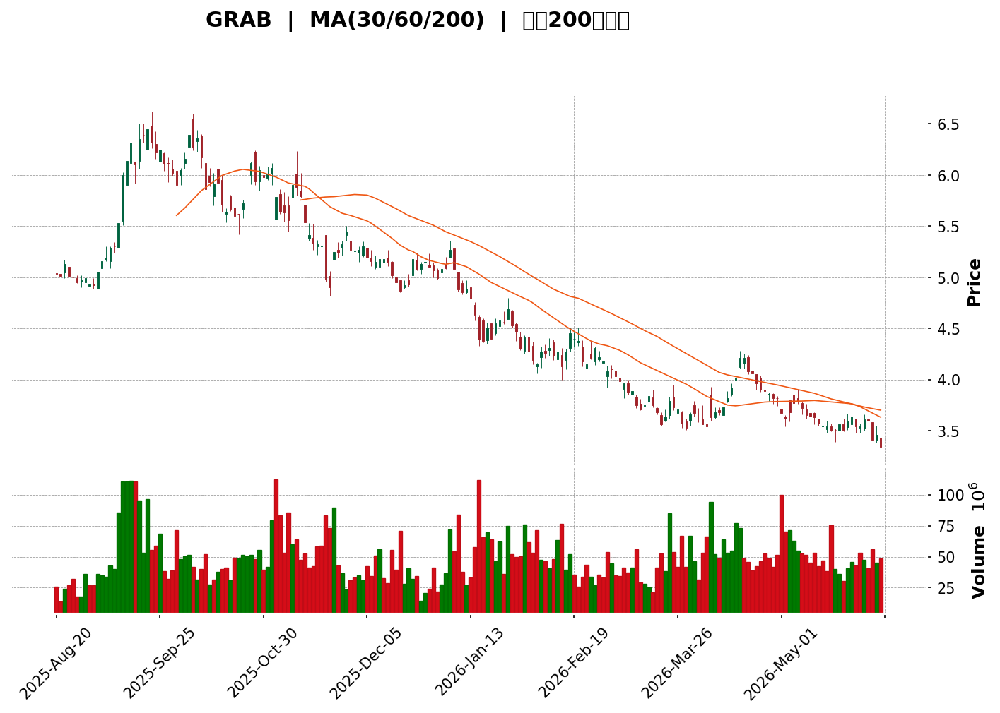
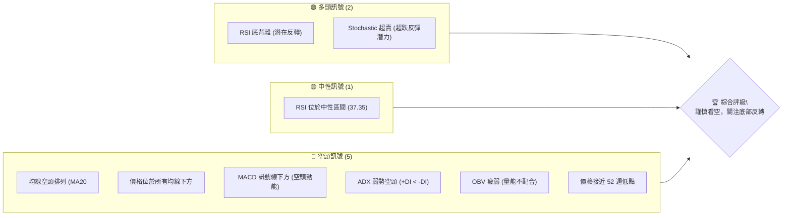
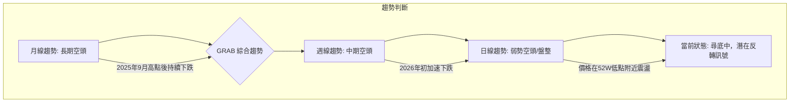

<details>
<summary>📊 靜態圖表 (點擊展開)</summary>

</details>

<html>
<head><meta charset="utf-8" /></head>
<body>
    <div style="height:500px; width:100%;">                        <script>window.PlotlyConfig = {MathJaxConfig: 'local'};</script>
        <script charset="utf-8" src="https://cdn.plot.ly/plotly-3.6.0.min.js" integrity="sha256-QaOVwtVY0T02VaHrr6pnoHLCwayMJp4O5n4YyaE3rJk=" crossorigin="anonymous"></script>                <div id="candlestick-chart" class="plotly-graph-div" style="height:100%; width:100%;"></div>            <script>                window.PLOTLYENV=window.PLOTLYENV || {};                                if (document.getElementById("candlestick-chart")) {                    Plotly.newPlot(                        "candlestick-chart",                        [{"close":{"dtype":"f8","bdata":"AAAAYLgeFEAAAACAPQoUQAAAAMAehRRAAAAAgD0KFEAAAAAAAAAUQAAAAMDMzBNAAAAAoEfhE0AAAACAwvUTQAAAAOBRuBNAAAAAgBSuE0AAAABAMzMUQAAAAADXoxRAAAAAYI\u002fCFEAAAADA9SgVQAAAAEAzMxVAAAAAYLgeFkAAAAAAAAAYQAAAACBcjxhAAAAAIK5HGUAAAABgZmYYQAAAAGBmZhlAAAAAIFyPGUAAAADAzMwZQAAAACCuRxlAAAAAoEfhGEAAAAAAAAAZQAAAAOCjcBhAAAAA4KNwGEAAAADgehQYQAAAAKCZmRdAAAAAQDMzGEAAAAAA16MYQAAAACBcjxlAAAAA4HoUGUAAAADgo3AZQAAAAIAUrhhAAAAA4KNwF0AAAADgUbgXQAAAAADXoxdAAAAAgBSuF0AAAABACtcWQAAAACBcjxZAAAAAgBSuFkAAAABgZmYWQAAAAEDhehZAAAAAoEfhFkAAAABgZmYXQAAAAEDhehhAAAAAYI\u002fCF0AAAABAMzMYQAAAACCF6xdAAAAAgD0KGEAAAAAgrkcYQAAAAADXIxdAAAAAIFyPFkAAAADAHoUWQAAAAKBwPRZAAAAAoJmZF0AAAADAHoUXQAAAAMD1KBdAAAAAwPUoFkAAAAAA16MVQAAAAIDrURVAAAAAIK5HFUAAAACgcD0VQAAAACCF6xNAAAAAoJmZE0AAAAAAAAAVQAAAAIDC9RRAAAAAIK5HFUAAAADAzMwVQAAAAOB6FBVAAAAAgD0KFUAAAADgehQVQAAAAEAzMxVAAAAAYI\u002fCFEAAAAAA16MUQAAAAKCZmRRAAAAA4FG4FEAAAADgUbgUQAAAAKCZmRRAAAAA4HoUFEAAAADAzMwTQAAAAEDhehNAAAAAgBSuE0AAAADgUbgTQAAAAOBRuBRAAAAAgOtRFEAAAADAHoUUQAAAAKCZmRRAAAAAYGZmFEAAAAAgrkcUQAAAAIDC9RNAAAAAgOtRFEAAAAAAKVwUQAAAAOB6FBVAAAAAgOtRFEAAAADAHoUTQAAAAGBmZhNAAAAAIFyPE0AAAADA9SgTQAAAAMAehRJAAAAAIFyPEUAAAADAHoURQAAAAIA9ChJAAAAAoJmZEUAAAABAMzMSQAAAAIDrURJAAAAAoHA9EkAAAABgj8ISQAAAAGC4HhJAAAAAoEfhEUAAAABAMzMRQAAAAADXoxFAAAAA4HoUEUAAAABgj8IQQAAAAKCZmRBAAAAA4HoUEUAAAACAPQoRQAAAAKBwPRFAAAAAIIXrEEAAAADgehQRQAAAAMAehRBAAAAA4HoUEUAAAADAzMwRQAAAAKCZmRFAAAAAwB6FEUAAAADgUbgQQAAAAKCZmRBAAAAAQArXEEAAAACgcD0RQAAAAKBH4RBAAAAA4FG4EEAAAACA61EQQAAAAGBmZhBAAAAAYLgeEEAAAABACtcPQAAAAIAUrg9AAAAAgML1DkAAAABguB4PQAAAAAAAAA5AAAAAgBSuDUAAAAAAAAAOQAAAAOBRuA5AAAAAAAAADkAAAADgo3ANQAAAAEDhegxAAAAAYLgeDUAAAACA61EOQAAAAEAK1w1AAAAAgBSuDUAAAAAgXI8MQAAAAKBwPQxAAAAAIK5HDUAAAAAAKVwNQAAAAIDC9QxAAAAAQOF6DEAAAACA61EMQAAAAIA9Cg1AAAAA4KNwDUAAAADgo3ANQAAAAEAK1w1AAAAAIFyPDkAAAAAAKVwPQAAAAOB6FBBAAAAAQArXEEAAAABACtcQQAAAAIDrURBAAAAAoHA9EEAAAACAFK4PQAAAAEAzMw9AAAAAYLgeD0AAAACgR+EOQAAAACBcjw5AAAAAIFyPDkAAAAAAKVwNQAAAAIDC9QxAAAAA4KNwDUAAAADA9SgOQAAAAIDrUQ5AAAAAYI\u002fCDUAAAABAMzMNQAAAAGC4Hg1AAAAAgD0KDUAAAAAgXI8MQAAAAGBmZgxAAAAAgOtRDEAAAAAAAAAMQAAAAOB6FAxAAAAAQOF6DEAAAADgehQMQAAAAOBRuAxAAAAAYLgeDUAAAACA61EMQAAAAIDrUQxAAAAAoEfhDEAAAADAzMwMQAAAACCuRwtAAAAAgBSuC0AAAADgUbgKQA=="},"high":{"dtype":"f8","bdata":"AAAAwPUoFEAAAAAgrkcUQAAAAIAUrhRAAAAAQOF6FEAAAACAPQoUQAAAAOB6FBRAAAAA4HoUFEAAAACAPQoUQAAAAEAK1xNAAAAAgML1E0AAAAAAKVwUQAAAAOBRuBRAAAAA4FE4FUAAAABAMzMVQAAAAAApXBVAAAAAIK5HFkAAAABguB4YQAAAAADXoxhAAAAAgBSuGUAAAADAHoUYQAAAAAAAABpAAAAAAAAAGkAAAACA61EaQAAAAEDhehpAAAAA4FG4GUAAAADgehQZQAAAAKBH4RhAAAAAgBSuGEAAAACgmZkYQAAAAKBH4RhAAAAAIK5HGEAAAACgR+EYQAAAACCuxxlAAAAAYGZmGkAAAABAicEZQAAAAKCZmRlAAAAAIFyPGEAAAAAgrkcYQAAAAOB6FBhAAAAAIFyPGEAAAACAwvUXQAAAAEAzsxZAAAAAgGo8F0AAAADgUbgWQAAAAEDhehZAAAAAgD0KF0AAAADA9agXQAAAAMAehRhAAAAAgML1GEAAAAAAKVwYQAAAAIDrURhAAAAAgOtRGEAAAACAwnUYQAAAACCuRxdAAAAA4KNwF0AAAABAClcXQAAAAMD1KBdAAAAAAAAAGEAAAADgo\u002fAYQAAAAOB6FBhAAAAAoEfhFkAAAABguB4WQAAAAOB6FBZAAAAAgMJ1FUAAAADAHoUVQAAAAADXoxVAAAAAoHA9FEAAAABA4XoVQAAAAAApXBVAAAAA4KNwFUAAAAAAAAAWQAAAAEDhehVAAAAAoHA9FUAAAABAMzMVQAAAAGBmZhVAAAAAYGZmFUAAAAAgXA8VQAAAAAAp3BRAAAAAgML1FEAAAABgj8IUQAAAAOB6FBVAAAAAANejFEAAAABAMzMUQAAAAKBH4RNAAAAAoEfhE0AAAABguB4UQAAAAGC4HhVAAAAAgML1FEAAAACgmZkUQAAAAADXoxRAAAAAIIXrFEAAAAAgXI8UQAAAAAApXBRAAAAAwB6FFEAAAADAzMwUQAAAAOCjcBVAAAAAgOtRFUAAAABAMzMUQAAAAKBH4RNAAAAAoEfhE0AAAACgmZkTQAAAAIA9ChNAAAAAwB6FEkAAAABgZmYSQAAAAOBROBJAAAAAQDMzEkAAAABgZmYSQAAAACBcjxJAAAAAgBSuEkAAAACAFC4TQAAAAOBRuBJAAAAA4FE4EkAAAACgR+ERQAAAAOBRuBFAAAAAYI\u002fCEUAAAABA4XoRQAAAAADXoxBAAAAAwMxMEUAAAAAAKVwRQAAAAGC4nhFAAAAAIFyPEUAAAACAwvURQAAAAOBROBFAAAAAQDMzEUAAAACAPQoSQAAAAEAK1xFAAAAAwB4FEkAAAACAPYoRQAAAAKCZmRBAAAAAwB6FEUAAAAAgrkcRQAAAAGC4HhFAAAAAoEfhEEAAAACAPYoQQAAAAOB6lBBAAAAAwB6FEEAAAADA9SgQQAAAAIAUrg9AAAAAAAAAEEAAAADAHoUPQAAAAMDMzA5AAAAAQOF6DkAAAAAA16MOQAAAAIDC9Q5AAAAAQDMzD0AAAABACtcNQAAAAOCjcA1AAAAAgBSuDUAAAAAA16MOQAAAAKCZmQ9AAAAA4FG4DkAAAADAHoUNQAAAAIDC9QxAAAAA4KNwDUAAAACA61EOQAAAAGCPwg1AAAAAAAAADkAAAABgj8IMQAAAAOCjcA9AAAAAQArXDUAAAADAzMwNQAAAAKBwPQ5AAAAA4HoUD0AAAADgUbgPQAAAAAApXBBAAAAAYLgeEUAAAAAAAAARQAAAAIDC9RBAAAAA4KNwEEAAAABAMzMQQAAAAMD1KBBAAAAAIIXrD0AAAAAAAAAPQAAAACCF6w5AAAAA4FG4DkAAAACgR+ENQAAAAEAzMw1AAAAA4KNwDkAAAACgmZkPQAAAAEAzMw9AAAAAoHA9DkAAAADgehQOQAAAAOCjcA1AAAAA4KNwDUAAAACAwvUMQAAAACBcjwxAAAAAwMzMDEAAAAAgXI8MQAAAAIDpJgxAAAAAANejDEAAAACAwvUMQAAAAIDrUQ1AAAAAAClcDUAAAACAwvUMQAAAACBcjwxAAAAAIK5HDUAAAAAgrkcNQAAAAOBRuAxAAAAAYGZmDEAAAADAHoULQA=="},"hovertemplate":"\u003cb\u003e%{x|%Y-%m-%d}\u003c\u002fb\u003e\u003cbr\u003e\u958b: $%{open:.2f}\u003cbr\u003e\u9ad8: $%{high:.2f}\u003cbr\u003e\u4f4e: $%{low:.2f}\u003cbr\u003e\u6536: $%{close:.2f}\u003cextra\u003e\u003c\u002fextra\u003e","low":{"dtype":"f8","bdata":"AAAAoJmZE0AAAAAAAAAUQAAAAIDC9RNAAAAAgML1E0AAAADgUbgTQAAAAGCPwhNAAAAAoJmZE0AAAAAA16MTQAAAAAApXBNAAAAAIFyPE0AAAADAHoUTQAAAAKBwPRRAAAAAANejFEAAAAAAKVwUQAAAAIDC9RRAAAAAoEfhFEAAAACAPQoWQAAAAOCjcBZAAAAAANejF0AAAADA9agXQAAAAKBwPRhAAAAAIK5HGUAAAACgR+EYQAAAAIA9ChlAAAAAANejGEAAAACAwvUXQAAAAMD1KBhAAAAA4FG4F0AAAACAwvUXQAAAAIDrURdAAAAAoJmZF0AAAACgcD0YQAAAACBcjxhAAAAAgML1GEAAAAAghesYQAAAACCuRxhAAAAAAClcF0AAAAAgXI8XQAAAAMDMzBZAAAAAoJmZF0AAAAAgXI8WQAAAAMD1KBZAAAAAoJmZFkAAAADA9SgWQAAAAIAUrhVAAAAAgOtRFkAAAADgehQXQAAAAADXoxdAAAAAoJmZF0AAAABgZmYXQAAAAIAUrhdAAAAAwMzMF0AAAACgmZkXQAAAAOCjcBVAAAAAQOF6FkAAAACAFC4WQAAAAMDMzBVAAAAAIIXrFkAAAABAMzMXQAAAAGC4HhdAAAAAIIXrFUAAAADgo3AVQAAAAOB6FBVAAAAAoEfhFEAAAAAAAAAVQAAAAEAK1xNAAAAAIK5HE0AAAAAghWsUQAAAAGCPwhRAAAAAQArXFEAAAADgo3AVQAAAAAAAABVAAAAAoEfhFEAAAACgmZkUQAAAACCuxxRAAAAA4FG4FEAAAADgo3AUQAAAAIDrURRAAAAAQDMzFEAAAACgR2EUQAAAAOCjcBRAAAAAgML1E0AAAACAFK4TQAAAAGBmZhNAAAAAIFyPE0AAAAAA16MTQAAAAIA9ChRAAAAAIK5HFEAAAABguB4UQAAAAMDMTBRAAAAAoEdhFEAAAAAAAAAUQAAAACCF6xNAAAAAgD0KFEAAAACA61EUQAAAAGCPwhRAAAAAYI9CFEAAAADgo3ATQAAAAIDrURNAAAAAAClcE0AAAAAAAAATQAAAAIDrURJAAAAAgOtREUAAAADgo3ARQAAAAGBmZhFAAAAAIFyPEUAAAADgUbgRQAAAAOB6FBJAAAAAwPUoEkAAAAAAKVwSQAAAAIA9ChJAAAAAwB6FEUAAAADA9SgRQAAAAAAAABFAAAAA4FG4EEAAAACgmZkQQAAAAKBwPRBAAAAAgMJ1EEAAAABACtcQQAAAACCF6xBAAAAAYI\u002fCEEAAAADAzMwQQAAAAAAAABBAAAAAYGZmEEAAAADgehQRQAAAAGCPQhFAAAAAgOtREUAAAADAHoUQQAAAAEAzMxBAAAAA4KfGEEAAAAAgXI8QQAAAAOBRuBBAAAAAoHA9EEAAAAAAKVwPQAAAAIA9ChBAAAAAAAAAEEAAAABgj8IPQAAAAMAehQ5AAAAAwMzMDkAAAABA4XoOQAAAAGCPwg1AAAAAoJmZDUAAAABgj8INQAAAAMD1KA5AAAAAQArXDUAAAAAgrkcNQAAAAGBmZgxAAAAA4FG4DEAAAACAwvUMQAAAAKCZmQ1AAAAAgOtRDUAAAACgcD0MQAAAAOB6FAxAAAAAYGZmDEAAAABguB4NQAAAAADXowxAAAAAQOF6DEAAAABACtcLQAAAAMDMzAxAAAAAgML1DEAAAABAMzMNQAAAAADXowxAAAAAYGQ7DkAAAACAFK4OQAAAAEAK1w9AAAAA4KNwEEAAAADgo3AQQAAAAEAzMxBAAAAAwPUoEEAAAABAMzMPQAAAAIA9Cg9AAAAAoEfhDkAAAACA61EOQAAAAOB6FA5AAAAAIIXrDUAAAADA9SgMQAAAAIDrUQxAAAAA4FG4DEAAAAAghesNQAAAAOB6FA5AAAAAIK5HDUAAAACAwvUMQAAAAKBH4QxAAAAAQOF6DEAAAABgZmYMQAAAAIAUrgtAAAAAQArXC0AAAAAghesLQAAAAGC4HgtAAAAAoJmZC0AAAAAghesLQAAAAOB6FAxAAAAA4KNwDEAAAABACtcLQAAAAEAK1wtAAAAAAAAADEAAAAAgXI8MQAAAAIA9CgtAAAAAgD0KC0AAAACgmZkKQA=="},"name":"\u50f9\u683c","open":{"dtype":"f8","bdata":"AAAAwPUoFEAAAABguB4UQAAAAMAgMBRAAAAAYGZmFEAAAAAAAAAUQAAAAIDC9RNAAAAAQArXE0AAAADAzMwTQAAAAMD1qBNAAAAA4FG4E0AAAAAgXI8TQAAAAAApXBRAAAAAgBSuFEAAAAAA16MUQAAAAEAzMxVAAAAAwPUoFUAAAABAMzMWQAAAAKCZmRdAAAAAQOF6GEAAAADAHoUYQAAAAIA9ihhAAAAAIFyPGUAAAABA4foYQAAAACCF6xlAAAAAQDMzGUAAAADAHoUYQAAAAEAK1xhAAAAAgMJ1GEAAAACgcD0YQAAAAMD1KBhAAAAAgML1F0AAAABA4XoYQAAAAKCZGRlAAAAAQDMzGkAAAACA61EZQAAAAIA9ihlAAAAAQOF6GEAAAACAwvUXQAAAAMD1KBdAAAAAoHA9GEAAAADAzMwXQAAAAEDhehZAAAAAwPUoF0AAAADgUbgWQAAAAEDhehZAAAAAgBSuFkAAAACgR2EXQAAAAAAAABhAAAAAIIXrGEAAAABgj8IXQAAAAAAAABhAAAAAoEfhF0AAAACAPQoYQAAAAGCPQhZAAAAAYI9CF0AAAADAzMwWQAAAAMDMzBZAAAAAoJkZF0AAAAAgXA8YQAAAAGBmZhdAAAAAQArXFkAAAADAHoUVQAAAAIA9ihVAAAAA4FE4FUAAAABAMzMVQAAAAADXoxVAAAAAgD0KFEAAAACAFK4UQAAAAOB6FBVAAAAAwPUoFUAAAAAA16MVQAAAACCFaxVAAAAAwB4FFUAAAACAwvUUQAAAAEAK1xRAAAAAwPUoFUAAAABgj8IUQAAAACCFaxRAAAAAYGZmFEAAAADgepQUQAAAAGCPwhRAAAAAoJmZFEAAAABA4foTQAAAAKBH4RNAAAAAoJmZE0AAAACgR+ETQAAAAOB6FBRAAAAAgBSuFEAAAACA61EUQAAAACBcjxRAAAAAQOF6FEAAAACAwnUUQAAAACCuRxRAAAAAgBQuFEAAAADAHoUUQAAAAGCPwhRAAAAAYLgeFUAAAABAMzMUQAAAAGCPwhNAAAAAYGZmE0AAAACgmZkTQAAAACCF6xJAAAAA4KNwEkAAAACA61ESQAAAAIA9ihFAAAAAQDMzEkAAAADAzMwRQAAAAOB6FBJAAAAAoHA9EkAAAAAAKVwSQAAAAIAUrhJAAAAAwPUoEkAAAACAFK4RQAAAAGC4HhFAAAAAwPWoEUAAAACA61ERQAAAAMAehRBAAAAAoEfhEEAAAABguB4RQAAAAMD1KBFAAAAA4KNwEUAAAADAzMwQQAAAAIDC9RBAAAAAYI\u002fCEEAAAACgcD0RQAAAAOB6lBFAAAAA4KNwEUAAAADAzEwRQAAAAOCjcBBAAAAAAAAAEUAAAADgUbgQQAAAAMDMzBBAAAAAANejEEAAAABguB4QQAAAAOCjcBBAAAAAAClcEEAAAAAgXA8QQAAAACCuRw9AAAAAgBSuD0AAAADAzMwOQAAAAADXow5AAAAAYLgeDkAAAAAghesNQAAAAKBwPQ5AAAAAoJmZDkAAAABgj8INQAAAAEAzMw1AAAAAwMzMDEAAAABAMzMNQAAAAADXow5AAAAAYGZmDUAAAADgo3ANQAAAAOBRuAxAAAAAwMzMDEAAAAAAAAAOQAAAAIDC9QxAAAAAoEfhDEAAAADAHoUMQAAAAEAK1w5AAAAAgD0KDUAAAACgmZkNQAAAAEAzMw1AAAAAoHA9DkAAAADAzMwOQAAAAAAAABBAAAAAQOF6EEAAAABguJ4QQAAAAKBH4RBAAAAAAClcEEAAAABAMzMQQAAAAOB6FBBAAAAAQDMzD0AAAADAzMwOQAAAAKBH4Q5AAAAAIFyPDkAAAADgUbgNQAAAAOB6FA1AAAAAAClcDkAAAADAzMwOQAAAACBcjw5AAAAAwPUoDkAAAACAFK4NQAAAAAApXA1AAAAAAClcDUAAAACAwvUMQAAAAIDrUQxAAAAAYLgeDEAAAACA61EMQAAAAOB6FAxAAAAAAAAADEAAAABA4XoMQAAAACCuRwxAAAAAQOF6DEAAAACAwvUMQAAAAKBwPQxAAAAAwPUoDEAAAACgR+EMQAAAAADXowxAAAAAIK5HC0AAAADgo3ALQA=="},"x":["2025-08-20T00:00:00-04:00","2025-08-21T00:00:00-04:00","2025-08-22T00:00:00-04:00","2025-08-25T00:00:00-04:00","2025-08-26T00:00:00-04:00","2025-08-27T00:00:00-04:00","2025-08-28T00:00:00-04:00","2025-08-29T00:00:00-04:00","2025-09-02T00:00:00-04:00","2025-09-03T00:00:00-04:00","2025-09-04T00:00:00-04:00","2025-09-05T00:00:00-04:00","2025-09-08T00:00:00-04:00","2025-09-09T00:00:00-04:00","2025-09-10T00:00:00-04:00","2025-09-11T00:00:00-04:00","2025-09-12T00:00:00-04:00","2025-09-15T00:00:00-04:00","2025-09-16T00:00:00-04:00","2025-09-17T00:00:00-04:00","2025-09-18T00:00:00-04:00","2025-09-19T00:00:00-04:00","2025-09-22T00:00:00-04:00","2025-09-23T00:00:00-04:00","2025-09-24T00:00:00-04:00","2025-09-25T00:00:00-04:00","2025-09-26T00:00:00-04:00","2025-09-29T00:00:00-04:00","2025-09-30T00:00:00-04:00","2025-10-01T00:00:00-04:00","2025-10-02T00:00:00-04:00","2025-10-03T00:00:00-04:00","2025-10-06T00:00:00-04:00","2025-10-07T00:00:00-04:00","2025-10-08T00:00:00-04:00","2025-10-09T00:00:00-04:00","2025-10-10T00:00:00-04:00","2025-10-13T00:00:00-04:00","2025-10-14T00:00:00-04:00","2025-10-15T00:00:00-04:00","2025-10-16T00:00:00-04:00","2025-10-17T00:00:00-04:00","2025-10-20T00:00:00-04:00","2025-10-21T00:00:00-04:00","2025-10-22T00:00:00-04:00","2025-10-23T00:00:00-04:00","2025-10-24T00:00:00-04:00","2025-10-27T00:00:00-04:00","2025-10-28T00:00:00-04:00","2025-10-29T00:00:00-04:00","2025-10-30T00:00:00-04:00","2025-10-31T00:00:00-04:00","2025-11-03T00:00:00-05:00","2025-11-04T00:00:00-05:00","2025-11-05T00:00:00-05:00","2025-11-06T00:00:00-05:00","2025-11-07T00:00:00-05:00","2025-11-10T00:00:00-05:00","2025-11-11T00:00:00-05:00","2025-11-12T00:00:00-05:00","2025-11-13T00:00:00-05:00","2025-11-14T00:00:00-05:00","2025-11-17T00:00:00-05:00","2025-11-18T00:00:00-05:00","2025-11-19T00:00:00-05:00","2025-11-20T00:00:00-05:00","2025-11-21T00:00:00-05:00","2025-11-24T00:00:00-05:00","2025-11-25T00:00:00-05:00","2025-11-26T00:00:00-05:00","2025-11-28T00:00:00-05:00","2025-12-01T00:00:00-05:00","2025-12-02T00:00:00-05:00","2025-12-03T00:00:00-05:00","2025-12-04T00:00:00-05:00","2025-12-05T00:00:00-05:00","2025-12-08T00:00:00-05:00","2025-12-09T00:00:00-05:00","2025-12-10T00:00:00-05:00","2025-12-11T00:00:00-05:00","2025-12-12T00:00:00-05:00","2025-12-15T00:00:00-05:00","2025-12-16T00:00:00-05:00","2025-12-17T00:00:00-05:00","2025-12-18T00:00:00-05:00","2025-12-19T00:00:00-05:00","2025-12-22T00:00:00-05:00","2025-12-23T00:00:00-05:00","2025-12-24T00:00:00-05:00","2025-12-26T00:00:00-05:00","2025-12-29T00:00:00-05:00","2025-12-30T00:00:00-05:00","2025-12-31T00:00:00-05:00","2026-01-02T00:00:00-05:00","2026-01-05T00:00:00-05:00","2026-01-06T00:00:00-05:00","2026-01-07T00:00:00-05:00","2026-01-08T00:00:00-05:00","2026-01-09T00:00:00-05:00","2026-01-12T00:00:00-05:00","2026-01-13T00:00:00-05:00","2026-01-14T00:00:00-05:00","2026-01-15T00:00:00-05:00","2026-01-16T00:00:00-05:00","2026-01-20T00:00:00-05:00","2026-01-21T00:00:00-05:00","2026-01-22T00:00:00-05:00","2026-01-23T00:00:00-05:00","2026-01-26T00:00:00-05:00","2026-01-27T00:00:00-05:00","2026-01-28T00:00:00-05:00","2026-01-29T00:00:00-05:00","2026-01-30T00:00:00-05:00","2026-02-02T00:00:00-05:00","2026-02-03T00:00:00-05:00","2026-02-04T00:00:00-05:00","2026-02-05T00:00:00-05:00","2026-02-06T00:00:00-05:00","2026-02-09T00:00:00-05:00","2026-02-10T00:00:00-05:00","2026-02-11T00:00:00-05:00","2026-02-12T00:00:00-05:00","2026-02-13T00:00:00-05:00","2026-02-17T00:00:00-05:00","2026-02-18T00:00:00-05:00","2026-02-19T00:00:00-05:00","2026-02-20T00:00:00-05:00","2026-02-23T00:00:00-05:00","2026-02-24T00:00:00-05:00","2026-02-25T00:00:00-05:00","2026-02-26T00:00:00-05:00","2026-02-27T00:00:00-05:00","2026-03-02T00:00:00-05:00","2026-03-03T00:00:00-05:00","2026-03-04T00:00:00-05:00","2026-03-05T00:00:00-05:00","2026-03-06T00:00:00-05:00","2026-03-09T00:00:00-04:00","2026-03-10T00:00:00-04:00","2026-03-11T00:00:00-04:00","2026-03-12T00:00:00-04:00","2026-03-13T00:00:00-04:00","2026-03-16T00:00:00-04:00","2026-03-17T00:00:00-04:00","2026-03-18T00:00:00-04:00","2026-03-19T00:00:00-04:00","2026-03-20T00:00:00-04:00","2026-03-23T00:00:00-04:00","2026-03-24T00:00:00-04:00","2026-03-25T00:00:00-04:00","2026-03-26T00:00:00-04:00","2026-03-27T00:00:00-04:00","2026-03-30T00:00:00-04:00","2026-03-31T00:00:00-04:00","2026-04-01T00:00:00-04:00","2026-04-02T00:00:00-04:00","2026-04-06T00:00:00-04:00","2026-04-07T00:00:00-04:00","2026-04-08T00:00:00-04:00","2026-04-09T00:00:00-04:00","2026-04-10T00:00:00-04:00","2026-04-13T00:00:00-04:00","2026-04-14T00:00:00-04:00","2026-04-15T00:00:00-04:00","2026-04-16T00:00:00-04:00","2026-04-17T00:00:00-04:00","2026-04-20T00:00:00-04:00","2026-04-21T00:00:00-04:00","2026-04-22T00:00:00-04:00","2026-04-23T00:00:00-04:00","2026-04-24T00:00:00-04:00","2026-04-27T00:00:00-04:00","2026-04-28T00:00:00-04:00","2026-04-29T00:00:00-04:00","2026-04-30T00:00:00-04:00","2026-05-01T00:00:00-04:00","2026-05-04T00:00:00-04:00","2026-05-05T00:00:00-04:00","2026-05-06T00:00:00-04:00","2026-05-07T00:00:00-04:00","2026-05-08T00:00:00-04:00","2026-05-11T00:00:00-04:00","2026-05-12T00:00:00-04:00","2026-05-13T00:00:00-04:00","2026-05-14T00:00:00-04:00","2026-05-15T00:00:00-04:00","2026-05-18T00:00:00-04:00","2026-05-19T00:00:00-04:00","2026-05-20T00:00:00-04:00","2026-05-21T00:00:00-04:00","2026-05-22T00:00:00-04:00","2026-05-26T00:00:00-04:00","2026-05-27T00:00:00-04:00","2026-05-28T00:00:00-04:00","2026-05-29T00:00:00-04:00","2026-06-01T00:00:00-04:00","2026-06-02T00:00:00-04:00","2026-06-03T00:00:00-04:00","2026-06-04T00:00:00-04:00","2026-06-05T00:00:00-04:00"],"type":"candlestick"},{"hovertemplate":"MA30: $%{y:.2f}\u003cextra\u003e\u003c\u002fextra\u003e","line":{"color":"#2196F3","dash":"dash","width":2},"mode":"lines","name":"MA30","x":["2025-08-20T00:00:00-04:00","2025-08-21T00:00:00-04:00","2025-08-22T00:00:00-04:00","2025-08-25T00:00:00-04:00","2025-08-26T00:00:00-04:00","2025-08-27T00:00:00-04:00","2025-08-28T00:00:00-04:00","2025-08-29T00:00:00-04:00","2025-09-02T00:00:00-04:00","2025-09-03T00:00:00-04:00","2025-09-04T00:00:00-04:00","2025-09-05T00:00:00-04:00","2025-09-08T00:00:00-04:00","2025-09-09T00:00:00-04:00","2025-09-10T00:00:00-04:00","2025-09-11T00:00:00-04:00","2025-09-12T00:00:00-04:00","2025-09-15T00:00:00-04:00","2025-09-16T00:00:00-04:00","2025-09-17T00:00:00-04:00","2025-09-18T00:00:00-04:00","2025-09-19T00:00:00-04:00","2025-09-22T00:00:00-04:00","2025-09-23T00:00:00-04:00","2025-09-24T00:00:00-04:00","2025-09-25T00:00:00-04:00","2025-09-26T00:00:00-04:00","2025-09-29T00:00:00-04:00","2025-09-30T00:00:00-04:00","2025-10-01T00:00:00-04:00","2025-10-02T00:00:00-04:00","2025-10-03T00:00:00-04:00","2025-10-06T00:00:00-04:00","2025-10-07T00:00:00-04:00","2025-10-08T00:00:00-04:00","2025-10-09T00:00:00-04:00","2025-10-10T00:00:00-04:00","2025-10-13T00:00:00-04:00","2025-10-14T00:00:00-04:00","2025-10-15T00:00:00-04:00","2025-10-16T00:00:00-04:00","2025-10-17T00:00:00-04:00","2025-10-20T00:00:00-04:00","2025-10-21T00:00:00-04:00","2025-10-22T00:00:00-04:00","2025-10-23T00:00:00-04:00","2025-10-24T00:00:00-04:00","2025-10-27T00:00:00-04:00","2025-10-28T00:00:00-04:00","2025-10-29T00:00:00-04:00","2025-10-30T00:00:00-04:00","2025-10-31T00:00:00-04:00","2025-11-03T00:00:00-05:00","2025-11-04T00:00:00-05:00","2025-11-05T00:00:00-05:00","2025-11-06T00:00:00-05:00","2025-11-07T00:00:00-05:00","2025-11-10T00:00:00-05:00","2025-11-11T00:00:00-05:00","2025-11-12T00:00:00-05:00","2025-11-13T00:00:00-05:00","2025-11-14T00:00:00-05:00","2025-11-17T00:00:00-05:00","2025-11-18T00:00:00-05:00","2025-11-19T00:00:00-05:00","2025-11-20T00:00:00-05:00","2025-11-21T00:00:00-05:00","2025-11-24T00:00:00-05:00","2025-11-25T00:00:00-05:00","2025-11-26T00:00:00-05:00","2025-11-28T00:00:00-05:00","2025-12-01T00:00:00-05:00","2025-12-02T00:00:00-05:00","2025-12-03T00:00:00-05:00","2025-12-04T00:00:00-05:00","2025-12-05T00:00:00-05:00","2025-12-08T00:00:00-05:00","2025-12-09T00:00:00-05:00","2025-12-10T00:00:00-05:00","2025-12-11T00:00:00-05:00","2025-12-12T00:00:00-05:00","2025-12-15T00:00:00-05:00","2025-12-16T00:00:00-05:00","2025-12-17T00:00:00-05:00","2025-12-18T00:00:00-05:00","2025-12-19T00:00:00-05:00","2025-12-22T00:00:00-05:00","2025-12-23T00:00:00-05:00","2025-12-24T00:00:00-05:00","2025-12-26T00:00:00-05:00","2025-12-29T00:00:00-05:00","2025-12-30T00:00:00-05:00","2025-12-31T00:00:00-05:00","2026-01-02T00:00:00-05:00","2026-01-05T00:00:00-05:00","2026-01-06T00:00:00-05:00","2026-01-07T00:00:00-05:00","2026-01-08T00:00:00-05:00","2026-01-09T00:00:00-05:00","2026-01-12T00:00:00-05:00","2026-01-13T00:00:00-05:00","2026-01-14T00:00:00-05:00","2026-01-15T00:00:00-05:00","2026-01-16T00:00:00-05:00","2026-01-20T00:00:00-05:00","2026-01-21T00:00:00-05:00","2026-01-22T00:00:00-05:00","2026-01-23T00:00:00-05:00","2026-01-26T00:00:00-05:00","2026-01-27T00:00:00-05:00","2026-01-28T00:00:00-05:00","2026-01-29T00:00:00-05:00","2026-01-30T00:00:00-05:00","2026-02-02T00:00:00-05:00","2026-02-03T00:00:00-05:00","2026-02-04T00:00:00-05:00","2026-02-05T00:00:00-05:00","2026-02-06T00:00:00-05:00","2026-02-09T00:00:00-05:00","2026-02-10T00:00:00-05:00","2026-02-11T00:00:00-05:00","2026-02-12T00:00:00-05:00","2026-02-13T00:00:00-05:00","2026-02-17T00:00:00-05:00","2026-02-18T00:00:00-05:00","2026-02-19T00:00:00-05:00","2026-02-20T00:00:00-05:00","2026-02-23T00:00:00-05:00","2026-02-24T00:00:00-05:00","2026-02-25T00:00:00-05:00","2026-02-26T00:00:00-05:00","2026-02-27T00:00:00-05:00","2026-03-02T00:00:00-05:00","2026-03-03T00:00:00-05:00","2026-03-04T00:00:00-05:00","2026-03-05T00:00:00-05:00","2026-03-06T00:00:00-05:00","2026-03-09T00:00:00-04:00","2026-03-10T00:00:00-04:00","2026-03-11T00:00:00-04:00","2026-03-12T00:00:00-04:00","2026-03-13T00:00:00-04:00","2026-03-16T00:00:00-04:00","2026-03-17T00:00:00-04:00","2026-03-18T00:00:00-04:00","2026-03-19T00:00:00-04:00","2026-03-20T00:00:00-04:00","2026-03-23T00:00:00-04:00","2026-03-24T00:00:00-04:00","2026-03-25T00:00:00-04:00","2026-03-26T00:00:00-04:00","2026-03-27T00:00:00-04:00","2026-03-30T00:00:00-04:00","2026-03-31T00:00:00-04:00","2026-04-01T00:00:00-04:00","2026-04-02T00:00:00-04:00","2026-04-06T00:00:00-04:00","2026-04-07T00:00:00-04:00","2026-04-08T00:00:00-04:00","2026-04-09T00:00:00-04:00","2026-04-10T00:00:00-04:00","2026-04-13T00:00:00-04:00","2026-04-14T00:00:00-04:00","2026-04-15T00:00:00-04:00","2026-04-16T00:00:00-04:00","2026-04-17T00:00:00-04:00","2026-04-20T00:00:00-04:00","2026-04-21T00:00:00-04:00","2026-04-22T00:00:00-04:00","2026-04-23T00:00:00-04:00","2026-04-24T00:00:00-04:00","2026-04-27T00:00:00-04:00","2026-04-28T00:00:00-04:00","2026-04-29T00:00:00-04:00","2026-04-30T00:00:00-04:00","2026-05-01T00:00:00-04:00","2026-05-04T00:00:00-04:00","2026-05-05T00:00:00-04:00","2026-05-06T00:00:00-04:00","2026-05-07T00:00:00-04:00","2026-05-08T00:00:00-04:00","2026-05-11T00:00:00-04:00","2026-05-12T00:00:00-04:00","2026-05-13T00:00:00-04:00","2026-05-14T00:00:00-04:00","2026-05-15T00:00:00-04:00","2026-05-18T00:00:00-04:00","2026-05-19T00:00:00-04:00","2026-05-20T00:00:00-04:00","2026-05-21T00:00:00-04:00","2026-05-22T00:00:00-04:00","2026-05-26T00:00:00-04:00","2026-05-27T00:00:00-04:00","2026-05-28T00:00:00-04:00","2026-05-29T00:00:00-04:00","2026-06-01T00:00:00-04:00","2026-06-02T00:00:00-04:00","2026-06-03T00:00:00-04:00","2026-06-04T00:00:00-04:00","2026-06-05T00:00:00-04:00"],"y":{"dtype":"f8","bdata":"AAAAAAAA+H8AAAAAAAD4fwAAAAAAAPh\u002fAAAAAAAA+H8AAAAAAAD4fwAAAAAAAPh\u002fAAAAAAAA+H8AAAAAAAD4fwAAAAAAAPh\u002fAAAAAAAA+H8AAAAAAAD4fwAAAAAAAPh\u002fAAAAAAAA+H8AAAAAAAD4fwAAAAAAAPh\u002fAAAAAAAA+H8AAAAAAAD4fwAAAAAAAPh\u002fAAAAAAAA+H8AAAAAAAD4fwAAAAAAAPh\u002fAAAAAAAA+H8AAAAAAAD4fwAAAAAAAPh\u002fAAAAAAAA+H8AAAAAAAD4fwAAAAAAAPh\u002fAAAAAAAA+H8AAAAAAAD4f97d3b0taxZAMzMzo\u002f6NFkDNzMx8P7UWQImIiIhB4BZARERElEMLF0ARERFxrzkXQHd3d\u002fdTYxdAiYiI6LSBF0ARERHByqEXQAAAACA+wxdAIiIiQmDlF0DNzMxs5\u002fsXQKuqqrpJDBhAiYiICKwcGECrqqraQCcYQN7d3Q0tMhhAvLu7S6k4GEAzMzOTijMYQAAAANDbMhhAIiIiUuMlGECrqqpqLiQYQO\u002fu7k6NFxhAIiIi0pQKGEBVVVVVnP0XQN7d3W1Z6xdAAAAAUI3XF0C8u7urY8IXQCIiIrKdrxdAAAAAsHKoF0CamZlZq6MXQHd3dyfqnxdAREREtIGOF0Crqqoa6HQXQO\u002fu7q65UBdAVVVVdUwwF0CrqqpqdQwXQJqZmQnX4xZA3t3dbRLDFkAAAACA3KsWQDMzM\u002fP9lBZAIiIiEoOAFkB3d3cno3cWQLy7uwsCaxZAmpmZaQNdFkBERETUv1EWQBEREaHTRhZAvLu7a7w0FkC8u7sbLx0WQO\u002fu7h4T\u002fBVAMzMzIyLiFUBVVVX1b8QVQO\u002fu7k4bqBVA3t3djVCGFUB3d3fXFWAVQDMzM3PaQBVA7+7u\u002fkYoFUDNzMxMYhAVQO\u002fu7s5pAxVAmpmZiWznFEAAAADw0s0UQImIiIj6txRAERERwfWoFECrqqrKWp0UQDMzM9O\u002fkRRAvLu7q46JFECJiIhIDIIUQHd3d1fyixRARERENBeSFECJiIgYdoUUQJqZmTkmeBRAMzMz03hpFECJiIio8VIUQBEREUEZPRRAMzMzE2cfFEAzMzMjBgEUQDMzMwMP5hNAMzMz4xfLE0ARERGhRbYTQEREROTQohNAAAAAQKeNE0ARERGR7XwTQM3MzOzDZxNAMzMz8\u002f1UE0Crqqoqzj4TQAAAAKAaLxNAZmZm1uoYE0Dv7u6eqP8SQImIiFiA3BJAVVVVddrAEkCJiIhIKKMSQAAAAEB8hhJAMzMzE8poEkARERGRe00SQGZmZsYgMBJAMzMz43oUEkCrqqp6ov4RQN7d3U3w4BFAzczMnAvJEUCrqqrqJrERQJqZmTlCmRFAvLu7SwyCEUDe3d39qXERQKuqqlqrYxFAiYiIWIBcEUB3d3fnQlIRQERERERERBFAiYiIKKM3EUC8u7trLiQRQHd3d8cEDxFAd3d3d3f3EEDe3d31KNwQQO\u002fu7jaJwRBAREREPJinEECrqqpC0pQQQGZmZoZdgRBAIiIisp1vEEB3d3c\u002fNV4QQHd3d78RShBAmpmZuZA0EEDNzMzMhSQQQO\u002fu7q65EBBAVVVVtfP9D0AiIiJSKs4PQO\u002fu7o40pQ9AmpmZCZB7D0De3d2NUEYPQAAAABAREQ9AVVVVhRbZDkBmZma2Za0OQN7d3Q3miQ5AIiIiordlDkBmZmaWtToOQImIiDhCGQ5ARERExK4ADkARERGRwvUNQHd3d3dM8A1AERERMZb8DUC8u7u7SQwOQCIiIuJ6FA5AAAAAYHMhDkBmZma2OiYOQHd3dyd4MA5AIiIi4sE8DkBVVVVFREQOQO\u002fu7r7mQg5AVVVVFa5HDkAiIiJS\u002f0YOQFVVVeUXSw5AIiIi8tJNDkC8u7trdUwOQO\u002fu7v6NUA5AIiIiwjxRDkDNzMzcslYOQBEREUE1Xg5Ad3d39yhcDkBmZmZWVVUOQAAAAACOUA5AmpmZeTBPDkDNzMxsdUwOQFVVVUVERA5A3t3dHRM8DkBmZmYmeDAOQImIiHjpJg5A7+7uvp8aDkAzMzPDrgAOQHd3dyfq3w1AREREZPS2DUDe3d3dT40NQFVVVcWSXw1AMzMzA502DUCamZm5SQwNQA=="},"type":"scatter"},{"hovertemplate":"MA60: $%{y:.2f}\u003cextra\u003e\u003c\u002fextra\u003e","line":{"color":"#9C27B0","dash":"dash","width":2},"mode":"lines","name":"MA60","x":["2025-08-20T00:00:00-04:00","2025-08-21T00:00:00-04:00","2025-08-22T00:00:00-04:00","2025-08-25T00:00:00-04:00","2025-08-26T00:00:00-04:00","2025-08-27T00:00:00-04:00","2025-08-28T00:00:00-04:00","2025-08-29T00:00:00-04:00","2025-09-02T00:00:00-04:00","2025-09-03T00:00:00-04:00","2025-09-04T00:00:00-04:00","2025-09-05T00:00:00-04:00","2025-09-08T00:00:00-04:00","2025-09-09T00:00:00-04:00","2025-09-10T00:00:00-04:00","2025-09-11T00:00:00-04:00","2025-09-12T00:00:00-04:00","2025-09-15T00:00:00-04:00","2025-09-16T00:00:00-04:00","2025-09-17T00:00:00-04:00","2025-09-18T00:00:00-04:00","2025-09-19T00:00:00-04:00","2025-09-22T00:00:00-04:00","2025-09-23T00:00:00-04:00","2025-09-24T00:00:00-04:00","2025-09-25T00:00:00-04:00","2025-09-26T00:00:00-04:00","2025-09-29T00:00:00-04:00","2025-09-30T00:00:00-04:00","2025-10-01T00:00:00-04:00","2025-10-02T00:00:00-04:00","2025-10-03T00:00:00-04:00","2025-10-06T00:00:00-04:00","2025-10-07T00:00:00-04:00","2025-10-08T00:00:00-04:00","2025-10-09T00:00:00-04:00","2025-10-10T00:00:00-04:00","2025-10-13T00:00:00-04:00","2025-10-14T00:00:00-04:00","2025-10-15T00:00:00-04:00","2025-10-16T00:00:00-04:00","2025-10-17T00:00:00-04:00","2025-10-20T00:00:00-04:00","2025-10-21T00:00:00-04:00","2025-10-22T00:00:00-04:00","2025-10-23T00:00:00-04:00","2025-10-24T00:00:00-04:00","2025-10-27T00:00:00-04:00","2025-10-28T00:00:00-04:00","2025-10-29T00:00:00-04:00","2025-10-30T00:00:00-04:00","2025-10-31T00:00:00-04:00","2025-11-03T00:00:00-05:00","2025-11-04T00:00:00-05:00","2025-11-05T00:00:00-05:00","2025-11-06T00:00:00-05:00","2025-11-07T00:00:00-05:00","2025-11-10T00:00:00-05:00","2025-11-11T00:00:00-05:00","2025-11-12T00:00:00-05:00","2025-11-13T00:00:00-05:00","2025-11-14T00:00:00-05:00","2025-11-17T00:00:00-05:00","2025-11-18T00:00:00-05:00","2025-11-19T00:00:00-05:00","2025-11-20T00:00:00-05:00","2025-11-21T00:00:00-05:00","2025-11-24T00:00:00-05:00","2025-11-25T00:00:00-05:00","2025-11-26T00:00:00-05:00","2025-11-28T00:00:00-05:00","2025-12-01T00:00:00-05:00","2025-12-02T00:00:00-05:00","2025-12-03T00:00:00-05:00","2025-12-04T00:00:00-05:00","2025-12-05T00:00:00-05:00","2025-12-08T00:00:00-05:00","2025-12-09T00:00:00-05:00","2025-12-10T00:00:00-05:00","2025-12-11T00:00:00-05:00","2025-12-12T00:00:00-05:00","2025-12-15T00:00:00-05:00","2025-12-16T00:00:00-05:00","2025-12-17T00:00:00-05:00","2025-12-18T00:00:00-05:00","2025-12-19T00:00:00-05:00","2025-12-22T00:00:00-05:00","2025-12-23T00:00:00-05:00","2025-12-24T00:00:00-05:00","2025-12-26T00:00:00-05:00","2025-12-29T00:00:00-05:00","2025-12-30T00:00:00-05:00","2025-12-31T00:00:00-05:00","2026-01-02T00:00:00-05:00","2026-01-05T00:00:00-05:00","2026-01-06T00:00:00-05:00","2026-01-07T00:00:00-05:00","2026-01-08T00:00:00-05:00","2026-01-09T00:00:00-05:00","2026-01-12T00:00:00-05:00","2026-01-13T00:00:00-05:00","2026-01-14T00:00:00-05:00","2026-01-15T00:00:00-05:00","2026-01-16T00:00:00-05:00","2026-01-20T00:00:00-05:00","2026-01-21T00:00:00-05:00","2026-01-22T00:00:00-05:00","2026-01-23T00:00:00-05:00","2026-01-26T00:00:00-05:00","2026-01-27T00:00:00-05:00","2026-01-28T00:00:00-05:00","2026-01-29T00:00:00-05:00","2026-01-30T00:00:00-05:00","2026-02-02T00:00:00-05:00","2026-02-03T00:00:00-05:00","2026-02-04T00:00:00-05:00","2026-02-05T00:00:00-05:00","2026-02-06T00:00:00-05:00","2026-02-09T00:00:00-05:00","2026-02-10T00:00:00-05:00","2026-02-11T00:00:00-05:00","2026-02-12T00:00:00-05:00","2026-02-13T00:00:00-05:00","2026-02-17T00:00:00-05:00","2026-02-18T00:00:00-05:00","2026-02-19T00:00:00-05:00","2026-02-20T00:00:00-05:00","2026-02-23T00:00:00-05:00","2026-02-24T00:00:00-05:00","2026-02-25T00:00:00-05:00","2026-02-26T00:00:00-05:00","2026-02-27T00:00:00-05:00","2026-03-02T00:00:00-05:00","2026-03-03T00:00:00-05:00","2026-03-04T00:00:00-05:00","2026-03-05T00:00:00-05:00","2026-03-06T00:00:00-05:00","2026-03-09T00:00:00-04:00","2026-03-10T00:00:00-04:00","2026-03-11T00:00:00-04:00","2026-03-12T00:00:00-04:00","2026-03-13T00:00:00-04:00","2026-03-16T00:00:00-04:00","2026-03-17T00:00:00-04:00","2026-03-18T00:00:00-04:00","2026-03-19T00:00:00-04:00","2026-03-20T00:00:00-04:00","2026-03-23T00:00:00-04:00","2026-03-24T00:00:00-04:00","2026-03-25T00:00:00-04:00","2026-03-26T00:00:00-04:00","2026-03-27T00:00:00-04:00","2026-03-30T00:00:00-04:00","2026-03-31T00:00:00-04:00","2026-04-01T00:00:00-04:00","2026-04-02T00:00:00-04:00","2026-04-06T00:00:00-04:00","2026-04-07T00:00:00-04:00","2026-04-08T00:00:00-04:00","2026-04-09T00:00:00-04:00","2026-04-10T00:00:00-04:00","2026-04-13T00:00:00-04:00","2026-04-14T00:00:00-04:00","2026-04-15T00:00:00-04:00","2026-04-16T00:00:00-04:00","2026-04-17T00:00:00-04:00","2026-04-20T00:00:00-04:00","2026-04-21T00:00:00-04:00","2026-04-22T00:00:00-04:00","2026-04-23T00:00:00-04:00","2026-04-24T00:00:00-04:00","2026-04-27T00:00:00-04:00","2026-04-28T00:00:00-04:00","2026-04-29T00:00:00-04:00","2026-04-30T00:00:00-04:00","2026-05-01T00:00:00-04:00","2026-05-04T00:00:00-04:00","2026-05-05T00:00:00-04:00","2026-05-06T00:00:00-04:00","2026-05-07T00:00:00-04:00","2026-05-08T00:00:00-04:00","2026-05-11T00:00:00-04:00","2026-05-12T00:00:00-04:00","2026-05-13T00:00:00-04:00","2026-05-14T00:00:00-04:00","2026-05-15T00:00:00-04:00","2026-05-18T00:00:00-04:00","2026-05-19T00:00:00-04:00","2026-05-20T00:00:00-04:00","2026-05-21T00:00:00-04:00","2026-05-22T00:00:00-04:00","2026-05-26T00:00:00-04:00","2026-05-27T00:00:00-04:00","2026-05-28T00:00:00-04:00","2026-05-29T00:00:00-04:00","2026-06-01T00:00:00-04:00","2026-06-02T00:00:00-04:00","2026-06-03T00:00:00-04:00","2026-06-04T00:00:00-04:00","2026-06-05T00:00:00-04:00"],"y":{"dtype":"f8","bdata":"AAAAAAAA+H8AAAAAAAD4fwAAAAAAAPh\u002fAAAAAAAA+H8AAAAAAAD4fwAAAAAAAPh\u002fAAAAAAAA+H8AAAAAAAD4fwAAAAAAAPh\u002fAAAAAAAA+H8AAAAAAAD4fwAAAAAAAPh\u002fAAAAAAAA+H8AAAAAAAD4fwAAAAAAAPh\u002fAAAAAAAA+H8AAAAAAAD4fwAAAAAAAPh\u002fAAAAAAAA+H8AAAAAAAD4fwAAAAAAAPh\u002fAAAAAAAA+H8AAAAAAAD4fwAAAAAAAPh\u002fAAAAAAAA+H8AAAAAAAD4fwAAAAAAAPh\u002fAAAAAAAA+H8AAAAAAAD4fwAAAAAAAPh\u002fAAAAAAAA+H8AAAAAAAD4fwAAAAAAAPh\u002fAAAAAAAA+H8AAAAAAAD4fwAAAAAAAPh\u002fAAAAAAAA+H8AAAAAAAD4fwAAAAAAAPh\u002fAAAAAAAA+H8AAAAAAAD4fwAAAAAAAPh\u002fAAAAAAAA+H8AAAAAAAD4fwAAAAAAAPh\u002fAAAAAAAA+H8AAAAAAAD4fwAAAAAAAPh\u002fAAAAAAAA+H8AAAAAAAD4fwAAAAAAAPh\u002fAAAAAAAA+H8AAAAAAAD4fwAAAAAAAPh\u002fAAAAAAAA+H8AAAAAAAD4fwAAAAAAAPh\u002fAAAAAAAA+H8AAAAAAAD4f6uqqvKLBRdAvLu7K0AOF0C8u7vLExUXQLy7u5t9GBdAzczMBMgdF0De3d1tEiMXQImIiICVIxdAMzMzq2MiF0CJiIig0yYXQJqZmQkeLBdAIiIiqvEyF0AiIiJKxTkXQDMzM+OlOxdAERERudc8F0B3d3dXgDwXQHd3d1eAPBdAvLu727I2F0B3d3fXXCgXQHd3d3d3FxdAq6qqugIEF0AAAAAwT\u002fQWQO\u002fu7k7U3xZAAAAAsHLIFkBmZmYW2a4WQImIiPAZlhZAd3d3J+p\u002fFkBERET8YmkWQImIiMCDWRZAzczMnO9HFkDNzMwkvzgWQAAAAFjyKxZAq6qqursbFkCrqqpyIQkWQBEREcE88RVAiYiIkO3cFUCamZnZQMcVQImIiLDktxVAERER0ZSqFUBERERMqZgVQGZmZhaShhVAq6qq8v10FUAAAABoSmUVQGZmZqYNVBVAZmZmPjU+FUC8u7v7YikVQCIiIlJxFhVAd3d3J+r\u002fFEBmZmZeuukUQJqZmQFyzxRAmpmZseS3FEAzMzPDrqAUQN7d3Z3vhxRAiYiIQKdtFEAREREBck8UQJqZmYn6NxRAq6qq6pggFEDe3d11BQgUQLy7uxP17xNAd3d3fyPUE0BEREScfbgTQERERGQ7nxNAIiIi6t+IE0De3d0ta3UTQM3MzEzwYBNAd3d3xwRPE0CamZlhV0ATQKuqqlJxNhNAiYiIaJEtE0CamZmBThsTQJqZmTm0CBNAd3d3j8L1EkAzMzPTTeISQN7d3U1i0BJA3t3dtfO9EkBVVVWFpKkSQLy7u6MplRJA3t3dhV2BEkBmZmYGOm0SQN7d3dXqWBJAvLu7W49CEkB3d3dDiywSQN7d3ZGmFBJAvLu7F0v+EUCrqqo20OkRQDMzMxM82BFARERERETEEUAzMzPv7q4RQAAAAAxJkxFAd3d3l7V6EUCrqqoK12MRQHd3d\u002feaSxFA7+7u9uEzEUARERFdSBoRQO\u002fu7oZdARFAAAAAdCHpEEDNzMxg5dAQQO\u002fu7mq8tBBAvLu7b8uaEEDv7u7i7IMQQERERKAabxBAZmZmDnRaEECJiIhkgkcQQHd3dzsmOBBAVVVV3WsuEEAAAAAYkiYQQAAAAEA1HhBAiYiIIPcaEEDNzMykKRUQQERERByhDBBAvLu7kxgEEEARERFRRu8PQKuqqkrF2Q9AVVVVLfnFD0BVVVVl9LYPQN7d3eXQog9AzczMvHSTD0CJiIjotIEPQCIiIrKdbw9Aq6qqMnpbD0CrqqqCwEoPQGZmZq4AOQ9AvLu7O5gnD0B3d3eXbhIPQAAAAOi0AQ9AiYiIgNzrDkAiIiLy0s0OQAAAAIjPsA5Ad3d3fyOUDkCamZmR7XwOQJqZmSkVZw5AAAAAYOVQDkBmZmbeljUOQImIiNgVIA5AmpmZQacNDkAiIiKqOPsNQHd3d08b6A1Aq6qqSsXZDUDNzMzMzMwNQLy7u9MGug1AmpmZMQisDUAAAAA4QpkNQA=="},"type":"scatter"},{"hovertemplate":"MA200: $%{y:.2f}\u003cextra\u003e\u003c\u002fextra\u003e","line":{"color":"#FF6F00","dash":"solid","width":2},"mode":"lines","name":"MA200","x":["2025-08-20T00:00:00-04:00","2025-08-21T00:00:00-04:00","2025-08-22T00:00:00-04:00","2025-08-25T00:00:00-04:00","2025-08-26T00:00:00-04:00","2025-08-27T00:00:00-04:00","2025-08-28T00:00:00-04:00","2025-08-29T00:00:00-04:00","2025-09-02T00:00:00-04:00","2025-09-03T00:00:00-04:00","2025-09-04T00:00:00-04:00","2025-09-05T00:00:00-04:00","2025-09-08T00:00:00-04:00","2025-09-09T00:00:00-04:00","2025-09-10T00:00:00-04:00","2025-09-11T00:00:00-04:00","2025-09-12T00:00:00-04:00","2025-09-15T00:00:00-04:00","2025-09-16T00:00:00-04:00","2025-09-17T00:00:00-04:00","2025-09-18T00:00:00-04:00","2025-09-19T00:00:00-04:00","2025-09-22T00:00:00-04:00","2025-09-23T00:00:00-04:00","2025-09-24T00:00:00-04:00","2025-09-25T00:00:00-04:00","2025-09-26T00:00:00-04:00","2025-09-29T00:00:00-04:00","2025-09-30T00:00:00-04:00","2025-10-01T00:00:00-04:00","2025-10-02T00:00:00-04:00","2025-10-03T00:00:00-04:00","2025-10-06T00:00:00-04:00","2025-10-07T00:00:00-04:00","2025-10-08T00:00:00-04:00","2025-10-09T00:00:00-04:00","2025-10-10T00:00:00-04:00","2025-10-13T00:00:00-04:00","2025-10-14T00:00:00-04:00","2025-10-15T00:00:00-04:00","2025-10-16T00:00:00-04:00","2025-10-17T00:00:00-04:00","2025-10-20T00:00:00-04:00","2025-10-21T00:00:00-04:00","2025-10-22T00:00:00-04:00","2025-10-23T00:00:00-04:00","2025-10-24T00:00:00-04:00","2025-10-27T00:00:00-04:00","2025-10-28T00:00:00-04:00","2025-10-29T00:00:00-04:00","2025-10-30T00:00:00-04:00","2025-10-31T00:00:00-04:00","2025-11-03T00:00:00-05:00","2025-11-04T00:00:00-05:00","2025-11-05T00:00:00-05:00","2025-11-06T00:00:00-05:00","2025-11-07T00:00:00-05:00","2025-11-10T00:00:00-05:00","2025-11-11T00:00:00-05:00","2025-11-12T00:00:00-05:00","2025-11-13T00:00:00-05:00","2025-11-14T00:00:00-05:00","2025-11-17T00:00:00-05:00","2025-11-18T00:00:00-05:00","2025-11-19T00:00:00-05:00","2025-11-20T00:00:00-05:00","2025-11-21T00:00:00-05:00","2025-11-24T00:00:00-05:00","2025-11-25T00:00:00-05:00","2025-11-26T00:00:00-05:00","2025-11-28T00:00:00-05:00","2025-12-01T00:00:00-05:00","2025-12-02T00:00:00-05:00","2025-12-03T00:00:00-05:00","2025-12-04T00:00:00-05:00","2025-12-05T00:00:00-05:00","2025-12-08T00:00:00-05:00","2025-12-09T00:00:00-05:00","2025-12-10T00:00:00-05:00","2025-12-11T00:00:00-05:00","2025-12-12T00:00:00-05:00","2025-12-15T00:00:00-05:00","2025-12-16T00:00:00-05:00","2025-12-17T00:00:00-05:00","2025-12-18T00:00:00-05:00","2025-12-19T00:00:00-05:00","2025-12-22T00:00:00-05:00","2025-12-23T00:00:00-05:00","2025-12-24T00:00:00-05:00","2025-12-26T00:00:00-05:00","2025-12-29T00:00:00-05:00","2025-12-30T00:00:00-05:00","2025-12-31T00:00:00-05:00","2026-01-02T00:00:00-05:00","2026-01-05T00:00:00-05:00","2026-01-06T00:00:00-05:00","2026-01-07T00:00:00-05:00","2026-01-08T00:00:00-05:00","2026-01-09T00:00:00-05:00","2026-01-12T00:00:00-05:00","2026-01-13T00:00:00-05:00","2026-01-14T00:00:00-05:00","2026-01-15T00:00:00-05:00","2026-01-16T00:00:00-05:00","2026-01-20T00:00:00-05:00","2026-01-21T00:00:00-05:00","2026-01-22T00:00:00-05:00","2026-01-23T00:00:00-05:00","2026-01-26T00:00:00-05:00","2026-01-27T00:00:00-05:00","2026-01-28T00:00:00-05:00","2026-01-29T00:00:00-05:00","2026-01-30T00:00:00-05:00","2026-02-02T00:00:00-05:00","2026-02-03T00:00:00-05:00","2026-02-04T00:00:00-05:00","2026-02-05T00:00:00-05:00","2026-02-06T00:00:00-05:00","2026-02-09T00:00:00-05:00","2026-02-10T00:00:00-05:00","2026-02-11T00:00:00-05:00","2026-02-12T00:00:00-05:00","2026-02-13T00:00:00-05:00","2026-02-17T00:00:00-05:00","2026-02-18T00:00:00-05:00","2026-02-19T00:00:00-05:00","2026-02-20T00:00:00-05:00","2026-02-23T00:00:00-05:00","2026-02-24T00:00:00-05:00","2026-02-25T00:00:00-05:00","2026-02-26T00:00:00-05:00","2026-02-27T00:00:00-05:00","2026-03-02T00:00:00-05:00","2026-03-03T00:00:00-05:00","2026-03-04T00:00:00-05:00","2026-03-05T00:00:00-05:00","2026-03-06T00:00:00-05:00","2026-03-09T00:00:00-04:00","2026-03-10T00:00:00-04:00","2026-03-11T00:00:00-04:00","2026-03-12T00:00:00-04:00","2026-03-13T00:00:00-04:00","2026-03-16T00:00:00-04:00","2026-03-17T00:00:00-04:00","2026-03-18T00:00:00-04:00","2026-03-19T00:00:00-04:00","2026-03-20T00:00:00-04:00","2026-03-23T00:00:00-04:00","2026-03-24T00:00:00-04:00","2026-03-25T00:00:00-04:00","2026-03-26T00:00:00-04:00","2026-03-27T00:00:00-04:00","2026-03-30T00:00:00-04:00","2026-03-31T00:00:00-04:00","2026-04-01T00:00:00-04:00","2026-04-02T00:00:00-04:00","2026-04-06T00:00:00-04:00","2026-04-07T00:00:00-04:00","2026-04-08T00:00:00-04:00","2026-04-09T00:00:00-04:00","2026-04-10T00:00:00-04:00","2026-04-13T00:00:00-04:00","2026-04-14T00:00:00-04:00","2026-04-15T00:00:00-04:00","2026-04-16T00:00:00-04:00","2026-04-17T00:00:00-04:00","2026-04-20T00:00:00-04:00","2026-04-21T00:00:00-04:00","2026-04-22T00:00:00-04:00","2026-04-23T00:00:00-04:00","2026-04-24T00:00:00-04:00","2026-04-27T00:00:00-04:00","2026-04-28T00:00:00-04:00","2026-04-29T00:00:00-04:00","2026-04-30T00:00:00-04:00","2026-05-01T00:00:00-04:00","2026-05-04T00:00:00-04:00","2026-05-05T00:00:00-04:00","2026-05-06T00:00:00-04:00","2026-05-07T00:00:00-04:00","2026-05-08T00:00:00-04:00","2026-05-11T00:00:00-04:00","2026-05-12T00:00:00-04:00","2026-05-13T00:00:00-04:00","2026-05-14T00:00:00-04:00","2026-05-15T00:00:00-04:00","2026-05-18T00:00:00-04:00","2026-05-19T00:00:00-04:00","2026-05-20T00:00:00-04:00","2026-05-21T00:00:00-04:00","2026-05-22T00:00:00-04:00","2026-05-26T00:00:00-04:00","2026-05-27T00:00:00-04:00","2026-05-28T00:00:00-04:00","2026-05-29T00:00:00-04:00","2026-06-01T00:00:00-04:00","2026-06-02T00:00:00-04:00","2026-06-03T00:00:00-04:00","2026-06-04T00:00:00-04:00","2026-06-05T00:00:00-04:00"],"y":{"dtype":"f8","bdata":"AAAAAAAA+H8AAAAAAAD4fwAAAAAAAPh\u002fAAAAAAAA+H8AAAAAAAD4fwAAAAAAAPh\u002fAAAAAAAA+H8AAAAAAAD4fwAAAAAAAPh\u002fAAAAAAAA+H8AAAAAAAD4fwAAAAAAAPh\u002fAAAAAAAA+H8AAAAAAAD4fwAAAAAAAPh\u002fAAAAAAAA+H8AAAAAAAD4fwAAAAAAAPh\u002fAAAAAAAA+H8AAAAAAAD4fwAAAAAAAPh\u002fAAAAAAAA+H8AAAAAAAD4fwAAAAAAAPh\u002fAAAAAAAA+H8AAAAAAAD4fwAAAAAAAPh\u002fAAAAAAAA+H8AAAAAAAD4fwAAAAAAAPh\u002fAAAAAAAA+H8AAAAAAAD4fwAAAAAAAPh\u002fAAAAAAAA+H8AAAAAAAD4fwAAAAAAAPh\u002fAAAAAAAA+H8AAAAAAAD4fwAAAAAAAPh\u002fAAAAAAAA+H8AAAAAAAD4fwAAAAAAAPh\u002fAAAAAAAA+H8AAAAAAAD4fwAAAAAAAPh\u002fAAAAAAAA+H8AAAAAAAD4fwAAAAAAAPh\u002fAAAAAAAA+H8AAAAAAAD4fwAAAAAAAPh\u002fAAAAAAAA+H8AAAAAAAD4fwAAAAAAAPh\u002fAAAAAAAA+H8AAAAAAAD4fwAAAAAAAPh\u002fAAAAAAAA+H8AAAAAAAD4fwAAAAAAAPh\u002fAAAAAAAA+H8AAAAAAAD4fwAAAAAAAPh\u002fAAAAAAAA+H8AAAAAAAD4fwAAAAAAAPh\u002fAAAAAAAA+H8AAAAAAAD4fwAAAAAAAPh\u002fAAAAAAAA+H8AAAAAAAD4fwAAAAAAAPh\u002fAAAAAAAA+H8AAAAAAAD4fwAAAAAAAPh\u002fAAAAAAAA+H8AAAAAAAD4fwAAAAAAAPh\u002fAAAAAAAA+H8AAAAAAAD4fwAAAAAAAPh\u002fAAAAAAAA+H8AAAAAAAD4fwAAAAAAAPh\u002fAAAAAAAA+H8AAAAAAAD4fwAAAAAAAPh\u002fAAAAAAAA+H8AAAAAAAD4fwAAAAAAAPh\u002fAAAAAAAA+H8AAAAAAAD4fwAAAAAAAPh\u002fAAAAAAAA+H8AAAAAAAD4fwAAAAAAAPh\u002fAAAAAAAA+H8AAAAAAAD4fwAAAAAAAPh\u002fAAAAAAAA+H8AAAAAAAD4fwAAAAAAAPh\u002fAAAAAAAA+H8AAAAAAAD4fwAAAAAAAPh\u002fAAAAAAAA+H8AAAAAAAD4fwAAAAAAAPh\u002fAAAAAAAA+H8AAAAAAAD4fwAAAAAAAPh\u002fAAAAAAAA+H8AAAAAAAD4fwAAAAAAAPh\u002fAAAAAAAA+H8AAAAAAAD4fwAAAAAAAPh\u002fAAAAAAAA+H8AAAAAAAD4fwAAAAAAAPh\u002fAAAAAAAA+H8AAAAAAAD4fwAAAAAAAPh\u002fAAAAAAAA+H8AAAAAAAD4fwAAAAAAAPh\u002fAAAAAAAA+H8AAAAAAAD4fwAAAAAAAPh\u002fAAAAAAAA+H8AAAAAAAD4fwAAAAAAAPh\u002fAAAAAAAA+H8AAAAAAAD4fwAAAAAAAPh\u002fAAAAAAAA+H8AAAAAAAD4fwAAAAAAAPh\u002fAAAAAAAA+H8AAAAAAAD4fwAAAAAAAPh\u002fAAAAAAAA+H8AAAAAAAD4fwAAAAAAAPh\u002fAAAAAAAA+H8AAAAAAAD4fwAAAAAAAPh\u002fAAAAAAAA+H8AAAAAAAD4fwAAAAAAAPh\u002fAAAAAAAA+H8AAAAAAAD4fwAAAAAAAPh\u002fAAAAAAAA+H8AAAAAAAD4fwAAAAAAAPh\u002fAAAAAAAA+H8AAAAAAAD4fwAAAAAAAPh\u002fAAAAAAAA+H8AAAAAAAD4fwAAAAAAAPh\u002fAAAAAAAA+H8AAAAAAAD4fwAAAAAAAPh\u002fAAAAAAAA+H8AAAAAAAD4fwAAAAAAAPh\u002fAAAAAAAA+H8AAAAAAAD4fwAAAAAAAPh\u002fAAAAAAAA+H8AAAAAAAD4fwAAAAAAAPh\u002fAAAAAAAA+H8AAAAAAAD4fwAAAAAAAPh\u002fAAAAAAAA+H8AAAAAAAD4fwAAAAAAAPh\u002fAAAAAAAA+H8AAAAAAAD4fwAAAAAAAPh\u002fAAAAAAAA+H8AAAAAAAD4fwAAAAAAAPh\u002fAAAAAAAA+H8AAAAAAAD4fwAAAAAAAPh\u002fAAAAAAAA+H8AAAAAAAD4fwAAAAAAAPh\u002fAAAAAAAA+H8AAAAAAAD4fwAAAAAAAPh\u002fAAAAAAAA+H8AAAAAAAD4fwAAAAAAAPh\u002fAAAAAAAA+H8AAAA0EeYSQA=="},"type":"scatter"}],                        {"template":{"data":{"barpolar":[{"marker":{"line":{"color":"rgb(17,17,17)","width":0.5},"pattern":{"fillmode":"overlay","size":10,"solidity":0.2}},"type":"barpolar"}],"bar":[{"error_x":{"color":"#f2f5fa"},"error_y":{"color":"#f2f5fa"},"marker":{"line":{"color":"rgb(17,17,17)","width":0.5},"pattern":{"fillmode":"overlay","size":10,"solidity":0.2}},"type":"bar"}],"carpet":[{"aaxis":{"endlinecolor":"#A2B1C6","gridcolor":"#506784","linecolor":"#506784","minorgridcolor":"#506784","startlinecolor":"#A2B1C6"},"baxis":{"endlinecolor":"#A2B1C6","gridcolor":"#506784","linecolor":"#506784","minorgridcolor":"#506784","startlinecolor":"#A2B1C6"},"type":"carpet"}],"choropleth":[{"colorbar":{"outlinewidth":0,"ticks":""},"type":"choropleth"}],"contourcarpet":[{"colorbar":{"outlinewidth":0,"ticks":""},"type":"contourcarpet"}],"contour":[{"colorbar":{"outlinewidth":0,"ticks":""},"colorscale":[[0.0,"#0d0887"],[0.1111111111111111,"#46039f"],[0.2222222222222222,"#7201a8"],[0.3333333333333333,"#9c179e"],[0.4444444444444444,"#bd3786"],[0.5555555555555556,"#d8576b"],[0.6666666666666666,"#ed7953"],[0.7777777777777778,"#fb9f3a"],[0.8888888888888888,"#fdca26"],[1.0,"#f0f921"]],"type":"contour"}],"heatmap":[{"colorbar":{"outlinewidth":0,"ticks":""},"colorscale":[[0.0,"#0d0887"],[0.1111111111111111,"#46039f"],[0.2222222222222222,"#7201a8"],[0.3333333333333333,"#9c179e"],[0.4444444444444444,"#bd3786"],[0.5555555555555556,"#d8576b"],[0.6666666666666666,"#ed7953"],[0.7777777777777778,"#fb9f3a"],[0.8888888888888888,"#fdca26"],[1.0,"#f0f921"]],"type":"heatmap"}],"histogram2dcontour":[{"colorbar":{"outlinewidth":0,"ticks":""},"colorscale":[[0.0,"#0d0887"],[0.1111111111111111,"#46039f"],[0.2222222222222222,"#7201a8"],[0.3333333333333333,"#9c179e"],[0.4444444444444444,"#bd3786"],[0.5555555555555556,"#d8576b"],[0.6666666666666666,"#ed7953"],[0.7777777777777778,"#fb9f3a"],[0.8888888888888888,"#fdca26"],[1.0,"#f0f921"]],"type":"histogram2dcontour"}],"histogram2d":[{"colorbar":{"outlinewidth":0,"ticks":""},"colorscale":[[0.0,"#0d0887"],[0.1111111111111111,"#46039f"],[0.2222222222222222,"#7201a8"],[0.3333333333333333,"#9c179e"],[0.4444444444444444,"#bd3786"],[0.5555555555555556,"#d8576b"],[0.6666666666666666,"#ed7953"],[0.7777777777777778,"#fb9f3a"],[0.8888888888888888,"#fdca26"],[1.0,"#f0f921"]],"type":"histogram2d"}],"histogram":[{"marker":{"pattern":{"fillmode":"overlay","size":10,"solidity":0.2}},"type":"histogram"}],"mesh3d":[{"colorbar":{"outlinewidth":0,"ticks":""},"type":"mesh3d"}],"parcoords":[{"line":{"colorbar":{"outlinewidth":0,"ticks":""}},"type":"parcoords"}],"pie":[{"automargin":true,"type":"pie"}],"scatter3d":[{"line":{"colorbar":{"outlinewidth":0,"ticks":""}},"marker":{"colorbar":{"outlinewidth":0,"ticks":""}},"type":"scatter3d"}],"scattercarpet":[{"marker":{"colorbar":{"outlinewidth":0,"ticks":""}},"type":"scattercarpet"}],"scattergeo":[{"marker":{"colorbar":{"outlinewidth":0,"ticks":""}},"type":"scattergeo"}],"scattergl":[{"marker":{"line":{"color":"#283442"}},"type":"scattergl"}],"scattermapbox":[{"marker":{"colorbar":{"outlinewidth":0,"ticks":""}},"type":"scattermapbox"}],"scattermap":[{"marker":{"colorbar":{"outlinewidth":0,"ticks":""}},"type":"scattermap"}],"scatterpolargl":[{"marker":{"colorbar":{"outlinewidth":0,"ticks":""}},"type":"scatterpolargl"}],"scatterpolar":[{"marker":{"colorbar":{"outlinewidth":0,"ticks":""}},"type":"scatterpolar"}],"scatter":[{"marker":{"line":{"color":"#283442"}},"type":"scatter"}],"scatterternary":[{"marker":{"colorbar":{"outlinewidth":0,"ticks":""}},"type":"scatterternary"}],"surface":[{"colorbar":{"outlinewidth":0,"ticks":""},"colorscale":[[0.0,"#0d0887"],[0.1111111111111111,"#46039f"],[0.2222222222222222,"#7201a8"],[0.3333333333333333,"#9c179e"],[0.4444444444444444,"#bd3786"],[0.5555555555555556,"#d8576b"],[0.6666666666666666,"#ed7953"],[0.7777777777777778,"#fb9f3a"],[0.8888888888888888,"#fdca26"],[1.0,"#f0f921"]],"type":"surface"}],"table":[{"cells":{"fill":{"color":"#506784"},"line":{"color":"rgb(17,17,17)"}},"header":{"fill":{"color":"#2a3f5f"},"line":{"color":"rgb(17,17,17)"}},"type":"table"}]},"layout":{"annotationdefaults":{"arrowcolor":"#f2f5fa","arrowhead":0,"arrowwidth":1},"autotypenumbers":"strict","coloraxis":{"colorbar":{"outlinewidth":0,"ticks":""}},"colorscale":{"diverging":[[0,"#8e0152"],[0.1,"#c51b7d"],[0.2,"#de77ae"],[0.3,"#f1b6da"],[0.4,"#fde0ef"],[0.5,"#f7f7f7"],[0.6,"#e6f5d0"],[0.7,"#b8e186"],[0.8,"#7fbc41"],[0.9,"#4d9221"],[1,"#276419"]],"sequential":[[0.0,"#0d0887"],[0.1111111111111111,"#46039f"],[0.2222222222222222,"#7201a8"],[0.3333333333333333,"#9c179e"],[0.4444444444444444,"#bd3786"],[0.5555555555555556,"#d8576b"],[0.6666666666666666,"#ed7953"],[0.7777777777777778,"#fb9f3a"],[0.8888888888888888,"#fdca26"],[1.0,"#f0f921"]],"sequentialminus":[[0.0,"#0d0887"],[0.1111111111111111,"#46039f"],[0.2222222222222222,"#7201a8"],[0.3333333333333333,"#9c179e"],[0.4444444444444444,"#bd3786"],[0.5555555555555556,"#d8576b"],[0.6666666666666666,"#ed7953"],[0.7777777777777778,"#fb9f3a"],[0.8888888888888888,"#fdca26"],[1.0,"#f0f921"]]},"colorway":["#636efa","#EF553B","#00cc96","#ab63fa","#FFA15A","#19d3f3","#FF6692","#B6E880","#FF97FF","#FECB52"],"font":{"color":"#f2f5fa"},"geo":{"bgcolor":"rgb(17,17,17)","lakecolor":"rgb(17,17,17)","landcolor":"rgb(17,17,17)","showlakes":true,"showland":true,"subunitcolor":"#506784"},"hoverlabel":{"align":"left"},"hovermode":"closest","mapbox":{"style":"dark"},"paper_bgcolor":"rgb(17,17,17)","plot_bgcolor":"rgb(17,17,17)","polar":{"angularaxis":{"gridcolor":"#506784","linecolor":"#506784","ticks":""},"bgcolor":"rgb(17,17,17)","radialaxis":{"gridcolor":"#506784","linecolor":"#506784","ticks":""}},"scene":{"xaxis":{"backgroundcolor":"rgb(17,17,17)","gridcolor":"#506784","gridwidth":2,"linecolor":"#506784","showbackground":true,"ticks":"","zerolinecolor":"#C8D4E3"},"yaxis":{"backgroundcolor":"rgb(17,17,17)","gridcolor":"#506784","gridwidth":2,"linecolor":"#506784","showbackground":true,"ticks":"","zerolinecolor":"#C8D4E3"},"zaxis":{"backgroundcolor":"rgb(17,17,17)","gridcolor":"#506784","gridwidth":2,"linecolor":"#506784","showbackground":true,"ticks":"","zerolinecolor":"#C8D4E3"}},"shapedefaults":{"line":{"color":"#f2f5fa"}},"sliderdefaults":{"bgcolor":"#C8D4E3","bordercolor":"rgb(17,17,17)","borderwidth":1,"tickwidth":0},"ternary":{"aaxis":{"gridcolor":"#506784","linecolor":"#506784","ticks":""},"baxis":{"gridcolor":"#506784","linecolor":"#506784","ticks":""},"bgcolor":"rgb(17,17,17)","caxis":{"gridcolor":"#506784","linecolor":"#506784","ticks":""}},"title":{"x":0.05},"updatemenudefaults":{"bgcolor":"#506784","borderwidth":0},"xaxis":{"automargin":true,"gridcolor":"#283442","linecolor":"#506784","ticks":"","title":{"standoff":15},"zerolinecolor":"#283442","zerolinewidth":2},"yaxis":{"automargin":true,"gridcolor":"#283442","linecolor":"#506784","ticks":"","title":{"standoff":15},"zerolinecolor":"#283442","zerolinewidth":2}}},"xaxis":{"rangeslider":{"visible":false},"title":{"text":"\u65e5\u671f"}},"font":{"size":11},"title":{"text":"GRAB  |  MA(30\u002f60\u002f200)  |  \u6700\u8fd1200\u4ea4\u6613\u65e5"},"yaxis":{"title":{"text":"\u80a1\u50f9 (USD)"}},"hovermode":"x unified","height":500},                        {"responsive": true}                    )                };            </script>        </div>
</body>
</html>

# GRAB 技術分析報告

> **報告日期**：2026-06-06 ｜ **語言**：繁體中文 ｜ **數據來源**：提供數據包 ｜ **當前價格**：$3.34

---

## 目錄

| 章節 | 內容 |
|------|------|
| [1. 技術面概覽](#1-技術面概覽) | 訊號儀表板、核心指標、評分卡 |
| [2. 趨勢分析](#2-趨勢分析) | 多時框趨勢、長中短期走勢 |
| [3. 圖表形態分析](#3-圖表形態分析) | 形態識別、K線組合、目標價 |
| [4. 支撐與阻力](#4-支撐與阻力) | 關鍵價位、斐波那契回調 |
| [5. 技術指標深度解讀](#5-技術指標深度解讀) | MA/RSI/MACD/布林/成交量 |
| [6. 動能與波動率](#6-動能與波動率) | 動能評估、ATR、Beta |
| [7. 多時框架總結](#7-多時框架總結) | 時框架評分矩陣 |
| [8. 交易策略建議](#8-交易策略建議) | 多空策略、風險報酬比 |
| [9. 風險提示與監控](#9-風險提示與監控) | 監控指標、風險場景 |
| [10. 報告總結](#10-報告總結) | 綜合評級與關鍵結論 |

---

## 1. 技術面概覽

本章提供 GRAB 當前技術面狀況的概覽，透過視覺化的儀表板和評分卡，快速掌握其多空訊號及整體健康度。

### 🎯 技術訊號儀表板

GRAB 目前的技術訊號呈現出多空交織的複雜局面。長期趨勢仍處於空頭，但短期內出現了潛在的底部反轉訊號，值得密切關注。


**儀表板解讀**：
*   **多頭訊號**：主要來自於動能指標的超賣和潛在反轉跡象。RSI的底背離是一個較為強勁的反轉訊號，表明儘管價格創新低，但下跌動能已顯著減弱。Stochastic的超賣狀態則進一步確認了短期內超跌反彈的可能性。
*   **中性訊號**：RSI雖然出現底背離，但其數值仍處於30-70的中性區間，尚未完全進入超賣區，這使得其反轉的確認性需要更多時間觀察。
*   **空頭訊號**：GRAB 的長期趨勢明顯偏空。均線的空頭排列以及價格遠低於各期均線，是強烈的趨勢看空指標。MACD 顯示空頭動能仍佔優勢，ADX 雖然表明趨勢較弱，但其方向性指標 (-DI > +DI) 仍指向空頭。疲弱的 OBV 則暗示當前下跌缺乏買盤支撐，市場情緒悲觀。價格接近 52 週低點，也意味著潛在的支撐考驗。

綜合來看，GRAB 仍處於一個顯著的空頭趨勢中，但動能指標的潛在反轉訊號提示我們需要對可能出現的底部反彈保持警惕。

### 📊 核心指標速覽表

下表列出了 GRAB 當前關鍵技術指標的數值、訊號及簡要解讀：

| 指標類別 | 指標名稱 | 當前數值 | 訊號 | 解讀 |
|----------|----------|----------|------|------|
| **價格** | 當前收盤價 | $3.34 | 🔴 | 接近 52 週低點，處於下跌趨勢 |
| **均線** | MA20 | $3.56 | 🔴 | 價格位於 MA20 下方，短期趨勢偏空 |
| **均線** | MA50 | $3.70 | 🔴 | 價格位於 MA50 下方，中期趨勢偏空 |
| **均線** | MA200 | $4.72 | 🔴 | 價格位於 MA200 下方，長期趨勢偏空 |
| **動能** | RSI(14) | 37.35 | 🟡 | 中性偏下，有底背離訊號，潛在反彈 |
| **動能** | MACD | -0.080 | 🔴 | MACD 線低於訊號線，空頭動能佔優 |
| **動能** | MACD Hist | -0.011 | 🔴 | 柱狀圖為負，空頭動能持續 |
| **動能** | Stoch %K | 4.35 | 🟢 | 處於超賣區，預示可能反彈 |
| **波動** | ATR(14) | $0.13 | 🟡 | 每日波動約 4.03%，波動性中等 |
| **趨勢** | ADX(14) | 14.25 | 🟡 | 趨勢強度弱，處於盤整或弱趨勢 |
| **趨勢** | +DI | 14.58 | 🔴 | 買盤力量弱於賣盤 |
| **趨勢** | -DI | 25.75 | 🔴 | 賣盤力量強於買盤，空頭主導 |
| **布林** | BB %B | -0.11 | 🔴 | 價格位於布林通道下軌下方，極度疲軟 |
| **成交量**| OBV 趨勢 | OBV < MA | 🔴 | 量能疲弱，未見買盤積極介入 |

### 🏆 技術評分卡

本評分卡從多個維度量化 GRAB 的技術面表現，提供一個綜合性的評級。

```
╔══════════════════════════════════════════════════════════════╗
║                技術評分卡 — GRAB (2026-06-06)                ║
╠══════════════════════════════════════════════════════════════╣
║ 趨勢強度      ███░░░░░░░░░░░░░░░░░░  15/100  🔴 (ADX弱趨勢,空頭主導) ║
║ 動能指標      ████████░░░░░░░░░░░░  40/100  🟡 (RSI底背離,Stoch超賣,MACD空頭) ║
║ 支撐穩定度    ██████░░░░░░░░░░░░░░  30/100  🔴 (接近52W低點,BB下軌) ║
║ 成交量配合    ████░░░░░░░░░░░░░░░░  20/100  🔴 (OBV疲弱,量能不足)   ║
║ 形態完整度    ██████░░░░░░░░░░░░░░  30/100  🟡 (潛在築底中,未確認)  ║
║ 均線排列      ██░░░░░░░░░░░░░░░░░░  10/100  🔴 (明顯空頭排列)      ║
╠══════════════════════════════════════════════════════════════╣
║ 綜合評分      ████░░░░░░░░░░░░░░░░  24/100  🔴 弱勢                 ║
╚══════════════════════════════════════════════════════════════╝
```
**評分卡解讀**：
*   **趨勢強度 (15/100)**：ADX 數值低於 25，顯示趨勢非常弱，且負向動能 (-DI) 強於正向動能 (+DI)，表明當前市場處於弱勢盤整或弱空頭趨勢。
*   **動能指標 (40/100)**：RSI 雖然處於中性區間，但出現了底背離，且 Stoch 處於超賣區，這提供了潛在的反轉動能。然而，MACD 仍處於空頭排列，使得整體動能評分未能顯著提升，呈現矛盾。
*   **支撐穩定度 (30/100)**：價格接近 52 週低點，並跌破布林通道下軌，顯示支撐極不穩定，市場對此價位的信心不足。
*   **成交量配合 (20/100)**：OBV 趨勢疲弱，未能與價格下跌形成積極的量價配合，表明缺乏買盤介入，空頭佔據主導。
*   **形態完整度 (30/100)**：目前價格處於低位，可能正在形成底部形態，但尚未有明確的底部反轉形態被確認，因此評分較低。
*   **均線排列 (10/100)**：所有重要均線 (MA20, MA50, MA200) 均呈現空頭排列，且價格遠低於這些均線，這是極度看空的訊號。

**綜合評分 (24/100)**：GRAB 的整體技術評分偏低，處於明顯的弱勢。儘管存在一些潛在的底部反轉訊號，但整體趨勢、均線排列和成交量配合都指向空頭。投資者應極度謹慎，等待更明確的底部確認訊號。

---

## 2. 趨勢分析

對 GRAB 的趨勢分析將從多個時間框架展開，從月線到日線，層層遞進地揭示其價格走勢的宏觀與微觀結構。

### 🌐 多時框趨勢分析

不同時間框架的趨勢分析能夠提供全面視角，避免單一時間框架的誤導。


**多時框解讀**：
*   **月線趨勢 (長期)**：從提供的 24 個月歷史數據來看，GRAB 在 2025 年 9 月達到 $6.02 的高點後，便進入了漫長的下跌通道。儘管期間有零星反彈，但未能改變整體下行趨勢。當前價格 $3.34 幾乎是近兩年的最低點，長期趨勢無疑是明確的空頭。
*   **週線趨勢 (中期)**：進入 2026 年後，GRAB 的下跌趨勢加速。從 1 月份的 $4.58 跌至目前的 $3.34，跌幅顯著。週線圖上，價格持續運行在下降通道中，且主要移動平均線均呈現向下發散的形態。中期趨勢也明確指向空頭。
*   **日線趨勢 (短期)**：近期日線級別的走勢表現為在 52 週低點附近震盪。雖然整體方向仍偏向下，但下跌速度有所減緩，且在極端低價位附近出現了動能指標的背離，暗示短期內可能進入盤整築底階段，或者醞釀一次超跌反彈。

總體而言，GRAB 面臨強大的長期和中期空頭壓力，短期內雖然有企穩跡象和潛在反轉訊號，但尚未形成明確的多頭趨勢。

### 📈 長期趨勢 — 12個月走勢圖（Unicode）

下圖展示了 GRAB 過去 12 個月的月線收盤價走勢，清晰標示了關鍵高低點。

```
GRAB 月線走勢圖（過去12個月）
價格軸 ($)
$6.02 ┤                                ● (2025-09 高點)
$5.50 ┤                          ●
$5.00 ┤          ●         ●
$4.50 ┤    ● ●                 ●
$4.00 ┤        ●
$3.50 ┤● ━━━━━━━━━━━━━━━━━━━━━━━━━━━━━━━━━━━━━━━━━━━━━● (2026-06 現價)
$3.33 ┤                                               ● (52W 低點)
     └───────────────────────────────────────────────────────────────────
      2025-06  07  08  09  10  11  12  2026-01  02  03  04  05  06
```
**走勢特徵分析表格**：

| 時間區間 | 起始價 | 結束價 | 漲跌幅 | 走勢特徵 | 評估 |
|----------|--------|--------|--------|----------|------|
| 2025-06 至 2025-09 | $5.03 | $6.02 | +19.68% | 穩健上漲，形成短期高點 | 🟢 上漲 |
| 2025-09 至 2026-01 | $6.02 | $4.30 | -28.57% | 急速下跌，回吐大部分漲幅 | 🔴 下跌 |
| 2026-01 至 2026-03 | $4.30 | $3.66 | -14.88% | 震盪下跌，跌速略緩 | 🔴 下跌 |
| 2026-03 至 2026-04 | $3.66 | $3.82 | +4.37% | 短暫反彈，未能突破阻力 | 🟡 反彈失敗 |
| 2026-04 至 2026-06 | $3.82 | $3.34 | -12.49% | 再次下跌，創下新低 | 🔴 下跌 |

**長期趨勢總結**：GRAB 在 2025 年 9 月達到階段性高峰 $6.02 後，便進入了持續的熊市。儘管有小幅反彈，但每次反彈都未能維持，並最終創下更低的價格。當前價格 $3.34 接近其 52 週低點 $3.33，顯示長期下跌趨勢仍在延續，市場情緒極為悲觀。

### 📊 中期趨勢（週線分析）

中期趨勢主要透過週線圖來觀察，它能揭示數週到數月的價格行為。

```
GRAB 中期壓力與支撐示意圖 (週線)
══════════════════════════════════════════════════════
$4.88 ║████████████████████████████████████████████████║ (前高阻力, 2025-04)
$4.53 ║████████████████████████████████████████████████║ (近期阻力, 2025-03)
$4.22 ║████████████████████████████████████████████████║ (近期阻力, 2026-02)
$3.82 ║████████████████████████████████████████████████║ (短期反彈高點, 2026-04)
$3.70 ║████████████████████████████████████████████████║ (MA50 阻力)
$3.56 ║████████████████████████████████████████████████║ (MA20 阻力)
$3.38 ╠══════════════════════════════════════════════════╣ ◄ 布林下軌
$3.34 ║▓▓▓▓▓▓▓▓▓▓▓▓▓▓▓▓▓▓▓▓▓▓▓▓▓▓▓▓▓▓▓▓▓▓▓▓▓▓▓▓▓▓▓▓▓▓▓▓║ ◄ 現價
$3.33 ║▓▓▓▓▓▓▓▓▓▓▓▓▓▓▓▓▓▓▓▓▓▓▓▓▓▓▓▓▓▓▓▓▓▓▓▓▓▓▓▓▓▓▓▓▓▓▓▓║ (52W 低點 / 關鍵支撐)
══════════════════════════════════════════════════════
```
**中期趨勢解讀**：
GRAB 的中期趨勢在 2026 年初開始加速下行，從 1 月份的 $4.58 跌至 3 月份的 $3.66，隨後雖有反彈至 $3.82，但很快再次承壓下行，並最終跌至目前的 $3.34，接近 52 週低點。
*   **中期阻力**：目前價格下方的 MA20 ($3.56) 和 MA50 ($3.70) 已經轉化為重要的中期阻力。任何向上的反彈都將首先面臨這些移動平均線的考驗。此外，近期反彈高點 $3.82 也是一個需要關注的阻力位。
*   **中期支撐**：當前價格 $3.34 緊鄰 52 週低點 $3.33，這是一個極為重要的心理和技術支撐位。若此支撐被有效跌破，將開啟進一步的下跌空間。布林通道下軌 $3.38 也提供了短期支撐。

### ⚡ 趨勢強度評估（ADX 解讀）

ADX 指標用於衡量趨勢的強度，而非方向。結合 +DI 和 -DI 則可判斷趨勢方向。

```mermaid
graph TD
    A[ADX(14) 數值: 14.25] --> B{趨勢強度判斷}
    B -- ADX < 25 --> C[結論: 弱趨勢或盤整行情]
    C --> D[DI 指標分析]
    D -- +DI (14.58) < -DI (25.75) --> E[空頭主導，但趨勢不強]
    E --> F[操作建議: 避免追高殺低，等待趨勢明確]
```
**ADX 強度對照表**：

| ADX 數值 | 趨勢強度 | 建議操作 |
|----------|----------|----------|
| 0-25     | 弱趨勢/盤整 | 觀望或小倉位交易 |
| 25-50    | 中等趨勢 | 順勢操作 |
| 50-75    | 強趨勢 | 積極順勢操作 |
| 75-100   | 極強趨勢 | 保持順勢操作 |

**ADX 解讀**：
*   **ADX(14) 數值為 14.25**：遠低於 25 的閾值，這明確指出 GRAB 目前處於一個**弱趨勢**或**盤整行情**。這意味著市場缺乏明確的方向性動能，股價可能在一定區間內震盪，而不是形成強勁的單邊趨勢。
*   **+DI (14.58) 和 -DI (25.75)**：儘管整體趨勢不強，但 -DI 明顯高於 +DI，這表明在當前的弱勢市場中，**空頭力量仍佔據主導地位**。賣壓雖然不足以形成強勁的下跌趨勢，但足以壓制買盤，使得股價難以有效反彈。
*   **綜合結論**：GRAB 目前處於一個由空頭主導的弱勢盤整區間。投資者應避免在這種情況下進行追漲殺跌，因為價格可能在沒有明確方向的情況下反覆震盪。對於多頭而言，需要等待 ADX 數值上升並伴隨 +DI 向上突破 -DI，才可能確認新的上漲趨勢。對於空頭而言，雖然佔優，但趨勢不強，追空風險較高。

---

## 3. 圖表形態分析

圖表形態是價格行為的具體表現，能夠揭示市場參與者的心理預期和潛在的價格轉折點。

### 🔍 形態識別系統

在 GRAB 當前的價格走勢中，考慮到其接近 52 週低點且動能指標出現底背離，我們主要關注潛在的底部反轉形態。

```mermaid
graph TD
    A[價格接近歷史低點] --> B{潛在形態識別}
    B --> C[確認動能指標底背離]
    C --> D{觀察底部 K 線形態}
    D --> E{可能的底部形態}
    E --> F[潛在雙底 (W 形反轉)]
    E --> G[潛在頭肩底]
    E --> H[盤整築底區間]
    F -- 需突破頸線確認 --> I[目標價計算]
    G -- 需突破頸線確認 --> I
    H -- 需放量突破區間 --> I
    I --> J[交易策略制定]
```
**形態識別解讀**：
目前 GRAB 的價格處於長期下跌後的低位，雖然尚未形成一個經典的底部反轉形態，但市場正在醞釀這種可能性。
*   **潛在雙底 (W 形反轉)**：由於價格兩次觸及或接近 52 週低點 $3.33 附近，並且在第二次觸底時 RSI 出現底背離，這使得雙底形態成為一種潛在的可能性。如果價格能夠有效反彈並突破中間高點形成的頸線，則雙底形態將被確認。
*   **盤整築底區間**：在 ADX 顯示弱勢盤整的情況下，GRAB 更可能在 $3.33 至 $3.60 之間形成一個橫向盤整區間，以此來消耗空頭動能並積累多頭力量。這種形態通常需要較長時間的觀察。

目前，由於形態尚未完全確認，我們將其視為「潛在築底中」。

### 🕯️ 重要K線形態分析

雖然提供的數據是月度收盤價和週成交量，缺乏每日 K 線的詳細信息，但我們可以從近期的週收盤價和 RSI 數據中推斷 K 線的形態特徵。

| 日期       | 收盤價 | RSI    | K線形態推斷 (週線) | 解讀及訊號                                     |
|------------|--------|--------|--------------------|------------------------------------------------|
| 2026-03-15 | $3.71  | 23.0   | 長下影線或小實體陰線 | 價格達到超賣區，下跌動能有所抵抗，可能形成止跌訊號。 |
| 2026-03-22 | $3.56  | 17.7   | 長下影線或小實體陰線 | 繼續超賣，下跌動能進一步減弱，市場情緒極度悲觀。 |
| 2026-04-19 | $4.21  | 82.7   | 長上影線或大實體陽線 | 短期急劇反彈，進入超買區，隨後快速回落，形成短期頂部。 |
| 2026-05-10 | $3.72  | 20.5   | 長下影線或小實體陽線 | 再次跌入超賣區，顯示在低位有買盤介入意圖。     |
| 2026-06-07 | $3.34  | 37.3   | 小實體陰線或十字星   | 價格接近 52 週低點，RSI 從低位回升，可能形成探底 K 線，顯示市場在底部猶豫。 |

**K線形態綜合分析**：
近期 GRAB 的週線走勢顯示出在極端超賣區（如 2026-03 和 2026-05）出現止跌K線的跡象，例如長下影線或小實體 K 線，這些都暗示在低位有一定買盤支撐。然而，4 月份的快速反彈（RSI 達到 82.7 的超買）未能持續，隨後又快速回落，形成一個明顯的短期頂部。當前 6 月初的 K 線（收盤 $3.34）接近 52 週低點，且 RSI 從超賣區回升，這可能是一個探底成功的 K 線組合，但仍需後續 K 線的確認，例如出現看漲吞噬或晨星形態。

### 📉 ASCII 走勢形態示意圖

基於當前數據和潛在底部形態的推測，以下是 GRAB 可能形成的底部形態示意圖：

```
GRAB 潛在築底形態示意圖 (雙底/盤整區間)
═════════════════════════════════════════════════════════════════════
價格軸 ($)
$3.80 ┤                            ╔═╗ (頸線/阻力)
$3.70 ┤                            ║ ║
$3.60 ┤                            ╚═╝
$3.50 ┤          /\           /\
$3.40 ┤         /  \         /  \
$3.30 ┤─────── V (S1) ────── V (S2) ────────────
     └───────────────────────────────────────────────────────────────
      時間軸
      (S1: 2026-03 低點附近, S2: 2026-06 低點附近)
      圖示：價格在 $3.33 (52W低點) 附近形成兩個低點 V，
            且在第二個低點 V(S2) 處 RSI 出現底背離，
            暗示可能形成雙底 (W 形) 反轉。
            若價格能突破 $3.56 (MA20) 甚至 $3.82 (近期高點)，
            則形態確立的可能性將大增。
═════════════════════════════════════════════════════════════════════
```
**形態示意圖解讀**：
此圖描繪了 GRAB 在長期下跌後，於當前低位區間 ($3.33-$3.50) 形成潛在雙底 (W 形) 的可能性。第一個底部可能在 2026 年 3 月中旬至下旬形成，第二個底部則在 2026 年 5 月底至 6 月初形成。兩個低點都接近 52 週低點 $3.33。關鍵的確認點將是價格能否有效突破由兩個低點之間的高點所形成的頸線，此頸線大約位於 $3.56 (MA20) 至 $3.82 (近期反彈高點) 之間。若能突破並站穩，則預示著反轉的開始。

### 🎯 形態目標價計算

如果上述的潛在雙底形態能夠成功確立，我們可以根據形態的理論計算其目標價。

**假設形態**：潛在雙底 (W 形)
*   **低點 1 (S1)**：約 $3.56 (2026-03-22)
*   **低點 2 (S2)**：約 $3.34 (2026-06-07)
*   **頸線 (N)**：取兩個低點之間的高點，根據週線數據，可參考 2026-04-19 的高點 $4.21，但更實際的頸線可能是近期反彈高點 $3.82 或 MA20 ($3.56)。我們取較保守且更接近的 MA20 作為初步頸線。
    *   **頸線價位**：$3.56 (MA20)
*   **形態高度 (H)**：頸線價位 - 最低點 = $3.56 - $3.34 = $0.22

**目標價計算方法**：
形態目標價 = 頸線價位 + 形態高度
*   **形態目標價 (T1)**：$3.56 + $0.22 = $3.78
    *   這個目標價 $3.78 位於 MA50 ($3.70) 和斐波那契 23.6% 回調位 ($3.965) 之間，具有一定的合理性。
*   **保守目標價 (T2)**：若形態成功突破，且市場情緒轉好，價格可能進一步挑戰斐波那契 38.2% 回調位。
    *   **保守目標價 (T2)**：$4.357 (斐波那契 38.2% 回調位)

**重要提示**：此目標價計算是基於形態成功確立的假設。在形態確認之前，這些僅為潛在參考價位。若形態未能確立或被破壞，則目標價將失效。

---

## 4. 支撐與阻力

支撐與阻力是技術分析的基石，它們代表了買賣雙方力量的關鍵轉折點。

### 🗺️ 關鍵價位分布圖（Unicode）

下圖展示了 GRAB 當前價格周圍的重要支撐和阻力位，以及它們的相對強度。

```
GRAB 價位結構分布圖 (2026-06-06)
═════════════════════════════════════════════════════════════════════
$8.00 ║████████████████████████████████████████████████║ 分析師目標 (高)
$6.02 ║████████████████████████████████████████████████║ 強阻力 R4 (歷史高點 2025-09)
$5.97 ║████████████████████████████████████████████████║ 分析師目標 (均值)
$4.99 ║████████████████████████████████████████████████║ 阻力 R3 (斐波那契 61.8% 回調)
$4.72 ║████████████████████████████████████████████████║ 強阻力 R3 (MA200)
$4.68 ║████████████████████████████████████████████████║ 阻力 R3 (斐波那契 50% 回調)
$4.36 ║████████████████████████████████████████████████║ 阻力 R2 (斐波那契 38.2% 回調)
$4.10 ║████████████████████████████████████████████████║ 分析師目標 (低)
$3.97 ║████████████████████████████████████████████████║ 阻力 R2 (斐波那契 23.6% 回調)
$3.82 ║████████████████████████████████████████████████║ 關鍵阻力 R1 (近期反彈高點 / 潛在頸線)
$3.73 ║████████████████████████████████████████████████║ 阻力 R1 (布林上軌)
$3.70 ║████████████████████████████████████████████████║ 阻力 R1 (MA50)
$3.56 ║████████████████████████████████████████████████║ 阻力 R1 (MA20 / 布林中軌 / 潛在頸線)
$3.38 ╠══════════════════════════════════════════════════╣ ◄ 布林下軌
$3.34 ║▓▓▓▓▓▓▓▓▓▓▓▓▓▓▓▓▓▓▓▓▓▓▓▓▓▓▓▓▓▓▓▓▓▓▓▓▓▓▓▓▓▓▓▓▓▓▓▓║ ◄ 現價
$3.33 ║▓▓▓▓▓▓▓▓▓▓▓▓▓▓▓▓▓▓▓▓▓▓▓▓▓▓▓▓▓▓▓▓▓▓▓▓▓▓▓▓▓▓▓▓▓▓▓▓║ 強支撐 S1 (52W 低點)
═════════════════════════════════════════════════════════════════════
```
**價位結構解讀**：
GRAB 目前的價格 $3.34 正處於一個極為關鍵的位置，緊貼著其 52 週低點 $3.33。上方存在多重阻力，特別是短期和中期的移動平均線以及布林通道的中軌和上軌。長期來看，MA200 更是遙遠的強大阻力。這表明 GRAB 要想實現有效的反彈，將面臨巨大的賣壓。

### 🚧 阻力位分析表

| 阻力級別 | 價位   | 形成原因                                   | 突破難度 | 重要性 |
|----------|--------|--------------------------------------------|----------|--------|
| **R1**   | $3.56  | MA20 / 布林中軌 / 潛在雙底頸線            | 中等     | 極高   |
| **R1**   | $3.70  | MA50                                       | 中等     | 高     |
| **R1**   | $3.73  | 布林上軌                                   | 中等     | 中等   |
| **R1**   | $3.82  | 近期反彈高點 (2026-04) / 潛在雙底頸線      | 中等     | 高     |
| **R2**   | $3.97  | 斐波那契 23.6% 回調位                     | 較高     | 中等   |
| **R2**   | $4.36  | 斐波那契 38.2% 回調位                     | 較高     | 高     |
| **R3**   | $4.68  | 斐波那契 50% 回調位                       | 高       | 高     |
| **R3**   | $4.72  | MA200                                      | 極高     | 極高   |
| **R3**   | $4.99  | 斐波那契 61.8% 回調位                     | 極高     | 高     |
| **R4**   | $6.02  | 2025 年 9 月歷史高點                      | 極高     | 極高   |

**阻力位解讀**：
GRAB 上方阻力重重，其中最關鍵的是 $3.56 (MA20/布林中軌) 和 $3.82 (近期反彈高點)。這兩個價位不僅是技術指標的關鍵點，也可能構成潛在底部形態的頸線。若能有效突破 $3.82，將有助於緩解下跌壓力，並為進一步反彈至斐波那契回調位提供空間。然而，MA200 ($4.72) 是一個極為強大的長期阻力，除非有重大利好，否則難以一蹴而就。

### 🛡️ 支撐位分析表

| 支撐級別 | 價位   | 形成原因                               | 守住機率 | 重要性 |
|----------|--------|----------------------------------------|----------|--------|
| **S1**   | $3.33  | 52 週低點 / 歷史低點 / 心理關口       | 待觀察   | 極高   |
| **S1**   | $3.38  | 布林通道下軌                           | 中等     | 中等   |
| **S2**   | $3.25  | (基於歷史數據延伸的潛在支撐)           | 較低     | 中等   |
| **S3**   | $3.00  | 心理關口 / (基於歷史數據延伸的潛在支撐) | 較低     | 高     |

**支撐位解讀**：
GRAB 當前最直接且最重要的支撐就是其 52 週低點 $3.33。這個點位不僅代表了過去一年的最低價，也是市場情緒和多空力量的關鍵分界線。若此支撐被有效跌破，將可能引發止損盤和進一步的下跌，並開啟向更低價位 ($3.25, $3.00) 尋底的空間。布林通道下軌 $3.38 也提供了一定程度的短期支撐，但當前價格已在其下方運行，顯示支撐力度薄弱。

### 📐 斐波那契回調位分析

斐波那契回調位是衡量反彈或回調潛在目標的重要工具。我們將從 2025 年 9 月高點 ($6.02) 到 2026 年 6 月 52 週低點 ($3.33) 的下跌波段進行回調分析。

*   **下跌波段起始點**：$6.02 (2025-09)
*   **下跌波段結束點**：$3.33 (2026-06 52 週低點)
*   **下跌幅度**：$6.02 - $3.33 = $2.69

**斐波那契回調位計算**：
*   **23.6% 回調位**：$3.33 + ($2.69 * 0.236) = $3.33 + $0.635 = **$3.965**
*   **38.2% 回調位**：$3.33 + ($2.69 * 0.382) = $3.33 + $1.027 = **$4.357**
*   **50.0% 回調位**：$3.33 + ($2.69 * 0.500) = $3.33 + $1.345 = **$4.675**
*   **61.8% 回調位**：$3.33 + ($2.69 * 0.618) = $3.33 + $1.662 = **$4.992**

**斐波那契回調視覺化**：
```
GRAB 斐波那契回調位 (自 2025-09 高點至 2026-06 低點)
═════════════════════════════════════════════════════════════════════
$6.02 ┤████████████████████████████████████████████████║ (下跌起始點)
      ║                                                 ║
$4.99 ┤████████████████████████████████████████████████║ 61.8% 回調
      ║                                                 ║
$4.68 ┤████████████████████████████████████████████████║ 50.0% 回調
      ║                                                 ║
$4.36 ┤████████████████████████████████████████████████║ 38.2% 回調
      ║                                                 ║
$3.97 ┤████████████████████████████████████████████████║ 23.6% 回調
      ║                                                 ║
$3.34 ╠══════════════════════════════════════════════════╣ ◄ 現價
$3.33 ┤▓▓▓▓▓▓▓▓▓▓▓▓▓▓▓▓▓▓▓▓▓▓▓▓▓▓▓▓▓▓▓▓▓▓▓▓▓▓▓▓▓▓▓▓▓▓▓▓║ (下跌結束點 / 52W 低點)
═════════════════════════════════════════════════════════════════════
```
**斐波那契回調解讀**：
這些斐波那契回調位將在 GRAB 未來任何反彈中充當潛在的阻力。
*   **$3.965 (23.6%)**：這是最直接的反彈目標，若能突破此位，則顯示反彈動能增強。此價位也與分析師的最低目標價 $4.10 接近。
*   **$4.357 (38.2%)**：一個更重要的回調位，若能達到此處，將意味著空頭趨勢有所緩解。
*   **$4.675 (50%) 和 $4.992 (61.8%)**：若價格能反彈至這些更高層級的回調位，將暗示趨勢可能發生根本性轉變，但以目前情況來看，實現這些目標的難度較大。

---

## 5. 技術指標深度解讀

本章將對 GRAB 的各項技術指標進行詳盡分析，探討它們的訊號、相互關係以及對價格走勢的影響。

### 🎛️ 指標訊號總覽

以下 Mermaid 圖展示了 GRAB 各主要技術指標當前發出的訊號及其相互關係，有助於我們進行綜合判斷。

```mermaid
graph TD
    A[GRAB 技術指標總覽] -->