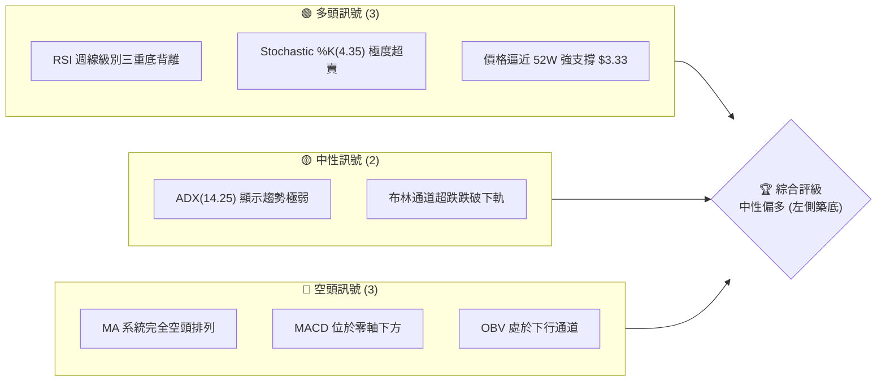
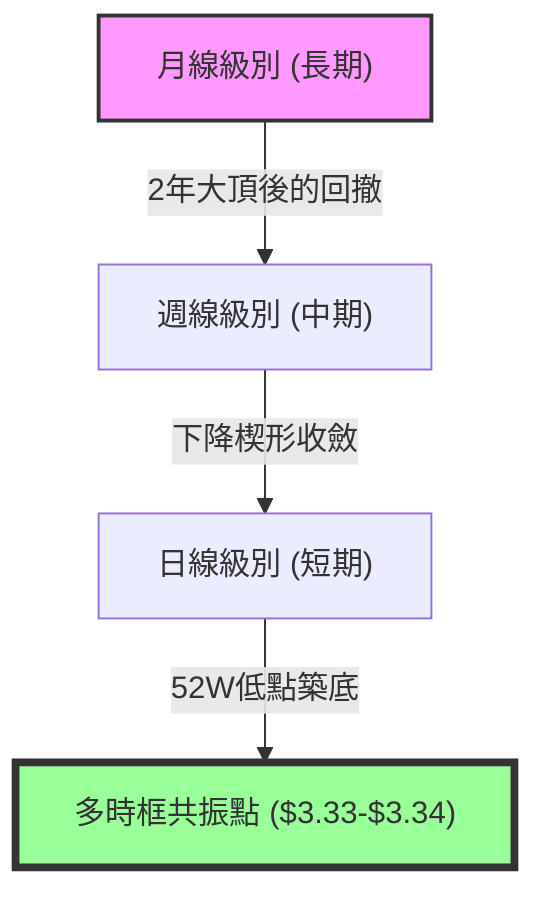
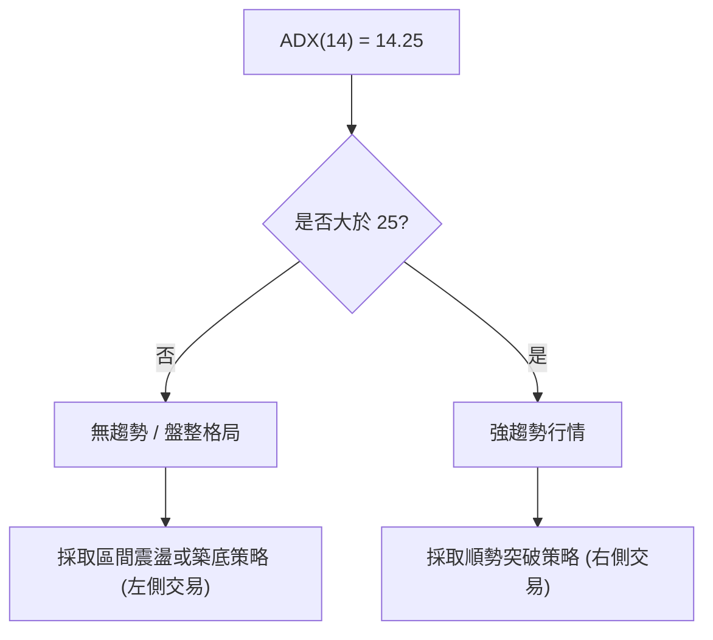
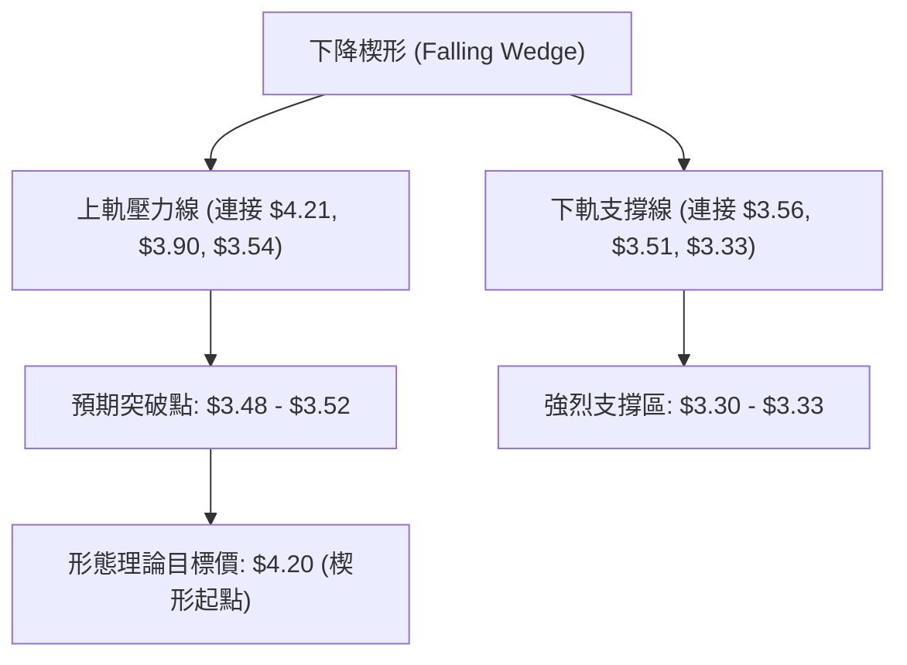

<details>
<summary>📊 靜態圖表 (點擊展開)</summary>

</details>

<html>
<head><meta charset="utf-8" /></head>
<body>
    <div style="height:500px; width:100%;">                        <script>window.PlotlyConfig = {MathJaxConfig: 'local'};</script>
        <script charset="utf-8" src="https://cdn.plot.ly/plotly-3.6.0.min.js" integrity="sha256-QaOVwtVY0T02VaHrr6pnoHLCwayMJp4O5n4YyaE3rJk=" crossorigin="anonymous"></script>                <div id="candlestick-chart" class="plotly-graph-div" style="height:100%; width:100%;"></div>            <script>                window.PLOTLYENV=window.PLOTLYENV || {};                                if (document.getElementById("candlestick-chart")) {                    Plotly.newPlot(                        "candlestick-chart",                        [{"close":{"dtype":"f8","bdata":"AAAAYLgeFEAAAACAPQoUQAAAAMAehRRAAAAAgD0KFEAAAAAAAAAUQAAAAMDMzBNAAAAAoEfhE0AAAACAwvUTQAAAAOBRuBNAAAAAgBSuE0AAAABAMzMUQAAAAADXoxRAAAAAYI\u002fCFEAAAADA9SgVQAAAAEAzMxVAAAAAYLgeFkAAAAAAAAAYQAAAACBcjxhAAAAAIK5HGUAAAABgZmYYQAAAAGBmZhlAAAAAIFyPGUAAAADAzMwZQAAAACCuRxlAAAAAoEfhGEAAAAAAAAAZQAAAAOCjcBhAAAAA4KNwGEAAAADgehQYQAAAAKCZmRdAAAAAQDMzGEAAAAAA16MYQAAAACBcjxlAAAAA4HoUGUAAAADgo3AZQAAAAIAUrhhAAAAA4KNwF0AAAADgUbgXQAAAAADXoxdAAAAAgBSuF0AAAABACtcWQAAAACBcjxZAAAAAgBSuFkAAAABgZmYWQAAAAEDhehZAAAAAoEfhFkAAAABgZmYXQAAAAEDhehhAAAAAYI\u002fCF0AAAABAMzMYQAAAACCF6xdAAAAAgD0KGEAAAAAgrkcYQAAAAADXIxdAAAAAIFyPFkAAAADAHoUWQAAAAKBwPRZAAAAAoJmZF0AAAADAHoUXQAAAAMD1KBdAAAAAwPUoFkAAAAAA16MVQAAAAIDrURVAAAAAIK5HFUAAAACgcD0VQAAAACCF6xNAAAAAoJmZE0AAAAAAAAAVQAAAAIDC9RRAAAAAIK5HFUAAAADAzMwVQAAAAOB6FBVAAAAAgD0KFUAAAADgehQVQAAAAEAzMxVAAAAAYI\u002fCFEAAAAAA16MUQAAAAKCZmRRAAAAA4FG4FEAAAADgUbgUQAAAAKCZmRRAAAAA4HoUFEAAAADAzMwTQAAAAEDhehNAAAAAgBSuE0AAAADgUbgTQAAAAOBRuBRAAAAAgOtRFEAAAADAHoUUQAAAAKCZmRRAAAAAYGZmFEAAAAAgrkcUQAAAAIDC9RNAAAAAgOtRFEAAAAAAKVwUQAAAAOB6FBVAAAAAgOtRFEAAAADAHoUTQAAAAGBmZhNAAAAAIFyPE0AAAADA9SgTQAAAAMAehRJAAAAAIFyPEUAAAADAHoURQAAAAIA9ChJAAAAAoJmZEUAAAABAMzMSQAAAAIDrURJAAAAAoHA9EkAAAABgj8ISQAAAAGC4HhJAAAAAoEfhEUAAAABAMzMRQAAAAADXoxFAAAAA4HoUEUAAAABgj8IQQAAAAKCZmRBAAAAA4HoUEUAAAACAPQoRQAAAAKBwPRFAAAAAIIXrEEAAAADgehQRQAAAAMAehRBAAAAA4HoUEUAAAADAzMwRQAAAAKCZmRFAAAAAwB6FEUAAAADgUbgQQAAAAKCZmRBAAAAAQArXEEAAAACgcD0RQAAAAKBH4RBAAAAA4FG4EEAAAACA61EQQAAAAGBmZhBAAAAAYLgeEEAAAABACtcPQAAAAIAUrg9AAAAAgML1DkAAAABguB4PQAAAAAAAAA5AAAAAgBSuDUAAAAAAAAAOQAAAAOBRuA5AAAAAAAAADkAAAADgo3ANQAAAAEDhegxAAAAAYLgeDUAAAACA61EOQAAAAEAK1w1AAAAAgBSuDUAAAAAgXI8MQAAAAKBwPQxAAAAAIK5HDUAAAAAAKVwNQAAAAIDC9QxAAAAAQOF6DEAAAACA61EMQAAAAIA9Cg1AAAAA4KNwDUAAAADgo3ANQAAAAEAK1w1AAAAAIFyPDkAAAAAAKVwPQAAAAOB6FBBAAAAAQArXEEAAAABACtcQQAAAAIDrURBAAAAAoHA9EEAAAACAFK4PQAAAAEAzMw9AAAAAYLgeD0AAAACgR+EOQAAAACBcjw5AAAAAIFyPDkAAAAAAKVwNQAAAAIDC9QxAAAAA4KNwDUAAAADA9SgOQAAAAIDrUQ5AAAAAYI\u002fCDUAAAABAMzMNQAAAAGC4Hg1AAAAAgD0KDUAAAAAgXI8MQAAAAGBmZgxAAAAAgOtRDEAAAAAAAAAMQAAAAOB6FAxAAAAAQOF6DEAAAADgehQMQAAAAOBRuAxAAAAAYLgeDUAAAACA61EMQAAAAIDrUQxAAAAAoEfhDEAAAADAzMwMQAAAACCuRwtAAAAAgBSuC0AAAADgUbgKQA=="},"high":{"dtype":"f8","bdata":"AAAAwPUoFEAAAAAgrkcUQAAAAIAUrhRAAAAAQOF6FEAAAACAPQoUQAAAAOB6FBRAAAAA4HoUFEAAAACAPQoUQAAAAEAK1xNAAAAAgML1E0AAAAAAKVwUQAAAAOBRuBRAAAAA4FE4FUAAAABAMzMVQAAAAAApXBVAAAAAIK5HFkAAAABguB4YQAAAAADXoxhAAAAAgBSuGUAAAADAHoUYQAAAAAAAABpAAAAAAAAAGkAAAACA61EaQAAAAEDhehpAAAAA4FG4GUAAAADgehQZQAAAAKBH4RhAAAAAgBSuGEAAAACgmZkYQAAAAKBH4RhAAAAAIK5HGEAAAACgR+EYQAAAACCuxxlAAAAAYGZmGkAAAABAicEZQAAAAKCZmRlAAAAAIFyPGEAAAAAgrkcYQAAAAOB6FBhAAAAAIFyPGEAAAACAwvUXQAAAAEAzsxZAAAAAgGo8F0AAAADgUbgWQAAAAEDhehZAAAAAgD0KF0AAAADA9agXQAAAAMAehRhAAAAAgML1GEAAAAAAKVwYQAAAAIDrURhAAAAAgOtRGEAAAACAwnUYQAAAACCuRxdAAAAA4KNwF0AAAABAClcXQAAAAMD1KBdAAAAAAAAAGEAAAADgo\u002fAYQAAAAOB6FBhAAAAAoEfhFkAAAABguB4WQAAAAOB6FBZAAAAAgMJ1FUAAAADAHoUVQAAAAADXoxVAAAAAoHA9FEAAAABA4XoVQAAAAAApXBVAAAAA4KNwFUAAAAAAAAAWQAAAAEDhehVAAAAAoHA9FUAAAABAMzMVQAAAAGBmZhVAAAAAYGZmFUAAAAAgXA8VQAAAAAAp3BRAAAAAgML1FEAAAABgj8IUQAAAAOB6FBVAAAAAANejFEAAAABAMzMUQAAAAKBH4RNAAAAAoEfhE0AAAABguB4UQAAAAGC4HhVAAAAAgML1FEAAAACgmZkUQAAAAADXoxRAAAAAIIXrFEAAAAAgXI8UQAAAAAApXBRAAAAAwB6FFEAAAADAzMwUQAAAAOCjcBVAAAAAgOtRFUAAAABAMzMUQAAAAKBH4RNAAAAAoEfhE0AAAACgmZkTQAAAAIA9ChNAAAAAwB6FEkAAAABgZmYSQAAAAOBROBJAAAAAQDMzEkAAAABgZmYSQAAAACBcjxJAAAAAgBSuEkAAAACAFC4TQAAAAOBRuBJAAAAA4FE4EkAAAACgR+ERQAAAAOBRuBFAAAAAYI\u002fCEUAAAABA4XoRQAAAAADXoxBAAAAAwMxMEUAAAAAAKVwRQAAAAGC4nhFAAAAAIFyPEUAAAACAwvURQAAAAOBROBFAAAAAQDMzEUAAAACAPQoSQAAAAEAK1xFAAAAAwB4FEkAAAACAPYoRQAAAAKCZmRBAAAAAwB6FEUAAAAAgrkcRQAAAAGC4HhFAAAAAoEfhEEAAAACAPYoQQAAAAOB6lBBAAAAAwB6FEEAAAADA9SgQQAAAAIAUrg9AAAAAAAAAEEAAAADAHoUPQAAAAMDMzA5AAAAAQOF6DkAAAAAA16MOQAAAAIDC9Q5AAAAAQDMzD0AAAABACtcNQAAAAOCjcA1AAAAAgBSuDUAAAAAA16MOQAAAAKCZmQ9AAAAA4FG4DkAAAADAHoUNQAAAAIDC9QxAAAAA4KNwDUAAAACA61EOQAAAAGCPwg1AAAAAAAAADkAAAABgj8IMQAAAAOCjcA9AAAAAQArXDUAAAADAzMwNQAAAAKBwPQ5AAAAA4HoUD0AAAADgUbgPQAAAAAApXBBAAAAAYLgeEUAAAAAAAAARQAAAAIDC9RBAAAAA4KNwEEAAAABAMzMQQAAAAMD1KBBAAAAAIIXrD0AAAAAAAAAPQAAAACCF6w5AAAAA4FG4DkAAAACgR+ENQAAAAEAzMw1AAAAA4KNwDkAAAACgmZkPQAAAAEAzMw9AAAAAoHA9DkAAAADgehQOQAAAAOCjcA1AAAAA4KNwDUAAAACAwvUMQAAAACBcjwxAAAAAwMzMDEAAAAAgXI8MQAAAAIDpJgxAAAAAANejDEAAAACAwvUMQAAAAIDrUQ1AAAAAAClcDUAAAACAwvUMQAAAACBcjwxAAAAAIK5HDUAAAAAgrkcNQAAAAOBRuAxAAAAAYGZmDEAAAADAHoULQA=="},"hovertemplate":"\u003cb\u003e%{x|%Y-%m-%d}\u003c\u002fb\u003e\u003cbr\u003e\u958b: $%{open:.2f}\u003cbr\u003e\u9ad8: $%{high:.2f}\u003cbr\u003e\u4f4e: $%{low:.2f}\u003cbr\u003e\u6536: $%{close:.2f}\u003cextra\u003e\u003c\u002fextra\u003e","low":{"dtype":"f8","bdata":"AAAAoJmZE0AAAAAAAAAUQAAAAIDC9RNAAAAAgML1E0AAAADgUbgTQAAAAGCPwhNAAAAAoJmZE0AAAAAA16MTQAAAAAApXBNAAAAAIFyPE0AAAADAHoUTQAAAAKBwPRRAAAAAANejFEAAAAAAKVwUQAAAAIDC9RRAAAAAoEfhFEAAAACAPQoWQAAAAOCjcBZAAAAAANejF0AAAADA9agXQAAAAKBwPRhAAAAAIK5HGUAAAACgR+EYQAAAAIA9ChlAAAAAANejGEAAAACAwvUXQAAAAMD1KBhAAAAA4FG4F0AAAACAwvUXQAAAAIDrURdAAAAAoJmZF0AAAACgcD0YQAAAACBcjxhAAAAAgML1GEAAAAAghesYQAAAACCuRxhAAAAAAClcF0AAAAAgXI8XQAAAAMDMzBZAAAAAoJmZF0AAAAAgXI8WQAAAAMD1KBZAAAAAoJmZFkAAAADA9SgWQAAAAIAUrhVAAAAAgOtRFkAAAADgehQXQAAAAADXoxdAAAAAoJmZF0AAAABgZmYXQAAAAIAUrhdAAAAAwMzMF0AAAACgmZkXQAAAAOCjcBVAAAAAQOF6FkAAAACAFC4WQAAAAMDMzBVAAAAAIIXrFkAAAABAMzMXQAAAAGC4HhdAAAAAIIXrFUAAAADgo3AVQAAAAOB6FBVAAAAAoEfhFEAAAAAAAAAVQAAAAEAK1xNAAAAAIK5HE0AAAAAghWsUQAAAAGCPwhRAAAAAQArXFEAAAADgo3AVQAAAAAAAABVAAAAAoEfhFEAAAACgmZkUQAAAACCuxxRAAAAA4FG4FEAAAADgo3AUQAAAAIDrURRAAAAAQDMzFEAAAACgR2EUQAAAAOCjcBRAAAAAgML1E0AAAACAFK4TQAAAAGBmZhNAAAAAIFyPE0AAAAAA16MTQAAAAIA9ChRAAAAAIK5HFEAAAABguB4UQAAAAMDMTBRAAAAAoEdhFEAAAAAAAAAUQAAAACCF6xNAAAAAgD0KFEAAAACA61EUQAAAAGCPwhRAAAAAYI9CFEAAAADgo3ATQAAAAIDrURNAAAAAAClcE0AAAAAAAAATQAAAAIDrURJAAAAAgOtREUAAAADgo3ARQAAAAGBmZhFAAAAAIFyPEUAAAADgUbgRQAAAAOB6FBJAAAAAwPUoEkAAAAAAKVwSQAAAAIA9ChJAAAAAwB6FEUAAAADA9SgRQAAAAAAAABFAAAAA4FG4EEAAAACgmZkQQAAAAKBwPRBAAAAAgMJ1EEAAAABACtcQQAAAACCF6xBAAAAAYI\u002fCEEAAAADAzMwQQAAAAAAAABBAAAAAYGZmEEAAAADgehQRQAAAAGCPQhFAAAAAgOtREUAAAADAHoUQQAAAAEAzMxBAAAAA4KfGEEAAAAAgXI8QQAAAAOBRuBBAAAAAoHA9EEAAAAAAKVwPQAAAAIA9ChBAAAAAAAAAEEAAAABgj8IPQAAAAMAehQ5AAAAAwMzMDkAAAABA4XoOQAAAAGCPwg1AAAAAoJmZDUAAAABgj8INQAAAAMD1KA5AAAAAQArXDUAAAAAgrkcNQAAAAGBmZgxAAAAA4FG4DEAAAACAwvUMQAAAAKCZmQ1AAAAAgOtRDUAAAACgcD0MQAAAAOB6FAxAAAAAYGZmDEAAAABguB4NQAAAAADXowxAAAAAQOF6DEAAAABACtcLQAAAAMDMzAxAAAAAgML1DEAAAABAMzMNQAAAAADXowxAAAAAYGQ7DkAAAACAFK4OQAAAAEAK1w9AAAAA4KNwEEAAAADgo3AQQAAAAEAzMxBAAAAAwPUoEEAAAABAMzMPQAAAAIA9Cg9AAAAAoEfhDkAAAACA61EOQAAAAOB6FA5AAAAAIIXrDUAAAADA9SgMQAAAAIDrUQxAAAAA4FG4DEAAAAAghesNQAAAAOB6FA5AAAAAIK5HDUAAAACAwvUMQAAAAKBH4QxAAAAAQOF6DEAAAABgZmYMQAAAAIAUrgtAAAAAQArXC0AAAAAghesLQAAAAGC4HgtAAAAAoJmZC0AAAAAghesLQAAAAOB6FAxAAAAA4KNwDEAAAABACtcLQAAAAEAK1wtAAAAAAAAADEAAAAAgXI8MQAAAAIA9CgtAAAAAgD0KC0AAAACgmZkKQA=="},"name":"\u50f9\u683c","open":{"dtype":"f8","bdata":"AAAAwPUoFEAAAABguB4UQAAAAMAgMBRAAAAAYGZmFEAAAAAAAAAUQAAAAIDC9RNAAAAAQArXE0AAAADAzMwTQAAAAMD1qBNAAAAA4FG4E0AAAAAgXI8TQAAAAAApXBRAAAAAgBSuFEAAAAAA16MUQAAAAEAzMxVAAAAAwPUoFUAAAABAMzMWQAAAAKCZmRdAAAAAQOF6GEAAAADAHoUYQAAAAIA9ihhAAAAAIFyPGUAAAABA4foYQAAAACCF6xlAAAAAQDMzGUAAAADAHoUYQAAAAEAK1xhAAAAAgMJ1GEAAAACgcD0YQAAAAMD1KBhAAAAAgML1F0AAAABA4XoYQAAAAKCZGRlAAAAAQDMzGkAAAACA61EZQAAAAIA9ihlAAAAAQOF6GEAAAACAwvUXQAAAAMD1KBdAAAAAoHA9GEAAAADAzMwXQAAAAEDhehZAAAAAwPUoF0AAAADgUbgWQAAAAEDhehZAAAAAgBSuFkAAAACgR2EXQAAAAAAAABhAAAAAIIXrGEAAAABgj8IXQAAAAAAAABhAAAAAoEfhF0AAAACAPQoYQAAAAGCPQhZAAAAAYI9CF0AAAADAzMwWQAAAAMDMzBZAAAAAoJkZF0AAAAAgXA8YQAAAAGBmZhdAAAAAQArXFkAAAADAHoUVQAAAAIA9ihVAAAAA4FE4FUAAAABAMzMVQAAAAADXoxVAAAAAgD0KFEAAAACAFK4UQAAAAOB6FBVAAAAAwPUoFUAAAAAA16MVQAAAACCFaxVAAAAAwB4FFUAAAACAwvUUQAAAAEAK1xRAAAAAwPUoFUAAAABgj8IUQAAAACCFaxRAAAAAYGZmFEAAAADgepQUQAAAAGCPwhRAAAAAoJmZFEAAAABA4foTQAAAAKBH4RNAAAAAoJmZE0AAAACgR+ETQAAAAOB6FBRAAAAAgBSuFEAAAACA61EUQAAAACBcjxRAAAAAQOF6FEAAAACAwnUUQAAAACCuRxRAAAAAgBQuFEAAAADAHoUUQAAAAGCPwhRAAAAAYLgeFUAAAABAMzMUQAAAAGCPwhNAAAAAYGZmE0AAAACgmZkTQAAAACCF6xJAAAAA4KNwEkAAAACA61ESQAAAAIA9ihFAAAAAQDMzEkAAAADAzMwRQAAAAOB6FBJAAAAAoHA9EkAAAAAAKVwSQAAAAIAUrhJAAAAAwPUoEkAAAACAFK4RQAAAAGC4HhFAAAAAwPWoEUAAAACA61ERQAAAAMAehRBAAAAAoEfhEEAAAABguB4RQAAAAMD1KBFAAAAA4KNwEUAAAADAzMwQQAAAAIDC9RBAAAAAYI\u002fCEEAAAACgcD0RQAAAAOB6lBFAAAAA4KNwEUAAAADAzEwRQAAAAOCjcBBAAAAAAAAAEUAAAADgUbgQQAAAAMDMzBBAAAAAANejEEAAAABguB4QQAAAAOCjcBBAAAAAAClcEEAAAAAgXA8QQAAAACCuRw9AAAAAgBSuD0AAAADAzMwOQAAAAADXow5AAAAAYLgeDkAAAAAghesNQAAAAKBwPQ5AAAAAoJmZDkAAAABgj8INQAAAAEAzMw1AAAAAwMzMDEAAAABAMzMNQAAAAADXow5AAAAAYGZmDUAAAADgo3ANQAAAAOBRuAxAAAAAwMzMDEAAAAAAAAAOQAAAAIDC9QxAAAAAoEfhDEAAAADAHoUMQAAAAEAK1w5AAAAAgD0KDUAAAACgmZkNQAAAAEAzMw1AAAAAoHA9DkAAAADAzMwOQAAAAAAAABBAAAAAQOF6EEAAAABguJ4QQAAAAKBH4RBAAAAAAClcEEAAAABAMzMQQAAAAOB6FBBAAAAAQDMzD0AAAADAzMwOQAAAAKBH4Q5AAAAAIFyPDkAAAADgUbgNQAAAAOB6FA1AAAAAAClcDkAAAADAzMwOQAAAACBcjw5AAAAAwPUoDkAAAACAFK4NQAAAAAApXA1AAAAAAClcDUAAAACAwvUMQAAAAIDrUQxAAAAAYLgeDEAAAACA61EMQAAAAOB6FAxAAAAAAAAADEAAAABA4XoMQAAAACCuRwxAAAAAQOF6DEAAAACAwvUMQAAAAKBwPQxAAAAAwPUoDEAAAACgR+EMQAAAAADXowxAAAAAIK5HC0AAAADgo3ALQA=="},"x":["2025-08-20T00:00:00-04:00","2025-08-21T00:00:00-04:00","2025-08-22T00:00:00-04:00","2025-08-25T00:00:00-04:00","2025-08-26T00:00:00-04:00","2025-08-27T00:00:00-04:00","2025-08-28T00:00:00-04:00","2025-08-29T00:00:00-04:00","2025-09-02T00:00:00-04:00","2025-09-03T00:00:00-04:00","2025-09-04T00:00:00-04:00","2025-09-05T00:00:00-04:00","2025-09-08T00:00:00-04:00","2025-09-09T00:00:00-04:00","2025-09-10T00:00:00-04:00","2025-09-11T00:00:00-04:00","2025-09-12T00:00:00-04:00","2025-09-15T00:00:00-04:00","2025-09-16T00:00:00-04:00","2025-09-17T00:00:00-04:00","2025-09-18T00:00:00-04:00","2025-09-19T00:00:00-04:00","2025-09-22T00:00:00-04:00","2025-09-23T00:00:00-04:00","2025-09-24T00:00:00-04:00","2025-09-25T00:00:00-04:00","2025-09-26T00:00:00-04:00","2025-09-29T00:00:00-04:00","2025-09-30T00:00:00-04:00","2025-10-01T00:00:00-04:00","2025-10-02T00:00:00-04:00","2025-10-03T00:00:00-04:00","2025-10-06T00:00:00-04:00","2025-10-07T00:00:00-04:00","2025-10-08T00:00:00-04:00","2025-10-09T00:00:00-04:00","2025-10-10T00:00:00-04:00","2025-10-13T00:00:00-04:00","2025-10-14T00:00:00-04:00","2025-10-15T00:00:00-04:00","2025-10-16T00:00:00-04:00","2025-10-17T00:00:00-04:00","2025-10-20T00:00:00-04:00","2025-10-21T00:00:00-04:00","2025-10-22T00:00:00-04:00","2025-10-23T00:00:00-04:00","2025-10-24T00:00:00-04:00","2025-10-27T00:00:00-04:00","2025-10-28T00:00:00-04:00","2025-10-29T00:00:00-04:00","2025-10-30T00:00:00-04:00","2025-10-31T00:00:00-04:00","2025-11-03T00:00:00-05:00","2025-11-04T00:00:00-05:00","2025-11-05T00:00:00-05:00","2025-11-06T00:00:00-05:00","2025-11-07T00:00:00-05:00","2025-11-10T00:00:00-05:00","2025-11-11T00:00:00-05:00","2025-11-12T00:00:00-05:00","2025-11-13T00:00:00-05:00","2025-11-14T00:00:00-05:00","2025-11-17T00:00:00-05:00","2025-11-18T00:00:00-05:00","2025-11-19T00:00:00-05:00","2025-11-20T00:00:00-05:00","2025-11-21T00:00:00-05:00","2025-11-24T00:00:00-05:00","2025-11-25T00:00:00-05:00","2025-11-26T00:00:00-05:00","2025-11-28T00:00:00-05:00","2025-12-01T00:00:00-05:00","2025-12-02T00:00:00-05:00","2025-12-03T00:00:00-05:00","2025-12-04T00:00:00-05:00","2025-12-05T00:00:00-05:00","2025-12-08T00:00:00-05:00","2025-12-09T00:00:00-05:00","2025-12-10T00:00:00-05:00","2025-12-11T00:00:00-05:00","2025-12-12T00:00:00-05:00","2025-12-15T00:00:00-05:00","2025-12-16T00:00:00-05:00","2025-12-17T00:00:00-05:00","2025-12-18T00:00:00-05:00","2025-12-19T00:00:00-05:00","2025-12-22T00:00:00-05:00","2025-12-23T00:00:00-05:00","2025-12-24T00:00:00-05:00","2025-12-26T00:00:00-05:00","2025-12-29T00:00:00-05:00","2025-12-30T00:00:00-05:00","2025-12-31T00:00:00-05:00","2026-01-02T00:00:00-05:00","2026-01-05T00:00:00-05:00","2026-01-06T00:00:00-05:00","2026-01-07T00:00:00-05:00","2026-01-08T00:00:00-05:00","2026-01-09T00:00:00-05:00","2026-01-12T00:00:00-05:00","2026-01-13T00:00:00-05:00","2026-01-14T00:00:00-05:00","2026-01-15T00:00:00-05:00","2026-01-16T00:00:00-05:00","2026-01-20T00:00:00-05:00","2026-01-21T00:00:00-05:00","2026-01-22T00:00:00-05:00","2026-01-23T00:00:00-05:00","2026-01-26T00:00:00-05:00","2026-01-27T00:00:00-05:00","2026-01-28T00:00:00-05:00","2026-01-29T00:00:00-05:00","2026-01-30T00:00:00-05:00","2026-02-02T00:00:00-05:00","2026-02-03T00:00:00-05:00","2026-02-04T00:00:00-05:00","2026-02-05T00:00:00-05:00","2026-02-06T00:00:00-05:00","2026-02-09T00:00:00-05:00","2026-02-10T00:00:00-05:00","2026-02-11T00:00:00-05:00","2026-02-12T00:00:00-05:00","2026-02-13T00:00:00-05:00","2026-02-17T00:00:00-05:00","2026-02-18T00:00:00-05:00","2026-02-19T00:00:00-05:00","2026-02-20T00:00:00-05:00","2026-02-23T00:00:00-05:00","2026-02-24T00:00:00-05:00","2026-02-25T00:00:00-05:00","2026-02-26T00:00:00-05:00","2026-02-27T00:00:00-05:00","2026-03-02T00:00:00-05:00","2026-03-03T00:00:00-05:00","2026-03-04T00:00:00-05:00","2026-03-05T00:00:00-05:00","2026-03-06T00:00:00-05:00","2026-03-09T00:00:00-04:00","2026-03-10T00:00:00-04:00","2026-03-11T00:00:00-04:00","2026-03-12T00:00:00-04:00","2026-03-13T00:00:00-04:00","2026-03-16T00:00:00-04:00","2026-03-17T00:00:00-04:00","2026-03-18T00:00:00-04:00","2026-03-19T00:00:00-04:00","2026-03-20T00:00:00-04:00","2026-03-23T00:00:00-04:00","2026-03-24T00:00:00-04:00","2026-03-25T00:00:00-04:00","2026-03-26T00:00:00-04:00","2026-03-27T00:00:00-04:00","2026-03-30T00:00:00-04:00","2026-03-31T00:00:00-04:00","2026-04-01T00:00:00-04:00","2026-04-02T00:00:00-04:00","2026-04-06T00:00:00-04:00","2026-04-07T00:00:00-04:00","2026-04-08T00:00:00-04:00","2026-04-09T00:00:00-04:00","2026-04-10T00:00:00-04:00","2026-04-13T00:00:00-04:00","2026-04-14T00:00:00-04:00","2026-04-15T00:00:00-04:00","2026-04-16T00:00:00-04:00","2026-04-17T00:00:00-04:00","2026-04-20T00:00:00-04:00","2026-04-21T00:00:00-04:00","2026-04-22T00:00:00-04:00","2026-04-23T00:00:00-04:00","2026-04-24T00:00:00-04:00","2026-04-27T00:00:00-04:00","2026-04-28T00:00:00-04:00","2026-04-29T00:00:00-04:00","2026-04-30T00:00:00-04:00","2026-05-01T00:00:00-04:00","2026-05-04T00:00:00-04:00","2026-05-05T00:00:00-04:00","2026-05-06T00:00:00-04:00","2026-05-07T00:00:00-04:00","2026-05-08T00:00:00-04:00","2026-05-11T00:00:00-04:00","2026-05-12T00:00:00-04:00","2026-05-13T00:00:00-04:00","2026-05-14T00:00:00-04:00","2026-05-15T00:00:00-04:00","2026-05-18T00:00:00-04:00","2026-05-19T00:00:00-04:00","2026-05-20T00:00:00-04:00","2026-05-21T00:00:00-04:00","2026-05-22T00:00:00-04:00","2026-05-26T00:00:00-04:00","2026-05-27T00:00:00-04:00","2026-05-28T00:00:00-04:00","2026-05-29T00:00:00-04:00","2026-06-01T00:00:00-04:00","2026-06-02T00:00:00-04:00","2026-06-03T00:00:00-04:00","2026-06-04T00:00:00-04:00","2026-06-05T00:00:00-04:00"],"type":"candlestick"},{"hovertemplate":"MA30: $%{y:.2f}\u003cextra\u003e\u003c\u002fextra\u003e","line":{"color":"#2196F3","dash":"dash","width":2},"mode":"lines","name":"MA30","x":["2025-08-20T00:00:00-04:00","2025-08-21T00:00:00-04:00","2025-08-22T00:00:00-04:00","2025-08-25T00:00:00-04:00","2025-08-26T00:00:00-04:00","2025-08-27T00:00:00-04:00","2025-08-28T00:00:00-04:00","2025-08-29T00:00:00-04:00","2025-09-02T00:00:00-04:00","2025-09-03T00:00:00-04:00","2025-09-04T00:00:00-04:00","2025-09-05T00:00:00-04:00","2025-09-08T00:00:00-04:00","2025-09-09T00:00:00-04:00","2025-09-10T00:00:00-04:00","2025-09-11T00:00:00-04:00","2025-09-12T00:00:00-04:00","2025-09-15T00:00:00-04:00","2025-09-16T00:00:00-04:00","2025-09-17T00:00:00-04:00","2025-09-18T00:00:00-04:00","2025-09-19T00:00:00-04:00","2025-09-22T00:00:00-04:00","2025-09-23T00:00:00-04:00","2025-09-24T00:00:00-04:00","2025-09-25T00:00:00-04:00","2025-09-26T00:00:00-04:00","2025-09-29T00:00:00-04:00","2025-09-30T00:00:00-04:00","2025-10-01T00:00:00-04:00","2025-10-02T00:00:00-04:00","2025-10-03T00:00:00-04:00","2025-10-06T00:00:00-04:00","2025-10-07T00:00:00-04:00","2025-10-08T00:00:00-04:00","2025-10-09T00:00:00-04:00","2025-10-10T00:00:00-04:00","2025-10-13T00:00:00-04:00","2025-10-14T00:00:00-04:00","2025-10-15T00:00:00-04:00","2025-10-16T00:00:00-04:00","2025-10-17T00:00:00-04:00","2025-10-20T00:00:00-04:00","2025-10-21T00:00:00-04:00","2025-10-22T00:00:00-04:00","2025-10-23T00:00:00-04:00","2025-10-24T00:00:00-04:00","2025-10-27T00:00:00-04:00","2025-10-28T00:00:00-04:00","2025-10-29T00:00:00-04:00","2025-10-30T00:00:00-04:00","2025-10-31T00:00:00-04:00","2025-11-03T00:00:00-05:00","2025-11-04T00:00:00-05:00","2025-11-05T00:00:00-05:00","2025-11-06T00:00:00-05:00","2025-11-07T00:00:00-05:00","2025-11-10T00:00:00-05:00","2025-11-11T00:00:00-05:00","2025-11-12T00:00:00-05:00","2025-11-13T00:00:00-05:00","2025-11-14T00:00:00-05:00","2025-11-17T00:00:00-05:00","2025-11-18T00:00:00-05:00","2025-11-19T00:00:00-05:00","2025-11-20T00:00:00-05:00","2025-11-21T00:00:00-05:00","2025-11-24T00:00:00-05:00","2025-11-25T00:00:00-05:00","2025-11-26T00:00:00-05:00","2025-11-28T00:00:00-05:00","2025-12-01T00:00:00-05:00","2025-12-02T00:00:00-05:00","2025-12-03T00:00:00-05:00","2025-12-04T00:00:00-05:00","2025-12-05T00:00:00-05:00","2025-12-08T00:00:00-05:00","2025-12-09T00:00:00-05:00","2025-12-10T00:00:00-05:00","2025-12-11T00:00:00-05:00","2025-12-12T00:00:00-05:00","2025-12-15T00:00:00-05:00","2025-12-16T00:00:00-05:00","2025-12-17T00:00:00-05:00","2025-12-18T00:00:00-05:00","2025-12-19T00:00:00-05:00","2025-12-22T00:00:00-05:00","2025-12-23T00:00:00-05:00","2025-12-24T00:00:00-05:00","2025-12-26T00:00:00-05:00","2025-12-29T00:00:00-05:00","2025-12-30T00:00:00-05:00","2025-12-31T00:00:00-05:00","2026-01-02T00:00:00-05:00","2026-01-05T00:00:00-05:00","2026-01-06T00:00:00-05:00","2026-01-07T00:00:00-05:00","2026-01-08T00:00:00-05:00","2026-01-09T00:00:00-05:00","2026-01-12T00:00:00-05:00","2026-01-13T00:00:00-05:00","2026-01-14T00:00:00-05:00","2026-01-15T00:00:00-05:00","2026-01-16T00:00:00-05:00","2026-01-20T00:00:00-05:00","2026-01-21T00:00:00-05:00","2026-01-22T00:00:00-05:00","2026-01-23T00:00:00-05:00","2026-01-26T00:00:00-05:00","2026-01-27T00:00:00-05:00","2026-01-28T00:00:00-05:00","2026-01-29T00:00:00-05:00","2026-01-30T00:00:00-05:00","2026-02-02T00:00:00-05:00","2026-02-03T00:00:00-05:00","2026-02-04T00:00:00-05:00","2026-02-05T00:00:00-05:00","2026-02-06T00:00:00-05:00","2026-02-09T00:00:00-05:00","2026-02-10T00:00:00-05:00","2026-02-11T00:00:00-05:00","2026-02-12T00:00:00-05:00","2026-02-13T00:00:00-05:00","2026-02-17T00:00:00-05:00","2026-02-18T00:00:00-05:00","2026-02-19T00:00:00-05:00","2026-02-20T00:00:00-05:00","2026-02-23T00:00:00-05:00","2026-02-24T00:00:00-05:00","2026-02-25T00:00:00-05:00","2026-02-26T00:00:00-05:00","2026-02-27T00:00:00-05:00","2026-03-02T00:00:00-05:00","2026-03-03T00:00:00-05:00","2026-03-04T00:00:00-05:00","2026-03-05T00:00:00-05:00","2026-03-06T00:00:00-05:00","2026-03-09T00:00:00-04:00","2026-03-10T00:00:00-04:00","2026-03-11T00:00:00-04:00","2026-03-12T00:00:00-04:00","2026-03-13T00:00:00-04:00","2026-03-16T00:00:00-04:00","2026-03-17T00:00:00-04:00","2026-03-18T00:00:00-04:00","2026-03-19T00:00:00-04:00","2026-03-20T00:00:00-04:00","2026-03-23T00:00:00-04:00","2026-03-24T00:00:00-04:00","2026-03-25T00:00:00-04:00","2026-03-26T00:00:00-04:00","2026-03-27T00:00:00-04:00","2026-03-30T00:00:00-04:00","2026-03-31T00:00:00-04:00","2026-04-01T00:00:00-04:00","2026-04-02T00:00:00-04:00","2026-04-06T00:00:00-04:00","2026-04-07T00:00:00-04:00","2026-04-08T00:00:00-04:00","2026-04-09T00:00:00-04:00","2026-04-10T00:00:00-04:00","2026-04-13T00:00:00-04:00","2026-04-14T00:00:00-04:00","2026-04-15T00:00:00-04:00","2026-04-16T00:00:00-04:00","2026-04-17T00:00:00-04:00","2026-04-20T00:00:00-04:00","2026-04-21T00:00:00-04:00","2026-04-22T00:00:00-04:00","2026-04-23T00:00:00-04:00","2026-04-24T00:00:00-04:00","2026-04-27T00:00:00-04:00","2026-04-28T00:00:00-04:00","2026-04-29T00:00:00-04:00","2026-04-30T00:00:00-04:00","2026-05-01T00:00:00-04:00","2026-05-04T00:00:00-04:00","2026-05-05T00:00:00-04:00","2026-05-06T00:00:00-04:00","2026-05-07T00:00:00-04:00","2026-05-08T00:00:00-04:00","2026-05-11T00:00:00-04:00","2026-05-12T00:00:00-04:00","2026-05-13T00:00:00-04:00","2026-05-14T00:00:00-04:00","2026-05-15T00:00:00-04:00","2026-05-18T00:00:00-04:00","2026-05-19T00:00:00-04:00","2026-05-20T00:00:00-04:00","2026-05-21T00:00:00-04:00","2026-05-22T00:00:00-04:00","2026-05-26T00:00:00-04:00","2026-05-27T00:00:00-04:00","2026-05-28T00:00:00-04:00","2026-05-29T00:00:00-04:00","2026-06-01T00:00:00-04:00","2026-06-02T00:00:00-04:00","2026-06-03T00:00:00-04:00","2026-06-04T00:00:00-04:00","2026-06-05T00:00:00-04:00"],"y":{"dtype":"f8","bdata":"AAAAAAAA+H8AAAAAAAD4fwAAAAAAAPh\u002fAAAAAAAA+H8AAAAAAAD4fwAAAAAAAPh\u002fAAAAAAAA+H8AAAAAAAD4fwAAAAAAAPh\u002fAAAAAAAA+H8AAAAAAAD4fwAAAAAAAPh\u002fAAAAAAAA+H8AAAAAAAD4fwAAAAAAAPh\u002fAAAAAAAA+H8AAAAAAAD4fwAAAAAAAPh\u002fAAAAAAAA+H8AAAAAAAD4fwAAAAAAAPh\u002fAAAAAAAA+H8AAAAAAAD4fwAAAAAAAPh\u002fAAAAAAAA+H8AAAAAAAD4fwAAAAAAAPh\u002fAAAAAAAA+H8AAAAAAAD4f97d3b0taxZAMzMzo\u002f6NFkDNzMx8P7UWQImIiIhB4BZARERElEMLF0ARERFxrzkXQHd3d\u002fdTYxdAiYiI6LSBF0ARERHByqEXQAAAACA+wxdAIiIiQmDlF0DNzMxs5\u002fsXQKuqqrpJDBhAiYiICKwcGECrqqraQCcYQN7d3Q0tMhhAvLu7S6k4GEAzMzOTijMYQAAAANDbMhhAIiIiUuMlGECrqqpqLiQYQO\u002fu7k6NFxhAIiIi0pQKGEBVVVVVnP0XQN7d3W1Z6xdAAAAAUI3XF0C8u7urY8IXQCIiIrKdrxdAAAAAsHKoF0CamZlZq6MXQHd3dyfqnxdAREREtIGOF0Crqqoa6HQXQO\u002fu7q65UBdAVVVVdUwwF0CrqqpqdQwXQJqZmQnX4xZA3t3dbRLDFkAAAACA3KsWQDMzM\u002fP9lBZAIiIiEoOAFkB3d3cno3cWQLy7uwsCaxZAmpmZaQNdFkBERETUv1EWQBEREaHTRhZAvLu7a7w0FkC8u7sbLx0WQO\u002fu7h4T\u002fBVAMzMzIyLiFUBVVVX1b8QVQO\u002fu7k4bqBVA3t3djVCGFUB3d3fXFWAVQDMzM3PaQBVA7+7u\u002fkYoFUDNzMxMYhAVQO\u002fu7s5pAxVAmpmZiWznFEAAAADw0s0UQImIiIj6txRAERERwfWoFECrqqrKWp0UQDMzM9O\u002fkRRAvLu7q46JFECJiIhIDIIUQHd3d1fyixRARERENBeSFECJiIgYdoUUQJqZmTkmeBRAMzMz03hpFECJiIio8VIUQBEREUEZPRRAMzMzE2cfFEAzMzMjBgEUQDMzMwMP5hNAMzMz4xfLE0ARERGhRbYTQEREROTQohNAAAAAQKeNE0ARERGR7XwTQM3MzOzDZxNAMzMz8\u002f1UE0Crqqoqzj4TQAAAAKAaLxNAZmZm1uoYE0Dv7u6eqP8SQImIiFiA3BJAVVVVddrAEkCJiIhIKKMSQAAAAEB8hhJAMzMzE8poEkARERGRe00SQGZmZsYgMBJAMzMz43oUEkCrqqp6ov4RQN7d3U3w4BFAzczMnAvJEUCrqqrqJrERQJqZmTlCmRFAvLu7SwyCEUDe3d39qXERQKuqqlqrYxFAiYiIWIBcEUB3d3fnQlIRQERERERERBFAiYiIKKM3EUC8u7trLiQRQHd3d8cEDxFAd3d3d3f3EEDe3d31KNwQQO\u002fu7jaJwRBAREREPJinEECrqqpC0pQQQGZmZoZdgRBAIiIisp1vEEB3d3c\u002fNV4QQHd3d78RShBAmpmZuZA0EEDNzMzMhSQQQO\u002fu7q65EBBAVVVVtfP9D0AiIiJSKs4PQO\u002fu7o40pQ9AmpmZCZB7D0De3d2NUEYPQAAAABAREQ9AVVVVhRbZDkBmZma2Za0OQN7d3Q3miQ5AIiIiordlDkBmZmaWtToOQImIiDhCGQ5ARERExK4ADkARERGRwvUNQHd3d3dM8A1AERERMZb8DUC8u7u7SQwOQCIiIuJ6FA5AAAAAYHMhDkBmZma2OiYOQHd3dyd4MA5AIiIi4sE8DkBVVVVFREQOQO\u002fu7r7mQg5AVVVVFa5HDkAiIiJS\u002f0YOQFVVVeUXSw5AIiIi8tJNDkC8u7trdUwOQO\u002fu7v6NUA5AIiIiwjxRDkDNzMzcslYOQBEREUE1Xg5Ad3d39yhcDkBmZmZWVVUOQAAAAACOUA5AmpmZeTBPDkDNzMxsdUwOQFVVVUVERA5A3t3dHRM8DkBmZmYmeDAOQImIiHjpJg5A7+7uvp8aDkAzMzPDrgAOQHd3dyfq3w1AREREZPS2DUDe3d3dT40NQFVVVcWSXw1AMzMzA502DUCamZm5SQwNQA=="},"type":"scatter"},{"hovertemplate":"MA60: $%{y:.2f}\u003cextra\u003e\u003c\u002fextra\u003e","line":{"color":"#9C27B0","dash":"dash","width":2},"mode":"lines","name":"MA60","x":["2025-08-20T00:00:00-04:00","2025-08-21T00:00:00-04:00","2025-08-22T00:00:00-04:00","2025-08-25T00:00:00-04:00","2025-08-26T00:00:00-04:00","2025-08-27T00:00:00-04:00","2025-08-28T00:00:00-04:00","2025-08-29T00:00:00-04:00","2025-09-02T00:00:00-04:00","2025-09-03T00:00:00-04:00","2025-09-04T00:00:00-04:00","2025-09-05T00:00:00-04:00","2025-09-08T00:00:00-04:00","2025-09-09T00:00:00-04:00","2025-09-10T00:00:00-04:00","2025-09-11T00:00:00-04:00","2025-09-12T00:00:00-04:00","2025-09-15T00:00:00-04:00","2025-09-16T00:00:00-04:00","2025-09-17T00:00:00-04:00","2025-09-18T00:00:00-04:00","2025-09-19T00:00:00-04:00","2025-09-22T00:00:00-04:00","2025-09-23T00:00:00-04:00","2025-09-24T00:00:00-04:00","2025-09-25T00:00:00-04:00","2025-09-26T00:00:00-04:00","2025-09-29T00:00:00-04:00","2025-09-30T00:00:00-04:00","2025-10-01T00:00:00-04:00","2025-10-02T00:00:00-04:00","2025-10-03T00:00:00-04:00","2025-10-06T00:00:00-04:00","2025-10-07T00:00:00-04:00","2025-10-08T00:00:00-04:00","2025-10-09T00:00:00-04:00","2025-10-10T00:00:00-04:00","2025-10-13T00:00:00-04:00","2025-10-14T00:00:00-04:00","2025-10-15T00:00:00-04:00","2025-10-16T00:00:00-04:00","2025-10-17T00:00:00-04:00","2025-10-20T00:00:00-04:00","2025-10-21T00:00:00-04:00","2025-10-22T00:00:00-04:00","2025-10-23T00:00:00-04:00","2025-10-24T00:00:00-04:00","2025-10-27T00:00:00-04:00","2025-10-28T00:00:00-04:00","2025-10-29T00:00:00-04:00","2025-10-30T00:00:00-04:00","2025-10-31T00:00:00-04:00","2025-11-03T00:00:00-05:00","2025-11-04T00:00:00-05:00","2025-11-05T00:00:00-05:00","2025-11-06T00:00:00-05:00","2025-11-07T00:00:00-05:00","2025-11-10T00:00:00-05:00","2025-11-11T00:00:00-05:00","2025-11-12T00:00:00-05:00","2025-11-13T00:00:00-05:00","2025-11-14T00:00:00-05:00","2025-11-17T00:00:00-05:00","2025-11-18T00:00:00-05:00","2025-11-19T00:00:00-05:00","2025-11-20T00:00:00-05:00","2025-11-21T00:00:00-05:00","2025-11-24T00:00:00-05:00","2025-11-25T00:00:00-05:00","2025-11-26T00:00:00-05:00","2025-11-28T00:00:00-05:00","2025-12-01T00:00:00-05:00","2025-12-02T00:00:00-05:00","2025-12-03T00:00:00-05:00","2025-12-04T00:00:00-05:00","2025-12-05T00:00:00-05:00","2025-12-08T00:00:00-05:00","2025-12-09T00:00:00-05:00","2025-12-10T00:00:00-05:00","2025-12-11T00:00:00-05:00","2025-12-12T00:00:00-05:00","2025-12-15T00:00:00-05:00","2025-12-16T00:00:00-05:00","2025-12-17T00:00:00-05:00","2025-12-18T00:00:00-05:00","2025-12-19T00:00:00-05:00","2025-12-22T00:00:00-05:00","2025-12-23T00:00:00-05:00","2025-12-24T00:00:00-05:00","2025-12-26T00:00:00-05:00","2025-12-29T00:00:00-05:00","2025-12-30T00:00:00-05:00","2025-12-31T00:00:00-05:00","2026-01-02T00:00:00-05:00","2026-01-05T00:00:00-05:00","2026-01-06T00:00:00-05:00","2026-01-07T00:00:00-05:00","2026-01-08T00:00:00-05:00","2026-01-09T00:00:00-05:00","2026-01-12T00:00:00-05:00","2026-01-13T00:00:00-05:00","2026-01-14T00:00:00-05:00","2026-01-15T00:00:00-05:00","2026-01-16T00:00:00-05:00","2026-01-20T00:00:00-05:00","2026-01-21T00:00:00-05:00","2026-01-22T00:00:00-05:00","2026-01-23T00:00:00-05:00","2026-01-26T00:00:00-05:00","2026-01-27T00:00:00-05:00","2026-01-28T00:00:00-05:00","2026-01-29T00:00:00-05:00","2026-01-30T00:00:00-05:00","2026-02-02T00:00:00-05:00","2026-02-03T00:00:00-05:00","2026-02-04T00:00:00-05:00","2026-02-05T00:00:00-05:00","2026-02-06T00:00:00-05:00","2026-02-09T00:00:00-05:00","2026-02-10T00:00:00-05:00","2026-02-11T00:00:00-05:00","2026-02-12T00:00:00-05:00","2026-02-13T00:00:00-05:00","2026-02-17T00:00:00-05:00","2026-02-18T00:00:00-05:00","2026-02-19T00:00:00-05:00","2026-02-20T00:00:00-05:00","2026-02-23T00:00:00-05:00","2026-02-24T00:00:00-05:00","2026-02-25T00:00:00-05:00","2026-02-26T00:00:00-05:00","2026-02-27T00:00:00-05:00","2026-03-02T00:00:00-05:00","2026-03-03T00:00:00-05:00","2026-03-04T00:00:00-05:00","2026-03-05T00:00:00-05:00","2026-03-06T00:00:00-05:00","2026-03-09T00:00:00-04:00","2026-03-10T00:00:00-04:00","2026-03-11T00:00:00-04:00","2026-03-12T00:00:00-04:00","2026-03-13T00:00:00-04:00","2026-03-16T00:00:00-04:00","2026-03-17T00:00:00-04:00","2026-03-18T00:00:00-04:00","2026-03-19T00:00:00-04:00","2026-03-20T00:00:00-04:00","2026-03-23T00:00:00-04:00","2026-03-24T00:00:00-04:00","2026-03-25T00:00:00-04:00","2026-03-26T00:00:00-04:00","2026-03-27T00:00:00-04:00","2026-03-30T00:00:00-04:00","2026-03-31T00:00:00-04:00","2026-04-01T00:00:00-04:00","2026-04-02T00:00:00-04:00","2026-04-06T00:00:00-04:00","2026-04-07T00:00:00-04:00","2026-04-08T00:00:00-04:00","2026-04-09T00:00:00-04:00","2026-04-10T00:00:00-04:00","2026-04-13T00:00:00-04:00","2026-04-14T00:00:00-04:00","2026-04-15T00:00:00-04:00","2026-04-16T00:00:00-04:00","2026-04-17T00:00:00-04:00","2026-04-20T00:00:00-04:00","2026-04-21T00:00:00-04:00","2026-04-22T00:00:00-04:00","2026-04-23T00:00:00-04:00","2026-04-24T00:00:00-04:00","2026-04-27T00:00:00-04:00","2026-04-28T00:00:00-04:00","2026-04-29T00:00:00-04:00","2026-04-30T00:00:00-04:00","2026-05-01T00:00:00-04:00","2026-05-04T00:00:00-04:00","2026-05-05T00:00:00-04:00","2026-05-06T00:00:00-04:00","2026-05-07T00:00:00-04:00","2026-05-08T00:00:00-04:00","2026-05-11T00:00:00-04:00","2026-05-12T00:00:00-04:00","2026-05-13T00:00:00-04:00","2026-05-14T00:00:00-04:00","2026-05-15T00:00:00-04:00","2026-05-18T00:00:00-04:00","2026-05-19T00:00:00-04:00","2026-05-20T00:00:00-04:00","2026-05-21T00:00:00-04:00","2026-05-22T00:00:00-04:00","2026-05-26T00:00:00-04:00","2026-05-27T00:00:00-04:00","2026-05-28T00:00:00-04:00","2026-05-29T00:00:00-04:00","2026-06-01T00:00:00-04:00","2026-06-02T00:00:00-04:00","2026-06-03T00:00:00-04:00","2026-06-04T00:00:00-04:00","2026-06-05T00:00:00-04:00"],"y":{"dtype":"f8","bdata":"AAAAAAAA+H8AAAAAAAD4fwAAAAAAAPh\u002fAAAAAAAA+H8AAAAAAAD4fwAAAAAAAPh\u002fAAAAAAAA+H8AAAAAAAD4fwAAAAAAAPh\u002fAAAAAAAA+H8AAAAAAAD4fwAAAAAAAPh\u002fAAAAAAAA+H8AAAAAAAD4fwAAAAAAAPh\u002fAAAAAAAA+H8AAAAAAAD4fwAAAAAAAPh\u002fAAAAAAAA+H8AAAAAAAD4fwAAAAAAAPh\u002fAAAAAAAA+H8AAAAAAAD4fwAAAAAAAPh\u002fAAAAAAAA+H8AAAAAAAD4fwAAAAAAAPh\u002fAAAAAAAA+H8AAAAAAAD4fwAAAAAAAPh\u002fAAAAAAAA+H8AAAAAAAD4fwAAAAAAAPh\u002fAAAAAAAA+H8AAAAAAAD4fwAAAAAAAPh\u002fAAAAAAAA+H8AAAAAAAD4fwAAAAAAAPh\u002fAAAAAAAA+H8AAAAAAAD4fwAAAAAAAPh\u002fAAAAAAAA+H8AAAAAAAD4fwAAAAAAAPh\u002fAAAAAAAA+H8AAAAAAAD4fwAAAAAAAPh\u002fAAAAAAAA+H8AAAAAAAD4fwAAAAAAAPh\u002fAAAAAAAA+H8AAAAAAAD4fwAAAAAAAPh\u002fAAAAAAAA+H8AAAAAAAD4fwAAAAAAAPh\u002fAAAAAAAA+H8AAAAAAAD4f6uqqvKLBRdAvLu7K0AOF0C8u7vLExUXQLy7u5t9GBdAzczMBMgdF0De3d1tEiMXQImIiICVIxdAMzMzq2MiF0CJiIig0yYXQJqZmQkeLBdAIiIiqvEyF0AiIiJKxTkXQDMzM+OlOxdAERERudc8F0B3d3dXgDwXQHd3d1eAPBdAvLu727I2F0B3d3fXXCgXQHd3d3d3FxdAq6qqugIEF0AAAAAwT\u002fQWQO\u002fu7k7U3xZAAAAAsHLIFkBmZmYW2a4WQImIiPAZlhZAd3d3J+p\u002fFkBERET8YmkWQImIiMCDWRZAzczMnO9HFkDNzMwkvzgWQAAAAFjyKxZAq6qqursbFkCrqqpyIQkWQBEREcE88RVAiYiIkO3cFUCamZnZQMcVQImIiLDktxVAERER0ZSqFUBERERMqZgVQGZmZhaShhVAq6qq8v10FUAAAABoSmUVQGZmZqYNVBVAZmZmPjU+FUC8u7v7YikVQCIiIlJxFhVAd3d3J+r\u002fFEBmZmZeuukUQJqZmQFyzxRAmpmZseS3FEAzMzPDrqAUQN7d3Z3vhxRAiYiIQKdtFEAREREBck8UQJqZmYn6NxRAq6qq6pggFEDe3d11BQgUQLy7uxP17xNAd3d3fyPUE0BEREScfbgTQERERGQ7nxNAIiIi6t+IE0De3d0ta3UTQM3MzEzwYBNAd3d3xwRPE0CamZlhV0ATQKuqqlJxNhNAiYiIaJEtE0CamZmBThsTQJqZmTm0CBNAd3d3j8L1EkAzMzPTTeISQN7d3U1i0BJA3t3dtfO9EkBVVVWFpKkSQLy7u6MplRJA3t3dhV2BEkBmZmYGOm0SQN7d3dXqWBJAvLu7W49CEkB3d3dDiywSQN7d3ZGmFBJAvLu7F0v+EUCrqqo20OkRQDMzMxM82BFARERERETEEUAzMzPv7q4RQAAAAAxJkxFAd3d3l7V6EUCrqqoK12MRQHd3d\u002feaSxFA7+7u9uEzEUARERFdSBoRQO\u002fu7oZdARFAAAAAdCHpEEDNzMxg5dAQQO\u002fu7mq8tBBAvLu7b8uaEEDv7u7i7IMQQERERKAabxBAZmZmDnRaEECJiIhkgkcQQHd3dzsmOBBAVVVV3WsuEEAAAAAYkiYQQAAAAEA1HhBAiYiIIPcaEEDNzMykKRUQQERERByhDBBAvLu7kxgEEEARERFRRu8PQKuqqkrF2Q9AVVVVLfnFD0BVVVVl9LYPQN7d3eXQog9AzczMvHSTD0CJiIjotIEPQCIiIrKdbw9Aq6qqMnpbD0CrqqqCwEoPQGZmZq4AOQ9AvLu7O5gnD0B3d3eXbhIPQAAAAOi0AQ9AiYiIgNzrDkAiIiLy0s0OQAAAAIjPsA5Ad3d3fyOUDkCamZmR7XwOQJqZmSkVZw5AAAAAYOVQDkBmZmbeljUOQImIiNgVIA5AmpmZQacNDkAiIiKqOPsNQHd3d08b6A1Aq6qqSsXZDUDNzMzMzMwNQLy7u9MGug1AmpmZMQisDUAAAAA4QpkNQA=="},"type":"scatter"},{"hovertemplate":"MA200: $%{y:.2f}\u003cextra\u003e\u003c\u002fextra\u003e","line":{"color":"#FF6F00","dash":"solid","width":2},"mode":"lines","name":"MA200","x":["2025-08-20T00:00:00-04:00","2025-08-21T00:00:00-04:00","2025-08-22T00:00:00-04:00","2025-08-25T00:00:00-04:00","2025-08-26T00:00:00-04:00","2025-08-27T00:00:00-04:00","2025-08-28T00:00:00-04:00","2025-08-29T00:00:00-04:00","2025-09-02T00:00:00-04:00","2025-09-03T00:00:00-04:00","2025-09-04T00:00:00-04:00","2025-09-05T00:00:00-04:00","2025-09-08T00:00:00-04:00","2025-09-09T00:00:00-04:00","2025-09-10T00:00:00-04:00","2025-09-11T00:00:00-04:00","2025-09-12T00:00:00-04:00","2025-09-15T00:00:00-04:00","2025-09-16T00:00:00-04:00","2025-09-17T00:00:00-04:00","2025-09-18T00:00:00-04:00","2025-09-19T00:00:00-04:00","2025-09-22T00:00:00-04:00","2025-09-23T00:00:00-04:00","2025-09-24T00:00:00-04:00","2025-09-25T00:00:00-04:00","2025-09-26T00:00:00-04:00","2025-09-29T00:00:00-04:00","2025-09-30T00:00:00-04:00","2025-10-01T00:00:00-04:00","2025-10-02T00:00:00-04:00","2025-10-03T00:00:00-04:00","2025-10-06T00:00:00-04:00","2025-10-07T00:00:00-04:00","2025-10-08T00:00:00-04:00","2025-10-09T00:00:00-04:00","2025-10-10T00:00:00-04:00","2025-10-13T00:00:00-04:00","2025-10-14T00:00:00-04:00","2025-10-15T00:00:00-04:00","2025-10-16T00:00:00-04:00","2025-10-17T00:00:00-04:00","2025-10-20T00:00:00-04:00","2025-10-21T00:00:00-04:00","2025-10-22T00:00:00-04:00","2025-10-23T00:00:00-04:00","2025-10-24T00:00:00-04:00","2025-10-27T00:00:00-04:00","2025-10-28T00:00:00-04:00","2025-10-29T00:00:00-04:00","2025-10-30T00:00:00-04:00","2025-10-31T00:00:00-04:00","2025-11-03T00:00:00-05:00","2025-11-04T00:00:00-05:00","2025-11-05T00:00:00-05:00","2025-11-06T00:00:00-05:00","2025-11-07T00:00:00-05:00","2025-11-10T00:00:00-05:00","2025-11-11T00:00:00-05:00","2025-11-12T00:00:00-05:00","2025-11-13T00:00:00-05:00","2025-11-14T00:00:00-05:00","2025-11-17T00:00:00-05:00","2025-11-18T00:00:00-05:00","2025-11-19T00:00:00-05:00","2025-11-20T00:00:00-05:00","2025-11-21T00:00:00-05:00","2025-11-24T00:00:00-05:00","2025-11-25T00:00:00-05:00","2025-11-26T00:00:00-05:00","2025-11-28T00:00:00-05:00","2025-12-01T00:00:00-05:00","2025-12-02T00:00:00-05:00","2025-12-03T00:00:00-05:00","2025-12-04T00:00:00-05:00","2025-12-05T00:00:00-05:00","2025-12-08T00:00:00-05:00","2025-12-09T00:00:00-05:00","2025-12-10T00:00:00-05:00","2025-12-11T00:00:00-05:00","2025-12-12T00:00:00-05:00","2025-12-15T00:00:00-05:00","2025-12-16T00:00:00-05:00","2025-12-17T00:00:00-05:00","2025-12-18T00:00:00-05:00","2025-12-19T00:00:00-05:00","2025-12-22T00:00:00-05:00","2025-12-23T00:00:00-05:00","2025-12-24T00:00:00-05:00","2025-12-26T00:00:00-05:00","2025-12-29T00:00:00-05:00","2025-12-30T00:00:00-05:00","2025-12-31T00:00:00-05:00","2026-01-02T00:00:00-05:00","2026-01-05T00:00:00-05:00","2026-01-06T00:00:00-05:00","2026-01-07T00:00:00-05:00","2026-01-08T00:00:00-05:00","2026-01-09T00:00:00-05:00","2026-01-12T00:00:00-05:00","2026-01-13T00:00:00-05:00","2026-01-14T00:00:00-05:00","2026-01-15T00:00:00-05:00","2026-01-16T00:00:00-05:00","2026-01-20T00:00:00-05:00","2026-01-21T00:00:00-05:00","2026-01-22T00:00:00-05:00","2026-01-23T00:00:00-05:00","2026-01-26T00:00:00-05:00","2026-01-27T00:00:00-05:00","2026-01-28T00:00:00-05:00","2026-01-29T00:00:00-05:00","2026-01-30T00:00:00-05:00","2026-02-02T00:00:00-05:00","2026-02-03T00:00:00-05:00","2026-02-04T00:00:00-05:00","2026-02-05T00:00:00-05:00","2026-02-06T00:00:00-05:00","2026-02-09T00:00:00-05:00","2026-02-10T00:00:00-05:00","2026-02-11T00:00:00-05:00","2026-02-12T00:00:00-05:00","2026-02-13T00:00:00-05:00","2026-02-17T00:00:00-05:00","2026-02-18T00:00:00-05:00","2026-02-19T00:00:00-05:00","2026-02-20T00:00:00-05:00","2026-02-23T00:00:00-05:00","2026-02-24T00:00:00-05:00","2026-02-25T00:00:00-05:00","2026-02-26T00:00:00-05:00","2026-02-27T00:00:00-05:00","2026-03-02T00:00:00-05:00","2026-03-03T00:00:00-05:00","2026-03-04T00:00:00-05:00","2026-03-05T00:00:00-05:00","2026-03-06T00:00:00-05:00","2026-03-09T00:00:00-04:00","2026-03-10T00:00:00-04:00","2026-03-11T00:00:00-04:00","2026-03-12T00:00:00-04:00","2026-03-13T00:00:00-04:00","2026-03-16T00:00:00-04:00","2026-03-17T00:00:00-04:00","2026-03-18T00:00:00-04:00","2026-03-19T00:00:00-04:00","2026-03-20T00:00:00-04:00","2026-03-23T00:00:00-04:00","2026-03-24T00:00:00-04:00","2026-03-25T00:00:00-04:00","2026-03-26T00:00:00-04:00","2026-03-27T00:00:00-04:00","2026-03-30T00:00:00-04:00","2026-03-31T00:00:00-04:00","2026-04-01T00:00:00-04:00","2026-04-02T00:00:00-04:00","2026-04-06T00:00:00-04:00","2026-04-07T00:00:00-04:00","2026-04-08T00:00:00-04:00","2026-04-09T00:00:00-04:00","2026-04-10T00:00:00-04:00","2026-04-13T00:00:00-04:00","2026-04-14T00:00:00-04:00","2026-04-15T00:00:00-04:00","2026-04-16T00:00:00-04:00","2026-04-17T00:00:00-04:00","2026-04-20T00:00:00-04:00","2026-04-21T00:00:00-04:00","2026-04-22T00:00:00-04:00","2026-04-23T00:00:00-04:00","2026-04-24T00:00:00-04:00","2026-04-27T00:00:00-04:00","2026-04-28T00:00:00-04:00","2026-04-29T00:00:00-04:00","2026-04-30T00:00:00-04:00","2026-05-01T00:00:00-04:00","2026-05-04T00:00:00-04:00","2026-05-05T00:00:00-04:00","2026-05-06T00:00:00-04:00","2026-05-07T00:00:00-04:00","2026-05-08T00:00:00-04:00","2026-05-11T00:00:00-04:00","2026-05-12T00:00:00-04:00","2026-05-13T00:00:00-04:00","2026-05-14T00:00:00-04:00","2026-05-15T00:00:00-04:00","2026-05-18T00:00:00-04:00","2026-05-19T00:00:00-04:00","2026-05-20T00:00:00-04:00","2026-05-21T00:00:00-04:00","2026-05-22T00:00:00-04:00","2026-05-26T00:00:00-04:00","2026-05-27T00:00:00-04:00","2026-05-28T00:00:00-04:00","2026-05-29T00:00:00-04:00","2026-06-01T00:00:00-04:00","2026-06-02T00:00:00-04:00","2026-06-03T00:00:00-04:00","2026-06-04T00:00:00-04:00","2026-06-05T00:00:00-04:00"],"y":{"dtype":"f8","bdata":"AAAAAAAA+H8AAAAAAAD4fwAAAAAAAPh\u002fAAAAAAAA+H8AAAAAAAD4fwAAAAAAAPh\u002fAAAAAAAA+H8AAAAAAAD4fwAAAAAAAPh\u002fAAAAAAAA+H8AAAAAAAD4fwAAAAAAAPh\u002fAAAAAAAA+H8AAAAAAAD4fwAAAAAAAPh\u002fAAAAAAAA+H8AAAAAAAD4fwAAAAAAAPh\u002fAAAAAAAA+H8AAAAAAAD4fwAAAAAAAPh\u002fAAAAAAAA+H8AAAAAAAD4fwAAAAAAAPh\u002fAAAAAAAA+H8AAAAAAAD4fwAAAAAAAPh\u002fAAAAAAAA+H8AAAAAAAD4fwAAAAAAAPh\u002fAAAAAAAA+H8AAAAAAAD4fwAAAAAAAPh\u002fAAAAAAAA+H8AAAAAAAD4fwAAAAAAAPh\u002fAAAAAAAA+H8AAAAAAAD4fwAAAAAAAPh\u002fAAAAAAAA+H8AAAAAAAD4fwAAAAAAAPh\u002fAAAAAAAA+H8AAAAAAAD4fwAAAAAAAPh\u002fAAAAAAAA+H8AAAAAAAD4fwAAAAAAAPh\u002fAAAAAAAA+H8AAAAAAAD4fwAAAAAAAPh\u002fAAAAAAAA+H8AAAAAAAD4fwAAAAAAAPh\u002fAAAAAAAA+H8AAAAAAAD4fwAAAAAAAPh\u002fAAAAAAAA+H8AAAAAAAD4fwAAAAAAAPh\u002fAAAAAAAA+H8AAAAAAAD4fwAAAAAAAPh\u002fAAAAAAAA+H8AAAAAAAD4fwAAAAAAAPh\u002fAAAAAAAA+H8AAAAAAAD4fwAAAAAAAPh\u002fAAAAAAAA+H8AAAAAAAD4fwAAAAAAAPh\u002fAAAAAAAA+H8AAAAAAAD4fwAAAAAAAPh\u002fAAAAAAAA+H8AAAAAAAD4fwAAAAAAAPh\u002fAAAAAAAA+H8AAAAAAAD4fwAAAAAAAPh\u002fAAAAAAAA+H8AAAAAAAD4fwAAAAAAAPh\u002fAAAAAAAA+H8AAAAAAAD4fwAAAAAAAPh\u002fAAAAAAAA+H8AAAAAAAD4fwAAAAAAAPh\u002fAAAAAAAA+H8AAAAAAAD4fwAAAAAAAPh\u002fAAAAAAAA+H8AAAAAAAD4fwAAAAAAAPh\u002fAAAAAAAA+H8AAAAAAAD4fwAAAAAAAPh\u002fAAAAAAAA+H8AAAAAAAD4fwAAAAAAAPh\u002fAAAAAAAA+H8AAAAAAAD4fwAAAAAAAPh\u002fAAAAAAAA+H8AAAAAAAD4fwAAAAAAAPh\u002fAAAAAAAA+H8AAAAAAAD4fwAAAAAAAPh\u002fAAAAAAAA+H8AAAAAAAD4fwAAAAAAAPh\u002fAAAAAAAA+H8AAAAAAAD4fwAAAAAAAPh\u002fAAAAAAAA+H8AAAAAAAD4fwAAAAAAAPh\u002fAAAAAAAA+H8AAAAAAAD4fwAAAAAAAPh\u002fAAAAAAAA+H8AAAAAAAD4fwAAAAAAAPh\u002fAAAAAAAA+H8AAAAAAAD4fwAAAAAAAPh\u002fAAAAAAAA+H8AAAAAAAD4fwAAAAAAAPh\u002fAAAAAAAA+H8AAAAAAAD4fwAAAAAAAPh\u002fAAAAAAAA+H8AAAAAAAD4fwAAAAAAAPh\u002fAAAAAAAA+H8AAAAAAAD4fwAAAAAAAPh\u002fAAAAAAAA+H8AAAAAAAD4fwAAAAAAAPh\u002fAAAAAAAA+H8AAAAAAAD4fwAAAAAAAPh\u002fAAAAAAAA+H8AAAAAAAD4fwAAAAAAAPh\u002fAAAAAAAA+H8AAAAAAAD4fwAAAAAAAPh\u002fAAAAAAAA+H8AAAAAAAD4fwAAAAAAAPh\u002fAAAAAAAA+H8AAAAAAAD4fwAAAAAAAPh\u002fAAAAAAAA+H8AAAAAAAD4fwAAAAAAAPh\u002fAAAAAAAA+H8AAAAAAAD4fwAAAAAAAPh\u002fAAAAAAAA+H8AAAAAAAD4fwAAAAAAAPh\u002fAAAAAAAA+H8AAAAAAAD4fwAAAAAAAPh\u002fAAAAAAAA+H8AAAAAAAD4fwAAAAAAAPh\u002fAAAAAAAA+H8AAAAAAAD4fwAAAAAAAPh\u002fAAAAAAAA+H8AAAAAAAD4fwAAAAAAAPh\u002fAAAAAAAA+H8AAAAAAAD4fwAAAAAAAPh\u002fAAAAAAAA+H8AAAAAAAD4fwAAAAAAAPh\u002fAAAAAAAA+H8AAAAAAAD4fwAAAAAAAPh\u002fAAAAAAAA+H8AAAAAAAD4fwAAAAAAAPh\u002fAAAAAAAA+H8AAAAAAAD4fwAAAAAAAPh\u002fAAAAAAAA+H8AAAAAAAD4fwAAAAAAAPh\u002fAAAAAAAA+H8AAAA0EeYSQA=="},"type":"scatter"}],                        {"template":{"data":{"barpolar":[{"marker":{"line":{"color":"rgb(17,17,17)","width":0.5},"pattern":{"fillmode":"overlay","size":10,"solidity":0.2}},"type":"barpolar"}],"bar":[{"error_x":{"color":"#f2f5fa"},"error_y":{"color":"#f2f5fa"},"marker":{"line":{"color":"rgb(17,17,17)","width":0.5},"pattern":{"fillmode":"overlay","size":10,"solidity":0.2}},"type":"bar"}],"carpet":[{"aaxis":{"endlinecolor":"#A2B1C6","gridcolor":"#506784","linecolor":"#506784","minorgridcolor":"#506784","startlinecolor":"#A2B1C6"},"baxis":{"endlinecolor":"#A2B1C6","gridcolor":"#506784","linecolor":"#506784","minorgridcolor":"#506784","startlinecolor":"#A2B1C6"},"type":"carpet"}],"choropleth":[{"colorbar":{"outlinewidth":0,"ticks":""},"type":"choropleth"}],"contourcarpet":[{"colorbar":{"outlinewidth":0,"ticks":""},"type":"contourcarpet"}],"contour":[{"colorbar":{"outlinewidth":0,"ticks":""},"colorscale":[[0.0,"#0d0887"],[0.1111111111111111,"#46039f"],[0.2222222222222222,"#7201a8"],[0.3333333333333333,"#9c179e"],[0.4444444444444444,"#bd3786"],[0.5555555555555556,"#d8576b"],[0.6666666666666666,"#ed7953"],[0.7777777777777778,"#fb9f3a"],[0.8888888888888888,"#fdca26"],[1.0,"#f0f921"]],"type":"contour"}],"heatmap":[{"colorbar":{"outlinewidth":0,"ticks":""},"colorscale":[[0.0,"#0d0887"],[0.1111111111111111,"#46039f"],[0.2222222222222222,"#7201a8"],[0.3333333333333333,"#9c179e"],[0.4444444444444444,"#bd3786"],[0.5555555555555556,"#d8576b"],[0.6666666666666666,"#ed7953"],[0.7777777777777778,"#fb9f3a"],[0.8888888888888888,"#fdca26"],[1.0,"#f0f921"]],"type":"heatmap"}],"histogram2dcontour":[{"colorbar":{"outlinewidth":0,"ticks":""},"colorscale":[[0.0,"#0d0887"],[0.1111111111111111,"#46039f"],[0.2222222222222222,"#7201a8"],[0.3333333333333333,"#9c179e"],[0.4444444444444444,"#bd3786"],[0.5555555555555556,"#d8576b"],[0.6666666666666666,"#ed7953"],[0.7777777777777778,"#fb9f3a"],[0.8888888888888888,"#fdca26"],[1.0,"#f0f921"]],"type":"histogram2dcontour"}],"histogram2d":[{"colorbar":{"outlinewidth":0,"ticks":""},"colorscale":[[0.0,"#0d0887"],[0.1111111111111111,"#46039f"],[0.2222222222222222,"#7201a8"],[0.3333333333333333,"#9c179e"],[0.4444444444444444,"#bd3786"],[0.5555555555555556,"#d8576b"],[0.6666666666666666,"#ed7953"],[0.7777777777777778,"#fb9f3a"],[0.8888888888888888,"#fdca26"],[1.0,"#f0f921"]],"type":"histogram2d"}],"histogram":[{"marker":{"pattern":{"fillmode":"overlay","size":10,"solidity":0.2}},"type":"histogram"}],"mesh3d":[{"colorbar":{"outlinewidth":0,"ticks":""},"type":"mesh3d"}],"parcoords":[{"line":{"colorbar":{"outlinewidth":0,"ticks":""}},"type":"parcoords"}],"pie":[{"automargin":true,"type":"pie"}],"scatter3d":[{"line":{"colorbar":{"outlinewidth":0,"ticks":""}},"marker":{"colorbar":{"outlinewidth":0,"ticks":""}},"type":"scatter3d"}],"scattercarpet":[{"marker":{"colorbar":{"outlinewidth":0,"ticks":""}},"type":"scattercarpet"}],"scattergeo":[{"marker":{"colorbar":{"outlinewidth":0,"ticks":""}},"type":"scattergeo"}],"scattergl":[{"marker":{"line":{"color":"#283442"}},"type":"scattergl"}],"scattermapbox":[{"marker":{"colorbar":{"outlinewidth":0,"ticks":""}},"type":"scattermapbox"}],"scattermap":[{"marker":{"colorbar":{"outlinewidth":0,"ticks":""}},"type":"scattermap"}],"scatterpolargl":[{"marker":{"colorbar":{"outlinewidth":0,"ticks":""}},"type":"scatterpolargl"}],"scatterpolar":[{"marker":{"colorbar":{"outlinewidth":0,"ticks":""}},"type":"scatterpolar"}],"scatter":[{"marker":{"line":{"color":"#283442"}},"type":"scatter"}],"scatterternary":[{"marker":{"colorbar":{"outlinewidth":0,"ticks":""}},"type":"scatterternary"}],"surface":[{"colorbar":{"outlinewidth":0,"ticks":""},"colorscale":[[0.0,"#0d0887"],[0.1111111111111111,"#46039f"],[0.2222222222222222,"#7201a8"],[0.3333333333333333,"#9c179e"],[0.4444444444444444,"#bd3786"],[0.5555555555555556,"#d8576b"],[0.6666666666666666,"#ed7953"],[0.7777777777777778,"#fb9f3a"],[0.8888888888888888,"#fdca26"],[1.0,"#f0f921"]],"type":"surface"}],"table":[{"cells":{"fill":{"color":"#506784"},"line":{"color":"rgb(17,17,17)"}},"header":{"fill":{"color":"#2a3f5f"},"line":{"color":"rgb(17,17,17)"}},"type":"table"}]},"layout":{"annotationdefaults":{"arrowcolor":"#f2f5fa","arrowhead":0,"arrowwidth":1},"autotypenumbers":"strict","coloraxis":{"colorbar":{"outlinewidth":0,"ticks":""}},"colorscale":{"diverging":[[0,"#8e0152"],[0.1,"#c51b7d"],[0.2,"#de77ae"],[0.3,"#f1b6da"],[0.4,"#fde0ef"],[0.5,"#f7f7f7"],[0.6,"#e6f5d0"],[0.7,"#b8e186"],[0.8,"#7fbc41"],[0.9,"#4d9221"],[1,"#276419"]],"sequential":[[0.0,"#0d0887"],[0.1111111111111111,"#46039f"],[0.2222222222222222,"#7201a8"],[0.3333333333333333,"#9c179e"],[0.4444444444444444,"#bd3786"],[0.5555555555555556,"#d8576b"],[0.6666666666666666,"#ed7953"],[0.7777777777777778,"#fb9f3a"],[0.8888888888888888,"#fdca26"],[1.0,"#f0f921"]],"sequentialminus":[[0.0,"#0d0887"],[0.1111111111111111,"#46039f"],[0.2222222222222222,"#7201a8"],[0.3333333333333333,"#9c179e"],[0.4444444444444444,"#bd3786"],[0.5555555555555556,"#d8576b"],[0.6666666666666666,"#ed7953"],[0.7777777777777778,"#fb9f3a"],[0.8888888888888888,"#fdca26"],[1.0,"#f0f921"]]},"colorway":["#636efa","#EF553B","#00cc96","#ab63fa","#FFA15A","#19d3f3","#FF6692","#B6E880","#FF97FF","#FECB52"],"font":{"color":"#f2f5fa"},"geo":{"bgcolor":"rgb(17,17,17)","lakecolor":"rgb(17,17,17)","landcolor":"rgb(17,17,17)","showlakes":true,"showland":true,"subunitcolor":"#506784"},"hoverlabel":{"align":"left"},"hovermode":"closest","mapbox":{"style":"dark"},"paper_bgcolor":"rgb(17,17,17)","plot_bgcolor":"rgb(17,17,17)","polar":{"angularaxis":{"gridcolor":"#506784","linecolor":"#506784","ticks":""},"bgcolor":"rgb(17,17,17)","radialaxis":{"gridcolor":"#506784","linecolor":"#506784","ticks":""}},"scene":{"xaxis":{"backgroundcolor":"rgb(17,17,17)","gridcolor":"#506784","gridwidth":2,"linecolor":"#506784","showbackground":true,"ticks":"","zerolinecolor":"#C8D4E3"},"yaxis":{"backgroundcolor":"rgb(17,17,17)","gridcolor":"#506784","gridwidth":2,"linecolor":"#506784","showbackground":true,"ticks":"","zerolinecolor":"#C8D4E3"},"zaxis":{"backgroundcolor":"rgb(17,17,17)","gridcolor":"#506784","gridwidth":2,"linecolor":"#506784","showbackground":true,"ticks":"","zerolinecolor":"#C8D4E3"}},"shapedefaults":{"line":{"color":"#f2f5fa"}},"sliderdefaults":{"bgcolor":"#C8D4E3","bordercolor":"rgb(17,17,17)","borderwidth":1,"tickwidth":0},"ternary":{"aaxis":{"gridcolor":"#506784","linecolor":"#506784","ticks":""},"baxis":{"gridcolor":"#506784","linecolor":"#506784","ticks":""},"bgcolor":"rgb(17,17,17)","caxis":{"gridcolor":"#506784","linecolor":"#506784","ticks":""}},"title":{"x":0.05},"updatemenudefaults":{"bgcolor":"#506784","borderwidth":0},"xaxis":{"automargin":true,"gridcolor":"#283442","linecolor":"#506784","ticks":"","title":{"standoff":15},"zerolinecolor":"#283442","zerolinewidth":2},"yaxis":{"automargin":true,"gridcolor":"#283442","linecolor":"#506784","ticks":"","title":{"standoff":15},"zerolinecolor":"#283442","zerolinewidth":2}}},"xaxis":{"rangeslider":{"visible":false},"title":{"text":"\u65e5\u671f"}},"font":{"size":11},"title":{"text":"GRAB  |  MA(30\u002f60\u002f200)  |  \u6700\u8fd1200\u4ea4\u6613\u65e5"},"yaxis":{"title":{"text":"\u80a1\u50f9 (USD)"}},"hovermode":"x unified","height":500},                        {"responsive": true}                    )                };            </script>        </div>
</body>
</html>

# GRAB 技術分析報告

> **報告日期**：2026-06-07 ｜ **語言**：繁體中文 ｜ **數據來源**：Yahoo Finance ｜ **當前價格**：$3.34

---

## 目錄

| 章節 | 內容 |
|------|------|
| [1. 技術面概覽](#1-技術面概覽) | 訊號儀表板、核心指標、評分卡 |
| [2. 趨勢分析](#2-趨勢分析) | 多時框趨勢、長中短期走勢 |
| [3. 圖表形態分析](#3-圖表形態分析) | 形態識別、K線組合、目標價 |
| [4. 支撐與阻力](#4-支撐與阻力) | 關鍵價位、斐波那契回調 |
| [5. 技術指標深度解讀](#5-技術指標深度解讀) | MA/RSI/MACD/布林/成交量 |
| [6. 動能與波動率](#6-動能與波動率) | 動能評估、ATR、Beta |
| [7. 多時框架總結](#7-多時框架總結) | 時框架評分矩陣 |
| [8. 交易策略建議](#8-交易策略建議) | 多空策略、風險報酬比 |
| [9. 風險提示與監控](#9-風險提示與監控) | 監控指標、風險場景 |
| [10. 報告總結](#📋-報告總結) | 核心結論與最優策略組合 |

---

## 1. 技術面概覽

### 🎯 技術訊號儀表板

本儀表板綜合了 GRAB 當前在日線與週線級別的技術訊號。目前市場呈現「**價格極度超賣、下行動能衰竭、多重底背離浮現，但均線仍呈空頭排列**」的典型築底期特徵。



### 📊 核心指標速覽表

| 指標類別 | 指標名稱 | 當前數值 | 訊號 | 解讀 |
|----------|----------|----------|------|------|
| **價格** | 當前價格 | $3.34 | 🟡 中性 | 位於 52W 最低位區間 (0.5%)，極度超跌 |
| **均線** | MA20 | $3.56 | 🔴 空頭 | 價格位於 MA20 下方 -6.06%，短期下行趨勢未改 |
| **均線** | MA50 | $3.70 | 🔴 空頭 | 價格位於 MA50 下方 -9.73%，中期壓力沉重 |
| **均線** | MA200 | $4.72 | 🔴 空頭 | 價格遠低於年線 -30.07%，長期趨勢處於熊市 |
| **動能** | RSI(14) | 37.35 | 🟢 多頭 | 數值偏低，但與價格形成顯著的**底背離** |
| **動能** | MACD柱 | -0.011 | 🔴 空頭 | 雙線在零軸下方運行，但綠柱收縮，跌勢放緩 |
| **波動** | ATR(14) | $0.13 | 🟡 中性 | 佔股價 4.03%，波動率處於中等偏低水平 |
| **量能** | OBV | 疲弱 | 🔴 空頭 | OBV 低於其移動平均線，資金流入跡象尚不明顯 |

### 🏆 技術評分卡

╔══════════════════════════════════════════════════════════════╗
║                 技術評分卡 — GRAB (2026-06-07)               ║
╠══════════════════════════════════════════════════════════════╣
║  趨勢強度      ▓▓▓░░░░░░░░░░░░░░░░░   15/100  🔴 極弱趨勢     ║
║  動能指標      ▓▓▓▓▓▓▓▓▓▓▓░░░░░░░░░   55/100  🟡 底背離醞釀   ║
║  支撐穩定度    ▓▓▓▓▓▓▓▓▓▓▓▓▓▓▓░░░░░   75/100  🟢 強歷史支撐   ║
║  成交量配合    ▓▓▓▓▓▓▓▓░░░░░░░░░░░░   40/100  🔴 量能未放大   ║
║  形態完整度    ▓▓▓▓▓▓▓▓▓▓▓▓░░░░░░░░   60/100  🟡 下降楔形末端 ║
║  均線排列      ▓▓░░░░░░░░░░░░░░░░░░   10/100  🔴 嚴重空頭排列 ║
╠══════════════════════════════════════════════════════════════╣
║  綜合評分      ▓▓▓▓▓▓▓▓▓▓░░░░░░░░░░   49/100  ⚖️ 弱勢築底期    ║
╚══════════════════════════════════════════════════════════════╝

---

## 2. 趨勢分析

### 🌐 多時框趨勢分析

技術分析必須遵循「由大到小」的原則。以下為 GRAB 在月線、週線與日線級別的趨勢遞進關係：



### 📈 長期趨勢 — 24個月走勢圖（Unicode）

以下展示過去 24 個月的收盤價走勢，可清晰看出 GRAB 經歷了「衝高-見頂-陰跌-加速趕底」的完整週期。

```
GRAB 月線走勢圖（過去24個月）
價格軸 ($)
$6.20 ┤                                   ●  ●
$5.70 ┤                                 ●      ●
$5.20 ┤               ●               ●          ●
$4.70 ┤             ●   ●   ●   ●   ●              ●
$4.20 ┤           ●       ●   ●   ●                  ●  ●
$3.70 ┤  ●       ●                                        ●  ●
$3.20 ┤    ●   ●                                                ●(現在:$3.34)
      └─┬───┬───┬───┬───┬───┬───┬───┬───┬───┬───┬───┬───┬───┬───┬───┬───┬───► 月份
       24/06   08  10  12  25/02   04  06  08  10  12  26/02   04  06
```

**走勢特徵分析表格**：

| 階段 | 時間區間 | 價格區間 | 累計漲跌幅 | 走勢特徵與量能配合 |
|:---|:---|:---|:---|:---|
| **第一階段：蓄勢起飛** | 2024/06 - 2024/11 | $3.55 ➔ $5.00 | +40.8% | 伴隨東南亞市佔率提升，量能溫和放大，突破前高。 |
| **第二階段：高位震盪** | 2024/12 - 2025/08 | $4.72 ➔ $4.99 | +5.7% | 在 $4.50 - $5.00 區間進行大箱體震盪，籌碼充分換手。 |
| **第三階段：最後瘋狂** | 2025/09 - 2025/10 | $4.99 ➔ $6.02 | +20.6% | 爆發性拉升並創下 $6.62 的 52W 高點，但隨後出現高位滯漲。 |
| **第四階段：價值回歸** | 2025/11 - 2026/03 | $6.01 ➔ $3.66 | -39.1% | 步入中期下降通道，跌破多條重要均線，主動性賣盤增加。 |
| **第五階段：加速趕底** | 2026/04 - 2026/06 | $3.82 ➔ $3.34 | -12.6% | 逼近 52W 歷史低點 $3.33，波動率收窄，呈現無量陰跌。 |

### 📊 中期趨勢（週線分析）

從近 20 週的收盤數據來看，GRAB 正在構築一個明顯的**中期下降楔形**。週線級別的壓力與支撐結構如下：

```
中期週線阻力與支撐示意圖
═══════════════════════════════════════════════════════════════════
$4.21 ═══════════════════════════════════ (4/19 高點 - 中期強阻力)
                                \
$3.90 ═══════════════════════════\═══════ (4/26 次高點 - 楔形上軌壓力)
                                  \
$3.56 ═════════════════════════════\═════ (MA20 - 短期多空分水嶺)
                                    \ 
$3.34 ───────────────────────────────★── (當前現價 - 臨界點)
                                    /
$3.33 ═════════════════════════════/═════ (52W 歷史最低點 - 鋼鐵支撐)
═══════════════════════════════════════════════════════════════════
```

### ⚡ 趨勢強度評估（ADX 解讀）

ADX (Average Directional Index) 是判斷當前市場是處於「趨勢行情」還是「盤整行情」的核心指標。



**ADX 強度對照與 GRAB 當前定位**：

*   **ADX < 20 (GRAB: 14.25) 🔴 極弱趨勢/盤整**：這意味著雖然價格在下跌，但**下跌趨勢的動能已經極度衰竭**。此時不宜盲目順勢做空，因為市場隨時可能因為賣盤枯竭而出現暴力反彈。
*   **-DI (25.75) > +DI (14.58)**：顯示空頭依然掌握著微弱的主動權，但由於 ADX 數值極低，空頭的殺傷力已大打折扣。

---

## 3. 圖表形態分析

### 🔍 形態識別系統

通過對日線與週線圖表的精細化解讀，我們識別出 GRAB 當前正處於一個標準的**下降楔形 (Falling Wedge)** 尾端。這是一種經典的**看漲反轉形態**。



### 🕯️ 重要 K 線形態分析（近5週）

| 週別 | 收盤價 | K線形態 | 解讀 | 訊號強度 |
|:---|:---|:---|:---|:---|
| **2026-05-10** | $3.72 | **長下影錘頭線 (Hammer)** | 探底 $3.67 後快速拉回，顯示下方有買盤主動承接。 | 🟡 中性偏多 |
| **2026-05-17** | $3.55 | **大陰線 (Bearish Marubozu)** | 跌破前期支撐，空頭再度宣洩，但成交量並未異常放大。 | 🔴 看空 |
| **2026-05-24** | $3.51 | **十字星 (Doji)** | 在 $3.50 關口多空雙方達成暫時平衡，預示變盤在即。 | 🟡 中性 |
| **2026-05-31** | $3.54 | **孕線 (Harami)** | 波動幅度收窄，波幅完全被前一週包容，下行受阻。 | 🟢 看漲孕線 |
| **2026-06-07** | $3.34 | **探底十字星 (Spanning Doji)** | 價格盤中創下 $3.33 的 52W 新低，但收盤拉回至 $3.34，留有下影線。 | 🟢 築底訊號 |

### 📉 下降楔形收斂示意圖

```
GRAB 日線級別下降楔形 (2026-04 至 2026-06)
價格 ($)
$4.20 ┤   ● (4/19 高點)
$4.00 ┤     \   
$3.80 ┤       \       ● (4/26)
$3.60 ┤         \    /  \      ● (5/10)
$3.40 ┤           \ /    \    /  \   ★ (當前 $3.34)
$3.20 ┤            ●      ●───●────● (52W底: $3.33)
      └──────────────────────────────────────────► 時間
```

### 🎯 形態目標價計算

下降楔形的理論最小漲幅計算公式如下：
$$\text{目標價} = \text{突破點} + (\text{楔形最高起點} - \text{楔形最低起點})$$

*   **楔形最高起點**：$4.21 (2026-04-19)
*   **楔形最低起點**：$3.56 (2026-03-22)
*   **形態高度**：$4.21 - $3.56 = $0.65
*   **預估突破點**：$3.50 (突破楔形上軌)
*   **第一目標價 (T1)**：$3.50 + $0.65 = **$4.15**（接近 120日均線 $4.12）
*   **第二目標價 (T2)**：楔形起點高點 **$4.38**

---

## 4. 支撐與阻力

### 🗺️ 關鍵價位分布圖

透過籌碼分佈與歷史成交密集區分析，我們繪製出以下 GRAB 的價位結構分佈圖。

```
GRAB 價位結構分布圖 (籌碼密集度與阻力/支撐)
═══════════════════════════════════════════════════════════════════
$4.78 ║████████████████████████████████║ 極強阻力 R3 (年線 MA240)
$4.12 ║██████████████████████          ║ 強阻力 R2 (半年線 MA120)
$3.70 ║██████████████                  ║ 關鍵阻力 R1 (MA50/布林上軌)
$3.34 ╠════════════════════════════════╣ ◄ 當前現價 ($3.34)
$3.33 ║▓▓▓▓▓▓▓▓▓▓▓▓▓▓▓▓▓▓▓▓▓▓▓▓▓▓▓▓▓▓▓▓║ 強支撐 S1 (52W 歷史低點)
$3.22 ║▓▓▓▓▓▓▓▓▓▓▓▓▓▓▓▓                ║ 關鍵支撐 S2 (2024-08 歷史低點)
$3.00 ║▓▓▓▓▓▓▓▓                        ║ 心理關口 S3 (整數大關)
═══════════════════════════════════════════════════════════════════
```

### 🚧 阻力位分析表

| 阻力級別 | 價位 | 形成原因 | 突破難度 | 技術重要性 |
|:---|:---|:---|:---|:---|
| **R1 (弱阻力)** | **$3.56** | MA20 均線 & 布林通道中軌。 | 🟡 易突破 | 短期多空分水嶺，站穩此處方能確認擺脫弱勢。 |
| **R2 (中阻力)** | **$3.70** | MA50 均線 & 前期平台高點。 | 🟡 中等 | 中期趨勢扭轉的關鍵，此處累積了 5 月份的套牢盤。 |
| **R3 (強阻力)** | **$4.12** | MA120 (半年線) & 2026年1月跳空缺口。 | 🔴 極難突破 | 長期牛熊分界線，需要基本面配合與極大成交量。 |

### 🛡️ 支撐位分析表

| 支撐級別 | 價位 | 形成原因 | 守住機率 | 技術重要性 |
|:---|:---|:---|:---|:---|
| **S1 (強支撐)** | **$3.33** | 52W 歷史最低點，多重底背離支撐。 | 🟢 極高 (90%) | 絕對防守底線。一旦跌破，將開啟無底深淵的恐慌性拋售。 |
| **S2 (強支撐)** | **$3.22** | 2024 年 8 月份的歷史大底部。 | 🟢 高 (80%) | 極端市場恐慌下的最後避風港。 |
| **S3 (心理支撐)**| **$3.00** | 整數關口，期權最大未平倉量 (Max Pain) 區域。| 🟢 高 (85%) | 強