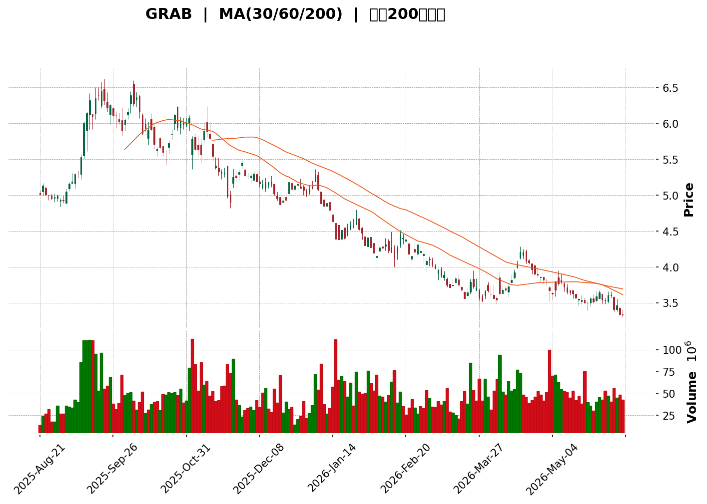
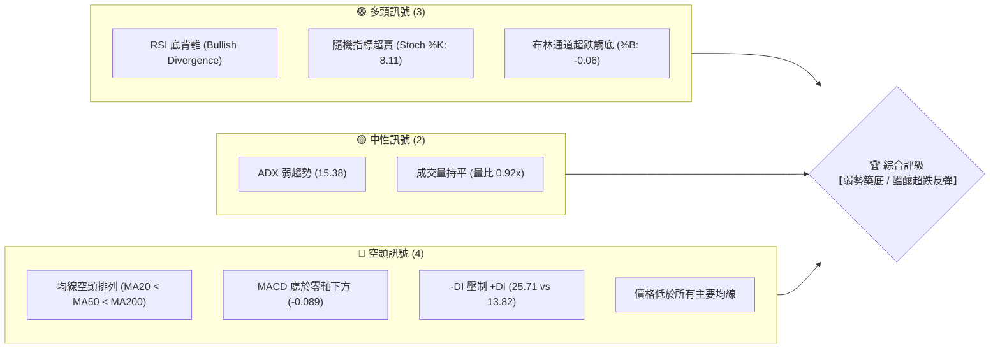
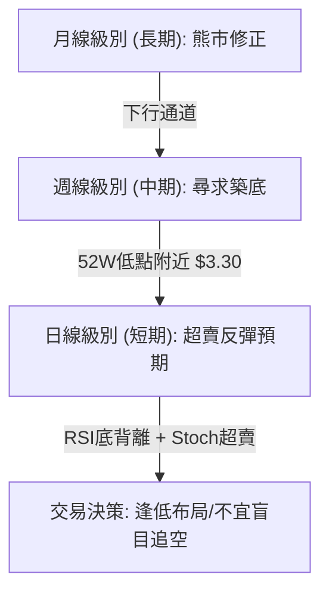
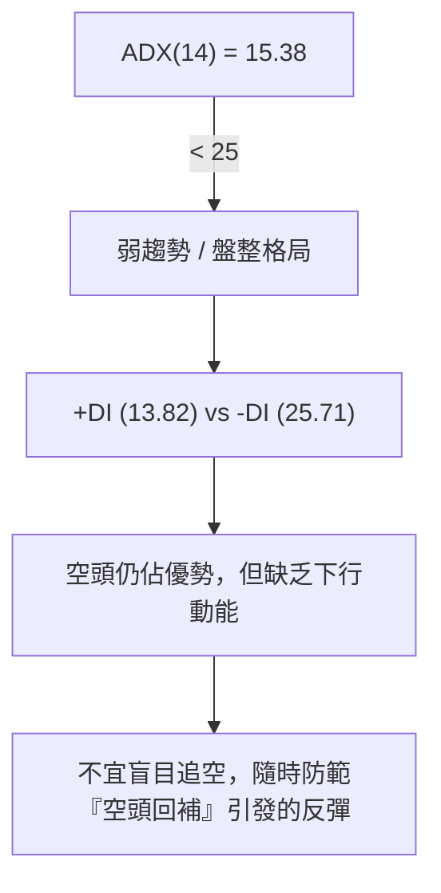
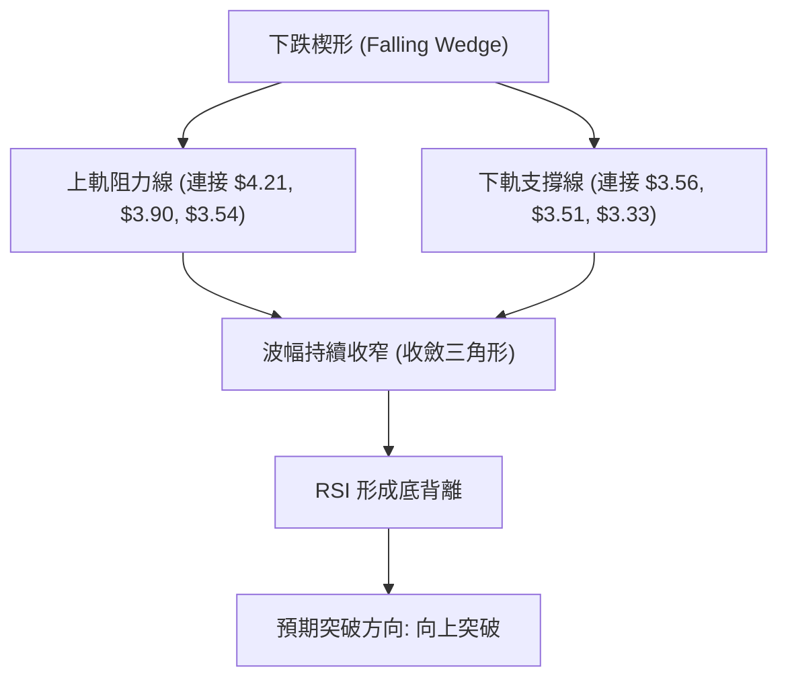

<details>
<summary>📊 靜態圖表 (點擊展開)</summary>

</details>

<html>
<head><meta charset="utf-8" /></head>
<body>
    <div style="height:500px; width:100%;">                        <script>window.PlotlyConfig = {MathJaxConfig: 'local'};</script>
        <script charset="utf-8" src="https://cdn.plot.ly/plotly-3.6.0.min.js" integrity="sha256-QaOVwtVY0T02VaHrr6pnoHLCwayMJp4O5n4YyaE3rJk=" crossorigin="anonymous"></script>                <div id="candlestick-chart" class="plotly-graph-div" style="height:100%; width:100%;"></div>            <script>                window.PLOTLYENV=window.PLOTLYENV || {};                                if (document.getElementById("candlestick-chart")) {                    Plotly.newPlot(                        "candlestick-chart",                        [{"close":{"dtype":"f8","bdata":"AAAAgD0KFEAAAADAHoUUQAAAAIA9ChRAAAAAAAAAFEAAAADAzMwTQAAAAKBH4RNAAAAAgML1E0AAAADgUbgTQAAAAIAUrhNAAAAAQDMzFEAAAAAA16MUQAAAAGCPwhRAAAAAwPUoFUAAAABAMzMVQAAAAGC4HhZAAAAAAAAAGEAAAAAgXI8YQAAAACCuRxlAAAAAYGZmGEAAAABgZmYZQAAAACBcjxlAAAAAwMzMGUAAAAAgrkcZQAAAAKBH4RhAAAAAAAAAGUAAAADgo3AYQAAAAOCjcBhAAAAA4HoUGEAAAACgmZkXQAAAAEAzMxhAAAAAANejGEAAAAAgXI8ZQAAAAOB6FBlAAAAA4KNwGUAAAACAFK4YQAAAAOCjcBdAAAAA4FG4F0AAAAAA16MXQAAAAIAUrhdAAAAAQArXFkAAAAAgXI8WQAAAAIAUrhZAAAAAYGZmFkAAAABA4XoWQAAAAKBH4RZAAAAAYGZmF0AAAABA4XoYQAAAAGCPwhdAAAAAQDMzGEAAAAAghesXQAAAAIA9ChhAAAAAIK5HGEAAAAAA1yMXQAAAACBcjxZAAAAAwB6FFkAAAACgcD0WQAAAAKCZmRdAAAAAwB6FF0AAAADA9SgXQAAAAMD1KBZAAAAAANejFUAAAACA61EVQAAAACCuRxVAAAAAoHA9FUAAAAAghesTQAAAAKCZmRNAAAAAAAAAFUAAAACAwvUUQAAAACCuRxVAAAAAwMzMFUAAAADgehQVQAAAAIA9ChVAAAAA4HoUFUAAAABAMzMVQAAAAGCPwhRAAAAAANejFEAAAACgmZkUQAAAAOBRuBRAAAAA4FG4FEAAAACgmZkUQAAAAOB6FBRAAAAAwMzME0AAAABA4XoTQAAAAIAUrhNAAAAA4FG4E0AAAADgUbgUQAAAAIDrURRAAAAAwB6FFEAAAACgmZkUQAAAAGBmZhRAAAAAIK5HFEAAAACAwvUTQAAAAIDrURRAAAAAAClcFEAAAADgehQVQAAAAIDrURRAAAAAwB6FE0AAAABgZmYTQAAAACBcjxNAAAAAwPUoE0AAAADAHoUSQAAAACBcjxFAAAAAwB6FEUAAAACAPQoSQAAAAKCZmRFAAAAAQDMzEkAAAACA61ESQAAAAKBwPRJAAAAAYI\u002fCEkAAAABguB4SQAAAAKBH4RFAAAAAQDMzEUAAAAAA16MRQAAAAOB6FBFAAAAAYI\u002fCEEAAAACgmZkQQAAAAOB6FBFAAAAAgD0KEUAAAACgcD0RQAAAACCF6xBAAAAA4HoUEUAAAADAHoUQQAAAAOB6FBFAAAAAwMzMEUAAAACgmZkRQAAAAMAehRFAAAAA4FG4EEAAAACgmZkQQAAAAEAK1xBAAAAAoHA9EUAAAACgR+EQQAAAAOBRuBBAAAAAgOtREEAAAABgZmYQQAAAAGC4HhBAAAAAQArXD0AAAACAFK4PQAAAAIDC9Q5AAAAAYLgeD0AAAAAAAAAOQAAAAIAUrg1AAAAAAAAADkAAAADgUbgOQAAAAAAAAA5AAAAA4KNwDUAAAABA4XoMQAAAAGC4Hg1AAAAAgOtRDkAAAABACtcNQAAAAIAUrg1AAAAAIFyPDEAAAACgcD0MQAAAACCuRw1AAAAAAClcDUAAAACAwvUMQAAAAEDhegxAAAAAgOtRDEAAAACAPQoNQAAAAOCjcA1AAAAA4KNwDUAAAABACtcNQAAAACBcjw5AAAAAAClcD0AAAADgehQQQAAAAEAK1xBAAAAAQArXEEAAAACA61EQQAAAAKBwPRBAAAAAgBSuD0AAAABAMzMPQAAAAGC4Hg9AAAAAoEfhDkAAAAAgXI8OQAAAACBcjw5AAAAAAClcDUAAAACAwvUMQAAAAOCjcA1AAAAAwPUoDkAAAACA61EOQAAAAGCPwg1AAAAAQDMzDUAAAABguB4NQAAAAIA9Cg1AAAAAIFyPDEAAAABgZmYMQAAAAIDrUQxAAAAAAAAADEAAAADgehQMQAAAAEDhegxAAAAA4HoUDEAAAADgUbgMQAAAAGC4Hg1AAAAAgOtRDEAAAACA61EMQAAAAKBH4QxAAAAAwMzMDEAAAAAgrkcLQAAAAIAUrgtAAAAA4FG4CkAAAAAA16MKQA=="},"high":{"dtype":"f8","bdata":"AAAAIK5HFEAAAACAFK4UQAAAAEDhehRAAAAAgD0KFEAAAADgehQUQAAAAOB6FBRAAAAAgD0KFEAAAABACtcTQAAAAIDC9RNAAAAAAClcFEAAAADgUbgUQAAAAOBROBVAAAAAQDMzFUAAAAAAKVwVQAAAACCuRxZAAAAAYLgeGEAAAAAA16MYQAAAAIAUrhlAAAAAwB6FGEAAAAAAAAAaQAAAAAAAABpAAAAAgOtRGkAAAABA4XoaQAAAAOBRuBlAAAAA4HoUGUAAAACgR+EYQAAAAIAUrhhAAAAAoJmZGEAAAACgR+EYQAAAACCuRxhAAAAAoEfhGEAAAAAgrscZQAAAAGBmZhpAAAAAQInBGUAAAACgmZkZQAAAACBcjxhAAAAAIK5HGEAAAADgehQYQAAAACBcjxhAAAAAgML1F0AAAABAM7MWQAAAAIBqPBdAAAAA4FG4FkAAAABA4XoWQAAAAIA9ChdAAAAAwPWoF0AAAADAHoUYQAAAAIDC9RhAAAAAAClcGEAAAACA61EYQAAAAIDrURhAAAAAgMJ1GEAAAAAgrkcXQAAAAOCjcBdAAAAAQApXF0AAAADA9SgXQAAAAAAAABhAAAAA4KPwGEAAAADgehQYQAAAAKBH4RZAAAAAYLgeFkAAAADgehQWQAAAAIDCdRVAAAAAwB6FFUAAAAAA16MVQAAAAKBwPRRAAAAAQOF6FUAAAAAAKVwVQAAAAOCjcBVAAAAAAAAAFkAAAABA4XoVQAAAAKBwPRVAAAAAQDMzFUAAAABgZmYVQAAAAGBmZhVAAAAAIFwPFUAAAAAAKdwUQAAAAIDC9RRAAAAAYI\u002fCFEAAAADgehQVQAAAAADXoxRAAAAAQDMzFEAAAACgR+ETQAAAAKBH4RNAAAAAYLgeFEAAAABguB4VQAAAAIDC9RRAAAAAoJmZFEAAAAAA16MUQAAAACCF6xRAAAAAIFyPFEAAAAAAKVwUQAAAAMAehRRAAAAAwMzMFEAAAADgo3AVQAAAAIDrURVAAAAAQDMzFEAAAACgR+ETQAAAAKBH4RNAAAAAoJmZE0AAAACAPQoTQAAAAMAehRJAAAAAYGZmEkAAAADgUTgSQAAAAEAzMxJAAAAAYGZmEkAAAAAgXI8SQAAAAIAUrhJAAAAAgBQuE0AAAADgUbgSQAAAAOBROBJAAAAAoEfhEUAAAADgUbgRQAAAAGCPwhFAAAAAQOF6EUAAAAAA16MQQAAAAMDMTBFAAAAAAClcEUAAAABguJ4RQAAAACBcjxFAAAAAgML1EUAAAADgUTgRQAAAAEAzMxFAAAAAgD0KEkAAAABACtcRQAAAAMAeBRJAAAAAgD2KEUAAAACgmZkQQAAAAMAehRFAAAAAIK5HEUAAAABguB4RQAAAAKBH4RBAAAAAgD2KEEAAAADgepQQQAAAAMAehRBAAAAAwPUoEEAAAACAFK4PQAAAAAAAABBAAAAAwB6FD0AAAADAzMwOQAAAAEDheg5AAAAAANejDkAAAACAwvUOQAAAAEAzMw9AAAAAQArXDUAAAADgo3ANQAAAAIAUrg1AAAAAANejDkAAAACgmZkPQAAAAOBRuA5AAAAAwB6FDUAAAACAwvUMQAAAAOCjcA1AAAAAgOtRDkAAAABgj8INQAAAAAAAAA5AAAAAYI\u002fCDEAAAADgo3APQAAAAEAK1w1AAAAAwMzMDUAAAACgcD0OQAAAAOB6FA9AAAAA4FG4D0AAAAAAKVwQQAAAAGC4HhFAAAAAAAAAEUAAAACAwvUQQAAAAOCjcBBAAAAAQDMzEEAAAADA9SgQQAAAACCF6w9AAAAAAAAAD0AAAAAghesOQAAAAOBRuA5AAAAAoEfhDUAAAABAMzMNQAAAAOCjcA5AAAAAoJmZD0AAAABAMzMPQAAAAKBwPQ5AAAAA4HoUDkAAAADgo3ANQAAAAOCjcA1AAAAAgML1DEAAAAAgXI8MQAAAAMDMzAxAAAAAIFyPDEAAAACA6SYMQAAAAADXowxAAAAAgML1DEAAAACA61ENQAAAAAApXA1AAAAAgML1DEAAAAAgXI8MQAAAACCuRw1AAAAAIK5HDUAAAADgUbgMQAAAAGBmZgxAAAAAwB6FC0AAAABAMzMLQA=="},"hovertemplate":"\u003cb\u003e%{x|%Y-%m-%d}\u003c\u002fb\u003e\u003cbr\u003e\u958b: $%{open:.2f}\u003cbr\u003e\u9ad8: $%{high:.2f}\u003cbr\u003e\u4f4e: $%{low:.2f}\u003cbr\u003e\u6536: $%{close:.2f}\u003cextra\u003e\u003c\u002fextra\u003e","low":{"dtype":"f8","bdata":"AAAAAAAAFEAAAACAwvUTQAAAAIDC9RNAAAAA4FG4E0AAAABgj8ITQAAAAKCZmRNAAAAAANejE0AAAAAAKVwTQAAAACBcjxNAAAAAwB6FE0AAAACgcD0UQAAAAADXoxRAAAAAAClcFEAAAACAwvUUQAAAAKBH4RRAAAAAgD0KFkAAAADgo3AWQAAAAADXoxdAAAAAwPWoF0AAAACgcD0YQAAAACCuRxlAAAAAoEfhGEAAAACAPQoZQAAAAADXoxhAAAAAgML1F0AAAADA9SgYQAAAAOBRuBdAAAAAgML1F0AAAACA61EXQAAAAKCZmRdAAAAAoHA9GEAAAAAgXI8YQAAAAIDC9RhAAAAAIIXrGEAAAAAgrkcYQAAAAAApXBdAAAAAIFyPF0AAAADAzMwWQAAAAKCZmRdAAAAAIFyPFkAAAADA9SgWQAAAAKCZmRZAAAAAwPUoFkAAAACAFK4VQAAAAIDrURZAAAAA4HoUF0AAAAAA16MXQAAAAKCZmRdAAAAAYGZmF0AAAACAFK4XQAAAAMDMzBdAAAAAoJmZF0AAAADgo3AVQAAAAEDhehZAAAAAgBQuFkAAAADAzMwVQAAAACCF6xZAAAAAQDMzF0AAAABguB4XQAAAACCF6xVAAAAA4KNwFUAAAADgehQVQAAAAKBH4RRAAAAAAAAAFUAAAABACtcTQAAAACCuRxNAAAAAIIVrFEAAAABgj8IUQAAAAEAK1xRAAAAA4KNwFUAAAAAAAAAVQAAAAKBH4RRAAAAAoJmZFEAAAAAgrscUQAAAAOBRuBRAAAAA4KNwFEAAAACA61EUQAAAAEAzMxRAAAAAoEdhFEAAAADgo3AUQAAAAIDC9RNAAAAAgBSuE0AAAABgZmYTQAAAACBcjxNAAAAAANejE0AAAACAPQoUQAAAACCuRxRAAAAAYLgeFEAAAADAzEwUQAAAAKBHYRRAAAAAAAAAFEAAAAAghesTQAAAAIA9ChRAAAAAgOtRFEAAAABgj8IUQAAAAGCPQhRAAAAA4KNwE0AAAACA61ETQAAAAAApXBNAAAAAAAAAE0AAAACA61ESQAAAAIDrURFAAAAA4KNwEUAAAABgZmYRQAAAACBcjxFAAAAA4FG4EUAAAADgehQSQAAAAMD1KBJAAAAAAClcEkAAAACAPQoSQAAAAMAehRFAAAAAwPUoEUAAAAAAAAARQAAAAOBRuBBAAAAAoJmZEEAAAACgcD0QQAAAAIDCdRBAAAAAQArXEEAAAAAghesQQAAAAGCPwhBAAAAAwMzMEEAAAAAAAAAQQAAAAGBmZhBAAAAA4HoUEUAAAABgj0IRQAAAAIDrURFAAAAAwB6FEEAAAABAMzMQQAAAAOCnxhBAAAAAIFyPEEAAAADgUbgQQAAAAKBwPRBAAAAAAClcD0AAAACAPQoQQAAAAAAAABBAAAAAYI\u002fCD0AAAADAHoUOQAAAAMDMzA5AAAAAQOF6DkAAAABgj8INQAAAAKCZmQ1AAAAAYI\u002fCDUAAAADA9SgOQAAAAEAK1w1AAAAAIK5HDUAAAABgZmYMQAAAAOBRuAxAAAAAgML1DEAAAACgmZkNQAAAAIDrUQ1AAAAAoHA9DEAAAADgehQMQAAAAGBmZgxAAAAAYLgeDUAAAAAA16MMQAAAAEDhegxAAAAAQArXC0AAAADAzMwMQAAAAIDC9QxAAAAAQDMzDUAAAAAA16MMQAAAAGBkOw5AAAAAgBSuDkAAAABACtcPQAAAAOCjcBBAAAAA4KNwEEAAAABAMzMQQAAAAMD1KBBAAAAAQDMzD0AAAACAPQoPQAAAAKBH4Q5AAAAAgOtRDkAAAADgehQOQAAAACCF6w1AAAAAwPUoDEAAAACA61EMQAAAAOBRuAxAAAAAIIXrDUAAAADgehQOQAAAACCuRw1AAAAAgML1DEAAAACgR+EMQAAAAEDhegxAAAAAYGZmDEAAAACAFK4LQAAAAEAK1wtAAAAAIIXrC0AAAABguB4LQAAAAKCZmQtAAAAAIIXrC0AAAADgehQMQAAAAOCjcAxAAAAAQArXC0AAAABACtcLQAAAAAAAAAxAAAAAIFyPDEAAAACAPQoLQAAAAIA9CgtAAAAAoJmZCkAAAABgZmYKQA=="},"name":"\u50f9\u683c","open":{"dtype":"f8","bdata":"AAAAYLgeFEAAAADAIDAUQAAAAGBmZhRAAAAAAAAAFEAAAACAwvUTQAAAAEAK1xNAAAAAwMzME0AAAADA9agTQAAAAOBRuBNAAAAAIFyPE0AAAAAAKVwUQAAAAIAUrhRAAAAAANejFEAAAABAMzMVQAAAAMD1KBVAAAAAQDMzFkAAAACgmZkXQAAAAEDhehhAAAAAwB6FGEAAAACAPYoYQAAAACBcjxlAAAAAQOH6GEAAAAAghesZQAAAAEAzMxlAAAAAwB6FGEAAAABACtcYQAAAAIDCdRhAAAAAoHA9GEAAAADA9SgYQAAAAIDC9RdAAAAAQOF6GEAAAACgmRkZQAAAAEAzMxpAAAAAgOtRGUAAAACAPYoZQAAAAEDhehhAAAAAgML1F0AAAADA9SgXQAAAAKBwPRhAAAAAwMzMF0AAAABA4XoWQAAAAMD1KBdAAAAA4FG4FkAAAABA4XoWQAAAAIAUrhZAAAAAoEdhF0AAAAAAAAAYQAAAACCF6xhAAAAAYI\u002fCF0AAAAAAAAAYQAAAAKBH4RdAAAAAgD0KGEAAAABgj0IWQAAAAGCPQhdAAAAAwMzMFkAAAADAzMwWQAAAAKCZGRdAAAAAIFwPGEAAAABgZmYXQAAAAEAK1xZAAAAAwB6FFUAAAACAPYoVQAAAAOBROBVAAAAAQDMzFUAAAAAA16MVQAAAAIA9ChRAAAAAgBSuFEAAAADgehQVQAAAAMD1KBVAAAAAANejFUAAAAAghWsVQAAAAMAeBRVAAAAAgML1FEAAAABACtcUQAAAAMD1KBVAAAAAYI\u002fCFEAAAAAghWsUQAAAAGBmZhRAAAAA4HqUFEAAAABgj8IUQAAAAKCZmRRAAAAAQOH6E0AAAACgR+ETQAAAAKCZmRNAAAAAoEfhE0AAAADgehQUQAAAAIAUrhRAAAAAgOtRFEAAAAAgXI8UQAAAAEDhehRAAAAAgMJ1FEAAAAAgrkcUQAAAAIAULhRAAAAAwB6FFEAAAABgj8IUQAAAAGC4HhVAAAAAQDMzFEAAAABgj8ITQAAAAGBmZhNAAAAAoJmZE0AAAAAghesSQAAAAOCjcBJAAAAAgOtREkAAAACAPYoRQAAAAEAzMxJAAAAAwMzMEUAAAADgehQSQAAAAKBwPRJAAAAAAClcEkAAAACAFK4SQAAAAMD1KBJAAAAAgBSuEUAAAABguB4RQAAAAMD1qBFAAAAAgOtREUAAAADAHoUQQAAAAKBH4RBAAAAAYLgeEUAAAADA9SgRQAAAAOCjcBFAAAAAwMzMEEAAAACAwvUQQAAAAGCPwhBAAAAAoHA9EUAAAADgepQRQAAAAOCjcBFAAAAAwMxMEUAAAADgo3AQQAAAAAAAABFAAAAA4FG4EEAAAADAzMwQQAAAAADXoxBAAAAAYLgeEEAAAADgo3AQQAAAAAApXBBAAAAAIFwPEEAAAAAgrkcPQAAAAIAUrg9AAAAAwMzMDkAAAAAA16MOQAAAAGC4Hg5AAAAAIIXrDUAAAACgcD0OQAAAAKCZmQ5AAAAAYI\u002fCDUAAAABAMzMNQAAAAMDMzAxAAAAAQDMzDUAAAAAA16MOQAAAAGBmZg1AAAAA4KNwDUAAAADgUbgMQAAAAMDMzAxAAAAAAAAADkAAAACAwvUMQAAAAKBH4QxAAAAAwB6FDEAAAABACtcOQAAAAIA9Cg1AAAAAoJmZDUAAAABAMzMNQAAAAKBwPQ5AAAAAwMzMDkAAAAAAAAAQQAAAAEDhehBAAAAAYLieEEAAAACgR+EQQAAAAAApXBBAAAAAQDMzEEAAAADgehQQQAAAAEAzMw9AAAAAwMzMDkAAAACgR+EOQAAAACBcjw5AAAAA4FG4DUAAAADgehQNQAAAAAApXA5AAAAAwMzMDkAAAAAgXI8OQAAAAMD1KA5AAAAAgBSuDUAAAAAAKVwNQAAAAAApXA1AAAAAgML1DEAAAACA61EMQAAAAGC4HgxAAAAAgOtRDEAAAADgehQMQAAAAAAAAAxAAAAAQOF6DEAAAAAgrkcMQAAAAEDhegxAAAAAgML1DEAAAACgcD0MQAAAAMD1KAxAAAAAoEfhDEAAAAAA16MMQAAAACCuRwtAAAAA4KNwC0AAAADgUbgKQA=="},"x":["2025-08-21T00:00:00-04:00","2025-08-22T00:00:00-04:00","2025-08-25T00:00:00-04:00","2025-08-26T00:00:00-04:00","2025-08-27T00:00:00-04:00","2025-08-28T00:00:00-04:00","2025-08-29T00:00:00-04:00","2025-09-02T00:00:00-04:00","2025-09-03T00:00:00-04:00","2025-09-04T00:00:00-04:00","2025-09-05T00:00:00-04:00","2025-09-08T00:00:00-04:00","2025-09-09T00:00:00-04:00","2025-09-10T00:00:00-04:00","2025-09-11T00:00:00-04:00","2025-09-12T00:00:00-04:00","2025-09-15T00:00:00-04:00","2025-09-16T00:00:00-04:00","2025-09-17T00:00:00-04:00","2025-09-18T00:00:00-04:00","2025-09-19T00:00:00-04:00","2025-09-22T00:00:00-04:00","2025-09-23T00:00:00-04:00","2025-09-24T00:00:00-04:00","2025-09-25T00:00:00-04:00","2025-09-26T00:00:00-04:00","2025-09-29T00:00:00-04:00","2025-09-30T00:00:00-04:00","2025-10-01T00:00:00-04:00","2025-10-02T00:00:00-04:00","2025-10-03T00:00:00-04:00","2025-10-06T00:00:00-04:00","2025-10-07T00:00:00-04:00","2025-10-08T00:00:00-04:00","2025-10-09T00:00:00-04:00","2025-10-10T00:00:00-04:00","2025-10-13T00:00:00-04:00","2025-10-14T00:00:00-04:00","2025-10-15T00:00:00-04:00","2025-10-16T00:00:00-04:00","2025-10-17T00:00:00-04:00","2025-10-20T00:00:00-04:00","2025-10-21T00:00:00-04:00","2025-10-22T00:00:00-04:00","2025-10-23T00:00:00-04:00","2025-10-24T00:00:00-04:00","2025-10-27T00:00:00-04:00","2025-10-28T00:00:00-04:00","2025-10-29T00:00:00-04:00","2025-10-30T00:00:00-04:00","2025-10-31T00:00:00-04:00","2025-11-03T00:00:00-05:00","2025-11-04T00:00:00-05:00","2025-11-05T00:00:00-05:00","2025-11-06T00:00:00-05:00","2025-11-07T00:00:00-05:00","2025-11-10T00:00:00-05:00","2025-11-11T00:00:00-05:00","2025-11-12T00:00:00-05:00","2025-11-13T00:00:00-05:00","2025-11-14T00:00:00-05:00","2025-11-17T00:00:00-05:00","2025-11-18T00:00:00-05:00","2025-11-19T00:00:00-05:00","2025-11-20T00:00:00-05:00","2025-11-21T00:00:00-05:00","2025-11-24T00:00:00-05:00","2025-11-25T00:00:00-05:00","2025-11-26T00:00:00-05:00","2025-11-28T00:00:00-05:00","2025-12-01T00:00:00-05:00","2025-12-02T00:00:00-05:00","2025-12-03T00:00:00-05:00","2025-12-04T00:00:00-05:00","2025-12-05T00:00:00-05:00","2025-12-08T00:00:00-05:00","2025-12-09T00:00:00-05:00","2025-12-10T00:00:00-05:00","2025-12-11T00:00:00-05:00","2025-12-12T00:00:00-05:00","2025-12-15T00:00:00-05:00","2025-12-16T00:00:00-05:00","2025-12-17T00:00:00-05:00","2025-12-18T00:00:00-05:00","2025-12-19T00:00:00-05:00","2025-12-22T00:00:00-05:00","2025-12-23T00:00:00-05:00","2025-12-24T00:00:00-05:00","2025-12-26T00:00:00-05:00","2025-12-29T00:00:00-05:00","2025-12-30T00:00:00-05:00","2025-12-31T00:00:00-05:00","2026-01-02T00:00:00-05:00","2026-01-05T00:00:00-05:00","2026-01-06T00:00:00-05:00","2026-01-07T00:00:00-05:00","2026-01-08T00:00:00-05:00","2026-01-09T00:00:00-05:00","2026-01-12T00:00:00-05:00","2026-01-13T00:00:00-05:00","2026-01-14T00:00:00-05:00","2026-01-15T00:00:00-05:00","2026-01-16T00:00:00-05:00","2026-01-20T00:00:00-05:00","2026-01-21T00:00:00-05:00","2026-01-22T00:00:00-05:00","2026-01-23T00:00:00-05:00","2026-01-26T00:00:00-05:00","2026-01-27T00:00:00-05:00","2026-01-28T00:00:00-05:00","2026-01-29T00:00:00-05:00","2026-01-30T00:00:00-05:00","2026-02-02T00:00:00-05:00","2026-02-03T00:00:00-05:00","2026-02-04T00:00:00-05:00","2026-02-05T00:00:00-05:00","2026-02-06T00:00:00-05:00","2026-02-09T00:00:00-05:00","2026-02-10T00:00:00-05:00","2026-02-11T00:00:00-05:00","2026-02-12T00:00:00-05:00","2026-02-13T00:00:00-05:00","2026-02-17T00:00:00-05:00","2026-02-18T00:00:00-05:00","2026-02-19T00:00:00-05:00","2026-02-20T00:00:00-05:00","2026-02-23T00:00:00-05:00","2026-02-24T00:00:00-05:00","2026-02-25T00:00:00-05:00","2026-02-26T00:00:00-05:00","2026-02-27T00:00:00-05:00","2026-03-02T00:00:00-05:00","2026-03-03T00:00:00-05:00","2026-03-04T00:00:00-05:00","2026-03-05T00:00:00-05:00","2026-03-06T00:00:00-05:00","2026-03-09T00:00:00-04:00","2026-03-10T00:00:00-04:00","2026-03-11T00:00:00-04:00","2026-03-12T00:00:00-04:00","2026-03-13T00:00:00-04:00","2026-03-16T00:00:00-04:00","2026-03-17T00:00:00-04:00","2026-03-18T00:00:00-04:00","2026-03-19T00:00:00-04:00","2026-03-20T00:00:00-04:00","2026-03-23T00:00:00-04:00","2026-03-24T00:00:00-04:00","2026-03-25T00:00:00-04:00","2026-03-26T00:00:00-04:00","2026-03-27T00:00:00-04:00","2026-03-30T00:00:00-04:00","2026-03-31T00:00:00-04:00","2026-04-01T00:00:00-04:00","2026-04-02T00:00:00-04:00","2026-04-06T00:00:00-04:00","2026-04-07T00:00:00-04:00","2026-04-08T00:00:00-04:00","2026-04-09T00:00:00-04:00","2026-04-10T00:00:00-04:00","2026-04-13T00:00:00-04:00","2026-04-14T00:00:00-04:00","2026-04-15T00:00:00-04:00","2026-04-16T00:00:00-04:00","2026-04-17T00:00:00-04:00","2026-04-20T00:00:00-04:00","2026-04-21T00:00:00-04:00","2026-04-22T00:00:00-04:00","2026-04-23T00:00:00-04:00","2026-04-24T00:00:00-04:00","2026-04-27T00:00:00-04:00","2026-04-28T00:00:00-04:00","2026-04-29T00:00:00-04:00","2026-04-30T00:00:00-04:00","2026-05-01T00:00:00-04:00","2026-05-04T00:00:00-04:00","2026-05-05T00:00:00-04:00","2026-05-06T00:00:00-04:00","2026-05-07T00:00:00-04:00","2026-05-08T00:00:00-04:00","2026-05-11T00:00:00-04:00","2026-05-12T00:00:00-04:00","2026-05-13T00:00:00-04:00","2026-05-14T00:00:00-04:00","2026-05-15T00:00:00-04:00","2026-05-18T00:00:00-04:00","2026-05-19T00:00:00-04:00","2026-05-20T00:00:00-04:00","2026-05-21T00:00:00-04:00","2026-05-22T00:00:00-04:00","2026-05-26T00:00:00-04:00","2026-05-27T00:00:00-04:00","2026-05-28T00:00:00-04:00","2026-05-29T00:00:00-04:00","2026-06-01T00:00:00-04:00","2026-06-02T00:00:00-04:00","2026-06-03T00:00:00-04:00","2026-06-04T00:00:00-04:00","2026-06-05T00:00:00-04:00","2026-06-08T00:00:00-04:00"],"type":"candlestick"},{"hovertemplate":"MA30: $%{y:.2f}\u003cextra\u003e\u003c\u002fextra\u003e","line":{"color":"#2196F3","dash":"dash","width":2},"mode":"lines","name":"MA30","x":["2025-08-21T00:00:00-04:00","2025-08-22T00:00:00-04:00","2025-08-25T00:00:00-04:00","2025-08-26T00:00:00-04:00","2025-08-27T00:00:00-04:00","2025-08-28T00:00:00-04:00","2025-08-29T00:00:00-04:00","2025-09-02T00:00:00-04:00","2025-09-03T00:00:00-04:00","2025-09-04T00:00:00-04:00","2025-09-05T00:00:00-04:00","2025-09-08T00:00:00-04:00","2025-09-09T00:00:00-04:00","2025-09-10T00:00:00-04:00","2025-09-11T00:00:00-04:00","2025-09-12T00:00:00-04:00","2025-09-15T00:00:00-04:00","2025-09-16T00:00:00-04:00","2025-09-17T00:00:00-04:00","2025-09-18T00:00:00-04:00","2025-09-19T00:00:00-04:00","2025-09-22T00:00:00-04:00","2025-09-23T00:00:00-04:00","2025-09-24T00:00:00-04:00","2025-09-25T00:00:00-04:00","2025-09-26T00:00:00-04:00","2025-09-29T00:00:00-04:00","2025-09-30T00:00:00-04:00","2025-10-01T00:00:00-04:00","2025-10-02T00:00:00-04:00","2025-10-03T00:00:00-04:00","2025-10-06T00:00:00-04:00","2025-10-07T00:00:00-04:00","2025-10-08T00:00:00-04:00","2025-10-09T00:00:00-04:00","2025-10-10T00:00:00-04:00","2025-10-13T00:00:00-04:00","2025-10-14T00:00:00-04:00","2025-10-15T00:00:00-04:00","2025-10-16T00:00:00-04:00","2025-10-17T00:00:00-04:00","2025-10-20T00:00:00-04:00","2025-10-21T00:00:00-04:00","2025-10-22T00:00:00-04:00","2025-10-23T00:00:00-04:00","2025-10-24T00:00:00-04:00","2025-10-27T00:00:00-04:00","2025-10-28T00:00:00-04:00","2025-10-29T00:00:00-04:00","2025-10-30T00:00:00-04:00","2025-10-31T00:00:00-04:00","2025-11-03T00:00:00-05:00","2025-11-04T00:00:00-05:00","2025-11-05T00:00:00-05:00","2025-11-06T00:00:00-05:00","2025-11-07T00:00:00-05:00","2025-11-10T00:00:00-05:00","2025-11-11T00:00:00-05:00","2025-11-12T00:00:00-05:00","2025-11-13T00:00:00-05:00","2025-11-14T00:00:00-05:00","2025-11-17T00:00:00-05:00","2025-11-18T00:00:00-05:00","2025-11-19T00:00:00-05:00","2025-11-20T00:00:00-05:00","2025-11-21T00:00:00-05:00","2025-11-24T00:00:00-05:00","2025-11-25T00:00:00-05:00","2025-11-26T00:00:00-05:00","2025-11-28T00:00:00-05:00","2025-12-01T00:00:00-05:00","2025-12-02T00:00:00-05:00","2025-12-03T00:00:00-05:00","2025-12-04T00:00:00-05:00","2025-12-05T00:00:00-05:00","2025-12-08T00:00:00-05:00","2025-12-09T00:00:00-05:00","2025-12-10T00:00:00-05:00","2025-12-11T00:00:00-05:00","2025-12-12T00:00:00-05:00","2025-12-15T00:00:00-05:00","2025-12-16T00:00:00-05:00","2025-12-17T00:00:00-05:00","2025-12-18T00:00:00-05:00","2025-12-19T00:00:00-05:00","2025-12-22T00:00:00-05:00","2025-12-23T00:00:00-05:00","2025-12-24T00:00:00-05:00","2025-12-26T00:00:00-05:00","2025-12-29T00:00:00-05:00","2025-12-30T00:00:00-05:00","2025-12-31T00:00:00-05:00","2026-01-02T00:00:00-05:00","2026-01-05T00:00:00-05:00","2026-01-06T00:00:00-05:00","2026-01-07T00:00:00-05:00","2026-01-08T00:00:00-05:00","2026-01-09T00:00:00-05:00","2026-01-12T00:00:00-05:00","2026-01-13T00:00:00-05:00","2026-01-14T00:00:00-05:00","2026-01-15T00:00:00-05:00","2026-01-16T00:00:00-05:00","2026-01-20T00:00:00-05:00","2026-01-21T00:00:00-05:00","2026-01-22T00:00:00-05:00","2026-01-23T00:00:00-05:00","2026-01-26T00:00:00-05:00","2026-01-27T00:00:00-05:00","2026-01-28T00:00:00-05:00","2026-01-29T00:00:00-05:00","2026-01-30T00:00:00-05:00","2026-02-02T00:00:00-05:00","2026-02-03T00:00:00-05:00","2026-02-04T00:00:00-05:00","2026-02-05T00:00:00-05:00","2026-02-06T00:00:00-05:00","2026-02-09T00:00:00-05:00","2026-02-10T00:00:00-05:00","2026-02-11T00:00:00-05:00","2026-02-12T00:00:00-05:00","2026-02-13T00:00:00-05:00","2026-02-17T00:00:00-05:00","2026-02-18T00:00:00-05:00","2026-02-19T00:00:00-05:00","2026-02-20T00:00:00-05:00","2026-02-23T00:00:00-05:00","2026-02-24T00:00:00-05:00","2026-02-25T00:00:00-05:00","2026-02-26T00:00:00-05:00","2026-02-27T00:00:00-05:00","2026-03-02T00:00:00-05:00","2026-03-03T00:00:00-05:00","2026-03-04T00:00:00-05:00","2026-03-05T00:00:00-05:00","2026-03-06T00:00:00-05:00","2026-03-09T00:00:00-04:00","2026-03-10T00:00:00-04:00","2026-03-11T00:00:00-04:00","2026-03-12T00:00:00-04:00","2026-03-13T00:00:00-04:00","2026-03-16T00:00:00-04:00","2026-03-17T00:00:00-04:00","2026-03-18T00:00:00-04:00","2026-03-19T00:00:00-04:00","2026-03-20T00:00:00-04:00","2026-03-23T00:00:00-04:00","2026-03-24T00:00:00-04:00","2026-03-25T00:00:00-04:00","2026-03-26T00:00:00-04:00","2026-03-27T00:00:00-04:00","2026-03-30T00:00:00-04:00","2026-03-31T00:00:00-04:00","2026-04-01T00:00:00-04:00","2026-04-02T00:00:00-04:00","2026-04-06T00:00:00-04:00","2026-04-07T00:00:00-04:00","2026-04-08T00:00:00-04:00","2026-04-09T00:00:00-04:00","2026-04-10T00:00:00-04:00","2026-04-13T00:00:00-04:00","2026-04-14T00:00:00-04:00","2026-04-15T00:00:00-04:00","2026-04-16T00:00:00-04:00","2026-04-17T00:00:00-04:00","2026-04-20T00:00:00-04:00","2026-04-21T00:00:00-04:00","2026-04-22T00:00:00-04:00","2026-04-23T00:00:00-04:00","2026-04-24T00:00:00-04:00","2026-04-27T00:00:00-04:00","2026-04-28T00:00:00-04:00","2026-04-29T00:00:00-04:00","2026-04-30T00:00:00-04:00","2026-05-01T00:00:00-04:00","2026-05-04T00:00:00-04:00","2026-05-05T00:00:00-04:00","2026-05-06T00:00:00-04:00","2026-05-07T00:00:00-04:00","2026-05-08T00:00:00-04:00","2026-05-11T00:00:00-04:00","2026-05-12T00:00:00-04:00","2026-05-13T00:00:00-04:00","2026-05-14T00:00:00-04:00","2026-05-15T00:00:00-04:00","2026-05-18T00:00:00-04:00","2026-05-19T00:00:00-04:00","2026-05-20T00:00:00-04:00","2026-05-21T00:00:00-04:00","2026-05-22T00:00:00-04:00","2026-05-26T00:00:00-04:00","2026-05-27T00:00:00-04:00","2026-05-28T00:00:00-04:00","2026-05-29T00:00:00-04:00","2026-06-01T00:00:00-04:00","2026-06-02T00:00:00-04:00","2026-06-03T00:00:00-04:00","2026-06-04T00:00:00-04:00","2026-06-05T00:00:00-04:00","2026-06-08T00:00:00-04:00"],"y":{"dtype":"f8","bdata":"AAAAAAAA+H8AAAAAAAD4fwAAAAAAAPh\u002fAAAAAAAA+H8AAAAAAAD4fwAAAAAAAPh\u002fAAAAAAAA+H8AAAAAAAD4fwAAAAAAAPh\u002fAAAAAAAA+H8AAAAAAAD4fwAAAAAAAPh\u002fAAAAAAAA+H8AAAAAAAD4fwAAAAAAAPh\u002fAAAAAAAA+H8AAAAAAAD4fwAAAAAAAPh\u002fAAAAAAAA+H8AAAAAAAD4fwAAAAAAAPh\u002fAAAAAAAA+H8AAAAAAAD4fwAAAAAAAPh\u002fAAAAAAAA+H8AAAAAAAD4fwAAAAAAAPh\u002fAAAAAAAA+H8AAAAAAAD4fzMzM6P+jRZAzczMfD+1FkCJiIiIQeAWQERERJRDCxdAERERca85F0B3d3f3U2MXQImIiOi0gRdAERERwcqhF0AAAAAgPsMXQCIiIkJg5RdAzczMbOf7F0Crqqq6SQwYQImIiAisHBhAq6qq2kAnGEDe3d0NLTIYQLy7u0upOBhAMzMzk4ozGEAAAADQ2zIYQCIiIlLjJRhAq6qqai4kGEDv7u5OjRcYQCIiItKUChhAVVVVVZz9F0De3d1tWesXQAAAAFCN1xdAvLu7q2PCF0AiIiKyna8XQAAAALByqBdAmpmZWaujF0B3d3cn6p8XQERERLSBjhdAq6qqGuh0F0Dv7u6uuVAXQFVVVXVMMBdAq6qqanUMF0CamZkJ1+MWQN7d3W0SwxZAAAAAgNyrFkAzMzPz\u002fZQWQCIiIhKDgBZAd3d3J6N3FkC8u7sLAmsWQJqZmWkDXRZARERE1L9RFkARERGh00YWQLy7u2u8NBZAvLu7Gy8dFkDv7u4eE\u002fwVQDMzMyMi4hVAVVVV9W\u002fEFUDv7u5OG6gVQN7d3Y1QhhVAd3d31xVgFUAzMzNz2kAVQO\u002fu7v5GKBVAzczMTGIQFUDv7u7OaQMVQJqZmYls5xRAAAAA8NLNFECJiIiI+rcUQBEREcH1qBRAq6qqylqdFEAzMzPTv5EUQLy7u6uOiRRAiYiISAyCFEB3d3dX8osUQERERDQXkhRAiYiIGHaFFECamZk5JngUQDMzM9N4aRRAiYiIqPFSFEARERFBGT0UQDMzMxNnHxRAMzMzIwYBFEAzMzMDD+YTQDMzM+MXyxNAERERoUW2E0BERETk0KITQAAAAECnjRNAERERke18E0DNzMzsw2cTQDMzM\u002fP9VBNAq6qqKs4+E0AAAACgGi8TQGZmZtbqGBNA7+7unqj\u002fEkCJiIhYgNwSQFVVVXXawBJAiYiISCijEkAAAABAfIYSQDMzMxPKaBJAERERkXtNEkBmZmbGIDASQDMzM+N6FBJAq6qqeqL+EUDe3d1N8OARQM3MzJwLyRFAq6qq6iaxEUCamZk5QpkRQLy7u0sMghFA3t3d\u002falxEUCrqqpaq2MRQImIiFiAXBFAd3d350JSEUBEREREREQRQImIiCijNxFAvLu7ay4kEUB3d3fHBA8RQHd3d3d39xBA3t3d9SjcEEDv7u42icEQQERERDyYpxBAq6qqQtKUEEBmZmaGXYEQQCIiIrKdbxBAd3d3PzVeEEB3d3e\u002fEUoQQJqZmbmQNBBAzczMzIUkEEDv7u6uuRAQQFVVVbXz\u002fQ9AIiIiUirOD0Dv7u6ONKUPQJqZmQmQew9A3t3djVBGD0AAAAAQEREPQFVVVYUW2Q5AZmZmtmWtDkDe3d0N5okOQCIiIqK3ZQ5AZmZmlrU6DkCJiIg4QhkOQERERMSuAA5AERERkcL1DUB3d3d3TPANQBERETGW\u002fA1AvLu7u0kMDkAiIiLiehQOQAAAAGBzIQ5AZmZmtjomDkB3d3cneDAOQCIiIuLBPA5AVVVVRUREDkDv7u6+5kIOQFVVVRWuRw5AIiIiUv9GDkBVVVXlF0sOQCIiIvLSTQ5AvLu7a3VMDkDv7u7+jVAOQCIiIsI8UQ5AzczM3LJWDkARERFBNV4OQHd3d\u002fcoXA5AZmZmVlVVDkAAAAAAjlAOQJqZmXkwTw5AzczMbHVMDkBVVVVFREQOQN7d3R0TPA5AZmZmJngwDkCJiIh46SYOQO\u002fu7r6fGg5AMzMzw64ADkB3d3cn6t8NQERERGT0tg1A3t3d3U+NDUBVVVXFkl8NQDMzMwOdNg1AmpmZuUkMDUAAAABAYOUMQA=="},"type":"scatter"},{"hovertemplate":"MA60: $%{y:.2f}\u003cextra\u003e\u003c\u002fextra\u003e","line":{"color":"#9C27B0","dash":"dash","width":2},"mode":"lines","name":"MA60","x":["2025-08-21T00:00:00-04:00","2025-08-22T00:00:00-04:00","2025-08-25T00:00:00-04:00","2025-08-26T00:00:00-04:00","2025-08-27T00:00:00-04:00","2025-08-28T00:00:00-04:00","2025-08-29T00:00:00-04:00","2025-09-02T00:00:00-04:00","2025-09-03T00:00:00-04:00","2025-09-04T00:00:00-04:00","2025-09-05T00:00:00-04:00","2025-09-08T00:00:00-04:00","2025-09-09T00:00:00-04:00","2025-09-10T00:00:00-04:00","2025-09-11T00:00:00-04:00","2025-09-12T00:00:00-04:00","2025-09-15T00:00:00-04:00","2025-09-16T00:00:00-04:00","2025-09-17T00:00:00-04:00","2025-09-18T00:00:00-04:00","2025-09-19T00:00:00-04:00","2025-09-22T00:00:00-04:00","2025-09-23T00:00:00-04:00","2025-09-24T00:00:00-04:00","2025-09-25T00:00:00-04:00","2025-09-26T00:00:00-04:00","2025-09-29T00:00:00-04:00","2025-09-30T00:00:00-04:00","2025-10-01T00:00:00-04:00","2025-10-02T00:00:00-04:00","2025-10-03T00:00:00-04:00","2025-10-06T00:00:00-04:00","2025-10-07T00:00:00-04:00","2025-10-08T00:00:00-04:00","2025-10-09T00:00:00-04:00","2025-10-10T00:00:00-04:00","2025-10-13T00:00:00-04:00","2025-10-14T00:00:00-04:00","2025-10-15T00:00:00-04:00","2025-10-16T00:00:00-04:00","2025-10-17T00:00:00-04:00","2025-10-20T00:00:00-04:00","2025-10-21T00:00:00-04:00","2025-10-22T00:00:00-04:00","2025-10-23T00:00:00-04:00","2025-10-24T00:00:00-04:00","2025-10-27T00:00:00-04:00","2025-10-28T00:00:00-04:00","2025-10-29T00:00:00-04:00","2025-10-30T00:00:00-04:00","2025-10-31T00:00:00-04:00","2025-11-03T00:00:00-05:00","2025-11-04T00:00:00-05:00","2025-11-05T00:00:00-05:00","2025-11-06T00:00:00-05:00","2025-11-07T00:00:00-05:00","2025-11-10T00:00:00-05:00","2025-11-11T00:00:00-05:00","2025-11-12T00:00:00-05:00","2025-11-13T00:00:00-05:00","2025-11-14T00:00:00-05:00","2025-11-17T00:00:00-05:00","2025-11-18T00:00:00-05:00","2025-11-19T00:00:00-05:00","2025-11-20T00:00:00-05:00","2025-11-21T00:00:00-05:00","2025-11-24T00:00:00-05:00","2025-11-25T00:00:00-05:00","2025-11-26T00:00:00-05:00","2025-11-28T00:00:00-05:00","2025-12-01T00:00:00-05:00","2025-12-02T00:00:00-05:00","2025-12-03T00:00:00-05:00","2025-12-04T00:00:00-05:00","2025-12-05T00:00:00-05:00","2025-12-08T00:00:00-05:00","2025-12-09T00:00:00-05:00","2025-12-10T00:00:00-05:00","2025-12-11T00:00:00-05:00","2025-12-12T00:00:00-05:00","2025-12-15T00:00:00-05:00","2025-12-16T00:00:00-05:00","2025-12-17T00:00:00-05:00","2025-12-18T00:00:00-05:00","2025-12-19T00:00:00-05:00","2025-12-22T00:00:00-05:00","2025-12-23T00:00:00-05:00","2025-12-24T00:00:00-05:00","2025-12-26T00:00:00-05:00","2025-12-29T00:00:00-05:00","2025-12-30T00:00:00-05:00","2025-12-31T00:00:00-05:00","2026-01-02T00:00:00-05:00","2026-01-05T00:00:00-05:00","2026-01-06T00:00:00-05:00","2026-01-07T00:00:00-05:00","2026-01-08T00:00:00-05:00","2026-01-09T00:00:00-05:00","2026-01-12T00:00:00-05:00","2026-01-13T00:00:00-05:00","2026-01-14T00:00:00-05:00","2026-01-15T00:00:00-05:00","2026-01-16T00:00:00-05:00","2026-01-20T00:00:00-05:00","2026-01-21T00:00:00-05:00","2026-01-22T00:00:00-05:00","2026-01-23T00:00:00-05:00","2026-01-26T00:00:00-05:00","2026-01-27T00:00:00-05:00","2026-01-28T00:00:00-05:00","2026-01-29T00:00:00-05:00","2026-01-30T00:00:00-05:00","2026-02-02T00:00:00-05:00","2026-02-03T00:00:00-05:00","2026-02-04T00:00:00-05:00","2026-02-05T00:00:00-05:00","2026-02-06T00:00:00-05:00","2026-02-09T00:00:00-05:00","2026-02-10T00:00:00-05:00","2026-02-11T00:00:00-05:00","2026-02-12T00:00:00-05:00","2026-02-13T00:00:00-05:00","2026-02-17T00:00:00-05:00","2026-02-18T00:00:00-05:00","2026-02-19T00:00:00-05:00","2026-02-20T00:00:00-05:00","2026-02-23T00:00:00-05:00","2026-02-24T00:00:00-05:00","2026-02-25T00:00:00-05:00","2026-02-26T00:00:00-05:00","2026-02-27T00:00:00-05:00","2026-03-02T00:00:00-05:00","2026-03-03T00:00:00-05:00","2026-03-04T00:00:00-05:00","2026-03-05T00:00:00-05:00","2026-03-06T00:00:00-05:00","2026-03-09T00:00:00-04:00","2026-03-10T00:00:00-04:00","2026-03-11T00:00:00-04:00","2026-03-12T00:00:00-04:00","2026-03-13T00:00:00-04:00","2026-03-16T00:00:00-04:00","2026-03-17T00:00:00-04:00","2026-03-18T00:00:00-04:00","2026-03-19T00:00:00-04:00","2026-03-20T00:00:00-04:00","2026-03-23T00:00:00-04:00","2026-03-24T00:00:00-04:00","2026-03-25T00:00:00-04:00","2026-03-26T00:00:00-04:00","2026-03-27T00:00:00-04:00","2026-03-30T00:00:00-04:00","2026-03-31T00:00:00-04:00","2026-04-01T00:00:00-04:00","2026-04-02T00:00:00-04:00","2026-04-06T00:00:00-04:00","2026-04-07T00:00:00-04:00","2026-04-08T00:00:00-04:00","2026-04-09T00:00:00-04:00","2026-04-10T00:00:00-04:00","2026-04-13T00:00:00-04:00","2026-04-14T00:00:00-04:00","2026-04-15T00:00:00-04:00","2026-04-16T00:00:00-04:00","2026-04-17T00:00:00-04:00","2026-04-20T00:00:00-04:00","2026-04-21T00:00:00-04:00","2026-04-22T00:00:00-04:00","2026-04-23T00:00:00-04:00","2026-04-24T00:00:00-04:00","2026-04-27T00:00:00-04:00","2026-04-28T00:00:00-04:00","2026-04-29T00:00:00-04:00","2026-04-30T00:00:00-04:00","2026-05-01T00:00:00-04:00","2026-05-04T00:00:00-04:00","2026-05-05T00:00:00-04:00","2026-05-06T00:00:00-04:00","2026-05-07T00:00:00-04:00","2026-05-08T00:00:00-04:00","2026-05-11T00:00:00-04:00","2026-05-12T00:00:00-04:00","2026-05-13T00:00:00-04:00","2026-05-14T00:00:00-04:00","2026-05-15T00:00:00-04:00","2026-05-18T00:00:00-04:00","2026-05-19T00:00:00-04:00","2026-05-20T00:00:00-04:00","2026-05-21T00:00:00-04:00","2026-05-22T00:00:00-04:00","2026-05-26T00:00:00-04:00","2026-05-27T00:00:00-04:00","2026-05-28T00:00:00-04:00","2026-05-29T00:00:00-04:00","2026-06-01T00:00:00-04:00","2026-06-02T00:00:00-04:00","2026-06-03T00:00:00-04:00","2026-06-04T00:00:00-04:00","2026-06-05T00:00:00-04:00","2026-06-08T00:00:00-04:00"],"y":{"dtype":"f8","bdata":"AAAAAAAA+H8AAAAAAAD4fwAAAAAAAPh\u002fAAAAAAAA+H8AAAAAAAD4fwAAAAAAAPh\u002fAAAAAAAA+H8AAAAAAAD4fwAAAAAAAPh\u002fAAAAAAAA+H8AAAAAAAD4fwAAAAAAAPh\u002fAAAAAAAA+H8AAAAAAAD4fwAAAAAAAPh\u002fAAAAAAAA+H8AAAAAAAD4fwAAAAAAAPh\u002fAAAAAAAA+H8AAAAAAAD4fwAAAAAAAPh\u002fAAAAAAAA+H8AAAAAAAD4fwAAAAAAAPh\u002fAAAAAAAA+H8AAAAAAAD4fwAAAAAAAPh\u002fAAAAAAAA+H8AAAAAAAD4fwAAAAAAAPh\u002fAAAAAAAA+H8AAAAAAAD4fwAAAAAAAPh\u002fAAAAAAAA+H8AAAAAAAD4fwAAAAAAAPh\u002fAAAAAAAA+H8AAAAAAAD4fwAAAAAAAPh\u002fAAAAAAAA+H8AAAAAAAD4fwAAAAAAAPh\u002fAAAAAAAA+H8AAAAAAAD4fwAAAAAAAPh\u002fAAAAAAAA+H8AAAAAAAD4fwAAAAAAAPh\u002fAAAAAAAA+H8AAAAAAAD4fwAAAAAAAPh\u002fAAAAAAAA+H8AAAAAAAD4fwAAAAAAAPh\u002fAAAAAAAA+H8AAAAAAAD4fwAAAAAAAPh\u002fAAAAAAAA+H8AAAAAAAD4f7y7uytADhdAvLu7yxMVF0C8u7ubfRgXQM3MzATIHRdA3t3dbRIjF0CJiIiAlSMXQDMzM6tjIhdAiYiIoNMmF0CamZkJHiwXQCIiIqrxMhdAIiIiSsU5F0AzMzPjpTsXQBEREbnXPBdAd3d3V4A8F0B3d3dXgDwXQLy7u9uyNhdAd3d311woF0B3d3d3dxcXQKuqqroCBBdAAAAAME\u002f0FkDv7u5O1N8WQAAAALByyBZAZmZmFtmuFkCJiIjwGZYWQHd3dyfqfxZARERE\u002fGJpFkCJiIjAg1kWQM3MzJzvRxZAzczMJL84FkAAAABY8isWQKuqqrq7GxZAq6qqciEJFkARERHBPPEVQImIiJDt3BVAmpmZ2UDHFUCJiIiw5LcVQBEREdGUqhVARERETKmYFUBmZmYWkoYVQKuqqvL9dBVAAAAAaEplFUBmZmamDVQVQGZmZj41PhVAvLu7+2IpFUAiIiJScRYVQHd3dyfq\u002fxRAZmZmXrrpFECamZkBcs8UQJqZmbHktxRAMzMzw66gFEDe3d2d74cUQImIiECnbRRAERERAXJPFECamZmJ+jcUQKuqquqYIBRA3t3ddQUIFEC8u7sT9e8TQHd3d38j1BNAREREnH24E0BERERkO58TQCIiIurfiBNA3t3dLWt1E0DNzMxM8GATQHd3d8cETxNAmpmZYVdAE0CrqqpScTYTQImIiGiRLRNAmpmZgU4bE0CamZk5tAgTQHd3d4\u002fC9RJAMzMz003iEkDe3d1NYtASQN7d3bXzvRJAVVVVhaSpEkC8u7ujKZUSQN7d3YVdgRJAZmZmBjptEkDe3d3V6lgSQLy7u1uPQhJAd3d3Q4ssEkDe3d2RphQSQLy7uxdL\u002fhFAq6qqNtDpEUAzMzMTPNgRQERERERExBFAMzMz7+6uEUAAAAAMSZMRQHd3d5e1ehFAq6qqCtdjEUB3d3f3mksRQO\u002fu7vbhMxFAERERXUgaEUDv7u6GXQERQAAAAHQh6RBAzczMYOXQEEDv7u5qvLQQQLy7u2\u002fLmhBA7+7u4uyDEEBERESgGm8QQGZmZg50WhBAiYiIZIJHEEB3d3c7JjgQQFVVVd1rLhBAAAAAGJImEEAAAABANR4QQImIiCD3GhBAzczMpCkVEEBEREQcoQwQQLy7u5MYBBBAERERUUbvD0CrqqpKxdkPQFVVVS35xQ9AVVVVZfS2D0De3d3l0KIPQM3MzLx0kw9AiYiI6LSBD0AiIiKynW8PQKuqqjJ6Ww9Aq6qqgsBKD0BmZmauADkPQLy7uzuYJw9Ad3d3l24SD0AAAADotAEPQImIiIDc6w5AIiIi8tLNDkAAAACIz7AOQHd3d38jlA5AmpmZke18DkCamZkpFWcOQAAAAGDlUA5AZmZm3pY1DkCJiIjYFSAOQJqZmUGnDQ5AIiIiqjj7DUB3d3dPG+gNQKuqqkrF2Q1AzczMzMzMDUC8u7vTBroNQJqZmTEIrA1AAAAAOEKZDUC8u7sz7IoNQA=="},"type":"scatter"},{"hovertemplate":"MA200: $%{y:.2f}\u003cextra\u003e\u003c\u002fextra\u003e","line":{"color":"#FF6F00","dash":"solid","width":2},"mode":"lines","name":"MA200","x":["2025-08-21T00:00:00-04:00","2025-08-22T00:00:00-04:00","2025-08-25T00:00:00-04:00","2025-08-26T00:00:00-04:00","2025-08-27T00:00:00-04:00","2025-08-28T00:00:00-04:00","2025-08-29T00:00:00-04:00","2025-09-02T00:00:00-04:00","2025-09-03T00:00:00-04:00","2025-09-04T00:00:00-04:00","2025-09-05T00:00:00-04:00","2025-09-08T00:00:00-04:00","2025-09-09T00:00:00-04:00","2025-09-10T00:00:00-04:00","2025-09-11T00:00:00-04:00","2025-09-12T00:00:00-04:00","2025-09-15T00:00:00-04:00","2025-09-16T00:00:00-04:00","2025-09-17T00:00:00-04:00","2025-09-18T00:00:00-04:00","2025-09-19T00:00:00-04:00","2025-09-22T00:00:00-04:00","2025-09-23T00:00:00-04:00","2025-09-24T00:00:00-04:00","2025-09-25T00:00:00-04:00","2025-09-26T00:00:00-04:00","2025-09-29T00:00:00-04:00","2025-09-30T00:00:00-04:00","2025-10-01T00:00:00-04:00","2025-10-02T00:00:00-04:00","2025-10-03T00:00:00-04:00","2025-10-06T00:00:00-04:00","2025-10-07T00:00:00-04:00","2025-10-08T00:00:00-04:00","2025-10-09T00:00:00-04:00","2025-10-10T00:00:00-04:00","2025-10-13T00:00:00-04:00","2025-10-14T00:00:00-04:00","2025-10-15T00:00:00-04:00","2025-10-16T00:00:00-04:00","2025-10-17T00:00:00-04:00","2025-10-20T00:00:00-04:00","2025-10-21T00:00:00-04:00","2025-10-22T00:00:00-04:00","2025-10-23T00:00:00-04:00","2025-10-24T00:00:00-04:00","2025-10-27T00:00:00-04:00","2025-10-28T00:00:00-04:00","2025-10-29T00:00:00-04:00","2025-10-30T00:00:00-04:00","2025-10-31T00:00:00-04:00","2025-11-03T00:00:00-05:00","2025-11-04T00:00:00-05:00","2025-11-05T00:00:00-05:00","2025-11-06T00:00:00-05:00","2025-11-07T00:00:00-05:00","2025-11-10T00:00:00-05:00","2025-11-11T00:00:00-05:00","2025-11-12T00:00:00-05:00","2025-11-13T00:00:00-05:00","2025-11-14T00:00:00-05:00","2025-11-17T00:00:00-05:00","2025-11-18T00:00:00-05:00","2025-11-19T00:00:00-05:00","2025-11-20T00:00:00-05:00","2025-11-21T00:00:00-05:00","2025-11-24T00:00:00-05:00","2025-11-25T00:00:00-05:00","2025-11-26T00:00:00-05:00","2025-11-28T00:00:00-05:00","2025-12-01T00:00:00-05:00","2025-12-02T00:00:00-05:00","2025-12-03T00:00:00-05:00","2025-12-04T00:00:00-05:00","2025-12-05T00:00:00-05:00","2025-12-08T00:00:00-05:00","2025-12-09T00:00:00-05:00","2025-12-10T00:00:00-05:00","2025-12-11T00:00:00-05:00","2025-12-12T00:00:00-05:00","2025-12-15T00:00:00-05:00","2025-12-16T00:00:00-05:00","2025-12-17T00:00:00-05:00","2025-12-18T00:00:00-05:00","2025-12-19T00:00:00-05:00","2025-12-22T00:00:00-05:00","2025-12-23T00:00:00-05:00","2025-12-24T00:00:00-05:00","2025-12-26T00:00:00-05:00","2025-12-29T00:00:00-05:00","2025-12-30T00:00:00-05:00","2025-12-31T00:00:00-05:00","2026-01-02T00:00:00-05:00","2026-01-05T00:00:00-05:00","2026-01-06T00:00:00-05:00","2026-01-07T00:00:00-05:00","2026-01-08T00:00:00-05:00","2026-01-09T00:00:00-05:00","2026-01-12T00:00:00-05:00","2026-01-13T00:00:00-05:00","2026-01-14T00:00:00-05:00","2026-01-15T00:00:00-05:00","2026-01-16T00:00:00-05:00","2026-01-20T00:00:00-05:00","2026-01-21T00:00:00-05:00","2026-01-22T00:00:00-05:00","2026-01-23T00:00:00-05:00","2026-01-26T00:00:00-05:00","2026-01-27T00:00:00-05:00","2026-01-28T00:00:00-05:00","2026-01-29T00:00:00-05:00","2026-01-30T00:00:00-05:00","2026-02-02T00:00:00-05:00","2026-02-03T00:00:00-05:00","2026-02-04T00:00:00-05:00","2026-02-05T00:00:00-05:00","2026-02-06T00:00:00-05:00","2026-02-09T00:00:00-05:00","2026-02-10T00:00:00-05:00","2026-02-11T00:00:00-05:00","2026-02-12T00:00:00-05:00","2026-02-13T00:00:00-05:00","2026-02-17T00:00:00-05:00","2026-02-18T00:00:00-05:00","2026-02-19T00:00:00-05:00","2026-02-20T00:00:00-05:00","2026-02-23T00:00:00-05:00","2026-02-24T00:00:00-05:00","2026-02-25T00:00:00-05:00","2026-02-26T00:00:00-05:00","2026-02-27T00:00:00-05:00","2026-03-02T00:00:00-05:00","2026-03-03T00:00:00-05:00","2026-03-04T00:00:00-05:00","2026-03-05T00:00:00-05:00","2026-03-06T00:00:00-05:00","2026-03-09T00:00:00-04:00","2026-03-10T00:00:00-04:00","2026-03-11T00:00:00-04:00","2026-03-12T00:00:00-04:00","2026-03-13T00:00:00-04:00","2026-03-16T00:00:00-04:00","2026-03-17T00:00:00-04:00","2026-03-18T00:00:00-04:00","2026-03-19T00:00:00-04:00","2026-03-20T00:00:00-04:00","2026-03-23T00:00:00-04:00","2026-03-24T00:00:00-04:00","2026-03-25T00:00:00-04:00","2026-03-26T00:00:00-04:00","2026-03-27T00:00:00-04:00","2026-03-30T00:00:00-04:00","2026-03-31T00:00:00-04:00","2026-04-01T00:00:00-04:00","2026-04-02T00:00:00-04:00","2026-04-06T00:00:00-04:00","2026-04-07T00:00:00-04:00","2026-04-08T00:00:00-04:00","2026-04-09T00:00:00-04:00","2026-04-10T00:00:00-04:00","2026-04-13T00:00:00-04:00","2026-04-14T00:00:00-04:00","2026-04-15T00:00:00-04:00","2026-04-16T00:00:00-04:00","2026-04-17T00:00:00-04:00","2026-04-20T00:00:00-04:00","2026-04-21T00:00:00-04:00","2026-04-22T00:00:00-04:00","2026-04-23T00:00:00-04:00","2026-04-24T00:00:00-04:00","2026-04-27T00:00:00-04:00","2026-04-28T00:00:00-04:00","2026-04-29T00:00:00-04:00","2026-04-30T00:00:00-04:00","2026-05-01T00:00:00-04:00","2026-05-04T00:00:00-04:00","2026-05-05T00:00:00-04:00","2026-05-06T00:00:00-04:00","2026-05-07T00:00:00-04:00","2026-05-08T00:00:00-04:00","2026-05-11T00:00:00-04:00","2026-05-12T00:00:00-04:00","2026-05-13T00:00:00-04:00","2026-05-14T00:00:00-04:00","2026-05-15T00:00:00-04:00","2026-05-18T00:00:00-04:00","2026-05-19T00:00:00-04:00","2026-05-20T00:00:00-04:00","2026-05-21T00:00:00-04:00","2026-05-22T00:00:00-04:00","2026-05-26T00:00:00-04:00","2026-05-27T00:00:00-04:00","2026-05-28T00:00:00-04:00","2026-05-29T00:00:00-04:00","2026-06-01T00:00:00-04:00","2026-06-02T00:00:00-04:00","2026-06-03T00:00:00-04:00","2026-06-04T00:00:00-04:00","2026-06-05T00:00:00-04:00","2026-06-08T00:00:00-04:00"],"y":{"dtype":"f8","bdata":"AAAAAAAA+H8AAAAAAAD4fwAAAAAAAPh\u002fAAAAAAAA+H8AAAAAAAD4fwAAAAAAAPh\u002fAAAAAAAA+H8AAAAAAAD4fwAAAAAAAPh\u002fAAAAAAAA+H8AAAAAAAD4fwAAAAAAAPh\u002fAAAAAAAA+H8AAAAAAAD4fwAAAAAAAPh\u002fAAAAAAAA+H8AAAAAAAD4fwAAAAAAAPh\u002fAAAAAAAA+H8AAAAAAAD4fwAAAAAAAPh\u002fAAAAAAAA+H8AAAAAAAD4fwAAAAAAAPh\u002fAAAAAAAA+H8AAAAAAAD4fwAAAAAAAPh\u002fAAAAAAAA+H8AAAAAAAD4fwAAAAAAAPh\u002fAAAAAAAA+H8AAAAAAAD4fwAAAAAAAPh\u002fAAAAAAAA+H8AAAAAAAD4fwAAAAAAAPh\u002fAAAAAAAA+H8AAAAAAAD4fwAAAAAAAPh\u002fAAAAAAAA+H8AAAAAAAD4fwAAAAAAAPh\u002fAAAAAAAA+H8AAAAAAAD4fwAAAAAAAPh\u002fAAAAAAAA+H8AAAAAAAD4fwAAAAAAAPh\u002fAAAAAAAA+H8AAAAAAAD4fwAAAAAAAPh\u002fAAAAAAAA+H8AAAAAAAD4fwAAAAAAAPh\u002fAAAAAAAA+H8AAAAAAAD4fwAAAAAAAPh\u002fAAAAAAAA+H8AAAAAAAD4fwAAAAAAAPh\u002fAAAAAAAA+H8AAAAAAAD4fwAAAAAAAPh\u002fAAAAAAAA+H8AAAAAAAD4fwAAAAAAAPh\u002fAAAAAAAA+H8AAAAAAAD4fwAAAAAAAPh\u002fAAAAAAAA+H8AAAAAAAD4fwAAAAAAAPh\u002fAAAAAAAA+H8AAAAAAAD4fwAAAAAAAPh\u002fAAAAAAAA+H8AAAAAAAD4fwAAAAAAAPh\u002fAAAAAAAA+H8AAAAAAAD4fwAAAAAAAPh\u002fAAAAAAAA+H8AAAAAAAD4fwAAAAAAAPh\u002fAAAAAAAA+H8AAAAAAAD4fwAAAAAAAPh\u002fAAAAAAAA+H8AAAAAAAD4fwAAAAAAAPh\u002fAAAAAAAA+H8AAAAAAAD4fwAAAAAAAPh\u002fAAAAAAAA+H8AAAAAAAD4fwAAAAAAAPh\u002fAAAAAAAA+H8AAAAAAAD4fwAAAAAAAPh\u002fAAAAAAAA+H8AAAAAAAD4fwAAAAAAAPh\u002fAAAAAAAA+H8AAAAAAAD4fwAAAAAAAPh\u002fAAAAAAAA+H8AAAAAAAD4fwAAAAAAAPh\u002fAAAAAAAA+H8AAAAAAAD4fwAAAAAAAPh\u002fAAAAAAAA+H8AAAAAAAD4fwAAAAAAAPh\u002fAAAAAAAA+H8AAAAAAAD4fwAAAAAAAPh\u002fAAAAAAAA+H8AAAAAAAD4fwAAAAAAAPh\u002fAAAAAAAA+H8AAAAAAAD4fwAAAAAAAPh\u002fAAAAAAAA+H8AAAAAAAD4fwAAAAAAAPh\u002fAAAAAAAA+H8AAAAAAAD4fwAAAAAAAPh\u002fAAAAAAAA+H8AAAAAAAD4fwAAAAAAAPh\u002fAAAAAAAA+H8AAAAAAAD4fwAAAAAAAPh\u002fAAAAAAAA+H8AAAAAAAD4fwAAAAAAAPh\u002fAAAAAAAA+H8AAAAAAAD4fwAAAAAAAPh\u002fAAAAAAAA+H8AAAAAAAD4fwAAAAAAAPh\u002fAAAAAAAA+H8AAAAAAAD4fwAAAAAAAPh\u002fAAAAAAAA+H8AAAAAAAD4fwAAAAAAAPh\u002fAAAAAAAA+H8AAAAAAAD4fwAAAAAAAPh\u002fAAAAAAAA+H8AAAAAAAD4fwAAAAAAAPh\u002fAAAAAAAA+H8AAAAAAAD4fwAAAAAAAPh\u002fAAAAAAAA+H8AAAAAAAD4fwAAAAAAAPh\u002fAAAAAAAA+H8AAAAAAAD4fwAAAAAAAPh\u002fAAAAAAAA+H8AAAAAAAD4fwAAAAAAAPh\u002fAAAAAAAA+H8AAAAAAAD4fwAAAAAAAPh\u002fAAAAAAAA+H8AAAAAAAD4fwAAAAAAAPh\u002fAAAAAAAA+H8AAAAAAAD4fwAAAAAAAPh\u002fAAAAAAAA+H8AAAAAAAD4fwAAAAAAAPh\u002fAAAAAAAA+H8AAAAAAAD4fwAAAAAAAPh\u002fAAAAAAAA+H8AAAAAAAD4fwAAAAAAAPh\u002fAAAAAAAA+H8AAAAAAAD4fwAAAAAAAPh\u002fAAAAAAAA+H8AAAAAAAD4fwAAAAAAAPh\u002fAAAAAAAA+H8AAAAAAAD4fwAAAAAAAPh\u002fAAAAAAAA+H8AAAAAAAD4fwAAAAAAAPh\u002fAAAAAAAA+H8pXI\u002f6XN0SQA=="},"type":"scatter"}],                        {"template":{"data":{"barpolar":[{"marker":{"line":{"color":"rgb(17,17,17)","width":0.5},"pattern":{"fillmode":"overlay","size":10,"solidity":0.2}},"type":"barpolar"}],"bar":[{"error_x":{"color":"#f2f5fa"},"error_y":{"color":"#f2f5fa"},"marker":{"line":{"color":"rgb(17,17,17)","width":0.5},"pattern":{"fillmode":"overlay","size":10,"solidity":0.2}},"type":"bar"}],"carpet":[{"aaxis":{"endlinecolor":"#A2B1C6","gridcolor":"#506784","linecolor":"#506784","minorgridcolor":"#506784","startlinecolor":"#A2B1C6"},"baxis":{"endlinecolor":"#A2B1C6","gridcolor":"#506784","linecolor":"#506784","minorgridcolor":"#506784","startlinecolor":"#A2B1C6"},"type":"carpet"}],"choropleth":[{"colorbar":{"outlinewidth":0,"ticks":""},"type":"choropleth"}],"contourcarpet":[{"colorbar":{"outlinewidth":0,"ticks":""},"type":"contourcarpet"}],"contour":[{"colorbar":{"outlinewidth":0,"ticks":""},"colorscale":[[0.0,"#0d0887"],[0.1111111111111111,"#46039f"],[0.2222222222222222,"#7201a8"],[0.3333333333333333,"#9c179e"],[0.4444444444444444,"#bd3786"],[0.5555555555555556,"#d8576b"],[0.6666666666666666,"#ed7953"],[0.7777777777777778,"#fb9f3a"],[0.8888888888888888,"#fdca26"],[1.0,"#f0f921"]],"type":"contour"}],"heatmap":[{"colorbar":{"outlinewidth":0,"ticks":""},"colorscale":[[0.0,"#0d0887"],[0.1111111111111111,"#46039f"],[0.2222222222222222,"#7201a8"],[0.3333333333333333,"#9c179e"],[0.4444444444444444,"#bd3786"],[0.5555555555555556,"#d8576b"],[0.6666666666666666,"#ed7953"],[0.7777777777777778,"#fb9f3a"],[0.8888888888888888,"#fdca26"],[1.0,"#f0f921"]],"type":"heatmap"}],"histogram2dcontour":[{"colorbar":{"outlinewidth":0,"ticks":""},"colorscale":[[0.0,"#0d0887"],[0.1111111111111111,"#46039f"],[0.2222222222222222,"#7201a8"],[0.3333333333333333,"#9c179e"],[0.4444444444444444,"#bd3786"],[0.5555555555555556,"#d8576b"],[0.6666666666666666,"#ed7953"],[0.7777777777777778,"#fb9f3a"],[0.8888888888888888,"#fdca26"],[1.0,"#f0f921"]],"type":"histogram2dcontour"}],"histogram2d":[{"colorbar":{"outlinewidth":0,"ticks":""},"colorscale":[[0.0,"#0d0887"],[0.1111111111111111,"#46039f"],[0.2222222222222222,"#7201a8"],[0.3333333333333333,"#9c179e"],[0.4444444444444444,"#bd3786"],[0.5555555555555556,"#d8576b"],[0.6666666666666666,"#ed7953"],[0.7777777777777778,"#fb9f3a"],[0.8888888888888888,"#fdca26"],[1.0,"#f0f921"]],"type":"histogram2d"}],"histogram":[{"marker":{"pattern":{"fillmode":"overlay","size":10,"solidity":0.2}},"type":"histogram"}],"mesh3d":[{"colorbar":{"outlinewidth":0,"ticks":""},"type":"mesh3d"}],"parcoords":[{"line":{"colorbar":{"outlinewidth":0,"ticks":""}},"type":"parcoords"}],"pie":[{"automargin":true,"type":"pie"}],"scatter3d":[{"line":{"colorbar":{"outlinewidth":0,"ticks":""}},"marker":{"colorbar":{"outlinewidth":0,"ticks":""}},"type":"scatter3d"}],"scattercarpet":[{"marker":{"colorbar":{"outlinewidth":0,"ticks":""}},"type":"scattercarpet"}],"scattergeo":[{"marker":{"colorbar":{"outlinewidth":0,"ticks":""}},"type":"scattergeo"}],"scattergl":[{"marker":{"line":{"color":"#283442"}},"type":"scattergl"}],"scattermapbox":[{"marker":{"colorbar":{"outlinewidth":0,"ticks":""}},"type":"scattermapbox"}],"scattermap":[{"marker":{"colorbar":{"outlinewidth":0,"ticks":""}},"type":"scattermap"}],"scatterpolargl":[{"marker":{"colorbar":{"outlinewidth":0,"ticks":""}},"type":"scatterpolargl"}],"scatterpolar":[{"marker":{"colorbar":{"outlinewidth":0,"ticks":""}},"type":"scatterpolar"}],"scatter":[{"marker":{"line":{"color":"#283442"}},"type":"scatter"}],"scatterternary":[{"marker":{"colorbar":{"outlinewidth":0,"ticks":""}},"type":"scatterternary"}],"surface":[{"colorbar":{"outlinewidth":0,"ticks":""},"colorscale":[[0.0,"#0d0887"],[0.1111111111111111,"#46039f"],[0.2222222222222222,"#7201a8"],[0.3333333333333333,"#9c179e"],[0.4444444444444444,"#bd3786"],[0.5555555555555556,"#d8576b"],[0.6666666666666666,"#ed7953"],[0.7777777777777778,"#fb9f3a"],[0.8888888888888888,"#fdca26"],[1.0,"#f0f921"]],"type":"surface"}],"table":[{"cells":{"fill":{"color":"#506784"},"line":{"color":"rgb(17,17,17)"}},"header":{"fill":{"color":"#2a3f5f"},"line":{"color":"rgb(17,17,17)"}},"type":"table"}]},"layout":{"annotationdefaults":{"arrowcolor":"#f2f5fa","arrowhead":0,"arrowwidth":1},"autotypenumbers":"strict","coloraxis":{"colorbar":{"outlinewidth":0,"ticks":""}},"colorscale":{"diverging":[[0,"#8e0152"],[0.1,"#c51b7d"],[0.2,"#de77ae"],[0.3,"#f1b6da"],[0.4,"#fde0ef"],[0.5,"#f7f7f7"],[0.6,"#e6f5d0"],[0.7,"#b8e186"],[0.8,"#7fbc41"],[0.9,"#4d9221"],[1,"#276419"]],"sequential":[[0.0,"#0d0887"],[0.1111111111111111,"#46039f"],[0.2222222222222222,"#7201a8"],[0.3333333333333333,"#9c179e"],[0.4444444444444444,"#bd3786"],[0.5555555555555556,"#d8576b"],[0.6666666666666666,"#ed7953"],[0.7777777777777778,"#fb9f3a"],[0.8888888888888888,"#fdca26"],[1.0,"#f0f921"]],"sequentialminus":[[0.0,"#0d0887"],[0.1111111111111111,"#46039f"],[0.2222222222222222,"#7201a8"],[0.3333333333333333,"#9c179e"],[0.4444444444444444,"#bd3786"],[0.5555555555555556,"#d8576b"],[0.6666666666666666,"#ed7953"],[0.7777777777777778,"#fb9f3a"],[0.8888888888888888,"#fdca26"],[1.0,"#f0f921"]]},"colorway":["#636efa","#EF553B","#00cc96","#ab63fa","#FFA15A","#19d3f3","#FF6692","#B6E880","#FF97FF","#FECB52"],"font":{"color":"#f2f5fa"},"geo":{"bgcolor":"rgb(17,17,17)","lakecolor":"rgb(17,17,17)","landcolor":"rgb(17,17,17)","showlakes":true,"showland":true,"subunitcolor":"#506784"},"hoverlabel":{"align":"left"},"hovermode":"closest","mapbox":{"style":"dark"},"paper_bgcolor":"rgb(17,17,17)","plot_bgcolor":"rgb(17,17,17)","polar":{"angularaxis":{"gridcolor":"#506784","linecolor":"#506784","ticks":""},"bgcolor":"rgb(17,17,17)","radialaxis":{"gridcolor":"#506784","linecolor":"#506784","ticks":""}},"scene":{"xaxis":{"backgroundcolor":"rgb(17,17,17)","gridcolor":"#506784","gridwidth":2,"linecolor":"#506784","showbackground":true,"ticks":"","zerolinecolor":"#C8D4E3"},"yaxis":{"backgroundcolor":"rgb(17,17,17)","gridcolor":"#506784","gridwidth":2,"linecolor":"#506784","showbackground":true,"ticks":"","zerolinecolor":"#C8D4E3"},"zaxis":{"backgroundcolor":"rgb(17,17,17)","gridcolor":"#506784","gridwidth":2,"linecolor":"#506784","showbackground":true,"ticks":"","zerolinecolor":"#C8D4E3"}},"shapedefaults":{"line":{"color":"#f2f5fa"}},"sliderdefaults":{"bgcolor":"#C8D4E3","bordercolor":"rgb(17,17,17)","borderwidth":1,"tickwidth":0},"ternary":{"aaxis":{"gridcolor":"#506784","linecolor":"#506784","ticks":""},"baxis":{"gridcolor":"#506784","linecolor":"#506784","ticks":""},"bgcolor":"rgb(17,17,17)","caxis":{"gridcolor":"#506784","linecolor":"#506784","ticks":""}},"title":{"x":0.05},"updatemenudefaults":{"bgcolor":"#506784","borderwidth":0},"xaxis":{"automargin":true,"gridcolor":"#283442","linecolor":"#506784","ticks":"","title":{"standoff":15},"zerolinecolor":"#283442","zerolinewidth":2},"yaxis":{"automargin":true,"gridcolor":"#283442","linecolor":"#506784","ticks":"","title":{"standoff":15},"zerolinecolor":"#283442","zerolinewidth":2}}},"xaxis":{"rangeslider":{"visible":false},"title":{"text":"\u65e5\u671f"}},"font":{"size":11},"title":{"text":"GRAB  |  MA(30\u002f60\u002f200)  |  \u6700\u8fd1200\u4ea4\u6613\u65e5"},"yaxis":{"title":{"text":"\u80a1\u50f9 (USD)"}},"hovermode":"x unified","height":500},                        {"responsive": true}                    )                };            </script>        </div>
</body>
</html>

# GRAB 技術分析報告

> **報告日期**：2026-06-08 ｜ **語言**：繁體中文 ｜ **數據來源**：Yahoo Finance ｜ **當前價格**：$3.33

---

## 目錄

| 章節 | 內容 |
|------|------|
| [1. 技術面概覽](#1-技術面概覽) | 訊號儀表板、核心指標、評分卡 |
| [2. 趨勢分析](#2-趨勢分析) | 多時框趨勢、長中短期走勢 |
| [3. 圖表形態分析](#3-圖表形態分析) | 形態識別、K線組合、目標價 |
| [4. 支撐與阻力](#4-支撐與阻力) | 關鍵價位、斐波那契回調 |
| [5. 技術指標深度解讀](#5-技術指標深度解讀) | MA/RSI/MACD/布林/成交量 |
| [6. 動能與波動率](#6-動能與波動率) | 動能評估、ATR、Beta |
| [7. 多時框架總結](#7-多時框架總結) | 時框架評分矩陣 |
| [8. 交易策略建議](#8-交易策略建議) | 多空策略、風險報酬比 |
| [9. 風險提示與監控](#9-風險提示與監控) | 監控指標、風險場景 |
| [10. 報告總結](#-報告總結) | 核心結論與最佳策略 |

---

## 1. 技術面概覽

### 🎯 技術訊號儀表板

本儀表板綜合評估了 GRAB 目前在日線與週線級別上的技術特徵。目前市場呈現「極度超賣但伴隨潛在反轉訊號」的格局。



### 📊 核心指標速覽表

| 指標類別 | 指標名稱 | 當前數值 | 訊號 | 解讀 |
|----------|----------|----------|------|------|
| **價格** | 當前價格 | $3.33 | 🔴 | 位於 52 週低點（$3.30）邊緣，下行壓力沉重 |
| **均線** | MA20 | $3.54 | 🔴 | 價格在 MA20 下方，短期趨勢偏空，MA20 為首要阻力 |
| **均線** | MA50 | $3.69 | 🔴 | 中期空頭防線，斜率向下，壓制力度強 |
| **均線** | MA200 | $4.72 | 🔴 | 長期牛熊分界線，偏離度達 -29.4%，呈現嚴重超跌 |
| **動能** | RSI(14) | 37.35 | 🟡 | 處於弱勢偏低區間，但與價格形成顯著的「底背離」 |
| **動能** | MACD | -0.089 | 🔴 | 雙線在零軸下方運行，柱狀體為 -0.016，空頭控盤 |
| **動能** | Stoch %K / %D | 8.11 / 13.35 | 🟢 | 進入極度超賣區（< 20），隨時可能觸發技術性反彈 |
| **波動** | ATR(14) | $0.13 | 🟡 | 每日波動率約 4.00%，波動幅度適中，適合波段操作 |
| **趨勢** | ADX(14) | 15.38 | 🟡 | 數值 < 25，顯示當前下行趨勢動能已衰竭，進入盤整築底 |

### 🏆 技術評分卡

╔══════════════════════════════════════════════════════════╗
║              技術評分卡 — GRAB (2026-06-08)              ║
╠══════════════════════════════════════════════════════════╣
║  趨勢強度      ██████░░░░░░░░░░░░░░░░  30/100  🔴 趨勢極弱  ║
║  動能指標      ██████████░░░░░░░░░░░░  50/100  🟡 底背離浮現║
║  支撐穩定度    ████████░░░░░░░░░░░░░░  40/100  🟡 考驗歷史低║
║  成交量配合    ████████░░░░░░░░░░░░░░  40/100  🟡 縮量下跌  ║
║  形態完整度    ████████████░░░░░░░░░░  60/100  🟡 楔形末端  ║
║  均線排列      ██░░░░░░░░░░░░░░░░░░░░  10/100  🔴 嚴重空頭  ║
╠══════════════════════════════════════════════════════════╣
║  綜合評分      ████████░░░░░░░░░░░░░░  38/100  評級：🟡 中性 ║
╚══════════════════════════════════════════════════════════╝

---

## 2. 趨勢分析

### 🌐 多時框趨勢分析

技術分析必須遵循「由大到小」的原則。以下為 GRAB 在月線、週線與日線級別的趨勢遞進關係：



### 📈 長期趨勢 — 24個月歷史走勢與近期軌跡

以下為過去 24 個月的價格走勢圖，展示了 GRAB 從 2024 年中的低位爬升，於 2025 年第三季達到 $6.02 的高峰，隨後在 2026 年上半年一路下挫至當前 $3.33 的完整週期。

```
GRAB 24個月收盤價走勢圖 (2024-06 至 2026-06)
價格軸 ($)
$6.50 ┤
$6.00 ┤                                   ●   ●
$5.50 ┤                                       ▲   ●
$5.00 ┤               ●                       ▲       ●
$4.50 ┤               ▲   ●   ●   ●   ●   ●   ▲           ●   ●
$4.00 ┤           ●   ▲                                       ▲   ●
$3.50 ┤●   ●   ●   ▲                                               ●   ●
$3.00 ┤                                                                   ●(現在: $3.33)
      └─┬───┬───┬───┬───┬───┬───┬───┬───┬───┬───┬───┬───┬───┬───┬───┬───┬───┬───► 月份
       24-06   24-09   24-11   25-02   25-05   25-08   25-10   25-12   26-03   26-06
```

#### 走勢特徵分析表

| 歷史階段 | 時間區間 | 價格區間 | 漲跌幅 | 交易量特徵 | 技術面主導因素 |
| :--- | :--- | :--- | :--- | :--- | :--- |
| **第一階段：蓄勢突破** | 2024-06 ~ 2024-11 | $3.55 → $5.00 | +40.8% | 溫和放量 | 突破 $4.00 心理關口，奠定上升趨勢 |
| **第二階段：高位震盪** | 2024-12 ~ 2025-08 | $4.72 → $4.99 | +5.7% | 縮量整理 | 於 $4.50 - $5.00 區間進行長達 9 個月的籌碼換手 |
| **第三階段：主升浪潮** | 2025-09 ~ 2025-10 | $4.99 → $6.02 | +20.6% | 顯著放大 | 創下 $6.62 的 52 週新高，買盤極度強勁 |
| **第四階段：中期退潮** | 2025-11 ~ 2026-02 | $6.01 → $4.22 | -29.8% | 陰跌放量 | 跌破 MA200（$4.72），多頭結構遭到破壞 |
| **第五階段：加速趕底** | 2026-03 ~ 2026-06 | $4.22 → $3.33 | -21.1% | 縮量趕底 | 逼近 52 週低點 $3.30，指標呈現嚴重鈍化與超賣 |

### 📊 中期趨勢（週線分析）

在週線圖上，GRAB 沿著一條下降軌道運行。然而，近期走勢顯示出下行斜率趨緩的跡象。

```
週線級別阻力與支撐示意圖
═════════════════════════════════════════════════════════════════
[阻力位 R2]  $4.11 ─────────────────── (前波週線反彈高點 / 強阻力)
                              \
[阻力位 R1]  $3.54 - $3.69 ─────\───── (MA20 與 MA50 重合壓力帶)
                                 \
[當前現價]  $3.33 ────────────────●─── (測試下軌支撐)
                                 /
[支撐位 S1]  $3.30 ─────────────/───── (52 週歷史低點 / 關鍵防線)
                              /
[支撐位 S2]  $3.00 ──────────/──────── (整數心理大關 / 極限支撐)
═════════════════════════════════════════════════════════════════
```

### ⚡ 趨勢強度評估（ADX 解讀）

目前 GRAB 的 ADX(14) 數值為 **15.38**。這是一個極為關鍵的訊號，其技術意涵如下：



#### ADX 趨勢強度對照

| ADX 數值區間 | 趨勢強度 | GRAB 當前狀態 (15.38) | 對應交易策略 |
| :--- | :--- | :--- | :--- |
| **0 - 20** | **極弱 / 無趨勢** | ▓▓▓▓▓▓▓▓▓▓▓▓▓▓░░░░░░ (適用) | **震盪指標為主**，避免趨勢跟隨策略，改用網格或區間逆勢操作。 |
| **20 - 25** | **溫和趨勢** | ░░░░░░░░░░░░░░░░░░░░ | 觀察趨勢方向的確立，不宜重倉。 |
| **25 - 50** | **強趨勢** | ░░░░░░░░░░░░░░░░░░░░ | 順勢交易，指標鈍化時仍應沿趨勢方向操作。 |
| **> 50** | **極強趨勢** | ░░░░░░░░░░░░░░░░░░░░ | 強烈單邊行情，注意反轉風險。 |

---

## 3. 圖表形態分析

### 🔍 形態識別系統

在日線圖上，GRAB 自 2026 年 4 月下旬的高點 $4.21 下跌以來，其高點與低點的連接線構成了一個標準的**下跌楔形 (Falling Wedge)**。這在技術分析中是一個經典的**看漲反轉形態**。



### 🕯️ 重要K線形態分析

觀察近期（2026年5月至6月）的日線與週線 K 線組合，可以發現多頭在低位進行抵抗的蛛絲馬跡：

| 日期/月份 | 收盤價 | K線形態 | 形態描述與技術解讀 | 訊號強度 |
| :--- | :--- | :--- | :--- | :--- |
| **2026-05-10** | $3.72 | **錘頭線 (Hammer)** | 在連續下挫後出現，下影線長度為實體 2 倍以上，顯示 $3.50 附近有買盤強烈支撐。 | 🟡 中性偏多 |
| **2026-05-17** | $3.55 | **十字星 (Doji)** | 股價在低位震盪，多空雙方力量達到暫時平衡，預示跌勢放緩。 | 🟡 中性 |
| **2026-05-31** | $3.54 | **孕線 (Harami)** | 當週波幅完全包覆在前一週之內，顯示下跌動能遭到遏制，籌碼開始鎖定。 | 🟢 看漲反轉 |
| **2026-06-14** | $3.33 | **長下影十字星** | 盤中一度測試 52 週低點 $3.30 後迅速拉回，收盤收在 $3.33，確認 $3.30 具有強大護盤力道。 | 🟢 強烈看漲 |

### 📉 ASCII 走勢形態示意圖

```
GRAB 日線級別「下跌楔形」與「RSI 底背離」示意圖
═════════════════════════════════════════════════════════════════
價格軸 ($)
$4.20 ┤   ● (4月高點 $4.21)
$4.00 ┤    \     ● (5月高點 $3.90)
$3.80 ┤     \   /  \
$3.60 ┤      \ /    \       ● (5/31高點 $3.54)
$3.40 ┤       ●      \     /  \
$3.