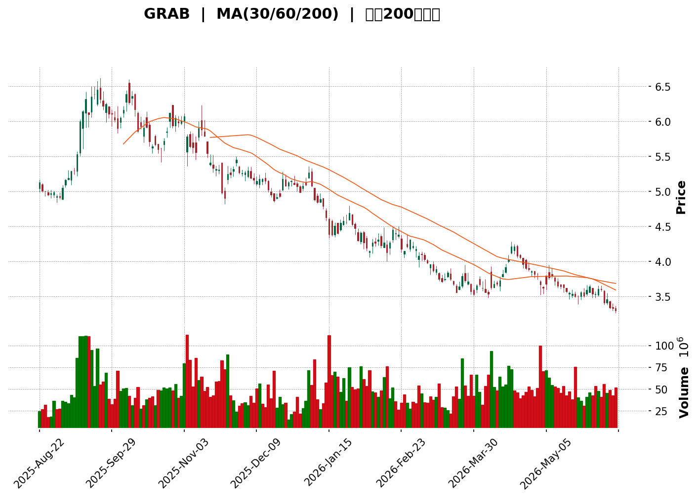
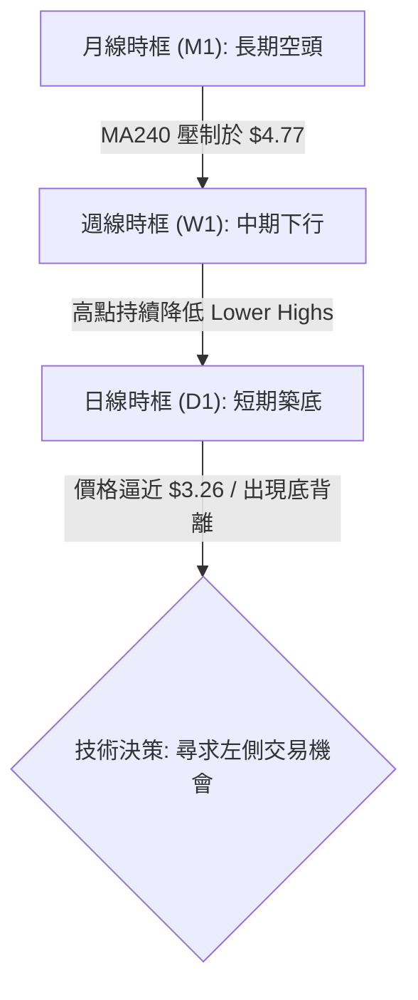
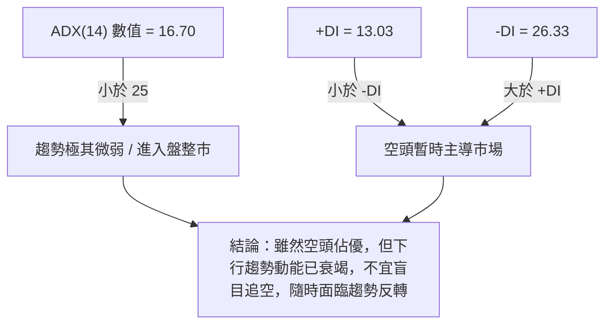

<details>
<summary>📊 靜態圖表 (點擊展開)</summary>

</details>

<html>
<head><meta charset="utf-8" /></head>
<body>
    <div style="height:500px; width:100%;">                        <script>window.PlotlyConfig = {MathJaxConfig: 'local'};</script>
        <script charset="utf-8" src="https://cdn.plot.ly/plotly-3.6.0.min.js" integrity="sha256-QaOVwtVY0T02VaHrr6pnoHLCwayMJp4O5n4YyaE3rJk=" crossorigin="anonymous"></script>                <div id="candlestick-chart" class="plotly-graph-div" style="height:100%; width:100%;"></div>            <script>                window.PLOTLYENV=window.PLOTLYENV || {};                                if (document.getElementById("candlestick-chart")) {                    Plotly.newPlot(                        "candlestick-chart",                        [{"close":{"dtype":"f8","bdata":"AAAAwB6FFEAAAACAPQoUQAAAAAAAABRAAAAAwMzME0AAAACgR+ETQAAAAIDC9RNAAAAA4FG4E0AAAACAFK4TQAAAAEAzMxRAAAAAANejFEAAAABgj8IUQAAAAMD1KBVAAAAAQDMzFUAAAABguB4WQAAAAAAAABhAAAAAIFyPGEAAAAAgrkcZQAAAAGBmZhhAAAAAYGZmGUAAAAAgXI8ZQAAAAMDMzBlAAAAAIK5HGUAAAACgR+EYQAAAAAAAABlAAAAA4KNwGEAAAADgo3AYQAAAAOB6FBhAAAAAoJmZF0AAAABAMzMYQAAAAADXoxhAAAAAIFyPGUAAAADgehQZQAAAAOCjcBlAAAAAgBSuGEAAAADgo3AXQAAAAOBRuBdAAAAAANejF0AAAACAFK4XQAAAAEAK1xZAAAAAIFyPFkAAAACAFK4WQAAAAGBmZhZAAAAAQOF6FkAAAACgR+EWQAAAAGBmZhdAAAAAQOF6GEAAAABgj8IXQAAAAEAzMxhAAAAAIIXrF0AAAACAPQoYQAAAACCuRxhAAAAAANcjF0AAAAAgXI8WQAAAAMAehRZAAAAAoHA9FkAAAACgmZkXQAAAAMAehRdAAAAAwPUoF0AAAADA9SgWQAAAAADXoxVAAAAAgOtRFUAAAAAgrkcVQAAAAKBwPRVAAAAAIIXrE0AAAACgmZkTQAAAAAAAABVAAAAAgML1FEAAAAAgrkcVQAAAAMDMzBVAAAAA4HoUFUAAAACAPQoVQAAAAOB6FBVAAAAAQDMzFUAAAABgj8IUQAAAAADXoxRAAAAAoJmZFEAAAADgUbgUQAAAAOBRuBRAAAAAoJmZFEAAAADgehQUQAAAAMDMzBNAAAAAQOF6E0AAAACAFK4TQAAAAOBRuBNAAAAA4FG4FEAAAACA61EUQAAAAMAehRRAAAAAoJmZFEAAAABgZmYUQAAAACCuRxRAAAAAgML1E0AAAACA61EUQAAAAAApXBRAAAAA4HoUFUAAAACA61EUQAAAAMAehRNAAAAAYGZmE0AAAAAgXI8TQAAAAMD1KBNAAAAAwB6FEkAAAAAgXI8RQAAAAMAehRFAAAAAgD0KEkAAAACgmZkRQAAAAEAzMxJAAAAAgOtREkAAAACgcD0SQAAAAGCPwhJAAAAAYLgeEkAAAACgR+ERQAAAAEAzMxFAAAAAANejEUAAAADgehQRQAAAAGCPwhBAAAAAoJmZEEAAAADgehQRQAAAAIA9ChFAAAAAoHA9EUAAAAAghesQQAAAAOB6FBFAAAAAwB6FEEAAAADgehQRQAAAAMDMzBFAAAAAoJmZEUAAAADAHoURQAAAAOBRuBBAAAAAoJmZEEAAAABACtcQQAAAAKBwPRFAAAAAoEfhEEAAAADgUbgQQAAAAIDrURBAAAAAYGZmEEAAAABguB4QQAAAAEAK1w9AAAAAgBSuD0AAAACAwvUOQAAAAGC4Hg9AAAAAAAAADkAAAACAFK4NQAAAAAAAAA5AAAAA4FG4DkAAAAAAAAAOQAAAAOCjcA1AAAAAQOF6DEAAAABguB4NQAAAAIDrUQ5AAAAAQArXDUAAAACAFK4NQAAAACBcjwxAAAAAoHA9DEAAAAAgrkcNQAAAAAApXA1AAAAAgML1DEAAAABA4XoMQAAAAIDrUQxAAAAAgD0KDUAAAADgo3ANQAAAAOCjcA1AAAAAQArXDUAAAAAgXI8OQAAAAAApXA9AAAAA4HoUEEAAAABACtcQQAAAAEAK1xBAAAAAgOtREEAAAACgcD0QQAAAAIAUrg9AAAAAQDMzD0AAAABguB4PQAAAAKBH4Q5AAAAAIFyPDkAAAAAgXI8OQAAAAAApXA1AAAAAgML1DEAAAADgo3ANQAAAAMD1KA5AAAAAgOtRDkAAAABgj8INQAAAAEAzMw1AAAAAYLgeDUAAAACAPQoNQAAAACBcjwxAAAAAYGZmDEAAAACA61EMQAAAAAAAAAxAAAAA4HoUDEAAAABA4XoMQAAAAOB6FAxAAAAA4FG4DEAAAABguB4NQAAAAIDrUQxAAAAAgOtRDEAAAACgR+EMQAAAAMDMzAxAAAAAIK5HC0AAAACAFK4LQAAAAOBRuApAAAAAANejCkAAAABgZmYKQA=="},"high":{"dtype":"f8","bdata":"AAAAgBSuFEAAAABA4XoUQAAAAIA9ChRAAAAA4HoUFEAAAADgehQUQAAAAIA9ChRAAAAAQArXE0AAAACAwvUTQAAAAAApXBRAAAAA4FG4FEAAAADgUTgVQAAAAEAzMxVAAAAAAClcFUAAAAAgrkcWQAAAAGC4HhhAAAAAANejGEAAAACAFK4ZQAAAAMAehRhAAAAAAAAAGkAAAAAAAAAaQAAAAIDrURpAAAAAQOF6GkAAAADgUbgZQAAAAOB6FBlAAAAAoEfhGEAAAACAFK4YQAAAAKCZmRhAAAAAoEfhGEAAAAAgrkcYQAAAAKBH4RhAAAAAIK7HGUAAAABgZmYaQAAAAECJwRlAAAAAoJmZGUAAAAAgXI8YQAAAACCuRxhAAAAA4HoUGEAAAAAgXI8YQAAAAIDC9RdAAAAAQDOzFkAAAACAajwXQAAAAOBRuBZAAAAAQOF6FkAAAACAPQoXQAAAAMD1qBdAAAAAwB6FGEAAAACAwvUYQAAAAAApXBhAAAAAgOtRGEAAAACA61EYQAAAAIDCdRhAAAAAIK5HF0AAAADgo3AXQAAAAEAKVxdAAAAAwPUoF0AAAAAAAAAYQAAAAOCj8BhAAAAA4HoUGEAAAACgR+EWQAAAAGC4HhZAAAAA4HoUFkAAAACAwnUVQAAAAMAehRVAAAAAANejFUAAAACgcD0UQAAAAEDhehVAAAAAAClcFUAAAADgo3AVQAAAAAAAABZAAAAAQOF6FUAAAACgcD0VQAAAAEAzMxVAAAAAYGZmFUAAAABgZmYVQAAAACBcDxVAAAAAACncFEAAAACAwvUUQAAAAGCPwhRAAAAA4HoUFUAAAAAA16MUQAAAAEAzMxRAAAAAoEfhE0AAAACgR+ETQAAAAGC4HhRAAAAAYLgeFUAAAACAwvUUQAAAAKCZmRRAAAAAANejFEAAAAAghesUQAAAACBcjxRAAAAAAClcFEAAAADAHoUUQAAAAMDMzBRAAAAA4KNwFUAAAACA61EVQAAAAEAzMxRAAAAAoEfhE0AAAACgR+ETQAAAAKCZmRNAAAAAgD0KE0AAAADAHoUSQAAAAGBmZhJAAAAA4FE4EkAAAABAMzMSQAAAAGBmZhJAAAAAIFyPEkAAAACAFK4SQAAAAIAULhNAAAAA4FG4EkAAAADgUTgSQAAAAKBH4RFAAAAA4FG4EUAAAABgj8IRQAAAAEDhehFAAAAAANejEEAAAADAzEwRQAAAAAApXBFAAAAAYLieEUAAAAAgXI8RQAAAAIDC9RFAAAAA4FE4EUAAAABAMzMRQAAAAIA9ChJAAAAAQArXEUAAAADAHgUSQAAAAIA9ihFAAAAAoJmZEEAAAADAHoURQAAAACCuRxFAAAAAYLgeEUAAAACgR+EQQAAAAIA9ihBAAAAA4HqUEEAAAADAHoUQQAAAAMD1KBBAAAAAgBSuD0AAAAAAAAAQQAAAAMAehQ9AAAAAwMzMDkAAAABA4XoOQAAAAADXow5AAAAAgML1DkAAAABAMzMPQAAAAEAK1w1AAAAA4KNwDUAAAACAFK4NQAAAAADXow5AAAAAoJmZD0AAAADgUbgOQAAAAMAehQ1AAAAAgML1DEAAAADgo3ANQAAAAIDrUQ5AAAAAYI\u002fCDUAAAAAAAAAOQAAAAGCPwgxAAAAA4KNwD0AAAABACtcNQAAAAMDMzA1AAAAAoHA9DkAAAADgehQPQAAAAOBRuA9AAAAAAClcEEAAAABguB4RQAAAAAAAABFAAAAAgML1EEAAAADgo3AQQAAAAEAzMxBAAAAAwPUoEEAAAAAghesPQAAAAAAAAA9AAAAAIIXrDkAAAADgUbgOQAAAAKBH4Q1AAAAAQDMzDUAAAADgo3AOQAAAAKCZmQ9AAAAAQDMzD0AAAACgcD0OQAAAAOB6FA5AAAAA4KNwDUAAAADgo3ANQAAAAIDC9QxAAAAAIFyPDEAAAADAzMwMQAAAACBcjwxAAAAAgOkmDEAAAAAA16MMQAAAAIDC9QxAAAAAgOtRDUAAAAAAKVwNQAAAAIDC9QxAAAAAIFyPDEAAAAAgrkcNQAAAACCuRw1AAAAA4FG4DEAAAABgZmYMQAAAAMAehQtAAAAAQDMzC0AAAACAwvUKQA=="},"hovertemplate":"\u003cb\u003e%{x|%Y-%m-%d}\u003c\u002fb\u003e\u003cbr\u003e\u958b: $%{open:.2f}\u003cbr\u003e\u9ad8: $%{high:.2f}\u003cbr\u003e\u4f4e: $%{low:.2f}\u003cbr\u003e\u6536: $%{close:.2f}\u003cextra\u003e\u003c\u002fextra\u003e","low":{"dtype":"f8","bdata":"AAAAgML1E0AAAACAwvUTQAAAAOBRuBNAAAAAYI\u002fCE0AAAACgmZkTQAAAAADXoxNAAAAAAClcE0AAAAAgXI8TQAAAAMAehRNAAAAAoHA9FEAAAAAA16MUQAAAAAApXBRAAAAAgML1FEAAAACgR+EUQAAAAIA9ChZAAAAA4KNwFkAAAAAA16MXQAAAAMD1qBdAAAAAoHA9GEAAAAAgrkcZQAAAAKBH4RhAAAAAgD0KGUAAAAAA16MYQAAAAIDC9RdAAAAAwPUoGEAAAADgUbgXQAAAAIDC9RdAAAAAgOtRF0AAAACgmZkXQAAAAKBwPRhAAAAAIFyPGEAAAACAwvUYQAAAACCF6xhAAAAAIK5HGEAAAAAAKVwXQAAAACBcjxdAAAAAwMzMFkAAAACgmZkXQAAAACBcjxZAAAAAwPUoFkAAAACgmZkWQAAAAMD1KBZAAAAAgBSuFUAAAACA61EWQAAAAOB6FBdAAAAAANejF0AAAACgmZkXQAAAAGBmZhdAAAAAgBSuF0AAAADAzMwXQAAAAKCZmRdAAAAA4KNwFUAAAABA4XoWQAAAAIAULhZAAAAAwMzMFUAAAAAghesWQAAAAEAzMxdAAAAAYLgeF0AAAAAghesVQAAAAOCjcBVAAAAA4HoUFUAAAACgR+EUQAAAAAAAABVAAAAAQArXE0AAAAAgrkcTQAAAACCFaxRAAAAAYI\u002fCFEAAAABACtcUQAAAAOCjcBVAAAAAAAAAFUAAAACgR+EUQAAAAKCZmRRAAAAAIK7HFEAAAADgUbgUQAAAAOCjcBRAAAAAgOtRFEAAAABAMzMUQAAAAKBHYRRAAAAA4KNwFEAAAACAwvUTQAAAAIAUrhNAAAAAYGZmE0AAAAAgXI8TQAAAAADXoxNAAAAAgD0KFEAAAAAgrkcUQAAAAGC4HhRAAAAAwMxMFEAAAACgR2EUQAAAAAAAABRAAAAAIIXrE0AAAACAPQoUQAAAAIDrURRAAAAAYI\u002fCFEAAAABgj0IUQAAAAOCjcBNAAAAAgOtRE0AAAAAAKVwTQAAAAAAAABNAAAAAgOtREkAAAACA61ERQAAAAOCjcBFAAAAAYGZmEUAAAAAgXI8RQAAAAOBRuBFAAAAA4HoUEkAAAADA9SgSQAAAAAApXBJAAAAAgD0KEkAAAADAHoURQAAAAMD1KBFAAAAAAAAAEUAAAADgUbgQQAAAAKCZmRBAAAAAoHA9EEAAAACAwnUQQAAAAEAK1xBAAAAAIIXrEEAAAABgj8IQQAAAAMDMzBBAAAAAAAAAEEAAAABgZmYQQAAAAOB6FBFAAAAAYI9CEUAAAACA61ERQAAAAMAehRBAAAAAQDMzEEAAAADgp8YQQAAAACBcjxBAAAAA4FG4EEAAAACgcD0QQAAAAAApXA9AAAAAgD0KEEAAAAAAAAAQQAAAAGCPwg9AAAAAwB6FDkAAAADAzMwOQAAAAEDheg5AAAAAYI\u002fCDUAAAACgmZkNQAAAAGCPwg1AAAAAwPUoDkAAAABACtcNQAAAACCuRw1AAAAAYGZmDEAAAADgUbgMQAAAAIDC9QxAAAAAoJmZDUAAAACA61ENQAAAAKBwPQxAAAAA4HoUDEAAAABgZmYMQAAAAGC4Hg1AAAAAANejDEAAAABA4XoMQAAAAEAK1wtAAAAAwMzMDEAAAACAwvUMQAAAAEAzMw1AAAAAANejDEAAAABgZDsOQAAAAIAUrg5AAAAAQArXD0AAAADgo3AQQAAAAOCjcBBAAAAAQDMzEEAAAADA9SgQQAAAAEAzMw9AAAAAgD0KD0AAAACgR+EOQAAAAIDrUQ5AAAAA4HoUDkAAAAAghesNQAAAAMD1KAxAAAAAgOtRDEAAAADgUbgMQAAAACCF6w1AAAAA4HoUDkAAAAAgrkcNQAAAAIDC9QxAAAAAoEfhDEAAAABA4XoMQAAAAGBmZgxAAAAAgBSuC0AAAABACtcLQAAAACCF6wtAAAAAYLgeC0AAAACgmZkLQAAAACCF6wtAAAAA4HoUDEAAAADgo3AMQAAAAEAK1wtAAAAAQArXC0AAAAAAAAAMQAAAACBcjwxAAAAAgD0KC0AAAACAPQoLQAAAAKCZmQpAAAAAYGZmCkAAAADgehQKQA=="},"name":"\u50f9\u683c","open":{"dtype":"f8","bdata":"AAAAwCAwFEAAAABgZmYUQAAAAAAAABRAAAAAgML1E0AAAABACtcTQAAAAMDMzBNAAAAAwPWoE0AAAADgUbgTQAAAACBcjxNAAAAAAClcFEAAAACAFK4UQAAAAADXoxRAAAAAQDMzFUAAAADA9SgVQAAAAEAzMxZAAAAAoJmZF0AAAABA4XoYQAAAAMAehRhAAAAAgD2KGEAAAAAgXI8ZQAAAAEDh+hhAAAAAIIXrGUAAAABAMzMZQAAAAMAehRhAAAAAQArXGEAAAACAwnUYQAAAAKBwPRhAAAAAwPUoGEAAAACAwvUXQAAAAEDhehhAAAAAoJkZGUAAAABAMzMaQAAAAIDrURlAAAAAgD2KGUAAAABA4XoYQAAAAIDC9RdAAAAAwPUoF0AAAACgcD0YQAAAAMDMzBdAAAAAQOF6FkAAAADA9SgXQAAAAOBRuBZAAAAAQOF6FkAAAACAFK4WQAAAAKBHYRdAAAAAAAAAGEAAAAAghesYQAAAAGCPwhdAAAAAAAAAGEAAAACgR+EXQAAAAIA9ChhAAAAAYI9CFkAAAABgj0IXQAAAAMDMzBZAAAAAwMzMFkAAAACgmRkXQAAAACBcDxhAAAAAYGZmF0AAAABACtcWQAAAAMAehRVAAAAAgD2KFUAAAADgUTgVQAAAAEAzMxVAAAAAANejFUAAAACAPQoUQAAAAIAUrhRAAAAA4HoUFUAAAADA9SgVQAAAAADXoxVAAAAAIIVrFUAAAADAHgUVQAAAAIDC9RRAAAAAQArXFEAAAADA9SgVQAAAAGCPwhRAAAAAIIVrFEAAAABgZmYUQAAAAOB6lBRAAAAAYI\u002fCFEAAAACgmZkUQAAAAEDh+hNAAAAAoEfhE0AAAACgmZkTQAAAAKBH4RNAAAAA4HoUFEAAAACAFK4UQAAAAIDrURRAAAAAIFyPFEAAAABA4XoUQAAAAIDCdRRAAAAAIK5HFEAAAACAFC4UQAAAAMAehRRAAAAAYI\u002fCFEAAAABguB4VQAAAAEAzMxRAAAAAYI\u002fCE0AAAABgZmYTQAAAAKCZmRNAAAAAIIXrEkAAAADgo3ASQAAAAIDrURJAAAAAgD2KEUAAAABAMzMSQAAAAMDMzBFAAAAA4HoUEkAAAACgcD0SQAAAAAApXBJAAAAAgBSuEkAAAADA9SgSQAAAAIAUrhFAAAAAYLgeEUAAAADA9agRQAAAAIDrURFAAAAAwB6FEEAAAACgR+EQQAAAAGC4HhFAAAAAwPUoEUAAAADgo3ARQAAAAMDMzBBAAAAAgML1EEAAAABgj8IQQAAAAKBwPRFAAAAA4HqUEUAAAADgo3ARQAAAAMDMTBFAAAAA4KNwEEAAAAAAAAARQAAAAOBRuBBAAAAAwMzMEEAAAAAA16MQQAAAAGC4HhBAAAAA4KNwEEAAAAAAKVwQQAAAACBcDxBAAAAAIK5HD0AAAACAFK4PQAAAAMDMzA5AAAAAANejDkAAAABguB4OQAAAACCF6w1AAAAAoHA9DkAAAACgmZkOQAAAAGCPwg1AAAAAQDMzDUAAAADAzMwMQAAAAEAzMw1AAAAAANejDkAAAABgZmYNQAAAAOCjcA1AAAAA4FG4DEAAAADAzMwMQAAAAAAAAA5AAAAAgML1DEAAAACgR+EMQAAAAMAehQxAAAAAQArXDkAAAACAPQoNQAAAAKCZmQ1AAAAAQDMzDUAAAACgcD0OQAAAAMDMzA5AAAAAAAAAEEAAAABA4XoQQAAAAGC4nhBAAAAAoEfhEEAAAAAAKVwQQAAAAEAzMxBAAAAA4HoUEEAAAABAMzMPQAAAAMDMzA5AAAAAoEfhDkAAAAAgXI8OQAAAAOBRuA1AAAAA4HoUDUAAAAAAKVwOQAAAAMDMzA5AAAAAIFyPDkAAAADA9SgOQAAAAIAUrg1AAAAAAClcDUAAAAAAKVwNQAAAAIDC9QxAAAAAgOtRDEAAAABguB4MQAAAAIDrUQxAAAAA4HoUDEAAAAAAAAAMQAAAAEDhegxAAAAAIK5HDEAAAABA4XoMQAAAAIDC9QxAAAAAoHA9DEAAAADA9SgMQAAAAKBH4QxAAAAAANejDEAAAAAgrkcLQAAAAOCjcAtAAAAAYI\u002fCCkAAAAAA16MKQA=="},"x":["2025-08-22T00:00:00-04:00","2025-08-25T00:00:00-04:00","2025-08-26T00:00:00-04:00","2025-08-27T00:00:00-04:00","2025-08-28T00:00:00-04:00","2025-08-29T00:00:00-04:00","2025-09-02T00:00:00-04:00","2025-09-03T00:00:00-04:00","2025-09-04T00:00:00-04:00","2025-09-05T00:00:00-04:00","2025-09-08T00:00:00-04:00","2025-09-09T00:00:00-04:00","2025-09-10T00:00:00-04:00","2025-09-11T00:00:00-04:00","2025-09-12T00:00:00-04:00","2025-09-15T00:00:00-04:00","2025-09-16T00:00:00-04:00","2025-09-17T00:00:00-04:00","2025-09-18T00:00:00-04:00","2025-09-19T00:00:00-04:00","2025-09-22T00:00:00-04:00","2025-09-23T00:00:00-04:00","2025-09-24T00:00:00-04:00","2025-09-25T00:00:00-04:00","2025-09-26T00:00:00-04:00","2025-09-29T00:00:00-04:00","2025-09-30T00:00:00-04:00","2025-10-01T00:00:00-04:00","2025-10-02T00:00:00-04:00","2025-10-03T00:00:00-04:00","2025-10-06T00:00:00-04:00","2025-10-07T00:00:00-04:00","2025-10-08T00:00:00-04:00","2025-10-09T00:00:00-04:00","2025-10-10T00:00:00-04:00","2025-10-13T00:00:00-04:00","2025-10-14T00:00:00-04:00","2025-10-15T00:00:00-04:00","2025-10-16T00:00:00-04:00","2025-10-17T00:00:00-04:00","2025-10-20T00:00:00-04:00","2025-10-21T00:00:00-04:00","2025-10-22T00:00:00-04:00","2025-10-23T00:00:00-04:00","2025-10-24T00:00:00-04:00","2025-10-27T00:00:00-04:00","2025-10-28T00:00:00-04:00","2025-10-29T00:00:00-04:00","2025-10-30T00:00:00-04:00","2025-10-31T00:00:00-04:00","2025-11-03T00:00:00-05:00","2025-11-04T00:00:00-05:00","2025-11-05T00:00:00-05:00","2025-11-06T00:00:00-05:00","2025-11-07T00:00:00-05:00","2025-11-10T00:00:00-05:00","2025-11-11T00:00:00-05:00","2025-11-12T00:00:00-05:00","2025-11-13T00:00:00-05:00","2025-11-14T00:00:00-05:00","2025-11-17T00:00:00-05:00","2025-11-18T00:00:00-05:00","2025-11-19T00:00:00-05:00","2025-11-20T00:00:00-05:00","2025-11-21T00:00:00-05:00","2025-11-24T00:00:00-05:00","2025-11-25T00:00:00-05:00","2025-11-26T00:00:00-05:00","2025-11-28T00:00:00-05:00","2025-12-01T00:00:00-05:00","2025-12-02T00:00:00-05:00","2025-12-03T00:00:00-05:00","2025-12-04T00:00:00-05:00","2025-12-05T00:00:00-05:00","2025-12-08T00:00:00-05:00","2025-12-09T00:00:00-05:00","2025-12-10T00:00:00-05:00","2025-12-11T00:00:00-05:00","2025-12-12T00:00:00-05:00","2025-12-15T00:00:00-05:00","2025-12-16T00:00:00-05:00","2025-12-17T00:00:00-05:00","2025-12-18T00:00:00-05:00","2025-12-19T00:00:00-05:00","2025-12-22T00:00:00-05:00","2025-12-23T00:00:00-05:00","2025-12-24T00:00:00-05:00","2025-12-26T00:00:00-05:00","2025-12-29T00:00:00-05:00","2025-12-30T00:00:00-05:00","2025-12-31T00:00:00-05:00","2026-01-02T00:00:00-05:00","2026-01-05T00:00:00-05:00","2026-01-06T00:00:00-05:00","2026-01-07T00:00:00-05:00","2026-01-08T00:00:00-05:00","2026-01-09T00:00:00-05:00","2026-01-12T00:00:00-05:00","2026-01-13T00:00:00-05:00","2026-01-14T00:00:00-05:00","2026-01-15T00:00:00-05:00","2026-01-16T00:00:00-05:00","2026-01-20T00:00:00-05:00","2026-01-21T00:00:00-05:00","2026-01-22T00:00:00-05:00","2026-01-23T00:00:00-05:00","2026-01-26T00:00:00-05:00","2026-01-27T00:00:00-05:00","2026-01-28T00:00:00-05:00","2026-01-29T00:00:00-05:00","2026-01-30T00:00:00-05:00","2026-02-02T00:00:00-05:00","2026-02-03T00:00:00-05:00","2026-02-04T00:00:00-05:00","2026-02-05T00:00:00-05:00","2026-02-06T00:00:00-05:00","2026-02-09T00:00:00-05:00","2026-02-10T00:00:00-05:00","2026-02-11T00:00:00-05:00","2026-02-12T00:00:00-05:00","2026-02-13T00:00:00-05:00","2026-02-17T00:00:00-05:00","2026-02-18T00:00:00-05:00","2026-02-19T00:00:00-05:00","2026-02-20T00:00:00-05:00","2026-02-23T00:00:00-05:00","2026-02-24T00:00:00-05:00","2026-02-25T00:00:00-05:00","2026-02-26T00:00:00-05:00","2026-02-27T00:00:00-05:00","2026-03-02T00:00:00-05:00","2026-03-03T00:00:00-05:00","2026-03-04T00:00:00-05:00","2026-03-05T00:00:00-05:00","2026-03-06T00:00:00-05:00","2026-03-09T00:00:00-04:00","2026-03-10T00:00:00-04:00","2026-03-11T00:00:00-04:00","2026-03-12T00:00:00-04:00","2026-03-13T00:00:00-04:00","2026-03-16T00:00:00-04:00","2026-03-17T00:00:00-04:00","2026-03-18T00:00:00-04:00","2026-03-19T00:00:00-04:00","2026-03-20T00:00:00-04:00","2026-03-23T00:00:00-04:00","2026-03-24T00:00:00-04:00","2026-03-25T00:00:00-04:00","2026-03-26T00:00:00-04:00","2026-03-27T00:00:00-04:00","2026-03-30T00:00:00-04:00","2026-03-31T00:00:00-04:00","2026-04-01T00:00:00-04:00","2026-04-02T00:00:00-04:00","2026-04-06T00:00:00-04:00","2026-04-07T00:00:00-04:00","2026-04-08T00:00:00-04:00","2026-04-09T00:00:00-04:00","2026-04-10T00:00:00-04:00","2026-04-13T00:00:00-04:00","2026-04-14T00:00:00-04:00","2026-04-15T00:00:00-04:00","2026-04-16T00:00:00-04:00","2026-04-17T00:00:00-04:00","2026-04-20T00:00:00-04:00","2026-04-21T00:00:00-04:00","2026-04-22T00:00:00-04:00","2026-04-23T00:00:00-04:00","2026-04-24T00:00:00-04:00","2026-04-27T00:00:00-04:00","2026-04-28T00:00:00-04:00","2026-04-29T00:00:00-04:00","2026-04-30T00:00:00-04:00","2026-05-01T00:00:00-04:00","2026-05-04T00:00:00-04:00","2026-05-05T00:00:00-04:00","2026-05-06T00:00:00-04:00","2026-05-07T00:00:00-04:00","2026-05-08T00:00:00-04:00","2026-05-11T00:00:00-04:00","2026-05-12T00:00:00-04:00","2026-05-13T00:00:00-04:00","2026-05-14T00:00:00-04:00","2026-05-15T00:00:00-04:00","2026-05-18T00:00:00-04:00","2026-05-19T00:00:00-04:00","2026-05-20T00:00:00-04:00","2026-05-21T00:00:00-04:00","2026-05-22T00:00:00-04:00","2026-05-26T00:00:00-04:00","2026-05-27T00:00:00-04:00","2026-05-28T00:00:00-04:00","2026-05-29T00:00:00-04:00","2026-06-01T00:00:00-04:00","2026-06-02T00:00:00-04:00","2026-06-03T00:00:00-04:00","2026-06-04T00:00:00-04:00","2026-06-05T00:00:00-04:00","2026-06-08T00:00:00-04:00","2026-06-09T00:00:00-04:00"],"type":"candlestick"},{"hovertemplate":"MA30: $%{y:.2f}\u003cextra\u003e\u003c\u002fextra\u003e","line":{"color":"#2196F3","dash":"dash","width":2},"mode":"lines","name":"MA30","x":["2025-08-22T00:00:00-04:00","2025-08-25T00:00:00-04:00","2025-08-26T00:00:00-04:00","2025-08-27T00:00:00-04:00","2025-08-28T00:00:00-04:00","2025-08-29T00:00:00-04:00","2025-09-02T00:00:00-04:00","2025-09-03T00:00:00-04:00","2025-09-04T00:00:00-04:00","2025-09-05T00:00:00-04:00","2025-09-08T00:00:00-04:00","2025-09-09T00:00:00-04:00","2025-09-10T00:00:00-04:00","2025-09-11T00:00:00-04:00","2025-09-12T00:00:00-04:00","2025-09-15T00:00:00-04:00","2025-09-16T00:00:00-04:00","2025-09-17T00:00:00-04:00","2025-09-18T00:00:00-04:00","2025-09-19T00:00:00-04:00","2025-09-22T00:00:00-04:00","2025-09-23T00:00:00-04:00","2025-09-24T00:00:00-04:00","2025-09-25T00:00:00-04:00","2025-09-26T00:00:00-04:00","2025-09-29T00:00:00-04:00","2025-09-30T00:00:00-04:00","2025-10-01T00:00:00-04:00","2025-10-02T00:00:00-04:00","2025-10-03T00:00:00-04:00","2025-10-06T00:00:00-04:00","2025-10-07T00:00:00-04:00","2025-10-08T00:00:00-04:00","2025-10-09T00:00:00-04:00","2025-10-10T00:00:00-04:00","2025-10-13T00:00:00-04:00","2025-10-14T00:00:00-04:00","2025-10-15T00:00:00-04:00","2025-10-16T00:00:00-04:00","2025-10-17T00:00:00-04:00","2025-10-20T00:00:00-04:00","2025-10-21T00:00:00-04:00","2025-10-22T00:00:00-04:00","2025-10-23T00:00:00-04:00","2025-10-24T00:00:00-04:00","2025-10-27T00:00:00-04:00","2025-10-28T00:00:00-04:00","2025-10-29T00:00:00-04:00","2025-10-30T00:00:00-04:00","2025-10-31T00:00:00-04:00","2025-11-03T00:00:00-05:00","2025-11-04T00:00:00-05:00","2025-11-05T00:00:00-05:00","2025-11-06T00:00:00-05:00","2025-11-07T00:00:00-05:00","2025-11-10T00:00:00-05:00","2025-11-11T00:00:00-05:00","2025-11-12T00:00:00-05:00","2025-11-13T00:00:00-05:00","2025-11-14T00:00:00-05:00","2025-11-17T00:00:00-05:00","2025-11-18T00:00:00-05:00","2025-11-19T00:00:00-05:00","2025-11-20T00:00:00-05:00","2025-11-21T00:00:00-05:00","2025-11-24T00:00:00-05:00","2025-11-25T00:00:00-05:00","2025-11-26T00:00:00-05:00","2025-11-28T00:00:00-05:00","2025-12-01T00:00:00-05:00","2025-12-02T00:00:00-05:00","2025-12-03T00:00:00-05:00","2025-12-04T00:00:00-05:00","2025-12-05T00:00:00-05:00","2025-12-08T00:00:00-05:00","2025-12-09T00:00:00-05:00","2025-12-10T00:00:00-05:00","2025-12-11T00:00:00-05:00","2025-12-12T00:00:00-05:00","2025-12-15T00:00:00-05:00","2025-12-16T00:00:00-05:00","2025-12-17T00:00:00-05:00","2025-12-18T00:00:00-05:00","2025-12-19T00:00:00-05:00","2025-12-22T00:00:00-05:00","2025-12-23T00:00:00-05:00","2025-12-24T00:00:00-05:00","2025-12-26T00:00:00-05:00","2025-12-29T00:00:00-05:00","2025-12-30T00:00:00-05:00","2025-12-31T00:00:00-05:00","2026-01-02T00:00:00-05:00","2026-01-05T00:00:00-05:00","2026-01-06T00:00:00-05:00","2026-01-07T00:00:00-05:00","2026-01-08T00:00:00-05:00","2026-01-09T00:00:00-05:00","2026-01-12T00:00:00-05:00","2026-01-13T00:00:00-05:00","2026-01-14T00:00:00-05:00","2026-01-15T00:00:00-05:00","2026-01-16T00:00:00-05:00","2026-01-20T00:00:00-05:00","2026-01-21T00:00:00-05:00","2026-01-22T00:00:00-05:00","2026-01-23T00:00:00-05:00","2026-01-26T00:00:00-05:00","2026-01-27T00:00:00-05:00","2026-01-28T00:00:00-05:00","2026-01-29T00:00:00-05:00","2026-01-30T00:00:00-05:00","2026-02-02T00:00:00-05:00","2026-02-03T00:00:00-05:00","2026-02-04T00:00:00-05:00","2026-02-05T00:00:00-05:00","2026-02-06T00:00:00-05:00","2026-02-09T00:00:00-05:00","2026-02-10T00:00:00-05:00","2026-02-11T00:00:00-05:00","2026-02-12T00:00:00-05:00","2026-02-13T00:00:00-05:00","2026-02-17T00:00:00-05:00","2026-02-18T00:00:00-05:00","2026-02-19T00:00:00-05:00","2026-02-20T00:00:00-05:00","2026-02-23T00:00:00-05:00","2026-02-24T00:00:00-05:00","2026-02-25T00:00:00-05:00","2026-02-26T00:00:00-05:00","2026-02-27T00:00:00-05:00","2026-03-02T00:00:00-05:00","2026-03-03T00:00:00-05:00","2026-03-04T00:00:00-05:00","2026-03-05T00:00:00-05:00","2026-03-06T00:00:00-05:00","2026-03-09T00:00:00-04:00","2026-03-10T00:00:00-04:00","2026-03-11T00:00:00-04:00","2026-03-12T00:00:00-04:00","2026-03-13T00:00:00-04:00","2026-03-16T00:00:00-04:00","2026-03-17T00:00:00-04:00","2026-03-18T00:00:00-04:00","2026-03-19T00:00:00-04:00","2026-03-20T00:00:00-04:00","2026-03-23T00:00:00-04:00","2026-03-24T00:00:00-04:00","2026-03-25T00:00:00-04:00","2026-03-26T00:00:00-04:00","2026-03-27T00:00:00-04:00","2026-03-30T00:00:00-04:00","2026-03-31T00:00:00-04:00","2026-04-01T00:00:00-04:00","2026-04-02T00:00:00-04:00","2026-04-06T00:00:00-04:00","2026-04-07T00:00:00-04:00","2026-04-08T00:00:00-04:00","2026-04-09T00:00:00-04:00","2026-04-10T00:00:00-04:00","2026-04-13T00:00:00-04:00","2026-04-14T00:00:00-04:00","2026-04-15T00:00:00-04:00","2026-04-16T00:00:00-04:00","2026-04-17T00:00:00-04:00","2026-04-20T00:00:00-04:00","2026-04-21T00:00:00-04:00","2026-04-22T00:00:00-04:00","2026-04-23T00:00:00-04:00","2026-04-24T00:00:00-04:00","2026-04-27T00:00:00-04:00","2026-04-28T00:00:00-04:00","2026-04-29T00:00:00-04:00","2026-04-30T00:00:00-04:00","2026-05-01T00:00:00-04:00","2026-05-04T00:00:00-04:00","2026-05-05T00:00:00-04:00","2026-05-06T00:00:00-04:00","2026-05-07T00:00:00-04:00","2026-05-08T00:00:00-04:00","2026-05-11T00:00:00-04:00","2026-05-12T00:00:00-04:00","2026-05-13T00:00:00-04:00","2026-05-14T00:00:00-04:00","2026-05-15T00:00:00-04:00","2026-05-18T00:00:00-04:00","2026-05-19T00:00:00-04:00","2026-05-20T00:00:00-04:00","2026-05-21T00:00:00-04:00","2026-05-22T00:00:00-04:00","2026-05-26T00:00:00-04:00","2026-05-27T00:00:00-04:00","2026-05-28T00:00:00-04:00","2026-05-29T00:00:00-04:00","2026-06-01T00:00:00-04:00","2026-06-02T00:00:00-04:00","2026-06-03T00:00:00-04:00","2026-06-04T00:00:00-04:00","2026-06-05T00:00:00-04:00","2026-06-08T00:00:00-04:00","2026-06-09T00:00:00-04:00"],"y":{"dtype":"f8","bdata":"AAAAAAAA+H8AAAAAAAD4fwAAAAAAAPh\u002fAAAAAAAA+H8AAAAAAAD4fwAAAAAAAPh\u002fAAAAAAAA+H8AAAAAAAD4fwAAAAAAAPh\u002fAAAAAAAA+H8AAAAAAAD4fwAAAAAAAPh\u002fAAAAAAAA+H8AAAAAAAD4fwAAAAAAAPh\u002fAAAAAAAA+H8AAAAAAAD4fwAAAAAAAPh\u002fAAAAAAAA+H8AAAAAAAD4fwAAAAAAAPh\u002fAAAAAAAA+H8AAAAAAAD4fwAAAAAAAPh\u002fAAAAAAAA+H8AAAAAAAD4fwAAAAAAAPh\u002fAAAAAAAA+H8AAAAAAAD4f83MzHw\u002ftRZAiYiIiEHgFkBERESUQwsXQBEREXGvORdAd3d391NjF0CJiIjotIEXQBEREcHKoRdAAAAAID7DF0AiIiJCYOUXQM3MzGzn+xdAq6qqukkMGECJiIgIrBwYQKuqqtpAJxhA3t3dDS0yGEC8u7tLqTgYQDMzM5OKMxhAAAAA0NsyGEAiIiJS4yUYQKuqqmouJBhA7+7uTo0XGEAiIiLSlAoYQFVVVVWc\u002fRdA3t3dbVnrF0AAAABQjdcXQLy7u6tjwhdAIiIisp2vF0AAAACwcqgXQJqZmVmroxdAd3d3J+qfF0BERES0gY4XQKuqqhrodBdA7+7urrlQF0BVVVV1TDAXQKuqqmp1DBdAmpmZCdfjFkDe3d1tEsMWQAAAAIDcqxZAMzMz8\u002f2UFkAiIiISg4AWQHd3dyejdxZAvLu7CwJrFkCamZlpA10WQERERNS\u002fURZAERERodNGFkC8u7trvDQWQLy7uxsvHRZA7+7uHhP8FUAzMzMjIuIVQFVVVfVvxBVA7+7uThuoFUDe3d2NUIYVQHd3d9cVYBVAMzMzc9pAFUDv7u7+RigVQM3MzExiEBVA7+7uzmkDFUCamZmJbOcUQAAAAPDSzRRAiYiIiPq3FEARERHB9agUQKuqqspanRRAMzMz07+RFEC8u7urjokUQImIiEgMghRAd3d3V\u002fKLFEBEREQ0F5IUQImIiBh2hRRAmpmZOSZ4FEAzMzPTeGkUQImIiKjxUhRAERERQRk9FEAzMzMTZx8UQDMzMyMGARRAMzMzAw\u002fmE0AzMzPjF8sTQBEREaFFthNARERE5NCiE0AAAABAp40TQBEREZHtfBNAzczM7MNnE0AzMzPz\u002fVQTQKuqqirOPhNAAAAAoBovE0BmZmbW6hgTQO\u002fu7p6o\u002fxJAiYiIWIDcEkBVVVV12sASQImIiEgooxJAAAAAQHyGEkAzMzMTymgSQBEREZF7TRJAZmZmxiAwEkAzMzPjehQSQKuqqnqi\u002fhFA3t3dTfDgEUDNzMycC8kRQKuqquomsRFAmpmZOUKZEUC8u7tLDIIRQN7d3f2pcRFAq6qqWqtjEUCJiIhYgFwRQHd3d+dCUhFAREREREREEUCJiIgoozcRQLy7u2suJBFAd3d3xwQPEUB3d3d3d\u002fcQQN7d3fUo3BBA7+7uNonBEEBEREQ8mKcQQKuqqkLSlBBAZmZmhl2BEEAiIiKynW8QQHd3dz81XhBAd3d3vxFKEECamZm5kDQQQM3MzMyFJBBA7+7urrkQEEBVVVW18\u002f0PQCIiIlIqzg9A7+7ujjSlD0CamZkJkHsPQN7d3Y1QRg9AAAAAEBERD0BVVVWFFtkOQGZmZrZlrQ5A3t3dDeaJDkAiIiKit2UOQGZmZpa1Og5AiYiIOEIZDkBERETErgAOQBEREZHC9Q1Ad3d3d0zwDUARERExlvwNQLy7u7tJDA5AIiIi4noUDkAAAABgcyEOQGZmZrY6Jg5Ad3d3J3gwDkAiIiLiwTwOQFVVVUVERA5A7+7uvuZCDkBVVVUVrkcOQCIiIlL\u002fRg5AVVVV5RdLDkAiIiLy0k0OQLy7u2t1TA5A7+7u\u002fo1QDkAiIiLCPFEOQM3MzNyyVg5AERERQTVeDkB3d3f3KFwOQGZmZlZVVQ5AAAAAAI5QDkCamZl5ME8OQM3MzGx1TA5AVVVVRUREDkDe3d0dEzwOQGZmZiZ4MA5AiYiIeOkmDkDv7u6+nxoOQDMzM8OuAA5Ad3d3J+rfDUBERERk9LYNQN7d3d1PjQ1AVVVVxZJfDUAzMzMDnTYNQJqZmblJDA1AAAAAQGDlDEAAAABAGb0MQA=="},"type":"scatter"},{"hovertemplate":"MA60: $%{y:.2f}\u003cextra\u003e\u003c\u002fextra\u003e","line":{"color":"#9C27B0","dash":"dash","width":2},"mode":"lines","name":"MA60","x":["2025-08-22T00:00:00-04:00","2025-08-25T00:00:00-04:00","2025-08-26T00:00:00-04:00","2025-08-27T00:00:00-04:00","2025-08-28T00:00:00-04:00","2025-08-29T00:00:00-04:00","2025-09-02T00:00:00-04:00","2025-09-03T00:00:00-04:00","2025-09-04T00:00:00-04:00","2025-09-05T00:00:00-04:00","2025-09-08T00:00:00-04:00","2025-09-09T00:00:00-04:00","2025-09-10T00:00:00-04:00","2025-09-11T00:00:00-04:00","2025-09-12T00:00:00-04:00","2025-09-15T00:00:00-04:00","2025-09-16T00:00:00-04:00","2025-09-17T00:00:00-04:00","2025-09-18T00:00:00-04:00","2025-09-19T00:00:00-04:00","2025-09-22T00:00:00-04:00","2025-09-23T00:00:00-04:00","2025-09-24T00:00:00-04:00","2025-09-25T00:00:00-04:00","2025-09-26T00:00:00-04:00","2025-09-29T00:00:00-04:00","2025-09-30T00:00:00-04:00","2025-10-01T00:00:00-04:00","2025-10-02T00:00:00-04:00","2025-10-03T00:00:00-04:00","2025-10-06T00:00:00-04:00","2025-10-07T00:00:00-04:00","2025-10-08T00:00:00-04:00","2025-10-09T00:00:00-04:00","2025-10-10T00:00:00-04:00","2025-10-13T00:00:00-04:00","2025-10-14T00:00:00-04:00","2025-10-15T00:00:00-04:00","2025-10-16T00:00:00-04:00","2025-10-17T00:00:00-04:00","2025-10-20T00:00:00-04:00","2025-10-21T00:00:00-04:00","2025-10-22T00:00:00-04:00","2025-10-23T00:00:00-04:00","2025-10-24T00:00:00-04:00","2025-10-27T00:00:00-04:00","2025-10-28T00:00:00-04:00","2025-10-29T00:00:00-04:00","2025-10-30T00:00:00-04:00","2025-10-31T00:00:00-04:00","2025-11-03T00:00:00-05:00","2025-11-04T00:00:00-05:00","2025-11-05T00:00:00-05:00","2025-11-06T00:00:00-05:00","2025-11-07T00:00:00-05:00","2025-11-10T00:00:00-05:00","2025-11-11T00:00:00-05:00","2025-11-12T00:00:00-05:00","2025-11-13T00:00:00-05:00","2025-11-14T00:00:00-05:00","2025-11-17T00:00:00-05:00","2025-11-18T00:00:00-05:00","2025-11-19T00:00:00-05:00","2025-11-20T00:00:00-05:00","2025-11-21T00:00:00-05:00","2025-11-24T00:00:00-05:00","2025-11-25T00:00:00-05:00","2025-11-26T00:00:00-05:00","2025-11-28T00:00:00-05:00","2025-12-01T00:00:00-05:00","2025-12-02T00:00:00-05:00","2025-12-03T00:00:00-05:00","2025-12-04T00:00:00-05:00","2025-12-05T00:00:00-05:00","2025-12-08T00:00:00-05:00","2025-12-09T00:00:00-05:00","2025-12-10T00:00:00-05:00","2025-12-11T00:00:00-05:00","2025-12-12T00:00:00-05:00","2025-12-15T00:00:00-05:00","2025-12-16T00:00:00-05:00","2025-12-17T00:00:00-05:00","2025-12-18T00:00:00-05:00","2025-12-19T00:00:00-05:00","2025-12-22T00:00:00-05:00","2025-12-23T00:00:00-05:00","2025-12-24T00:00:00-05:00","2025-12-26T00:00:00-05:00","2025-12-29T00:00:00-05:00","2025-12-30T00:00:00-05:00","2025-12-31T00:00:00-05:00","2026-01-02T00:00:00-05:00","2026-01-05T00:00:00-05:00","2026-01-06T00:00:00-05:00","2026-01-07T00:00:00-05:00","2026-01-08T00:00:00-05:00","2026-01-09T00:00:00-05:00","2026-01-12T00:00:00-05:00","2026-01-13T00:00:00-05:00","2026-01-14T00:00:00-05:00","2026-01-15T00:00:00-05:00","2026-01-16T00:00:00-05:00","2026-01-20T00:00:00-05:00","2026-01-21T00:00:00-05:00","2026-01-22T00:00:00-05:00","2026-01-23T00:00:00-05:00","2026-01-26T00:00:00-05:00","2026-01-27T00:00:00-05:00","2026-01-28T00:00:00-05:00","2026-01-29T00:00:00-05:00","2026-01-30T00:00:00-05:00","2026-02-02T00:00:00-05:00","2026-02-03T00:00:00-05:00","2026-02-04T00:00:00-05:00","2026-02-05T00:00:00-05:00","2026-02-06T00:00:00-05:00","2026-02-09T00:00:00-05:00","2026-02-10T00:00:00-05:00","2026-02-11T00:00:00-05:00","2026-02-12T00:00:00-05:00","2026-02-13T00:00:00-05:00","2026-02-17T00:00:00-05:00","2026-02-18T00:00:00-05:00","2026-02-19T00:00:00-05:00","2026-02-20T00:00:00-05:00","2026-02-23T00:00:00-05:00","2026-02-24T00:00:00-05:00","2026-02-25T00:00:00-05:00","2026-02-26T00:00:00-05:00","2026-02-27T00:00:00-05:00","2026-03-02T00:00:00-05:00","2026-03-03T00:00:00-05:00","2026-03-04T00:00:00-05:00","2026-03-05T00:00:00-05:00","2026-03-06T00:00:00-05:00","2026-03-09T00:00:00-04:00","2026-03-10T00:00:00-04:00","2026-03-11T00:00:00-04:00","2026-03-12T00:00:00-04:00","2026-03-13T00:00:00-04:00","2026-03-16T00:00:00-04:00","2026-03-17T00:00:00-04:00","2026-03-18T00:00:00-04:00","2026-03-19T00:00:00-04:00","2026-03-20T00:00:00-04:00","2026-03-23T00:00:00-04:00","2026-03-24T00:00:00-04:00","2026-03-25T00:00:00-04:00","2026-03-26T00:00:00-04:00","2026-03-27T00:00:00-04:00","2026-03-30T00:00:00-04:00","2026-03-31T00:00:00-04:00","2026-04-01T00:00:00-04:00","2026-04-02T00:00:00-04:00","2026-04-06T00:00:00-04:00","2026-04-07T00:00:00-04:00","2026-04-08T00:00:00-04:00","2026-04-09T00:00:00-04:00","2026-04-10T00:00:00-04:00","2026-04-13T00:00:00-04:00","2026-04-14T00:00:00-04:00","2026-04-15T00:00:00-04:00","2026-04-16T00:00:00-04:00","2026-04-17T00:00:00-04:00","2026-04-20T00:00:00-04:00","2026-04-21T00:00:00-04:00","2026-04-22T00:00:00-04:00","2026-04-23T00:00:00-04:00","2026-04-24T00:00:00-04:00","2026-04-27T00:00:00-04:00","2026-04-28T00:00:00-04:00","2026-04-29T00:00:00-04:00","2026-04-30T00:00:00-04:00","2026-05-01T00:00:00-04:00","2026-05-04T00:00:00-04:00","2026-05-05T00:00:00-04:00","2026-05-06T00:00:00-04:00","2026-05-07T00:00:00-04:00","2026-05-08T00:00:00-04:00","2026-05-11T00:00:00-04:00","2026-05-12T00:00:00-04:00","2026-05-13T00:00:00-04:00","2026-05-14T00:00:00-04:00","2026-05-15T00:00:00-04:00","2026-05-18T00:00:00-04:00","2026-05-19T00:00:00-04:00","2026-05-20T00:00:00-04:00","2026-05-21T00:00:00-04:00","2026-05-22T00:00:00-04:00","2026-05-26T00:00:00-04:00","2026-05-27T00:00:00-04:00","2026-05-28T00:00:00-04:00","2026-05-29T00:00:00-04:00","2026-06-01T00:00:00-04:00","2026-06-02T00:00:00-04:00","2026-06-03T00:00:00-04:00","2026-06-04T00:00:00-04:00","2026-06-05T00:00:00-04:00","2026-06-08T00:00:00-04:00","2026-06-09T00:00:00-04:00"],"y":{"dtype":"f8","bdata":"AAAAAAAA+H8AAAAAAAD4fwAAAAAAAPh\u002fAAAAAAAA+H8AAAAAAAD4fwAAAAAAAPh\u002fAAAAAAAA+H8AAAAAAAD4fwAAAAAAAPh\u002fAAAAAAAA+H8AAAAAAAD4fwAAAAAAAPh\u002fAAAAAAAA+H8AAAAAAAD4fwAAAAAAAPh\u002fAAAAAAAA+H8AAAAAAAD4fwAAAAAAAPh\u002fAAAAAAAA+H8AAAAAAAD4fwAAAAAAAPh\u002fAAAAAAAA+H8AAAAAAAD4fwAAAAAAAPh\u002fAAAAAAAA+H8AAAAAAAD4fwAAAAAAAPh\u002fAAAAAAAA+H8AAAAAAAD4fwAAAAAAAPh\u002fAAAAAAAA+H8AAAAAAAD4fwAAAAAAAPh\u002fAAAAAAAA+H8AAAAAAAD4fwAAAAAAAPh\u002fAAAAAAAA+H8AAAAAAAD4fwAAAAAAAPh\u002fAAAAAAAA+H8AAAAAAAD4fwAAAAAAAPh\u002fAAAAAAAA+H8AAAAAAAD4fwAAAAAAAPh\u002fAAAAAAAA+H8AAAAAAAD4fwAAAAAAAPh\u002fAAAAAAAA+H8AAAAAAAD4fwAAAAAAAPh\u002fAAAAAAAA+H8AAAAAAAD4fwAAAAAAAPh\u002fAAAAAAAA+H8AAAAAAAD4fwAAAAAAAPh\u002fAAAAAAAA+H8AAAAAAAD4f7y7u8sTFRdAvLu7m30YF0DNzMwEyB0XQN7d3W0SIxdAiYiIgJUjF0AzMzOrYyIXQImIiKDTJhdAmpmZCR4sF0AiIiKq8TIXQCIiIkrFORdAMzMz46U7F0ARERG51zwXQHd3d1eAPBdAd3d3V4A8F0C8u7vbsjYXQHd3d9dcKBdAd3d3d3cXF0Crqqq6AgQXQAAAADBP9BZA7+7uTtTfFkAAAACwcsgWQGZmZhbZrhZAiYiI8BmWFkB3d3cn6n8WQERERPxiaRZAiYiIwINZFkDNzMyc70cWQM3MzCS\u002fOBZAAAAAWPIrFkCrqqq6uxsWQKuqqnIhCRZAERERwTzxFUCJiIiQ7dwVQJqZmdlAxxVAiYiIsOS3FUARERHRlKoVQEREREypmBVAZmZmFpKGFUCrqqry\u002fXQVQAAAAGhKZRVAZmZmpg1UFUBmZmY+NT4VQLy7u\u002ftiKRVAIiIiUnEWFUB3d3cn6v8UQGZmZl666RRAmpmZAXLPFECamZmx5LcUQDMzM8OuoBRA3t3dne+HFECJiIhAp20UQBEREQFyTxRAmpmZifo3FECrqqrqmCAUQN7d3XUFCBRAvLu7E\u002fXvE0B3d3d\u002fI9QTQERERJx9uBNAREREZDufE0AiIiLq34gTQN7d3S1rdRNAzczMTPBgE0B3d3fHBE8TQJqZmWFXQBNAq6qqUnE2E0CJiIhokS0TQJqZmYFOGxNAmpmZObQIE0B3d3ePwvUSQDMzM9NN4hJA3t3dTWLQEkDe3d21870SQFVVVYWkqRJAvLu7oymVEkDe3d2FXYESQGZmZgY6bRJA3t3d1epYEkC8u7tbj0ISQHd3d0OLLBJA3t3dkaYUEkC8u7sXS\u002f4RQKuqqjbQ6RFAMzMzEzzYEUBERERERMQRQDMzM+\u002furhFAAAAADEmTEUB3d3eXtXoRQKuqqgrXYxFAd3d395pLEUDv7u724TMRQBEREV1IGhFA7+7uhl0BEUAAAAB0IekQQM3MzGDl0BBA7+7uary0EEC8u7tvy5oQQO\u002fu7uLsgxBAREREoBpvEEBmZmYOdFoQQImIiGSCRxBAd3d3OyY4EEBVVVXday4QQAAAABiSJhBAAAAAQDUeEECJiIgg9xoQQM3MzKQpFRBAREREHKEMEEC8u7uTGAQQQBEREVFG7w9Aq6qqSsXZD0BVVVUt+cUPQFVVVWX0tg9A3t3d5dCiD0DNzMy8dJMPQImIiOi0gQ9AIiIisp1vD0CrqqoyelsPQKuqqoLASg9AZmZmrgA5D0C8u7s7mCcPQHd3d5duEg9AAAAA6LQBD0CJiIiA3OsOQCIiIvLSzQ5AAAAAiM+wDkB3d3d\u002fI5QOQJqZmZHtfA5AmpmZKRVnDkAAAABg5VAOQGZmZt6WNQ5AiYiI2BUgDkCamZlBpw0OQCIiIqo4+w1Ad3d3TxvoDUCrqqpKxdkNQM3MzMzMzA1AvLu70wa6DUCamZkxCKwNQAAAADhCmQ1AvLu7M+yKDUARERGR7XwNQA=="},"type":"scatter"},{"hovertemplate":"MA200: $%{y:.2f}\u003cextra\u003e\u003c\u002fextra\u003e","line":{"color":"#FF6F00","dash":"solid","width":2},"mode":"lines","name":"MA200","x":["2025-08-22T00:00:00-04:00","2025-08-25T00:00:00-04:00","2025-08-26T00:00:00-04:00","2025-08-27T00:00:00-04:00","2025-08-28T00:00:00-04:00","2025-08-29T00:00:00-04:00","2025-09-02T00:00:00-04:00","2025-09-03T00:00:00-04:00","2025-09-04T00:00:00-04:00","2025-09-05T00:00:00-04:00","2025-09-08T00:00:00-04:00","2025-09-09T00:00:00-04:00","2025-09-10T00:00:00-04:00","2025-09-11T00:00:00-04:00","2025-09-12T00:00:00-04:00","2025-09-15T00:00:00-04:00","2025-09-16T00:00:00-04:00","2025-09-17T00:00:00-04:00","2025-09-18T00:00:00-04:00","2025-09-19T00:00:00-04:00","2025-09-22T00:00:00-04:00","2025-09-23T00:00:00-04:00","2025-09-24T00:00:00-04:00","2025-09-25T00:00:00-04:00","2025-09-26T00:00:00-04:00","2025-09-29T00:00:00-04:00","2025-09-30T00:00:00-04:00","2025-10-01T00:00:00-04:00","2025-10-02T00:00:00-04:00","2025-10-03T00:00:00-04:00","2025-10-06T00:00:00-04:00","2025-10-07T00:00:00-04:00","2025-10-08T00:00:00-04:00","2025-10-09T00:00:00-04:00","2025-10-10T00:00:00-04:00","2025-10-13T00:00:00-04:00","2025-10-14T00:00:00-04:00","2025-10-15T00:00:00-04:00","2025-10-16T00:00:00-04:00","2025-10-17T00:00:00-04:00","2025-10-20T00:00:00-04:00","2025-10-21T00:00:00-04:00","2025-10-22T00:00:00-04:00","2025-10-23T00:00:00-04:00","2025-10-24T00:00:00-04:00","2025-10-27T00:00:00-04:00","2025-10-28T00:00:00-04:00","2025-10-29T00:00:00-04:00","2025-10-30T00:00:00-04:00","2025-10-31T00:00:00-04:00","2025-11-03T00:00:00-05:00","2025-11-04T00:00:00-05:00","2025-11-05T00:00:00-05:00","2025-11-06T00:00:00-05:00","2025-11-07T00:00:00-05:00","2025-11-10T00:00:00-05:00","2025-11-11T00:00:00-05:00","2025-11-12T00:00:00-05:00","2025-11-13T00:00:00-05:00","2025-11-14T00:00:00-05:00","2025-11-17T00:00:00-05:00","2025-11-18T00:00:00-05:00","2025-11-19T00:00:00-05:00","2025-11-20T00:00:00-05:00","2025-11-21T00:00:00-05:00","2025-11-24T00:00:00-05:00","2025-11-25T00:00:00-05:00","2025-11-26T00:00:00-05:00","2025-11-28T00:00:00-05:00","2025-12-01T00:00:00-05:00","2025-12-02T00:00:00-05:00","2025-12-03T00:00:00-05:00","2025-12-04T00:00:00-05:00","2025-12-05T00:00:00-05:00","2025-12-08T00:00:00-05:00","2025-12-09T00:00:00-05:00","2025-12-10T00:00:00-05:00","2025-12-11T00:00:00-05:00","2025-12-12T00:00:00-05:00","2025-12-15T00:00:00-05:00","2025-12-16T00:00:00-05:00","2025-12-17T00:00:00-05:00","2025-12-18T00:00:00-05:00","2025-12-19T00:00:00-05:00","2025-12-22T00:00:00-05:00","2025-12-23T00:00:00-05:00","2025-12-24T00:00:00-05:00","2025-12-26T00:00:00-05:00","2025-12-29T00:00:00-05:00","2025-12-30T00:00:00-05:00","2025-12-31T00:00:00-05:00","2026-01-02T00:00:00-05:00","2026-01-05T00:00:00-05:00","2026-01-06T00:00:00-05:00","2026-01-07T00:00:00-05:00","2026-01-08T00:00:00-05:00","2026-01-09T00:00:00-05:00","2026-01-12T00:00:00-05:00","2026-01-13T00:00:00-05:00","2026-01-14T00:00:00-05:00","2026-01-15T00:00:00-05:00","2026-01-16T00:00:00-05:00","2026-01-20T00:00:00-05:00","2026-01-21T00:00:00-05:00","2026-01-22T00:00:00-05:00","2026-01-23T00:00:00-05:00","2026-01-26T00:00:00-05:00","2026-01-27T00:00:00-05:00","2026-01-28T00:00:00-05:00","2026-01-29T00:00:00-05:00","2026-01-30T00:00:00-05:00","2026-02-02T00:00:00-05:00","2026-02-03T00:00:00-05:00","2026-02-04T00:00:00-05:00","2026-02-05T00:00:00-05:00","2026-02-06T00:00:00-05:00","2026-02-09T00:00:00-05:00","2026-02-10T00:00:00-05:00","2026-02-11T00:00:00-05:00","2026-02-12T00:00:00-05:00","2026-02-13T00:00:00-05:00","2026-02-17T00:00:00-05:00","2026-02-18T00:00:00-05:00","2026-02-19T00:00:00-05:00","2026-02-20T00:00:00-05:00","2026-02-23T00:00:00-05:00","2026-02-24T00:00:00-05:00","2026-02-25T00:00:00-05:00","2026-02-26T00:00:00-05:00","2026-02-27T00:00:00-05:00","2026-03-02T00:00:00-05:00","2026-03-03T00:00:00-05:00","2026-03-04T00:00:00-05:00","2026-03-05T00:00:00-05:00","2026-03-06T00:00:00-05:00","2026-03-09T00:00:00-04:00","2026-03-10T00:00:00-04:00","2026-03-11T00:00:00-04:00","2026-03-12T00:00:00-04:00","2026-03-13T00:00:00-04:00","2026-03-16T00:00:00-04:00","2026-03-17T00:00:00-04:00","2026-03-18T00:00:00-04:00","2026-03-19T00:00:00-04:00","2026-03-20T00:00:00-04:00","2026-03-23T00:00:00-04:00","2026-03-24T00:00:00-04:00","2026-03-25T00:00:00-04:00","2026-03-26T00:00:00-04:00","2026-03-27T00:00:00-04:00","2026-03-30T00:00:00-04:00","2026-03-31T00:00:00-04:00","2026-04-01T00:00:00-04:00","2026-04-02T00:00:00-04:00","2026-04-06T00:00:00-04:00","2026-04-07T00:00:00-04:00","2026-04-08T00:00:00-04:00","2026-04-09T00:00:00-04:00","2026-04-10T00:00:00-04:00","2026-04-13T00:00:00-04:00","2026-04-14T00:00:00-04:00","2026-04-15T00:00:00-04:00","2026-04-16T00:00:00-04:00","2026-04-17T00:00:00-04:00","2026-04-20T00:00:00-04:00","2026-04-21T00:00:00-04:00","2026-04-22T00:00:00-04:00","2026-04-23T00:00:00-04:00","2026-04-24T00:00:00-04:00","2026-04-27T00:00:00-04:00","2026-04-28T00:00:00-04:00","2026-04-29T00:00:00-04:00","2026-04-30T00:00:00-04:00","2026-05-01T00:00:00-04:00","2026-05-04T00:00:00-04:00","2026-05-05T00:00:00-04:00","2026-05-06T00:00:00-04:00","2026-05-07T00:00:00-04:00","2026-05-08T00:00:00-04:00","2026-05-11T00:00:00-04:00","2026-05-12T00:00:00-04:00","2026-05-13T00:00:00-04:00","2026-05-14T00:00:00-04:00","2026-05-15T00:00:00-04:00","2026-05-18T00:00:00-04:00","2026-05-19T00:00:00-04:00","2026-05-20T00:00:00-04:00","2026-05-21T00:00:00-04:00","2026-05-22T00:00:00-04:00","2026-05-26T00:00:00-04:00","2026-05-27T00:00:00-04:00","2026-05-28T00:00:00-04:00","2026-05-29T00:00:00-04:00","2026-06-01T00:00:00-04:00","2026-06-02T00:00:00-04:00","2026-06-03T00:00:00-04:00","2026-06-04T00:00:00-04:00","2026-06-05T00:00:00-04:00","2026-06-08T00:00:00-04:00","2026-06-09T00:00:00-04:00"],"y":{"dtype":"f8","bdata":"AAAAAAAA+H8AAAAAAAD4fwAAAAAAAPh\u002fAAAAAAAA+H8AAAAAAAD4fwAAAAAAAPh\u002fAAAAAAAA+H8AAAAAAAD4fwAAAAAAAPh\u002fAAAAAAAA+H8AAAAAAAD4fwAAAAAAAPh\u002fAAAAAAAA+H8AAAAAAAD4fwAAAAAAAPh\u002fAAAAAAAA+H8AAAAAAAD4fwAAAAAAAPh\u002fAAAAAAAA+H8AAAAAAAD4fwAAAAAAAPh\u002fAAAAAAAA+H8AAAAAAAD4fwAAAAAAAPh\u002fAAAAAAAA+H8AAAAAAAD4fwAAAAAAAPh\u002fAAAAAAAA+H8AAAAAAAD4fwAAAAAAAPh\u002fAAAAAAAA+H8AAAAAAAD4fwAAAAAAAPh\u002fAAAAAAAA+H8AAAAAAAD4fwAAAAAAAPh\u002fAAAAAAAA+H8AAAAAAAD4fwAAAAAAAPh\u002fAAAAAAAA+H8AAAAAAAD4fwAAAAAAAPh\u002fAAAAAAAA+H8AAAAAAAD4fwAAAAAAAPh\u002fAAAAAAAA+H8AAAAAAAD4fwAAAAAAAPh\u002fAAAAAAAA+H8AAAAAAAD4fwAAAAAAAPh\u002fAAAAAAAA+H8AAAAAAAD4fwAAAAAAAPh\u002fAAAAAAAA+H8AAAAAAAD4fwAAAAAAAPh\u002fAAAAAAAA+H8AAAAAAAD4fwAAAAAAAPh\u002fAAAAAAAA+H8AAAAAAAD4fwAAAAAAAPh\u002fAAAAAAAA+H8AAAAAAAD4fwAAAAAAAPh\u002fAAAAAAAA+H8AAAAAAAD4fwAAAAAAAPh\u002fAAAAAAAA+H8AAAAAAAD4fwAAAAAAAPh\u002fAAAAAAAA+H8AAAAAAAD4fwAAAAAAAPh\u002fAAAAAAAA+H8AAAAAAAD4fwAAAAAAAPh\u002fAAAAAAAA+H8AAAAAAAD4fwAAAAAAAPh\u002fAAAAAAAA+H8AAAAAAAD4fwAAAAAAAPh\u002fAAAAAAAA+H8AAAAAAAD4fwAAAAAAAPh\u002fAAAAAAAA+H8AAAAAAAD4fwAAAAAAAPh\u002fAAAAAAAA+H8AAAAAAAD4fwAAAAAAAPh\u002fAAAAAAAA+H8AAAAAAAD4fwAAAAAAAPh\u002fAAAAAAAA+H8AAAAAAAD4fwAAAAAAAPh\u002fAAAAAAAA+H8AAAAAAAD4fwAAAAAAAPh\u002fAAAAAAAA+H8AAAAAAAD4fwAAAAAAAPh\u002fAAAAAAAA+H8AAAAAAAD4fwAAAAAAAPh\u002fAAAAAAAA+H8AAAAAAAD4fwAAAAAAAPh\u002fAAAAAAAA+H8AAAAAAAD4fwAAAAAAAPh\u002fAAAAAAAA+H8AAAAAAAD4fwAAAAAAAPh\u002fAAAAAAAA+H8AAAAAAAD4fwAAAAAAAPh\u002fAAAAAAAA+H8AAAAAAAD4fwAAAAAAAPh\u002fAAAAAAAA+H8AAAAAAAD4fwAAAAAAAPh\u002fAAAAAAAA+H8AAAAAAAD4fwAAAAAAAPh\u002fAAAAAAAA+H8AAAAAAAD4fwAAAAAAAPh\u002fAAAAAAAA+H8AAAAAAAD4fwAAAAAAAPh\u002fAAAAAAAA+H8AAAAAAAD4fwAAAAAAAPh\u002fAAAAAAAA+H8AAAAAAAD4fwAAAAAAAPh\u002fAAAAAAAA+H8AAAAAAAD4fwAAAAAAAPh\u002fAAAAAAAA+H8AAAAAAAD4fwAAAAAAAPh\u002fAAAAAAAA+H8AAAAAAAD4fwAAAAAAAPh\u002fAAAAAAAA+H8AAAAAAAD4fwAAAAAAAPh\u002fAAAAAAAA+H8AAAAAAAD4fwAAAAAAAPh\u002fAAAAAAAA+H8AAAAAAAD4fwAAAAAAAPh\u002fAAAAAAAA+H8AAAAAAAD4fwAAAAAAAPh\u002fAAAAAAAA+H8AAAAAAAD4fwAAAAAAAPh\u002fAAAAAAAA+H8AAAAAAAD4fwAAAAAAAPh\u002fAAAAAAAA+H8AAAAAAAD4fwAAAAAAAPh\u002fAAAAAAAA+H8AAAAAAAD4fwAAAAAAAPh\u002fAAAAAAAA+H8AAAAAAAD4fwAAAAAAAPh\u002fAAAAAAAA+H8AAAAAAAD4fwAAAAAAAPh\u002fAAAAAAAA+H8AAAAAAAD4fwAAAAAAAPh\u002fAAAAAAAA+H8AAAAAAAD4fwAAAAAAAPh\u002fAAAAAAAA+H8AAAAAAAD4fwAAAAAAAPh\u002fAAAAAAAA+H8AAAAAAAD4fwAAAAAAAPh\u002fAAAAAAAA+H8AAAAAAAD4fwAAAAAAAPh\u002fAAAAAAAA+H8AAAAAAAD4fwAAAAAAAPh\u002fAAAAAAAA+H97FK6lm9QSQA=="},"type":"scatter"}],                        {"template":{"data":{"barpolar":[{"marker":{"line":{"color":"rgb(17,17,17)","width":0.5},"pattern":{"fillmode":"overlay","size":10,"solidity":0.2}},"type":"barpolar"}],"bar":[{"error_x":{"color":"#f2f5fa"},"error_y":{"color":"#f2f5fa"},"marker":{"line":{"color":"rgb(17,17,17)","width":0.5},"pattern":{"fillmode":"overlay","size":10,"solidity":0.2}},"type":"bar"}],"carpet":[{"aaxis":{"endlinecolor":"#A2B1C6","gridcolor":"#506784","linecolor":"#506784","minorgridcolor":"#506784","startlinecolor":"#A2B1C6"},"baxis":{"endlinecolor":"#A2B1C6","gridcolor":"#506784","linecolor":"#506784","minorgridcolor":"#506784","startlinecolor":"#A2B1C6"},"type":"carpet"}],"choropleth":[{"colorbar":{"outlinewidth":0,"ticks":""},"type":"choropleth"}],"contourcarpet":[{"colorbar":{"outlinewidth":0,"ticks":""},"type":"contourcarpet"}],"contour":[{"colorbar":{"outlinewidth":0,"ticks":""},"colorscale":[[0.0,"#0d0887"],[0.1111111111111111,"#46039f"],[0.2222222222222222,"#7201a8"],[0.3333333333333333,"#9c179e"],[0.4444444444444444,"#bd3786"],[0.5555555555555556,"#d8576b"],[0.6666666666666666,"#ed7953"],[0.7777777777777778,"#fb9f3a"],[0.8888888888888888,"#fdca26"],[1.0,"#f0f921"]],"type":"contour"}],"heatmap":[{"colorbar":{"outlinewidth":0,"ticks":""},"colorscale":[[0.0,"#0d0887"],[0.1111111111111111,"#46039f"],[0.2222222222222222,"#7201a8"],[0.3333333333333333,"#9c179e"],[0.4444444444444444,"#bd3786"],[0.5555555555555556,"#d8576b"],[0.6666666666666666,"#ed7953"],[0.7777777777777778,"#fb9f3a"],[0.8888888888888888,"#fdca26"],[1.0,"#f0f921"]],"type":"heatmap"}],"histogram2dcontour":[{"colorbar":{"outlinewidth":0,"ticks":""},"colorscale":[[0.0,"#0d0887"],[0.1111111111111111,"#46039f"],[0.2222222222222222,"#7201a8"],[0.3333333333333333,"#9c179e"],[0.4444444444444444,"#bd3786"],[0.5555555555555556,"#d8576b"],[0.6666666666666666,"#ed7953"],[0.7777777777777778,"#fb9f3a"],[0.8888888888888888,"#fdca26"],[1.0,"#f0f921"]],"type":"histogram2dcontour"}],"histogram2d":[{"colorbar":{"outlinewidth":0,"ticks":""},"colorscale":[[0.0,"#0d0887"],[0.1111111111111111,"#46039f"],[0.2222222222222222,"#7201a8"],[0.3333333333333333,"#9c179e"],[0.4444444444444444,"#bd3786"],[0.5555555555555556,"#d8576b"],[0.6666666666666666,"#ed7953"],[0.7777777777777778,"#fb9f3a"],[0.8888888888888888,"#fdca26"],[1.0,"#f0f921"]],"type":"histogram2d"}],"histogram":[{"marker":{"pattern":{"fillmode":"overlay","size":10,"solidity":0.2}},"type":"histogram"}],"mesh3d":[{"colorbar":{"outlinewidth":0,"ticks":""},"type":"mesh3d"}],"parcoords":[{"line":{"colorbar":{"outlinewidth":0,"ticks":""}},"type":"parcoords"}],"pie":[{"automargin":true,"type":"pie"}],"scatter3d":[{"line":{"colorbar":{"outlinewidth":0,"ticks":""}},"marker":{"colorbar":{"outlinewidth":0,"ticks":""}},"type":"scatter3d"}],"scattercarpet":[{"marker":{"colorbar":{"outlinewidth":0,"ticks":""}},"type":"scattercarpet"}],"scattergeo":[{"marker":{"colorbar":{"outlinewidth":0,"ticks":""}},"type":"scattergeo"}],"scattergl":[{"marker":{"line":{"color":"#283442"}},"type":"scattergl"}],"scattermapbox":[{"marker":{"colorbar":{"outlinewidth":0,"ticks":""}},"type":"scattermapbox"}],"scattermap":[{"marker":{"colorbar":{"outlinewidth":0,"ticks":""}},"type":"scattermap"}],"scatterpolargl":[{"marker":{"colorbar":{"outlinewidth":0,"ticks":""}},"type":"scatterpolargl"}],"scatterpolar":[{"marker":{"colorbar":{"outlinewidth":0,"ticks":""}},"type":"scatterpolar"}],"scatter":[{"marker":{"line":{"color":"#283442"}},"type":"scatter"}],"scatterternary":[{"marker":{"colorbar":{"outlinewidth":0,"ticks":""}},"type":"scatterternary"}],"surface":[{"colorbar":{"outlinewidth":0,"ticks":""},"colorscale":[[0.0,"#0d0887"],[0.1111111111111111,"#46039f"],[0.2222222222222222,"#7201a8"],[0.3333333333333333,"#9c179e"],[0.4444444444444444,"#bd3786"],[0.5555555555555556,"#d8576b"],[0.6666666666666666,"#ed7953"],[0.7777777777777778,"#fb9f3a"],[0.8888888888888888,"#fdca26"],[1.0,"#f0f921"]],"type":"surface"}],"table":[{"cells":{"fill":{"color":"#506784"},"line":{"color":"rgb(17,17,17)"}},"header":{"fill":{"color":"#2a3f5f"},"line":{"color":"rgb(17,17,17)"}},"type":"table"}]},"layout":{"annotationdefaults":{"arrowcolor":"#f2f5fa","arrowhead":0,"arrowwidth":1},"autotypenumbers":"strict","coloraxis":{"colorbar":{"outlinewidth":0,"ticks":""}},"colorscale":{"diverging":[[0,"#8e0152"],[0.1,"#c51b7d"],[0.2,"#de77ae"],[0.3,"#f1b6da"],[0.4,"#fde0ef"],[0.5,"#f7f7f7"],[0.6,"#e6f5d0"],[0.7,"#b8e186"],[0.8,"#7fbc41"],[0.9,"#4d9221"],[1,"#276419"]],"sequential":[[0.0,"#0d0887"],[0.1111111111111111,"#46039f"],[0.2222222222222222,"#7201a8"],[0.3333333333333333,"#9c179e"],[0.4444444444444444,"#bd3786"],[0.5555555555555556,"#d8576b"],[0.6666666666666666,"#ed7953"],[0.7777777777777778,"#fb9f3a"],[0.8888888888888888,"#fdca26"],[1.0,"#f0f921"]],"sequentialminus":[[0.0,"#0d0887"],[0.1111111111111111,"#46039f"],[0.2222222222222222,"#7201a8"],[0.3333333333333333,"#9c179e"],[0.4444444444444444,"#bd3786"],[0.5555555555555556,"#d8576b"],[0.6666666666666666,"#ed7953"],[0.7777777777777778,"#fb9f3a"],[0.8888888888888888,"#fdca26"],[1.0,"#f0f921"]]},"colorway":["#636efa","#EF553B","#00cc96","#ab63fa","#FFA15A","#19d3f3","#FF6692","#B6E880","#FF97FF","#FECB52"],"font":{"color":"#f2f5fa"},"geo":{"bgcolor":"rgb(17,17,17)","lakecolor":"rgb(17,17,17)","landcolor":"rgb(17,17,17)","showlakes":true,"showland":true,"subunitcolor":"#506784"},"hoverlabel":{"align":"left"},"hovermode":"closest","mapbox":{"style":"dark"},"paper_bgcolor":"rgb(17,17,17)","plot_bgcolor":"rgb(17,17,17)","polar":{"angularaxis":{"gridcolor":"#506784","linecolor":"#506784","ticks":""},"bgcolor":"rgb(17,17,17)","radialaxis":{"gridcolor":"#506784","linecolor":"#506784","ticks":""}},"scene":{"xaxis":{"backgroundcolor":"rgb(17,17,17)","gridcolor":"#506784","gridwidth":2,"linecolor":"#506784","showbackground":true,"ticks":"","zerolinecolor":"#C8D4E3"},"yaxis":{"backgroundcolor":"rgb(17,17,17)","gridcolor":"#506784","gridwidth":2,"linecolor":"#506784","showbackground":true,"ticks":"","zerolinecolor":"#C8D4E3"},"zaxis":{"backgroundcolor":"rgb(17,17,17)","gridcolor":"#506784","gridwidth":2,"linecolor":"#506784","showbackground":true,"ticks":"","zerolinecolor":"#C8D4E3"}},"shapedefaults":{"line":{"color":"#f2f5fa"}},"sliderdefaults":{"bgcolor":"#C8D4E3","bordercolor":"rgb(17,17,17)","borderwidth":1,"tickwidth":0},"ternary":{"aaxis":{"gridcolor":"#506784","linecolor":"#506784","ticks":""},"baxis":{"gridcolor":"#506784","linecolor":"#506784","ticks":""},"bgcolor":"rgb(17,17,17)","caxis":{"gridcolor":"#506784","linecolor":"#506784","ticks":""}},"title":{"x":0.05},"updatemenudefaults":{"bgcolor":"#506784","borderwidth":0},"xaxis":{"automargin":true,"gridcolor":"#283442","linecolor":"#506784","ticks":"","title":{"standoff":15},"zerolinecolor":"#283442","zerolinewidth":2},"yaxis":{"automargin":true,"gridcolor":"#283442","linecolor":"#506784","ticks":"","title":{"standoff":15},"zerolinecolor":"#283442","zerolinewidth":2}}},"xaxis":{"rangeslider":{"visible":false},"title":{"text":"\u65e5\u671f"}},"font":{"size":11},"title":{"text":"GRAB  |  MA(30\u002f60\u002f200)  |  \u6700\u8fd1200\u4ea4\u6613\u65e5"},"yaxis":{"title":{"text":"\u80a1\u50f9 (USD)"}},"hovermode":"x unified","height":500},                        {"responsive": true}                    )                };            </script>        </div>
</body>
</html>

# GRAB 技術分析報告

> **報告日期**：2026-06-09 ｜ **語言**：繁體中文 ｜ **數據來源**：Yahoo Finance ｜ **當前價格**：$3.30

---

## 目錄

| 章節 | 內容 |
|------|------|
| [1. 技術面概覽](#1-技術面概覽) | 訊號儀表板、核心指標、評分卡 |
| [2. 趨勢分析](#2-趨勢分析) | 多時框趨勢、長中短期走勢 |
| [3. 圖表形態分析](#3-圖表形態分析) | 形態識別、K線組合、目標價 |
| [4. 支撐與阻力](#4-支撐與阻力) | 關鍵價位、斐波那契回調 |
| [5. 技術指標深度解讀](#5-技術指標深度解讀) | MA/RSI/MACD/布林/成交量 |
| [6. 動能與波動率](#6-動能與波動率) | 動能評估、ATR、Beta |
| [7. 多時框架總結](#7-多時框架總結) | 時框架評分矩陣 |
| [8. 交易策略建議](#8-交易策略建議) | 多空策略、風險報酬比 |
| [9. 風險提示與監控](#9-風險提示與監控) | 監控指標、風險場景 |

---

## 1. 技術面概覽

### 🎯 技術訊號儀表板

```mermaid
graph LR
    subgraph BULL ["🟢 多頭訊號 (3)"]
        B1["RSI 週線級別底背離"]
        B2["Stochastic %K/%D 極度超賣 (9.76/7.40)"]
        B3["布林通道下軌超跌 (%B = -0.03)"]
    end
    subgraph NEUTRAL ["🟡 中性訊號 (2)"]
        N1["ADX 顯示弱趨勢 (16.70)"]
        N2["RSI(14) 日線位於中性偏弱區 (37.80)"]
    end
    subgraph BEAR ["🔴 空頭訊號 (4)"]
        D1["均線系統全面空頭排列"]
        D2["MACD 位於零軸下方 (-0.097)"]
        D3['-DI (26.33) 遠高於 +DI (13.03)']
        D4["OBV 處於均線下方 (量能疲弱)"]
    end
    BULL --> VERDICT{"🏆 綜合評級\n低位築底 / 超跌反彈在即"}
    NEUTRAL --> VERDICT
    BEAR --> VERDICT
```

### 📊 核心指標速覽表

| 指標類別 | 指標名稱 | 當前數值 | 訊號 | 解讀 |
|----------|----------|----------|------|------|
| **價格** | 當前價格 | $3.30 | 🟡 中性 | 位於52週區間的 1.2% 分位數，極度接近 52W 低點 $3.26 |
| **均線** | MA20 | $3.52 | 🔴 空頭 | 價格在 MA20 下方，MA20 呈現下行趨勢 |
| **均線** | MA50 | $3.68 | 🔴 空頭 | 中期均線壓制，下行斜率未改 |
| **均線** | MA200 | $4.71 | 🔴 空頭 | 長期牛熊分界線，距離現價有 42.7% 的偏離度 |
| **動能** | RSI(14) | 37.80 | 🟢 多頭 | 日線偏弱，但週線與日線皆出現顯著的「底背離」訊號 |
| **動能** | MACD | -0.097 | 🔴 空頭 | MACD 柱狀圖為 -0.019，空頭佔優但殺跌動能已現收斂 |
| **波動** | ATR(14) | $0.14 | 🟡 中性 | 佔股價 4.10%，波動率處於中等偏低水平，暗示面臨變盤 |
| **量能** | OBV | 弱於均線 | 🔴 空頭 | 長期資金呈流出態勢，但近期在 $3.30 附近出現放量止跌 |

### 🏆 技術評分卡

```
技術評分卡 — GRAB (2026-06-09)
════════════════════════════════════════════════════
趨勢強度      ██████░░░░░░░░░░░░░░  30/100  🔴 空頭主導
動能指標      ██████████░░░░░░░░░░  50/100  🟡 底背離醞釀中
支撐穩定度    ██████████████░░░░░░  70/100  🟢 52W低點強支撐
成交量配合    ████████░░░░░░░░░░░░  40/100  🟡 低位溫和放量
形態完整度    ████████████░░░░░░░░  60/100  🟡 下降楔形末端
均線排列      ██░░░░░░░░░░░░░░░░░░  10/100  🔴 極度空頭排列
════════════════════════════════════════════════════
綜合評分      ██████████░░░░░░░░░░  48/100  ⚖️ 築底反彈
════════════════════════════════════════════════════
```

---

## 2. 趨勢分析

### 🌐 多時框趨勢分析



### 📈 長期趨勢 — 12個月走勢圖（Unicode）

以下為 GRAB 過去 12 個月（2025-06 至 2026-06）的收盤價走勢圖，展示了從高位 $6.02 跌落至當前 $3.30 的完整空頭軌跡：

```
GRAB 月線走勢圖（過去12個月）
價格軸 ($)
$6.10 ┤                                  ●(2025-09: $6.02)
$5.70 ┤                              ●   ●
$5.30 ┤                      ●       │   │   ●
$4.90 ┤  ●       ●   ●   ●   │   ●   │   │   │   ●
$4.50 ┤  │   ●   │   │   │   │   │   │   │   │   │   ●
$4.10 ┤  │   │   │   │   │   │   │   │   │   │   │   │   ●
$3.70 ┤  │   │   │   │   │   │   │   │   │   │   │   │   │   ●
$3.30 ┤━━●━━━●━━━●━━━●━━━●━━━●━━━●━━━●━━━●━━━●━━━●━━━●━━━●←現在 ($3.30)
$2.90 ┤
      └───────────────────────────────────────────────────────
        06  07  08  09  10  11  12  01  02  03  04  05  06  (月份)
```

**走勢特徵分析表格**：

| 階段 | 時間區間 | 價格區間 | 累計漲跌幅 | 走勢特徵與技術解讀 |
|------|----------|----------|------------|-------------------|
| **第一階段：高位震盪** | 2025-06 ~ 2025-08 | $5.03 - $4.99 | -0.80% | 價格在 $5.00 關口反覆拉鋸，成交量溫和，屬於高位派發期。 |
| **第二階段：主升突破** | 2025-09 ~ 2025-10 | $4.99 - $6.02 | +20.64% | 受到基本面或利多消息刺激，股價快速拉升至 $6.02 創下波段新高，隨後高位滯漲。 |
| **第三階段：陰跌下行** | 2025-11 ~ 2026-02 | $6.01 - $4.22 | -29.78% | 跌破 MA50 與 MA120，高點與低點持續下移（Lower Highs & Lower Lows），宣告中期空頭市確立。 |
| **第四階段：加速趕底** | 2026-03 ~ 2026-06 | $4.22 - $3.30 | -21.80% | 價格跌破 $3.50 心理關口，逼近 52 週低點 $3.26。日線指標出現嚴重超賣與底背離，進入加速趕底階段。 |

### 📊 中期趨勢（週線分析）

從週線結構來看，GRAB 正在構築一個大型的**下降楔形（Falling Wedge）**。近期雖然價格創下新低（從 2026-02 的 $4.30 一路下挫至當前的 $3.30），但週線成交量在 $3.30 - $3.50 區域有明顯的放大跡象（如 2026-05-10 週成交量達 311,414,900 股），顯示有機構資金在低位進行被動吸籌（Passive Accumulation）。

```
中期壓力與支撐示意圖 (週線)
─────────────────────────────────────────────────────────
[阻力位 R3]  $4.10  ───────────────── (前波反彈高點 / 分析師最低目標價)
                       \
[阻力位 R2]  $3.68  ────\──────────── (MA50 中期趨勢壓制線)
                         \
[阻力位 R1]  $3.52  ──────\────────── (MA20 / 布林通道中軌)
                           \
[當前現價]  $3.30  ━━━━━━━━━●━━━━━━━━ (接近 52 週低點 $3.26)
                           /
[支撐位 S1]  $3.26  ──────/────────── (52 週絕對低點，強大支撐)
                         /
[支撐位 S2]  $3.10  ────/──────────── (歷史整數心理大關)
─────────────────────────────────────────────────────────
```

### ⚡ 趨勢強度評估（ADX 解讀）



**ADX 強度對照與 GRAB 現狀評估**：

| ADX 數值區間 | 趨勢強度分類 | GRAB 當前狀態 | 交易策略指導 |
|--------------|--------------|---------------|--------------|
| **< 20** | **極弱趨勢 / 橫盤整理** | **✓ 16.70** | **避免順勢突破交易，採用區間震盪或左側超買超賣策略。** |
| **20 - 25** | **溫和趨勢** | | 尋求趨勢建立的早期訊號。 |
| **25 - 50** | **強勁趨勢** | | 採用順勢指標（如均線交叉、突破交易）。 |
| **> 50** | **極強趨勢** | | 極度超買/超賣，需注意趨勢末端回撤。 |

---

## 3. 圖表形態分析

### 🔍 形態識別系統

```mermaid
graph TD
    subgraph 形態識別 ["🔍 圖表形態診斷"]
        A["2年日線圖"] --> B["下降楔形 (Falling Wedge)"]
        A --> C["潛在雙底 (Potential Double Bottom)"]
    end
    B -->|上軌阻力 $3.52| D["突破確認點: $3.55"]
    C -->|第一底: $3.26 (52W低)| E["第二底: 當前 $3.30"]
    D & E --> F["形態目標價 1: $3.90 (楔形起點分位)"]
    D & E --> G["形態目標價 2: $4.20 (4月反彈平台)"]
```

### 🕯️ 重要K線形態分析

近期日線與週線出現了明顯的止跌 K 線組合，這是多頭嘗試奪回控制權的早期訊號：

| 日期 / 月份 | 收盤價 | K線形態 | 解讀 | 訊號 |
|-------------|--------|---------|------|------|
| **2026-05-10** | $3.72 | **長下影錘子線 (Hammer)** | 週線級別在 $3.50 附近放量（3.11億股）留長下影線，顯示下方買盤極強。 | 🟢 買進訊號 |
| **2026-05-17** | $3.55 | **大陰線 (Bearish Marubozu)** | 空頭再度打壓，吞噬前週漲幅，但並未跌破前低 $3.51。 | 🔴 看空持續 |
| **2026-05-31** | $3.54 | **十字星 (Doji)** | 成交量萎縮至 1.82 億股，顯示多空雙方在 $3.50 附近達到暫時平衡。 | 🟡 變盤訊號 |
| **2026-06-07** | $3.34 | **探底針 (Hammer)** | 價格盤中一度跌至 $3.28，極度逼近 52W 低點 $3.26，但收盤拉回，顯示有資金在此「抄底」。 | 🟢 買進訊號 |
| **2026-06-14** | $3.30 | **孕線十字星 (Harami Doji)** | 收盤價 $3.30，成交量大幅萎縮（93.9M），波動極度收斂，空頭殺跌動能枯竭。 | 🟢 強烈看多反轉 |

### 📉 ASCII 走勢形態示意圖

```
GRAB 日線級別下降楔形與潛在雙底形態
價格 ($)
$4.20 ┤      ● (4月前高)
$4.00 ┤     / \
$3.80 ┤    /   \───────阻力趨勢線 (下降楔形上軌)
$3.60 ┤   /     ●                 \
$3.40 ┤  /       \                 ●─────── 突破點預期 ($3.55)
$3.20 ┤─●─────────\────────●━━━━━━━━●─────── 52W 雙底支撐帶 ($3.26 - $3.30)
      │ (第一底: $3.26)   │ (第二底: $3.30)
      └───────────────────────────────────
         03/22             05/24      現在 (06/09)
```

### 🎯 形態目標價計算

1. **下降楔形突破計算法**：
   * **楔形起點（高點）**：$4.21 (2026-04-19)
   * **楔形終點（預估突破點）**：$3.55
   * **形態高度**：$4.21 - $3.26 = $0.95
   * **第一目標價 (T1)**：突破點 $3.55 + (高度 $0.95 \times 0.382) \approx \mathbf{\$3.91}$ (取整為 **$3.90**)
   * **第二目標價 (T2)**：突破點 $3.55 + (高度 $0.95 \times 0.618) \approx \mathbf{\$4.14}$ (取整為 **$4.15**)

2. **雙底（Double Bottom）目標計算法**：
   * **頸線位置**：$3.68 (MA50 壓制位)
   * **底部最低點**：$3.26
   * **形態高度**：$3.68 - $3.26 = $0.42
   * **雙底突破目標價**：頸線 $3.68 + 高度 $0.42 = \mathbf{\$4.10}$ (此價位剛好與 2026-03-08 當週收盤價 $3.98 - $4.22 區間重合，且為分析師給出的最低目標價)

---

## 4. 支撐與阻力

### 🗺️ 關鍵價位分布圖（Unicode）

```
GRAB 價位結構分布圖
═══════════════════════════════════════════════════
$4.71 ║████████████████████████║ 長期牛熊分界阻力 R3 (MA200)
$4.10 ║██████████████████      ║ 強阻力 R2 (前高 / 分析師最低目標)
$3.68 ║████████████            ║ 中期阻力 R1 (MA50 / 雙底頸線)
$3.52 ║██████████              ║ 短期多空分水嶺 (MA20 / 布林中軌)
$3.30 ╠════════════════════════╣ ◄ 當前現價 ($3.30)
$3.26 ║▓▓▓▓▓▓▓▓▓▓▓▓▓▓▓▓▓▓▓▓▓▓▓▓║ 52週絕對支撐 S1 (不容有失)
$3.10 ║▓▓▓▓▓▓▓▓▓▓▓▓            ║ 歷史整數心理支撐 S2
$2.90 ║▓▓▓▓                    ║ 極端市場恐慌支撐 S3
═══════════════════════════════════════════════════
```

### 🚧 阻力位分析表

| 阻力級別 | 價位 | 形成原因 | 突破難度 | 重要性 |
|----------|------|----------|----------|--------|
| **R1 (短期)** | **$3.52** | MA20 與布林通道中軌共振，近期多次反彈受阻於此。 | 🟡 中等 | ★★★☆☆<br>站穩此處代表短期趨勢扭轉。 |
| **R2 (中期)** | **$3.68** | MA50 壓制線、雙底頸線位置，4月下旬下跌的起點。 | 🔴 較難 | ★★★★☆<br>中期多頭反攻的關鍵分水嶺。 |
| **R3 (長期)** | **$4.10** | 前波反彈高點平台、分析師給出的最低目標價。 | 🔴 極難 | ★★★★★<br>突破此位將宣告重回牛市通道。 |

### 🛡️ 支撐位分析表

| 支撐級別