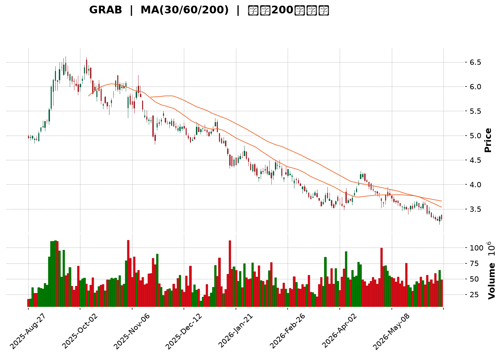
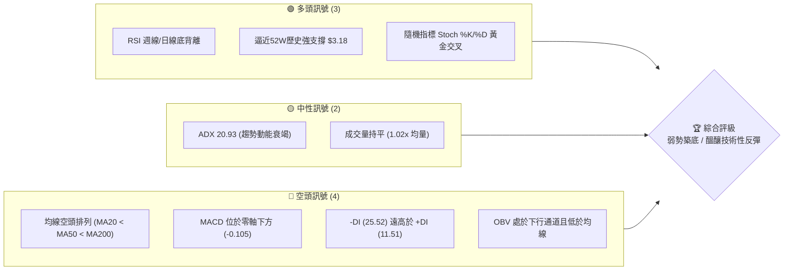
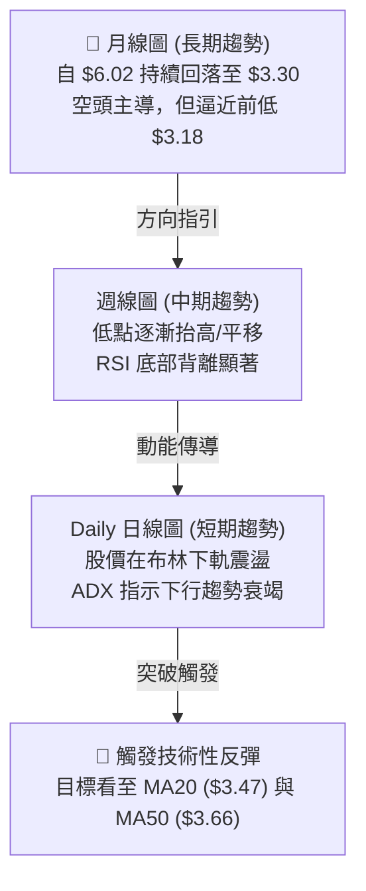
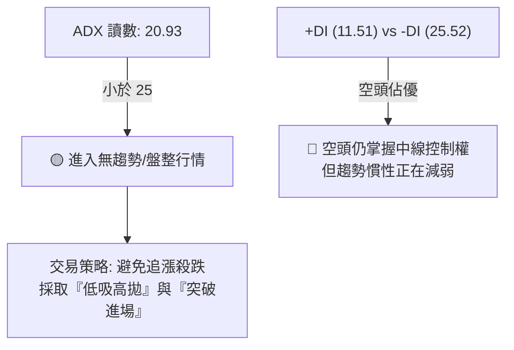
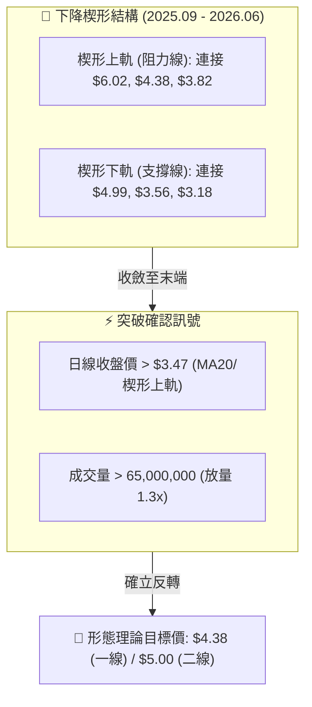

<details>
<summary>📊 靜態圖表 (點擊展開)</summary>

</details>

<html>
<head><meta charset="utf-8" /></head>
<body>
    <div style="height:500px; width:100%;">                        <script>window.PlotlyConfig = {MathJaxConfig: 'local'};</script>
        <script charset="utf-8" src="https://cdn.plot.ly/plotly-3.6.0.min.js" integrity="sha256-QaOVwtVY0T02VaHrr6pnoHLCwayMJp4O5n4YyaE3rJk=" crossorigin="anonymous"></script>                <div id="candlestick-chart" class="plotly-graph-div" style="height:100%; width:100%;"></div>            <script>                window.PLOTLYENV=window.PLOTLYENV || {};                                if (document.getElementById("candlestick-chart")) {                    Plotly.newPlot(                        "candlestick-chart",                        [{"close":{"dtype":"f8","bdata":"AAAAwMzME0AAAACgR+ETQAAAAIDC9RNAAAAA4FG4E0AAAACAFK4TQAAAAEAzMxRAAAAAANejFEAAAABgj8IUQAAAAMD1KBVAAAAAQDMzFUAAAABguB4WQAAAAAAAABhAAAAAIFyPGEAAAAAgrkcZQAAAAGBmZhhAAAAAYGZmGUAAAAAgXI8ZQAAAAMDMzBlAAAAAIK5HGUAAAACgR+EYQAAAAAAAABlAAAAA4KNwGEAAAADgo3AYQAAAAOB6FBhAAAAAoJmZF0AAAABAMzMYQAAAAADXoxhAAAAAIFyPGUAAAADgehQZQAAAAOCjcBlAAAAAgBSuGEAAAADgo3AXQAAAAOBRuBdAAAAAANejF0AAAACAFK4XQAAAAEAK1xZAAAAAIFyPFkAAAACAFK4WQAAAAGBmZhZAAAAAQOF6FkAAAACgR+EWQAAAAGBmZhdAAAAAQOF6GEAAAABgj8IXQAAAAEAzMxhAAAAAIIXrF0AAAACAPQoYQAAAACCuRxhAAAAAANcjF0AAAAAgXI8WQAAAAMAehRZAAAAAoHA9FkAAAACgmZkXQAAAAMAehRdAAAAAwPUoF0AAAADA9SgWQAAAAADXoxVAAAAAgOtRFUAAAAAgrkcVQAAAAKBwPRVAAAAAIIXrE0AAAACgmZkTQAAAAAAAABVAAAAAgML1FEAAAAAgrkcVQAAAAMDMzBVAAAAA4HoUFUAAAACAPQoVQAAAAOB6FBVAAAAAQDMzFUAAAABgj8IUQAAAAADXoxRAAAAAoJmZFEAAAADgUbgUQAAAAOBRuBRAAAAAoJmZFEAAAADgehQUQAAAAMDMzBNAAAAAQOF6E0AAAACAFK4TQAAAAOBRuBNAAAAA4FG4FEAAAACA61EUQAAAAMAehRRAAAAAoJmZFEAAAABgZmYUQAAAACCuRxRAAAAAgML1E0AAAACA61EUQAAAAAApXBRAAAAA4HoUFUAAAACA61EUQAAAAMAehRNAAAAAYGZmE0AAAAAgXI8TQAAAAMD1KBNAAAAAwB6FEkAAAAAgXI8RQAAAAMAehRFAAAAAgD0KEkAAAACgmZkRQAAAAEAzMxJAAAAAgOtREkAAAACgcD0SQAAAAGCPwhJAAAAAYLgeEkAAAACgR+ERQAAAAEAzMxFAAAAAANejEUAAAADgehQRQAAAAGCPwhBAAAAAoJmZEEAAAADgehQRQAAAAIA9ChFAAAAAoHA9EUAAAAAghesQQAAAAOB6FBFAAAAAwB6FEEAAAADgehQRQAAAAMDMzBFAAAAAoJmZEUAAAADAHoURQAAAAOBRuBBAAAAAoJmZEEAAAABACtcQQAAAAKBwPRFAAAAAoEfhEEAAAADgUbgQQAAAAIDrURBAAAAAYGZmEEAAAABguB4QQAAAAEAK1w9AAAAAgBSuD0AAAACAwvUOQAAAAGC4Hg9AAAAAAAAADkAAAACAFK4NQAAAAAAAAA5AAAAA4FG4DkAAAAAAAAAOQAAAAOCjcA1AAAAAQOF6DEAAAABguB4NQAAAAIDrUQ5AAAAAQArXDUAAAACAFK4NQAAAACBcjwxAAAAAoHA9DEAAAAAgrkcNQAAAAAApXA1AAAAAgML1DEAAAABA4XoMQAAAAIDrUQxAAAAAgD0KDUAAAADgo3ANQAAAAOCjcA1AAAAAQArXDUAAAAAgXI8OQAAAAAApXA9AAAAA4HoUEEAAAABACtcQQAAAAEAK1xBAAAAAgOtREEAAAACgcD0QQAAAAIAUrg9AAAAAQDMzD0AAAABguB4PQAAAAKBH4Q5AAAAAIFyPDkAAAAAgXI8OQAAAAAApXA1AAAAAgML1DEAAAADgo3ANQAAAAMD1KA5AAAAAgOtRDkAAAABgj8INQAAAAEAzMw1AAAAAYLgeDUAAAACAPQoNQAAAACBcjwxAAAAAYGZmDEAAAACA61EMQAAAAAAAAAxAAAAA4HoUDEAAAABA4XoMQAAAAOB6FAxAAAAA4FG4DEAAAABguB4NQAAAAIDrUQxAAAAAgOtRDEAAAACgR+EMQAAAAMDMzAxAAAAAIK5HC0AAAACAFK4LQAAAAOBRuApAAAAAANejCkAAAABgZmYKQAAAAMD1KApAAAAAwMzMCkAAAABgZmYKQA=="},"high":{"dtype":"f8","bdata":"AAAA4HoUFEAAAADgehQUQAAAAIA9ChRAAAAAQArXE0AAAACAwvUTQAAAAAApXBRAAAAA4FG4FEAAAADgUTgVQAAAAEAzMxVAAAAAAClcFUAAAAAgrkcWQAAAAGC4HhhAAAAAANejGEAAAACAFK4ZQAAAAMAehRhAAAAAAAAAGkAAAAAAAAAaQAAAAIDrURpAAAAAQOF6GkAAAADgUbgZQAAAAOB6FBlAAAAAoEfhGEAAAACAFK4YQAAAAKCZmRhAAAAAoEfhGEAAAAAgrkcYQAAAAKBH4RhAAAAAIK7HGUAAAABgZmYaQAAAAECJwRlAAAAAoJmZGUAAAAAgXI8YQAAAACCuRxhAAAAA4HoUGEAAAAAgXI8YQAAAAIDC9RdAAAAAQDOzFkAAAACAajwXQAAAAOBRuBZAAAAAQOF6FkAAAACAPQoXQAAAAMD1qBdAAAAAwB6FGEAAAACAwvUYQAAAAAApXBhAAAAAgOtRGEAAAACA61EYQAAAAIDCdRhAAAAAIK5HF0AAAADgo3AXQAAAAEAKVxdAAAAAwPUoF0AAAAAAAAAYQAAAAOCj8BhAAAAA4HoUGEAAAACgR+EWQAAAAGC4HhZAAAAA4HoUFkAAAACAwnUVQAAAAMAehRVAAAAAANejFUAAAACgcD0UQAAAAEDhehVAAAAAAClcFUAAAADgo3AVQAAAAAAAABZAAAAAQOF6FUAAAACgcD0VQAAAAEAzMxVAAAAAYGZmFUAAAABgZmYVQAAAACBcDxVAAAAAACncFEAAAACAwvUUQAAAAGCPwhRAAAAA4HoUFUAAAAAA16MUQAAAAEAzMxRAAAAAoEfhE0AAAACgR+ETQAAAAGC4HhRAAAAAYLgeFUAAAACAwvUUQAAAAKCZmRRAAAAAANejFEAAAAAghesUQAAAACBcjxRAAAAAAClcFEAAAADAHoUUQAAAAMDMzBRAAAAA4KNwFUAAAACA61EVQAAAAEAzMxRAAAAAoEfhE0AAAACgR+ETQAAAAKCZmRNAAAAAgD0KE0AAAADAHoUSQAAAAGBmZhJAAAAA4FE4EkAAAABAMzMSQAAAAGBmZhJAAAAAIFyPEkAAAACAFK4SQAAAAIAULhNAAAAA4FG4EkAAAADgUTgSQAAAAKBH4RFAAAAA4FG4EUAAAABgj8IRQAAAAEDhehFAAAAAANejEEAAAADAzEwRQAAAAAApXBFAAAAAYLieEUAAAAAgXI8RQAAAAIDC9RFAAAAA4FE4EUAAAABAMzMRQAAAAIA9ChJAAAAAQArXEUAAAADAHgUSQAAAAIA9ihFAAAAAoJmZEEAAAADAHoURQAAAACCuRxFAAAAAYLgeEUAAAACgR+EQQAAAAIA9ihBAAAAA4HqUEEAAAADAHoUQQAAAAMD1KBBAAAAAgBSuD0AAAAAAAAAQQAAAAMAehQ9AAAAAwMzMDkAAAABA4XoOQAAAAADXow5AAAAAgML1DkAAAABAMzMPQAAAAEAK1w1AAAAA4KNwDUAAAACAFK4NQAAAAADXow5AAAAAoJmZD0AAAADgUbgOQAAAAMAehQ1AAAAAgML1DEAAAADgo3ANQAAAAIDrUQ5AAAAAYI\u002fCDUAAAAAAAAAOQAAAAGCPwgxAAAAA4KNwD0AAAABACtcNQAAAAMDMzA1AAAAAoHA9DkAAAADgehQPQAAAAOBRuA9AAAAAAClcEEAAAABguB4RQAAAAAAAABFAAAAAgML1EEAAAADgo3AQQAAAAEAzMxBAAAAAwPUoEEAAAAAghesPQAAAAAAAAA9AAAAAIIXrDkAAAADgUbgOQAAAAKBH4Q1AAAAAQDMzDUAAAADgo3AOQAAAAKCZmQ9AAAAAQDMzD0AAAACgcD0OQAAAAOB6FA5AAAAA4KNwDUAAAADgo3ANQAAAAIDC9QxAAAAAIFyPDEAAAADAzMwMQAAAACBcjwxAAAAAgOkmDEAAAAAA16MMQAAAAIDC9QxAAAAAgOtRDUAAAAAAKVwNQAAAAIDC9QxAAAAAIFyPDEAAAAAgrkcNQAAAACCuRw1AAAAA4FG4DEAAAABgZmYMQAAAAMAehQtAAAAAQDMzC0AAAACAwvUKQAAAAMDMzApAAAAAgML1CkAAAABguB4LQA=="},"hovertemplate":"\u003cb\u003e%{x|%Y-%m-%d}\u003c\u002fb\u003e\u003cbr\u003e\u958b: $%{open:.2f}\u003cbr\u003e\u9ad8: $%{high:.2f}\u003cbr\u003e\u4f4e: $%{low:.2f}\u003cbr\u003e\u6536: $%{close:.2f}\u003cextra\u003e\u003c\u002fextra\u003e","low":{"dtype":"f8","bdata":"AAAAYI\u002fCE0AAAACgmZkTQAAAAADXoxNAAAAAAClcE0AAAAAgXI8TQAAAAMAehRNAAAAAoHA9FEAAAAAA16MUQAAAAAApXBRAAAAAgML1FEAAAACgR+EUQAAAAIA9ChZAAAAA4KNwFkAAAAAA16MXQAAAAMD1qBdAAAAAoHA9GEAAAAAgrkcZQAAAAKBH4RhAAAAAgD0KGUAAAAAA16MYQAAAAIDC9RdAAAAAwPUoGEAAAADgUbgXQAAAAIDC9RdAAAAAgOtRF0AAAACgmZkXQAAAAKBwPRhAAAAAIFyPGEAAAACAwvUYQAAAACCF6xhAAAAAIK5HGEAAAAAAKVwXQAAAACBcjxdAAAAAwMzMFkAAAACgmZkXQAAAACBcjxZAAAAAwPUoFkAAAACgmZkWQAAAAMD1KBZAAAAAgBSuFUAAAACA61EWQAAAAOB6FBdAAAAAANejF0AAAACgmZkXQAAAAGBmZhdAAAAAgBSuF0AAAADAzMwXQAAAAKCZmRdAAAAA4KNwFUAAAABA4XoWQAAAAIAULhZAAAAAwMzMFUAAAAAghesWQAAAAEAzMxdAAAAAYLgeF0AAAAAghesVQAAAAOCjcBVAAAAA4HoUFUAAAACgR+EUQAAAAAAAABVAAAAAQArXE0AAAAAgrkcTQAAAACCFaxRAAAAAYI\u002fCFEAAAABACtcUQAAAAOCjcBVAAAAAAAAAFUAAAACgR+EUQAAAAKCZmRRAAAAAIK7HFEAAAADgUbgUQAAAAOCjcBRAAAAAgOtRFEAAAABAMzMUQAAAAKBHYRRAAAAA4KNwFEAAAACAwvUTQAAAAIAUrhNAAAAAYGZmE0AAAAAgXI8TQAAAAADXoxNAAAAAgD0KFEAAAAAgrkcUQAAAAGC4HhRAAAAAwMxMFEAAAACgR2EUQAAAAAAAABRAAAAAIIXrE0AAAACAPQoUQAAAAIDrURRAAAAAYI\u002fCFEAAAABgj0IUQAAAAOCjcBNAAAAAgOtRE0AAAAAAKVwTQAAAAAAAABNAAAAAgOtREkAAAACA61ERQAAAAOCjcBFAAAAAYGZmEUAAAAAgXI8RQAAAAOBRuBFAAAAA4HoUEkAAAADA9SgSQAAAAAApXBJAAAAAgD0KEkAAAADAHoURQAAAAMD1KBFAAAAAAAAAEUAAAADgUbgQQAAAAKCZmRBAAAAAoHA9EEAAAACAwnUQQAAAAEAK1xBAAAAAIIXrEEAAAABgj8IQQAAAAMDMzBBAAAAAAAAAEEAAAABgZmYQQAAAAOB6FBFAAAAAYI9CEUAAAACA61ERQAAAAMAehRBAAAAAQDMzEEAAAADgp8YQQAAAACBcjxBAAAAA4FG4EEAAAACgcD0QQAAAAAApXA9AAAAAgD0KEEAAAAAAAAAQQAAAAGCPwg9AAAAAwB6FDkAAAADAzMwOQAAAAEDheg5AAAAAYI\u002fCDUAAAACgmZkNQAAAAGCPwg1AAAAAwPUoDkAAAABACtcNQAAAACCuRw1AAAAAYGZmDEAAAADgUbgMQAAAAIDC9QxAAAAAoJmZDUAAAACA61ENQAAAAKBwPQxAAAAA4HoUDEAAAABgZmYMQAAAAGC4Hg1AAAAAANejDEAAAABA4XoMQAAAAEAK1wtAAAAAwMzMDEAAAACAwvUMQAAAAEAzMw1AAAAAANejDEAAAABgZDsOQAAAAIAUrg5AAAAAQArXD0AAAADgo3AQQAAAAOCjcBBAAAAAQDMzEEAAAADA9SgQQAAAAEAzMw9AAAAAgD0KD0AAAACgR+EOQAAAAIDrUQ5AAAAA4HoUDkAAAAAghesNQAAAAMD1KAxAAAAAgOtRDEAAAADgUbgMQAAAACCF6w1AAAAA4HoUDkAAAAAgrkcNQAAAAIDC9QxAAAAAoEfhDEAAAABA4XoMQAAAAGBmZgxAAAAAgBSuC0AAAABACtcLQAAAACCF6wtAAAAAYLgeC0AAAACgmZkLQAAAACCF6wtAAAAA4HoUDEAAAADgo3AMQAAAAEAK1wtAAAAAQArXC0AAAAAAAAAMQAAAACBcjwxAAAAAgD0KC0AAAACAPQoLQAAAAKCZmQpAAAAAYGZmCkAAAADgehQKQAAAAMD1KApAAAAA4KNwCUAAAADgehQKQA=="},"name":"\u50f9\u683c","open":{"dtype":"f8","bdata":"AAAAgML1E0AAAABACtcTQAAAAMDMzBNAAAAAwPWoE0AAAADgUbgTQAAAACBcjxNAAAAAAClcFEAAAACAFK4UQAAAAADXoxRAAAAAQDMzFUAAAADA9SgVQAAAAEAzMxZAAAAAoJmZF0AAAABA4XoYQAAAAMAehRhAAAAAgD2KGEAAAAAgXI8ZQAAAAEDh+hhAAAAAIIXrGUAAAABAMzMZQAAAAMAehRhAAAAAQArXGEAAAACAwnUYQAAAAKBwPRhAAAAAwPUoGEAAAACAwvUXQAAAAEDhehhAAAAAoJkZGUAAAABAMzMaQAAAAIDrURlAAAAAgD2KGUAAAABA4XoYQAAAAIDC9RdAAAAAwPUoF0AAAACgcD0YQAAAAMDMzBdAAAAAQOF6FkAAAADA9SgXQAAAAOBRuBZAAAAAQOF6FkAAAACAFK4WQAAAAKBHYRdAAAAAAAAAGEAAAAAghesYQAAAAGCPwhdAAAAAAAAAGEAAAACgR+EXQAAAAIA9ChhAAAAAYI9CFkAAAABgj0IXQAAAAMDMzBZAAAAAwMzMFkAAAACgmRkXQAAAACBcDxhAAAAAYGZmF0AAAABACtcWQAAAAMAehRVAAAAAgD2KFUAAAADgUTgVQAAAAEAzMxVAAAAAANejFUAAAACAPQoUQAAAAIAUrhRAAAAA4HoUFUAAAADA9SgVQAAAAADXoxVAAAAAIIVrFUAAAADAHgUVQAAAAIDC9RRAAAAAQArXFEAAAADA9SgVQAAAAGCPwhRAAAAAIIVrFEAAAABgZmYUQAAAAOB6lBRAAAAAYI\u002fCFEAAAACgmZkUQAAAAEDh+hNAAAAAoEfhE0AAAACgmZkTQAAAAKBH4RNAAAAA4HoUFEAAAACAFK4UQAAAAIDrURRAAAAAIFyPFEAAAABA4XoUQAAAAIDCdRRAAAAAIK5HFEAAAACAFC4UQAAAAMAehRRAAAAAYI\u002fCFEAAAABguB4VQAAAAEAzMxRAAAAAYI\u002fCE0AAAABgZmYTQAAAAKCZmRNAAAAAIIXrEkAAAADgo3ASQAAAAIDrURJAAAAAgD2KEUAAAABAMzMSQAAAAMDMzBFAAAAA4HoUEkAAAACgcD0SQAAAAAApXBJAAAAAgBSuEkAAAADA9SgSQAAAAIAUrhFAAAAAYLgeEUAAAADA9agRQAAAAIDrURFAAAAAwB6FEEAAAACgR+EQQAAAAGC4HhFAAAAAwPUoEUAAAADgo3ARQAAAAMDMzBBAAAAAgML1EEAAAABgj8IQQAAAAKBwPRFAAAAA4HqUEUAAAADgo3ARQAAAAMDMTBFAAAAA4KNwEEAAAAAAAAARQAAAAOBRuBBAAAAAwMzMEEAAAAAA16MQQAAAAGC4HhBAAAAA4KNwEEAAAAAAKVwQQAAAACBcDxBAAAAAIK5HD0AAAACAFK4PQAAAAMDMzA5AAAAAANejDkAAAABguB4OQAAAACCF6w1AAAAAoHA9DkAAAACgmZkOQAAAAGCPwg1AAAAAQDMzDUAAAADAzMwMQAAAAEAzMw1AAAAAANejDkAAAABgZmYNQAAAAOCjcA1AAAAA4FG4DEAAAADAzMwMQAAAAAAAAA5AAAAAgML1DEAAAACgR+EMQAAAAMAehQxAAAAAQArXDkAAAACAPQoNQAAAAKCZmQ1AAAAAQDMzDUAAAACgcD0OQAAAAMDMzA5AAAAAAAAAEEAAAABA4XoQQAAAAGC4nhBAAAAAoEfhEEAAAAAAKVwQQAAAAEAzMxBAAAAA4HoUEEAAAABAMzMPQAAAAMDMzA5AAAAAoEfhDkAAAAAgXI8OQAAAAOBRuA1AAAAA4HoUDUAAAAAAKVwOQAAAAMDMzA5AAAAAIFyPDkAAAADA9SgOQAAAAIAUrg1AAAAAAClcDUAAAAAAKVwNQAAAAIDC9QxAAAAAgOtRDEAAAABguB4MQAAAAIDrUQxAAAAA4HoUDEAAAAAAAAAMQAAAAEDhegxAAAAAIK5HDEAAAABA4XoMQAAAAIDC9QxAAAAAoHA9DEAAAADA9SgMQAAAAKBH4QxAAAAAANejDEAAAAAgrkcLQAAAAOCjcAtAAAAAYI\u002fCCkAAAAAA16MKQAAAAGBmZgpAAAAAAAAACkAAAACAPQoLQA=="},"x":["2025-08-27T00:00:00-04:00","2025-08-28T00:00:00-04:00","2025-08-29T00:00:00-04:00","2025-09-02T00:00:00-04:00","2025-09-03T00:00:00-04:00","2025-09-04T00:00:00-04:00","2025-09-05T00:00:00-04:00","2025-09-08T00:00:00-04:00","2025-09-09T00:00:00-04:00","2025-09-10T00:00:00-04:00","2025-09-11T00:00:00-04:00","2025-09-12T00:00:00-04:00","2025-09-15T00:00:00-04:00","2025-09-16T00:00:00-04:00","2025-09-17T00:00:00-04:00","2025-09-18T00:00:00-04:00","2025-09-19T00:00:00-04:00","2025-09-22T00:00:00-04:00","2025-09-23T00:00:00-04:00","2025-09-24T00:00:00-04:00","2025-09-25T00:00:00-04:00","2025-09-26T00:00:00-04:00","2025-09-29T00:00:00-04:00","2025-09-30T00:00:00-04:00","2025-10-01T00:00:00-04:00","2025-10-02T00:00:00-04:00","2025-10-03T00:00:00-04:00","2025-10-06T00:00:00-04:00","2025-10-07T00:00:00-04:00","2025-10-08T00:00:00-04:00","2025-10-09T00:00:00-04:00","2025-10-10T00:00:00-04:00","2025-10-13T00:00:00-04:00","2025-10-14T00:00:00-04:00","2025-10-15T00:00:00-04:00","2025-10-16T00:00:00-04:00","2025-10-17T00:00:00-04:00","2025-10-20T00:00:00-04:00","2025-10-21T00:00:00-04:00","2025-10-22T00:00:00-04:00","2025-10-23T00:00:00-04:00","2025-10-24T00:00:00-04:00","2025-10-27T00:00:00-04:00","2025-10-28T00:00:00-04:00","2025-10-29T00:00:00-04:00","2025-10-30T00:00:00-04:00","2025-10-31T00:00:00-04:00","2025-11-03T00:00:00-05:00","2025-11-04T00:00:00-05:00","2025-11-05T00:00:00-05:00","2025-11-06T00:00:00-05:00","2025-11-07T00:00:00-05:00","2025-11-10T00:00:00-05:00","2025-11-11T00:00:00-05:00","2025-11-12T00:00:00-05:00","2025-11-13T00:00:00-05:00","2025-11-14T00:00:00-05:00","2025-11-17T00:00:00-05:00","2025-11-18T00:00:00-05:00","2025-11-19T00:00:00-05:00","2025-11-20T00:00:00-05:00","2025-11-21T00:00:00-05:00","2025-11-24T00:00:00-05:00","2025-11-25T00:00:00-05:00","2025-11-26T00:00:00-05:00","2025-11-28T00:00:00-05:00","2025-12-01T00:00:00-05:00","2025-12-02T00:00:00-05:00","2025-12-03T00:00:00-05:00","2025-12-04T00:00:00-05:00","2025-12-05T00:00:00-05:00","2025-12-08T00:00:00-05:00","2025-12-09T00:00:00-05:00","2025-12-10T00:00:00-05:00","2025-12-11T00:00:00-05:00","2025-12-12T00:00:00-05:00","2025-12-15T00:00:00-05:00","2025-12-16T00:00:00-05:00","2025-12-17T00:00:00-05:00","2025-12-18T00:00:00-05:00","2025-12-19T00:00:00-05:00","2025-12-22T00:00:00-05:00","2025-12-23T00:00:00-05:00","2025-12-24T00:00:00-05:00","2025-12-26T00:00:00-05:00","2025-12-29T00:00:00-05:00","2025-12-30T00:00:00-05:00","2025-12-31T00:00:00-05:00","2026-01-02T00:00:00-05:00","2026-01-05T00:00:00-05:00","2026-01-06T00:00:00-05:00","2026-01-07T00:00:00-05:00","2026-01-08T00:00:00-05:00","2026-01-09T00:00:00-05:00","2026-01-12T00:00:00-05:00","2026-01-13T00:00:00-05:00","2026-01-14T00:00:00-05:00","2026-01-15T00:00:00-05:00","2026-01-16T00:00:00-05:00","2026-01-20T00:00:00-05:00","2026-01-21T00:00:00-05:00","2026-01-22T00:00:00-05:00","2026-01-23T00:00:00-05:00","2026-01-26T00:00:00-05:00","2026-01-27T00:00:00-05:00","2026-01-28T00:00:00-05:00","2026-01-29T00:00:00-05:00","2026-01-30T00:00:00-05:00","2026-02-02T00:00:00-05:00","2026-02-03T00:00:00-05:00","2026-02-04T00:00:00-05:00","2026-02-05T00:00:00-05:00","2026-02-06T00:00:00-05:00","2026-02-09T00:00:00-05:00","2026-02-10T00:00:00-05:00","2026-02-11T00:00:00-05:00","2026-02-12T00:00:00-05:00","2026-02-13T00:00:00-05:00","2026-02-17T00:00:00-05:00","2026-02-18T00:00:00-05:00","2026-02-19T00:00:00-05:00","2026-02-20T00:00:00-05:00","2026-02-23T00:00:00-05:00","2026-02-24T00:00:00-05:00","2026-02-25T00:00:00-05:00","2026-02-26T00:00:00-05:00","2026-02-27T00:00:00-05:00","2026-03-02T00:00:00-05:00","2026-03-03T00:00:00-05:00","2026-03-04T00:00:00-05:00","2026-03-05T00:00:00-05:00","2026-03-06T00:00:00-05:00","2026-03-09T00:00:00-04:00","2026-03-10T00:00:00-04:00","2026-03-11T00:00:00-04:00","2026-03-12T00:00:00-04:00","2026-03-13T00:00:00-04:00","2026-03-16T00:00:00-04:00","2026-03-17T00:00:00-04:00","2026-03-18T00:00:00-04:00","2026-03-19T00:00:00-04:00","2026-03-20T00:00:00-04:00","2026-03-23T00:00:00-04:00","2026-03-24T00:00:00-04:00","2026-03-25T00:00:00-04:00","2026-03-26T00:00:00-04:00","2026-03-27T00:00:00-04:00","2026-03-30T00:00:00-04:00","2026-03-31T00:00:00-04:00","2026-04-01T00:00:00-04:00","2026-04-02T00:00:00-04:00","2026-04-06T00:00:00-04:00","2026-04-07T00:00:00-04:00","2026-04-08T00:00:00-04:00","2026-04-09T00:00:00-04:00","2026-04-10T00:00:00-04:00","2026-04-13T00:00:00-04:00","2026-04-14T00:00:00-04:00","2026-04-15T00:00:00-04:00","2026-04-16T00:00:00-04:00","2026-04-17T00:00:00-04:00","2026-04-20T00:00:00-04:00","2026-04-21T00:00:00-04:00","2026-04-22T00:00:00-04:00","2026-04-23T00:00:00-04:00","2026-04-24T00:00:00-04:00","2026-04-27T00:00:00-04:00","2026-04-28T00:00:00-04:00","2026-04-29T00:00:00-04:00","2026-04-30T00:00:00-04:00","2026-05-01T00:00:00-04:00","2026-05-04T00:00:00-04:00","2026-05-05T00:00:00-04:00","2026-05-06T00:00:00-04:00","2026-05-07T00:00:00-04:00","2026-05-08T00:00:00-04:00","2026-05-11T00:00:00-04:00","2026-05-12T00:00:00-04:00","2026-05-13T00:00:00-04:00","2026-05-14T00:00:00-04:00","2026-05-15T00:00:00-04:00","2026-05-18T00:00:00-04:00","2026-05-19T00:00:00-04:00","2026-05-20T00:00:00-04:00","2026-05-21T00:00:00-04:00","2026-05-22T00:00:00-04:00","2026-05-26T00:00:00-04:00","2026-05-27T00:00:00-04:00","2026-05-28T00:00:00-04:00","2026-05-29T00:00:00-04:00","2026-06-01T00:00:00-04:00","2026-06-02T00:00:00-04:00","2026-06-03T00:00:00-04:00","2026-06-04T00:00:00-04:00","2026-06-05T00:00:00-04:00","2026-06-08T00:00:00-04:00","2026-06-09T00:00:00-04:00","2026-06-10T00:00:00-04:00","2026-06-11T00:00:00-04:00","2026-06-12T00:00:00-04:00"],"type":"candlestick"},{"hovertemplate":"MA30: $%{y:.2f}\u003cextra\u003e\u003c\u002fextra\u003e","line":{"color":"#2196F3","dash":"dash","width":2},"mode":"lines","name":"MA30","x":["2025-08-27T00:00:00-04:00","2025-08-28T00:00:00-04:00","2025-08-29T00:00:00-04:00","2025-09-02T00:00:00-04:00","2025-09-03T00:00:00-04:00","2025-09-04T00:00:00-04:00","2025-09-05T00:00:00-04:00","2025-09-08T00:00:00-04:00","2025-09-09T00:00:00-04:00","2025-09-10T00:00:00-04:00","2025-09-11T00:00:00-04:00","2025-09-12T00:00:00-04:00","2025-09-15T00:00:00-04:00","2025-09-16T00:00:00-04:00","2025-09-17T00:00:00-04:00","2025-09-18T00:00:00-04:00","2025-09-19T00:00:00-04:00","2025-09-22T00:00:00-04:00","2025-09-23T00:00:00-04:00","2025-09-24T00:00:00-04:00","2025-09-25T00:00:00-04:00","2025-09-26T00:00:00-04:00","2025-09-29T00:00:00-04:00","2025-09-30T00:00:00-04:00","2025-10-01T00:00:00-04:00","2025-10-02T00:00:00-04:00","2025-10-03T00:00:00-04:00","2025-10-06T00:00:00-04:00","2025-10-07T00:00:00-04:00","2025-10-08T00:00:00-04:00","2025-10-09T00:00:00-04:00","2025-10-10T00:00:00-04:00","2025-10-13T00:00:00-04:00","2025-10-14T00:00:00-04:00","2025-10-15T00:00:00-04:00","2025-10-16T00:00:00-04:00","2025-10-17T00:00:00-04:00","2025-10-20T00:00:00-04:00","2025-10-21T00:00:00-04:00","2025-10-22T00:00:00-04:00","2025-10-23T00:00:00-04:00","2025-10-24T00:00:00-04:00","2025-10-27T00:00:00-04:00","2025-10-28T00:00:00-04:00","2025-10-29T00:00:00-04:00","2025-10-30T00:00:00-04:00","2025-10-31T00:00:00-04:00","2025-11-03T00:00:00-05:00","2025-11-04T00:00:00-05:00","2025-11-05T00:00:00-05:00","2025-11-06T00:00:00-05:00","2025-11-07T00:00:00-05:00","2025-11-10T00:00:00-05:00","2025-11-11T00:00:00-05:00","2025-11-12T00:00:00-05:00","2025-11-13T00:00:00-05:00","2025-11-14T00:00:00-05:00","2025-11-17T00:00:00-05:00","2025-11-18T00:00:00-05:00","2025-11-19T00:00:00-05:00","2025-11-20T00:00:00-05:00","2025-11-21T00:00:00-05:00","2025-11-24T00:00:00-05:00","2025-11-25T00:00:00-05:00","2025-11-26T00:00:00-05:00","2025-11-28T00:00:00-05:00","2025-12-01T00:00:00-05:00","2025-12-02T00:00:00-05:00","2025-12-03T00:00:00-05:00","2025-12-04T00:00:00-05:00","2025-12-05T00:00:00-05:00","2025-12-08T00:00:00-05:00","2025-12-09T00:00:00-05:00","2025-12-10T00:00:00-05:00","2025-12-11T00:00:00-05:00","2025-12-12T00:00:00-05:00","2025-12-15T00:00:00-05:00","2025-12-16T00:00:00-05:00","2025-12-17T00:00:00-05:00","2025-12-18T00:00:00-05:00","2025-12-19T00:00:00-05:00","2025-12-22T00:00:00-05:00","2025-12-23T00:00:00-05:00","2025-12-24T00:00:00-05:00","2025-12-26T00:00:00-05:00","2025-12-29T00:00:00-05:00","2025-12-30T00:00:00-05:00","2025-12-31T00:00:00-05:00","2026-01-02T00:00:00-05:00","2026-01-05T00:00:00-05:00","2026-01-06T00:00:00-05:00","2026-01-07T00:00:00-05:00","2026-01-08T00:00:00-05:00","2026-01-09T00:00:00-05:00","2026-01-12T00:00:00-05:00","2026-01-13T00:00:00-05:00","2026-01-14T00:00:00-05:00","2026-01-15T00:00:00-05:00","2026-01-16T00:00:00-05:00","2026-01-20T00:00:00-05:00","2026-01-21T00:00:00-05:00","2026-01-22T00:00:00-05:00","2026-01-23T00:00:00-05:00","2026-01-26T00:00:00-05:00","2026-01-27T00:00:00-05:00","2026-01-28T00:00:00-05:00","2026-01-29T00:00:00-05:00","2026-01-30T00:00:00-05:00","2026-02-02T00:00:00-05:00","2026-02-03T00:00:00-05:00","2026-02-04T00:00:00-05:00","2026-02-05T00:00:00-05:00","2026-02-06T00:00:00-05:00","2026-02-09T00:00:00-05:00","2026-02-10T00:00:00-05:00","2026-02-11T00:00:00-05:00","2026-02-12T00:00:00-05:00","2026-02-13T00:00:00-05:00","2026-02-17T00:00:00-05:00","2026-02-18T00:00:00-05:00","2026-02-19T00:00:00-05:00","2026-02-20T00:00:00-05:00","2026-02-23T00:00:00-05:00","2026-02-24T00:00:00-05:00","2026-02-25T00:00:00-05:00","2026-02-26T00:00:00-05:00","2026-02-27T00:00:00-05:00","2026-03-02T00:00:00-05:00","2026-03-03T00:00:00-05:00","2026-03-04T00:00:00-05:00","2026-03-05T00:00:00-05:00","2026-03-06T00:00:00-05:00","2026-03-09T00:00:00-04:00","2026-03-10T00:00:00-04:00","2026-03-11T00:00:00-04:00","2026-03-12T00:00:00-04:00","2026-03-13T00:00:00-04:00","2026-03-16T00:00:00-04:00","2026-03-17T00:00:00-04:00","2026-03-18T00:00:00-04:00","2026-03-19T00:00:00-04:00","2026-03-20T00:00:00-04:00","2026-03-23T00:00:00-04:00","2026-03-24T00:00:00-04:00","2026-03-25T00:00:00-04:00","2026-03-26T00:00:00-04:00","2026-03-27T00:00:00-04:00","2026-03-30T00:00:00-04:00","2026-03-31T00:00:00-04:00","2026-04-01T00:00:00-04:00","2026-04-02T00:00:00-04:00","2026-04-06T00:00:00-04:00","2026-04-07T00:00:00-04:00","2026-04-08T00:00:00-04:00","2026-04-09T00:00:00-04:00","2026-04-10T00:00:00-04:00","2026-04-13T00:00:00-04:00","2026-04-14T00:00:00-04:00","2026-04-15T00:00:00-04:00","2026-04-16T00:00:00-04:00","2026-04-17T00:00:00-04:00","2026-04-20T00:00:00-04:00","2026-04-21T00:00:00-04:00","2026-04-22T00:00:00-04:00","2026-04-23T00:00:00-04:00","2026-04-24T00:00:00-04:00","2026-04-27T00:00:00-04:00","2026-04-28T00:00:00-04:00","2026-04-29T00:00:00-04:00","2026-04-30T00:00:00-04:00","2026-05-01T00:00:00-04:00","2026-05-04T00:00:00-04:00","2026-05-05T00:00:00-04:00","2026-05-06T00:00:00-04:00","2026-05-07T00:00:00-04:00","2026-05-08T00:00:00-04:00","2026-05-11T00:00:00-04:00","2026-05-12T00:00:00-04:00","2026-05-13T00:00:00-04:00","2026-05-14T00:00:00-04:00","2026-05-15T00:00:00-04:00","2026-05-18T00:00:00-04:00","2026-05-19T00:00:00-04:00","2026-05-20T00:00:00-04:00","2026-05-21T00:00:00-04:00","2026-05-22T00:00:00-04:00","2026-05-26T00:00:00-04:00","2026-05-27T00:00:00-04:00","2026-05-28T00:00:00-04:00","2026-05-29T00:00:00-04:00","2026-06-01T00:00:00-04:00","2026-06-02T00:00:00-04:00","2026-06-03T00:00:00-04:00","2026-06-04T00:00:00-04:00","2026-06-05T00:00:00-04:00","2026-06-08T00:00:00-04:00","2026-06-09T00:00:00-04:00","2026-06-10T00:00:00-04:00","2026-06-11T00:00:00-04:00","2026-06-12T00:00:00-04:00"],"y":{"dtype":"f8","bdata":"AAAAAAAA+H8AAAAAAAD4fwAAAAAAAPh\u002fAAAAAAAA+H8AAAAAAAD4fwAAAAAAAPh\u002fAAAAAAAA+H8AAAAAAAD4fwAAAAAAAPh\u002fAAAAAAAA+H8AAAAAAAD4fwAAAAAAAPh\u002fAAAAAAAA+H8AAAAAAAD4fwAAAAAAAPh\u002fAAAAAAAA+H8AAAAAAAD4fwAAAAAAAPh\u002fAAAAAAAA+H8AAAAAAAD4fwAAAAAAAPh\u002fAAAAAAAA+H8AAAAAAAD4fwAAAAAAAPh\u002fAAAAAAAA+H8AAAAAAAD4fwAAAAAAAPh\u002fAAAAAAAA+H8AAAAAAAD4fxEREXGvORdAd3d391NjF0CJiIjotIEXQBEREcHKoRdAAAAAID7DF0AiIiJCYOUXQM3MzGzn+xdAq6qqukkMGECJiIgIrBwYQKuqqtpAJxhA3t3dDS0yGEC8u7tLqTgYQDMzM5OKMxhAAAAA0NsyGEAiIiJS4yUYQKuqqmouJBhA7+7uTo0XGEAiIiLSlAoYQFVVVVWc\u002fRdA3t3dbVnrF0AAAABQjdcXQLy7u6tjwhdAIiIisp2vF0AAAACwcqgXQJqZmVmroxdAd3d3J+qfF0BERES0gY4XQKuqqhrodBdA7+7urrlQF0BVVVV1TDAXQKuqqmp1DBdAmpmZCdfjFkDe3d1tEsMWQAAAAIDcqxZAMzMz8\u002f2UFkAiIiISg4AWQHd3dyejdxZAvLu7CwJrFkCamZlpA10WQERERNS\u002fURZAERERodNGFkC8u7trvDQWQLy7uxsvHRZA7+7uHhP8FUAzMzMjIuIVQFVVVfVvxBVA7+7uThuoFUDe3d2NUIYVQHd3d9cVYBVAMzMzc9pAFUDv7u7+RigVQM3MzExiEBVA7+7uzmkDFUCamZmJbOcUQAAAAPDSzRRAiYiIiPq3FEARERHB9agUQKuqqspanRRAMzMz07+RFEC8u7urjokUQImIiEgMghRAd3d3V\u002fKLFEBEREQ0F5IUQImIiBh2hRRAmpmZOSZ4FEAzMzPTeGkUQImIiKjxUhRAERERQRk9FEAzMzMTZx8UQDMzMyMGARRAMzMzAw\u002fmE0AzMzPjF8sTQBEREaFFthNARERE5NCiE0AAAABAp40TQBEREZHtfBNAzczM7MNnE0AzMzPz\u002fVQTQKuqqirOPhNAAAAAoBovE0BmZmbW6hgTQO\u002fu7p6o\u002fxJAiYiIWIDcEkBVVVV12sASQImIiEgooxJAAAAAQHyGEkAzMzMTymgSQBEREZF7TRJAZmZmxiAwEkAzMzPjehQSQKuqqnqi\u002fhFA3t3dTfDgEUDNzMycC8kRQKuqquomsRFAmpmZOUKZEUC8u7tLDIIRQN7d3f2pcRFAq6qqWqtjEUCJiIhYgFwRQHd3d+dCUhFAREREREREEUCJiIgoozcRQLy7u2suJBFAd3d3xwQPEUB3d3d3d\u002fcQQN7d3fUo3BBA7+7uNonBEEBEREQ8mKcQQKuqqkLSlBBAZmZmhl2BEEAiIiKynW8QQHd3dz81XhBAd3d3vxFKEECamZm5kDQQQM3MzMyFJBBA7+7urrkQEEBVVVW18\u002f0PQCIiIlIqzg9A7+7ujjSlD0CamZkJkHsPQN7d3Y1QRg9AAAAAEBERD0BVVVWFFtkOQGZmZrZlrQ5A3t3dDeaJDkAiIiKit2UOQGZmZpa1Og5AiYiIOEIZDkBERETErgAOQBEREZHC9Q1Ad3d3d0zwDUARERExlvwNQLy7u7tJDA5AIiIi4noUDkAAAABgcyEOQGZmZrY6Jg5Ad3d3J3gwDkAiIiLiwTwOQFVVVUVERA5A7+7uvuZCDkBVVVUVrkcOQCIiIlL\u002fRg5AVVVV5RdLDkAiIiLy0k0OQLy7u2t1TA5A7+7u\u002fo1QDkAiIiLCPFEOQM3MzNyyVg5AERERQTVeDkB3d3f3KFwOQGZmZlZVVQ5AAAAAAI5QDkCamZl5ME8OQM3MzGx1TA5AVVVVRUREDkDe3d0dEzwOQGZmZiZ4MA5AiYiIeOkmDkDv7u6+nxoOQDMzM8OuAA5Ad3d3J+rfDUBERERk9LYNQN7d3d1PjQ1AVVVVxZJfDUAzMzMDnTYNQJqZmblJDA1AAAAAQGDlDEAAAABAGb0MQBEREUHSlAxAiYiIaLx0DEAAAADAPFEMQA=="},"type":"scatter"},{"hovertemplate":"MA60: $%{y:.2f}\u003cextra\u003e\u003c\u002fextra\u003e","line":{"color":"#9C27B0","dash":"dash","width":2},"mode":"lines","name":"MA60","x":["2025-08-27T00:00:00-04:00","2025-08-28T00:00:00-04:00","2025-08-29T00:00:00-04:00","2025-09-02T00:00:00-04:00","2025-09-03T00:00:00-04:00","2025-09-04T00:00:00-04:00","2025-09-05T00:00:00-04:00","2025-09-08T00:00:00-04:00","2025-09-09T00:00:00-04:00","2025-09-10T00:00:00-04:00","2025-09-11T00:00:00-04:00","2025-09-12T00:00:00-04:00","2025-09-15T00:00:00-04:00","2025-09-16T00:00:00-04:00","2025-09-17T00:00:00-04:00","2025-09-18T00:00:00-04:00","2025-09-19T00:00:00-04:00","2025-09-22T00:00:00-04:00","2025-09-23T00:00:00-04:00","2025-09-24T00:00:00-04:00","2025-09-25T00:00:00-04:00","2025-09-26T00:00:00-04:00","2025-09-29T00:00:00-04:00","2025-09-30T00:00:00-04:00","2025-10-01T00:00:00-04:00","2025-10-02T00:00:00-04:00","2025-10-03T00:00:00-04:00","2025-10-06T00:00:00-04:00","2025-10-07T00:00:00-04:00","2025-10-08T00:00:00-04:00","2025-10-09T00:00:00-04:00","2025-10-10T00:00:00-04:00","2025-10-13T00:00:00-04:00","2025-10-14T00:00:00-04:00","2025-10-15T00:00:00-04:00","2025-10-16T00:00:00-04:00","2025-10-17T00:00:00-04:00","2025-10-20T00:00:00-04:00","2025-10-21T00:00:00-04:00","2025-10-22T00:00:00-04:00","2025-10-23T00:00:00-04:00","2025-10-24T00:00:00-04:00","2025-10-27T00:00:00-04:00","2025-10-28T00:00:00-04:00","2025-10-29T00:00:00-04:00","2025-10-30T00:00:00-04:00","2025-10-31T00:00:00-04:00","2025-11-03T00:00:00-05:00","2025-11-04T00:00:00-05:00","2025-11-05T00:00:00-05:00","2025-11-06T00:00:00-05:00","2025-11-07T00:00:00-05:00","2025-11-10T00:00:00-05:00","2025-11-11T00:00:00-05:00","2025-11-12T00:00:00-05:00","2025-11-13T00:00:00-05:00","2025-11-14T00:00:00-05:00","2025-11-17T00:00:00-05:00","2025-11-18T00:00:00-05:00","2025-11-19T00:00:00-05:00","2025-11-20T00:00:00-05:00","2025-11-21T00:00:00-05:00","2025-11-24T00:00:00-05:00","2025-11-25T00:00:00-05:00","2025-11-26T00:00:00-05:00","2025-11-28T00:00:00-05:00","2025-12-01T00:00:00-05:00","2025-12-02T00:00:00-05:00","2025-12-03T00:00:00-05:00","2025-12-04T00:00:00-05:00","2025-12-05T00:00:00-05:00","2025-12-08T00:00:00-05:00","2025-12-09T00:00:00-05:00","2025-12-10T00:00:00-05:00","2025-12-11T00:00:00-05:00","2025-12-12T00:00:00-05:00","2025-12-15T00:00:00-05:00","2025-12-16T00:00:00-05:00","2025-12-17T00:00:00-05:00","2025-12-18T00:00:00-05:00","2025-12-19T00:00:00-05:00","2025-12-22T00:00:00-05:00","2025-12-23T00:00:00-05:00","2025-12-24T00:00:00-05:00","2025-12-26T00:00:00-05:00","2025-12-29T00:00:00-05:00","2025-12-30T00:00:00-05:00","2025-12-31T00:00:00-05:00","2026-01-02T00:00:00-05:00","2026-01-05T00:00:00-05:00","2026-01-06T00:00:00-05:00","2026-01-07T00:00:00-05:00","2026-01-08T00:00:00-05:00","2026-01-09T00:00:00-05:00","2026-01-12T00:00:00-05:00","2026-01-13T00:00:00-05:00","2026-01-14T00:00:00-05:00","2026-01-15T00:00:00-05:00","2026-01-16T00:00:00-05:00","2026-01-20T00:00:00-05:00","2026-01-21T00:00:00-05:00","2026-01-22T00:00:00-05:00","2026-01-23T00:00:00-05:00","2026-01-26T00:00:00-05:00","2026-01-27T00:00:00-05:00","2026-01-28T00:00:00-05:00","2026-01-29T00:00:00-05:00","2026-01-30T00:00:00-05:00","2026-02-02T00:00:00-05:00","2026-02-03T00:00:00-05:00","2026-02-04T00:00:00-05:00","2026-02-05T00:00:00-05:00","2026-02-06T00:00:00-05:00","2026-02-09T00:00:00-05:00","2026-02-10T00:00:00-05:00","2026-02-11T00:00:00-05:00","2026-02-12T00:00:00-05:00","2026-02-13T00:00:00-05:00","2026-02-17T00:00:00-05:00","2026-02-18T00:00:00-05:00","2026-02-19T00:00:00-05:00","2026-02-20T00:00:00-05:00","2026-02-23T00:00:00-05:00","2026-02-24T00:00:00-05:00","2026-02-25T00:00:00-05:00","2026-02-26T00:00:00-05:00","2026-02-27T00:00:00-05:00","2026-03-02T00:00:00-05:00","2026-03-03T00:00:00-05:00","2026-03-04T00:00:00-05:00","2026-03-05T00:00:00-05:00","2026-03-06T00:00:00-05:00","2026-03-09T00:00:00-04:00","2026-03-10T00:00:00-04:00","2026-03-11T00:00:00-04:00","2026-03-12T00:00:00-04:00","2026-03-13T00:00:00-04:00","2026-03-16T00:00:00-04:00","2026-03-17T00:00:00-04:00","2026-03-18T00:00:00-04:00","2026-03-19T00:00:00-04:00","2026-03-20T00:00:00-04:00","2026-03-23T00:00:00-04:00","2026-03-24T00:00:00-04:00","2026-03-25T00:00:00-04:00","2026-03-26T00:00:00-04:00","2026-03-27T00:00:00-04:00","2026-03-30T00:00:00-04:00","2026-03-31T00:00:00-04:00","2026-04-01T00:00:00-04:00","2026-04-02T00:00:00-04:00","2026-04-06T00:00:00-04:00","2026-04-07T00:00:00-04:00","2026-04-08T00:00:00-04:00","2026-04-09T00:00:00-04:00","2026-04-10T00:00:00-04:00","2026-04-13T00:00:00-04:00","2026-04-14T00:00:00-04:00","2026-04-15T00:00:00-04:00","2026-04-16T00:00:00-04:00","2026-04-17T00:00:00-04:00","2026-04-20T00:00:00-04:00","2026-04-21T00:00:00-04:00","2026-04-22T00:00:00-04:00","2026-04-23T00:00:00-04:00","2026-04-24T00:00:00-04:00","2026-04-27T00:00:00-04:00","2026-04-28T00:00:00-04:00","2026-04-29T00:00:00-04:00","2026-04-30T00:00:00-04:00","2026-05-01T00:00:00-04:00","2026-05-04T00:00:00-04:00","2026-05-05T00:00:00-04:00","2026-05-06T00:00:00-04:00","2026-05-07T00:00:00-04:00","2026-05-08T00:00:00-04:00","2026-05-11T00:00:00-04:00","2026-05-12T00:00:00-04:00","2026-05-13T00:00:00-04:00","2026-05-14T00:00:00-04:00","2026-05-15T00:00:00-04:00","2026-05-18T00:00:00-04:00","2026-05-19T00:00:00-04:00","2026-05-20T00:00:00-04:00","2026-05-21T00:00:00-04:00","2026-05-22T00:00:00-04:00","2026-05-26T00:00:00-04:00","2026-05-27T00:00:00-04:00","2026-05-28T00:00:00-04:00","2026-05-29T00:00:00-04:00","2026-06-01T00:00:00-04:00","2026-06-02T00:00:00-04:00","2026-06-03T00:00:00-04:00","2026-06-04T00:00:00-04:00","2026-06-05T00:00:00-04:00","2026-06-08T00:00:00-04:00","2026-06-09T00:00:00-04:00","2026-06-10T00:00:00-04:00","2026-06-11T00:00:00-04:00","2026-06-12T00:00:00-04:00"],"y":{"dtype":"f8","bdata":"AAAAAAAA+H8AAAAAAAD4fwAAAAAAAPh\u002fAAAAAAAA+H8AAAAAAAD4fwAAAAAAAPh\u002fAAAAAAAA+H8AAAAAAAD4fwAAAAAAAPh\u002fAAAAAAAA+H8AAAAAAAD4fwAAAAAAAPh\u002fAAAAAAAA+H8AAAAAAAD4fwAAAAAAAPh\u002fAAAAAAAA+H8AAAAAAAD4fwAAAAAAAPh\u002fAAAAAAAA+H8AAAAAAAD4fwAAAAAAAPh\u002fAAAAAAAA+H8AAAAAAAD4fwAAAAAAAPh\u002fAAAAAAAA+H8AAAAAAAD4fwAAAAAAAPh\u002fAAAAAAAA+H8AAAAAAAD4fwAAAAAAAPh\u002fAAAAAAAA+H8AAAAAAAD4fwAAAAAAAPh\u002fAAAAAAAA+H8AAAAAAAD4fwAAAAAAAPh\u002fAAAAAAAA+H8AAAAAAAD4fwAAAAAAAPh\u002fAAAAAAAA+H8AAAAAAAD4fwAAAAAAAPh\u002fAAAAAAAA+H8AAAAAAAD4fwAAAAAAAPh\u002fAAAAAAAA+H8AAAAAAAD4fwAAAAAAAPh\u002fAAAAAAAA+H8AAAAAAAD4fwAAAAAAAPh\u002fAAAAAAAA+H8AAAAAAAD4fwAAAAAAAPh\u002fAAAAAAAA+H8AAAAAAAD4fwAAAAAAAPh\u002fAAAAAAAA+H8AAAAAAAD4f97d3W0SIxdAiYiIgJUjF0AzMzOrYyIXQImIiKDTJhdAmpmZCR4sF0AiIiKq8TIXQCIiIkrFORdAMzMz46U7F0ARERG51zwXQHd3d1eAPBdAd3d3V4A8F0C8u7vbsjYXQHd3d9dcKBdAd3d3d3cXF0Crqqq6AgQXQAAAADBP9BZA7+7uTtTfFkAAAACwcsgWQGZmZhbZrhZAiYiI8BmWFkB3d3cn6n8WQERERPxiaRZAiYiIwINZFkDNzMyc70cWQM3MzCS\u002fOBZAAAAAWPIrFkCrqqq6uxsWQKuqqnIhCRZAERERwTzxFUCJiIiQ7dwVQJqZmdlAxxVAiYiIsOS3FUARERHRlKoVQEREREypmBVAZmZmFpKGFUCrqqry\u002fXQVQAAAAGhKZRVAZmZmpg1UFUBmZmY+NT4VQLy7u\u002ftiKRVAIiIiUnEWFUB3d3cn6v8UQGZmZl666RRAmpmZAXLPFECamZmx5LcUQDMzM8OuoBRA3t3dne+HFECJiIhAp20UQBEREQFyTxRAmpmZifo3FECrqqrqmCAUQN7d3XUFCBRAvLu7E\u002fXvE0B3d3d\u002fI9QTQERERJx9uBNAREREZDufE0AiIiLq34gTQN7d3S1rdRNAzczMTPBgE0B3d3fHBE8TQJqZmWFXQBNAq6qqUnE2E0CJiIhokS0TQJqZmYFOGxNAmpmZObQIE0B3d3ePwvUSQDMzM9NN4hJA3t3dTWLQEkDe3d21870SQFVVVYWkqRJAvLu7oymVEkDe3d2FXYESQGZmZgY6bRJA3t3d1epYEkC8u7tbj0ISQHd3d0OLLBJA3t3dkaYUEkC8u7sXS\u002f4RQKuqqjbQ6RFAMzMzEzzYEUBERERERMQRQDMzM+\u002furhFAAAAADEmTEUB3d3eXtXoRQKuqqgrXYxFAd3d395pLEUDv7u724TMRQBEREV1IGhFA7+7uhl0BEUAAAAB0IekQQM3MzGDl0BBA7+7uary0EEC8u7tvy5oQQO\u002fu7uLsgxBAREREoBpvEEBmZmYOdFoQQImIiGSCRxBAd3d3OyY4EEBVVVXday4QQAAAABiSJhBAAAAAQDUeEECJiIgg9xoQQM3MzKQpFRBAREREHKEMEEC8u7uTGAQQQBEREVFG7w9Aq6qqSsXZD0BVVVUt+cUPQFVVVWX0tg9A3t3d5dCiD0DNzMy8dJMPQImIiOi0gQ9AIiIisp1vD0CrqqoyelsPQKuqqoLASg9AZmZmrgA5D0C8u7s7mCcPQHd3d5duEg9AAAAA6LQBD0CJiIiA3OsOQCIiIvLSzQ5AAAAAiM+wDkB3d3d\u002fI5QOQJqZmZHtfA5AmpmZKRVnDkAAAABg5VAOQGZmZt6WNQ5AiYiI2BUgDkCamZlBpw0OQCIiIqo4+w1Ad3d3TxvoDUCrqqpKxdkNQM3MzMzMzA1AvLu70wa6DUCamZkxCKwNQAAAADhCmQ1AvLu7M+yKDUARERGR7XwNQDMzM0OLbA1AvLu7k9FbDUCrqqpqdUwNQA=="},"type":"scatter"},{"hovertemplate":"MA200: $%{y:.2f}\u003cextra\u003e\u003c\u002fextra\u003e","line":{"color":"#FF6F00","dash":"solid","width":2},"mode":"lines","name":"MA200","x":["2025-08-27T00:00:00-04:00","2025-08-28T00:00:00-04:00","2025-08-29T00:00:00-04:00","2025-09-02T00:00:00-04:00","2025-09-03T00:00:00-04:00","2025-09-04T00:00:00-04:00","2025-09-05T00:00:00-04:00","2025-09-08T00:00:00-04:00","2025-09-09T00:00:00-04:00","2025-09-10T00:00:00-04:00","2025-09-11T00:00:00-04:00","2025-09-12T00:00:00-04:00","2025-09-15T00:00:00-04:00","2025-09-16T00:00:00-04:00","2025-09-17T00:00:00-04:00","2025-09-18T00:00:00-04:00","2025-09-19T00:00:00-04:00","2025-09-22T00:00:00-04:00","2025-09-23T00:00:00-04:00","2025-09-24T00:00:00-04:00","2025-09-25T00:00:00-04:00","2025-09-26T00:00:00-04:00","2025-09-29T00:00:00-04:00","2025-09-30T00:00:00-04:00","2025-10-01T00:00:00-04:00","2025-10-02T00:00:00-04:00","2025-10-03T00:00:00-04:00","2025-10-06T00:00:00-04:00","2025-10-07T00:00:00-04:00","2025-10-08T00:00:00-04:00","2025-10-09T00:00:00-04:00","2025-10-10T00:00:00-04:00","2025-10-13T00:00:00-04:00","2025-10-14T00:00:00-04:00","2025-10-15T00:00:00-04:00","2025-10-16T00:00:00-04:00","2025-10-17T00:00:00-04:00","2025-10-20T00:00:00-04:00","2025-10-21T00:00:00-04:00","2025-10-22T00:00:00-04:00","2025-10-23T00:00:00-04:00","2025-10-24T00:00:00-04:00","2025-10-27T00:00:00-04:00","2025-10-28T00:00:00-04:00","2025-10-29T00:00:00-04:00","2025-10-30T00:00:00-04:00","2025-10-31T00:00:00-04:00","2025-11-03T00:00:00-05:00","2025-11-04T00:00:00-05:00","2025-11-05T00:00:00-05:00","2025-11-06T00:00:00-05:00","2025-11-07T00:00:00-05:00","2025-11-10T00:00:00-05:00","2025-11-11T00:00:00-05:00","2025-11-12T00:00:00-05:00","2025-11-13T00:00:00-05:00","2025-11-14T00:00:00-05:00","2025-11-17T00:00:00-05:00","2025-11-18T00:00:00-05:00","2025-11-19T00:00:00-05:00","2025-11-20T00:00:00-05:00","2025-11-21T00:00:00-05:00","2025-11-24T00:00:00-05:00","2025-11-25T00:00:00-05:00","2025-11-26T00:00:00-05:00","2025-11-28T00:00:00-05:00","2025-12-01T00:00:00-05:00","2025-12-02T00:00:00-05:00","2025-12-03T00:00:00-05:00","2025-12-04T00:00:00-05:00","2025-12-05T00:00:00-05:00","2025-12-08T00:00:00-05:00","2025-12-09T00:00:00-05:00","2025-12-10T00:00:00-05:00","2025-12-11T00:00:00-05:00","2025-12-12T00:00:00-05:00","2025-12-15T00:00:00-05:00","2025-12-16T00:00:00-05:00","2025-12-17T00:00:00-05:00","2025-12-18T00:00:00-05:00","2025-12-19T00:00:00-05:00","2025-12-22T00:00:00-05:00","2025-12-23T00:00:00-05:00","2025-12-24T00:00:00-05:00","2025-12-26T00:00:00-05:00","2025-12-29T00:00:00-05:00","2025-12-30T00:00:00-05:00","2025-12-31T00:00:00-05:00","2026-01-02T00:00:00-05:00","2026-01-05T00:00:00-05:00","2026-01-06T00:00:00-05:00","2026-01-07T00:00:00-05:00","2026-01-08T00:00:00-05:00","2026-01-09T00:00:00-05:00","2026-01-12T00:00:00-05:00","2026-01-13T00:00:00-05:00","2026-01-14T00:00:00-05:00","2026-01-15T00:00:00-05:00","2026-01-16T00:00:00-05:00","2026-01-20T00:00:00-05:00","2026-01-21T00:00:00-05:00","2026-01-22T00:00:00-05:00","2026-01-23T00:00:00-05:00","2026-01-26T00:00:00-05:00","2026-01-27T00:00:00-05:00","2026-01-28T00:00:00-05:00","2026-01-29T00:00:00-05:00","2026-01-30T00:00:00-05:00","2026-02-02T00:00:00-05:00","2026-02-03T00:00:00-05:00","2026-02-04T00:00:00-05:00","2026-02-05T00:00:00-05:00","2026-02-06T00:00:00-05:00","2026-02-09T00:00:00-05:00","2026-02-10T00:00:00-05:00","2026-02-11T00:00:00-05:00","2026-02-12T00:00:00-05:00","2026-02-13T00:00:00-05:00","2026-02-17T00:00:00-05:00","2026-02-18T00:00:00-05:00","2026-02-19T00:00:00-05:00","2026-02-20T00:00:00-05:00","2026-02-23T00:00:00-05:00","2026-02-24T00:00:00-05:00","2026-02-25T00:00:00-05:00","2026-02-26T00:00:00-05:00","2026-02-27T00:00:00-05:00","2026-03-02T00:00:00-05:00","2026-03-03T00:00:00-05:00","2026-03-04T00:00:00-05:00","2026-03-05T00:00:00-05:00","2026-03-06T00:00:00-05:00","2026-03-09T00:00:00-04:00","2026-03-10T00:00:00-04:00","2026-03-11T00:00:00-04:00","2026-03-12T00:00:00-04:00","2026-03-13T00:00:00-04:00","2026-03-16T00:00:00-04:00","2026-03-17T00:00:00-04:00","2026-03-18T00:00:00-04:00","2026-03-19T00:00:00-04:00","2026-03-20T00:00:00-04:00","2026-03-23T00:00:00-04:00","2026-03-24T00:00:00-04:00","2026-03-25T00:00:00-04:00","2026-03-26T00:00:00-04:00","2026-03-27T00:00:00-04:00","2026-03-30T00:00:00-04:00","2026-03-31T00:00:00-04:00","2026-04-01T00:00:00-04:00","2026-04-02T00:00:00-04:00","2026-04-06T00:00:00-04:00","2026-04-07T00:00:00-04:00","2026-04-08T00:00:00-04:00","2026-04-09T00:00:00-04:00","2026-04-10T00:00:00-04:00","2026-04-13T00:00:00-04:00","2026-04-14T00:00:00-04:00","2026-04-15T00:00:00-04:00","2026-04-16T00:00:00-04:00","2026-04-17T00:00:00-04:00","2026-04-20T00:00:00-04:00","2026-04-21T00:00:00-04:00","2026-04-22T00:00:00-04:00","2026-04-23T00:00:00-04:00","2026-04-24T00:00:00-04:00","2026-04-27T00:00:00-04:00","2026-04-28T00:00:00-04:00","2026-04-29T00:00:00-04:00","2026-04-30T00:00:00-04:00","2026-05-01T00:00:00-04:00","2026-05-04T00:00:00-04:00","2026-05-05T00:00:00-04:00","2026-05-06T00:00:00-04:00","2026-05-07T00:00:00-04:00","2026-05-08T00:00:00-04:00","2026-05-11T00:00:00-04:00","2026-05-12T00:00:00-04:00","2026-05-13T00:00:00-04:00","2026-05-14T00:00:00-04:00","2026-05-15T00:00:00-04:00","2026-05-18T00:00:00-04:00","2026-05-19T00:00:00-04:00","2026-05-20T00:00:00-04:00","2026-05-21T00:00:00-04:00","2026-05-22T00:00:00-04:00","2026-05-26T00:00:00-04:00","2026-05-27T00:00:00-04:00","2026-05-28T00:00:00-04:00","2026-05-29T00:00:00-04:00","2026-06-01T00:00:00-04:00","2026-06-02T00:00:00-04:00","2026-06-03T00:00:00-04:00","2026-06-04T00:00:00-04:00","2026-06-05T00:00:00-04:00","2026-06-08T00:00:00-04:00","2026-06-09T00:00:00-04:00","2026-06-10T00:00:00-04:00","2026-06-11T00:00:00-04:00","2026-06-12T00:00:00-04:00"],"y":{"dtype":"f8","bdata":"AAAAAAAA+H8AAAAAAAD4fwAAAAAAAPh\u002fAAAAAAAA+H8AAAAAAAD4fwAAAAAAAPh\u002fAAAAAAAA+H8AAAAAAAD4fwAAAAAAAPh\u002fAAAAAAAA+H8AAAAAAAD4fwAAAAAAAPh\u002fAAAAAAAA+H8AAAAAAAD4fwAAAAAAAPh\u002fAAAAAAAA+H8AAAAAAAD4fwAAAAAAAPh\u002fAAAAAAAA+H8AAAAAAAD4fwAAAAAAAPh\u002fAAAAAAAA+H8AAAAAAAD4fwAAAAAAAPh\u002fAAAAAAAA+H8AAAAAAAD4fwAAAAAAAPh\u002fAAAAAAAA+H8AAAAAAAD4fwAAAAAAAPh\u002fAAAAAAAA+H8AAAAAAAD4fwAAAAAAAPh\u002fAAAAAAAA+H8AAAAAAAD4fwAAAAAAAPh\u002fAAAAAAAA+H8AAAAAAAD4fwAAAAAAAPh\u002fAAAAAAAA+H8AAAAAAAD4fwAAAAAAAPh\u002fAAAAAAAA+H8AAAAAAAD4fwAAAAAAAPh\u002fAAAAAAAA+H8AAAAAAAD4fwAAAAAAAPh\u002fAAAAAAAA+H8AAAAAAAD4fwAAAAAAAPh\u002fAAAAAAAA+H8AAAAAAAD4fwAAAAAAAPh\u002fAAAAAAAA+H8AAAAAAAD4fwAAAAAAAPh\u002fAAAAAAAA+H8AAAAAAAD4fwAAAAAAAPh\u002fAAAAAAAA+H8AAAAAAAD4fwAAAAAAAPh\u002fAAAAAAAA+H8AAAAAAAD4fwAAAAAAAPh\u002fAAAAAAAA+H8AAAAAAAD4fwAAAAAAAPh\u002fAAAAAAAA+H8AAAAAAAD4fwAAAAAAAPh\u002fAAAAAAAA+H8AAAAAAAD4fwAAAAAAAPh\u002fAAAAAAAA+H8AAAAAAAD4fwAAAAAAAPh\u002fAAAAAAAA+H8AAAAAAAD4fwAAAAAAAPh\u002fAAAAAAAA+H8AAAAAAAD4fwAAAAAAAPh\u002fAAAAAAAA+H8AAAAAAAD4fwAAAAAAAPh\u002fAAAAAAAA+H8AAAAAAAD4fwAAAAAAAPh\u002fAAAAAAAA+H8AAAAAAAD4fwAAAAAAAPh\u002fAAAAAAAA+H8AAAAAAAD4fwAAAAAAAPh\u002fAAAAAAAA+H8AAAAAAAD4fwAAAAAAAPh\u002fAAAAAAAA+H8AAAAAAAD4fwAAAAAAAPh\u002fAAAAAAAA+H8AAAAAAAD4fwAAAAAAAPh\u002fAAAAAAAA+H8AAAAAAAD4fwAAAAAAAPh\u002fAAAAAAAA+H8AAAAAAAD4fwAAAAAAAPh\u002fAAAAAAAA+H8AAAAAAAD4fwAAAAAAAPh\u002fAAAAAAAA+H8AAAAAAAD4fwAAAAAAAPh\u002fAAAAAAAA+H8AAAAAAAD4fwAAAAAAAPh\u002fAAAAAAAA+H8AAAAAAAD4fwAAAAAAAPh\u002fAAAAAAAA+H8AAAAAAAD4fwAAAAAAAPh\u002fAAAAAAAA+H8AAAAAAAD4fwAAAAAAAPh\u002fAAAAAAAA+H8AAAAAAAD4fwAAAAAAAPh\u002fAAAAAAAA+H8AAAAAAAD4fwAAAAAAAPh\u002fAAAAAAAA+H8AAAAAAAD4fwAAAAAAAPh\u002fAAAAAAAA+H8AAAAAAAD4fwAAAAAAAPh\u002fAAAAAAAA+H8AAAAAAAD4fwAAAAAAAPh\u002fAAAAAAAA+H8AAAAAAAD4fwAAAAAAAPh\u002fAAAAAAAA+H8AAAAAAAD4fwAAAAAAAPh\u002fAAAAAAAA+H8AAAAAAAD4fwAAAAAAAPh\u002fAAAAAAAA+H8AAAAAAAD4fwAAAAAAAPh\u002fAAAAAAAA+H8AAAAAAAD4fwAAAAAAAPh\u002fAAAAAAAA+H8AAAAAAAD4fwAAAAAAAPh\u002fAAAAAAAA+H8AAAAAAAD4fwAAAAAAAPh\u002fAAAAAAAA+H8AAAAAAAD4fwAAAAAAAPh\u002fAAAAAAAA+H8AAAAAAAD4fwAAAAAAAPh\u002fAAAAAAAA+H8AAAAAAAD4fwAAAAAAAPh\u002fAAAAAAAA+H8AAAAAAAD4fwAAAAAAAPh\u002fAAAAAAAA+H8AAAAAAAD4fwAAAAAAAPh\u002fAAAAAAAA+H8AAAAAAAD4fwAAAAAAAPh\u002fAAAAAAAA+H8AAAAAAAD4fwAAAAAAAPh\u002fAAAAAAAA+H8AAAAAAAD4fwAAAAAAAPh\u002fAAAAAAAA+H8AAAAAAAD4fwAAAAAAAPh\u002fAAAAAAAA+H8AAAAAAAD4fwAAAAAAAPh\u002fAAAAAAAA+H8AAAAAAAD4fwAAAAAAAPh\u002fAAAAAAAA+H\u002fD9Siw4bkSQA=="},"type":"scatter"}],                        {"template":{"data":{"barpolar":[{"marker":{"line":{"color":"rgb(17,17,17)","width":0.5},"pattern":{"fillmode":"overlay","size":10,"solidity":0.2}},"type":"barpolar"}],"bar":[{"error_x":{"color":"#f2f5fa"},"error_y":{"color":"#f2f5fa"},"marker":{"line":{"color":"rgb(17,17,17)","width":0.5},"pattern":{"fillmode":"overlay","size":10,"solidity":0.2}},"type":"bar"}],"carpet":[{"aaxis":{"endlinecolor":"#A2B1C6","gridcolor":"#506784","linecolor":"#506784","minorgridcolor":"#506784","startlinecolor":"#A2B1C6"},"baxis":{"endlinecolor":"#A2B1C6","gridcolor":"#506784","linecolor":"#506784","minorgridcolor":"#506784","startlinecolor":"#A2B1C6"},"type":"carpet"}],"choropleth":[{"colorbar":{"outlinewidth":0,"ticks":""},"type":"choropleth"}],"contourcarpet":[{"colorbar":{"outlinewidth":0,"ticks":""},"type":"contourcarpet"}],"contour":[{"colorbar":{"outlinewidth":0,"ticks":""},"colorscale":[[0.0,"#0d0887"],[0.1111111111111111,"#46039f"],[0.2222222222222222,"#7201a8"],[0.3333333333333333,"#9c179e"],[0.4444444444444444,"#bd3786"],[0.5555555555555556,"#d8576b"],[0.6666666666666666,"#ed7953"],[0.7777777777777778,"#fb9f3a"],[0.8888888888888888,"#fdca26"],[1.0,"#f0f921"]],"type":"contour"}],"heatmap":[{"colorbar":{"outlinewidth":0,"ticks":""},"colorscale":[[0.0,"#0d0887"],[0.1111111111111111,"#46039f"],[0.2222222222222222,"#7201a8"],[0.3333333333333333,"#9c179e"],[0.4444444444444444,"#bd3786"],[0.5555555555555556,"#d8576b"],[0.6666666666666666,"#ed7953"],[0.7777777777777778,"#fb9f3a"],[0.8888888888888888,"#fdca26"],[1.0,"#f0f921"]],"type":"heatmap"}],"histogram2dcontour":[{"colorbar":{"outlinewidth":0,"ticks":""},"colorscale":[[0.0,"#0d0887"],[0.1111111111111111,"#46039f"],[0.2222222222222222,"#7201a8"],[0.3333333333333333,"#9c179e"],[0.4444444444444444,"#bd3786"],[0.5555555555555556,"#d8576b"],[0.6666666666666666,"#ed7953"],[0.7777777777777778,"#fb9f3a"],[0.8888888888888888,"#fdca26"],[1.0,"#f0f921"]],"type":"histogram2dcontour"}],"histogram2d":[{"colorbar":{"outlinewidth":0,"ticks":""},"colorscale":[[0.0,"#0d0887"],[0.1111111111111111,"#46039f"],[0.2222222222222222,"#7201a8"],[0.3333333333333333,"#9c179e"],[0.4444444444444444,"#bd3786"],[0.5555555555555556,"#d8576b"],[0.6666666666666666,"#ed7953"],[0.7777777777777778,"#fb9f3a"],[0.8888888888888888,"#fdca26"],[1.0,"#f0f921"]],"type":"histogram2d"}],"histogram":[{"marker":{"pattern":{"fillmode":"overlay","size":10,"solidity":0.2}},"type":"histogram"}],"mesh3d":[{"colorbar":{"outlinewidth":0,"ticks":""},"type":"mesh3d"}],"parcoords":[{"line":{"colorbar":{"outlinewidth":0,"ticks":""}},"type":"parcoords"}],"pie":[{"automargin":true,"type":"pie"}],"scatter3d":[{"line":{"colorbar":{"outlinewidth":0,"ticks":""}},"marker":{"colorbar":{"outlinewidth":0,"ticks":""}},"type":"scatter3d"}],"scattercarpet":[{"marker":{"colorbar":{"outlinewidth":0,"ticks":""}},"type":"scattercarpet"}],"scattergeo":[{"marker":{"colorbar":{"outlinewidth":0,"ticks":""}},"type":"scattergeo"}],"scattergl":[{"marker":{"line":{"color":"#283442"}},"type":"scattergl"}],"scattermapbox":[{"marker":{"colorbar":{"outlinewidth":0,"ticks":""}},"type":"scattermapbox"}],"scattermap":[{"marker":{"colorbar":{"outlinewidth":0,"ticks":""}},"type":"scattermap"}],"scatterpolargl":[{"marker":{"colorbar":{"outlinewidth":0,"ticks":""}},"type":"scatterpolargl"}],"scatterpolar":[{"marker":{"colorbar":{"outlinewidth":0,"ticks":""}},"type":"scatterpolar"}],"scatter":[{"marker":{"line":{"color":"#283442"}},"type":"scatter"}],"scatterternary":[{"marker":{"colorbar":{"outlinewidth":0,"ticks":""}},"type":"scatterternary"}],"surface":[{"colorbar":{"outlinewidth":0,"ticks":""},"colorscale":[[0.0,"#0d0887"],[0.1111111111111111,"#46039f"],[0.2222222222222222,"#7201a8"],[0.3333333333333333,"#9c179e"],[0.4444444444444444,"#bd3786"],[0.5555555555555556,"#d8576b"],[0.6666666666666666,"#ed7953"],[0.7777777777777778,"#fb9f3a"],[0.8888888888888888,"#fdca26"],[1.0,"#f0f921"]],"type":"surface"}],"table":[{"cells":{"fill":{"color":"#506784"},"line":{"color":"rgb(17,17,17)"}},"header":{"fill":{"color":"#2a3f5f"},"line":{"color":"rgb(17,17,17)"}},"type":"table"}]},"layout":{"annotationdefaults":{"arrowcolor":"#f2f5fa","arrowhead":0,"arrowwidth":1},"autotypenumbers":"strict","coloraxis":{"colorbar":{"outlinewidth":0,"ticks":""}},"colorscale":{"diverging":[[0,"#8e0152"],[0.1,"#c51b7d"],[0.2,"#de77ae"],[0.3,"#f1b6da"],[0.4,"#fde0ef"],[0.5,"#f7f7f7"],[0.6,"#e6f5d0"],[0.7,"#b8e186"],[0.8,"#7fbc41"],[0.9,"#4d9221"],[1,"#276419"]],"sequential":[[0.0,"#0d0887"],[0.1111111111111111,"#46039f"],[0.2222222222222222,"#7201a8"],[0.3333333333333333,"#9c179e"],[0.4444444444444444,"#bd3786"],[0.5555555555555556,"#d8576b"],[0.6666666666666666,"#ed7953"],[0.7777777777777778,"#fb9f3a"],[0.8888888888888888,"#fdca26"],[1.0,"#f0f921"]],"sequentialminus":[[0.0,"#0d0887"],[0.1111111111111111,"#46039f"],[0.2222222222222222,"#7201a8"],[0.3333333333333333,"#9c179e"],[0.4444444444444444,"#bd3786"],[0.5555555555555556,"#d8576b"],[0.6666666666666666,"#ed7953"],[0.7777777777777778,"#fb9f3a"],[0.8888888888888888,"#fdca26"],[1.0,"#f0f921"]]},"colorway":["#636efa","#EF553B","#00cc96","#ab63fa","#FFA15A","#19d3f3","#FF6692","#B6E880","#FF97FF","#FECB52"],"font":{"color":"#f2f5fa"},"geo":{"bgcolor":"rgb(17,17,17)","lakecolor":"rgb(17,17,17)","landcolor":"rgb(17,17,17)","showlakes":true,"showland":true,"subunitcolor":"#506784"},"hoverlabel":{"align":"left"},"hovermode":"closest","mapbox":{"style":"dark"},"paper_bgcolor":"rgb(17,17,17)","plot_bgcolor":"rgb(17,17,17)","polar":{"angularaxis":{"gridcolor":"#506784","linecolor":"#506784","ticks":""},"bgcolor":"rgb(17,17,17)","radialaxis":{"gridcolor":"#506784","linecolor":"#506784","ticks":""}},"scene":{"xaxis":{"backgroundcolor":"rgb(17,17,17)","gridcolor":"#506784","gridwidth":2,"linecolor":"#506784","showbackground":true,"ticks":"","zerolinecolor":"#C8D4E3"},"yaxis":{"backgroundcolor":"rgb(17,17,17)","gridcolor":"#506784","gridwidth":2,"linecolor":"#506784","showbackground":true,"ticks":"","zerolinecolor":"#C8D4E3"},"zaxis":{"backgroundcolor":"rgb(17,17,17)","gridcolor":"#506784","gridwidth":2,"linecolor":"#506784","showbackground":true,"ticks":"","zerolinecolor":"#C8D4E3"}},"shapedefaults":{"line":{"color":"#f2f5fa"}},"sliderdefaults":{"bgcolor":"#C8D4E3","bordercolor":"rgb(17,17,17)","borderwidth":1,"tickwidth":0},"ternary":{"aaxis":{"gridcolor":"#506784","linecolor":"#506784","ticks":""},"baxis":{"gridcolor":"#506784","linecolor":"#506784","ticks":""},"bgcolor":"rgb(17,17,17)","caxis":{"gridcolor":"#506784","linecolor":"#506784","ticks":""}},"title":{"x":0.05},"updatemenudefaults":{"bgcolor":"#506784","borderwidth":0},"xaxis":{"automargin":true,"gridcolor":"#283442","linecolor":"#506784","ticks":"","title":{"standoff":15},"zerolinecolor":"#283442","zerolinewidth":2},"yaxis":{"automargin":true,"gridcolor":"#283442","linecolor":"#506784","ticks":"","title":{"standoff":15},"zerolinecolor":"#283442","zerolinewidth":2}}},"xaxis":{"rangeslider":{"visible":false},"title":{"text":"\u65e5\u671f"}},"font":{"size":11},"title":{"text":"GRAB  |  MA(30\u002f60\u002f200)  |  \u6700\u8fd1200\u4ea4\u6613\u65e5"},"yaxis":{"title":{"text":"\u80a1\u50f9 (USD)"}},"hovermode":"x unified","height":500},                        {"responsive": true}                    )                };            </script>        </div>
</body>
</html>

# GRAB 技術分析報告

> **報告日期**：2026-06-12 ｜ **語言**：繁體中文 ｜ **數據來源**：Yahoo Finance ｜ **當前價格**：$3.30

---

## 目錄

| 章節 | 內容 |
|------|------|
| [1. 技術面概覽](#1-技術面概覽) | 訊號儀表板、核心指標、評分卡 |
| [2. 趨勢分析](#2-趨勢分析) | 多時框趨勢、長中短期走勢 |
| [3. 圖表形態分析](#3-圖表形態分析) | 形態識別、K線組合、目標價 |
| [4. 支撐與阻力](#4-支撐與阻力) | 關鍵價位、斐波那契回調 |
| [5. 技術指標深度解讀](#5-技術指標深度解讀) | MA/RSI/MACD/布林/成交量 |
| [6. 動能與波動率](#6-動能與波動率) | 動能評估、ATR、Beta |
| [7. 多時框架總結](#7-多時框架總結) | 時框架評分矩陣 |
| [8. 交易策略建議](#8-交易策略建議) | 多空策略、風險報酬比 |
| [9. 風險提示與監控](#9-風險提示與監控) | 監控指標、風險場景 |
| [10. 報告總結](#📋-報告總結) | 核心結論與最優策略組合 |

---

## 1. 技術面概覽

### 🎯 技術訊號儀表板

目前 GRAB 的技術面呈現「**長期趨勢極度看空，但短期出現強烈超賣反彈訊號與底背離**」的格局。以下為多空訊號分佈圖：



### 📊 核心指標速覽表

| 指標類別 | 指標名稱 | 當前數值 | 訊號 | 解讀 |
|----------|----------|----------|------|------|
| **價格** | 當前價格 | $3.30 | 🟡 中性 | 位於 52W 區間極低位（3.5% 百分位），下行空間受限 |
| **均線** | MA20 | $3.47 | 🔴 空頭 | 短期下行阻力線，價格在其下方運行，乖離率 -4.97% |
| **均線** | MA50 | $3.66 | 🔴 空頭 | 中期生命線，斜率向下，壓制顯著 |
| **均線** | MA200 | $4.68 | 🔴 空頭 | 長期牛熊分界線，與現價偏離度達 -29.49%，超賣嚴重 |
| **動能** | RSI(14) | 37.93 | 🟢 多頭 | 數值偏低但已脫離超賣區，且與價格形成顯著的**底背離** |
| **動能** | MACD | -0.105 | 🔴 空頭 | 雙線在零軸下方，紅柱收縮，空頭動能減速中 |
| **波動** | ATR(14) | $0.14 | 🟡 中性 | 佔股價 4.12%，波動度溫和，適合進行區間與突破佈局 |
| **趨勢** | ADX(14) | 20.93 | 🟡 中性 | 數值 < 25，顯示原先的單邊下跌趨勢動能正在減弱，轉入盤整 |

### 🏆 技術評分卡

╔══════════════════════════════════════════════════════════════╗
║                技術評分卡 — GRAB (2026-06-12)               ║
╠══════════════════════════════════════════════════════════════╣
║  趨勢強度      ████████░░░░░░░░░░░░  40/100  🟡 中性         ║
║  動能指標      ██████████░░░░░░░░░░  50/100  🟡 中性         ║
║  支撐穩定度    ██████████████░░░░░░  70/100  🟢 看多         ║
║  成交量配合    ████████░░░░░░░░░░░░  40/100  🔴 看空         ║
║  形態完整度    ████████████░░░░░░░░  60/100  🟡 中性         ║
║  均線排列      ██░░░░░░░░░░░░░░░░░░  10/100  🔴 看空         ║
╠══════════════════════════════════════════════════════════════╣
║  綜合評分      ██████████░░░░░░░░░░  45/100  ⚖️ 弱勢築底     ║
╚══════════════════════════════════════════════════════════════╝

---

## 2. 趨勢分析

### 🌐 多時框趨勢分析

技術分析必須遵循「由大到小」的原則。以下為 GRAB 的多時框架趨勢傳導邏輯：



### 📈 長期趨勢 — 12個月走勢圖（Unicode）

以下為 GRAB 過去 12 個月的月線收盤價走勢圖，清晰展示了股價從 2025 年 9 月的峰值 $6.02 一路震盪下行至當前 $3.30 的全過程：

```
GRAB 月線走勢圖（過去12個月）
價格軸 ($)
$6.10 ┤                  ●(2025-09 高點 $6.02)
$5.80 ┤              ●
$5.50 ┤                                  ●
$5.20 ┤          ●                           ●
$4.90 ┤      ●                                   ●
$4.60 ┤                                              ●
$4.30 ┤                                                  ●
$4.00 ┤                                                      ●
$3.70 ┤  ●                                                       ●
$3.40 ┤                                                              ●
$3.10 ┤                                                                  ● (現在 $3.30)
      └───────────────────────────────────────────────────────────────────────────
        07/25  08/25  09/25  10/25  11/25  12/25  01/26  02/26  03/26  04/26  05/26  06/26
```

#### 走勢特徵分析表格

| 階段 | 區間月份 | 起始/結束價格 | 累計漲跌幅 | 核心成交量特徵 | 技術面主導力量 |
|------|----------|----------------|------------|----------------|----------------|
| **主升段** | 2025-07 ~ 2025-09 | $4.89 → $6.02 | +23.11% | 放量上攻，均量 > 60M | 機構買盤湧入，多頭主導 |
| **派發段** | 2025-10 ~ 2025-11 | $6.01 → $5.45 | -9.32% | 高檔滯漲，量能萎縮 | 獲利了結盤，多頭力竭 |
| **主跌段** | 2025-12 ~ 2026-03 | $4.99 → $3.66 | -26.65% | 陰跌無量，反彈放量 | 恐慌盤割肉，空頭絕對主導 |
| **築底段** | 2026-04 ~ 2026-06 | $3.82 → $3.30 | -13.61% | 量能企穩，低檔承接力增強 | 賣壓竭盡，多頭尋求底背離反彈 |

### 📊 中期趨勢（週線分析）

從近 20 週的數據來看，GRAB 在 $3.18 - $3.30 區間展現出極強的買盤支撐。
- **2026-03-22**：股價觸及 $3.56，RSI 跌至極端超賣的 **17.7**。
- **2026-05-10**：股價跌至 $3.72，RSI 為 **20.5**。
- **2026-06-14**（當前）：股價創下收盤新低 **$3.30**，但 RSI 卻逆勢上升至 **37.93**！

這形成了經典的**二重週線級別底背離**，表明雖然價格創出新低，但下跌的動能已經嚴重衰竭，大資金在低位默默吸籌。

```
週線支撐與阻力示意圖：
$4.38 ─────────────────────────────────────── 關鍵中期阻力位 (2月反彈高點)
              \
               \
$3.82 ──────────●──────────────────────────── 短期反彈阻力位 (4月反彈高點)
                 \          / \
                  \        /   \
$3.30 ─────────────●──────●─────●────────── 當前現價區間 (底背離構築中)
                    \    /       \
$3.18 ───────────────●─────────────●──────── 52週歷史絕對支撐線 (不容有失)
```

### ⚡ 趨勢強度評估（ADX 解讀）

ADX 指標是用於判斷當前市場是處於「單邊趨勢」還是「區間震盪」的核心指標。



| ADX 數值區間 | 趨勢強度 | GRAB 當前狀態 | 對應交易方針 |
|--------------|----------|---------------|--------------|
| 0 - 20 | 極弱或無趨勢 | | 網格交易、高拋低吸 |
| **20 - 25** | **弱趨勢 / 盤整** | **✓ (20.93)** | **尋求底部反轉形態，分批佈局多單** |
| 25 - 50 | 強趨勢 | | 順勢交易，持有波段 |
| 50 - 100 | 極強趨勢 | | 追隨極端動能，嚴格止損 |

---

## 3. 圖表形態分析

### 🔍 形態識別系統

在日線與週線圖上，GRAB 正在構築一個大型的**下降楔形 (Falling Wedge)** 形態，這通常是一個經典的**中長期看漲反轉形態**。



### 🕯️ 重要 K 線形態分析

觀察近期（2026年5月至6月）的週K線組合，可以發現底部承接力道正在增強：

| 日期 | 收盤價 | K 線形態 | 技術解讀 | 訊號強度 |
|------|--------|---------|----------|----------|
| 2026-05-10 | $3.72 | **長下影錘子線 (Hammer)** | 盤中一度探底，隨後多頭強力拉回，顯示 $3.50 下方有強烈護盤資金。 | 🟢🟢🟢 |
| 2026-05-17 | $3.55 | **十字星 (Doji)** | 在經歷連續下跌後出現，表明多空雙方在此價位達成暫時平衡。 | 🟡 |
| 2026-05-24 | $3.51 | **孕線 (Harami)** | 波動幅度收窄，屬於典型的變盤前兆，預示下跌動能衰竭。 | 🟡 |
| 2026-06-07 | $3.34 | **大陰線** | 受市場整體拖累下行，但並未放量，屬於無量空跌。 | 🔴 |
| 2026-06-14 | $3.30 | **流星線 (Inverted Hammer)** | 盤中嘗試反彈受阻，但收盤穩守在 $3.18 關鍵支撐上方，醞釀雙底。 | 🟢🟡 |

### 📉 ASCII 走勢形態示意圖

以下展示 GRAB 目前面臨的**雙重底 (Double Bottom)** 與**下降楔形**交匯處：

```
$4.38 ├───────● (楔形起點)
$4.10 ├────────\───────────────────────────● (中期下行趨勢阻力線)
$3.82 ├─────────\───────────────● (反彈高點)  \
$3.66 ├──────────\───────────────\────────────\── (MA50 阻力線)
$3.47 ├───────────\───────────────\────────────● (MA20 / 楔形突破點)
$3.30 ├────────────\───────●───────\───────────★ [當前現價 $3.30]
$3.18 ├─────────────● (底1) ───────● (底2) ──── (52W 歷史強支撐)
      └──────────────────────────────────────────────────────────
```

### 🎯 形態目標價計算

根據下降楔形與雙底形態的量度漲幅公式：

1. **雙底形態量度目標**：
   - 頸線位置：$3.82
   - 底部位置：$3.18
   - 形態高度：$3.82 - $3.18 = $0.64
   - **突破目標價** = $3.82 + $0.64 = **$4.46**

2. **下降楔形量度目標**：
   - 楔形起點（最大寬度處）：$4.38
   - **第一目標價**：$4.10 (52W區間低點阻力 / 分析師目標價下限)
   - **第二目標價**：$4.38 (楔形起點 / 前期高點)

---

## 4. 支撐與阻力

### 🗺️ 關鍵價位分布圖

透過籌碼分佈與歷史交易密集區分析，GRAB 的價位結構如下：

╔══════════════════════════════════════════════════════════════╗
║                    GRAB 價位結構分布圖                       ║
╠══════════════════════════════════════════════════════════════╣
║  $4.68 ║██████████████████████████████║ 強阻力 R3 (MA200 熊市分界線)║
║  $4.05 ║██████████████████            ║ 中期阻力 R2 (MA120 籌碼密集區)║
║  $3.47 ║████████████████████████      ║ 短期阻力 R1 (MA20/布林中軌) ║
║  $3.30 ╠══════════════════════════════╣ ◄ 當前現價                  ║
║  $3.24 ║▓▓▓▓▓▓▓▓▓▓▓▓▓▓                ║ 近