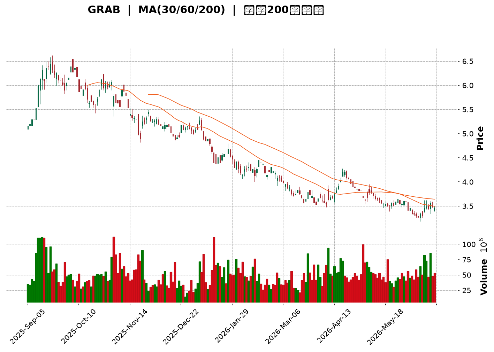
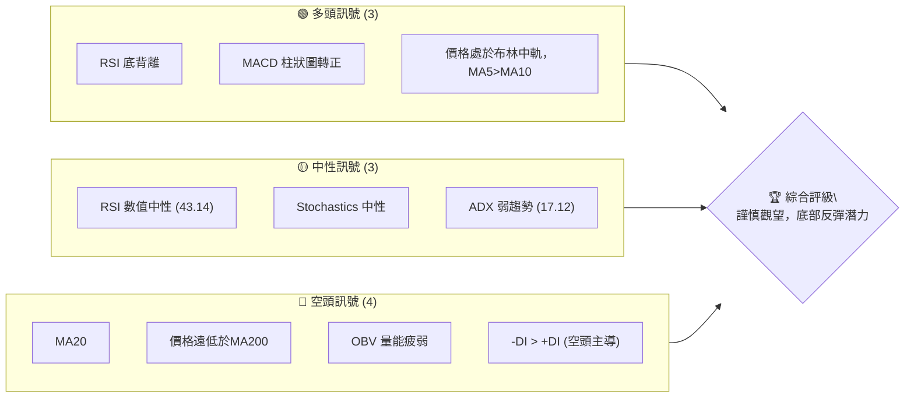
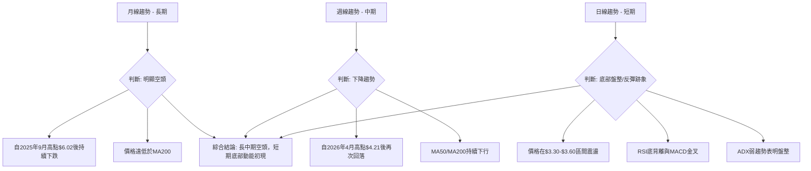
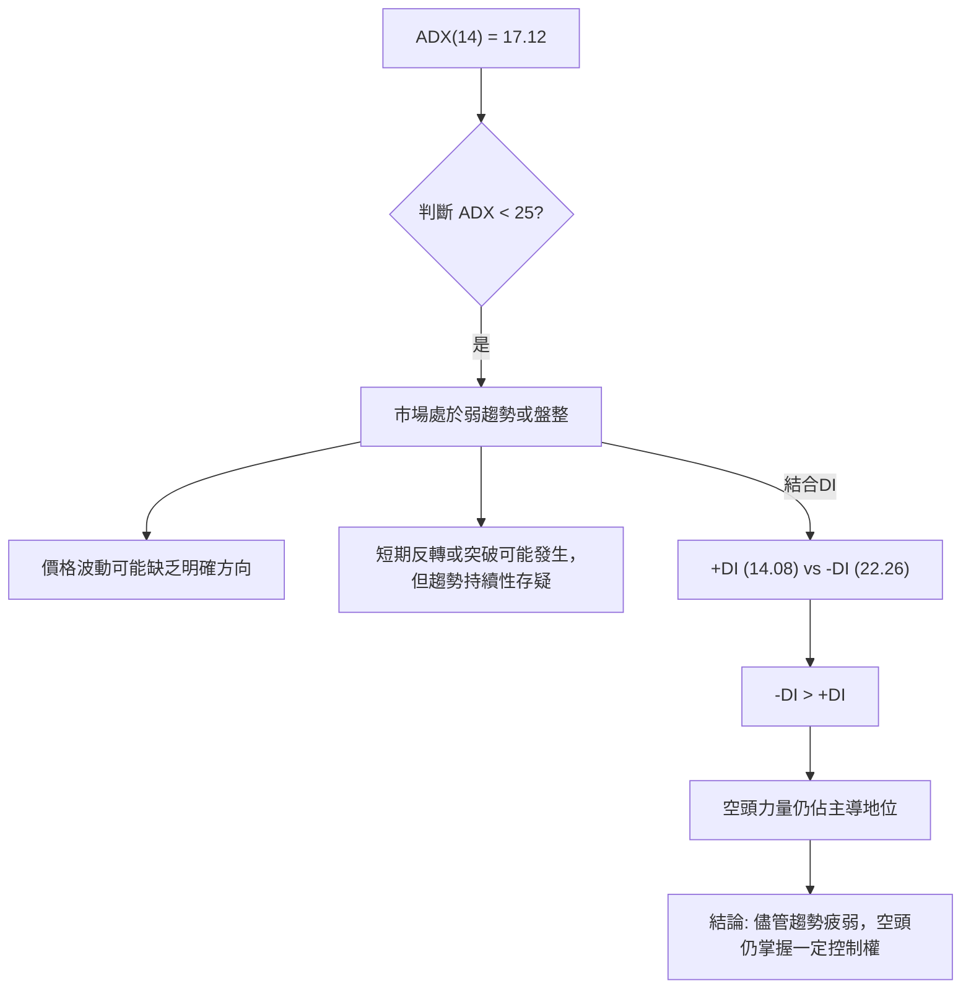
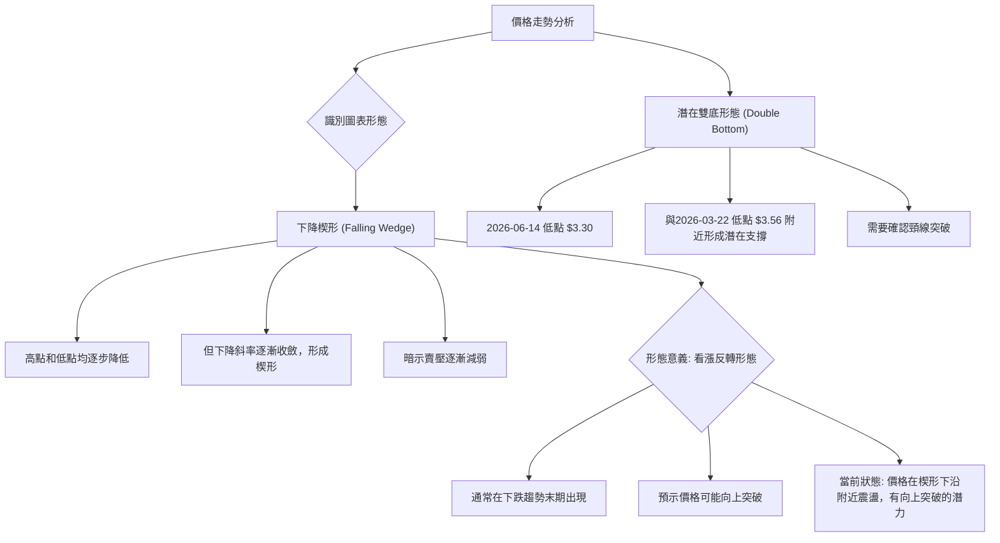
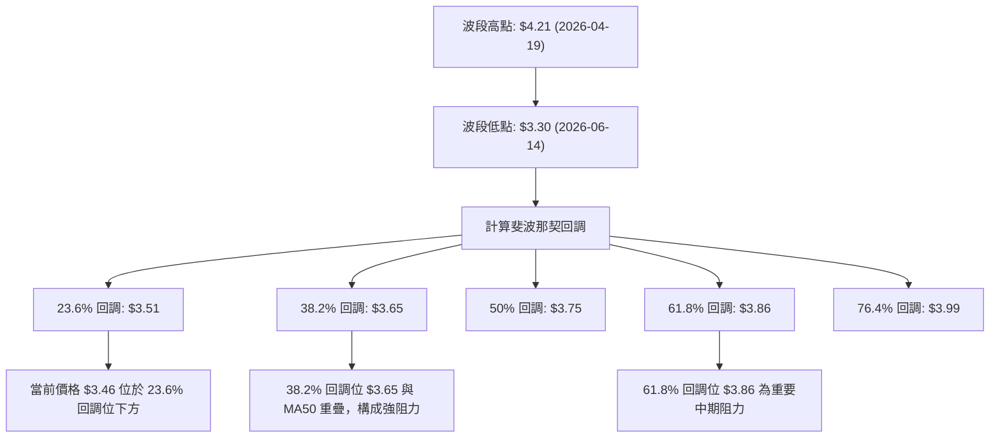
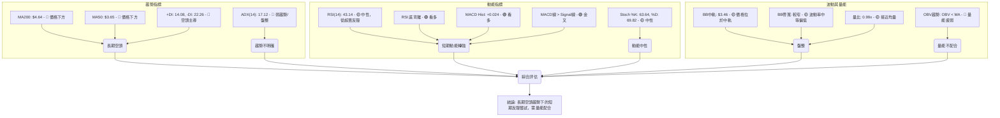
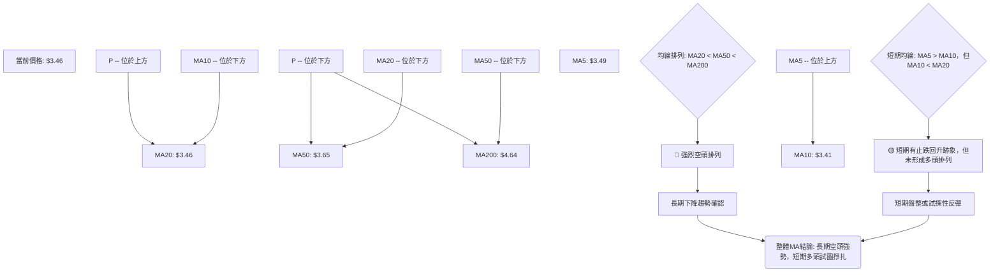
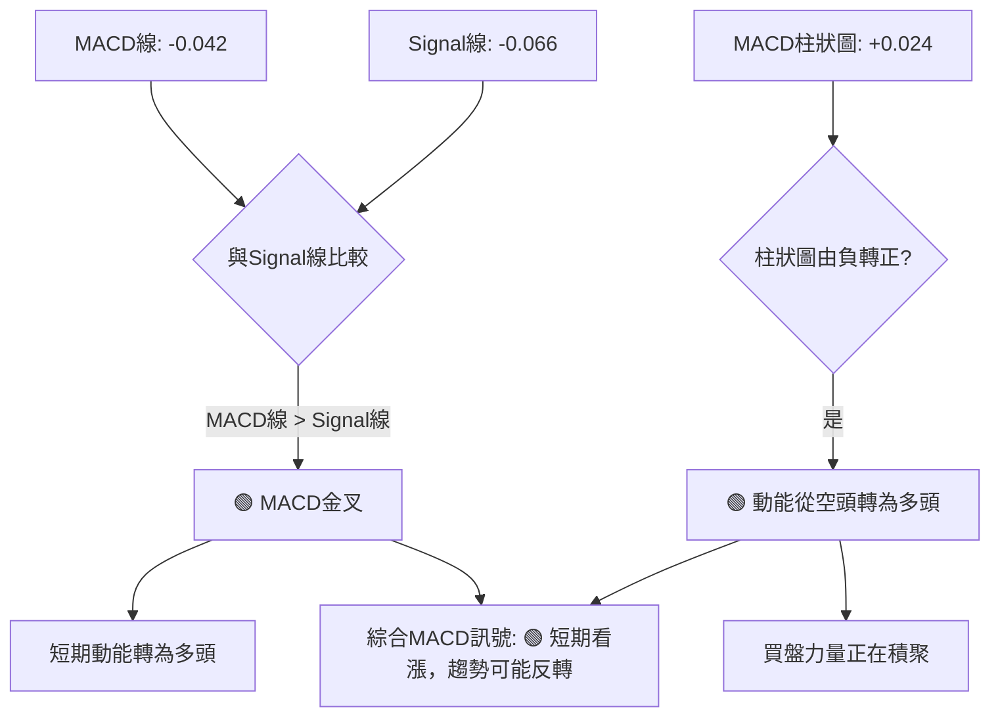

<details>
<summary>📊 靜態圖表 (點擊展開)</summary>

</details>

<html>
<head><meta charset="utf-8" /></head>
<body>
    <div style="height:500px; width:100%;">                        <script>window.PlotlyConfig = {MathJaxConfig: 'local'};</script>
        <script charset="utf-8" src="https://cdn.plot.ly/plotly-3.6.0.min.js" integrity="sha256-QaOVwtVY0T02VaHrr6pnoHLCwayMJp4O5n4YyaE3rJk=" crossorigin="anonymous"></script>                <div id="candlestick-chart" class="plotly-graph-div" style="height:100%; width:100%;"></div>            <script>                window.PLOTLYENV=window.PLOTLYENV || {};                                if (document.getElementById("candlestick-chart")) {                    Plotly.newPlot(                        "candlestick-chart",                        [{"close":{"dtype":"f8","bdata":"AAAAANejFEAAAABgj8IUQAAAAMD1KBVAAAAAQDMzFUAAAABguB4WQAAAAAAAABhAAAAAIFyPGEAAAAAgrkcZQAAAAGBmZhhAAAAAYGZmGUAAAAAgXI8ZQAAAAMDMzBlAAAAAIK5HGUAAAACgR+EYQAAAAAAAABlAAAAA4KNwGEAAAADgo3AYQAAAAOB6FBhAAAAAoJmZF0AAAABAMzMYQAAAAADXoxhAAAAAIFyPGUAAAADgehQZQAAAAOCjcBlAAAAAgBSuGEAAAADgo3AXQAAAAOBRuBdAAAAAANejF0AAAACAFK4XQAAAAEAK1xZAAAAAIFyPFkAAAACAFK4WQAAAAGBmZhZAAAAAQOF6FkAAAACgR+EWQAAAAGBmZhdAAAAAQOF6GEAAAABgj8IXQAAAAEAzMxhAAAAAIIXrF0AAAACAPQoYQAAAACCuRxhAAAAAANcjF0AAAAAgXI8WQAAAAMAehRZAAAAAoHA9FkAAAACgmZkXQAAAAMAehRdAAAAAwPUoF0AAAADA9SgWQAAAAADXoxVAAAAAgOtRFUAAAAAgrkcVQAAAAKBwPRVAAAAAIIXrE0AAAACgmZkTQAAAAAAAABVAAAAAgML1FEAAAAAgrkcVQAAAAMDMzBVAAAAA4HoUFUAAAACAPQoVQAAAAOB6FBVAAAAAQDMzFUAAAABgj8IUQAAAAADXoxRAAAAAoJmZFEAAAADgUbgUQAAAAOBRuBRAAAAAoJmZFEAAAADgehQUQAAAAMDMzBNAAAAAQOF6E0AAAACAFK4TQAAAAOBRuBNAAAAA4FG4FEAAAACA61EUQAAAAMAehRRAAAAAoJmZFEAAAABgZmYUQAAAACCuRxRAAAAAgML1E0AAAACA61EUQAAAAAApXBRAAAAA4HoUFUAAAACA61EUQAAAAMAehRNAAAAAYGZmE0AAAAAgXI8TQAAAAMD1KBNAAAAAwB6FEkAAAAAgXI8RQAAAAMAehRFAAAAAgD0KEkAAAACgmZkRQAAAAEAzMxJAAAAAgOtREkAAAACgcD0SQAAAAGCPwhJAAAAAYLgeEkAAAACgR+ERQAAAAEAzMxFAAAAAANejEUAAAADgehQRQAAAAGCPwhBAAAAAoJmZEEAAAADgehQRQAAAAIA9ChFAAAAAoHA9EUAAAAAghesQQAAAAOB6FBFAAAAAwB6FEEAAAADgehQRQAAAAMDMzBFAAAAAoJmZEUAAAADAHoURQAAAAOBRuBBAAAAAoJmZEEAAAABACtcQQAAAAKBwPRFAAAAAoEfhEEAAAADgUbgQQAAAAIDrURBAAAAAYGZmEEAAAABguB4QQAAAAEAK1w9AAAAAgBSuD0AAAACAwvUOQAAAAGC4Hg9AAAAAAAAADkAAAACAFK4NQAAAAAAAAA5AAAAA4FG4DkAAAAAAAAAOQAAAAOCjcA1AAAAAQOF6DEAAAABguB4NQAAAAIDrUQ5AAAAAQArXDUAAAACAFK4NQAAAACBcjwxAAAAAoHA9DEAAAAAgrkcNQAAAAAApXA1AAAAAgML1DEAAAABA4XoMQAAAAIDrUQxAAAAAgD0KDUAAAADgo3ANQAAAAOCjcA1AAAAAQArXDUAAAAAgXI8OQAAAAAApXA9AAAAA4HoUEEAAAABACtcQQAAAAEAK1xBAAAAAgOtREEAAAACgcD0QQAAAAIAUrg9AAAAAQDMzD0AAAABguB4PQAAAAKBH4Q5AAAAAIFyPDkAAAAAgXI8OQAAAAAApXA1AAAAAgML1DEAAAADgo3ANQAAAAMD1KA5AAAAAgOtRDkAAAABgj8INQAAAAEAzMw1AAAAAYLgeDUAAAACAPQoNQAAAACBcjwxAAAAAYGZmDEAAAACA61EMQAAAAAAAAAxAAAAA4HoUDEAAAABA4XoMQAAAAOB6FAxAAAAA4FG4DEAAAABguB4NQAAAAIDrUQxAAAAAgOtRDEAAAACgR+EMQAAAAMDMzAxAAAAAIK5HC0AAAACAFK4LQAAAAOBRuApAAAAAANejCkAAAABgZmYKQAAAAMD1KApAAAAAwMzMCkAAAABgZmYKQAAAAIAUrgtAAAAAIIXrC0AAAACgmZkLQAAAACBcjwxAAAAAIIXrC0AAAACAFK4LQA=="},"high":{"dtype":"f8","bdata":"AAAA4FG4FEAAAADgUTgVQAAAAEAzMxVAAAAAAClcFUAAAAAgrkcWQAAAAGC4HhhAAAAAANejGEAAAACAFK4ZQAAAAMAehRhAAAAAAAAAGkAAAAAAAAAaQAAAAIDrURpAAAAAQOF6GkAAAADgUbgZQAAAAOB6FBlAAAAAoEfhGEAAAACAFK4YQAAAAKCZmRhAAAAAoEfhGEAAAAAgrkcYQAAAAKBH4RhAAAAAIK7HGUAAAABgZmYaQAAAAECJwRlAAAAAoJmZGUAAAAAgXI8YQAAAACCuRxhAAAAA4HoUGEAAAAAgXI8YQAAAAIDC9RdAAAAAQDOzFkAAAACAajwXQAAAAOBRuBZAAAAAQOF6FkAAAACAPQoXQAAAAMD1qBdAAAAAwB6FGEAAAACAwvUYQAAAAAApXBhAAAAAgOtRGEAAAACA61EYQAAAAIDCdRhAAAAAIK5HF0AAAADgo3AXQAAAAEAKVxdAAAAAwPUoF0AAAAAAAAAYQAAAAOCj8BhAAAAA4HoUGEAAAACgR+EWQAAAAGC4HhZAAAAA4HoUFkAAAACAwnUVQAAAAMAehRVAAAAAANejFUAAAACgcD0UQAAAAEDhehVAAAAAAClcFUAAAADgo3AVQAAAAAAAABZAAAAAQOF6FUAAAACgcD0VQAAAAEAzMxVAAAAAYGZmFUAAAABgZmYVQAAAACBcDxVAAAAAACncFEAAAACAwvUUQAAAAGCPwhRAAAAA4HoUFUAAAAAA16MUQAAAAEAzMxRAAAAAoEfhE0AAAACgR+ETQAAAAGC4HhRAAAAAYLgeFUAAAACAwvUUQAAAAKCZmRRAAAAAANejFEAAAAAghesUQAAAACBcjxRAAAAAAClcFEAAAADAHoUUQAAAAMDMzBRAAAAA4KNwFUAAAACA61EVQAAAAEAzMxRAAAAAoEfhE0AAAACgR+ETQAAAAKCZmRNAAAAAgD0KE0AAAADAHoUSQAAAAGBmZhJAAAAA4FE4EkAAAABAMzMSQAAAAGBmZhJAAAAAIFyPEkAAAACAFK4SQAAAAIAULhNAAAAA4FG4EkAAAADgUTgSQAAAAKBH4RFAAAAA4FG4EUAAAABgj8IRQAAAAEDhehFAAAAAANejEEAAAADAzEwRQAAAAAApXBFAAAAAYLieEUAAAAAgXI8RQAAAAIDC9RFAAAAA4FE4EUAAAABAMzMRQAAAAIA9ChJAAAAAQArXEUAAAADAHgUSQAAAAIA9ihFAAAAAoJmZEEAAAADAHoURQAAAACCuRxFAAAAAYLgeEUAAAACgR+EQQAAAAIA9ihBAAAAA4HqUEEAAAADAHoUQQAAAAMD1KBBAAAAAgBSuD0AAAAAAAAAQQAAAAMAehQ9AAAAAwMzMDkAAAABA4XoOQAAAAADXow5AAAAAgML1DkAAAABAMzMPQAAAAEAK1w1AAAAA4KNwDUAAAACAFK4NQAAAAADXow5AAAAAoJmZD0AAAADgUbgOQAAAAMAehQ1AAAAAgML1DEAAAADgo3ANQAAAAIDrUQ5AAAAAYI\u002fCDUAAAAAAAAAOQAAAAGCPwgxAAAAA4KNwD0AAAABACtcNQAAAAMDMzA1AAAAAoHA9DkAAAADgehQPQAAAAOBRuA9AAAAAAClcEEAAAABguB4RQAAAAAAAABFAAAAAgML1EEAAAADgo3AQQAAAAEAzMxBAAAAAwPUoEEAAAAAghesPQAAAAAAAAA9AAAAAIIXrDkAAAADgUbgOQAAAAKBH4Q1AAAAAQDMzDUAAAADgo3AOQAAAAKCZmQ9AAAAAQDMzD0AAAACgcD0OQAAAAOB6FA5AAAAA4KNwDUAAAADgo3ANQAAAAIDC9QxAAAAAIFyPDEAAAADAzMwMQAAAACBcjwxAAAAAgOkmDEAAAAAA16MMQAAAAIDC9QxAAAAAgOtRDUAAAAAAKVwNQAAAAIDC9QxAAAAAIFyPDEAAAAAgrkcNQAAAACCuRw1AAAAA4FG4DEAAAABgZmYMQAAAAMAehQtAAAAAQDMzC0AAAACAwvUKQAAAAMDMzApAAAAAgML1CkAAAABguB4LQAAAAIDC9QxAAAAAgML1DEAAAAAAKVwMQAAAAKBH4QxAAAAA4FG4DEAAAAAAAAAMQA=="},"hovertemplate":"\u003cb\u003e%{x|%Y-%m-%d}\u003c\u002fb\u003e\u003cbr\u003e\u958b: $%{open:.2f}\u003cbr\u003e\u9ad8: $%{high:.2f}\u003cbr\u003e\u4f4e: $%{low:.2f}\u003cbr\u003e\u6536: $%{close:.2f}\u003cextra\u003e\u003c\u002fextra\u003e","low":{"dtype":"f8","bdata":"AAAAoHA9FEAAAAAA16MUQAAAAAApXBRAAAAAgML1FEAAAACgR+EUQAAAAIA9ChZAAAAA4KNwFkAAAAAA16MXQAAAAMD1qBdAAAAAoHA9GEAAAAAgrkcZQAAAAKBH4RhAAAAAgD0KGUAAAAAA16MYQAAAAIDC9RdAAAAAwPUoGEAAAADgUbgXQAAAAIDC9RdAAAAAgOtRF0AAAACgmZkXQAAAAKBwPRhAAAAAIFyPGEAAAACAwvUYQAAAACCF6xhAAAAAIK5HGEAAAAAAKVwXQAAAACBcjxdAAAAAwMzMFkAAAACgmZkXQAAAACBcjxZAAAAAwPUoFkAAAACgmZkWQAAAAMD1KBZAAAAAgBSuFUAAAACA61EWQAAAAOB6FBdAAAAAANejF0AAAACgmZkXQAAAAGBmZhdAAAAAgBSuF0AAAADAzMwXQAAAAKCZmRdAAAAA4KNwFUAAAABA4XoWQAAAAIAULhZAAAAAwMzMFUAAAAAghesWQAAAAEAzMxdAAAAAYLgeF0AAAAAghesVQAAAAOCjcBVAAAAA4HoUFUAAAACgR+EUQAAAAAAAABVAAAAAQArXE0AAAAAgrkcTQAAAACCFaxRAAAAAYI\u002fCFEAAAABACtcUQAAAAOCjcBVAAAAAAAAAFUAAAACgR+EUQAAAAKCZmRRAAAAAIK7HFEAAAADgUbgUQAAAAOCjcBRAAAAAgOtRFEAAAABAMzMUQAAAAKBHYRRAAAAA4KNwFEAAAACAwvUTQAAAAIAUrhNAAAAAYGZmE0AAAAAgXI8TQAAAAADXoxNAAAAAgD0KFEAAAAAgrkcUQAAAAGC4HhRAAAAAwMxMFEAAAACgR2EUQAAAAAAAABRAAAAAIIXrE0AAAACAPQoUQAAAAIDrURRAAAAAYI\u002fCFEAAAABgj0IUQAAAAOCjcBNAAAAAgOtRE0AAAAAAKVwTQAAAAAAAABNAAAAAgOtREkAAAACA61ERQAAAAOCjcBFAAAAAYGZmEUAAAAAgXI8RQAAAAOBRuBFAAAAA4HoUEkAAAADA9SgSQAAAAAApXBJAAAAAgD0KEkAAAADAHoURQAAAAMD1KBFAAAAAAAAAEUAAAADgUbgQQAAAAKCZmRBAAAAAoHA9EEAAAACAwnUQQAAAAEAK1xBAAAAAIIXrEEAAAABgj8IQQAAAAMDMzBBAAAAAAAAAEEAAAABgZmYQQAAAAOB6FBFAAAAAYI9CEUAAAACA61ERQAAAAMAehRBAAAAAQDMzEEAAAADgp8YQQAAAACBcjxBAAAAA4FG4EEAAAACgcD0QQAAAAAApXA9AAAAAgD0KEEAAAAAAAAAQQAAAAGCPwg9AAAAAwB6FDkAAAADAzMwOQAAAAEDheg5AAAAAYI\u002fCDUAAAACgmZkNQAAAAGCPwg1AAAAAwPUoDkAAAABACtcNQAAAACCuRw1AAAAAYGZmDEAAAADgUbgMQAAAAIDC9QxAAAAAoJmZDUAAAACA61ENQAAAAKBwPQxAAAAA4HoUDEAAAABgZmYMQAAAAGC4Hg1AAAAAANejDEAAAABA4XoMQAAAAEAK1wtAAAAAwMzMDEAAAACAwvUMQAAAAEAzMw1AAAAAANejDEAAAABgZDsOQAAAAIAUrg5AAAAAQArXD0AAAADgo3AQQAAAAOCjcBBAAAAAQDMzEEAAAADA9SgQQAAAAEAzMw9AAAAAgD0KD0AAAACgR+EOQAAAAIDrUQ5AAAAA4HoUDkAAAAAghesNQAAAAMD1KAxAAAAAgOtRDEAAAADgUbgMQAAAACCF6w1AAAAA4HoUDkAAAAAgrkcNQAAAAIDC9QxAAAAAoEfhDEAAAABA4XoMQAAAAGBmZgxAAAAAgBSuC0AAAABACtcLQAAAACCF6wtAAAAAYLgeC0AAAACgmZkLQAAAACCF6wtAAAAA4HoUDEAAAADgo3AMQAAAAEAK1wtAAAAAQArXC0AAAAAAAAAMQAAAACBcjwxAAAAAgD0KC0AAAACAPQoLQAAAAKCZmQpAAAAAYGZmCkAAAADgehQKQAAAAMD1KApAAAAA4KNwCUAAAADgehQKQAAAAIDC9QpAAAAAQOF6C0AAAADgo3ALQAAAAOBRuApAAAAAYI\u002fCC0AAAABguB4LQA=="},"name":"\u50f9\u683c","open":{"dtype":"f8","bdata":"AAAAAClcFEAAAACAFK4UQAAAAADXoxRAAAAAQDMzFUAAAADA9SgVQAAAAEAzMxZAAAAAoJmZF0AAAABA4XoYQAAAAMAehRhAAAAAgD2KGEAAAAAgXI8ZQAAAAEDh+hhAAAAAIIXrGUAAAABAMzMZQAAAAMAehRhAAAAAQArXGEAAAACAwnUYQAAAAKBwPRhAAAAAwPUoGEAAAACAwvUXQAAAAEDhehhAAAAAoJkZGUAAAABAMzMaQAAAAIDrURlAAAAAgD2KGUAAAABA4XoYQAAAAIDC9RdAAAAAwPUoF0AAAACgcD0YQAAAAMDMzBdAAAAAQOF6FkAAAADA9SgXQAAAAOBRuBZAAAAAQOF6FkAAAACAFK4WQAAAAKBHYRdAAAAAAAAAGEAAAAAghesYQAAAAGCPwhdAAAAAAAAAGEAAAACgR+EXQAAAAIA9ChhAAAAAYI9CFkAAAABgj0IXQAAAAMDMzBZAAAAAwMzMFkAAAACgmRkXQAAAACBcDxhAAAAAYGZmF0AAAABACtcWQAAAAMAehRVAAAAAgD2KFUAAAADgUTgVQAAAAEAzMxVAAAAAANejFUAAAACAPQoUQAAAAIAUrhRAAAAA4HoUFUAAAADA9SgVQAAAAADXoxVAAAAAIIVrFUAAAADAHgUVQAAAAIDC9RRAAAAAQArXFEAAAADA9SgVQAAAAGCPwhRAAAAAIIVrFEAAAABgZmYUQAAAAOB6lBRAAAAAYI\u002fCFEAAAACgmZkUQAAAAEDh+hNAAAAAoEfhE0AAAACgmZkTQAAAAKBH4RNAAAAA4HoUFEAAAACAFK4UQAAAAIDrURRAAAAAIFyPFEAAAABA4XoUQAAAAIDCdRRAAAAAIK5HFEAAAACAFC4UQAAAAMAehRRAAAAAYI\u002fCFEAAAABguB4VQAAAAEAzMxRAAAAAYI\u002fCE0AAAABgZmYTQAAAAKCZmRNAAAAAIIXrEkAAAADgo3ASQAAAAIDrURJAAAAAgD2KEUAAAABAMzMSQAAAAMDMzBFAAAAA4HoUEkAAAACgcD0SQAAAAAApXBJAAAAAgBSuEkAAAADA9SgSQAAAAIAUrhFAAAAAYLgeEUAAAADA9agRQAAAAIDrURFAAAAAwB6FEEAAAACgR+EQQAAAAGC4HhFAAAAAwPUoEUAAAADgo3ARQAAAAMDMzBBAAAAAgML1EEAAAABgj8IQQAAAAKBwPRFAAAAA4HqUEUAAAADgo3ARQAAAAMDMTBFAAAAA4KNwEEAAAAAAAAARQAAAAOBRuBBAAAAAwMzMEEAAAAAA16MQQAAAAGC4HhBAAAAA4KNwEEAAAAAAKVwQQAAAACBcDxBAAAAAIK5HD0AAAACAFK4PQAAAAMDMzA5AAAAAANejDkAAAABguB4OQAAAACCF6w1AAAAAoHA9DkAAAACgmZkOQAAAAGCPwg1AAAAAQDMzDUAAAADAzMwMQAAAAEAzMw1AAAAAANejDkAAAABgZmYNQAAAAOCjcA1AAAAA4FG4DEAAAADAzMwMQAAAAAAAAA5AAAAAgML1DEAAAACgR+EMQAAAAMAehQxAAAAAQArXDkAAAACAPQoNQAAAAKCZmQ1AAAAAQDMzDUAAAACgcD0OQAAAAMDMzA5AAAAAAAAAEEAAAABA4XoQQAAAAGC4nhBAAAAAoEfhEEAAAAAAKVwQQAAAAEAzMxBAAAAA4HoUEEAAAABAMzMPQAAAAMDMzA5AAAAAoEfhDkAAAAAgXI8OQAAAAOBRuA1AAAAA4HoUDUAAAAAAKVwOQAAAAMDMzA5AAAAAIFyPDkAAAADA9SgOQAAAAIAUrg1AAAAAAClcDUAAAAAAKVwNQAAAAIDC9QxAAAAAgOtRDEAAAABguB4MQAAAAIDrUQxAAAAA4HoUDEAAAAAAAAAMQAAAAEDhegxAAAAAIK5HDEAAAABA4XoMQAAAAIDC9QxAAAAAoHA9DEAAAADA9SgMQAAAAKBH4QxAAAAAANejDEAAAAAgrkcLQAAAAOCjcAtAAAAAYI\u002fCCkAAAAAA16MKQAAAAGBmZgpAAAAAAAAACkAAAABguB4LQAAAAGC4HgtAAAAAYI\u002fCC0AAAAAAAAAMQAAAAMAehQtAAAAAoBgEDEAAAAAgrkcLQA=="},"x":["2025-09-05T00:00:00-04:00","2025-09-08T00:00:00-04:00","2025-09-09T00:00:00-04:00","2025-09-10T00:00:00-04:00","2025-09-11T00:00:00-04:00","2025-09-12T00:00:00-04:00","2025-09-15T00:00:00-04:00","2025-09-16T00:00:00-04:00","2025-09-17T00:00:00-04:00","2025-09-18T00:00:00-04:00","2025-09-19T00:00:00-04:00","2025-09-22T00:00:00-04:00","2025-09-23T00:00:00-04:00","2025-09-24T00:00:00-04:00","2025-09-25T00:00:00-04:00","2025-09-26T00:00:00-04:00","2025-09-29T00:00:00-04:00","2025-09-30T00:00:00-04:00","2025-10-01T00:00:00-04:00","2025-10-02T00:00:00-04:00","2025-10-03T00:00:00-04:00","2025-10-06T00:00:00-04:00","2025-10-07T00:00:00-04:00","2025-10-08T00:00:00-04:00","2025-10-09T00:00:00-04:00","2025-10-10T00:00:00-04:00","2025-10-13T00:00:00-04:00","2025-10-14T00:00:00-04:00","2025-10-15T00:00:00-04:00","2025-10-16T00:00:00-04:00","2025-10-17T00:00:00-04:00","2025-10-20T00:00:00-04:00","2025-10-21T00:00:00-04:00","2025-10-22T00:00:00-04:00","2025-10-23T00:00:00-04:00","2025-10-24T00:00:00-04:00","2025-10-27T00:00:00-04:00","2025-10-28T00:00:00-04:00","2025-10-29T00:00:00-04:00","2025-10-30T00:00:00-04:00","2025-10-31T00:00:00-04:00","2025-11-03T00:00:00-05:00","2025-11-04T00:00:00-05:00","2025-11-05T00:00:00-05:00","2025-11-06T00:00:00-05:00","2025-11-07T00:00:00-05:00","2025-11-10T00:00:00-05:00","2025-11-11T00:00:00-05:00","2025-11-12T00:00:00-05:00","2025-11-13T00:00:00-05:00","2025-11-14T00:00:00-05:00","2025-11-17T00:00:00-05:00","2025-11-18T00:00:00-05:00","2025-11-19T00:00:00-05:00","2025-11-20T00:00:00-05:00","2025-11-21T00:00:00-05:00","2025-11-24T00:00:00-05:00","2025-11-25T00:00:00-05:00","2025-11-26T00:00:00-05:00","2025-11-28T00:00:00-05:00","2025-12-01T00:00:00-05:00","2025-12-02T00:00:00-05:00","2025-12-03T00:00:00-05:00","2025-12-04T00:00:00-05:00","2025-12-05T00:00:00-05:00","2025-12-08T00:00:00-05:00","2025-12-09T00:00:00-05:00","2025-12-10T00:00:00-05:00","2025-12-11T00:00:00-05:00","2025-12-12T00:00:00-05:00","2025-12-15T00:00:00-05:00","2025-12-16T00:00:00-05:00","2025-12-17T00:00:00-05:00","2025-12-18T00:00:00-05:00","2025-12-19T00:00:00-05:00","2025-12-22T00:00:00-05:00","2025-12-23T00:00:00-05:00","2025-12-24T00:00:00-05:00","2025-12-26T00:00:00-05:00","2025-12-29T00:00:00-05:00","2025-12-30T00:00:00-05:00","2025-12-31T00:00:00-05:00","2026-01-02T00:00:00-05:00","2026-01-05T00:00:00-05:00","2026-01-06T00:00:00-05:00","2026-01-07T00:00:00-05:00","2026-01-08T00:00:00-05:00","2026-01-09T00:00:00-05:00","2026-01-12T00:00:00-05:00","2026-01-13T00:00:00-05:00","2026-01-14T00:00:00-05:00","2026-01-15T00:00:00-05:00","2026-01-16T00:00:00-05:00","2026-01-20T00:00:00-05:00","2026-01-21T00:00:00-05:00","2026-01-22T00:00:00-05:00","2026-01-23T00:00:00-05:00","2026-01-26T00:00:00-05:00","2026-01-27T00:00:00-05:00","2026-01-28T00:00:00-05:00","2026-01-29T00:00:00-05:00","2026-01-30T00:00:00-05:00","2026-02-02T00:00:00-05:00","2026-02-03T00:00:00-05:00","2026-02-04T00:00:00-05:00","2026-02-05T00:00:00-05:00","2026-02-06T00:00:00-05:00","2026-02-09T00:00:00-05:00","2026-02-10T00:00:00-05:00","2026-02-11T00:00:00-05:00","2026-02-12T00:00:00-05:00","2026-02-13T00:00:00-05:00","2026-02-17T00:00:00-05:00","2026-02-18T00:00:00-05:00","2026-02-19T00:00:00-05:00","2026-02-20T00:00:00-05:00","2026-02-23T00:00:00-05:00","2026-02-24T00:00:00-05:00","2026-02-25T00:00:00-05:00","2026-02-26T00:00:00-05:00","2026-02-27T00:00:00-05:00","2026-03-02T00:00:00-05:00","2026-03-03T00:00:00-05:00","2026-03-04T00:00:00-05:00","2026-03-05T00:00:00-05:00","2026-03-06T00:00:00-05:00","2026-03-09T00:00:00-04:00","2026-03-10T00:00:00-04:00","2026-03-11T00:00:00-04:00","2026-03-12T00:00:00-04:00","2026-03-13T00:00:00-04:00","2026-03-16T00:00:00-04:00","2026-03-17T00:00:00-04:00","2026-03-18T00:00:00-04:00","2026-03-19T00:00:00-04:00","2026-03-20T00:00:00-04:00","2026-03-23T00:00:00-04:00","2026-03-24T00:00:00-04:00","2026-03-25T00:00:00-04:00","2026-03-26T00:00:00-04:00","2026-03-27T00:00:00-04:00","2026-03-30T00:00:00-04:00","2026-03-31T00:00:00-04:00","2026-04-01T00:00:00-04:00","2026-04-02T00:00:00-04:00","2026-04-06T00:00:00-04:00","2026-04-07T00:00:00-04:00","2026-04-08T00:00:00-04:00","2026-04-09T00:00:00-04:00","2026-04-10T00:00:00-04:00","2026-04-13T00:00:00-04:00","2026-04-14T00:00:00-04:00","2026-04-15T00:00:00-04:00","2026-04-16T00:00:00-04:00","2026-04-17T00:00:00-04:00","2026-04-20T00:00:00-04:00","2026-04-21T00:00:00-04:00","2026-04-22T00:00:00-04:00","2026-04-23T00:00:00-04:00","2026-04-24T00:00:00-04:00","2026-04-27T00:00:00-04:00","2026-04-28T00:00:00-04:00","2026-04-29T00:00:00-04:00","2026-04-30T00:00:00-04:00","2026-05-01T00:00:00-04:00","2026-05-04T00:00:00-04:00","2026-05-05T00:00:00-04:00","2026-05-06T00:00:00-04:00","2026-05-07T00:00:00-04:00","2026-05-08T00:00:00-04:00","2026-05-11T00:00:00-04:00","2026-05-12T00:00:00-04:00","2026-05-13T00:00:00-04:00","2026-05-14T00:00:00-04:00","2026-05-15T00:00:00-04:00","2026-05-18T00:00:00-04:00","2026-05-19T00:00:00-04:00","2026-05-20T00:00:00-04:00","2026-05-21T00:00:00-04:00","2026-05-22T00:00:00-04:00","2026-05-26T00:00:00-04:00","2026-05-27T00:00:00-04:00","2026-05-28T00:00:00-04:00","2026-05-29T00:00:00-04:00","2026-06-01T00:00:00-04:00","2026-06-02T00:00:00-04:00","2026-06-03T00:00:00-04:00","2026-06-04T00:00:00-04:00","2026-06-05T00:00:00-04:00","2026-06-08T00:00:00-04:00","2026-06-09T00:00:00-04:00","2026-06-10T00:00:00-04:00","2026-06-11T00:00:00-04:00","2026-06-12T00:00:00-04:00","2026-06-15T00:00:00-04:00","2026-06-16T00:00:00-04:00","2026-06-17T00:00:00-04:00","2026-06-18T00:00:00-04:00","2026-06-22T00:00:00-04:00","2026-06-23T00:00:00-04:00"],"type":"candlestick"},{"hovertemplate":"MA30: $%{y:.2f}\u003cextra\u003e\u003c\u002fextra\u003e","line":{"color":"#2196F3","dash":"dash","width":2},"mode":"lines","name":"MA30","x":["2025-09-05T00:00:00-04:00","2025-09-08T00:00:00-04:00","2025-09-09T00:00:00-04:00","2025-09-10T00:00:00-04:00","2025-09-11T00:00:00-04:00","2025-09-12T00:00:00-04:00","2025-09-15T00:00:00-04:00","2025-09-16T00:00:00-04:00","2025-09-17T00:00:00-04:00","2025-09-18T00:00:00-04:00","2025-09-19T00:00:00-04:00","2025-09-22T00:00:00-04:00","2025-09-23T00:00:00-04:00","2025-09-24T00:00:00-04:00","2025-09-25T00:00:00-04:00","2025-09-26T00:00:00-04:00","2025-09-29T00:00:00-04:00","2025-09-30T00:00:00-04:00","2025-10-01T00:00:00-04:00","2025-10-02T00:00:00-04:00","2025-10-03T00:00:00-04:00","2025-10-06T00:00:00-04:00","2025-10-07T00:00:00-04:00","2025-10-08T00:00:00-04:00","2025-10-09T00:00:00-04:00","2025-10-10T00:00:00-04:00","2025-10-13T00:00:00-04:00","2025-10-14T00:00:00-04:00","2025-10-15T00:00:00-04:00","2025-10-16T00:00:00-04:00","2025-10-17T00:00:00-04:00","2025-10-20T00:00:00-04:00","2025-10-21T00:00:00-04:00","2025-10-22T00:00:00-04:00","2025-10-23T00:00:00-04:00","2025-10-24T00:00:00-04:00","2025-10-27T00:00:00-04:00","2025-10-28T00:00:00-04:00","2025-10-29T00:00:00-04:00","2025-10-30T00:00:00-04:00","2025-10-31T00:00:00-04:00","2025-11-03T00:00:00-05:00","2025-11-04T00:00:00-05:00","2025-11-05T00:00:00-05:00","2025-11-06T00:00:00-05:00","2025-11-07T00:00:00-05:00","2025-11-10T00:00:00-05:00","2025-11-11T00:00:00-05:00","2025-11-12T00:00:00-05:00","2025-11-13T00:00:00-05:00","2025-11-14T00:00:00-05:00","2025-11-17T00:00:00-05:00","2025-11-18T00:00:00-05:00","2025-11-19T00:00:00-05:00","2025-11-20T00:00:00-05:00","2025-11-21T00:00:00-05:00","2025-11-24T00:00:00-05:00","2025-11-25T00:00:00-05:00","2025-11-26T00:00:00-05:00","2025-11-28T00:00:00-05:00","2025-12-01T00:00:00-05:00","2025-12-02T00:00:00-05:00","2025-12-03T00:00:00-05:00","2025-12-04T00:00:00-05:00","2025-12-05T00:00:00-05:00","2025-12-08T00:00:00-05:00","2025-12-09T00:00:00-05:00","2025-12-10T00:00:00-05:00","2025-12-11T00:00:00-05:00","2025-12-12T00:00:00-05:00","2025-12-15T00:00:00-05:00","2025-12-16T00:00:00-05:00","2025-12-17T00:00:00-05:00","2025-12-18T00:00:00-05:00","2025-12-19T00:00:00-05:00","2025-12-22T00:00:00-05:00","2025-12-23T00:00:00-05:00","2025-12-24T00:00:00-05:00","2025-12-26T00:00:00-05:00","2025-12-29T00:00:00-05:00","2025-12-30T00:00:00-05:00","2025-12-31T00:00:00-05:00","2026-01-02T00:00:00-05:00","2026-01-05T00:00:00-05:00","2026-01-06T00:00:00-05:00","2026-01-07T00:00:00-05:00","2026-01-08T00:00:00-05:00","2026-01-09T00:00:00-05:00","2026-01-12T00:00:00-05:00","2026-01-13T00:00:00-05:00","2026-01-14T00:00:00-05:00","2026-01-15T00:00:00-05:00","2026-01-16T00:00:00-05:00","2026-01-20T00:00:00-05:00","2026-01-21T00:00:00-05:00","2026-01-22T00:00:00-05:00","2026-01-23T00:00:00-05:00","2026-01-26T00:00:00-05:00","2026-01-27T00:00:00-05:00","2026-01-28T00:00:00-05:00","2026-01-29T00:00:00-05:00","2026-01-30T00:00:00-05:00","2026-02-02T00:00:00-05:00","2026-02-03T00:00:00-05:00","2026-02-04T00:00:00-05:00","2026-02-05T00:00:00-05:00","2026-02-06T00:00:00-05:00","2026-02-09T00:00:00-05:00","2026-02-10T00:00:00-05:00","2026-02-11T00:00:00-05:00","2026-02-12T00:00:00-05:00","2026-02-13T00:00:00-05:00","2026-02-17T00:00:00-05:00","2026-02-18T00:00:00-05:00","2026-02-19T00:00:00-05:00","2026-02-20T00:00:00-05:00","2026-02-23T00:00:00-05:00","2026-02-24T00:00:00-05:00","2026-02-25T00:00:00-05:00","2026-02-26T00:00:00-05:00","2026-02-27T00:00:00-05:00","2026-03-02T00:00:00-05:00","2026-03-03T00:00:00-05:00","2026-03-04T00:00:00-05:00","2026-03-05T00:00:00-05:00","2026-03-06T00:00:00-05:00","2026-03-09T00:00:00-04:00","2026-03-10T00:00:00-04:00","2026-03-11T00:00:00-04:00","2026-03-12T00:00:00-04:00","2026-03-13T00:00:00-04:00","2026-03-16T00:00:00-04:00","2026-03-17T00:00:00-04:00","2026-03-18T00:00:00-04:00","2026-03-19T00:00:00-04:00","2026-03-20T00:00:00-04:00","2026-03-23T00:00:00-04:00","2026-03-24T00:00:00-04:00","2026-03-25T00:00:00-04:00","2026-03-26T00:00:00-04:00","2026-03-27T00:00:00-04:00","2026-03-30T00:00:00-04:00","2026-03-31T00:00:00-04:00","2026-04-01T00:00:00-04:00","2026-04-02T00:00:00-04:00","2026-04-06T00:00:00-04:00","2026-04-07T00:00:00-04:00","2026-04-08T00:00:00-04:00","2026-04-09T00:00:00-04:00","2026-04-10T00:00:00-04:00","2026-04-13T00:00:00-04:00","2026-04-14T00:00:00-04:00","2026-04-15T00:00:00-04:00","2026-04-16T00:00:00-04:00","2026-04-17T00:00:00-04:00","2026-04-20T00:00:00-04:00","2026-04-21T00:00:00-04:00","2026-04-22T00:00:00-04:00","2026-04-23T00:00:00-04:00","2026-04-24T00:00:00-04:00","2026-04-27T00:00:00-04:00","2026-04-28T00:00:00-04:00","2026-04-29T00:00:00-04:00","2026-04-30T00:00:00-04:00","2026-05-01T00:00:00-04:00","2026-05-04T00:00:00-04:00","2026-05-05T00:00:00-04:00","2026-05-06T00:00:00-04:00","2026-05-07T00:00:00-04:00","2026-05-08T00:00:00-04:00","2026-05-11T00:00:00-04:00","2026-05-12T00:00:00-04:00","2026-05-13T00:00:00-04:00","2026-05-14T00:00:00-04:00","2026-05-15T00:00:00-04:00","2026-05-18T00:00:00-04:00","2026-05-19T00:00:00-04:00","2026-05-20T00:00:00-04:00","2026-05-21T00:00:00-04:00","2026-05-22T00:00:00-04:00","2026-05-26T00:00:00-04:00","2026-05-27T00:00:00-04:00","2026-05-28T00:00:00-04:00","2026-05-29T00:00:00-04:00","2026-06-01T00:00:00-04:00","2026-06-02T00:00:00-04:00","2026-06-03T00:00:00-04:00","2026-06-04T00:00:00-04:00","2026-06-05T00:00:00-04:00","2026-06-08T00:00:00-04:00","2026-06-09T00:00:00-04:00","2026-06-10T00:00:00-04:00","2026-06-11T00:00:00-04:00","2026-06-12T00:00:00-04:00","2026-06-15T00:00:00-04:00","2026-06-16T00:00:00-04:00","2026-06-17T00:00:00-04:00","2026-06-18T00:00:00-04:00","2026-06-22T00:00:00-04:00","2026-06-23T00:00:00-04:00"],"y":{"dtype":"f8","bdata":"AAAAAAAA+H8AAAAAAAD4fwAAAAAAAPh\u002fAAAAAAAA+H8AAAAAAAD4fwAAAAAAAPh\u002fAAAAAAAA+H8AAAAAAAD4fwAAAAAAAPh\u002fAAAAAAAA+H8AAAAAAAD4fwAAAAAAAPh\u002fAAAAAAAA+H8AAAAAAAD4fwAAAAAAAPh\u002fAAAAAAAA+H8AAAAAAAD4fwAAAAAAAPh\u002fAAAAAAAA+H8AAAAAAAD4fwAAAAAAAPh\u002fAAAAAAAA+H8AAAAAAAD4fwAAAAAAAPh\u002fAAAAAAAA+H8AAAAAAAD4fwAAAAAAAPh\u002fAAAAAAAA+H8AAAAAAAD4f83MzGzn+xdAq6qqukkMGECJiIgIrBwYQKuqqtpAJxhA3t3dDS0yGEC8u7tLqTgYQDMzM5OKMxhAAAAA0NsyGEAiIiJS4yUYQKuqqmouJBhA7+7uTo0XGEAiIiLSlAoYQFVVVVWc\u002fRdA3t3dbVnrF0AAAABQjdcXQLy7u6tjwhdAIiIisp2vF0AAAACwcqgXQJqZmVmroxdAd3d3J+qfF0BERES0gY4XQKuqqhrodBdA7+7urrlQF0BVVVV1TDAXQKuqqmp1DBdAmpmZCdfjFkDe3d1tEsMWQAAAAIDcqxZAMzMz8\u002f2UFkAiIiISg4AWQHd3dyejdxZAvLu7CwJrFkCamZlpA10WQERERNS\u002fURZAERERodNGFkC8u7trvDQWQLy7uxsvHRZA7+7uHhP8FUAzMzMjIuIVQFVVVfVvxBVA7+7uThuoFUDe3d2NUIYVQHd3d9cVYBVAMzMzc9pAFUDv7u7+RigVQM3MzExiEBVA7+7uzmkDFUCamZmJbOcUQAAAAPDSzRRAiYiIiPq3FEARERHB9agUQKuqqspanRRAMzMz07+RFEC8u7urjokUQImIiEgMghRAd3d3V\u002fKLFEBEREQ0F5IUQImIiBh2hRRAmpmZOSZ4FEAzMzPTeGkUQImIiKjxUhRAERERQRk9FEAzMzMTZx8UQDMzMyMGARRAMzMzAw\u002fmE0AzMzPjF8sTQBEREaFFthNARERE5NCiE0AAAABAp40TQBEREZHtfBNAzczM7MNnE0AzMzPz\u002fVQTQKuqqirOPhNAAAAAoBovE0BmZmbW6hgTQO\u002fu7p6o\u002fxJAiYiIWIDcEkBVVVV12sASQImIiEgooxJAAAAAQHyGEkAzMzMTymgSQBEREZF7TRJAZmZmxiAwEkAzMzPjehQSQKuqqnqi\u002fhFA3t3dTfDgEUDNzMycC8kRQKuqquomsRFAmpmZOUKZEUC8u7tLDIIRQN7d3f2pcRFAq6qqWqtjEUCJiIhYgFwRQHd3d+dCUhFAREREREREEUCJiIgoozcRQLy7u2suJBFAd3d3xwQPEUB3d3d3d\u002fcQQN7d3fUo3BBA7+7uNonBEEBEREQ8mKcQQKuqqkLSlBBAZmZmhl2BEEAiIiKynW8QQHd3dz81XhBAd3d3vxFKEECamZm5kDQQQM3MzMyFJBBA7+7urrkQEEBVVVW18\u002f0PQCIiIlIqzg9A7+7ujjSlD0CamZkJkHsPQN7d3Y1QRg9AAAAAEBERD0BVVVWFFtkOQGZmZrZlrQ5A3t3dDeaJDkAiIiKit2UOQGZmZpa1Og5AiYiIOEIZDkBERETErgAOQBEREZHC9Q1Ad3d3d0zwDUARERExlvwNQLy7u7tJDA5AIiIi4noUDkAAAABgcyEOQGZmZrY6Jg5Ad3d3J3gwDkAiIiLiwTwOQFVVVUVERA5A7+7uvuZCDkBVVVUVrkcOQCIiIlL\u002fRg5AVVVV5RdLDkAiIiLy0k0OQLy7u2t1TA5A7+7u\u002fo1QDkAiIiLCPFEOQM3MzNyyVg5AERERQTVeDkB3d3f3KFwOQGZmZlZVVQ5AAAAAAI5QDkCamZl5ME8OQM3MzGx1TA5AVVVVRUREDkDe3d0dEzwOQGZmZiZ4MA5AiYiIeOkmDkDv7u6+nxoOQDMzM8OuAA5Ad3d3J+rfDUBERERk9LYNQN7d3d1PjQ1AVVVVxZJfDUAzMzMDnTYNQJqZmblJDA1AAAAAQGDlDEAAAABAGb0MQBEREUHSlAxAiYiIaLx0DEAAAADAPFEMQLy7u7vmQgxAIiIi0gY6DEB3d3dHUyoMQGZmZgasHAxAVVVVJTEIDEARERFRcfYLQA=="},"type":"scatter"},{"hovertemplate":"MA60: $%{y:.2f}\u003cextra\u003e\u003c\u002fextra\u003e","line":{"color":"#9C27B0","dash":"dash","width":2},"mode":"lines","name":"MA60","x":["2025-09-05T00:00:00-04:00","2025-09-08T00:00:00-04:00","2025-09-09T00:00:00-04:00","2025-09-10T00:00:00-04:00","2025-09-11T00:00:00-04:00","2025-09-12T00:00:00-04:00","2025-09-15T00:00:00-04:00","2025-09-16T00:00:00-04:00","2025-09-17T00:00:00-04:00","2025-09-18T00:00:00-04:00","2025-09-19T00:00:00-04:00","2025-09-22T00:00:00-04:00","2025-09-23T00:00:00-04:00","2025-09-24T00:00:00-04:00","2025-09-25T00:00:00-04:00","2025-09-26T00:00:00-04:00","2025-09-29T00:00:00-04:00","2025-09-30T00:00:00-04:00","2025-10-01T00:00:00-04:00","2025-10-02T00:00:00-04:00","2025-10-03T00:00:00-04:00","2025-10-06T00:00:00-04:00","2025-10-07T00:00:00-04:00","2025-10-08T00:00:00-04:00","2025-10-09T00:00:00-04:00","2025-10-10T00:00:00-04:00","2025-10-13T00:00:00-04:00","2025-10-14T00:00:00-04:00","2025-10-15T00:00:00-04:00","2025-10-16T00:00:00-04:00","2025-10-17T00:00:00-04:00","2025-10-20T00:00:00-04:00","2025-10-21T00:00:00-04:00","2025-10-22T00:00:00-04:00","2025-10-23T00:00:00-04:00","2025-10-24T00:00:00-04:00","2025-10-27T00:00:00-04:00","2025-10-28T00:00:00-04:00","2025-10-29T00:00:00-04:00","2025-10-30T00:00:00-04:00","2025-10-31T00:00:00-04:00","2025-11-03T00:00:00-05:00","2025-11-04T00:00:00-05:00","2025-11-05T00:00:00-05:00","2025-11-06T00:00:00-05:00","2025-11-07T00:00:00-05:00","2025-11-10T00:00:00-05:00","2025-11-11T00:00:00-05:00","2025-11-12T00:00:00-05:00","2025-11-13T00:00:00-05:00","2025-11-14T00:00:00-05:00","2025-11-17T00:00:00-05:00","2025-11-18T00:00:00-05:00","2025-11-19T00:00:00-05:00","2025-11-20T00:00:00-05:00","2025-11-21T00:00:00-05:00","2025-11-24T00:00:00-05:00","2025-11-25T00:00:00-05:00","2025-11-26T00:00:00-05:00","2025-11-28T00:00:00-05:00","2025-12-01T00:00:00-05:00","2025-12-02T00:00:00-05:00","2025-12-03T00:00:00-05:00","2025-12-04T00:00:00-05:00","2025-12-05T00:00:00-05:00","2025-12-08T00:00:00-05:00","2025-12-09T00:00:00-05:00","2025-12-10T00:00:00-05:00","2025-12-11T00:00:00-05:00","2025-12-12T00:00:00-05:00","2025-12-15T00:00:00-05:00","2025-12-16T00:00:00-05:00","2025-12-17T00:00:00-05:00","2025-12-18T00:00:00-05:00","2025-12-19T00:00:00-05:00","2025-12-22T00:00:00-05:00","2025-12-23T00:00:00-05:00","2025-12-24T00:00:00-05:00","2025-12-26T00:00:00-05:00","2025-12-29T00:00:00-05:00","2025-12-30T00:00:00-05:00","2025-12-31T00:00:00-05:00","2026-01-02T00:00:00-05:00","2026-01-05T00:00:00-05:00","2026-01-06T00:00:00-05:00","2026-01-07T00:00:00-05:00","2026-01-08T00:00:00-05:00","2026-01-09T00:00:00-05:00","2026-01-12T00:00:00-05:00","2026-01-13T00:00:00-05:00","2026-01-14T00:00:00-05:00","2026-01-15T00:00:00-05:00","2026-01-16T00:00:00-05:00","2026-01-20T00:00:00-05:00","2026-01-21T00:00:00-05:00","2026-01-22T00:00:00-05:00","2026-01-23T00:00:00-05:00","2026-01-26T00:00:00-05:00","2026-01-27T00:00:00-05:00","2026-01-28T00:00:00-05:00","2026-01-29T00:00:00-05:00","2026-01-30T00:00:00-05:00","2026-02-02T00:00:00-05:00","2026-02-03T00:00:00-05:00","2026-02-04T00:00:00-05:00","2026-02-05T00:00:00-05:00","2026-02-06T00:00:00-05:00","2026-02-09T00:00:00-05:00","2026-02-10T00:00:00-05:00","2026-02-11T00:00:00-05:00","2026-02-12T00:00:00-05:00","2026-02-13T00:00:00-05:00","2026-02-17T00:00:00-05:00","2026-02-18T00:00:00-05:00","2026-02-19T00:00:00-05:00","2026-02-20T00:00:00-05:00","2026-02-23T00:00:00-05:00","2026-02-24T00:00:00-05:00","2026-02-25T00:00:00-05:00","2026-02-26T00:00:00-05:00","2026-02-27T00:00:00-05:00","2026-03-02T00:00:00-05:00","2026-03-03T00:00:00-05:00","2026-03-04T00:00:00-05:00","2026-03-05T00:00:00-05:00","2026-03-06T00:00:00-05:00","2026-03-09T00:00:00-04:00","2026-03-10T00:00:00-04:00","2026-03-11T00:00:00-04:00","2026-03-12T00:00:00-04:00","2026-03-13T00:00:00-04:00","2026-03-16T00:00:00-04:00","2026-03-17T00:00:00-04:00","2026-03-18T00:00:00-04:00","2026-03-19T00:00:00-04:00","2026-03-20T00:00:00-04:00","2026-03-23T00:00:00-04:00","2026-03-24T00:00:00-04:00","2026-03-25T00:00:00-04:00","2026-03-26T00:00:00-04:00","2026-03-27T00:00:00-04:00","2026-03-30T00:00:00-04:00","2026-03-31T00:00:00-04:00","2026-04-01T00:00:00-04:00","2026-04-02T00:00:00-04:00","2026-04-06T00:00:00-04:00","2026-04-07T00:00:00-04:00","2026-04-08T00:00:00-04:00","2026-04-09T00:00:00-04:00","2026-04-10T00:00:00-04:00","2026-04-13T00:00:00-04:00","2026-04-14T00:00:00-04:00","2026-04-15T00:00:00-04:00","2026-04-16T00:00:00-04:00","2026-04-17T00:00:00-04:00","2026-04-20T00:00:00-04:00","2026-04-21T00:00:00-04:00","2026-04-22T00:00:00-04:00","2026-04-23T00:00:00-04:00","2026-04-24T00:00:00-04:00","2026-04-27T00:00:00-04:00","2026-04-28T00:00:00-04:00","2026-04-29T00:00:00-04:00","2026-04-30T00:00:00-04:00","2026-05-01T00:00:00-04:00","2026-05-04T00:00:00-04:00","2026-05-05T00:00:00-04:00","2026-05-06T00:00:00-04:00","2026-05-07T00:00:00-04:00","2026-05-08T00:00:00-04:00","2026-05-11T00:00:00-04:00","2026-05-12T00:00:00-04:00","2026-05-13T00:00:00-04:00","2026-05-14T00:00:00-04:00","2026-05-15T00:00:00-04:00","2026-05-18T00:00:00-04:00","2026-05-19T00:00:00-04:00","2026-05-20T00:00:00-04:00","2026-05-21T00:00:00-04:00","2026-05-22T00:00:00-04:00","2026-05-26T00:00:00-04:00","2026-05-27T00:00:00-04:00","2026-05-28T00:00:00-04:00","2026-05-29T00:00:00-04:00","2026-06-01T00:00:00-04:00","2026-06-02T00:00:00-04:00","2026-06-03T00:00:00-04:00","2026-06-04T00:00:00-04:00","2026-06-05T00:00:00-04:00","2026-06-08T00:00:00-04:00","2026-06-09T00:00:00-04:00","2026-06-10T00:00:00-04:00","2026-06-11T00:00:00-04:00","2026-06-12T00:00:00-04:00","2026-06-15T00:00:00-04:00","2026-06-16T00:00:00-04:00","2026-06-17T00:00:00-04:00","2026-06-18T00:00:00-04:00","2026-06-22T00:00:00-04:00","2026-06-23T00:00:00-04:00"],"y":{"dtype":"f8","bdata":"AAAAAAAA+H8AAAAAAAD4fwAAAAAAAPh\u002fAAAAAAAA+H8AAAAAAAD4fwAAAAAAAPh\u002fAAAAAAAA+H8AAAAAAAD4fwAAAAAAAPh\u002fAAAAAAAA+H8AAAAAAAD4fwAAAAAAAPh\u002fAAAAAAAA+H8AAAAAAAD4fwAAAAAAAPh\u002fAAAAAAAA+H8AAAAAAAD4fwAAAAAAAPh\u002fAAAAAAAA+H8AAAAAAAD4fwAAAAAAAPh\u002fAAAAAAAA+H8AAAAAAAD4fwAAAAAAAPh\u002fAAAAAAAA+H8AAAAAAAD4fwAAAAAAAPh\u002fAAAAAAAA+H8AAAAAAAD4fwAAAAAAAPh\u002fAAAAAAAA+H8AAAAAAAD4fwAAAAAAAPh\u002fAAAAAAAA+H8AAAAAAAD4fwAAAAAAAPh\u002fAAAAAAAA+H8AAAAAAAD4fwAAAAAAAPh\u002fAAAAAAAA+H8AAAAAAAD4fwAAAAAAAPh\u002fAAAAAAAA+H8AAAAAAAD4fwAAAAAAAPh\u002fAAAAAAAA+H8AAAAAAAD4fwAAAAAAAPh\u002fAAAAAAAA+H8AAAAAAAD4fwAAAAAAAPh\u002fAAAAAAAA+H8AAAAAAAD4fwAAAAAAAPh\u002fAAAAAAAA+H8AAAAAAAD4fwAAAAAAAPh\u002fAAAAAAAA+H8AAAAAAAD4fyIiIkrFORdAMzMz46U7F0ARERG51zwXQHd3d1eAPBdAd3d3V4A8F0C8u7vbsjYXQHd3d9dcKBdAd3d3d3cXF0Crqqq6AgQXQAAAADBP9BZA7+7uTtTfFkAAAACwcsgWQGZmZhbZrhZAiYiI8BmWFkB3d3cn6n8WQERERPxiaRZAiYiIwINZFkDNzMyc70cWQM3MzCS\u002fOBZAAAAAWPIrFkCrqqq6uxsWQKuqqnIhCRZAERERwTzxFUCJiIiQ7dwVQJqZmdlAxxVAiYiIsOS3FUARERHRlKoVQEREREypmBVAZmZmFpKGFUCrqqry\u002fXQVQAAAAGhKZRVAZmZmpg1UFUBmZmY+NT4VQLy7u\u002ftiKRVAIiIiUnEWFUB3d3cn6v8UQGZmZl666RRAmpmZAXLPFECamZmx5LcUQDMzM8OuoBRA3t3dne+HFECJiIhAp20UQBEREQFyTxRAmpmZifo3FECrqqrqmCAUQN7d3XUFCBRAvLu7E\u002fXvE0B3d3d\u002fI9QTQERERJx9uBNAREREZDufE0AiIiLq34gTQN7d3S1rdRNAzczMTPBgE0B3d3fHBE8TQJqZmWFXQBNAq6qqUnE2E0CJiIhokS0TQJqZmYFOGxNAmpmZObQIE0B3d3ePwvUSQDMzM9NN4hJA3t3dTWLQEkDe3d21870SQFVVVYWkqRJAvLu7oymVEkDe3d2FXYESQGZmZgY6bRJA3t3d1epYEkC8u7tbj0ISQHd3d0OLLBJA3t3dkaYUEkC8u7sXS\u002f4RQKuqqjbQ6RFAMzMzEzzYEUBERERERMQRQDMzM+\u002furhFAAAAADEmTEUB3d3eXtXoRQKuqqgrXYxFAd3d395pLEUDv7u724TMRQBEREV1IGhFA7+7uhl0BEUAAAAB0IekQQM3MzGDl0BBA7+7uary0EEC8u7tvy5oQQO\u002fu7uLsgxBAREREoBpvEEBmZmYOdFoQQImIiGSCRxBAd3d3OyY4EEBVVVXday4QQAAAABiSJhBAAAAAQDUeEECJiIgg9xoQQM3MzKQpFRBAREREHKEMEEC8u7uTGAQQQBEREVFG7w9Aq6qqSsXZD0BVVVUt+cUPQFVVVWX0tg9A3t3d5dCiD0DNzMy8dJMPQImIiOi0gQ9AIiIisp1vD0CrqqoyelsPQKuqqoLASg9AZmZmrgA5D0C8u7s7mCcPQHd3d5duEg9AAAAA6LQBD0CJiIiA3OsOQCIiIvLSzQ5AAAAAiM+wDkB3d3d\u002fI5QOQJqZmZHtfA5AmpmZKRVnDkAAAABg5VAOQGZmZt6WNQ5AiYiI2BUgDkCamZlBpw0OQCIiIqo4+w1Ad3d3TxvoDUCrqqpKxdkNQM3MzMzMzA1AvLu70wa6DUCamZkxCKwNQAAAADhCmQ1AvLu7M+yKDUARERGR7XwNQDMzM0OLbA1AvLu7k9FbDUCrqqpqdUwNQO\u002fu7gbzRA1AvLu7W49CDUDNzMwcEzwNQBEREbmQNA1AIiIikl8sDUCamZkJ1yMNQA=="},"type":"scatter"},{"hovertemplate":"MA200: $%{y:.2f}\u003cextra\u003e\u003c\u002fextra\u003e","line":{"color":"#FF6F00","dash":"solid","width":2},"mode":"lines","name":"MA200","x":["2025-09-05T00:00:00-04:00","2025-09-08T00:00:00-04:00","2025-09-09T00:00:00-04:00","2025-09-10T00:00:00-04:00","2025-09-11T00:00:00-04:00","2025-09-12T00:00:00-04:00","2025-09-15T00:00:00-04:00","2025-09-16T00:00:00-04:00","2025-09-17T00:00:00-04:00","2025-09-18T00:00:00-04:00","2025-09-19T00:00:00-04:00","2025-09-22T00:00:00-04:00","2025-09-23T00:00:00-04:00","2025-09-24T00:00:00-04:00","2025-09-25T00:00:00-04:00","2025-09-26T00:00:00-04:00","2025-09-29T00:00:00-04:00","2025-09-30T00:00:00-04:00","2025-10-01T00:00:00-04:00","2025-10-02T00:00:00-04:00","2025-10-03T00:00:00-04:00","2025-10-06T00:00:00-04:00","2025-10-07T00:00:00-04:00","2025-10-08T00:00:00-04:00","2025-10-09T00:00:00-04:00","2025-10-10T00:00:00-04:00","2025-10-13T00:00:00-04:00","2025-10-14T00:00:00-04:00","2025-10-15T00:00:00-04:00","2025-10-16T00:00:00-04:00","2025-10-17T00:00:00-04:00","2025-10-20T00:00:00-04:00","2025-10-21T00:00:00-04:00","2025-10-22T00:00:00-04:00","2025-10-23T00:00:00-04:00","2025-10-24T00:00:00-04:00","2025-10-27T00:00:00-04:00","2025-10-28T00:00:00-04:00","2025-10-29T00:00:00-04:00","2025-10-30T00:00:00-04:00","2025-10-31T00:00:00-04:00","2025-11-03T00:00:00-05:00","2025-11-04T00:00:00-05:00","2025-11-05T00:00:00-05:00","2025-11-06T00:00:00-05:00","2025-11-07T00:00:00-05:00","2025-11-10T00:00:00-05:00","2025-11-11T00:00:00-05:00","2025-11-12T00:00:00-05:00","2025-11-13T00:00:00-05:00","2025-11-14T00:00:00-05:00","2025-11-17T00:00:00-05:00","2025-11-18T00:00:00-05:00","2025-11-19T00:00:00-05:00","2025-11-20T00:00:00-05:00","2025-11-21T00:00:00-05:00","2025-11-24T00:00:00-05:00","2025-11-25T00:00:00-05:00","2025-11-26T00:00:00-05:00","2025-11-28T00:00:00-05:00","2025-12-01T00:00:00-05:00","2025-12-02T00:00:00-05:00","2025-12-03T00:00:00-05:00","2025-12-04T00:00:00-05:00","2025-12-05T00:00:00-05:00","2025-12-08T00:00:00-05:00","2025-12-09T00:00:00-05:00","2025-12-10T00:00:00-05:00","2025-12-11T00:00:00-05:00","2025-12-12T00:00:00-05:00","2025-12-15T00:00:00-05:00","2025-12-16T00:00:00-05:00","2025-12-17T00:00:00-05:00","2025-12-18T00:00:00-05:00","2025-12-19T00:00:00-05:00","2025-12-22T00:00:00-05:00","2025-12-23T00:00:00-05:00","2025-12-24T00:00:00-05:00","2025-12-26T00:00:00-05:00","2025-12-29T00:00:00-05:00","2025-12-30T00:00:00-05:00","2025-12-31T00:00:00-05:00","2026-01-02T00:00:00-05:00","2026-01-05T00:00:00-05:00","2026-01-06T00:00:00-05:00","2026-01-07T00:00:00-05:00","2026-01-08T00:00:00-05:00","2026-01-09T00:00:00-05:00","2026-01-12T00:00:00-05:00","2026-01-13T00:00:00-05:00","2026-01-14T00:00:00-05:00","2026-01-15T00:00:00-05:00","2026-01-16T00:00:00-05:00","2026-01-20T00:00:00-05:00","2026-01-21T00:00:00-05:00","2026-01-22T00:00:00-05:00","2026-01-23T00:00:00-05:00","2026-01-26T00:00:00-05:00","2026-01-27T00:00:00-05:00","2026-01-28T00:00:00-05:00","2026-01-29T00:00:00-05:00","2026-01-30T00:00:00-05:00","2026-02-02T00:00:00-05:00","2026-02-03T00:00:00-05:00","2026-02-04T00:00:00-05:00","2026-02-05T00:00:00-05:00","2026-02-06T00:00:00-05:00","2026-02-09T00:00:00-05:00","2026-02-10T00:00:00-05:00","2026-02-11T00:00:00-05:00","2026-02-12T00:00:00-05:00","2026-02-13T00:00:00-05:00","2026-02-17T00:00:00-05:00","2026-02-18T00:00:00-05:00","2026-02-19T00:00:00-05:00","2026-02-20T00:00:00-05:00","2026-02-23T00:00:00-05:00","2026-02-24T00:00:00-05:00","2026-02-25T00:00:00-05:00","2026-02-26T00:00:00-05:00","2026-02-27T00:00:00-05:00","2026-03-02T00:00:00-05:00","2026-03-03T00:00:00-05:00","2026-03-04T00:00:00-05:00","2026-03-05T00:00:00-05:00","2026-03-06T00:00:00-05:00","2026-03-09T00:00:00-04:00","2026-03-10T00:00:00-04:00","2026-03-11T00:00:00-04:00","2026-03-12T00:00:00-04:00","2026-03-13T00:00:00-04:00","2026-03-16T00:00:00-04:00","2026-03-17T00:00:00-04:00","2026-03-18T00:00:00-04:00","2026-03-19T00:00:00-04:00","2026-03-20T00:00:00-04:00","2026-03-23T00:00:00-04:00","2026-03-24T00:00:00-04:00","2026-03-25T00:00:00-04:00","2026-03-26T00:00:00-04:00","2026-03-27T00:00:00-04:00","2026-03-30T00:00:00-04:00","2026-03-31T00:00:00-04:00","2026-04-01T00:00:00-04:00","2026-04-02T00:00:00-04:00","2026-04-06T00:00:00-04:00","2026-04-07T00:00:00-04:00","2026-04-08T00:00:00-04:00","2026-04-09T00:00:00-04:00","2026-04-10T00:00:00-04:00","2026-04-13T00:00:00-04:00","2026-04-14T00:00:00-04:00","2026-04-15T00:00:00-04:00","2026-04-16T00:00:00-04:00","2026-04-17T00:00:00-04:00","2026-04-20T00:00:00-04:00","2026-04-21T00:00:00-04:00","2026-04-22T00:00:00-04:00","2026-04-23T00:00:00-04:00","2026-04-24T00:00:00-04:00","2026-04-27T00:00:00-04:00","2026-04-28T00:00:00-04:00","2026-04-29T00:00:00-04:00","2026-04-30T00:00:00-04:00","2026-05-01T00:00:00-04:00","2026-05-04T00:00:00-04:00","2026-05-05T00:00:00-04:00","2026-05-06T00:00:00-04:00","2026-05-07T00:00:00-04:00","2026-05-08T00:00:00-04:00","2026-05-11T00:00:00-04:00","2026-05-12T00:00:00-04:00","2026-05-13T00:00:00-04:00","2026-05-14T00:00:00-04:00","2026-05-15T00:00:00-04:00","2026-05-18T00:00:00-04:00","2026-05-19T00:00:00-04:00","2026-05-20T00:00:00-04:00","2026-05-21T00:00:00-04:00","2026-05-22T00:00:00-04:00","2026-05-26T00:00:00-04:00","2026-05-27T00:00:00-04:00","2026-05-28T00:00:00-04:00","2026-05-29T00:00:00-04:00","2026-06-01T00:00:00-04:00","2026-06-02T00:00:00-04:00","2026-06-03T00:00:00-04:00","2026-06-04T00:00:00-04:00","2026-06-05T00:00:00-04:00","2026-06-08T00:00:00-04:00","2026-06-09T00:00:00-04:00","2026-06-10T00:00:00-04:00","2026-06-11T00:00:00-04:00","2026-06-12T00:00:00-04:00","2026-06-15T00:00:00-04:00","2026-06-16T00:00:00-04:00","2026-06-17T00:00:00-04:00","2026-06-18T00:00:00-04:00","2026-06-22T00:00:00-04:00","2026-06-23T00:00:00-04:00"],"y":{"dtype":"f8","bdata":"AAAAAAAA+H8AAAAAAAD4fwAAAAAAAPh\u002fAAAAAAAA+H8AAAAAAAD4fwAAAAAAAPh\u002fAAAAAAAA+H8AAAAAAAD4fwAAAAAAAPh\u002fAAAAAAAA+H8AAAAAAAD4fwAAAAAAAPh\u002fAAAAAAAA+H8AAAAAAAD4fwAAAAAAAPh\u002fAAAAAAAA+H8AAAAAAAD4fwAAAAAAAPh\u002fAAAAAAAA+H8AAAAAAAD4fwAAAAAAAPh\u002fAAAAAAAA+H8AAAAAAAD4fwAAAAAAAPh\u002fAAAAAAAA+H8AAAAAAAD4fwAAAAAAAPh\u002fAAAAAAAA+H8AAAAAAAD4fwAAAAAAAPh\u002fAAAAAAAA+H8AAAAAAAD4fwAAAAAAAPh\u002fAAAAAAAA+H8AAAAAAAD4fwAAAAAAAPh\u002fAAAAAAAA+H8AAAAAAAD4fwAAAAAAAPh\u002fAAAAAAAA+H8AAAAAAAD4fwAAAAAAAPh\u002fAAAAAAAA+H8AAAAAAAD4fwAAAAAAAPh\u002fAAAAAAAA+H8AAAAAAAD4fwAAAAAAAPh\u002fAAAAAAAA+H8AAAAAAAD4fwAAAAAAAPh\u002fAAAAAAAA+H8AAAAAAAD4fwAAAAAAAPh\u002fAAAAAAAA+H8AAAAAAAD4fwAAAAAAAPh\u002fAAAAAAAA+H8AAAAAAAD4fwAAAAAAAPh\u002fAAAAAAAA+H8AAAAAAAD4fwAAAAAAAPh\u002fAAAAAAAA+H8AAAAAAAD4fwAAAAAAAPh\u002fAAAAAAAA+H8AAAAAAAD4fwAAAAAAAPh\u002fAAAAAAAA+H8AAAAAAAD4fwAAAAAAAPh\u002fAAAAAAAA+H8AAAAAAAD4fwAAAAAAAPh\u002fAAAAAAAA+H8AAAAAAAD4fwAAAAAAAPh\u002fAAAAAAAA+H8AAAAAAAD4fwAAAAAAAPh\u002fAAAAAAAA+H8AAAAAAAD4fwAAAAAAAPh\u002fAAAAAAAA+H8AAAAAAAD4fwAAAAAAAPh\u002fAAAAAAAA+H8AAAAAAAD4fwAAAAAAAPh\u002fAAAAAAAA+H8AAAAAAAD4fwAAAAAAAPh\u002fAAAAAAAA+H8AAAAAAAD4fwAAAAAAAPh\u002fAAAAAAAA+H8AAAAAAAD4fwAAAAAAAPh\u002fAAAAAAAA+H8AAAAAAAD4fwAAAAAAAPh\u002fAAAAAAAA+H8AAAAAAAD4fwAAAAAAAPh\u002fAAAAAAAA+H8AAAAAAAD4fwAAAAAAAPh\u002fAAAAAAAA+H8AAAAAAAD4fwAAAAAAAPh\u002fAAAAAAAA+H8AAAAAAAD4fwAAAAAAAPh\u002fAAAAAAAA+H8AAAAAAAD4fwAAAAAAAPh\u002fAAAAAAAA+H8AAAAAAAD4fwAAAAAAAPh\u002fAAAAAAAA+H8AAAAAAAD4fwAAAAAAAPh\u002fAAAAAAAA+H8AAAAAAAD4fwAAAAAAAPh\u002fAAAAAAAA+H8AAAAAAAD4fwAAAAAAAPh\u002fAAAAAAAA+H8AAAAAAAD4fwAAAAAAAPh\u002fAAAAAAAA+H8AAAAAAAD4fwAAAAAAAPh\u002fAAAAAAAA+H8AAAAAAAD4fwAAAAAAAPh\u002fAAAAAAAA+H8AAAAAAAD4fwAAAAAAAPh\u002fAAAAAAAA+H8AAAAAAAD4fwAAAAAAAPh\u002fAAAAAAAA+H8AAAAAAAD4fwAAAAAAAPh\u002fAAAAAAAA+H8AAAAAAAD4fwAAAAAAAPh\u002fAAAAAAAA+H8AAAAAAAD4fwAAAAAAAPh\u002fAAAAAAAA+H8AAAAAAAD4fwAAAAAAAPh\u002fAAAAAAAA+H8AAAAAAAD4fwAAAAAAAPh\u002fAAAAAAAA+H8AAAAAAAD4fwAAAAAAAPh\u002fAAAAAAAA+H8AAAAAAAD4fwAAAAAAAPh\u002fAAAAAAAA+H8AAAAAAAD4fwAAAAAAAPh\u002fAAAAAAAA+H8AAAAAAAD4fwAAAAAAAPh\u002fAAAAAAAA+H8AAAAAAAD4fwAAAAAAAPh\u002fAAAAAAAA+H8AAAAAAAD4fwAAAAAAAPh\u002fAAAAAAAA+H8AAAAAAAD4fwAAAAAAAPh\u002fAAAAAAAA+H8AAAAAAAD4fwAAAAAAAPh\u002fAAAAAAAA+H8AAAAAAAD4fwAAAAAAAPh\u002fAAAAAAAA+H8AAAAAAAD4fwAAAAAAAPh\u002fAAAAAAAA+H8AAAAAAAD4fwAAAAAAAPh\u002fAAAAAAAA+H8AAAAAAAD4fwAAAAAAAPh\u002fAAAAAAAA+H8AAAAAAAD4fwAAAAAAAPh\u002fAAAAAAAA+H\u002f2KFxjXYwSQA=="},"type":"scatter"}],                        {"template":{"data":{"barpolar":[{"marker":{"line":{"color":"rgb(17,17,17)","width":0.5},"pattern":{"fillmode":"overlay","size":10,"solidity":0.2}},"type":"barpolar"}],"bar":[{"error_x":{"color":"#f2f5fa"},"error_y":{"color":"#f2f5fa"},"marker":{"line":{"color":"rgb(17,17,17)","width":0.5},"pattern":{"fillmode":"overlay","size":10,"solidity":0.2}},"type":"bar"}],"carpet":[{"aaxis":{"endlinecolor":"#A2B1C6","gridcolor":"#506784","linecolor":"#506784","minorgridcolor":"#506784","startlinecolor":"#A2B1C6"},"baxis":{"endlinecolor":"#A2B1C6","gridcolor":"#506784","linecolor":"#506784","minorgridcolor":"#506784","startlinecolor":"#A2B1C6"},"type":"carpet"}],"choropleth":[{"colorbar":{"outlinewidth":0,"ticks":""},"type":"choropleth"}],"contourcarpet":[{"colorbar":{"outlinewidth":0,"ticks":""},"type":"contourcarpet"}],"contour":[{"colorbar":{"outlinewidth":0,"ticks":""},"colorscale":[[0.0,"#0d0887"],[0.1111111111111111,"#46039f"],[0.2222222222222222,"#7201a8"],[0.3333333333333333,"#9c179e"],[0.4444444444444444,"#bd3786"],[0.5555555555555556,"#d8576b"],[0.6666666666666666,"#ed7953"],[0.7777777777777778,"#fb9f3a"],[0.8888888888888888,"#fdca26"],[1.0,"#f0f921"]],"type":"contour"}],"heatmap":[{"colorbar":{"outlinewidth":0,"ticks":""},"colorscale":[[0.0,"#0d0887"],[0.1111111111111111,"#46039f"],[0.2222222222222222,"#7201a8"],[0.3333333333333333,"#9c179e"],[0.4444444444444444,"#bd3786"],[0.5555555555555556,"#d8576b"],[0.6666666666666666,"#ed7953"],[0.7777777777777778,"#fb9f3a"],[0.8888888888888888,"#fdca26"],[1.0,"#f0f921"]],"type":"heatmap"}],"histogram2dcontour":[{"colorbar":{"outlinewidth":0,"ticks":""},"colorscale":[[0.0,"#0d0887"],[0.1111111111111111,"#46039f"],[0.2222222222222222,"#7201a8"],[0.3333333333333333,"#9c179e"],[0.4444444444444444,"#bd3786"],[0.5555555555555556,"#d8576b"],[0.6666666666666666,"#ed7953"],[0.7777777777777778,"#fb9f3a"],[0.8888888888888888,"#fdca26"],[1.0,"#f0f921"]],"type":"histogram2dcontour"}],"histogram2d":[{"colorbar":{"outlinewidth":0,"ticks":""},"colorscale":[[0.0,"#0d0887"],[0.1111111111111111,"#46039f"],[0.2222222222222222,"#7201a8"],[0.3333333333333333,"#9c179e"],[0.4444444444444444,"#bd3786"],[0.5555555555555556,"#d8576b"],[0.6666666666666666,"#ed7953"],[0.7777777777777778,"#fb9f3a"],[0.8888888888888888,"#fdca26"],[1.0,"#f0f921"]],"type":"histogram2d"}],"histogram":[{"marker":{"pattern":{"fillmode":"overlay","size":10,"solidity":0.2}},"type":"histogram"}],"mesh3d":[{"colorbar":{"outlinewidth":0,"ticks":""},"type":"mesh3d"}],"parcoords":[{"line":{"colorbar":{"outlinewidth":0,"ticks":""}},"type":"parcoords"}],"pie":[{"automargin":true,"type":"pie"}],"scatter3d":[{"line":{"colorbar":{"outlinewidth":0,"ticks":""}},"marker":{"colorbar":{"outlinewidth":0,"ticks":""}},"type":"scatter3d"}],"scattercarpet":[{"marker":{"colorbar":{"outlinewidth":0,"ticks":""}},"type":"scattercarpet"}],"scattergeo":[{"marker":{"colorbar":{"outlinewidth":0,"ticks":""}},"type":"scattergeo"}],"scattergl":[{"marker":{"line":{"color":"#283442"}},"type":"scattergl"}],"scattermapbox":[{"marker":{"colorbar":{"outlinewidth":0,"ticks":""}},"type":"scattermapbox"}],"scattermap":[{"marker":{"colorbar":{"outlinewidth":0,"ticks":""}},"type":"scattermap"}],"scatterpolargl":[{"marker":{"colorbar":{"outlinewidth":0,"ticks":""}},"type":"scatterpolargl"}],"scatterpolar":[{"marker":{"colorbar":{"outlinewidth":0,"ticks":""}},"type":"scatterpolar"}],"scatter":[{"marker":{"line":{"color":"#283442"}},"type":"scatter"}],"scatterternary":[{"marker":{"colorbar":{"outlinewidth":0,"ticks":""}},"type":"scatterternary"}],"surface":[{"colorbar":{"outlinewidth":0,"ticks":""},"colorscale":[[0.0,"#0d0887"],[0.1111111111111111,"#46039f"],[0.2222222222222222,"#7201a8"],[0.3333333333333333,"#9c179e"],[0.4444444444444444,"#bd3786"],[0.5555555555555556,"#d8576b"],[0.6666666666666666,"#ed7953"],[0.7777777777777778,"#fb9f3a"],[0.8888888888888888,"#fdca26"],[1.0,"#f0f921"]],"type":"surface"}],"table":[{"cells":{"fill":{"color":"#506784"},"line":{"color":"rgb(17,17,17)"}},"header":{"fill":{"color":"#2a3f5f"},"line":{"color":"rgb(17,17,17)"}},"type":"table"}]},"layout":{"annotationdefaults":{"arrowcolor":"#f2f5fa","arrowhead":0,"arrowwidth":1},"autotypenumbers":"strict","coloraxis":{"colorbar":{"outlinewidth":0,"ticks":""}},"colorscale":{"diverging":[[0,"#8e0152"],[0.1,"#c51b7d"],[0.2,"#de77ae"],[0.3,"#f1b6da"],[0.4,"#fde0ef"],[0.5,"#f7f7f7"],[0.6,"#e6f5d0"],[0.7,"#b8e186"],[0.8,"#7fbc41"],[0.9,"#4d9221"],[1,"#276419"]],"sequential":[[0.0,"#0d0887"],[0.1111111111111111,"#46039f"],[0.2222222222222222,"#7201a8"],[0.3333333333333333,"#9c179e"],[0.4444444444444444,"#bd3786"],[0.5555555555555556,"#d8576b"],[0.6666666666666666,"#ed7953"],[0.7777777777777778,"#fb9f3a"],[0.8888888888888888,"#fdca26"],[1.0,"#f0f921"]],"sequentialminus":[[0.0,"#0d0887"],[0.1111111111111111,"#46039f"],[0.2222222222222222,"#7201a8"],[0.3333333333333333,"#9c179e"],[0.4444444444444444,"#bd3786"],[0.5555555555555556,"#d8576b"],[0.6666666666666666,"#ed7953"],[0.7777777777777778,"#fb9f3a"],[0.8888888888888888,"#fdca26"],[1.0,"#f0f921"]]},"colorway":["#636efa","#EF553B","#00cc96","#ab63fa","#FFA15A","#19d3f3","#FF6692","#B6E880","#FF97FF","#FECB52"],"font":{"color":"#f2f5fa"},"geo":{"bgcolor":"rgb(17,17,17)","lakecolor":"rgb(17,17,17)","landcolor":"rgb(17,17,17)","showlakes":true,"showland":true,"subunitcolor":"#506784"},"hoverlabel":{"align":"left"},"hovermode":"closest","mapbox":{"style":"dark"},"paper_bgcolor":"rgb(17,17,17)","plot_bgcolor":"rgb(17,17,17)","polar":{"angularaxis":{"gridcolor":"#506784","linecolor":"#506784","ticks":""},"bgcolor":"rgb(17,17,17)","radialaxis":{"gridcolor":"#506784","linecolor":"#506784","ticks":""}},"scene":{"xaxis":{"backgroundcolor":"rgb(17,17,17)","gridcolor":"#506784","gridwidth":2,"linecolor":"#506784","showbackground":true,"ticks":"","zerolinecolor":"#C8D4E3"},"yaxis":{"backgroundcolor":"rgb(17,17,17)","gridcolor":"#506784","gridwidth":2,"linecolor":"#506784","showbackground":true,"ticks":"","zerolinecolor":"#C8D4E3"},"zaxis":{"backgroundcolor":"rgb(17,17,17)","gridcolor":"#506784","gridwidth":2,"linecolor":"#506784","showbackground":true,"ticks":"","zerolinecolor":"#C8D4E3"}},"shapedefaults":{"line":{"color":"#f2f5fa"}},"sliderdefaults":{"bgcolor":"#C8D4E3","bordercolor":"rgb(17,17,17)","borderwidth":1,"tickwidth":0},"ternary":{"aaxis":{"gridcolor":"#506784","linecolor":"#506784","ticks":""},"baxis":{"gridcolor":"#506784","linecolor":"#506784","ticks":""},"bgcolor":"rgb(17,17,17)","caxis":{"gridcolor":"#506784","linecolor":"#506784","ticks":""}},"title":{"x":0.05},"updatemenudefaults":{"bgcolor":"#506784","borderwidth":0},"xaxis":{"automargin":true,"gridcolor":"#283442","linecolor":"#506784","ticks":"","title":{"standoff":15},"zerolinecolor":"#283442","zerolinewidth":2},"yaxis":{"automargin":true,"gridcolor":"#283442","linecolor":"#506784","ticks":"","title":{"standoff":15},"zerolinecolor":"#283442","zerolinewidth":2}}},"xaxis":{"rangeslider":{"visible":false},"title":{"text":"\u65e5\u671f"}},"font":{"size":11},"title":{"text":"GRAB  |  MA(30\u002f60\u002f200)  |  \u6700\u8fd1200\u4ea4\u6613\u65e5"},"yaxis":{"title":{"text":"\u80a1\u50f9 (USD)"}},"hovermode":"x unified","height":500},                        {"responsive": true}                    )                };            </script>        </div>
</body>
</html>

# GRAB 技術分析報告

> **報告日期**：2026-06-24 ｜ **語言**：繁體中文 ｜ **數據來源**：Yahoo Finance ｜ **當前價格**：$3.46

---

## 目錄

| 章節 | 內容 |
|------|------|
| [1. 技術面概覽](#1-技術面概覽) | 訊號儀表板、核心指標、評分卡 |
| [2. 趨勢分析](#2-趨勢分析) | 多時框趨勢、長中短期走勢 |
| [3. 圖表形態分析](#3-圖表形態分析) | 形態識別、K線組合、目標價 |
| [4. 支撐與阻力](#4-支撐與阻力) | 關鍵價位、斐波那契回調 |
| [5. 技術指標深度解讀](#5-技術指標深度解讀) | MA/RSI/MACD/布林/成交量 |
| [6. 動能與波動率](#6-動能與波動率) | 動能評估、ATR、Beta |
| [7. 多時框架總結](#7-多時框架總結) | 時框架評分矩陣 |
| [8. 交易策略建議](#8-交易策略建議) | 多空策略、風險報酬比 |
| [9. 風險提示與監控](#9-風險提示與監控) | 監控指標、風險場景 |

---

## 1. 技術面概覽

### 🎯 技術訊號儀表板

GRAB 目前的技術訊號呈現出長期空頭趨勢中的短期底部動能積累，多空訊號交織。雖然長期均線仍處於空頭排列，但RSI的底背離以及MACD柱狀圖轉正，暗示短期內可能存在反彈機會。



### 📊 核心指標速覽表

以下為GRAB當前核心技術指標的即時快照與專業解讀：

| 指標類別 | 指標名稱 | 當前數值 | 訊號 | 解讀 |
|----------|----------|----------|------|------|
| **價格** | 當前價格 | $3.46 | 🟡 | 位於52週低點8.1%處，顯示長期弱勢，但短期有築底跡象。 |
| **均線** | MA20 | $3.46 | 🟡 | 價格恰好位於20日均線，為短期多空拉鋸點。 |
| **均線** | MA50 | $3.65 | 🔴 | 價格遠低於50日均線，顯示中期下跌趨勢。 |
| **均線** | MA200 | $4.64 | 🔴 | 價格顯著低於200日均線，確認長期空頭趨勢。 |
| **動能** | RSI(14) | 43.14 | 🟡 | 處於中性區間，但近期從超賣區反彈，且存在底背離。 |
| **動能** | MACD | +0.024 (Hist) | 🟢 | MACD柱狀圖轉正，MACD線位於訊號線之上，呈現金叉，短期動能轉強。 |
| **波動** | ATR(14) | $0.16 | 🟡 | 相對於股價 ($3.46)，ATR佔比4.66%，顯示中等偏低波動率。 |
| **趨勢** | ADX(14) | 17.12 | 🔴 | ADX數值低於25，表明當前趨勢非常弱，處於盤整或趨勢轉換期。 |
| **量能** | OBV | OBV < MA | 🔴 | 成交量未有效配合近期價格反彈，量能疲弱，對反彈持續性構成疑慮。 |

### 🏆 技術評分卡

GRAB的技術評分反映了其在長期空頭趨勢中，短期出現的底部動能變化。綜合來看，雖然動能指標給出積極訊號，但整體趨勢和量能配合度仍顯不足，需謹慎對待。

╔═════════════════════════════════════════════════════════════════╗
║                      技術評分卡 — GRAB (2026-06-24)               ║
╠═════════════════════════════════════════════════════════════════╣
║ 趨勢強度      ██░░░░░░░░░░░░░░░░░░  20/100  🔴 (ADX弱，長期空頭) ║
║ 動能指標      ████████░░░░░░░░░░░░  65/100  🟢 (RSI底背離, MACD金叉)║
║ 支撐穩定度    ████████░░░░░░░░░░░░  55/100  🟡 (接近52W低點，但有反彈)║
║ 成交量配合    ███░░░░░░░░░░░░░░░░░  30/100  🔴 (OBV疲弱，量能不足) ║
║ 形態完整度    █████░░░░░░░░░░░░░░░  45/100  🟡 (潛在築底或下降楔形) ║
║ 均線排列      █░░░░░░░░░░░░░░░░░░░  10/100  🔴 (明確空頭排列)    ║
╠═════════════════════════════════════════════════════════════════╣
║ 綜合評分      ████░░░░░░░░░░░░░░░░  40/100  🟡 (長期弱勢，短期反彈潛力)║
╚═════════════════════════════════════════════════════════════════╝

---

## 2. 趨勢分析

### 🌐 多時框趨勢分析

GRAB的股價走勢在不同時間框架下呈現出不同的特徵，但整體而言，長期和中期趨勢均指向下跌，而短期則顯示出潛在的底部反彈跡象，形成多空對峙的局面。



### 📈 長期趨勢 — 12個月走勢圖（Unicode）

GRAB在過去12個月的走勢呈現出明顯的下降趨勢。從2025年9月的階段性高點$6.02開始，股價一路震盪下行，顯示出強烈的賣壓。儘管期間有過幾次小幅反彈，但都未能改變整體頹勢，目前股價已逼近52週低點。

```
GRAB 月線走勢圖（過去12個月：2025年7月 - 2026年6月）
價格軸 ($)
$6.00 ┤                     ● (2025-09 $6.02 高點)
$5.50 ┤                 ●
$5.00 ┤●      ● ●
$4.50 ┤    ●
$4.00 ┤        ●
$3.50 ┤            ● ● ● ●←現在 ($3.46)
$3.00 ┤━━━━━━━━━━━━━━━━━━━━━━━━━━━━
     └────────────────────────────────────
      J7  A8  S9  O10 N11 D12 J1  F2  M3  A4  M5  J6 (月份簡稱)
      25  25  25  25  25  25  26  26  26  26  26  26
```
**走勢特徵分析表格**：

| 時間區間 | 起始價 | 結束價 | 漲跌幅 | 走勢特徵 |
|----------|--------|--------|--------|----------|
| 2025 Q3  | $4.89  | $6.02  | +23.1% | 階段性上漲，創下12個月內高點。 |
| 2025 Q4  | $6.01  | $4.99  | -16.9% | 高點回落，進入中期調整。 |
| 2026 Q1  | $4.30  | $3.66  | -15.0% | 持續下跌，跌破多個關鍵支撐。 |
| 2026 Q2  | $3.82  | $3.46  | -9.4%  | 接近52週低點，形成底部盤整區間。 |
| 總體走勢 | $4.89  | $3.46  | -29.2% | 在過去12個月內呈現出明顯的下降趨勢，目前處於長期底部區域。 |

### 📊 中期趨勢（週線分析）

從近20週的週線數據來看，GRAB股價自2026年4月19日達到$4.21後，再次進入下跌通道，顯示中期趨勢依然向下。然而，在$3.30-$3.57區間內，股價多次觸及低點後反彈，形成一個潛在的支撐區域。

```
GRAB 週線近期壓力與支撐示意圖 (2026-02-15 至 2026-06-28)
價格軸 ($)
$4.40 ┤                    ● (4.38)
$4.20 ┤                ●
$4.00 ┤            ●
$3.80 ┤        ●
$3.60 ┤    ●   ●       ●   ●  ← 近期壓力區 ($3.57-$3.68)
$3.40 ┤              ● ● ● ← 現價 $3.46
$3.20 ┤───────────────●─────────← 近期支撐區 ($3.30-$3.23)
     └────────────────────────────
      2月  3月  4月  5月  6月
```
**分析**：
- **近期阻力**：$3.57 (2026-06-21高點)、$3.62 (2026-04-05高點)、$3.68 (2026-04-12高點)。這些價位構成了一個密集的中期阻力區間。
- **近期支撐**：$3.30 (2026-06-14低點) 是一個重要的短期支撐。如果此處失守，則可能會測試布林通道下軌$3.23和52週低點$3.18。
- **形態**：股價在$3.30-$4.21區間內呈現震盪下行的趨勢，可能形成下降通道或下降楔形。

### ⚡ 趨勢強度評估（ADX 解讀）

ADX (Average Directional Index) 用於衡量趨勢的強度，而非方向。當前GRAB的ADX數值為17.12，遠低於25的閾值，這明確指出市場目前處於弱趨勢或盤整狀態。


**ADX 強度對照表**：

| ADX 數值範圍 | 趨勢強度 | 市場狀態 |
|--------------|----------|----------|
| 0-25         | 弱趨勢   | 盤整或無趨勢 |
| 25-50        | 中等趨勢 | 明確趨勢 |
| 50-75        | 強趨勢   | 強勁趨勢 |
| 75-100       | 極強趨勢 | 趨勢非常強勁 |

**解讀**：GRAB的ADX為17.12，處於弱趨勢區間。這意味著當前市場缺乏明確的方向性，多空雙方力量相對均衡，或者正在進行底部盤整。結合-DI (22.26) 高於+DI (14.08)，雖然整體趨勢不強，但空頭力量在過去14天內仍略佔上風，這與長期均線的空頭排列相符。在這種市場環境下，價格容易在支撐與阻力之間來回震盪，交易者應避免追漲殺跌，而應關注區間交易機會或等待明確的趨勢突破訊號。

---

## 3. 圖表形態分析

### 🔍 形態識別系統

在GRAB的長期下跌趨勢中，近期價格走勢顯示出潛在的底部築形跡象，最明顯的是一個下降楔形 (Falling Wedge) 形態。這種形態通常被視為看漲的反轉形態。


**形態描述**：
- **下降楔形 (Falling Wedge)**：自2026年4月高點$4.21以來，GRAB的價格高點和低點均呈現下降趨勢，但下降的速度逐漸減緩，形成一個收斂的楔形。這種形態通常表明賣壓正在衰竭，買方力量開始積聚，為潛在的向上反轉提供基礎。
- **潛在雙底形態 (Double Bottom)**：從2026年3月到6月，股價多次在$3.30-$3.60區間獲得支撐，特別是2026-06-14的$3.30低點，與之前的低點形成了潛在的底部結構。如果能突破頸線，則雙底形態將被確認。

### 🕯️ 重要K線形態分析

分析近20週的收盤價數據，可以觀察到幾個關鍵的K線形態，暗示市場情緒的變化：

| 月份       | 收盤價 | K線形態 (根據周線數據推斷) | 解讀                                     | 訊號 |
|------------|--------|-----------------------------|------------------------------------------|------|
| 2026-03-15 | $3.71  | 長陰線                      | 賣壓沉重，價格快速下跌。                 | 🔴   |
| 2026-03-22 | $3.56  | 錘子線 (Hammer)             | 在低位出現，下影線較長，暗示下方有買盤支撐，潛在反轉。 | 🟡   |
| 2026-03-29 | $3.57  | 小陽線                      | 止跌企穩，確認前週錘子線的買盤力量。     | 🟢   |
| 2026-04-19 | $4.21  | 長陽線                      | 買盤強勁，短期大幅上漲，但進入超買區。   | 🟢   |
| 2026-05-10 | $3.72  | 長陰線                      | 從高點回落，賣壓再次顯現。               | 🔴   |
| 2026-06-14 | $3.30  | 錘子線 (Hammer)             | 再次在低位出現，顯示當前價位有強勁買盤介入，潛在築底。 | 🟢   |
| 2026-06-21 | $3.57  | 長陽線                      | 強勢反彈，確認前週買盤，但未能突破關鍵阻力。 | 🟢   |
| 2026-06-28 | $3.46  | 小陰線                      | 反彈後回落，量能萎縮，顯示多頭動能減弱或短期回調。 | 🟡   |

### 📉 ASCII 走勢形態示意圖

以下是GRAB近期價格走勢中下降楔形形態的示意圖，標註了關鍵點位：

```
GRAB 下降楔形形態示意圖 (2026年4月 - 2026年6月)
價格軸 ($)
$4.21 ┤●─────────────────┐  (形態高點 R1)
$4.10 ┤│                  │
$4.00 ┤│                  │
$3.90 ┤│                 ●
$3.80 ┤│       ●        /
$3.70 ┤│      /        /
$3.60 ┤│     ●        /
$3.50 ┤│    /        /  ● ← 現價 $3.46
$3.40 ┤│   ●        /
$3.30 ┤│  /        /  ← 形態下沿 S1 (2026-06-14 $3.30 低點)
$3.20 ┤└───●──────────────┘
     └────────────────────────────
      4月   5月   6月
```
**形態分析**：
- **下降楔形**：圖中顯示了從$4.21高點開始的下降楔形。上沿由$4.21和$3.82 (2026-04) 連結形成下降趨勢線，下沿由$3.56 (2026-03-22) 和$3.30 (2026-06-14) 連結形成更平緩的下降趨勢線。兩條線逐漸收斂，表明空頭力量正在減弱。
- **當前位置**：價格目前位於楔形下沿附近，並在$3.30-$3.46區間獲得支撐。
- **突破訊號**：若價格能夠帶量突破楔形上沿，將確認形態反轉。

### 🎯 形態目標價計算

基於下降楔形形態，我們可以預估其潛在的向上突破目標價。下降楔形的目標價通常是形態開始時的最高點或形態寬度的投射。

- **形態起點高點**：約 $4.21 (2026-04-19)
- **形態最低點**：約 $3.30 (2026-06-14)
- **形態最大寬度**：$4.21 - $3.30 = $0.91

**計算方法**：通常，下降楔形向上突破後的目標價，可以將形態最大寬度從突破點向上投射。若保守估計突破點為$3.60 (楔形上沿附近)，則：
- **目標價 T1 (形態寬度投射)**：$3.60 (突破點) + $0.91 (形態寬度) = $4.51
- **目標價 T2 (形態起點高點)**：$4.21。若突破動能強勁，價格可能回補至形態開始時的高點。

**結論**：若下降楔形成功向上突破，則GRAB的潛在目標價區間為 **$4.21 - $4.51**。這與分析師的最低目標價$4.10和平均目標價$5.97有一定重疊，為多頭提供了參考依據。

---

## 4. 支撐與阻力

### 🗺️ 關鍵價位分布圖（Unicode）

GRAB的價格目前處於長期下降趨勢的底部區間，關鍵的阻力位來自於均線壓力和前期高點，而支撐則來自於歷史低點和布林通道下軌。

```
GRAB 價位結構分布圖 (當前價格 $3.46)
═══════════════════════════════════════════════════
$4.64 ║████████████████████████║ 強阻力 R3 (MA200)
$4.21 ║████████████████████    ║ 阻力 R2 (2026-04高點)
$3.86 ║████████████████████████║ 關鍵阻力 R1 (Fib 61.8%)
$3.69 ║▓▓▓▓▓▓▓▓▓▓▓▓▓▓▓▓▓▓▓▓▓▓▓▓║ 近期阻力 (BB上軌, MA50)
$3.46 ╠════════════════════════╣ ◄ 現價 (MA20, BB中軌)
$3.30 ║▓▓▓▓▓▓▓▓▓▓▓▓▓▓▓▓        ║ 近期支撐 S1 (2026-06低點)
$3.23 ║████████████████████████║ 強支撐 S2 (BB下軌)
$3.18 ║████████████████████████║ 極強支撐 S3 (52W低點)
═══════════════════════════════════════════════════
```

### 🚧 阻力位分析表

| 阻力級別 | 價位 | 形成原因                                   | 突破難度 | 重要性 |
|----------|------|--------------------------------------------|----------|--------|
| R1 (近期) | $3.69 | 布林通道上軌，接近MA50 ($3.65) 和斐波那契38.2% ($3.65)。 | 中等     | 關鍵     |
| R2 (中期) | $3.86 | 斐波那契61.8%回調位，接近前期高點 ($3.82)。 | 較高     | 重要     |
| R3 (強勁) | $4.21 | 2026年4月高點，也是下降楔形上沿。         | 高       | 極重要   |
| R4 (長期) | $4.64 | 200日移動平均線 (MA200)。                  | 極高     | 絕對關鍵 |

**分析**：
- **$3.69**：這是GRAB近期面臨的第一道關鍵阻力，由布林通道上軌、MA50以及斐波那契38.2%回調位共同構成。若能帶量突破此處，將打開上漲空間。
- **$3.86**：如果突破R1，則$3.86將是下一個目標。該價位是從$4.21-$3.30下跌段的61.8%斐波那契回調位，同時也接近2026年4月的高點，具有較強的技術意義。
- **$4.21**：此價位不僅是2026年4月的一個重要高點，也是下降楔形形態的起點。突破此處將確認下降趨勢的結束和潛在的反轉。
- **$4.64**：200日均線是長期趨勢的指標。目前股價遠低於MA200，突破此處需要極大的買盤動能，將是確認長期趨勢反轉的最終訊號。

### 🛡️ 支撐位分析表

| 支撐級別 | 價位 | 形成原因                                   | 守住機率 | 重要性 |
|----------|------|--------------------------------------------|----------|--------|
| S1 (近期) | $3.30 | 2026年6月14日低點，為近期股價反彈起點。   | 中等     | 關鍵     |
| S2 (強勁) | $3.23 | 布林通道下軌，提供強勁的動態支撐。         | 較高     | 重要     |
| S3 (極強) | $3.18 | 52週最低點，歷史性買盤介入區間。           | 極高     | 絕對關鍵 |

**分析**：
- **$3.30**：這是GRAB近期反彈的起點，也是多頭防守的第一道防線。若能有效守住，則短期反彈有望延續。
- **$3.23**：布林通道下軌通常提供強勁的動態支撐。如果股價跌破S1，預計將在此處獲得支撐。
- **$3.18**：52週最低點，這是非常重要的心理和技術支撐位。一旦跌破，將意味著趨勢加速惡化，可能引發止損賣盤。

### 📐 斐波那契回調位分析

我們以2026年4月19日的高點$4.21作為波段高點，2026年6月14日的低點$3.30作為波段低點，來計算斐波那契回調位，以識別潛在的阻力位。


**斐波那契回調位列表**：

| 斐波那契水平 | 價位 | 意義                                       |
|--------------|------|--------------------------------------------|
| 23.6%        | $3.51 | 短期反彈的第一個阻力位。                   |
| 38.2%        | $3.65 | 重要的短期阻力，與MA50重疊，為強勁阻力區。 |
| 50%          | $3.75 | 中期反彈的關鍵阻力位。                     |
| 61.8%        | $3.86 | 黃金分割位，若能突破此處，反轉機率大增。   |
| 76.4%        | $3.99 | 反彈的較高目標，接近$4.00整數關口。        |

**分析**：
當前價格$3.46位於23.6%回調位$3.51下方，顯示短期反彈仍在初步階段。斐波那契38.2%回調位$3.65與MA50重疊，形成了非常重要的短期阻力區。若能有效突破並站穩$3.65，則有機會挑戰50%回調位$3.75和61.8%回調位$3.86。61.8%回調位是觀察反彈強度的關鍵，突破此處將意味著更強烈的趨勢反轉預期。

---

## 5. 技術指標深度解讀

### 🎛️ 指標訊號總覽

GRAB的技術指標訊號呈現出複雜的局面：長期趨勢指標仍為空頭，但短期動能指標已發出多頭反轉訊號，而趨勢強度和成交量指標則顯示市場處於盤整且量能不足。這種混雜的訊號需要仔細權衡。



### 📈 移動平均線排列分析

GRAB的移動平均線系統呈現出典型的空頭排列，這是一個強烈的長期看跌訊號。然而，短期均線的動態顯示出一些積極的變化。


**分析**：
- **空頭排列**：MA20 ($3.46) < MA50 ($3.65) < MA200 ($4.64) 是一個經典的空頭排列，表明GRAB的長期和中期趨勢均為下跌。價格目前遠低於MA200，顯示強勁的長期賣壓。
- **價格與MA20**：當前價格$3.46恰好位於20日均線$3.46。這是一個關鍵的短期多空爭奪點。價格若能站穩MA20並向上突破，將是短期積極訊號。
- **短期均線動態**：數據顯示MA5 ($3.49) 高於MA10 ($3.41)，這是一個短期的金叉訊號，暗示超短期內買盤力量正在增強。然而，MA10仍低於MA20，說明這種反彈尚未擴展到較長期的短期範圍。
- **綜合判斷**：儘管長期趨勢極度看空，但短期內股價在MA20附近獲得支撐，且超短期均線出現金叉，這與其他動能指標（RSI底背離、MACD金叉）互相印證，暗示短期內可能會有一次技術性反彈。但要扭轉長期空頭趨勢，需要價格突破MA50和MA200，並形成多頭排列。

### 📉 RSI(14) 分析

RSI (Relative Strength Index) 衡量股價變動的速度與幅度，通常用於判斷超買超賣狀態及背離現象。

- **RSI 數值進度條**：
    RSI(14): ▓▓▓▓▓▓▓▓░░░░░░░░░░░░ 43.14 (中性區間)

- **超買超賣區間分析**：
    - **當前RSI**：43.14，處於30-70的中性區間。這表明股價既非超買也非超賣，市場情緒相對平衡。
    - **歷史RSI**：從近20週數據看，GRAB的RSI曾多次進入超賣區 (<30)，如2026-03-22 (17.7) 和2026-05-10 (20.5)，這些點位隨後都出現了短暫的反彈。這說明在極端超賣情況下，市場存在一定的買盤支撐。目前的43.14是從近期超賣區反彈後的結果。

- **背離判斷（頂背離/底背離）**：
    - **底背離 (Bullish Divergence)**：數據明確指出 "⚠️ 底背離 (Bullish Divergence)"。根據近20週的週線數據進行驗證：
        - **價格低點**：
            - 2026-03-22：$3.56
            - 2026-06-14：$3.30 (價格創下更低的低點)
        - **RSI低點**：
            - 2026-03-22：17.7
            - 2026-06-14：37.9 (RSI創下更高的低點)
    - **結論**：價格創下新低，但RSI卻創下更高低點，這是一個典型的**多頭底背離**訊號。此訊號非常重要，它暗示了下跌動能正在減弱，儘管價格仍在下跌，但拋售壓力已不如前，預示著潛在的價格反轉或大幅反彈。這是一個強烈的看漲初期訊號，值得交易者高度關注。

### 📊 MACD(12/26/9) 訊號解讀

MACD (Moving Average Convergence Divergence) 是一個趨勢追蹤的動量指標，用於識別價格趨勢的強度、方向、動量和持續時間。


**分析**：
- **MACD線 (-0.042) 與訊號線 (-0.066)**：MACD線已上穿訊號線，形成**金叉 (Golden Cross)**。這是一個重要的多頭反轉訊號，表明短期平均線與長期平均線的距離正在縮小，短期動能正在超越長期動能。
- **MACD柱狀圖 (+0.024)**：柱狀圖已由負值轉為正值，並持續擴大 (從上週的+0.025到本週的+0.024，略有縮小，但仍為正)。柱狀圖為正值且MACD線在訊號線上方，這是明確的多頭動能表現。雖然本週略有縮小，可能暗示反彈動能暫時放緩，但仍處於多頭區域。
- **綜合判斷**：MACD的金叉和柱狀圖轉正，共同發出明確的短期看漲訊號。這與RSI的底背離相互印證，增強了短期內股價可能出現反彈的預期。MACD訊號的出現，通常被視為比RSI背離更直接的買入訊號，因為它反映了均線的實際交叉。

### 📦 布林通道分析

布林通道 (Bollinger Bands) 用於衡量市場波動性及判斷價格的相對高低。它由一條中軌 (通常是20日均線)、上軌和下軌組成。

```
GRAB 布林通道示意圖 (當前價格 $3.46)
══════════════════════════════════════════════════════════════
$3.69 ╔════════════════════════════════════════════════════╗ ← BB上軌
      ║                                                    ║
$3.57 ║                                                    ║
$3.46 ╠════════════════════════════════════════════════════╣ ← BB中軌 (MA20), 現價
      ║                                                    ║
$3.30 ║                                                    ║
$3.23 ╚════════════════════════════════════════════════════╝ ← BB下軌
══════════════════════════════════════════════════════════════
```
**分析**：
- **價格位置**：當前收盤價$3.46恰好位於布林通道的中軌 ($3.46) 上。這是一個中性位置，表示價格在短期內回歸其平均水平。
- **通道寬度**：布林通道上軌為$3.69，下軌為$3.23。通道寬度為$0.46。相對於ATR $0.16 (4.66%)，通道寬度約為ATR的2.875倍。這是一個相對較窄的通道，暗示當前市場波動性較低，價格可能處於盤整或蓄勢待發的階段。較窄的通道後續可能伴隨著波動的擴大。
- **BB %B**：0.50。這個數值表示價格正好位於布林通道的中間。
- **綜合判斷**：價格位於布林中軌，加上通道相對較窄，暗示GRAB目前處於盤整階段。中軌是短期多空力量的平衡點，若能帶量向上突破中軌，並進一步挑戰上軌，則多頭動能有望增強。反之，若跌破中軌並下探下軌，則可能測試$3.23的支撐。

### 💹 成交量分析（量價配合度）

成交量是價格走勢的能量來源，量價配合度對於判斷趨勢的可靠性至關重要。

```mermaid
graph TD
    A[最新成交量: 53,316,284] --> B{與均量比較}
    B -- 略低於 --> C[20日均量: 53,629,524 (量比 0.99x)]
    C --> D[50日均量: 53,616,910]
    D --> E[結論: 當前成交量略低於平均水平，量能中性偏弱]

    F[OBV趨勢: