<details>
<summary>📊 靜態圖表 (點擊展開)</summary>
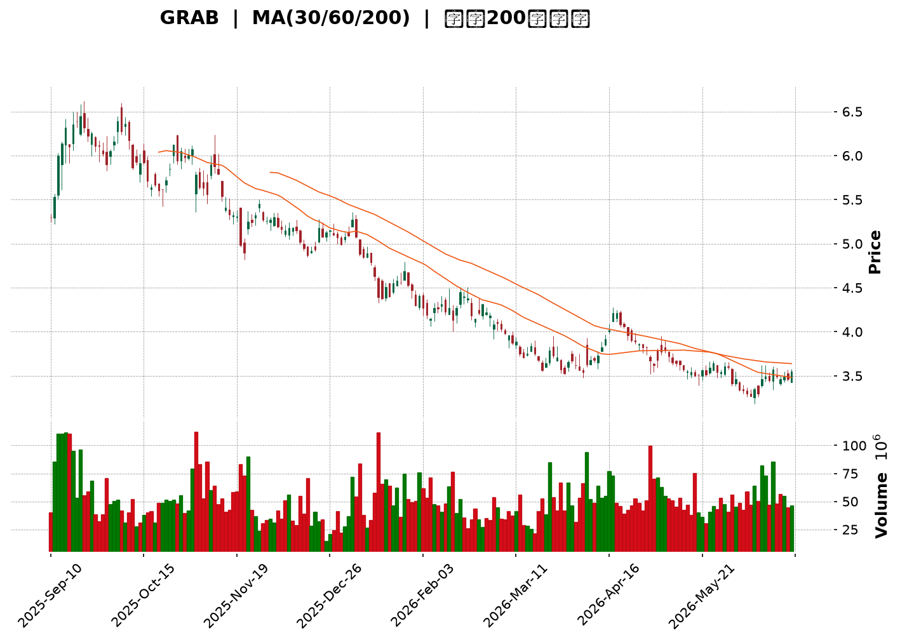
</details>

<html>
<head><meta charset="utf-8" /></head>
<body>
    <div style="height:500px; width:100%;">                        <script>window.PlotlyConfig = {MathJaxConfig: 'local'};</script>
        <script charset="utf-8" src="https://cdn.plot.ly/plotly-3.6.0.min.js" integrity="sha256-QaOVwtVY0T02VaHrr6pnoHLCwayMJp4O5n4YyaE3rJk=" crossorigin="anonymous"></script>                <div id="candlestick-chart" class="plotly-graph-div" style="height:100%; width:100%;"></div>            <script>                window.PLOTLYENV=window.PLOTLYENV || {};                                if (document.getElementById("candlestick-chart")) {                    Plotly.newPlot(                        "candlestick-chart",                        [{"close":{"dtype":"f8","bdata":"AAAAQDMzFUAAAABguB4WQAAAAAAAABhAAAAAIFyPGEAAAAAgrkcZQAAAAGBmZhhAAAAAYGZmGUAAAAAgXI8ZQAAAAMDMzBlAAAAAIK5HGUAAAACgR+EYQAAAAAAAABlAAAAA4KNwGEAAAADgo3AYQAAAAOB6FBhAAAAAoJmZF0AAAABAMzMYQAAAAADXoxhAAAAAIFyPGUAAAADgehQZQAAAAOCjcBlAAAAAgBSuGEAAAADgo3AXQAAAAOBRuBdAAAAAANejF0AAAACAFK4XQAAAAEAK1xZAAAAAIFyPFkAAAACAFK4WQAAAAGBmZhZAAAAAQOF6FkAAAACgR+EWQAAAAGBmZhdAAAAAQOF6GEAAAABgj8IXQAAAAEAzMxhAAAAAIIXrF0AAAACAPQoYQAAAACCuRxhAAAAAANcjF0AAAAAgXI8WQAAAAMAehRZAAAAAoHA9FkAAAACgmZkXQAAAAMAehRdAAAAAwPUoF0AAAADA9SgWQAAAAADXoxVAAAAAgOtRFUAAAAAgrkcVQAAAAKBwPRVAAAAAIIXrE0AAAACgmZkTQAAAAAAAABVAAAAAgML1FEAAAAAgrkcVQAAAAMDMzBVAAAAA4HoUFUAAAACAPQoVQAAAAOB6FBVAAAAAQDMzFUAAAABgj8IUQAAAAADXoxRAAAAAoJmZFEAAAADgUbgUQAAAAOBRuBRAAAAAoJmZFEAAAADgehQUQAAAAMDMzBNAAAAAQOF6E0AAAACAFK4TQAAAAOBRuBNAAAAA4FG4FEAAAACA61EUQAAAAMAehRRAAAAAoJmZFEAAAABgZmYUQAAAACCuRxRAAAAAgML1E0AAAACA61EUQAAAAAApXBRAAAAA4HoUFUAAAACA61EUQAAAAMAehRNAAAAAYGZmE0AAAAAgXI8TQAAAAMD1KBNAAAAAwB6FEkAAAAAgXI8RQAAAAMAehRFAAAAAgD0KEkAAAACgmZkRQAAAAEAzMxJAAAAAgOtREkAAAACgcD0SQAAAAGCPwhJAAAAAYLgeEkAAAACgR+ERQAAAAEAzMxFAAAAAANejEUAAAADgehQRQAAAAGCPwhBAAAAAoJmZEEAAAADgehQRQAAAAIA9ChFAAAAAoHA9EUAAAAAghesQQAAAAOB6FBFAAAAAwB6FEEAAAADgehQRQAAAAMDMzBFAAAAAoJmZEUAAAADAHoURQAAAAOBRuBBAAAAAoJmZEEAAAABACtcQQAAAAKBwPRFAAAAAoEfhEEAAAADgUbgQQAAAAIDrURBAAAAAYGZmEEAAAABguB4QQAAAAEAK1w9AAAAAgBSuD0AAAACAwvUOQAAAAGC4Hg9AAAAAAAAADkAAAACAFK4NQAAAAAAAAA5AAAAA4FG4DkAAAAAAAAAOQAAAAOCjcA1AAAAAQOF6DEAAAABguB4NQAAAAIDrUQ5AAAAAQArXDUAAAACAFK4NQAAAACBcjwxAAAAAoHA9DEAAAAAgrkcNQAAAAAApXA1AAAAAgML1DEAAAABA4XoMQAAAAIDrUQxAAAAAgD0KDUAAAADgo3ANQAAAAOCjcA1AAAAAQArXDUAAAAAgXI8OQAAAAAApXA9AAAAA4HoUEEAAAABACtcQQAAAAEAK1xBAAAAAgOtREEAAAACgcD0QQAAAAIAUrg9AAAAAQDMzD0AAAABguB4PQAAAAKBH4Q5AAAAAIFyPDkAAAAAgXI8OQAAAAAApXA1AAAAAgML1DEAAAADgo3ANQAAAAMD1KA5AAAAAgOtRDkAAAABgj8INQAAAAEAzMw1AAAAAYLgeDUAAAACAPQoNQAAAACBcjwxAAAAAYGZmDEAAAACA61EMQAAAAAAAAAxAAAAA4HoUDEAAAABA4XoMQAAAAOB6FAxAAAAA4FG4DEAAAABguB4NQAAAAIDrUQxAAAAAgOtRDEAAAACgR+EMQAAAAMDMzAxAAAAAIK5HC0AAAACAFK4LQAAAAOBRuApAAAAAANejCkAAAABgZmYKQAAAAMD1KApAAAAAwMzMCkAAAABgZmYKQAAAAIAUrgtAAAAAIIXrC0AAAACgmZkLQAAAACBcjwxAAAAAIIXrC0AAAACAFK4LQAAAACCF6wtAAAAAgBSuC0AAAABgZmYMQA=="},"high":{"dtype":"f8","bdata":"AAAAAClcFUAAAAAgrkcWQAAAAGC4HhhAAAAAANejGEAAAACAFK4ZQAAAAMAehRhAAAAAAAAAGkAAAAAAAAAaQAAAAIDrURpAAAAAQOF6GkAAAADgUbgZQAAAAOB6FBlAAAAAoEfhGEAAAACAFK4YQAAAAKCZmRhAAAAAoEfhGEAAAAAgrkcYQAAAAKBH4RhAAAAAIK7HGUAAAABgZmYaQAAAAECJwRlAAAAAoJmZGUAAAAAgXI8YQAAAACCuRxhAAAAA4HoUGEAAAAAgXI8YQAAAAIDC9RdAAAAAQDOzFkAAAACAajwXQAAAAOBRuBZAAAAAQOF6FkAAAACAPQoXQAAAAMD1qBdAAAAAwB6FGEAAAACAwvUYQAAAAAApXBhAAAAAgOtRGEAAAACA61EYQAAAAIDCdRhAAAAAIK5HF0AAAADgo3AXQAAAAEAKVxdAAAAAwPUoF0AAAAAAAAAYQAAAAOCj8BhAAAAA4HoUGEAAAACgR+EWQAAAAGC4HhZAAAAA4HoUFkAAAACAwnUVQAAAAMAehRVAAAAAANejFUAAAACgcD0UQAAAAEDhehVAAAAAAClcFUAAAADgo3AVQAAAAAAAABZAAAAAQOF6FUAAAACgcD0VQAAAAEAzMxVAAAAAYGZmFUAAAABgZmYVQAAAACBcDxVAAAAAACncFEAAAACAwvUUQAAAAGCPwhRAAAAA4HoUFUAAAAAA16MUQAAAAEAzMxRAAAAAoEfhE0AAAACgR+ETQAAAAGC4HhRAAAAAYLgeFUAAAACAwvUUQAAAAKCZmRRAAAAAANejFEAAAAAghesUQAAAACBcjxRAAAAAAClcFEAAAADAHoUUQAAAAMDMzBRAAAAA4KNwFUAAAACA61EVQAAAAEAzMxRAAAAAoEfhE0AAAACgR+ETQAAAAKCZmRNAAAAAgD0KE0AAAADAHoUSQAAAAGBmZhJAAAAA4FE4EkAAAABAMzMSQAAAAGBmZhJAAAAAIFyPEkAAAACAFK4SQAAAAIAULhNAAAAA4FG4EkAAAADgUTgSQAAAAKBH4RFAAAAA4FG4EUAAAABgj8IRQAAAAEDhehFAAAAAANejEEAAAADAzEwRQAAAAAApXBFAAAAAYLieEUAAAAAgXI8RQAAAAIDC9RFAAAAA4FE4EUAAAABAMzMRQAAAAIA9ChJAAAAAQArXEUAAAADAHgUSQAAAAIA9ihFAAAAAoJmZEEAAAADAHoURQAAAACCuRxFAAAAAYLgeEUAAAACgR+EQQAAAAIA9ihBAAAAA4HqUEEAAAADAHoUQQAAAAMD1KBBAAAAAgBSuD0AAAAAAAAAQQAAAAMAehQ9AAAAAwMzMDkAAAABA4XoOQAAAAADXow5AAAAAgML1DkAAAABAMzMPQAAAAEAK1w1AAAAA4KNwDUAAAACAFK4NQAAAAADXow5AAAAAoJmZD0AAAADgUbgOQAAAAMAehQ1AAAAAgML1DEAAAADgo3ANQAAAAIDrUQ5AAAAAYI\u002fCDUAAAAAAAAAOQAAAAGCPwgxAAAAA4KNwD0AAAABACtcNQAAAAMDMzA1AAAAAoHA9DkAAAADgehQPQAAAAOBRuA9AAAAAAClcEEAAAABguB4RQAAAAAAAABFAAAAAgML1EEAAAADgo3AQQAAAAEAzMxBAAAAAwPUoEEAAAAAghesPQAAAAAAAAA9AAAAAIIXrDkAAAADgUbgOQAAAAKBH4Q1AAAAAQDMzDUAAAADgo3AOQAAAAKCZmQ9AAAAAQDMzD0AAAACgcD0OQAAAAOB6FA5AAAAA4KNwDUAAAADgo3ANQAAAAIDC9QxAAAAAIFyPDEAAAADAzMwMQAAAACBcjwxAAAAAgOkmDEAAAAAA16MMQAAAAIDC9QxAAAAAgOtRDUAAAAAAKVwNQAAAAIDC9QxAAAAAIFyPDEAAAAAgrkcNQAAAACCuRw1AAAAA4FG4DEAAAABgZmYMQAAAAMAehQtAAAAAQDMzC0AAAACAwvUKQAAAAMDMzApAAAAAgML1CkAAAABguB4LQAAAAIDC9QxAAAAAgML1DEAAAAAAKVwMQAAAAKBH4QxAAAAA4FG4DEAAAAAAAAAMQAAAAGBmZgxAAAAAIFyPDEAAAAAA16MMQA=="},"hovertemplate":"\u003cb\u003e%{x|%Y-%m-%d}\u003c\u002fb\u003e\u003cbr\u003e\u958b: $%{open:.2f}\u003cbr\u003e\u9ad8: $%{high:.2f}\u003cbr\u003e\u4f4e: $%{low:.2f}\u003cbr\u003e\u6536: $%{close:.2f}\u003cextra\u003e\u003c\u002fextra\u003e","low":{"dtype":"f8","bdata":"AAAAgML1FEAAAACgR+EUQAAAAIA9ChZAAAAA4KNwFkAAAAAA16MXQAAAAMD1qBdAAAAAoHA9GEAAAAAgrkcZQAAAAKBH4RhAAAAAgD0KGUAAAAAA16MYQAAAAIDC9RdAAAAAwPUoGEAAAADgUbgXQAAAAIDC9RdAAAAAgOtRF0AAAACgmZkXQAAAAKBwPRhAAAAAIFyPGEAAAACAwvUYQAAAACCF6xhAAAAAIK5HGEAAAAAAKVwXQAAAACBcjxdAAAAAwMzMFkAAAACgmZkXQAAAACBcjxZAAAAAwPUoFkAAAACgmZkWQAAAAMD1KBZAAAAAgBSuFUAAAACA61EWQAAAAOB6FBdAAAAAANejF0AAAACgmZkXQAAAAGBmZhdAAAAAgBSuF0AAAADAzMwXQAAAAKCZmRdAAAAA4KNwFUAAAABA4XoWQAAAAIAULhZAAAAAwMzMFUAAAAAghesWQAAAAEAzMxdAAAAAYLgeF0AAAAAghesVQAAAAOCjcBVAAAAA4HoUFUAAAACgR+EUQAAAAAAAABVAAAAAQArXE0AAAAAgrkcTQAAAACCFaxRAAAAAYI\u002fCFEAAAABACtcUQAAAAOCjcBVAAAAAAAAAFUAAAACgR+EUQAAAAKCZmRRAAAAAIK7HFEAAAADgUbgUQAAAAOCjcBRAAAAAgOtRFEAAAABAMzMUQAAAAKBHYRRAAAAA4KNwFEAAAACAwvUTQAAAAIAUrhNAAAAAYGZmE0AAAAAgXI8TQAAAAADXoxNAAAAAgD0KFEAAAAAgrkcUQAAAAGC4HhRAAAAAwMxMFEAAAACgR2EUQAAAAAAAABRAAAAAIIXrE0AAAACAPQoUQAAAAIDrURRAAAAAYI\u002fCFEAAAABgj0IUQAAAAOCjcBNAAAAAgOtRE0AAAAAAKVwTQAAAAAAAABNAAAAAgOtREkAAAACA61ERQAAAAOCjcBFAAAAAYGZmEUAAAAAgXI8RQAAAAOBRuBFAAAAA4HoUEkAAAADA9SgSQAAAAAApXBJAAAAAgD0KEkAAAADAHoURQAAAAMD1KBFAAAAAAAAAEUAAAADgUbgQQAAAAKCZmRBAAAAAoHA9EEAAAACAwnUQQAAAAEAK1xBAAAAAIIXrEEAAAABgj8IQQAAAAMDMzBBAAAAAAAAAEEAAAABgZmYQQAAAAOB6FBFAAAAAYI9CEUAAAACA61ERQAAAAMAehRBAAAAAQDMzEEAAAADgp8YQQAAAACBcjxBAAAAA4FG4EEAAAACgcD0QQAAAAAApXA9AAAAAgD0KEEAAAAAAAAAQQAAAAGCPwg9AAAAAwB6FDkAAAADAzMwOQAAAAEDheg5AAAAAYI\u002fCDUAAAACgmZkNQAAAAGCPwg1AAAAAwPUoDkAAAABACtcNQAAAACCuRw1AAAAAYGZmDEAAAADgUbgMQAAAAIDC9QxAAAAAoJmZDUAAAACA61ENQAAAAKBwPQxAAAAA4HoUDEAAAABgZmYMQAAAAGC4Hg1AAAAAANejDEAAAABA4XoMQAAAAEAK1wtAAAAAwMzMDEAAAACAwvUMQAAAAEAzMw1AAAAAANejDEAAAABgZDsOQAAAAIAUrg5AAAAAQArXD0AAAADgo3AQQAAAAOCjcBBAAAAAQDMzEEAAAADA9SgQQAAAAEAzMw9AAAAAgD0KD0AAAACgR+EOQAAAAIDrUQ5AAAAA4HoUDkAAAAAghesNQAAAAMD1KAxAAAAAgOtRDEAAAADgUbgMQAAAACCF6w1AAAAA4HoUDkAAAAAgrkcNQAAAAIDC9QxAAAAAoEfhDEAAAABA4XoMQAAAAGBmZgxAAAAAgBSuC0AAAABACtcLQAAAACCF6wtAAAAAYLgeC0AAAACgmZkLQAAAACCF6wtAAAAA4HoUDEAAAADgo3AMQAAAAEAK1wtAAAAAQArXC0AAAAAAAAAMQAAAACBcjwxAAAAAgD0KC0AAAACAPQoLQAAAAKCZmQpAAAAAYGZmCkAAAADgehQKQAAAAMD1KApAAAAA4KNwCUAAAADgehQKQAAAAIDC9QpAAAAAQOF6C0AAAADgo3ALQAAAAOBRuApAAAAAYI\u002fCC0AAAABguB4LQAAAAOCjcAtAAAAAwB6FC0AAAABgZmYLQA=="},"name":"\u50f9\u683c","open":{"dtype":"f8","bdata":"AAAAQDMzFUAAAADA9SgVQAAAAEAzMxZAAAAAoJmZF0AAAABA4XoYQAAAAMAehRhAAAAAgD2KGEAAAAAgXI8ZQAAAAEDh+hhAAAAAIIXrGUAAAABAMzMZQAAAAMAehRhAAAAAQArXGEAAAACAwnUYQAAAAKBwPRhAAAAAwPUoGEAAAACAwvUXQAAAAEDhehhAAAAAoJkZGUAAAABAMzMaQAAAAIDrURlAAAAAgD2KGUAAAABA4XoYQAAAAIDC9RdAAAAAwPUoF0AAAACgcD0YQAAAAMDMzBdAAAAAQOF6FkAAAADA9SgXQAAAAOBRuBZAAAAAQOF6FkAAAACAFK4WQAAAAKBHYRdAAAAAAAAAGEAAAAAghesYQAAAAGCPwhdAAAAAAAAAGEAAAACgR+EXQAAAAIA9ChhAAAAAYI9CFkAAAABgj0IXQAAAAMDMzBZAAAAAwMzMFkAAAACgmRkXQAAAACBcDxhAAAAAYGZmF0AAAABACtcWQAAAAMAehRVAAAAAgD2KFUAAAADgUTgVQAAAAEAzMxVAAAAAANejFUAAAACAPQoUQAAAAIAUrhRAAAAA4HoUFUAAAADA9SgVQAAAAADXoxVAAAAAIIVrFUAAAADAHgUVQAAAAIDC9RRAAAAAQArXFEAAAADA9SgVQAAAAGCPwhRAAAAAIIVrFEAAAABgZmYUQAAAAOB6lBRAAAAAYI\u002fCFEAAAACgmZkUQAAAAEDh+hNAAAAAoEfhE0AAAACgmZkTQAAAAKBH4RNAAAAA4HoUFEAAAACAFK4UQAAAAIDrURRAAAAAIFyPFEAAAABA4XoUQAAAAIDCdRRAAAAAIK5HFEAAAACAFC4UQAAAAMAehRRAAAAAYI\u002fCFEAAAABguB4VQAAAAEAzMxRAAAAAYI\u002fCE0AAAABgZmYTQAAAAKCZmRNAAAAAIIXrEkAAAADgo3ASQAAAAIDrURJAAAAAgD2KEUAAAABAMzMSQAAAAMDMzBFAAAAA4HoUEkAAAACgcD0SQAAAAAApXBJAAAAAgBSuEkAAAADA9SgSQAAAAIAUrhFAAAAAYLgeEUAAAADA9agRQAAAAIDrURFAAAAAwB6FEEAAAACgR+EQQAAAAGC4HhFAAAAAwPUoEUAAAADgo3ARQAAAAMDMzBBAAAAAgML1EEAAAABgj8IQQAAAAKBwPRFAAAAA4HqUEUAAAADgo3ARQAAAAMDMTBFAAAAA4KNwEEAAAAAAAAARQAAAAOBRuBBAAAAAwMzMEEAAAAAA16MQQAAAAGC4HhBAAAAA4KNwEEAAAAAAKVwQQAAAACBcDxBAAAAAIK5HD0AAAACAFK4PQAAAAMDMzA5AAAAAANejDkAAAABguB4OQAAAACCF6w1AAAAAoHA9DkAAAACgmZkOQAAAAGCPwg1AAAAAQDMzDUAAAADAzMwMQAAAAEAzMw1AAAAAANejDkAAAABgZmYNQAAAAOCjcA1AAAAA4FG4DEAAAADAzMwMQAAAAAAAAA5AAAAAgML1DEAAAACgR+EMQAAAAMAehQxAAAAAQArXDkAAAACAPQoNQAAAAKCZmQ1AAAAAQDMzDUAAAACgcD0OQAAAAMDMzA5AAAAAAAAAEEAAAABA4XoQQAAAAGC4nhBAAAAAoEfhEEAAAAAAKVwQQAAAAEAzMxBAAAAA4HoUEEAAAABAMzMPQAAAAMDMzA5AAAAAoEfhDkAAAAAgXI8OQAAAAOBRuA1AAAAA4HoUDUAAAAAAKVwOQAAAAMDMzA5AAAAAIFyPDkAAAADA9SgOQAAAAIAUrg1AAAAAAClcDUAAAAAAKVwNQAAAAIDC9QxAAAAAgOtRDEAAAABguB4MQAAAAIDrUQxAAAAA4HoUDEAAAAAAAAAMQAAAAEDhegxAAAAAIK5HDEAAAABA4XoMQAAAAIDC9QxAAAAAoHA9DEAAAADA9SgMQAAAAKBH4QxAAAAAANejDEAAAAAgrkcLQAAAAOCjcAtAAAAAYI\u002fCCkAAAAAA16MKQAAAAGBmZgpAAAAAAAAACkAAAABguB4LQAAAAGC4HgtAAAAAYI\u002fCC0AAAAAAAAAMQAAAAMAehQtAAAAAoBgEDEAAAAAgrkcLQAAAAADXowtAAAAAQDMzDEAAAABgZmYLQA=="},"x":["2025-09-10T00:00:00-04:00","2025-09-11T00:00:00-04:00","2025-09-12T00:00:00-04:00","2025-09-15T00:00:00-04:00","2025-09-16T00:00:00-04:00","2025-09-17T00:00:00-04:00","2025-09-18T00:00:00-04:00","2025-09-19T00:00:00-04:00","2025-09-22T00:00:00-04:00","2025-09-23T00:00:00-04:00","2025-09-24T00:00:00-04:00","2025-09-25T00:00:00-04:00","2025-09-26T00:00:00-04:00","2025-09-29T00:00:00-04:00","2025-09-30T00:00:00-04:00","2025-10-01T00:00:00-04:00","2025-10-02T00:00:00-04:00","2025-10-03T00:00:00-04:00","2025-10-06T00:00:00-04:00","2025-10-07T00:00:00-04:00","2025-10-08T00:00:00-04:00","2025-10-09T00:00:00-04:00","2025-10-10T00:00:00-04:00","2025-10-13T00:00:00-04:00","2025-10-14T00:00:00-04:00","2025-10-15T00:00:00-04:00","2025-10-16T00:00:00-04:00","2025-10-17T00:00:00-04:00","2025-10-20T00:00:00-04:00","2025-10-21T00:00:00-04:00","2025-10-22T00:00:00-04:00","2025-10-23T00:00:00-04:00","2025-10-24T00:00:00-04:00","2025-10-27T00:00:00-04:00","2025-10-28T00:00:00-04:00","2025-10-29T00:00:00-04:00","2025-10-30T00:00:00-04:00","2025-10-31T00:00:00-04:00","2025-11-03T00:00:00-05:00","2025-11-04T00:00:00-05:00","2025-11-05T00:00:00-05:00","2025-11-06T00:00:00-05:00","2025-11-07T00:00:00-05:00","2025-11-10T00:00:00-05:00","2025-11-11T00:00:00-05:00","2025-11-12T00:00:00-05:00","2025-11-13T00:00:00-05:00","2025-11-14T00:00:00-05:00","2025-11-17T00:00:00-05:00","2025-11-18T00:00:00-05:00","2025-11-19T00:00:00-05:00","2025-11-20T00:00:00-05:00","2025-11-21T00:00:00-05:00","2025-11-24T00:00:00-05:00","2025-11-25T00:00:00-05:00","2025-11-26T00:00:00-05:00","2025-11-28T00:00:00-05:00","2025-12-01T00:00:00-05:00","2025-12-02T00:00:00-05:00","2025-12-03T00:00:00-05:00","2025-12-04T00:00:00-05:00","2025-12-05T00:00:00-05:00","2025-12-08T00:00:00-05:00","2025-12-09T00:00:00-05:00","2025-12-10T00:00:00-05:00","2025-12-11T00:00:00-05:00","2025-12-12T00:00:00-05:00","2025-12-15T00:00:00-05:00","2025-12-16T00:00:00-05:00","2025-12-17T00:00:00-05:00","2025-12-18T00:00:00-05:00","2025-12-19T00:00:00-05:00","2025-12-22T00:00:00-05:00","2025-12-23T00:00:00-05:00","2025-12-24T00:00:00-05:00","2025-12-26T00:00:00-05:00","2025-12-29T00:00:00-05:00","2025-12-30T00:00:00-05:00","2025-12-31T00:00:00-05:00","2026-01-02T00:00:00-05:00","2026-01-05T00:00:00-05:00","2026-01-06T00:00:00-05:00","2026-01-07T00:00:00-05:00","2026-01-08T00:00:00-05:00","2026-01-09T00:00:00-05:00","2026-01-12T00:00:00-05:00","2026-01-13T00:00:00-05:00","2026-01-14T00:00:00-05:00","2026-01-15T00:00:00-05:00","2026-01-16T00:00:00-05:00","2026-01-20T00:00:00-05:00","2026-01-21T00:00:00-05:00","2026-01-22T00:00:00-05:00","2026-01-23T00:00:00-05:00","2026-01-26T00:00:00-05:00","2026-01-27T00:00:00-05:00","2026-01-28T00:00:00-05:00","2026-01-29T00:00:00-05:00","2026-01-30T00:00:00-05:00","2026-02-02T00:00:00-05:00","2026-02-03T00:00:00-05:00","2026-02-04T00:00:00-05:00","2026-02-05T00:00:00-05:00","2026-02-06T00:00:00-05:00","2026-02-09T00:00:00-05:00","2026-02-10T00:00:00-05:00","2026-02-11T00:00:00-05:00","2026-02-12T00:00:00-05:00","2026-02-13T00:00:00-05:00","2026-02-17T00:00:00-05:00","2026-02-18T00:00:00-05:00","2026-02-19T00:00:00-05:00","2026-02-20T00:00:00-05:00","2026-02-23T00:00:00-05:00","2026-02-24T00:00:00-05:00","2026-02-25T00:00:00-05:00","2026-02-26T00:00:00-05:00","2026-02-27T00:00:00-05:00","2026-03-02T00:00:00-05:00","2026-03-03T00:00:00-05:00","2026-03-04T00:00:00-05:00","2026-03-05T00:00:00-05:00","2026-03-06T00:00:00-05:00","2026-03-09T00:00:00-04:00","2026-03-10T00:00:00-04:00","2026-03-11T00:00:00-04:00","2026-03-12T00:00:00-04:00","2026-03-13T00:00:00-04:00","2026-03-16T00:00:00-04:00","2026-03-17T00:00:00-04:00","2026-03-18T00:00:00-04:00","2026-03-19T00:00:00-04:00","2026-03-20T00:00:00-04:00","2026-03-23T00:00:00-04:00","2026-03-24T00:00:00-04:00","2026-03-25T00:00:00-04:00","2026-03-26T00:00:00-04:00","2026-03-27T00:00:00-04:00","2026-03-30T00:00:00-04:00","2026-03-31T00:00:00-04:00","2026-04-01T00:00:00-04:00","2026-04-02T00:00:00-04:00","2026-04-06T00:00:00-04:00","2026-04-07T00:00:00-04:00","2026-04-08T00:00:00-04:00","2026-04-09T00:00:00-04:00","2026-04-10T00:00:00-04:00","2026-04-13T00:00:00-04:00","2026-04-14T00:00:00-04:00","2026-04-15T00:00:00-04:00","2026-04-16T00:00:00-04:00","2026-04-17T00:00:00-04:00","2026-04-20T00:00:00-04:00","2026-04-21T00:00:00-04:00","2026-04-22T00:00:00-04:00","2026-04-23T00:00:00-04:00","2026-04-24T00:00:00-04:00","2026-04-27T00:00:00-04:00","2026-04-28T00:00:00-04:00","2026-04-29T00:00:00-04:00","2026-04-30T00:00:00-04:00","2026-05-01T00:00:00-04:00","2026-05-04T00:00:00-04:00","2026-05-05T00:00:00-04:00","2026-05-06T00:00:00-04:00","2026-05-07T00:00:00-04:00","2026-05-08T00:00:00-04:00","2026-05-11T00:00:00-04:00","2026-05-12T00:00:00-04:00","2026-05-13T00:00:00-04:00","2026-05-14T00:00:00-04:00","2026-05-15T00:00:00-04:00","2026-05-18T00:00:00-04:00","2026-05-19T00:00:00-04:00","2026-05-20T00:00:00-04:00","2026-05-21T00:00:00-04:00","2026-05-22T00:00:00-04:00","2026-05-26T00:00:00-04:00","2026-05-27T00:00:00-04:00","2026-05-28T00:00:00-04:00","2026-05-29T00:00:00-04:00","2026-06-01T00:00:00-04:00","2026-06-02T00:00:00-04:00","2026-06-03T00:00:00-04:00","2026-06-04T00:00:00-04:00","2026-06-05T00:00:00-04:00","2026-06-08T00:00:00-04:00","2026-06-09T00:00:00-04:00","2026-06-10T00:00:00-04:00","2026-06-11T00:00:00-04:00","2026-06-12T00:00:00-04:00","2026-06-15T00:00:00-04:00","2026-06-16T00:00:00-04:00","2026-06-17T00:00:00-04:00","2026-06-18T00:00:00-04:00","2026-06-22T00:00:00-04:00","2026-06-23T00:00:00-04:00","2026-06-24T00:00:00-04:00","2026-06-25T00:00:00-04:00","2026-06-26T00:00:00-04:00"],"type":"candlestick"},{"hovertemplate":"MA30: $%{y:.2f}\u003cextra\u003e\u003c\u002fextra\u003e","line":{"color":"#2196F3","dash":"dash","width":2},"mode":"lines","name":"MA30","x":["2025-09-10T00:00:00-04:00","2025-09-11T00:00:00-04:00","2025-09-12T00:00:00-04:00","2025-09-15T00:00:00-04:00","2025-09-16T00:00:00-04:00","2025-09-17T00:00:00-04:00","2025-09-18T00:00:00-04:00","2025-09-19T00:00:00-04:00","2025-09-22T00:00:00-04:00","2025-09-23T00:00:00-04:00","2025-09-24T00:00:00-04:00","2025-09-25T00:00:00-04:00","2025-09-26T00:00:00-04:00","2025-09-29T00:00:00-04:00","2025-09-30T00:00:00-04:00","2025-10-01T00:00:00-04:00","2025-10-02T00:00:00-04:00","2025-10-03T00:00:00-04:00","2025-10-06T00:00:00-04:00","2025-10-07T00:00:00-04:00","2025-10-08T00:00:00-04:00","2025-10-09T00:00:00-04:00","2025-10-10T00:00:00-04:00","2025-10-13T00:00:00-04:00","2025-10-14T00:00:00-04:00","2025-10-15T00:00:00-04:00","2025-10-16T00:00:00-04:00","2025-10-17T00:00:00-04:00","2025-10-20T00:00:00-04:00","2025-10-21T00:00:00-04:00","2025-10-22T00:00:00-04:00","2025-10-23T00:00:00-04:00","2025-10-24T00:00:00-04:00","2025-10-27T00:00:00-04:00","2025-10-28T00:00:00-04:00","2025-10-29T00:00:00-04:00","2025-10-30T00:00:00-04:00","2025-10-31T00:00:00-04:00","2025-11-03T00:00:00-05:00","2025-11-04T00:00:00-05:00","2025-11-05T00:00:00-05:00","2025-11-06T00:00:00-05:00","2025-11-07T00:00:00-05:00","2025-11-10T00:00:00-05:00","2025-11-11T00:00:00-05:00","2025-11-12T00:00:00-05:00","2025-11-13T00:00:00-05:00","2025-11-14T00:00:00-05:00","2025-11-17T00:00:00-05:00","2025-11-18T00:00:00-05:00","2025-11-19T00:00:00-05:00","2025-11-20T00:00:00-05:00","2025-11-21T00:00:00-05:00","2025-11-24T00:00:00-05:00","2025-11-25T00:00:00-05:00","2025-11-26T00:00:00-05:00","2025-11-28T00:00:00-05:00","2025-12-01T00:00:00-05:00","2025-12-02T00:00:00-05:00","2025-12-03T00:00:00-05:00","2025-12-04T00:00:00-05:00","2025-12-05T00:00:00-05:00","2025-12-08T00:00:00-05:00","2025-12-09T00:00:00-05:00","2025-12-10T00:00:00-05:00","2025-12-11T00:00:00-05:00","2025-12-12T00:00:00-05:00","2025-12-15T00:00:00-05:00","2025-12-16T00:00:00-05:00","2025-12-17T00:00:00-05:00","2025-12-18T00:00:00-05:00","2025-12-19T00:00:00-05:00","2025-12-22T00:00:00-05:00","2025-12-23T00:00:00-05:00","2025-12-24T00:00:00-05:00","2025-12-26T00:00:00-05:00","2025-12-29T00:00:00-05:00","2025-12-30T00:00:00-05:00","2025-12-31T00:00:00-05:00","2026-01-02T00:00:00-05:00","2026-01-05T00:00:00-05:00","2026-01-06T00:00:00-05:00","2026-01-07T00:00:00-05:00","2026-01-08T00:00:00-05:00","2026-01-09T00:00:00-05:00","2026-01-12T00:00:00-05:00","2026-01-13T00:00:00-05:00","2026-01-14T00:00:00-05:00","2026-01-15T00:00:00-05:00","2026-01-16T00:00:00-05:00","2026-01-20T00:00:00-05:00","2026-01-21T00:00:00-05:00","2026-01-22T00:00:00-05:00","2026-01-23T00:00:00-05:00","2026-01-26T00:00:00-05:00","2026-01-27T00:00:00-05:00","2026-01-28T00:00:00-05:00","2026-01-29T00:00:00-05:00","2026-01-30T00:00:00-05:00","2026-02-02T00:00:00-05:00","2026-02-03T00:00:00-05:00","2026-02-04T00:00:00-05:00","2026-02-05T00:00:00-05:00","2026-02-06T00:00:00-05:00","2026-02-09T00:00:00-05:00","2026-02-10T00:00:00-05:00","2026-02-11T00:00:00-05:00","2026-02-12T00:00:00-05:00","2026-02-13T00:00:00-05:00","2026-02-17T00:00:00-05:00","2026-02-18T00:00:00-05:00","2026-02-19T00:00:00-05:00","2026-02-20T00:00:00-05:00","2026-02-23T00:00:00-05:00","2026-02-24T00:00:00-05:00","2026-02-25T00:00:00-05:00","2026-02-26T00:00:00-05:00","2026-02-27T00:00:00-05:00","2026-03-02T00:00:00-05:00","2026-03-03T00:00:00-05:00","2026-03-04T00:00:00-05:00","2026-03-05T00:00:00-05:00","2026-03-06T00:00:00-05:00","2026-03-09T00:00:00-04:00","2026-03-10T00:00:00-04:00","2026-03-11T00:00:00-04:00","2026-03-12T00:00:00-04:00","2026-03-13T00:00:00-04:00","2026-03-16T00:00:00-04:00","2026-03-17T00:00:00-04:00","2026-03-18T00:00:00-04:00","2026-03-19T00:00:00-04:00","2026-03-20T00:00:00-04:00","2026-03-23T00:00:00-04:00","2026-03-24T00:00:00-04:00","2026-03-25T00:00:00-04:00","2026-03-26T00:00:00-04:00","2026-03-27T00:00:00-04:00","2026-03-30T00:00:00-04:00","2026-03-31T00:00:00-04:00","2026-04-01T00:00:00-04:00","2026-04-02T00:00:00-04:00","2026-04-06T00:00:00-04:00","2026-04-07T00:00:00-04:00","2026-04-08T00:00:00-04:00","2026-04-09T00:00:00-04:00","2026-04-10T00:00:00-04:00","2026-04-13T00:00:00-04:00","2026-04-14T00:00:00-04:00","2026-04-15T00:00:00-04:00","2026-04-16T00:00:00-04:00","2026-04-17T00:00:00-04:00","2026-04-20T00:00:00-04:00","2026-04-21T00:00:00-04:00","2026-04-22T00:00:00-04:00","2026-04-23T00:00:00-04:00","2026-04-24T00:00:00-04:00","2026-04-27T00:00:00-04:00","2026-04-28T00:00:00-04:00","2026-04-29T00:00:00-04:00","2026-04-30T00:00:00-04:00","2026-05-01T00:00:00-04:00","2026-05-04T00:00:00-04:00","2026-05-05T00:00:00-04:00","2026-05-06T00:00:00-04:00","2026-05-07T00:00:00-04:00","2026-05-08T00:00:00-04:00","2026-05-11T00:00:00-04:00","2026-05-12T00:00:00-04:00","2026-05-13T00:00:00-04:00","2026-05-14T00:00:00-04:00","2026-05-15T00:00:00-04:00","2026-05-18T00:00:00-04:00","2026-05-19T00:00:00-04:00","2026-05-20T00:00:00-04:00","2026-05-21T00:00:00-04:00","2026-05-22T00:00:00-04:00","2026-05-26T00:00:00-04:00","2026-05-27T00:00:00-04:00","2026-05-28T00:00:00-04:00","2026-05-29T00:00:00-04:00","2026-06-01T00:00:00-04:00","2026-06-02T00:00:00-04:00","2026-06-03T00:00:00-04:00","2026-06-04T00:00:00-04:00","2026-06-05T00:00:00-04:00","2026-06-08T00:00:00-04:00","2026-06-09T00:00:00-04:00","2026-06-10T00:00:00-04:00","2026-06-11T00:00:00-04:00","2026-06-12T00:00:00-04:00","2026-06-15T00:00:00-04:00","2026-06-16T00:00:00-04:00","2026-06-17T00:00:00-04:00","2026-06-18T00:00:00-04:00","2026-06-22T00:00:00-04:00","2026-06-23T00:00:00-04:00","2026-06-24T00:00:00-04:00","2026-06-25T00:00:00-04:00","2026-06-26T00:00:00-04:00"],"y":{"dtype":"f8","bdata":"AAAAAAAA+H8AAAAAAAD4fwAAAAAAAPh\u002fAAAAAAAA+H8AAAAAAAD4fwAAAAAAAPh\u002fAAAAAAAA+H8AAAAAAAD4fwAAAAAAAPh\u002fAAAAAAAA+H8AAAAAAAD4fwAAAAAAAPh\u002fAAAAAAAA+H8AAAAAAAD4fwAAAAAAAPh\u002fAAAAAAAA+H8AAAAAAAD4fwAAAAAAAPh\u002fAAAAAAAA+H8AAAAAAAD4fwAAAAAAAPh\u002fAAAAAAAA+H8AAAAAAAD4fwAAAAAAAPh\u002fAAAAAAAA+H8AAAAAAAD4fwAAAAAAAPh\u002fAAAAAAAA+H8AAAAAAAD4f6uqqtpAJxhA3t3dDS0yGEC8u7tLqTgYQDMzM5OKMxhAAAAA0NsyGEAiIiJS4yUYQKuqqmouJBhA7+7uTo0XGEAiIiLSlAoYQFVVVVWc\u002fRdA3t3dbVnrF0AAAABQjdcXQLy7u6tjwhdAIiIisp2vF0AAAACwcqgXQJqZmVmroxdAd3d3J+qfF0BERES0gY4XQKuqqhrodBdA7+7urrlQF0BVVVV1TDAXQKuqqmp1DBdAmpmZCdfjFkDe3d1tEsMWQAAAAIDcqxZAMzMz8\u002f2UFkAiIiISg4AWQHd3dyejdxZAvLu7CwJrFkCamZlpA10WQERERNS\u002fURZAERERodNGFkC8u7trvDQWQLy7uxsvHRZA7+7uHhP8FUAzMzMjIuIVQFVVVfVvxBVA7+7uThuoFUDe3d2NUIYVQHd3d9cVYBVAMzMzc9pAFUDv7u7+RigVQM3MzExiEBVA7+7uzmkDFUCamZmJbOcUQAAAAPDSzRRAiYiIiPq3FEARERHB9agUQKuqqspanRRAMzMz07+RFEC8u7urjokUQImIiEgMghRAd3d3V\u002fKLFEBEREQ0F5IUQImIiBh2hRRAmpmZOSZ4FEAzMzPTeGkUQImIiKjxUhRAERERQRk9FEAzMzMTZx8UQDMzMyMGARRAMzMzAw\u002fmE0AzMzPjF8sTQBEREaFFthNARERE5NCiE0AAAABAp40TQBEREZHtfBNAzczM7MNnE0AzMzPz\u002fVQTQKuqqirOPhNAAAAAoBovE0BmZmbW6hgTQO\u002fu7p6o\u002fxJAiYiIWIDcEkBVVVV12sASQImIiEgooxJAAAAAQHyGEkAzMzMTymgSQBEREZF7TRJAZmZmxiAwEkAzMzPjehQSQKuqqnqi\u002fhFA3t3dTfDgEUDNzMycC8kRQKuqquomsRFAmpmZOUKZEUC8u7tLDIIRQN7d3f2pcRFAq6qqWqtjEUCJiIhYgFwRQHd3d+dCUhFAREREREREEUCJiIgoozcRQLy7u2suJBFAd3d3xwQPEUB3d3d3d\u002fcQQN7d3fUo3BBA7+7uNonBEEBEREQ8mKcQQKuqqkLSlBBAZmZmhl2BEEAiIiKynW8QQHd3dz81XhBAd3d3vxFKEECamZm5kDQQQM3MzMyFJBBA7+7urrkQEEBVVVW18\u002f0PQCIiIlIqzg9A7+7ujjSlD0CamZkJkHsPQN7d3Y1QRg9AAAAAEBERD0BVVVWFFtkOQGZmZrZlrQ5A3t3dDeaJDkAiIiKit2UOQGZmZpa1Og5AiYiIOEIZDkBERETErgAOQBEREZHC9Q1Ad3d3d0zwDUARERExlvwNQLy7u7tJDA5AIiIi4noUDkAAAABgcyEOQGZmZrY6Jg5Ad3d3J3gwDkAiIiLiwTwOQFVVVUVERA5A7+7uvuZCDkBVVVUVrkcOQCIiIlL\u002fRg5AVVVV5RdLDkAiIiLy0k0OQLy7u2t1TA5A7+7u\u002fo1QDkAiIiLCPFEOQM3MzNyyVg5AERERQTVeDkB3d3f3KFwOQGZmZlZVVQ5AAAAAAI5QDkCamZl5ME8OQM3MzGx1TA5AVVVVRUREDkDe3d0dEzwOQGZmZiZ4MA5AiYiIeOkmDkDv7u6+nxoOQDMzM8OuAA5Ad3d3J+rfDUBERERk9LYNQN7d3d1PjQ1AVVVVxZJfDUAzMzMDnTYNQJqZmblJDA1AAAAAQGDlDEAAAABAGb0MQBEREUHSlAxAiYiIaLx0DEAAAADAPFEMQLy7u7vmQgxAIiIi0gY6DEB3d3dHUyoMQGZmZgasHAxAVVVVJTEIDEARERFRcfYLQM3MzByF6wtAIiIiYjvfC0B3d3dHxdkLQA=="},"type":"scatter"},{"hovertemplate":"MA60: $%{y:.2f}\u003cextra\u003e\u003c\u002fextra\u003e","line":{"color":"#9C27B0","dash":"dash","width":2},"mode":"lines","name":"MA60","x":["2025-09-10T00:00:00-04:00","2025-09-11T00:00:00-04:00","2025-09-12T00:00:00-04:00","2025-09-15T00:00:00-04:00","2025-09-16T00:00:00-04:00","2025-09-17T00:00:00-04:00","2025-09-18T00:00:00-04:00","2025-09-19T00:00:00-04:00","2025-09-22T00:00:00-04:00","2025-09-23T00:00:00-04:00","2025-09-24T00:00:00-04:00","2025-09-25T00:00:00-04:00","2025-09-26T00:00:00-04:00","2025-09-29T00:00:00-04:00","2025-09-30T00:00:00-04:00","2025-10-01T00:00:00-04:00","2025-10-02T00:00:00-04:00","2025-10-03T00:00:00-04:00","2025-10-06T00:00:00-04:00","2025-10-07T00:00:00-04:00","2025-10-08T00:00:00-04:00","2025-10-09T00:00:00-04:00","2025-10-10T00:00:00-04:00","2025-10-13T00:00:00-04:00","2025-10-14T00:00:00-04:00","2025-10-15T00:00:00-04:00","2025-10-16T00:00:00-04:00","2025-10-17T00:00:00-04:00","2025-10-20T00:00:00-04:00","2025-10-21T00:00:00-04:00","2025-10-22T00:00:00-04:00","2025-10-23T00:00:00-04:00","2025-10-24T00:00:00-04:00","2025-10-27T00:00:00-04:00","2025-10-28T00:00:00-04:00","2025-10-29T00:00:00-04:00","2025-10-30T00:00:00-04:00","2025-10-31T00:00:00-04:00","2025-11-03T00:00:00-05:00","2025-11-04T00:00:00-05:00","2025-11-05T00:00:00-05:00","2025-11-06T00:00:00-05:00","2025-11-07T00:00:00-05:00","2025-11-10T00:00:00-05:00","2025-11-11T00:00:00-05:00","2025-11-12T00:00:00-05:00","2025-11-13T00:00:00-05:00","2025-11-14T00:00:00-05:00","2025-11-17T00:00:00-05:00","2025-11-18T00:00:00-05:00","2025-11-19T00:00:00-05:00","2025-11-20T00:00:00-05:00","2025-11-21T00:00:00-05:00","2025-11-24T00:00:00-05:00","2025-11-25T00:00:00-05:00","2025-11-26T00:00:00-05:00","2025-11-28T00:00:00-05:00","2025-12-01T00:00:00-05:00","2025-12-02T00:00:00-05:00","2025-12-03T00:00:00-05:00","2025-12-04T00:00:00-05:00","2025-12-05T00:00:00-05:00","2025-12-08T00:00:00-05:00","2025-12-09T00:00:00-05:00","2025-12-10T00:00:00-05:00","2025-12-11T00:00:00-05:00","2025-12-12T00:00:00-05:00","2025-12-15T00:00:00-05:00","2025-12-16T00:00:00-05:00","2025-12-17T00:00:00-05:00","2025-12-18T00:00:00-05:00","2025-12-19T00:00:00-05:00","2025-12-22T00:00:00-05:00","2025-12-23T00:00:00-05:00","2025-12-24T00:00:00-05:00","2025-12-26T00:00:00-05:00","2025-12-29T00:00:00-05:00","2025-12-30T00:00:00-05:00","2025-12-31T00:00:00-05:00","2026-01-02T00:00:00-05:00","2026-01-05T00:00:00-05:00","2026-01-06T00:00:00-05:00","2026-01-07T00:00:00-05:00","2026-01-08T00:00:00-05:00","2026-01-09T00:00:00-05:00","2026-01-12T00:00:00-05:00","2026-01-13T00:00:00-05:00","2026-01-14T00:00:00-05:00","2026-01-15T00:00:00-05:00","2026-01-16T00:00:00-05:00","2026-01-20T00:00:00-05:00","2026-01-21T00:00:00-05:00","2026-01-22T00:00:00-05:00","2026-01-23T00:00:00-05:00","2026-01-26T00:00:00-05:00","2026-01-27T00:00:00-05:00","2026-01-28T00:00:00-05:00","2026-01-29T00:00:00-05:00","2026-01-30T00:00:00-05:00","2026-02-02T00:00:00-05:00","2026-02-03T00:00:00-05:00","2026-02-04T00:00:00-05:00","2026-02-05T00:00:00-05:00","2026-02-06T00:00:00-05:00","2026-02-09T00:00:00-05:00","2026-02-10T00:00:00-05:00","2026-02-11T00:00:00-05:00","2026-02-12T00:00:00-05:00","2026-02-13T00:00:00-05:00","2026-02-17T00:00:00-05:00","2026-02-18T00:00:00-05:00","2026-02-19T00:00:00-05:00","2026-02-20T00:00:00-05:00","2026-02-23T00:00:00-05:00","2026-02-24T00:00:00-05:00","2026-02-25T00:00:00-05:00","2026-02-26T00:00:00-05:00","2026-02-27T00:00:00-05:00","2026-03-02T00:00:00-05:00","2026-03-03T00:00:00-05:00","2026-03-04T00:00:00-05:00","2026-03-05T00:00:00-05:00","2026-03-06T00:00:00-05:00","2026-03-09T00:00:00-04:00","2026-03-10T00:00:00-04:00","2026-03-11T00:00:00-04:00","2026-03-12T00:00:00-04:00","2026-03-13T00:00:00-04:00","2026-03-16T00:00:00-04:00","2026-03-17T00:00:00-04:00","2026-03-18T00:00:00-04:00","2026-03-19T00:00:00-04:00","2026-03-20T00:00:00-04:00","2026-03-23T00:00:00-04:00","2026-03-24T00:00:00-04:00","2026-03-25T00:00:00-04:00","2026-03-26T00:00:00-04:00","2026-03-27T00:00:00-04:00","2026-03-30T00:00:00-04:00","2026-03-31T00:00:00-04:00","2026-04-01T00:00:00-04:00","2026-04-02T00:00:00-04:00","2026-04-06T00:00:00-04:00","2026-04-07T00:00:00-04:00","2026-04-08T00:00:00-04:00","2026-04-09T00:00:00-04:00","2026-04-10T00:00:00-04:00","2026-04-13T00:00:00-04:00","2026-04-14T00:00:00-04:00","2026-04-15T00:00:00-04:00","2026-04-16T00:00:00-04:00","2026-04-17T00:00:00-04:00","2026-04-20T00:00:00-04:00","2026-04-21T00:00:00-04:00","2026-04-22T00:00:00-04:00","2026-04-23T00:00:00-04:00","2026-04-24T00:00:00-04:00","2026-04-27T00:00:00-04:00","2026-04-28T00:00:00-04:00","2026-04-29T00:00:00-04:00","2026-04-30T00:00:00-04:00","2026-05-01T00:00:00-04:00","2026-05-04T00:00:00-04:00","2026-05-05T00:00:00-04:00","2026-05-06T00:00:00-04:00","2026-05-07T00:00:00-04:00","2026-05-08T00:00:00-04:00","2026-05-11T00:00:00-04:00","2026-05-12T00:00:00-04:00","2026-05-13T00:00:00-04:00","2026-05-14T00:00:00-04:00","2026-05-15T00:00:00-04:00","2026-05-18T00:00:00-04:00","2026-05-19T00:00:00-04:00","2026-05-20T00:00:00-04:00","2026-05-21T00:00:00-04:00","2026-05-22T00:00:00-04:00","2026-05-26T00:00:00-04:00","2026-05-27T00:00:00-04:00","2026-05-28T00:00:00-04:00","2026-05-29T00:00:00-04:00","2026-06-01T00:00:00-04:00","2026-06-02T00:00:00-04:00","2026-06-03T00:00:00-04:00","2026-06-04T00:00:00-04:00","2026-06-05T00:00:00-04:00","2026-06-08T00:00:00-04:00","2026-06-09T00:00:00-04:00","2026-06-10T00:00:00-04:00","2026-06-11T00:00:00-04:00","2026-06-12T00:00:00-04:00","2026-06-15T00:00:00-04:00","2026-06-16T00:00:00-04:00","2026-06-17T00:00:00-04:00","2026-06-18T00:00:00-04:00","2026-06-22T00:00:00-04:00","2026-06-23T00:00:00-04:00","2026-06-24T00:00:00-04:00","2026-06-25T00:00:00-04:00","2026-06-26T00:00:00-04:00"],"y":{"dtype":"f8","bdata":"AAAAAAAA+H8AAAAAAAD4fwAAAAAAAPh\u002fAAAAAAAA+H8AAAAAAAD4fwAAAAAAAPh\u002fAAAAAAAA+H8AAAAAAAD4fwAAAAAAAPh\u002fAAAAAAAA+H8AAAAAAAD4fwAAAAAAAPh\u002fAAAAAAAA+H8AAAAAAAD4fwAAAAAAAPh\u002fAAAAAAAA+H8AAAAAAAD4fwAAAAAAAPh\u002fAAAAAAAA+H8AAAAAAAD4fwAAAAAAAPh\u002fAAAAAAAA+H8AAAAAAAD4fwAAAAAAAPh\u002fAAAAAAAA+H8AAAAAAAD4fwAAAAAAAPh\u002fAAAAAAAA+H8AAAAAAAD4fwAAAAAAAPh\u002fAAAAAAAA+H8AAAAAAAD4fwAAAAAAAPh\u002fAAAAAAAA+H8AAAAAAAD4fwAAAAAAAPh\u002fAAAAAAAA+H8AAAAAAAD4fwAAAAAAAPh\u002fAAAAAAAA+H8AAAAAAAD4fwAAAAAAAPh\u002fAAAAAAAA+H8AAAAAAAD4fwAAAAAAAPh\u002fAAAAAAAA+H8AAAAAAAD4fwAAAAAAAPh\u002fAAAAAAAA+H8AAAAAAAD4fwAAAAAAAPh\u002fAAAAAAAA+H8AAAAAAAD4fwAAAAAAAPh\u002fAAAAAAAA+H8AAAAAAAD4fwAAAAAAAPh\u002fAAAAAAAA+H8AAAAAAAD4f3d3d1eAPBdAd3d3V4A8F0C8u7vbsjYXQHd3d9dcKBdAd3d3d3cXF0Crqqq6AgQXQAAAADBP9BZA7+7uTtTfFkAAAACwcsgWQGZmZhbZrhZAiYiI8BmWFkB3d3cn6n8WQERERPxiaRZAiYiIwINZFkDNzMyc70cWQM3MzCS\u002fOBZAAAAAWPIrFkCrqqq6uxsWQKuqqnIhCRZAERERwTzxFUCJiIiQ7dwVQJqZmdlAxxVAiYiIsOS3FUARERHRlKoVQEREREypmBVAZmZmFpKGFUCrqqry\u002fXQVQAAAAGhKZRVAZmZmpg1UFUBmZmY+NT4VQLy7u\u002ftiKRVAIiIiUnEWFUB3d3cn6v8UQGZmZl666RRAmpmZAXLPFECamZmx5LcUQDMzM8OuoBRA3t3dne+HFECJiIhAp20UQBEREQFyTxRAmpmZifo3FECrqqrqmCAUQN7d3XUFCBRAvLu7E\u002fXvE0B3d3d\u002fI9QTQERERJx9uBNAREREZDufE0AiIiLq34gTQN7d3S1rdRNAzczMTPBgE0B3d3fHBE8TQJqZmWFXQBNAq6qqUnE2E0CJiIhokS0TQJqZmYFOGxNAmpmZObQIE0B3d3ePwvUSQDMzM9NN4hJA3t3dTWLQEkDe3d21870SQFVVVYWkqRJAvLu7oymVEkDe3d2FXYESQGZmZgY6bRJA3t3d1epYEkC8u7tbj0ISQHd3d0OLLBJA3t3dkaYUEkC8u7sXS\u002f4RQKuqqjbQ6RFAMzMzEzzYEUBERERERMQRQDMzM+\u002furhFAAAAADEmTEUB3d3eXtXoRQKuqqgrXYxFAd3d395pLEUDv7u724TMRQBEREV1IGhFA7+7uhl0BEUAAAAB0IekQQM3MzGDl0BBA7+7uary0EEC8u7tvy5oQQO\u002fu7uLsgxBAREREoBpvEEBmZmYOdFoQQImIiGSCRxBAd3d3OyY4EEBVVVXday4QQAAAABiSJhBAAAAAQDUeEECJiIgg9xoQQM3MzKQpFRBAREREHKEMEEC8u7uTGAQQQBEREVFG7w9Aq6qqSsXZD0BVVVUt+cUPQFVVVWX0tg9A3t3d5dCiD0DNzMy8dJMPQImIiOi0gQ9AIiIisp1vD0CrqqoyelsPQKuqqoLASg9AZmZmrgA5D0C8u7s7mCcPQHd3d5duEg9AAAAA6LQBD0CJiIiA3OsOQCIiIvLSzQ5AAAAAiM+wDkB3d3d\u002fI5QOQJqZmZHtfA5AmpmZKRVnDkAAAABg5VAOQGZmZt6WNQ5AiYiI2BUgDkCamZlBpw0OQCIiIqo4+w1Ad3d3TxvoDUCrqqpKxdkNQM3MzMzMzA1AvLu70wa6DUCamZkxCKwNQAAAADhCmQ1AvLu7M+yKDUARERGR7XwNQDMzM0OLbA1AvLu7k9FbDUCrqqpqdUwNQO\u002fu7gbzRA1AvLu7W49CDUDNzMwcEzwNQBEREbmQNA1AIiIikl8sDUCamZkJ1yMNQM3MzPwbIQ1AmpmZUbgeDUB3d3cf9xoNQA=="},"type":"scatter"},{"hovertemplate":"MA200: $%{y:.2f}\u003cextra\u003e\u003c\u002fextra\u003e","line":{"color":"#FF6F00","dash":"solid","width":2},"mode":"lines","name":"MA200","x":["2025-09-10T00:00:00-04:00","2025-09-11T00:00:00-04:00","2025-09-12T00:00:00-04:00","2025-09-15T00:00:00-04:00","2025-09-16T00:00:00-04:00","2025-09-17T00:00:00-04:00","2025-09-18T00:00:00-04:00","2025-09-19T00:00:00-04:00","2025-09-22T00:00:00-04:00","2025-09-23T00:00:00-04:00","2025-09-24T00:00:00-04:00","2025-09-25T00:00:00-04:00","2025-09-26T00:00:00-04:00","2025-09-29T00:00:00-04:00","2025-09-30T00:00:00-04:00","2025-10-01T00:00:00-04:00","2025-10-02T00:00:00-04:00","2025-10-03T00:00:00-04:00","2025-10-06T00:00:00-04:00","2025-10-07T00:00:00-04:00","2025-10-08T00:00:00-04:00","2025-10-09T00:00:00-04:00","2025-10-10T00:00:00-04:00","2025-10-13T00:00:00-04:00","2025-10-14T00:00:00-04:00","2025-10-15T00:00:00-04:00","2025-10-16T00:00:00-04:00","2025-10-17T00:00:00-04:00","2025-10-20T00:00:00-04:00","2025-10-21T00:00:00-04:00","2025-10-22T00:00:00-04:00","2025-10-23T00:00:00-04:00","2025-10-24T00:00:00-04:00","2025-10-27T00:00:00-04:00","2025-10-28T00:00:00-04:00","2025-10-29T00:00:00-04:00","2025-10-30T00:00:00-04:00","2025-10-31T00:00:00-04:00","2025-11-03T00:00:00-05:00","2025-11-04T00:00:00-05:00","2025-11-05T00:00:00-05:00","2025-11-06T00:00:00-05:00","2025-11-07T00:00:00-05:00","2025-11-10T00:00:00-05:00","2025-11-11T00:00:00-05:00","2025-11-12T00:00:00-05:00","2025-11-13T00:00:00-05:00","2025-11-14T00:00:00-05:00","2025-11-17T00:00:00-05:00","2025-11-18T00:00:00-05:00","2025-11-19T00:00:00-05:00","2025-11-20T00:00:00-05:00","2025-11-21T00:00:00-05:00","2025-11-24T00:00:00-05:00","2025-11-25T00:00:00-05:00","2025-11-26T00:00:00-05:00","2025-11-28T00:00:00-05:00","2025-12-01T00:00:00-05:00","2025-12-02T00:00:00-05:00","2025-12-03T00:00:00-05:00","2025-12-04T00:00:00-05:00","2025-12-05T00:00:00-05:00","2025-12-08T00:00:00-05:00","2025-12-09T00:00:00-05:00","2025-12-10T00:00:00-05:00","2025-12-11T00:00:00-05:00","2025-12-12T00:00:00-05:00","2025-12-15T00:00:00-05:00","2025-12-16T00:00:00-05:00","2025-12-17T00:00:00-05:00","2025-12-18T00:00:00-05:00","2025-12-19T00:00:00-05:00","2025-12-22T00:00:00-05:00","2025-12-23T00:00:00-05:00","2025-12-24T00:00:00-05:00","2025-12-26T00:00:00-05:00","2025-12-29T00:00:00-05:00","2025-12-30T00:00:00-05:00","2025-12-31T00:00:00-05:00","2026-01-02T00:00:00-05:00","2026-01-05T00:00:00-05:00","2026-01-06T00:00:00-05:00","2026-01-07T00:00:00-05:00","2026-01-08T00:00:00-05:00","2026-01-09T00:00:00-05:00","2026-01-12T00:00:00-05:00","2026-01-13T00:00:00-05:00","2026-01-14T00:00:00-05:00","2026-01-15T00:00:00-05:00","2026-01-16T00:00:00-05:00","2026-01-20T00:00:00-05:00","2026-01-21T00:00:00-05:00","2026-01-22T00:00:00-05:00","2026-01-23T00:00:00-05:00","2026-01-26T00:00:00-05:00","2026-01-27T00:00:00-05:00","2026-01-28T00:00:00-05:00","2026-01-29T00:00:00-05:00","2026-01-30T00:00:00-05:00","2026-02-02T00:00:00-05:00","2026-02-03T00:00:00-05:00","2026-02-04T00:00:00-05:00","2026-02-05T00:00:00-05:00","2026-02-06T00:00:00-05:00","2026-02-09T00:00:00-05:00","2026-02-10T00:00:00-05:00","2026-02-11T00:00:00-05:00","2026-02-12T00:00:00-05:00","2026-02-13T00:00:00-05:00","2026-02-17T00:00:00-05:00","2026-02-18T00:00:00-05:00","2026-02-19T00:00:00-05:00","2026-02-20T00:00:00-05:00","2026-02-23T00:00:00-05:00","2026-02-24T00:00:00-05:00","2026-02-25T00:00:00-05:00","2026-02-26T00:00:00-05:00","2026-02-27T00:00:00-05:00","2026-03-02T00:00:00-05:00","2026-03-03T00:00:00-05:00","2026-03-04T00:00:00-05:00","2026-03-05T00:00:00-05:00","2026-03-06T00:00:00-05:00","2026-03-09T00:00:00-04:00","2026-03-10T00:00:00-04:00","2026-03-11T00:00:00-04:00","2026-03-12T00:00:00-04:00","2026-03-13T00:00:00-04:00","2026-03-16T00:00:00-04:00","2026-03-17T00:00:00-04:00","2026-03-18T00:00:00-04:00","2026-03-19T00:00:00-04:00","2026-03-20T00:00:00-04:00","2026-03-23T00:00:00-04:00","2026-03-24T00:00:00-04:00","2026-03-25T00:00:00-04:00","2026-03-26T00:00:00-04:00","2026-03-27T00:00:00-04:00","2026-03-30T00:00:00-04:00","2026-03-31T00:00:00-04:00","2026-04-01T00:00:00-04:00","2026-04-02T00:00:00-04:00","2026-04-06T00:00:00-04:00","2026-04-07T00:00:00-04:00","2026-04-08T00:00:00-04:00","2026-04-09T00:00:00-04:00","2026-04-10T00:00:00-04:00","2026-04-13T00:00:00-04:00","2026-04-14T00:00:00-04:00","2026-04-15T00:00:00-04:00","2026-04-16T00:00:00-04:00","2026-04-17T00:00:00-04:00","2026-04-20T00:00:00-04:00","2026-04-21T00:00:00-04:00","2026-04-22T00:00:00-04:00","2026-04-23T00:00:00-04:00","2026-04-24T00:00:00-04:00","2026-04-27T00:00:00-04:00","2026-04-28T00:00:00-04:00","2026-04-29T00:00:00-04:00","2026-04-30T00:00:00-04:00","2026-05-01T00:00:00-04:00","2026-05-04T00:00:00-04:00","2026-05-05T00:00:00-04:00","2026-05-06T00:00:00-04:00","2026-05-07T00:00:00-04:00","2026-05-08T00:00:00-04:00","2026-05-11T00:00:00-04:00","2026-05-12T00:00:00-04:00","2026-05-13T00:00:00-04:00","2026-05-14T00:00:00-04:00","2026-05-15T00:00:00-04:00","2026-05-18T00:00:00-04:00","2026-05-19T00:00:00-04:00","2026-05-20T00:00:00-04:00","2026-05-21T00:00:00-04:00","2026-05-22T00:00:00-04:00","2026-05-26T00:00:00-04:00","2026-05-27T00:00:00-04:00","2026-05-28T00:00:00-04:00","2026-05-29T00:00:00-04:00","2026-06-01T00:00:00-04:00","2026-06-02T00:00:00-04:00","2026-06-03T00:00:00-04:00","2026-06-04T00:00:00-04:00","2026-06-05T00:00:00-04:00","2026-06-08T00:00:00-04:00","2026-06-09T00:00:00-04:00","2026-06-10T00:00:00-04:00","2026-06-11T00:00:00-04:00","2026-06-12T00:00:00-04:00","2026-06-15T00:00:00-04:00","2026-06-16T00:00:00-04:00","2026-06-17T00:00:00-04:00","2026-06-18T00:00:00-04:00","2026-06-22T00:00:00-04:00","2026-06-23T00:00:00-04:00","2026-06-24T00:00:00-04:00","2026-06-25T00:00:00-04:00","2026-06-26T00:00:00-04:00"],"y":{"dtype":"f8","bdata":"AAAAAAAA+H8AAAAAAAD4fwAAAAAAAPh\u002fAAAAAAAA+H8AAAAAAAD4fwAAAAAAAPh\u002fAAAAAAAA+H8AAAAAAAD4fwAAAAAAAPh\u002fAAAAAAAA+H8AAAAAAAD4fwAAAAAAAPh\u002fAAAAAAAA+H8AAAAAAAD4fwAAAAAAAPh\u002fAAAAAAAA+H8AAAAAAAD4fwAAAAAAAPh\u002fAAAAAAAA+H8AAAAAAAD4fwAAAAAAAPh\u002fAAAAAAAA+H8AAAAAAAD4fwAAAAAAAPh\u002fAAAAAAAA+H8AAAAAAAD4fwAAAAAAAPh\u002fAAAAAAAA+H8AAAAAAAD4fwAAAAAAAPh\u002fAAAAAAAA+H8AAAAAAAD4fwAAAAAAAPh\u002fAAAAAAAA+H8AAAAAAAD4fwAAAAAAAPh\u002fAAAAAAAA+H8AAAAAAAD4fwAAAAAAAPh\u002fAAAAAAAA+H8AAAAAAAD4fwAAAAAAAPh\u002fAAAAAAAA+H8AAAAAAAD4fwAAAAAAAPh\u002fAAAAAAAA+H8AAAAAAAD4fwAAAAAAAPh\u002fAAAAAAAA+H8AAAAAAAD4fwAAAAAAAPh\u002fAAAAAAAA+H8AAAAAAAD4fwAAAAAAAPh\u002fAAAAAAAA+H8AAAAAAAD4fwAAAAAAAPh\u002fAAAAAAAA+H8AAAAAAAD4fwAAAAAAAPh\u002fAAAAAAAA+H8AAAAAAAD4fwAAAAAAAPh\u002fAAAAAAAA+H8AAAAAAAD4fwAAAAAAAPh\u002fAAAAAAAA+H8AAAAAAAD4fwAAAAAAAPh\u002fAAAAAAAA+H8AAAAAAAD4fwAAAAAAAPh\u002fAAAAAAAA+H8AAAAAAAD4fwAAAAAAAPh\u002fAAAAAAAA+H8AAAAAAAD4fwAAAAAAAPh\u002fAAAAAAAA+H8AAAAAAAD4fwAAAAAAAPh\u002fAAAAAAAA+H8AAAAAAAD4fwAAAAAAAPh\u002fAAAAAAAA+H8AAAAAAAD4fwAAAAAAAPh\u002fAAAAAAAA+H8AAAAAAAD4fwAAAAAAAPh\u002fAAAAAAAA+H8AAAAAAAD4fwAAAAAAAPh\u002fAAAAAAAA+H8AAAAAAAD4fwAAAAAAAPh\u002fAAAAAAAA+H8AAAAAAAD4fwAAAAAAAPh\u002fAAAAAAAA+H8AAAAAAAD4fwAAAAAAAPh\u002fAAAAAAAA+H8AAAAAAAD4fwAAAAAAAPh\u002fAAAAAAAA+H8AAAAAAAD4fwAAAAAAAPh\u002fAAAAAAAA+H8AAAAAAAD4fwAAAAAAAPh\u002fAAAAAAAA+H8AAAAAAAD4fwAAAAAAAPh\u002fAAAAAAAA+H8AAAAAAAD4fwAAAAAAAPh\u002fAAAAAAAA+H8AAAAAAAD4fwAAAAAAAPh\u002fAAAAAAAA+H8AAAAAAAD4fwAAAAAAAPh\u002fAAAAAAAA+H8AAAAAAAD4fwAAAAAAAPh\u002fAAAAAAAA+H8AAAAAAAD4fwAAAAAAAPh\u002fAAAAAAAA+H8AAAAAAAD4fwAAAAAAAPh\u002fAAAAAAAA+H8AAAAAAAD4fwAAAAAAAPh\u002fAAAAAAAA+H8AAAAAAAD4fwAAAAAAAPh\u002fAAAAAAAA+H8AAAAAAAD4fwAAAAAAAPh\u002fAAAAAAAA+H8AAAAAAAD4fwAAAAAAAPh\u002fAAAAAAAA+H8AAAAAAAD4fwAAAAAAAPh\u002fAAAAAAAA+H8AAAAAAAD4fwAAAAAAAPh\u002fAAAAAAAA+H8AAAAAAAD4fwAAAAAAAPh\u002fAAAAAAAA+H8AAAAAAAD4fwAAAAAAAPh\u002fAAAAAAAA+H8AAAAAAAD4fwAAAAAAAPh\u002fAAAAAAAA+H8AAAAAAAD4fwAAAAAAAPh\u002fAAAAAAAA+H8AAAAAAAD4fwAAAAAAAPh\u002fAAAAAAAA+H8AAAAAAAD4fwAAAAAAAPh\u002fAAAAAAAA+H8AAAAAAAD4fwAAAAAAAPh\u002fAAAAAAAA+H8AAAAAAAD4fwAAAAAAAPh\u002fAAAAAAAA+H8AAAAAAAD4fwAAAAAAAPh\u002fAAAAAAAA+H8AAAAAAAD4fwAAAAAAAPh\u002fAAAAAAAA+H8AAAAAAAD4fwAAAAAAAPh\u002fAAAAAAAA+H8AAAAAAAD4fwAAAAAAAPh\u002fAAAAAAAA+H8AAAAAAAD4fwAAAAAAAPh\u002fAAAAAAAA+H8AAAAAAAD4fwAAAAAAAPh\u002fAAAAAAAA+H8AAAAAAAD4fwAAAAAAAPh\u002fAAAAAAAA+H8AAAAAAAD4fwAAAAAAAPh\u002fAAAAAAAA+H+amZlJDHISQA=="},"type":"scatter"}],                        {"template":{"data":{"barpolar":[{"marker":{"line":{"color":"rgb(17,17,17)","width":0.5},"pattern":{"fillmode":"overlay","size":10,"solidity":0.2}},"type":"barpolar"}],"bar":[{"error_x":{"color":"#f2f5fa"},"error_y":{"color":"#f2f5fa"},"marker":{"line":{"color":"rgb(17,17,17)","width":0.5},"pattern":{"fillmode":"overlay","size":10,"solidity":0.2}},"type":"bar"}],"carpet":[{"aaxis":{"endlinecolor":"#A2B1C6","gridcolor":"#506784","linecolor":"#506784","minorgridcolor":"#506784","startlinecolor":"#A2B1C6"},"baxis":{"endlinecolor":"#A2B1C6","gridcolor":"#506784","linecolor":"#506784","minorgridcolor":"#506784","startlinecolor":"#A2B1C6"},"type":"carpet"}],"choropleth":[{"colorbar":{"outlinewidth":0,"ticks":""},"type":"choropleth"}],"contourcarpet":[{"colorbar":{"outlinewidth":0,"ticks":""},"type":"contourcarpet"}],"contour":[{"colorbar":{"outlinewidth":0,"ticks":""},"colorscale":[[0.0,"#0d0887"],[0.1111111111111111,"#46039f"],[0.2222222222222222,"#7201a8"],[0.3333333333333333,"#9c179e"],[0.4444444444444444,"#bd3786"],[0.5555555555555556,"#d8576b"],[0.6666666666666666,"#ed7953"],[0.7777777777777778,"#fb9f3a"],[0.8888888888888888,"#fdca26"],[1.0,"#f0f921"]],"type":"contour"}],"heatmap":[{"colorbar":{"outlinewidth":0,"ticks":""},"colorscale":[[0.0,"#0d0887"],[0.1111111111111111,"#46039f"],[0.2222222222222222,"#7201a8"],[0.3333333333333333,"#9c179e"],[0.4444444444444444,"#bd3786"],[0.5555555555555556,"#d8576b"],[0.6666666666666666,"#ed7953"],[0.7777777777777778,"#fb9f3a"],[0.8888888888888888,"#fdca26"],[1.0,"#f0f921"]],"type":"heatmap"}],"histogram2dcontour":[{"colorbar":{"outlinewidth":0,"ticks":""},"colorscale":[[0.0,"#0d0887"],[0.1111111111111111,"#46039f"],[0.2222222222222222,"#7201a8"],[0.3333333333333333,"#9c179e"],[0.4444444444444444,"#bd3786"],[0.5555555555555556,"#d8576b"],[0.6666666666666666,"#ed7953"],[0.7777777777777778,"#fb9f3a"],[0.8888888888888888,"#fdca26"],[1.0,"#f0f921"]],"type":"histogram2dcontour"}],"histogram2d":[{"colorbar":{"outlinewidth":0,"ticks":""},"colorscale":[[0.0,"#0d0887"],[0.1111111111111111,"#46039f"],[0.2222222222222222,"#7201a8"],[0.3333333333333333,"#9c179e"],[0.4444444444444444,"#bd3786"],[0.5555555555555556,"#d8576b"],[0.6666666666666666,"#ed7953"],[0.7777777777777778,"#fb9f3a"],[0.8888888888888888,"#fdca26"],[1.0,"#f0f921"]],"type":"histogram2d"}],"histogram":[{"marker":{"pattern":{"fillmode":"overlay","size":10,"solidity":0.2}},"type":"histogram"}],"mesh3d":[{"colorbar":{"outlinewidth":0,"ticks":""},"type":"mesh3d"}],"parcoords":[{"line":{"colorbar":{"outlinewidth":0,"ticks":""}},"type":"parcoords"}],"pie":[{"automargin":true,"type":"pie"}],"scatter3d":[{"line":{"colorbar":{"outlinewidth":0,"ticks":""}},"marker":{"colorbar":{"outlinewidth":0,"ticks":""}},"type":"scatter3d"}],"scattercarpet":[{"marker":{"colorbar":{"outlinewidth":0,"ticks":""}},"type":"scattercarpet"}],"scattergeo":[{"marker":{"colorbar":{"outlinewidth":0,"ticks":""}},"type":"scattergeo"}],"scattergl":[{"marker":{"line":{"color":"#283442"}},"type":"scattergl"}],"scattermapbox":[{"marker":{"colorbar":{"outlinewidth":0,"ticks":""}},"type":"scattermapbox"}],"scattermap":[{"marker":{"colorbar":{"outlinewidth":0,"ticks":""}},"type":"scattermap"}],"scatterpolargl":[{"marker":{"colorbar":{"outlinewidth":0,"ticks":""}},"type":"scatterpolargl"}],"scatterpolar":[{"marker":{"colorbar":{"outlinewidth":0,"ticks":""}},"type":"scatterpolar"}],"scatter":[{"marker":{"line":{"color":"#283442"}},"type":"scatter"}],"scatterternary":[{"marker":{"colorbar":{"outlinewidth":0,"ticks":""}},"type":"scatterternary"}],"surface":[{"colorbar":{"outlinewidth":0,"ticks":""},"colorscale":[[0.0,"#0d0887"],[0.1111111111111111,"#46039f"],[0.2222222222222222,"#7201a8"],[0.3333333333333333,"#9c179e"],[0.4444444444444444,"#bd3786"],[0.5555555555555556,"#d8576b"],[0.6666666666666666,"#ed7953"],[0.7777777777777778,"#fb9f3a"],[0.8888888888888888,"#fdca26"],[1.0,"#f0f921"]],"type":"surface"}],"table":[{"cells":{"fill":{"color":"#506784"},"line":{"color":"rgb(17,17,17)"}},"header":{"fill":{"color":"#2a3f5f"},"line":{"color":"rgb(17,17,17)"}},"type":"table"}]},"layout":{"annotationdefaults":{"arrowcolor":"#f2f5fa","arrowhead":0,"arrowwidth":1},"autotypenumbers":"strict","coloraxis":{"colorbar":{"outlinewidth":0,"ticks":""}},"colorscale":{"diverging":[[0,"#8e0152"],[0.1,"#c51b7d"],[0.2,"#de77ae"],[0.3,"#f1b6da"],[0.4,"#fde0ef"],[0.5,"#f7f7f7"],[0.6,"#e6f5d0"],[0.7,"#b8e186"],[0.8,"#7fbc41"],[0.9,"#4d9221"],[1,"#276419"]],"sequential":[[0.0,"#0d0887"],[0.1111111111111111,"#46039f"],[0.2222222222222222,"#7201a8"],[0.3333333333333333,"#9c179e"],[0.4444444444444444,"#bd3786"],[0.5555555555555556,"#d8576b"],[0.6666666666666666,"#ed7953"],[0.7777777777777778,"#fb9f3a"],[0.8888888888888888,"#fdca26"],[1.0,"#f0f921"]],"sequentialminus":[[0.0,"#0d0887"],[0.1111111111111111,"#46039f"],[0.2222222222222222,"#7201a8"],[0.3333333333333333,"#9c179e"],[0.4444444444444444,"#bd3786"],[0.5555555555555556,"#d8576b"],[0.6666666666666666,"#ed7953"],[0.7777777777777778,"#fb9f3a"],[0.8888888888888888,"#fdca26"],[1.0,"#f0f921"]]},"colorway":["#636efa","#EF553B","#00cc96","#ab63fa","#FFA15A","#19d3f3","#FF6692","#B6E880","#FF97FF","#FECB52"],"font":{"color":"#f2f5fa"},"geo":{"bgcolor":"rgb(17,17,17)","lakecolor":"rgb(17,17,17)","landcolor":"rgb(17,17,17)","showlakes":true,"showland":true,"subunitcolor":"#506784"},"hoverlabel":{"align":"left"},"hovermode":"closest","mapbox":{"style":"dark"},"paper_bgcolor":"rgb(17,17,17)","plot_bgcolor":"rgb(17,17,17)","polar":{"angularaxis":{"gridcolor":"#506784","linecolor":"#506784","ticks":""},"bgcolor":"rgb(17,17,17)","radialaxis":{"gridcolor":"#506784","linecolor":"#506784","ticks":""}},"scene":{"xaxis":{"backgroundcolor":"rgb(17,17,17)","gridcolor":"#506784","gridwidth":2,"linecolor":"#506784","showbackground":true,"ticks":"","zerolinecolor":"#C8D4E3"},"yaxis":{"backgroundcolor":"rgb(17,17,17)","gridcolor":"#506784","gridwidth":2,"linecolor":"#506784","showbackground":true,"ticks":"","zerolinecolor":"#C8D4E3"},"zaxis":{"backgroundcolor":"rgb(17,17,17)","gridcolor":"#506784","gridwidth":2,"linecolor":"#506784","showbackground":true,"ticks":"","zerolinecolor":"#C8D4E3"}},"shapedefaults":{"line":{"color":"#f2f5fa"}},"sliderdefaults":{"bgcolor":"#C8D4E3","bordercolor":"rgb(17,17,17)","borderwidth":1,"tickwidth":0},"ternary":{"aaxis":{"gridcolor":"#506784","linecolor":"#506784","ticks":""},"baxis":{"gridcolor":"#506784","linecolor":"#506784","ticks":""},"bgcolor":"rgb(17,17,17)","caxis":{"gridcolor":"#506784","linecolor":"#506784","ticks":""}},"title":{"x":0.05},"updatemenudefaults":{"bgcolor":"#506784","borderwidth":0},"xaxis":{"automargin":true,"gridcolor":"#283442","linecolor":"#506784","ticks":"","title":{"standoff":15},"zerolinecolor":"#283442","zerolinewidth":2},"yaxis":{"automargin":true,"gridcolor":"#283442","linecolor":"#506784","ticks":"","title":{"standoff":15},"zerolinecolor":"#283442","zerolinewidth":2}}},"xaxis":{"rangeslider":{"visible":false},"title":{"text":"\u65e5\u671f"}},"font":{"size":11},"title":{"text":"GRAB  |  MA(30\u002f60\u002f200)  |  \u6700\u8fd1200\u4ea4\u6613\u65e5"},"yaxis":{"title":{"text":"\u80a1\u50f9 (USD)"}},"hovermode":"x unified","height":500},                        {"responsive": true}                    )                };            </script>        </div>
</body>
</html>

# GRAB 技術分析報告

> **報告日期**：2026-06-27 ｜ **語言**：繁體中文 ｜ **數據來源**：提供數據 ｜ **當前價格**：$3.55

---

## 目錄

| 章節 | 內容 |
|------|------|
| [1. 技術面概覽](#1-技術面概覽) | 訊號儀表板、核心指標、評分卡 |
| [2. 趨勢分析](#2-趨勢分析) | 多時框趨勢、長中短期走勢 |
| [3. 圖表形態分析](#3-圖表形態分析) | 形態識別、K線組合、目標價 |
| [4. 支撐與阻力](#4-支撐與阻力) | 關鍵價位、斐波那契回調 |
| [5. 技術指標深度解讀](#5-技術指標深度解讀) | MA/RSI/MACD/布林/成交量 |
| [6. 動能與波動率](#6-動能與波動率) | 動能評估、ATR、Beta |
| [7. 多時框架總結](#7-多時框架總結) | 時框架評分矩陣 |
| [8. 交易策略建議](#8-交易策略建議) | 多空策略、風險報酬比 |
| [9. 風險提示與監控](#9-風險提示與監控) | 監控指標、風險場景 |

---

## 1. 技術面概覽

### 🎯 技術訊號儀表板

本儀表板匯總 GRAB 當前技術訊號，提供一目了然的多空傾向。

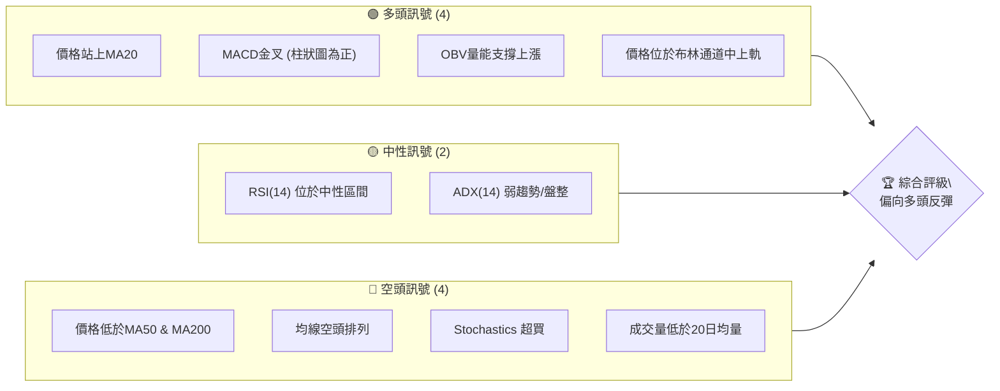
**解讀**：GRAB 目前呈現多空交織的訊號。短期內，價格成功站上 MA20，MACD 形成金叉，且 OBV 顯示量能支撐，這些都為多頭提供了短暫的動能。然而，中長期均線的空頭排列、Stochastics 的超買狀態以及弱勢的 ADX 均表明這可能只是長期下跌趨勢中的一次反彈，而非趨勢反轉。成交量不足也為反彈的持續性蒙上陰影。

### 📊 核心指標速覽表

下表彙整 GRAB 當前主要技術指標的數值與解讀。

| 指標類別 | 指標名稱 | 當前數值 | 訊號 | 解讀 |
|----------|----------|----------|------|------|
| **價格** | 當前價格 | $3.55 | 🟢 | 價格位於 MA20 上方，短期偏強 |
| **均線** | MA20 | $3.45 | 🟢 | 價格位於 MA20 上方 ($3.55 > $3.45) |
| **均線** | MA50 | $3.63 | 🔴 | 價格位於 MA50 下方 ($3.55 < $3.63) |
| **均線** | MA200 | $4.61 | 🔴 | 價格位於 MA200 下方 ($3.55 < $4.61) |
| **動能** | RSI(14) | 62.96 | 🟡 | 位於中性區間，但接近超買區 |
| **動能** | MACD | +0.025 (Hist) | 🟢 | MACD 線上穿 Signal 線，柱狀圖為正，看多 |
| **波動** | ATR(14) | $0.15 | 🟡 | 波動率適中，佔價格 4.30% |

### 🏆 技術評分卡

本評分卡從多個維度量化 GRAB 的技術面強度。

```
╔══════════════════════════════════════════════════════════════╗
║             技術評分卡 — GRAB (2026-06-27)                     ║
╠══════════════════════════════════════════════════════════════╣
║ 趨勢強度      ███░░░░░░░░░░░░░░░░░░  15/100  🔴 (弱勢空頭)       ║
║ 動能指標      ██████████░░░░░░░░░░  50/100  🟡 (短期反彈，長期承壓)║
║ 支撐穩定度    █████████████░░░░░░░  65/100  🟢 (接近52W低點，有較強支撐)║
║ 成交量配合    ████░░░░░░░░░░░░░░░░  20/100  🔴 (量能不足)       ║
║ 形態完整度    ██████░░░░░░░░░░░░░░  30/100  🟡 (短期整理，中長期不明顯)║
║ 均線排列      █░░░░░░░░░░░░░░░░░░░  5/100   🔴 (典型空頭排列)   ║
╠══════════════════════════════════════════════════════════════╣
║ 綜合評分      ████░░░░░░░░░░░░░░░░  35/100  🔴 偏空，短期有反彈機會║
╚══════════════════════════════════════════════════════════════╝
```
**評級結論**：GRAB 的綜合技術評分顯示其整體趨勢偏弱。雖然短期內出現一些反彈訊號，如動能指標的改善和價格在短期均線上方，但長期的空頭排列和弱勢的成交量表明這波反彈的持續性存疑。當前價格接近歷史低點，下方支撐相對穩定，但上方阻力重重。投資者應謹慎對待，關注反彈能否突破關鍵阻力。

---

## 2. 趨勢分析

### 🌐 多時框趨勢分析

本節從長期、中期到短期，層層遞進地分析 GRAB 的價格趨勢，以獲得全面的市場視角。

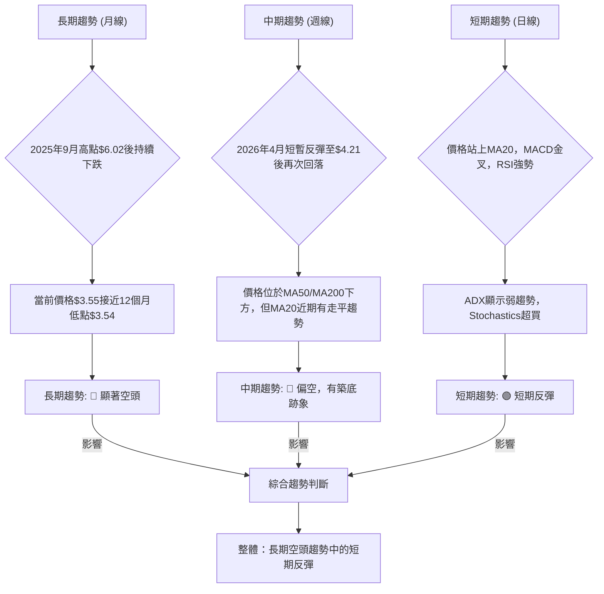
**分析**：
- **長期趨勢 (月線)**：GRAB 自 2025 年 9 月達到 $6.02 的高點後，便進入了明顯的下跌通道。直至 2026 年 5 月創下 $3.54 的 12 個月新低。當前價格 $3.55 僅略高於此低點，表明長期下行壓力巨大。
- **中期趨勢 (週線)**：在 2026 年初至 3 月經歷一波下跌後，4 月曾出現短暫反彈至 $4.21，但未能持續，隨後再次回落。目前價格仍遠低於中期均線 MA50 和 MA200，但短期均線 MA20 略有抬頭，顯示下跌動能有所減緩，可能處於築底或盤整階段。
- **短期趨勢 (日線)**：最近的價格行為顯示出短期反彈的跡象。價格已站上 MA20，MACD 形成金叉，RSI 也處於強勢區間。然而，Stochastics 已進入超買區域，且 ADX 顯示趨勢強度不足，表明這波反彈可能面臨回調壓力。

### 📈 長期趨勢 — 12個月走勢圖（Unicode）

以下是 GRAB 過去 12 個月的月線收盤價走勢圖，標註了關鍵高點和低點。

```
GRAB 月線走勢圖（過去12個月）
價格軸 ($)
$6.02 ┤                                ● (2025-09 高點)
$5.50 ┤                          ●
$5.00 ┤●         ●     ●
$4.50 ┤      ●         ●
$4.00 ┤                    ●
$3.50 ┤                                        ● (2026-06 現價)
$3.00 ┤                                        ● (2026-05 低點)
     └───────────────────────────────────────────────────────────
      25/06 25/07 25/08 25/09 25/10 25/11 25/12 26/01 26/02 26/03 26/04 26/05 26/06
```
**走勢特徵分析表格**：
| 期間 | 起始價 | 結束價 | 漲跌幅 | 走勢特徵 | 訊號 |
|------|--------|--------|--------|----------|------|
| 2025/06 - 2025/09 | $5.03 | $6.02 | +19.68% | 震盪上漲，創下12個月新高 | 🟢 |
| 2025/09 - 2026/03 | $6.02 | $3.66 | -39.18% | 顯著下跌，形成長期空頭趨勢 | 🔴 |
| 2026/03 - 2026/04 | $3.66 | $3.82 | +4.37% | 短暫反彈，未能改變大趨勢 | 🟡 |
| 2026/04 - 2026/05 | $3.82 | $3.54 | -7.26% | 再次回落，創12個月新低 | 🔴 |
| 2026/05 - 2026/06 | $3.54 | $3.55 | +0.28% | 底部盤整，小幅回升 | 🟡 |
**結論**：從 12 個月的走勢來看，GRAB 經歷了從 2025 年 9 月高點 $6.02 開始的漫長下跌，並在 2026 年 5 月觸及 $3.54 的低點。當前價格 $3.55 處於歷史低位，整體長期趨勢仍為空頭。

### 📊 中期趨勢（週線分析）

以下為 GRAB 近期主要壓力與支撐位示意圖，反映中期趨勢的結構。

```
GRAB 週線壓力與支撐示意圖
價格軸 ($)
$4.80 ┤                                     R4 (長期阻力 MA200)
$4.60 ┤                                     R3 (中期阻力 MA120)
$4.40 ┤
$4.20 ┤                      ●(26/04高點)    R2 (短期阻力)
$4.00 ┤
$3.80 ┤                                     R1 (中期阻力 MA50)
$3.60 ┤  ───────────────────現價$3.55───────────────────
$3.40 ┤                                     S1 (短期支撐 MA20)
$3.20 ┤                                     S2 (52W低點)
$3.00 ┤
     └───────────────────────────────────────────────────────────
```
**分析**：中期來看，GRAB 價格在 $3.55 附近徘徊。上方主要阻力來自於 MA50 ($3.63)、MA120 ($3.93) 以及 2026 年 4 月的反彈高點 $4.21。這些阻力位形成了一道道難以逾越的屏障。下方則有 MA20 ($3.45) 提供短期支撐，更重要的支撐位於 52 週低點 $3.18。價格目前在這些區間內震盪，顯示中期處於弱勢盤整格局。

### ⚡ 趨勢強度評估（ADX 解讀）

ADX 指標用於衡量趨勢的強度，而非方向。結合 +DI 和 -DI 可以判斷趨勢方向。

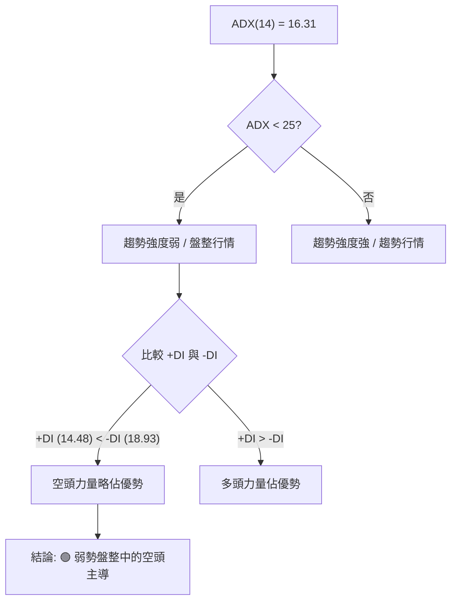
**ADX 強度對照表**：
| ADX 數值 | 趨勢強度 | 市場判斷 |
|----------|----------|----------|----------|
| 0-25     | 弱       | 盤整行情 / 無明顯趨勢 |
| 25-50    | 中等     | 趨勢行情 (強弱適中) |
| 50-75    | 強       | 強勁趨勢行情 |
| 75-100   | 極強     | 極端強勁趨勢行情 |
**解讀**：GRAB 的 ADX(14) 為 16.31，遠低於 25 的閾值，明確指示當前市場處於**弱趨勢或盤整行情**。這意味著無論是上漲還是下跌，都沒有足夠的動能來維持一個強勁的趨勢。在這種弱勢行情中，價格往往在特定區間內震盪。進一步觀察 +DI (14.48) 和 -DI (18.93)，由於 -DI 略高於 +DI，表明在當前弱勢盤整的格局中，**空頭力量仍略微佔據主導地位**。因此，儘管短期出現反彈，但其持續性仍需謹慎評估。

---

## 3. 圖表形態分析

### 🔍 形態識別系統

根據 GRAB 的歷史價格數據，目前尚未形成明確的長期反轉或延續形態。短期內，價格可能處於底部整理階段。

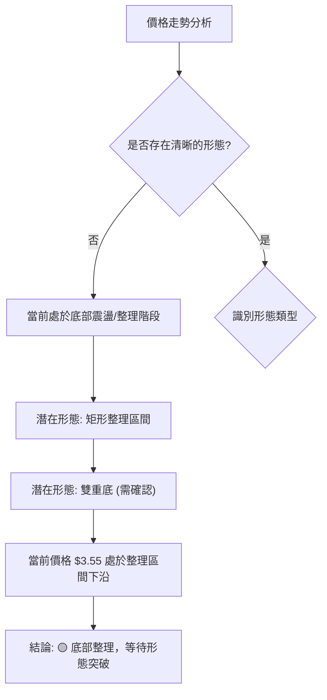
**分析**：從提供的數據來看，GRAB 在 2026 年 3 月底至 6 月底期間，價格主要在 $3.54 至 $3.82 之間震盪。這可能構成一個矩形整理區間，或者正在形成一個潛在的雙重底形態，但雙重底尚未得到明確確認（需要價格突破頸線）。目前價格位於整理區間的低位，若能有效向上突破，則雙重底的可能性增加。

### 🕯️ 重要K線形態分析

根據近 20 週的收盤價和技術數據，我們分析可能的 K 線形態。由於僅提供週收盤價，難以判斷單日 K 線形態，我們將專注於週線級別的價格行為模式。

| 月份 | 收盤價 | K線形態 (週線級別判斷) | 解讀 | 訊號 |
|------|--------|-----------------------|------|------|
| 2026-03-15 | $3.71 | 長陰線 (連續下跌) | 價格跌破關鍵支撐，空頭強勢 | 🔴 |
| 2026-03-22 | $3.56 | 錘子線/小實體線 | 價格觸及低位，可能存在買盤介入 | 🟡 |
| 2026-03-29 | $3.57 | 小陽線 (底部反彈) | 止跌回升，但量能不足 | 🟢 |
| 2026-04-19 | $4.21 | 大陽線 (強勁反彈) | 短期多頭力量強勁，但隨後未能守住 | 🟢 |
| 2026-05-10 | $3.72 | 長陰線 (跌破支撐) | 反彈失敗，再次向下探底 | 🔴 |
| 2026-05-17 | $3.55 | 錘子線/小陽線 | 再次觸及低點，有初步止跌跡象 | 🟡 |
| 2026-06-21 | $3.57 | 大陽線 (底部啟動) | 價格從低點反彈，顯示多頭力量介入 | 🟢 |
| 2026-06-28 | $3.55 | 小陰線 (高位整理) | 反彈後在高位震盪，多空僵持 | 🟡 |
**分析**：在 2026 年 3 月中旬至 5 月中旬，GRAB 經歷了幾次探底和反彈失敗。特別是 2026 年 5 月 17 日和 6 月 21 日的 K 線形態，顯示價格在 $3.54 附近獲得支撐後嘗試反彈。最近一週 (2026-06-28) 的小陰線，表明在 $3.57 反彈後，多頭動能有所減弱，進入高位整理，需觀察能否繼續向上突破。

### 📉 ASCII 走勢形態示意圖

以下為 GRAB 近期底部整理的形態示意圖，標注了潛在的雙重底結構。

```
GRAB 底部整理形態示意圖 (2026年3月 - 2026年6月)

價格軸 ($)
$4.30 ┤
$4.20 ┤                      高點 (R)
$4.10 ┤                      ▲
$4.00 ┤                     / \
$3.90 ┤                   /     \
$3.80 ┤                 /         \
$3.70 ┤               /             \
$3.60 ┤             /                 \
$3.50 ┤─────────Ｖ───────────────────Ｖ───────────────
$3.40 ┤         (S1)                (S2)
$3.30 ┤
     └───────────────────────────────────────────────────
      26/03             26/04             26/05             26/06
```
**分析**：從 2026 年 3 月底到 5 月中旬，GRAB 價格在 $3.54-$3.82 之間形成了一個潛在的底部整理區間。特別是 5 月 17 日和 6 月 7 日/14 日的低點，均在 $3.54-$3.30 區域獲得支撐，有形成雙重底 (Double Bottom) 的可能性。
- **第一個底部 (V1)**：約在 2026 年 3 月 22 日至 3 月 29 日，價格在 $3.56-$3.57 獲得支撐。
- **頸線 (Neckline)**：若以 2026 年 4 月 19 日的高點 $4.21 作為頸線，則需要價格有效突破此位。
- **第二個底部 (V2)**：約在 2026 年 5 月 17 日至 6 月 14 日，價格在 $3.30-$3.55 獲得支撐。
**結論**：目前 GRAB 正在嘗試形成第二個底部，並從 $3.30 的低點開始反彈。若能有效突破 $4.21 的頸線，則雙重底形態將確認成立，並預示更強勁的反轉。

### 🎯 形態目標價計算

基於潛在的雙重底形態進行目標價計算。
- **形態類型**：潛在雙重底 (尚未確認)
- **第一個底部低點 (V1)**：約 $3.56 (2026-03-22)
- **第二個底部低點 (V2)**：約 $3.30 (2026-06-14)
- **頸線 (Neckline)**：若以 2026 年 4 月 19 日的反彈高點 $4.21 作為頸線。
- **形態高度 (H)**：頸線 $4.21 - 最低點 $3.30 = $0.91

**計算方法**：雙重底形態的目標價通常是形態高度從頸線突破點向上疊加。
- **目標價 (Target Price)** = 頸線突破價 + 形態高度
- **目標價** = $4.21 + $0.91 = $5.12
**分析**：這個目標價 $5.12 是一個相對樂觀的預期，它假設雙重底形態能夠成功確認並突破頸線。在實際操作中，投資者應密切關注價格能否有效突破 $4.21 的頸線，並伴隨放大的成交量。在形態確認之前，這個目標價僅供參考。

---

## 4. 支撐與阻力

### 🗺️ 關鍵價位分布圖（Unicode）

以下是 GRAB 當前的價位結構分布圖，標示了重要的支撐與阻力位。

```
GRAB 價位結構分布圖 (2026-06-27)
═══════════════════════════════════════════════════
$6.02 ║████████████████████████║ 強阻力 R5 (12個月高點)
$5.07 ║████████████████████    ║ 阻力 R4 (斐波那契61.8%)
$4.78 ║████████████████████████║ 阻力 R3 (斐波那契50%)
$4.61 ║████████████████████    ║ 關鍵阻力 R2 (MA200)
$4.21 ║████████████████████████║ 關鍵阻力 R1 (26/04高點/形態頸線)
$3.65 ║▓▓▓▓▓▓▓▓▓▓▓▓▓▓▓▓        ║ 近期阻力 (布林上軌)
$3.63 ║▓▓▓▓▓▓▓▓▓▓▓▓▓▓▓▓        ║ 近期阻力 (MA50)
$3.55 ╠════════════════════════╣ ◄ 現價
$3.45 ║▓▓▓▓▓▓▓▓▓▓▓▓▓▓▓▓        ║ 近期支撐 S1 (MA20 / 布林中軌)
$3.24 ║████████████████████████║ 近期支撐 S2 (布林下軌)
$3.18 ║████████████████████    ║ 強支撐 S3 (52週低點)
═══════════════════════════════════════════════════
```
**分析**：GRAB 目前價格 $3.55 位於多重支撐和阻力之間。上方阻力密集，而下方支撐相對較為清晰。

### 🚧 阻力位分析表

| 阻力級別 | 價位 | 形成原因 | 突破難度 | 重要性 |
|----------|------|----------|----------|--------|
| 近期阻力 | $3.63 | MA50 | 中等 | 價格若能站穩此位，中期壓力將減輕 |
| 近期阻力 | $3.65 | 布林通道上軌 | 中等 | 短期反彈的上限，突破需量能配合 |
| 關鍵阻力 R1 | $4.21 | 2026年4月高點 / 潛在雙重底頸線 | 高 | 突破此位將確認底部形態，為重要轉折點 |
| 關鍵阻力 R2 | $4.61 | MA200 | 高 | 長期趨勢的關鍵分界線，突破意味長期趨勢反轉 |
| 阻力 R3 | $4.78 | 斐波那契 50% 回調位 | 高 | 重要的心理與技術阻力 |
| 阻力 R4 | $5.07 | 斐波那契 61.8% 回調位 | 高 | 強勁反彈後的關鍵阻力 |
| 強阻力 R5 | $6.02 | 2025年9月12個月高點 | 極高 | 歷史高點，短期內難以突破 |

### 🛡️ 支撐位分析表

| 支撐級別 | 價位 | 形成原因 | 守住機率 | 重要性 |
|----------|------|----------|----------|--------|
| 近期支撐 S1 | $3.45 | MA20 / 布林通道中軌 | 中等 | 短期反彈的第一道防線，若跌破可能回測更低點 |
| 近期支撐 S2 | $3.24 | 布林通道下軌 | 中等偏高 | 價格在布林通道內波動的下限，有較強支撐作用 |
| 強支撐 S3 | $3.18 | 52週低點 | 高 | 歷史低點附近，通常會有較強的買盤介入 |

### 📐 斐波那契回調位分析

我們以 2025 年 9 月的 12 個月高點 $6.02 為起點，2026 年 5 月的 12 個月低點 $3.54 為終點，計算其下跌波段的反彈斐波那契回調位。

- **高點 (Swing High)**：$6.02 (2025-09)
- **低點 (Swing Low)**：$3.54 (2026-05)
- **總跌幅**：$6.02 - $3.54 = $2.48

| 回調比例 | 價位計算 ($3.54 + 總跌幅 * 比例) | 價位 | 意義 |
|----------|---------------------------------|------|------|
| 23.6%    | $3.54 + ($2.48 * 0.236)          | $4.12 | 輕微反彈的目標位，接近 2026 年 4 月高點 |
| 38.2%    | $3.54 + ($2.48 * 0.382)          | $4.49 | 較為重要的反彈阻力位，需關注 |
| 50.0%    | $3.54 + ($2.48 * 0.500)          | $4.78 | 心理關口，若能突破通常代表反彈勢頭強勁 |
| 61.8%    | $3.54 + ($2.48 * 0.618)          | $5.07 | 黃金分割線，強勁反彈的關鍵阻力，突破意味趨勢可能反轉 |

**視覺化**：
```
GRAB 斐波那契回調示意圖 (基於 2025/09 高點 $6.02 至 2026/05 低點 $3.54)

價格軸 ($)
$6.02 ┤─────────────────● (高點)
$5.50 ┤
$5.07 ┤─R(61.8%)─────────────────
$4.78 ┤─R(50.0%)─────────────────
$4.49 ┤─R(38.2%)─────────────────
$4.12 ┤─R(23.6%)─────────────────
$3.55 ╠═════════════════════════╣ ◄ 現價
$3.54 ┤─────────────────● (低點)
     └───────────────────────────────────
```
**分析**：當前價格 $3.55 位於斐波那契回調區間的起點，顯示仍處於底部區域。若 GRAB 能夠啟動有效反彈，首先將面臨 $4.12 (23.6%) 的阻力，若能突破，則 $4.49 (38.2%) 和 $4.78 (50%) 將是更為重要的挑戰。這些斐波那契回調位是潛在的獲利了結點或趨勢反轉的確認點。

---

## 5. 技術指標深度解讀

### 🎛️ 指標訊號總覽

本 Mermaid 圖展示了各項技術指標當前的訊號關係及其對市場的影響。

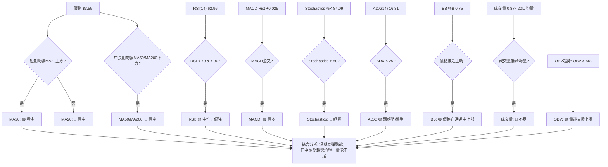

### 📈 移動平均線排列分析

GRAB 的移動平均線系統呈現典型的空頭排列，但短期均線有改善跡象。

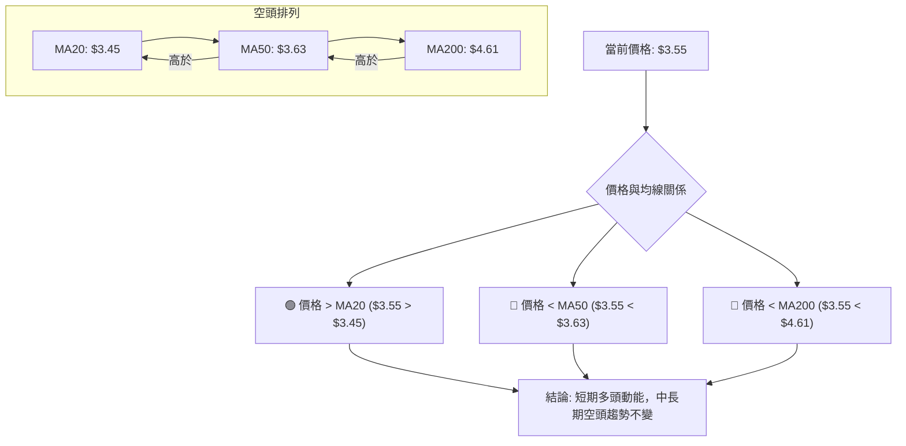
**分析**：GRAB 的 MA20 ($3.45) < MA50 ($3.63) < MA200 ($4.61)，這是一個標準的**空頭排列**，表明股票處於中長期下降趨勢中。然而，當前價格 $3.55 已經站上了短期均線 MA20，這是一個積極的短期訊號，顯示短期買盤力量正在介入，價格可能正在嘗試築底或進行短期反彈。但要改變整體空頭趨勢，價格需要進一步突破 MA50 和 MA200，並促使均線系統重新排列。

### 📉 RSI(14) 分析

RSI(14) 是衡量價格變動速度和變化的指標。

- **RSI 數值**：62.96
- **RSI 進度條**：████████████░░░░░░░░ (63%)
**分析**：當前 RSI(14) 數值為 62.96，位於傳統中性區間 (30-70) 的上限附近。這表示股票目前處於相對強勢的狀態，但尚未進入過度買入 (超買) 區域 (>70)。
- **超買超賣區間**：RSI 在 30 以下視為超賣，70 以上視為超買。GRAB 的 RSI 雖然未超買，但已接近 70，顯示短期反彈動能較強，若繼續上漲，可能很快進入超買區，面臨回調壓力。
- **背離判斷**：根據提供的數據，**無明顯背離**。在價格下跌過程中，RSI 並未出現明顯的底背離，表明之前的下跌是同步且有效的。近期反彈過程中，RSI 與價格同步上漲，也未見頂背離。

### 📊 MACD(12/26/9) 訊號解讀

MACD 是趨勢跟蹤動量指標，用於識別趨勢方向和強度。

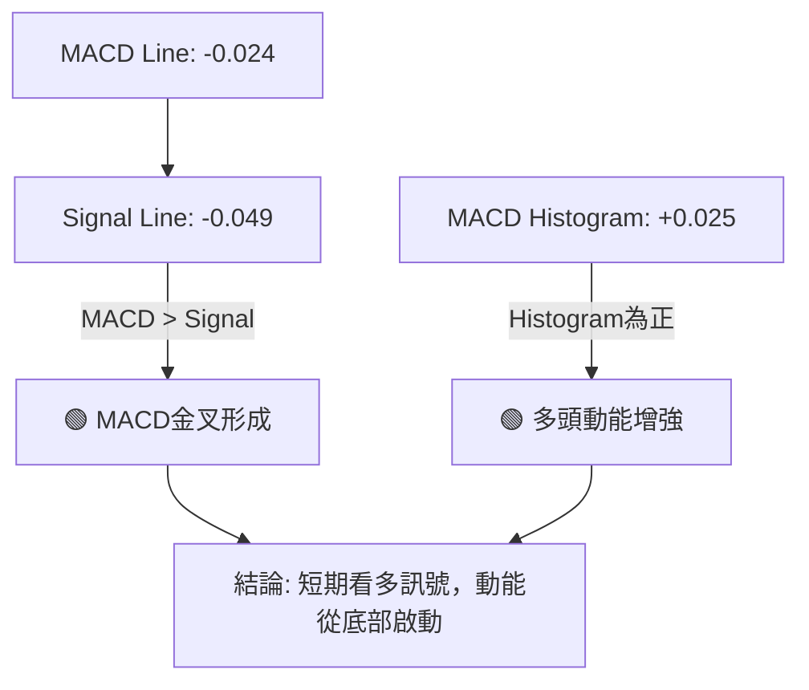
**分析**：
- **MACD 線 (-0.024)** **上穿** **Signal 線 (-0.049)**，形成**金叉**。這是一個明確的短期買入訊號，表示股票的短期動能正在超越長期動能，預示著價格可能進一步上漲。
- **MACD 柱狀圖 (+0.025)** 為正值，且從負值區域轉為正值，這進一步確認了金叉的有效性，表明多頭動能正在積聚並增強。
- **背離判斷**：根據提供的數據，**無明顯背離**。在近期價格從低點反彈的過程中，MACD 柱狀圖從負轉正，MACD 線上穿 Signal 線，與價格同步，未見底背離。

### 📦 布林通道分析

布林通道衡量價格的波動區間。

- **布林上軌**：$3.65
- **布林中軌 (MA20)**：$3.45
- **布林下軌**：$3.24
- **當前收盤價**：$3.55
- **BB %B**：0.75 (表示價格位於通道的 75% 處，即中軌和上軌之間)

**ASCII 布林通道示意圖**：
```
GRAB 布林通道示意圖 (2026-06-27)

價格軸 ($)
$3.70 ┤                                     
$3.65 ┤───────────────────上軌───────────────────
$3.60 ┤               ● (現價)
$3.55 ┤               │
$3.50 ┤               │
$3.45 ┤───────────────────中軌 (MA20)───────────────
$3.40 ┤
$3.30 ┤
$3.24 ┤───────────────────下軌───────────────────
$3.20 ┤
     └───────────────────────────────────────────────────
```
**分析**：當前 GRAB 的價格 $3.55 位於布林通道的中軌 ($3.45) 和上軌 ($3.65) 之間，BB %B 為 0.75，表明價格在通道內相對強勢。這與短期均線和 MACD 的多頭訊號一致，顯示價格短期正在向上測試壓力。若能突破上軌，可能引發一波加速上漲。若未能突破並回落跌破中軌，則可能再次測試下軌支撐。布林通道的寬度目前適中，ADX 也顯示趨勢不強，這暗示價格可能在通道內震盪，而不是單邊突破。

### 💹 成交量分析（量價配合度）

成交量是價格走勢的燃料，其變化對趨勢的確認至關重要。

- **最新成交量**：47,793,200
- **20日均量**：54,704,900
- **50日均量**：53,190,116
- **量比 (最新/20日均量)**：0.87x
- **OBV 趨勢**：OBV > MA → 量能支撐上漲

**分析**：
1.  **最新成交量與均量比較**：當前成交量 47,793,200 股，低於 20 日均量 (54,704,900 股) 和 50 日均量 (53,190,116 股)。量比為 0.87x，這表明**當前市場活躍度不高，交易量不足**。在價格從低點反彈的背景下，如果成交量未能有效放大，這波反彈的可靠性和持續性將受到質疑。**量價背離訊號**：價格上漲但成交量萎縮，這是潛在的看跌訊號，表明多頭追高意願不強，反彈可能缺乏堅實基礎。
2.  **OBV (能量潮) 趨勢**：數據顯示 "OBV > MA → 量能支撐上漲"。這表示儘管單日成交量偏低，但從累積成交量來看，OBV 仍處於上升趨勢或至少保持在高於其移動平均線的水平，暗示著資金正在悄悄流入，或至少在累積階段。這與單日量比的負面解讀形成對比，可能意味著有長期資金在低位吸籌，但短期追漲動能不足。
**綜合判斷**：GRAB 的量價關係呈現矛盾。短期日成交量萎縮，不利於反彈的持續性 (🔴)。但 OBV 趨勢顯示累積量能仍支撐上漲 (🟢)。這可能說明目前處於一個微妙的狀態：部分資金在低位吸籌，但市場整體追漲情緒不高，導致反彈缺乏爆發力。若要確認反彈，需看到成交量顯著放大。

---

## 6. 動能與波動率

### ⚡ 動能評估四象限

本節將 GRAB 的動能與波動率進行綜合評估，以判斷其所處的市場階段。

| 象限 | 動能 | 波動 | 當前狀態 | 評估 | 訊號 |
|------|------|------|----------|------|------|
| Q1 | 強 | 低 | - | 最佳機會 (趨勢穩定上漲) | 🟢 |
| Q2 | 弱 | 低 | - | 謹慎觀望 (盤整築底) | 🟡 |
| Q3 | 強 | 高 | - | 高風險高收益 (突破/反轉) | 🟡 |
| Q4 | 弱 | 高 | ✓ | 避免進場 (震盪尋底) | 🔴 |

**當前 GRAB 狀態評估**：
- **動能**：RSI 62.96 偏強，MACD 金叉，顯示短期動能從底部啟動。但 Stochastics 超買，長期均線空頭排列，整體動能強度仍受限。**評估為：中等偏弱**。
- **波動率**：ATR(14) 為 $0.15 (佔價格 4.30%)，ADX(14) 為 16.31 顯示弱趨勢/盤整。布林通道未見明顯擴張。**評估為：中等偏高** (相對於弱勢趨勢下的盤整，4.3%波動率不算低)。

**結論**：GRAB 目前的狀態更傾向於 **Q4 (弱動能，中等偏高波動率)** 或 **Q2 (弱動能，中等波動率)** 的邊緣。雖然短期動能有所回升，但整體趨勢強度弱，且波動率並未明顯收斂。這意味著市場仍處於尋底或底部震盪階段，缺乏明確的趨勢方向，投資風險較高。

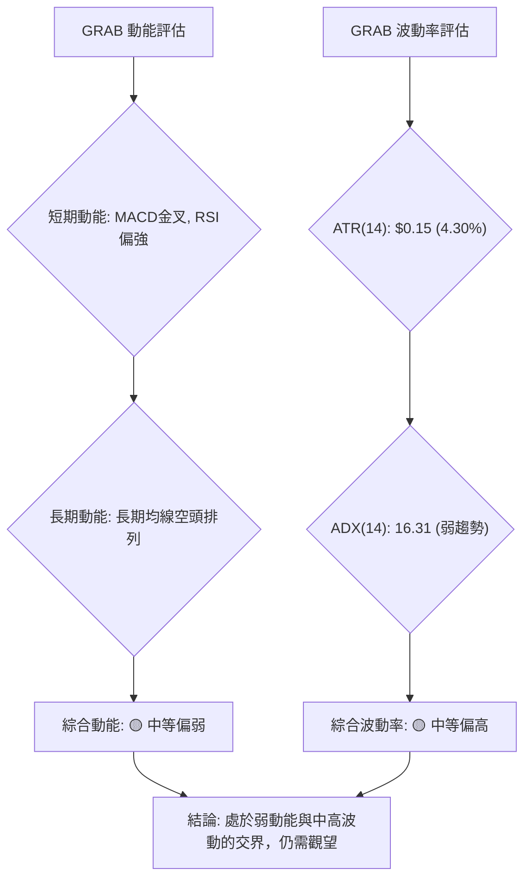

### 📊 ATR 波動率分析

平均真實波幅 (ATR) 用於衡量資產的波動性。

- **ATR(14)**：$0.15
- **佔價格比例**：$0.15 / $3.55 = 4.30%
**分析**：GRAB 的 ATR(14) 為 $0.15，佔當前價格的 4.30%。這是一個中等偏高的波動水平，尤其是在 ADX 顯示弱趨勢的情況下。
- **波動性判斷**：4.30% 的每日波動率對於一個盤整中的股票來說，意味著日內價格波動幅度不小，可能存在較多的假突破或快速反轉。這增加了短期交易的風險。
- **止損距離建議**：基於 ATR，保守的止損點通常設在 1.5 到 3 倍 ATR 之外。
    - **1.5 倍 ATR**：1.5 * $0.15 = $0.225
    - **2 倍 ATR**：2 * $0.15 = $0.30
    - **3 倍 ATR**：3 * $0.15 = $0.45
    若以當前價格 $3.55 計算，止損點可以考慮設在 $3.55 - $0.30 = $3.25 附近 (2倍 ATR)，這也接近布林通道下軌 ($3.24) 和 52 週低點 ($3.18)。

### 📐 Beta 與市場相關性

由於數據包中未提供 GRAB 的 Beta 值，我們將根據其產業和市場概況進行推斷性分析。
- **公司背景**：Grab Holdings Limited 是一家在東南亞運營的科技公司，提供超級應用服務，包括送餐、出行、支付等。這類公司通常具有較高的成長潛力，但也伴隨較高的波動性和市場敏感性。
- **產業特性**：科技行業，尤其是成長型科技股，通常具有較高的 Beta 值，因為它們對市場情緒和經濟前景的變化更為敏感。
- **推斷**：基於其科技屬性和在快速發展的新興市場（東南亞）的運營，GRAB 的 Beta 值很可能**大於 1**。這意味著 GRAB 的股價波動幅度可能大於整體市場。
**市場相關性影響**：
- **牛市時**：若市場整體上漲，GRAB 可能會以更快的速度上漲。
- **熊市時**：若市場整體下跌，GRAB 也可能以更快的速度下跌。
**結論**：投資者應當意識到 GRAB 可能具有較高的市場敏感性。在當前弱勢盤整的格局中，若市場出現任何負面消息或回調，GRAB 的股價可能會受到更大的衝擊。因此，在制定交易策略時，需充分考慮市場整體走勢的風險。

---

## 7. 多時框架總結

### 📋 時框架評分表

| 時框架 | 趨勢方向 | 動能 | 均線排列 | 形態 | 綜合評分 | 建議 |
|--------|----------|------|----------|------|----------|------|
| **長期** | 🔴 空頭趨勢 | 🔴 弱 | 🔴 空頭排列 | 🔴 下跌通道 | 2/10 | 遠離觀望 |
| **中期** | 🔴 偏空盤整 | 🟡 中性 | 🔴 空頭排列 | 🟡 底部整理 | 4/10 | 謹慎觀察 |
| **短期** | 🟢 反彈趨勢 | 🟢 強 | 🟡 價格站上MA20 | 🟢 潛在雙底 | 7/10 | 短線交易 |

### 🔲 綜合訊號矩陣

本矩陣展示了不同時框架下各項技術訊號的一致性，以判斷整體市場偏好。

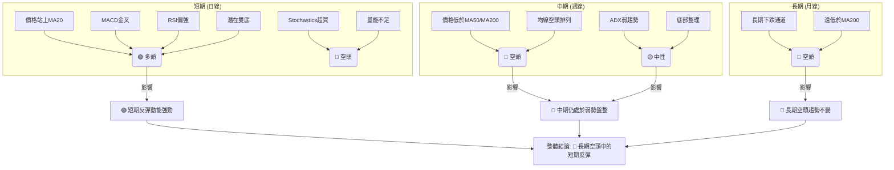
**分析**：
- **短期**：多頭訊號佔優，價格站上短期均線，MACD 金叉，RSI 偏強，並有潛在雙底形態。但 Stochastics 超買和量能不足提醒短線可能面臨回調。
- **中期**：空頭訊號主導，價格遠低於中期均線，均線排列仍為空頭，ADX 顯示弱勢盤整。
- **長期**：強烈的空頭訊號，價格處於長期下跌通道中，且遠低於長期均線。
**綜合判斷**：GRAB 目前處於一個**長期空頭趨勢中的短期反彈階段**。短期的多頭動能可能提供交易機會，但由於中長期趨勢仍為空頭，且成交量不足，反彈的持續性和高度都將受到限制。投資者應謹慎對待，避免將短期反彈誤判為趨勢反轉。

---

## 8. 交易策略建議

### 🗺️ 策略決策流程圖

本流程圖展示了基於多時框架分析的交易策略選擇邏輯。

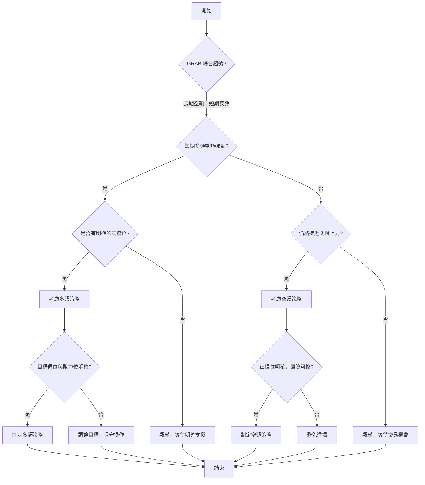

### 🟢 多頭策略詳情

基於當前短期反彈的動能和潛在的雙重底形態，可考慮以下多頭策略。

| 策略要素 | 策略 A：底部反彈追蹤 | 策略 B：突破頸線追漲 (較激進) |
|----------|----------------------|-------------------------------|
| 進場條件 | 價格站穩 MA20 ($3.45) 且 MACD 金叉，RSI 偏強。 | 價格帶量突破 $4.21 (形態頸線)，且成交量顯著放大。 |
| 進場價格 | **$3.55 - $3.58** (在當前價位附近或小幅回調後) | **$4.25 - $4.30** (突破確認後追入) |
| 目標價 T1 | **$3.63** (MA50 阻力) | **$4.49** (斐波那契 38.2% 回調) |
| 目標價 T2 | **$4.21** (2026/04 高點 / 形態頸線) | **$5.12** (雙重底形態目標價) |
| 止損價格 | **$3.30** (潛在雙底的第二個底部低點，也是布林下軌附近) | **$4.10** (跌破頸線 $4.21 的下方) |
| 風險報酬比 | T1: (3.63-3.55)/(3.55-3.30) = 0.08/0.25 = **0.32:1** (較低) <br> T2: (4.21-3.55)/(3.55-3.30) = 0.66/0.25 = **2.64:1** (較好) | T1: (4.49-4.25)/(4.25-4.10) = 0.24/0.15 = **1.6:1** <br> T2: (5.12-4.25)/(4.25-4.10) = 0.87/0.15 = **5.8:1** (極佳) |
| 成功機率 | 55% | 40% (較低，因需大盤配合) |
| 建議倉位 | 5% - 10% (短線嘗試) | 3% - 5% (高風險) |
**分析**：策略 A 旨在捕捉短線反彈，風險報酬比在達到 T2 時較為吸引人，但達到 T1 時則較差，顯示阻力位較近。策略 B 則是在確認底部形態突破後的追漲，成功率較低但若成功，報酬空間巨大。鑑於整體市場偏空，建議優先考慮策略 A，並嚴格止損。

### 🔴 空頭策略詳情

由於 GRAB 仍處於長期空頭趨勢，且短期反彈面臨多重阻力，可考慮在關鍵阻力位未能突破時進行空頭操作。

| 策略要素 | 策略 C：反彈受阻做空 | 策略 D：跌破關鍵支撐做空 (較保守) |
|----------|----------------------|-----------------------------------|
| 進場條件 | 價格反彈至 $3.63 (MA50) 或 $4.21 (頸線) 附近，且出現明顯受阻回落訊號 (如長上影線、放量下跌)。 | 價格跌破 $3.45 (MA20/布林中軌) 並確認跌破，或跌破 $3.30 (潛在雙底低點)。 |
| 進場價格 | **$3.60 - $3.65** (接近 MA50 或布林上軌受阻時) | **$3.40 - $3.44** (跌破 MA20 後確認) |
| 目標價 T1 | **$3.45** (MA20 / 布林中軌) | **$3.24** (布林下軌) |
| 目標價 T2 | **$3.18** (52週低點) | **$3.10** (心理關口，或更低) |
| 止損價格 | **$3.70** (突破 MA50 阻力上方) | **$3.50** (反彈至 MA20 上方) |
| 風險報酬比 | T1: (3.60-3.45)/(3.70-3.60) = 0.15/0.10 = **1.5:1** <br> T2: (3.60-3.18)/(3.70-3.60) = 0.42/0.10 = **4.2:1** | T1: (3.40-3.24)/(3.50-3.40) = 0.16/0.10 = **1.6:1** <br> T2: (3.40-3.10)/(3.50-3.40) = 0.30/0.10 = **3.0:1** |
| 成功機率 | 60% | 70% |
| 建議倉位 | 5% - 10% | 10% - 15% (趨勢確認) |
**分析**：策略 C 旨在利用反彈受阻的機會，風險報酬比良好，成功機率較高。策略 D 則是在確認跌破關鍵支撐後的趨勢交易，成功機率更高，且倉位建議可以更高。鑑於 GRAB 的長期空頭趨勢，空頭策略的勝率可能更高。

### ⭐ 整體訊號強度評星

```
╔══════════════════════════════════════════════════════════════╗
║ 做多訊號強度：★★☆☆☆  (2/5星)                               ║
║   理由：短期有動能，但上方阻力重重，且量能不足，大趨勢仍空。   ║
║ 做空訊號強度：★★★☆☆  (3/5星)                               ║
║   理由：長期空頭趨勢明顯，反彈受阻後下跌概率較高，風險報酬比合理。║
║ 整體可信度：  ★★★☆☆  (3/5星)                               ║
║   理由：市場存在多空分歧，短期反彈與長期趨勢矛盾，操作需謹慎。║
╚══════════════════════════════════════════════════════════════╝
```

---

## 9. 風險提示與監控

### ✅ 關鍵監控指標 Checklist

以下是交易 GRAB 時應密切關注的關鍵技術指標和價位。

```
╔══════════════════════════════════════════════════════════════╗
║                GRAB 關鍵監控指標 Checklist                     ║
╠══════════════════════════════════════════════════════════════╣
║ ├─ 價格行為：                                                 ║
║ ║    [ ] 能否站穩 $3.55 以上？                               ║
║ ║    [ ] 能否突破 $3.63 (MA50) 和 $3.65 (布林上軌)？         ║
║ ║    [ ] 能否有效突破 $4.21 (形態頸線) 並伴隨放量？          ║
║ ║    [ ] 是否跌破 $3.45 (MA20/布林中軌)？                    ║
║ ║    [ ] 是否跌破 $3.18 (52週低點)？                         ║
║ ├─ 成交量：                                                   ║
║ ║    [ ] 價格上漲時成交量是否放大？                          ║
║ ║    [ ] 價格下跌時成交量是否放大？                          ║
║ ├─ 動能指標：                                                 ║
║ ║    [ ] RSI 是否進入超買區 (>70) 並出現回落訊號？           ║
║ ║    [ ] MACD 金叉是否持續，柱狀圖是否持續增長或轉弱？       ║
║ ║    [ ] Stochastics 是否從超買區回落？                      ║
║ ├─ 趨勢強度：                                                 ║
║ ║    [ ] ADX 是否從弱勢區 (16.31) 向上突破 25？ (+DI vs -DI) ║
║ ├─ 宏觀因素：                                                 ║
║ ║    [ ] 東南亞市場經濟前景變化？                            ║
║ ║    [ ] 科技股整體表現？                                    ║
║ ║    [ ] 公司基本面是否有重大變化 (如財報)？                 ║
╚══════════════════════════════════════════════════════════════╝
```

### ⚠️ 風險場景分析

投資 GRAB 需考慮以下三種情境：

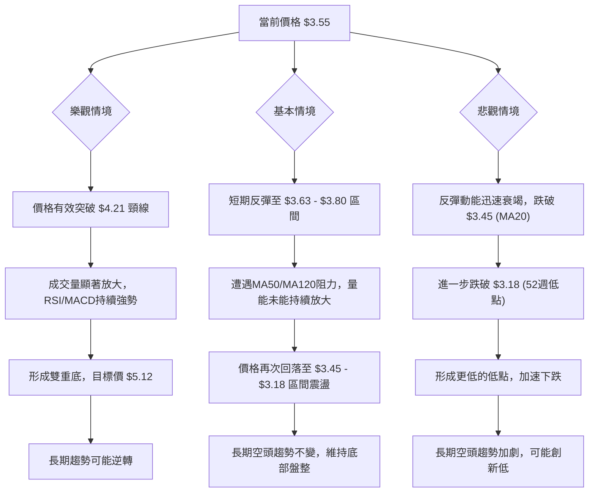
**分析**：
- **樂觀情境 (🟢)**：GRAB 成功確認雙重底形態，帶量突破 $4.21 的頸線，並挑戰斐波那契回調位。這將標誌著長期下跌趨勢的結束和潛在的反轉。
- **基本情境 (🟡)**：價格經歷短期反彈後，在 $3.63-$3.80 區間遭遇阻力，未能有效突破關鍵價位。隨後回落至 $3.45-$3.18 區間繼續底部震盪，長期空頭趨勢不變。這是目前最可能發生的情境。
- **悲觀情境 (🔴)**：短期反彈動能不足，價格未能站穩並跌破 $3.45 的 MA20 支撐，進一步跌破 $3.18 的 52 週低點。這將導致長期空頭趨勢加劇，可能形成新的下跌通道。

### 🛡️ 風險管理重要提醒

1.  **嚴格止損**：無論採取何種策略，都必須設定並嚴格執行止損點。尤其在弱勢趨勢中，一旦判斷失誤，損失可能迅速擴大。
2.  **倉位管理**：鑑於 GRAB 的高波動性和不確定的中長期趨勢，建議採取較低的倉位，避免重倉操作。短期交易倉位不宜超過總資金的 10-15%。
3.  **趨勢確認**：在趨勢未明確反轉之前，將任何上漲視為反彈。只在關鍵阻力被有效突破並伴隨量能確認後，才考慮增加多頭倉位。
4.  **留意宏觀經濟與產業新聞**：GRAB 作為科技股，其股價易受宏觀經濟環境（尤其是東南亞市場）和行業新聞的影響。關注公司基本面和分析師評級的變化。
5.  **多指標驗證**：切勿單一依賴某個指標。在做出交易決策前，務必綜合多個時間框架和多個技術指標的訊號，以提高決策的可靠性。
6.  **耐心等待**：在當前弱勢盤整的格局下，耐心等待明確的趨勢訊號或圖表形態的確認，比盲目追漲殺跌更為重要。

---

## 📋 報告總結

```
╔════════════════════════════════════════════════════════════════════════╗
║                   GRAB 技術分析報告總結                                ║
╠════════════════════════════════════════════════════════════════════════╣
║ 報告日期：2026-06-27                                                     ║
║ 當前價格：$3.55                                                          ║
║ 分析評級：⚖️ 偏空震盪，短期有反彈機會 (長期空頭趨勢中的技術性反彈)         ║
║                                                                          ║
║ 關鍵結論：                                                               ║
║ ├─ 長期趨勢：🔴 顯著空頭，自2025年9月高點$6.02後持續下跌，目前接近12個月低點。║
║ ├─ 中期趨勢：🔴 偏空盤整，價格位於MA50/MA200下方，但下跌動能有所減緩。      ║
║ ├─ 短期趨勢：🟢 短期反彈，價格站上MA20，MACD金叉，RSI偏強，但量能不足且Stochastics超買。║
║ ├─ 關鍵支撐：$3.45 (MA20/布林中軌)，其次為 $3.18 (52週低點)。           ║
║ ├─ 關鍵阻力：$3.63 (MA50)，其次為 $4.21 (2026年4月高點/潛在雙底頸線)。   ║
║ └─ 分析師目標：均值 $5.94，遠高於現價，顯示基本面看好，但技術面需跟上。   ║
║                                                                          ║
║ 最優策略組合：                                                           ║
║ 1. 🥇 **最佳機會 (保守做空)**：在價格反彈至 $3.63 - $3.65 附近受阻時，考慮做空。║
║    進場：$3.60 - $3.65  ｜ 止損：$3.70  ｜ 目標 T1：$3.45  ｜ 目標 T2：$3.18 ｜ 風險報酬比：4.2:1 (T2)║
║ 2. 🥈 **次選機會 (短線做多)**：若價格有效站穩 $3.55，並確認量能放大，可嘗試短線做多。║
║    進場：$3.55 - $3.58  ｜ 止損：$3.30  ｜ 目標 T1：$3.63  ｜ 目標 T2：$4.21 ｜ 風險報酬比：2.64:1 (T2)║
║ 3. 🥉 **保守選擇 (觀望)**：等待價格突破 $4.21 頸線或跌破 $3.18 52週低點，確認明確趨勢後再進場。║
╚════════════════════════════════════════════════════════════════════════╝
```

---

> ⚠️ **免責聲明**：本報告為 AI 自動生成之技術分析，所有數據及估算均基於提供的歷史價格資訊。本報告**僅供研究與學術參考**，**不構成任何投資建議**。投資有風險，入市需謹慎。

---

*報告生成時間：2026-06-27 ｜ 數據來源：Yahoo Finance ｜ 分析框架：多時框技術分析*