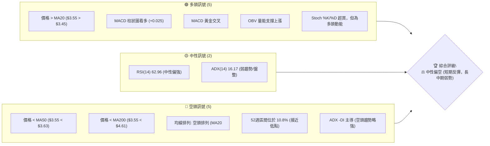

<details>
<summary>📊 靜態圖表 (點擊展開)</summary>

</details>

<html>
<head><meta charset="utf-8" /></head>
<body>
    <div style="height:500px; width:100%;">                        <script>window.PlotlyConfig = {MathJaxConfig: 'local'};</script>
        <script charset="utf-8" src="https://cdn.plot.ly/plotly-3.6.0.min.js" integrity="sha256-QaOVwtVY0T02VaHrr6pnoHLCwayMJp4O5n4YyaE3rJk=" crossorigin="anonymous"></script>                <div id="candlestick-chart" class="plotly-graph-div" style="height:100%; width:100%;"></div>            <script>                window.PLOTLYENV=window.PLOTLYENV || {};                                if (document.getElementById("candlestick-chart")) {                    Plotly.newPlot(                        "candlestick-chart",                        [{"close":{"dtype":"f8","bdata":"AAAAQDMzFUAAAABguB4WQAAAAAAAABhAAAAAIFyPGEAAAAAgrkcZQAAAAGBmZhhAAAAAYGZmGUAAAAAgXI8ZQAAAAMDMzBlAAAAAIK5HGUAAAACgR+EYQAAAAAAAABlAAAAA4KNwGEAAAADgo3AYQAAAAOB6FBhAAAAAoJmZF0AAAABAMzMYQAAAAADXoxhAAAAAIFyPGUAAAADgehQZQAAAAOCjcBlAAAAAgBSuGEAAAADgo3AXQAAAAOBRuBdAAAAAANejF0AAAACAFK4XQAAAAEAK1xZAAAAAIFyPFkAAAACAFK4WQAAAAGBmZhZAAAAAQOF6FkAAAACgR+EWQAAAAGBmZhdAAAAAQOF6GEAAAABgj8IXQAAAAEAzMxhAAAAAIIXrF0AAAACAPQoYQAAAACCuRxhAAAAAANcjF0AAAAAgXI8WQAAAAMAehRZAAAAAoHA9FkAAAACgmZkXQAAAAMAehRdAAAAAwPUoF0AAAADA9SgWQAAAAADXoxVAAAAAgOtRFUAAAAAgrkcVQAAAAKBwPRVAAAAAIIXrE0AAAACgmZkTQAAAAAAAABVAAAAAgML1FEAAAAAgrkcVQAAAAMDMzBVAAAAA4HoUFUAAAACAPQoVQAAAAOB6FBVAAAAAQDMzFUAAAABgj8IUQAAAAADXoxRAAAAAoJmZFEAAAADgUbgUQAAAAOBRuBRAAAAAoJmZFEAAAADgehQUQAAAAMDMzBNAAAAAQOF6E0AAAACAFK4TQAAAAOBRuBNAAAAA4FG4FEAAAACA61EUQAAAAMAehRRAAAAAoJmZFEAAAABgZmYUQAAAACCuRxRAAAAAgML1E0AAAACA61EUQAAAAAApXBRAAAAA4HoUFUAAAACA61EUQAAAAMAehRNAAAAAYGZmE0AAAAAgXI8TQAAAAMD1KBNAAAAAwB6FEkAAAAAgXI8RQAAAAMAehRFAAAAAgD0KEkAAAACgmZkRQAAAAEAzMxJAAAAAgOtREkAAAACgcD0SQAAAAGCPwhJAAAAAYLgeEkAAAACgR+ERQAAAAEAzMxFAAAAAANejEUAAAADgehQRQAAAAGCPwhBAAAAAoJmZEEAAAADgehQRQAAAAIA9ChFAAAAAoHA9EUAAAAAghesQQAAAAOB6FBFAAAAAwB6FEEAAAADgehQRQAAAAMDMzBFAAAAAoJmZEUAAAADAHoURQAAAAOBRuBBAAAAAoJmZEEAAAABACtcQQAAAAKBwPRFAAAAAoEfhEEAAAADgUbgQQAAAAIDrURBAAAAAYGZmEEAAAABguB4QQAAAAEAK1w9AAAAAgBSuD0AAAACAwvUOQAAAAGC4Hg9AAAAAAAAADkAAAACAFK4NQAAAAAAAAA5AAAAA4FG4DkAAAAAAAAAOQAAAAOCjcA1AAAAAQOF6DEAAAABguB4NQAAAAIDrUQ5AAAAAQArXDUAAAACAFK4NQAAAACBcjwxAAAAAoHA9DEAAAAAgrkcNQAAAAAApXA1AAAAAgML1DEAAAABA4XoMQAAAAIDrUQxAAAAAgD0KDUAAAADgo3ANQAAAAOCjcA1AAAAAQArXDUAAAAAgXI8OQAAAAAApXA9AAAAA4HoUEEAAAABACtcQQAAAAEAK1xBAAAAAgOtREEAAAACgcD0QQAAAAIAUrg9AAAAAQDMzD0AAAABguB4PQAAAAKBH4Q5AAAAAIFyPDkAAAAAgXI8OQAAAAAApXA1AAAAAgML1DEAAAADgo3ANQAAAAMD1KA5AAAAAgOtRDkAAAABgj8INQAAAAEAzMw1AAAAAYLgeDUAAAACAPQoNQAAAACBcjwxAAAAAYGZmDEAAAACA61EMQAAAAAAAAAxAAAAA4HoUDEAAAABA4XoMQAAAAOB6FAxAAAAA4FG4DEAAAABguB4NQAAAAIDrUQxAAAAAgOtRDEAAAACgR+EMQAAAAMDMzAxAAAAAIK5HC0AAAACAFK4LQAAAAOBRuApAAAAAANejCkAAAABgZmYKQAAAAMD1KApAAAAAwMzMCkAAAABgZmYKQAAAAIAUrgtAAAAAIIXrC0AAAACgmZkLQAAAACBcjwxAAAAAIIXrC0AAAACAFK4LQAAAACCF6wtAAAAAgBSuC0AAAABgZmYMQA=="},"high":{"dtype":"f8","bdata":"AAAAAClcFUAAAAAgrkcWQAAAAGC4HhhAAAAAANejGEAAAACAFK4ZQAAAAMAehRhAAAAAAAAAGkAAAAAAAAAaQAAAAIDrURpAAAAAQOF6GkAAAADgUbgZQAAAAOB6FBlAAAAAoEfhGEAAAACAFK4YQAAAAKCZmRhAAAAAoEfhGEAAAAAgrkcYQAAAAKBH4RhAAAAAIK7HGUAAAABgZmYaQAAAAECJwRlAAAAAoJmZGUAAAAAgXI8YQAAAACCuRxhAAAAA4HoUGEAAAAAgXI8YQAAAAIDC9RdAAAAAQDOzFkAAAACAajwXQAAAAOBRuBZAAAAAQOF6FkAAAACAPQoXQAAAAMD1qBdAAAAAwB6FGEAAAACAwvUYQAAAAAApXBhAAAAAgOtRGEAAAACA61EYQAAAAIDCdRhAAAAAIK5HF0AAAADgo3AXQAAAAEAKVxdAAAAAwPUoF0AAAAAAAAAYQAAAAOCj8BhAAAAA4HoUGEAAAACgR+EWQAAAAGC4HhZAAAAA4HoUFkAAAACAwnUVQAAAAMAehRVAAAAAANejFUAAAACgcD0UQAAAAEDhehVAAAAAAClcFUAAAADgo3AVQAAAAAAAABZAAAAAQOF6FUAAAACgcD0VQAAAAEAzMxVAAAAAYGZmFUAAAABgZmYVQAAAACBcDxVAAAAAACncFEAAAACAwvUUQAAAAGCPwhRAAAAA4HoUFUAAAAAA16MUQAAAAEAzMxRAAAAAoEfhE0AAAACgR+ETQAAAAGC4HhRAAAAAYLgeFUAAAACAwvUUQAAAAKCZmRRAAAAAANejFEAAAAAghesUQAAAACBcjxRAAAAAAClcFEAAAADAHoUUQAAAAMDMzBRAAAAA4KNwFUAAAACA61EVQAAAAEAzMxRAAAAAoEfhE0AAAACgR+ETQAAAAKCZmRNAAAAAgD0KE0AAAADAHoUSQAAAAGBmZhJAAAAA4FE4EkAAAABAMzMSQAAAAGBmZhJAAAAAIFyPEkAAAACAFK4SQAAAAIAULhNAAAAA4FG4EkAAAADgUTgSQAAAAKBH4RFAAAAA4FG4EUAAAABgj8IRQAAAAEDhehFAAAAAANejEEAAAADAzEwRQAAAAAApXBFAAAAAYLieEUAAAAAgXI8RQAAAAIDC9RFAAAAA4FE4EUAAAABAMzMRQAAAAIA9ChJAAAAAQArXEUAAAADAHgUSQAAAAIA9ihFAAAAAoJmZEEAAAADAHoURQAAAACCuRxFAAAAAYLgeEUAAAACgR+EQQAAAAIA9ihBAAAAA4HqUEEAAAADAHoUQQAAAAMD1KBBAAAAAgBSuD0AAAAAAAAAQQAAAAMAehQ9AAAAAwMzMDkAAAABA4XoOQAAAAADXow5AAAAAgML1DkAAAABAMzMPQAAAAEAK1w1AAAAA4KNwDUAAAACAFK4NQAAAAADXow5AAAAAoJmZD0AAAADgUbgOQAAAAMAehQ1AAAAAgML1DEAAAADgo3ANQAAAAIDrUQ5AAAAAYI\u002fCDUAAAAAAAAAOQAAAAGCPwgxAAAAA4KNwD0AAAABACtcNQAAAAMDMzA1AAAAAoHA9DkAAAADgehQPQAAAAOBRuA9AAAAAAClcEEAAAABguB4RQAAAAAAAABFAAAAAgML1EEAAAADgo3AQQAAAAEAzMxBAAAAAwPUoEEAAAAAghesPQAAAAAAAAA9AAAAAIIXrDkAAAADgUbgOQAAAAKBH4Q1AAAAAQDMzDUAAAADgo3AOQAAAAKCZmQ9AAAAAQDMzD0AAAACgcD0OQAAAAOB6FA5AAAAA4KNwDUAAAADgo3ANQAAAAIDC9QxAAAAAIFyPDEAAAADAzMwMQAAAACBcjwxAAAAAgOkmDEAAAAAA16MMQAAAAIDC9QxAAAAAgOtRDUAAAAAAKVwNQAAAAIDC9QxAAAAAIFyPDEAAAAAgrkcNQAAAACCuRw1AAAAA4FG4DEAAAABgZmYMQAAAAMAehQtAAAAAQDMzC0AAAACAwvUKQAAAAMDMzApAAAAAgML1CkAAAABguB4LQAAAAIDC9QxAAAAAgML1DEAAAAAAKVwMQAAAAKBH4QxAAAAA4FG4DEAAAAAAAAAMQAAAAGBmZgxAAAAAIFyPDEAAAAAA16MMQA=="},"hovertemplate":"\u003cb\u003e%{x|%Y-%m-%d}\u003c\u002fb\u003e\u003cbr\u003e\u958b: $%{open:.2f}\u003cbr\u003e\u9ad8: $%{high:.2f}\u003cbr\u003e\u4f4e: $%{low:.2f}\u003cbr\u003e\u6536: $%{close:.2f}\u003cextra\u003e\u003c\u002fextra\u003e","low":{"dtype":"f8","bdata":"AAAAgML1FEAAAACgR+EUQAAAAIA9ChZAAAAA4KNwFkAAAAAA16MXQAAAAMD1qBdAAAAAoHA9GEAAAAAgrkcZQAAAAKBH4RhAAAAAgD0KGUAAAAAA16MYQAAAAIDC9RdAAAAAwPUoGEAAAADgUbgXQAAAAIDC9RdAAAAAgOtRF0AAAACgmZkXQAAAAKBwPRhAAAAAIFyPGEAAAACAwvUYQAAAACCF6xhAAAAAIK5HGEAAAAAAKVwXQAAAACBcjxdAAAAAwMzMFkAAAACgmZkXQAAAACBcjxZAAAAAwPUoFkAAAACgmZkWQAAAAMD1KBZAAAAAgBSuFUAAAACA61EWQAAAAOB6FBdAAAAAANejF0AAAACgmZkXQAAAAGBmZhdAAAAAgBSuF0AAAADAzMwXQAAAAKCZmRdAAAAA4KNwFUAAAABA4XoWQAAAAIAULhZAAAAAwMzMFUAAAAAghesWQAAAAEAzMxdAAAAAYLgeF0AAAAAghesVQAAAAOCjcBVAAAAA4HoUFUAAAACgR+EUQAAAAAAAABVAAAAAQArXE0AAAAAgrkcTQAAAACCFaxRAAAAAYI\u002fCFEAAAABACtcUQAAAAOCjcBVAAAAAAAAAFUAAAACgR+EUQAAAAKCZmRRAAAAAIK7HFEAAAADgUbgUQAAAAOCjcBRAAAAAgOtRFEAAAABAMzMUQAAAAKBHYRRAAAAA4KNwFEAAAACAwvUTQAAAAIAUrhNAAAAAYGZmE0AAAAAgXI8TQAAAAADXoxNAAAAAgD0KFEAAAAAgrkcUQAAAAGC4HhRAAAAAwMxMFEAAAACgR2EUQAAAAAAAABRAAAAAIIXrE0AAAACAPQoUQAAAAIDrURRAAAAAYI\u002fCFEAAAABgj0IUQAAAAOCjcBNAAAAAgOtRE0AAAAAAKVwTQAAAAAAAABNAAAAAgOtREkAAAACA61ERQAAAAOCjcBFAAAAAYGZmEUAAAAAgXI8RQAAAAOBRuBFAAAAA4HoUEkAAAADA9SgSQAAAAAApXBJAAAAAgD0KEkAAAADAHoURQAAAAMD1KBFAAAAAAAAAEUAAAADgUbgQQAAAAKCZmRBAAAAAoHA9EEAAAACAwnUQQAAAAEAK1xBAAAAAIIXrEEAAAABgj8IQQAAAAMDMzBBAAAAAAAAAEEAAAABgZmYQQAAAAOB6FBFAAAAAYI9CEUAAAACA61ERQAAAAMAehRBAAAAAQDMzEEAAAADgp8YQQAAAACBcjxBAAAAA4FG4EEAAAACgcD0QQAAAAAApXA9AAAAAgD0KEEAAAAAAAAAQQAAAAGCPwg9AAAAAwB6FDkAAAADAzMwOQAAAAEDheg5AAAAAYI\u002fCDUAAAACgmZkNQAAAAGCPwg1AAAAAwPUoDkAAAABACtcNQAAAACCuRw1AAAAAYGZmDEAAAADgUbgMQAAAAIDC9QxAAAAAoJmZDUAAAACA61ENQAAAAKBwPQxAAAAA4HoUDEAAAABgZmYMQAAAAGC4Hg1AAAAAANejDEAAAABA4XoMQAAAAEAK1wtAAAAAwMzMDEAAAACAwvUMQAAAAEAzMw1AAAAAANejDEAAAABgZDsOQAAAAIAUrg5AAAAAQArXD0AAAADgo3AQQAAAAOCjcBBAAAAAQDMzEEAAAADA9SgQQAAAAEAzMw9AAAAAgD0KD0AAAACgR+EOQAAAAIDrUQ5AAAAA4HoUDkAAAAAghesNQAAAAMD1KAxAAAAAgOtRDEAAAADgUbgMQAAAACCF6w1AAAAA4HoUDkAAAAAgrkcNQAAAAIDC9QxAAAAAoEfhDEAAAABA4XoMQAAAAGBmZgxAAAAAgBSuC0AAAABACtcLQAAAACCF6wtAAAAAYLgeC0AAAACgmZkLQAAAACCF6wtAAAAA4HoUDEAAAADgo3AMQAAAAEAK1wtAAAAAQArXC0AAAAAAAAAMQAAAACBcjwxAAAAAgD0KC0AAAACAPQoLQAAAAKCZmQpAAAAAYGZmCkAAAADgehQKQAAAAMD1KApAAAAA4KNwCUAAAADgehQKQAAAAIDC9QpAAAAAQOF6C0AAAADgo3ALQAAAAOBRuApAAAAAYI\u002fCC0AAAABguB4LQAAAAOCjcAtAAAAAwB6FC0AAAADgo3ALQA=="},"name":"\u50f9\u683c","open":{"dtype":"f8","bdata":"AAAAQDMzFUAAAADA9SgVQAAAAEAzMxZAAAAAoJmZF0AAAABA4XoYQAAAAMAehRhAAAAAgD2KGEAAAAAgXI8ZQAAAAEDh+hhAAAAAIIXrGUAAAABAMzMZQAAAAMAehRhAAAAAQArXGEAAAACAwnUYQAAAAKBwPRhAAAAAwPUoGEAAAACAwvUXQAAAAEDhehhAAAAAoJkZGUAAAABAMzMaQAAAAIDrURlAAAAAgD2KGUAAAABA4XoYQAAAAIDC9RdAAAAAwPUoF0AAAACgcD0YQAAAAMDMzBdAAAAAQOF6FkAAAADA9SgXQAAAAOBRuBZAAAAAQOF6FkAAAACAFK4WQAAAAKBHYRdAAAAAAAAAGEAAAAAghesYQAAAAGCPwhdAAAAAAAAAGEAAAACgR+EXQAAAAIA9ChhAAAAAYI9CFkAAAABgj0IXQAAAAMDMzBZAAAAAwMzMFkAAAACgmRkXQAAAACBcDxhAAAAAYGZmF0AAAABACtcWQAAAAMAehRVAAAAAgD2KFUAAAADgUTgVQAAAAEAzMxVAAAAAANejFUAAAACAPQoUQAAAAIAUrhRAAAAA4HoUFUAAAADA9SgVQAAAAADXoxVAAAAAIIVrFUAAAADAHgUVQAAAAIDC9RRAAAAAQArXFEAAAADA9SgVQAAAAGCPwhRAAAAAIIVrFEAAAABgZmYUQAAAAOB6lBRAAAAAYI\u002fCFEAAAACgmZkUQAAAAEDh+hNAAAAAoEfhE0AAAACgmZkTQAAAAKBH4RNAAAAA4HoUFEAAAACAFK4UQAAAAIDrURRAAAAAIFyPFEAAAABA4XoUQAAAAIDCdRRAAAAAIK5HFEAAAACAFC4UQAAAAMAehRRAAAAAYI\u002fCFEAAAABguB4VQAAAAEAzMxRAAAAAYI\u002fCE0AAAABgZmYTQAAAAKCZmRNAAAAAIIXrEkAAAADgo3ASQAAAAIDrURJAAAAAgD2KEUAAAABAMzMSQAAAAMDMzBFAAAAA4HoUEkAAAACgcD0SQAAAAAApXBJAAAAAgBSuEkAAAADA9SgSQAAAAIAUrhFAAAAAYLgeEUAAAADA9agRQAAAAIDrURFAAAAAwB6FEEAAAACgR+EQQAAAAGC4HhFAAAAAwPUoEUAAAADgo3ARQAAAAMDMzBBAAAAAgML1EEAAAABgj8IQQAAAAKBwPRFAAAAA4HqUEUAAAADgo3ARQAAAAMDMTBFAAAAA4KNwEEAAAAAAAAARQAAAAOBRuBBAAAAAwMzMEEAAAAAA16MQQAAAAGC4HhBAAAAA4KNwEEAAAAAAKVwQQAAAACBcDxBAAAAAIK5HD0AAAACAFK4PQAAAAMDMzA5AAAAAANejDkAAAABguB4OQAAAACCF6w1AAAAAoHA9DkAAAACgmZkOQAAAAGCPwg1AAAAAQDMzDUAAAADAzMwMQAAAAEAzMw1AAAAAANejDkAAAABgZmYNQAAAAOCjcA1AAAAA4FG4DEAAAADAzMwMQAAAAAAAAA5AAAAAgML1DEAAAACgR+EMQAAAAMAehQxAAAAAQArXDkAAAACAPQoNQAAAAKCZmQ1AAAAAQDMzDUAAAACgcD0OQAAAAMDMzA5AAAAAAAAAEEAAAABA4XoQQAAAAGC4nhBAAAAAoEfhEEAAAAAAKVwQQAAAAEAzMxBAAAAA4HoUEEAAAABAMzMPQAAAAMDMzA5AAAAAoEfhDkAAAAAgXI8OQAAAAOBRuA1AAAAA4HoUDUAAAAAAKVwOQAAAAMDMzA5AAAAAIFyPDkAAAADA9SgOQAAAAIAUrg1AAAAAAClcDUAAAAAAKVwNQAAAAIDC9QxAAAAAgOtRDEAAAABguB4MQAAAAIDrUQxAAAAA4HoUDEAAAAAAAAAMQAAAAEDhegxAAAAAIK5HDEAAAABA4XoMQAAAAIDC9QxAAAAAoHA9DEAAAADA9SgMQAAAAKBH4QxAAAAAANejDEAAAAAgrkcLQAAAAOCjcAtAAAAAYI\u002fCCkAAAAAA16MKQAAAAGBmZgpAAAAAAAAACkAAAABguB4LQAAAAGC4HgtAAAAAYI\u002fCC0AAAAAAAAAMQAAAAMAehQtAAAAAoBgEDEAAAAAgrkcLQAAAAADXowtAAAAAQDMzDEAAAADgo3ALQA=="},"x":["2025-09-10T00:00:00-04:00","2025-09-11T00:00:00-04:00","2025-09-12T00:00:00-04:00","2025-09-15T00:00:00-04:00","2025-09-16T00:00:00-04:00","2025-09-17T00:00:00-04:00","2025-09-18T00:00:00-04:00","2025-09-19T00:00:00-04:00","2025-09-22T00:00:00-04:00","2025-09-23T00:00:00-04:00","2025-09-24T00:00:00-04:00","2025-09-25T00:00:00-04:00","2025-09-26T00:00:00-04:00","2025-09-29T00:00:00-04:00","2025-09-30T00:00:00-04:00","2025-10-01T00:00:00-04:00","2025-10-02T00:00:00-04:00","2025-10-03T00:00:00-04:00","2025-10-06T00:00:00-04:00","2025-10-07T00:00:00-04:00","2025-10-08T00:00:00-04:00","2025-10-09T00:00:00-04:00","2025-10-10T00:00:00-04:00","2025-10-13T00:00:00-04:00","2025-10-14T00:00:00-04:00","2025-10-15T00:00:00-04:00","2025-10-16T00:00:00-04:00","2025-10-17T00:00:00-04:00","2025-10-20T00:00:00-04:00","2025-10-21T00:00:00-04:00","2025-10-22T00:00:00-04:00","2025-10-23T00:00:00-04:00","2025-10-24T00:00:00-04:00","2025-10-27T00:00:00-04:00","2025-10-28T00:00:00-04:00","2025-10-29T00:00:00-04:00","2025-10-30T00:00:00-04:00","2025-10-31T00:00:00-04:00","2025-11-03T00:00:00-05:00","2025-11-04T00:00:00-05:00","2025-11-05T00:00:00-05:00","2025-11-06T00:00:00-05:00","2025-11-07T00:00:00-05:00","2025-11-10T00:00:00-05:00","2025-11-11T00:00:00-05:00","2025-11-12T00:00:00-05:00","2025-11-13T00:00:00-05:00","2025-11-14T00:00:00-05:00","2025-11-17T00:00:00-05:00","2025-11-18T00:00:00-05:00","2025-11-19T00:00:00-05:00","2025-11-20T00:00:00-05:00","2025-11-21T00:00:00-05:00","2025-11-24T00:00:00-05:00","2025-11-25T00:00:00-05:00","2025-11-26T00:00:00-05:00","2025-11-28T00:00:00-05:00","2025-12-01T00:00:00-05:00","2025-12-02T00:00:00-05:00","2025-12-03T00:00:00-05:00","2025-12-04T00:00:00-05:00","2025-12-05T00:00:00-05:00","2025-12-08T00:00:00-05:00","2025-12-09T00:00:00-05:00","2025-12-10T00:00:00-05:00","2025-12-11T00:00:00-05:00","2025-12-12T00:00:00-05:00","2025-12-15T00:00:00-05:00","2025-12-16T00:00:00-05:00","2025-12-17T00:00:00-05:00","2025-12-18T00:00:00-05:00","2025-12-19T00:00:00-05:00","2025-12-22T00:00:00-05:00","2025-12-23T00:00:00-05:00","2025-12-24T00:00:00-05:00","2025-12-26T00:00:00-05:00","2025-12-29T00:00:00-05:00","2025-12-30T00:00:00-05:00","2025-12-31T00:00:00-05:00","2026-01-02T00:00:00-05:00","2026-01-05T00:00:00-05:00","2026-01-06T00:00:00-05:00","2026-01-07T00:00:00-05:00","2026-01-08T00:00:00-05:00","2026-01-09T00:00:00-05:00","2026-01-12T00:00:00-05:00","2026-01-13T00:00:00-05:00","2026-01-14T00:00:00-05:00","2026-01-15T00:00:00-05:00","2026-01-16T00:00:00-05:00","2026-01-20T00:00:00-05:00","2026-01-21T00:00:00-05:00","2026-01-22T00:00:00-05:00","2026-01-23T00:00:00-05:00","2026-01-26T00:00:00-05:00","2026-01-27T00:00:00-05:00","2026-01-28T00:00:00-05:00","2026-01-29T00:00:00-05:00","2026-01-30T00:00:00-05:00","2026-02-02T00:00:00-05:00","2026-02-03T00:00:00-05:00","2026-02-04T00:00:00-05:00","2026-02-05T00:00:00-05:00","2026-02-06T00:00:00-05:00","2026-02-09T00:00:00-05:00","2026-02-10T00:00:00-05:00","2026-02-11T00:00:00-05:00","2026-02-12T00:00:00-05:00","2026-02-13T00:00:00-05:00","2026-02-17T00:00:00-05:00","2026-02-18T00:00:00-05:00","2026-02-19T00:00:00-05:00","2026-02-20T00:00:00-05:00","2026-02-23T00:00:00-05:00","2026-02-24T00:00:00-05:00","2026-02-25T00:00:00-05:00","2026-02-26T00:00:00-05:00","2026-02-27T00:00:00-05:00","2026-03-02T00:00:00-05:00","2026-03-03T00:00:00-05:00","2026-03-04T00:00:00-05:00","2026-03-05T00:00:00-05:00","2026-03-06T00:00:00-05:00","2026-03-09T00:00:00-04:00","2026-03-10T00:00:00-04:00","2026-03-11T00:00:00-04:00","2026-03-12T00:00:00-04:00","2026-03-13T00:00:00-04:00","2026-03-16T00:00:00-04:00","2026-03-17T00:00:00-04:00","2026-03-18T00:00:00-04:00","2026-03-19T00:00:00-04:00","2026-03-20T00:00:00-04:00","2026-03-23T00:00:00-04:00","2026-03-24T00:00:00-04:00","2026-03-25T00:00:00-04:00","2026-03-26T00:00:00-04:00","2026-03-27T00:00:00-04:00","2026-03-30T00:00:00-04:00","2026-03-31T00:00:00-04:00","2026-04-01T00:00:00-04:00","2026-04-02T00:00:00-04:00","2026-04-06T00:00:00-04:00","2026-04-07T00:00:00-04:00","2026-04-08T00:00:00-04:00","2026-04-09T00:00:00-04:00","2026-04-10T00:00:00-04:00","2026-04-13T00:00:00-04:00","2026-04-14T00:00:00-04:00","2026-04-15T00:00:00-04:00","2026-04-16T00:00:00-04:00","2026-04-17T00:00:00-04:00","2026-04-20T00:00:00-04:00","2026-04-21T00:00:00-04:00","2026-04-22T00:00:00-04:00","2026-04-23T00:00:00-04:00","2026-04-24T00:00:00-04:00","2026-04-27T00:00:00-04:00","2026-04-28T00:00:00-04:00","2026-04-29T00:00:00-04:00","2026-04-30T00:00:00-04:00","2026-05-01T00:00:00-04:00","2026-05-04T00:00:00-04:00","2026-05-05T00:00:00-04:00","2026-05-06T00:00:00-04:00","2026-05-07T00:00:00-04:00","2026-05-08T00:00:00-04:00","2026-05-11T00:00:00-04:00","2026-05-12T00:00:00-04:00","2026-05-13T00:00:00-04:00","2026-05-14T00:00:00-04:00","2026-05-15T00:00:00-04:00","2026-05-18T00:00:00-04:00","2026-05-19T00:00:00-04:00","2026-05-20T00:00:00-04:00","2026-05-21T00:00:00-04:00","2026-05-22T00:00:00-04:00","2026-05-26T00:00:00-04:00","2026-05-27T00:00:00-04:00","2026-05-28T00:00:00-04:00","2026-05-29T00:00:00-04:00","2026-06-01T00:00:00-04:00","2026-06-02T00:00:00-04:00","2026-06-03T00:00:00-04:00","2026-06-04T00:00:00-04:00","2026-06-05T00:00:00-04:00","2026-06-08T00:00:00-04:00","2026-06-09T00:00:00-04:00","2026-06-10T00:00:00-04:00","2026-06-11T00:00:00-04:00","2026-06-12T00:00:00-04:00","2026-06-15T00:00:00-04:00","2026-06-16T00:00:00-04:00","2026-06-17T00:00:00-04:00","2026-06-18T00:00:00-04:00","2026-06-22T00:00:00-04:00","2026-06-23T00:00:00-04:00","2026-06-24T00:00:00-04:00","2026-06-25T00:00:00-04:00","2026-06-26T00:00:00-04:00"],"type":"candlestick"},{"hovertemplate":"MA30: $%{y:.2f}\u003cextra\u003e\u003c\u002fextra\u003e","line":{"color":"#2196F3","dash":"dash","width":2},"mode":"lines","name":"MA30","x":["2025-09-10T00:00:00-04:00","2025-09-11T00:00:00-04:00","2025-09-12T00:00:00-04:00","2025-09-15T00:00:00-04:00","2025-09-16T00:00:00-04:00","2025-09-17T00:00:00-04:00","2025-09-18T00:00:00-04:00","2025-09-19T00:00:00-04:00","2025-09-22T00:00:00-04:00","2025-09-23T00:00:00-04:00","2025-09-24T00:00:00-04:00","2025-09-25T00:00:00-04:00","2025-09-26T00:00:00-04:00","2025-09-29T00:00:00-04:00","2025-09-30T00:00:00-04:00","2025-10-01T00:00:00-04:00","2025-10-02T00:00:00-04:00","2025-10-03T00:00:00-04:00","2025-10-06T00:00:00-04:00","2025-10-07T00:00:00-04:00","2025-10-08T00:00:00-04:00","2025-10-09T00:00:00-04:00","2025-10-10T00:00:00-04:00","2025-10-13T00:00:00-04:00","2025-10-14T00:00:00-04:00","2025-10-15T00:00:00-04:00","2025-10-16T00:00:00-04:00","2025-10-17T00:00:00-04:00","2025-10-20T00:00:00-04:00","2025-10-21T00:00:00-04:00","2025-10-22T00:00:00-04:00","2025-10-23T00:00:00-04:00","2025-10-24T00:00:00-04:00","2025-10-27T00:00:00-04:00","2025-10-28T00:00:00-04:00","2025-10-29T00:00:00-04:00","2025-10-30T00:00:00-04:00","2025-10-31T00:00:00-04:00","2025-11-03T00:00:00-05:00","2025-11-04T00:00:00-05:00","2025-11-05T00:00:00-05:00","2025-11-06T00:00:00-05:00","2025-11-07T00:00:00-05:00","2025-11-10T00:00:00-05:00","2025-11-11T00:00:00-05:00","2025-11-12T00:00:00-05:00","2025-11-13T00:00:00-05:00","2025-11-14T00:00:00-05:00","2025-11-17T00:00:00-05:00","2025-11-18T00:00:00-05:00","2025-11-19T00:00:00-05:00","2025-11-20T00:00:00-05:00","2025-11-21T00:00:00-05:00","2025-11-24T00:00:00-05:00","2025-11-25T00:00:00-05:00","2025-11-26T00:00:00-05:00","2025-11-28T00:00:00-05:00","2025-12-01T00:00:00-05:00","2025-12-02T00:00:00-05:00","2025-12-03T00:00:00-05:00","2025-12-04T00:00:00-05:00","2025-12-05T00:00:00-05:00","2025-12-08T00:00:00-05:00","2025-12-09T00:00:00-05:00","2025-12-10T00:00:00-05:00","2025-12-11T00:00:00-05:00","2025-12-12T00:00:00-05:00","2025-12-15T00:00:00-05:00","2025-12-16T00:00:00-05:00","2025-12-17T00:00:00-05:00","2025-12-18T00:00:00-05:00","2025-12-19T00:00:00-05:00","2025-12-22T00:00:00-05:00","2025-12-23T00:00:00-05:00","2025-12-24T00:00:00-05:00","2025-12-26T00:00:00-05:00","2025-12-29T00:00:00-05:00","2025-12-30T00:00:00-05:00","2025-12-31T00:00:00-05:00","2026-01-02T00:00:00-05:00","2026-01-05T00:00:00-05:00","2026-01-06T00:00:00-05:00","2026-01-07T00:00:00-05:00","2026-01-08T00:00:00-05:00","2026-01-09T00:00:00-05:00","2026-01-12T00:00:00-05:00","2026-01-13T00:00:00-05:00","2026-01-14T00:00:00-05:00","2026-01-15T00:00:00-05:00","2026-01-16T00:00:00-05:00","2026-01-20T00:00:00-05:00","2026-01-21T00:00:00-05:00","2026-01-22T00:00:00-05:00","2026-01-23T00:00:00-05:00","2026-01-26T00:00:00-05:00","2026-01-27T00:00:00-05:00","2026-01-28T00:00:00-05:00","2026-01-29T00:00:00-05:00","2026-01-30T00:00:00-05:00","2026-02-02T00:00:00-05:00","2026-02-03T00:00:00-05:00","2026-02-04T00:00:00-05:00","2026-02-05T00:00:00-05:00","2026-02-06T00:00:00-05:00","2026-02-09T00:00:00-05:00","2026-02-10T00:00:00-05:00","2026-02-11T00:00:00-05:00","2026-02-12T00:00:00-05:00","2026-02-13T00:00:00-05:00","2026-02-17T00:00:00-05:00","2026-02-18T00:00:00-05:00","2026-02-19T00:00:00-05:00","2026-02-20T00:00:00-05:00","2026-02-23T00:00:00-05:00","2026-02-24T00:00:00-05:00","2026-02-25T00:00:00-05:00","2026-02-26T00:00:00-05:00","2026-02-27T00:00:00-05:00","2026-03-02T00:00:00-05:00","2026-03-03T00:00:00-05:00","2026-03-04T00:00:00-05:00","2026-03-05T00:00:00-05:00","2026-03-06T00:00:00-05:00","2026-03-09T00:00:00-04:00","2026-03-10T00:00:00-04:00","2026-03-11T00:00:00-04:00","2026-03-12T00:00:00-04:00","2026-03-13T00:00:00-04:00","2026-03-16T00:00:00-04:00","2026-03-17T00:00:00-04:00","2026-03-18T00:00:00-04:00","2026-03-19T00:00:00-04:00","2026-03-20T00:00:00-04:00","2026-03-23T00:00:00-04:00","2026-03-24T00:00:00-04:00","2026-03-25T00:00:00-04:00","2026-03-26T00:00:00-04:00","2026-03-27T00:00:00-04:00","2026-03-30T00:00:00-04:00","2026-03-31T00:00:00-04:00","2026-04-01T00:00:00-04:00","2026-04-02T00:00:00-04:00","2026-04-06T00:00:00-04:00","2026-04-07T00:00:00-04:00","2026-04-08T00:00:00-04:00","2026-04-09T00:00:00-04:00","2026-04-10T00:00:00-04:00","2026-04-13T00:00:00-04:00","2026-04-14T00:00:00-04:00","2026-04-15T00:00:00-04:00","2026-04-16T00:00:00-04:00","2026-04-17T00:00:00-04:00","2026-04-20T00:00:00-04:00","2026-04-21T00:00:00-04:00","2026-04-22T00:00:00-04:00","2026-04-23T00:00:00-04:00","2026-04-24T00:00:00-04:00","2026-04-27T00:00:00-04:00","2026-04-28T00:00:00-04:00","2026-04-29T00:00:00-04:00","2026-04-30T00:00:00-04:00","2026-05-01T00:00:00-04:00","2026-05-04T00:00:00-04:00","2026-05-05T00:00:00-04:00","2026-05-06T00:00:00-04:00","2026-05-07T00:00:00-04:00","2026-05-08T00:00:00-04:00","2026-05-11T00:00:00-04:00","2026-05-12T00:00:00-04:00","2026-05-13T00:00:00-04:00","2026-05-14T00:00:00-04:00","2026-05-15T00:00:00-04:00","2026-05-18T00:00:00-04:00","2026-05-19T00:00:00-04:00","2026-05-20T00:00:00-04:00","2026-05-21T00:00:00-04:00","2026-05-22T00:00:00-04:00","2026-05-26T00:00:00-04:00","2026-05-27T00:00:00-04:00","2026-05-28T00:00:00-04:00","2026-05-29T00:00:00-04:00","2026-06-01T00:00:00-04:00","2026-06-02T00:00:00-04:00","2026-06-03T00:00:00-04:00","2026-06-04T00:00:00-04:00","2026-06-05T00:00:00-04:00","2026-06-08T00:00:00-04:00","2026-06-09T00:00:00-04:00","2026-06-10T00:00:00-04:00","2026-06-11T00:00:00-04:00","2026-06-12T00:00:00-04:00","2026-06-15T00:00:00-04:00","2026-06-16T00:00:00-04:00","2026-06-17T00:00:00-04:00","2026-06-18T00:00:00-04:00","2026-06-22T00:00:00-04:00","2026-06-23T00:00:00-04:00","2026-06-24T00:00:00-04:00","2026-06-25T00:00:00-04:00","2026-06-26T00:00:00-04:00"],"y":{"dtype":"f8","bdata":"AAAAAAAA+H8AAAAAAAD4fwAAAAAAAPh\u002fAAAAAAAA+H8AAAAAAAD4fwAAAAAAAPh\u002fAAAAAAAA+H8AAAAAAAD4fwAAAAAAAPh\u002fAAAAAAAA+H8AAAAAAAD4fwAAAAAAAPh\u002fAAAAAAAA+H8AAAAAAAD4fwAAAAAAAPh\u002fAAAAAAAA+H8AAAAAAAD4fwAAAAAAAPh\u002fAAAAAAAA+H8AAAAAAAD4fwAAAAAAAPh\u002fAAAAAAAA+H8AAAAAAAD4fwAAAAAAAPh\u002fAAAAAAAA+H8AAAAAAAD4fwAAAAAAAPh\u002fAAAAAAAA+H8AAAAAAAD4f6uqqtpAJxhA3t3dDS0yGEC8u7tLqTgYQDMzM5OKMxhAAAAA0NsyGEAiIiJS4yUYQKuqqmouJBhA7+7uTo0XGEAiIiLSlAoYQFVVVVWc\u002fRdA3t3dbVnrF0AAAABQjdcXQLy7u6tjwhdAIiIisp2vF0AAAACwcqgXQJqZmVmroxdAd3d3J+qfF0BERES0gY4XQKuqqhrodBdA7+7urrlQF0BVVVV1TDAXQKuqqmp1DBdAmpmZCdfjFkDe3d1tEsMWQAAAAIDcqxZAMzMz8\u002f2UFkAiIiISg4AWQHd3dyejdxZAvLu7CwJrFkCamZlpA10WQERERNS\u002fURZAERERodNGFkC8u7trvDQWQLy7uxsvHRZA7+7uHhP8FUAzMzMjIuIVQFVVVfVvxBVA7+7uThuoFUDe3d2NUIYVQHd3d9cVYBVAMzMzc9pAFUDv7u7+RigVQM3MzExiEBVA7+7uzmkDFUCamZmJbOcUQAAAAPDSzRRAiYiIiPq3FEARERHB9agUQKuqqspanRRAMzMz07+RFEC8u7urjokUQImIiEgMghRAd3d3V\u002fKLFEBEREQ0F5IUQImIiBh2hRRAmpmZOSZ4FEAzMzPTeGkUQImIiKjxUhRAERERQRk9FEAzMzMTZx8UQDMzMyMGARRAMzMzAw\u002fmE0AzMzPjF8sTQBEREaFFthNARERE5NCiE0AAAABAp40TQBEREZHtfBNAzczM7MNnE0AzMzPz\u002fVQTQKuqqirOPhNAAAAAoBovE0BmZmbW6hgTQO\u002fu7p6o\u002fxJAiYiIWIDcEkBVVVV12sASQImIiEgooxJAAAAAQHyGEkAzMzMTymgSQBEREZF7TRJAZmZmxiAwEkAzMzPjehQSQKuqqnqi\u002fhFA3t3dTfDgEUDNzMycC8kRQKuqquomsRFAmpmZOUKZEUC8u7tLDIIRQN7d3f2pcRFAq6qqWqtjEUCJiIhYgFwRQHd3d+dCUhFAREREREREEUCJiIgoozcRQLy7u2suJBFAd3d3xwQPEUB3d3d3d\u002fcQQN7d3fUo3BBA7+7uNonBEEBEREQ8mKcQQKuqqkLSlBBAZmZmhl2BEEAiIiKynW8QQHd3dz81XhBAd3d3vxFKEECamZm5kDQQQM3MzMyFJBBA7+7urrkQEEBVVVW18\u002f0PQCIiIlIqzg9A7+7ujjSlD0CamZkJkHsPQN7d3Y1QRg9AAAAAEBERD0BVVVWFFtkOQGZmZrZlrQ5A3t3dDeaJDkAiIiKit2UOQGZmZpa1Og5AiYiIOEIZDkBERETErgAOQBEREZHC9Q1Ad3d3d0zwDUARERExlvwNQLy7u7tJDA5AIiIi4noUDkAAAABgcyEOQGZmZrY6Jg5Ad3d3J3gwDkAiIiLiwTwOQFVVVUVERA5A7+7uvuZCDkBVVVUVrkcOQCIiIlL\u002fRg5AVVVV5RdLDkAiIiLy0k0OQLy7u2t1TA5A7+7u\u002fo1QDkAiIiLCPFEOQM3MzNyyVg5AERERQTVeDkB3d3f3KFwOQGZmZlZVVQ5AAAAAAI5QDkCamZl5ME8OQM3MzGx1TA5AVVVVRUREDkDe3d0dEzwOQGZmZiZ4MA5AiYiIeOkmDkDv7u6+nxoOQDMzM8OuAA5Ad3d3J+rfDUBERERk9LYNQN7d3d1PjQ1AVVVVxZJfDUAzMzMDnTYNQJqZmblJDA1AAAAAQGDlDEAAAABAGb0MQBEREUHSlAxAiYiIaLx0DEAAAADAPFEMQLy7u7vmQgxAIiIi0gY6DEB3d3dHUyoMQGZmZgasHAxAVVVVJTEIDEARERFRcfYLQM3MzByF6wtAIiIiYjvfC0B3d3dHxdkLQA=="},"type":"scatter"},{"hovertemplate":"MA60: $%{y:.2f}\u003cextra\u003e\u003c\u002fextra\u003e","line":{"color":"#9C27B0","dash":"dash","width":2},"mode":"lines","name":"MA60","x":["2025-09-10T00:00:00-04:00","2025-09-11T00:00:00-04:00","2025-09-12T00:00:00-04:00","2025-09-15T00:00:00-04:00","2025-09-16T00:00:00-04:00","2025-09-17T00:00:00-04:00","2025-09-18T00:00:00-04:00","2025-09-19T00:00:00-04:00","2025-09-22T00:00:00-04:00","2025-09-23T00:00:00-04:00","2025-09-24T00:00:00-04:00","2025-09-25T00:00:00-04:00","2025-09-26T00:00:00-04:00","2025-09-29T00:00:00-04:00","2025-09-30T00:00:00-04:00","2025-10-01T00:00:00-04:00","2025-10-02T00:00:00-04:00","2025-10-03T00:00:00-04:00","2025-10-06T00:00:00-04:00","2025-10-07T00:00:00-04:00","2025-10-08T00:00:00-04:00","2025-10-09T00:00:00-04:00","2025-10-10T00:00:00-04:00","2025-10-13T00:00:00-04:00","2025-10-14T00:00:00-04:00","2025-10-15T00:00:00-04:00","2025-10-16T00:00:00-04:00","2025-10-17T00:00:00-04:00","2025-10-20T00:00:00-04:00","2025-10-21T00:00:00-04:00","2025-10-22T00:00:00-04:00","2025-10-23T00:00:00-04:00","2025-10-24T00:00:00-04:00","2025-10-27T00:00:00-04:00","2025-10-28T00:00:00-04:00","2025-10-29T00:00:00-04:00","2025-10-30T00:00:00-04:00","2025-10-31T00:00:00-04:00","2025-11-03T00:00:00-05:00","2025-11-04T00:00:00-05:00","2025-11-05T00:00:00-05:00","2025-11-06T00:00:00-05:00","2025-11-07T00:00:00-05:00","2025-11-10T00:00:00-05:00","2025-11-11T00:00:00-05:00","2025-11-12T00:00:00-05:00","2025-11-13T00:00:00-05:00","2025-11-14T00:00:00-05:00","2025-11-17T00:00:00-05:00","2025-11-18T00:00:00-05:00","2025-11-19T00:00:00-05:00","2025-11-20T00:00:00-05:00","2025-11-21T00:00:00-05:00","2025-11-24T00:00:00-05:00","2025-11-25T00:00:00-05:00","2025-11-26T00:00:00-05:00","2025-11-28T00:00:00-05:00","2025-12-01T00:00:00-05:00","2025-12-02T00:00:00-05:00","2025-12-03T00:00:00-05:00","2025-12-04T00:00:00-05:00","2025-12-05T00:00:00-05:00","2025-12-08T00:00:00-05:00","2025-12-09T00:00:00-05:00","2025-12-10T00:00:00-05:00","2025-12-11T00:00:00-05:00","2025-12-12T00:00:00-05:00","2025-12-15T00:00:00-05:00","2025-12-16T00:00:00-05:00","2025-12-17T00:00:00-05:00","2025-12-18T00:00:00-05:00","2025-12-19T00:00:00-05:00","2025-12-22T00:00:00-05:00","2025-12-23T00:00:00-05:00","2025-12-24T00:00:00-05:00","2025-12-26T00:00:00-05:00","2025-12-29T00:00:00-05:00","2025-12-30T00:00:00-05:00","2025-12-31T00:00:00-05:00","2026-01-02T00:00:00-05:00","2026-01-05T00:00:00-05:00","2026-01-06T00:00:00-05:00","2026-01-07T00:00:00-05:00","2026-01-08T00:00:00-05:00","2026-01-09T00:00:00-05:00","2026-01-12T00:00:00-05:00","2026-01-13T00:00:00-05:00","2026-01-14T00:00:00-05:00","2026-01-15T00:00:00-05:00","2026-01-16T00:00:00-05:00","2026-01-20T00:00:00-05:00","2026-01-21T00:00:00-05:00","2026-01-22T00:00:00-05:00","2026-01-23T00:00:00-05:00","2026-01-26T00:00:00-05:00","2026-01-27T00:00:00-05:00","2026-01-28T00:00:00-05:00","2026-01-29T00:00:00-05:00","2026-01-30T00:00:00-05:00","2026-02-02T00:00:00-05:00","2026-02-03T00:00:00-05:00","2026-02-04T00:00:00-05:00","2026-02-05T00:00:00-05:00","2026-02-06T00:00:00-05:00","2026-02-09T00:00:00-05:00","2026-02-10T00:00:00-05:00","2026-02-11T00:00:00-05:00","2026-02-12T00:00:00-05:00","2026-02-13T00:00:00-05:00","2026-02-17T00:00:00-05:00","2026-02-18T00:00:00-05:00","2026-02-19T00:00:00-05:00","2026-02-20T00:00:00-05:00","2026-02-23T00:00:00-05:00","2026-02-24T00:00:00-05:00","2026-02-25T00:00:00-05:00","2026-02-26T00:00:00-05:00","2026-02-27T00:00:00-05:00","2026-03-02T00:00:00-05:00","2026-03-03T00:00:00-05:00","2026-03-04T00:00:00-05:00","2026-03-05T00:00:00-05:00","2026-03-06T00:00:00-05:00","2026-03-09T00:00:00-04:00","2026-03-10T00:00:00-04:00","2026-03-11T00:00:00-04:00","2026-03-12T00:00:00-04:00","2026-03-13T00:00:00-04:00","2026-03-16T00:00:00-04:00","2026-03-17T00:00:00-04:00","2026-03-18T00:00:00-04:00","2026-03-19T00:00:00-04:00","2026-03-20T00:00:00-04:00","2026-03-23T00:00:00-04:00","2026-03-24T00:00:00-04:00","2026-03-25T00:00:00-04:00","2026-03-26T00:00:00-04:00","2026-03-27T00:00:00-04:00","2026-03-30T00:00:00-04:00","2026-03-31T00:00:00-04:00","2026-04-01T00:00:00-04:00","2026-04-02T00:00:00-04:00","2026-04-06T00:00:00-04:00","2026-04-07T00:00:00-04:00","2026-04-08T00:00:00-04:00","2026-04-09T00:00:00-04:00","2026-04-10T00:00:00-04:00","2026-04-13T00:00:00-04:00","2026-04-14T00:00:00-04:00","2026-04-15T00:00:00-04:00","2026-04-16T00:00:00-04:00","2026-04-17T00:00:00-04:00","2026-04-20T00:00:00-04:00","2026-04-21T00:00:00-04:00","2026-04-22T00:00:00-04:00","2026-04-23T00:00:00-04:00","2026-04-24T00:00:00-04:00","2026-04-27T00:00:00-04:00","2026-04-28T00:00:00-04:00","2026-04-29T00:00:00-04:00","2026-04-30T00:00:00-04:00","2026-05-01T00:00:00-04:00","2026-05-04T00:00:00-04:00","2026-05-05T00:00:00-04:00","2026-05-06T00:00:00-04:00","2026-05-07T00:00:00-04:00","2026-05-08T00:00:00-04:00","2026-05-11T00:00:00-04:00","2026-05-12T00:00:00-04:00","2026-05-13T00:00:00-04:00","2026-05-14T00:00:00-04:00","2026-05-15T00:00:00-04:00","2026-05-18T00:00:00-04:00","2026-05-19T00:00:00-04:00","2026-05-20T00:00:00-04:00","2026-05-21T00:00:00-04:00","2026-05-22T00:00:00-04:00","2026-05-26T00:00:00-04:00","2026-05-27T00:00:00-04:00","2026-05-28T00:00:00-04:00","2026-05-29T00:00:00-04:00","2026-06-01T00:00:00-04:00","2026-06-02T00:00:00-04:00","2026-06-03T00:00:00-04:00","2026-06-04T00:00:00-04:00","2026-06-05T00:00:00-04:00","2026-06-08T00:00:00-04:00","2026-06-09T00:00:00-04:00","2026-06-10T00:00:00-04:00","2026-06-11T00:00:00-04:00","2026-06-12T00:00:00-04:00","2026-06-15T00:00:00-04:00","2026-06-16T00:00:00-04:00","2026-06-17T00:00:00-04:00","2026-06-18T00:00:00-04:00","2026-06-22T00:00:00-04:00","2026-06-23T00:00:00-04:00","2026-06-24T00:00:00-04:00","2026-06-25T00:00:00-04:00","2026-06-26T00:00:00-04:00"],"y":{"dtype":"f8","bdata":"AAAAAAAA+H8AAAAAAAD4fwAAAAAAAPh\u002fAAAAAAAA+H8AAAAAAAD4fwAAAAAAAPh\u002fAAAAAAAA+H8AAAAAAAD4fwAAAAAAAPh\u002fAAAAAAAA+H8AAAAAAAD4fwAAAAAAAPh\u002fAAAAAAAA+H8AAAAAAAD4fwAAAAAAAPh\u002fAAAAAAAA+H8AAAAAAAD4fwAAAAAAAPh\u002fAAAAAAAA+H8AAAAAAAD4fwAAAAAAAPh\u002fAAAAAAAA+H8AAAAAAAD4fwAAAAAAAPh\u002fAAAAAAAA+H8AAAAAAAD4fwAAAAAAAPh\u002fAAAAAAAA+H8AAAAAAAD4fwAAAAAAAPh\u002fAAAAAAAA+H8AAAAAAAD4fwAAAAAAAPh\u002fAAAAAAAA+H8AAAAAAAD4fwAAAAAAAPh\u002fAAAAAAAA+H8AAAAAAAD4fwAAAAAAAPh\u002fAAAAAAAA+H8AAAAAAAD4fwAAAAAAAPh\u002fAAAAAAAA+H8AAAAAAAD4fwAAAAAAAPh\u002fAAAAAAAA+H8AAAAAAAD4fwAAAAAAAPh\u002fAAAAAAAA+H8AAAAAAAD4fwAAAAAAAPh\u002fAAAAAAAA+H8AAAAAAAD4fwAAAAAAAPh\u002fAAAAAAAA+H8AAAAAAAD4fwAAAAAAAPh\u002fAAAAAAAA+H8AAAAAAAD4f3d3d1eAPBdAd3d3V4A8F0C8u7vbsjYXQHd3d9dcKBdAd3d3d3cXF0Crqqq6AgQXQAAAADBP9BZA7+7uTtTfFkAAAACwcsgWQGZmZhbZrhZAiYiI8BmWFkB3d3cn6n8WQERERPxiaRZAiYiIwINZFkDNzMyc70cWQM3MzCS\u002fOBZAAAAAWPIrFkCrqqq6uxsWQKuqqnIhCRZAERERwTzxFUCJiIiQ7dwVQJqZmdlAxxVAiYiIsOS3FUARERHRlKoVQEREREypmBVAZmZmFpKGFUCrqqry\u002fXQVQAAAAGhKZRVAZmZmpg1UFUBmZmY+NT4VQLy7u\u002ftiKRVAIiIiUnEWFUB3d3cn6v8UQGZmZl666RRAmpmZAXLPFECamZmx5LcUQDMzM8OuoBRA3t3dne+HFECJiIhAp20UQBEREQFyTxRAmpmZifo3FECrqqrqmCAUQN7d3XUFCBRAvLu7E\u002fXvE0B3d3d\u002fI9QTQERERJx9uBNAREREZDufE0AiIiLq34gTQN7d3S1rdRNAzczMTPBgE0B3d3fHBE8TQJqZmWFXQBNAq6qqUnE2E0CJiIhokS0TQJqZmYFOGxNAmpmZObQIE0B3d3ePwvUSQDMzM9NN4hJA3t3dTWLQEkDe3d21870SQFVVVYWkqRJAvLu7oymVEkDe3d2FXYESQGZmZgY6bRJA3t3d1epYEkC8u7tbj0ISQHd3d0OLLBJA3t3dkaYUEkC8u7sXS\u002f4RQKuqqjbQ6RFAMzMzEzzYEUBERERERMQRQDMzM+\u002furhFAAAAADEmTEUB3d3eXtXoRQKuqqgrXYxFAd3d395pLEUDv7u724TMRQBEREV1IGhFA7+7uhl0BEUAAAAB0IekQQM3MzGDl0BBA7+7uary0EEC8u7tvy5oQQO\u002fu7uLsgxBAREREoBpvEEBmZmYOdFoQQImIiGSCRxBAd3d3OyY4EEBVVVXday4QQAAAABiSJhBAAAAAQDUeEECJiIgg9xoQQM3MzKQpFRBAREREHKEMEEC8u7uTGAQQQBEREVFG7w9Aq6qqSsXZD0BVVVUt+cUPQFVVVWX0tg9A3t3d5dCiD0DNzMy8dJMPQImIiOi0gQ9AIiIisp1vD0CrqqoyelsPQKuqqoLASg9AZmZmrgA5D0C8u7s7mCcPQHd3d5duEg9AAAAA6LQBD0CJiIiA3OsOQCIiIvLSzQ5AAAAAiM+wDkB3d3d\u002fI5QOQJqZmZHtfA5AmpmZKRVnDkAAAABg5VAOQGZmZt6WNQ5AiYiI2BUgDkCamZlBpw0OQCIiIqo4+w1Ad3d3TxvoDUCrqqpKxdkNQM3MzMzMzA1AvLu70wa6DUCamZkxCKwNQAAAADhCmQ1AvLu7M+yKDUARERGR7XwNQDMzM0OLbA1AvLu7k9FbDUCrqqpqdUwNQO\u002fu7gbzRA1AvLu7W49CDUDNzMwcEzwNQBEREbmQNA1AIiIikl8sDUCamZkJ1yMNQM3MzPwbIQ1AmpmZUbgeDUB3d3cf9xoNQA=="},"type":"scatter"},{"hovertemplate":"MA200: $%{y:.2f}\u003cextra\u003e\u003c\u002fextra\u003e","line":{"color":"#FF6F00","dash":"solid","width":2},"mode":"lines","name":"MA200","x":["2025-09-10T00:00:00-04:00","2025-09-11T00:00:00-04:00","2025-09-12T00:00:00-04:00","2025-09-15T00:00:00-04:00","2025-09-16T00:00:00-04:00","2025-09-17T00:00:00-04:00","2025-09-18T00:00:00-04:00","2025-09-19T00:00:00-04:00","2025-09-22T00:00:00-04:00","2025-09-23T00:00:00-04:00","2025-09-24T00:00:00-04:00","2025-09-25T00:00:00-04:00","2025-09-26T00:00:00-04:00","2025-09-29T00:00:00-04:00","2025-09-30T00:00:00-04:00","2025-10-01T00:00:00-04:00","2025-10-02T00:00:00-04:00","2025-10-03T00:00:00-04:00","2025-10-06T00:00:00-04:00","2025-10-07T00:00:00-04:00","2025-10-08T00:00:00-04:00","2025-10-09T00:00:00-04:00","2025-10-10T00:00:00-04:00","2025-10-13T00:00:00-04:00","2025-10-14T00:00:00-04:00","2025-10-15T00:00:00-04:00","2025-10-16T00:00:00-04:00","2025-10-17T00:00:00-04:00","2025-10-20T00:00:00-04:00","2025-10-21T00:00:00-04:00","2025-10-22T00:00:00-04:00","2025-10-23T00:00:00-04:00","2025-10-24T00:00:00-04:00","2025-10-27T00:00:00-04:00","2025-10-28T00:00:00-04:00","2025-10-29T00:00:00-04:00","2025-10-30T00:00:00-04:00","2025-10-31T00:00:00-04:00","2025-11-03T00:00:00-05:00","2025-11-04T00:00:00-05:00","2025-11-05T00:00:00-05:00","2025-11-06T00:00:00-05:00","2025-11-07T00:00:00-05:00","2025-11-10T00:00:00-05:00","2025-11-11T00:00:00-05:00","2025-11-12T00:00:00-05:00","2025-11-13T00:00:00-05:00","2025-11-14T00:00:00-05:00","2025-11-17T00:00:00-05:00","2025-11-18T00:00:00-05:00","2025-11-19T00:00:00-05:00","2025-11-20T00:00:00-05:00","2025-11-21T00:00:00-05:00","2025-11-24T00:00:00-05:00","2025-11-25T00:00:00-05:00","2025-11-26T00:00:00-05:00","2025-11-28T00:00:00-05:00","2025-12-01T00:00:00-05:00","2025-12-02T00:00:00-05:00","2025-12-03T00:00:00-05:00","2025-12-04T00:00:00-05:00","2025-12-05T00:00:00-05:00","2025-12-08T00:00:00-05:00","2025-12-09T00:00:00-05:00","2025-12-10T00:00:00-05:00","2025-12-11T00:00:00-05:00","2025-12-12T00:00:00-05:00","2025-12-15T00:00:00-05:00","2025-12-16T00:00:00-05:00","2025-12-17T00:00:00-05:00","2025-12-18T00:00:00-05:00","2025-12-19T00:00:00-05:00","2025-12-22T00:00:00-05:00","2025-12-23T00:00:00-05:00","2025-12-24T00:00:00-05:00","2025-12-26T00:00:00-05:00","2025-12-29T00:00:00-05:00","2025-12-30T00:00:00-05:00","2025-12-31T00:00:00-05:00","2026-01-02T00:00:00-05:00","2026-01-05T00:00:00-05:00","2026-01-06T00:00:00-05:00","2026-01-07T00:00:00-05:00","2026-01-08T00:00:00-05:00","2026-01-09T00:00:00-05:00","2026-01-12T00:00:00-05:00","2026-01-13T00:00:00-05:00","2026-01-14T00:00:00-05:00","2026-01-15T00:00:00-05:00","2026-01-16T00:00:00-05:00","2026-01-20T00:00:00-05:00","2026-01-21T00:00:00-05:00","2026-01-22T00:00:00-05:00","2026-01-23T00:00:00-05:00","2026-01-26T00:00:00-05:00","2026-01-27T00:00:00-05:00","2026-01-28T00:00:00-05:00","2026-01-29T00:00:00-05:00","2026-01-30T00:00:00-05:00","2026-02-02T00:00:00-05:00","2026-02-03T00:00:00-05:00","2026-02-04T00:00:00-05:00","2026-02-05T00:00:00-05:00","2026-02-06T00:00:00-05:00","2026-02-09T00:00:00-05:00","2026-02-10T00:00:00-05:00","2026-02-11T00:00:00-05:00","2026-02-12T00:00:00-05:00","2026-02-13T00:00:00-05:00","2026-02-17T00:00:00-05:00","2026-02-18T00:00:00-05:00","2026-02-19T00:00:00-05:00","2026-02-20T00:00:00-05:00","2026-02-23T00:00:00-05:00","2026-02-24T00:00:00-05:00","2026-02-25T00:00:00-05:00","2026-02-26T00:00:00-05:00","2026-02-27T00:00:00-05:00","2026-03-02T00:00:00-05:00","2026-03-03T00:00:00-05:00","2026-03-04T00:00:00-05:00","2026-03-05T00:00:00-05:00","2026-03-06T00:00:00-05:00","2026-03-09T00:00:00-04:00","2026-03-10T00:00:00-04:00","2026-03-11T00:00:00-04:00","2026-03-12T00:00:00-04:00","2026-03-13T00:00:00-04:00","2026-03-16T00:00:00-04:00","2026-03-17T00:00:00-04:00","2026-03-18T00:00:00-04:00","2026-03-19T00:00:00-04:00","2026-03-20T00:00:00-04:00","2026-03-23T00:00:00-04:00","2026-03-24T00:00:00-04:00","2026-03-25T00:00:00-04:00","2026-03-26T00:00:00-04:00","2026-03-27T00:00:00-04:00","2026-03-30T00:00:00-04:00","2026-03-31T00:00:00-04:00","2026-04-01T00:00:00-04:00","2026-04-02T00:00:00-04:00","2026-04-06T00:00:00-04:00","2026-04-07T00:00:00-04:00","2026-04-08T00:00:00-04:00","2026-04-09T00:00:00-04:00","2026-04-10T00:00:00-04:00","2026-04-13T00:00:00-04:00","2026-04-14T00:00:00-04:00","2026-04-15T00:00:00-04:00","2026-04-16T00:00:00-04:00","2026-04-17T00:00:00-04:00","2026-04-20T00:00:00-04:00","2026-04-21T00:00:00-04:00","2026-04-22T00:00:00-04:00","2026-04-23T00:00:00-04:00","2026-04-24T00:00:00-04:00","2026-04-27T00:00:00-04:00","2026-04-28T00:00:00-04:00","2026-04-29T00:00:00-04:00","2026-04-30T00:00:00-04:00","2026-05-01T00:00:00-04:00","2026-05-04T00:00:00-04:00","2026-05-05T00:00:00-04:00","2026-05-06T00:00:00-04:00","2026-05-07T00:00:00-04:00","2026-05-08T00:00:00-04:00","2026-05-11T00:00:00-04:00","2026-05-12T00:00:00-04:00","2026-05-13T00:00:00-04:00","2026-05-14T00:00:00-04:00","2026-05-15T00:00:00-04:00","2026-05-18T00:00:00-04:00","2026-05-19T00:00:00-04:00","2026-05-20T00:00:00-04:00","2026-05-21T00:00:00-04:00","2026-05-22T00:00:00-04:00","2026-05-26T00:00:00-04:00","2026-05-27T00:00:00-04:00","2026-05-28T00:00:00-04:00","2026-05-29T00:00:00-04:00","2026-06-01T00:00:00-04:00","2026-06-02T00:00:00-04:00","2026-06-03T00:00:00-04:00","2026-06-04T00:00:00-04:00","2026-06-05T00:00:00-04:00","2026-06-08T00:00:00-04:00","2026-06-09T00:00:00-04:00","2026-06-10T00:00:00-04:00","2026-06-11T00:00:00-04:00","2026-06-12T00:00:00-04:00","2026-06-15T00:00:00-04:00","2026-06-16T00:00:00-04:00","2026-06-17T00:00:00-04:00","2026-06-18T00:00:00-04:00","2026-06-22T00:00:00-04:00","2026-06-23T00:00:00-04:00","2026-06-24T00:00:00-04:00","2026-06-25T00:00:00-04:00","2026-06-26T00:00:00-04:00"],"y":{"dtype":"f8","bdata":"AAAAAAAA+H8AAAAAAAD4fwAAAAAAAPh\u002fAAAAAAAA+H8AAAAAAAD4fwAAAAAAAPh\u002fAAAAAAAA+H8AAAAAAAD4fwAAAAAAAPh\u002fAAAAAAAA+H8AAAAAAAD4fwAAAAAAAPh\u002fAAAAAAAA+H8AAAAAAAD4fwAAAAAAAPh\u002fAAAAAAAA+H8AAAAAAAD4fwAAAAAAAPh\u002fAAAAAAAA+H8AAAAAAAD4fwAAAAAAAPh\u002fAAAAAAAA+H8AAAAAAAD4fwAAAAAAAPh\u002fAAAAAAAA+H8AAAAAAAD4fwAAAAAAAPh\u002fAAAAAAAA+H8AAAAAAAD4fwAAAAAAAPh\u002fAAAAAAAA+H8AAAAAAAD4fwAAAAAAAPh\u002fAAAAAAAA+H8AAAAAAAD4fwAAAAAAAPh\u002fAAAAAAAA+H8AAAAAAAD4fwAAAAAAAPh\u002fAAAAAAAA+H8AAAAAAAD4fwAAAAAAAPh\u002fAAAAAAAA+H8AAAAAAAD4fwAAAAAAAPh\u002fAAAAAAAA+H8AAAAAAAD4fwAAAAAAAPh\u002fAAAAAAAA+H8AAAAAAAD4fwAAAAAAAPh\u002fAAAAAAAA+H8AAAAAAAD4fwAAAAAAAPh\u002fAAAAAAAA+H8AAAAAAAD4fwAAAAAAAPh\u002fAAAAAAAA+H8AAAAAAAD4fwAAAAAAAPh\u002fAAAAAAAA+H8AAAAAAAD4fwAAAAAAAPh\u002fAAAAAAAA+H8AAAAAAAD4fwAAAAAAAPh\u002fAAAAAAAA+H8AAAAAAAD4fwAAAAAAAPh\u002fAAAAAAAA+H8AAAAAAAD4fwAAAAAAAPh\u002fAAAAAAAA+H8AAAAAAAD4fwAAAAAAAPh\u002fAAAAAAAA+H8AAAAAAAD4fwAAAAAAAPh\u002fAAAAAAAA+H8AAAAAAAD4fwAAAAAAAPh\u002fAAAAAAAA+H8AAAAAAAD4fwAAAAAAAPh\u002fAAAAAAAA+H8AAAAAAAD4fwAAAAAAAPh\u002fAAAAAAAA+H8AAAAAAAD4fwAAAAAAAPh\u002fAAAAAAAA+H8AAAAAAAD4fwAAAAAAAPh\u002fAAAAAAAA+H8AAAAAAAD4fwAAAAAAAPh\u002fAAAAAAAA+H8AAAAAAAD4fwAAAAAAAPh\u002fAAAAAAAA+H8AAAAAAAD4fwAAAAAAAPh\u002fAAAAAAAA+H8AAAAAAAD4fwAAAAAAAPh\u002fAAAAAAAA+H8AAAAAAAD4fwAAAAAAAPh\u002fAAAAAAAA+H8AAAAAAAD4fwAAAAAAAPh\u002fAAAAAAAA+H8AAAAAAAD4fwAAAAAAAPh\u002fAAAAAAAA+H8AAAAAAAD4fwAAAAAAAPh\u002fAAAAAAAA+H8AAAAAAAD4fwAAAAAAAPh\u002fAAAAAAAA+H8AAAAAAAD4fwAAAAAAAPh\u002fAAAAAAAA+H8AAAAAAAD4fwAAAAAAAPh\u002fAAAAAAAA+H8AAAAAAAD4fwAAAAAAAPh\u002fAAAAAAAA+H8AAAAAAAD4fwAAAAAAAPh\u002fAAAAAAAA+H8AAAAAAAD4fwAAAAAAAPh\u002fAAAAAAAA+H8AAAAAAAD4fwAAAAAAAPh\u002fAAAAAAAA+H8AAAAAAAD4fwAAAAAAAPh\u002fAAAAAAAA+H8AAAAAAAD4fwAAAAAAAPh\u002fAAAAAAAA+H8AAAAAAAD4fwAAAAAAAPh\u002fAAAAAAAA+H8AAAAAAAD4fwAAAAAAAPh\u002fAAAAAAAA+H8AAAAAAAD4fwAAAAAAAPh\u002fAAAAAAAA+H8AAAAAAAD4fwAAAAAAAPh\u002fAAAAAAAA+H8AAAAAAAD4fwAAAAAAAPh\u002fAAAAAAAA+H8AAAAAAAD4fwAAAAAAAPh\u002fAAAAAAAA+H8AAAAAAAD4fwAAAAAAAPh\u002fAAAAAAAA+H8AAAAAAAD4fwAAAAAAAPh\u002fAAAAAAAA+H8AAAAAAAD4fwAAAAAAAPh\u002fAAAAAAAA+H8AAAAAAAD4fwAAAAAAAPh\u002fAAAAAAAA+H8AAAAAAAD4fwAAAAAAAPh\u002fAAAAAAAA+H8AAAAAAAD4fwAAAAAAAPh\u002fAAAAAAAA+H8AAAAAAAD4fwAAAAAAAPh\u002fAAAAAAAA+H8AAAAAAAD4fwAAAAAAAPh\u002fAAAAAAAA+H8AAAAAAAD4fwAAAAAAAPh\u002fAAAAAAAA+H8AAAAAAAD4fwAAAAAAAPh\u002fAAAAAAAA+H8AAAAAAAD4fwAAAAAAAPh\u002fAAAAAAAA+H8AAAAAAAD4fwAAAAAAAPh\u002fAAAAAAAA+H+amZlJDHISQA=="},"type":"scatter"}],                        {"template":{"data":{"barpolar":[{"marker":{"line":{"color":"rgb(17,17,17)","width":0.5},"pattern":{"fillmode":"overlay","size":10,"solidity":0.2}},"type":"barpolar"}],"bar":[{"error_x":{"color":"#f2f5fa"},"error_y":{"color":"#f2f5fa"},"marker":{"line":{"color":"rgb(17,17,17)","width":0.5},"pattern":{"fillmode":"overlay","size":10,"solidity":0.2}},"type":"bar"}],"carpet":[{"aaxis":{"endlinecolor":"#A2B1C6","gridcolor":"#506784","linecolor":"#506784","minorgridcolor":"#506784","startlinecolor":"#A2B1C6"},"baxis":{"endlinecolor":"#A2B1C6","gridcolor":"#506784","linecolor":"#506784","minorgridcolor":"#506784","startlinecolor":"#A2B1C6"},"type":"carpet"}],"choropleth":[{"colorbar":{"outlinewidth":0,"ticks":""},"type":"choropleth"}],"contourcarpet":[{"colorbar":{"outlinewidth":0,"ticks":""},"type":"contourcarpet"}],"contour":[{"colorbar":{"outlinewidth":0,"ticks":""},"colorscale":[[0.0,"#0d0887"],[0.1111111111111111,"#46039f"],[0.2222222222222222,"#7201a8"],[0.3333333333333333,"#9c179e"],[0.4444444444444444,"#bd3786"],[0.5555555555555556,"#d8576b"],[0.6666666666666666,"#ed7953"],[0.7777777777777778,"#fb9f3a"],[0.8888888888888888,"#fdca26"],[1.0,"#f0f921"]],"type":"contour"}],"heatmap":[{"colorbar":{"outlinewidth":0,"ticks":""},"colorscale":[[0.0,"#0d0887"],[0.1111111111111111,"#46039f"],[0.2222222222222222,"#7201a8"],[0.3333333333333333,"#9c179e"],[0.4444444444444444,"#bd3786"],[0.5555555555555556,"#d8576b"],[0.6666666666666666,"#ed7953"],[0.7777777777777778,"#fb9f3a"],[0.8888888888888888,"#fdca26"],[1.0,"#f0f921"]],"type":"heatmap"}],"histogram2dcontour":[{"colorbar":{"outlinewidth":0,"ticks":""},"colorscale":[[0.0,"#0d0887"],[0.1111111111111111,"#46039f"],[0.2222222222222222,"#7201a8"],[0.3333333333333333,"#9c179e"],[0.4444444444444444,"#bd3786"],[0.5555555555555556,"#d8576b"],[0.6666666666666666,"#ed7953"],[0.7777777777777778,"#fb9f3a"],[0.8888888888888888,"#fdca26"],[1.0,"#f0f921"]],"type":"histogram2dcontour"}],"histogram2d":[{"colorbar":{"outlinewidth":0,"ticks":""},"colorscale":[[0.0,"#0d0887"],[0.1111111111111111,"#46039f"],[0.2222222222222222,"#7201a8"],[0.3333333333333333,"#9c179e"],[0.4444444444444444,"#bd3786"],[0.5555555555555556,"#d8576b"],[0.6666666666666666,"#ed7953"],[0.7777777777777778,"#fb9f3a"],[0.8888888888888888,"#fdca26"],[1.0,"#f0f921"]],"type":"histogram2d"}],"histogram":[{"marker":{"pattern":{"fillmode":"overlay","size":10,"solidity":0.2}},"type":"histogram"}],"mesh3d":[{"colorbar":{"outlinewidth":0,"ticks":""},"type":"mesh3d"}],"parcoords":[{"line":{"colorbar":{"outlinewidth":0,"ticks":""}},"type":"parcoords"}],"pie":[{"automargin":true,"type":"pie"}],"scatter3d":[{"line":{"colorbar":{"outlinewidth":0,"ticks":""}},"marker":{"colorbar":{"outlinewidth":0,"ticks":""}},"type":"scatter3d"}],"scattercarpet":[{"marker":{"colorbar":{"outlinewidth":0,"ticks":""}},"type":"scattercarpet"}],"scattergeo":[{"marker":{"colorbar":{"outlinewidth":0,"ticks":""}},"type":"scattergeo"}],"scattergl":[{"marker":{"line":{"color":"#283442"}},"type":"scattergl"}],"scattermapbox":[{"marker":{"colorbar":{"outlinewidth":0,"ticks":""}},"type":"scattermapbox"}],"scattermap":[{"marker":{"colorbar":{"outlinewidth":0,"ticks":""}},"type":"scattermap"}],"scatterpolargl":[{"marker":{"colorbar":{"outlinewidth":0,"ticks":""}},"type":"scatterpolargl"}],"scatterpolar":[{"marker":{"colorbar":{"outlinewidth":0,"ticks":""}},"type":"scatterpolar"}],"scatter":[{"marker":{"line":{"color":"#283442"}},"type":"scatter"}],"scatterternary":[{"marker":{"colorbar":{"outlinewidth":0,"ticks":""}},"type":"scatterternary"}],"surface":[{"colorbar":{"outlinewidth":0,"ticks":""},"colorscale":[[0.0,"#0d0887"],[0.1111111111111111,"#46039f"],[0.2222222222222222,"#7201a8"],[0.3333333333333333,"#9c179e"],[0.4444444444444444,"#bd3786"],[0.5555555555555556,"#d8576b"],[0.6666666666666666,"#ed7953"],[0.7777777777777778,"#fb9f3a"],[0.8888888888888888,"#fdca26"],[1.0,"#f0f921"]],"type":"surface"}],"table":[{"cells":{"fill":{"color":"#506784"},"line":{"color":"rgb(17,17,17)"}},"header":{"fill":{"color":"#2a3f5f"},"line":{"color":"rgb(17,17,17)"}},"type":"table"}]},"layout":{"annotationdefaults":{"arrowcolor":"#f2f5fa","arrowhead":0,"arrowwidth":1},"autotypenumbers":"strict","coloraxis":{"colorbar":{"outlinewidth":0,"ticks":""}},"colorscale":{"diverging":[[0,"#8e0152"],[0.1,"#c51b7d"],[0.2,"#de77ae"],[0.3,"#f1b6da"],[0.4,"#fde0ef"],[0.5,"#f7f7f7"],[0.6,"#e6f5d0"],[0.7,"#b8e186"],[0.8,"#7fbc41"],[0.9,"#4d9221"],[1,"#276419"]],"sequential":[[0.0,"#0d0887"],[0.1111111111111111,"#46039f"],[0.2222222222222222,"#7201a8"],[0.3333333333333333,"#9c179e"],[0.4444444444444444,"#bd3786"],[0.5555555555555556,"#d8576b"],[0.6666666666666666,"#ed7953"],[0.7777777777777778,"#fb9f3a"],[0.8888888888888888,"#fdca26"],[1.0,"#f0f921"]],"sequentialminus":[[0.0,"#0d0887"],[0.1111111111111111,"#46039f"],[0.2222222222222222,"#7201a8"],[0.3333333333333333,"#9c179e"],[0.4444444444444444,"#bd3786"],[0.5555555555555556,"#d8576b"],[0.6666666666666666,"#ed7953"],[0.7777777777777778,"#fb9f3a"],[0.8888888888888888,"#fdca26"],[1.0,"#f0f921"]]},"colorway":["#636efa","#EF553B","#00cc96","#ab63fa","#FFA15A","#19d3f3","#FF6692","#B6E880","#FF97FF","#FECB52"],"font":{"color":"#f2f5fa"},"geo":{"bgcolor":"rgb(17,17,17)","lakecolor":"rgb(17,17,17)","landcolor":"rgb(17,17,17)","showlakes":true,"showland":true,"subunitcolor":"#506784"},"hoverlabel":{"align":"left"},"hovermode":"closest","mapbox":{"style":"dark"},"paper_bgcolor":"rgb(17,17,17)","plot_bgcolor":"rgb(17,17,17)","polar":{"angularaxis":{"gridcolor":"#506784","linecolor":"#506784","ticks":""},"bgcolor":"rgb(17,17,17)","radialaxis":{"gridcolor":"#506784","linecolor":"#506784","ticks":""}},"scene":{"xaxis":{"backgroundcolor":"rgb(17,17,17)","gridcolor":"#506784","gridwidth":2,"linecolor":"#506784","showbackground":true,"ticks":"","zerolinecolor":"#C8D4E3"},"yaxis":{"backgroundcolor":"rgb(17,17,17)","gridcolor":"#506784","gridwidth":2,"linecolor":"#506784","showbackground":true,"ticks":"","zerolinecolor":"#C8D4E3"},"zaxis":{"backgroundcolor":"rgb(17,17,17)","gridcolor":"#506784","gridwidth":2,"linecolor":"#506784","showbackground":true,"ticks":"","zerolinecolor":"#C8D4E3"}},"shapedefaults":{"line":{"color":"#f2f5fa"}},"sliderdefaults":{"bgcolor":"#C8D4E3","bordercolor":"rgb(17,17,17)","borderwidth":1,"tickwidth":0},"ternary":{"aaxis":{"gridcolor":"#506784","linecolor":"#506784","ticks":""},"baxis":{"gridcolor":"#506784","linecolor":"#506784","ticks":""},"bgcolor":"rgb(17,17,17)","caxis":{"gridcolor":"#506784","linecolor":"#506784","ticks":""}},"title":{"x":0.05},"updatemenudefaults":{"bgcolor":"#506784","borderwidth":0},"xaxis":{"automargin":true,"gridcolor":"#283442","linecolor":"#506784","ticks":"","title":{"standoff":15},"zerolinecolor":"#283442","zerolinewidth":2},"yaxis":{"automargin":true,"gridcolor":"#283442","linecolor":"#506784","ticks":"","title":{"standoff":15},"zerolinecolor":"#283442","zerolinewidth":2}}},"xaxis":{"rangeslider":{"visible":false},"title":{"text":"\u65e5\u671f"}},"font":{"size":11},"title":{"text":"GRAB  |  MA(30\u002f60\u002f200)  |  \u6700\u8fd1200\u4ea4\u6613\u65e5"},"yaxis":{"title":{"text":"\u80a1\u50f9 (USD)"}},"hovermode":"x unified","height":500},                        {"responsive": true}                    )                };            </script>        </div>
</body>
</html>

# GRAB 技術分析報告

> **報告日期**：2026-06-27 ｜ **語言**：繁體中文 ｜ **數據來源**：Yahoo Finance ｜ **當前價格**：$3.55

---

## 目錄

| 章節 | 內容 |
|------|------|
| [1. 技術面概覽](#1-技術面概覽) | 訊號儀表板、核心指標、評分卡 |
| [2. 趨勢分析](#2-趨勢分析) | 多時框趨勢、長中短期走勢 |
| [3. 圖表形態分析](#3-圖表形態分析) | 形態識別、K線組合、目標價 |
| [4. 支撐與阻力](#4-支撐與阻力) | 關鍵價位、斐波那契回調 |
| [5. 技術指標深度解讀](#5-技術指標深度解讀) | MA/RSI/MACD/布林/成交量 |
| [6. 動能與波動率](#6-動能與波動率) | 動能評估、ATR、Beta |
| [7. 多時框架總結](#7-多時框架總結) | 時框架評分矩陣 |
| [8. 交易策略建議](#8-交易策略建議) | 多空策略、風險報酬比 |
| [9. 風險提示與監控](#9-風險提示與監控) | 監控指標、風險場景 |
| [📋 報告總結](#-報告總結) | 綜合評級與關鍵結論 |

---

## 1. 技術面概覽

GRAB (Grab Holdings Limited) 當前股價為 $3.55，正處於長中期空頭趨勢下的短期反彈階段。儘管短期動能指標顯示看多訊號，但整體均線排列仍呈空頭格局，且趨勢強度不足。投資者需謹慎評估其反彈的持續性與上方阻力。

### 🎯 技術訊號儀表板

以下儀表板匯總了 GRAB 當前的主要技術訊號，提供快速概覽：


**解讀**：多空訊號數量大致平衡，顯示市場力量拉鋸。短期內多頭佔優，尤其在動能指標上表現積極。然而，長中期趨勢的空頭壓力與整體趨勢強度的缺乏，使得任何反彈都可能面臨較大阻力。

### 📊 核心指標速覽表

| 指標類別 | 指標名稱 | 當前數值 | 訊號 | 解讀 |
|----------|----------|----------|------|------|
| **價格** | 當前價格 | $3.55 | 🟡 | 位於52週區間低位，近期有所反彈 |
| **均線** | MA20 | $3.45 | 🟢 | 價格位於短期均線上方，提供短期支撐 |
| **均線** | MA50 | $3.63 | 🔴 | 價格位於中期均線下方，形成即時阻力 |
| **均線** | MA200 | $4.61 | 🔴 | 價格位於長期均線下方，顯示長期空頭趨勢 |
| **動能** | RSI(14) | 62.96 | 🟡 | 處於中性區間偏強，接近超買，動能積極 |
| **動能** | MACD | +0.025 | 🟢 | MACD柱狀圖為正，且MACD線已上穿訊號線，看多 |
| **波動** | ATR | $0.15 | 🟡 | 每日波動約4.29%，屬於中等波動水平 |
| **趨勢** | ADX(14) | 16.17 | 🔴 | 趨勢強度不足25，顯示為弱趨勢或盤整行情 |
| **成交量** | 量比(20日) | 0.85x | 🔴 | 最新成交量低於20日均量，反彈量能有待確認 |

### 🏆 技術評分卡

```
╔══════════════════════════════════════════════════════════════╗
║             技術評分卡 — GRAB (2026-06-27)                     ║
╠══════════════════════════════════════════════════════════════╣
║ 趨勢強度      ██▓▓▓▓▓▓▓▓▓▓▓▓▓▓▓▓▓▓░░  20/100  🔴 (弱勢盤整，空頭主導)   ║
║ 動能指標      ██████████████▓▓▓▓▓▓░░  70/100  🟢 (RSI/MACD積極，Stoch超買)║
║ 支撐穩定度    ██████████▓▓▓▓▓▓▓▓▓▓░░  50/100  🟡 (接近52W低點，有反彈支撐)║
║ 成交量配合    ██████████▓▓▓▓▓▓▓▓▓▓░░  50/100  🟡 (OBV看多，但近期量縮)   ║
║ 形態完整度    ████████▓▓▓▓▓▓▓▓▓▓▓▓░░  40/100  🟡 (底部形態不明顯，短期反彈)║
║ 均線排列      ██▓▓▓▓▓▓▓▓▓▓▓▓▓▓▓▓▓▓░░  10/100  🔴 (明確的空頭排列)       ║
╠══════════════════════════════════════════════════════════════╣
║ 綜合評分      ████████▓▓▓▓▓▓▓▓▓▓▓▓░░  40/100  ⚖️ 中性偏空               ║
╚══════════════════════════════════════════════════════════════╝
```
**綜合評估**：GRAB 的技術面顯示出長中期趨勢的弱勢，尤其在趨勢強度和均線排列方面得分極低。儘管短期動能指標表現出積極的反彈訊號，但這種反彈是在整體空頭格局下的修正，且成交量配合度一般，使得反彈的持續性存疑。整體而言，建議投資者保持謹慎觀望態度。

---

## 2. 趨勢分析

### 🌐 多時框趨勢分析

對 GRAB 進行多時框趨勢分析，可以更全面地理解其股價走勢的結構性問題與當前動態：

```mermaid
graph TD
    A[月線趨勢 - 長期] --> B{MA200: $4.61}
    B --> |價格 $3.55 遠低於 MA200| C[🔴 長期空頭趨勢]

    D[週線趨勢 - 中期] --> E{MA50: $3.63}
    E --> |價格 $3.55 略低於 MA50| F[🔴 中期空頭趨勢 (近期嘗試築底反彈)]

    G[日線趨勢 - 短期] --> H{MA20: $3.45}
    H --> |價格 $3.55 位於 MA20 上方| I[🟢 短期反彈趨勢]

    C --> J{綜合判斷}
    F --> J
    I --> J
    J --> K[⚖️ 長中期空頭格局下的短期反彈]
```
**解讀**：從長期來看，GRAB 毫無疑問處於熊市之中，價格遠低於長期均線 MA200。中期趨勢也受 MA50 壓制，顯示中期賣壓仍重。然而，短期內價格站上 MA20，且多個動能指標轉為看多，表明市場正在進行一波反彈。這是一個典型的「熊市反彈」情境，其持續性需要密切觀察。

### 📈 長期趨勢 — 12個月走勢圖（Unicode）

以下是 GRAB 過去12個月的月線收盤價走勢圖，清晰展示了其從高點回落的長期趨勢：

```
GRAB 月線走勢圖（過去12個月：2025-06 至 2026-06）
價格軸 ($)
$6.00 ┤                               ●(2025-09: $6.02, 歷史高點)
$5.50 ┤                       ●(2025-11: $5.45)
$5.00 ┤●(2025-06: $5.03) ●(2025-08: $4.99)               ●(2025-12: $4.99)
$4.50 ┤     ●(2025-07: $4.89)
$4.00 ┤                                         ●(2026-02: $4.22)
$3.50 ┤                                                               ●(2026-06: $3.55, 現價)
$3.00 ┤
     └──────────────────────────────────────────────────────────────────────────
       25-06 25-07 25-08 25-09 25-10 25-11 25-12 26-01 26-02 26-03 26-04 26-05 26-06
                                                                     ●(2026-05: $3.54, 近期低點)
```
**走勢特徵分析表格**：
| 階段 | 時間段 | 價格區間 | 漲跌幅 | 主要特徵 | 訊號 |
|------|----------|----------|--------|----------|------|
| **上漲段** | 2025-06 至 2025-09 | $5.03 → $6.02 | +19.68% | 經歷一波強勁上漲，創下12個月內高點 | 🟢 |
| **盤整/下跌起始** | 2025-09 至 2025-12 | $6.02 → $4.99 | -17.06% | 觸及高點後開始回落，但仍在相對高位盤整 | 🟡 |
| **加速下跌** | 2025-12 至 2026-05 | $4.99 → $3.54 | -29.06% | 價格加速下跌，連續創下新低，進入熊市 | 🔴 |
| **近期反彈** | 2026-05 至 2026-06 | $3.54 → $3.55 | +0.28% | 觸及低點後小幅反彈，但幅度有限 | 🟡 |
**總結**：GRAB 在過去12個月經歷了一輪完整的牛熊轉換。從2025年9月的 $6.02 高點開始，股價一路下挫，並在2026年5月觸及 $3.54 的近期低點。目前股價在低位徘徊，並出現輕微反彈，但整體下跌趨勢的慣性依然強勁。

### 📊 中期趨勢（週線分析）

從近20週的收盤數據來看，GRAB 的中期趨勢呈現先下跌、後反彈、再下跌、再反彈的震盪築底格局。

**近期壓力與支撐示意圖**：
```
GRAB 週線走勢與關鍵價位（近20週）

價格軸 ($)
$4.50 ┤                               ●(2026-04-19: $4.21, 近期高點)
$4.25 ┤
$4.00 ┤       ●(2026-03-08: $3.98)           ●(2026-04-26: $3.90)
$3.75 ┤                                                                R1: $3.76 (斐波那契50%)
$3.50 ┤─────────●(2026-06-28: $3.55, 現價)─────────── R0: $3.65 (布林上軌/MA50)
$3.25 ┤                                                                S0: $3.30 (近期低點)
$3.00 ┤
     └──────────────────────────────────────────────────────────────────────────
       Mar-01 Apr-01 May-01 Jun-01 Jul-01 Aug-01 Sep-01 Oct-01 Nov-01 Dec-01 Jan-01 Feb-01 Mar-01 Apr-01 May-01 Jun-01
```
**解讀**：
- **2026年2月至3月**：股價從 $4.38 (2026-02-22) 下跌至 $3.56 (2026-03-22)，形成一個下跌波段。
- **2026年3月下旬至4月中旬**：股價從 $3.56 反彈至 $4.21 (2026-04-19)，漲幅顯著，RSI 達到 82.7 的超買區間。
- **2026年4月下旬至6月中旬**：股價再次回落，從 $4.21 跌至 $3.30 (2026-06-14)，形成另一個下跌波段，並創下20週內新低。RSI 在此期間多次進入超賣區。
- **2026年6月中旬至今**：股價從 $3.30 再次反彈至 $3.55，RSI 從 37.9 上升至 63.0，MACD 柱狀圖轉正，顯示短期動能恢復。
**結論**：中期來看，GRAB 股價在 $3.30 至 $4.21 區間內震盪下行，並在低位多次嘗試築底。目前的上漲是繼 $3.30 低點後的又一次反彈，但上方 $3.63 (MA50)、$3.65 (布林上軌/斐波那契38.2%) 和 $3.90 (近期高點) 均構成較強的阻力。

### ⚡ 趨勢強度評估（ADX 解讀）

趨勢強度指標 ADX (Average Directional Index) 用於衡量趨勢的強度，而非方向。

```mermaid
graph TD
    A[ADX(14) 值: 16.17] --> B{ADX < 25?}
    B -- 是 --> C[🔴 弱趨勢或盤整行情]
    C --> D{+DI: 14.51 vs -DI: 18.25}
    D --> |+DI < -DI| E[🔴 空頭力量主導]
    E --> F[結論: 市場處於空頭主導下的弱勢盤整階段，缺乏明確方向性]
```
**ADX 強度對照表**：
| ADX 數值 | 趨勢強度 | 市場狀態 | 投資建議 | 訊號 |
|----------|----------|----------|----------|------|
| 0-25     | 弱趨勢   | 盤整/無趨勢 | 觀望或短線交易 | 🔴 |
| 25-50    | 中等趨勢 | 趨勢確立  | 順勢交易 | 🟡 |
| 50-75    | 強趨勢   | 強勁趨勢  | 順勢加碼 | 🟢 |
| 75-100   | 極強趨勢 | 趨勢過熱  | 注意反轉風險 | 🟢 |
**解讀**：GRAB 的 ADX(14) 值為 16.17，遠低於 25 的閾值，明確指示目前市場處於弱勢趨勢或盤整行情。這意味著當前的股價波動缺乏強勁的單一方向性。儘管近期價格有所反彈，但 ADX 數據表明這僅是弱勢格局中的波動。此外，-DI (18.25) 高於 +DI (14.51)，進一步確認了目前仍是空頭力量在市場中佔據主導地位，多頭反彈動能雖然存在，但尚未能扭轉整體弱勢。投資者應警惕在弱趨勢中追漲的風險。

---

## 3. 圖表形態分析

### 🔍 形態識別系統

從 GRAB 的近20週週線數據來看，股價在經歷了兩個主要下跌波段後，於 $3.30 附近形成了一個潛在的底部區域。目前尚未形成明確的經典反轉形態（如頭肩底、雙底），但可以觀察到一些短期築底和反彈的嘗試。

```mermaid
graph TD
    A[價格走勢分析] --> B{識別潛在底部區域}
    B --> C[近期低點: $3.30 (2026-06-14)]
    C --> D{前期低點: $3.54 (2026-05-17), $3.51 (2026-05-24)}
    D --> E{K線組合分析}
    E --> F[看漲K線形態]
    F --> G{確認形態}
    G --> H[結論: 潛在的W形底或V形反轉初始階段]
    H --> I[目標價計算]
```
**解讀**：股價在 $3.30-$3.55 區間形成一個多重測試的底部。從 $4.21 (2026-04-19) 下跌至 $3.30 (2026-06-14) 後，出現了明顯的反彈。這可能是一個 W 形底的右側上升，或是 V 形反轉的初始階段。由於 ADX 顯示趨勢強度不足，目前更傾向於將其視為弱勢盤整中的底部形態嘗試。

### 🕯️ 重要K線形態分析

以下是近20週內觀察到的關鍵K線形態及其解讀：

| 週次 (結束日期) | 收盤價 | K線形態 | 解讀 | 訊號 |
|-----------------|--------|---------|----------------------------------------------------------|------|
| 2026-03-22      | $3.56  | **錘子線** (或底部十字星) | 在連續下跌後，出現帶長下影線的K線，暗示下方買盤承接。 | 🟢 |
| 2026-03-29      | $3.57  | **看漲吞噬** (對前週) | 實體部分完全吞噬前一根K線，且RSI從17.7反彈至33.0，確認底部反轉動能。 | 🟢 |
| 2026-04-19      | $4.21  | **流星線** (或射擊之星) | 帶長上影線的K線，且RSI高達82.7超買，暗示上方拋壓沉重，短期頂部形成。 | 🔴 |
| 2026-06-14      | $3.30  | **啟明星** (或類似) | 在下跌趨勢後，出現小實體K線，隨後被一根大陽線確認，RSI處於中性區間。 | 🟢 |
| 2026-06-21      | $3.57  | **大陽線** (對前週) | 延續前週的看漲訊號，收盤價顯著上漲，MACD柱狀圖轉正。 | 🟢 |
**總結**：GRAB 在 $3.56 (3月) 和 $3.30 (6月) 兩個低點都出現了明確的底部反轉K線形態，如錘子線、看漲吞噬和啟明星。這些形態在超賣區附近出現，提供了短期見底反彈的訊號。然而，4月份的流星線形態也成功預示了後續的下跌，顯示市場對技術形態的反應較為敏感。

### 📉 ASCII 走勢形態示意圖

以下示意圖展示了 GRAB 近期的價格走勢，特別是從 $4.21 的高點回落至 $3.30 低點，並隨後反彈的形態：

```
GRAB 近期走勢形態示意圖：潛在底部形成與反彈
價格軸 ($)
$4.21 ┤               ● (4月高點, 流星線確認阻力)
$4.00 ┤             ／│
$3.75 ┤           ／  │
$3.65 ┤──────── R1 ($3.65, 斐波那契38.2%/MA50阻力)
$3.55 ┤─────────● (現價, $3.55)
$3.50 ┤           ＼  │
$3.30 ┤─────────────● (6月低點, 啟明星確認支撐)
$3.25 ┤
     └────────────────────────────────────────────────────────
      時  間                                 (Downtrend -> Bottom -> Bounce)
```
**解讀**：圖中顯示 GRAB 在 $4.21 形成一個短期頭部後，經歷了一波下跌，最終在 $3.30 獲得強勁支撐。隨後股價開始反彈，目前正挑戰 $3.65 附近的阻力。這種走勢可能預示著一個潛在的「W」形底部的形成，如果能夠有效突破頸線，則可能開啟一波更強勁的反彈。

### 🎯 形態目標價計算

基於觀察到的潛在底部形態，我們可以嘗試估算其短期目標價。
假設近期從 $3.30 低點反彈，並將 $3.65 (布林上軌，也接近斐波那契38.2%回調位及MA50) 視為一個短期頸線位。

1.  **形態類型**：潛在的短期 V 形底或 W 形底。
2.  **底部區域**：$3.30 (2026-06-14)
3.  **潛在頸線位**：$3.65 (這是近期反彈面臨的關鍵阻力，若突破則可視為頸線)
4.  **形態高度 (H)**：假設從 $3.30 到 $3.65，高度為 $3.65 - $3.30 = $0.35。
5.  **目標價計算**：
    -   **目標價 T1** (基於形態高度突破)：頸線位 + 形態高度 = $3.65 + $0.35 = $4.00。
    -   **目標價 T2** (基於斐波那契回調)：考慮到 $3.76 (50%回調) 和 $3.86 (61.8%回調)，這些也將是重要的阻力區域。

**結論**：若 GRAB 能有效突破 $3.65 的短期阻力，則形態目標價指向 $4.00 區域。投資者應密切關注 $3.65 這一關鍵價位的突破情況，以及量能是否配合。

---

## 4. 支撐與阻力

精確識別支撐與阻力位對於制定交易策略至關重要。這些價位不僅是歷史價格行為的反映，也是市場心理預期集中的區域。

### 🗺️ 關鍵價位分布圖（Unicode）

```
GRAB 價位結構分布圖 (2026-06-27)
═══════════════════════════════════════════════════
$4.61 ║████████████████████████║ 強阻力 R4 (MA200)
$4.21 ║████████████████████    ║ 阻力 R3 (2026-04-19 高點)
$3.90 ║████████████████████████║ 阻力 R2 (2026-04-26 高點 / 斐波那契61.8%)
$3.76 ║████████████████████    ║ 阻力 R1 (斐波那契50%回調)
$3.65 ║████████████████████████║ 關鍵阻力 R0 (布林上軌 / MA50 / 斐波那契38.2%回調)
$3.55 ╠════════════════════════╣ ◄ 現價
$3.45 ║▓▓▓▓▓▓▓▓▓▓▓▓▓▓▓▓        ║ 近期支撐 S0 (MA20)
$3.30 ║████████████████████████║ 強支撐 S1 (2026-06-14 低點)
$3.24 ║████████████████████    ║ 支撐 S2 (布林下軌)
$3.18 ║████████████████████████║ 強支撐 S3 (52週低點)
═══════════════════════════════════════════════════
```
**解讀**：GRAB 目前位於多重阻力之下，同時下方也存在多層支撐。現價 $3.55 距離即時阻力 $3.65 僅一步之遙，一旦突破，上方還有 $3.76、$3.90、$4.21 乃至長期阻力 $4.61。下方 $3.45 提供短期支撐，更強的支撐位於 $3.30、$3.24 和 $3.18。

### 🚧 阻力位分析表

| 阻力級別 | 價位 | 形成原因 | 突破難度 | 重要性 | 訊號 |
|----------|------|----------|----------|--------|------|
| **即時阻力 R0** | $3.65 | 布林通道上軌、MA50 ($3.63)、斐波那契38.2%回調位 ($3.65) | **中等** | 突破此位將確認短期反彈動能，並可能挑戰更高阻力。 | 🔴 |
| **關鍵阻力 R1** | $3.76 | 斐波那契50%回調位 ($3.76) | **中高** | 突破此位將表明從近期下跌波段中恢復一半，市場信心增強。 | 🔴 |
| **強阻力 R2** | $3.90 | 2026-04-26 高點、斐波那契61.8%回調位 ($3.86) | **高** | 這是反彈能否轉為更強勁上漲的關鍵門檻。 | 🔴 |
| **強阻力 R3** | $4.21 | 2026-04-19 高點 | **高** | 再次測試此高點需要非常強勁的買盤動能。 | 🔴 |
| **長期阻力 R4** | $4.61 | MA200 (長期下降趨勢線) | **極高** | 突破此位意味著長期趨勢可能發生逆轉，難度極大。 | 🔴 |
**總結**：GRAB 的上方阻力重重，尤其是 $3.65、$3.76、$3.90 構成一個緊密的阻力區間。成功突破這些阻力需要持續的買盤動能和成交量配合。

### 🛡️ 支撐位分析