<details>
<summary>📊 靜態圖表 (點擊展開)</summary>
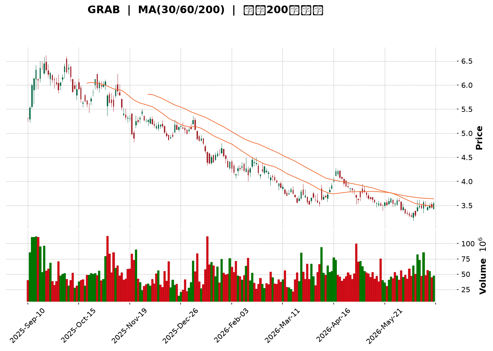
</details>

<html>
<head><meta charset="utf-8" /></head>
<body>
    <div style="height:500px; width:100%;">                        <script>window.PlotlyConfig = {MathJaxConfig: 'local'};</script>
        <script charset="utf-8" src="https://cdn.plot.ly/plotly-3.6.0.min.js" integrity="sha256-QaOVwtVY0T02VaHrr6pnoHLCwayMJp4O5n4YyaE3rJk=" crossorigin="anonymous"></script>                <div id="candlestick-chart" class="plotly-graph-div" style="height:100%; width:100%;"></div>            <script>                window.PLOTLYENV=window.PLOTLYENV || {};                                if (document.getElementById("candlestick-chart")) {                    Plotly.newPlot(                        "candlestick-chart",                        [{"close":{"dtype":"f8","bdata":"AAAAQDMzFUAAAABguB4WQAAAAAAAABhAAAAAIFyPGEAAAAAgrkcZQAAAAGBmZhhAAAAAYGZmGUAAAAAgXI8ZQAAAAMDMzBlAAAAAIK5HGUAAAACgR+EYQAAAAAAAABlAAAAA4KNwGEAAAADgo3AYQAAAAOB6FBhAAAAAoJmZF0AAAABAMzMYQAAAAADXoxhAAAAAIFyPGUAAAADgehQZQAAAAOCjcBlAAAAAgBSuGEAAAADgo3AXQAAAAOBRuBdAAAAAANejF0AAAACAFK4XQAAAAEAK1xZAAAAAIFyPFkAAAACAFK4WQAAAAGBmZhZAAAAAQOF6FkAAAACgR+EWQAAAAGBmZhdAAAAAQOF6GEAAAABgj8IXQAAAAEAzMxhAAAAAIIXrF0AAAACAPQoYQAAAACCuRxhAAAAAANcjF0AAAAAgXI8WQAAAAMAehRZAAAAAoHA9FkAAAACgmZkXQAAAAMAehRdAAAAAwPUoF0AAAADA9SgWQAAAAADXoxVAAAAAgOtRFUAAAAAgrkcVQAAAAKBwPRVAAAAAIIXrE0AAAACgmZkTQAAAAAAAABVAAAAAgML1FEAAAAAgrkcVQAAAAMDMzBVAAAAA4HoUFUAAAACAPQoVQAAAAOB6FBVAAAAAQDMzFUAAAABgj8IUQAAAAADXoxRAAAAAoJmZFEAAAADgUbgUQAAAAOBRuBRAAAAAoJmZFEAAAADgehQUQAAAAMDMzBNAAAAAQOF6E0AAAACAFK4TQAAAAOBRuBNAAAAA4FG4FEAAAACA61EUQAAAAMAehRRAAAAAoJmZFEAAAABgZmYUQAAAACCuRxRAAAAAgML1E0AAAACA61EUQAAAAAApXBRAAAAA4HoUFUAAAACA61EUQAAAAMAehRNAAAAAYGZmE0AAAAAgXI8TQAAAAMD1KBNAAAAAwB6FEkAAAAAgXI8RQAAAAMAehRFAAAAAgD0KEkAAAACgmZkRQAAAAEAzMxJAAAAAgOtREkAAAACgcD0SQAAAAGCPwhJAAAAAYLgeEkAAAACgR+ERQAAAAEAzMxFAAAAAANejEUAAAADgehQRQAAAAGCPwhBAAAAAoJmZEEAAAADgehQRQAAAAIA9ChFAAAAAoHA9EUAAAAAghesQQAAAAOB6FBFAAAAAwB6FEEAAAADgehQRQAAAAMDMzBFAAAAAoJmZEUAAAADAHoURQAAAAOBRuBBAAAAAoJmZEEAAAABACtcQQAAAAKBwPRFAAAAAoEfhEEAAAADgUbgQQAAAAIDrURBAAAAAYGZmEEAAAABguB4QQAAAAEAK1w9AAAAAgBSuD0AAAACAwvUOQAAAAGC4Hg9AAAAAAAAADkAAAACAFK4NQAAAAAAAAA5AAAAA4FG4DkAAAAAAAAAOQAAAAOCjcA1AAAAAQOF6DEAAAABguB4NQAAAAIDrUQ5AAAAAQArXDUAAAACAFK4NQAAAACBcjwxAAAAAoHA9DEAAAAAgrkcNQAAAAAApXA1AAAAAgML1DEAAAABA4XoMQAAAAIDrUQxAAAAAgD0KDUAAAADgo3ANQAAAAOCjcA1AAAAAQArXDUAAAAAgXI8OQAAAAAApXA9AAAAA4HoUEEAAAABACtcQQAAAAEAK1xBAAAAAgOtREEAAAACgcD0QQAAAAIAUrg9AAAAAQDMzD0AAAABguB4PQAAAAKBH4Q5AAAAAIFyPDkAAAAAgXI8OQAAAAAApXA1AAAAAgML1DEAAAADgo3ANQAAAAMD1KA5AAAAAgOtRDkAAAABgj8INQAAAAEAzMw1AAAAAYLgeDUAAAACAPQoNQAAAACBcjwxAAAAAYGZmDEAAAACA61EMQAAAAAAAAAxAAAAA4HoUDEAAAABA4XoMQAAAAOB6FAxAAAAA4FG4DEAAAABguB4NQAAAAIDrUQxAAAAAgOtRDEAAAACgR+EMQAAAAMDMzAxAAAAAIK5HC0AAAACAFK4LQAAAAOBRuApAAAAAANejCkAAAABgZmYKQAAAAMD1KApAAAAAwMzMCkAAAABgZmYKQAAAAIAUrgtAAAAAIIXrC0AAAACgmZkLQAAAACBcjwxAAAAAIIXrC0AAAACAFK4LQAAAACCF6wtAAAAAgBSuC0AAAABgZmYMQA=="},"high":{"dtype":"f8","bdata":"AAAAAClcFUAAAAAgrkcWQAAAAGC4HhhAAAAAANejGEAAAACAFK4ZQAAAAMAehRhAAAAAAAAAGkAAAAAAAAAaQAAAAIDrURpAAAAAQOF6GkAAAADgUbgZQAAAAOB6FBlAAAAAoEfhGEAAAACAFK4YQAAAAKCZmRhAAAAAoEfhGEAAAAAgrkcYQAAAAKBH4RhAAAAAIK7HGUAAAABgZmYaQAAAAECJwRlAAAAAoJmZGUAAAAAgXI8YQAAAACCuRxhAAAAA4HoUGEAAAAAgXI8YQAAAAIDC9RdAAAAAQDOzFkAAAACAajwXQAAAAOBRuBZAAAAAQOF6FkAAAACAPQoXQAAAAMD1qBdAAAAAwB6FGEAAAACAwvUYQAAAAAApXBhAAAAAgOtRGEAAAACA61EYQAAAAIDCdRhAAAAAIK5HF0AAAADgo3AXQAAAAEAKVxdAAAAAwPUoF0AAAAAAAAAYQAAAAOCj8BhAAAAA4HoUGEAAAACgR+EWQAAAAGC4HhZAAAAA4HoUFkAAAACAwnUVQAAAAMAehRVAAAAAANejFUAAAACgcD0UQAAAAEDhehVAAAAAAClcFUAAAADgo3AVQAAAAAAAABZAAAAAQOF6FUAAAACgcD0VQAAAAEAzMxVAAAAAYGZmFUAAAABgZmYVQAAAACBcDxVAAAAAACncFEAAAACAwvUUQAAAAGCPwhRAAAAA4HoUFUAAAAAA16MUQAAAAEAzMxRAAAAAoEfhE0AAAACgR+ETQAAAAGC4HhRAAAAAYLgeFUAAAACAwvUUQAAAAKCZmRRAAAAAANejFEAAAAAghesUQAAAACBcjxRAAAAAAClcFEAAAADAHoUUQAAAAMDMzBRAAAAA4KNwFUAAAACA61EVQAAAAEAzMxRAAAAAoEfhE0AAAACgR+ETQAAAAKCZmRNAAAAAgD0KE0AAAADAHoUSQAAAAGBmZhJAAAAA4FE4EkAAAABAMzMSQAAAAGBmZhJAAAAAIFyPEkAAAACAFK4SQAAAAIAULhNAAAAA4FG4EkAAAADgUTgSQAAAAKBH4RFAAAAA4FG4EUAAAABgj8IRQAAAAEDhehFAAAAAANejEEAAAADAzEwRQAAAAAApXBFAAAAAYLieEUAAAAAgXI8RQAAAAIDC9RFAAAAA4FE4EUAAAABAMzMRQAAAAIA9ChJAAAAAQArXEUAAAADAHgUSQAAAAIA9ihFAAAAAoJmZEEAAAADAHoURQAAAACCuRxFAAAAAYLgeEUAAAACgR+EQQAAAAIA9ihBAAAAA4HqUEEAAAADAHoUQQAAAAMD1KBBAAAAAgBSuD0AAAAAAAAAQQAAAAMAehQ9AAAAAwMzMDkAAAABA4XoOQAAAAADXow5AAAAAgML1DkAAAABAMzMPQAAAAEAK1w1AAAAA4KNwDUAAAACAFK4NQAAAAADXow5AAAAAoJmZD0AAAADgUbgOQAAAAMAehQ1AAAAAgML1DEAAAADgo3ANQAAAAIDrUQ5AAAAAYI\u002fCDUAAAAAAAAAOQAAAAGCPwgxAAAAA4KNwD0AAAABACtcNQAAAAMDMzA1AAAAAoHA9DkAAAADgehQPQAAAAOBRuA9AAAAAAClcEEAAAABguB4RQAAAAAAAABFAAAAAgML1EEAAAADgo3AQQAAAAEAzMxBAAAAAwPUoEEAAAAAghesPQAAAAAAAAA9AAAAAIIXrDkAAAADgUbgOQAAAAKBH4Q1AAAAAQDMzDUAAAADgo3AOQAAAAKCZmQ9AAAAAQDMzD0AAAACgcD0OQAAAAOB6FA5AAAAA4KNwDUAAAADgo3ANQAAAAIDC9QxAAAAAIFyPDEAAAADAzMwMQAAAACBcjwxAAAAAgOkmDEAAAAAA16MMQAAAAIDC9QxAAAAAgOtRDUAAAAAAKVwNQAAAAIDC9QxAAAAAIFyPDEAAAAAgrkcNQAAAACCuRw1AAAAA4FG4DEAAAABgZmYMQAAAAMAehQtAAAAAQDMzC0AAAACAwvUKQAAAAMDMzApAAAAAgML1CkAAAABguB4LQAAAAIDC9QxAAAAAgML1DEAAAAAAKVwMQAAAAKBH4QxAAAAA4FG4DEAAAAAAAAAMQAAAAGBmZgxAAAAAIFyPDEAAAAAA16MMQA=="},"hovertemplate":"\u003cb\u003e%{x|%Y-%m-%d}\u003c\u002fb\u003e\u003cbr\u003e\u958b: $%{open:.2f}\u003cbr\u003e\u9ad8: $%{high:.2f}\u003cbr\u003e\u4f4e: $%{low:.2f}\u003cbr\u003e\u6536: $%{close:.2f}\u003cextra\u003e\u003c\u002fextra\u003e","low":{"dtype":"f8","bdata":"AAAAgML1FEAAAACgR+EUQAAAAIA9ChZAAAAA4KNwFkAAAAAA16MXQAAAAMD1qBdAAAAAoHA9GEAAAAAgrkcZQAAAAKBH4RhAAAAAgD0KGUAAAAAA16MYQAAAAIDC9RdAAAAAwPUoGEAAAADgUbgXQAAAAIDC9RdAAAAAgOtRF0AAAACgmZkXQAAAAKBwPRhAAAAAIFyPGEAAAACAwvUYQAAAACCF6xhAAAAAIK5HGEAAAAAAKVwXQAAAACBcjxdAAAAAwMzMFkAAAACgmZkXQAAAACBcjxZAAAAAwPUoFkAAAACgmZkWQAAAAMD1KBZAAAAAgBSuFUAAAACA61EWQAAAAOB6FBdAAAAAANejF0AAAACgmZkXQAAAAGBmZhdAAAAAgBSuF0AAAADAzMwXQAAAAKCZmRdAAAAA4KNwFUAAAABA4XoWQAAAAIAULhZAAAAAwMzMFUAAAAAghesWQAAAAEAzMxdAAAAAYLgeF0AAAAAghesVQAAAAOCjcBVAAAAA4HoUFUAAAACgR+EUQAAAAAAAABVAAAAAQArXE0AAAAAgrkcTQAAAACCFaxRAAAAAYI\u002fCFEAAAABACtcUQAAAAOCjcBVAAAAAAAAAFUAAAACgR+EUQAAAAKCZmRRAAAAAIK7HFEAAAADgUbgUQAAAAOCjcBRAAAAAgOtRFEAAAABAMzMUQAAAAKBHYRRAAAAA4KNwFEAAAACAwvUTQAAAAIAUrhNAAAAAYGZmE0AAAAAgXI8TQAAAAADXoxNAAAAAgD0KFEAAAAAgrkcUQAAAAGC4HhRAAAAAwMxMFEAAAACgR2EUQAAAAAAAABRAAAAAIIXrE0AAAACAPQoUQAAAAIDrURRAAAAAYI\u002fCFEAAAABgj0IUQAAAAOCjcBNAAAAAgOtRE0AAAAAAKVwTQAAAAAAAABNAAAAAgOtREkAAAACA61ERQAAAAOCjcBFAAAAAYGZmEUAAAAAgXI8RQAAAAOBRuBFAAAAA4HoUEkAAAADA9SgSQAAAAAApXBJAAAAAgD0KEkAAAADAHoURQAAAAMD1KBFAAAAAAAAAEUAAAADgUbgQQAAAAKCZmRBAAAAAoHA9EEAAAACAwnUQQAAAAEAK1xBAAAAAIIXrEEAAAABgj8IQQAAAAMDMzBBAAAAAAAAAEEAAAABgZmYQQAAAAOB6FBFAAAAAYI9CEUAAAACA61ERQAAAAMAehRBAAAAAQDMzEEAAAADgp8YQQAAAACBcjxBAAAAA4FG4EEAAAACgcD0QQAAAAAApXA9AAAAAgD0KEEAAAAAAAAAQQAAAAGCPwg9AAAAAwB6FDkAAAADAzMwOQAAAAEDheg5AAAAAYI\u002fCDUAAAACgmZkNQAAAAGCPwg1AAAAAwPUoDkAAAABACtcNQAAAACCuRw1AAAAAYGZmDEAAAADgUbgMQAAAAIDC9QxAAAAAoJmZDUAAAACA61ENQAAAAKBwPQxAAAAA4HoUDEAAAABgZmYMQAAAAGC4Hg1AAAAAANejDEAAAABA4XoMQAAAAEAK1wtAAAAAwMzMDEAAAACAwvUMQAAAAEAzMw1AAAAAANejDEAAAABgZDsOQAAAAIAUrg5AAAAAQArXD0AAAADgo3AQQAAAAOCjcBBAAAAAQDMzEEAAAADA9SgQQAAAAEAzMw9AAAAAgD0KD0AAAACgR+EOQAAAAIDrUQ5AAAAA4HoUDkAAAAAghesNQAAAAMD1KAxAAAAAgOtRDEAAAADgUbgMQAAAACCF6w1AAAAA4HoUDkAAAAAgrkcNQAAAAIDC9QxAAAAAoEfhDEAAAABA4XoMQAAAAGBmZgxAAAAAgBSuC0AAAABACtcLQAAAACCF6wtAAAAAYLgeC0AAAACgmZkLQAAAACCF6wtAAAAA4HoUDEAAAADgo3AMQAAAAEAK1wtAAAAAQArXC0AAAAAAAAAMQAAAACBcjwxAAAAAgD0KC0AAAACAPQoLQAAAAKCZmQpAAAAAYGZmCkAAAADgehQKQAAAAMD1KApAAAAA4KNwCUAAAADgehQKQAAAAIDC9QpAAAAAQOF6C0AAAADgo3ALQAAAAOBRuApAAAAAYI\u002fCC0AAAABguB4LQAAAAOCjcAtAAAAAwB6FC0AAAABgZmYLQA=="},"name":"\u50f9\u683c","open":{"dtype":"f8","bdata":"AAAAQDMzFUAAAADA9SgVQAAAAEAzMxZAAAAAoJmZF0AAAABA4XoYQAAAAMAehRhAAAAAgD2KGEAAAAAgXI8ZQAAAAEDh+hhAAAAAIIXrGUAAAABAMzMZQAAAAMAehRhAAAAAQArXGEAAAACAwnUYQAAAAKBwPRhAAAAAwPUoGEAAAACAwvUXQAAAAEDhehhAAAAAoJkZGUAAAABAMzMaQAAAAIDrURlAAAAAgD2KGUAAAABA4XoYQAAAAIDC9RdAAAAAwPUoF0AAAACgcD0YQAAAAMDMzBdAAAAAQOF6FkAAAADA9SgXQAAAAOBRuBZAAAAAQOF6FkAAAACAFK4WQAAAAKBHYRdAAAAAAAAAGEAAAAAghesYQAAAAGCPwhdAAAAAAAAAGEAAAACgR+EXQAAAAIA9ChhAAAAAYI9CFkAAAABgj0IXQAAAAMDMzBZAAAAAwMzMFkAAAACgmRkXQAAAACBcDxhAAAAAYGZmF0AAAABACtcWQAAAAMAehRVAAAAAgD2KFUAAAADgUTgVQAAAAEAzMxVAAAAAANejFUAAAACAPQoUQAAAAIAUrhRAAAAA4HoUFUAAAADA9SgVQAAAAADXoxVAAAAAIIVrFUAAAADAHgUVQAAAAIDC9RRAAAAAQArXFEAAAADA9SgVQAAAAGCPwhRAAAAAIIVrFEAAAABgZmYUQAAAAOB6lBRAAAAAYI\u002fCFEAAAACgmZkUQAAAAEDh+hNAAAAAoEfhE0AAAACgmZkTQAAAAKBH4RNAAAAA4HoUFEAAAACAFK4UQAAAAIDrURRAAAAAIFyPFEAAAABA4XoUQAAAAIDCdRRAAAAAIK5HFEAAAACAFC4UQAAAAMAehRRAAAAAYI\u002fCFEAAAABguB4VQAAAAEAzMxRAAAAAYI\u002fCE0AAAABgZmYTQAAAAKCZmRNAAAAAIIXrEkAAAADgo3ASQAAAAIDrURJAAAAAgD2KEUAAAABAMzMSQAAAAMDMzBFAAAAA4HoUEkAAAACgcD0SQAAAAAApXBJAAAAAgBSuEkAAAADA9SgSQAAAAIAUrhFAAAAAYLgeEUAAAADA9agRQAAAAIDrURFAAAAAwB6FEEAAAACgR+EQQAAAAGC4HhFAAAAAwPUoEUAAAADgo3ARQAAAAMDMzBBAAAAAgML1EEAAAABgj8IQQAAAAKBwPRFAAAAA4HqUEUAAAADgo3ARQAAAAMDMTBFAAAAA4KNwEEAAAAAAAAARQAAAAOBRuBBAAAAAwMzMEEAAAAAA16MQQAAAAGC4HhBAAAAA4KNwEEAAAAAAKVwQQAAAACBcDxBAAAAAIK5HD0AAAACAFK4PQAAAAMDMzA5AAAAAANejDkAAAABguB4OQAAAACCF6w1AAAAAoHA9DkAAAACgmZkOQAAAAGCPwg1AAAAAQDMzDUAAAADAzMwMQAAAAEAzMw1AAAAAANejDkAAAABgZmYNQAAAAOCjcA1AAAAA4FG4DEAAAADAzMwMQAAAAAAAAA5AAAAAgML1DEAAAACgR+EMQAAAAMAehQxAAAAAQArXDkAAAACAPQoNQAAAAKCZmQ1AAAAAQDMzDUAAAACgcD0OQAAAAMDMzA5AAAAAAAAAEEAAAABA4XoQQAAAAGC4nhBAAAAAoEfhEEAAAAAAKVwQQAAAAEAzMxBAAAAA4HoUEEAAAABAMzMPQAAAAMDMzA5AAAAAoEfhDkAAAAAgXI8OQAAAAOBRuA1AAAAA4HoUDUAAAAAAKVwOQAAAAMDMzA5AAAAAIFyPDkAAAADA9SgOQAAAAIAUrg1AAAAAAClcDUAAAAAAKVwNQAAAAIDC9QxAAAAAgOtRDEAAAABguB4MQAAAAIDrUQxAAAAA4HoUDEAAAAAAAAAMQAAAAEDhegxAAAAAIK5HDEAAAABA4XoMQAAAAIDC9QxAAAAAoHA9DEAAAADA9SgMQAAAAKBH4QxAAAAAANejDEAAAAAgrkcLQAAAAOCjcAtAAAAAYI\u002fCCkAAAAAA16MKQAAAAGBmZgpAAAAAAAAACkAAAABguB4LQAAAAGC4HgtAAAAAYI\u002fCC0AAAAAAAAAMQAAAAMAehQtAAAAAoBgEDEAAAAAgrkcLQAAAAADXowtAAAAAQDMzDEAAAABgZmYLQA=="},"x":["2025-09-10T00:00:00-04:00","2025-09-11T00:00:00-04:00","2025-09-12T00:00:00-04:00","2025-09-15T00:00:00-04:00","2025-09-16T00:00:00-04:00","2025-09-17T00:00:00-04:00","2025-09-18T00:00:00-04:00","2025-09-19T00:00:00-04:00","2025-09-22T00:00:00-04:00","2025-09-23T00:00:00-04:00","2025-09-24T00:00:00-04:00","2025-09-25T00:00:00-04:00","2025-09-26T00:00:00-04:00","2025-09-29T00:00:00-04:00","2025-09-30T00:00:00-04:00","2025-10-01T00:00:00-04:00","2025-10-02T00:00:00-04:00","2025-10-03T00:00:00-04:00","2025-10-06T00:00:00-04:00","2025-10-07T00:00:00-04:00","2025-10-08T00:00:00-04:00","2025-10-09T00:00:00-04:00","2025-10-10T00:00:00-04:00","2025-10-13T00:00:00-04:00","2025-10-14T00:00:00-04:00","2025-10-15T00:00:00-04:00","2025-10-16T00:00:00-04:00","2025-10-17T00:00:00-04:00","2025-10-20T00:00:00-04:00","2025-10-21T00:00:00-04:00","2025-10-22T00:00:00-04:00","2025-10-23T00:00:00-04:00","2025-10-24T00:00:00-04:00","2025-10-27T00:00:00-04:00","2025-10-28T00:00:00-04:00","2025-10-29T00:00:00-04:00","2025-10-30T00:00:00-04:00","2025-10-31T00:00:00-04:00","2025-11-03T00:00:00-05:00","2025-11-04T00:00:00-05:00","2025-11-05T00:00:00-05:00","2025-11-06T00:00:00-05:00","2025-11-07T00:00:00-05:00","2025-11-10T00:00:00-05:00","2025-11-11T00:00:00-05:00","2025-11-12T00:00:00-05:00","2025-11-13T00:00:00-05:00","2025-11-14T00:00:00-05:00","2025-11-17T00:00:00-05:00","2025-11-18T00:00:00-05:00","2025-11-19T00:00:00-05:00","2025-11-20T00:00:00-05:00","2025-11-21T00:00:00-05:00","2025-11-24T00:00:00-05:00","2025-11-25T00:00:00-05:00","2025-11-26T00:00:00-05:00","2025-11-28T00:00:00-05:00","2025-12-01T00:00:00-05:00","2025-12-02T00:00:00-05:00","2025-12-03T00:00:00-05:00","2025-12-04T00:00:00-05:00","2025-12-05T00:00:00-05:00","2025-12-08T00:00:00-05:00","2025-12-09T00:00:00-05:00","2025-12-10T00:00:00-05:00","2025-12-11T00:00:00-05:00","2025-12-12T00:00:00-05:00","2025-12-15T00:00:00-05:00","2025-12-16T00:00:00-05:00","2025-12-17T00:00:00-05:00","2025-12-18T00:00:00-05:00","2025-12-19T00:00:00-05:00","2025-12-22T00:00:00-05:00","2025-12-23T00:00:00-05:00","2025-12-24T00:00:00-05:00","2025-12-26T00:00:00-05:00","2025-12-29T00:00:00-05:00","2025-12-30T00:00:00-05:00","2025-12-31T00:00:00-05:00","2026-01-02T00:00:00-05:00","2026-01-05T00:00:00-05:00","2026-01-06T00:00:00-05:00","2026-01-07T00:00:00-05:00","2026-01-08T00:00:00-05:00","2026-01-09T00:00:00-05:00","2026-01-12T00:00:00-05:00","2026-01-13T00:00:00-05:00","2026-01-14T00:00:00-05:00","2026-01-15T00:00:00-05:00","2026-01-16T00:00:00-05:00","2026-01-20T00:00:00-05:00","2026-01-21T00:00:00-05:00","2026-01-22T00:00:00-05:00","2026-01-23T00:00:00-05:00","2026-01-26T00:00:00-05:00","2026-01-27T00:00:00-05:00","2026-01-28T00:00:00-05:00","2026-01-29T00:00:00-05:00","2026-01-30T00:00:00-05:00","2026-02-02T00:00:00-05:00","2026-02-03T00:00:00-05:00","2026-02-04T00:00:00-05:00","2026-02-05T00:00:00-05:00","2026-02-06T00:00:00-05:00","2026-02-09T00:00:00-05:00","2026-02-10T00:00:00-05:00","2026-02-11T00:00:00-05:00","2026-02-12T00:00:00-05:00","2026-02-13T00:00:00-05:00","2026-02-17T00:00:00-05:00","2026-02-18T00:00:00-05:00","2026-02-19T00:00:00-05:00","2026-02-20T00:00:00-05:00","2026-02-23T00:00:00-05:00","2026-02-24T00:00:00-05:00","2026-02-25T00:00:00-05:00","2026-02-26T00:00:00-05:00","2026-02-27T00:00:00-05:00","2026-03-02T00:00:00-05:00","2026-03-03T00:00:00-05:00","2026-03-04T00:00:00-05:00","2026-03-05T00:00:00-05:00","2026-03-06T00:00:00-05:00","2026-03-09T00:00:00-04:00","2026-03-10T00:00:00-04:00","2026-03-11T00:00:00-04:00","2026-03-12T00:00:00-04:00","2026-03-13T00:00:00-04:00","2026-03-16T00:00:00-04:00","2026-03-17T00:00:00-04:00","2026-03-18T00:00:00-04:00","2026-03-19T00:00:00-04:00","2026-03-20T00:00:00-04:00","2026-03-23T00:00:00-04:00","2026-03-24T00:00:00-04:00","2026-03-25T00:00:00-04:00","2026-03-26T00:00:00-04:00","2026-03-27T00:00:00-04:00","2026-03-30T00:00:00-04:00","2026-03-31T00:00:00-04:00","2026-04-01T00:00:00-04:00","2026-04-02T00:00:00-04:00","2026-04-06T00:00:00-04:00","2026-04-07T00:00:00-04:00","2026-04-08T00:00:00-04:00","2026-04-09T00:00:00-04:00","2026-04-10T00:00:00-04:00","2026-04-13T00:00:00-04:00","2026-04-14T00:00:00-04:00","2026-04-15T00:00:00-04:00","2026-04-16T00:00:00-04:00","2026-04-17T00:00:00-04:00","2026-04-20T00:00:00-04:00","2026-04-21T00:00:00-04:00","2026-04-22T00:00:00-04:00","2026-04-23T00:00:00-04:00","2026-04-24T00:00:00-04:00","2026-04-27T00:00:00-04:00","2026-04-28T00:00:00-04:00","2026-04-29T00:00:00-04:00","2026-04-30T00:00:00-04:00","2026-05-01T00:00:00-04:00","2026-05-04T00:00:00-04:00","2026-05-05T00:00:00-04:00","2026-05-06T00:00:00-04:00","2026-05-07T00:00:00-04:00","2026-05-08T00:00:00-04:00","2026-05-11T00:00:00-04:00","2026-05-12T00:00:00-04:00","2026-05-13T00:00:00-04:00","2026-05-14T00:00:00-04:00","2026-05-15T00:00:00-04:00","2026-05-18T00:00:00-04:00","2026-05-19T00:00:00-04:00","2026-05-20T00:00:00-04:00","2026-05-21T00:00:00-04:00","2026-05-22T00:00:00-04:00","2026-05-26T00:00:00-04:00","2026-05-27T00:00:00-04:00","2026-05-28T00:00:00-04:00","2026-05-29T00:00:00-04:00","2026-06-01T00:00:00-04:00","2026-06-02T00:00:00-04:00","2026-06-03T00:00:00-04:00","2026-06-04T00:00:00-04:00","2026-06-05T00:00:00-04:00","2026-06-08T00:00:00-04:00","2026-06-09T00:00:00-04:00","2026-06-10T00:00:00-04:00","2026-06-11T00:00:00-04:00","2026-06-12T00:00:00-04:00","2026-06-15T00:00:00-04:00","2026-06-16T00:00:00-04:00","2026-06-17T00:00:00-04:00","2026-06-18T00:00:00-04:00","2026-06-22T00:00:00-04:00","2026-06-23T00:00:00-04:00","2026-06-24T00:00:00-04:00","2026-06-25T00:00:00-04:00","2026-06-26T00:00:00-04:00"],"type":"candlestick"},{"hovertemplate":"MA30: $%{y:.2f}\u003cextra\u003e\u003c\u002fextra\u003e","line":{"color":"#2196F3","dash":"dash","width":2},"mode":"lines","name":"MA30","x":["2025-09-10T00:00:00-04:00","2025-09-11T00:00:00-04:00","2025-09-12T00:00:00-04:00","2025-09-15T00:00:00-04:00","2025-09-16T00:00:00-04:00","2025-09-17T00:00:00-04:00","2025-09-18T00:00:00-04:00","2025-09-19T00:00:00-04:00","2025-09-22T00:00:00-04:00","2025-09-23T00:00:00-04:00","2025-09-24T00:00:00-04:00","2025-09-25T00:00:00-04:00","2025-09-26T00:00:00-04:00","2025-09-29T00:00:00-04:00","2025-09-30T00:00:00-04:00","2025-10-01T00:00:00-04:00","2025-10-02T00:00:00-04:00","2025-10-03T00:00:00-04:00","2025-10-06T00:00:00-04:00","2025-10-07T00:00:00-04:00","2025-10-08T00:00:00-04:00","2025-10-09T00:00:00-04:00","2025-10-10T00:00:00-04:00","2025-10-13T00:00:00-04:00","2025-10-14T00:00:00-04:00","2025-10-15T00:00:00-04:00","2025-10-16T00:00:00-04:00","2025-10-17T00:00:00-04:00","2025-10-20T00:00:00-04:00","2025-10-21T00:00:00-04:00","2025-10-22T00:00:00-04:00","2025-10-23T00:00:00-04:00","2025-10-24T00:00:00-04:00","2025-10-27T00:00:00-04:00","2025-10-28T00:00:00-04:00","2025-10-29T00:00:00-04:00","2025-10-30T00:00:00-04:00","2025-10-31T00:00:00-04:00","2025-11-03T00:00:00-05:00","2025-11-04T00:00:00-05:00","2025-11-05T00:00:00-05:00","2025-11-06T00:00:00-05:00","2025-11-07T00:00:00-05:00","2025-11-10T00:00:00-05:00","2025-11-11T00:00:00-05:00","2025-11-12T00:00:00-05:00","2025-11-13T00:00:00-05:00","2025-11-14T00:00:00-05:00","2025-11-17T00:00:00-05:00","2025-11-18T00:00:00-05:00","2025-11-19T00:00:00-05:00","2025-11-20T00:00:00-05:00","2025-11-21T00:00:00-05:00","2025-11-24T00:00:00-05:00","2025-11-25T00:00:00-05:00","2025-11-26T00:00:00-05:00","2025-11-28T00:00:00-05:00","2025-12-01T00:00:00-05:00","2025-12-02T00:00:00-05:00","2025-12-03T00:00:00-05:00","2025-12-04T00:00:00-05:00","2025-12-05T00:00:00-05:00","2025-12-08T00:00:00-05:00","2025-12-09T00:00:00-05:00","2025-12-10T00:00:00-05:00","2025-12-11T00:00:00-05:00","2025-12-12T00:00:00-05:00","2025-12-15T00:00:00-05:00","2025-12-16T00:00:00-05:00","2025-12-17T00:00:00-05:00","2025-12-18T00:00:00-05:00","2025-12-19T00:00:00-05:00","2025-12-22T00:00:00-05:00","2025-12-23T00:00:00-05:00","2025-12-24T00:00:00-05:00","2025-12-26T00:00:00-05:00","2025-12-29T00:00:00-05:00","2025-12-30T00:00:00-05:00","2025-12-31T00:00:00-05:00","2026-01-02T00:00:00-05:00","2026-01-05T00:00:00-05:00","2026-01-06T00:00:00-05:00","2026-01-07T00:00:00-05:00","2026-01-08T00:00:00-05:00","2026-01-09T00:00:00-05:00","2026-01-12T00:00:00-05:00","2026-01-13T00:00:00-05:00","2026-01-14T00:00:00-05:00","2026-01-15T00:00:00-05:00","2026-01-16T00:00:00-05:00","2026-01-20T00:00:00-05:00","2026-01-21T00:00:00-05:00","2026-01-22T00:00:00-05:00","2026-01-23T00:00:00-05:00","2026-01-26T00:00:00-05:00","2026-01-27T00:00:00-05:00","2026-01-28T00:00:00-05:00","2026-01-29T00:00:00-05:00","2026-01-30T00:00:00-05:00","2026-02-02T00:00:00-05:00","2026-02-03T00:00:00-05:00","2026-02-04T00:00:00-05:00","2026-02-05T00:00:00-05:00","2026-02-06T00:00:00-05:00","2026-02-09T00:00:00-05:00","2026-02-10T00:00:00-05:00","2026-02-11T00:00:00-05:00","2026-02-12T00:00:00-05:00","2026-02-13T00:00:00-05:00","2026-02-17T00:00:00-05:00","2026-02-18T00:00:00-05:00","2026-02-19T00:00:00-05:00","2026-02-20T00:00:00-05:00","2026-02-23T00:00:00-05:00","2026-02-24T00:00:00-05:00","2026-02-25T00:00:00-05:00","2026-02-26T00:00:00-05:00","2026-02-27T00:00:00-05:00","2026-03-02T00:00:00-05:00","2026-03-03T00:00:00-05:00","2026-03-04T00:00:00-05:00","2026-03-05T00:00:00-05:00","2026-03-06T00:00:00-05:00","2026-03-09T00:00:00-04:00","2026-03-10T00:00:00-04:00","2026-03-11T00:00:00-04:00","2026-03-12T00:00:00-04:00","2026-03-13T00:00:00-04:00","2026-03-16T00:00:00-04:00","2026-03-17T00:00:00-04:00","2026-03-18T00:00:00-04:00","2026-03-19T00:00:00-04:00","2026-03-20T00:00:00-04:00","2026-03-23T00:00:00-04:00","2026-03-24T00:00:00-04:00","2026-03-25T00:00:00-04:00","2026-03-26T00:00:00-04:00","2026-03-27T00:00:00-04:00","2026-03-30T00:00:00-04:00","2026-03-31T00:00:00-04:00","2026-04-01T00:00:00-04:00","2026-04-02T00:00:00-04:00","2026-04-06T00:00:00-04:00","2026-04-07T00:00:00-04:00","2026-04-08T00:00:00-04:00","2026-04-09T00:00:00-04:00","2026-04-10T00:00:00-04:00","2026-04-13T00:00:00-04:00","2026-04-14T00:00:00-04:00","2026-04-15T00:00:00-04:00","2026-04-16T00:00:00-04:00","2026-04-17T00:00:00-04:00","2026-04-20T00:00:00-04:00","2026-04-21T00:00:00-04:00","2026-04-22T00:00:00-04:00","2026-04-23T00:00:00-04:00","2026-04-24T00:00:00-04:00","2026-04-27T00:00:00-04:00","2026-04-28T00:00:00-04:00","2026-04-29T00:00:00-04:00","2026-04-30T00:00:00-04:00","2026-05-01T00:00:00-04:00","2026-05-04T00:00:00-04:00","2026-05-05T00:00:00-04:00","2026-05-06T00:00:00-04:00","2026-05-07T00:00:00-04:00","2026-05-08T00:00:00-04:00","2026-05-11T00:00:00-04:00","2026-05-12T00:00:00-04:00","2026-05-13T00:00:00-04:00","2026-05-14T00:00:00-04:00","2026-05-15T00:00:00-04:00","2026-05-18T00:00:00-04:00","2026-05-19T00:00:00-04:00","2026-05-20T00:00:00-04:00","2026-05-21T00:00:00-04:00","2026-05-22T00:00:00-04:00","2026-05-26T00:00:00-04:00","2026-05-27T00:00:00-04:00","2026-05-28T00:00:00-04:00","2026-05-29T00:00:00-04:00","2026-06-01T00:00:00-04:00","2026-06-02T00:00:00-04:00","2026-06-03T00:00:00-04:00","2026-06-04T00:00:00-04:00","2026-06-05T00:00:00-04:00","2026-06-08T00:00:00-04:00","2026-06-09T00:00:00-04:00","2026-06-10T00:00:00-04:00","2026-06-11T00:00:00-04:00","2026-06-12T00:00:00-04:00","2026-06-15T00:00:00-04:00","2026-06-16T00:00:00-04:00","2026-06-17T00:00:00-04:00","2026-06-18T00:00:00-04:00","2026-06-22T00:00:00-04:00","2026-06-23T00:00:00-04:00","2026-06-24T00:00:00-04:00","2026-06-25T00:00:00-04:00","2026-06-26T00:00:00-04:00"],"y":{"dtype":"f8","bdata":"AAAAAAAA+H8AAAAAAAD4fwAAAAAAAPh\u002fAAAAAAAA+H8AAAAAAAD4fwAAAAAAAPh\u002fAAAAAAAA+H8AAAAAAAD4fwAAAAAAAPh\u002fAAAAAAAA+H8AAAAAAAD4fwAAAAAAAPh\u002fAAAAAAAA+H8AAAAAAAD4fwAAAAAAAPh\u002fAAAAAAAA+H8AAAAAAAD4fwAAAAAAAPh\u002fAAAAAAAA+H8AAAAAAAD4fwAAAAAAAPh\u002fAAAAAAAA+H8AAAAAAAD4fwAAAAAAAPh\u002fAAAAAAAA+H8AAAAAAAD4fwAAAAAAAPh\u002fAAAAAAAA+H8AAAAAAAD4f6uqqtpAJxhA3t3dDS0yGEC8u7tLqTgYQDMzM5OKMxhAAAAA0NsyGEAiIiJS4yUYQKuqqmouJBhA7+7uTo0XGEAiIiLSlAoYQFVVVVWc\u002fRdA3t3dbVnrF0AAAABQjdcXQLy7u6tjwhdAIiIisp2vF0AAAACwcqgXQJqZmVmroxdAd3d3J+qfF0BERES0gY4XQKuqqhrodBdA7+7urrlQF0BVVVV1TDAXQKuqqmp1DBdAmpmZCdfjFkDe3d1tEsMWQAAAAIDcqxZAMzMz8\u002f2UFkAiIiISg4AWQHd3dyejdxZAvLu7CwJrFkCamZlpA10WQERERNS\u002fURZAERERodNGFkC8u7trvDQWQLy7uxsvHRZA7+7uHhP8FUAzMzMjIuIVQFVVVfVvxBVA7+7uThuoFUDe3d2NUIYVQHd3d9cVYBVAMzMzc9pAFUDv7u7+RigVQM3MzExiEBVA7+7uzmkDFUCamZmJbOcUQAAAAPDSzRRAiYiIiPq3FEARERHB9agUQKuqqspanRRAMzMz07+RFEC8u7urjokUQImIiEgMghRAd3d3V\u002fKLFEBEREQ0F5IUQImIiBh2hRRAmpmZOSZ4FEAzMzPTeGkUQImIiKjxUhRAERERQRk9FEAzMzMTZx8UQDMzMyMGARRAMzMzAw\u002fmE0AzMzPjF8sTQBEREaFFthNARERE5NCiE0AAAABAp40TQBEREZHtfBNAzczM7MNnE0AzMzPz\u002fVQTQKuqqirOPhNAAAAAoBovE0BmZmbW6hgTQO\u002fu7p6o\u002fxJAiYiIWIDcEkBVVVV12sASQImIiEgooxJAAAAAQHyGEkAzMzMTymgSQBEREZF7TRJAZmZmxiAwEkAzMzPjehQSQKuqqnqi\u002fhFA3t3dTfDgEUDNzMycC8kRQKuqquomsRFAmpmZOUKZEUC8u7tLDIIRQN7d3f2pcRFAq6qqWqtjEUCJiIhYgFwRQHd3d+dCUhFAREREREREEUCJiIgoozcRQLy7u2suJBFAd3d3xwQPEUB3d3d3d\u002fcQQN7d3fUo3BBA7+7uNonBEEBEREQ8mKcQQKuqqkLSlBBAZmZmhl2BEEAiIiKynW8QQHd3dz81XhBAd3d3vxFKEECamZm5kDQQQM3MzMyFJBBA7+7urrkQEEBVVVW18\u002f0PQCIiIlIqzg9A7+7ujjSlD0CamZkJkHsPQN7d3Y1QRg9AAAAAEBERD0BVVVWFFtkOQGZmZrZlrQ5A3t3dDeaJDkAiIiKit2UOQGZmZpa1Og5AiYiIOEIZDkBERETErgAOQBEREZHC9Q1Ad3d3d0zwDUARERExlvwNQLy7u7tJDA5AIiIi4noUDkAAAABgcyEOQGZmZrY6Jg5Ad3d3J3gwDkAiIiLiwTwOQFVVVUVERA5A7+7uvuZCDkBVVVUVrkcOQCIiIlL\u002fRg5AVVVV5RdLDkAiIiLy0k0OQLy7u2t1TA5A7+7u\u002fo1QDkAiIiLCPFEOQM3MzNyyVg5AERERQTVeDkB3d3f3KFwOQGZmZlZVVQ5AAAAAAI5QDkCamZl5ME8OQM3MzGx1TA5AVVVVRUREDkDe3d0dEzwOQGZmZiZ4MA5AiYiIeOkmDkDv7u6+nxoOQDMzM8OuAA5Ad3d3J+rfDUBERERk9LYNQN7d3d1PjQ1AVVVVxZJfDUAzMzMDnTYNQJqZmblJDA1AAAAAQGDlDEAAAABAGb0MQBEREUHSlAxAiYiIaLx0DEAAAADAPFEMQLy7u7vmQgxAIiIi0gY6DEB3d3dHUyoMQGZmZgasHAxAVVVVJTEIDEARERFRcfYLQM3MzByF6wtAIiIiYjvfC0B3d3dHxdkLQA=="},"type":"scatter"},{"hovertemplate":"MA60: $%{y:.2f}\u003cextra\u003e\u003c\u002fextra\u003e","line":{"color":"#9C27B0","dash":"dash","width":2},"mode":"lines","name":"MA60","x":["2025-09-10T00:00:00-04:00","2025-09-11T00:00:00-04:00","2025-09-12T00:00:00-04:00","2025-09-15T00:00:00-04:00","2025-09-16T00:00:00-04:00","2025-09-17T00:00:00-04:00","2025-09-18T00:00:00-04:00","2025-09-19T00:00:00-04:00","2025-09-22T00:00:00-04:00","2025-09-23T00:00:00-04:00","2025-09-24T00:00:00-04:00","2025-09-25T00:00:00-04:00","2025-09-26T00:00:00-04:00","2025-09-29T00:00:00-04:00","2025-09-30T00:00:00-04:00","2025-10-01T00:00:00-04:00","2025-10-02T00:00:00-04:00","2025-10-03T00:00:00-04:00","2025-10-06T00:00:00-04:00","2025-10-07T00:00:00-04:00","2025-10-08T00:00:00-04:00","2025-10-09T00:00:00-04:00","2025-10-10T00:00:00-04:00","2025-10-13T00:00:00-04:00","2025-10-14T00:00:00-04:00","2025-10-15T00:00:00-04:00","2025-10-16T00:00:00-04:00","2025-10-17T00:00:00-04:00","2025-10-20T00:00:00-04:00","2025-10-21T00:00:00-04:00","2025-10-22T00:00:00-04:00","2025-10-23T00:00:00-04:00","2025-10-24T00:00:00-04:00","2025-10-27T00:00:00-04:00","2025-10-28T00:00:00-04:00","2025-10-29T00:00:00-04:00","2025-10-30T00:00:00-04:00","2025-10-31T00:00:00-04:00","2025-11-03T00:00:00-05:00","2025-11-04T00:00:00-05:00","2025-11-05T00:00:00-05:00","2025-11-06T00:00:00-05:00","2025-11-07T00:00:00-05:00","2025-11-10T00:00:00-05:00","2025-11-11T00:00:00-05:00","2025-11-12T00:00:00-05:00","2025-11-13T00:00:00-05:00","2025-11-14T00:00:00-05:00","2025-11-17T00:00:00-05:00","2025-11-18T00:00:00-05:00","2025-11-19T00:00:00-05:00","2025-11-20T00:00:00-05:00","2025-11-21T00:00:00-05:00","2025-11-24T00:00:00-05:00","2025-11-25T00:00:00-05:00","2025-11-26T00:00:00-05:00","2025-11-28T00:00:00-05:00","2025-12-01T00:00:00-05:00","2025-12-02T00:00:00-05:00","2025-12-03T00:00:00-05:00","2025-12-04T00:00:00-05:00","2025-12-05T00:00:00-05:00","2025-12-08T00:00:00-05:00","2025-12-09T00:00:00-05:00","2025-12-10T00:00:00-05:00","2025-12-11T00:00:00-05:00","2025-12-12T00:00:00-05:00","2025-12-15T00:00:00-05:00","2025-12-16T00:00:00-05:00","2025-12-17T00:00:00-05:00","2025-12-18T00:00:00-05:00","2025-12-19T00:00:00-05:00","2025-12-22T00:00:00-05:00","2025-12-23T00:00:00-05:00","2025-12-24T00:00:00-05:00","2025-12-26T00:00:00-05:00","2025-12-29T00:00:00-05:00","2025-12-30T00:00:00-05:00","2025-12-31T00:00:00-05:00","2026-01-02T00:00:00-05:00","2026-01-05T00:00:00-05:00","2026-01-06T00:00:00-05:00","2026-01-07T00:00:00-05:00","2026-01-08T00:00:00-05:00","2026-01-09T00:00:00-05:00","2026-01-12T00:00:00-05:00","2026-01-13T00:00:00-05:00","2026-01-14T00:00:00-05:00","2026-01-15T00:00:00-05:00","2026-01-16T00:00:00-05:00","2026-01-20T00:00:00-05:00","2026-01-21T00:00:00-05:00","2026-01-22T00:00:00-05:00","2026-01-23T00:00:00-05:00","2026-01-26T00:00:00-05:00","2026-01-27T00:00:00-05:00","2026-01-28T00:00:00-05:00","2026-01-29T00:00:00-05:00","2026-01-30T00:00:00-05:00","2026-02-02T00:00:00-05:00","2026-02-03T00:00:00-05:00","2026-02-04T00:00:00-05:00","2026-02-05T00:00:00-05:00","2026-02-06T00:00:00-05:00","2026-02-09T00:00:00-05:00","2026-02-10T00:00:00-05:00","2026-02-11T00:00:00-05:00","2026-02-12T00:00:00-05:00","2026-02-13T00:00:00-05:00","2026-02-17T00:00:00-05:00","2026-02-18T00:00:00-05:00","2026-02-19T00:00:00-05:00","2026-02-20T00:00:00-05:00","2026-02-23T00:00:00-05:00","2026-02-24T00:00:00-05:00","2026-02-25T00:00:00-05:00","2026-02-26T00:00:00-05:00","2026-02-27T00:00:00-05:00","2026-03-02T00:00:00-05:00","2026-03-03T00:00:00-05:00","2026-03-04T00:00:00-05:00","2026-03-05T00:00:00-05:00","2026-03-06T00:00:00-05:00","2026-03-09T00:00:00-04:00","2026-03-10T00:00:00-04:00","2026-03-11T00:00:00-04:00","2026-03-12T00:00:00-04:00","2026-03-13T00:00:00-04:00","2026-03-16T00:00:00-04:00","2026-03-17T00:00:00-04:00","2026-03-18T00:00:00-04:00","2026-03-19T00:00:00-04:00","2026-03-20T00:00:00-04:00","2026-03-23T00:00:00-04:00","2026-03-24T00:00:00-04:00","2026-03-25T00:00:00-04:00","2026-03-26T00:00:00-04:00","2026-03-27T00:00:00-04:00","2026-03-30T00:00:00-04:00","2026-03-31T00:00:00-04:00","2026-04-01T00:00:00-04:00","2026-04-02T00:00:00-04:00","2026-04-06T00:00:00-04:00","2026-04-07T00:00:00-04:00","2026-04-08T00:00:00-04:00","2026-04-09T00:00:00-04:00","2026-04-10T00:00:00-04:00","2026-04-13T00:00:00-04:00","2026-04-14T00:00:00-04:00","2026-04-15T00:00:00-04:00","2026-04-16T00:00:00-04:00","2026-04-17T00:00:00-04:00","2026-04-20T00:00:00-04:00","2026-04-21T00:00:00-04:00","2026-04-22T00:00:00-04:00","2026-04-23T00:00:00-04:00","2026-04-24T00:00:00-04:00","2026-04-27T00:00:00-04:00","2026-04-28T00:00:00-04:00","2026-04-29T00:00:00-04:00","2026-04-30T00:00:00-04:00","2026-05-01T00:00:00-04:00","2026-05-04T00:00:00-04:00","2026-05-05T00:00:00-04:00","2026-05-06T00:00:00-04:00","2026-05-07T00:00:00-04:00","2026-05-08T00:00:00-04:00","2026-05-11T00:00:00-04:00","2026-05-12T00:00:00-04:00","2026-05-13T00:00:00-04:00","2026-05-14T00:00:00-04:00","2026-05-15T00:00:00-04:00","2026-05-18T00:00:00-04:00","2026-05-19T00:00:00-04:00","2026-05-20T00:00:00-04:00","2026-05-21T00:00:00-04:00","2026-05-22T00:00:00-04:00","2026-05-26T00:00:00-04:00","2026-05-27T00:00:00-04:00","2026-05-28T00:00:00-04:00","2026-05-29T00:00:00-04:00","2026-06-01T00:00:00-04:00","2026-06-02T00:00:00-04:00","2026-06-03T00:00:00-04:00","2026-06-04T00:00:00-04:00","2026-06-05T00:00:00-04:00","2026-06-08T00:00:00-04:00","2026-06-09T00:00:00-04:00","2026-06-10T00:00:00-04:00","2026-06-11T00:00:00-04:00","2026-06-12T00:00:00-04:00","2026-06-15T00:00:00-04:00","2026-06-16T00:00:00-04:00","2026-06-17T00:00:00-04:00","2026-06-18T00:00:00-04:00","2026-06-22T00:00:00-04:00","2026-06-23T00:00:00-04:00","2026-06-24T00:00:00-04:00","2026-06-25T00:00:00-04:00","2026-06-26T00:00:00-04:00"],"y":{"dtype":"f8","bdata":"AAAAAAAA+H8AAAAAAAD4fwAAAAAAAPh\u002fAAAAAAAA+H8AAAAAAAD4fwAAAAAAAPh\u002fAAAAAAAA+H8AAAAAAAD4fwAAAAAAAPh\u002fAAAAAAAA+H8AAAAAAAD4fwAAAAAAAPh\u002fAAAAAAAA+H8AAAAAAAD4fwAAAAAAAPh\u002fAAAAAAAA+H8AAAAAAAD4fwAAAAAAAPh\u002fAAAAAAAA+H8AAAAAAAD4fwAAAAAAAPh\u002fAAAAAAAA+H8AAAAAAAD4fwAAAAAAAPh\u002fAAAAAAAA+H8AAAAAAAD4fwAAAAAAAPh\u002fAAAAAAAA+H8AAAAAAAD4fwAAAAAAAPh\u002fAAAAAAAA+H8AAAAAAAD4fwAAAAAAAPh\u002fAAAAAAAA+H8AAAAAAAD4fwAAAAAAAPh\u002fAAAAAAAA+H8AAAAAAAD4fwAAAAAAAPh\u002fAAAAAAAA+H8AAAAAAAD4fwAAAAAAAPh\u002fAAAAAAAA+H8AAAAAAAD4fwAAAAAAAPh\u002fAAAAAAAA+H8AAAAAAAD4fwAAAAAAAPh\u002fAAAAAAAA+H8AAAAAAAD4fwAAAAAAAPh\u002fAAAAAAAA+H8AAAAAAAD4fwAAAAAAAPh\u002fAAAAAAAA+H8AAAAAAAD4fwAAAAAAAPh\u002fAAAAAAAA+H8AAAAAAAD4f3d3d1eAPBdAd3d3V4A8F0C8u7vbsjYXQHd3d9dcKBdAd3d3d3cXF0Crqqq6AgQXQAAAADBP9BZA7+7uTtTfFkAAAACwcsgWQGZmZhbZrhZAiYiI8BmWFkB3d3cn6n8WQERERPxiaRZAiYiIwINZFkDNzMyc70cWQM3MzCS\u002fOBZAAAAAWPIrFkCrqqq6uxsWQKuqqnIhCRZAERERwTzxFUCJiIiQ7dwVQJqZmdlAxxVAiYiIsOS3FUARERHRlKoVQEREREypmBVAZmZmFpKGFUCrqqry\u002fXQVQAAAAGhKZRVAZmZmpg1UFUBmZmY+NT4VQLy7u\u002ftiKRVAIiIiUnEWFUB3d3cn6v8UQGZmZl666RRAmpmZAXLPFECamZmx5LcUQDMzM8OuoBRA3t3dne+HFECJiIhAp20UQBEREQFyTxRAmpmZifo3FECrqqrqmCAUQN7d3XUFCBRAvLu7E\u002fXvE0B3d3d\u002fI9QTQERERJx9uBNAREREZDufE0AiIiLq34gTQN7d3S1rdRNAzczMTPBgE0B3d3fHBE8TQJqZmWFXQBNAq6qqUnE2E0CJiIhokS0TQJqZmYFOGxNAmpmZObQIE0B3d3ePwvUSQDMzM9NN4hJA3t3dTWLQEkDe3d21870SQFVVVYWkqRJAvLu7oymVEkDe3d2FXYESQGZmZgY6bRJA3t3d1epYEkC8u7tbj0ISQHd3d0OLLBJA3t3dkaYUEkC8u7sXS\u002f4RQKuqqjbQ6RFAMzMzEzzYEUBERERERMQRQDMzM+\u002furhFAAAAADEmTEUB3d3eXtXoRQKuqqgrXYxFAd3d395pLEUDv7u724TMRQBEREV1IGhFA7+7uhl0BEUAAAAB0IekQQM3MzGDl0BBA7+7uary0EEC8u7tvy5oQQO\u002fu7uLsgxBAREREoBpvEEBmZmYOdFoQQImIiGSCRxBAd3d3OyY4EEBVVVXday4QQAAAABiSJhBAAAAAQDUeEECJiIgg9xoQQM3MzKQpFRBAREREHKEMEEC8u7uTGAQQQBEREVFG7w9Aq6qqSsXZD0BVVVUt+cUPQFVVVWX0tg9A3t3d5dCiD0DNzMy8dJMPQImIiOi0gQ9AIiIisp1vD0CrqqoyelsPQKuqqoLASg9AZmZmrgA5D0C8u7s7mCcPQHd3d5duEg9AAAAA6LQBD0CJiIiA3OsOQCIiIvLSzQ5AAAAAiM+wDkB3d3d\u002fI5QOQJqZmZHtfA5AmpmZKRVnDkAAAABg5VAOQGZmZt6WNQ5AiYiI2BUgDkCamZlBpw0OQCIiIqo4+w1Ad3d3TxvoDUCrqqpKxdkNQM3MzMzMzA1AvLu70wa6DUCamZkxCKwNQAAAADhCmQ1AvLu7M+yKDUARERGR7XwNQDMzM0OLbA1AvLu7k9FbDUCrqqpqdUwNQO\u002fu7gbzRA1AvLu7W49CDUDNzMwcEzwNQBEREbmQNA1AIiIikl8sDUCamZkJ1yMNQM3MzPwbIQ1AmpmZUbgeDUB3d3cf9xoNQA=="},"type":"scatter"},{"hovertemplate":"MA200: $%{y:.2f}\u003cextra\u003e\u003c\u002fextra\u003e","line":{"color":"#FF6F00","dash":"solid","width":2},"mode":"lines","name":"MA200","x":["2025-09-10T00:00:00-04:00","2025-09-11T00:00:00-04:00","2025-09-12T00:00:00-04:00","2025-09-15T00:00:00-04:00","2025-09-16T00:00:00-04:00","2025-09-17T00:00:00-04:00","2025-09-18T00:00:00-04:00","2025-09-19T00:00:00-04:00","2025-09-22T00:00:00-04:00","2025-09-23T00:00:00-04:00","2025-09-24T00:00:00-04:00","2025-09-25T00:00:00-04:00","2025-09-26T00:00:00-04:00","2025-09-29T00:00:00-04:00","2025-09-30T00:00:00-04:00","2025-10-01T00:00:00-04:00","2025-10-02T00:00:00-04:00","2025-10-03T00:00:00-04:00","2025-10-06T00:00:00-04:00","2025-10-07T00:00:00-04:00","2025-10-08T00:00:00-04:00","2025-10-09T00:00:00-04:00","2025-10-10T00:00:00-04:00","2025-10-13T00:00:00-04:00","2025-10-14T00:00:00-04:00","2025-10-15T00:00:00-04:00","2025-10-16T00:00:00-04:00","2025-10-17T00:00:00-04:00","2025-10-20T00:00:00-04:00","2025-10-21T00:00:00-04:00","2025-10-22T00:00:00-04:00","2025-10-23T00:00:00-04:00","2025-10-24T00:00:00-04:00","2025-10-27T00:00:00-04:00","2025-10-28T00:00:00-04:00","2025-10-29T00:00:00-04:00","2025-10-30T00:00:00-04:00","2025-10-31T00:00:00-04:00","2025-11-03T00:00:00-05:00","2025-11-04T00:00:00-05:00","2025-11-05T00:00:00-05:00","2025-11-06T00:00:00-05:00","2025-11-07T00:00:00-05:00","2025-11-10T00:00:00-05:00","2025-11-11T00:00:00-05:00","2025-11-12T00:00:00-05:00","2025-11-13T00:00:00-05:00","2025-11-14T00:00:00-05:00","2025-11-17T00:00:00-05:00","2025-11-18T00:00:00-05:00","2025-11-19T00:00:00-05:00","2025-11-20T00:00:00-05:00","2025-11-21T00:00:00-05:00","2025-11-24T00:00:00-05:00","2025-11-25T00:00:00-05:00","2025-11-26T00:00:00-05:00","2025-11-28T00:00:00-05:00","2025-12-01T00:00:00-05:00","2025-12-02T00:00:00-05:00","2025-12-03T00:00:00-05:00","2025-12-04T00:00:00-05:00","2025-12-05T00:00:00-05:00","2025-12-08T00:00:00-05:00","2025-12-09T00:00:00-05:00","2025-12-10T00:00:00-05:00","2025-12-11T00:00:00-05:00","2025-12-12T00:00:00-05:00","2025-12-15T00:00:00-05:00","2025-12-16T00:00:00-05:00","2025-12-17T00:00:00-05:00","2025-12-18T00:00:00-05:00","2025-12-19T00:00:00-05:00","2025-12-22T00:00:00-05:00","2025-12-23T00:00:00-05:00","2025-12-24T00:00:00-05:00","2025-12-26T00:00:00-05:00","2025-12-29T00:00:00-05:00","2025-12-30T00:00:00-05:00","2025-12-31T00:00:00-05:00","2026-01-02T00:00:00-05:00","2026-01-05T00:00:00-05:00","2026-01-06T00:00:00-05:00","2026-01-07T00:00:00-05:00","2026-01-08T00:00:00-05:00","2026-01-09T00:00:00-05:00","2026-01-12T00:00:00-05:00","2026-01-13T00:00:00-05:00","2026-01-14T00:00:00-05:00","2026-01-15T00:00:00-05:00","2026-01-16T00:00:00-05:00","2026-01-20T00:00:00-05:00","2026-01-21T00:00:00-05:00","2026-01-22T00:00:00-05:00","2026-01-23T00:00:00-05:00","2026-01-26T00:00:00-05:00","2026-01-27T00:00:00-05:00","2026-01-28T00:00:00-05:00","2026-01-29T00:00:00-05:00","2026-01-30T00:00:00-05:00","2026-02-02T00:00:00-05:00","2026-02-03T00:00:00-05:00","2026-02-04T00:00:00-05:00","2026-02-05T00:00:00-05:00","2026-02-06T00:00:00-05:00","2026-02-09T00:00:00-05:00","2026-02-10T00:00:00-05:00","2026-02-11T00:00:00-05:00","2026-02-12T00:00:00-05:00","2026-02-13T00:00:00-05:00","2026-02-17T00:00:00-05:00","2026-02-18T00:00:00-05:00","2026-02-19T00:00:00-05:00","2026-02-20T00:00:00-05:00","2026-02-23T00:00:00-05:00","2026-02-24T00:00:00-05:00","2026-02-25T00:00:00-05:00","2026-02-26T00:00:00-05:00","2026-02-27T00:00:00-05:00","2026-03-02T00:00:00-05:00","2026-03-03T00:00:00-05:00","2026-03-04T00:00:00-05:00","2026-03-05T00:00:00-05:00","2026-03-06T00:00:00-05:00","2026-03-09T00:00:00-04:00","2026-03-10T00:00:00-04:00","2026-03-11T00:00:00-04:00","2026-03-12T00:00:00-04:00","2026-03-13T00:00:00-04:00","2026-03-16T00:00:00-04:00","2026-03-17T00:00:00-04:00","2026-03-18T00:00:00-04:00","2026-03-19T00:00:00-04:00","2026-03-20T00:00:00-04:00","2026-03-23T00:00:00-04:00","2026-03-24T00:00:00-04:00","2026-03-25T00:00:00-04:00","2026-03-26T00:00:00-04:00","2026-03-27T00:00:00-04:00","2026-03-30T00:00:00-04:00","2026-03-31T00:00:00-04:00","2026-04-01T00:00:00-04:00","2026-04-02T00:00:00-04:00","2026-04-06T00:00:00-04:00","2026-04-07T00:00:00-04:00","2026-04-08T00:00:00-04:00","2026-04-09T00:00:00-04:00","2026-04-10T00:00:00-04:00","2026-04-13T00:00:00-04:00","2026-04-14T00:00:00-04:00","2026-04-15T00:00:00-04:00","2026-04-16T00:00:00-04:00","2026-04-17T00:00:00-04:00","2026-04-20T00:00:00-04:00","2026-04-21T00:00:00-04:00","2026-04-22T00:00:00-04:00","2026-04-23T00:00:00-04:00","2026-04-24T00:00:00-04:00","2026-04-27T00:00:00-04:00","2026-04-28T00:00:00-04:00","2026-04-29T00:00:00-04:00","2026-04-30T00:00:00-04:00","2026-05-01T00:00:00-04:00","2026-05-04T00:00:00-04:00","2026-05-05T00:00:00-04:00","2026-05-06T00:00:00-04:00","2026-05-07T00:00:00-04:00","2026-05-08T00:00:00-04:00","2026-05-11T00:00:00-04:00","2026-05-12T00:00:00-04:00","2026-05-13T00:00:00-04:00","2026-05-14T00:00:00-04:00","2026-05-15T00:00:00-04:00","2026-05-18T00:00:00-04:00","2026-05-19T00:00:00-04:00","2026-05-20T00:00:00-04:00","2026-05-21T00:00:00-04:00","2026-05-22T00:00:00-04:00","2026-05-26T00:00:00-04:00","2026-05-27T00:00:00-04:00","2026-05-28T00:00:00-04:00","2026-05-29T00:00:00-04:00","2026-06-01T00:00:00-04:00","2026-06-02T00:00:00-04:00","2026-06-03T00:00:00-04:00","2026-06-04T00:00:00-04:00","2026-06-05T00:00:00-04:00","2026-06-08T00:00:00-04:00","2026-06-09T00:00:00-04:00","2026-06-10T00:00:00-04:00","2026-06-11T00:00:00-04:00","2026-06-12T00:00:00-04:00","2026-06-15T00:00:00-04:00","2026-06-16T00:00:00-04:00","2026-06-17T00:00:00-04:00","2026-06-18T00:00:00-04:00","2026-06-22T00:00:00-04:00","2026-06-23T00:00:00-04:00","2026-06-24T00:00:00-04:00","2026-06-25T00:00:00-04:00","2026-06-26T00:00:00-04:00"],"y":{"dtype":"f8","bdata":"AAAAAAAA+H8AAAAAAAD4fwAAAAAAAPh\u002fAAAAAAAA+H8AAAAAAAD4fwAAAAAAAPh\u002fAAAAAAAA+H8AAAAAAAD4fwAAAAAAAPh\u002fAAAAAAAA+H8AAAAAAAD4fwAAAAAAAPh\u002fAAAAAAAA+H8AAAAAAAD4fwAAAAAAAPh\u002fAAAAAAAA+H8AAAAAAAD4fwAAAAAAAPh\u002fAAAAAAAA+H8AAAAAAAD4fwAAAAAAAPh\u002fAAAAAAAA+H8AAAAAAAD4fwAAAAAAAPh\u002fAAAAAAAA+H8AAAAAAAD4fwAAAAAAAPh\u002fAAAAAAAA+H8AAAAAAAD4fwAAAAAAAPh\u002fAAAAAAAA+H8AAAAAAAD4fwAAAAAAAPh\u002fAAAAAAAA+H8AAAAAAAD4fwAAAAAAAPh\u002fAAAAAAAA+H8AAAAAAAD4fwAAAAAAAPh\u002fAAAAAAAA+H8AAAAAAAD4fwAAAAAAAPh\u002fAAAAAAAA+H8AAAAAAAD4fwAAAAAAAPh\u002fAAAAAAAA+H8AAAAAAAD4fwAAAAAAAPh\u002fAAAAAAAA+H8AAAAAAAD4fwAAAAAAAPh\u002fAAAAAAAA+H8AAAAAAAD4fwAAAAAAAPh\u002fAAAAAAAA+H8AAAAAAAD4fwAAAAAAAPh\u002fAAAAAAAA+H8AAAAAAAD4fwAAAAAAAPh\u002fAAAAAAAA+H8AAAAAAAD4fwAAAAAAAPh\u002fAAAAAAAA+H8AAAAAAAD4fwAAAAAAAPh\u002fAAAAAAAA+H8AAAAAAAD4fwAAAAAAAPh\u002fAAAAAAAA+H8AAAAAAAD4fwAAAAAAAPh\u002fAAAAAAAA+H8AAAAAAAD4fwAAAAAAAPh\u002fAAAAAAAA+H8AAAAAAAD4fwAAAAAAAPh\u002fAAAAAAAA+H8AAAAAAAD4fwAAAAAAAPh\u002fAAAAAAAA+H8AAAAAAAD4fwAAAAAAAPh\u002fAAAAAAAA+H8AAAAAAAD4fwAAAAAAAPh\u002fAAAAAAAA+H8AAAAAAAD4fwAAAAAAAPh\u002fAAAAAAAA+H8AAAAAAAD4fwAAAAAAAPh\u002fAAAAAAAA+H8AAAAAAAD4fwAAAAAAAPh\u002fAAAAAAAA+H8AAAAAAAD4fwAAAAAAAPh\u002fAAAAAAAA+H8AAAAAAAD4fwAAAAAAAPh\u002fAAAAAAAA+H8AAAAAAAD4fwAAAAAAAPh\u002fAAAAAAAA+H8AAAAAAAD4fwAAAAAAAPh\u002fAAAAAAAA+H8AAAAAAAD4fwAAAAAAAPh\u002fAAAAAAAA+H8AAAAAAAD4fwAAAAAAAPh\u002fAAAAAAAA+H8AAAAAAAD4fwAAAAAAAPh\u002fAAAAAAAA+H8AAAAAAAD4fwAAAAAAAPh\u002fAAAAAAAA+H8AAAAAAAD4fwAAAAAAAPh\u002fAAAAAAAA+H8AAAAAAAD4fwAAAAAAAPh\u002fAAAAAAAA+H8AAAAAAAD4fwAAAAAAAPh\u002fAAAAAAAA+H8AAAAAAAD4fwAAAAAAAPh\u002fAAAAAAAA+H8AAAAAAAD4fwAAAAAAAPh\u002fAAAAAAAA+H8AAAAAAAD4fwAAAAAAAPh\u002fAAAAAAAA+H8AAAAAAAD4fwAAAAAAAPh\u002fAAAAAAAA+H8AAAAAAAD4fwAAAAAAAPh\u002fAAAAAAAA+H8AAAAAAAD4fwAAAAAAAPh\u002fAAAAAAAA+H8AAAAAAAD4fwAAAAAAAPh\u002fAAAAAAAA+H8AAAAAAAD4fwAAAAAAAPh\u002fAAAAAAAA+H8AAAAAAAD4fwAAAAAAAPh\u002fAAAAAAAA+H8AAAAAAAD4fwAAAAAAAPh\u002fAAAAAAAA+H8AAAAAAAD4fwAAAAAAAPh\u002fAAAAAAAA+H8AAAAAAAD4fwAAAAAAAPh\u002fAAAAAAAA+H8AAAAAAAD4fwAAAAAAAPh\u002fAAAAAAAA+H8AAAAAAAD4fwAAAAAAAPh\u002fAAAAAAAA+H8AAAAAAAD4fwAAAAAAAPh\u002fAAAAAAAA+H8AAAAAAAD4fwAAAAAAAPh\u002fAAAAAAAA+H8AAAAAAAD4fwAAAAAAAPh\u002fAAAAAAAA+H8AAAAAAAD4fwAAAAAAAPh\u002fAAAAAAAA+H8AAAAAAAD4fwAAAAAAAPh\u002fAAAAAAAA+H8AAAAAAAD4fwAAAAAAAPh\u002fAAAAAAAA+H8AAAAAAAD4fwAAAAAAAPh\u002fAAAAAAAA+H8AAAAAAAD4fwAAAAAAAPh\u002fAAAAAAAA+H8AAAAAAAD4fwAAAAAAAPh\u002fAAAAAAAA+H+amZlJDHISQA=="},"type":"scatter"}],                        {"template":{"data":{"barpolar":[{"marker":{"line":{"color":"rgb(17,17,17)","width":0.5},"pattern":{"fillmode":"overlay","size":10,"solidity":0.2}},"type":"barpolar"}],"bar":[{"error_x":{"color":"#f2f5fa"},"error_y":{"color":"#f2f5fa"},"marker":{"line":{"color":"rgb(17,17,17)","width":0.5},"pattern":{"fillmode":"overlay","size":10,"solidity":0.2}},"type":"bar"}],"carpet":[{"aaxis":{"endlinecolor":"#A2B1C6","gridcolor":"#506784","linecolor":"#506784","minorgridcolor":"#506784","startlinecolor":"#A2B1C6"},"baxis":{"endlinecolor":"#A2B1C6","gridcolor":"#506784","linecolor":"#506784","minorgridcolor":"#506784","startlinecolor":"#A2B1C6"},"type":"carpet"}],"choropleth":[{"colorbar":{"outlinewidth":0,"ticks":""},"type":"choropleth"}],"contourcarpet":[{"colorbar":{"outlinewidth":0,"ticks":""},"type":"contourcarpet"}],"contour":[{"colorbar":{"outlinewidth":0,"ticks":""},"colorscale":[[0.0,"#0d0887"],[0.1111111111111111,"#46039f"],[0.2222222222222222,"#7201a8"],[0.3333333333333333,"#9c179e"],[0.4444444444444444,"#bd3786"],[0.5555555555555556,"#d8576b"],[0.6666666666666666,"#ed7953"],[0.7777777777777778,"#fb9f3a"],[0.8888888888888888,"#fdca26"],[1.0,"#f0f921"]],"type":"contour"}],"heatmap":[{"colorbar":{"outlinewidth":0,"ticks":""},"colorscale":[[0.0,"#0d0887"],[0.1111111111111111,"#46039f"],[0.2222222222222222,"#7201a8"],[0.3333333333333333,"#9c179e"],[0.4444444444444444,"#bd3786"],[0.5555555555555556,"#d8576b"],[0.6666666666666666,"#ed7953"],[0.7777777777777778,"#fb9f3a"],[0.8888888888888888,"#fdca26"],[1.0,"#f0f921"]],"type":"heatmap"}],"histogram2dcontour":[{"colorbar":{"outlinewidth":0,"ticks":""},"colorscale":[[0.0,"#0d0887"],[0.1111111111111111,"#46039f"],[0.2222222222222222,"#7201a8"],[0.3333333333333333,"#9c179e"],[0.4444444444444444,"#bd3786"],[0.5555555555555556,"#d8576b"],[0.6666666666666666,"#ed7953"],[0.7777777777777778,"#fb9f3a"],[0.8888888888888888,"#fdca26"],[1.0,"#f0f921"]],"type":"histogram2dcontour"}],"histogram2d":[{"colorbar":{"outlinewidth":0,"ticks":""},"colorscale":[[0.0,"#0d0887"],[0.1111111111111111,"#46039f"],[0.2222222222222222,"#7201a8"],[0.3333333333333333,"#9c179e"],[0.4444444444444444,"#bd3786"],[0.5555555555555556,"#d8576b"],[0.6666666666666666,"#ed7953"],[0.7777777777777778,"#fb9f3a"],[0.8888888888888888,"#fdca26"],[1.0,"#f0f921"]],"type":"histogram2d"}],"histogram":[{"marker":{"pattern":{"fillmode":"overlay","size":10,"solidity":0.2}},"type":"histogram"}],"mesh3d":[{"colorbar":{"outlinewidth":0,"ticks":""},"type":"mesh3d"}],"parcoords":[{"line":{"colorbar":{"outlinewidth":0,"ticks":""}},"type":"parcoords"}],"pie":[{"automargin":true,"type":"pie"}],"scatter3d":[{"line":{"colorbar":{"outlinewidth":0,"ticks":""}},"marker":{"colorbar":{"outlinewidth":0,"ticks":""}},"type":"scatter3d"}],"scattercarpet":[{"marker":{"colorbar":{"outlinewidth":0,"ticks":""}},"type":"scattercarpet"}],"scattergeo":[{"marker":{"colorbar":{"outlinewidth":0,"ticks":""}},"type":"scattergeo"}],"scattergl":[{"marker":{"line":{"color":"#283442"}},"type":"scattergl"}],"scattermapbox":[{"marker":{"colorbar":{"outlinewidth":0,"ticks":""}},"type":"scattermapbox"}],"scattermap":[{"marker":{"colorbar":{"outlinewidth":0,"ticks":""}},"type":"scattermap"}],"scatterpolargl":[{"marker":{"colorbar":{"outlinewidth":0,"ticks":""}},"type":"scatterpolargl"}],"scatterpolar":[{"marker":{"colorbar":{"outlinewidth":0,"ticks":""}},"type":"scatterpolar"}],"scatter":[{"marker":{"line":{"color":"#283442"}},"type":"scatter"}],"scatterternary":[{"marker":{"colorbar":{"outlinewidth":0,"ticks":""}},"type":"scatterternary"}],"surface":[{"colorbar":{"outlinewidth":0,"ticks":""},"colorscale":[[0.0,"#0d0887"],[0.1111111111111111,"#46039f"],[0.2222222222222222,"#7201a8"],[0.3333333333333333,"#9c179e"],[0.4444444444444444,"#bd3786"],[0.5555555555555556,"#d8576b"],[0.6666666666666666,"#ed7953"],[0.7777777777777778,"#fb9f3a"],[0.8888888888888888,"#fdca26"],[1.0,"#f0f921"]],"type":"surface"}],"table":[{"cells":{"fill":{"color":"#506784"},"line":{"color":"rgb(17,17,17)"}},"header":{"fill":{"color":"#2a3f5f"},"line":{"color":"rgb(17,17,17)"}},"type":"table"}]},"layout":{"annotationdefaults":{"arrowcolor":"#f2f5fa","arrowhead":0,"arrowwidth":1},"autotypenumbers":"strict","coloraxis":{"colorbar":{"outlinewidth":0,"ticks":""}},"colorscale":{"diverging":[[0,"#8e0152"],[0.1,"#c51b7d"],[0.2,"#de77ae"],[0.3,"#f1b6da"],[0.4,"#fde0ef"],[0.5,"#f7f7f7"],[0.6,"#e6f5d0"],[0.7,"#b8e186"],[0.8,"#7fbc41"],[0.9,"#4d9221"],[1,"#276419"]],"sequential":[[0.0,"#0d0887"],[0.1111111111111111,"#46039f"],[0.2222222222222222,"#7201a8"],[0.3333333333333333,"#9c179e"],[0.4444444444444444,"#bd3786"],[0.5555555555555556,"#d8576b"],[0.6666666666666666,"#ed7953"],[0.7777777777777778,"#fb9f3a"],[0.8888888888888888,"#fdca26"],[1.0,"#f0f921"]],"sequentialminus":[[0.0,"#0d0887"],[0.1111111111111111,"#46039f"],[0.2222222222222222,"#7201a8"],[0.3333333333333333,"#9c179e"],[0.4444444444444444,"#bd3786"],[0.5555555555555556,"#d8576b"],[0.6666666666666666,"#ed7953"],[0.7777777777777778,"#fb9f3a"],[0.8888888888888888,"#fdca26"],[1.0,"#f0f921"]]},"colorway":["#636efa","#EF553B","#00cc96","#ab63fa","#FFA15A","#19d3f3","#FF6692","#B6E880","#FF97FF","#FECB52"],"font":{"color":"#f2f5fa"},"geo":{"bgcolor":"rgb(17,17,17)","lakecolor":"rgb(17,17,17)","landcolor":"rgb(17,17,17)","showlakes":true,"showland":true,"subunitcolor":"#506784"},"hoverlabel":{"align":"left"},"hovermode":"closest","mapbox":{"style":"dark"},"paper_bgcolor":"rgb(17,17,17)","plot_bgcolor":"rgb(17,17,17)","polar":{"angularaxis":{"gridcolor":"#506784","linecolor":"#506784","ticks":""},"bgcolor":"rgb(17,17,17)","radialaxis":{"gridcolor":"#506784","linecolor":"#506784","ticks":""}},"scene":{"xaxis":{"backgroundcolor":"rgb(17,17,17)","gridcolor":"#506784","gridwidth":2,"linecolor":"#506784","showbackground":true,"ticks":"","zerolinecolor":"#C8D4E3"},"yaxis":{"backgroundcolor":"rgb(17,17,17)","gridcolor":"#506784","gridwidth":2,"linecolor":"#506784","showbackground":true,"ticks":"","zerolinecolor":"#C8D4E3"},"zaxis":{"backgroundcolor":"rgb(17,17,17)","gridcolor":"#506784","gridwidth":2,"linecolor":"#506784","showbackground":true,"ticks":"","zerolinecolor":"#C8D4E3"}},"shapedefaults":{"line":{"color":"#f2f5fa"}},"sliderdefaults":{"bgcolor":"#C8D4E3","bordercolor":"rgb(17,17,17)","borderwidth":1,"tickwidth":0},"ternary":{"aaxis":{"gridcolor":"#506784","linecolor":"#506784","ticks":""},"baxis":{"gridcolor":"#506784","linecolor":"#506784","ticks":""},"bgcolor":"rgb(17,17,17)","caxis":{"gridcolor":"#506784","linecolor":"#506784","ticks":""}},"title":{"x":0.05},"updatemenudefaults":{"bgcolor":"#506784","borderwidth":0},"xaxis":{"automargin":true,"gridcolor":"#283442","linecolor":"#506784","ticks":"","title":{"standoff":15},"zerolinecolor":"#283442","zerolinewidth":2},"yaxis":{"automargin":true,"gridcolor":"#283442","linecolor":"#506784","ticks":"","title":{"standoff":15},"zerolinecolor":"#283442","zerolinewidth":2}}},"xaxis":{"rangeslider":{"visible":false},"title":{"text":"\u65e5\u671f"}},"font":{"size":11},"title":{"text":"GRAB  |  MA(30\u002f60\u002f200)  |  \u6700\u8fd1200\u4ea4\u6613\u65e5"},"yaxis":{"title":{"text":"\u80a1\u50f9 (USD)"}},"hovermode":"x unified","height":500},                        {"responsive": true}                    )                };            </script>        </div>
</body>
</html>

# GRAB 技術分析報告

> **報告日期**：2026-06-28 ｜ **語言**：繁體中文 ｜ **數據來源**：提供數據 ｜ **當前價格**：$3.55

---

## 目錄

| 章節 | 內容 |
|------|------|
| [1. 技術面概覽](#1-技術面概覽) | 訊號儀表板、核心指標、評分卡 |
| [2. 趨勢分析](#2-趨勢分析) | 多時框趨勢、長中短期走勢 |
| [3. 圖表形態分析](#3-圖表形態分析) | 形態識別、K線組合、目標價 |
| [4. 支撐與阻力](#4-支撐與阻力) | 關鍵價位、斐波那契回調 |
| [5. 技術指標深度解讀](#5-技術指標深度解讀) | MA/RSI/MACD/布林/成交量 |
| [6. 動能與波動率](#6-動能與波動率) | 動能評估、ATR、Beta |
| [7. 多時框架總結](#7-多時框架總結) | 時框架評分矩陣 |
| [8. 交易策略建議](#8-交易策略建議) | 多空策略、風險報酬比 |
| [9. 風險提示與監控](#9-風險提示與監控) | 監控指標、風險場景 |
| [📋 報告總結](#-報告總結) | 綜合結論與建議 |

---

## 1. 技術面概覽

### 🎯 技術訊號儀表板

本儀表板綜合評估 GRAB 當前技術訊號，提供多空力道分佈的即時視圖。

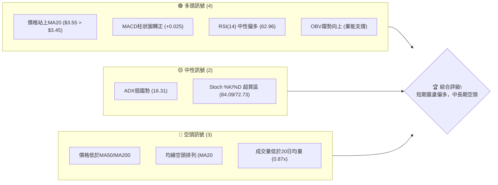

**解讀**：
當前 GRAB 呈現短期動能回升，多個動能指標（MACD、RSI）顯示買方力量增強，且價格成功站上短期均線MA20。然而，中長期均線仍呈空頭排列，且價格遠低於MA50和MA200，顯示整體趨勢依然疲弱。ADX指標確認當前市場處於弱趨勢或盤整階段，而非明確的趨勢行情。Stochastics指標已進入超買區，暗示短期上漲動能可能面臨耗盡或回調壓力。成交量未能有效配合價格上漲，為潛在隱憂。

### 📊 核心指標速覽表

| 指標類別 | 指標名稱 | 當前數值 | 訊號 | 解讀 |
|----------|----------|----------|------|------|
| **價格** | 當前價格 | $3.55 | 🟡 | 位於52W區間低點10.8%，但近期反彈 |
| **均線** | MA20 | $3.45 | 🟢 | 價格位於MA20上方，短期趨勢轉強 |
| **均線** | MA50 | $3.63 | 🔴 | 價格位於MA50下方，中期壓力顯著 |
| **均線** | MA200 | $4.61 | 🔴 | 價格遠低於MA200，長期趨勢仍空頭 |
| **動能** | RSI(14) | 62.96 | 🟡 | 接近超買區，短期動能強勁但需注意回調 |
| **動能** | MACD | +0.025 (Hist) | 🟢 | MACD柱狀圖轉正，多頭動能增強 |
| **波動** | ATR(14) | $0.15 | 🟡 | 每日波動約4.30%，屬於中等波動水平 |
| **趨勢** | ADX(14) | 16.31 | 🟡 | 趨勢強度弱，市場處於盤整或無明顯趨勢 |
| **成交量** | 量比 (20日) | 0.87x | 🔴 | 成交量低於平均水平，上漲動能未獲有效確認 |

### 🏆 技術評分卡

```
╔══════════════════════════════════════════════════════════════╗
║              技術評分卡 — GRAB (2026-06-28)                    ║
╠══════════════════════════════════════════════════════════════╣
║ 趨勢強度      ███░░░░░░░░░░░░░░░░░░  15/100  🔴 (ADX弱趨勢，空頭主導)  ║
║ 動能指標      ████████████░░░░░░░░  60/100  🟢 (RSI/MACD短期強勁，但Stoch超買)║
║ 支撐穩定度    ████████████░░░░░░░░  65/100  🟡 (近期支撐穩固，但長期缺乏強支撐)║
║ 成交量配合    ████░░░░░░░░░░░░░░░░  20/100  🔴 (成交量低迷，未能有效確認漲勢)  ║
║ 形態完整度    ████████░░░░░░░░░░░░  40/100  🟡 (近期有築底跡象，但未形成明確反轉形態)║
║ 均線排列      ██░░░░░░░░░░░░░░░░░░  10/100  🔴 (典型空頭排列，長期壓力巨大)  ║
╠══════════════════════════════════════════════════════════════╣
║ 綜合評分      ████░░░░░░░░░░░░░░░░  35/100  評級: 🟡 中性偏空                ║
╚══════════════════════════════════════════════════════════════╝
```

**評分解讀**：GRAB 的綜合技術評分顯示其整體技術面處於中性偏空的狀態。儘管短期動能指標表現強勁，價格也站上短期均線，但長期趨勢的空頭排列、疲弱的趨勢強度以及成交量不足等因素，都對其反彈構成嚴峻挑戰。支撐穩定度尚可，暗示下方有一定承接，但上方阻力重重。在未出現明確反轉形態並伴隨大量能突破前，仍需謹慎看待。

---

## 2. 趨勢分析

### 🌐 多時框趨勢分析

GRAB 的多時框趨勢分析揭示了不同時間尺度下的市場動態，對於制定交易策略至關重要。

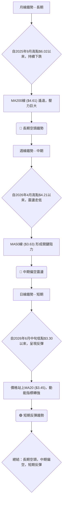

**詳細解讀**：
*   **長期趨勢 (月線)**：從2025年9月的高點$6.02開始，GRAB 的股價呈現明顯的長期下降趨勢。目前價格$3.55遠低於MA200 ($4.61)，這是一個強烈的長期空頭訊號。儘管近期有短期反彈，但要改變這種長期趨勢需要極大的買盤力量和時間。
*   **中期趨勢 (週線)**：自2026年4月高點$4.21以來，GRAB 的股價在中期層面仍處於震盪下跌的格局。MA50 ($3.63) 成為當前價格反彈面臨的首個重要阻力。若無法有效突破MA50並站穩，中期下行壓力仍將持續。
*   **短期趨勢 (日線)**：在經歷了2026年6月中旬的低點$3.30之後，GRAB 股價出現了顯著的反彈。價格已成功站上MA20 ($3.45)，且多個動能指標（如MACD）也給出短期看漲訊號。這表明短期內買方力量佔優，但這種反彈能否持續並突破中期阻力，仍是未知數。

### 📈 長期趨勢 — 12個月走勢圖（Unicode）

以下是 GRAB 過去12個月的月線收盤價走勢圖，清晰展示了其從高點回落的長期趨勢。

```
GRAB 月線走勢圖（過去12個月）
價格軸 ($)
$6.00 ┤                               ●(2025-09 高點 $6.02)
$5.50 ┤                     ●
$5.00 ┤           ●     ●
$4.50 ┤     ●           ●
$4.00 ┤       ●
$3.50 ┤                   ●(2026-06 現價 $3.55)
$3.00 ┤                       ●(2026-05 低點 $3.54)
      └──────────────────────────────────────────────────────────
       25-07 25-08 25-09 25-10 25-11 25-12 26-01 26-02 26-03 26-04 26-05 26-06
```

**走勢特徵分析表格**：

| 時間區間 | 起始價 | 結束價 | 漲跌幅 | 走勢特徵 |
|----------|--------|--------|--------|----------|
| 2025-07 ~ 2025-09 | $4.89 | $6.02 | +23.11% | 上漲段，形成12個月高點 |
| 2025-09 ~ 2026-03 | $6.02 | $3.66 | -39.19% | 顯著下跌，進入空頭趨勢 |
| 2026-03 ~ 2026-05 | $3.66 | $3.54 | -3.28% | 底部盤整與緩慢下跌 |
| 2026-05 ~ 2026-06 | $3.54 | $3.55 | +0.28% | 近期小幅反彈，動能積累 |

**解讀**：從圖表和表格中可見，GRAB 在2025年9月達到$6.02的12個月高點後，便進入了漫長的下跌通道，股價幾乎腰斬。儘管在2026年3月至5月期間，股價在$3.50-$3.80區間進行了底部盤整，並在2026年6月錄得小幅反彈，但整體而言，長期趨勢仍是明確的空頭。當前價格$3.55位於歷史低位附近，任何反彈都應被視為在長期下降趨勢中的修正。

### 📊 中期趨勢（週線分析）

以下為 GRAB 近期（過去20週）的週線走勢與關鍵壓力支撐示意圖。

```
GRAB 近期週線走勢與壓力/支撐示意圖
價格軸 ($)
$4.50 ┤                               ● (2026-04 高點 $4.21)
$4.00 ┤                           ╱
$3.50 ┤        ┌───┐───────┐───●───────┐
$3.00 ┤        │   │       │   │       │
      └───────────────────────────────────────────
      26-02   26-03   26-04   26-05   26-06

關鍵壓力位:
R1: $3.63 (MA50, 布林上軌)
R2: $3.90 (2026-04-26高點)
R3: $4.21 (2026-04-19高點)

關鍵支撐位:
S1: $3.45 (MA20, 布林中軌)
S2: $3.30 (2026-06-14低點)
S3: $3.18 (52週低點)
```

**解讀**：從週線圖來看，GRAB 在2026年4月曾嘗試反彈至$4.21，但未能持續，隨後再次回落。目前的價格$3.55正處於一個關鍵區間，上方MA50 ($3.63) 和布林通道上軌 ($3.65) 形成第一道強勁阻力。若能突破此區間，則有機會挑戰$3.90和$4.21的前期高點。下方，$3.45 (MA20) 和 $3.30 (近期低點) 構成短期支撐。中期趨勢仍受空頭壓力影響，任何反彈都需要突破多重阻力才能確認趨勢逆轉。

### ⚡ 趨勢強度評估（ADX 解讀）

ADX 指標用於衡量趨勢的強度，而非方向。當前 GRAB 的 ADX(14) 數值為 16.31，這表明市場處於弱趨勢或盤整狀態。

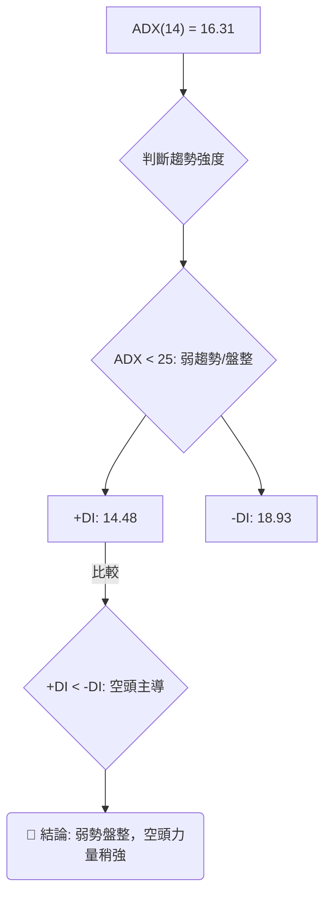

**ADX 強度對照表**：

| ADX 數值範圍 | 趨勢強度 | 市場狀態 |
|--------------|----------|----------|
| 0 - 25       | 弱       | 盤整或無趨勢 |
| 25 - 50      | 中等     | 趨勢明顯 |
| 50 - 75      | 強       | 強勁趨勢 |
| 75 - 100     | 極強     | 極端趨勢 |

**解讀**：GRAB 的 ADX 數值 16.31 遠低於 25，明確指出市場缺乏強勁的趨勢方向，目前正處於一個弱勢盤整的階段。在這種情況下，價格波動可能較為頻繁，但難以形成持續性的單邊行情。此外，+DI (14.48) 低於 -DI (18.93)，這表明在當前的弱勢市場中，空頭力量仍略佔上風，儘管其強度不足以推動股價形成明確的下跌趨勢。這也解釋了為何股價在短期反彈後，上方仍面臨較大壓力。

---

## 3. 圖表形態分析

### 🔍 形態識別系統

根據 GRAB 過去幾個月的價格走勢，目前尚未形成經典的、大規模的反轉或持續形態。然而，在經歷了長期下跌後，近期價格走勢呈現出潛在的底部築底跡象。

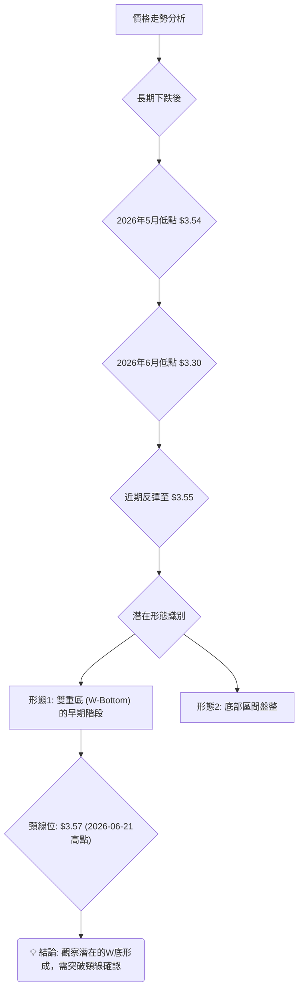

**形態解讀**：
*   **潛在雙重底 (W-Bottom)**：GRAB 在2026年5月和6月分別觸及低點 $3.54 和 $3.30，隨後從 $3.30 反彈。這兩個低點與其後的回升，可能正在構築一個雙重底形態。如果此形態成立，其頸線位可以暫定為2026年6月21日的短期高點 $3.57。突破此頸線將是確認形態成立的關鍵。
*   **底部區間盤整**：在長期下跌後，股價通常會在底部區域形成一段時間的盤整，以消化賣壓並積累買盤。目前 GRAB 的股價在 $3.30 至 $3.65 之間波動，也符合底部盤整的特徵。

### 🕯️ 重要K線形態分析

分析近期週線收盤價，識別關鍵K線形態及其潛在意義。

| 日期 (週結) | 收盤價 | K線形態 (週線) | 解讀 | 訊號 |
|-------------|--------|-----------------|------|------|
| 2026-05-17  | $3.55  | 垂線/紡錘線     | 底部盤整，多空力量拉鋸 | 🟡 |
| 2026-05-24  | $3.51  | 陰線            | 賣壓略佔優勢 | 🔴 |
| 2026-05-31  | $3.54  | 小陽線          | 買盤嘗試反擊 | 🟢 |
| 2026-06-07  | $3.34  | 大陰線          | 賣壓加劇，創近期新低 | 🔴 |
| 2026-06-14  | $3.30  | 錘子線          | 股價觸底反彈，下方支撐強勁 | 🟢 |
| 2026-06-21  | $3.57  | 大陽線/吞噬形態 | 強勢反彈，吞噬前幾週跌幅，多頭逆轉訊號 | 🟢 |
| 2026-06-28  | $3.55  | 紡錘線/小陰線   | 反彈後整理，多頭動能稍緩 | 🟡 |

**解讀**：
最近幾週的K線走勢顯示出從下跌到反彈的轉變。特別是2026年6月14日的「錘子線」形態，通常出現在下跌趨勢的底部，預示著潛在的反轉。緊隨其後的2026年6月21日「大陽線」（甚至可能是吞噬形態），強勢確認了買方的介入，將股價從 $3.30 的低點推升至 $3.57。這是一個非常強烈的短期看漲訊號。本週 (2026-06-28) 的「紡錘線」或「小陰線」則表明在大幅反彈後，股價進入整理階段，多空雙方在新的價位上重新尋求平衡。

### 📉 ASCII 走勢形態示意圖

以下為 GRAB 近期潛在雙重底形態的示意圖，標注了關鍵點位。

```
GRAB 潛在雙重底 (W-Bottom) 示意圖
價格軸 ($)
$3.70 ┤                                ┌───┐
$3.60 ┤                                │   │  ← 頸線 $3.57
$3.50 ┤          ┌───┐               │   │
$3.40 ┤          │   │               │   │
$3.30 ┤───────●───┘   └───●───────
$3.20 ┤       (底部1 $3.54) (底部2 $3.30)
      └──────────────────────────────────
       26-05-03 ... 26-05-17 ... 26-06-07 ... 26-06-14 ... 26-06-21 ... 26-06-28
```
**形態分析**：
圖中展示了 GRAB 在 $3.54 (5月) 和 $3.30 (6月) 兩個低點，構成潛在的雙重底形態。雖然 $3.30 的低點略低於 $3.54，但其後的強勁反彈使其具備「W底」的潛質。形態的頸線位於 $3.57 (2026-06-21 的短期高點)。目前股價 $3.55 正測試這一頸線下方區域。

### 🎯 形態目標價計算

若上述潛在的雙重底形態被確認（即股價有效突破頸線），我們可以計算其理論目標價。

*   **底部1**：$3.54 (2026-05-17 低點附近)
*   **底部2**：$3.30 (2026-06-14 低點)
*   **頸線位**：$3.57 (2026-06-21 短期高點)

**計算方法**：
形態高度 = 頸線位 - 底部2 = $3.57 - $3.30 = $0.27
理論目標價 = 頸線位 + 形態高度 = $3.57 + $0.27 = $3.84

**解讀**：
如果 GRAB 能夠有效突破並站穩 $3.57 的頸線位，則其短期上漲的理論目標價為 $3.84。這個目標價與分析師的低位目標 $4.10 和斐波那契回調的 $4.49 形成一系列潛在的阻力區間。然而，此形態的確認需要有放大的成交量配合突破，才能增加其可靠性。

---

## 4. 支撐與阻力

### 🗺️ 關鍵價位分布圖（Unicode）

以下是 GRAB 當前的價位結構分布圖，清晰標示了主要的支撐和阻力區間。

```
GRAB 價位結構分布圖
═══════════════════════════════════════════════════
$6.62 ║████████████████████████║ 52週高點 R4 (極強阻力)
$5.30 ║████████████████████    ║ 斐波那契61.8% R3
$4.90 ║████████████████████████║ 斐波那契50% R2
$4.49 ║████████████████████    ║ 斐波那契38.2% R1
$4.21 ║████████████████████████║ 前期高點 (強阻力)
$3.90 ║████████████████████    ║ 近期高點 (次級阻力)
$3.65 ║████████████████████████║ 布林上軌 / 近期阻力
$3.63 ║████████████████████    ║ MA50 (關鍵阻力)
$3.57 ║████████████████████████║ 潛在W底頸線
$3.55 ╠════════════════════════╣ ◄ 現價
$3.45 ║▓▓▓▓▓▓▓▓▓▓▓▓▓▓▓▓        ║ MA20 / 布林中軌 (短期支撐)
$3.30 ║████████████████████████║ 近期低點 (強支撐 S1)
$3.24 ║████████████████████    ║ 布林下軌 (次級支撐)
$3.18 ║████████████████████████║ 52週低點 (極強支撐 S2)
═══════════════════════════════════════════════════
```

### 🚧 阻力位分析表

| 阻力級別 | 價位 | 形成原因 | 突破難度 | 重要性 |
|----------|------|----------|----------|--------|
| **即時阻力 (R0)** | $3.57 | 潛在W底頸線，2026-06-21高點 | 中等 | 短期反彈關鍵 |
| **短期阻力 (R1)** | $3.63-$3.65 | MA50、布林上軌 | 高 | 突破可望測試更高位 |
| **中期阻力 (R2)** | $3.90-$4.21 | 2026-04高點、形態目標價 | 較高 | 中期趨勢能否扭轉的關鍵 |
| **強阻力 (R3)** | $4.49-$4.90 | 斐波那契38.2%/50%回調位 | 極高 | 需極大買盤才能到達 |
| **極強阻力 (R4)** | $6.62 | 52週高點 | 極高 | 長期趨勢逆轉的終極挑戰 |

### 🛡️ 支撐位分析表

| 支撐級別 | 價位 | 形成原因 | 守住機率 | 重要性 |
|----------|------|----------|----------|--------|
| **短期支撐 (S0)** | $3.45 | MA20、布林中軌 | 中等 | 短期反彈的基礎 |
| **即時支撐 (S1)** | $3.30 | 2026-06-14低點，潛在W底第二隻腳 | 高 | 若跌破，反彈勢頭將受挫 |
| **強支撐 (S2)** | $3.18-$3.24 | 52週低點、布林下軌 | 極高 | 歷史性低點，具有強大心理支撐 |

### 📐 斐波那契回調位分析

我們以過去52週的高點 ($6.62$) 和低點 ($3.18$) 作為斐波那契回調的參考區間，來分析潛在的阻力位。

*   **52週高點**：$6.62
*   **52週低點**：$3.18
*   **價格區間**：$6.62 - $3.18 = $3.44

**斐波那契回調位計算**：
*   **23.6% 回調**：$3.18 + ($3.44 * 0.236) = $3.18 + $0.81 = **$3.99**
*   **38.2% 回調**：$3.18 + ($3.44 * 0.382) = $3.18 + $1.31 = **$4.49**
*   **50% 回調**：$3.18 + ($3.44 * 0.500) = $3.18 + $1.72 = **$4.90**
*   **61.8% 回調**：$3.18 + ($3.44 * 0.618) = $3.18 + $2.12 = **$5.30**

**視覺化與解讀**：
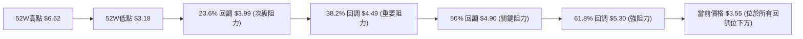
**解讀**：
當前 GRAB 股價 $3.55 遠低於所有斐波那契回調位，這進一步確認了其長期下跌趨勢的深度。這些回調位在未來股價反彈時，將構成層層阻力。第一個較為重要的阻力在 $3.99 (23.6%)，其次是 $4.49 (38.2%)。這也與分析師的低位目標 $4.10 和中期阻力區域相吻合。在突破這些斐波那契阻力之前，GRAB 的反彈將面臨嚴峻考驗。

---

## 5. 技術指標深度解讀

### 🎛️ 指標訊號總覽

以下 Mermaid 圖表展示了各主要技術指標的當前訊號及其相互關係。

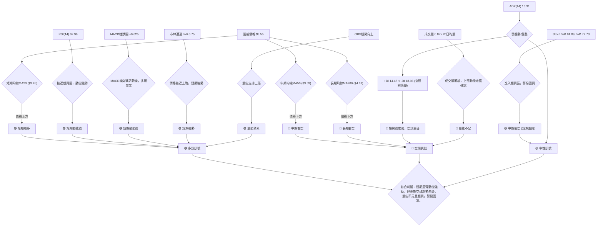

### 📈 移動平均線排列分析

GRAB 的移動平均線系統揭示了其多重時間框架下的趨勢狀態。

| 均線 | 數值 | 價格與均線關係 | 訊號 |
|------|------|----------------|------|
| MA5  | $3.49 | 價格 ($3.55) > MA5 | 🟢 |
| MA10 | $3.47 | 價格 ($3.55) > MA10 | 🟢 |
| MA20 | $3.45 | 價格 ($3.55) > MA20 | 🟢 |
| MA50 | $3.63 | 價格 ($3.55) < MA50 | 🔴 |
| MA200| $4.61 | 價格 ($3.55) < MA200| 🔴 |

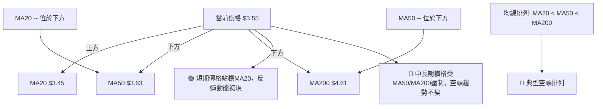
**解讀**：
當前股價 $3.55 已經成功站上短期均線 MA5 ($3.49)、MA10 ($3.47) 和 MA20 ($3.45)，這是一個明確的短期看漲訊號，顯示短期買盤力量強勁。然而，股價仍位於中期均線 MA50 ($3.63) 和長期均線 MA200 ($4.61) 之下。更重要的是，MA20 < MA50 < MA200 這種「空頭排列」的格局並未改變，這表示 GRAB 的中長期趨勢依然是下跌。MA50 將成為短期反彈面臨的第一道重要阻力。

### 📉 RSI(14) 分析

RSI(14) 當前數值為 62.96，位於中性區間偏上，接近超買區。

**RSI 強度進度條**：
RSI(14) 62.96: ▓▓▓▓▓▓▓▓▓▓▓▓▓▓░░░░░░ 62.96%

**超買超賣區間分析**：
*   **超買區 (RSI > 70)**：股價可能被高估，潛在回調風險。
*   **超賣區 (RSI < 30)**：股價可能被低估，潛在反彈機會。
*   **中性區 (30 < RSI < 70)**：市場相對平衡。

**解讀**：
目前 RSI 數值 62.96 顯示短期買盤動能強勁，推動股價上漲。它雖然尚未進入傳統的超買區 (RSI > 70)，但已非常接近，這暗示短期內上漲動能可能面臨耗盡，或需要進行整理。

**背離判斷 (頂背離/底背離)**：
根據提供的數據：
*   2026-06-14 收盤價 $3.30，RSI 37.9
*   2026-06-21 收盤價 $3.57，RSI 51.5
*   2026-06-28 收盤價 $3.55，RSI 63.0

價格從 $3.30 上升到 $3.57 後略微回落到 $3.55。RSI 則從 37.9 穩步上升到 63.0。
**結論**：目前未觀察到明顯的 RSI 頂背離或底背離現象。價格在反彈過程中，RSI 同步走高，顯示動能與價格走勢一致，短期上漲趨勢健康。但需警惕 RSI 進入超買區後的潛在回調風險。

### 📊 MACD(12/26/9) 訊號解讀

MACD 指標當前數值為：MACD 線 (-0.024)，MACD Signal 線 (-0.049)，MACD 柱狀圖 (+0.025)。

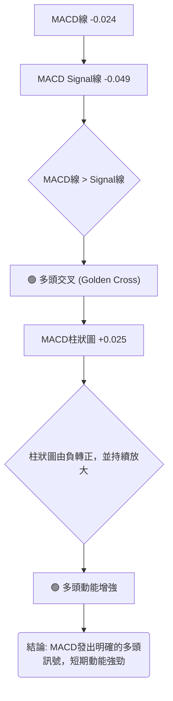
**解讀**：
MACD 線 (-0.024) 已經上穿 MACD Signal 線 (-0.049)，形成了一個「黃金交叉」，這是一個重要的短期買入訊號。同時，MACD 柱狀圖從負值轉為正值 (+0.025)，並呈現放大趨勢，這進一步確認了短期多頭動能的增強。這與 RSI 的強勁表現互相印證，顯示買方在短期內佔據主導地位。

### 📦 布林通道分析

布林通道由上軌 ($3.65$)、中軌 (MA20 $3.45$) 和下軌 ($3.24$) 組成。當前收盤價為 $3.55$。

**ASCII 布林通道示意圖**：
```
GRAB 布林通道示意圖
價格軸 ($)
$3.70 ┤                               ● 上軌 $3.65
$3.60 ┤               現價 $3.55 ●
$3.50 ┤                               ● 中軌 $3.45 (MA20)
$3.40 ┤
$3.30 ┤                               ● 下軌 $3.24
$3.20 ┤
      └──────────────────────────────────────────────────
      (時間軸)
```
**布林通道 %B**：0.75。這個數值表示價格位於布林通道中軌和上軌之間，且更靠近上軌。

**解讀**：
當前股價 $3.55 位於布林通道中軌 ($3.45) 之上，並向著上軌 ($3.65) 運行。%B 數值 0.75 也確認了這一點，表明短期內股價走勢偏強。布林通道的開口大小（上軌與下軌的距離約為 $0.41）反映了當前的波動率。由於 ADX 顯示為弱趨勢，布林通道的收斂或擴張將是未來走勢的關鍵。如果價格能突破上軌並伴隨成交量放大，可能預示著一波新的上漲趨勢；若反之跌破中軌，則可能回歸盤整或下跌。

### 💹 成交量分析（量價配合度）

*   **最新成交量**：47,793,200
*   **20日均量**：54,704,900
*   **50日均量**：53,190,116
*   **量比 (最新/20日均量)**：0.87x
*   **OBV趨勢**：OBV > MA → 量能支撐上漲

**解讀**：
當前成交量 (47.79M) 低於其20日和50日均量，量比僅為 0.87x。這是一個值得警惕的訊號，因為價格在短期內實現反彈並站上MA20，但成交量卻未能同步放大。通常，健康的價格上漲應伴隨著成交量的放大，以確認買盤的積極性。當前量能不足，可能導致反彈缺乏持續性，容易在遇到阻力時回落。

然而，OBV (On-Balance Volume) 指標的趨勢卻顯示 OBV 線高於其移動平均線，這表明在過去一段時間內，儘管單日成交量不盡理想，但累積的買盤壓力仍在增加，量能整體上是支持價格上漲的。這形成了一個輕微的矛盾：短期單日量能不足，但累積量能卻是健康的。這可能意味著市場情緒偏向謹慎，但有隱性資金在逐步吸納。對於短期反彈，成交量未能放大是一個潛在的風險因素，需要密切觀察後續量能是否能有效配合價格突破。

---

## 6. 動能與波動率

### ⚡ 動能評估四象限

我們將 GRAB 當前的動能與波動率狀況進行評估，以判斷其所處的市場象限。

| 象限 | 動能 | 波動 | 當前狀態 | 評估 |
|------|------|------|----------|------|
| Q1 | 強 | 低 | - | 最佳機會 (趨勢啟動初期) |
| Q2 | 弱 | 低 | - | 謹慎觀望 (缺乏方向，波動小) |
| Q3 | 強 | 高 | - | 高風險高收益 (趨勢加速或劇烈反轉) |
| Q4 | 弱 | 高 | ✓ | 避免進場 (方向不明，波動大，易止損) |

**當前 GRAB 評估**：
*   **動能**：短期動能強勁 (RSI 62.96, MACD金叉)，但長期趨勢弱 (ADX 16.31)。綜合判斷為**中等偏強動能**。
*   **波動率**：ATR(14) 為 $0.15，佔股價的 4.30%。這屬於**中等波動**。

**Mermaid 動能與波動率評估流程**：
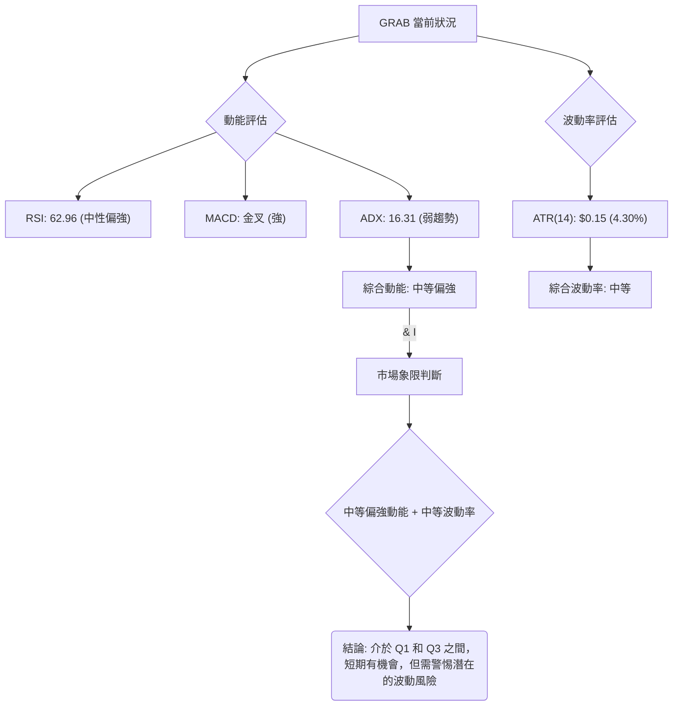
**解讀**：
GRAB 當前處於一個「中等偏強動能」與「中等波動率」的狀態。這意味著短期內有向上動能，但整體市場趨勢不明顯，且存在一定的價格波動。它不完全符合 Q1 (強動能/低波動) 的理想狀態，也不是 Q4 (弱動能/高波動) 的完全避險區。這種情況下，交易者可以考慮在風險可控的前提下捕捉短期機會，但必須密切關注趨勢的演變和波動的變化。由於 ADX 顯示為弱趨勢，這種動能可能是短期反彈，而非趨勢的真正逆轉。

### 📊 ATR 波動率分析

ATR(14) (Average True Range) 當前數值為 $0.15。

**ATR 數值解讀**：
*   ATR 數值 $0.15 意味著在過去14天內，GRAB 的每日平均價格波動範圍約為 $0.15。
*   相對於當前股價 $3.55，ATR 佔比為 ($0.15 / $3.55) * 100% = 4.23%。這個百分比屬於中等水平，表明 GRAB 既不是極端平靜的股票，也不是劇烈波動的股票。

**ATR 在止損設置中的應用**：
ATR 是一個常用的動態止損參考工具。建議的止損距離通常是 ATR 的 1.5 倍到 3 倍。
*   **保守止損 (1.5x ATR)**：$0.15 * 1.5 = $0.225
*   **標準止損 (2x ATR)**：$0.15 * 2 = $0.30
*   **寬鬆止損 (3x ATR)**：$0.15 * 3 = $0.45

**解讀**：
對於希望參與 GRAB 短期反彈的交易者，ATR 提供了一個衡量風險的基準。例如，如果計劃在 $3.57 突破頸線後買入，並希望設置一個標準止損 (2x ATR)，那麼止損價位可以在 $3.57 - $0.30 = $3.27 左右。這可以幫助交易者根據當前市場波動性來合理規劃風險。當前 ATR 數值相對穩定，說明市場情緒未出現極端恐慌或狂熱。

### 📐 Beta 與市場相關性

由於提供的數據中未包含 GRAB 的 Beta 值，我們無法進行精確的 Beta 分析。

**一般性分析**：
*   **行業特性**：Grab Holdings Limited 屬於科技行業的應用軟體板塊，其業務模式（超級應用、送貨服務）在全球範圍內通常被視為成長型股票。成長型股票的 Beta 值通常高於 1，意味著它們相對於大盤（如 S&P 500）的波動性更大。
*   **市場環境**：在牛市中，高 Beta 股票的漲幅可能超過大盤；在熊市中，其跌幅也可能超過大盤。
*   **公司發展階段**：作為一家在東南亞市場運營的成長型公司，其股價可能更容易受到公司特定新聞、財報表現以及區域經濟狀況的影響，導致其波動性較高。

**推斷與假設**：
**推斷**：基於其行業和成長型公司的性質，GRAB 的 Beta 值可能在 1.2 到 1.8 之間，這意味著它可能比大盤更具波動性。
**影響**：如果市場整體出現大幅波動，GRAB 的股價可能會呈現更劇烈的漲跌。投資者在配置 GRAB 時應考慮其潛在的高波動風險，並將其視為投資組合中風險較高的部分。

---

## 7. 多時框架總結

### 📋 時框架評分表

本表彙總了 GRAB 在不同時間框架下的技術面評估，提供一個全面的視角。

| 時框架 | 趨勢方向 | 動能 | 均線排列 | 形態 | 綜合評分 | 建議 |
|--------|----------|------|----------|------|----------|------|
| **長期 (月線)** | 🔴 明確空頭 | 🔴 弱 | 🔴 空頭排列 | 🔴 下跌趨勢 | 20/100 | 觀望/規避 |
| **中期 (週線)** | 🔴 偏空震盪 | 🟡 中性 | 🔴 空頭排列 | 🟡 底部盤整 | 40/100 | 謹慎觀察 |
| **短期 (日線)** | 🟢 反彈向上 | 🟢 強 | 🟡 短多長空 | 🟢 潛在W底 | 70/100 | 短線交易機會 |

**解讀**：
GRAB 的多時框架分析呈現出明顯的矛盾：長期和中期趨勢均為空頭或偏空，而短期則顯示出強勁的反彈動能。這表明當前的上漲很可能是在長期下跌趨勢中的一個技術性修正或反彈，而非趨勢的根本性逆轉。短期交易者可以尋求反彈機會，但必須設置嚴格的止損，並隨時準備獲利了結。對於中長期投資者而言，目前的技術面仍不具備入場條件，建議繼續觀望，等待更明確的底部形態和趨勢逆轉訊號。

### 🔲 綜合訊號矩陣

以下矩陣展示了不同時間框架下各技術維度訊號的一致性。

```mermaid
quadrantChart
    title GRAB 綜合訊號矩陣 (多時框架)
    x-axis "長期趨勢 (←空頭 vs 多頭→)" --> "長期趨勢 (多頭)"
    y-axis "短期動能 (↓弱 vs 強↑)" --> "短期動能 (強)"

    quadrant-1 "高風險高收益 (短期強/長期空)"
    quadrant-2 "最佳機會 (短期強/長期多)"
    quadrant-3 "避免進場 (短期弱/長期空)"
    quadrant-4 "潛在機會 (短期弱/長期多)"

    "GRAB (當前狀態)" : -0.7, 0.8
```
**矩陣解讀**：
GRAB 當前位置處於「高風險高收益」象限，即長期趨勢為空頭，但短期動能卻非常強勁。這是一個典型的「熊市反彈」或「死貓跳」情境。這種情況下，短期交易者可能有機會捕捉快速上漲，但風險極高，因為長期趨勢仍然向下，隨時可能面臨長期阻力的壓制而回落。對於風險承受能力較低的投資者，應避免在這種情況下進場。

---

## 8. 交易策略建議

基於上述詳盡的技術分析，GRAB 目前處於長期空頭中的短期反彈階段。MACD金叉、RSI強勁、價格站上MA20均顯示短期多頭動能，但整體均線空頭排列、ADX弱勢以及成交量不足構成潛在風險。因此，交易策略應以短線操作為主，嚴格控制風險。

### 🗺️ 策略決策流程圖

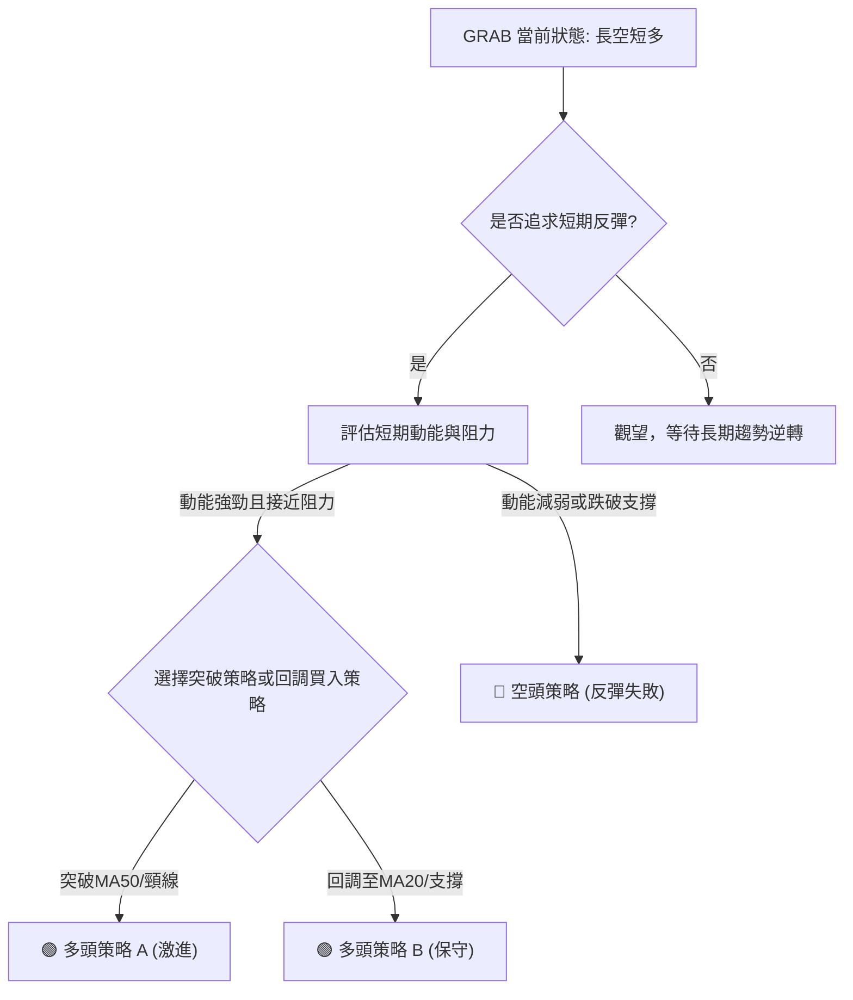

### 🟢 多頭策略詳情

考慮到短期動能強勁且存在潛在雙重底形態，可制定以下多頭策略。

| 策略要素 | 策略 A (激進突破) | 策略 B (保守回調) |
|----------|-------------------|-------------------|
| **進場條件** | 價格突破 $3.57 (潛在W底頸線) 並站穩 MA50 ($3.63) | 價格回調至 $3.45 (MA20/布林中軌) 附近企穩 |
| **進場價格** | $3.65 (確認突破 $3.63-$3.65 阻力區) | $3.45 |
| **目標價 T1** | $3.90 (近期高點/斐波那契23.6%回調附近) | $3.57 (潛在W底頸線) |
| **目標價 T2** | $4.21 (2026-04高點) | $3.65 (MA50/布林上軌) |
| **止損價格** | $3.40 (MA20下方，約1.6x ATR) | $3.30 (近期低點/強支撐 S1) |
| **風險報酬比** | (3.90-3.65) / (3.65-3.40) = 1.00 : 1.00 <br> (4.21-3.65) / (3.65-3.40) = 2.24 : 1.00 | (3.57-3.45) / (3.45-3.30) = 0.80 : 1.00 <br> (3.65-3.45) / (3.45-3.30) = 1.33 : 1.00 |
| **成功機率** | 40% (突破阻力需大量能) | 60% (回調支撐位較強) |
| **建議倉位** | 5% - 10% | 10% - 15% |

**策略 A 解讀**：此策略較為激進，旨在捕捉突破關鍵阻力後的加速上漲。成功的前提是需要有足夠的買盤量能配合突破 $3.63-$3.65 阻力區。風險報酬比在達到 T2 時較為吸引人。

**策略 B 解讀**：此策略較為保守，旨在利用價格回調至強支撐位時的買入機會。MA20和布林中軌 $3.45 提供了較好的進場點，止損點設置在近期低點 $3.30 附近，提供較大的安全邊際。風險報酬比相對較低，但成功機率較高。

### 🔴 空頭策略詳情

如果 GRAB 的短期反彈未能持續，且出現動能衰竭或跌破關鍵支撐的訊號，則可考慮空頭策略。

| 策略要素 | 策略 C (反彈失敗) |
|----------|-------------------|
| **進場條件** | 價格跌破 $3.45 (MA20/布林中軌) 並確認站不穩 |
| **進場價格** | $3.43 (確認跌破 $3.45) |
| **目標價 T1** | $3.30 (近期低點/強支撐 S1) |
| **目標價 T2** | $3.18 (52週低點/極強支撐 S2) |
| **止損價格** | $3.57 (潛在W底頸線/近期高點) |
| **風險報酬比** | (3.43-3.30) / (3.57-3.43) = 0.93 : 1.00 <br> (3.43-3.18) / (3.57-3.43) = 1.79 : 1.00 |
| **成功機率** | 50% (短期反彈可能失敗，回歸長期趨勢) |
| **建議倉位** | 5% - 10% (考慮長期趨勢為空頭) |

**策略 C 解讀**：此策略基於短期反彈失敗、股價回歸長期空頭趨勢的判斷。跌破MA20將是重要的警示訊號。止損點設置在 $3.57，若能成功突破此位，則空頭策略失效。

### ⭐ 整體訊號強度評星

```
做多訊號強度：★★★☆☆  (3/5星) - 短期動能強勁，但長期趨勢制約，上方阻力重重。
做空訊號強度：★★☆☆☆  (2/5星) - 短期有反彈，但長期空頭趨勢未變，反彈若失敗則做空機會顯現。
整體可信度：  ★★★☆☆  (3/5星) - 多空訊號交織，短期機會與長期風險並存，需嚴格按照策略執行。
```

---

## 9. 風險提示與監控

GRAB 的技術面分析顯示其短期存在反彈機會，但中長期趨勢仍處於空頭。因此，風險管理至關重要。

### ✅ 關鍵監控指標 Checklist

以下為交易者應密切監控的關鍵指標清單，以應對 GRAB 股價的潛在變化。

```
╔════════════════════════════════════════════════════════════════╗
║ GRAB 關鍵監控指標 Checklist                                      ║
╠════════════════════════════════════════════════════════════════╣
║ [ ] 股價是否有效突破MA50 ($3.63) 及布林上軌 ($3.65)？             ║
║ [ ] 股價是否跌破MA20 ($3.45) 及布林中軌 ($3.45)？                 ║
║ [ ] 成交量是否有效放大，配合價格突破或跌破？                       ║
║ [ ] RSI(14) 是否進入超買區 (>70) 並出現頂背離訊號？              ║
║ [ ] MACD 是否出現死叉，或柱狀圖轉負並持續縮小？                   ║
║ [ ] ADX(14) 是否上升至 25 以上，確認新的趨勢形成？                ║
║ [ ] 股價是否跌破 $3.30 (近期低點/強支撐 S1)？                     ║
║ [ ] 股價是否站穩 $3.57 (潛在W底頸線)？                             ║
╚════════════════════════════════════════════════════════════════╝
```

### ⚠️ 風險場景分析

基於當前技術面，GRAB 可能會出現以下三種情境：

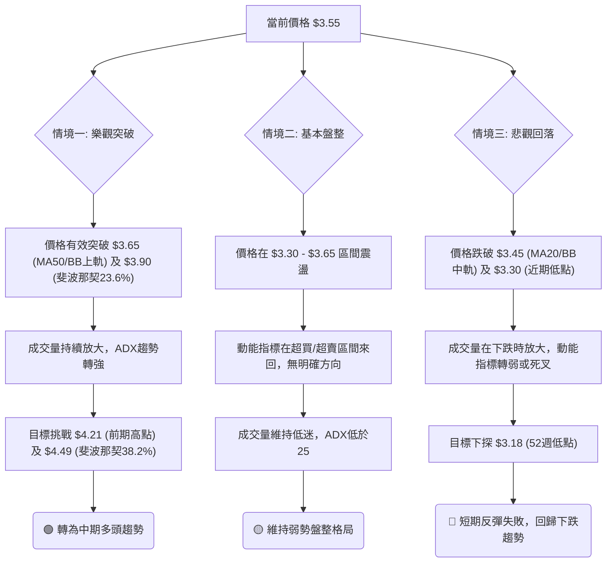

### 🛡️ 風險管理重要提醒

1.  **嚴格止損**：鑑於 GRAB 的長期空頭趨勢和中等波動率，任何交易都必須設置並嚴格執行止損點，以限制潛在損失。ATR 可作為動態止損的參考依據。
2.  **倉位控制**：對於短期交易機會，建議採用較小的倉位（例如總資金的 5%-15%），避免重倉賭博。
3.  **分批進出**：可以考慮在達到目標價時分批獲利了結，或在回調至支撐位時分批建倉，以平滑成本和降低風險。
4.  **關注總體市場情緒**：GRAB 作為科技成長股，其表現容易受到大盤情緒和宏觀經濟因素的影響。在市場情緒不佳時，即使個股技術面良好，也可能面臨壓力。
5.  **警惕假突破/假跌破**：在弱勢盤整市場中，價格容易出現假突破或假跌破。建議等待K線收盤確認，並配合成交量等其他指標進行綜合判斷。
6.  **耐心等待**：對於中長期投資者，建議保持耐心，等待明確的底部形態形成、長期趨勢逆轉訊號出現，並伴隨健康的基本面改善。

---

## 📋 報告總結

```
╔════════════════════════════════════════════════════════════════╗
║ GRAB 技術分析報告總結                                            ║
╠════════════════════════════════════════════════════════════════╣
║ 報告日期：2026-06-28                                             ║
║ 當前價格：$3.55                                                  ║
║ 分析評級：⚖️ 中性偏空 (短期反彈動能強勁，但中長期趨勢仍為空頭)     ║
║                                                                  ║
║ 關鍵結論：                                                       ║
║ ├─ 長期趨勢：🔴 空頭，價格遠低於MA200 ($4.61)，上方阻力巨大。      ║
║ ├─ 中期趨勢：🔴 偏空震盪，受MA50 ($3.63) 壓制。                    ║
║ ├─ 短期趨勢：🟢 反彈向上，價格站上MA20 ($3.45)，MACD金叉，RSI強勁。║
║ ├─ 關鍵支撐：$3.30 (近期低點)，其次為 $3.18 (52週低點)。         ║
║ ├─ 關鍵阻力：$3.63 (MA50/布林上軌)，其次為 $3.90 (斐波那契23.6%)。║
║ └─ 分析師目標：$5.94 (均值)， $4.10 (低位)，與技術面阻力有重合。  ║
║                                                                  ║
║ 最優策略組合：                                                   ║
║ 1. 🥇 最佳機會：**多頭策略 B (保守回調)**。在 $3.45 附近進場，止損 $3.30，目標 $3.65 / $3.57。此策略風險較低，成功機率較高。 ║
║ 2. 🥈 次選機會：**多頭策略 A (激進突破)**。若能有效突破 $3.65 (MA50/BB上軌)，在 $3.65 進場，止損 $3.40，目標 $3.90 / $4.21。此策略風險較高，需大量能配合。║
║ 3. 🥉 保守選擇：**空頭策略 C (反彈失敗)**。若跌破 $3.45 (MA20)，在 $3.43 進場，止損 $3.57，目標 $3.30 / $3.18。此策略利用反彈失敗回歸長期空頭趨勢。║
╚════════════════════════════════════════════════════════════════╝
```

---

> ⚠️ **免責聲明**：本報告為 AI 自動生成之技術分析，所有數據及估算均基於提供的歷史價格資訊。本報告**僅供研究與學術參考**，**不構成任何投資建議**。投資有風險，入市需謹慎。

---

*報告生成時間：2026-06-28 ｜ 數據來源：提供數據 ｜ 分析框架：多時框技術分析*