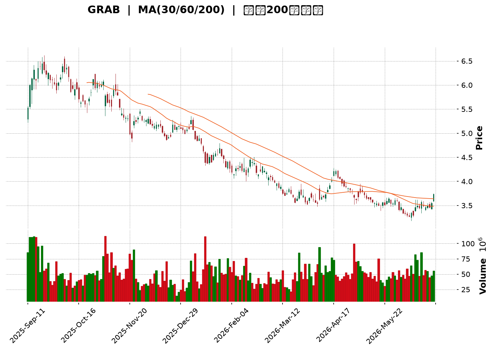
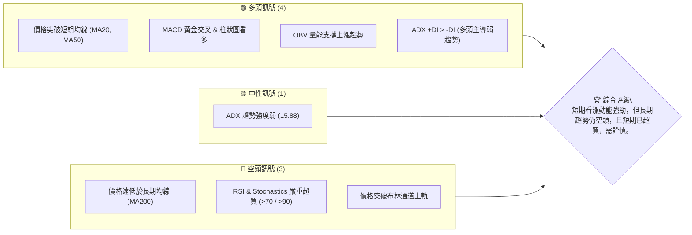
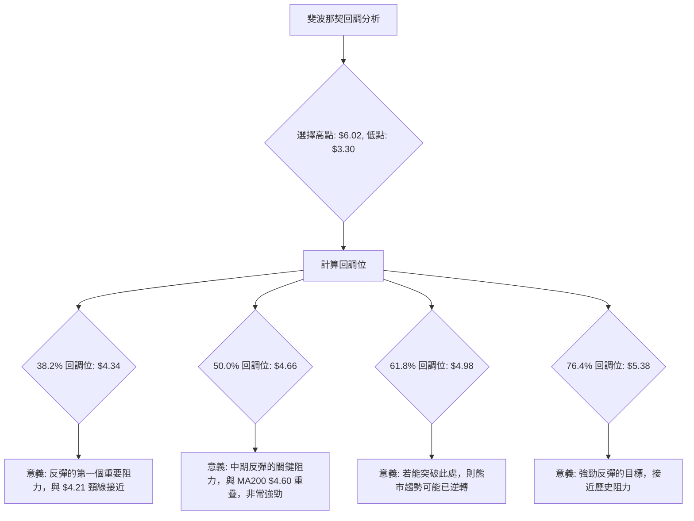
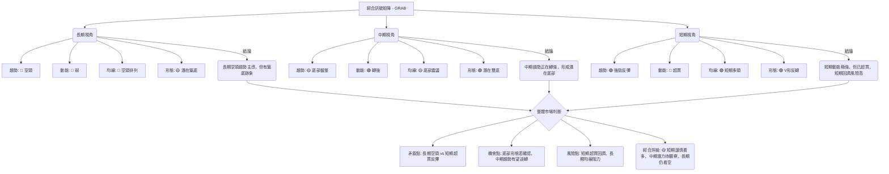

<details>
<summary>📊 靜態圖表 (點擊展開)</summary>

</details>

<html>
<head><meta charset="utf-8" /></head>
<body>
    <div style="height:500px; width:100%;">                        <script>window.PlotlyConfig = {MathJaxConfig: 'local'};</script>
        <script charset="utf-8" src="https://cdn.plot.ly/plotly-3.6.0.min.js" integrity="sha256-QaOVwtVY0T02VaHrr6pnoHLCwayMJp4O5n4YyaE3rJk=" crossorigin="anonymous"></script>                <div id="candlestick-chart" class="plotly-graph-div" style="height:100%; width:100%;"></div>            <script>                window.PLOTLYENV=window.PLOTLYENV || {};                                if (document.getElementById("candlestick-chart")) {                    Plotly.newPlot(                        "candlestick-chart",                        [{"close":{"dtype":"f8","bdata":"AAAAYLgeFkAAAAAAAAAYQAAAACBcjxhAAAAAIK5HGUAAAABgZmYYQAAAAGBmZhlAAAAAIFyPGUAAAADAzMwZQAAAACCuRxlAAAAAoEfhGEAAAAAAAAAZQAAAAOCjcBhAAAAA4KNwGEAAAADgehQYQAAAAKCZmRdAAAAAQDMzGEAAAAAA16MYQAAAACBcjxlAAAAA4HoUGUAAAADgo3AZQAAAAIAUrhhAAAAA4KNwF0AAAADgUbgXQAAAAADXoxdAAAAAgBSuF0AAAABACtcWQAAAACBcjxZAAAAAgBSuFkAAAABgZmYWQAAAAEDhehZAAAAAoEfhFkAAAABgZmYXQAAAAEDhehhAAAAAYI\u002fCF0AAAABAMzMYQAAAACCF6xdAAAAAgD0KGEAAAAAgrkcYQAAAAADXIxdAAAAAIFyPFkAAAADAHoUWQAAAAKBwPRZAAAAAoJmZF0AAAADAHoUXQAAAAMD1KBdAAAAAwPUoFkAAAAAA16MVQAAAAIDrURVAAAAAIK5HFUAAAACgcD0VQAAAACCF6xNAAAAAoJmZE0AAAAAAAAAVQAAAAIDC9RRAAAAAIK5HFUAAAADAzMwVQAAAAOB6FBVAAAAAgD0KFUAAAADgehQVQAAAAEAzMxVAAAAAYI\u002fCFEAAAAAA16MUQAAAAKCZmRRAAAAA4FG4FEAAAADgUbgUQAAAAKCZmRRAAAAA4HoUFEAAAADAzMwTQAAAAEDhehNAAAAAgBSuE0AAAADgUbgTQAAAAOBRuBRAAAAAgOtRFEAAAADAHoUUQAAAAKCZmRRAAAAAYGZmFEAAAAAgrkcUQAAAAIDC9RNAAAAAgOtRFEAAAAAAKVwUQAAAAOB6FBVAAAAAgOtRFEAAAADAHoUTQAAAAGBmZhNAAAAAIFyPE0AAAADA9SgTQAAAAMAehRJAAAAAIFyPEUAAAADAHoURQAAAAIA9ChJAAAAAoJmZEUAAAABAMzMSQAAAAIDrURJAAAAAoHA9EkAAAABgj8ISQAAAAGC4HhJAAAAAoEfhEUAAAABAMzMRQAAAAADXoxFAAAAA4HoUEUAAAABgj8IQQAAAAKCZmRBAAAAA4HoUEUAAAACAPQoRQAAAAKBwPRFAAAAAIIXrEEAAAADgehQRQAAAAMAehRBAAAAA4HoUEUAAAADAzMwRQAAAAKCZmRFAAAAAwB6FEUAAAADgUbgQQAAAAKCZmRBAAAAAQArXEEAAAACgcD0RQAAAAKBH4RBAAAAA4FG4EEAAAACA61EQQAAAAGBmZhBAAAAAYLgeEEAAAABACtcPQAAAAIAUrg9AAAAAgML1DkAAAABguB4PQAAAAAAAAA5AAAAAgBSuDUAAAAAAAAAOQAAAAOBRuA5AAAAAAAAADkAAAADgo3ANQAAAAEDhegxAAAAAYLgeDUAAAACA61EOQAAAAEAK1w1AAAAAgBSuDUAAAAAgXI8MQAAAAKBwPQxAAAAAIK5HDUAAAAAAKVwNQAAAAIDC9QxAAAAAQOF6DEAAAACA61EMQAAAAIA9Cg1AAAAA4KNwDUAAAADgo3ANQAAAAEAK1w1AAAAAIFyPDkAAAAAAKVwPQAAAAOB6FBBAAAAAQArXEEAAAABACtcQQAAAAIDrURBAAAAAoHA9EEAAAACAFK4PQAAAAEAzMw9AAAAAYLgeD0AAAACgR+EOQAAAACBcjw5AAAAAIFyPDkAAAAAAKVwNQAAAAIDC9QxAAAAA4KNwDUAAAADA9SgOQAAAAIDrUQ5AAAAAYI\u002fCDUAAAABAMzMNQAAAAGC4Hg1AAAAAgD0KDUAAAAAgXI8MQAAAAGBmZgxAAAAAgOtRDEAAAAAAAAAMQAAAAOB6FAxAAAAAQOF6DEAAAADgehQMQAAAAOBRuAxAAAAAYLgeDUAAAACA61EMQAAAAIDrUQxAAAAAoEfhDEAAAADAzMwMQAAAACCuRwtAAAAAgBSuC0AAAADgUbgKQAAAAADXowpAAAAAYGZmCkAAAADA9SgKQAAAAMDMzApAAAAAYGZmCkAAAACAFK4LQAAAACCF6wtAAAAAoJmZC0AAAAAgXI8MQAAAACCF6wtAAAAAgBSuC0AAAAAghesLQAAAAIAUrgtAAAAAYGZmDEAAAAAghesNQA=="},"high":{"dtype":"f8","bdata":"AAAAIK5HFkAAAABguB4YQAAAAADXoxhAAAAAgBSuGUAAAADAHoUYQAAAAAAAABpAAAAAAAAAGkAAAACA61EaQAAAAEDhehpAAAAA4FG4GUAAAADgehQZQAAAAKBH4RhAAAAAgBSuGEAAAACgmZkYQAAAAKBH4RhAAAAAIK5HGEAAAACgR+EYQAAAACCuxxlAAAAAYGZmGkAAAABAicEZQAAAAKCZmRlAAAAAIFyPGEAAAAAgrkcYQAAAAOB6FBhAAAAAIFyPGEAAAACAwvUXQAAAAEAzsxZAAAAAgGo8F0AAAADgUbgWQAAAAEDhehZAAAAAgD0KF0AAAADA9agXQAAAAMAehRhAAAAAgML1GEAAAAAAKVwYQAAAAIDrURhAAAAAgOtRGEAAAACAwnUYQAAAACCuRxdAAAAA4KNwF0AAAABAClcXQAAAAMD1KBdAAAAAAAAAGEAAAADgo\u002fAYQAAAAOB6FBhAAAAAoEfhFkAAAABguB4WQAAAAOB6FBZAAAAAgMJ1FUAAAADAHoUVQAAAAADXoxVAAAAAoHA9FEAAAABA4XoVQAAAAAApXBVAAAAA4KNwFUAAAAAAAAAWQAAAAEDhehVAAAAAoHA9FUAAAABAMzMVQAAAAGBmZhVAAAAAYGZmFUAAAAAgXA8VQAAAAAAp3BRAAAAAgML1FEAAAABgj8IUQAAAAOB6FBVAAAAAANejFEAAAABAMzMUQAAAAKBH4RNAAAAAoEfhE0AAAABguB4UQAAAAGC4HhVAAAAAgML1FEAAAACgmZkUQAAAAADXoxRAAAAAIIXrFEAAAAAgXI8UQAAAAAApXBRAAAAAwB6FFEAAAADAzMwUQAAAAOCjcBVAAAAAgOtRFUAAAABAMzMUQAAAAKBH4RNAAAAAoEfhE0AAAACgmZkTQAAAAIA9ChNAAAAAwB6FEkAAAABgZmYSQAAAAOBROBJAAAAAQDMzEkAAAABgZmYSQAAAACBcjxJAAAAAgBSuEkAAAACAFC4TQAAAAOBRuBJAAAAA4FE4EkAAAACgR+ERQAAAAOBRuBFAAAAAYI\u002fCEUAAAABA4XoRQAAAAADXoxBAAAAAwMxMEUAAAAAAKVwRQAAAAGC4nhFAAAAAIFyPEUAAAACAwvURQAAAAOBROBFAAAAAQDMzEUAAAACAPQoSQAAAAEAK1xFAAAAAwB4FEkAAAACAPYoRQAAAAKCZmRBAAAAAwB6FEUAAAAAgrkcRQAAAAGC4HhFAAAAAoEfhEEAAAACAPYoQQAAAAOB6lBBAAAAAwB6FEEAAAADA9SgQQAAAAIAUrg9AAAAAAAAAEEAAAADAHoUPQAAAAMDMzA5AAAAAQOF6DkAAAAAA16MOQAAAAIDC9Q5AAAAAQDMzD0AAAABACtcNQAAAAOCjcA1AAAAAgBSuDUAAAAAA16MOQAAAAKCZmQ9AAAAA4FG4DkAAAADAHoUNQAAAAIDC9QxAAAAA4KNwDUAAAACA61EOQAAAAGCPwg1AAAAAAAAADkAAAABgj8IMQAAAAOCjcA9AAAAAQArXDUAAAADAzMwNQAAAAKBwPQ5AAAAA4HoUD0AAAADgUbgPQAAAAAApXBBAAAAAYLgeEUAAAAAAAAARQAAAAIDC9RBAAAAA4KNwEEAAAABAMzMQQAAAAMD1KBBAAAAAIIXrD0AAAAAAAAAPQAAAACCF6w5AAAAA4FG4DkAAAACgR+ENQAAAAEAzMw1AAAAA4KNwDkAAAACgmZkPQAAAAEAzMw9AAAAAoHA9DkAAAADgehQOQAAAAOCjcA1AAAAA4KNwDUAAAACAwvUMQAAAACBcjwxAAAAAwMzMDEAAAAAgXI8MQAAAAIDpJgxAAAAAANejDEAAAACAwvUMQAAAAIDrUQ1AAAAAAClcDUAAAACAwvUMQAAAACBcjwxAAAAAIK5HDUAAAAAgrkcNQAAAAOBRuAxAAAAAYGZmDEAAAADAHoULQAAAAEAzMwtAAAAAgML1CkAAAADAzMwKQAAAAIDC9QpAAAAAYLgeC0AAAACAwvUMQAAAAIDC9QxAAAAAAClcDEAAAACgR+EMQAAAAOBRuAxAAAAAAAAADEAAAABgZmYMQAAAACBcjwxAAAAAANejDEAAAAAAAAAOQA=="},"hovertemplate":"\u003cb\u003e%{x|%Y-%m-%d}\u003c\u002fb\u003e\u003cbr\u003e\u958b: $%{open:.2f}\u003cbr\u003e\u9ad8: $%{high:.2f}\u003cbr\u003e\u4f4e: $%{low:.2f}\u003cbr\u003e\u6536: $%{close:.2f}\u003cextra\u003e\u003c\u002fextra\u003e","low":{"dtype":"f8","bdata":"AAAAoEfhFEAAAACAPQoWQAAAAOCjcBZAAAAAANejF0AAAADA9agXQAAAAKBwPRhAAAAAIK5HGUAAAACgR+EYQAAAAIA9ChlAAAAAANejGEAAAACAwvUXQAAAAMD1KBhAAAAA4FG4F0AAAACAwvUXQAAAAIDrURdAAAAAoJmZF0AAAACgcD0YQAAAACBcjxhAAAAAgML1GEAAAAAghesYQAAAACCuRxhAAAAAAClcF0AAAAAgXI8XQAAAAMDMzBZAAAAAoJmZF0AAAAAgXI8WQAAAAMD1KBZAAAAAoJmZFkAAAADA9SgWQAAAAIAUrhVAAAAAgOtRFkAAAADgehQXQAAAAADXoxdAAAAAoJmZF0AAAABgZmYXQAAAAIAUrhdAAAAAwMzMF0AAAACgmZkXQAAAAOCjcBVAAAAAQOF6FkAAAACAFC4WQAAAAMDMzBVAAAAAIIXrFkAAAABAMzMXQAAAAGC4HhdAAAAAIIXrFUAAAADgo3AVQAAAAOB6FBVAAAAAoEfhFEAAAAAAAAAVQAAAAEAK1xNAAAAAIK5HE0AAAAAghWsUQAAAAGCPwhRAAAAAQArXFEAAAADgo3AVQAAAAAAAABVAAAAAoEfhFEAAAACgmZkUQAAAACCuxxRAAAAA4FG4FEAAAADgo3AUQAAAAIDrURRAAAAAQDMzFEAAAACgR2EUQAAAAOCjcBRAAAAAgML1E0AAAACAFK4TQAAAAGBmZhNAAAAAIFyPE0AAAAAA16MTQAAAAIA9ChRAAAAAIK5HFEAAAABguB4UQAAAAMDMTBRAAAAAoEdhFEAAAAAAAAAUQAAAACCF6xNAAAAAgD0KFEAAAACA61EUQAAAAGCPwhRAAAAAYI9CFEAAAADgo3ATQAAAAIDrURNAAAAAAClcE0AAAAAAAAATQAAAAIDrURJAAAAAgOtREUAAAADgo3ARQAAAAGBmZhFAAAAAIFyPEUAAAADgUbgRQAAAAOB6FBJAAAAAwPUoEkAAAAAAKVwSQAAAAIA9ChJAAAAAwB6FEUAAAADA9SgRQAAAAAAAABFAAAAA4FG4EEAAAACgmZkQQAAAAKBwPRBAAAAAgMJ1EEAAAABACtcQQAAAACCF6xBAAAAAYI\u002fCEEAAAADAzMwQQAAAAAAAABBAAAAAYGZmEEAAAADgehQRQAAAAGCPQhFAAAAAgOtREUAAAADAHoUQQAAAAEAzMxBAAAAA4KfGEEAAAAAgXI8QQAAAAOBRuBBAAAAAoHA9EEAAAAAAKVwPQAAAAIA9ChBAAAAAAAAAEEAAAABgj8IPQAAAAMAehQ5AAAAAwMzMDkAAAABA4XoOQAAAAGCPwg1AAAAAoJmZDUAAAABgj8INQAAAAMD1KA5AAAAAQArXDUAAAAAgrkcNQAAAAGBmZgxAAAAA4FG4DEAAAACAwvUMQAAAAKCZmQ1AAAAAgOtRDUAAAACgcD0MQAAAAOB6FAxAAAAAYGZmDEAAAABguB4NQAAAAADXowxAAAAAQOF6DEAAAABACtcLQAAAAMDMzAxAAAAAgML1DEAAAABAMzMNQAAAAADXowxAAAAAYGQ7DkAAAACAFK4OQAAAAEAK1w9AAAAA4KNwEEAAAADgo3AQQAAAAEAzMxBAAAAAwPUoEEAAAABAMzMPQAAAAIA9Cg9AAAAAoEfhDkAAAACA61EOQAAAAOB6FA5AAAAAIIXrDUAAAADA9SgMQAAAAIDrUQxAAAAA4FG4DEAAAAAghesNQAAAAOB6FA5AAAAAIK5HDUAAAACAwvUMQAAAAKBH4QxAAAAAQOF6DEAAAABgZmYMQAAAAIAUrgtAAAAAQArXC0AAAAAghesLQAAAAGC4HgtAAAAAoJmZC0AAAAAghesLQAAAAOB6FAxAAAAA4KNwDEAAAABACtcLQAAAAEAK1wtAAAAAAAAADEAAAAAgXI8MQAAAAIA9CgtAAAAAgD0KC0AAAACgmZkKQAAAAGBmZgpAAAAA4HoUCkAAAADA9SgKQAAAAOCjcAlAAAAA4HoUCkAAAACAwvUKQAAAAEDhegtAAAAA4KNwC0AAAADgUbgKQAAAAGCPwgtAAAAAYLgeC0AAAADgo3ALQAAAAMAehQtAAAAAYGZmC0AAAAAA16MMQA=="},"name":"\u50f9\u683c","open":{"dtype":"f8","bdata":"AAAAwPUoFUAAAABAMzMWQAAAAKCZmRdAAAAAQOF6GEAAAADAHoUYQAAAAIA9ihhAAAAAIFyPGUAAAABA4foYQAAAACCF6xlAAAAAQDMzGUAAAADAHoUYQAAAAEAK1xhAAAAAgMJ1GEAAAACgcD0YQAAAAMD1KBhAAAAAgML1F0AAAABA4XoYQAAAAKCZGRlAAAAAQDMzGkAAAACA61EZQAAAAIA9ihlAAAAAQOF6GEAAAACAwvUXQAAAAMD1KBdAAAAAoHA9GEAAAADAzMwXQAAAAEDhehZAAAAAwPUoF0AAAADgUbgWQAAAAEDhehZAAAAAgBSuFkAAAACgR2EXQAAAAAAAABhAAAAAIIXrGEAAAABgj8IXQAAAAAAAABhAAAAAoEfhF0AAAACAPQoYQAAAAGCPQhZAAAAAYI9CF0AAAADAzMwWQAAAAMDMzBZAAAAAoJkZF0AAAAAgXA8YQAAAAGBmZhdAAAAAQArXFkAAAADAHoUVQAAAAIA9ihVAAAAA4FE4FUAAAABAMzMVQAAAAADXoxVAAAAAgD0KFEAAAACAFK4UQAAAAOB6FBVAAAAAwPUoFUAAAAAA16MVQAAAACCFaxVAAAAAwB4FFUAAAACAwvUUQAAAAEAK1xRAAAAAwPUoFUAAAABgj8IUQAAAACCFaxRAAAAAYGZmFEAAAADgepQUQAAAAGCPwhRAAAAAoJmZFEAAAABA4foTQAAAAKBH4RNAAAAAoJmZE0AAAACgR+ETQAAAAOB6FBRAAAAAgBSuFEAAAACA61EUQAAAACBcjxRAAAAAQOF6FEAAAACAwnUUQAAAACCuRxRAAAAAgBQuFEAAAADAHoUUQAAAAGCPwhRAAAAAYLgeFUAAAABAMzMUQAAAAGCPwhNAAAAAYGZmE0AAAACgmZkTQAAAACCF6xJAAAAA4KNwEkAAAACA61ESQAAAAIA9ihFAAAAAQDMzEkAAAADAzMwRQAAAAOB6FBJAAAAAoHA9EkAAAAAAKVwSQAAAAIAUrhJAAAAAwPUoEkAAAACAFK4RQAAAAGC4HhFAAAAAwPWoEUAAAACA61ERQAAAAMAehRBAAAAAoEfhEEAAAABguB4RQAAAAMD1KBFAAAAA4KNwEUAAAADAzMwQQAAAAIDC9RBAAAAAYI\u002fCEEAAAACgcD0RQAAAAOB6lBFAAAAA4KNwEUAAAADAzEwRQAAAAOCjcBBAAAAAAAAAEUAAAADgUbgQQAAAAMDMzBBAAAAAANejEEAAAABguB4QQAAAAOCjcBBAAAAAAClcEEAAAAAgXA8QQAAAACCuRw9AAAAAgBSuD0AAAADAzMwOQAAAAADXow5AAAAAYLgeDkAAAAAghesNQAAAAKBwPQ5AAAAAoJmZDkAAAABgj8INQAAAAEAzMw1AAAAAwMzMDEAAAABAMzMNQAAAAADXow5AAAAAYGZmDUAAAADgo3ANQAAAAOBRuAxAAAAAwMzMDEAAAAAAAAAOQAAAAIDC9QxAAAAAoEfhDEAAAADAHoUMQAAAAEAK1w5AAAAAgD0KDUAAAACgmZkNQAAAAEAzMw1AAAAAoHA9DkAAAADAzMwOQAAAAAAAABBAAAAAQOF6EEAAAABguJ4QQAAAAKBH4RBAAAAAAClcEEAAAABAMzMQQAAAAOB6FBBAAAAAQDMzD0AAAADAzMwOQAAAAKBH4Q5AAAAAIFyPDkAAAADgUbgNQAAAAOB6FA1AAAAAAClcDkAAAADAzMwOQAAAACBcjw5AAAAAwPUoDkAAAACAFK4NQAAAAAApXA1AAAAAAClcDUAAAACAwvUMQAAAAIDrUQxAAAAAYLgeDEAAAACA61EMQAAAAOB6FAxAAAAAAAAADEAAAABA4XoMQAAAACCuRwxAAAAAQOF6DEAAAACAwvUMQAAAAKBwPQxAAAAAwPUoDEAAAACgR+EMQAAAAADXowxAAAAAIK5HC0AAAADgo3ALQAAAAGCPwgpAAAAAANejCkAAAABgZmYKQAAAAAAAAApAAAAAYLgeC0AAAABguB4LQAAAAGCPwgtAAAAAAAAADEAAAADAHoULQAAAAKAYBAxAAAAAIK5HC0AAAAAA16MLQAAAAEAzMwxAAAAAYGZmC0AAAADgUbgMQA=="},"x":["2025-09-11T00:00:00-04:00","2025-09-12T00:00:00-04:00","2025-09-15T00:00:00-04:00","2025-09-16T00:00:00-04:00","2025-09-17T00:00:00-04:00","2025-09-18T00:00:00-04:00","2025-09-19T00:00:00-04:00","2025-09-22T00:00:00-04:00","2025-09-23T00:00:00-04:00","2025-09-24T00:00:00-04:00","2025-09-25T00:00:00-04:00","2025-09-26T00:00:00-04:00","2025-09-29T00:00:00-04:00","2025-09-30T00:00:00-04:00","2025-10-01T00:00:00-04:00","2025-10-02T00:00:00-04:00","2025-10-03T00:00:00-04:00","2025-10-06T00:00:00-04:00","2025-10-07T00:00:00-04:00","2025-10-08T00:00:00-04:00","2025-10-09T00:00:00-04:00","2025-10-10T00:00:00-04:00","2025-10-13T00:00:00-04:00","2025-10-14T00:00:00-04:00","2025-10-15T00:00:00-04:00","2025-10-16T00:00:00-04:00","2025-10-17T00:00:00-04:00","2025-10-20T00:00:00-04:00","2025-10-21T00:00:00-04:00","2025-10-22T00:00:00-04:00","2025-10-23T00:00:00-04:00","2025-10-24T00:00:00-04:00","2025-10-27T00:00:00-04:00","2025-10-28T00:00:00-04:00","2025-10-29T00:00:00-04:00","2025-10-30T00:00:00-04:00","2025-10-31T00:00:00-04:00","2025-11-03T00:00:00-05:00","2025-11-04T00:00:00-05:00","2025-11-05T00:00:00-05:00","2025-11-06T00:00:00-05:00","2025-11-07T00:00:00-05:00","2025-11-10T00:00:00-05:00","2025-11-11T00:00:00-05:00","2025-11-12T00:00:00-05:00","2025-11-13T00:00:00-05:00","2025-11-14T00:00:00-05:00","2025-11-17T00:00:00-05:00","2025-11-18T00:00:00-05:00","2025-11-19T00:00:00-05:00","2025-11-20T00:00:00-05:00","2025-11-21T00:00:00-05:00","2025-11-24T00:00:00-05:00","2025-11-25T00:00:00-05:00","2025-11-26T00:00:00-05:00","2025-11-28T00:00:00-05:00","2025-12-01T00:00:00-05:00","2025-12-02T00:00:00-05:00","2025-12-03T00:00:00-05:00","2025-12-04T00:00:00-05:00","2025-12-05T00:00:00-05:00","2025-12-08T00:00:00-05:00","2025-12-09T00:00:00-05:00","2025-12-10T00:00:00-05:00","2025-12-11T00:00:00-05:00","2025-12-12T00:00:00-05:00","2025-12-15T00:00:00-05:00","2025-12-16T00:00:00-05:00","2025-12-17T00:00:00-05:00","2025-12-18T00:00:00-05:00","2025-12-19T00:00:00-05:00","2025-12-22T00:00:00-05:00","2025-12-23T00:00:00-05:00","2025-12-24T00:00:00-05:00","2025-12-26T00:00:00-05:00","2025-12-29T00:00:00-05:00","2025-12-30T00:00:00-05:00","2025-12-31T00:00:00-05:00","2026-01-02T00:00:00-05:00","2026-01-05T00:00:00-05:00","2026-01-06T00:00:00-05:00","2026-01-07T00:00:00-05:00","2026-01-08T00:00:00-05:00","2026-01-09T00:00:00-05:00","2026-01-12T00:00:00-05:00","2026-01-13T00:00:00-05:00","2026-01-14T00:00:00-05:00","2026-01-15T00:00:00-05:00","2026-01-16T00:00:00-05:00","2026-01-20T00:00:00-05:00","2026-01-21T00:00:00-05:00","2026-01-22T00:00:00-05:00","2026-01-23T00:00:00-05:00","2026-01-26T00:00:00-05:00","2026-01-27T00:00:00-05:00","2026-01-28T00:00:00-05:00","2026-01-29T00:00:00-05:00","2026-01-30T00:00:00-05:00","2026-02-02T00:00:00-05:00","2026-02-03T00:00:00-05:00","2026-02-04T00:00:00-05:00","2026-02-05T00:00:00-05:00","2026-02-06T00:00:00-05:00","2026-02-09T00:00:00-05:00","2026-02-10T00:00:00-05:00","2026-02-11T00:00:00-05:00","2026-02-12T00:00:00-05:00","2026-02-13T00:00:00-05:00","2026-02-17T00:00:00-05:00","2026-02-18T00:00:00-05:00","2026-02-19T00:00:00-05:00","2026-02-20T00:00:00-05:00","2026-02-23T00:00:00-05:00","2026-02-24T00:00:00-05:00","2026-02-25T00:00:00-05:00","2026-02-26T00:00:00-05:00","2026-02-27T00:00:00-05:00","2026-03-02T00:00:00-05:00","2026-03-03T00:00:00-05:00","2026-03-04T00:00:00-05:00","2026-03-05T00:00:00-05:00","2026-03-06T00:00:00-05:00","2026-03-09T00:00:00-04:00","2026-03-10T00:00:00-04:00","2026-03-11T00:00:00-04:00","2026-03-12T00:00:00-04:00","2026-03-13T00:00:00-04:00","2026-03-16T00:00:00-04:00","2026-03-17T00:00:00-04:00","2026-03-18T00:00:00-04:00","2026-03-19T00:00:00-04:00","2026-03-20T00:00:00-04:00","2026-03-23T00:00:00-04:00","2026-03-24T00:00:00-04:00","2026-03-25T00:00:00-04:00","2026-03-26T00:00:00-04:00","2026-03-27T00:00:00-04:00","2026-03-30T00:00:00-04:00","2026-03-31T00:00:00-04:00","2026-04-01T00:00:00-04:00","2026-04-02T00:00:00-04:00","2026-04-06T00:00:00-04:00","2026-04-07T00:00:00-04:00","2026-04-08T00:00:00-04:00","2026-04-09T00:00:00-04:00","2026-04-10T00:00:00-04:00","2026-04-13T00:00:00-04:00","2026-04-14T00:00:00-04:00","2026-04-15T00:00:00-04:00","2026-04-16T00:00:00-04:00","2026-04-17T00:00:00-04:00","2026-04-20T00:00:00-04:00","2026-04-21T00:00:00-04:00","2026-04-22T00:00:00-04:00","2026-04-23T00:00:00-04:00","2026-04-24T00:00:00-04:00","2026-04-27T00:00:00-04:00","2026-04-28T00:00:00-04:00","2026-04-29T00:00:00-04:00","2026-04-30T00:00:00-04:00","2026-05-01T00:00:00-04:00","2026-05-04T00:00:00-04:00","2026-05-05T00:00:00-04:00","2026-05-06T00:00:00-04:00","2026-05-07T00:00:00-04:00","2026-05-08T00:00:00-04:00","2026-05-11T00:00:00-04:00","2026-05-12T00:00:00-04:00","2026-05-13T00:00:00-04:00","2026-05-14T00:00:00-04:00","2026-05-15T00:00:00-04:00","2026-05-18T00:00:00-04:00","2026-05-19T00:00:00-04:00","2026-05-20T00:00:00-04:00","2026-05-21T00:00:00-04:00","2026-05-22T00:00:00-04:00","2026-05-26T00:00:00-04:00","2026-05-27T00:00:00-04:00","2026-05-28T00:00:00-04:00","2026-05-29T00:00:00-04:00","2026-06-01T00:00:00-04:00","2026-06-02T00:00:00-04:00","2026-06-03T00:00:00-04:00","2026-06-04T00:00:00-04:00","2026-06-05T00:00:00-04:00","2026-06-08T00:00:00-04:00","2026-06-09T00:00:00-04:00","2026-06-10T00:00:00-04:00","2026-06-11T00:00:00-04:00","2026-06-12T00:00:00-04:00","2026-06-15T00:00:00-04:00","2026-06-16T00:00:00-04:00","2026-06-17T00:00:00-04:00","2026-06-18T00:00:00-04:00","2026-06-22T00:00:00-04:00","2026-06-23T00:00:00-04:00","2026-06-24T00:00:00-04:00","2026-06-25T00:00:00-04:00","2026-06-26T00:00:00-04:00","2026-06-29T00:00:00-04:00"],"type":"candlestick"},{"hovertemplate":"MA30: $%{y:.2f}\u003cextra\u003e\u003c\u002fextra\u003e","line":{"color":"#2196F3","dash":"dash","width":2},"mode":"lines","name":"MA30","x":["2025-09-11T00:00:00-04:00","2025-09-12T00:00:00-04:00","2025-09-15T00:00:00-04:00","2025-09-16T00:00:00-04:00","2025-09-17T00:00:00-04:00","2025-09-18T00:00:00-04:00","2025-09-19T00:00:00-04:00","2025-09-22T00:00:00-04:00","2025-09-23T00:00:00-04:00","2025-09-24T00:00:00-04:00","2025-09-25T00:00:00-04:00","2025-09-26T00:00:00-04:00","2025-09-29T00:00:00-04:00","2025-09-30T00:00:00-04:00","2025-10-01T00:00:00-04:00","2025-10-02T00:00:00-04:00","2025-10-03T00:00:00-04:00","2025-10-06T00:00:00-04:00","2025-10-07T00:00:00-04:00","2025-10-08T00:00:00-04:00","2025-10-09T00:00:00-04:00","2025-10-10T00:00:00-04:00","2025-10-13T00:00:00-04:00","2025-10-14T00:00:00-04:00","2025-10-15T00:00:00-04:00","2025-10-16T00:00:00-04:00","2025-10-17T00:00:00-04:00","2025-10-20T00:00:00-04:00","2025-10-21T00:00:00-04:00","2025-10-22T00:00:00-04:00","2025-10-23T00:00:00-04:00","2025-10-24T00:00:00-04:00","2025-10-27T00:00:00-04:00","2025-10-28T00:00:00-04:00","2025-10-29T00:00:00-04:00","2025-10-30T00:00:00-04:00","2025-10-31T00:00:00-04:00","2025-11-03T00:00:00-05:00","2025-11-04T00:00:00-05:00","2025-11-05T00:00:00-05:00","2025-11-06T00:00:00-05:00","2025-11-07T00:00:00-05:00","2025-11-10T00:00:00-05:00","2025-11-11T00:00:00-05:00","2025-11-12T00:00:00-05:00","2025-11-13T00:00:00-05:00","2025-11-14T00:00:00-05:00","2025-11-17T00:00:00-05:00","2025-11-18T00:00:00-05:00","2025-11-19T00:00:00-05:00","2025-11-20T00:00:00-05:00","2025-11-21T00:00:00-05:00","2025-11-24T00:00:00-05:00","2025-11-25T00:00:00-05:00","2025-11-26T00:00:00-05:00","2025-11-28T00:00:00-05:00","2025-12-01T00:00:00-05:00","2025-12-02T00:00:00-05:00","2025-12-03T00:00:00-05:00","2025-12-04T00:00:00-05:00","2025-12-05T00:00:00-05:00","2025-12-08T00:00:00-05:00","2025-12-09T00:00:00-05:00","2025-12-10T00:00:00-05:00","2025-12-11T00:00:00-05:00","2025-12-12T00:00:00-05:00","2025-12-15T00:00:00-05:00","2025-12-16T00:00:00-05:00","2025-12-17T00:00:00-05:00","2025-12-18T00:00:00-05:00","2025-12-19T00:00:00-05:00","2025-12-22T00:00:00-05:00","2025-12-23T00:00:00-05:00","2025-12-24T00:00:00-05:00","2025-12-26T00:00:00-05:00","2025-12-29T00:00:00-05:00","2025-12-30T00:00:00-05:00","2025-12-31T00:00:00-05:00","2026-01-02T00:00:00-05:00","2026-01-05T00:00:00-05:00","2026-01-06T00:00:00-05:00","2026-01-07T00:00:00-05:00","2026-01-08T00:00:00-05:00","2026-01-09T00:00:00-05:00","2026-01-12T00:00:00-05:00","2026-01-13T00:00:00-05:00","2026-01-14T00:00:00-05:00","2026-01-15T00:00:00-05:00","2026-01-16T00:00:00-05:00","2026-01-20T00:00:00-05:00","2026-01-21T00:00:00-05:00","2026-01-22T00:00:00-05:00","2026-01-23T00:00:00-05:00","2026-01-26T00:00:00-05:00","2026-01-27T00:00:00-05:00","2026-01-28T00:00:00-05:00","2026-01-29T00:00:00-05:00","2026-01-30T00:00:00-05:00","2026-02-02T00:00:00-05:00","2026-02-03T00:00:00-05:00","2026-02-04T00:00:00-05:00","2026-02-05T00:00:00-05:00","2026-02-06T00:00:00-05:00","2026-02-09T00:00:00-05:00","2026-02-10T00:00:00-05:00","2026-02-11T00:00:00-05:00","2026-02-12T00:00:00-05:00","2026-02-13T00:00:00-05:00","2026-02-17T00:00:00-05:00","2026-02-18T00:00:00-05:00","2026-02-19T00:00:00-05:00","2026-02-20T00:00:00-05:00","2026-02-23T00:00:00-05:00","2026-02-24T00:00:00-05:00","2026-02-25T00:00:00-05:00","2026-02-26T00:00:00-05:00","2026-02-27T00:00:00-05:00","2026-03-02T00:00:00-05:00","2026-03-03T00:00:00-05:00","2026-03-04T00:00:00-05:00","2026-03-05T00:00:00-05:00","2026-03-06T00:00:00-05:00","2026-03-09T00:00:00-04:00","2026-03-10T00:00:00-04:00","2026-03-11T00:00:00-04:00","2026-03-12T00:00:00-04:00","2026-03-13T00:00:00-04:00","2026-03-16T00:00:00-04:00","2026-03-17T00:00:00-04:00","2026-03-18T00:00:00-04:00","2026-03-19T00:00:00-04:00","2026-03-20T00:00:00-04:00","2026-03-23T00:00:00-04:00","2026-03-24T00:00:00-04:00","2026-03-25T00:00:00-04:00","2026-03-26T00:00:00-04:00","2026-03-27T00:00:00-04:00","2026-03-30T00:00:00-04:00","2026-03-31T00:00:00-04:00","2026-04-01T00:00:00-04:00","2026-04-02T00:00:00-04:00","2026-04-06T00:00:00-04:00","2026-04-07T00:00:00-04:00","2026-04-08T00:00:00-04:00","2026-04-09T00:00:00-04:00","2026-04-10T00:00:00-04:00","2026-04-13T00:00:00-04:00","2026-04-14T00:00:00-04:00","2026-04-15T00:00:00-04:00","2026-04-16T00:00:00-04:00","2026-04-17T00:00:00-04:00","2026-04-20T00:00:00-04:00","2026-04-21T00:00:00-04:00","2026-04-22T00:00:00-04:00","2026-04-23T00:00:00-04:00","2026-04-24T00:00:00-04:00","2026-04-27T00:00:00-04:00","2026-04-28T00:00:00-04:00","2026-04-29T00:00:00-04:00","2026-04-30T00:00:00-04:00","2026-05-01T00:00:00-04:00","2026-05-04T00:00:00-04:00","2026-05-05T00:00:00-04:00","2026-05-06T00:00:00-04:00","2026-05-07T00:00:00-04:00","2026-05-08T00:00:00-04:00","2026-05-11T00:00:00-04:00","2026-05-12T00:00:00-04:00","2026-05-13T00:00:00-04:00","2026-05-14T00:00:00-04:00","2026-05-15T00:00:00-04:00","2026-05-18T00:00:00-04:00","2026-05-19T00:00:00-04:00","2026-05-20T00:00:00-04:00","2026-05-21T00:00:00-04:00","2026-05-22T00:00:00-04:00","2026-05-26T00:00:00-04:00","2026-05-27T00:00:00-04:00","2026-05-28T00:00:00-04:00","2026-05-29T00:00:00-04:00","2026-06-01T00:00:00-04:00","2026-06-02T00:00:00-04:00","2026-06-03T00:00:00-04:00","2026-06-04T00:00:00-04:00","2026-06-05T00:00:00-04:00","2026-06-08T00:00:00-04:00","2026-06-09T00:00:00-04:00","2026-06-10T00:00:00-04:00","2026-06-11T00:00:00-04:00","2026-06-12T00:00:00-04:00","2026-06-15T00:00:00-04:00","2026-06-16T00:00:00-04:00","2026-06-17T00:00:00-04:00","2026-06-18T00:00:00-04:00","2026-06-22T00:00:00-04:00","2026-06-23T00:00:00-04:00","2026-06-24T00:00:00-04:00","2026-06-25T00:00:00-04:00","2026-06-26T00:00:00-04:00","2026-06-29T00:00:00-04:00"],"y":{"dtype":"f8","bdata":"AAAAAAAA+H8AAAAAAAD4fwAAAAAAAPh\u002fAAAAAAAA+H8AAAAAAAD4fwAAAAAAAPh\u002fAAAAAAAA+H8AAAAAAAD4fwAAAAAAAPh\u002fAAAAAAAA+H8AAAAAAAD4fwAAAAAAAPh\u002fAAAAAAAA+H8AAAAAAAD4fwAAAAAAAPh\u002fAAAAAAAA+H8AAAAAAAD4fwAAAAAAAPh\u002fAAAAAAAA+H8AAAAAAAD4fwAAAAAAAPh\u002fAAAAAAAA+H8AAAAAAAD4fwAAAAAAAPh\u002fAAAAAAAA+H8AAAAAAAD4fwAAAAAAAPh\u002fAAAAAAAA+H8AAAAAAAD4f97d3Q0tMhhAvLu7S6k4GEAzMzOTijMYQAAAANDbMhhAIiIiUuMlGECrqqpqLiQYQO\u002fu7k6NFxhAIiIi0pQKGEBVVVVVnP0XQN7d3W1Z6xdAAAAAUI3XF0C8u7urY8IXQCIiIrKdrxdAAAAAsHKoF0CamZlZq6MXQHd3dyfqnxdAREREtIGOF0Crqqoa6HQXQO\u002fu7q65UBdAVVVVdUwwF0CrqqpqdQwXQJqZmQnX4xZA3t3dbRLDFkAAAACA3KsWQDMzM\u002fP9lBZAIiIiEoOAFkB3d3cno3cWQLy7uwsCaxZAmpmZaQNdFkBERETUv1EWQBEREaHTRhZAvLu7a7w0FkC8u7sbLx0WQO\u002fu7h4T\u002fBVAMzMzIyLiFUBVVVX1b8QVQO\u002fu7k4bqBVA3t3djVCGFUB3d3fXFWAVQDMzM3PaQBVA7+7u\u002fkYoFUDNzMxMYhAVQO\u002fu7s5pAxVAmpmZiWznFEAAAADw0s0UQImIiIj6txRAERERwfWoFECrqqrKWp0UQDMzM9O\u002fkRRAvLu7q46JFECJiIhIDIIUQHd3d1fyixRARERENBeSFECJiIgYdoUUQJqZmTkmeBRAMzMz03hpFECJiIio8VIUQBEREUEZPRRAMzMzE2cfFEAzMzMjBgEUQDMzMwMP5hNAMzMz4xfLE0ARERGhRbYTQEREROTQohNAAAAAQKeNE0ARERGR7XwTQM3MzOzDZxNAMzMz8\u002f1UE0Crqqoqzj4TQAAAAKAaLxNAZmZm1uoYE0Dv7u6eqP8SQImIiFiA3BJAVVVVddrAEkCJiIhIKKMSQAAAAEB8hhJAMzMzE8poEkARERGRe00SQGZmZsYgMBJAMzMz43oUEkCrqqp6ov4RQN7d3U3w4BFAzczMnAvJEUCrqqrqJrERQJqZmTlCmRFAvLu7SwyCEUDe3d39qXERQKuqqlqrYxFAiYiIWIBcEUB3d3fnQlIRQERERERERBFAiYiIKKM3EUC8u7trLiQRQHd3d8cEDxFAd3d3d3f3EEDe3d31KNwQQO\u002fu7jaJwRBAREREPJinEECrqqpC0pQQQGZmZoZdgRBAIiIisp1vEEB3d3c\u002fNV4QQHd3d78RShBAmpmZuZA0EEDNzMzMhSQQQO\u002fu7q65EBBAVVVVtfP9D0AiIiJSKs4PQO\u002fu7o40pQ9AmpmZCZB7D0De3d2NUEYPQAAAABAREQ9AVVVVhRbZDkBmZma2Za0OQN7d3Q3miQ5AIiIiordlDkBmZmaWtToOQImIiDhCGQ5ARERExK4ADkARERGRwvUNQHd3d3dM8A1AERERMZb8DUC8u7u7SQwOQCIiIuJ6FA5AAAAAYHMhDkBmZma2OiYOQHd3dyd4MA5AIiIi4sE8DkBVVVVFREQOQO\u002fu7r7mQg5AVVVVFa5HDkAiIiJS\u002f0YOQFVVVeUXSw5AIiIi8tJNDkC8u7trdUwOQO\u002fu7v6NUA5AIiIiwjxRDkDNzMzcslYOQBEREUE1Xg5Ad3d39yhcDkBmZmZWVVUOQAAAAACOUA5AmpmZeTBPDkDNzMxsdUwOQFVVVUVERA5A3t3dHRM8DkBmZmYmeDAOQImIiHjpJg5A7+7uvp8aDkAzMzPDrgAOQHd3dyfq3w1AREREZPS2DUDe3d3dT40NQFVVVcWSXw1AMzMzA502DUCamZm5SQwNQAAAAEBg5QxAAAAAQBm9DEARERFB0pQMQImIiGi8dAxAAAAAwDxRDEC8u7u75kIMQCIiItIGOgxAd3d3R1MqDEBmZmYGrBwMQFVVVSUxCAxAERERUXH2C0DNzMwchesLQCIiImI73wtAd3d3R8XZC0Dv7u4+YOULQA=="},"type":"scatter"},{"hovertemplate":"MA60: $%{y:.2f}\u003cextra\u003e\u003c\u002fextra\u003e","line":{"color":"#9C27B0","dash":"dash","width":2},"mode":"lines","name":"MA60","x":["2025-09-11T00:00:00-04:00","2025-09-12T00:00:00-04:00","2025-09-15T00:00:00-04:00","2025-09-16T00:00:00-04:00","2025-09-17T00:00:00-04:00","2025-09-18T00:00:00-04:00","2025-09-19T00:00:00-04:00","2025-09-22T00:00:00-04:00","2025-09-23T00:00:00-04:00","2025-09-24T00:00:00-04:00","2025-09-25T00:00:00-04:00","2025-09-26T00:00:00-04:00","2025-09-29T00:00:00-04:00","2025-09-30T00:00:00-04:00","2025-10-01T00:00:00-04:00","2025-10-02T00:00:00-04:00","2025-10-03T00:00:00-04:00","2025-10-06T00:00:00-04:00","2025-10-07T00:00:00-04:00","2025-10-08T00:00:00-04:00","2025-10-09T00:00:00-04:00","2025-10-10T00:00:00-04:00","2025-10-13T00:00:00-04:00","2025-10-14T00:00:00-04:00","2025-10-15T00:00:00-04:00","2025-10-16T00:00:00-04:00","2025-10-17T00:00:00-04:00","2025-10-20T00:00:00-04:00","2025-10-21T00:00:00-04:00","2025-10-22T00:00:00-04:00","2025-10-23T00:00:00-04:00","2025-10-24T00:00:00-04:00","2025-10-27T00:00:00-04:00","2025-10-28T00:00:00-04:00","2025-10-29T00:00:00-04:00","2025-10-30T00:00:00-04:00","2025-10-31T00:00:00-04:00","2025-11-03T00:00:00-05:00","2025-11-04T00:00:00-05:00","2025-11-05T00:00:00-05:00","2025-11-06T00:00:00-05:00","2025-11-07T00:00:00-05:00","2025-11-10T00:00:00-05:00","2025-11-11T00:00:00-05:00","2025-11-12T00:00:00-05:00","2025-11-13T00:00:00-05:00","2025-11-14T00:00:00-05:00","2025-11-17T00:00:00-05:00","2025-11-18T00:00:00-05:00","2025-11-19T00:00:00-05:00","2025-11-20T00:00:00-05:00","2025-11-21T00:00:00-05:00","2025-11-24T00:00:00-05:00","2025-11-25T00:00:00-05:00","2025-11-26T00:00:00-05:00","2025-11-28T00:00:00-05:00","2025-12-01T00:00:00-05:00","2025-12-02T00:00:00-05:00","2025-12-03T00:00:00-05:00","2025-12-04T00:00:00-05:00","2025-12-05T00:00:00-05:00","2025-12-08T00:00:00-05:00","2025-12-09T00:00:00-05:00","2025-12-10T00:00:00-05:00","2025-12-11T00:00:00-05:00","2025-12-12T00:00:00-05:00","2025-12-15T00:00:00-05:00","2025-12-16T00:00:00-05:00","2025-12-17T00:00:00-05:00","2025-12-18T00:00:00-05:00","2025-12-19T00:00:00-05:00","2025-12-22T00:00:00-05:00","2025-12-23T00:00:00-05:00","2025-12-24T00:00:00-05:00","2025-12-26T00:00:00-05:00","2025-12-29T00:00:00-05:00","2025-12-30T00:00:00-05:00","2025-12-31T00:00:00-05:00","2026-01-02T00:00:00-05:00","2026-01-05T00:00:00-05:00","2026-01-06T00:00:00-05:00","2026-01-07T00:00:00-05:00","2026-01-08T00:00:00-05:00","2026-01-09T00:00:00-05:00","2026-01-12T00:00:00-05:00","2026-01-13T00:00:00-05:00","2026-01-14T00:00:00-05:00","2026-01-15T00:00:00-05:00","2026-01-16T00:00:00-05:00","2026-01-20T00:00:00-05:00","2026-01-21T00:00:00-05:00","2026-01-22T00:00:00-05:00","2026-01-23T00:00:00-05:00","2026-01-26T00:00:00-05:00","2026-01-27T00:00:00-05:00","2026-01-28T00:00:00-05:00","2026-01-29T00:00:00-05:00","2026-01-30T00:00:00-05:00","2026-02-02T00:00:00-05:00","2026-02-03T00:00:00-05:00","2026-02-04T00:00:00-05:00","2026-02-05T00:00:00-05:00","2026-02-06T00:00:00-05:00","2026-02-09T00:00:00-05:00","2026-02-10T00:00:00-05:00","2026-02-11T00:00:00-05:00","2026-02-12T00:00:00-05:00","2026-02-13T00:00:00-05:00","2026-02-17T00:00:00-05:00","2026-02-18T00:00:00-05:00","2026-02-19T00:00:00-05:00","2026-02-20T00:00:00-05:00","2026-02-23T00:00:00-05:00","2026-02-24T00:00:00-05:00","2026-02-25T00:00:00-05:00","2026-02-26T00:00:00-05:00","2026-02-27T00:00:00-05:00","2026-03-02T00:00:00-05:00","2026-03-03T00:00:00-05:00","2026-03-04T00:00:00-05:00","2026-03-05T00:00:00-05:00","2026-03-06T00:00:00-05:00","2026-03-09T00:00:00-04:00","2026-03-10T00:00:00-04:00","2026-03-11T00:00:00-04:00","2026-03-12T00:00:00-04:00","2026-03-13T00:00:00-04:00","2026-03-16T00:00:00-04:00","2026-03-17T00:00:00-04:00","2026-03-18T00:00:00-04:00","2026-03-19T00:00:00-04:00","2026-03-20T00:00:00-04:00","2026-03-23T00:00:00-04:00","2026-03-24T00:00:00-04:00","2026-03-25T00:00:00-04:00","2026-03-26T00:00:00-04:00","2026-03-27T00:00:00-04:00","2026-03-30T00:00:00-04:00","2026-03-31T00:00:00-04:00","2026-04-01T00:00:00-04:00","2026-04-02T00:00:00-04:00","2026-04-06T00:00:00-04:00","2026-04-07T00:00:00-04:00","2026-04-08T00:00:00-04:00","2026-04-09T00:00:00-04:00","2026-04-10T00:00:00-04:00","2026-04-13T00:00:00-04:00","2026-04-14T00:00:00-04:00","2026-04-15T00:00:00-04:00","2026-04-16T00:00:00-04:00","2026-04-17T00:00:00-04:00","2026-04-20T00:00:00-04:00","2026-04-21T00:00:00-04:00","2026-04-22T00:00:00-04:00","2026-04-23T00:00:00-04:00","2026-04-24T00:00:00-04:00","2026-04-27T00:00:00-04:00","2026-04-28T00:00:00-04:00","2026-04-29T00:00:00-04:00","2026-04-30T00:00:00-04:00","2026-05-01T00:00:00-04:00","2026-05-04T00:00:00-04:00","2026-05-05T00:00:00-04:00","2026-05-06T00:00:00-04:00","2026-05-07T00:00:00-04:00","2026-05-08T00:00:00-04:00","2026-05-11T00:00:00-04:00","2026-05-12T00:00:00-04:00","2026-05-13T00:00:00-04:00","2026-05-14T00:00:00-04:00","2026-05-15T00:00:00-04:00","2026-05-18T00:00:00-04:00","2026-05-19T00:00:00-04:00","2026-05-20T00:00:00-04:00","2026-05-21T00:00:00-04:00","2026-05-22T00:00:00-04:00","2026-05-26T00:00:00-04:00","2026-05-27T00:00:00-04:00","2026-05-28T00:00:00-04:00","2026-05-29T00:00:00-04:00","2026-06-01T00:00:00-04:00","2026-06-02T00:00:00-04:00","2026-06-03T00:00:00-04:00","2026-06-04T00:00:00-04:00","2026-06-05T00:00:00-04:00","2026-06-08T00:00:00-04:00","2026-06-09T00:00:00-04:00","2026-06-10T00:00:00-04:00","2026-06-11T00:00:00-04:00","2026-06-12T00:00:00-04:00","2026-06-15T00:00:00-04:00","2026-06-16T00:00:00-04:00","2026-06-17T00:00:00-04:00","2026-06-18T00:00:00-04:00","2026-06-22T00:00:00-04:00","2026-06-23T00:00:00-04:00","2026-06-24T00:00:00-04:00","2026-06-25T00:00:00-04:00","2026-06-26T00:00:00-04:00","2026-06-29T00:00:00-04:00"],"y":{"dtype":"f8","bdata":"AAAAAAAA+H8AAAAAAAD4fwAAAAAAAPh\u002fAAAAAAAA+H8AAAAAAAD4fwAAAAAAAPh\u002fAAAAAAAA+H8AAAAAAAD4fwAAAAAAAPh\u002fAAAAAAAA+H8AAAAAAAD4fwAAAAAAAPh\u002fAAAAAAAA+H8AAAAAAAD4fwAAAAAAAPh\u002fAAAAAAAA+H8AAAAAAAD4fwAAAAAAAPh\u002fAAAAAAAA+H8AAAAAAAD4fwAAAAAAAPh\u002fAAAAAAAA+H8AAAAAAAD4fwAAAAAAAPh\u002fAAAAAAAA+H8AAAAAAAD4fwAAAAAAAPh\u002fAAAAAAAA+H8AAAAAAAD4fwAAAAAAAPh\u002fAAAAAAAA+H8AAAAAAAD4fwAAAAAAAPh\u002fAAAAAAAA+H8AAAAAAAD4fwAAAAAAAPh\u002fAAAAAAAA+H8AAAAAAAD4fwAAAAAAAPh\u002fAAAAAAAA+H8AAAAAAAD4fwAAAAAAAPh\u002fAAAAAAAA+H8AAAAAAAD4fwAAAAAAAPh\u002fAAAAAAAA+H8AAAAAAAD4fwAAAAAAAPh\u002fAAAAAAAA+H8AAAAAAAD4fwAAAAAAAPh\u002fAAAAAAAA+H8AAAAAAAD4fwAAAAAAAPh\u002fAAAAAAAA+H8AAAAAAAD4fwAAAAAAAPh\u002fAAAAAAAA+H8AAAAAAAD4f3d3d1eAPBdAvLu727I2F0B3d3fXXCgXQHd3d3d3FxdAq6qqugIEF0AAAAAwT\u002fQWQO\u002fu7k7U3xZAAAAAsHLIFkBmZmYW2a4WQImIiPAZlhZAd3d3J+p\u002fFkBERET8YmkWQImIiMCDWRZAzczMnO9HFkDNzMwkvzgWQAAAAFjyKxZAq6qqursbFkCrqqpyIQkWQBEREcE88RVAiYiIkO3cFUCamZnZQMcVQImIiLDktxVAERER0ZSqFUBERERMqZgVQGZmZhaShhVAq6qq8v10FUAAAABoSmUVQGZmZqYNVBVAZmZmPjU+FUC8u7v7YikVQCIiIlJxFhVAd3d3J+r\u002fFEBmZmZeuukUQJqZmQFyzxRAmpmZseS3FEAzMzPDrqAUQN7d3Z3vhxRAiYiIQKdtFEAREREBck8UQJqZmYn6NxRAq6qq6pggFEDe3d11BQgUQLy7uxP17xNAd3d3fyPUE0BEREScfbgTQERERGQ7nxNAIiIi6t+IE0De3d0ta3UTQM3MzEzwYBNAd3d3xwRPE0CamZlhV0ATQKuqqlJxNhNAiYiIaJEtE0CamZmBThsTQJqZmTm0CBNAd3d3j8L1EkAzMzPTTeISQN7d3U1i0BJA3t3dtfO9EkBVVVWFpKkSQLy7u6MplRJA3t3dhV2BEkBmZmYGOm0SQN7d3dXqWBJAvLu7W49CEkB3d3dDiywSQN7d3ZGmFBJAvLu7F0v+EUCrqqo20OkRQDMzMxM82BFARERERETEEUAzMzPv7q4RQAAAAAxJkxFAd3d3l7V6EUCrqqoK12MRQHd3d\u002feaSxFA7+7u9uEzEUARERFdSBoRQO\u002fu7oZdARFAAAAAdCHpEEDNzMxg5dAQQO\u002fu7mq8tBBAvLu7b8uaEEDv7u7i7IMQQERERKAabxBAZmZmDnRaEECJiIhkgkcQQHd3dzsmOBBAVVVV3WsuEEAAAAAYkiYQQAAAAEA1HhBAiYiIIPcaEEDNzMykKRUQQERERByhDBBAvLu7kxgEEEARERFRRu8PQKuqqkrF2Q9AVVVVLfnFD0BVVVVl9LYPQN7d3eXQog9AzczMvHSTD0CJiIjotIEPQCIiIrKdbw9Aq6qqMnpbD0CrqqqCwEoPQGZmZq4AOQ9AvLu7O5gnD0B3d3eXbhIPQAAAAOi0AQ9AiYiIgNzrDkAiIiLy0s0OQAAAAIjPsA5Ad3d3fyOUDkCamZmR7XwOQJqZmSkVZw5AAAAAYOVQDkBmZmbeljUOQImIiNgVIA5AmpmZQacNDkAiIiKqOPsNQHd3d08b6A1Aq6qqSsXZDUDNzMzMzMwNQLy7u9MGug1AmpmZMQisDUAAAAA4QpkNQLy7uzPsig1AERERke18DUAzMzNDi2wNQLy7u5PRWw1Aq6qqanVMDUDv7u4G80QNQLy7u1uPQg1AzczMHBM8DUARERG5kDQNQCIiIpJfLA1AmpmZCdcjDUDNzMz8GyENQJqZmVG4Hg1Ad3d3H\u002fcaDUCrqqrKWh0NQA=="},"type":"scatter"},{"hovertemplate":"MA200: $%{y:.2f}\u003cextra\u003e\u003c\u002fextra\u003e","line":{"color":"#FF6F00","dash":"solid","width":2},"mode":"lines","name":"MA200","x":["2025-09-11T00:00:00-04:00","2025-09-12T00:00:00-04:00","2025-09-15T00:00:00-04:00","2025-09-16T00:00:00-04:00","2025-09-17T00:00:00-04:00","2025-09-18T00:00:00-04:00","2025-09-19T00:00:00-04:00","2025-09-22T00:00:00-04:00","2025-09-23T00:00:00-04:00","2025-09-24T00:00:00-04:00","2025-09-25T00:00:00-04:00","2025-09-26T00:00:00-04:00","2025-09-29T00:00:00-04:00","2025-09-30T00:00:00-04:00","2025-10-01T00:00:00-04:00","2025-10-02T00:00:00-04:00","2025-10-03T00:00:00-04:00","2025-10-06T00:00:00-04:00","2025-10-07T00:00:00-04:00","2025-10-08T00:00:00-04:00","2025-10-09T00:00:00-04:00","2025-10-10T00:00:00-04:00","2025-10-13T00:00:00-04:00","2025-10-14T00:00:00-04:00","2025-10-15T00:00:00-04:00","2025-10-16T00:00:00-04:00","2025-10-17T00:00:00-04:00","2025-10-20T00:00:00-04:00","2025-10-21T00:00:00-04:00","2025-10-22T00:00:00-04:00","2025-10-23T00:00:00-04:00","2025-10-24T00:00:00-04:00","2025-10-27T00:00:00-04:00","2025-10-28T00:00:00-04:00","2025-10-29T00:00:00-04:00","2025-10-30T00:00:00-04:00","2025-10-31T00:00:00-04:00","2025-11-03T00:00:00-05:00","2025-11-04T00:00:00-05:00","2025-11-05T00:00:00-05:00","2025-11-06T00:00:00-05:00","2025-11-07T00:00:00-05:00","2025-11-10T00:00:00-05:00","2025-11-11T00:00:00-05:00","2025-11-12T00:00:00-05:00","2025-11-13T00:00:00-05:00","2025-11-14T00:00:00-05:00","2025-11-17T00:00:00-05:00","2025-11-18T00:00:00-05:00","2025-11-19T00:00:00-05:00","2025-11-20T00:00:00-05:00","2025-11-21T00:00:00-05:00","2025-11-24T00:00:00-05:00","2025-11-25T00:00:00-05:00","2025-11-26T00:00:00-05:00","2025-11-28T00:00:00-05:00","2025-12-01T00:00:00-05:00","2025-12-02T00:00:00-05:00","2025-12-03T00:00:00-05:00","2025-12-04T00:00:00-05:00","2025-12-05T00:00:00-05:00","2025-12-08T00:00:00-05:00","2025-12-09T00:00:00-05:00","2025-12-10T00:00:00-05:00","2025-12-11T00:00:00-05:00","2025-12-12T00:00:00-05:00","2025-12-15T00:00:00-05:00","2025-12-16T00:00:00-05:00","2025-12-17T00:00:00-05:00","2025-12-18T00:00:00-05:00","2025-12-19T00:00:00-05:00","2025-12-22T00:00:00-05:00","2025-12-23T00:00:00-05:00","2025-12-24T00:00:00-05:00","2025-12-26T00:00:00-05:00","2025-12-29T00:00:00-05:00","2025-12-30T00:00:00-05:00","2025-12-31T00:00:00-05:00","2026-01-02T00:00:00-05:00","2026-01-05T00:00:00-05:00","2026-01-06T00:00:00-05:00","2026-01-07T00:00:00-05:00","2026-01-08T00:00:00-05:00","2026-01-09T00:00:00-05:00","2026-01-12T00:00:00-05:00","2026-01-13T00:00:00-05:00","2026-01-14T00:00:00-05:00","2026-01-15T00:00:00-05:00","2026-01-16T00:00:00-05:00","2026-01-20T00:00:00-05:00","2026-01-21T00:00:00-05:00","2026-01-22T00:00:00-05:00","2026-01-23T00:00:00-05:00","2026-01-26T00:00:00-05:00","2026-01-27T00:00:00-05:00","2026-01-28T00:00:00-05:00","2026-01-29T00:00:00-05:00","2026-01-30T00:00:00-05:00","2026-02-02T00:00:00-05:00","2026-02-03T00:00:00-05:00","2026-02-04T00:00:00-05:00","2026-02-05T00:00:00-05:00","2026-02-06T00:00:00-05:00","2026-02-09T00:00:00-05:00","2026-02-10T00:00:00-05:00","2026-02-11T00:00:00-05:00","2026-02-12T00:00:00-05:00","2026-02-13T00:00:00-05:00","2026-02-17T00:00:00-05:00","2026-02-18T00:00:00-05:00","2026-02-19T00:00:00-05:00","2026-02-20T00:00:00-05:00","2026-02-23T00:00:00-05:00","2026-02-24T00:00:00-05:00","2026-02-25T00:00:00-05:00","2026-02-26T00:00:00-05:00","2026-02-27T00:00:00-05:00","2026-03-02T00:00:00-05:00","2026-03-03T00:00:00-05:00","2026-03-04T00:00:00-05:00","2026-03-05T00:00:00-05:00","2026-03-06T00:00:00-05:00","2026-03-09T00:00:00-04:00","2026-03-10T00:00:00-04:00","2026-03-11T00:00:00-04:00","2026-03-12T00:00:00-04:00","2026-03-13T00:00:00-04:00","2026-03-16T00:00:00-04:00","2026-03-17T00:00:00-04:00","2026-03-18T00:00:00-04:00","2026-03-19T00:00:00-04:00","2026-03-20T00:00:00-04:00","2026-03-23T00:00:00-04:00","2026-03-24T00:00:00-04:00","2026-03-25T00:00:00-04:00","2026-03-26T00:00:00-04:00","2026-03-27T00:00:00-04:00","2026-03-30T00:00:00-04:00","2026-03-31T00:00:00-04:00","2026-04-01T00:00:00-04:00","2026-04-02T00:00:00-04:00","2026-04-06T00:00:00-04:00","2026-04-07T00:00:00-04:00","2026-04-08T00:00:00-04:00","2026-04-09T00:00:00-04:00","2026-04-10T00:00:00-04:00","2026-04-13T00:00:00-04:00","2026-04-14T00:00:00-04:00","2026-04-15T00:00:00-04:00","2026-04-16T00:00:00-04:00","2026-04-17T00:00:00-04:00","2026-04-20T00:00:00-04:00","2026-04-21T00:00:00-04:00","2026-04-22T00:00:00-04:00","2026-04-23T00:00:00-04:00","2026-04-24T00:00:00-04:00","2026-04-27T00:00:00-04:00","2026-04-28T00:00:00-04:00","2026-04-29T00:00:00-04:00","2026-04-30T00:00:00-04:00","2026-05-01T00:00:00-04:00","2026-05-04T00:00:00-04:00","2026-05-05T00:00:00-04:00","2026-05-06T00:00:00-04:00","2026-05-07T00:00:00-04:00","2026-05-08T00:00:00-04:00","2026-05-11T00:00:00-04:00","2026-05-12T00:00:00-04:00","2026-05-13T00:00:00-04:00","2026-05-14T00:00:00-04:00","2026-05-15T00:00:00-04:00","2026-05-18T00:00:00-04:00","2026-05-19T00:00:00-04:00","2026-05-20T00:00:00-04:00","2026-05-21T00:00:00-04:00","2026-05-22T00:00:00-04:00","2026-05-26T00:00:00-04:00","2026-05-27T00:00:00-04:00","2026-05-28T00:00:00-04:00","2026-05-29T00:00:00-04:00","2026-06-01T00:00:00-04:00","2026-06-02T00:00:00-04:00","2026-06-03T00:00:00-04:00","2026-06-04T00:00:00-04:00","2026-06-05T00:00:00-04:00","2026-06-08T00:00:00-04:00","2026-06-09T00:00:00-04:00","2026-06-10T00:00:00-04:00","2026-06-11T00:00:00-04:00","2026-06-12T00:00:00-04:00","2026-06-15T00:00:00-04:00","2026-06-16T00:00:00-04:00","2026-06-17T00:00:00-04:00","2026-06-18T00:00:00-04:00","2026-06-22T00:00:00-04:00","2026-06-23T00:00:00-04:00","2026-06-24T00:00:00-04:00","2026-06-25T00:00:00-04:00","2026-06-26T00:00:00-04:00","2026-06-29T00:00:00-04:00"],"y":{"dtype":"f8","bdata":"AAAAAAAA+H8AAAAAAAD4fwAAAAAAAPh\u002fAAAAAAAA+H8AAAAAAAD4fwAAAAAAAPh\u002fAAAAAAAA+H8AAAAAAAD4fwAAAAAAAPh\u002fAAAAAAAA+H8AAAAAAAD4fwAAAAAAAPh\u002fAAAAAAAA+H8AAAAAAAD4fwAAAAAAAPh\u002fAAAAAAAA+H8AAAAAAAD4fwAAAAAAAPh\u002fAAAAAAAA+H8AAAAAAAD4fwAAAAAAAPh\u002fAAAAAAAA+H8AAAAAAAD4fwAAAAAAAPh\u002fAAAAAAAA+H8AAAAAAAD4fwAAAAAAAPh\u002fAAAAAAAA+H8AAAAAAAD4fwAAAAAAAPh\u002fAAAAAAAA+H8AAAAAAAD4fwAAAAAAAPh\u002fAAAAAAAA+H8AAAAAAAD4fwAAAAAAAPh\u002fAAAAAAAA+H8AAAAAAAD4fwAAAAAAAPh\u002fAAAAAAAA+H8AAAAAAAD4fwAAAAAAAPh\u002fAAAAAAAA+H8AAAAAAAD4fwAAAAAAAPh\u002fAAAAAAAA+H8AAAAAAAD4fwAAAAAAAPh\u002fAAAAAAAA+H8AAAAAAAD4fwAAAAAAAPh\u002fAAAAAAAA+H8AAAAAAAD4fwAAAAAAAPh\u002fAAAAAAAA+H8AAAAAAAD4fwAAAAAAAPh\u002fAAAAAAAA+H8AAAAAAAD4fwAAAAAAAPh\u002fAAAAAAAA+H8AAAAAAAD4fwAAAAAAAPh\u002fAAAAAAAA+H8AAAAAAAD4fwAAAAAAAPh\u002fAAAAAAAA+H8AAAAAAAD4fwAAAAAAAPh\u002fAAAAAAAA+H8AAAAAAAD4fwAAAAAAAPh\u002fAAAAAAAA+H8AAAAAAAD4fwAAAAAAAPh\u002fAAAAAAAA+H8AAAAAAAD4fwAAAAAAAPh\u002fAAAAAAAA+H8AAAAAAAD4fwAAAAAAAPh\u002fAAAAAAAA+H8AAAAAAAD4fwAAAAAAAPh\u002fAAAAAAAA+H8AAAAAAAD4fwAAAAAAAPh\u002fAAAAAAAA+H8AAAAAAAD4fwAAAAAAAPh\u002fAAAAAAAA+H8AAAAAAAD4fwAAAAAAAPh\u002fAAAAAAAA+H8AAAAAAAD4fwAAAAAAAPh\u002fAAAAAAAA+H8AAAAAAAD4fwAAAAAAAPh\u002fAAAAAAAA+H8AAAAAAAD4fwAAAAAAAPh\u002fAAAAAAAA+H8AAAAAAAD4fwAAAAAAAPh\u002fAAAAAAAA+H8AAAAAAAD4fwAAAAAAAPh\u002fAAAAAAAA+H8AAAAAAAD4fwAAAAAAAPh\u002fAAAAAAAA+H8AAAAAAAD4fwAAAAAAAPh\u002fAAAAAAAA+H8AAAAAAAD4fwAAAAAAAPh\u002fAAAAAAAA+H8AAAAAAAD4fwAAAAAAAPh\u002fAAAAAAAA+H8AAAAAAAD4fwAAAAAAAPh\u002fAAAAAAAA+H8AAAAAAAD4fwAAAAAAAPh\u002fAAAAAAAA+H8AAAAAAAD4fwAAAAAAAPh\u002fAAAAAAAA+H8AAAAAAAD4fwAAAAAAAPh\u002fAAAAAAAA+H8AAAAAAAD4fwAAAAAAAPh\u002fAAAAAAAA+H8AAAAAAAD4fwAAAAAAAPh\u002fAAAAAAAA+H8AAAAAAAD4fwAAAAAAAPh\u002fAAAAAAAA+H8AAAAAAAD4fwAAAAAAAPh\u002fAAAAAAAA+H8AAAAAAAD4fwAAAAAAAPh\u002fAAAAAAAA+H8AAAAAAAD4fwAAAAAAAPh\u002fAAAAAAAA+H8AAAAAAAD4fwAAAAAAAPh\u002fAAAAAAAA+H8AAAAAAAD4fwAAAAAAAPh\u002fAAAAAAAA+H8AAAAAAAD4fwAAAAAAAPh\u002fAAAAAAAA+H8AAAAAAAD4fwAAAAAAAPh\u002fAAAAAAAA+H8AAAAAAAD4fwAAAAAAAPh\u002fAAAAAAAA+H8AAAAAAAD4fwAAAAAAAPh\u002fAAAAAAAA+H8AAAAAAAD4fwAAAAAAAPh\u002fAAAAAAAA+H8AAAAAAAD4fwAAAAAAAPh\u002fAAAAAAAA+H8AAAAAAAD4fwAAAAAAAPh\u002fAAAAAAAA+H8AAAAAAAD4fwAAAAAAAPh\u002fAAAAAAAA+H8AAAAAAAD4fwAAAAAAAPh\u002fAAAAAAAA+H8AAAAAAAD4fwAAAAAAAPh\u002fAAAAAAAA+H8AAAAAAAD4fwAAAAAAAPh\u002fAAAAAAAA+H8AAAAAAAD4fwAAAAAAAPh\u002fAAAAAAAA+H8AAAAAAAD4fwAAAAAAAPh\u002fAAAAAAAA+H8AAAAAAAD4fwAAAAAAAPh\u002fAAAAAAAA+H9mZmaQD2oSQA=="},"type":"scatter"}],                        {"template":{"data":{"barpolar":[{"marker":{"line":{"color":"rgb(17,17,17)","width":0.5},"pattern":{"fillmode":"overlay","size":10,"solidity":0.2}},"type":"barpolar"}],"bar":[{"error_x":{"color":"#f2f5fa"},"error_y":{"color":"#f2f5fa"},"marker":{"line":{"color":"rgb(17,17,17)","width":0.5},"pattern":{"fillmode":"overlay","size":10,"solidity":0.2}},"type":"bar"}],"carpet":[{"aaxis":{"endlinecolor":"#A2B1C6","gridcolor":"#506784","linecolor":"#506784","minorgridcolor":"#506784","startlinecolor":"#A2B1C6"},"baxis":{"endlinecolor":"#A2B1C6","gridcolor":"#506784","linecolor":"#506784","minorgridcolor":"#506784","startlinecolor":"#A2B1C6"},"type":"carpet"}],"choropleth":[{"colorbar":{"outlinewidth":0,"ticks":""},"type":"choropleth"}],"contourcarpet":[{"colorbar":{"outlinewidth":0,"ticks":""},"type":"contourcarpet"}],"contour":[{"colorbar":{"outlinewidth":0,"ticks":""},"colorscale":[[0.0,"#0d0887"],[0.1111111111111111,"#46039f"],[0.2222222222222222,"#7201a8"],[0.3333333333333333,"#9c179e"],[0.4444444444444444,"#bd3786"],[0.5555555555555556,"#d8576b"],[0.6666666666666666,"#ed7953"],[0.7777777777777778,"#fb9f3a"],[0.8888888888888888,"#fdca26"],[1.0,"#f0f921"]],"type":"contour"}],"heatmap":[{"colorbar":{"outlinewidth":0,"ticks":""},"colorscale":[[0.0,"#0d0887"],[0.1111111111111111,"#46039f"],[0.2222222222222222,"#7201a8"],[0.3333333333333333,"#9c179e"],[0.4444444444444444,"#bd3786"],[0.5555555555555556,"#d8576b"],[0.6666666666666666,"#ed7953"],[0.7777777777777778,"#fb9f3a"],[0.8888888888888888,"#fdca26"],[1.0,"#f0f921"]],"type":"heatmap"}],"histogram2dcontour":[{"colorbar":{"outlinewidth":0,"ticks":""},"colorscale":[[0.0,"#0d0887"],[0.1111111111111111,"#46039f"],[0.2222222222222222,"#7201a8"],[0.3333333333333333,"#9c179e"],[0.4444444444444444,"#bd3786"],[0.5555555555555556,"#d8576b"],[0.6666666666666666,"#ed7953"],[0.7777777777777778,"#fb9f3a"],[0.8888888888888888,"#fdca26"],[1.0,"#f0f921"]],"type":"histogram2dcontour"}],"histogram2d":[{"colorbar":{"outlinewidth":0,"ticks":""},"colorscale":[[0.0,"#0d0887"],[0.1111111111111111,"#46039f"],[0.2222222222222222,"#7201a8"],[0.3333333333333333,"#9c179e"],[0.4444444444444444,"#bd3786"],[0.5555555555555556,"#d8576b"],[0.6666666666666666,"#ed7953"],[0.7777777777777778,"#fb9f3a"],[0.8888888888888888,"#fdca26"],[1.0,"#f0f921"]],"type":"histogram2d"}],"histogram":[{"marker":{"pattern":{"fillmode":"overlay","size":10,"solidity":0.2}},"type":"histogram"}],"mesh3d":[{"colorbar":{"outlinewidth":0,"ticks":""},"type":"mesh3d"}],"parcoords":[{"line":{"colorbar":{"outlinewidth":0,"ticks":""}},"type":"parcoords"}],"pie":[{"automargin":true,"type":"pie"}],"scatter3d":[{"line":{"colorbar":{"outlinewidth":0,"ticks":""}},"marker":{"colorbar":{"outlinewidth":0,"ticks":""}},"type":"scatter3d"}],"scattercarpet":[{"marker":{"colorbar":{"outlinewidth":0,"ticks":""}},"type":"scattercarpet"}],"scattergeo":[{"marker":{"colorbar":{"outlinewidth":0,"ticks":""}},"type":"scattergeo"}],"scattergl":[{"marker":{"line":{"color":"#283442"}},"type":"scattergl"}],"scattermapbox":[{"marker":{"colorbar":{"outlinewidth":0,"ticks":""}},"type":"scattermapbox"}],"scattermap":[{"marker":{"colorbar":{"outlinewidth":0,"ticks":""}},"type":"scattermap"}],"scatterpolargl":[{"marker":{"colorbar":{"outlinewidth":0,"ticks":""}},"type":"scatterpolargl"}],"scatterpolar":[{"marker":{"colorbar":{"outlinewidth":0,"ticks":""}},"type":"scatterpolar"}],"scatter":[{"marker":{"line":{"color":"#283442"}},"type":"scatter"}],"scatterternary":[{"marker":{"colorbar":{"outlinewidth":0,"ticks":""}},"type":"scatterternary"}],"surface":[{"colorbar":{"outlinewidth":0,"ticks":""},"colorscale":[[0.0,"#0d0887"],[0.1111111111111111,"#46039f"],[0.2222222222222222,"#7201a8"],[0.3333333333333333,"#9c179e"],[0.4444444444444444,"#bd3786"],[0.5555555555555556,"#d8576b"],[0.6666666666666666,"#ed7953"],[0.7777777777777778,"#fb9f3a"],[0.8888888888888888,"#fdca26"],[1.0,"#f0f921"]],"type":"surface"}],"table":[{"cells":{"fill":{"color":"#506784"},"line":{"color":"rgb(17,17,17)"}},"header":{"fill":{"color":"#2a3f5f"},"line":{"color":"rgb(17,17,17)"}},"type":"table"}]},"layout":{"annotationdefaults":{"arrowcolor":"#f2f5fa","arrowhead":0,"arrowwidth":1},"autotypenumbers":"strict","coloraxis":{"colorbar":{"outlinewidth":0,"ticks":""}},"colorscale":{"diverging":[[0,"#8e0152"],[0.1,"#c51b7d"],[0.2,"#de77ae"],[0.3,"#f1b6da"],[0.4,"#fde0ef"],[0.5,"#f7f7f7"],[0.6,"#e6f5d0"],[0.7,"#b8e186"],[0.8,"#7fbc41"],[0.9,"#4d9221"],[1,"#276419"]],"sequential":[[0.0,"#0d0887"],[0.1111111111111111,"#46039f"],[0.2222222222222222,"#7201a8"],[0.3333333333333333,"#9c179e"],[0.4444444444444444,"#bd3786"],[0.5555555555555556,"#d8576b"],[0.6666666666666666,"#ed7953"],[0.7777777777777778,"#fb9f3a"],[0.8888888888888888,"#fdca26"],[1.0,"#f0f921"]],"sequentialminus":[[0.0,"#0d0887"],[0.1111111111111111,"#46039f"],[0.2222222222222222,"#7201a8"],[0.3333333333333333,"#9c179e"],[0.4444444444444444,"#bd3786"],[0.5555555555555556,"#d8576b"],[0.6666666666666666,"#ed7953"],[0.7777777777777778,"#fb9f3a"],[0.8888888888888888,"#fdca26"],[1.0,"#f0f921"]]},"colorway":["#636efa","#EF553B","#00cc96","#ab63fa","#FFA15A","#19d3f3","#FF6692","#B6E880","#FF97FF","#FECB52"],"font":{"color":"#f2f5fa"},"geo":{"bgcolor":"rgb(17,17,17)","lakecolor":"rgb(17,17,17)","landcolor":"rgb(17,17,17)","showlakes":true,"showland":true,"subunitcolor":"#506784"},"hoverlabel":{"align":"left"},"hovermode":"closest","mapbox":{"style":"dark"},"paper_bgcolor":"rgb(17,17,17)","plot_bgcolor":"rgb(17,17,17)","polar":{"angularaxis":{"gridcolor":"#506784","linecolor":"#506784","ticks":""},"bgcolor":"rgb(17,17,17)","radialaxis":{"gridcolor":"#506784","linecolor":"#506784","ticks":""}},"scene":{"xaxis":{"backgroundcolor":"rgb(17,17,17)","gridcolor":"#506784","gridwidth":2,"linecolor":"#506784","showbackground":true,"ticks":"","zerolinecolor":"#C8D4E3"},"yaxis":{"backgroundcolor":"rgb(17,17,17)","gridcolor":"#506784","gridwidth":2,"linecolor":"#506784","showbackground":true,"ticks":"","zerolinecolor":"#C8D4E3"},"zaxis":{"backgroundcolor":"rgb(17,17,17)","gridcolor":"#506784","gridwidth":2,"linecolor":"#506784","showbackground":true,"ticks":"","zerolinecolor":"#C8D4E3"}},"shapedefaults":{"line":{"color":"#f2f5fa"}},"sliderdefaults":{"bgcolor":"#C8D4E3","bordercolor":"rgb(17,17,17)","borderwidth":1,"tickwidth":0},"ternary":{"aaxis":{"gridcolor":"#506784","linecolor":"#506784","ticks":""},"baxis":{"gridcolor":"#506784","linecolor":"#506784","ticks":""},"bgcolor":"rgb(17,17,17)","caxis":{"gridcolor":"#506784","linecolor":"#506784","ticks":""}},"title":{"x":0.05},"updatemenudefaults":{"bgcolor":"#506784","borderwidth":0},"xaxis":{"automargin":true,"gridcolor":"#283442","linecolor":"#506784","ticks":"","title":{"standoff":15},"zerolinecolor":"#283442","zerolinewidth":2},"yaxis":{"automargin":true,"gridcolor":"#283442","linecolor":"#506784","ticks":"","title":{"standoff":15},"zerolinecolor":"#283442","zerolinewidth":2}}},"xaxis":{"rangeslider":{"visible":false},"title":{"text":"\u65e5\u671f"}},"font":{"size":11},"title":{"text":"GRAB  |  MA(30\u002f60\u002f200)  |  \u6700\u8fd1200\u4ea4\u6613\u65e5"},"yaxis":{"title":{"text":"\u80a1\u50f9 (USD)"}},"hovermode":"x unified","height":500},                        {"responsive": true}                    )                };            </script>        </div>
</body>
</html>

# GRAB 技術分析報告

> **報告日期**：2026-06-29 ｜ **語言**：繁體中文 ｜ **數據來源**：提供之技術數據 ｜ **當前價格**：$3.74

---

## 目錄

| 章節 | 內容 |
|------|------|
| [1. 技術面概覽](#1-技術面概覽) | 訊號儀表板、核心指標、評分卡 |
| [2. 趨勢分析](#2-趨勢分析) | 多時框趨勢、長中短期走勢 |
| [3. 圖表形態分析](#3-圖表形態分析) | 形態識別、K線組合、目標價 |
| [4. 支撐與阻力](#4-支撐與阻力) | 關鍵價位、斐波那契回調 |
| [5. 技術指標深度解讀](#5-技術指標深度解讀) | MA/RSI/MACD/布林/成交量 |
| [6. 動能與波動率](#6-動能與波動率) | 動能評估、ATR、Beta |
| [7. 多時框架總結](#7-多時框架總結) | 時框架評分矩陣 |
| [8. 交易策略建議](#8-交易策略建議) | 多空策略、風險報酬比 |
| [9. 風險提示與監控](#9-風險提示與監控) | 監控指標、風險場景 |

---

## 1. 技術面概覽

GRAB (Grab Holdings Limited) 目前正經歷一個複雜的技術局面。從長期來看，股價處於明顯的下降趨勢中，遠低於長期移動平均線。然而，短期內，股價從52週低點附近強勁反彈，突破了短期移動平均線，並呈現出強勁的動能。這種短期看漲與長期看跌的矛盾是當前分析的重點。

### 🎯 技術訊號儀表板

當前GRAB的技術訊號呈現多空交織的局面。短期動能指標顯示超買，但價格走勢和成交量配合良好。



### 📊 核心指標速覽表

| 指標類別 | 指標名稱 | 當前數值 | 訊號 | 解讀 |
|----------|----------|----------|------|------|
| **價格** | 當前價格 | $3.74 | 🟢 | 位於短期均線上方，顯示短期反彈 |
| **均線** | MA20 | $3.46 | 🟢 | 價格位於MA20上方，短期看多 |
| **均線** | MA50 | $3.62 | 🟢 | 價格位於MA50上方，中期偏多 |
| **均線** | MA200 | $4.60 | 🔴 | 價格遠低於MA200，長期趨勢空頭 |
| **動能** | RSI(14) | 70.71 | 🔴 | 進入超買區，短期回調風險增加 |
| **動能** | MACD | -0.001 | 🟢 | MACD線位於訊號線上方，柱狀圖看多 |
| **波動** | ATR | $0.16 | 🟡 | 佔價格4.27%，波動性中等偏高，適應短線交易 |

### 🏆 技術評分卡

根據當前數據，GRAB的技術評分顯示短期動能強勁，但長期趨勢的阻力以及短期過熱的指標提示潛在風險。

```
╔══════════════════════════════════════════════════════════════╗
║              技術評分卡 — GRAB (2026-06-29)                   ║
╠══════════════════════════════════════════════════════════════╣
║ 趨勢強度      ████░░░░░░░░░░░░░░░░  20/100  🟡 (ADX弱趨勢)      ║
║ 動能指標      ████████░░░░░░░░░░░░  70/100  🔴 (RSI/Stoch超買)  ║
║ 支撐穩定度    ████████░░░░░░░░░░░░  60/100  🟢 (近期低點有支撐)  ║
║ 成交量配合    ██████████░░░░░░░░░░  80/100  🟢 (OBV確認上漲)    ║
║ 形態完整度    ██████░░░░░░░░░░░░░░  50/100  🟡 (潛在底部形態)    ║
║ 均線排列      ████░░░░░░░░░░░░░░░░  30/100  🔴 (長期空頭排列)    ║
╠══════════════════════════════════════════════════════════════╣
║ 綜合評分      ██████░░░░░░░░░░░░░░  55/100  🟡 (短期看漲，長期看跌，需謹慎) ║
╚══════════════════════════════════════════════════════════════╝
```

**評分說明：**
- **趨勢強度 (20/100 🟡):** ADX 值僅為 15.88，遠低於 25 的閾值，表明目前趨勢非常弱，處於盤整或趨勢轉換初期。雖然 +DI > -DI 顯示多頭佔優，但整體趨勢缺乏方向性。
- **動能指標 (70/100 🔴):** MACD 呈現多頭訊號，但 RSI(14) 70.71 和 Stochastics %K 98.25 / %D 81.99 都已進入嚴重超買區，顯示短期上漲動能過熱，存在回調風險。
- **支撐穩定度 (60/100 🟢):** 股價從 52 週低點 $3.18 附近強勁反彈，近期低點 $3.30 形成較強支撐，且短期均線 MA20 和 MA50 提供動態支撐。
- **成交量配合 (80/100 🟢):** 最新成交量略高於 20 日和 50 日均量，量比為 1.01x，OBV 趨勢向上並位於其移動平均線上方，表明量能有效支撐了近期的價格上漲。
- **形態完整度 (50/100 🟡):** 股價從低點反彈，可能正在形成底部形態（如雙重底或圓弧底），但形態尚未完全確認，仍需觀察。
- **均線排列 (30/100 🔴):** 短期內價格位於 MA20 和 MA50 上方，但均線排列仍為 MA20 ($3.46) < MA50 ($3.62) < MA200 ($4.60) 的空頭排列，尤其價格遠低於 MA200，表明長期趨勢仍為空頭。

## 2. 趨勢分析

GRAB 的趨勢分析揭示了一個長期熊市中的短期強勁反彈。多時框架分析對於理解其當前市場地位至關重要。

### 🌐 多時框趨勢分析

```mermaid
graph TD
    A[長期趨勢 (年/月線)] --> B{2025年9月高點 $6.02 後持續下跌至2026年6月低點 $3.30}
    B --> C(整體趨勢: 🔴 熊市)
    C --> D[中期趨勢 (季/週線)]
    D --> E{自2026年3月 $3.66 跌至2026年6月 $3.30 後強勁反彈至 $3.74}
    E --> F(趨勢方向: 🟡 底部震盪/反彈)
    F --> G[短期趨勢 (日線)]
    G --> H{價格突破MA20/MA50，動能指標超買}
    H --> I(趨勢方向: 🟢 強勁反彈/超買)
    I --> J(綜合判斷: 長期看空，中期底部震盪，短期強勁反彈但有回調風險)
```
**分析：**
- **長期趨勢 (年/月線):** GRAB 自 2025 年 9 月份創下 $6.02 的高點後，便進入了持續的下降通道。截至 2026 年 6 月，價格已跌至 $3.74，遠低於其 200 日移動平均線 $4.60。這明確指出 GRAB 仍處於長期熊市趨勢中，每一次反彈都可能面臨上方長期均線的強勁壓制。
- **中期趨勢 (季/週線):** 從 2026 年初開始，股價經歷了一波從 $4.30 (2026-01) 到 $3.30 (2026-06) 的下跌，隨後在 6 月中旬探底後出現強勁反彈，目前價格位於 50 日移動平均線 $3.62 上方。這表明中期趨勢正在從下跌轉向底部盤整或初步反彈，但尚未形成明確的上漲趨勢。
- **短期趨勢 (日線):** 最近的價格走勢顯示，GRAB 股價從 $3.30 的低點迅速反彈至 $3.74，突破了 20 日和 50 日移動平均線。所有短期移動平均線（MA5, MA10, MA20, MA60）均呈現向上趨勢，顯示短期買盤力量強勁。然而，RSI 和 Stochastics 等動能指標已進入超買區，預示短期內存在技術性回調的需求。

### 📈 長期趨勢 — 12個月走勢圖（Unicode）

下圖展示了 GRAB 過去 12 個月的月線收盤價走勢，清晰呈現了從高點回落的長期下降趨勢。

```
GRAB 月線走勢圖（過去12個月）
價格軸 ($)
$6.50 ┤
$6.00 ┤              ●($6.02)
$5.50 ┤        ●
$5.00 ┤  ● ●       ●
$4.50 ┤            ●
$4.00 ┤          ●
$3.50 ┤                ●($3.74)
$3.00 ┤          ●(低點$3.54)
     └─────────────────────────────────────────────────────
      25/07 25/08 25/09 25/10 25/11 25/12 26/01 26/02 26/03 26/04 26/05 26/06
      (4.89)(4.99)(6.02)(6.01)(5.45)(4.99)(4.30)(4.22)(3.66)(3.82)(3.54)(3.74)
```

**走勢特徵分析表格**

| 階段名稱 | 時間區間 | 關鍵價位 | 漲跌幅 | 走勢特徵 | 評估 |
|----------|----------|----------|--------|----------|------|
| **高點回落** | 2025-09 至 2026-03 | 高點 $6.02, 低點 $3.66 | -39.2% | 股價從高位快速下跌，形成明顯下降趨勢，跌破多條長期均線。 | 🔴 強烈空頭 |
| **底部震盪** | 2026-03 至 2026-06 | 區間 $3.30 - $3.82 | +13.6% | 股價在 $3.30 - $3.82 區間內震盪整理，試圖築底，隨後出現反彈。 | 🟡 底部盤整/反彈 |
| **近期反彈** | 2026-06-14 至 2026-06-29 | 低點 $3.30, 現價 $3.74 | +13.3% | 從近期低點 $3.30 強勁反彈，突破短期均線，動能強勁。 | 🟢 短期看漲 |

### 📊 中期趨勢（週線分析）

從提供的近 20 週數據來看，GRAB 股價在 2026 年 4 月中旬曾衝高至 $4.21 (RSI 82.7)，隨後再次回落，並在 6 月中旬跌至 $3.30 的低點。此後，股價在兩週內迅速反彈至 $3.74，顯示出較強的買盤支持。這段走勢構成了一個 V 形反轉的初步形態，但上方仍面臨多重阻力。

```
GRAB 近期壓力與支撐示意圖 (週線視角)
═══════════════════════════════════════════════════
$4.50 ║                                       R
$4.21 ║                  ● (4月高點)         R1
$4.00 ║                                       R
$3.74 ╠═══════════════════════════════════════╣ ◄ 現價
$3.50 ║       S                               S
$3.30 ║                      ● (6月低點)      S1
$3.00 ║                                       S
═══════════════════════════════════════════════════
```
**分析：**
- **近期高點阻力 ($4.21):** 2026 年 4 月 19 日的高點 $4.21 是一個重要的中期阻力位，當時 RSI 達到 82.7 的極端超買水平。如果當前反彈能夠持續，這個價位將是第一個主要挑戰。
- **近期底部支撐 ($3.30):** 2026 年 6 月 14 日的低點 $3.30 形成了強勁的近期支撐。這是股價反彈的起點，也是多頭力量的關鍵防線。
- **中長期均線阻力 ($4.60):** 200 日移動平均線位於 $4.60，對於中期趨勢而言，這是判斷熊市是否結束的關鍵阻力。

### ⚡ 趨勢強度評估（ADX 解讀）

ADX (Average Directional Index) 用於衡量趨勢的強度，而非方向。

```mermaid
graph TD
    A[ADX(14) 值: 15.88] --> B{判斷趨勢強度}
    B --> C{ADX < 25}
    C --> D[結論: 趨勢強度弱 / 盤整行情]
    D --> E{+DI: 21.09, -DI: 17.15}
    E --> F[解讀: 在當前弱趨勢中，多頭 (+DI) 略佔主導地位]
    F --> G(策略建議: 適合區間交易或等待趨勢明確)
```

**ADX 強度對照表**

| ADX 值範圍 | 趨勢強度 | 市場解讀 |
|------------|----------|----------|
| 0-25       | 弱趨勢   | 盤整或趨勢不明顯，觀望或區間交易 |
| 25-50      | 中等趨勢 | 趨勢形成中，可順勢操作 |
| 50-75      | 強趨勢   | 趨勢明確且強勁，適合順勢操作 |
| 75-100     | 極強趨勢 | 趨勢極度強勁，但可能接近尾聲 |

**分析：**
GRAB 的 ADX(14) 值為 15.88，遠低於 25 的閾值。這明確指出當前市場缺乏強勁的趨勢方向，處於弱勢趨勢或盤整行情中。儘管股價短期內出現強勁反彈，但 ADX 尚未確認這是一個可持續的新趨勢。
同時，+DI 值為 21.09，而 -DI 值為 17.15。+DI 高於 -DI 表明在當前的弱勢趨勢中，多頭力量略佔優勢。這與短期價格上漲相符，但由於 ADX 總體較低，這僅代表多頭在一個不穩定的環境中暫時領先，而非強勢趨勢的開始。因此，投資者應避免在當前階段過度追高，警惕價格可能重新陷入盤整或回調。

## 3. 圖表形態分析

GRAB 的圖表形態在長期下跌後，顯示出潛在的底部築成跡象。

### 🔍 形態識別系統

```mermaid
graph TD
    A[長期下跌趨勢] --> B{觀察底部區域}
    B --> C{是否形成雙重底/頭肩底?}
    C -- 潛在雙重底 --> D[近期低點 ($3.30) 與之前低點 ($3.54) 構成底部區域]
    D --> E{V形反轉}
    E --> F[近期從 $3.30 強勁反彈，形成初步V形]
    F --> G(結論: 潛在底部形態形成中，需確認頸線突破)
    G --> H{形態確認條件}
    H --> I[突破 $4.21 (4月高點) 或 $4.30 (1月低點)]
    H --> J[伴隨放量]
```
**分析：**
GRAB 股價在經歷了大幅下跌之後，於 2026 年 5 月和 6 月分別在 $3.54 和 $3.30 附近觸及低點，並隨後強勁反彈。這可能正在形成一個**潛在的雙重底 (Double Bottom) 形態**或是一個**V形反轉的初期階段**。
- **潛在底部區域:** 股價在 $3.30 - $3.54 區間多次獲得支撐，顯示此區域有較強買盤介入。
- **V形反轉:** 從 $3.30 的低點快速反彈至 $3.74，形成了初步的 V 形反轉。這種形態通常伴隨強勁的買盤動能。
- **頸線確認:** 對於雙重底形態而言，關鍵的確認在於突破頸線。根據歷史數據，前一個明顯的反彈高點在 2026 年 4 月 19 日為 $4.21，而 2026 年 1 月份的低點 $4.30 也可視為一個關鍵阻力。若能突破這些價位，將大大增加底部形態確認的可能性。

### 🕯️ 重要K線形態分析

根據近 20 週的收盤價數據，我們可以觀察到幾個關鍵的 K 線形態組合：

| 月份 (週) | 收盤價 | K線形態 | 解讀 | 訊號 |
|----------|--------|---------|------|------|
| 2026-03-15 | $3.71 | 長陰線 | 跌破重要支撐，賣壓沉重 | 🔴 強烈看空 |
| 2026-03-22 | $3.56 | 錘子線 (Hammer) 或看漲吞噬 | 觸底反彈初步信號，但量能一般 | 🟡 潛在看漲 |
| 2026-03-29 | $3.57 | 長陽線 | 伴隨巨量反彈，確認前週底部，形成看漲吞噬 | 🟢 強烈看漲 |
| 2026-04-19 | $4.21 | 射擊之星 (Shooting Star) | 反彈至高點後遭遇賣壓，短期見頂信號 | 🔴 強烈看空 |
| 2026-06-14 | $3.30 | 錘子線 (Hammer) | 再次探底，下影線長，顯示買盤介入 | 🟢 潛在看漲 |
| 2026-06-21 | $3.57 | 長陽線 | 強勁反彈，吞噬前週陰線，確認底部 | 🟢 強烈看漲 |
| 2026-06-28 | $3.55 | 小陰線/十字星 | 反彈後短期整理，但動能仍強 | 🟡 中性偏多 |
| 2026-07-05 | $3.74 | 長陽線 | 強勢上漲，突破布林上軌，進入超買 | 🔴 短期超買 |

**分析：**
在 2026 年 3 月底和 6 月中旬，股價在低位出現了錘子線或長陽線反轉形態，特別是 2026-03-29 和 2026-06-21 的長陽線，伴隨較大的成交量，這些都是底部反轉的積極信號。然而，在 2026 年 4 月 19 日出現的射擊之星形態，預示了短期反彈的結束。當前的 $3.74 價格是由 2026-07-05 的長陽線帶動，雖然強勢，但也將 RSI 推入超買區，需要警惕回調。

### 📉 ASCII 走勢形態示意圖

以下是 GRAB 從 2025 年 9 月高點到 2026 年 6 月低點，再到近期反彈的走勢形態示意圖，標註了潛在的雙重底形態。

```
GRAB 潛在雙重底形態示意圖
價格軸 ($)
$6.02 ┤                                         ● (2025-09 高點)
$5.00 ┤                                        /
$4.50 ┤                                       /
$4.21 ┤               ┌─R1 ($4.21)─────┐     /
$4.00 ┤              /                \   /
$3.74 ╠═════════════●═════════════════════════════╣ ◄ 現價
$3.54 ┤           ● (2026-05 低點)          /
$3.30 ┤          /                      ● (2026-06 低點)
$3.00 ┤         └───────────────────────┘
     └─────────────────────────────────────────────────────
      時間軸 --> (長期下跌後潛在築底反彈)

**形態解讀:**
- 股價自 $6.02 展開長期下跌。
- 在 $3.54 和 $3.30 附近形成兩個低點，構成潛在的雙重底形態。
- 頸線位於 $4.21 (2026-04 高點)，突破此頸線將確認形態。
- 當前價格 $3.74 處於反彈階段，但尚未突破頸線。
```

### 🎯 形態目標價計算

如果上述潛在的雙重底形態能夠被確認，我們可以計算其理論目標價。
- **形態高點 (頸線):** $4.21 (2026 年 4 月高點)
- **形態低點:** $3.30 (2026 年 6 月低點)
- **形態高度:** $4.21 - $3.30 = $0.91

**理論目標價計算方法:**
目標價 = 頸線 + 形態高度
目標價 = $4.21 + $0.91 = $5.12

**分析：**
此目標價 $5.12 是一個基於形態學的理論預期，代表如果雙重底形態成功突破頸線並完成量度漲幅，股價可能達到的水平。此價位高於當前價格 $3.74，但仍低於 2025 年的高點 $6.02，且接近分析師平均目標價 $5.94 的下半區間。在達到此目標價之前，股價將面臨 MA200 ($4.60) 和斐波那契回調位 ($4.34, $4.66) 的多重阻力。

## 4. 支撐與阻力

精確識別關鍵支撐與阻力位對於制定交易策略至關重要。GRAB 目前在長期下跌後經歷反彈，其支撐與阻力結構複雜。

### 🗺️ 關鍵價位分布圖（Unicode）

下圖描繪了 GRAB 當前的關鍵價位結構，包括近期支撐、阻力以及長期均線。

```
GRAB 價位結構分布圖
═══════════════════════════════════════════════════
$6.02 ║████████████████████████║ 強阻力 R4 (2025-09 高點)
$5.38 ║████████████████████    ║ 阻力 R3 (斐波那契 76.4%)
$4.98 ║████████████████████████║ 阻力 R2 (斐波那契 61.8%)
$4.66 ║████████████████████    ║ 關鍵阻力 R1 (斐波那契 50% & MA200)
$4.34 ║▓▓▓▓▓▓▓▓▓▓▓▓▓▓▓▓        ║ 近期阻力 (斐波那契 38.2%)
$4.21 ║▓▓▓▓▓▓▓▓▓▓▓▓▓▓▓▓        ║ 頸線阻力 (2026-04 高點)
$4.10 ║▓▓▓▓▓▓▓▓▓▓▓▓▓▓▓▓        ║ 分析師低目標
$3.74 ╠════════════════════════╣ ◄ 現價
$3.70 ║▓▓▓▓▓▓▓▓▓▓▓▓▓▓▓▓        ║ 布林通道上軌 (短期阻力/支撐轉換)
$3.62 ║████████████████████████║ 關鍵支撐 S1 (MA50)
$3.46 ║████████████████████    ║ 支撐 S2 (MA20 & 布林中軌)
$3.30 ║████████████████████████║ 強支撐 S3 (近期低點)
$3.22 ║▓▓▓▓▓▓▓▓▓▓▓▓▓▓▓▓        ║ 布林通道下軌
$3.18 ║████████████████████████║ 極強支撐 S4 (52週低點)
═══════════════════════════════════════════════════
```

### 🚧 阻力位分析表

| 阻力級別 | 價位 | 形成原因 | 突破難度 | 重要性 |
|----------|------|----------|----------|--------|
| **即時阻力 R0** | $3.70 | 布林通道上軌 | 中等 | 價格已突破，但可能回踩 |
| **短期阻力 R1** | $4.10 | 分析師最低目標價 | 中等 | 心理關卡，可能引發獲利了結 |
| **關鍵阻力 R2** | $4.21 | 2026-04 高點 (潛在雙重底頸線) | 高 | 突破此處將確認底部形態，量能是關鍵 |
| **中期阻力 R3** | $4.34 | 斐波那契 38.2% 回調位 | 高 | 從 $6.02 跌至 $3.30 的第一個重要回調位 |
| **強阻力 R4** | $4.66 | 斐波那契 50% 回調位 & MA200 | 極高 | 長期空頭趨勢線，突破將改變長期趨勢 |
| **主要阻力 R5** | $5.12 | 雙重底形態目標價 | 極高 | 形態學目標，若達到則趨勢有望反轉 |
| **歷史阻力 R6** | $6.02 | 2025-09 歷史高點 | 極高 | 熊市起點，短期內難以觸及 |

### 🛡️ 支撐位分析表

| 支撐級別 | 價位 | 形成原因 | 守住機率 | 重要性 |
|----------|------|----------|----------|--------|
| **即時支撐 S0** | $3.62 | 50日移動平均線 (MA50) | 高 | 短期上漲趨勢的動態支撐 |
| **關鍵支撐 S1** | $3.46 | 20日移動平均線 (MA20) & 布林通道中軌 | 高 | 判斷短期反彈是否健康的核心支撐 |
| **短期支撐 S2** | $3.30 | 2026-06 近期低點 | 極高 | 股價反彈的起點，多頭最後防線 |
| **強支撐 S3** | $3.22 | 布林通道下軌 | 極高 | 超賣區間下緣，通常有強勁買盤 |
| **極強支撐 S4** | $3.18 | 52週低點 | 極高 | 長期底部區域，如果跌破將進入新一輪下跌 |

### 📐 斐波那契回調位分析

我們以 2025 年 9 月的高點 $6.02 (Swing High) 和 2026 年 6 月的低點 $3.30 (Swing Low) 作為斐波那契回調的參考點，來評估當前反彈可能遇到的阻力。

- **最高點 (H):** $6.02 (2025-09)
- **最低點 (L):** $3.30 (2026-06-14)



**分析：**
- **38.2% 回調位 ($4.34):** 這是當前反彈面臨的第一個重要阻力，與潛在雙重底的頸線 $4.21 非常接近。突破此區域將是多頭力量的關鍵考驗。
- **50.0% 回調位 ($4.66):** 這個水平具有強大的心理和技術意義，通常被視為趨勢反轉的關鍵點。更重要的是，它與長期均線 MA200 ($4.60) 重疊，形成了一個極其強勁的阻力區。若能突破並站穩此位，將是長期趨勢轉變的明確訊號。
- **61.8% 回調位 ($4.98):** 如果股價能夠突破 50% 回調位，那麼 61.8% 是一個自然的反彈目標。突破此處意味著多頭已經完全掌控局面，長期趨勢有望逆轉。
- **76.4% 回調位 ($5.38):** 這是較為激進的反彈目標，若能達到，則表明股價可能正在向 2025 年的高點 $6.02 邁進。

當前價格 $3.74 仍在所有斐波那契回調位之下，顯示反彈仍處於早期階段。

## 5. 技術指標深度解讀

本章將對 GRAB 的各項技術指標進行詳盡分析，並整合其訊號，判斷市場的多空力量。

### 🎛️ 指標訊號總覽

```mermaid
graph TD
    A[技術指標綜合分析] --> B{移動平均線 (MA)}
    B --> C1(MA20: $3.46 - 價格上方 🟢)
    B --> C2(MA50: $3.62 - 價格上方 🟢)
    B --> C3(MA200: $4.60 - 價格下方 🔴)
    B --> C4(排列: 短期多頭，長期空頭 🟡)

    A --> D{相對強弱指標 (RSI)}
    D --> E1(RSI(14): 70.71 - 超買 🔴)
    D --> E2(RSI 背離: 無明顯背離 🟡)

    A --> F{異同移動平均線 (MACD)}
    F --> G1(MACD: -0.001, Signal: -0.039 - 黃金交叉 🟢)
    F --> G2(MACD Hist: +0.038 - 多頭動能 🟢)
    F --> G3(MACD 背離: 潛在看漲背離 🟢)

    A --> H{布林通道 (BB)}
    H --> I1(BB上軌: $3.70 - 價格突破 🔴)
    H --> I2(BB中軌: $3.46 - 支撐 🟢)
    H --> I3(BB下軌: $3.22 - 支撐 🟢)
    H --> I4(%B: 1.09 - 超出上軌 🔴)

    A --> J{成交量 (Volume)}
    J --> K1(最新量: 55.5M - 略高於均量 🟢)
    J --> K2(OBV趨勢: OBV > MA - 量能支撐 🟢)

    A --> L{趨勢強度 (ADX)}
    L --> M1(ADX(14): 15.88 - 弱趨勢 🟡)
    L --> M2(+DI: 21.09, -DI: 17.15 - 多頭主導 🟢)

    A --> N(綜合判斷: 短期動能強勁但超買，長期趨勢仍空頭，需謹慎)
```

### 📈 移動平均線排列分析

GRAB 的移動平均線系統呈現出短期看漲與長期看跌的矛盾局面。

```mermaid
graph TD
    A[MA 均線系統分析] --> B{短期均線 (MA5, MA10, MA20, MA60)}
    B --> C[所有短期均線均向上傾斜，且價格 ($3.74) 位於 MA20 ($3.46) 和 MA50 ($3.62) 上方]
    C --> D(結論: 🟢 短期趨勢看漲，買盤活躍)

    A --> E{長期均線 (MA120, MA240)}
    E --> F[MA120 ($3.92) 和 MA240 ($4.69) 均向下傾斜，且價格 ($3.74) 位於其下方]
    F --> G(結論: 🔴 長期趨勢看跌，上方阻力沉重)

    A --> H{均線排列}
    H --> I[MA20 ($3.46) < MA50 ($3.62) < MA200 ($4.60)]
    I --> J(結論: 🔴 經典空頭排列 (死亡交叉)，長期趨勢未變)
    J --> K(綜合判斷: 短期反彈強勁，但長期熊市結構未被打破。價格需突破 MA200 才能扭轉長期趨勢。)
```
**分析：**
當前價格 $3.74 位於 MA20 ($3.46) 和 MA50 ($3.62) 之上，且短期移動平均線（MA5, MA10, MA20, MA60）均呈現向上趨勢，這是短期多頭強勢的明顯訊號。然而，MA200 ($4.60) 仍遠高於現價，且均線排列為 MA20 < MA50 < MA200，這是一個典型的空頭排列 (Death Cross)，表明 GRAB 仍深陷長期熊市。這種短期反彈是長期下跌趨勢中的修正浪，還是趨勢反轉的開端，有待觀察 MA200 的突破情況。

### 📉 RSI(14) 分析

**RSI 數值進度條展示：**

當前 RSI(14): 70.71
RSI 強度: ▓▓▓▓▓▓▓▓▓▓▓▓▓▓░░░░░░ 70.71% 🔴 (超買)

**分析：**
- **超買區間分析:** GRAB 的 RSI(14) 值為 70.71，已經進入傳統的超買區 (RSI > 70)。這表明在過去 14 個交易日中，買盤力量過於強勁，導致股價短期內漲幅過大，存在技術性回調的需求。歷史經驗顯示，當 RSI 進入超買區時，股價往往會面臨調整或盤整。
- **RSI 背離判斷:** 根據提供的數據，RSI 無明顯背離。從近 20 週數據來看，股價在 6 月 14 日創下 $3.30 的低點，RSI 為 37.9。隨後股價反彈至 $3.74，RSI 上升至 70.71。在此反彈過程中，RSI 與價格走勢保持一致，沒有出現頂背離（價格創新高，RSI 未創新高）或底背離（價格創新低，RSI 未創新低）的明確訊號。這意味著當前的上漲動能是真實的，但其過熱狀態本身就是一個警示。

### 📊 MACD(12/26/9) 訊號解讀

MACD (Moving Average Convergence Divergence) 指標用於判斷趨勢的動能和方向。

```mermaid
graph TD
    A[MACD 指標分析] --> B{MACD 線 (-0.001) 與訊號線 (-0.039)}
    B --> C[MACD 線位於訊號線上方，形成黃金交叉]
    C --> D(結論: 🟢 多頭訊號，短期動能向上)

    A --> E{MACD 柱狀圖 (+0.038)}
    E --> F[柱狀圖位於零軸上方並呈正值，持續增長]
    F --> G(結論: 🟢 多頭動能強勁，買盤力量正在積累)

    A --> H{MACD 背離判斷}
    H --> I[觀察 2026-05-17 ($3.55, MACD Hist -0.026) 和 2026-06-14 ($3.30, MACD Hist -0.014)]
    I --> J[價格創下更低低點 ($3.30 < $3.55)，而 MACD 柱狀圖低點有所收斂 (-0.014 > -0.026)]
    J --> K(結論: 🟢 存在輕微的看漲底背離，暗示賣壓減弱，為近期反彈提供了技術基礎。)
```
**分析：**
GRAB 的 MACD 線 ($ -0.001) 已經從負值區間向上穿越其訊號線 ($ -0.039)，形成了一個**黃金交叉**，這是一個強烈的買入訊號。MACD 柱狀圖也從負值轉為正值 ($ +0.038) 並持續增長，表明多頭動能正在增強，且買盤力量正在積累。
更重要的是，從近 20 週數據來看，在 2026 年 5 月 17 日，股價為 $3.55，MACD 柱狀圖為 -0.026。而在 2026 年 6 月 14 日，股價跌至 $3.30，創下近期新低，但 MACD 柱狀圖的低點收斂至 -0.014。這種**價格創新低而 MACD 柱狀圖低點未能創新低（或有所抬升）的現象，構成了一個輕微的看漲底背離**。這是一個重要的早期反轉訊號，暗示雖然股價仍在下跌，但下跌動能已經減弱，為隨後的強勁反彈奠定了技術基礎。

### 📦 布林通道分析

布林通道 (Bollinger Bands) 用於衡量價格的波動範圍和相對高低。

```
GRAB 布林通道示意圖
價格軸 ($)
$4.00 ┤                                    ● 現價 $3.74 (突破上軌)
$3.70 ┤─────────────────────────── BB上軌 ($3.70)
$3.50 ┤          ╭───╮
$3.46 ┤────────── BB中軌 (MA20 $3.46)
$3.30 ┤          ╰───╯
$3.22 ┤─────────────────────────── BB下軌 ($3.22)
$3.00 ┤
     └─────────────────────────────────────────────────────
      時間軸 -->

**分析：**
- **布林通道上軌 ($3.70):** 當前價格 $3.74 已經突破了布林通道上軌 $3.70。這是一個極強的短期上漲訊號，表明股價處於超買狀態，動能非常強勁。然而，價格突破上軌也常常預示著短期內可能出現回調或盤整，以回到通道內部。
- **布林通道中軌 (MA20 $3.46):** 中軌是 20 日移動平均線，目前位於 $3.46。它是短期趨勢的關鍵動態支撐。如果股價回調，中軌將提供第一個強勁支撐。
- **布林通道下軌 ($3.22):** 下軌位於 $3.22。這個位置接近 52 週低點 $3.18 和近期低點 $3.30，構成了一個強大的支撐區域。
- **BB %B (1.09):** 這個數值大於 1，進一步確認價格已經超出布林通道上軌，處於極端超買狀態。這增加了短期回調的風險。

**綜合判斷：** 價格突破布林上軌顯示短期動能極強，但同時也發出過熱警示。穩健的交易者可能會等待價格回調至中軌附近尋找買入機會，或觀察價格能否在上軌之上穩定運行。

### 💹 成交量分析（量價配合度）

成交量是確認價格走勢真實性的重要指標。

**分析：**
- **最新成交量:** 55,560,142 股，略高於 20 日均量 (54,815,822 股) 和 50 日均量 (52,766,203 股)，量比為 1.01x。這表明最近的反彈伴隨著健康的成交量，買盤積極參與。
- **量價配合度:** 股價從 $3.30 反彈至 $3.74 的過程中，成交量有所放大，尤其是 2026-06-21 和 2026-06-28 兩週的週成交量分別達到 287.6M 和 252.0M，均高於之前下跌階段的平均水平。這種**價漲量增**的模式是健康的，確認了反彈的真實性。
- **OBV 趨勢:** OBV (On-Balance Volume) 趨勢顯示 OBV 線位於其移動平均線上方，這是一個看漲訊號。OBV 的上升表明在價格上漲期間，累積的買盤壓力正在增加，量能確認了當前的上漲動能。

**綜合判斷：** 成交量和 OBV 指標均發出積極訊號，表明當前的反彈得到量能的有效支撐。這增加了反彈的可信度，但也需注意超買指標可能帶來的短期回調。

## 6. 動能與波動率

本章將從動能和波動率兩個維度對 GRAB 進行評估，以了解其市場活躍度和風險特徵。

### ⚡ 動能評估四象限

動能評估四象限分析，將股票的「動能強度」與「波動率」結合，以提供更全面的市場定位。

| 象限 | 動能 | 波動 | 當前狀態 | 評估 |
|------|------|------|----------|------|
| Q1 | 強 | 低 | - | 最佳機會 (趨勢明確，風險較低) |
| Q2 | 弱 | 低 | - | 謹慎觀望 (缺乏方向，波動小) |
| Q3 | 強 | 高 | ✓ | 高風險高收益 (動能強勁但波動大，短期機會與風險並存) |
| Q4 | 弱 | 高 | - | 避免進場 (缺乏方向，波動大，不確定性高) |

**分析：**
- **動能：** 當前 GRAB 的短期動能極強。RSI 達到 70.71 (超買)，Stochastics 接近 100 (超買)，MACD 呈現黃金交叉且柱狀圖為正。這都指向了強勁的短期上漲動能。
- **波動率：** ATR(14) 為 $0.16，佔當前價格 $3.74 的 4.27%。這屬於中等偏高的波動率。在經歷了從低點的快速反彈後，股價波動性有所增加。

**結論：** GRAB 目前處於 **Q3 象限 (強動能, 高波動)**。這意味著該股在短期內具有快速上漲的潛力，但也伴隨著較高的日內和週度波動風險。對於風險承受能力較高且偏好短線操作的交易者，可能存在高風險高收益的機會。然而，由於動能指標已超買，且長期趨勢仍為空頭，這種強動能可能難以持續，需要嚴格的風險管理。

### 📊 ATR 波動率分析

ATR (Average True Range) 是衡量資產波動性的指標，常用於設定止損點。

**分析：**
- **ATR(14):** $0.16
- **ATR 佔價格比率:** $0.16 / $3.74 = 4.27%

當前 ATR 值為 $0.16，相對於股價 $3.74 而言，單日波動幅度約為 4.27%。這表明 GRAB 具有中等偏高的波動性。
- **止損距離建議:**
    - **短期交易者 (日內/隔夜):** 建議將止損點設定在距離進場價 1-1.5 倍 ATR 的位置。
      例如，若以 $3.74 附近進場，止損點可考慮設在 $3.74 - (1 * $0.16) = $3.58 或 $3.74 - (1.5 * $0.16) = $3.50。
    - **波段交易者 (數日/數週):** 建議將止損點設定在距離進場價 2-3 倍 ATR 的位置。
      例如，若以 $3.74 附近進場，止損點可考慮設在 $3.74 - (2 * $0.16) = $3.42 或 $3.74 - (3 * $0.16) = $3.26。
      這些止損點應結合關鍵支撐位來確定，例如 $3.30 (近期低點) 或 $3.18 (52週低點)。

**重要提醒：** 高波動性意味著價格可能快速達到止損點或目標價，交易者應根據自身風險承受能力和交易策略調整倉位大小。

### 📐 Beta 與市場相關性

提供的數據中未包含 GRAB 的 Beta 值。因此無法直接分析其與大盤的相關性。
**專業推演：**
作為一家新興市場的科技公司，Grab Holdings Limited (GRAB) 通常會被歸類為高增長、高風險的股票。此類股票的 Beta 值預計會高於 1.0 (例如 1.2 - 1.8)，表示其股價波動性通常會大於整體市場。
- **高 Beta 股票的特點：**
    - 在牛市中，其漲幅可能超過大盤。
    - 在熊市中，其跌幅也可能超過大盤。
- **對投資者的影響：** 投資 GRAB 需要對市場波動有較高的承受能力。當市場情緒樂觀時，GRAB 可能會獲得較大的超額收益；但在市場情緒悲觀或經濟下行時，其跌幅也可能更為劇烈。其業務性質（共享經濟、外賣服務）也使其易受宏觀經濟、監管政策和競爭環境的影響。

## 7. 多時框架總結

多時框架分析是技術分析的核心，它能幫助我們從不同時間維度理解股票的整體市場行為。

### 📋 時框架評分表

| 時框架 | 趨勢方向 | 動能 | 均線排列 | 形態 | 綜合評分 (1-10) | 建議 |
|--------|----------|------|----------|------|-----------------|------|
| **長期 (月線)** | 🔴 下跌 | 🔴 疲弱 | 🔴 空頭 | 🟡 潛在築底 | 3/10 | 觀望，等待趨勢逆轉 |
| **中期 (週線)** | 🟡 盤整 | 🟢 轉強 | 🟡 底部震盪 | 🟡 潛在雙底 | 6/10 | 謹慎看多，關注阻力 |
| **短期 (日線)** | 🟢 反彈 | 🔴 超買 | 🟢 多頭 | 🟢 V形反轉 | 7/10 | 警惕回調，擇機介入 |

**分析：**
- **長期 (月線):** GRAB 仍處於明確的長期下降趨勢中，股價遠低於長期均線，動能疲弱。儘管近期有所反彈，但尚未改變長期空頭格局。形態上可能正在築底，但確認尚需時日。
- **中期 (週線):** 股價在經歷大幅下跌後，目前處於底部震盪區間，並出現初步反彈跡象。中期動能開始轉強，但仍面臨上方阻力。潛在的雙底形態為中期走勢帶來希望。
- **短期 (日線):** 短期內股價從低點強勁反彈，突破短期均線，MACD 顯示強勁多頭動能。然而，RSI 和 Stochastics 均已進入嚴重超買區，表明短期動能過熱，存在回調風險。

### 🔲 綜合訊號矩陣

此矩陣展示了短期、中期、長期各維度訊號的一致性，以判斷整體市場情緒。


**分析：**
GRAB 的多時框架訊號存在顯著矛盾。長期來看，該股仍處於熊市之中，主要由 MA200 的下壓和歷史高點的阻力所定義。然而，中期和短期趨勢顯示出積極的變化，特別是從低點的強勁反彈，伴隨著 MACD 的看漲訊號和 OBV 的量能支持。
這種矛盾表明，雖然短期內存在交易機會，但任何上漲都可能被視為長期下跌趨勢中的反彈。投資者應警惕短期超買可能導致的回調，並關注關鍵阻力位（尤其是 MA200 $4.60 和斐波那契 50% 回調位 $4.66）能否被有效突破，這將是判斷長期趨勢是否逆轉的關鍵。在突破這些長期阻力之前，任何看漲觀點都應保持謹慎。

## 8. 交易策略建議

基於上述詳盡的技術分析，GRAB 目前處於一個長期空頭趨勢中的短期強勁反彈階段，且短期指標已顯示超買。因此，交易策略需要兼顧短期機會與長期風險。

### 🗺️ 策略決策流程圖

```mermaid
graph TD
    A[GRAB 當前狀態] --> B{長期趨勢: 🔴 下跌}
    A --> C{短期趨勢: 🟢 強勁反彈}
    A --> D{短期動能: 🔴 超買}
    A --> E{ADX: 🟡 弱趨勢}

    B & C & D & E --> F{綜合判斷: 熊市中的超買反彈，潛在底部形態}

    F --> G{主要策略考量}
    G --> H[1. 等待回調後低吸 (逆勢反彈，但動能過熱)]
    G --> I[2. 突破關鍵阻力後追多 (確認趨勢反轉)]
    G --> J[3. 利用短期超買進行高拋 (順應短期回調)]

    H --> K[多頭策略 A: 回調至支撐位買入]
    I --> L[多頭策略 B: 突破頸線/MA200 買入 (更激進)]
    J --> M[空頭策略 C: 利用超買回調賣空]

    K & L & M --> N(制定具體交易計劃)
```

### 🟢 多頭策略詳情

考慮到 GRAB 短期動能強勁，但已超買，以下提供兩種多頭策略：

**策略 A: 回調至短期支撐位後低吸**
此策略適用於認為短期反彈仍會持續，但等待超買狀況緩解的穩健型交易者。
- **進場條件:** 股價回調至 MA20 或 MA50 附近，動能指標如 RSI 從超買區回落後再次上揚，或出現看漲 K 線形態。
- **進場價格:** $3.50 (接近 MA20 $3.46 和布林中軌)
- **目標價 T1:** $4.10 (分析師低目標價，接近 $4.21 頸線阻力)
- **目標價 T2:** $4.60 (接近 MA200 $4.60 和斐波那契 50% 回調位 $4.66)
- **止損價格:** $3.25 (略低於近期低點 $3.30 和布林下軌 $3.22，避免假突破)
- **風險報酬比 (T1):** ($4.10 - $3.50) / ($3.50 - $3.25) = $0.60 / $0.25 = **2.4 : 1**
- **風險報酬比 (T2):** ($4.60 - $3.50) / ($3.50 - $3.25) = $1.10 / $0.25 = **4.4 : 1**
- **成功機率:** 65% (基於短期反彈動能和底部支撐)
- **建議倉位:** 中等倉位 (5-10%)

**策略 B: 突破關鍵阻力後追多 (激進型)**
此策略適用於認為 GRAB 將徹底扭轉中期趨勢的激進型交易者。
- **進場條件:** 股價放量突破 $4.21 (潛在雙重底頸線) 或 $4.66 (斐波那契 50% 回調位/MA200)，且成交量明顯放大，RSI 回落後再次上揚，MACD 柱狀圖持續為正。
- **進場價格:** $4.25 (確認突破 $4.21 頸線)
- **目標價 T1:** $4.98 (斐波那契 61.8% 回調位)
- **目標價 T2:** $5.38 (斐波那契 76.4% 回調位)
- **止損價格:** $3.90 (略低於 $4.21 頸線，以防假突破)
- **風險報酬比 (T1):** ($4.98 - $4.25) / ($4.25 - $3.90) = $0.73 / $0.35 = **2.09 : 1**
- **風險報酬比 (T2):** ($5.38 - $4.25) / ($4.25 - $3.90) = $1.13 / $0.35 = **3.23 : 1**
- **成功機率:** 40% (突破長期阻力難度較大)
- **建議倉位:** 較小倉位 (3-5%)

### 🔴 空頭策略詳情

考慮到 GRAB 長期趨勢仍為空頭，且短期已超買，以下提供空頭策略：

**策略 C: 超買回調賣空**
此策略適用於認為短期反彈過熱將引發技術性回調的交易者，順應長期趨勢。
- **進場條件:** 股價在超買區 (RSI > 70, Stochastics > 90) 形成看跌 K 線形態 (如射擊之星、烏雲蓋頂)，或未能有效突破 $3.70 (布林上軌) 並快速回落。
- **進場價格:** $3.70 (接近布林上軌和當前超買區)
- **目標價 T1:** $3.50 (MA20 和布林中軌)
- **目標價 T2:** $3.30 (近期低點和布林下軌)
- **止損價格:** $3.85 (略高於當前高點，以防繼續上漲)
- **風險報酬比 (T1):** ($3.70 - $3.50) / ($3.85 - $3.70) = $0.20 / $0.15 = **1.33 : 1**
- **風險報酬比 (T2):** ($3.70 - $3.30) / ($3.85 - $3.70) = $0.40 / $0.15 = **2.67 : 1**
- **成功機率:** 60% (基於超買和長期趨勢壓力)
- **建議倉位:** 中等倉位 (5-10%)

### ⭐ 整體訊號強度評星

```
做多訊號強度：★★★☆☆  (3/5星) (短期動能強，但超買且長期趨勢空頭)
做空訊號強度：★★★★☆  (4/5星) (長期趨勢空頭，短期超買回調概率高)
整體可信度：  ★★★☆☆  (3/5星) (市場情況複雜，多空矛盾，需嚴格止損)
```

## 9. 風險提示與監控

GRAB 的交易機會與風險並存，嚴格的風險管理和持續監控是成功的關鍵。

### ✅ 關鍵監控指標 Checklist

```
╔══════════════════════════════════════════════════════════════╗
║              GRAB 關鍵監控指標 Checklist                       ║
╠══════════════════════════════════════════════════════════════╣
║ [ ] 價格是否跌破 $3.62 (MA50)？ (若跌破，短期多頭趨勢終結)     ║
║ [ ] 價格是否跌破 $3.46 (MA20/布林中軌)？ (若跌破，短期反彈結束)║
║ [ ] 價格是否跌破 $3.30 (近期低點)？ (若跌破，底部形態失敗)     ║
║ [ ] 價格是否有效突破 $4.21 (頸線阻力)？ (若突破，底部形態確認) ║
║ [ ] 價格是否有效突破 $4.60 (MA200/斐波那契 50%)？ (若突破，長期趨勢有望逆轉) ║
║ [ ] RSI 是否從超買區 (70) 回落並跌破 50？ (若跌破，動能減弱)   ║
║ [ ] MACD 是否形成死叉？ (若形成，短期動能轉弱)                 ║
║ [ ] 成交量是否持續放大配合上漲？ (若縮量上漲，反彈不可持續)   ║
║ [ ] ADX 是否開始上升並突破 25？ (若突破，趨勢強度確認)         ║
║ [ ] 關鍵 K 線形態是否出現反轉訊號 (如吞噬、射擊之星)？         ║
╚══════════════════════════════════════════════════════════════╝
```

### ⚠️ 風險場景分析

```mermaid
graph TD
    A[GRAB 風險場景分析] --> B{樂觀情境 (低機率)}
    A --> C{基本情境 (中機率)}
    A --> D{悲觀情境 (中高機率)}

    B --> B1[觸底成功，突破長期阻力]
    B --> B2[股價突破 $4.66 (MA200/斐波那契 50%)]
    B --> B3[形成新的長期上漲趨勢，目標 $5.12 - $6.02]
    B --> B4[策略: 積極追多，嚴格止損]

    C --> C1[短期超買回調，然後在 $3.30 - $3.62 區間震盪]
    C --> C2[未能有效突破 $4.21 頸線阻力]
    C --> C3[長期趨勢保持空頭，繼續在低位盤整築底]
    C --> C4[策略: 區間操作，高拋低吸，等待趨勢明確]

    D --> D1[反彈動能耗盡，從超買區急劇回落]
    D --> D2[跌破 $3.30 近期低點，甚至 $3.18 52週低點]
    D --> D3[長期下跌趨勢加速，開啟新一輪尋底]
    D --> D4[策略: 堅決止損，考慮空頭策略]
```

### 🛡️ 風險管理重要提醒

1.  **倉位管理：** 由於 GRAB 具有較高的波動性且長期趨勢仍為空頭，建議採用較小的倉位，避免重倉。對於短期交易，倉位應更為保守。
2.  **嚴格止損：** 無論採取何種策略，都必須設定並嚴格執行止損點。一旦價格觸及止損位，應立即出場，避免虧損擴大。尤其是做多策略，如果短期反彈失敗，下跌可能會非常迅速。
3.  **多空觀點平衡：** 認識到 GRAB 當前多空訊號複雜且矛盾。避免因短期上漲而盲目樂觀，也避免因長期下跌而過度悲觀。根據不同時框架訊號靈活調整策略。
4.  **市場情緒監控：** 密切關注宏觀經濟數據、行業新聞以及整體市場情緒，尤其是新興市場和科技股板塊的表現。這些因素可能對 GRAB 股價產生顯著影響。
5.  **不盲目追高：** 短期動能指標已顯示超買，追高風險較大。耐心等待價格回調至關鍵支撐位，或等待突破關鍵阻力並確認後再考慮進場。
6.  **時間週期匹配：** 交易策略應與您的投資時間週期相匹配。長期投資者應關注基本面和長期趨勢，而短期交易者則應專注於動能和短期價格行為。

---

## 📋 報告總結

```
╔════════════════════════════════════════════════════════════════════════╗
║                   GRAB 技術分析報告總結                                ║
╠════════════════════════════════════════════════════════════════════════╣
║ 報告日期：2026-06-29                                                     ║
║ 當前價格：$3.74                                                          ║
║ 分析評級：⚖️ 短期謹慎看多，中期潛在反轉，長期仍需觀望 (多空矛盾)          ║
║                                                                          ║
║ 關鍵結論：                                                               ║
║ ├─ 長期趨勢：🔴 股價遠低於 MA200 ($4.60)，處於明顯的長期下降趨勢。       ║
║ ├─ 中期趨勢：🟡 股價從 $3.30 探底後強勁反彈，正在形成潛在底部形態。       ║
║ ├─ 短期趨勢：🟢 強勁反彈，突破短期均線，MACD 顯示多頭動能，但 RSI/Stoch 嚴重超買。║
║ ├─ 關鍵支撐：$3.30 (近期低點) / $3.46 (MA20) / $3.62 (MA50)。           ║
║ ├─ 關鍵阻力：$3.70 (布林上軌) / $4.21 (頸線阻力) / $4.60 (MA200/斐波那契 50%)。║
║ └─ 分析師目標：$5.94 (平均) / $4.10 (低) / $8.00 (高)。                  ║
║                                                                          ║
║ 最優策略組合：                                                           ║
║ 1. 🥇 最佳機會：等待股價回調至 $3.50 附近 (MA20/布林中軌)，若出現止跌信號則考慮低吸。此策略風險報酬比高，但需耐心。                                      ║
║ 2. 🥈 次選機會：若股價未能有效突破 $3.70 (布林上軌) 或形成看跌 K 線，考慮在 $3.70 附近進行短期賣空，目標 $3.50 - $3.30。此策略順應長期趨勢，利用短期超買。║
║ 3. 🥉 保守選擇：觀望，等待股價明確突破 $4.21 頸線或 $4.60 MA200，伴隨放量，以確認底部形態或長期趨勢反轉，再考慮介入。此策略風險最低，但可能錯過部分早期漲幅。║
╚════════════════════════════════════════════════════════════════════════╝
```

---

> ⚠️ **免責聲明**：本報告為 AI 自動生成之技術分析，所有數據及估算均基於提供的歷史價格資訊。本報告**僅供研究與學術參考**，**不構成任何投資建議**。投資有風險，入市需謹慎。

---

*報告生成時間：2026-06-29 ｜ 數據來源：提供之技術數據 ｜ 分析框架：多時框技術分析*