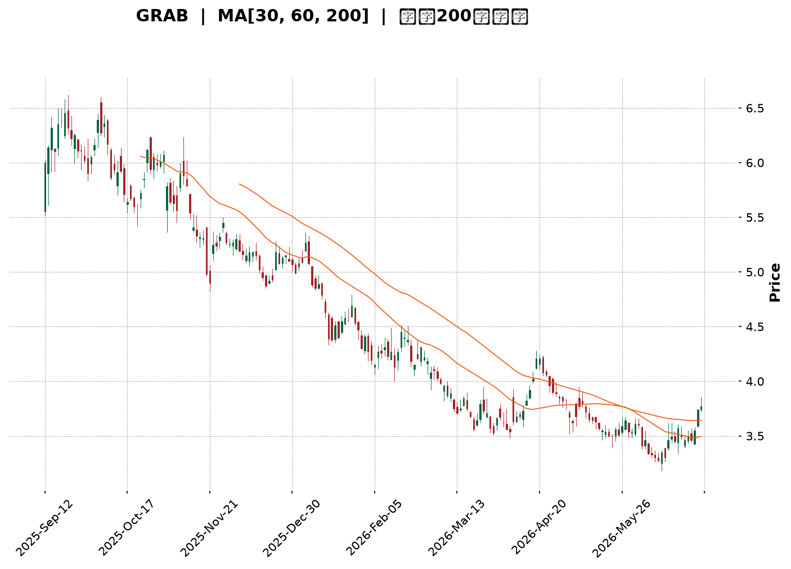
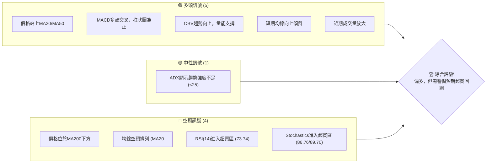
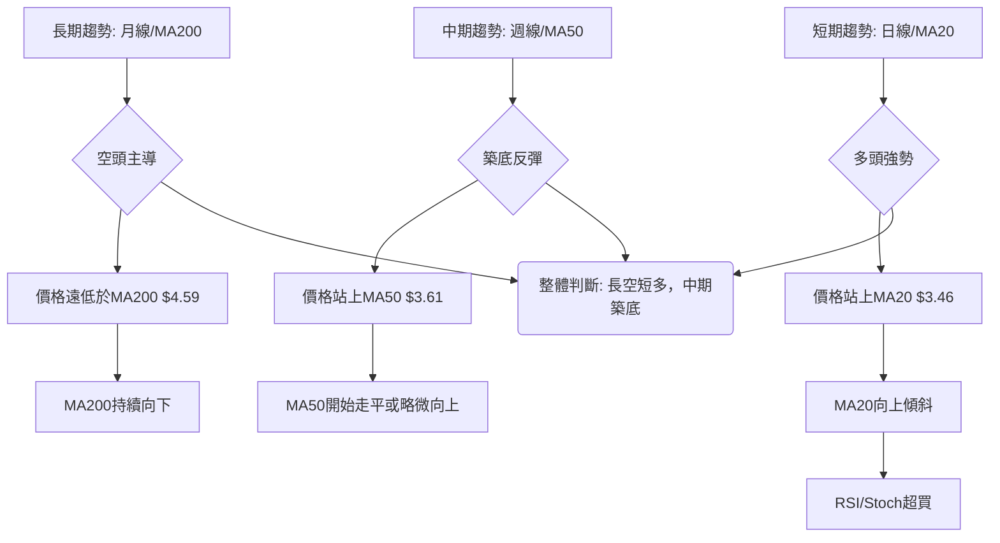
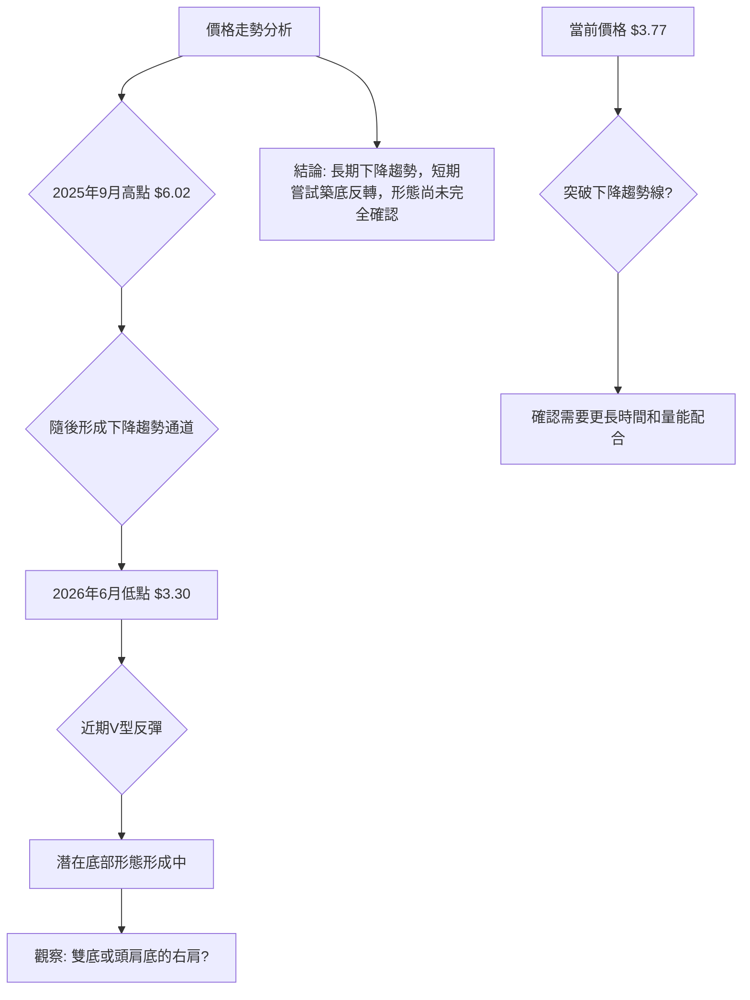
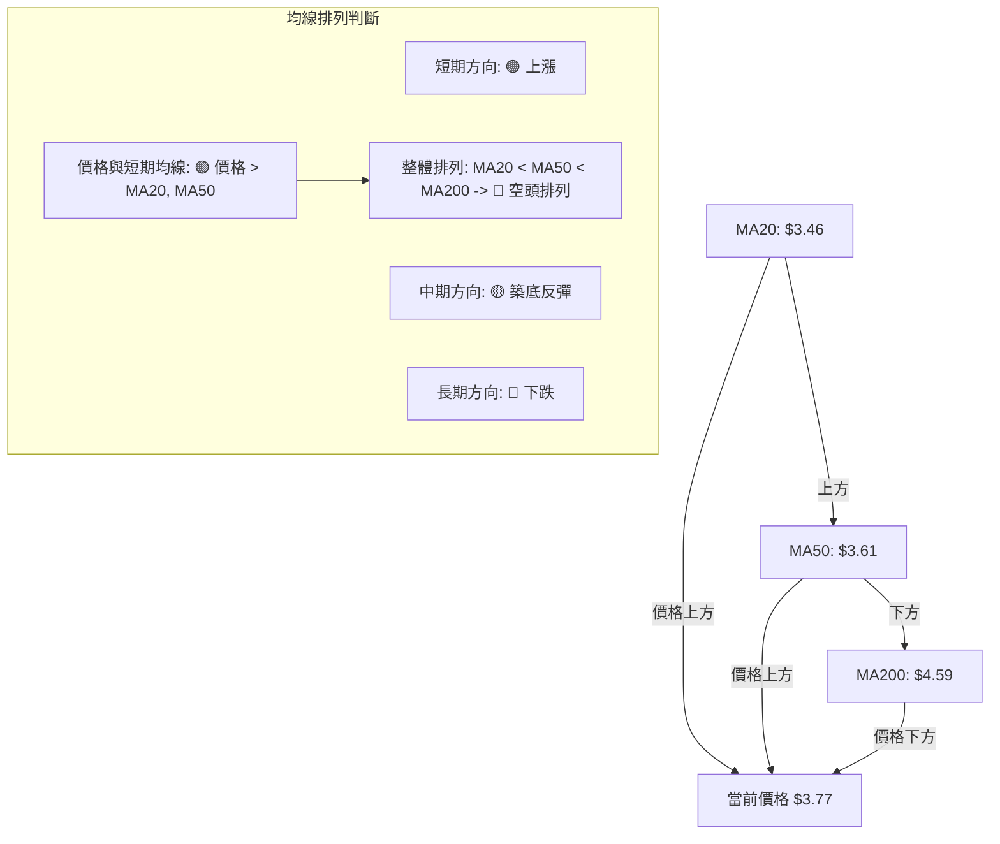
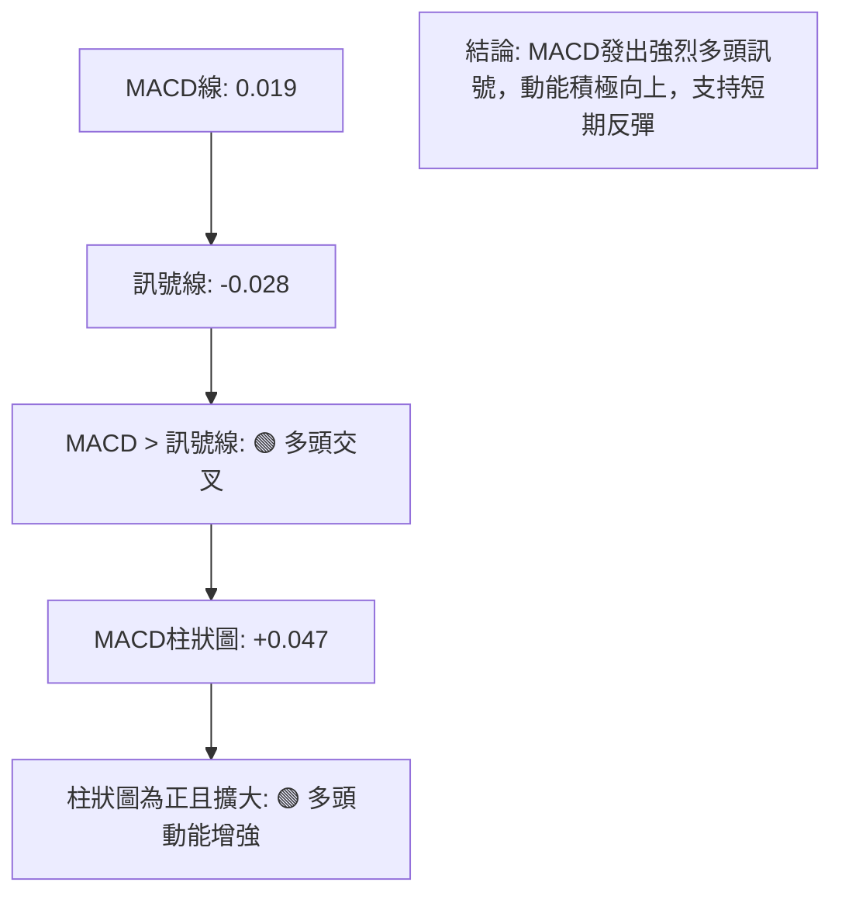
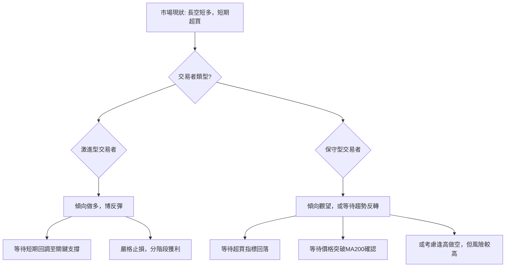

<details>
<summary>📊 靜態圖表 (點擊展開)</summary>

</details>

<html>
<head><meta charset="utf-8" /></head>
<body>
    <div style="height:500px; width:100%;">                        <script>window.PlotlyConfig = {MathJaxConfig: 'local'};</script>
        <script charset="utf-8" src="https://cdn.plot.ly/plotly-3.6.0.min.js" integrity="sha256-QaOVwtVY0T02VaHrr6pnoHLCwayMJp4O5n4YyaE3rJk=" crossorigin="anonymous"></script>                <div id="candlestick-chart" class="plotly-graph-div" style="height:100%; width:100%;"></div>            <script>                window.PLOTLYENV=window.PLOTLYENV || {};                                if (document.getElementById("candlestick-chart")) {                    Plotly.newPlot(                        "candlestick-chart",                        [{"close":{"dtype":"f8","bdata":"AAAAAAAAGEAAAAAgXI8YQAAAACCuRxlAAAAAYGZmGEAAAABgZmYZQAAAACBcjxlAAAAAwMzMGUAAAAAgrkcZQAAAAKBH4RhAAAAAAAAAGUAAAADgo3AYQAAAAOCjcBhAAAAA4HoUGEAAAACgmZkXQAAAAEAzMxhAAAAAANejGEAAAAAgXI8ZQAAAAOB6FBlAAAAA4KNwGUAAAACAFK4YQAAAAOCjcBdAAAAA4FG4F0AAAAAA16MXQAAAAIAUrhdAAAAAQArXFkAAAAAgXI8WQAAAAIAUrhZAAAAAYGZmFkAAAABA4XoWQAAAAKBH4RZAAAAAYGZmF0AAAABA4XoYQAAAAGCPwhdAAAAAQDMzGEAAAAAghesXQAAAAIA9ChhAAAAAIK5HGEAAAAAA1yMXQAAAACBcjxZAAAAAwB6FFkAAAACgcD0WQAAAAKCZmRdAAAAAwB6FF0AAAADA9SgXQAAAAMD1KBZAAAAAANejFUAAAACA61EVQAAAACCuRxVAAAAAoHA9FUAAAAAghesTQAAAAKCZmRNAAAAAAAAAFUAAAACAwvUUQAAAACCuRxVAAAAAwMzMFUAAAADgehQVQAAAAIA9ChVAAAAA4HoUFUAAAABAMzMVQAAAAGCPwhRAAAAAANejFEAAAACgmZkUQAAAAOBRuBRAAAAA4FG4FEAAAACgmZkUQAAAAOB6FBRAAAAAwMzME0AAAABA4XoTQAAAAIAUrhNAAAAA4FG4E0AAAADgUbgUQAAAAIDrURRAAAAAwB6FFEAAAACgmZkUQAAAAGBmZhRAAAAAIK5HFEAAAACAwvUTQAAAAIDrURRAAAAAAClcFEAAAADgehQVQAAAAIDrURRAAAAAwB6FE0AAAABgZmYTQAAAACBcjxNAAAAAwPUoE0AAAADAHoUSQAAAACBcjxFAAAAAwB6FEUAAAACAPQoSQAAAAKCZmRFAAAAAQDMzEkAAAACA61ESQAAAAKBwPRJAAAAAYI\u002fCEkAAAABguB4SQAAAAKBH4RFAAAAAQDMzEUAAAAAA16MRQAAAAOB6FBFAAAAAYI\u002fCEEAAAACgmZkQQAAAAOB6FBFAAAAAgD0KEUAAAACgcD0RQAAAACCF6xBAAAAA4HoUEUAAAADAHoUQQAAAAOB6FBFAAAAAwMzMEUAAAACgmZkRQAAAAMAehRFAAAAA4FG4EEAAAACgmZkQQAAAAEAK1xBAAAAAoHA9EUAAAACgR+EQQAAAAOBRuBBAAAAAgOtREEAAAABgZmYQQAAAAGC4HhBAAAAAQArXD0AAAACAFK4PQAAAAIDC9Q5AAAAAYLgeD0AAAAAAAAAOQAAAAIAUrg1AAAAAAAAADkAAAADgUbgOQAAAAAAAAA5AAAAA4KNwDUAAAABA4XoMQAAAAGC4Hg1AAAAAgOtRDkAAAABACtcNQAAAAIAUrg1AAAAAIFyPDEAAAACgcD0MQAAAACCuRw1AAAAAAClcDUAAAACAwvUMQAAAAEDhegxAAAAAgOtRDEAAAACAPQoNQAAAAOCjcA1AAAAA4KNwDUAAAABACtcNQAAAACBcjw5AAAAAAClcD0AAAADgehQQQAAAAEAK1xBAAAAAQArXEEAAAACA61EQQAAAAKBwPRBAAAAAgBSuD0AAAABAMzMPQAAAAGC4Hg9AAAAAoEfhDkAAAAAgXI8OQAAAACBcjw5AAAAAAClcDUAAAACAwvUMQAAAAOCjcA1AAAAAwPUoDkAAAACA61EOQAAAAGCPwg1AAAAAQDMzDUAAAABguB4NQAAAAIA9Cg1AAAAAIFyPDEAAAABgZmYMQAAAAIDrUQxAAAAAAAAADEAAAADgehQMQAAAAEDhegxAAAAA4HoUDEAAAADgUbgMQAAAAGC4Hg1AAAAAgOtRDEAAAACA61EMQAAAAKBH4QxAAAAAwMzMDEAAAAAgrkcLQAAAAIAUrgtAAAAA4FG4CkAAAAAA16MKQAAAAGBmZgpAAAAAwPUoCkAAAADAzMwKQAAAAGBmZgpAAAAAgBSuC0AAAAAghesLQAAAAKCZmQtAAAAAIFyPDEAAAAAghesLQAAAAIAUrgtAAAAAIIXrC0AAAACAFK4LQAAAAGBmZgxAAAAAIIXrDUAAAADA9SgOQA=="},"high":{"dtype":"f8","bdata":"AAAAYLgeGEAAAAAA16MYQAAAAIAUrhlAAAAAwB6FGEAAAAAAAAAaQAAAAAAAABpAAAAAgOtRGkAAAABA4XoaQAAAAOBRuBlAAAAA4HoUGUAAAACgR+EYQAAAAIAUrhhAAAAAoJmZGEAAAACgR+EYQAAAACCuRxhAAAAAoEfhGEAAAAAgrscZQAAAAGBmZhpAAAAAQInBGUAAAACgmZkZQAAAACBcjxhAAAAAIK5HGEAAAADgehQYQAAAACBcjxhAAAAAgML1F0AAAABAM7MWQAAAAIBqPBdAAAAA4FG4FkAAAABA4XoWQAAAAIA9ChdAAAAAwPWoF0AAAADAHoUYQAAAAIDC9RhAAAAAAClcGEAAAACA61EYQAAAAIDrURhAAAAAgMJ1GEAAAAAgrkcXQAAAAOCjcBdAAAAAQApXF0AAAADA9SgXQAAAAAAAABhAAAAA4KPwGEAAAADgehQYQAAAAKBH4RZAAAAAYLgeFkAAAADgehQWQAAAAIDCdRVAAAAAwB6FFUAAAAAA16MVQAAAAKBwPRRAAAAAQOF6FUAAAAAAKVwVQAAAAOCjcBVAAAAAAAAAFkAAAABA4XoVQAAAAKBwPRVAAAAAQDMzFUAAAABgZmYVQAAAAGBmZhVAAAAAIFwPFUAAAAAAKdwUQAAAAIDC9RRAAAAAYI\u002fCFEAAAADgehQVQAAAAADXoxRAAAAAQDMzFEAAAACgR+ETQAAAAKBH4RNAAAAAYLgeFEAAAABguB4VQAAAAIDC9RRAAAAAoJmZFEAAAAAA16MUQAAAACCF6xRAAAAAIFyPFEAAAAAAKVwUQAAAAMAehRRAAAAAwMzMFEAAAADgo3AVQAAAAIDrURVAAAAAQDMzFEAAAACgR+ETQAAAAKBH4RNAAAAAoJmZE0AAAACAPQoTQAAAAMAehRJAAAAAYGZmEkAAAADgUTgSQAAAAEAzMxJAAAAAYGZmEkAAAAAgXI8SQAAAAIAUrhJAAAAAgBQuE0AAAADgUbgSQAAAAOBROBJAAAAAoEfhEUAAAADgUbgRQAAAAGCPwhFAAAAAQOF6EUAAAAAA16MQQAAAAMDMTBFAAAAAAClcEUAAAABguJ4RQAAAACBcjxFAAAAAgML1EUAAAADgUTgRQAAAAEAzMxFAAAAAgD0KEkAAAABACtcRQAAAAMAeBRJAAAAAgD2KEUAAAACgmZkQQAAAAMAehRFAAAAAIK5HEUAAAABguB4RQAAAAKBH4RBAAAAAgD2KEEAAAADgepQQQAAAAMAehRBAAAAAwPUoEEAAAACAFK4PQAAAAAAAABBAAAAAwB6FD0AAAADAzMwOQAAAAEDheg5AAAAAANejDkAAAACAwvUOQAAAAEAzMw9AAAAAQArXDUAAAADgo3ANQAAAAIAUrg1AAAAAANejDkAAAACgmZkPQAAAAOBRuA5AAAAAwB6FDUAAAACAwvUMQAAAAOCjcA1AAAAAgOtRDkAAAABgj8INQAAAAAAAAA5AAAAAYI\u002fCDEAAAADgo3APQAAAAEAK1w1AAAAAwMzMDUAAAACgcD0OQAAAAOB6FA9AAAAA4FG4D0AAAAAAKVwQQAAAAGC4HhFAAAAAAAAAEUAAAACAwvUQQAAAAOCjcBBAAAAAQDMzEEAAAADA9SgQQAAAACCF6w9AAAAAAAAAD0AAAAAghesOQAAAAOBRuA5AAAAAoEfhDUAAAABAMzMNQAAAAOCjcA5AAAAAoJmZD0AAAABAMzMPQAAAAKBwPQ5AAAAA4HoUDkAAAADgo3ANQAAAAOCjcA1AAAAAgML1DEAAAAAgXI8MQAAAAMDMzAxAAAAAIFyPDEAAAACA6SYMQAAAAADXowxAAAAAgML1DEAAAACA61ENQAAAAAApXA1AAAAAgML1DEAAAAAgXI8MQAAAACCuRw1AAAAAIK5HDUAAAADgUbgMQAAAAGBmZgxAAAAAwB6FC0AAAABAMzMLQAAAAIDC9QpAAAAAwMzMCkAAAACAwvUKQAAAAGC4HgtAAAAAgML1DEAAAACAwvUMQAAAAAApXAxAAAAAoEfhDEAAAADgUbgMQAAAAAAAAAxAAAAAYGZmDEAAAAAgXI8MQAAAAADXowxAAAAAAAAADkAAAACgR+EOQA=="},"hovertemplate":"\u003cb\u003e%{x|%Y-%m-%d}\u003c\u002fb\u003e\u003cbr\u003e\u958b: $%{open:.2f}\u003cbr\u003e\u9ad8: $%{high:.2f}\u003cbr\u003e\u4f4e: $%{low:.2f}\u003cbr\u003e\u6536: $%{close:.2f}\u003cextra\u003e\u003c\u002fextra\u003e","low":{"dtype":"f8","bdata":"AAAAgD0KFkAAAADgo3AWQAAAAADXoxdAAAAAwPWoF0AAAACgcD0YQAAAACCuRxlAAAAAoEfhGEAAAACAPQoZQAAAAADXoxhAAAAAgML1F0AAAADA9SgYQAAAAOBRuBdAAAAAgML1F0AAAACA61EXQAAAAKCZmRdAAAAAoHA9GEAAAAAgXI8YQAAAAIDC9RhAAAAAIIXrGEAAAAAgrkcYQAAAAAApXBdAAAAAIFyPF0AAAADAzMwWQAAAAKCZmRdAAAAAIFyPFkAAAADA9SgWQAAAAKCZmRZAAAAAwPUoFkAAAACAFK4VQAAAAIDrURZAAAAA4HoUF0AAAAAA16MXQAAAAKCZmRdAAAAAYGZmF0AAAACAFK4XQAAAAMDMzBdAAAAAoJmZF0AAAADgo3AVQAAAAEDhehZAAAAAgBQuFkAAAADAzMwVQAAAACCF6xZAAAAAQDMzF0AAAABguB4XQAAAACCF6xVAAAAA4KNwFUAAAADgehQVQAAAAKBH4RRAAAAAAAAAFUAAAABACtcTQAAAACCuRxNAAAAAIIVrFEAAAABgj8IUQAAAAEAK1xRAAAAA4KNwFUAAAAAAAAAVQAAAAKBH4RRAAAAAoJmZFEAAAAAgrscUQAAAAOBRuBRAAAAA4KNwFEAAAACA61EUQAAAAEAzMxRAAAAAoEdhFEAAAADgo3AUQAAAAIDC9RNAAAAAgBSuE0AAAABgZmYTQAAAACBcjxNAAAAAANejE0AAAACAPQoUQAAAACCuRxRAAAAAYLgeFEAAAADAzEwUQAAAAKBHYRRAAAAAAAAAFEAAAAAghesTQAAAAIA9ChRAAAAAgOtRFEAAAABgj8IUQAAAAGCPQhRAAAAA4KNwE0AAAACA61ETQAAAAAApXBNAAAAAAAAAE0AAAACA61ESQAAAAIDrURFAAAAA4KNwEUAAAABgZmYRQAAAACBcjxFAAAAA4FG4EUAAAADgehQSQAAAAMD1KBJAAAAAAClcEkAAAACAPQoSQAAAAMAehRFAAAAAwPUoEUAAAAAAAAARQAAAAOBRuBBAAAAAoJmZEEAAAACgcD0QQAAAAIDCdRBAAAAAQArXEEAAAAAghesQQAAAAGCPwhBAAAAAwMzMEEAAAAAAAAAQQAAAAGBmZhBAAAAA4HoUEUAAAABgj0IRQAAAAIDrURFAAAAAwB6FEEAAAABAMzMQQAAAAOCnxhBAAAAAIFyPEEAAAADgUbgQQAAAAKBwPRBAAAAAAClcD0AAAACAPQoQQAAAAAAAABBAAAAAYI\u002fCD0AAAADAHoUOQAAAAMDMzA5AAAAAQOF6DkAAAABgj8INQAAAAKCZmQ1AAAAAYI\u002fCDUAAAADA9SgOQAAAAEAK1w1AAAAAIK5HDUAAAABgZmYMQAAAAOBRuAxAAAAAgML1DEAAAACgmZkNQAAAAIDrUQ1AAAAAoHA9DEAAAADgehQMQAAAAGBmZgxAAAAAYLgeDUAAAAAA16MMQAAAAEDhegxAAAAAQArXC0AAAADAzMwMQAAAAIDC9QxAAAAAQDMzDUAAAAAA16MMQAAAAGBkOw5AAAAAgBSuDkAAAABACtcPQAAAAOCjcBBAAAAA4KNwEEAAAABAMzMQQAAAAMD1KBBAAAAAQDMzD0AAAACAPQoPQAAAAKBH4Q5AAAAAgOtRDkAAAADgehQOQAAAACCF6w1AAAAAwPUoDEAAAACA61EMQAAAAOBRuAxAAAAAIIXrDUAAAADgehQOQAAAACCuRw1AAAAAgML1DEAAAACgR+EMQAAAAEDhegxAAAAAYGZmDEAAAACAFK4LQAAAAEAK1wtAAAAAIIXrC0AAAABguB4LQAAAAKCZmQtAAAAAIIXrC0AAAADgehQMQAAAAOCjcAxAAAAAQArXC0AAAABACtcLQAAAAAAAAAxAAAAAIFyPDEAAAACAPQoLQAAAAIA9CgtAAAAAoJmZCkAAAABgZmYKQAAAAOB6FApAAAAAwPUoCkAAAADgo3AJQAAAAOB6FApAAAAAgML1CkAAAABA4XoLQAAAAOCjcAtAAAAA4FG4CkAAAABgj8ILQAAAAGC4HgtAAAAA4KNwC0AAAADAHoULQAAAAGBmZgtAAAAAANejDEAAAABgj8INQA=="},"name":"\u50f9\u683c","open":{"dtype":"f8","bdata":"AAAAQDMzFkAAAACgmZkXQAAAAEDhehhAAAAAwB6FGEAAAACAPYoYQAAAACBcjxlAAAAAQOH6GEAAAAAghesZQAAAAEAzMxlAAAAAwB6FGEAAAABACtcYQAAAAIDCdRhAAAAAoHA9GEAAAADA9SgYQAAAAIDC9RdAAAAAQOF6GEAAAACgmRkZQAAAAEAzMxpAAAAAgOtRGUAAAACAPYoZQAAAAEDhehhAAAAAgML1F0AAAADA9SgXQAAAAKBwPRhAAAAAwMzMF0AAAABA4XoWQAAAAMD1KBdAAAAA4FG4FkAAAABA4XoWQAAAAIAUrhZAAAAAoEdhF0AAAAAAAAAYQAAAACCF6xhAAAAAYI\u002fCF0AAAAAAAAAYQAAAAKBH4RdAAAAAgD0KGEAAAABgj0IWQAAAAGCPQhdAAAAAwMzMFkAAAADAzMwWQAAAAKCZGRdAAAAAIFwPGEAAAABgZmYXQAAAAEAK1xZAAAAAwB6FFUAAAACAPYoVQAAAAOBROBVAAAAAQDMzFUAAAAAA16MVQAAAAIA9ChRAAAAAgBSuFEAAAADgehQVQAAAAMD1KBVAAAAAANejFUAAAAAghWsVQAAAAMAeBRVAAAAAgML1FEAAAABACtcUQAAAAMD1KBVAAAAAYI\u002fCFEAAAAAghWsUQAAAAGBmZhRAAAAA4HqUFEAAAABgj8IUQAAAAKCZmRRAAAAAQOH6E0AAAACgR+ETQAAAAKCZmRNAAAAAoEfhE0AAAADgehQUQAAAAIAUrhRAAAAAgOtRFEAAAAAgXI8UQAAAAEDhehRAAAAAgMJ1FEAAAAAgrkcUQAAAAIAULhRAAAAAwB6FFEAAAABgj8IUQAAAAGC4HhVAAAAAQDMzFEAAAABgj8ITQAAAAGBmZhNAAAAAoJmZE0AAAAAghesSQAAAAOCjcBJAAAAAgOtREkAAAACAPYoRQAAAAEAzMxJAAAAAwMzMEUAAAADgehQSQAAAAKBwPRJAAAAAAClcEkAAAACAFK4SQAAAAMD1KBJAAAAAgBSuEUAAAABguB4RQAAAAMD1qBFAAAAAgOtREUAAAADAHoUQQAAAAKBH4RBAAAAAYLgeEUAAAADA9SgRQAAAAOCjcBFAAAAAwMzMEEAAAACAwvUQQAAAAGCPwhBAAAAAoHA9EUAAAADgepQRQAAAAOCjcBFAAAAAwMxMEUAAAADgo3AQQAAAAAAAABFAAAAA4FG4EEAAAADAzMwQQAAAAADXoxBAAAAAYLgeEEAAAADgo3AQQAAAAAApXBBAAAAAIFwPEEAAAAAgrkcPQAAAAIAUrg9AAAAAwMzMDkAAAAAA16MOQAAAAGC4Hg5AAAAAIIXrDUAAAACgcD0OQAAAAKCZmQ5AAAAAYI\u002fCDUAAAABAMzMNQAAAAMDMzAxAAAAAQDMzDUAAAAAA16MOQAAAAGBmZg1AAAAA4KNwDUAAAADgUbgMQAAAAMDMzAxAAAAAAAAADkAAAACAwvUMQAAAAKBH4QxAAAAAwB6FDEAAAABACtcOQAAAAIA9Cg1AAAAAoJmZDUAAAABAMzMNQAAAAKBwPQ5AAAAAwMzMDkAAAAAAAAAQQAAAAEDhehBAAAAAYLieEEAAAACgR+EQQAAAAAApXBBAAAAAQDMzEEAAAADgehQQQAAAAEAzMw9AAAAAwMzMDkAAAACgR+EOQAAAACBcjw5AAAAA4FG4DUAAAADgehQNQAAAAAApXA5AAAAAwMzMDkAAAAAgXI8OQAAAAMD1KA5AAAAAgBSuDUAAAAAAKVwNQAAAAAApXA1AAAAAgML1DEAAAACA61EMQAAAAGC4HgxAAAAAgOtRDEAAAADgehQMQAAAAAAAAAxAAAAAQOF6DEAAAAAgrkcMQAAAAEDhegxAAAAAgML1DEAAAACgcD0MQAAAAMD1KAxAAAAAoEfhDEAAAAAA16MMQAAAACCuRwtAAAAA4KNwC0AAAABgj8IKQAAAAADXowpAAAAAYGZmCkAAAAAAAAAKQAAAAGC4HgtAAAAAYLgeC0AAAABgj8ILQAAAAAAAAAxAAAAAwB6FC0AAAACgGAQMQAAAACCuRwtAAAAAANejC0AAAABAMzMMQAAAAGBmZgtAAAAA4FG4DEAAAAAghesNQA=="},"x":["2025-09-12T00:00:00-04:00","2025-09-15T00:00:00-04:00","2025-09-16T00:00:00-04:00","2025-09-17T00:00:00-04:00","2025-09-18T00:00:00-04:00","2025-09-19T00:00:00-04:00","2025-09-22T00:00:00-04:00","2025-09-23T00:00:00-04:00","2025-09-24T00:00:00-04:00","2025-09-25T00:00:00-04:00","2025-09-26T00:00:00-04:00","2025-09-29T00:00:00-04:00","2025-09-30T00:00:00-04:00","2025-10-01T00:00:00-04:00","2025-10-02T00:00:00-04:00","2025-10-03T00:00:00-04:00","2025-10-06T00:00:00-04:00","2025-10-07T00:00:00-04:00","2025-10-08T00:00:00-04:00","2025-10-09T00:00:00-04:00","2025-10-10T00:00:00-04:00","2025-10-13T00:00:00-04:00","2025-10-14T00:00:00-04:00","2025-10-15T00:00:00-04:00","2025-10-16T00:00:00-04:00","2025-10-17T00:00:00-04:00","2025-10-20T00:00:00-04:00","2025-10-21T00:00:00-04:00","2025-10-22T00:00:00-04:00","2025-10-23T00:00:00-04:00","2025-10-24T00:00:00-04:00","2025-10-27T00:00:00-04:00","2025-10-28T00:00:00-04:00","2025-10-29T00:00:00-04:00","2025-10-30T00:00:00-04:00","2025-10-31T00:00:00-04:00","2025-11-03T00:00:00-05:00","2025-11-04T00:00:00-05:00","2025-11-05T00:00:00-05:00","2025-11-06T00:00:00-05:00","2025-11-07T00:00:00-05:00","2025-11-10T00:00:00-05:00","2025-11-11T00:00:00-05:00","2025-11-12T00:00:00-05:00","2025-11-13T00:00:00-05:00","2025-11-14T00:00:00-05:00","2025-11-17T00:00:00-05:00","2025-11-18T00:00:00-05:00","2025-11-19T00:00:00-05:00","2025-11-20T00:00:00-05:00","2025-11-21T00:00:00-05:00","2025-11-24T00:00:00-05:00","2025-11-25T00:00:00-05:00","2025-11-26T00:00:00-05:00","2025-11-28T00:00:00-05:00","2025-12-01T00:00:00-05:00","2025-12-02T00:00:00-05:00","2025-12-03T00:00:00-05:00","2025-12-04T00:00:00-05:00","2025-12-05T00:00:00-05:00","2025-12-08T00:00:00-05:00","2025-12-09T00:00:00-05:00","2025-12-10T00:00:00-05:00","2025-12-11T00:00:00-05:00","2025-12-12T00:00:00-05:00","2025-12-15T00:00:00-05:00","2025-12-16T00:00:00-05:00","2025-12-17T00:00:00-05:00","2025-12-18T00:00:00-05:00","2025-12-19T00:00:00-05:00","2025-12-22T00:00:00-05:00","2025-12-23T00:00:00-05:00","2025-12-24T00:00:00-05:00","2025-12-26T00:00:00-05:00","2025-12-29T00:00:00-05:00","2025-12-30T00:00:00-05:00","2025-12-31T00:00:00-05:00","2026-01-02T00:00:00-05:00","2026-01-05T00:00:00-05:00","2026-01-06T00:00:00-05:00","2026-01-07T00:00:00-05:00","2026-01-08T00:00:00-05:00","2026-01-09T00:00:00-05:00","2026-01-12T00:00:00-05:00","2026-01-13T00:00:00-05:00","2026-01-14T00:00:00-05:00","2026-01-15T00:00:00-05:00","2026-01-16T00:00:00-05:00","2026-01-20T00:00:00-05:00","2026-01-21T00:00:00-05:00","2026-01-22T00:00:00-05:00","2026-01-23T00:00:00-05:00","2026-01-26T00:00:00-05:00","2026-01-27T00:00:00-05:00","2026-01-28T00:00:00-05:00","2026-01-29T00:00:00-05:00","2026-01-30T00:00:00-05:00","2026-02-02T00:00:00-05:00","2026-02-03T00:00:00-05:00","2026-02-04T00:00:00-05:00","2026-02-05T00:00:00-05:00","2026-02-06T00:00:00-05:00","2026-02-09T00:00:00-05:00","2026-02-10T00:00:00-05:00","2026-02-11T00:00:00-05:00","2026-02-12T00:00:00-05:00","2026-02-13T00:00:00-05:00","2026-02-17T00:00:00-05:00","2026-02-18T00:00:00-05:00","2026-02-19T00:00:00-05:00","2026-02-20T00:00:00-05:00","2026-02-23T00:00:00-05:00","2026-02-24T00:00:00-05:00","2026-02-25T00:00:00-05:00","2026-02-26T00:00:00-05:00","2026-02-27T00:00:00-05:00","2026-03-02T00:00:00-05:00","2026-03-03T00:00:00-05:00","2026-03-04T00:00:00-05:00","2026-03-05T00:00:00-05:00","2026-03-06T00:00:00-05:00","2026-03-09T00:00:00-04:00","2026-03-10T00:00:00-04:00","2026-03-11T00:00:00-04:00","2026-03-12T00:00:00-04:00","2026-03-13T00:00:00-04:00","2026-03-16T00:00:00-04:00","2026-03-17T00:00:00-04:00","2026-03-18T00:00:00-04:00","2026-03-19T00:00:00-04:00","2026-03-20T00:00:00-04:00","2026-03-23T00:00:00-04:00","2026-03-24T00:00:00-04:00","2026-03-25T00:00:00-04:00","2026-03-26T00:00:00-04:00","2026-03-27T00:00:00-04:00","2026-03-30T00:00:00-04:00","2026-03-31T00:00:00-04:00","2026-04-01T00:00:00-04:00","2026-04-02T00:00:00-04:00","2026-04-06T00:00:00-04:00","2026-04-07T00:00:00-04:00","2026-04-08T00:00:00-04:00","2026-04-09T00:00:00-04:00","2026-04-10T00:00:00-04:00","2026-04-13T00:00:00-04:00","2026-04-14T00:00:00-04:00","2026-04-15T00:00:00-04:00","2026-04-16T00:00:00-04:00","2026-04-17T00:00:00-04:00","2026-04-20T00:00:00-04:00","2026-04-21T00:00:00-04:00","2026-04-22T00:00:00-04:00","2026-04-23T00:00:00-04:00","2026-04-24T00:00:00-04:00","2026-04-27T00:00:00-04:00","2026-04-28T00:00:00-04:00","2026-04-29T00:00:00-04:00","2026-04-30T00:00:00-04:00","2026-05-01T00:00:00-04:00","2026-05-04T00:00:00-04:00","2026-05-05T00:00:00-04:00","2026-05-06T00:00:00-04:00","2026-05-07T00:00:00-04:00","2026-05-08T00:00:00-04:00","2026-05-11T00:00:00-04:00","2026-05-12T00:00:00-04:00","2026-05-13T00:00:00-04:00","2026-05-14T00:00:00-04:00","2026-05-15T00:00:00-04:00","2026-05-18T00:00:00-04:00","2026-05-19T00:00:00-04:00","2026-05-20T00:00:00-04:00","2026-05-21T00:00:00-04:00","2026-05-22T00:00:00-04:00","2026-05-26T00:00:00-04:00","2026-05-27T00:00:00-04:00","2026-05-28T00:00:00-04:00","2026-05-29T00:00:00-04:00","2026-06-01T00:00:00-04:00","2026-06-02T00:00:00-04:00","2026-06-03T00:00:00-04:00","2026-06-04T00:00:00-04:00","2026-06-05T00:00:00-04:00","2026-06-08T00:00:00-04:00","2026-06-09T00:00:00-04:00","2026-06-10T00:00:00-04:00","2026-06-11T00:00:00-04:00","2026-06-12T00:00:00-04:00","2026-06-15T00:00:00-04:00","2026-06-16T00:00:00-04:00","2026-06-17T00:00:00-04:00","2026-06-18T00:00:00-04:00","2026-06-22T00:00:00-04:00","2026-06-23T00:00:00-04:00","2026-06-24T00:00:00-04:00","2026-06-25T00:00:00-04:00","2026-06-26T00:00:00-04:00","2026-06-29T00:00:00-04:00","2026-06-30T00:00:00-04:00"],"type":"candlestick"},{"hovertemplate":"MA30: $%{y:.2f}\u003cextra\u003e\u003c\u002fextra\u003e","line":{"color":"#2196F3","dash":"dash","width":2},"mode":"lines","name":"MA30","x":["2025-09-12T00:00:00-04:00","2025-09-15T00:00:00-04:00","2025-09-16T00:00:00-04:00","2025-09-17T00:00:00-04:00","2025-09-18T00:00:00-04:00","2025-09-19T00:00:00-04:00","2025-09-22T00:00:00-04:00","2025-09-23T00:00:00-04:00","2025-09-24T00:00:00-04:00","2025-09-25T00:00:00-04:00","2025-09-26T00:00:00-04:00","2025-09-29T00:00:00-04:00","2025-09-30T00:00:00-04:00","2025-10-01T00:00:00-04:00","2025-10-02T00:00:00-04:00","2025-10-03T00:00:00-04:00","2025-10-06T00:00:00-04:00","2025-10-07T00:00:00-04:00","2025-10-08T00:00:00-04:00","2025-10-09T00:00:00-04:00","2025-10-10T00:00:00-04:00","2025-10-13T00:00:00-04:00","2025-10-14T00:00:00-04:00","2025-10-15T00:00:00-04:00","2025-10-16T00:00:00-04:00","2025-10-17T00:00:00-04:00","2025-10-20T00:00:00-04:00","2025-10-21T00:00:00-04:00","2025-10-22T00:00:00-04:00","2025-10-23T00:00:00-04:00","2025-10-24T00:00:00-04:00","2025-10-27T00:00:00-04:00","2025-10-28T00:00:00-04:00","2025-10-29T00:00:00-04:00","2025-10-30T00:00:00-04:00","2025-10-31T00:00:00-04:00","2025-11-03T00:00:00-05:00","2025-11-04T00:00:00-05:00","2025-11-05T00:00:00-05:00","2025-11-06T00:00:00-05:00","2025-11-07T00:00:00-05:00","2025-11-10T00:00:00-05:00","2025-11-11T00:00:00-05:00","2025-11-12T00:00:00-05:00","2025-11-13T00:00:00-05:00","2025-11-14T00:00:00-05:00","2025-11-17T00:00:00-05:00","2025-11-18T00:00:00-05:00","2025-11-19T00:00:00-05:00","2025-11-20T00:00:00-05:00","2025-11-21T00:00:00-05:00","2025-11-24T00:00:00-05:00","2025-11-25T00:00:00-05:00","2025-11-26T00:00:00-05:00","2025-11-28T00:00:00-05:00","2025-12-01T00:00:00-05:00","2025-12-02T00:00:00-05:00","2025-12-03T00:00:00-05:00","2025-12-04T00:00:00-05:00","2025-12-05T00:00:00-05:00","2025-12-08T00:00:00-05:00","2025-12-09T00:00:00-05:00","2025-12-10T00:00:00-05:00","2025-12-11T00:00:00-05:00","2025-12-12T00:00:00-05:00","2025-12-15T00:00:00-05:00","2025-12-16T00:00:00-05:00","2025-12-17T00:00:00-05:00","2025-12-18T00:00:00-05:00","2025-12-19T00:00:00-05:00","2025-12-22T00:00:00-05:00","2025-12-23T00:00:00-05:00","2025-12-24T00:00:00-05:00","2025-12-26T00:00:00-05:00","2025-12-29T00:00:00-05:00","2025-12-30T00:00:00-05:00","2025-12-31T00:00:00-05:00","2026-01-02T00:00:00-05:00","2026-01-05T00:00:00-05:00","2026-01-06T00:00:00-05:00","2026-01-07T00:00:00-05:00","2026-01-08T00:00:00-05:00","2026-01-09T00:00:00-05:00","2026-01-12T00:00:00-05:00","2026-01-13T00:00:00-05:00","2026-01-14T00:00:00-05:00","2026-01-15T00:00:00-05:00","2026-01-16T00:00:00-05:00","2026-01-20T00:00:00-05:00","2026-01-21T00:00:00-05:00","2026-01-22T00:00:00-05:00","2026-01-23T00:00:00-05:00","2026-01-26T00:00:00-05:00","2026-01-27T00:00:00-05:00","2026-01-28T00:00:00-05:00","2026-01-29T00:00:00-05:00","2026-01-30T00:00:00-05:00","2026-02-02T00:00:00-05:00","2026-02-03T00:00:00-05:00","2026-02-04T00:00:00-05:00","2026-02-05T00:00:00-05:00","2026-02-06T00:00:00-05:00","2026-02-09T00:00:00-05:00","2026-02-10T00:00:00-05:00","2026-02-11T00:00:00-05:00","2026-02-12T00:00:00-05:00","2026-02-13T00:00:00-05:00","2026-02-17T00:00:00-05:00","2026-02-18T00:00:00-05:00","2026-02-19T00:00:00-05:00","2026-02-20T00:00:00-05:00","2026-02-23T00:00:00-05:00","2026-02-24T00:00:00-05:00","2026-02-25T00:00:00-05:00","2026-02-26T00:00:00-05:00","2026-02-27T00:00:00-05:00","2026-03-02T00:00:00-05:00","2026-03-03T00:00:00-05:00","2026-03-04T00:00:00-05:00","2026-03-05T00:00:00-05:00","2026-03-06T00:00:00-05:00","2026-03-09T00:00:00-04:00","2026-03-10T00:00:00-04:00","2026-03-11T00:00:00-04:00","2026-03-12T00:00:00-04:00","2026-03-13T00:00:00-04:00","2026-03-16T00:00:00-04:00","2026-03-17T00:00:00-04:00","2026-03-18T00:00:00-04:00","2026-03-19T00:00:00-04:00","2026-03-20T00:00:00-04:00","2026-03-23T00:00:00-04:00","2026-03-24T00:00:00-04:00","2026-03-25T00:00:00-04:00","2026-03-26T00:00:00-04:00","2026-03-27T00:00:00-04:00","2026-03-30T00:00:00-04:00","2026-03-31T00:00:00-04:00","2026-04-01T00:00:00-04:00","2026-04-02T00:00:00-04:00","2026-04-06T00:00:00-04:00","2026-04-07T00:00:00-04:00","2026-04-08T00:00:00-04:00","2026-04-09T00:00:00-04:00","2026-04-10T00:00:00-04:00","2026-04-13T00:00:00-04:00","2026-04-14T00:00:00-04:00","2026-04-15T00:00:00-04:00","2026-04-16T00:00:00-04:00","2026-04-17T00:00:00-04:00","2026-04-20T00:00:00-04:00","2026-04-21T00:00:00-04:00","2026-04-22T00:00:00-04:00","2026-04-23T00:00:00-04:00","2026-04-24T00:00:00-04:00","2026-04-27T00:00:00-04:00","2026-04-28T00:00:00-04:00","2026-04-29T00:00:00-04:00","2026-04-30T00:00:00-04:00","2026-05-01T00:00:00-04:00","2026-05-04T00:00:00-04:00","2026-05-05T00:00:00-04:00","2026-05-06T00:00:00-04:00","2026-05-07T00:00:00-04:00","2026-05-08T00:00:00-04:00","2026-05-11T00:00:00-04:00","2026-05-12T00:00:00-04:00","2026-05-13T00:00:00-04:00","2026-05-14T00:00:00-04:00","2026-05-15T00:00:00-04:00","2026-05-18T00:00:00-04:00","2026-05-19T00:00:00-04:00","2026-05-20T00:00:00-04:00","2026-05-21T00:00:00-04:00","2026-05-22T00:00:00-04:00","2026-05-26T00:00:00-04:00","2026-05-27T00:00:00-04:00","2026-05-28T00:00:00-04:00","2026-05-29T00:00:00-04:00","2026-06-01T00:00:00-04:00","2026-06-02T00:00:00-04:00","2026-06-03T00:00:00-04:00","2026-06-04T00:00:00-04:00","2026-06-05T00:00:00-04:00","2026-06-08T00:00:00-04:00","2026-06-09T00:00:00-04:00","2026-06-10T00:00:00-04:00","2026-06-11T00:00:00-04:00","2026-06-12T00:00:00-04:00","2026-06-15T00:00:00-04:00","2026-06-16T00:00:00-04:00","2026-06-17T00:00:00-04:00","2026-06-18T00:00:00-04:00","2026-06-22T00:00:00-04:00","2026-06-23T00:00:00-04:00","2026-06-24T00:00:00-04:00","2026-06-25T00:00:00-04:00","2026-06-26T00:00:00-04:00","2026-06-29T00:00:00-04:00","2026-06-30T00:00:00-04:00"],"y":{"dtype":"f8","bdata":"AAAAAAAA+H8AAAAAAAD4fwAAAAAAAPh\u002fAAAAAAAA+H8AAAAAAAD4fwAAAAAAAPh\u002fAAAAAAAA+H8AAAAAAAD4fwAAAAAAAPh\u002fAAAAAAAA+H8AAAAAAAD4fwAAAAAAAPh\u002fAAAAAAAA+H8AAAAAAAD4fwAAAAAAAPh\u002fAAAAAAAA+H8AAAAAAAD4fwAAAAAAAPh\u002fAAAAAAAA+H8AAAAAAAD4fwAAAAAAAPh\u002fAAAAAAAA+H8AAAAAAAD4fwAAAAAAAPh\u002fAAAAAAAA+H8AAAAAAAD4fwAAAAAAAPh\u002fAAAAAAAA+H8AAAAAAAD4f7y7u0upOBhAMzMzk4ozGEAAAADQ2zIYQCIiIlLjJRhAq6qqai4kGEDv7u5OjRcYQCIiItKUChhAVVVVVZz9F0De3d1tWesXQAAAAFCN1xdAvLu7q2PCF0AiIiKyna8XQAAAALByqBdAmpmZWaujF0B3d3cn6p8XQERERLSBjhdAq6qqGuh0F0Dv7u6uuVAXQFVVVXVMMBdAq6qqanUMF0CamZkJ1+MWQN7d3W0SwxZAAAAAgNyrFkAzMzPz\u002fZQWQCIiIhKDgBZAd3d3J6N3FkC8u7sLAmsWQJqZmWkDXRZARERE1L9RFkARERGh00YWQLy7u2u8NBZAvLu7Gy8dFkDv7u4eE\u002fwVQDMzMyMi4hVAVVVV9W\u002fEFUDv7u5OG6gVQN7d3Y1QhhVAd3d31xVgFUAzMzNz2kAVQO\u002fu7v5GKBVAzczMTGIQFUDv7u7OaQMVQJqZmYls5xRAAAAA8NLNFECJiIiI+rcUQBEREcH1qBRAq6qqylqdFEAzMzPTv5EUQLy7u6uOiRRAiYiISAyCFEB3d3dX8osUQERERDQXkhRAiYiIGHaFFECamZk5JngUQDMzM9N4aRRAiYiIqPFSFEARERFBGT0UQDMzMxNnHxRAMzMzIwYBFEAzMzMDD+YTQDMzM+MXyxNAERERoUW2E0BERETk0KITQAAAAECnjRNAERERke18E0DNzMzsw2cTQDMzM\u002fP9VBNAq6qqKs4+E0AAAACgGi8TQGZmZtbqGBNA7+7unqj\u002fEkCJiIhYgNwSQFVVVXXawBJAiYiISCijEkAAAABAfIYSQDMzMxPKaBJAERERkXtNEkBmZmbGIDASQDMzM+N6FBJAq6qqeqL+EUDe3d1N8OARQM3MzJwLyRFAq6qq6iaxEUCamZk5QpkRQLy7u0sMghFA3t3d\u002falxEUCrqqpaq2MRQImIiFiAXBFAd3d350JSEUBEREREREQRQImIiCijNxFAvLu7ay4kEUB3d3fHBA8RQHd3d3d39xBA3t3d9SjcEEDv7u42icEQQERERDyYpxBAq6qqQtKUEEBmZmaGXYEQQCIiIrKdbxBAd3d3PzVeEEB3d3e\u002fEUoQQJqZmbmQNBBAzczMzIUkEEDv7u6uuRAQQFVVVbXz\u002fQ9AIiIiUirOD0Dv7u6ONKUPQJqZmQmQew9A3t3djVBGD0AAAAAQEREPQFVVVYUW2Q5AZmZmtmWtDkDe3d0N5okOQCIiIqK3ZQ5AZmZmlrU6DkCJiIg4QhkOQERERMSuAA5AERERkcL1DUB3d3d3TPANQBERETGW\u002fA1AvLu7u0kMDkAiIiLiehQOQAAAAGBzIQ5AZmZmtjomDkB3d3cneDAOQCIiIuLBPA5AVVVVRUREDkDv7u6+5kIOQFVVVRWuRw5AIiIiUv9GDkBVVVXlF0sOQCIiIvLSTQ5AvLu7a3VMDkDv7u7+jVAOQCIiIsI8UQ5AzczM3LJWDkARERFBNV4OQHd3d\u002fcoXA5AZmZmVlVVDkAAAAAAjlAOQJqZmXkwTw5AzczMbHVMDkBVVVVFREQOQN7d3R0TPA5AZmZmJngwDkCJiIh46SYOQO\u002fu7r6fGg5AMzMzw64ADkB3d3cn6t8NQERERGT0tg1A3t3d3U+NDUBVVVXFkl8NQDMzMwOdNg1AmpmZuUkMDUAAAABAYOUMQAAAAEAZvQxAERERQdKUDECJiIhovHQMQAAAAMA8UQxAvLu7u+ZCDEAiIiLSBjoMQHd3d0dTKgxAZmZmBqwcDEBVVVUlMQgMQBEREVFx9gtAzczMHIXrC0AiIiJiO98LQHd3d0fF2QtA7+7uPmDlC0BmZmYGZfQLQA=="},"type":"scatter"},{"hovertemplate":"MA60: $%{y:.2f}\u003cextra\u003e\u003c\u002fextra\u003e","line":{"color":"#9C27B0","dash":"dash","width":2},"mode":"lines","name":"MA60","x":["2025-09-12T00:00:00-04:00","2025-09-15T00:00:00-04:00","2025-09-16T00:00:00-04:00","2025-09-17T00:00:00-04:00","2025-09-18T00:00:00-04:00","2025-09-19T00:00:00-04:00","2025-09-22T00:00:00-04:00","2025-09-23T00:00:00-04:00","2025-09-24T00:00:00-04:00","2025-09-25T00:00:00-04:00","2025-09-26T00:00:00-04:00","2025-09-29T00:00:00-04:00","2025-09-30T00:00:00-04:00","2025-10-01T00:00:00-04:00","2025-10-02T00:00:00-04:00","2025-10-03T00:00:00-04:00","2025-10-06T00:00:00-04:00","2025-10-07T00:00:00-04:00","2025-10-08T00:00:00-04:00","2025-10-09T00:00:00-04:00","2025-10-10T00:00:00-04:00","2025-10-13T00:00:00-04:00","2025-10-14T00:00:00-04:00","2025-10-15T00:00:00-04:00","2025-10-16T00:00:00-04:00","2025-10-17T00:00:00-04:00","2025-10-20T00:00:00-04:00","2025-10-21T00:00:00-04:00","2025-10-22T00:00:00-04:00","2025-10-23T00:00:00-04:00","2025-10-24T00:00:00-04:00","2025-10-27T00:00:00-04:00","2025-10-28T00:00:00-04:00","2025-10-29T00:00:00-04:00","2025-10-30T00:00:00-04:00","2025-10-31T00:00:00-04:00","2025-11-03T00:00:00-05:00","2025-11-04T00:00:00-05:00","2025-11-05T00:00:00-05:00","2025-11-06T00:00:00-05:00","2025-11-07T00:00:00-05:00","2025-11-10T00:00:00-05:00","2025-11-11T00:00:00-05:00","2025-11-12T00:00:00-05:00","2025-11-13T00:00:00-05:00","2025-11-14T00:00:00-05:00","2025-11-17T00:00:00-05:00","2025-11-18T00:00:00-05:00","2025-11-19T00:00:00-05:00","2025-11-20T00:00:00-05:00","2025-11-21T00:00:00-05:00","2025-11-24T00:00:00-05:00","2025-11-25T00:00:00-05:00","2025-11-26T00:00:00-05:00","2025-11-28T00:00:00-05:00","2025-12-01T00:00:00-05:00","2025-12-02T00:00:00-05:00","2025-12-03T00:00:00-05:00","2025-12-04T00:00:00-05:00","2025-12-05T00:00:00-05:00","2025-12-08T00:00:00-05:00","2025-12-09T00:00:00-05:00","2025-12-10T00:00:00-05:00","2025-12-11T00:00:00-05:00","2025-12-12T00:00:00-05:00","2025-12-15T00:00:00-05:00","2025-12-16T00:00:00-05:00","2025-12-17T00:00:00-05:00","2025-12-18T00:00:00-05:00","2025-12-19T00:00:00-05:00","2025-12-22T00:00:00-05:00","2025-12-23T00:00:00-05:00","2025-12-24T00:00:00-05:00","2025-12-26T00:00:00-05:00","2025-12-29T00:00:00-05:00","2025-12-30T00:00:00-05:00","2025-12-31T00:00:00-05:00","2026-01-02T00:00:00-05:00","2026-01-05T00:00:00-05:00","2026-01-06T00:00:00-05:00","2026-01-07T00:00:00-05:00","2026-01-08T00:00:00-05:00","2026-01-09T00:00:00-05:00","2026-01-12T00:00:00-05:00","2026-01-13T00:00:00-05:00","2026-01-14T00:00:00-05:00","2026-01-15T00:00:00-05:00","2026-01-16T00:00:00-05:00","2026-01-20T00:00:00-05:00","2026-01-21T00:00:00-05:00","2026-01-22T00:00:00-05:00","2026-01-23T00:00:00-05:00","2026-01-26T00:00:00-05:00","2026-01-27T00:00:00-05:00","2026-01-28T00:00:00-05:00","2026-01-29T00:00:00-05:00","2026-01-30T00:00:00-05:00","2026-02-02T00:00:00-05:00","2026-02-03T00:00:00-05:00","2026-02-04T00:00:00-05:00","2026-02-05T00:00:00-05:00","2026-02-06T00:00:00-05:00","2026-02-09T00:00:00-05:00","2026-02-10T00:00:00-05:00","2026-02-11T00:00:00-05:00","2026-02-12T00:00:00-05:00","2026-02-13T00:00:00-05:00","2026-02-17T00:00:00-05:00","2026-02-18T00:00:00-05:00","2026-02-19T00:00:00-05:00","2026-02-20T00:00:00-05:00","2026-02-23T00:00:00-05:00","2026-02-24T00:00:00-05:00","2026-02-25T00:00:00-05:00","2026-02-26T00:00:00-05:00","2026-02-27T00:00:00-05:00","2026-03-02T00:00:00-05:00","2026-03-03T00:00:00-05:00","2026-03-04T00:00:00-05:00","2026-03-05T00:00:00-05:00","2026-03-06T00:00:00-05:00","2026-03-09T00:00:00-04:00","2026-03-10T00:00:00-04:00","2026-03-11T00:00:00-04:00","2026-03-12T00:00:00-04:00","2026-03-13T00:00:00-04:00","2026-03-16T00:00:00-04:00","2026-03-17T00:00:00-04:00","2026-03-18T00:00:00-04:00","2026-03-19T00:00:00-04:00","2026-03-20T00:00:00-04:00","2026-03-23T00:00:00-04:00","2026-03-24T00:00:00-04:00","2026-03-25T00:00:00-04:00","2026-03-26T00:00:00-04:00","2026-03-27T00:00:00-04:00","2026-03-30T00:00:00-04:00","2026-03-31T00:00:00-04:00","2026-04-01T00:00:00-04:00","2026-04-02T00:00:00-04:00","2026-04-06T00:00:00-04:00","2026-04-07T00:00:00-04:00","2026-04-08T00:00:00-04:00","2026-04-09T00:00:00-04:00","2026-04-10T00:00:00-04:00","2026-04-13T00:00:00-04:00","2026-04-14T00:00:00-04:00","2026-04-15T00:00:00-04:00","2026-04-16T00:00:00-04:00","2026-04-17T00:00:00-04:00","2026-04-20T00:00:00-04:00","2026-04-21T00:00:00-04:00","2026-04-22T00:00:00-04:00","2026-04-23T00:00:00-04:00","2026-04-24T00:00:00-04:00","2026-04-27T00:00:00-04:00","2026-04-28T00:00:00-04:00","2026-04-29T00:00:00-04:00","2026-04-30T00:00:00-04:00","2026-05-01T00:00:00-04:00","2026-05-04T00:00:00-04:00","2026-05-05T00:00:00-04:00","2026-05-06T00:00:00-04:00","2026-05-07T00:00:00-04:00","2026-05-08T00:00:00-04:00","2026-05-11T00:00:00-04:00","2026-05-12T00:00:00-04:00","2026-05-13T00:00:00-04:00","2026-05-14T00:00:00-04:00","2026-05-15T00:00:00-04:00","2026-05-18T00:00:00-04:00","2026-05-19T00:00:00-04:00","2026-05-20T00:00:00-04:00","2026-05-21T00:00:00-04:00","2026-05-22T00:00:00-04:00","2026-05-26T00:00:00-04:00","2026-05-27T00:00:00-04:00","2026-05-28T00:00:00-04:00","2026-05-29T00:00:00-04:00","2026-06-01T00:00:00-04:00","2026-06-02T00:00:00-04:00","2026-06-03T00:00:00-04:00","2026-06-04T00:00:00-04:00","2026-06-05T00:00:00-04:00","2026-06-08T00:00:00-04:00","2026-06-09T00:00:00-04:00","2026-06-10T00:00:00-04:00","2026-06-11T00:00:00-04:00","2026-06-12T00:00:00-04:00","2026-06-15T00:00:00-04:00","2026-06-16T00:00:00-04:00","2026-06-17T00:00:00-04:00","2026-06-18T00:00:00-04:00","2026-06-22T00:00:00-04:00","2026-06-23T00:00:00-04:00","2026-06-24T00:00:00-04:00","2026-06-25T00:00:00-04:00","2026-06-26T00:00:00-04:00","2026-06-29T00:00:00-04:00","2026-06-30T00:00:00-04:00"],"y":{"dtype":"f8","bdata":"AAAAAAAA+H8AAAAAAAD4fwAAAAAAAPh\u002fAAAAAAAA+H8AAAAAAAD4fwAAAAAAAPh\u002fAAAAAAAA+H8AAAAAAAD4fwAAAAAAAPh\u002fAAAAAAAA+H8AAAAAAAD4fwAAAAAAAPh\u002fAAAAAAAA+H8AAAAAAAD4fwAAAAAAAPh\u002fAAAAAAAA+H8AAAAAAAD4fwAAAAAAAPh\u002fAAAAAAAA+H8AAAAAAAD4fwAAAAAAAPh\u002fAAAAAAAA+H8AAAAAAAD4fwAAAAAAAPh\u002fAAAAAAAA+H8AAAAAAAD4fwAAAAAAAPh\u002fAAAAAAAA+H8AAAAAAAD4fwAAAAAAAPh\u002fAAAAAAAA+H8AAAAAAAD4fwAAAAAAAPh\u002fAAAAAAAA+H8AAAAAAAD4fwAAAAAAAPh\u002fAAAAAAAA+H8AAAAAAAD4fwAAAAAAAPh\u002fAAAAAAAA+H8AAAAAAAD4fwAAAAAAAPh\u002fAAAAAAAA+H8AAAAAAAD4fwAAAAAAAPh\u002fAAAAAAAA+H8AAAAAAAD4fwAAAAAAAPh\u002fAAAAAAAA+H8AAAAAAAD4fwAAAAAAAPh\u002fAAAAAAAA+H8AAAAAAAD4fwAAAAAAAPh\u002fAAAAAAAA+H8AAAAAAAD4fwAAAAAAAPh\u002fAAAAAAAA+H8AAAAAAAD4f7y7u9uyNhdAd3d311woF0B3d3d3dxcXQKuqqroCBBdAAAAAME\u002f0FkDv7u5O1N8WQAAAALByyBZAZmZmFtmuFkCJiIjwGZYWQHd3dyfqfxZARERE\u002fGJpFkCJiIjAg1kWQM3MzJzvRxZAzczMJL84FkAAAABY8isWQKuqqrq7GxZAq6qqciEJFkARERHBPPEVQImIiJDt3BVAmpmZ2UDHFUCJiIiw5LcVQBEREdGUqhVARERETKmYFUBmZmYWkoYVQKuqqvL9dBVAAAAAaEplFUBmZmamDVQVQGZmZj41PhVAvLu7+2IpFUAiIiJScRYVQHd3dyfq\u002fxRAZmZmXrrpFECamZkBcs8UQJqZmbHktxRAMzMzw66gFEDe3d2d74cUQImIiECnbRRAERERAXJPFECamZmJ+jcUQKuqquqYIBRA3t3ddQUIFEC8u7sT9e8TQHd3d38j1BNAREREnH24E0BERERkO58TQCIiIurfiBNA3t3dLWt1E0DNzMxM8GATQHd3d8cETxNAmpmZYVdAE0CrqqpScTYTQImIiGiRLRNAmpmZgU4bE0CamZk5tAgTQHd3d4\u002fC9RJAMzMz003iEkDe3d1NYtASQN7d3bXzvRJAVVVVhaSpEkC8u7ujKZUSQN7d3YVdgRJAZmZmBjptEkDe3d3V6lgSQLy7u1uPQhJAd3d3Q4ssEkDe3d2RphQSQLy7uxdL\u002fhFAq6qqNtDpEUAzMzMTPNgRQERERERExBFAMzMz7+6uEUAAAAAMSZMRQHd3d5e1ehFAq6qqCtdjEUB3d3f3mksRQO\u002fu7vbhMxFAERERXUgaEUDv7u6GXQERQAAAAHQh6RBAzczMYOXQEEDv7u5qvLQQQLy7u2\u002fLmhBA7+7u4uyDEEBERESgGm8QQGZmZg50WhBAiYiIZIJHEEB3d3c7JjgQQFVVVd1rLhBAAAAAGJImEEAAAABANR4QQImIiCD3GhBAzczMpCkVEEBEREQcoQwQQLy7u5MYBBBAERERUUbvD0CrqqpKxdkPQFVVVS35xQ9AVVVVZfS2D0De3d3l0KIPQM3MzLx0kw9AiYiI6LSBD0AiIiKynW8PQKuqqjJ6Ww9Aq6qqgsBKD0BmZmauADkPQLy7uzuYJw9Ad3d3l24SD0AAAADotAEPQImIiIDc6w5AIiIi8tLNDkAAAACIz7AOQHd3d38jlA5AmpmZke18DkCamZkpFWcOQAAAAGDlUA5AZmZm3pY1DkCJiIjYFSAOQJqZmUGnDQ5AIiIiqjj7DUB3d3dPG+gNQKuqqkrF2Q1AzczMzMzMDUC8u7vTBroNQJqZmTEIrA1AAAAAOEKZDUC8u7sz7IoNQBEREZHtfA1AMzMzQ4tsDUC8u7uT0VsNQKuqqmp1TA1A7+7uBvNEDUC8u7tbj0INQM3MzBwTPA1AERERuZA0DUAiIiKSXywNQJqZmQnXIw1AzczM\u002fBshDUCamZlRuB4NQHd3dx\u002f3Gg1Aq6qqylodDUAzMzODeSINQA=="},"type":"scatter"},{"hovertemplate":"MA200: $%{y:.2f}\u003cextra\u003e\u003c\u002fextra\u003e","line":{"color":"#FF6F00","dash":"solid","width":2},"mode":"lines","name":"MA200","x":["2025-09-12T00:00:00-04:00","2025-09-15T00:00:00-04:00","2025-09-16T00:00:00-04:00","2025-09-17T00:00:00-04:00","2025-09-18T00:00:00-04:00","2025-09-19T00:00:00-04:00","2025-09-22T00:00:00-04:00","2025-09-23T00:00:00-04:00","2025-09-24T00:00:00-04:00","2025-09-25T00:00:00-04:00","2025-09-26T00:00:00-04:00","2025-09-29T00:00:00-04:00","2025-09-30T00:00:00-04:00","2025-10-01T00:00:00-04:00","2025-10-02T00:00:00-04:00","2025-10-03T00:00:00-04:00","2025-10-06T00:00:00-04:00","2025-10-07T00:00:00-04:00","2025-10-08T00:00:00-04:00","2025-10-09T00:00:00-04:00","2025-10-10T00:00:00-04:00","2025-10-13T00:00:00-04:00","2025-10-14T00:00:00-04:00","2025-10-15T00:00:00-04:00","2025-10-16T00:00:00-04:00","2025-10-17T00:00:00-04:00","2025-10-20T00:00:00-04:00","2025-10-21T00:00:00-04:00","2025-10-22T00:00:00-04:00","2025-10-23T00:00:00-04:00","2025-10-24T00:00:00-04:00","2025-10-27T00:00:00-04:00","2025-10-28T00:00:00-04:00","2025-10-29T00:00:00-04:00","2025-10-30T00:00:00-04:00","2025-10-31T00:00:00-04:00","2025-11-03T00:00:00-05:00","2025-11-04T00:00:00-05:00","2025-11-05T00:00:00-05:00","2025-11-06T00:00:00-05:00","2025-11-07T00:00:00-05:00","2025-11-10T00:00:00-05:00","2025-11-11T00:00:00-05:00","2025-11-12T00:00:00-05:00","2025-11-13T00:00:00-05:00","2025-11-14T00:00:00-05:00","2025-11-17T00:00:00-05:00","2025-11-18T00:00:00-05:00","2025-11-19T00:00:00-05:00","2025-11-20T00:00:00-05:00","2025-11-21T00:00:00-05:00","2025-11-24T00:00:00-05:00","2025-11-25T00:00:00-05:00","2025-11-26T00:00:00-05:00","2025-11-28T00:00:00-05:00","2025-12-01T00:00:00-05:00","2025-12-02T00:00:00-05:00","2025-12-03T00:00:00-05:00","2025-12-04T00:00:00-05:00","2025-12-05T00:00:00-05:00","2025-12-08T00:00:00-05:00","2025-12-09T00:00:00-05:00","2025-12-10T00:00:00-05:00","2025-12-11T00:00:00-05:00","2025-12-12T00:00:00-05:00","2025-12-15T00:00:00-05:00","2025-12-16T00:00:00-05:00","2025-12-17T00:00:00-05:00","2025-12-18T00:00:00-05:00","2025-12-19T00:00:00-05:00","2025-12-22T00:00:00-05:00","2025-12-23T00:00:00-05:00","2025-12-24T00:00:00-05:00","2025-12-26T00:00:00-05:00","2025-12-29T00:00:00-05:00","2025-12-30T00:00:00-05:00","2025-12-31T00:00:00-05:00","2026-01-02T00:00:00-05:00","2026-01-05T00:00:00-05:00","2026-01-06T00:00:00-05:00","2026-01-07T00:00:00-05:00","2026-01-08T00:00:00-05:00","2026-01-09T00:00:00-05:00","2026-01-12T00:00:00-05:00","2026-01-13T00:00:00-05:00","2026-01-14T00:00:00-05:00","2026-01-15T00:00:00-05:00","2026-01-16T00:00:00-05:00","2026-01-20T00:00:00-05:00","2026-01-21T00:00:00-05:00","2026-01-22T00:00:00-05:00","2026-01-23T00:00:00-05:00","2026-01-26T00:00:00-05:00","2026-01-27T00:00:00-05:00","2026-01-28T00:00:00-05:00","2026-01-29T00:00:00-05:00","2026-01-30T00:00:00-05:00","2026-02-02T00:00:00-05:00","2026-02-03T00:00:00-05:00","2026-02-04T00:00:00-05:00","2026-02-05T00:00:00-05:00","2026-02-06T00:00:00-05:00","2026-02-09T00:00:00-05:00","2026-02-10T00:00:00-05:00","2026-02-11T00:00:00-05:00","2026-02-12T00:00:00-05:00","2026-02-13T00:00:00-05:00","2026-02-17T00:00:00-05:00","2026-02-18T00:00:00-05:00","2026-02-19T00:00:00-05:00","2026-02-20T00:00:00-05:00","2026-02-23T00:00:00-05:00","2026-02-24T00:00:00-05:00","2026-02-25T00:00:00-05:00","2026-02-26T00:00:00-05:00","2026-02-27T00:00:00-05:00","2026-03-02T00:00:00-05:00","2026-03-03T00:00:00-05:00","2026-03-04T00:00:00-05:00","2026-03-05T00:00:00-05:00","2026-03-06T00:00:00-05:00","2026-03-09T00:00:00-04:00","2026-03-10T00:00:00-04:00","2026-03-11T00:00:00-04:00","2026-03-12T00:00:00-04:00","2026-03-13T00:00:00-04:00","2026-03-16T00:00:00-04:00","2026-03-17T00:00:00-04:00","2026-03-18T00:00:00-04:00","2026-03-19T00:00:00-04:00","2026-03-20T00:00:00-04:00","2026-03-23T00:00:00-04:00","2026-03-24T00:00:00-04:00","2026-03-25T00:00:00-04:00","2026-03-26T00:00:00-04:00","2026-03-27T00:00:00-04:00","2026-03-30T00:00:00-04:00","2026-03-31T00:00:00-04:00","2026-04-01T00:00:00-04:00","2026-04-02T00:00:00-04:00","2026-04-06T00:00:00-04:00","2026-04-07T00:00:00-04:00","2026-04-08T00:00:00-04:00","2026-04-09T00:00:00-04:00","2026-04-10T00:00:00-04:00","2026-04-13T00:00:00-04:00","2026-04-14T00:00:00-04:00","2026-04-15T00:00:00-04:00","2026-04-16T00:00:00-04:00","2026-04-17T00:00:00-04:00","2026-04-20T00:00:00-04:00","2026-04-21T00:00:00-04:00","2026-04-22T00:00:00-04:00","2026-04-23T00:00:00-04:00","2026-04-24T00:00:00-04:00","2026-04-27T00:00:00-04:00","2026-04-28T00:00:00-04:00","2026-04-29T00:00:00-04:00","2026-04-30T00:00:00-04:00","2026-05-01T00:00:00-04:00","2026-05-04T00:00:00-04:00","2026-05-05T00:00:00-04:00","2026-05-06T00:00:00-04:00","2026-05-07T00:00:00-04:00","2026-05-08T00:00:00-04:00","2026-05-11T00:00:00-04:00","2026-05-12T00:00:00-04:00","2026-05-13T00:00:00-04:00","2026-05-14T00:00:00-04:00","2026-05-15T00:00:00-04:00","2026-05-18T00:00:00-04:00","2026-05-19T00:00:00-04:00","2026-05-20T00:00:00-04:00","2026-05-21T00:00:00-04:00","2026-05-22T00:00:00-04:00","2026-05-26T00:00:00-04:00","2026-05-27T00:00:00-04:00","2026-05-28T00:00:00-04:00","2026-05-29T00:00:00-04:00","2026-06-01T00:00:00-04:00","2026-06-02T00:00:00-04:00","2026-06-03T00:00:00-04:00","2026-06-04T00:00:00-04:00","2026-06-05T00:00:00-04:00","2026-06-08T00:00:00-04:00","2026-06-09T00:00:00-04:00","2026-06-10T00:00:00-04:00","2026-06-11T00:00:00-04:00","2026-06-12T00:00:00-04:00","2026-06-15T00:00:00-04:00","2026-06-16T00:00:00-04:00","2026-06-17T00:00:00-04:00","2026-06-18T00:00:00-04:00","2026-06-22T00:00:00-04:00","2026-06-23T00:00:00-04:00","2026-06-24T00:00:00-04:00","2026-06-25T00:00:00-04:00","2026-06-26T00:00:00-04:00","2026-06-29T00:00:00-04:00","2026-06-30T00:00:00-04:00"],"y":{"dtype":"f8","bdata":"AAAAAAAA+H8AAAAAAAD4fwAAAAAAAPh\u002fAAAAAAAA+H8AAAAAAAD4fwAAAAAAAPh\u002fAAAAAAAA+H8AAAAAAAD4fwAAAAAAAPh\u002fAAAAAAAA+H8AAAAAAAD4fwAAAAAAAPh\u002fAAAAAAAA+H8AAAAAAAD4fwAAAAAAAPh\u002fAAAAAAAA+H8AAAAAAAD4fwAAAAAAAPh\u002fAAAAAAAA+H8AAAAAAAD4fwAAAAAAAPh\u002fAAAAAAAA+H8AAAAAAAD4fwAAAAAAAPh\u002fAAAAAAAA+H8AAAAAAAD4fwAAAAAAAPh\u002fAAAAAAAA+H8AAAAAAAD4fwAAAAAAAPh\u002fAAAAAAAA+H8AAAAAAAD4fwAAAAAAAPh\u002fAAAAAAAA+H8AAAAAAAD4fwAAAAAAAPh\u002fAAAAAAAA+H8AAAAAAAD4fwAAAAAAAPh\u002fAAAAAAAA+H8AAAAAAAD4fwAAAAAAAPh\u002fAAAAAAAA+H8AAAAAAAD4fwAAAAAAAPh\u002fAAAAAAAA+H8AAAAAAAD4fwAAAAAAAPh\u002fAAAAAAAA+H8AAAAAAAD4fwAAAAAAAPh\u002fAAAAAAAA+H8AAAAAAAD4fwAAAAAAAPh\u002fAAAAAAAA+H8AAAAAAAD4fwAAAAAAAPh\u002fAAAAAAAA+H8AAAAAAAD4fwAAAAAAAPh\u002fAAAAAAAA+H8AAAAAAAD4fwAAAAAAAPh\u002fAAAAAAAA+H8AAAAAAAD4fwAAAAAAAPh\u002fAAAAAAAA+H8AAAAAAAD4fwAAAAAAAPh\u002fAAAAAAAA+H8AAAAAAAD4fwAAAAAAAPh\u002fAAAAAAAA+H8AAAAAAAD4fwAAAAAAAPh\u002fAAAAAAAA+H8AAAAAAAD4fwAAAAAAAPh\u002fAAAAAAAA+H8AAAAAAAD4fwAAAAAAAPh\u002fAAAAAAAA+H8AAAAAAAD4fwAAAAAAAPh\u002fAAAAAAAA+H8AAAAAAAD4fwAAAAAAAPh\u002fAAAAAAAA+H8AAAAAAAD4fwAAAAAAAPh\u002fAAAAAAAA+H8AAAAAAAD4fwAAAAAAAPh\u002fAAAAAAAA+H8AAAAAAAD4fwAAAAAAAPh\u002fAAAAAAAA+H8AAAAAAAD4fwAAAAAAAPh\u002fAAAAAAAA+H8AAAAAAAD4fwAAAAAAAPh\u002fAAAAAAAA+H8AAAAAAAD4fwAAAAAAAPh\u002fAAAAAAAA+H8AAAAAAAD4fwAAAAAAAPh\u002fAAAAAAAA+H8AAAAAAAD4fwAAAAAAAPh\u002fAAAAAAAA+H8AAAAAAAD4fwAAAAAAAPh\u002fAAAAAAAA+H8AAAAAAAD4fwAAAAAAAPh\u002fAAAAAAAA+H8AAAAAAAD4fwAAAAAAAPh\u002fAAAAAAAA+H8AAAAAAAD4fwAAAAAAAPh\u002fAAAAAAAA+H8AAAAAAAD4fwAAAAAAAPh\u002fAAAAAAAA+H8AAAAAAAD4fwAAAAAAAPh\u002fAAAAAAAA+H8AAAAAAAD4fwAAAAAAAPh\u002fAAAAAAAA+H8AAAAAAAD4fwAAAAAAAPh\u002fAAAAAAAA+H8AAAAAAAD4fwAAAAAAAPh\u002fAAAAAAAA+H8AAAAAAAD4fwAAAAAAAPh\u002fAAAAAAAA+H8AAAAAAAD4fwAAAAAAAPh\u002fAAAAAAAA+H8AAAAAAAD4fwAAAAAAAPh\u002fAAAAAAAA+H8AAAAAAAD4fwAAAAAAAPh\u002fAAAAAAAA+H8AAAAAAAD4fwAAAAAAAPh\u002fAAAAAAAA+H8AAAAAAAD4fwAAAAAAAPh\u002fAAAAAAAA+H8AAAAAAAD4fwAAAAAAAPh\u002fAAAAAAAA+H8AAAAAAAD4fwAAAAAAAPh\u002fAAAAAAAA+H8AAAAAAAD4fwAAAAAAAPh\u002fAAAAAAAA+H8AAAAAAAD4fwAAAAAAAPh\u002fAAAAAAAA+H8AAAAAAAD4fwAAAAAAAPh\u002fAAAAAAAA+H8AAAAAAAD4fwAAAAAAAPh\u002fAAAAAAAA+H8AAAAAAAD4fwAAAAAAAPh\u002fAAAAAAAA+H8AAAAAAAD4fwAAAAAAAPh\u002fAAAAAAAA+H8AAAAAAAD4fwAAAAAAAPh\u002fAAAAAAAA+H8AAAAAAAD4fwAAAAAAAPh\u002fAAAAAAAA+H8AAAAAAAD4fwAAAAAAAPh\u002fAAAAAAAA+H8AAAAAAAD4fwAAAAAAAPh\u002fAAAAAAAA+H8AAAAAAAD4fwAAAAAAAPh\u002fAAAAAAAA+H8AAAAAAAD4fwAAAAAAAPh\u002fAAAAAAAA+H+F61GyDGESQA=="},"type":"scatter"}],                        {"template":{"data":{"barpolar":[{"marker":{"line":{"color":"rgb(17,17,17)","width":0.5},"pattern":{"fillmode":"overlay","size":10,"solidity":0.2}},"type":"barpolar"}],"bar":[{"error_x":{"color":"#f2f5fa"},"error_y":{"color":"#f2f5fa"},"marker":{"line":{"color":"rgb(17,17,17)","width":0.5},"pattern":{"fillmode":"overlay","size":10,"solidity":0.2}},"type":"bar"}],"carpet":[{"aaxis":{"endlinecolor":"#A2B1C6","gridcolor":"#506784","linecolor":"#506784","minorgridcolor":"#506784","startlinecolor":"#A2B1C6"},"baxis":{"endlinecolor":"#A2B1C6","gridcolor":"#506784","linecolor":"#506784","minorgridcolor":"#506784","startlinecolor":"#A2B1C6"},"type":"carpet"}],"choropleth":[{"colorbar":{"outlinewidth":0,"ticks":""},"type":"choropleth"}],"contourcarpet":[{"colorbar":{"outlinewidth":0,"ticks":""},"type":"contourcarpet"}],"contour":[{"colorbar":{"outlinewidth":0,"ticks":""},"colorscale":[[0.0,"#0d0887"],[0.1111111111111111,"#46039f"],[0.2222222222222222,"#7201a8"],[0.3333333333333333,"#9c179e"],[0.4444444444444444,"#bd3786"],[0.5555555555555556,"#d8576b"],[0.6666666666666666,"#ed7953"],[0.7777777777777778,"#fb9f3a"],[0.8888888888888888,"#fdca26"],[1.0,"#f0f921"]],"type":"contour"}],"heatmap":[{"colorbar":{"outlinewidth":0,"ticks":""},"colorscale":[[0.0,"#0d0887"],[0.1111111111111111,"#46039f"],[0.2222222222222222,"#7201a8"],[0.3333333333333333,"#9c179e"],[0.4444444444444444,"#bd3786"],[0.5555555555555556,"#d8576b"],[0.6666666666666666,"#ed7953"],[0.7777777777777778,"#fb9f3a"],[0.8888888888888888,"#fdca26"],[1.0,"#f0f921"]],"type":"heatmap"}],"histogram2dcontour":[{"colorbar":{"outlinewidth":0,"ticks":""},"colorscale":[[0.0,"#0d0887"],[0.1111111111111111,"#46039f"],[0.2222222222222222,"#7201a8"],[0.3333333333333333,"#9c179e"],[0.4444444444444444,"#bd3786"],[0.5555555555555556,"#d8576b"],[0.6666666666666666,"#ed7953"],[0.7777777777777778,"#fb9f3a"],[0.8888888888888888,"#fdca26"],[1.0,"#f0f921"]],"type":"histogram2dcontour"}],"histogram2d":[{"colorbar":{"outlinewidth":0,"ticks":""},"colorscale":[[0.0,"#0d0887"],[0.1111111111111111,"#46039f"],[0.2222222222222222,"#7201a8"],[0.3333333333333333,"#9c179e"],[0.4444444444444444,"#bd3786"],[0.5555555555555556,"#d8576b"],[0.6666666666666666,"#ed7953"],[0.7777777777777778,"#fb9f3a"],[0.8888888888888888,"#fdca26"],[1.0,"#f0f921"]],"type":"histogram2d"}],"histogram":[{"marker":{"pattern":{"fillmode":"overlay","size":10,"solidity":0.2}},"type":"histogram"}],"mesh3d":[{"colorbar":{"outlinewidth":0,"ticks":""},"type":"mesh3d"}],"parcoords":[{"line":{"colorbar":{"outlinewidth":0,"ticks":""}},"type":"parcoords"}],"pie":[{"automargin":true,"type":"pie"}],"scatter3d":[{"line":{"colorbar":{"outlinewidth":0,"ticks":""}},"marker":{"colorbar":{"outlinewidth":0,"ticks":""}},"type":"scatter3d"}],"scattercarpet":[{"marker":{"colorbar":{"outlinewidth":0,"ticks":""}},"type":"scattercarpet"}],"scattergeo":[{"marker":{"colorbar":{"outlinewidth":0,"ticks":""}},"type":"scattergeo"}],"scattergl":[{"marker":{"line":{"color":"#283442"}},"type":"scattergl"}],"scattermapbox":[{"marker":{"colorbar":{"outlinewidth":0,"ticks":""}},"type":"scattermapbox"}],"scattermap":[{"marker":{"colorbar":{"outlinewidth":0,"ticks":""}},"type":"scattermap"}],"scatterpolargl":[{"marker":{"colorbar":{"outlinewidth":0,"ticks":""}},"type":"scatterpolargl"}],"scatterpolar":[{"marker":{"colorbar":{"outlinewidth":0,"ticks":""}},"type":"scatterpolar"}],"scatter":[{"marker":{"line":{"color":"#283442"}},"type":"scatter"}],"scatterternary":[{"marker":{"colorbar":{"outlinewidth":0,"ticks":""}},"type":"scatterternary"}],"surface":[{"colorbar":{"outlinewidth":0,"ticks":""},"colorscale":[[0.0,"#0d0887"],[0.1111111111111111,"#46039f"],[0.2222222222222222,"#7201a8"],[0.3333333333333333,"#9c179e"],[0.4444444444444444,"#bd3786"],[0.5555555555555556,"#d8576b"],[0.6666666666666666,"#ed7953"],[0.7777777777777778,"#fb9f3a"],[0.8888888888888888,"#fdca26"],[1.0,"#f0f921"]],"type":"surface"}],"table":[{"cells":{"fill":{"color":"#506784"},"line":{"color":"rgb(17,17,17)"}},"header":{"fill":{"color":"#2a3f5f"},"line":{"color":"rgb(17,17,17)"}},"type":"table"}]},"layout":{"annotationdefaults":{"arrowcolor":"#f2f5fa","arrowhead":0,"arrowwidth":1},"autotypenumbers":"strict","coloraxis":{"colorbar":{"outlinewidth":0,"ticks":""}},"colorscale":{"diverging":[[0,"#8e0152"],[0.1,"#c51b7d"],[0.2,"#de77ae"],[0.3,"#f1b6da"],[0.4,"#fde0ef"],[0.5,"#f7f7f7"],[0.6,"#e6f5d0"],[0.7,"#b8e186"],[0.8,"#7fbc41"],[0.9,"#4d9221"],[1,"#276419"]],"sequential":[[0.0,"#0d0887"],[0.1111111111111111,"#46039f"],[0.2222222222222222,"#7201a8"],[0.3333333333333333,"#9c179e"],[0.4444444444444444,"#bd3786"],[0.5555555555555556,"#d8576b"],[0.6666666666666666,"#ed7953"],[0.7777777777777778,"#fb9f3a"],[0.8888888888888888,"#fdca26"],[1.0,"#f0f921"]],"sequentialminus":[[0.0,"#0d0887"],[0.1111111111111111,"#46039f"],[0.2222222222222222,"#7201a8"],[0.3333333333333333,"#9c179e"],[0.4444444444444444,"#bd3786"],[0.5555555555555556,"#d8576b"],[0.6666666666666666,"#ed7953"],[0.7777777777777778,"#fb9f3a"],[0.8888888888888888,"#fdca26"],[1.0,"#f0f921"]]},"colorway":["#636efa","#EF553B","#00cc96","#ab63fa","#FFA15A","#19d3f3","#FF6692","#B6E880","#FF97FF","#FECB52"],"font":{"color":"#f2f5fa"},"geo":{"bgcolor":"rgb(17,17,17)","lakecolor":"rgb(17,17,17)","landcolor":"rgb(17,17,17)","showlakes":true,"showland":true,"subunitcolor":"#506784"},"hoverlabel":{"align":"left"},"hovermode":"closest","mapbox":{"style":"dark"},"paper_bgcolor":"rgb(17,17,17)","plot_bgcolor":"rgb(17,17,17)","polar":{"angularaxis":{"gridcolor":"#506784","linecolor":"#506784","ticks":""},"bgcolor":"rgb(17,17,17)","radialaxis":{"gridcolor":"#506784","linecolor":"#506784","ticks":""}},"scene":{"xaxis":{"backgroundcolor":"rgb(17,17,17)","gridcolor":"#506784","gridwidth":2,"linecolor":"#506784","showbackground":true,"ticks":"","zerolinecolor":"#C8D4E3"},"yaxis":{"backgroundcolor":"rgb(17,17,17)","gridcolor":"#506784","gridwidth":2,"linecolor":"#506784","showbackground":true,"ticks":"","zerolinecolor":"#C8D4E3"},"zaxis":{"backgroundcolor":"rgb(17,17,17)","gridcolor":"#506784","gridwidth":2,"linecolor":"#506784","showbackground":true,"ticks":"","zerolinecolor":"#C8D4E3"}},"shapedefaults":{"line":{"color":"#f2f5fa"}},"sliderdefaults":{"bgcolor":"#C8D4E3","bordercolor":"rgb(17,17,17)","borderwidth":1,"tickwidth":0},"ternary":{"aaxis":{"gridcolor":"#506784","linecolor":"#506784","ticks":""},"baxis":{"gridcolor":"#506784","linecolor":"#506784","ticks":""},"bgcolor":"rgb(17,17,17)","caxis":{"gridcolor":"#506784","linecolor":"#506784","ticks":""}},"title":{"x":0.05},"updatemenudefaults":{"bgcolor":"#506784","borderwidth":0},"xaxis":{"automargin":true,"gridcolor":"#283442","linecolor":"#506784","ticks":"","title":{"standoff":15},"zerolinecolor":"#283442","zerolinewidth":2},"yaxis":{"automargin":true,"gridcolor":"#283442","linecolor":"#506784","ticks":"","title":{"standoff":15},"zerolinecolor":"#283442","zerolinewidth":2}}},"xaxis":{"rangeslider":{"visible":false},"title":{"text":"\u65e5\u671f"}},"font":{"size":11},"title":{"text":"GRAB  |  MA(30\u002f60\u002f200)  |  \u6700\u8fd1200\u4ea4\u6613\u65e5"},"yaxis":{"title":{"text":"\u80a1\u50f9 (USD)"}},"hovermode":"x unified","height":500},                        {"responsive": true}                    )                };            </script>        </div>
</body>
</html>

# GRAB 技術分析報告

> **報告日期**：2026-06-30 ｜ **語言**：繁體中文 ｜ **數據來源**：Provided Data ｜ **當前價格**：$3.77

---

## 目錄

| 章節 | 內容 |
|------|------|
| [1. 技術面概覽](#1-技術面概覽) | 訊號儀表板、核心指標、評分卡 |
| [2. 趨勢分析](#2-趨勢分析) | 多時框趨勢、長中短期走勢 |
| [3. 圖表形態分析](#3-圖表形態分析) | 形態識別、K線組合、目標價 |
| [4. 支撐與阻力](#4-支撐與阻力) | 關鍵價位、斐波那契回調 |
| [5. 技術指標深度解讀](#5-技術指標深度解讀) | MA/RSI/MACD/布林/成交量 |
| [6. 動能與波動率](#6-動能與波動率) | 動能評估、ATR、Beta |
| [7. 多時框架總結](#7-多時框架總結) | 時框架評分矩陣 |
| [8. 交易策略建議](#8-交易策略建議) | 多空策略、風險報酬比 |
| [9. 風險提示與監控](#9-風險提示與監控) | 監控指標、風險場景 |

---

## 1. 技術面概覽

本章將對 GRAB 的當前技術狀態進行快速而全面的概覽，透過視覺化的儀表板、核心指標速覽表及綜合評分卡，讓讀者迅速掌握其多空訊號及整體技術強度。

### 🎯 技術訊號儀表板

GRAB 目前技術訊號呈現多空交織的複雜局面。短期動能強勁且有量能配合，但長期趨勢仍處於下行軌道，且短期指標已進入超買區，顯示潛在回調風險。



**儀表板解讀**：
*   **多頭訊號**：主要來自於短期價格行為與動能指標的改善。價格已站穩在MA20和MA50上方，MACD形成黃金交叉且柱狀圖轉正，OBV顯示量能積極配合價格上漲，且近期成交量顯著放大，這些都支持短期多頭動能。
*   **空頭訊號**：長期趨勢的壓力依然顯著，MA200仍遠高於現價，且均線系統仍處於空頭排列。更重要的是，RSI和Stochastics等動能指標已進入嚴重超買區，暗示短期內可能面臨獲利了結或技術性回調的壓力。
*   **中性訊號**：ADX趨勢強度指標低於25，表明儘管短期有上漲動能，但整體市場尚未形成強勁的單邊趨勢，可能仍處於盤整或弱勢反彈階段。

### 📊 核心指標速覽表

| 指標類別 | 指標名稱 | 當前數值 | 訊號 | 解讀 |
|----------|----------|----------|------|------|
| **價格** | 當前價格 | $3.77 | 🟢 | 位於52W區間底部17.2%，但近期強勁反彈 |
| **均線** | MA20 | $3.46 | 🟢 | 價格 ($3.77) 位於MA20上方，短期看多 |
| **均線** | MA50 | $3.61 | 🟢 | 價格 ($3.77) 位於MA50上方，中期看多 |
| **均線** | MA200 | $4.59 | 🔴 | 價格 ($3.77) 位於MA200下方，長期看空 |
| **動能** | RSI(14) | 73.74 | 🔴 | 進入超買區 (>70)，短期有回調風險 |
| **動能** | MACD | 0.019 | 🟢 | MACD線位於Signal線上方，柱狀圖為正，多頭動能強勁 |
| **趨勢** | ADX(14) | 16.29 | 🟡 | 趨勢強度弱 (<25)，市場處於盤整或弱趨勢 |
| **波動** | ATR(14) | $0.16 | 🟡 | 每日波動約4.29%，屬於中等波動水平 |
| **成交量**| 量比 (20日) | 1.13x | 🟢 | 當前成交量高於20日均量，量能支持上漲 |
| **布林帶**| %B | 1.06 | 🔴 | 價格位於布林通道上軌之上，短期超漲 |

### 🏆 技術評分卡

根據各項技術指標的表現，GRAB 的整體技術評分屬於中等偏高，短期動能顯著，但長期趨勢和超買狀況構成潛在風險。

```
技術評分卡 — GRAB (2026-06-30)
════════════════════════════════════════════════════
趨勢強度      ██████░░░░░░░░░░░░░░  60/100  🟡 (短期強勁，長期弱勢)
動能指標      ███████░░░░░░░░░░░░░  70/100  🟢 (MACD強勁，RSI/Stoch超買)
支撐穩定度    ████████░░░░░░░░░░░░  80/100  🟢 (下方有多重短期均線支撐)
成交量配合    ██████████░░░░░░░░░░  90/100  🟢 (量能積極配合價格上漲)
形態完整度    ████░░░░░░░░░░░░░░░░  40/100  🟡 (長期下跌，短期反彈，形態不明確)
均線排列      ████░░░░░░░░░░░░░░░░  40/100  🔴 (長期空頭排列，短期改善)
════════════════════════════════════════════════════
綜合評分      ███████░░░░░░░░░░░░░  65/100  🟡 偏多，但有短期回調風險
════════════════════════════════════════════════════
```

**評分卡解讀**：
*   **趨勢強度 (60/100 🟡)**：ADX顯示整體趨勢不強，但短期均線向上，價格站上短期均線，顯示短期趨勢正在轉強，但長期仍受空頭壓制。
*   **動能指標 (70/100 🟢)**：MACD多頭動能強勁，RSI和Stochastics雖然超買，但仍是動能強勁的體現。
*   **支撐穩定度 (80/100 🟢)**：MA20 ($3.46) 和MA50 ($3.61) 形成良好短期支撐，且近期低點 $3.30 提供了堅實底部。
*   **成交量配合 (90/100 🟢)**：OBV趨勢向上，且當前成交量顯著高於均量，顯示量能對價格上漲有強力支撐，是健康反彈的標誌。
*   **形態完整度 (40/100 🟡)**：在長期下跌趨勢中，短期V型反彈尚未形成明確的底部反轉形態，形態完整度較低，有待進一步確認。
*   **均線排列 (40/100 🔴)**：儘管價格已站上短期均線，但MA20 < MA50 < MA200 的長期空頭排列格局未變，顯示長期趨勢仍偏空。

綜合來看，GRAB 短期展現出強勁的反彈動能和量能支持，但長期趨勢仍偏空，且短期超買情況可能引發技術性回調。投資者應關注短期回調後的買入機會，並警惕長期趨勢壓力。

---

## 2. 趨勢分析

本章將透過多時框架分析，深入探討 GRAB 的長期、中期和短期趨勢，並結合 ADX 指標評估趨勢強度。

### 🌐 多時框趨勢分析

GRAB 的多時框架趨勢呈現明顯的層次性：長期趨勢偏空，中期趨勢正在築底反彈，短期趨勢則顯著轉強。



**多時框趨勢解讀**：
*   **長期趨勢 (月線/MA200)**：從提供的24個月歷史數據來看，GRAB在2025年9月達到$6.02的高點後，便進入了持續的下跌趨勢，MA200 ($4.59) 仍遠高於當前價格 ($3.77)，且MA200本身仍呈下降趨勢，明確顯示長期趨勢仍由空頭主導。股價目前位於52週區間的極低位 (17.2%)，反映了過去一年的弱勢。
*   **中期趨勢 (週線/MA50)**：在2026年3月至6月期間，GRAB股價經歷了一波從$4.30跌至$3.30的下跌。近期價格在$3.30附近獲得支撐後強勁反彈，已站上MA50 ($3.61)。MA50的走勢也開始從下跌轉為走平或輕微向上，表明中期下跌動能有所減弱，市場正在嘗試築底反彈。
*   **短期趨勢 (日線/MA20)**：最近幾週，GRAB展現出強勁的上升動能，價格已明確站穩在MA20 ($3.46) 上方，且MA20呈現明顯的向上傾斜。RSI和Stochastics等短期動能指標也顯示出強勢，但同時也進入了超買區，預示著短期上漲速度可能過快，有回調需求。

### 📈 長期趨勢 — 12個月走勢圖（Unicode）

GRAB 過去12個月的價格走勢圖清晰地描繪了其從高點回落的長期趨勢，以及近期底部反彈的嘗試。

```
GRAB 月線走勢圖（過去12個月）
價格軸 ($)
$6.00 ┤              ●(2025-09 $6.02)
$5.50 ┤          ●(2025-11 $5.45)
$5.00 ┤      ●(2025-06 $5.03)
$4.50 ┤  ●(2026-01 $4.30)
$4.00 ┤
$3.50 ┤                       ●(2026-06 $3.77)
$3.00 ┤                  ●(2026-06-14 $3.30)
     └───────────────────────────────────────────────
      2025-07 2025-09 2025-11 2026-01 2026-03 2026-05 2026-07
```

**走勢特徵分析表格**：

| 時間區間 | 起始價 | 結束價 | 漲跌幅 | 走勢特徵 | 關鍵點位 |
|----------|--------|--------|--------|----------|----------|
| 2025-07 ~ 2025-09 | $4.89 | $6.02 | +23.1% | 強勁上漲，形成波段高點 | 2025-09 高點 $6.02 |
| 2025-09 ~ 2026-03 | $6.02 | $3.66 | -39.2% | 顯著下跌，進入長期空頭趨勢 | 2026-03 低點 $3.66 |
| 2026-03 ~ 2026-04 | $3.66 | $3.82 | +4.4% | 短暫反彈，未能改變趨勢 | 2026-04 高點 $3.82 |
| 2026-04 ~ 2026-06 | $3.82 | $3.30 | -13.6% | 再度下跌，創近期新低 | 2026-06-14 低點 $3.30 |
| 2026-06 ~ 2026-06-30 | $3.30 | $3.77 | +14.2% | 強勁V型反彈，短期動能顯著 | 當前價格 $3.77 |

**長期趨勢總結**：GRAB在過去12個月經歷了一輪從高點$6.02回落至$3.30的深跌，整體呈現出明確的長期下跌趨勢。儘管近期從$3.30的低點出現強勁反彈，但這仍需被視為下跌趨勢中的反彈，而非趨勢反轉的明確訊號。長期投資者應警惕MA200 ($4.59) 附近的強大阻力。

### 📊 中期趨勢（週線分析）

近期GRAB的週線走勢顯示，股價在經歷一輪快速下跌後，於$3.30附近獲得支撐，並開始構築底部。目前價格已突破短期壓力，但上方仍有較強阻力。

```
GRAB 近期壓力與支撐示意圖 (週線)
價格 ($)
$4.59 ┤─────────────────────────────────── MA200 (強阻力)
$4.34 ┤─────────────────────────────────── 斐波那契38.2%回調阻力
$4.10 ┤─────────────────────────────────── 分析師低目標/短期阻力
$3.90 ┤─────────────────────────────────── 前期高點 (2026-04-26)
$3.77 ╠═══════════════════════════════════ 現價
$3.61 ┤─────────────────────────────────── MA50 (近期支撐)
$3.46 ┤─────────────────────────────────── MA20 (近期支撐)
$3.30 ┤─────────────────────────────────── 近期低點/強支撐
$3.18 ┤─────────────────────────────────── 52W低點/重要支撐
      └───────────────────────────────────
```

**中期趨勢解讀**：從週線圖來看，GRAB在2026年3月至6月的下跌過程中，形成了$4.38、$4.22、$3.98、$3.71、$3.56、$3.57、$3.62、$3.68、$4.21、$3.90、$3.67、$3.72、$3.55、$3.51、$3.54、$3.34、$3.30等一系列高點和低點。最近從$3.30反彈至$3.77，已經突破了MA20和MA50，顯示中期動能有所恢復。然而，上方$3.90、$4.10、$4.34、$4.59等價位構成層層阻力，尤其是MA200 ($4.59) 將是中期反彈的關鍵考驗。若能有效突破這些阻力，中期趨勢才有望從築底轉為上升。

### ⚡ 趨勢強度評估（ADX 解讀）

ADX 指標是用來衡量趨勢強度的重要工具。目前 GRAB 的 ADX 數值顯示其處於弱趨勢或盤整狀態。

```mermaid
graph TD
    A[ADX(14) 數值: 16.29] --> B{趨勢強度判斷}
    B --> C{ADX < 25: 弱趨勢/盤整}
    C --> D[市場缺乏明確方向]
    C --> E[適合震盪交易策略]

    F[+DI: 24.89] --> G{多頭動能}
    G --> H[多頭力量相對較強]

    I[-DI: 16.02] --> J{空頭動能}
    J --> K[空頭力量相對較弱]

    C --> L[結論: 儘管整體趨勢不強，但多頭在當前弱勢市場中佔據主導]
```

**ADX 強度對照表**：

| ADX 數值 | 趨勢強度 | 市場解讀 | 建議策略 |
|----------|----------|----------|----------|
| 0-20     | 弱趨勢/盤整 | 市場缺乏明確方向，價格波動較小 | 震盪交易、等待趨勢形成 |
| 20-25    | 潛在趨勢形成 | 趨勢可能正在形成，需進一步確認 | 密切關注、小倉位試單 |
| 25-50    | 強趨勢     | 趨勢明確，價格沿單一方向運行 | 順勢交易、趨勢追蹤 |
| 50-75    | 極強趨勢   | 趨勢非常強勁，通常伴隨快速價格變動 | 順勢交易、注意超買超賣 |
| 75-100   | 極端趨勢   | 趨勢過於強勁，可能面臨回調或反轉 | 獲利了結、謹慎追高 |

**ADX 解讀**：GRAB 的 ADX(14) 目前為 16.29，明顯低於 25 的閾值，這表明當前市場處於弱趨勢或盤整狀態。儘管短期內價格出現強勁反彈，但從 ADX 來看，這波反彈尚未發展成一個強勁的趨勢行情。在這種弱趨勢環境下，價格容易受到短線資金影響，形成快速波動。

然而，值得注意的是，+DI (24.89) 高於 -DI (16.02)，這表示在當前的弱勢市場中，多頭力量相較於空頭力量佔據主導地位。這可以解讀為，儘管整體市場方向不明，但多頭在推動價格上漲方面更為積極。交易者在這種情況下應避免過度追高，同時也要警惕潛在的震盪回調。若 ADX 能突破 25 並持續走高，則意味著趨勢將得到確認，屆時可考慮更積極的順勢策略。

---

## 3. 圖表形態分析

本章將分析 GRAB 歷史價格走勢中可能存在的圖表形態，並結合近期K線組合，判斷潛在的價格目標。

### 🔍 形態識別系統

從 GRAB 過去24個月的價格數據來看，主要形態為從高點的下跌趨勢。近期則在低位出現反彈，初步觀察到潛在的底部形態。



**形態識別解讀**：
1.  **長期下降通道 (2025年9月 - 2026年6月)**：從$6.02高點開始，股價一路震盪下行，形成了一個廣闊的下降趨勢通道。雖然期間有多次反彈，但都未能突破通道上沿。
2.  **潛在雙底/圓弧底形態 (2026年3月 - 2026年6月)**：在$3.30-$3.70區間，股價經歷了兩次下探低點，分別是2026年3月的$3.66和2026年6月的$3.30。儘管這兩個低點並非完全相同，但形成了底部區域。近期從$3.30的V型反彈，如果能持續向上並突破頸線（例如$4.21 或 $4.38），則可能形成一個雙底或更複雜的底部反轉形態。目前還處於形態的早期階段，尚未完全確認。
3.  **V型反轉 (2026年6月)**：從$3.30到$3.77的快速反彈是典型的V型反轉。這種形態通常伴隨著強勁的買盤和成交量放大，但也容易因速度過快而面臨回調壓力。

### 🕯️ 重要K線形態分析

分析近20週的收盤價和動能指標，識別關鍵的K線組合和其市場意義。

| 月份 (週) | 收盤價 | RSI | MACD柱 | K線形態 (根據週收盤價推斷) | 解讀 | 訊號 |
|----------|--------|-----|--------|--------------------------|------|------|
| 2026-03-15 | $3.71 | 23.0 | -0.030 | 長陰線/下跌趨勢延續 | 市場恐慌，超賣 | 🔴 |
| 2026-03-22 | $3.56 | 17.7 | -0.020 | 長陰線/超賣區築底 | 賣壓雖減，但仍弱 | 🔴 |
| 2026-03-29 | $3.57 | 33.0 | +0.004 | 錘子線/反轉訊號 | 底部買盤出現，止跌 | 🟢 |
| 2026-04-05 | $3.62 | 45.9 | +0.014 | 小陽線/築底反彈 | 動能恢復，但力度不強 | 🟡 |
| 2026-04-19 | $4.21 | 82.7 | +0.080 | 長陽線/強勢突破 | 買盤強勁，短期超買 | 🔴 (超買) |
| 2026-04-26 | $3.90 | 67.0 | +0.035 | 長陰線/高位回調 | 獲利了結，動能減弱 | 🔴 |
| 2026-05-10 | $3.72 | 20.5 | -0.018 | 長陰線/再度超賣 | 賣壓沉重，市場悲觀 | 🔴 |
| 2026-05-31 | $3.54 | 33.9 | +0.003 | 錘子線/底部反轉 | 再次出現底部買盤 | 🟢 |
| 2026-06-14 | $3.30 | 37.9 | -0.014 | 長陰線/創新低 | 市場恐慌，但RSI未創新低 | 🔴 (背離觀察) |
| 2026-06-21 | $3.57 | 51.5 | +0.025 | 大陽線/強勢反彈 | 買盤積極，動能恢復 | 🟢 |
| 2026-07-05 | $3.77 | 73.7 | +0.047 | 大陽線/持續上漲 | 短期動能極強，進入超買 | 🔴 (超買) |

**K線形態解讀**：
*   **2026年3月底的錘子線**：在股價經歷連續下跌後出現，伴隨RSI從極度超賣區反彈，是初步的止跌訊號。
*   **2026年4月19日的大陽線**：伴隨RSI飆升至82.7，顯示極強的買盤動能，但隨後出現回調，表明短期過熱。
*   **2026年5月底的錘子線**：再次在下跌後出現，RSI也從低位反彈，再次發出止跌訊號。
*   **2026年6月14日的長陰線與RSI背離**：雖然價格創下$3.30的新低，但當時的RSI為37.9，並未創下2026年3月15日 (RSI 23.0) 或 2026年5月10日 (RSI 20.5) 的新低。這構成了一個**潛在的底背離訊號**，預示著下跌動能減弱，後市可能反彈。
*   **2026年6月21日和7月5日 (本次報告日期)**：連續出現強勁大陽線，推動價格從$3.30快速反彈至$3.77，並將RSI推入超買區。這確認了底背離後的反彈，但短期漲幅過大，應警惕回調。

### 📉 ASCII 走勢形態示意圖

以下示意圖展示了 GRAB 從2025年9月高點開始的下降趨勢通道，以及近期在$3.30附近形成的潛在底部反轉形態。

```
GRAB 長期下降趨勢與近期反彈示意圖
價格 ($)
$6.02 (高點) ─┐
              ╲
               ╲
                ╲
                 ╲
                  ╲
                   ╲
                    ╲
                     ╲
                      ╲
                       ╲
                        ╲
                         ╲
                          ╲
                           ╲
                            ╲
                             ╲
                              ╲
                               ╲
                                ╲
                                 ╲
                                  ╲
                                   ╲
                                    ╲
                                     ╲
                                      ╲
                                       ╲
                                        ╲
                                         ╲
                                          ╲
                                           ╲
                                            ╲
                                             ╲
                                              ╲
                                               ╲
                                                ╲
                                                 ╲
                                                  ╲
                                                   ╲
                                                    ╲
                                                     ╲
                                                      ╲
                                                       ╲
                                                        ╲
                                                         ╲
                                                          ╲
                                                           ╲
                                                            ╲
                                                             ╲
                                                              ╲
                                                               ╲
                                                                ╲
                                                                 ╲
                                                                  ╲
                                                                   ╲
                                                                    ╲
                                                                     ╲
                                                                      ╲
                                                                       ╲
                                                                        ╲
                                                                         ╲
                                                                          ╲
                                                                           ╲
                                                                            ╲
                                                                             ╲
                                                                              ╲
                                                                               ╲
                                                                                ╲
                                                                                 ╲
                                                                                  ╲
                                                                                   ╲
                                                                                    ╲
                                                                                     ╲
                                                                                      ╲
                                                                                       ╲
                                                                                        ╲
                                                                                         ╲
                                                                                          ╲
                                                                                           ╲
                                                                                            ╲
                                                                                             ╲
                                                                                              ╲
                                                                                               ╲
                                                                                                ╲
                                                                                                 ╲
                                                                                                  ╲
                                                                                                   ╲
                                                                                                    ╲
                                                                                                     ╲
                                                                                                      ╲
                                                                                                       ╲
                                                                                                        ╲
                                                                                                         ╲
                                                                                                          ╲
                                                                                                           ╲
                                                                                                            ╲
                                                                                                             ╲
                                                                                                              ╲
                                                                                                               ╲
                                                                                                                ╲
                                                                                                                 ╲
                                                                                                                  ╲
                                                                                                                   ╲
                                                                                                                    ╲
                                                                                                                     ╲
                                                                                                                      ╲
                                                                                                                       ╲
                                                                                                                        ╲
                                                                                                                         ╲
                                                                                                                          ╲
                                                                                                                           ╲
                                                                                                                            ╲
                                                                                                                             ╲
                                                                                                                              ╲
                                                                                                                               ╲
                                                                                                                                ╲
                                                                                                                                 ╲
                                                                                                                                  ╲
                                                                                                                                   ╲
                                                                                                                                    ╲
                                                                                                                                     ╲
                                                                                                                                      ╲
                                                                                                                                       ╲
                                                                                                                                        ╲
                                                                                                                                         ╲
                                                                                                                                          ╲
                                                                                                                                           ╲
                                                                                                                                            ╲
                                                                                                                                             ╲
                                                                                                                                              ╲
                                                                                                                                               ╲
                                                                                                                                                ╲
                                                                                                                                                 ╲
                                                                                                                                                  ╲
                                                                                                                                                   ╲
                                                                                                                                                    ╲
                                                                                                                                                     ╲
                                                                                                                                                      ╲
                                                                                                                                                       ╲
                                                                                                                                                        ╲
                                                                                                                                                         ╲
                                                                                                                                                          ╲
                                                                                                                                                           ╲
                                                                                                                                                            ╲
                                                                                                                                                             ╲
                                                                                                                                                              ╲
                                                                                                                                                               ╲
                                                                                                                                                                ╲
                                                                                                                                                                 ╲
                                                                                                                                                                  ╲
                                                                                                                                                                   ╲
                                                                                                                                                                    ╲
                                                                                                                                                                     ╲
                                                                                                                                                                      ╲
                                                                                                                                                                       ╲
                                                                                                                                                                        ╲
                                                                                                                                                                         ╲
                                                                                                                                                                          ╲
                                                                                                                                                                           ╲
                                                                                                                                                                            ╲
                                                                                                                                                                             ╲
                                                                                                                                                                              ╲
                                                                                                                                                                               ╲
                                                                                                                                                                                ╲
                                                                                                                                                                                 ╲
                                                                                                                                                                                  ╲
                                                                                                                                                                                   ╲
                                                                                                                                                                                    ╲
                                                                                                                                                                                     ╲
                                                                                                                                                                                      ╲
                                                                                                                                                                                       ╲
                                                                                                                                                                                        ╲
                                                                                                                                                                                         ╲
                                                                                                                                                                                          ╲
                                                                                                                                                                                           ╲
                                                                                                                                                                                            ╲
                                                                                                                                                                                             ╲
                                                                                                                                                                                              ╲
                                                                                                                                                                                               ╲
                                                                                                                                                                                                ╲
                                                                                                                                                                                                 ╲
                                                                                                                                                                                                  ╲
                                                                                                                                                                                                   ╲
                                                                                                                                                                                                    ╲
                                                                                                                                                                                                     ╲
                                                                                                                                                                                                      ╲
                                                                                                                                                                                                       ╲
                                                                                                                                                                                                        ╲
                                                                                                                                                                                                         ╲
                                                                                                                                                                                                          ╲
                                                                                                                                                                                                           ╲
                                                                                                                                                                                                            ╲
                                                                                                                                                                                                             ╲
                                                                                                                                                                                                              ╲
                                                                                                                                                                                                               ╲
                                                                                                                                                                                                                ╲
                                                                                                                                                                                                                 ╲
                                                                                                                                                                                                                  ╲
                                                                                                                                                                                                                   ╲
                                                                                                                                                                                                                    ╲
                                                                                                                                                                                                                     ╲
                                                                                                                                                                                                                      ╲
                                                                                                                                                                                                                       ╲
                                                                                                                                                                                                                        ╲
                                                                                                                                                                                                                         ╲
                                                                                                                                                                                                                          ╲
                                                                                                                                                                                                                           ╲
                                                                                                                                                                                                                            ╲
                                                                                                                                                                                                                             ╲
                                                                                                                                                                                                                              ╲
                                                                                                                                                                                                                               ╲
                                                                                                                                                                                                                                ╲
                                                                                                                                                                                                                                 ╲
                                                                                                                                                                                                                                  ╲
                                                                                                                                                                                                                                   ╲
                                                                                                                                                                                                                                    ╲
                                                                                                                                                                                                                                     ╲
                                                                                                                                                                                                                                      ╲
                                                                                                                                                                                                                                       ╲
                                                                                                                                                                                                                                        ╲
                                                                                                                                                                                                                                         ╲
                                                                                                                                                                                                                                          ╲
                                                                                                                                                                                                                                           ╲
                                                                                                                                                                                                                                            ╲
                                                                                                                                                                                                                                             ╲
                                                                                                                                                                                                                                              ╲
                                                                                                                                                                                                                                               ╲
                                                                                                                                                                                                                                                ╲
                                                                                                                                                                                                                                                 ╲
                                                                                                                                                                                                                                                  ╲
                                                                                                                                                                                                                                                   ╲
                                                                                                                                                                                                                                                    ╲
                                                                                                                                                                                                                                                     ╲
                                                                                                                                                                                                                                                      ╲
                                                                                                                                                                                                                                                       ╲
                                                                                                                                                                                                                                                        ╲
                                                                                                                                                                                                                                                         ╲
                                                                                                                                                                                                                                                          ╲
                                                                                                                                                                                                                                                           ╲
                                                                                                                                                                                                                                                            ╲
                                                                                                                                                                                                                                                             ╲
                                                                                                                                                                                                                                                              ╲
                                                                                                                                                                                                                                                               ╲
                                                                                                                                                                                                                                                                ╲
                                                                                                                                                                                                                                                                 ╲
                                                                                                                                                                                                                                                                  ╲
                                                                                                                                                                                                                                                                   ╲
                                                                                                                                                                                                                                                                    ╲
                                                                                                                                                                                                                                                                     ╲
                                                                                                                                                                                                                                                                      ╲
                                                                                                                                                                                                                                                                       ╲
                                                                                                                                                                                                                                                                        ╲
                                                                                                                                                                                                                                                                         ╲
                                                                                                                                                                                                                                                                          ╲
                                                                                                                                                                                                                                                                           ╲
                                                                                                                                                                                                                                                                            ╲
                                                                                                                                                                                                                                                                             ╲
                                                                                                                                                                                                                                                                              ╲
                                                                                                                                                                                                                                                                               ╲
                                                                                                                                                                                                                                                                                ╲
                                                                                                                                                                                                                                                                                 ╲
                                                                                                                                                                                                                                                                                  ╲
                                                                                                                                                                                                                                                                                   ╲
                                                                                                                                                                                                                                                                                    ╲
                                                                                                                                                                                                                                                                                     ╲
                                                                                                                                                                                                                                                       ┐(下降趨勢線)
$3.77 (現價) ───────────────────────────────────────────────────────────
$3.30 (低點) ───┐                                 ┌───(潛在底部)
                 └───────────────────────────────┘
     └───────────────────────────────────────────────────────────────
      時間軸
```

**示意圖解讀**：該圖顯示 GRAB 從2025年9月的高點$6.02開始，沿著一條下降趨勢線震盪走低，直至2026年6月創下$3.30的近期低點。最近的V型反彈使價格回升至$3.77，並嘗試突破下降趨勢線。如果價格能夠有效突破並站穩在下降趨勢線上方，並伴隨成交量的持續放大，則可能確認底部反轉形態的形成。反之，如果反彈受阻，價格可能再次回到下降通道內。

### 🎯 形態目標價計算

由於目前底部形態尚未完全確認，我們將基於最近的V型反轉和潛在的雙底形態來估算目標價。

**1. 基於潛在雙底形態（假設頸線突破）**：
*   **低點**: $3.30 (2026年6月)
*   **頸線**: 考慮2026年4月19日的高點 $4.21 或 2026年2月22日的高點 $4.38 作為頸線參考。我們取較近且較低的 $4.21 作為保守的頸線。
*   **形態高度**: $4.21 - $3.30 = $0.91
*   **形態目標價**: 頸線 + 形態高度 = $4.21 + $0.91 = **$5.12**

**2. 基於下降趨勢線突破（假設突破成功）**：
*   下降趨勢線的斜率和具體點位會動態變化，但如果能突破長期下降趨勢線，通常會指向趨勢線開始點附近或斐波那契回調位。
*   若能突破下降趨勢線並站穩，則第一個目標通常會是斐波那契38.2%回調位 $4.34，甚至50%回調位 $4.66。

**3. 短期V型反彈目標**：
*   從$3.30反彈至$3.77，漲幅約14.2%。短期目標可參考前期的阻力位。
*   第一個阻力位是2026年4月26日的高點 $3.90。
*   第二個阻力位是分析師的低目標 $4.10。

**結論**：目前 GRAB 處於長期下降趨勢的底部反彈階段，潛在的底部形態正在形成。如果能夠成功突破頸線 $4.21，則有望挑戰$5.12的形態目標價。短期內，需關注$3.90和$4.10的阻力，以及斐波那契回調位 $4.34。

---

## 4. 支撐與阻力

本章將詳細分析 GRAB 的關鍵支撐與阻力價位，並結合斐波那契回調位，為交易者提供明確的參考點。

### 🗺️ 關鍵價位分布圖（Unicode）

以下圖表展示了 GRAB 當前價格附近的關鍵支撐與阻力位，這些價位將對未來的價格走勢產生重要影響。

```
GRAB 價位結構分布圖
═══════════════════════════════════════════════════
$6.02 ║████████████████████████║ 強阻力 R4 (2025年9月高點)
$5.95 ║████████████████████████║ 強阻力 R3 (分析師平均目標)
$4.98 ║████████████████████    ║ 阻力 R2 (斐波那契61.8%回調)
$4.66 ║████████████████████████║ 關鍵阻力 R1 (斐波那契50%回調 / MA200)
$4.34 ║▓▓▓▓▓▓▓▓▓▓▓▓▓▓▓▓        ║ 近期阻力 R0 (斐波那契38.2%回調)
$4.21 ║▓▓▓▓▓▓▓▓▓▓▓▓▓▓▓▓        ║ 關鍵阻力 (潛在雙底頸線)
$4.10 ║▓▓▓▓▓▓▓▓▓▓▓▓▓▓▓▓        ║ 近期阻力 (分析師低目標)
$3.90 ║▓▓▓▓▓▓▓▓▓▓▓▓▓▓▓▓        ║ 近期阻力 (2026-04-26高點)
$3.77 ╠════════════════════════╣ ◄ 現價
$3.61 ║▓▓▓▓▓▓▓▓▓▓▓▓▓▓▓▓        ║ 近期支撐 S1 (MA50)
$3.46 ║▓▓▓▓▓▓▓▓▓▓▓▓▓▓▓▓        ║ 近期支撐 S2 (MA20)
$3.30 ║████████████████████████║ 強支撐 S3 (2026年6月低點)
$3.18 ║████████████████████████║ 強支撐 S4 (52W低點)
═══════════════════════════════════════════════════
```

### 🚧 阻力位分析表

| 阻力級別 | 價位 | 形成原因 | 突破難度 | 重要性 |
|----------|------|----------|----------|--------|
| **R4**   | $6.02 | 2025年9月歷史高點，長期趨勢頂部 | 極高 | 長期趨勢反轉關鍵 |
| **R3**   | $5.95 | 分析師平均目標價，心理阻力 | 高 | 市場情緒與估值參考 |
| **R2**   | $4.98 | 斐波那契61.8%回調位 (從$6.02到$3.30) | 高 | 強技術阻力，標誌中期反彈強度 |
| **R1**   | $4.66 | 斐波那契50%回調位 (從$6.02到$3.30) / MA200 | 極高 | 關鍵阻力，MA200與斐波那契重合，突破意味趨勢重大轉變 |
| **R0**   | $4.34 | 斐波那契38.2%回調位 (從$6.02到$3.30) | 中等 | 短期反彈的初步考驗 |
| **R0**   | $4.21 | 潛在雙底頸線 (2026-04-19高點) | 中等 | 底部形態確認的關鍵 |
| **R0**   | $4.10 | 分析師低目標價，心理阻力 | 中等 | 短期獲利了結點 |
| **R0**   | $3.90 | 2026年4月26日高點，近期反彈壓力 | 中等 | 短期多頭力量的初步測試 |

**阻力位解讀**：GRAB 目前面臨多重阻力，尤其是在 $3.90、$4.10、$4.21、$4.34 這些近期高點和斐波那契回調位。最強大的阻力位於 MA200 ($4.59) 附近，與斐波那契50%回調位 $4.66 形成重疊，這將是判斷中期反彈能否持續的關鍵。只有成功突破並站穩在 MA200 之上，才能確認中期趨勢的逆轉。

### 🛡️ 支撐位分析表

| 支撐級別 | 價位 | 形成原因 | 守住機率 | 重要性 |
|----------|------|----------|----------|--------|
| **S4**   | $3.18 | 52週最低點，歷史性強支撐 | 極高 | 股價長期底部，跌破將開啟新一輪下跌 |
| **S3**   | $3.30 | 2026年6月近期低點，V型反彈起點 | 極高 | 短期反彈的生命線，跌破預示反彈失敗 |
| **S2**   | $3.46 | MA20，短期均線支撐 | 高 | 短期多頭動能的關鍵防線 |
| **S1**   | $3.61 | MA50，中期均線支撐 | 中等 | 中期趨勢穩定的重要標誌 |

**支撐位解讀**：GRAB 在 $3.30 和 $3.18 附近形成了強勁的底部支撐，這是過去一年股價的最低區域。短期而言，MA20 ($3.46) 和 MA50 ($3.61) 已轉為支撐，為當前反彈提供了緩衝。只要這些支撐位能夠守住，多頭動能就有望延續。跌破 $3.30 將是極其負面的訊號，可能重新測試52週低點 $3.18，甚至更低。

### 📐 斐波那契回調位分析

我們將以2025年9月的高點 $6.02 和2026年6月的低點 $3.30 作為斐波那契回調的參考區間，計算關鍵回調位。

*   **最高點 (A)**: $6.02 (2025-09)
*   **最低點 (B)**: $3.30 (2026-06)
*   **總跌幅**: $6.02 - $3.30 = $2.72

**斐波那契回調位計算**：
*   **38.2% 回調**: $3.30 + ($2.72 * 0.382) = $3.30 + $1.039 = **$4.339** (約 $4.34)
*   **50% 回調**: $3.30 + ($2.72 * 0.500) = $3.30 + $1.360 = **$4.660** (約 $4.66)
*   **61.8% 回調**: $3.30 + ($2.72 * 0.618) = $3.30 + $1.681 = **$4.981** (約 $4.98)
*   **76.4% 回調**: $3.30 + ($2.72 * 0.764) = $3.30 + $2.078 = **$5.378** (約 $5.38)

**斐波那契回調示意圖**：

```
GRAB 斐波那契回調示意圖 (基於 $6.02高點 至 $3.30低點)
價格 ($)
$6.02 ┤─────────────────────────────────────────── (100% - 高點)
      │
$5.38 ┤─────────────────────── (76.4% 回調)
$4.98 ┤─────────────────────────────────────────── (61.8% 回調)
$4.66 ┤─────────────────────────────────────────── (50% 回調)  ← MA200 壓力區
$4.34 ┤─────────────────────────────────────────── (38.2% 回調)
      │
$3.77 ╠════════════════════════════════════════════ 現價
      │
$3.30 ┤─────────────────────────────────────────── (0% - 低點)
```

**斐波那契回調解讀**：
當前價格 $3.77 位於 $3.30 和 $4.34 之間，這意味著 GRAB 已經從底部開始反彈，但尚未觸及任何重要的斐波那契回調位。
*   **$4.34 (38.2%回調)**：是反彈的第一個重要技術阻力位。若能有效突破，將增強市場信心。
*   **$4.66 (50%回調)**：這個價位與 MA200 ($4.59) 區域重合，形成一個極其關鍵的阻力區。能否突破此處將決定 GRAB 中期反彈的命運。
*   **$4.98 (61.8%回調)**：被視為黃金分割位。如果能突破50%回調，則61.8%回調將是下一個重要目標。

綜合來看，GRAB 的支撐和阻力結構清晰。短期反彈目標為 $3.90、$4.10、$4.21、$4.34。中期關鍵阻力在 $4.66 (MA200和50%回調)，突破此處將是趨勢反轉的強烈訊號。下方 $3.61 (MA50)、$3.46 (MA20) 和 $3.30、$3.18 構成堅實支撐，為反彈提供安全邊際。

---

## 5. 技術指標深度解讀

本章將對 GRAB 的主要技術指標進行深入分析，包括移動平均線、RSI、MACD、布林通道和成交量，並探討它們之間的相互確認或矛盾。

### 🎛️ 指標訊號總覽

當前 GRAB 的技術指標發出混合訊號，短期動能強勁但存在超買風險，而長期趨勢仍偏空。

```mermaid
graph TD
    A[價格 $3.77] --> B{短期均線}
    B --> C[MA20 $3.46: 🟢 價格上方]
    B --> D[MA50 $3.61: 🟢 價格上方]

    A --> E{長期均線}
    E --> F[MA200 $4.59: 🔴 價格下方]

    G[動能指標] --> H[RSI 73.74: 🔴 超買]
    G --> I[MACD 0.019/-0.028/+0.047: 🟢 多頭交叉/柱狀圖為正]
    G --> J[Stoch %K 86.76 / %D 89.70: 🔴 超買]

    K[趨勢強度] --> L[ADX 16.29: 🟡 弱趨勢/盤整]
    L --> M[+DI 24.89 > -DI 16.02: 🟢 多頭主導]

    N[波動率] --> O[BB %B 1.06: 🔴 價格在上軌外]

    P[成交量] --> Q[OBV趨勢: 🟢 OBV > MA (量能支撐)]
    P --> R[量比 1.13x: 🟢 成交量放大]

    C & D & I & M & Q & R --> S[🟢 短期多頭動能強勁]
    F & H & J & O --> T[🔴 長期空頭壓力/短期超買風險]
    L --> U[🟡 整體趨勢強度不足]

    S & T & U --> V{綜合判斷: 短期強勢反彈，但長期壓力與短期超買並存，需警惕回調。}
```

### 📈 移動平均線排列分析

GRAB 的移動平均線系統呈現典型的「短期多頭，長期空頭」的過渡性排列。



**均線排列解讀**：
*   **短期均線 (MA5, MA10, MA20)**：均線數值分別為 $3.60, $3.55, $3.46，且均線本身均向上傾斜，顯示短期內買盤積極，價格呈現強勁的上升趨勢。當前價格 $3.77 位於所有短期均線之上，這是典型的短期多頭訊號。
*   **中期均線 (MA60, MA120)**：MA60 ($3.64) 向上傾斜，MA120 ($3.91) 略微向下傾斜。價格已站上MA60，但仍在MA120之下。這表明中期趨勢正在從下跌轉為盤整或初步反彈，但尚未完全逆轉。
*   **長期均線 (MA200, MA240)**：MA200 ($4.59) 和 MA240 ($4.68) 均遠高於當前價格，且呈現向下傾斜。這明確指出 GRAB 的長期趨勢仍處於空頭市場。
*   **均線排列**：當前 MA20 ($3.46) < MA50 ($3.61) < MA200 ($4.59) 仍是典型的空頭排列。雖然價格已站上短期均線，但要實現均線多頭排列 (MA20 > MA50 > MA200)，還有很長的路要走。這意味著短期反彈面臨來自長期趨勢的巨大壓力。

### 📉 RSI(14) 分析

RSI 指標提供市場超買超賣情況的洞察。

**RSI(14) 數值進度條**：
RSI(14): 73.74 ▓▓▓▓▓▓▓▓▓▓▓▓▓▓▓▓░░░░ (73.74/100) 🔴 超買

**超買超賣區間分析**：
*   **RSI(14) = 73.74**：該數值已明確進入超買區 (通常定義為 >70)。這表示在過去14個交易日中，買方力量過於強勁，股價短期上漲速度過快，累積了較大的獲利盤。
*   **潛在意義**：超買並不意味著價格會立即下跌，但它增加了短期回調或盤整的風險。歷史經驗顯示，當RSI進入超買區後，股價通常會經歷一段時間的修正，以消化獲利盤並恢復健康。

**背離判斷（頂背離/底背離）**：
*   **頂背離**：數據顯示「無明顯背離」。但從近20週數據看，2026-04-19日價格 $4.21，RSI 82.7。隨後價格下跌。本次反彈價格 $3.77 尚未達到 $4.21，但RSI已達 73.74。若價格繼續上漲，但RSI未能創出新高，則可能形成頂背離。目前尚未形成頂背離。
*   **底背離**：從近20週數據中，我們觀察到**潛在的底背離訊號**。在2026年6月14日，價格創下近期新低 $3.30，而當時的RSI為37.9。回顧2026年5月10日，價格為 $3.72 時RSI為20.5；2026年3月15日，價格為 $3.71 時RSI為23.0。雖然$3.30是價格新低，但37.9的RSI並未創出同期新低，這構成了一個**隱含的底背離**，預示著下跌動能減弱，隨後的強勁反彈驗證了這一點。

### 📊 MACD(12/26/9) 訊號解讀

MACD 指標用於判斷趨勢的動能和方向。



**MACD 解讀**：
*   **MACD線 (0.019) > 訊號線 (-0.028)**：MACD線已向上穿越訊號線，形成黃金交叉，這是明確的多頭買入訊號。
*   **MACD柱狀圖 (+0.047)**：柱狀圖為正值，且從負值區域轉為正值並持續擴大，表明多頭動能正在加速增強。這與價格的強勁反彈相互印證，確認了短期內買盤的強勢。
*   **背離判斷**：目前MACD柱狀圖與價格走勢保持一致，價格上漲，MACD柱狀圖擴大，沒有明顯的頂背離或底背離訊號。MACD的強勢訊號與RSI的超買訊號形成一定的矛盾：MACD支持繼續上漲，而RSI提示短期風險。交易者應權衡兩者，警惕短期回調。

### 📦 布林通道分析

布林通道衡量價格波動範圍，並判斷價格相對於均線的極端程度。

```
GRAB 布林通道示意圖
價格 ($)
$3.77 ┤                  ● 現價 (位於上軌外)
$3.74 ┤───────────────── BB上軌 (壓力)
      │
$3.46 ┤───────────────── BB中軌 (MA20, 支撐)
      │
$3.19 ┤───────────────── BB下軌 (支撐)
      │
      └───────────────────────────────────
```

**布林通道解讀**：
*   **BB上軌 ($3.74)**：當前價格 $3.77 已經突破布林通道上軌，BB %B 為 1.06 (大於1)。這是一個強烈的訊號，表示股價在短期內出現了非常強勁的拉升，甚至超出了其正常的波動範圍。
*   **BB中軌 (MA20 $3.46)**：中軌目前作為短期支撐，向上傾斜，顯示短期趨勢向上。
*   **BB下軌 ($3.19)**：下軌提供下方支撐。
*   **通道寬度**：從數據看，布林通道的寬度可能正在擴大，這通常發生在趨勢啟動或加速時。
*   **潛在意義**：價格突破布林通道上軌，通常被視為短期超漲的訊號，預示著股價可能面臨回調，或者需要一段時間的盤整來消化漲幅。然而，在強勁的趨勢中，價格也可能沿著上軌運行一段時間 (walk the Bollinger Band)。結合RSI和Stochastics的超買，短期回調的風險較大。

### 💹 成交量分析（量價配合度）

成交量是判斷價格走勢可靠性的重要依據。

*   **最新成交量 (63,209,679)**：顯著高於20日均量 (55,765,569) 和50日均量 (52,637,508)。量比達到 1.13x，表明近期市場交易活躍，買盤積極。
*   **OBV趨勢 (OBV > MA)**：數據顯示 OBV 趨勢向上且高於其移動平均線。OBV 的上升表明買入壓力正在累積，且量能正在積極地支持價格的上漲。
*   **量價配合度**：當前 GRAB 呈現出「價漲量增」的健康狀態。價格從 $3.30 反彈至 $3.77，同時成交量也顯著放大，OBV 趨勢向上。這是一個積極的訊號，表明當前的反彈是真實且有力量支撐的。這種量價配合度高，增強了短期反彈的可信度。
*   **潛在風險**：如果未來價格在高位出現滯漲甚至下跌，但成交量仍保持高位，則可能構成「量價背離」，預示著多頭力量的衰竭。目前尚未出現此類背離。

**綜合解讀**：GRAB 的技術指標呈現短期強勁多頭動能，MACD、OBV 和成交量均發出積極訊號，支持價格上漲。然而，RSI、Stochastics 和布林通道已進入超買區，提示短期內存在較大的回調風險。長期來看，MA200 的空頭排列仍是上方的主要壓力。交易者應在享受短期反彈的同時，密切關注超買指標的回落和長期阻力位的表現。

---

## 6. 動能與波動率

本章將評估 GRAB 的動能強度和波動率，以判斷其當前的市場活力和風險水平。

### ⚡ 動能評估四象限

我們將 GRAB 的當前狀態置於動能與波動率的四象限中。

| 象限 | 動能 | 波動 | 當前狀態 | 評估 |
|------|------|------|----------|------|
| Q1   | 強   | 低   | -        | 最佳機會 (趨勢啟動，風險較低) |
| Q2   | 弱   | 低   | -        | 謹慎觀望 (缺乏方向，波動性低) |
| Q3   | 強   | 高   | **✓**    | **高風險高收益 (趨勢加速，波動劇烈)** |
| Q4   | 弱   | 高   | -        | 避免進場 (缺乏方向，波動劇烈，風險高) |

**動能評估流程圖**：

```mermaid
graph TD
    A[當前價格 $3.77] --> B[動能指標評估]
    B --> C{RSI 73.74: 超買，動能強}
    B --> D{MACD柱狀圖 +0.047: 多頭動能強勁}
    B --> E{Stochastics 86.76/89.70: 超買，動能強}
    C & D & E --> F[結論: 動能評級 - 強]

    G[波動率指標評估] --> H{ATR(14) $0.16}
    H --> I{ATR / 價格 = 4.29%: 屬於中高波動}
    H --> J{價格突破布林通道上軌: 波動擴大}
    I & J --> K[結論: 波動率評級 - 高]

    F & K --> L{綜合判斷: 位於強動能、高波動象限 (Q3)}
    L --> M[建議: 適合激進型交易者，但需嚴格控制風險]
```

**動能與波動率解讀**：
*   **動能 (強)**：GRAB 的 RSI 和 Stochastics 均處於超買區，MACD 柱狀圖為正且擴大，且價格已站上短期均線並突破布林通道上軌。這些都強烈表明其短期動能極為強勁。
*   **波動 (高)**：ATR(14) 為 $0.16，佔當前價格的 4.29%，這在日常交易中屬於中等偏高的波動水平。同時，價格突破布林通道上軌，也暗示波動性正在擴大。
*   **綜合結論**：GRAB 目前處於「強動能、高波動」的象限 (Q3)。這意味著它可能提供快速獲利的機會，但也伴隨著更高的風險。對於激進型交易者，這是一個值得關注的標的，但必須設定嚴格的止損和獲利了結策略。對於保守型投資者，應等待波動率降低或動能指標回歸中性區再考慮。

### 📊 ATR 波動率分析

ATR (Average True Range) 用於衡量資產的價格波動幅度。

*   **ATR(14) = $0.16**：這表示在過去14個交易日中，GRAB 的平均每日價格波動範圍約為 $0.16。
*   **佔價格百分比 (4.29%)**：ATR 佔當前價格 $3.77 的 4.29%。對於一個股價在 $3-$4 區間的股票而言，4.29% 的日波動率是相對較高的，顯示其價格變動較為活躍。
*   **止損距離建議**：ATR 可以作為設定止損點的參考。一般建議將止損點設置在 ATR 的 1.5 倍至 3 倍距離之外，以避免被日常波動洗出。
    *   **保守止損** (1.5x ATR): $0.16 * 1.5 = $0.24。如果買入，止損可設在買入價下方約 $0.24。
    *   **標準止損** (2x ATR): $0.16 * 2 = $0.32。如果買入，止損可設在買入價下方約 $0.32。
    *   **激進止損** (1x ATR): $0.16。
    *   對於當前價格 $3.77，若考慮做多，一個合理的止損點可能在 $3.77 - $0.24 = $3.53 (接近MA20 $3.46) 或 $3.77 - $0.32 = $3.45 (MA20下方)。

**ATR 分析**：GRAB 目前的波動率較高，這為短期交易者提供了潛在的日內交易機會，但也增加了持倉風險。交易者應根據自身風險承受能力，利用 ATR 來合理設置止損，保護資本。

### 📐 Beta 與市場相關性

報告數據中未提供 GRAB 的 Beta 值，因此無法直接計算其與大盤的相關性。

**一般性推斷**：
*   Grab Holdings Limited 屬於科技行業的軟體應用領域，業務遍及東南亞多個國家，提供超級應用服務 (送餐、叫車、支付等)。
*   通常，科技股尤其是成長型科技股的 Beta 值會高於 1，這表示它們的股價波動性通常會大於整體市場。在牛市中可能漲幅更大，但在熊市中也可能跌幅更深。
*   由於其業務主要在東南亞，其股價除了受全球科技趨勢影響外，還會受到東南亞地區經濟狀況、競爭格局、監管政策等因素的影響，這可能會使其與單一美股大盤指數 (如S&P 500) 的相關性有其獨特性。

**結論**：由於缺乏具體 Beta 數據，無法精確評估 GRAB 與市場的相關性。但基於其行業和業務性質，預計其波動性可能高於市場平均水平，且可能受地區性因素影響較大。投資者在考慮 GRAB 時，應將其視為一個相對高波動的個股，並謹慎對待。

---

## 7. 多時框架總結

本章將整合前述各時框架的分析結果，提供 GRAB 在不同時間維度上的綜合評估，並透過評分表和訊號矩陣，呈現其技術面的整體狀況。

### 📋 時框架評分表

| 時框架 | 趨勢方向 | 動能 | 均線排列 | 形態 | 綜合評分 | 建議 |
|--------|----------|------|----------|------|----------|------|
| **長期** | 🔴 下跌 | 🟡 減弱 | 🔴 空頭 | 🔴 下降通道 | 4/10     | 觀望/逢高減碼 |
| **中期** | 🟡 築底反彈 | 🟢 恢復 | 🟡 改善中 | 🟡 潛在底部 | 6/10     | 謹慎看多 |
| **短期** | 🟢 上漲 | 🔴 超買 | 🟢 多頭 | 🟢 V型反轉 | 7/10     | 警惕回調/高位震盪 |

**時框架評分表解讀**：
*   **長期**：MA200 仍向下，價格遠低於長期均線，顯示長期仍處於下跌趨勢。動能指標 (如MACD長期趨勢) 雖有改善但幅度不大，整體評分較低。
*   **中期**：價格已站上MA50，MA50開始走平，動能從底部恢復，且有潛在底部形態形成，中期趨勢正在改善。
*   **短期**：價格強勢突破短期均線，MACD動能強勁，成交量放大，形成V型反轉。但RSI/Stochastics超買，布林通道超漲，預示短期有回調風險，故評分雖高但建議謹慎。

### 🔲 綜合訊號矩陣

以下 Mermaid 圖表展示了短期、中期和長期各維度訊號的一致性。

```mermaid
graph TD
    A[GRAB 綜合訊號矩陣]

    subgraph 短期 (日線)
        ST1[價格: 🟢 站上MA20/MA50]
        ST2[動能: 🔴 RSI/Stoch超買]
        ST3[MACD: 🟢 黃金交叉]
        ST4[成交量: 🟢 放量上漲]
        ST5[布林帶: 🔴 價格突破上軌]
        ST_Overall[短期結論: 🟢 強勁反彈，但超買風險高]
    end

    subgraph 中期 (週線)
        MT1[價格: 🟡 站上MA50，但低於MA120]
        MT2[趨勢: 🟡 築底反彈，MA50走平]
        MT3[形態: 🟡 潛在底部形態形成中]
        MT_Overall[中期結論: 🟡 築底企穩，動能恢復]
    end

    subgraph 長期 (月線)
        LT1[價格: 🔴 遠低於MA200]
        LT2[趨勢: 🔴 MA200持續向下]
        LT3[形態: 🔴 長期下降通道]
        LT_Overall[長期結論: 🔴 空頭主導，趨勢未變]
    end

    ST_Overall --> A
    MT_Overall --> A
    LT_Overall --> A

    A --> B{最終判斷: 短期反彈強勁但有壓力，中期築底改善，長期趨勢仍偏空。}
```

**綜合訊號矩陣解讀**：
*   **短期**：多數指標顯示強勁的多頭動能，價格突破短期均線，MACD黃金交叉，成交量配合。然而，RSI、Stochastics和布林通道的超買訊號，提醒短期內可能面臨技術性回調。這是一個典型的「短期衝高回落」或「高位震盪」的風險情境。
*   **中期**：中期趨勢正在從下跌轉為築底反彈。價格已站上MA50，動能指標從底部恢復，且有初步的底部形態跡象。這表明中期市場情緒有所改善，但要確認趨勢反轉，還需突破更重要的阻力位（如MA200和斐波那契50%回調）。
*   **長期**：長期趨勢仍然堅定地由空頭主導。MA200 的下行趨勢和價格遠低於長期均線的狀態，都表明 GRAB 仍處於長期熊市中。短期和中期的反彈，在長期趨勢面前，可能只是下跌途中的修正。

**總結**：GRAB 目前處於一個複雜的市場階段。短期強勢反彈提供了交易機會，但超買狀況和長期空頭壓力不容忽視。中期趨勢的改善是積極訊號，但尚未完全確認。交易者應在享受短期反彈利潤的同時，保持高度警惕，並將風險控制放在首位。

---

## 8. 交易策略建議

基於上述多時框架的深入分析，GRAB 目前呈現短期強勁反彈但長期趨勢偏空的複雜局面。以下將提出兩種針對不同風險偏好的交易策略。

### 🗺️ 策略決策流程圖



### 🟢 多頭策略詳情 (反彈交易)

此策略適用於看好 GRAB 短期反彈動能，並願意承擔較高風險的激進型交易者。考慮到短期超買，最佳進場點應為回調至關鍵支撐位。

| 策略要素 | 策略 A (回調買入) | 策略 B (突破追蹤) |
|----------|-------------------|-------------------|
| 進場條件 | 價格回調至MA20或MA50附近，RSI從超買區回落至70以下並再次向上。 | 價格突破短期阻力 $3.90 並站穩，成交量持續放大。 |
| 進場價格 | $3.55 - $3.65 區間 (接近MA20/MA50) | $3.91 (突破 $3.90 後確認進場) |
| 目標價 T1 | $3.90 (近期阻力) | $4.10 (分析師低目標) |
| 目標價 T2 | $4.10 (分析師低目標) | $4.34 (斐波那契38.2%回調) |
| 止損價格 | $3.29 (略低於近期低點 $3.30) | $3.75 (回調至MA50下方) |
| 風險報酬比 | T1: 約 (3.90-3.60) / (3.60-3.29) = 0.30 / 0.31 ≈ 1:1.0 | T1: 約 (4.10-3.91) / (3.91-3.75) = 0.19 / 0.16 ≈ 1:1.2 |
| 成功機率 | 60% (基於短期動能和支撐) | 55% (需要強勁突破確認) |
| 建議倉位 | 5-10% (中等風險) | 5% (較高風險) |

**多頭策略解讀**：
*   **策略 A (回調買入)**：鑑於RSI和Stochastics的超買，以及價格突破布林通道上軌，短期內回調的可能性較大。等待價格回調至MA20 ($3.46) 或MA50 ($3.61) 附近，並觀察動能指標是否健康回落後再次上揚，是更為穩健的進場時機。此策略旨在利用短期上漲動能的健康回調，降低追高風險。
*   **策略 B (突破追蹤)**：如果 GRAB 能夠無視超買訊號，直接突破並站穩在 $3.90 這一近期阻力位之上，並伴隨成交量持續放大，則可能預示著更強勁的上漲。此時可考慮追蹤買入，但止損點需嚴格設置，以防假突破。

### 🔴 空頭策略詳情 (短期回調/長期趨勢)

此策略適用於認為 GRAB 短期超買將導致回調，或看好長期下跌趨勢的交易者。

| 策略要素 | 策略 A (超買回調) | 策略 B (阻力位做空) |
|----------|-------------------|-------------------|
| 進場條件 | 價格在 $3.77 - $3.85 區間，RSI/Stochastics持續超買或出現頂背離訊號。 | 價格反彈至 $4.10 (分析師低目標) 或 $4.34 (斐波那契38.2%) 附近受阻，且出現看跌K線形態。 |
| 進場價格 | $3.75 (當前價格附近，或稍高) | $4.09 - $4.33 區間 (阻力位附近) |
| 目標價 T1 | $3.61 (MA50) | $3.77 (現價/近期支撐) |
| 目標價 T2 | $3.46 (MA20) | $3.46 (MA20) |
| 止損價格 | $3.92 (略高於近期高點 $3.90) | $4.40 (略高於 $4.34 斐波那契阻力) |
| 風險報酬比 | T1: 約 (3.75-3.61) / (3.92-3.75) = 0.14 / 0.17 ≈ 1:0.8 | T1: 約 (4.09-3.77) / (4.40-4.09) = 0.32 / 0.31 ≈ 1:1.0 |
| 成功機率 | 65% (基於超買和長期趨勢) | 60% (阻力位有效性) |
| 建議倉位 | 5-10% (中等風險) | 5-10% (中等風險) |

**空頭策略解讀**：
*   **策略 A (超買回調)**：RSI和Stochastics已嚴重超買，布林通道也顯示價格超漲。這為短線做空提供了機會，目標是回調至MA50或MA20。此策略風險在於強勢股可能繼續沿上軌運行，因此止損必須嚴格。
*   **策略 B (阻力位做空)**：對於更看重長期趨勢的交易者，可以在價格反彈至更重要的阻力位（如 $4.10 或 $4.34）時，觀察是否出現受阻回落的訊號（如長上影線、烏雲蓋頂等），再考慮做空。此策略旨在利用長期下跌趨勢中的反彈受阻點。

### ⭐ 整體訊號強度評星

```
做多訊號強度：★★★☆☆  (3/5星)
做空訊號強度：★★★☆☆  (3/5星)
整體可信度：  ★★★☆☆  (3/5星)
```

**評星解讀**：
*   **做多訊號強度 (3/5星)**：短期動能強勁、量價配合良好、MACD多頭交叉，這些都是做多的積極訊號。然而，RSI、Stochastics嚴重超買，布林通道超漲，且長期均線空頭排列，這些都大大增加了短期做多的風險。因此，給予中等偏上的評級，建議回調時再考慮。
*   **做空訊號強度 (3/5星)**：超買指標和長期空頭趨勢為做空提供了理由。但在短期強勢反彈面前，盲目做空也存在被軋空的風險。因此，做空也應選擇在關鍵阻力位受阻或超買指標開始回落時進行，風險同樣中等。
*   **整體可信度 (3/5星)**：由於多空訊號交織，短期情緒與長期趨勢存在矛盾，導致市場方向在短期內仍存在不確定性。當前市場處於一個關鍵的轉折點，需要密切關注後續走勢的確認。

**總結**：GRAB 目前提供了雙向交易機會，但都伴隨著相應的風險。多頭應等待健康回調再考慮進場，空頭則應等待反彈受阻訊號。無論採取何種策略，嚴格的風險管理和倉位控制都是成功的關鍵。

---

## 9. 風險提示與監控

本章將列出 GRAB 交易的關鍵風險點，並提供監控清單和風險情境分析，以幫助投資者更好地管理潛在風險。

### ✅ 關鍵監控指標 Checklist

以下 ASCII 方框圖展示了交易者在 GRAB 交易中應密切關注的關鍵技術指標和價位。

```
╔══════════════════════════════════════════════════════════════════╗
║ GRAB 交易風險監控清單                                            ║
╠══════════════════════════════════════════════════════════════════╣
║ [ ] 價格是否跌破MA20 ($3.46)？                                  ║
║ [ ] 價格是否跌破MA50 ($3.61)？                                  ║
║ [ ] 價格是否跌破近期低點 $3.30？                                ║
║ [ ] RSI(14) 是否從超買區回落至50以下？                          ║
║ [ ] MACD 是否形成死叉或柱狀圖轉負？                             ║
║ [ ] 成交量是否在高位縮量上漲或放量下跌？                        ║
║ [ ] 價格是否有效突破 MA200 ($4.59)？                            ║
║ [ ] 價格是否有效突破斐波那契38.2%回調位 ($4.34)？               ║
║ [ ] ADX(14) 是否突破25，確認趨勢形成？                          ║
║ [ ] 是否出現任何看跌K線形態 (如烏雲蓋頂、吞噬形態)？            ║
╚══════════════════════════════════════════════════════════════════╝
```

### ⚠️ 風險場景分析

GRAB 的未來走勢存在多種可能性，以下將分析樂觀、基本和悲觀三種情境。

```mermaid
graph TD
    A[當前狀態: 短期強勢反彈，超買，長期空頭] --> B{情境分析}

    subgraph 🟢 樂觀情境 (突破反轉)
        OL1[短期回調後，在MA20/MA50獲得支撐]
        OL2[價格突破MA200 ($4.59) 和斐波那契50%回調 ($4.66)]
        OL3[成交量持續放大，ADX突破25]
        OL4[形成明確的底部反轉形態 (如雙底或頭肩底)]
        OL_Outcome[結果: 趨勢反轉，進入長期上升通道，目標 $5.95 - $6.02]
    end

    subgraph 🟡 基本情境 (震盪築底)
        OB1[短期超買回調，在MA20/MA50獲得支撐]
        OB2[價格在 $3.30 - $4.34 區間震盪]
        OB3[多次嘗試突破MA200，但未能成功]
        OB4[ADX維持弱勢盤整，+DI和-DI膠著]
        OB_Outcome[結果: 股價在底部區間盤整，等待基本面改善或市場情緒轉變，目標 $3.30 - $4.34]
    end

    subgraph 🔴 悲觀情境 (反彈失敗)
        OP1[短期超買後快速回調，跌破MA20/MA50]
        OP2[跌破近期低點 $3.30 和52週低點 $3.18]
        OP3[成交量在下跌中放大，OBV趨勢向下]
        OP4[RSI/MACD形成頂背離或死叉]
        OP_Outcome[結果: 反彈失敗，長期下跌趨勢延續，目標 $3.00 以下]
    end

    B --> OL_Outcome
    B --> OB_Outcome
    B --> OP_Outcome
```

**風險場景分析解讀**：
*   **樂觀情境**：GRAB 能夠成功消化短期超買，並在關鍵支撐位獲得足夠買盤，然後強勢突破長期阻力位MA200。這將是趨勢反轉的明確訊號，有望挑戰分析師目標價甚至更高點。
*   **基本情境**：在短期反彈後，GRAB 因超買而回調，但在 $3.30 - $4.34 的區間內找到平衡，形成一個震盪築底的格局。市場缺乏足夠的動能來推動其突破長期阻力，也缺乏足夠的賣壓使其跌破底部。這將是一個較長的盤整階段。
*   **悲觀情境**：短期反彈被證明是「死貓跳」，價格無法站穩在短期均線之上，並最終跌破 $3.30 和 $3.18 的關鍵支撐。這將確認長期下跌趨勢的延續，並可能創下新低。

### 🛡️ 風險管理重要提醒

1.  **嚴格止損**：鑑於 GRAB 的波動性較高，無論採取多頭或空頭策略，都必須預設並嚴格執行止損點。一旦價格觸及止損，應果斷離場，避免虧損擴大。
2.  **倉位管理**：避免重倉單一股票，尤其是像 GRAB 這樣處於趨勢轉折點且波動較大的標的。建議使用小倉位進行試探性交易，並根據市場確認訊號逐步加倉。
3.  **分批操作**：無論是進場還是出場，都應考慮分批進行。例如，分批買入以平攤成本，分批賣出以鎖定利潤或控制風險。
4.  **關注長期趨勢**：儘管短期有反彈，但長期趨勢仍偏空。投資者應始終警惕長期趨勢帶來的壓力，避免將短期反彈誤判為長期反轉。
5.  **基本面配合**：技術分析應與基本面分析相結合。如果公司基本面持續改善，將為技術面反轉提供更堅實的基礎。
6.  **市場情緒**：密切關注整體市場情緒和宏觀經濟數據，特別是對於科技股和新興市場股票而言，市場情緒的變化可能對股價產生顯著影響。
7.  **避免追高殺跌**：在價格快速上漲至超買區時，應避免盲目追高；在價格快速下跌至超賣區時，也應避免恐慌殺跌。等待健康的回調或反彈，尋找更佳的進出場點。

---

## 📋 報告總結

```
GRAB 技術分析報告總結
════════════════════════════════════════════════════════
報告日期：2026-06-30
當前價格：$3.77
分析評級：⚖️ 偏多 (短期動能強勁，但長期空頭壓力與短期超買並存)

關鍵結論：
├─ 長期趨勢：🔴 下跌趨勢，MA200 ($4.59) 構成強大阻力。
├─ 中期趨勢：🟡 築底反彈，價格已站上MA50 ($3.61)，中期動能恢復。
├─ 短期趨勢：🟢 強勁上漲，價格位於MA20 ($3.46) 和MA50上方，MACD多頭。
├─ 關鍵支撐：$3.30 (近期低點)，$3.18 (52週低點)。
├─ 關鍵阻力：$3.90 (近期高點)，$4.10 (分析師低目標)，$4.34 (斐波那契38.2%)，MA200 ($4.59)。
└─ 分析師目標：均價 $5.95，低 $4.10，高 $8.00。

最優策略組合：
1. 🥇 最佳機會：等待短期回調至 $3.46 (MA20) - $3.61 (MA50) 區間，觀察止跌訊號後做多，目標 $4.10 - $4.34，止損 $3.29。
2. 🥈 次選機會：若價格能放量突破 $4.21 (潛在雙底頸線) 並站穩，可追蹤做多，目標 $4.66 - $5.12，止損 $3.90。
3. 🥉 保守選擇：觀望，等待價格突破MA200 ($4.59) 或跌破 $3.30 形成明確方向後再考慮進場。
════════════════════════════════════════════════════════
```

---

> ⚠️ **免責聲明**：本報告為 AI 自動生成之技術分析，所有數據及估算均基於提供的歷史價格資訊。本報告**僅供研究與學術參考**，**不構成任何投資建議**。投資有風險，入市需謹慎。

---

*報告生成時間：2026-06-30 ｜ 數據來源：Provided Data ｜ 分析框架：多時框技術分析*