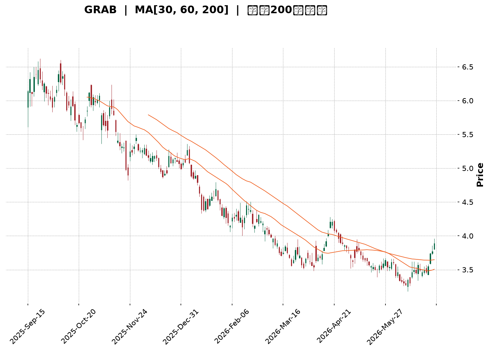
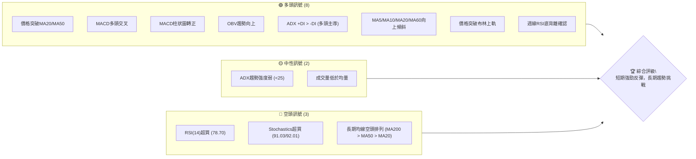
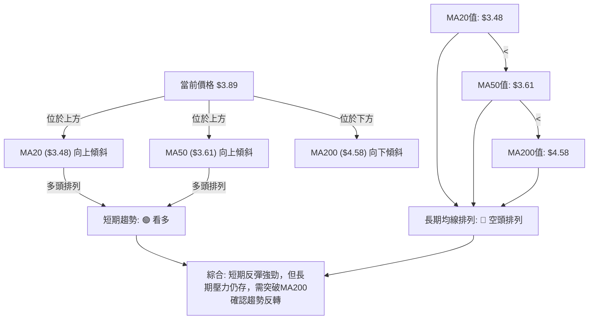
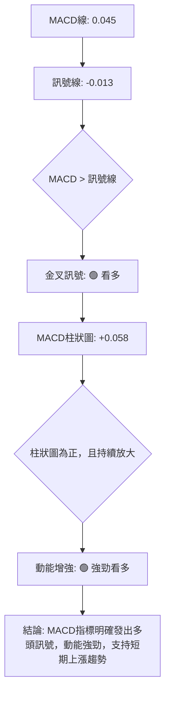

<details>
<summary>📊 靜態圖表 (點擊展開)</summary>

</details>

<html>
<head><meta charset="utf-8" /></head>
<body>
    <div style="height:500px; width:100%;">                        <script>window.PlotlyConfig = {MathJaxConfig: 'local'};</script>
        <script charset="utf-8" src="https://cdn.plot.ly/plotly-3.6.0.min.js" integrity="sha256-QaOVwtVY0T02VaHrr6pnoHLCwayMJp4O5n4YyaE3rJk=" crossorigin="anonymous"></script>                <div id="candlestick-chart" class="plotly-graph-div" style="height:100%; width:100%;"></div>            <script>                window.PLOTLYENV=window.PLOTLYENV || {};                                if (document.getElementById("candlestick-chart")) {                    Plotly.newPlot(                        "candlestick-chart",                        [{"close":{"dtype":"f8","bdata":"AAAAIFyPGEAAAAAgrkcZQAAAAGBmZhhAAAAAYGZmGUAAAAAgXI8ZQAAAAMDMzBlAAAAAIK5HGUAAAACgR+EYQAAAAAAAABlAAAAA4KNwGEAAAADgo3AYQAAAAOB6FBhAAAAAoJmZF0AAAABAMzMYQAAAAADXoxhAAAAAIFyPGUAAAADgehQZQAAAAOCjcBlAAAAAgBSuGEAAAADgo3AXQAAAAOBRuBdAAAAAANejF0AAAACAFK4XQAAAAEAK1xZAAAAAIFyPFkAAAACAFK4WQAAAAGBmZhZAAAAAQOF6FkAAAACgR+EWQAAAAGBmZhdAAAAAQOF6GEAAAABgj8IXQAAAAEAzMxhAAAAAIIXrF0AAAACAPQoYQAAAACCuRxhAAAAAANcjF0AAAAAgXI8WQAAAAMAehRZAAAAAoHA9FkAAAACgmZkXQAAAAMAehRdAAAAAwPUoF0AAAADA9SgWQAAAAADXoxVAAAAAgOtRFUAAAAAgrkcVQAAAAKBwPRVAAAAAIIXrE0AAAACgmZkTQAAAAAAAABVAAAAAgML1FEAAAAAgrkcVQAAAAMDMzBVAAAAA4HoUFUAAAACAPQoVQAAAAOB6FBVAAAAAQDMzFUAAAABgj8IUQAAAAADXoxRAAAAAoJmZFEAAAADgUbgUQAAAAOBRuBRAAAAAoJmZFEAAAADgehQUQAAAAMDMzBNAAAAAQOF6E0AAAACAFK4TQAAAAOBRuBNAAAAA4FG4FEAAAACA61EUQAAAAMAehRRAAAAAoJmZFEAAAABgZmYUQAAAACCuRxRAAAAAgML1E0AAAACA61EUQAAAAAApXBRAAAAA4HoUFUAAAACA61EUQAAAAMAehRNAAAAAYGZmE0AAAAAgXI8TQAAAAMD1KBNAAAAAwB6FEkAAAAAgXI8RQAAAAMAehRFAAAAAgD0KEkAAAACgmZkRQAAAAEAzMxJAAAAAgOtREkAAAACgcD0SQAAAAGCPwhJAAAAAYLgeEkAAAACgR+ERQAAAAEAzMxFAAAAAANejEUAAAADgehQRQAAAAGCPwhBAAAAAoJmZEEAAAADgehQRQAAAAIA9ChFAAAAAoHA9EUAAAAAghesQQAAAAOB6FBFAAAAAwB6FEEAAAADgehQRQAAAAMDMzBFAAAAAoJmZEUAAAADAHoURQAAAAOBRuBBAAAAAoJmZEEAAAABACtcQQAAAAKBwPRFAAAAAoEfhEEAAAADgUbgQQAAAAIDrURBAAAAAYGZmEEAAAABguB4QQAAAAEAK1w9AAAAAgBSuD0AAAACAwvUOQAAAAGC4Hg9AAAAAAAAADkAAAACAFK4NQAAAAAAAAA5AAAAA4FG4DkAAAAAAAAAOQAAAAOCjcA1AAAAAQOF6DEAAAABguB4NQAAAAIDrUQ5AAAAAQArXDUAAAACAFK4NQAAAACBcjwxAAAAAoHA9DEAAAAAgrkcNQAAAAAApXA1AAAAAgML1DEAAAABA4XoMQAAAAIDrUQxAAAAAgD0KDUAAAADgo3ANQAAAAOCjcA1AAAAAQArXDUAAAAAgXI8OQAAAAAApXA9AAAAA4HoUEEAAAABACtcQQAAAAEAK1xBAAAAAgOtREEAAAACgcD0QQAAAAIAUrg9AAAAAQDMzD0AAAABguB4PQAAAAKBH4Q5AAAAAIFyPDkAAAAAgXI8OQAAAAAApXA1AAAAAgML1DEAAAADgo3ANQAAAAMD1KA5AAAAAgOtRDkAAAABgj8INQAAAAEAzMw1AAAAAYLgeDUAAAACAPQoNQAAAACBcjwxAAAAAYGZmDEAAAACA61EMQAAAAAAAAAxAAAAA4HoUDEAAAABA4XoMQAAAAOB6FAxAAAAA4FG4DEAAAABguB4NQAAAAIDrUQxAAAAAgOtRDEAAAACgR+EMQAAAAMDMzAxAAAAAIK5HC0AAAACAFK4LQAAAAOBRuApAAAAAANejCkAAAABgZmYKQAAAAMD1KApAAAAAwMzMCkAAAABgZmYKQAAAAIAUrgtAAAAAIIXrC0AAAACgmZkLQAAAACBcjwxAAAAAIIXrC0AAAACAFK4LQAAAACCF6wtAAAAAgBSuC0AAAABgZmYMQAAAACCF6w1AAAAAwPUoDkAAAABguB4PQA=="},"high":{"dtype":"f8","bdata":"AAAAANejGEAAAACAFK4ZQAAAAMAehRhAAAAAAAAAGkAAAAAAAAAaQAAAAIDrURpAAAAAQOF6GkAAAADgUbgZQAAAAOB6FBlAAAAAoEfhGEAAAACAFK4YQAAAAKCZmRhAAAAAoEfhGEAAAAAgrkcYQAAAAKBH4RhAAAAAIK7HGUAAAABgZmYaQAAAAECJwRlAAAAAoJmZGUAAAAAgXI8YQAAAACCuRxhAAAAA4HoUGEAAAAAgXI8YQAAAAIDC9RdAAAAAQDOzFkAAAACAajwXQAAAAOBRuBZAAAAAQOF6FkAAAACAPQoXQAAAAMD1qBdAAAAAwB6FGEAAAACAwvUYQAAAAAApXBhAAAAAgOtRGEAAAACA61EYQAAAAIDCdRhAAAAAIK5HF0AAAADgo3AXQAAAAEAKVxdAAAAAwPUoF0AAAAAAAAAYQAAAAOCj8BhAAAAA4HoUGEAAAACgR+EWQAAAAGC4HhZAAAAA4HoUFkAAAACAwnUVQAAAAMAehRVAAAAAANejFUAAAACgcD0UQAAAAEDhehVAAAAAAClcFUAAAADgo3AVQAAAAAAAABZAAAAAQOF6FUAAAACgcD0VQAAAAEAzMxVAAAAAYGZmFUAAAABgZmYVQAAAACBcDxVAAAAAACncFEAAAACAwvUUQAAAAGCPwhRAAAAA4HoUFUAAAAAA16MUQAAAAEAzMxRAAAAAoEfhE0AAAACgR+ETQAAAAGC4HhRAAAAAYLgeFUAAAACAwvUUQAAAAKCZmRRAAAAAANejFEAAAAAghesUQAAAACBcjxRAAAAAAClcFEAAAADAHoUUQAAAAMDMzBRAAAAA4KNwFUAAAACA61EVQAAAAEAzMxRAAAAAoEfhE0AAAACgR+ETQAAAAKCZmRNAAAAAgD0KE0AAAADAHoUSQAAAAGBmZhJAAAAA4FE4EkAAAABAMzMSQAAAAGBmZhJAAAAAIFyPEkAAAACAFK4SQAAAAIAULhNAAAAA4FG4EkAAAADgUTgSQAAAAKBH4RFAAAAA4FG4EUAAAABgj8IRQAAAAEDhehFAAAAAANejEEAAAADAzEwRQAAAAAApXBFAAAAAYLieEUAAAAAgXI8RQAAAAIDC9RFAAAAA4FE4EUAAAABAMzMRQAAAAIA9ChJAAAAAQArXEUAAAADAHgUSQAAAAIA9ihFAAAAAoJmZEEAAAADAHoURQAAAACCuRxFAAAAAYLgeEUAAAACgR+EQQAAAAIA9ihBAAAAA4HqUEEAAAADAHoUQQAAAAMD1KBBAAAAAgBSuD0AAAAAAAAAQQAAAAMAehQ9AAAAAwMzMDkAAAABA4XoOQAAAAADXow5AAAAAgML1DkAAAABAMzMPQAAAAEAK1w1AAAAA4KNwDUAAAACAFK4NQAAAAADXow5AAAAAoJmZD0AAAADgUbgOQAAAAMAehQ1AAAAAgML1DEAAAADgo3ANQAAAAIDrUQ5AAAAAYI\u002fCDUAAAAAAAAAOQAAAAGCPwgxAAAAA4KNwD0AAAABACtcNQAAAAMDMzA1AAAAAoHA9DkAAAADgehQPQAAAAOBRuA9AAAAAAClcEEAAAABguB4RQAAAAAAAABFAAAAAgML1EEAAAADgo3AQQAAAAEAzMxBAAAAAwPUoEEAAAAAghesPQAAAAAAAAA9AAAAAIIXrDkAAAADgUbgOQAAAAKBH4Q1AAAAAQDMzDUAAAADgo3AOQAAAAKCZmQ9AAAAAQDMzD0AAAACgcD0OQAAAAOB6FA5AAAAA4KNwDUAAAADgo3ANQAAAAIDC9QxAAAAAIFyPDEAAAADAzMwMQAAAACBcjwxAAAAAgOkmDEAAAAAA16MMQAAAAIDC9QxAAAAAgOtRDUAAAAAAKVwNQAAAAIDC9QxAAAAAIFyPDEAAAAAgrkcNQAAAACCuRw1AAAAA4FG4DEAAAABgZmYMQAAAAMAehQtAAAAAQDMzC0AAAACAwvUKQAAAAMDMzApAAAAAgML1CkAAAABguB4LQAAAAIDC9QxAAAAAgML1DEAAAAAAKVwMQAAAAKBH4QxAAAAA4FG4DEAAAAAAAAAMQAAAAGBmZgxAAAAAIFyPDEAAAAAA16MMQAAAAAAAAA5AAAAAoEfhDkAAAACAFK4PQA=="},"hovertemplate":"\u003cb\u003e%{x|%Y-%m-%d}\u003c\u002fb\u003e\u003cbr\u003e\u958b: $%{open:.2f}\u003cbr\u003e\u9ad8: $%{high:.2f}\u003cbr\u003e\u4f4e: $%{low:.2f}\u003cbr\u003e\u6536: $%{close:.2f}\u003cextra\u003e\u003c\u002fextra\u003e","low":{"dtype":"f8","bdata":"AAAA4KNwFkAAAAAA16MXQAAAAMD1qBdAAAAAoHA9GEAAAAAgrkcZQAAAAKBH4RhAAAAAgD0KGUAAAAAA16MYQAAAAIDC9RdAAAAAwPUoGEAAAADgUbgXQAAAAIDC9RdAAAAAgOtRF0AAAACgmZkXQAAAAKBwPRhAAAAAIFyPGEAAAACAwvUYQAAAACCF6xhAAAAAIK5HGEAAAAAAKVwXQAAAACBcjxdAAAAAwMzMFkAAAACgmZkXQAAAACBcjxZAAAAAwPUoFkAAAACgmZkWQAAAAMD1KBZAAAAAgBSuFUAAAACA61EWQAAAAOB6FBdAAAAAANejF0AAAACgmZkXQAAAAGBmZhdAAAAAgBSuF0AAAADAzMwXQAAAAKCZmRdAAAAA4KNwFUAAAABA4XoWQAAAAIAULhZAAAAAwMzMFUAAAAAghesWQAAAAEAzMxdAAAAAYLgeF0AAAAAghesVQAAAAOCjcBVAAAAA4HoUFUAAAACgR+EUQAAAAAAAABVAAAAAQArXE0AAAAAgrkcTQAAAACCFaxRAAAAAYI\u002fCFEAAAABACtcUQAAAAOCjcBVAAAAAAAAAFUAAAACgR+EUQAAAAKCZmRRAAAAAIK7HFEAAAADgUbgUQAAAAOCjcBRAAAAAgOtRFEAAAABAMzMUQAAAAKBHYRRAAAAA4KNwFEAAAACAwvUTQAAAAIAUrhNAAAAAYGZmE0AAAAAgXI8TQAAAAADXoxNAAAAAgD0KFEAAAAAgrkcUQAAAAGC4HhRAAAAAwMxMFEAAAACgR2EUQAAAAAAAABRAAAAAIIXrE0AAAACAPQoUQAAAAIDrURRAAAAAYI\u002fCFEAAAABgj0IUQAAAAOCjcBNAAAAAgOtRE0AAAAAAKVwTQAAAAAAAABNAAAAAgOtREkAAAACA61ERQAAAAOCjcBFAAAAAYGZmEUAAAAAgXI8RQAAAAOBRuBFAAAAA4HoUEkAAAADA9SgSQAAAAAApXBJAAAAAgD0KEkAAAADAHoURQAAAAMD1KBFAAAAAAAAAEUAAAADgUbgQQAAAAKCZmRBAAAAAoHA9EEAAAACAwnUQQAAAAEAK1xBAAAAAIIXrEEAAAABgj8IQQAAAAMDMzBBAAAAAAAAAEEAAAABgZmYQQAAAAOB6FBFAAAAAYI9CEUAAAACA61ERQAAAAMAehRBAAAAAQDMzEEAAAADgp8YQQAAAACBcjxBAAAAA4FG4EEAAAACgcD0QQAAAAAApXA9AAAAAgD0KEEAAAAAAAAAQQAAAAGCPwg9AAAAAwB6FDkAAAADAzMwOQAAAAEDheg5AAAAAYI\u002fCDUAAAACgmZkNQAAAAGCPwg1AAAAAwPUoDkAAAABACtcNQAAAACCuRw1AAAAAYGZmDEAAAADgUbgMQAAAAIDC9QxAAAAAoJmZDUAAAACA61ENQAAAAKBwPQxAAAAA4HoUDEAAAABgZmYMQAAAAGC4Hg1AAAAAANejDEAAAABA4XoMQAAAAEAK1wtAAAAAwMzMDEAAAACAwvUMQAAAAEAzMw1AAAAAANejDEAAAABgZDsOQAAAAIAUrg5AAAAAQArXD0AAAADgo3AQQAAAAOCjcBBAAAAAQDMzEEAAAADA9SgQQAAAAEAzMw9AAAAAgD0KD0AAAACgR+EOQAAAAIDrUQ5AAAAA4HoUDkAAAAAghesNQAAAAMD1KAxAAAAAgOtRDEAAAADgUbgMQAAAACCF6w1AAAAA4HoUDkAAAAAgrkcNQAAAAIDC9QxAAAAAoEfhDEAAAABA4XoMQAAAAGBmZgxAAAAAgBSuC0AAAABACtcLQAAAACCF6wtAAAAAYLgeC0AAAACgmZkLQAAAACCF6wtAAAAA4HoUDEAAAADgo3AMQAAAAEAK1wtAAAAAQArXC0AAAAAAAAAMQAAAACBcjwxAAAAAgD0KC0AAAACAPQoLQAAAAKCZmQpAAAAAYGZmCkAAAADgehQKQAAAAMD1KApAAAAA4KNwCUAAAADgehQKQAAAAIDC9QpAAAAAQOF6C0AAAADgo3ALQAAAAOBRuApAAAAAYI\u002fCC0AAAABguB4LQAAAAOCjcAtAAAAAwB6FC0AAAABgZmYLQAAAAADXowxAAAAAYI\u002fCDUAAAABgZmYOQA=="},"name":"\u50f9\u683c","open":{"dtype":"f8","bdata":"AAAAoJmZF0AAAABA4XoYQAAAAMAehRhAAAAAgD2KGEAAAAAgXI8ZQAAAAEDh+hhAAAAAIIXrGUAAAABAMzMZQAAAAMAehRhAAAAAQArXGEAAAACAwnUYQAAAAKBwPRhAAAAAwPUoGEAAAACAwvUXQAAAAEDhehhAAAAAoJkZGUAAAABAMzMaQAAAAIDrURlAAAAAgD2KGUAAAABA4XoYQAAAAIDC9RdAAAAAwPUoF0AAAACgcD0YQAAAAMDMzBdAAAAAQOF6FkAAAADA9SgXQAAAAOBRuBZAAAAAQOF6FkAAAACAFK4WQAAAAKBHYRdAAAAAAAAAGEAAAAAghesYQAAAAGCPwhdAAAAAAAAAGEAAAACgR+EXQAAAAIA9ChhAAAAAYI9CFkAAAABgj0IXQAAAAMDMzBZAAAAAwMzMFkAAAACgmRkXQAAAACBcDxhAAAAAYGZmF0AAAABACtcWQAAAAMAehRVAAAAAgD2KFUAAAADgUTgVQAAAAEAzMxVAAAAAANejFUAAAACAPQoUQAAAAIAUrhRAAAAA4HoUFUAAAADA9SgVQAAAAADXoxVAAAAAIIVrFUAAAADAHgUVQAAAAIDC9RRAAAAAQArXFEAAAADA9SgVQAAAAGCPwhRAAAAAIIVrFEAAAABgZmYUQAAAAOB6lBRAAAAAYI\u002fCFEAAAACgmZkUQAAAAEDh+hNAAAAAoEfhE0AAAACgmZkTQAAAAKBH4RNAAAAA4HoUFEAAAACAFK4UQAAAAIDrURRAAAAAIFyPFEAAAABA4XoUQAAAAIDCdRRAAAAAIK5HFEAAAACAFC4UQAAAAMAehRRAAAAAYI\u002fCFEAAAABguB4VQAAAAEAzMxRAAAAAYI\u002fCE0AAAABgZmYTQAAAAKCZmRNAAAAAIIXrEkAAAADgo3ASQAAAAIDrURJAAAAAgD2KEUAAAABAMzMSQAAAAMDMzBFAAAAA4HoUEkAAAACgcD0SQAAAAAApXBJAAAAAgBSuEkAAAADA9SgSQAAAAIAUrhFAAAAAYLgeEUAAAADA9agRQAAAAIDrURFAAAAAwB6FEEAAAACgR+EQQAAAAGC4HhFAAAAAwPUoEUAAAADgo3ARQAAAAMDMzBBAAAAAgML1EEAAAABgj8IQQAAAAKBwPRFAAAAA4HqUEUAAAADgo3ARQAAAAMDMTBFAAAAA4KNwEEAAAAAAAAARQAAAAOBRuBBAAAAAwMzMEEAAAAAA16MQQAAAAGC4HhBAAAAA4KNwEEAAAAAAKVwQQAAAACBcDxBAAAAAIK5HD0AAAACAFK4PQAAAAMDMzA5AAAAAANejDkAAAABguB4OQAAAACCF6w1AAAAAoHA9DkAAAACgmZkOQAAAAGCPwg1AAAAAQDMzDUAAAADAzMwMQAAAAEAzMw1AAAAAANejDkAAAABgZmYNQAAAAOCjcA1AAAAA4FG4DEAAAADAzMwMQAAAAAAAAA5AAAAAgML1DEAAAACgR+EMQAAAAMAehQxAAAAAQArXDkAAAACAPQoNQAAAAKCZmQ1AAAAAQDMzDUAAAACgcD0OQAAAAMDMzA5AAAAAAAAAEEAAAABA4XoQQAAAAGC4nhBAAAAAoEfhEEAAAAAAKVwQQAAAAEAzMxBAAAAA4HoUEEAAAABAMzMPQAAAAMDMzA5AAAAAoEfhDkAAAAAgXI8OQAAAAOBRuA1AAAAA4HoUDUAAAAAAKVwOQAAAAMDMzA5AAAAAIFyPDkAAAADA9SgOQAAAAIAUrg1AAAAAAClcDUAAAAAAKVwNQAAAAIDC9QxAAAAAgOtRDEAAAABguB4MQAAAAIDrUQxAAAAA4HoUDEAAAAAAAAAMQAAAAEDhegxAAAAAIK5HDEAAAABA4XoMQAAAAIDC9QxAAAAAoHA9DEAAAADA9SgMQAAAAKBH4QxAAAAAANejDEAAAAAgrkcLQAAAAOCjcAtAAAAAYI\u002fCCkAAAAAA16MKQAAAAGBmZgpAAAAAAAAACkAAAABguB4LQAAAAGC4HgtAAAAAYI\u002fCC0AAAAAAAAAMQAAAAMAehQtAAAAAoBgEDEAAAAAgrkcLQAAAAADXowtAAAAAQDMzDEAAAABgZmYLQAAAAOBRuAxAAAAAIIXrDUAAAABgZmYOQA=="},"x":["2025-09-15T00:00:00-04:00","2025-09-16T00:00:00-04:00","2025-09-17T00:00:00-04:00","2025-09-18T00:00:00-04:00","2025-09-19T00:00:00-04:00","2025-09-22T00:00:00-04:00","2025-09-23T00:00:00-04:00","2025-09-24T00:00:00-04:00","2025-09-25T00:00:00-04:00","2025-09-26T00:00:00-04:00","2025-09-29T00:00:00-04:00","2025-09-30T00:00:00-04:00","2025-10-01T00:00:00-04:00","2025-10-02T00:00:00-04:00","2025-10-03T00:00:00-04:00","2025-10-06T00:00:00-04:00","2025-10-07T00:00:00-04:00","2025-10-08T00:00:00-04:00","2025-10-09T00:00:00-04:00","2025-10-10T00:00:00-04:00","2025-10-13T00:00:00-04:00","2025-10-14T00:00:00-04:00","2025-10-15T00:00:00-04:00","2025-10-16T00:00:00-04:00","2025-10-17T00:00:00-04:00","2025-10-20T00:00:00-04:00","2025-10-21T00:00:00-04:00","2025-10-22T00:00:00-04:00","2025-10-23T00:00:00-04:00","2025-10-24T00:00:00-04:00","2025-10-27T00:00:00-04:00","2025-10-28T00:00:00-04:00","2025-10-29T00:00:00-04:00","2025-10-30T00:00:00-04:00","2025-10-31T00:00:00-04:00","2025-11-03T00:00:00-05:00","2025-11-04T00:00:00-05:00","2025-11-05T00:00:00-05:00","2025-11-06T00:00:00-05:00","2025-11-07T00:00:00-05:00","2025-11-10T00:00:00-05:00","2025-11-11T00:00:00-05:00","2025-11-12T00:00:00-05:00","2025-11-13T00:00:00-05:00","2025-11-14T00:00:00-05:00","2025-11-17T00:00:00-05:00","2025-11-18T00:00:00-05:00","2025-11-19T00:00:00-05:00","2025-11-20T00:00:00-05:00","2025-11-21T00:00:00-05:00","2025-11-24T00:00:00-05:00","2025-11-25T00:00:00-05:00","2025-11-26T00:00:00-05:00","2025-11-28T00:00:00-05:00","2025-12-01T00:00:00-05:00","2025-12-02T00:00:00-05:00","2025-12-03T00:00:00-05:00","2025-12-04T00:00:00-05:00","2025-12-05T00:00:00-05:00","2025-12-08T00:00:00-05:00","2025-12-09T00:00:00-05:00","2025-12-10T00:00:00-05:00","2025-12-11T00:00:00-05:00","2025-12-12T00:00:00-05:00","2025-12-15T00:00:00-05:00","2025-12-16T00:00:00-05:00","2025-12-17T00:00:00-05:00","2025-12-18T00:00:00-05:00","2025-12-19T00:00:00-05:00","2025-12-22T00:00:00-05:00","2025-12-23T00:00:00-05:00","2025-12-24T00:00:00-05:00","2025-12-26T00:00:00-05:00","2025-12-29T00:00:00-05:00","2025-12-30T00:00:00-05:00","2025-12-31T00:00:00-05:00","2026-01-02T00:00:00-05:00","2026-01-05T00:00:00-05:00","2026-01-06T00:00:00-05:00","2026-01-07T00:00:00-05:00","2026-01-08T00:00:00-05:00","2026-01-09T00:00:00-05:00","2026-01-12T00:00:00-05:00","2026-01-13T00:00:00-05:00","2026-01-14T00:00:00-05:00","2026-01-15T00:00:00-05:00","2026-01-16T00:00:00-05:00","2026-01-20T00:00:00-05:00","2026-01-21T00:00:00-05:00","2026-01-22T00:00:00-05:00","2026-01-23T00:00:00-05:00","2026-01-26T00:00:00-05:00","2026-01-27T00:00:00-05:00","2026-01-28T00:00:00-05:00","2026-01-29T00:00:00-05:00","2026-01-30T00:00:00-05:00","2026-02-02T00:00:00-05:00","2026-02-03T00:00:00-05:00","2026-02-04T00:00:00-05:00","2026-02-05T00:00:00-05:00","2026-02-06T00:00:00-05:00","2026-02-09T00:00:00-05:00","2026-02-10T00:00:00-05:00","2026-02-11T00:00:00-05:00","2026-02-12T00:00:00-05:00","2026-02-13T00:00:00-05:00","2026-02-17T00:00:00-05:00","2026-02-18T00:00:00-05:00","2026-02-19T00:00:00-05:00","2026-02-20T00:00:00-05:00","2026-02-23T00:00:00-05:00","2026-02-24T00:00:00-05:00","2026-02-25T00:00:00-05:00","2026-02-26T00:00:00-05:00","2026-02-27T00:00:00-05:00","2026-03-02T00:00:00-05:00","2026-03-03T00:00:00-05:00","2026-03-04T00:00:00-05:00","2026-03-05T00:00:00-05:00","2026-03-06T00:00:00-05:00","2026-03-09T00:00:00-04:00","2026-03-10T00:00:00-04:00","2026-03-11T00:00:00-04:00","2026-03-12T00:00:00-04:00","2026-03-13T00:00:00-04:00","2026-03-16T00:00:00-04:00","2026-03-17T00:00:00-04:00","2026-03-18T00:00:00-04:00","2026-03-19T00:00:00-04:00","2026-03-20T00:00:00-04:00","2026-03-23T00:00:00-04:00","2026-03-24T00:00:00-04:00","2026-03-25T00:00:00-04:00","2026-03-26T00:00:00-04:00","2026-03-27T00:00:00-04:00","2026-03-30T00:00:00-04:00","2026-03-31T00:00:00-04:00","2026-04-01T00:00:00-04:00","2026-04-02T00:00:00-04:00","2026-04-06T00:00:00-04:00","2026-04-07T00:00:00-04:00","2026-04-08T00:00:00-04:00","2026-04-09T00:00:00-04:00","2026-04-10T00:00:00-04:00","2026-04-13T00:00:00-04:00","2026-04-14T00:00:00-04:00","2026-04-15T00:00:00-04:00","2026-04-16T00:00:00-04:00","2026-04-17T00:00:00-04:00","2026-04-20T00:00:00-04:00","2026-04-21T00:00:00-04:00","2026-04-22T00:00:00-04:00","2026-04-23T00:00:00-04:00","2026-04-24T00:00:00-04:00","2026-04-27T00:00:00-04:00","2026-04-28T00:00:00-04:00","2026-04-29T00:00:00-04:00","2026-04-30T00:00:00-04:00","2026-05-01T00:00:00-04:00","2026-05-04T00:00:00-04:00","2026-05-05T00:00:00-04:00","2026-05-06T00:00:00-04:00","2026-05-07T00:00:00-04:00","2026-05-08T00:00:00-04:00","2026-05-11T00:00:00-04:00","2026-05-12T00:00:00-04:00","2026-05-13T00:00:00-04:00","2026-05-14T00:00:00-04:00","2026-05-15T00:00:00-04:00","2026-05-18T00:00:00-04:00","2026-05-19T00:00:00-04:00","2026-05-20T00:00:00-04:00","2026-05-21T00:00:00-04:00","2026-05-22T00:00:00-04:00","2026-05-26T00:00:00-04:00","2026-05-27T00:00:00-04:00","2026-05-28T00:00:00-04:00","2026-05-29T00:00:00-04:00","2026-06-01T00:00:00-04:00","2026-06-02T00:00:00-04:00","2026-06-03T00:00:00-04:00","2026-06-04T00:00:00-04:00","2026-06-05T00:00:00-04:00","2026-06-08T00:00:00-04:00","2026-06-09T00:00:00-04:00","2026-06-10T00:00:00-04:00","2026-06-11T00:00:00-04:00","2026-06-12T00:00:00-04:00","2026-06-15T00:00:00-04:00","2026-06-16T00:00:00-04:00","2026-06-17T00:00:00-04:00","2026-06-18T00:00:00-04:00","2026-06-22T00:00:00-04:00","2026-06-23T00:00:00-04:00","2026-06-24T00:00:00-04:00","2026-06-25T00:00:00-04:00","2026-06-26T00:00:00-04:00","2026-06-29T00:00:00-04:00","2026-06-30T00:00:00-04:00","2026-07-01T00:00:00-04:00"],"type":"candlestick"},{"hovertemplate":"MA30: $%{y:.2f}\u003cextra\u003e\u003c\u002fextra\u003e","line":{"color":"#2196F3","dash":"dash","width":2},"mode":"lines","name":"MA30","x":["2025-09-15T00:00:00-04:00","2025-09-16T00:00:00-04:00","2025-09-17T00:00:00-04:00","2025-09-18T00:00:00-04:00","2025-09-19T00:00:00-04:00","2025-09-22T00:00:00-04:00","2025-09-23T00:00:00-04:00","2025-09-24T00:00:00-04:00","2025-09-25T00:00:00-04:00","2025-09-26T00:00:00-04:00","2025-09-29T00:00:00-04:00","2025-09-30T00:00:00-04:00","2025-10-01T00:00:00-04:00","2025-10-02T00:00:00-04:00","2025-10-03T00:00:00-04:00","2025-10-06T00:00:00-04:00","2025-10-07T00:00:00-04:00","2025-10-08T00:00:00-04:00","2025-10-09T00:00:00-04:00","2025-10-10T00:00:00-04:00","2025-10-13T00:00:00-04:00","2025-10-14T00:00:00-04:00","2025-10-15T00:00:00-04:00","2025-10-16T00:00:00-04:00","2025-10-17T00:00:00-04:00","2025-10-20T00:00:00-04:00","2025-10-21T00:00:00-04:00","2025-10-22T00:00:00-04:00","2025-10-23T00:00:00-04:00","2025-10-24T00:00:00-04:00","2025-10-27T00:00:00-04:00","2025-10-28T00:00:00-04:00","2025-10-29T00:00:00-04:00","2025-10-30T00:00:00-04:00","2025-10-31T00:00:00-04:00","2025-11-03T00:00:00-05:00","2025-11-04T00:00:00-05:00","2025-11-05T00:00:00-05:00","2025-11-06T00:00:00-05:00","2025-11-07T00:00:00-05:00","2025-11-10T00:00:00-05:00","2025-11-11T00:00:00-05:00","2025-11-12T00:00:00-05:00","2025-11-13T00:00:00-05:00","2025-11-14T00:00:00-05:00","2025-11-17T00:00:00-05:00","2025-11-18T00:00:00-05:00","2025-11-19T00:00:00-05:00","2025-11-20T00:00:00-05:00","2025-11-21T00:00:00-05:00","2025-11-24T00:00:00-05:00","2025-11-25T00:00:00-05:00","2025-11-26T00:00:00-05:00","2025-11-28T00:00:00-05:00","2025-12-01T00:00:00-05:00","2025-12-02T00:00:00-05:00","2025-12-03T00:00:00-05:00","2025-12-04T00:00:00-05:00","2025-12-05T00:00:00-05:00","2025-12-08T00:00:00-05:00","2025-12-09T00:00:00-05:00","2025-12-10T00:00:00-05:00","2025-12-11T00:00:00-05:00","2025-12-12T00:00:00-05:00","2025-12-15T00:00:00-05:00","2025-12-16T00:00:00-05:00","2025-12-17T00:00:00-05:00","2025-12-18T00:00:00-05:00","2025-12-19T00:00:00-05:00","2025-12-22T00:00:00-05:00","2025-12-23T00:00:00-05:00","2025-12-24T00:00:00-05:00","2025-12-26T00:00:00-05:00","2025-12-29T00:00:00-05:00","2025-12-30T00:00:00-05:00","2025-12-31T00:00:00-05:00","2026-01-02T00:00:00-05:00","2026-01-05T00:00:00-05:00","2026-01-06T00:00:00-05:00","2026-01-07T00:00:00-05:00","2026-01-08T00:00:00-05:00","2026-01-09T00:00:00-05:00","2026-01-12T00:00:00-05:00","2026-01-13T00:00:00-05:00","2026-01-14T00:00:00-05:00","2026-01-15T00:00:00-05:00","2026-01-16T00:00:00-05:00","2026-01-20T00:00:00-05:00","2026-01-21T00:00:00-05:00","2026-01-22T00:00:00-05:00","2026-01-23T00:00:00-05:00","2026-01-26T00:00:00-05:00","2026-01-27T00:00:00-05:00","2026-01-28T00:00:00-05:00","2026-01-29T00:00:00-05:00","2026-01-30T00:00:00-05:00","2026-02-02T00:00:00-05:00","2026-02-03T00:00:00-05:00","2026-02-04T00:00:00-05:00","2026-02-05T00:00:00-05:00","2026-02-06T00:00:00-05:00","2026-02-09T00:00:00-05:00","2026-02-10T00:00:00-05:00","2026-02-11T00:00:00-05:00","2026-02-12T00:00:00-05:00","2026-02-13T00:00:00-05:00","2026-02-17T00:00:00-05:00","2026-02-18T00:00:00-05:00","2026-02-19T00:00:00-05:00","2026-02-20T00:00:00-05:00","2026-02-23T00:00:00-05:00","2026-02-24T00:00:00-05:00","2026-02-25T00:00:00-05:00","2026-02-26T00:00:00-05:00","2026-02-27T00:00:00-05:00","2026-03-02T00:00:00-05:00","2026-03-03T00:00:00-05:00","2026-03-04T00:00:00-05:00","2026-03-05T00:00:00-05:00","2026-03-06T00:00:00-05:00","2026-03-09T00:00:00-04:00","2026-03-10T00:00:00-04:00","2026-03-11T00:00:00-04:00","2026-03-12T00:00:00-04:00","2026-03-13T00:00:00-04:00","2026-03-16T00:00:00-04:00","2026-03-17T00:00:00-04:00","2026-03-18T00:00:00-04:00","2026-03-19T00:00:00-04:00","2026-03-20T00:00:00-04:00","2026-03-23T00:00:00-04:00","2026-03-24T00:00:00-04:00","2026-03-25T00:00:00-04:00","2026-03-26T00:00:00-04:00","2026-03-27T00:00:00-04:00","2026-03-30T00:00:00-04:00","2026-03-31T00:00:00-04:00","2026-04-01T00:00:00-04:00","2026-04-02T00:00:00-04:00","2026-04-06T00:00:00-04:00","2026-04-07T00:00:00-04:00","2026-04-08T00:00:00-04:00","2026-04-09T00:00:00-04:00","2026-04-10T00:00:00-04:00","2026-04-13T00:00:00-04:00","2026-04-14T00:00:00-04:00","2026-04-15T00:00:00-04:00","2026-04-16T00:00:00-04:00","2026-04-17T00:00:00-04:00","2026-04-20T00:00:00-04:00","2026-04-21T00:00:00-04:00","2026-04-22T00:00:00-04:00","2026-04-23T00:00:00-04:00","2026-04-24T00:00:00-04:00","2026-04-27T00:00:00-04:00","2026-04-28T00:00:00-04:00","2026-04-29T00:00:00-04:00","2026-04-30T00:00:00-04:00","2026-05-01T00:00:00-04:00","2026-05-04T00:00:00-04:00","2026-05-05T00:00:00-04:00","2026-05-06T00:00:00-04:00","2026-05-07T00:00:00-04:00","2026-05-08T00:00:00-04:00","2026-05-11T00:00:00-04:00","2026-05-12T00:00:00-04:00","2026-05-13T00:00:00-04:00","2026-05-14T00:00:00-04:00","2026-05-15T00:00:00-04:00","2026-05-18T00:00:00-04:00","2026-05-19T00:00:00-04:00","2026-05-20T00:00:00-04:00","2026-05-21T00:00:00-04:00","2026-05-22T00:00:00-04:00","2026-05-26T00:00:00-04:00","2026-05-27T00:00:00-04:00","2026-05-28T00:00:00-04:00","2026-05-29T00:00:00-04:00","2026-06-01T00:00:00-04:00","2026-06-02T00:00:00-04:00","2026-06-03T00:00:00-04:00","2026-06-04T00:00:00-04:00","2026-06-05T00:00:00-04:00","2026-06-08T00:00:00-04:00","2026-06-09T00:00:00-04:00","2026-06-10T00:00:00-04:00","2026-06-11T00:00:00-04:00","2026-06-12T00:00:00-04:00","2026-06-15T00:00:00-04:00","2026-06-16T00:00:00-04:00","2026-06-17T00:00:00-04:00","2026-06-18T00:00:00-04:00","2026-06-22T00:00:00-04:00","2026-06-23T00:00:00-04:00","2026-06-24T00:00:00-04:00","2026-06-25T00:00:00-04:00","2026-06-26T00:00:00-04:00","2026-06-29T00:00:00-04:00","2026-06-30T00:00:00-04:00","2026-07-01T00:00:00-04:00"],"y":{"dtype":"f8","bdata":"AAAAAAAA+H8AAAAAAAD4fwAAAAAAAPh\u002fAAAAAAAA+H8AAAAAAAD4fwAAAAAAAPh\u002fAAAAAAAA+H8AAAAAAAD4fwAAAAAAAPh\u002fAAAAAAAA+H8AAAAAAAD4fwAAAAAAAPh\u002fAAAAAAAA+H8AAAAAAAD4fwAAAAAAAPh\u002fAAAAAAAA+H8AAAAAAAD4fwAAAAAAAPh\u002fAAAAAAAA+H8AAAAAAAD4fwAAAAAAAPh\u002fAAAAAAAA+H8AAAAAAAD4fwAAAAAAAPh\u002fAAAAAAAA+H8AAAAAAAD4fwAAAAAAAPh\u002fAAAAAAAA+H8AAAAAAAD4fzMzM5OKMxhAAAAA0NsyGEAiIiJS4yUYQKuqqmouJBhA7+7uTo0XGEAiIiLSlAoYQFVVVVWc\u002fRdA3t3dbVnrF0AAAABQjdcXQLy7u6tjwhdAIiIisp2vF0AAAACwcqgXQJqZmVmroxdAd3d3J+qfF0BERES0gY4XQKuqqhrodBdA7+7urrlQF0BVVVV1TDAXQKuqqmp1DBdAmpmZCdfjFkDe3d1tEsMWQAAAAIDcqxZAMzMz8\u002f2UFkAiIiISg4AWQHd3dyejdxZAvLu7CwJrFkCamZlpA10WQERERNS\u002fURZAERERodNGFkC8u7trvDQWQLy7uxsvHRZA7+7uHhP8FUAzMzMjIuIVQFVVVfVvxBVA7+7uThuoFUDe3d2NUIYVQHd3d9cVYBVAMzMzc9pAFUDv7u7+RigVQM3MzExiEBVA7+7uzmkDFUCamZmJbOcUQAAAAPDSzRRAiYiIiPq3FEARERHB9agUQKuqqspanRRAMzMz07+RFEC8u7urjokUQImIiEgMghRAd3d3V\u002fKLFEBEREQ0F5IUQImIiBh2hRRAmpmZOSZ4FEAzMzPTeGkUQImIiKjxUhRAERERQRk9FEAzMzMTZx8UQDMzMyMGARRAMzMzAw\u002fmE0AzMzPjF8sTQBEREaFFthNARERE5NCiE0AAAABAp40TQBEREZHtfBNAzczM7MNnE0AzMzPz\u002fVQTQKuqqirOPhNAAAAAoBovE0BmZmbW6hgTQO\u002fu7p6o\u002fxJAiYiIWIDcEkBVVVV12sASQImIiEgooxJAAAAAQHyGEkAzMzMTymgSQBEREZF7TRJAZmZmxiAwEkAzMzPjehQSQKuqqnqi\u002fhFA3t3dTfDgEUDNzMycC8kRQKuqquomsRFAmpmZOUKZEUC8u7tLDIIRQN7d3f2pcRFAq6qqWqtjEUCJiIhYgFwRQHd3d+dCUhFAREREREREEUCJiIgoozcRQLy7u2suJBFAd3d3xwQPEUB3d3d3d\u002fcQQN7d3fUo3BBA7+7uNonBEEBEREQ8mKcQQKuqqkLSlBBAZmZmhl2BEEAiIiKynW8QQHd3dz81XhBAd3d3vxFKEECamZm5kDQQQM3MzMyFJBBA7+7urrkQEEBVVVW18\u002f0PQCIiIlIqzg9A7+7ujjSlD0CamZkJkHsPQN7d3Y1QRg9AAAAAEBERD0BVVVWFFtkOQGZmZrZlrQ5A3t3dDeaJDkAiIiKit2UOQGZmZpa1Og5AiYiIOEIZDkBERETErgAOQBEREZHC9Q1Ad3d3d0zwDUARERExlvwNQLy7u7tJDA5AIiIi4noUDkAAAABgcyEOQGZmZrY6Jg5Ad3d3J3gwDkAiIiLiwTwOQFVVVUVERA5A7+7uvuZCDkBVVVUVrkcOQCIiIlL\u002fRg5AVVVV5RdLDkAiIiLy0k0OQLy7u2t1TA5A7+7u\u002fo1QDkAiIiLCPFEOQM3MzNyyVg5AERERQTVeDkB3d3f3KFwOQGZmZlZVVQ5AAAAAAI5QDkCamZl5ME8OQM3MzGx1TA5AVVVVRUREDkDe3d0dEzwOQGZmZiZ4MA5AiYiIeOkmDkDv7u6+nxoOQDMzM8OuAA5Ad3d3J+rfDUBERERk9LYNQN7d3d1PjQ1AVVVVxZJfDUAzMzMDnTYNQJqZmblJDA1AAAAAQGDlDEAAAABAGb0MQBEREUHSlAxAiYiIaLx0DEAAAADAPFEMQLy7u7vmQgxAIiIi0gY6DEB3d3dHUyoMQGZmZgasHAxAVVVVJTEIDEARERFRcfYLQM3MzByF6wtAIiIiYjvfC0B3d3dHxdkLQO\u002fu7j5g5QtAZmZmBmX0C0CJiIi4SQwMQA=="},"type":"scatter"},{"hovertemplate":"MA60: $%{y:.2f}\u003cextra\u003e\u003c\u002fextra\u003e","line":{"color":"#9C27B0","dash":"dash","width":2},"mode":"lines","name":"MA60","x":["2025-09-15T00:00:00-04:00","2025-09-16T00:00:00-04:00","2025-09-17T00:00:00-04:00","2025-09-18T00:00:00-04:00","2025-09-19T00:00:00-04:00","2025-09-22T00:00:00-04:00","2025-09-23T00:00:00-04:00","2025-09-24T00:00:00-04:00","2025-09-25T00:00:00-04:00","2025-09-26T00:00:00-04:00","2025-09-29T00:00:00-04:00","2025-09-30T00:00:00-04:00","2025-10-01T00:00:00-04:00","2025-10-02T00:00:00-04:00","2025-10-03T00:00:00-04:00","2025-10-06T00:00:00-04:00","2025-10-07T00:00:00-04:00","2025-10-08T00:00:00-04:00","2025-10-09T00:00:00-04:00","2025-10-10T00:00:00-04:00","2025-10-13T00:00:00-04:00","2025-10-14T00:00:00-04:00","2025-10-15T00:00:00-04:00","2025-10-16T00:00:00-04:00","2025-10-17T00:00:00-04:00","2025-10-20T00:00:00-04:00","2025-10-21T00:00:00-04:00","2025-10-22T00:00:00-04:00","2025-10-23T00:00:00-04:00","2025-10-24T00:00:00-04:00","2025-10-27T00:00:00-04:00","2025-10-28T00:00:00-04:00","2025-10-29T00:00:00-04:00","2025-10-30T00:00:00-04:00","2025-10-31T00:00:00-04:00","2025-11-03T00:00:00-05:00","2025-11-04T00:00:00-05:00","2025-11-05T00:00:00-05:00","2025-11-06T00:00:00-05:00","2025-11-07T00:00:00-05:00","2025-11-10T00:00:00-05:00","2025-11-11T00:00:00-05:00","2025-11-12T00:00:00-05:00","2025-11-13T00:00:00-05:00","2025-11-14T00:00:00-05:00","2025-11-17T00:00:00-05:00","2025-11-18T00:00:00-05:00","2025-11-19T00:00:00-05:00","2025-11-20T00:00:00-05:00","2025-11-21T00:00:00-05:00","2025-11-24T00:00:00-05:00","2025-11-25T00:00:00-05:00","2025-11-26T00:00:00-05:00","2025-11-28T00:00:00-05:00","2025-12-01T00:00:00-05:00","2025-12-02T00:00:00-05:00","2025-12-03T00:00:00-05:00","2025-12-04T00:00:00-05:00","2025-12-05T00:00:00-05:00","2025-12-08T00:00:00-05:00","2025-12-09T00:00:00-05:00","2025-12-10T00:00:00-05:00","2025-12-11T00:00:00-05:00","2025-12-12T00:00:00-05:00","2025-12-15T00:00:00-05:00","2025-12-16T00:00:00-05:00","2025-12-17T00:00:00-05:00","2025-12-18T00:00:00-05:00","2025-12-19T00:00:00-05:00","2025-12-22T00:00:00-05:00","2025-12-23T00:00:00-05:00","2025-12-24T00:00:00-05:00","2025-12-26T00:00:00-05:00","2025-12-29T00:00:00-05:00","2025-12-30T00:00:00-05:00","2025-12-31T00:00:00-05:00","2026-01-02T00:00:00-05:00","2026-01-05T00:00:00-05:00","2026-01-06T00:00:00-05:00","2026-01-07T00:00:00-05:00","2026-01-08T00:00:00-05:00","2026-01-09T00:00:00-05:00","2026-01-12T00:00:00-05:00","2026-01-13T00:00:00-05:00","2026-01-14T00:00:00-05:00","2026-01-15T00:00:00-05:00","2026-01-16T00:00:00-05:00","2026-01-20T00:00:00-05:00","2026-01-21T00:00:00-05:00","2026-01-22T00:00:00-05:00","2026-01-23T00:00:00-05:00","2026-01-26T00:00:00-05:00","2026-01-27T00:00:00-05:00","2026-01-28T00:00:00-05:00","2026-01-29T00:00:00-05:00","2026-01-30T00:00:00-05:00","2026-02-02T00:00:00-05:00","2026-02-03T00:00:00-05:00","2026-02-04T00:00:00-05:00","2026-02-05T00:00:00-05:00","2026-02-06T00:00:00-05:00","2026-02-09T00:00:00-05:00","2026-02-10T00:00:00-05:00","2026-02-11T00:00:00-05:00","2026-02-12T00:00:00-05:00","2026-02-13T00:00:00-05:00","2026-02-17T00:00:00-05:00","2026-02-18T00:00:00-05:00","2026-02-19T00:00:00-05:00","2026-02-20T00:00:00-05:00","2026-02-23T00:00:00-05:00","2026-02-24T00:00:00-05:00","2026-02-25T00:00:00-05:00","2026-02-26T00:00:00-05:00","2026-02-27T00:00:00-05:00","2026-03-02T00:00:00-05:00","2026-03-03T00:00:00-05:00","2026-03-04T00:00:00-05:00","2026-03-05T00:00:00-05:00","2026-03-06T00:00:00-05:00","2026-03-09T00:00:00-04:00","2026-03-10T00:00:00-04:00","2026-03-11T00:00:00-04:00","2026-03-12T00:00:00-04:00","2026-03-13T00:00:00-04:00","2026-03-16T00:00:00-04:00","2026-03-17T00:00:00-04:00","2026-03-18T00:00:00-04:00","2026-03-19T00:00:00-04:00","2026-03-20T00:00:00-04:00","2026-03-23T00:00:00-04:00","2026-03-24T00:00:00-04:00","2026-03-25T00:00:00-04:00","2026-03-26T00:00:00-04:00","2026-03-27T00:00:00-04:00","2026-03-30T00:00:00-04:00","2026-03-31T00:00:00-04:00","2026-04-01T00:00:00-04:00","2026-04-02T00:00:00-04:00","2026-04-06T00:00:00-04:00","2026-04-07T00:00:00-04:00","2026-04-08T00:00:00-04:00","2026-04-09T00:00:00-04:00","2026-04-10T00:00:00-04:00","2026-04-13T00:00:00-04:00","2026-04-14T00:00:00-04:00","2026-04-15T00:00:00-04:00","2026-04-16T00:00:00-04:00","2026-04-17T00:00:00-04:00","2026-04-20T00:00:00-04:00","2026-04-21T00:00:00-04:00","2026-04-22T00:00:00-04:00","2026-04-23T00:00:00-04:00","2026-04-24T00:00:00-04:00","2026-04-27T00:00:00-04:00","2026-04-28T00:00:00-04:00","2026-04-29T00:00:00-04:00","2026-04-30T00:00:00-04:00","2026-05-01T00:00:00-04:00","2026-05-04T00:00:00-04:00","2026-05-05T00:00:00-04:00","2026-05-06T00:00:00-04:00","2026-05-07T00:00:00-04:00","2026-05-08T00:00:00-04:00","2026-05-11T00:00:00-04:00","2026-05-12T00:00:00-04:00","2026-05-13T00:00:00-04:00","2026-05-14T00:00:00-04:00","2026-05-15T00:00:00-04:00","2026-05-18T00:00:00-04:00","2026-05-19T00:00:00-04:00","2026-05-20T00:00:00-04:00","2026-05-21T00:00:00-04:00","2026-05-22T00:00:00-04:00","2026-05-26T00:00:00-04:00","2026-05-27T00:00:00-04:00","2026-05-28T00:00:00-04:00","2026-05-29T00:00:00-04:00","2026-06-01T00:00:00-04:00","2026-06-02T00:00:00-04:00","2026-06-03T00:00:00-04:00","2026-06-04T00:00:00-04:00","2026-06-05T00:00:00-04:00","2026-06-08T00:00:00-04:00","2026-06-09T00:00:00-04:00","2026-06-10T00:00:00-04:00","2026-06-11T00:00:00-04:00","2026-06-12T00:00:00-04:00","2026-06-15T00:00:00-04:00","2026-06-16T00:00:00-04:00","2026-06-17T00:00:00-04:00","2026-06-18T00:00:00-04:00","2026-06-22T00:00:00-04:00","2026-06-23T00:00:00-04:00","2026-06-24T00:00:00-04:00","2026-06-25T00:00:00-04:00","2026-06-26T00:00:00-04:00","2026-06-29T00:00:00-04:00","2026-06-30T00:00:00-04:00","2026-07-01T00:00:00-04:00"],"y":{"dtype":"f8","bdata":"AAAAAAAA+H8AAAAAAAD4fwAAAAAAAPh\u002fAAAAAAAA+H8AAAAAAAD4fwAAAAAAAPh\u002fAAAAAAAA+H8AAAAAAAD4fwAAAAAAAPh\u002fAAAAAAAA+H8AAAAAAAD4fwAAAAAAAPh\u002fAAAAAAAA+H8AAAAAAAD4fwAAAAAAAPh\u002fAAAAAAAA+H8AAAAAAAD4fwAAAAAAAPh\u002fAAAAAAAA+H8AAAAAAAD4fwAAAAAAAPh\u002fAAAAAAAA+H8AAAAAAAD4fwAAAAAAAPh\u002fAAAAAAAA+H8AAAAAAAD4fwAAAAAAAPh\u002fAAAAAAAA+H8AAAAAAAD4fwAAAAAAAPh\u002fAAAAAAAA+H8AAAAAAAD4fwAAAAAAAPh\u002fAAAAAAAA+H8AAAAAAAD4fwAAAAAAAPh\u002fAAAAAAAA+H8AAAAAAAD4fwAAAAAAAPh\u002fAAAAAAAA+H8AAAAAAAD4fwAAAAAAAPh\u002fAAAAAAAA+H8AAAAAAAD4fwAAAAAAAPh\u002fAAAAAAAA+H8AAAAAAAD4fwAAAAAAAPh\u002fAAAAAAAA+H8AAAAAAAD4fwAAAAAAAPh\u002fAAAAAAAA+H8AAAAAAAD4fwAAAAAAAPh\u002fAAAAAAAA+H8AAAAAAAD4fwAAAAAAAPh\u002fAAAAAAAA+H8AAAAAAAD4f3d3d9dcKBdAd3d3d3cXF0Crqqq6AgQXQAAAADBP9BZA7+7uTtTfFkAAAACwcsgWQGZmZhbZrhZAiYiI8BmWFkB3d3cn6n8WQERERPxiaRZAiYiIwINZFkDNzMyc70cWQM3MzCS\u002fOBZAAAAAWPIrFkCrqqq6uxsWQKuqqnIhCRZAERERwTzxFUCJiIiQ7dwVQJqZmdlAxxVAiYiIsOS3FUARERHRlKoVQEREREypmBVAZmZmFpKGFUCrqqry\u002fXQVQAAAAGhKZRVAZmZmpg1UFUBmZmY+NT4VQLy7u\u002ftiKRVAIiIiUnEWFUB3d3cn6v8UQGZmZl666RRAmpmZAXLPFECamZmx5LcUQDMzM8OuoBRA3t3dne+HFECJiIhAp20UQBEREQFyTxRAmpmZifo3FECrqqrqmCAUQN7d3XUFCBRAvLu7E\u002fXvE0B3d3d\u002fI9QTQERERJx9uBNAREREZDufE0AiIiLq34gTQN7d3S1rdRNAzczMTPBgE0B3d3fHBE8TQJqZmWFXQBNAq6qqUnE2E0CJiIhokS0TQJqZmYFOGxNAmpmZObQIE0B3d3ePwvUSQDMzM9NN4hJA3t3dTWLQEkDe3d21870SQFVVVYWkqRJAvLu7oymVEkDe3d2FXYESQGZmZgY6bRJA3t3d1epYEkC8u7tbj0ISQHd3d0OLLBJA3t3dkaYUEkC8u7sXS\u002f4RQKuqqjbQ6RFAMzMzEzzYEUBERERERMQRQDMzM+\u002furhFAAAAADEmTEUB3d3eXtXoRQKuqqgrXYxFAd3d395pLEUDv7u724TMRQBEREV1IGhFA7+7uhl0BEUAAAAB0IekQQM3MzGDl0BBA7+7uary0EEC8u7tvy5oQQO\u002fu7uLsgxBAREREoBpvEEBmZmYOdFoQQImIiGSCRxBAd3d3OyY4EEBVVVXday4QQAAAABiSJhBAAAAAQDUeEECJiIgg9xoQQM3MzKQpFRBAREREHKEMEEC8u7uTGAQQQBEREVFG7w9Aq6qqSsXZD0BVVVUt+cUPQFVVVWX0tg9A3t3d5dCiD0DNzMy8dJMPQImIiOi0gQ9AIiIisp1vD0CrqqoyelsPQKuqqoLASg9AZmZmrgA5D0C8u7s7mCcPQHd3d5duEg9AAAAA6LQBD0CJiIiA3OsOQCIiIvLSzQ5AAAAAiM+wDkB3d3d\u002fI5QOQJqZmZHtfA5AmpmZKRVnDkAAAABg5VAOQGZmZt6WNQ5AiYiI2BUgDkCamZlBpw0OQCIiIqo4+w1Ad3d3TxvoDUCrqqpKxdkNQM3MzMzMzA1AvLu70wa6DUCamZkxCKwNQAAAADhCmQ1AvLu7M+yKDUARERGR7XwNQDMzM0OLbA1AvLu7k9FbDUCrqqpqdUwNQO\u002fu7gbzRA1AvLu7W49CDUDNzMwcEzwNQBEREbmQNA1AIiIikl8sDUCamZkJ1yMNQM3MzPwbIQ1AmpmZUbgeDUB3d3cf9xoNQKuqqspaHQ1AMzMzg3kiDUAREREZvS0NQA=="},"type":"scatter"},{"hovertemplate":"MA200: $%{y:.2f}\u003cextra\u003e\u003c\u002fextra\u003e","line":{"color":"#FF6F00","dash":"solid","width":2},"mode":"lines","name":"MA200","x":["2025-09-15T00:00:00-04:00","2025-09-16T00:00:00-04:00","2025-09-17T00:00:00-04:00","2025-09-18T00:00:00-04:00","2025-09-19T00:00:00-04:00","2025-09-22T00:00:00-04:00","2025-09-23T00:00:00-04:00","2025-09-24T00:00:00-04:00","2025-09-25T00:00:00-04:00","2025-09-26T00:00:00-04:00","2025-09-29T00:00:00-04:00","2025-09-30T00:00:00-04:00","2025-10-01T00:00:00-04:00","2025-10-02T00:00:00-04:00","2025-10-03T00:00:00-04:00","2025-10-06T00:00:00-04:00","2025-10-07T00:00:00-04:00","2025-10-08T00:00:00-04:00","2025-10-09T00:00:00-04:00","2025-10-10T00:00:00-04:00","2025-10-13T00:00:00-04:00","2025-10-14T00:00:00-04:00","2025-10-15T00:00:00-04:00","2025-10-16T00:00:00-04:00","2025-10-17T00:00:00-04:00","2025-10-20T00:00:00-04:00","2025-10-21T00:00:00-04:00","2025-10-22T00:00:00-04:00","2025-10-23T00:00:00-04:00","2025-10-24T00:00:00-04:00","2025-10-27T00:00:00-04:00","2025-10-28T00:00:00-04:00","2025-10-29T00:00:00-04:00","2025-10-30T00:00:00-04:00","2025-10-31T00:00:00-04:00","2025-11-03T00:00:00-05:00","2025-11-04T00:00:00-05:00","2025-11-05T00:00:00-05:00","2025-11-06T00:00:00-05:00","2025-11-07T00:00:00-05:00","2025-11-10T00:00:00-05:00","2025-11-11T00:00:00-05:00","2025-11-12T00:00:00-05:00","2025-11-13T00:00:00-05:00","2025-11-14T00:00:00-05:00","2025-11-17T00:00:00-05:00","2025-11-18T00:00:00-05:00","2025-11-19T00:00:00-05:00","2025-11-20T00:00:00-05:00","2025-11-21T00:00:00-05:00","2025-11-24T00:00:00-05:00","2025-11-25T00:00:00-05:00","2025-11-26T00:00:00-05:00","2025-11-28T00:00:00-05:00","2025-12-01T00:00:00-05:00","2025-12-02T00:00:00-05:00","2025-12-03T00:00:00-05:00","2025-12-04T00:00:00-05:00","2025-12-05T00:00:00-05:00","2025-12-08T00:00:00-05:00","2025-12-09T00:00:00-05:00","2025-12-10T00:00:00-05:00","2025-12-11T00:00:00-05:00","2025-12-12T00:00:00-05:00","2025-12-15T00:00:00-05:00","2025-12-16T00:00:00-05:00","2025-12-17T00:00:00-05:00","2025-12-18T00:00:00-05:00","2025-12-19T00:00:00-05:00","2025-12-22T00:00:00-05:00","2025-12-23T00:00:00-05:00","2025-12-24T00:00:00-05:00","2025-12-26T00:00:00-05:00","2025-12-29T00:00:00-05:00","2025-12-30T00:00:00-05:00","2025-12-31T00:00:00-05:00","2026-01-02T00:00:00-05:00","2026-01-05T00:00:00-05:00","2026-01-06T00:00:00-05:00","2026-01-07T00:00:00-05:00","2026-01-08T00:00:00-05:00","2026-01-09T00:00:00-05:00","2026-01-12T00:00:00-05:00","2026-01-13T00:00:00-05:00","2026-01-14T00:00:00-05:00","2026-01-15T00:00:00-05:00","2026-01-16T00:00:00-05:00","2026-01-20T00:00:00-05:00","2026-01-21T00:00:00-05:00","2026-01-22T00:00:00-05:00","2026-01-23T00:00:00-05:00","2026-01-26T00:00:00-05:00","2026-01-27T00:00:00-05:00","2026-01-28T00:00:00-05:00","2026-01-29T00:00:00-05:00","2026-01-30T00:00:00-05:00","2026-02-02T00:00:00-05:00","2026-02-03T00:00:00-05:00","2026-02-04T00:00:00-05:00","2026-02-05T00:00:00-05:00","2026-02-06T00:00:00-05:00","2026-02-09T00:00:00-05:00","2026-02-10T00:00:00-05:00","2026-02-11T00:00:00-05:00","2026-02-12T00:00:00-05:00","2026-02-13T00:00:00-05:00","2026-02-17T00:00:00-05:00","2026-02-18T00:00:00-05:00","2026-02-19T00:00:00-05:00","2026-02-20T00:00:00-05:00","2026-02-23T00:00:00-05:00","2026-02-24T00:00:00-05:00","2026-02-25T00:00:00-05:00","2026-02-26T00:00:00-05:00","2026-02-27T00:00:00-05:00","2026-03-02T00:00:00-05:00","2026-03-03T00:00:00-05:00","2026-03-04T00:00:00-05:00","2026-03-05T00:00:00-05:00","2026-03-06T00:00:00-05:00","2026-03-09T00:00:00-04:00","2026-03-10T00:00:00-04:00","2026-03-11T00:00:00-04:00","2026-03-12T00:00:00-04:00","2026-03-13T00:00:00-04:00","2026-03-16T00:00:00-04:00","2026-03-17T00:00:00-04:00","2026-03-18T00:00:00-04:00","2026-03-19T00:00:00-04:00","2026-03-20T00:00:00-04:00","2026-03-23T00:00:00-04:00","2026-03-24T00:00:00-04:00","2026-03-25T00:00:00-04:00","2026-03-26T00:00:00-04:00","2026-03-27T00:00:00-04:00","2026-03-30T00:00:00-04:00","2026-03-31T00:00:00-04:00","2026-04-01T00:00:00-04:00","2026-04-02T00:00:00-04:00","2026-04-06T00:00:00-04:00","2026-04-07T00:00:00-04:00","2026-04-08T00:00:00-04:00","2026-04-09T00:00:00-04:00","2026-04-10T00:00:00-04:00","2026-04-13T00:00:00-04:00","2026-04-14T00:00:00-04:00","2026-04-15T00:00:00-04:00","2026-04-16T00:00:00-04:00","2026-04-17T00:00:00-04:00","2026-04-20T00:00:00-04:00","2026-04-21T00:00:00-04:00","2026-04-22T00:00:00-04:00","2026-04-23T00:00:00-04:00","2026-04-24T00:00:00-04:00","2026-04-27T00:00:00-04:00","2026-04-28T00:00:00-04:00","2026-04-29T00:00:00-04:00","2026-04-30T00:00:00-04:00","2026-05-01T00:00:00-04:00","2026-05-04T00:00:00-04:00","2026-05-05T00:00:00-04:00","2026-05-06T00:00:00-04:00","2026-05-07T00:00:00-04:00","2026-05-08T00:00:00-04:00","2026-05-11T00:00:00-04:00","2026-05-12T00:00:00-04:00","2026-05-13T00:00:00-04:00","2026-05-14T00:00:00-04:00","2026-05-15T00:00:00-04:00","2026-05-18T00:00:00-04:00","2026-05-19T00:00:00-04:00","2026-05-20T00:00:00-04:00","2026-05-21T00:00:00-04:00","2026-05-22T00:00:00-04:00","2026-05-26T00:00:00-04:00","2026-05-27T00:00:00-04:00","2026-05-28T00:00:00-04:00","2026-05-29T00:00:00-04:00","2026-06-01T00:00:00-04:00","2026-06-02T00:00:00-04:00","2026-06-03T00:00:00-04:00","2026-06-04T00:00:00-04:00","2026-06-05T00:00:00-04:00","2026-06-08T00:00:00-04:00","2026-06-09T00:00:00-04:00","2026-06-10T00:00:00-04:00","2026-06-11T00:00:00-04:00","2026-06-12T00:00:00-04:00","2026-06-15T00:00:00-04:00","2026-06-16T00:00:00-04:00","2026-06-17T00:00:00-04:00","2026-06-18T00:00:00-04:00","2026-06-22T00:00:00-04:00","2026-06-23T00:00:00-04:00","2026-06-24T00:00:00-04:00","2026-06-25T00:00:00-04:00","2026-06-26T00:00:00-04:00","2026-06-29T00:00:00-04:00","2026-06-30T00:00:00-04:00","2026-07-01T00:00:00-04:00"],"y":{"dtype":"f8","bdata":"AAAAAAAA+H8AAAAAAAD4fwAAAAAAAPh\u002fAAAAAAAA+H8AAAAAAAD4fwAAAAAAAPh\u002fAAAAAAAA+H8AAAAAAAD4fwAAAAAAAPh\u002fAAAAAAAA+H8AAAAAAAD4fwAAAAAAAPh\u002fAAAAAAAA+H8AAAAAAAD4fwAAAAAAAPh\u002fAAAAAAAA+H8AAAAAAAD4fwAAAAAAAPh\u002fAAAAAAAA+H8AAAAAAAD4fwAAAAAAAPh\u002fAAAAAAAA+H8AAAAAAAD4fwAAAAAAAPh\u002fAAAAAAAA+H8AAAAAAAD4fwAAAAAAAPh\u002fAAAAAAAA+H8AAAAAAAD4fwAAAAAAAPh\u002fAAAAAAAA+H8AAAAAAAD4fwAAAAAAAPh\u002fAAAAAAAA+H8AAAAAAAD4fwAAAAAAAPh\u002fAAAAAAAA+H8AAAAAAAD4fwAAAAAAAPh\u002fAAAAAAAA+H8AAAAAAAD4fwAAAAAAAPh\u002fAAAAAAAA+H8AAAAAAAD4fwAAAAAAAPh\u002fAAAAAAAA+H8AAAAAAAD4fwAAAAAAAPh\u002fAAAAAAAA+H8AAAAAAAD4fwAAAAAAAPh\u002fAAAAAAAA+H8AAAAAAAD4fwAAAAAAAPh\u002fAAAAAAAA+H8AAAAAAAD4fwAAAAAAAPh\u002fAAAAAAAA+H8AAAAAAAD4fwAAAAAAAPh\u002fAAAAAAAA+H8AAAAAAAD4fwAAAAAAAPh\u002fAAAAAAAA+H8AAAAAAAD4fwAAAAAAAPh\u002fAAAAAAAA+H8AAAAAAAD4fwAAAAAAAPh\u002fAAAAAAAA+H8AAAAAAAD4fwAAAAAAAPh\u002fAAAAAAAA+H8AAAAAAAD4fwAAAAAAAPh\u002fAAAAAAAA+H8AAAAAAAD4fwAAAAAAAPh\u002fAAAAAAAA+H8AAAAAAAD4fwAAAAAAAPh\u002fAAAAAAAA+H8AAAAAAAD4fwAAAAAAAPh\u002fAAAAAAAA+H8AAAAAAAD4fwAAAAAAAPh\u002fAAAAAAAA+H8AAAAAAAD4fwAAAAAAAPh\u002fAAAAAAAA+H8AAAAAAAD4fwAAAAAAAPh\u002fAAAAAAAA+H8AAAAAAAD4fwAAAAAAAPh\u002fAAAAAAAA+H8AAAAAAAD4fwAAAAAAAPh\u002fAAAAAAAA+H8AAAAAAAD4fwAAAAAAAPh\u002fAAAAAAAA+H8AAAAAAAD4fwAAAAAAAPh\u002fAAAAAAAA+H8AAAAAAAD4fwAAAAAAAPh\u002fAAAAAAAA+H8AAAAAAAD4fwAAAAAAAPh\u002fAAAAAAAA+H8AAAAAAAD4fwAAAAAAAPh\u002fAAAAAAAA+H8AAAAAAAD4fwAAAAAAAPh\u002fAAAAAAAA+H8AAAAAAAD4fwAAAAAAAPh\u002fAAAAAAAA+H8AAAAAAAD4fwAAAAAAAPh\u002fAAAAAAAA+H8AAAAAAAD4fwAAAAAAAPh\u002fAAAAAAAA+H8AAAAAAAD4fwAAAAAAAPh\u002fAAAAAAAA+H8AAAAAAAD4fwAAAAAAAPh\u002fAAAAAAAA+H8AAAAAAAD4fwAAAAAAAPh\u002fAAAAAAAA+H8AAAAAAAD4fwAAAAAAAPh\u002fAAAAAAAA+H8AAAAAAAD4fwAAAAAAAPh\u002fAAAAAAAA+H8AAAAAAAD4fwAAAAAAAPh\u002fAAAAAAAA+H8AAAAAAAD4fwAAAAAAAPh\u002fAAAAAAAA+H8AAAAAAAD4fwAAAAAAAPh\u002fAAAAAAAA+H8AAAAAAAD4fwAAAAAAAPh\u002fAAAAAAAA+H8AAAAAAAD4fwAAAAAAAPh\u002fAAAAAAAA+H8AAAAAAAD4fwAAAAAAAPh\u002fAAAAAAAA+H8AAAAAAAD4fwAAAAAAAPh\u002fAAAAAAAA+H8AAAAAAAD4fwAAAAAAAPh\u002fAAAAAAAA+H8AAAAAAAD4fwAAAAAAAPh\u002fAAAAAAAA+H8AAAAAAAD4fwAAAAAAAPh\u002fAAAAAAAA+H8AAAAAAAD4fwAAAAAAAPh\u002fAAAAAAAA+H8AAAAAAAD4fwAAAAAAAPh\u002fAAAAAAAA+H8AAAAAAAD4fwAAAAAAAPh\u002fAAAAAAAA+H8AAAAAAAD4fwAAAAAAAPh\u002fAAAAAAAA+H8AAAAAAAD4fwAAAAAAAPh\u002fAAAAAAAA+H8AAAAAAAD4fwAAAAAAAPh\u002fAAAAAAAA+H8AAAAAAAD4fwAAAAAAAPh\u002fAAAAAAAA+H8AAAAAAAD4fwAAAAAAAPh\u002fAAAAAAAA+H8AAAAAAAD4fwAAAAAAAPh\u002fAAAAAAAA+H89CtcTP1YSQA=="},"type":"scatter"}],                        {"template":{"data":{"barpolar":[{"marker":{"line":{"color":"rgb(17,17,17)","width":0.5},"pattern":{"fillmode":"overlay","size":10,"solidity":0.2}},"type":"barpolar"}],"bar":[{"error_x":{"color":"#f2f5fa"},"error_y":{"color":"#f2f5fa"},"marker":{"line":{"color":"rgb(17,17,17)","width":0.5},"pattern":{"fillmode":"overlay","size":10,"solidity":0.2}},"type":"bar"}],"carpet":[{"aaxis":{"endlinecolor":"#A2B1C6","gridcolor":"#506784","linecolor":"#506784","minorgridcolor":"#506784","startlinecolor":"#A2B1C6"},"baxis":{"endlinecolor":"#A2B1C6","gridcolor":"#506784","linecolor":"#506784","minorgridcolor":"#506784","startlinecolor":"#A2B1C6"},"type":"carpet"}],"choropleth":[{"colorbar":{"outlinewidth":0,"ticks":""},"type":"choropleth"}],"contourcarpet":[{"colorbar":{"outlinewidth":0,"ticks":""},"type":"contourcarpet"}],"contour":[{"colorbar":{"outlinewidth":0,"ticks":""},"colorscale":[[0.0,"#0d0887"],[0.1111111111111111,"#46039f"],[0.2222222222222222,"#7201a8"],[0.3333333333333333,"#9c179e"],[0.4444444444444444,"#bd3786"],[0.5555555555555556,"#d8576b"],[0.6666666666666666,"#ed7953"],[0.7777777777777778,"#fb9f3a"],[0.8888888888888888,"#fdca26"],[1.0,"#f0f921"]],"type":"contour"}],"heatmap":[{"colorbar":{"outlinewidth":0,"ticks":""},"colorscale":[[0.0,"#0d0887"],[0.1111111111111111,"#46039f"],[0.2222222222222222,"#7201a8"],[0.3333333333333333,"#9c179e"],[0.4444444444444444,"#bd3786"],[0.5555555555555556,"#d8576b"],[0.6666666666666666,"#ed7953"],[0.7777777777777778,"#fb9f3a"],[0.8888888888888888,"#fdca26"],[1.0,"#f0f921"]],"type":"heatmap"}],"histogram2dcontour":[{"colorbar":{"outlinewidth":0,"ticks":""},"colorscale":[[0.0,"#0d0887"],[0.1111111111111111,"#46039f"],[0.2222222222222222,"#7201a8"],[0.3333333333333333,"#9c179e"],[0.4444444444444444,"#bd3786"],[0.5555555555555556,"#d8576b"],[0.6666666666666666,"#ed7953"],[0.7777777777777778,"#fb9f3a"],[0.8888888888888888,"#fdca26"],[1.0,"#f0f921"]],"type":"histogram2dcontour"}],"histogram2d":[{"colorbar":{"outlinewidth":0,"ticks":""},"colorscale":[[0.0,"#0d0887"],[0.1111111111111111,"#46039f"],[0.2222222222222222,"#7201a8"],[0.3333333333333333,"#9c179e"],[0.4444444444444444,"#bd3786"],[0.5555555555555556,"#d8576b"],[0.6666666666666666,"#ed7953"],[0.7777777777777778,"#fb9f3a"],[0.8888888888888888,"#fdca26"],[1.0,"#f0f921"]],"type":"histogram2d"}],"histogram":[{"marker":{"pattern":{"fillmode":"overlay","size":10,"solidity":0.2}},"type":"histogram"}],"mesh3d":[{"colorbar":{"outlinewidth":0,"ticks":""},"type":"mesh3d"}],"parcoords":[{"line":{"colorbar":{"outlinewidth":0,"ticks":""}},"type":"parcoords"}],"pie":[{"automargin":true,"type":"pie"}],"scatter3d":[{"line":{"colorbar":{"outlinewidth":0,"ticks":""}},"marker":{"colorbar":{"outlinewidth":0,"ticks":""}},"type":"scatter3d"}],"scattercarpet":[{"marker":{"colorbar":{"outlinewidth":0,"ticks":""}},"type":"scattercarpet"}],"scattergeo":[{"marker":{"colorbar":{"outlinewidth":0,"ticks":""}},"type":"scattergeo"}],"scattergl":[{"marker":{"line":{"color":"#283442"}},"type":"scattergl"}],"scattermapbox":[{"marker":{"colorbar":{"outlinewidth":0,"ticks":""}},"type":"scattermapbox"}],"scattermap":[{"marker":{"colorbar":{"outlinewidth":0,"ticks":""}},"type":"scattermap"}],"scatterpolargl":[{"marker":{"colorbar":{"outlinewidth":0,"ticks":""}},"type":"scatterpolargl"}],"scatterpolar":[{"marker":{"colorbar":{"outlinewidth":0,"ticks":""}},"type":"scatterpolar"}],"scatter":[{"marker":{"line":{"color":"#283442"}},"type":"scatter"}],"scatterternary":[{"marker":{"colorbar":{"outlinewidth":0,"ticks":""}},"type":"scatterternary"}],"surface":[{"colorbar":{"outlinewidth":0,"ticks":""},"colorscale":[[0.0,"#0d0887"],[0.1111111111111111,"#46039f"],[0.2222222222222222,"#7201a8"],[0.3333333333333333,"#9c179e"],[0.4444444444444444,"#bd3786"],[0.5555555555555556,"#d8576b"],[0.6666666666666666,"#ed7953"],[0.7777777777777778,"#fb9f3a"],[0.8888888888888888,"#fdca26"],[1.0,"#f0f921"]],"type":"surface"}],"table":[{"cells":{"fill":{"color":"#506784"},"line":{"color":"rgb(17,17,17)"}},"header":{"fill":{"color":"#2a3f5f"},"line":{"color":"rgb(17,17,17)"}},"type":"table"}]},"layout":{"annotationdefaults":{"arrowcolor":"#f2f5fa","arrowhead":0,"arrowwidth":1},"autotypenumbers":"strict","coloraxis":{"colorbar":{"outlinewidth":0,"ticks":""}},"colorscale":{"diverging":[[0,"#8e0152"],[0.1,"#c51b7d"],[0.2,"#de77ae"],[0.3,"#f1b6da"],[0.4,"#fde0ef"],[0.5,"#f7f7f7"],[0.6,"#e6f5d0"],[0.7,"#b8e186"],[0.8,"#7fbc41"],[0.9,"#4d9221"],[1,"#276419"]],"sequential":[[0.0,"#0d0887"],[0.1111111111111111,"#46039f"],[0.2222222222222222,"#7201a8"],[0.3333333333333333,"#9c179e"],[0.4444444444444444,"#bd3786"],[0.5555555555555556,"#d8576b"],[0.6666666666666666,"#ed7953"],[0.7777777777777778,"#fb9f3a"],[0.8888888888888888,"#fdca26"],[1.0,"#f0f921"]],"sequentialminus":[[0.0,"#0d0887"],[0.1111111111111111,"#46039f"],[0.2222222222222222,"#7201a8"],[0.3333333333333333,"#9c179e"],[0.4444444444444444,"#bd3786"],[0.5555555555555556,"#d8576b"],[0.6666666666666666,"#ed7953"],[0.7777777777777778,"#fb9f3a"],[0.8888888888888888,"#fdca26"],[1.0,"#f0f921"]]},"colorway":["#636efa","#EF553B","#00cc96","#ab63fa","#FFA15A","#19d3f3","#FF6692","#B6E880","#FF97FF","#FECB52"],"font":{"color":"#f2f5fa"},"geo":{"bgcolor":"rgb(17,17,17)","lakecolor":"rgb(17,17,17)","landcolor":"rgb(17,17,17)","showlakes":true,"showland":true,"subunitcolor":"#506784"},"hoverlabel":{"align":"left"},"hovermode":"closest","mapbox":{"style":"dark"},"paper_bgcolor":"rgb(17,17,17)","plot_bgcolor":"rgb(17,17,17)","polar":{"angularaxis":{"gridcolor":"#506784","linecolor":"#506784","ticks":""},"bgcolor":"rgb(17,17,17)","radialaxis":{"gridcolor":"#506784","linecolor":"#506784","ticks":""}},"scene":{"xaxis":{"backgroundcolor":"rgb(17,17,17)","gridcolor":"#506784","gridwidth":2,"linecolor":"#506784","showbackground":true,"ticks":"","zerolinecolor":"#C8D4E3"},"yaxis":{"backgroundcolor":"rgb(17,17,17)","gridcolor":"#506784","gridwidth":2,"linecolor":"#506784","showbackground":true,"ticks":"","zerolinecolor":"#C8D4E3"},"zaxis":{"backgroundcolor":"rgb(17,17,17)","gridcolor":"#506784","gridwidth":2,"linecolor":"#506784","showbackground":true,"ticks":"","zerolinecolor":"#C8D4E3"}},"shapedefaults":{"line":{"color":"#f2f5fa"}},"sliderdefaults":{"bgcolor":"#C8D4E3","bordercolor":"rgb(17,17,17)","borderwidth":1,"tickwidth":0},"ternary":{"aaxis":{"gridcolor":"#506784","linecolor":"#506784","ticks":""},"baxis":{"gridcolor":"#506784","linecolor":"#506784","ticks":""},"bgcolor":"rgb(17,17,17)","caxis":{"gridcolor":"#506784","linecolor":"#506784","ticks":""}},"title":{"x":0.05},"updatemenudefaults":{"bgcolor":"#506784","borderwidth":0},"xaxis":{"automargin":true,"gridcolor":"#283442","linecolor":"#506784","ticks":"","title":{"standoff":15},"zerolinecolor":"#283442","zerolinewidth":2},"yaxis":{"automargin":true,"gridcolor":"#283442","linecolor":"#506784","ticks":"","title":{"standoff":15},"zerolinecolor":"#283442","zerolinewidth":2}}},"xaxis":{"rangeslider":{"visible":false},"title":{"text":"\u65e5\u671f"}},"font":{"size":11},"title":{"text":"GRAB  |  MA(30\u002f60\u002f200)  |  \u6700\u8fd1200\u4ea4\u6613\u65e5"},"yaxis":{"title":{"text":"\u80a1\u50f9 (USD)"}},"hovermode":"x unified","height":500},                        {"responsive": true}                    )                };            </script>        </div>
</body>
</html>

# GRAB 技術分析報告

> **報告日期**：2026-07-01 ｜ **語言**：繁體中文 ｜ **數據來源**：提供數據 ｜ **當前價格**：$3.89

---

## 目錄

| 章節 | 內容 |
|------|------|
| [1. 技術面概覽](#1-技術面概覽) | 訊號儀表板、核心指標、評分卡 |
| [2. 趨勢分析](#2-趨勢分析) | 多時框趨勢、長中短期走勢 |
| [3. 圖表形態分析](#3-圖表形態分析) | 形態識別、K線組合、目標價 |
| [4. 支撐與阻力](#4-支撐與阻力) | 關鍵價位、斐波那契回調 |
| [5. 技術指標深度解讀](#5-技術指標深度解讀) | MA/RSI/MACD/布林/成交量 |
| [6. 動能與波動率](#6-動能與波動率) | 動能評估、ATR、Beta |
| [7. 多時框架總結](#7-多時框架總結) | 時框架評分矩陣 |
| [8. 交易策略建議](#8-交易策略建議) | 多空策略、風險報酬比 |
| [9. 風險提示與監控](#9-風險提示與監控) | 監控指標、風險場景 |
| [📋 報告總結](#-報告總結) | 綜合評級與關鍵結論 |

---

## 1. 技術面概覽

GRAB (Grab Holdings Limited) 目前股價為 $3.89，正處於從近期低點反彈的強勁動能中。然而，多項指標顯示短期已進入超買區間，且長期均線仍呈空頭排列，預示著潛在的回調風險或趨勢轉換的挑戰。本章將透過訊號儀表板、核心指標速覽及技術評分卡，對GRAB當前的技術面狀態進行初步的、全面的評估。

### 🎯 技術訊號儀表板

當前GRAB的技術訊號呈現出多頭主導但伴隨超買警示的複雜局面。短期動能指標如RSI和Stochastic均處於超買區，顯示股價在短期內漲幅過快，可能面臨技術性回調。然而，MACD柱狀圖轉正，且OBV趨勢向上，表明多頭動能強勁，且量能配合價格上漲。價格突破布林通道上軌，進一步確認了短期強勢。



### 📊 核心指標速覽表

下表彙整了GRAB當前重要的技術指標數值及其所發出的訊號，提供快速概覽。

| 指標類別 | 指標名稱 | 當前數值 | 訊號 | 解讀 |
|:---------|:---------|:---------|:-----|:-----|
| **價格** | 當前價格 | $3.89 | 🟢 | 位於近期反彈高點 |
| **均線** | MA20 | $3.48 | 🟢 | 價格位於MA20上方，短期趨勢看漲 |
| **均線** | MA50 | $3.61 | 🟢 | 價格位於MA50上方，中期趨勢看漲 |
| **均線** | MA200 | $4.58 | 🔴 | 價格位於MA200下方，長期趨勢看跌 |
| **動能** | RSI(14) | 78.70 | 🔴 | 嚴重超買，短期可能面臨回調 |
| **動能** | MACD | 0.045 | 🟢 | MACD線突破訊號線，柱狀圖為正，多頭動能強勁 |
| **波動** | ATR(14) | $0.17 | 🟡 | 波動率適中，佔股價4.36% |
| **趨勢** | ADX(14) | 17.30 | 🟡 | 趨勢強度較弱，可能處於盤整或新趨勢初期 |
| **通道** | BB %B | 1.13 | 🔴 | 價格突破布林通道上軌，短期超漲 |
| **量能** | OBV趨勢 | OBV > MA | 🟢 | 量能配合價格上漲，支撐多頭走勢 |

### 🏆 技術評分卡

綜合考量各項技術指標，GRAB的當前技術評分顯示其短期表現強勁，但長期結構仍存弱點，且超買情況需警惕。

```
技術評分卡 — GRAB (2026-07-01)
════════════════════════════════════════════════════
趨勢強度      ███████░░░░░░░░░░░░░  35/100  🟡 (ADX弱趨勢，但多頭主導)
動能指標      ████████████░░░░░░░░  60/100  🟡 (MACD看多，但RSI/Stoch超買)
支撐穩定度    ████████████████░░░░  80/100  🟢 (短期均線提供良好支撐)
成交量配合    ██████████░░░░░░░░░░  50/100  🟡 (OBV看多，但最新量能低於均量)
形態完整度    ████████░░░░░░░░░░░░  40/100  🟡 (無明確大型反轉形態，但有反彈結構)
均線排列      ██████░░░░░░░░░░░░░░  30/100  🔴 (長期均線空頭排列，短期均線多頭)
════════════════════════════════════════════════════
綜合評分      ██████████░░░░░░░░░░  55/100  🟡 (短期反彈強勁，但長期壓力與超買風險並存)
════════════════════════════════════════════════════
```

---

## 2. 趨勢分析

對GRAB的多時框趨勢進行分析，可以更全面地理解其股價走勢的結構與方向。從月線、週線到日線層層遞進，描繪出當前市場的真實面貌。

### 🌐 多時框趨勢分析

GRAB的趨勢分析揭示了長期下跌後的短期強勁反彈，但尚未完全扭轉長期弱勢。

```mermaid
graph TD
    A[月線趨勢: 長期下跌] --> B{過去12個月高點 $6.02，低點 $3.54}
    B --> C[MA200 ($4.58) 仍壓制股價，呈現長期空頭排列]
    C --> D[月線收盤 $3.89，仍低於MA200]

    E[週線趨勢: 中期築底反彈] --> F{2026-06-14 低點 $3.30 後強勁反彈}
    F --> G[RSI週線底背離確認，動能轉強]
    G --> H[價格突破週線MA20/MA50，形成短期多頭排列]
    H --> I[MACD週線金叉，柱狀圖轉正]

    J[日線趨勢: 短期強勢超買] --> K{當前價格 $3.89，處於多頭勢頭}
    K --> L[RSI(14) 78.70，Stochastic 91.03/92.01，均嚴重超買]
    L --> M[價格突破布林通道上軌，短期可能回調]
    M --> N[成交量低於均量，量價配合有待加強]

    A --> Z[綜合判斷: 長期下行壓力仍在，中期築底反彈，短期超買需警惕]
    E --> Z
    J --> Z
```

### 📈 長期趨勢 — 12個月走勢圖（Unicode）

GRAB在過去12個月的走勢呈現出先是高位盤整後大幅下跌，近期開始築底反彈的過程。2025年9月達到高點$6.02後，股價一路下行，直到2026年5月觸及$3.54的低點，隨後展開反彈。

```
GRAB 月線走勢圖（過去12個月）
價格軸 ($)
$6.00 ┤              ●($6.02, 2025-09)
$5.50 ┤          ●
$5.00 ┤●     ●     ●
$4.50 ┤    ●   ●
$4.00 ┤          ●
$3.50 ┤              ●($3.54, 2026-05) ●($3.89, 2026-07)
     └─────────────────────────────────────────────────────
      2025-07 08 09 10 11 12 2026-01 02 03 04 05 06 07
```

**走勢特徵分析表格**

| 階段 | 期間 | 漲跌幅 | 關鍵價位 | 走勢特徵 |
|:-----|:-----|:-------|:---------|:---------|
| **高點盤整** | 2025-07 至 2025-10 | +22.49% | 高點 $6.02 | 從$4.89上漲至$6.02，維持在高位震盪。 |
| **中期下跌** | 2025-10 至 2026-05 | -41.19% | 低點 $3.54 | 從$6.01一路下跌至$3.54，下跌趨勢明確。 |
| **短期反彈** | 2026-05 至 2026-07 | +9.89% | 當前 $3.89 | 從低點$3.54開始反彈，短期動能強勁。 |

### 📊 中期趨勢（週線分析）

從近20週的週線數據來看，GRAB在2026年3月和5月經歷了兩次較深的探底，分別在$3.56和$3.51附近獲得支撐。特別是2026年6月14日觸及$3.30的低點後，股價開始強勁反彈，並在近兩週連續收陽。

```
GRAB 近期壓力與支撐示意圖 (週線)
價格軸 ($)
$4.50 ┤                                  R1 ($4.21)
$4.25 ┤                                  ▲
$4.00 ┤           ┌───────────┐         │
$3.75 ┤           │           │         │
$3.50 ┤           └─ S1 ($3.51)         │
$3.25 ┤           S2 ($3.30)────────────┘
     └─────────────────────────────────────────────────────
      2026-02  03   04   05   06   07
```
**分析**：
- **近期阻力 (R1)**: $4.21 (2026-04-19 週線收盤價)，這是反彈過程中的重要高點。
- **近期支撐 (S1)**: $3.51 (2026-05-24 週線收盤價)，這是近期築底的平台支撐。
- **關鍵支撐 (S2)**: $3.30 (2026-06-14 週線收盤價)，這是本次反彈的起點，也是重要的心理支撐。
目前股價 $3.89 位於 S1 和 R1 之間，顯示中期有從底部向上突破的潛力，但 $4.21 附近的阻力不容小覷。

### ⚡ 趨勢強度評估（ADX 解讀）

ADX指標用於衡量趨勢的強度，而非方向。GRAB目前的ADX(14)為17.30，低於25的閾值，表明當前市場處於弱趨勢或盤整狀態。儘管如此，+DI (27.33) 顯著高於 -DI (14.61)，這明確指出在目前存在的弱趨勢中，多頭力量佔據主導地位。這意味著雖然整體趨勢不強，但多頭正在發力，股價可能正從盤整區間向上突破，或者新的上升趨勢正在形成初期。

```mermaid
graph TD
    A[ADX(14) = 17.30] --> B{趨勢強度判斷}
    B --> C{< 25: 弱趨勢/盤整}
    C --> D[+DI = 27.33]
    C --> E[-DI = 14.61]
    D --> F{多頭主導}
    E --> F
    F --> G[結論: 儘管整體趨勢不強，但多頭力量主導市場，股價可能處於底部反轉或新趨勢初期]

    style A fill:#f9f,stroke:#333,stroke-width:2px
    style C fill:#ccf,stroke:#333,stroke-width:2px
    style F fill:#cfc,stroke:#333,stroke-width:2px
    style G fill:#fcc,stroke:#333,stroke-width:2px
```

**ADX 趨勢強度對照表**

| ADX 數值範圍 | 趨勢強度 | 市場解讀 |
|:--------------|:---------|:---------|
| 0-25 | 弱趨勢/盤整 | 趨勢不明顯，可能處於區間震盪或趨勢反轉初期。 |
| 25-50 | 中等趨勢 | 趨勢明確，動能良好，適合趨勢追蹤策略。 |
| 50-75 | 強趨勢 | 趨勢非常強勁，市場有強烈共識，但需警惕超漲/超跌。 |
| 75-100 | 極強趨勢 | 極端趨勢，可能接近頂部/底部，反轉風險增加。 |

---

## 3. 圖表形態分析

圖表形態是價格行為在圖形上的表現，它能提供關於市場心理和未來價格走勢的線索。儘管GRAB在過去20週的數據中未形成經典的、大型的頭肩頂/底或雙頂/底形態，但其從低點反彈的過程呈現出一些值得關注的價格結構。

### 🔍 形態識別系統

根據近期價格走勢，GRAB可能正處於一個底部構築後的反彈階段。儘管沒有典型的反轉形態，但多重支撐位的形成和隨後的突破顯示出底部動能的積累。

```mermaid
graph TD
    A[GRAB 圖表形態識別] --> B{近期價格行為分析}
    B --> C[2026-03-15 ($3.71) & 2026-05-17 ($3.55) & 2026-06-14 ($3.30) 形成多重低點]
    C --> D[這些低點結合週線RSI底背離，暗示底部支撐增強]
    D --> E[2026-04-19 ($4.21) 是一個短期高點，隨後價格回落]
    E --> F[當前價格 $3.89 正試圖突破 $3.90 的短期阻力]
    F --> G{結論: 潛在的圓弧底或V型反轉的右側，目前處於反彈階段，上方阻力 $4.21 需關注}
```

### 🕯️ 重要K線形態分析

從近20週的週線收盤數據來看，GRAB在不同階段展現了幾種K線形態，這些形態為我們理解市場情緒提供了線索。

| 月份 | 收盤價 | K線形態 | 解讀 | 訊號 |
|:-----|:-------|:---------|:-----|:-----|
| 2026-03-15 | $3.71 | 長陰線 | 賣壓沉重，趨勢向下。 | 🔴 |
| 2026-03-29 | $3.57 | 錘子線/十字星（低點反彈） | 價格在低位獲得支撐，有潛在反轉跡象，但量能配合不足。 | 🟡 |
| 2026-04-19 | $4.21 | 大陽線 | 強勁上漲，多頭力量爆發，但隨後迅速回落，表明上方壓力較大。 | 🟢 (短期爆發) -> 🔴 (未能守住) |
| 2026-05-10 | $3.72 | 倒錘子線/長下影線 | 價格探底回升，下方有買盤支撐，但收盤價仍偏低。 | 🟡 |
| 2026-06-14 | $3.30 | 長下影線 | 再次探底，但低位買盤積極，形成反彈基礎。 | 🟢 |
| 2026-07-05 | $3.89 | 大陽線 | 強勢反彈，突破近期壓力，短期多頭佔優。 | 🟢 |

### 📉 ASCII 走勢形態示意圖

從2026年3月至7月的週線走勢來看，GRAB呈現出一個潛在的「三重底」或「圓弧底」的底部構築形態，儘管各個低點略有差異，但整體重心下移後企穩反彈的趨勢明顯。

```
GRAB 潛在底部反轉形態示意圖 (週線)
價格軸 ($)
$4.50 ┤                                      ╭───────╮
$4.25 ┤                                     ╱         ╲
$4.00 ┤              ╱╲                  ╱             ╲
$3.75 ┤             ╱  ╲                ╱               ╲
$3.50 ┤   S1($3.56)╱    ╲S2($3.51)     ╱                 ╲
$3.25 ┤───────────┴───────┴───────────┴─────────────S3($3.30)───╯
     └───────────────────────────────────────────────────────────
      2026-03-22  04-05  04-26  05-17  06-07  06-14  07-05
      低點1       反彈    低點2       反彈    低點3       反彈
      ($3.56)                             ($3.51)       ($3.30)
```
**形態分析**：
- **多重低點**：在$3.56、$3.51和$3.30附近形成多重低點，顯示下方有較強的買盤支撐。
- **反彈頸線**：若將2026-04-19的高點$4.21視為潛在的頸線區域，則股價目前正處於突破該頸線的回抽或再次上攻的過程中。
- **當前位置**：目前股價 $3.89 已經脫離了 $3.30 的最低點，並嘗試挑戰更高的阻力位。

### 🎯 形態目標價計算

鑑於沒有非常標準的經典形態（如頭肩底），我們將基於近期形成的底部結構和潛在的突破來估算目標價。若將2026年6月14日的低點$3.30視為底部，並以2026年4月19日的高點$4.21作為潛在的突破頸線，則可以計算出一個初步的形態目標價。

*   **底部區域**：約 $3.30
*   **潛在頸線**：約 $4.21
*   **形態高度 (H)**：$4.21 - $3.30 = $0.91

**目標價計算方法**：
目標價 = 頸線 + 形態高度
目標價 = $4.21 + $0.91 = $5.12

這個目標價 $5.12 是一個基於底部反轉形態的初步預測，代表了從底部區域向上突破後的潛在漲幅。它與斐波那契61.8%回調位 $5.07 非常接近，這增強了該目標價的可靠性。

---

## 4. 支撐與阻力

識別關鍵的支撐與阻力位對於制定交易策略至關重要。這些價位通常是市場情緒轉變、買賣力量平衡點的體現。

### 🗺️ 關鍵價位分布圖（Unicode）

GRAB的當前價格 $3.89 位於多個重要支撐上方，但同時面臨短期和中長期阻力。

```
GRAB 價位結構分布圖
═══════════════════════════════════════════════════
$6.02 ║████████████████████████║ 歷史高點 / 強阻力 R3
$5.07 ║████████████████████    ║ 斐波那契61.8% / 阻力 R2
$4.58 ║████████████████████████║ MA200 / 關鍵阻力 R1
$4.21 ║▓▓▓▓▓▓▓▓▓▓▓▓▓▓▓▓▓▓▓▓▓▓▓▓║ 近期高點 / 阻力 R0
$3.89 ╠════════════════════════╣ ◄ 現價
$3.61 ║████████████████████████║ MA50 / 短期支撐 S0
$3.48 ║▓▓▓▓▓▓▓▓▓▓▓▓▓▓▓▓        ║ MA20 / 近期支撐 S1
$3.30 ║████████████████████████║ 近期低點 / 強支撐 S2
$3.18 ║▓▓▓▓▓▓▓▓▓▓▓▓▓▓▓▓▓▓▓▓▓▓▓▓║ 52週低點 / 強支撐 S3
═══════════════════════════════════════════════════
```

### 🚧 阻力位分析表

| 阻力級別 | 價位 | 形成原因 | 突破難度 | 重要性 |
|:---------|:-----|:---------|:---------|:--------|
| **R0 (即時)** | $4.10 | 分析師低目標 / 斐波那契23.6% | 中等 | 突破此價位可確認短期反彈動能。 |
| **R1 (關鍵)** | $4.21 | 2026-04-19 週線高點 / 斐波那契23.6% | 高 | 突破此價位將確認底部反轉形態。 |
| **R2 (中期)** | $4.58 | MA200 / 斐波那契38.2% | 很高 | 代表長期趨勢線，突破將扭轉長期空頭。 |
| **R3 (強勁)** | $5.07 | 斐波那契61.8% / 形態目標價 | 很高 | 顯著的回調阻力，需大量買盤才能突破。 |
| **R4 (長期)** | $6.02 | 2025-09 歷史高點 | 極高 | 歷史性阻力，代表市場對高價的接受度。 |

### 🛡️ 支撐位分析表

| 支撐級別 | 價位 | 形成原因 | 守住機率 | 重要性 |
|:---------|:-----|:---------|:---------|:--------|
| **S0 (即時)** | $3.81 | 布林通道上軌（反彈後回踩） | 中等 | 判斷短期回調是否強勢。 |
| **S1 (短期)** | $3.61 | MA50 | 較高 | 短期上漲趨勢的關鍵支撐。 |
| **S2 (關鍵)** | $3.48 | MA20 / 布林通道中軌 | 很高 | 判斷中期趨勢是否由弱轉強，反彈是否持續。 |
| **S3 (強勁)** | $3.30 | 2026-06-14 週線低點 | 極高 | 本次反彈的起點，跌破將暗示反彈失敗。 |
| **S4 (長期)** | $3.18 | 52週低點 / 布林通道下軌 | 極高 | 長期下跌的底部，跌破將進入更深度的下跌。 |

### 📐 斐波那契回調位分析

我們採用2025年9月的高點 $6.02 作為主要下跌波的起點，以及2026年5月的低點 $3.54 作為終點，來計算GRAB的斐波那契回調位。這些水平將是未來反彈過程中的潛在阻力。

```mermaid
graph TD
    A[下跌波高點: $6.02 (2025-09)] --> B[下跌波低點: $3.54 (2026-05)]
    B --> C[當前價格: $3.89]

    C --> D[23.6% 回調: $4.12]
    D --> E[若突破 $4.12，則目標下一級別阻力]
    C --> F[38.2% 回調: $4.49]
    F --> G[若突破 $4.49，則長期空頭壓力減輕]
    C --> H[50.0% 回調: $4.78]
    H --> I[若突破 $4.78，則可能形成V型反轉]
    C --> J[61.8% 回調: $5.07]
    J --> K[突破 $5.07 則確立中期反轉，挑戰更高點]
    C --> L[76.4% 回調: $5.43]

    style A fill:#FFCCCC,stroke:#333,stroke-width:2px
    style B fill:#CCFFCC,stroke:#333,stroke-width:2px
    style C fill:#FFFFCC,stroke:#333,stroke-width:2px
    style D fill:#FFDDC2,stroke:#333,stroke-width:1px
    style F fill:#FFC2DD,stroke:#333,stroke-width:1px
    style H fill:#DDC2FF,stroke:#333,stroke-width:1px
    style J fill:#C2DDF2,stroke:#333,stroke-width:1px
    style L fill:#C2F2DD,stroke:#333,stroke-width:1px
```

**斐波那契回調位數值表**

| 回調比例 | 價位 | 意義 |
|:---------|:-----|:-----|
| **23.6%** | $4.12 | 短期反彈的初步阻力，接近分析師低目標 $4.10。 |
| **38.2%** | $4.49 | 重要的回調阻力，突破此位可視為反彈動能增強。 |
| **50.0%** | $4.78 | 心理關口，突破此位可能預示趨勢反轉。 |
| **61.8%** | $5.07 | 黃金分割線，強勁阻力，與形態目標價 $5.12 接近，突破此位則中期趨勢可能反轉。 |
| **76.4%** | $5.43 | 較高難度的回調阻力，突破意味著幾乎完全收復失地。 |

目前GRAB的價格 $3.89 位於23.6%回調位 $4.12 之下，顯示反彈仍處於早期階段，上方阻力重重。

---

## 5. 技術指標深度解讀

本章將對GRAB的關鍵技術指標進行詳盡分析，包括移動平均線、相對強弱指標(RSI)、平滑異同移動平均線(MACD)、布林通道以及成交量，並整合這些指標以提供更全面的市場視角。

### 🎛️ 指標訊號總覽

當前GRAB的技術指標訊號呈現出短期強勢與長期壓力並存的複雜局面，多頭動能強勁但超買風險不容忽視。

```mermaid
graph TD
    A[價格 $3.89] --> B{訊號整合}
    B --> C[均線系統]
    B --> D[動能指標]
    B --> E[波動率與成交量]

    C --> C1[MA20: $3.48 (🟢 價格上方)]
    C --> C2[MA50: $3.61 (🟢 價格上方)]
    C --> C3[MA200: $4.58 (🔴 價格下方)]
    C --> C4[均線排列: MA20 < MA50 < MA200 (🔴 長期空頭，短期多頭)]

    D --> D1[RSI(14): 78.70 (🔴 超買)]
    D --> D2[MACD: 0.045 (🟢 多頭交叉)]
    D --> D3[MACD Signal: -0.013]
    D --> D4[MACD Hist: +0.058 (🟢 強勁看多)]
    D --> D5[Stoch %K/%D: 91.03/92.01 (🔴 超買)]
    D --> D6[ADX(14): 17.30 (🟡 弱趨勢)]
    D --> D7[+DI: 27.33, -DI: 14.61 (🟢 多頭主導)]

    E --> E1[BB上軌: $3.81 (🔴 價格突破)]
    E --> E2[BB中軌: $3.48]
    E --> E3[BB下軌: $3.15]
    E --> E4[BB %B: 1.13 (🔴 超漲)]
    E --> E5[最新成交量: 43.78M (🟡 低於均量)]
    E --> E6[OBV趨勢: OBV > MA (🟢 量能支撐)]

    B --> F[綜合判斷: 短期強勁反彈但有超買風險，長期趨勢待確認]
```

### 📈 移動平均線排列分析

GRAB的移動平均線系統呈現出一個過渡期的狀態：長期均線仍處於空頭排列，但短期均線已實現多頭排列，且價格站上短期均線，顯示短期趨勢正在轉強。



**均線排列狀態詳情**：
- **MA5 ($3.68)**, **MA10 ($3.59)**, **MA20 ($3.48)**, **MA60 ($3.65)** 均呈現向上傾斜的走勢，且當前價格 $3.89 位於這些短期至中期均線之上。這是一個非常強勁的短期多頭訊號。
- **MA120 ($3.90)** 幾乎持平，而 **MA240 ($4.67)** 則明顯向下傾斜。
- **均線排列數值**：MA20 ($3.48) < MA50 ($3.61) < MA60 ($3.65) < MA120 ($3.90) < MA200 ($4.58) < MA240 ($4.67)。雖然短期均線呈現多頭排列，但整體來看，長期均線仍維持空頭排列，這意味著長期下跌趨勢尚未完全扭轉。價格若要確立長期上漲趨勢，必須有效突破並站穩MA200。

### 📉 RSI(14) 分析

相對強弱指標RSI衡量價格變動的速度和變化，是判斷超買超賣的重要指標。

**RSI 數值進度條展示**：
當前RSI(14): 78.70
🔴 超買區間：▓▓▓▓▓▓▓▓▓▓▓▓▓▓▓▓░░░░ 78.70% (高於70)

- **超買超賣區間分析**：當前RSI數值高達78.70，遠超70的超買閾值，表明GRAB在極短時間內經歷了快速上漲，市場情緒過於樂觀，存在較高的技術性回調風險。歷史數據顯示，當RSI進入此區間後，通常會伴隨一定程度的價格修正或盤整。
- **背離判斷**：根據提供的數據，"RSI 背離: 無明顯背離"指日線層級。然而，審視近20週的週線數據，我們發現一個重要的**週線級別底背離**：
    - 2026-03-22 週收盤價 $3.56，RSI 17.7
    - 2026-05-17 週收盤價 $3.55，RSI 25.0
    - 2026-06-14 週收盤價 $3.30，RSI 37.9
    在上述期間，股價創出更低的低點 ($3.56 -> $3.55 -> $3.30)，但RSI卻創出更高的低點 ($17.7 -> $25.0 -> $37.9)。這是一個經典的**週線級別看漲底背離**訊號，預示著隨後的強勁反彈。目前的上漲正是對此底背離的確認。儘管日線RSI處於超買，但週線底背離提供的中期看漲力量不容忽視，這意味著任何短期回調都可能被視為買入機會，只要不跌破關鍵支撐。

### 📊 MACD(12/26/9) 訊號解讀

MACD指標用於識別趨勢的動能、方向和持續性。


- **MACD線 (0.045)** 位於 **訊號線 (-0.013)** 之上，形成金叉，這是標準的買入訊號，指示短期趨勢向上。
- **MACD柱狀圖 (+0.058)** 為正值且數值較大，表示多頭動能非常強勁，且動能正在加速。這與RSI的超買狀態相互印證，顯示市場當前正處於強勢拉升階段。
- **整合分析**：MACD的強勁多頭訊號確認了RSI底背離後的多頭動能爆發。儘管RSI提示短期超買，但MACD的強勢表明這種上漲動能仍有持續的可能性，只是漲速可能放緩或經歷震盪。

### 📦 布林通道分析

布林通道衡量股價波動區間，能判斷股價是否處於超買或超賣狀態。

```
GRAB 布林通道示意圖
價格軸 ($)
$4.00 ┤              ▲ 現價 $3.89
$3.90 ┤              │
$3.80 ┤─────────────── BB上軌 $3.81 (價格突破)
$3.70 ┤              │
$3.60 ┤              │
$3.50 ┤─────────────── BB中軌 $3.48 (MA20)
$3.40 ┤              │
$3.30 ┤              │
$3.20 ┤              │
$3.10 ┤─────────────── BB下軌 $3.15
     └───────────────────────────
      時間
```
- **布林通道數值**：上軌 $3.81，中軌 (MA20) $3.48，下軌 $3.15。
- **BB %B**：當前數值為1.13，表示股價已經突破布林通道上軌。
- **解讀**：股價突破布林通道上軌，通常被視為股價走勢強勁，短期內可能會有加速上漲的趨勢。然而，這也常常意味著股價處於短期超漲狀態，隨後可能會有回歸通道內部的需求，即短期回調或橫盤整理。結合RSI的超買訊號，此訊號進一步確認了短期內股價上漲過快，投資者需警惕隨之而來的獲利了結壓力。

### 💹 成交量分析（量價配合度）

成交量是判斷價格趨勢可靠性的重要依據，它反映了市場參與的程度。

- **最新成交量**：43,784,956 股。
- **20日均量**：55,990,148 股。
- **50日均量**：52,573,389 股。
- **量比**：0.78x (最新成交量 / 20日均量)。
- **OBV趨勢**：OBV > MA，表示量能支撐價格上漲。

**量價配合度分析**：
- **OBV訊號**：OBV線高於其移動平均線，明確指示量能正在積極配合價格上漲，這是一個多頭訊號，表明買盤力量持續積累，支撐目前的上漲趨勢。
- **最新成交量與均量比較**：然而，當前成交量 (43.78M) 低於20日均量 (55.99M) 和50日均量 (52.57M)，量比為0.78x。這是一個需要關注的訊號。在股價強勁上漲並突破布林上軌時，如果成交量未能同步放大甚至萎縮，這可能暗示當前的上漲缺乏足夠的市場共識或大資金推動，潛在的回調風險增加。
- **整合分析**：OBV的看多與當前量比的萎縮形成一定程度的矛盾。OBV是累計量，反映了長期量能方向，而當前量比則反映了短期交易活躍度。這可能意味著，雖然整體買盤力量在積累，但當前這波急漲缺乏爆發性成交量的配合，可能導致上漲的持續性不足，或者在短期高位遇到阻力時，回調的深度會加大。

---

## 6. 動能與波動率

動能和波動率是技術分析中衡量市場活力的兩個關鍵維度。動能反映了價格變化的速度和強度，而波動率則量化了價格變動的幅度。

### ⚡ 動能評估四象限

GRAB當前正處於高動能但波動率適中的狀態。

| 象限 | 動能 | 波動 | 當前狀態 | 評估 |
|:-----|:-----|:-----|:---------|:-----|
| Q1 | 強 | 低 | - | 最佳機會 (趨勢明確，風險較低) |
| Q2 | 弱 | 低 | - | 謹慎觀望 (缺乏動能，可能盤整) |
| Q3 | 強 | 高 | ✓ | **高風險高收益** (動能強勁，但價格波動劇烈，需嚴格止損) |
| Q4 | 弱 | 高 | - | 避免進場 (趨勢不明，風險高) |

**GRAB當前動能與波動率分析**：
- **動能評分**：MACD多頭交叉且柱狀圖強勁，RSI處於超買區，顯示動能極強。
- **波動率評分**：ATR(14)為 $0.17，佔股價的4.36%。與歷史波動相比，這是一個相對適中的波動水平，未達到極端高波動。價格突破布林通道上軌也顯示波動性正在擴大。

**結論**：GRAB目前處於「強動能、中高波動」的狀態，接近Q3象限。這意味著股價正經歷強勁的短期上漲，但也伴隨著較大的價格波動風險。對於追求高收益的交易者而言，這是一個潛在的機會，但必須搭配嚴格的風險管理和止損策略。對於保守型投資者，則應等待回調或動能穩定後再考慮進場。

### 📊 ATR 波動率分析

平均真實波動範圍(ATR)衡量資產在特定時間段內的總體波動性。

- **ATR(14)**: $0.17
- **ATR佔股價比例**: $0.17 / $3.89 = 4.36%

**分析**：
- GRAB的ATR為 $0.17，這意味著在過去14個交易日中，GRAB的平均每日波動範圍約為 $0.17。
- 4.36% 的ATR佔比表明GRAB具有中等偏高的日度波動性。在當前強勢反彈的背景下，這種波動性是正常的，但投資者應為每日約 $0.17 的價格波動做好準備。
- **止損距離建議**：ATR常被用於設定止損點。基於ATR，一個合理的止損距離可以是1.5倍或2倍ATR。
    - **1.5倍ATR**：$0.17 * 1.5 = $0.255。
    - **2倍ATR**：$0.17 * 2 = $0.34。
    這意味著，如果進場後股價向不利方向移動 $0.255 到 $0.34，就應該考慮止損。例如，如果進場價為 $3.89，則1.5倍ATR止損點約為 $3.89 - $0.255 = $3.635。

### 📐 Beta 與市場相關性

雖然數據中未直接提供GRAB的Beta值，但作為一家科技行業（Software - Application）的公司，且服務於東南亞新興市場，通常這類公司具有較高的Beta值。

**推演分析**：
- **行業特性**：科技股通常被認為是成長型股票，對市場情緒和經濟前景更為敏感，因此其Beta值往往大於1。
- **新興市場特性**：在東南亞市場運營的公司，其業務增長潛力大，但也可能面臨較高的宏觀經濟和政治風險，這也會導致其股價波動性相對較高，並與當地或全球市場指數呈現較強相關性。
- **結論**：GRAB的Beta值很可能在1.2至1.8之間。這意味著GRAB的股價波動幅度可能比大盤指數高1.2到1.8倍。當大盤上漲時，GRAB可能漲幅更大；反之，當大盤下跌時，GRAB也可能跌幅更深。投資者在配置GRAB時，應考慮其相對較高的市場風險，並結合大盤走勢進行綜合判斷。

---

## 7. 多時框架總結

多時框架分析能夠提供更全面的視角，幫助我們理解GRAB在不同時間尺度上的表現，並識別其趨勢的一致性或潛在矛盾。

### 📋 時框架評分表

| 時框架 | 趨勢方向 | 動能 | 均線排列 | 形態 | 綜合評分 | 建議 |
|:-------|:---------|:-----|:---------|:-----|:---------|:-----|
| **長期** | 🔴 下跌 | 🟡 中性 | 🔴 空頭 | 🟡 底部盤整 | 3/10 | 觀望，等待趨勢反轉確認 |
| **中期** | 🟢 反彈 | 🟢 強勁 | 🟢 多頭 | 🟢 築底完成，反彈 | 7/10 | 逢低買入，注意阻力 |
| **短期** | 🟢 上漲 | 🔴 超買 | 🟢 強勁 | 🟢 突破反彈 | 6/10 | 謹慎追漲，警惕回調 |

**評分理由**：
- **長期**：價格遠低於MA200，且MA200向下傾斜，整體仍處於長期下跌趨勢中。儘管近期有反彈，但尚未改變長期空頭格局。
- **中期**：週線RSI底背離確認，價格站上MA20/MA50，MACD金叉，顯示中期已完成築底並進入反彈趨勢。
- **短期**：日線RSI/Stochastic超買，價格突破布林上軌，MACD柱狀圖強勁，顯示短期動能極強，但超買風險顯著。

### 🔲 綜合訊號矩陣

本矩陣旨在展示GRAB在不同時間框架下，各關鍵技術指標訊號的一致性。

```mermaid
graph TD
    A[GRAB 綜合訊號矩陣] --> B{短期訊號}
    A --> C{中期訊號}
    A --> D{長期訊號}

    B --> B1[價格: 🟢 超漲]
    B --> B2[動能: 🔴 超買 (RSI/Stoch)]
    B --> B3[均線: 🟢 強勁多頭 (MA5/10/20/60)]
    B --> B4[成交量: 🟡 OBV看多，但量比偏低]
    B --> B5[形態: 🟢 突破反彈]

    C --> C1[價格: 🟢 反彈]
    C --> C2[動能: 🟢 強勁 (MACD金叉，週線RSI底背離)]
    C --> C3[均線: 🟢 多頭排列 (MA20/50)]
    C --> C4[成交量: 🟢 OBV看多]
    C --> C5[形態: 🟢 築底反轉]

    D --> D1[價格: 🔴 下跌趨勢中]
    D --> D2[動能: 🟡 轉強中]
    D --> D3[均線: 🔴 空頭排列 (MA200壓制)]
    D --> D4[成交量: 🟢 OBV長期向上]
    D --> D5[形態: 🟡 底部構築中]

    B --> E[短期結論: 強勢反彈，但超買風險高]
    C --> F[中期結論: 底部確立，反彈趨勢明顯]
    D --> G[長期結論: 下跌趨勢未扭轉，需時間驗證]

    E & F & G --> H[總體判斷: 中期看好，短期需警惕回調，長期挑戰MA200]
```

**一致性分析**：
- **短期與中期訊號高度一致**：兩者都顯示出強勁的多頭動能、有利的均線排列和積極的價格形態，表明GRAB在過去幾週已成功從底部反轉，並進入一個上升通道。
- **短期超買與量能不足的矛盾**：短期RSI和Stochastic嚴重超買，且最新成交量低於均量，這為短期上漲的持續性帶來隱憂。這可能意味著當前的強勢反彈可能面臨技術性回調。
- **長期趨勢的挑戰**：儘管短期和中期表現強勁，但長期均線（MA200）仍處於空頭排列並壓制股價，這是一個重要的阻力。若要徹底扭轉長期下跌趨勢，GRAB需要有效突破並站穩MA200。

**總結**：GRAB目前處於一個關鍵的轉折點。中期底部形態和動能指標都顯示出積極的信號，預示著進一步上漲的潛力。然而，短期超買和長期均線的阻力是需要警惕的風險。任何策略都應考慮到短期回調的可能性，並關注MA200的突破情況。

---

## 8. 交易策略建議

基於上述多時框架的技術分析，GRAB目前呈現出短期強勢反彈但伴隨超買風險，中期築底成功並具上漲潛力，長期趨勢仍待扭轉的複雜局面。因此，我們將制定多頭策略，並強調風險管理。

### 🗺️ 策略決策流程圖

```mermaid
graph TD
    A[當前價格 $3.89，RSI超買] --> B{是否直接追漲?}
    B -->|否| C[等待短期回調至關鍵支撐]
    B -->|是| D[小倉位追漲，止損嚴格]

    C --> C1[回調至 $3.61 (MA50/短期支撐)]
    C --> C2[回調至 $3.48 (MA20/布林中軌/關鍵支撐)]
    C1 --> E{確認支撐有效性?}
    C2 --> E

    E -->|是 (K線止跌，量能配合)| F[執行多頭策略 A (回調買入)]
    E -->|否 (跌破支撐)| G[觀望，等待更低支撐或趨勢企穩]

    D --> H[執行多頭策略 B (突破追漲)]

    F & H --> I[持續監控RSI/MACD/成交量，關注MA200阻力]
    I --> J[若突破MA200，則可加倉或上調目標價]
    I --> K[若跌破關鍵支撐，則止損]
```

### 🟢 多頭策略詳情

鑑於GRAB當前處於強勢反彈但RSI嚴重超買的狀態，我們建議兩種多頭策略：一種是等待回調後的保守型買入，另一種是激進型突破追漲。

| 策略要素 | 策略 A：回調買入 (保守型) | 策略 B：突破追漲 (激進型) |
|:---------|:--------------------------|:--------------------------|
| **進場條件** | 股價回調至關鍵支撐位，並出現止跌K線形態（如錘子線、啟明星），MACD柱狀圖保持正值或回調後再次放大。 | 股價有效突破 $4.10 (分析師低目標/斐波那契23.6%)，並伴隨成交量放大。RSI從超買區回落後再次上揚。 |
| **進場價格** | $3.61 - $3.70 區間 (接近MA50) | $4.15 - $4.25 區間 (突破 $4.10 後確認) |
| **目標價 T1** | $4.21 (近期高點 / 斐波那契23.6%) | $4.49 (斐波那契38.2%) |
| **目標價 T2** | $4.58 (MA200 / 斐波那契38.2%) | $5.07 (斐波那契61.8% / 形態目標價) |
| **止損價格** | $3.45 (略低於MA20和布林中軌 $3.48) | $3.80 (回踩 $3.81 失敗，跌破布林上軌) |
| **風險報酬比** | 策略A: <br> 若進場 $3.65，止損 $3.45 ($0.20風險) <br> 目標T1 $4.21 ($0.56收益) -> 2.8:1 <br> 目標T2 $4.58 ($0.93收益) -> 4.65:1 | 策略B: <br> 若進場 $4.20，止損 $3.80 ($0.40風險) <br> 目標T1 $4.49 ($0.29收益) -> 0.725:1 <br> 目標T2 $5.07 ($0.87收益) -> 2.175:1 |
| **成功機率** | 65% | 55% |
| **建議倉位** | 15%-20% | 5%-10% |

**策略 A (回調買入) 分析**：
- **優勢**：風險報酬比更優，在超買狀況下等待回調能降低追高風險。MA20和MA50提供良好支撐。
- **風險**：可能錯過直接上漲的機會，或回調深度超出預期。

**策略 B (突破追漲) 分析**：
- **優勢**：若突破成功，可能會有更快的上漲動能。
- **風險**：風險報酬比相對較低，且可能面臨假突破或迅速回調的風險，尤其是在RSI超買的情況下。需要嚴格止損。

### 🔴 空頭策略詳情

目前GRAB處於強勁反彈趨勢，不建議積極做空。但若出現以下情況，可考慮小倉位嘗試空頭策略或鎖定利潤。

| 策略要素 | 策略 C：超買反轉 (謹慎型) |
|:---------|:--------------------------|
| **進場條件** | 股價在重要阻力位 (例如 $4.21 或 $4.58) 附近出現明顯見頂K線形態 (如看跌吞噬、射擊之星)，RSI從超買區快速回落，MACD柱狀圖縮小或轉負。 |
| **進場價格** | $4.15 - $4.20 區間 (接近 $4.21 阻力) |
| **目標價 T1** | $3.81 (布林通道上軌 / 斐波那契23.6%回踩) |
| **目標價 T2** | $3.61 (MA50 / 斐波那契38.2%回踩) |
| **止損價格** | $4.30 (略高於 $4.21 阻力) |
| **風險報酬比** | 若進場 $4.18，止損 $4.30 ($0.12風險) <br> 目標T1 $3.81 ($0.37收益) -> 3.08:1 <br> 目標T2 $3.61 ($0.57收益) -> 4.75:1 |
| **成功機率** | 40% (逆勢操作) |
| **建議倉位** | 5%以下 |

**策略 C (超買反轉) 分析**：
- **優勢**：在超買情況下，若遇到強阻力，有較大的回調空間。
- **風險**：逆勢操作風險極高，可能被強勁的多頭動能軋空。必須嚴格控制倉位和止損。

### ⭐ 整體訊號強度評星

```
做多訊號強度：★★★★☆  (4/5星) - 中期趨勢看漲，但短期超買需警惕回調風險。
做空訊號強度：★☆☆☆☆  (1/5星) - 目前動能強勁，逆勢做空風險極高。
整體可信度：  ★★★☆☆  (3/5星) - 綜合考慮多空因素，中期反彈趨勢較為可靠，但短期波動大。
```

---

## 9. 風險提示與監控

任何投資都伴隨著風險，尤其是在市場動態變化的技術分析領域。對於GRAB，儘管當前顯示出強勁的反彈動能，但仍有多重風險需要密切監控和管理。

### ✅ 關鍵監控指標 Checklist

以下是交易GRAB時需要密切關注的關鍵技術指標和價位，以確保及時調整策略。

```
╔══════════════════════════════════════════════════════════════╗
║ GRAB 交易監控清單 (2026-07-01)                               ║
╠══════════════════════════════════════════════════════════════╣
║ [ ] 價格是否有效站穩 $3.81 (布林上軌回踩支撐)                ║
║ [ ] 價格是否跌破 $3.61 (MA50支撐)                          ║
║ [ ] 價格是否跌破 $3.48 (MA20/布林中軌，反彈趨勢關鍵支撐)     ║
║ [ ] 價格是否突破 $4.21 (關鍵阻力，確認反轉形態)             ║
║ [ ] 價格是否突破 $4.58 (MA200，長期趨勢轉折點)             ║
║ [ ] RSI(14)是否從超買區回落至50-70區間並再次上揚           ║
║ [ ] MACD柱狀圖是否持續放大，或出現縮小/轉負訊號              ║
║ [ ] 成交量是否在價格上漲時同步放大，或在回調時縮小          ║
║ [ ] ADX是否持續上升並突破25，確認趨勢形成                   ║
║ [ ] 是否出現任何看跌K線形態 (例如在阻力位附近)             ║
╚══════════════════════════════════════════════════════════════╝
```

### ⚠️ 風險場景分析

針對GRAB當前的技術面狀況，我們設想以下三種可能的情境：

```mermaid
graph TD
    A[當前狀態: 強勢反彈，RSI超買，長期均線壓制] --> B{情境分析}

    B --> C[🟢 樂觀情境 (30% 機率)]
    C --> C1[價格短暫回調至 $3.61-$3.70 區間，獲得MA50支撐]
    C1 --> C2[RSI從超買區降溫後再次上揚，MACD保持強勁]
    C2 --> C3[成交量放大，價格突破 $4.21 阻力並挑戰 $4.58 (MA200)]
    C3 --> C4[若突破MA200，則長期趨勢反轉確立，目標 $5.07-$5.43]

    B --> D[🟡 基本情境 (50% 機率)]
    D --> D1[價格因超買回調至 $3.48 (MA20/布林中軌)]
    D1 --> D2[RSI降溫，MACD柱狀圖縮小但仍為正]
    D2 --> D3[在 $3.48-$3.61 區間獲得支撐後震盪盤整，積累動能]
    D3 --> D4[等待進一步催化劑或市場情緒轉變，再次挑戰 $4.21 阻力]
    D4 --> D5[若未能突破 $4.21，則可能在 $3.48-$4.21 區間震盪]

    B --> E[🔴 悲觀情境 (20% 機率)]
    E --> E1[價格直接從現價或小幅上漲後遭遇強勁賣壓]
    E1 --> E2[RSI快速回落至超賣區，MACD死叉或柱狀圖轉負]
    E2 --> E3[成交量放大伴隨下跌，跌破 $3.48 (MA20) 和 $3.30 (近期低點)]
    E3 --> E4[若跌破 $3.30，則反彈失敗，可能測試 $3.18 (52週低點)，甚至更低]
```

### 🛡️ 風險管理重要提醒

1.  **嚴格止損**：無論採用何種策略，務必設定並嚴格執行止損點。尤其在目前超買且長期趨勢未反轉的情況下，市場波動性可能加大，快速止損是保護資金的關鍵。
2.  **倉位控制**：鑑於GRAB的波動性（ATR約4.36%）和長期趨勢的不確定性，建議採用較小的倉位進行交易，避免重倉。對於激進策略，倉位應更小。
3.  **分批建倉/獲利了結**：在不確定性較高的市場中，分批建倉可以平攤成本，分批獲利了結則可以鎖定部分收益，降低回調風險。
4.  **關注大盤走勢**：GRAB作為科技股，其股價表現與整體市場情緒高度相關。密切關注美股大盤指數（如納斯達克指數）的走勢，若大盤出現明顯回調訊號，應及時調整GRAB的策略。
5.  **基本面配合**：雖然本報告是純技術分析，但仍建議關注GRAB的基本面發展，如財報、盈利增長、營收預期等，這些因素可能對股價產生長期影響。分析師平均目標價 $5.95 遠高於當前價格，這可能提供長期信心，但短期技術面仍需謹慎。
6.  **時間框架一致性**：確保您的交易決策與您主要關注的時間框架保持一致。短期交易者應更關注日線和小時線指標，而中長期投資者則應側重於週線和月線趨勢。

---

## 📋 報告總結

```
GRAB 技術分析報告總結
════════════════════════════════════════════════════════
報告日期：2026-07-01
當前價格：$3.89
分析評級：⚖️ 🟡 中性偏多 (短期超買，中期築底反彈，長期趨勢待確認)

關鍵結論：
├─ 長期趨勢：🔴 長期下跌趨勢未扭轉，MA200 ($4.58) 構成強大阻力。
├─ 中期趨勢：🟢 築底成功，週線RSI底背離確認，MACD金叉，形成強勁反彈趨勢。
├─ 短期趨勢：🟢 強勢上漲，但RSI(78.70)和Stochastic嚴重超買，價格突破布林上軌，短期存在回調風險。
├─ 關鍵支撐：$3.48 (MA20/布林中軌)，若回調此處並企穩，將是良好買點；$3.30 (近期低點) 為強支撐。
├─ 關鍵阻力：$4.21 (近期高點/斐波那契23.6%)，突破此位將確認反轉形態；$4.58 (MA200/斐波那契38.2%) 為長期趨勢轉折關鍵。
└─ 分析師目標：平均目標價 $5.95，最低目標 $4.10，最高目標 $8.00。這為長期上漲提供了潛在空間。

最優策略組合：
1. 🥇 最佳機會：等待股價回調至 $3.61 (MA50) 或 $3.48 (MA20) 附近，並觀察止跌訊號後擇機買入。此策略風險報酬比最佳。
2. 🥈 次選機會：若股價能帶量有效突破 $4.21 關鍵阻力，可考慮小倉位追漲，止損設在 $3.80。此策略確認了短期強勢，但風險報酬比較低。
3. 🥉 保守選擇：維持觀望，等待股價突破並站穩 MA200 ($4.58)，確立長期上漲趨勢後再考慮進場，以降低長期風險。
════════════════════════════════════════════════════════
```

---

> ⚠️ **免責聲明**：本報告為 AI 自動生成之技術分析，所有數據及估算均基於提供的歷史價格資訊。本報告**僅供研究與學術參考**，**不構成任何投資建議**。投資有風險，入市需謹慎。

---

*報告生成時間：2026-07-01 ｜ 數據來源：Yahoo Finance ｜ 分析框架：多時框技術分析*