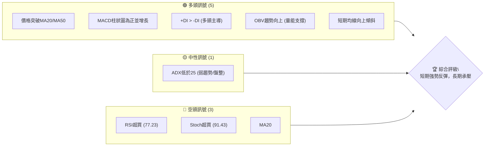
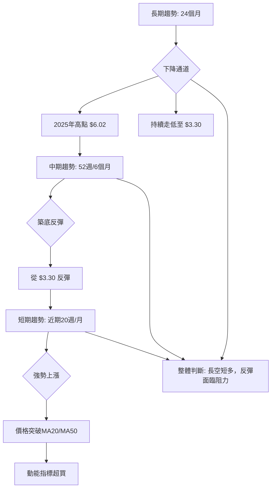
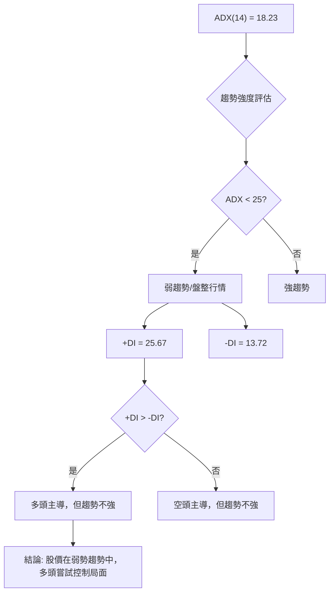
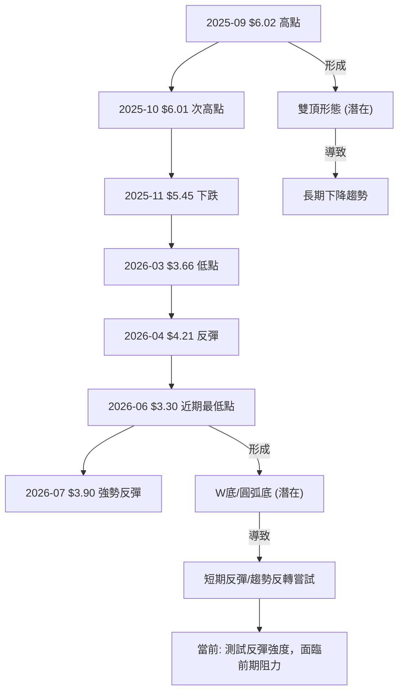
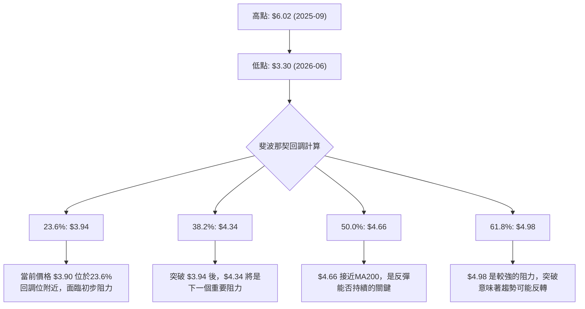
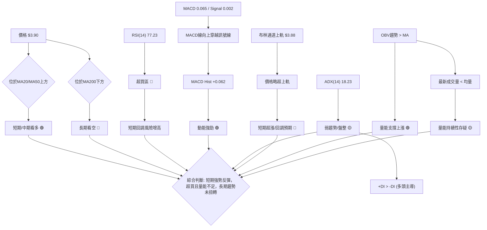
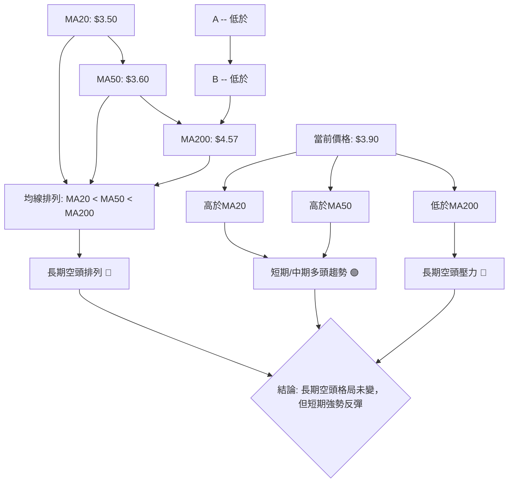
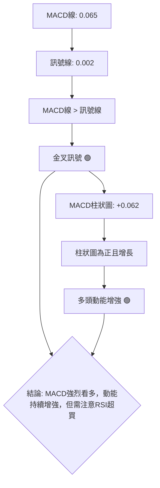
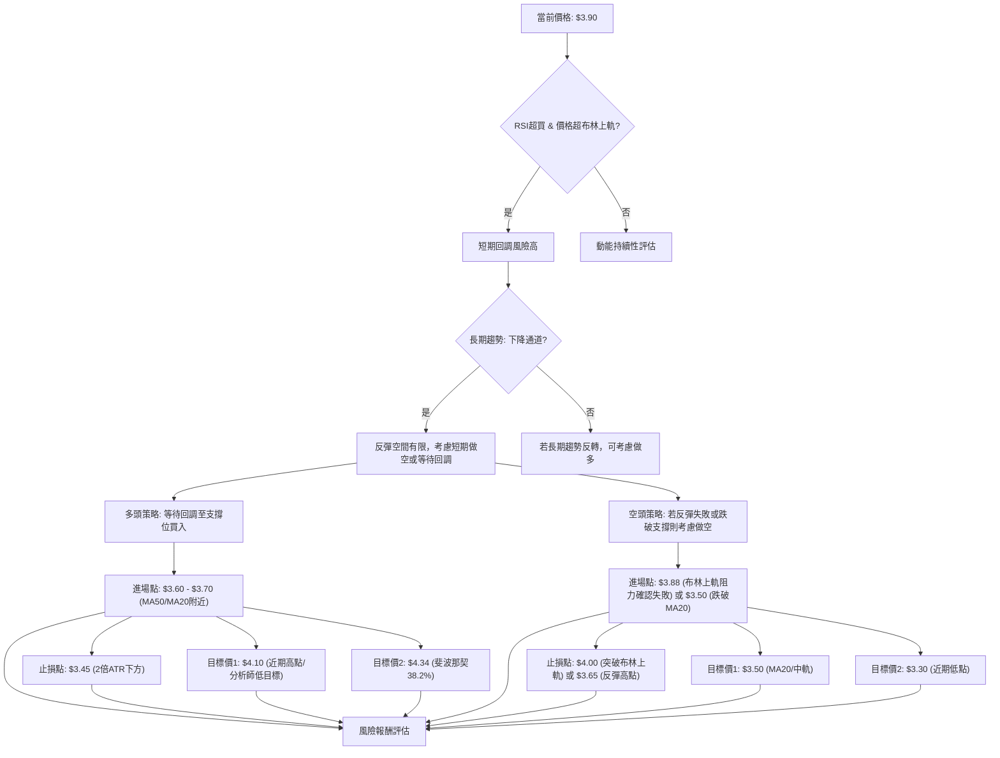
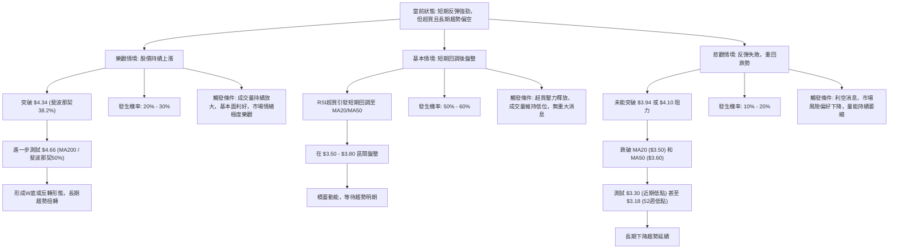

<details>
<summary>📊 靜態圖表 (點擊展開)</summary>

</details>

<html>
<head><meta charset="utf-8" /></head>
<body>
    <div style="height:500px; width:100%;">                        <script>window.PlotlyConfig = {MathJaxConfig: 'local'};</script>
        <script charset="utf-8" src="https://cdn.plot.ly/plotly-3.6.0.min.js" integrity="sha256-QaOVwtVY0T02VaHrr6pnoHLCwayMJp4O5n4YyaE3rJk=" crossorigin="anonymous"></script>                <div id="candlestick-chart" class="plotly-graph-div" style="height:100%; width:100%;"></div>            <script>                window.PLOTLYENV=window.PLOTLYENV || {};                                if (document.getElementById("candlestick-chart")) {                    Plotly.newPlot(                        "candlestick-chart",                        [{"close":{"dtype":"f8","bdata":"AAAAIK5HGUAAAABgZmYYQAAAAGBmZhlAAAAAIFyPGUAAAADAzMwZQAAAACCuRxlAAAAAoEfhGEAAAAAAAAAZQAAAAOCjcBhAAAAA4KNwGEAAAADgehQYQAAAAKCZmRdAAAAAQDMzGEAAAAAA16MYQAAAACBcjxlAAAAA4HoUGUAAAADgo3AZQAAAAIAUrhhAAAAA4KNwF0AAAADgUbgXQAAAAADXoxdAAAAAgBSuF0AAAABACtcWQAAAACBcjxZAAAAAgBSuFkAAAABgZmYWQAAAAEDhehZAAAAAoEfhFkAAAABgZmYXQAAAAEDhehhAAAAAYI\u002fCF0AAAABAMzMYQAAAACCF6xdAAAAAgD0KGEAAAAAgrkcYQAAAAADXIxdAAAAAIFyPFkAAAADAHoUWQAAAAKBwPRZAAAAAoJmZF0AAAADAHoUXQAAAAMD1KBdAAAAAwPUoFkAAAAAA16MVQAAAAIDrURVAAAAAIK5HFUAAAACgcD0VQAAAACCF6xNAAAAAoJmZE0AAAAAAAAAVQAAAAIDC9RRAAAAAIK5HFUAAAADAzMwVQAAAAOB6FBVAAAAAgD0KFUAAAADgehQVQAAAAEAzMxVAAAAAYI\u002fCFEAAAAAA16MUQAAAAKCZmRRAAAAA4FG4FEAAAADgUbgUQAAAAKCZmRRAAAAA4HoUFEAAAADAzMwTQAAAAEDhehNAAAAAgBSuE0AAAADgUbgTQAAAAOBRuBRAAAAAgOtRFEAAAADAHoUUQAAAAKCZmRRAAAAAYGZmFEAAAAAgrkcUQAAAAIDC9RNAAAAAgOtRFEAAAAAAKVwUQAAAAOB6FBVAAAAAgOtRFEAAAADAHoUTQAAAAGBmZhNAAAAAIFyPE0AAAADA9SgTQAAAAMAehRJAAAAAIFyPEUAAAADAHoURQAAAAIA9ChJAAAAAoJmZEUAAAABAMzMSQAAAAIDrURJAAAAAoHA9EkAAAABgj8ISQAAAAGC4HhJAAAAAoEfhEUAAAABAMzMRQAAAAADXoxFAAAAA4HoUEUAAAABgj8IQQAAAAKCZmRBAAAAA4HoUEUAAAACAPQoRQAAAAKBwPRFAAAAAIIXrEEAAAADgehQRQAAAAMAehRBAAAAA4HoUEUAAAADAzMwRQAAAAKCZmRFAAAAAwB6FEUAAAADgUbgQQAAAAKCZmRBAAAAAQArXEEAAAACgcD0RQAAAAKBH4RBAAAAA4FG4EEAAAACA61EQQAAAAGBmZhBAAAAAYLgeEEAAAABACtcPQAAAAIAUrg9AAAAAgML1DkAAAABguB4PQAAAAAAAAA5AAAAAgBSuDUAAAAAAAAAOQAAAAOBRuA5AAAAAAAAADkAAAADgo3ANQAAAAEDhegxAAAAAYLgeDUAAAACA61EOQAAAAEAK1w1AAAAAgBSuDUAAAAAgXI8MQAAAAKBwPQxAAAAAIK5HDUAAAAAAKVwNQAAAAIDC9QxAAAAAQOF6DEAAAACA61EMQAAAAIA9Cg1AAAAA4KNwDUAAAADgo3ANQAAAAEAK1w1AAAAAIFyPDkAAAAAAKVwPQAAAAOB6FBBAAAAAQArXEEAAAABACtcQQAAAAIDrURBAAAAAoHA9EEAAAACAFK4PQAAAAEAzMw9AAAAAYLgeD0AAAACgR+EOQAAAACBcjw5AAAAAIFyPDkAAAAAAKVwNQAAAAIDC9QxAAAAA4KNwDUAAAADA9SgOQAAAAIDrUQ5AAAAAYI\u002fCDUAAAABAMzMNQAAAAGC4Hg1AAAAAgD0KDUAAAAAgXI8MQAAAAGBmZgxAAAAAgOtRDEAAAAAAAAAMQAAAAOB6FAxAAAAAQOF6DEAAAADgehQMQAAAAOBRuAxAAAAAYLgeDUAAAACA61EMQAAAAIDrUQxAAAAAoEfhDEAAAADAzMwMQAAAACCuRwtAAAAAgBSuC0AAAADgUbgKQAAAAADXowpAAAAAYGZmCkAAAADA9SgKQAAAAMDMzApAAAAAYGZmCkAAAACAFK4LQAAAACCF6wtAAAAAoJmZC0AAAAAgXI8MQAAAACCF6wtAAAAAgBSuC0AAAAAghesLQAAAAIAUrgtAAAAAYGZmDEAAAAAghesNQAAAAMD1KA5AAAAAYLgeD0AAAABAMzMPQA=="},"high":{"dtype":"f8","bdata":"AAAAgBSuGUAAAADAHoUYQAAAAAAAABpAAAAAAAAAGkAAAACA61EaQAAAAEDhehpAAAAA4FG4GUAAAADgehQZQAAAAKBH4RhAAAAAgBSuGEAAAACgmZkYQAAAAKBH4RhAAAAAIK5HGEAAAACgR+EYQAAAACCuxxlAAAAAYGZmGkAAAABAicEZQAAAAKCZmRlAAAAAIFyPGEAAAAAgrkcYQAAAAOB6FBhAAAAAIFyPGEAAAACAwvUXQAAAAEAzsxZAAAAAgGo8F0AAAADgUbgWQAAAAEDhehZAAAAAgD0KF0AAAADA9agXQAAAAMAehRhAAAAAgML1GEAAAAAAKVwYQAAAAIDrURhAAAAAgOtRGEAAAACAwnUYQAAAACCuRxdAAAAA4KNwF0AAAABAClcXQAAAAMD1KBdAAAAAAAAAGEAAAADgo\u002fAYQAAAAOB6FBhAAAAAoEfhFkAAAABguB4WQAAAAOB6FBZAAAAAgMJ1FUAAAADAHoUVQAAAAADXoxVAAAAAoHA9FEAAAABA4XoVQAAAAAApXBVAAAAA4KNwFUAAAAAAAAAWQAAAAEDhehVAAAAAoHA9FUAAAABAMzMVQAAAAGBmZhVAAAAAYGZmFUAAAAAgXA8VQAAAAAAp3BRAAAAAgML1FEAAAABgj8IUQAAAAOB6FBVAAAAAANejFEAAAABAMzMUQAAAAKBH4RNAAAAAoEfhE0AAAABguB4UQAAAAGC4HhVAAAAAgML1FEAAAACgmZkUQAAAAADXoxRAAAAAIIXrFEAAAAAgXI8UQAAAAAApXBRAAAAAwB6FFEAAAADAzMwUQAAAAOCjcBVAAAAAgOtRFUAAAABAMzMUQAAAAKBH4RNAAAAAoEfhE0AAAACgmZkTQAAAAIA9ChNAAAAAwB6FEkAAAABgZmYSQAAAAOBROBJAAAAAQDMzEkAAAABgZmYSQAAAACBcjxJAAAAAgBSuEkAAAACAFC4TQAAAAOBRuBJAAAAA4FE4EkAAAACgR+ERQAAAAOBRuBFAAAAAYI\u002fCEUAAAABA4XoRQAAAAADXoxBAAAAAwMxMEUAAAAAAKVwRQAAAAGC4nhFAAAAAIFyPEUAAAACAwvURQAAAAOBROBFAAAAAQDMzEUAAAACAPQoSQAAAAEAK1xFAAAAAwB4FEkAAAACAPYoRQAAAAKCZmRBAAAAAwB6FEUAAAAAgrkcRQAAAAGC4HhFAAAAAoEfhEEAAAACAPYoQQAAAAOB6lBBAAAAAwB6FEEAAAADA9SgQQAAAAIAUrg9AAAAAAAAAEEAAAADAHoUPQAAAAMDMzA5AAAAAQOF6DkAAAAAA16MOQAAAAIDC9Q5AAAAAQDMzD0AAAABACtcNQAAAAOCjcA1AAAAAgBSuDUAAAAAA16MOQAAAAKCZmQ9AAAAA4FG4DkAAAADAHoUNQAAAAIDC9QxAAAAA4KNwDUAAAACA61EOQAAAAGCPwg1AAAAAAAAADkAAAABgj8IMQAAAAOCjcA9AAAAAQArXDUAAAADAzMwNQAAAAKBwPQ5AAAAA4HoUD0AAAADgUbgPQAAAAAApXBBAAAAAYLgeEUAAAAAAAAARQAAAAIDC9RBAAAAA4KNwEEAAAABAMzMQQAAAAMD1KBBAAAAAIIXrD0AAAAAAAAAPQAAAACCF6w5AAAAA4FG4DkAAAACgR+ENQAAAAEAzMw1AAAAA4KNwDkAAAACgmZkPQAAAAEAzMw9AAAAAoHA9DkAAAADgehQOQAAAAOCjcA1AAAAA4KNwDUAAAACAwvUMQAAAACBcjwxAAAAAwMzMDEAAAAAgXI8MQAAAAIDpJgxAAAAAANejDEAAAACAwvUMQAAAAIDrUQ1AAAAAAClcDUAAAACAwvUMQAAAACBcjwxAAAAAIK5HDUAAAAAgrkcNQAAAAOBRuAxAAAAAYGZmDEAAAADAHoULQAAAAEAzMwtAAAAAgML1CkAAAADAzMwKQAAAAIDC9QpAAAAAYLgeC0AAAACAwvUMQAAAAIDC9QxAAAAAAClcDEAAAACgR+EMQAAAAOBRuAxAAAAAAAAADEAAAABgZmYMQAAAACBcjwxAAAAAANejDEAAAAAAAAAOQAAAAKBH4Q5AAAAAgBSuD0AAAACAFK4PQA=="},"hovertemplate":"\u003cb\u003e%{x|%Y-%m-%d}\u003c\u002fb\u003e\u003cbr\u003e\u958b: $%{open:.2f}\u003cbr\u003e\u9ad8: $%{high:.2f}\u003cbr\u003e\u4f4e: $%{low:.2f}\u003cbr\u003e\u6536: $%{close:.2f}\u003cextra\u003e\u003c\u002fextra\u003e","low":{"dtype":"f8","bdata":"AAAAANejF0AAAADA9agXQAAAAKBwPRhAAAAAIK5HGUAAAACgR+EYQAAAAIA9ChlAAAAAANejGEAAAACAwvUXQAAAAMD1KBhAAAAA4FG4F0AAAACAwvUXQAAAAIDrURdAAAAAoJmZF0AAAACgcD0YQAAAACBcjxhAAAAAgML1GEAAAAAghesYQAAAACCuRxhAAAAAAClcF0AAAAAgXI8XQAAAAMDMzBZAAAAAoJmZF0AAAAAgXI8WQAAAAMD1KBZAAAAAoJmZFkAAAADA9SgWQAAAAIAUrhVAAAAAgOtRFkAAAADgehQXQAAAAADXoxdAAAAAoJmZF0AAAABgZmYXQAAAAIAUrhdAAAAAwMzMF0AAAACgmZkXQAAAAOCjcBVAAAAAQOF6FkAAAACAFC4WQAAAAMDMzBVAAAAAIIXrFkAAAABAMzMXQAAAAGC4HhdAAAAAIIXrFUAAAADgo3AVQAAAAOB6FBVAAAAAoEfhFEAAAAAAAAAVQAAAAEAK1xNAAAAAIK5HE0AAAAAghWsUQAAAAGCPwhRAAAAAQArXFEAAAADgo3AVQAAAAAAAABVAAAAAoEfhFEAAAACgmZkUQAAAACCuxxRAAAAA4FG4FEAAAADgo3AUQAAAAIDrURRAAAAAQDMzFEAAAACgR2EUQAAAAOCjcBRAAAAAgML1E0AAAACAFK4TQAAAAGBmZhNAAAAAIFyPE0AAAAAA16MTQAAAAIA9ChRAAAAAIK5HFEAAAABguB4UQAAAAMDMTBRAAAAAoEdhFEAAAAAAAAAUQAAAACCF6xNAAAAAgD0KFEAAAACA61EUQAAAAGCPwhRAAAAAYI9CFEAAAADgo3ATQAAAAIDrURNAAAAAAClcE0AAAAAAAAATQAAAAIDrURJAAAAAgOtREUAAAADgo3ARQAAAAGBmZhFAAAAAIFyPEUAAAADgUbgRQAAAAOB6FBJAAAAAwPUoEkAAAAAAKVwSQAAAAIA9ChJAAAAAwB6FEUAAAADA9SgRQAAAAAAAABFAAAAA4FG4EEAAAACgmZkQQAAAAKBwPRBAAAAAgMJ1EEAAAABACtcQQAAAACCF6xBAAAAAYI\u002fCEEAAAADAzMwQQAAAAAAAABBAAAAAYGZmEEAAAADgehQRQAAAAGCPQhFAAAAAgOtREUAAAADAHoUQQAAAAEAzMxBAAAAA4KfGEEAAAAAgXI8QQAAAAOBRuBBAAAAAoHA9EEAAAAAAKVwPQAAAAIA9ChBAAAAAAAAAEEAAAABgj8IPQAAAAMAehQ5AAAAAwMzMDkAAAABA4XoOQAAAAGCPwg1AAAAAoJmZDUAAAABgj8INQAAAAMD1KA5AAAAAQArXDUAAAAAgrkcNQAAAAGBmZgxAAAAA4FG4DEAAAACAwvUMQAAAAKCZmQ1AAAAAgOtRDUAAAACgcD0MQAAAAOB6FAxAAAAAYGZmDEAAAABguB4NQAAAAADXowxAAAAAQOF6DEAAAABACtcLQAAAAMDMzAxAAAAAgML1DEAAAABAMzMNQAAAAADXowxAAAAAYGQ7DkAAAACAFK4OQAAAAEAK1w9AAAAA4KNwEEAAAADgo3AQQAAAAEAzMxBAAAAAwPUoEEAAAABAMzMPQAAAAIA9Cg9AAAAAoEfhDkAAAACA61EOQAAAAOB6FA5AAAAAIIXrDUAAAADA9SgMQAAAAIDrUQxAAAAA4FG4DEAAAAAghesNQAAAAOB6FA5AAAAAIK5HDUAAAACAwvUMQAAAAKBH4QxAAAAAQOF6DEAAAABgZmYMQAAAAIAUrgtAAAAAQArXC0AAAAAghesLQAAAAGC4HgtAAAAAoJmZC0AAAAAghesLQAAAAOB6FAxAAAAA4KNwDEAAAABACtcLQAAAAEAK1wtAAAAAAAAADEAAAAAgXI8MQAAAAIA9CgtAAAAAgD0KC0AAAACgmZkKQAAAAGBmZgpAAAAA4HoUCkAAAADA9SgKQAAAAOCjcAlAAAAA4HoUCkAAAACAwvUKQAAAAEDhegtAAAAA4KNwC0AAAADgUbgKQAAAAGCPwgtAAAAAYLgeC0AAAADgo3ALQAAAAMAehQtAAAAAYGZmC0AAAAAA16MMQAAAAGCPwg1AAAAAYGZmDkAAAAAA16MOQA=="},"name":"\u50f9\u683c","open":{"dtype":"f8","bdata":"AAAAQOF6GEAAAADAHoUYQAAAAIA9ihhAAAAAIFyPGUAAAABA4foYQAAAACCF6xlAAAAAQDMzGUAAAADAHoUYQAAAAEAK1xhAAAAAgMJ1GEAAAACgcD0YQAAAAMD1KBhAAAAAgML1F0AAAABA4XoYQAAAAKCZGRlAAAAAQDMzGkAAAACA61EZQAAAAIA9ihlAAAAAQOF6GEAAAACAwvUXQAAAAMD1KBdAAAAAoHA9GEAAAADAzMwXQAAAAEDhehZAAAAAwPUoF0AAAADgUbgWQAAAAEDhehZAAAAAgBSuFkAAAACgR2EXQAAAAAAAABhAAAAAIIXrGEAAAABgj8IXQAAAAAAAABhAAAAAoEfhF0AAAACAPQoYQAAAAGCPQhZAAAAAYI9CF0AAAADAzMwWQAAAAMDMzBZAAAAAoJkZF0AAAAAgXA8YQAAAAGBmZhdAAAAAQArXFkAAAADAHoUVQAAAAIA9ihVAAAAA4FE4FUAAAABAMzMVQAAAAADXoxVAAAAAgD0KFEAAAACAFK4UQAAAAOB6FBVAAAAAwPUoFUAAAAAA16MVQAAAACCFaxVAAAAAwB4FFUAAAACAwvUUQAAAAEAK1xRAAAAAwPUoFUAAAABgj8IUQAAAACCFaxRAAAAAYGZmFEAAAADgepQUQAAAAGCPwhRAAAAAoJmZFEAAAABA4foTQAAAAKBH4RNAAAAAoJmZE0AAAACgR+ETQAAAAOB6FBRAAAAAgBSuFEAAAACA61EUQAAAACBcjxRAAAAAQOF6FEAAAACAwnUUQAAAACCuRxRAAAAAgBQuFEAAAADAHoUUQAAAAGCPwhRAAAAAYLgeFUAAAABAMzMUQAAAAGCPwhNAAAAAYGZmE0AAAACgmZkTQAAAACCF6xJAAAAA4KNwEkAAAACA61ESQAAAAIA9ihFAAAAAQDMzEkAAAADAzMwRQAAAAOB6FBJAAAAAoHA9EkAAAAAAKVwSQAAAAIAUrhJAAAAAwPUoEkAAAACAFK4RQAAAAGC4HhFAAAAAwPWoEUAAAACA61ERQAAAAMAehRBAAAAAoEfhEEAAAABguB4RQAAAAMD1KBFAAAAA4KNwEUAAAADAzMwQQAAAAIDC9RBAAAAAYI\u002fCEEAAAACgcD0RQAAAAOB6lBFAAAAA4KNwEUAAAADAzEwRQAAAAOCjcBBAAAAAAAAAEUAAAADgUbgQQAAAAMDMzBBAAAAAANejEEAAAABguB4QQAAAAOCjcBBAAAAAAClcEEAAAAAgXA8QQAAAACCuRw9AAAAAgBSuD0AAAADAzMwOQAAAAADXow5AAAAAYLgeDkAAAAAghesNQAAAAKBwPQ5AAAAAoJmZDkAAAABgj8INQAAAAEAzMw1AAAAAwMzMDEAAAABAMzMNQAAAAADXow5AAAAAYGZmDUAAAADgo3ANQAAAAOBRuAxAAAAAwMzMDEAAAAAAAAAOQAAAAIDC9QxAAAAAoEfhDEAAAADAHoUMQAAAAEAK1w5AAAAAgD0KDUAAAACgmZkNQAAAAEAzMw1AAAAAoHA9DkAAAADAzMwOQAAAAAAAABBAAAAAQOF6EEAAAABguJ4QQAAAAKBH4RBAAAAAAClcEEAAAABAMzMQQAAAAOB6FBBAAAAAQDMzD0AAAADAzMwOQAAAAKBH4Q5AAAAAIFyPDkAAAADgUbgNQAAAAOB6FA1AAAAAAClcDkAAAADAzMwOQAAAACBcjw5AAAAAwPUoDkAAAACAFK4NQAAAAAApXA1AAAAAAClcDUAAAACAwvUMQAAAAIDrUQxAAAAAYLgeDEAAAACA61EMQAAAAOB6FAxAAAAAAAAADEAAAABA4XoMQAAAACCuRwxAAAAAQOF6DEAAAACAwvUMQAAAAKBwPQxAAAAAwPUoDEAAAACgR+EMQAAAAADXowxAAAAAIK5HC0AAAADgo3ALQAAAAGCPwgpAAAAAANejCkAAAABgZmYKQAAAAAAAAApAAAAAYLgeC0AAAABguB4LQAAAAGCPwgtAAAAAAAAADEAAAADAHoULQAAAAKAYBAxAAAAAIK5HC0AAAAAA16MLQAAAAEAzMwxAAAAAYGZmC0AAAADgUbgMQAAAACCF6w1AAAAAYGZmDkAAAADgo3APQA=="},"x":["2025-09-16T00:00:00-04:00","2025-09-17T00:00:00-04:00","2025-09-18T00:00:00-04:00","2025-09-19T00:00:00-04:00","2025-09-22T00:00:00-04:00","2025-09-23T00:00:00-04:00","2025-09-24T00:00:00-04:00","2025-09-25T00:00:00-04:00","2025-09-26T00:00:00-04:00","2025-09-29T00:00:00-04:00","2025-09-30T00:00:00-04:00","2025-10-01T00:00:00-04:00","2025-10-02T00:00:00-04:00","2025-10-03T00:00:00-04:00","2025-10-06T00:00:00-04:00","2025-10-07T00:00:00-04:00","2025-10-08T00:00:00-04:00","2025-10-09T00:00:00-04:00","2025-10-10T00:00:00-04:00","2025-10-13T00:00:00-04:00","2025-10-14T00:00:00-04:00","2025-10-15T00:00:00-04:00","2025-10-16T00:00:00-04:00","2025-10-17T00:00:00-04:00","2025-10-20T00:00:00-04:00","2025-10-21T00:00:00-04:00","2025-10-22T00:00:00-04:00","2025-10-23T00:00:00-04:00","2025-10-24T00:00:00-04:00","2025-10-27T00:00:00-04:00","2025-10-28T00:00:00-04:00","2025-10-29T00:00:00-04:00","2025-10-30T00:00:00-04:00","2025-10-31T00:00:00-04:00","2025-11-03T00:00:00-05:00","2025-11-04T00:00:00-05:00","2025-11-05T00:00:00-05:00","2025-11-06T00:00:00-05:00","2025-11-07T00:00:00-05:00","2025-11-10T00:00:00-05:00","2025-11-11T00:00:00-05:00","2025-11-12T00:00:00-05:00","2025-11-13T00:00:00-05:00","2025-11-14T00:00:00-05:00","2025-11-17T00:00:00-05:00","2025-11-18T00:00:00-05:00","2025-11-19T00:00:00-05:00","2025-11-20T00:00:00-05:00","2025-11-21T00:00:00-05:00","2025-11-24T00:00:00-05:00","2025-11-25T00:00:00-05:00","2025-11-26T00:00:00-05:00","2025-11-28T00:00:00-05:00","2025-12-01T00:00:00-05:00","2025-12-02T00:00:00-05:00","2025-12-03T00:00:00-05:00","2025-12-04T00:00:00-05:00","2025-12-05T00:00:00-05:00","2025-12-08T00:00:00-05:00","2025-12-09T00:00:00-05:00","2025-12-10T00:00:00-05:00","2025-12-11T00:00:00-05:00","2025-12-12T00:00:00-05:00","2025-12-15T00:00:00-05:00","2025-12-16T00:00:00-05:00","2025-12-17T00:00:00-05:00","2025-12-18T00:00:00-05:00","2025-12-19T00:00:00-05:00","2025-12-22T00:00:00-05:00","2025-12-23T00:00:00-05:00","2025-12-24T00:00:00-05:00","2025-12-26T00:00:00-05:00","2025-12-29T00:00:00-05:00","2025-12-30T00:00:00-05:00","2025-12-31T00:00:00-05:00","2026-01-02T00:00:00-05:00","2026-01-05T00:00:00-05:00","2026-01-06T00:00:00-05:00","2026-01-07T00:00:00-05:00","2026-01-08T00:00:00-05:00","2026-01-09T00:00:00-05:00","2026-01-12T00:00:00-05:00","2026-01-13T00:00:00-05:00","2026-01-14T00:00:00-05:00","2026-01-15T00:00:00-05:00","2026-01-16T00:00:00-05:00","2026-01-20T00:00:00-05:00","2026-01-21T00:00:00-05:00","2026-01-22T00:00:00-05:00","2026-01-23T00:00:00-05:00","2026-01-26T00:00:00-05:00","2026-01-27T00:00:00-05:00","2026-01-28T00:00:00-05:00","2026-01-29T00:00:00-05:00","2026-01-30T00:00:00-05:00","2026-02-02T00:00:00-05:00","2026-02-03T00:00:00-05:00","2026-02-04T00:00:00-05:00","2026-02-05T00:00:00-05:00","2026-02-06T00:00:00-05:00","2026-02-09T00:00:00-05:00","2026-02-10T00:00:00-05:00","2026-02-11T00:00:00-05:00","2026-02-12T00:00:00-05:00","2026-02-13T00:00:00-05:00","2026-02-17T00:00:00-05:00","2026-02-18T00:00:00-05:00","2026-02-19T00:00:00-05:00","2026-02-20T00:00:00-05:00","2026-02-23T00:00:00-05:00","2026-02-24T00:00:00-05:00","2026-02-25T00:00:00-05:00","2026-02-26T00:00:00-05:00","2026-02-27T00:00:00-05:00","2026-03-02T00:00:00-05:00","2026-03-03T00:00:00-05:00","2026-03-04T00:00:00-05:00","2026-03-05T00:00:00-05:00","2026-03-06T00:00:00-05:00","2026-03-09T00:00:00-04:00","2026-03-10T00:00:00-04:00","2026-03-11T00:00:00-04:00","2026-03-12T00:00:00-04:00","2026-03-13T00:00:00-04:00","2026-03-16T00:00:00-04:00","2026-03-17T00:00:00-04:00","2026-03-18T00:00:00-04:00","2026-03-19T00:00:00-04:00","2026-03-20T00:00:00-04:00","2026-03-23T00:00:00-04:00","2026-03-24T00:00:00-04:00","2026-03-25T00:00:00-04:00","2026-03-26T00:00:00-04:00","2026-03-27T00:00:00-04:00","2026-03-30T00:00:00-04:00","2026-03-31T00:00:00-04:00","2026-04-01T00:00:00-04:00","2026-04-02T00:00:00-04:00","2026-04-06T00:00:00-04:00","2026-04-07T00:00:00-04:00","2026-04-08T00:00:00-04:00","2026-04-09T00:00:00-04:00","2026-04-10T00:00:00-04:00","2026-04-13T00:00:00-04:00","2026-04-14T00:00:00-04:00","2026-04-15T00:00:00-04:00","2026-04-16T00:00:00-04:00","2026-04-17T00:00:00-04:00","2026-04-20T00:00:00-04:00","2026-04-21T00:00:00-04:00","2026-04-22T00:00:00-04:00","2026-04-23T00:00:00-04:00","2026-04-24T00:00:00-04:00","2026-04-27T00:00:00-04:00","2026-04-28T00:00:00-04:00","2026-04-29T00:00:00-04:00","2026-04-30T00:00:00-04:00","2026-05-01T00:00:00-04:00","2026-05-04T00:00:00-04:00","2026-05-05T00:00:00-04:00","2026-05-06T00:00:00-04:00","2026-05-07T00:00:00-04:00","2026-05-08T00:00:00-04:00","2026-05-11T00:00:00-04:00","2026-05-12T00:00:00-04:00","2026-05-13T00:00:00-04:00","2026-05-14T00:00:00-04:00","2026-05-15T00:00:00-04:00","2026-05-18T00:00:00-04:00","2026-05-19T00:00:00-04:00","2026-05-20T00:00:00-04:00","2026-05-21T00:00:00-04:00","2026-05-22T00:00:00-04:00","2026-05-26T00:00:00-04:00","2026-05-27T00:00:00-04:00","2026-05-28T00:00:00-04:00","2026-05-29T00:00:00-04:00","2026-06-01T00:00:00-04:00","2026-06-02T00:00:00-04:00","2026-06-03T00:00:00-04:00","2026-06-04T00:00:00-04:00","2026-06-05T00:00:00-04:00","2026-06-08T00:00:00-04:00","2026-06-09T00:00:00-04:00","2026-06-10T00:00:00-04:00","2026-06-11T00:00:00-04:00","2026-06-12T00:00:00-04:00","2026-06-15T00:00:00-04:00","2026-06-16T00:00:00-04:00","2026-06-17T00:00:00-04:00","2026-06-18T00:00:00-04:00","2026-06-22T00:00:00-04:00","2026-06-23T00:00:00-04:00","2026-06-24T00:00:00-04:00","2026-06-25T00:00:00-04:00","2026-06-26T00:00:00-04:00","2026-06-29T00:00:00-04:00","2026-06-30T00:00:00-04:00","2026-07-01T00:00:00-04:00","2026-07-02T00:00:00-04:00"],"type":"candlestick"},{"hovertemplate":"MA30: $%{y:.2f}\u003cextra\u003e\u003c\u002fextra\u003e","line":{"color":"#2196F3","dash":"dash","width":2},"mode":"lines","name":"MA30","x":["2025-09-16T00:00:00-04:00","2025-09-17T00:00:00-04:00","2025-09-18T00:00:00-04:00","2025-09-19T00:00:00-04:00","2025-09-22T00:00:00-04:00","2025-09-23T00:00:00-04:00","2025-09-24T00:00:00-04:00","2025-09-25T00:00:00-04:00","2025-09-26T00:00:00-04:00","2025-09-29T00:00:00-04:00","2025-09-30T00:00:00-04:00","2025-10-01T00:00:00-04:00","2025-10-02T00:00:00-04:00","2025-10-03T00:00:00-04:00","2025-10-06T00:00:00-04:00","2025-10-07T00:00:00-04:00","2025-10-08T00:00:00-04:00","2025-10-09T00:00:00-04:00","2025-10-10T00:00:00-04:00","2025-10-13T00:00:00-04:00","2025-10-14T00:00:00-04:00","2025-10-15T00:00:00-04:00","2025-10-16T00:00:00-04:00","2025-10-17T00:00:00-04:00","2025-10-20T00:00:00-04:00","2025-10-21T00:00:00-04:00","2025-10-22T00:00:00-04:00","2025-10-23T00:00:00-04:00","2025-10-24T00:00:00-04:00","2025-10-27T00:00:00-04:00","2025-10-28T00:00:00-04:00","2025-10-29T00:00:00-04:00","2025-10-30T00:00:00-04:00","2025-10-31T00:00:00-04:00","2025-11-03T00:00:00-05:00","2025-11-04T00:00:00-05:00","2025-11-05T00:00:00-05:00","2025-11-06T00:00:00-05:00","2025-11-07T00:00:00-05:00","2025-11-10T00:00:00-05:00","2025-11-11T00:00:00-05:00","2025-11-12T00:00:00-05:00","2025-11-13T00:00:00-05:00","2025-11-14T00:00:00-05:00","2025-11-17T00:00:00-05:00","2025-11-18T00:00:00-05:00","2025-11-19T00:00:00-05:00","2025-11-20T00:00:00-05:00","2025-11-21T00:00:00-05:00","2025-11-24T00:00:00-05:00","2025-11-25T00:00:00-05:00","2025-11-26T00:00:00-05:00","2025-11-28T00:00:00-05:00","2025-12-01T00:00:00-05:00","2025-12-02T00:00:00-05:00","2025-12-03T00:00:00-05:00","2025-12-04T00:00:00-05:00","2025-12-05T00:00:00-05:00","2025-12-08T00:00:00-05:00","2025-12-09T00:00:00-05:00","2025-12-10T00:00:00-05:00","2025-12-11T00:00:00-05:00","2025-12-12T00:00:00-05:00","2025-12-15T00:00:00-05:00","2025-12-16T00:00:00-05:00","2025-12-17T00:00:00-05:00","2025-12-18T00:00:00-05:00","2025-12-19T00:00:00-05:00","2025-12-22T00:00:00-05:00","2025-12-23T00:00:00-05:00","2025-12-24T00:00:00-05:00","2025-12-26T00:00:00-05:00","2025-12-29T00:00:00-05:00","2025-12-30T00:00:00-05:00","2025-12-31T00:00:00-05:00","2026-01-02T00:00:00-05:00","2026-01-05T00:00:00-05:00","2026-01-06T00:00:00-05:00","2026-01-07T00:00:00-05:00","2026-01-08T00:00:00-05:00","2026-01-09T00:00:00-05:00","2026-01-12T00:00:00-05:00","2026-01-13T00:00:00-05:00","2026-01-14T00:00:00-05:00","2026-01-15T00:00:00-05:00","2026-01-16T00:00:00-05:00","2026-01-20T00:00:00-05:00","2026-01-21T00:00:00-05:00","2026-01-22T00:00:00-05:00","2026-01-23T00:00:00-05:00","2026-01-26T00:00:00-05:00","2026-01-27T00:00:00-05:00","2026-01-28T00:00:00-05:00","2026-01-29T00:00:00-05:00","2026-01-30T00:00:00-05:00","2026-02-02T00:00:00-05:00","2026-02-03T00:00:00-05:00","2026-02-04T00:00:00-05:00","2026-02-05T00:00:00-05:00","2026-02-06T00:00:00-05:00","2026-02-09T00:00:00-05:00","2026-02-10T00:00:00-05:00","2026-02-11T00:00:00-05:00","2026-02-12T00:00:00-05:00","2026-02-13T00:00:00-05:00","2026-02-17T00:00:00-05:00","2026-02-18T00:00:00-05:00","2026-02-19T00:00:00-05:00","2026-02-20T00:00:00-05:00","2026-02-23T00:00:00-05:00","2026-02-24T00:00:00-05:00","2026-02-25T00:00:00-05:00","2026-02-26T00:00:00-05:00","2026-02-27T00:00:00-05:00","2026-03-02T00:00:00-05:00","2026-03-03T00:00:00-05:00","2026-03-04T00:00:00-05:00","2026-03-05T00:00:00-05:00","2026-03-06T00:00:00-05:00","2026-03-09T00:00:00-04:00","2026-03-10T00:00:00-04:00","2026-03-11T00:00:00-04:00","2026-03-12T00:00:00-04:00","2026-03-13T00:00:00-04:00","2026-03-16T00:00:00-04:00","2026-03-17T00:00:00-04:00","2026-03-18T00:00:00-04:00","2026-03-19T00:00:00-04:00","2026-03-20T00:00:00-04:00","2026-03-23T00:00:00-04:00","2026-03-24T00:00:00-04:00","2026-03-25T00:00:00-04:00","2026-03-26T00:00:00-04:00","2026-03-27T00:00:00-04:00","2026-03-30T00:00:00-04:00","2026-03-31T00:00:00-04:00","2026-04-01T00:00:00-04:00","2026-04-02T00:00:00-04:00","2026-04-06T00:00:00-04:00","2026-04-07T00:00:00-04:00","2026-04-08T00:00:00-04:00","2026-04-09T00:00:00-04:00","2026-04-10T00:00:00-04:00","2026-04-13T00:00:00-04:00","2026-04-14T00:00:00-04:00","2026-04-15T00:00:00-04:00","2026-04-16T00:00:00-04:00","2026-04-17T00:00:00-04:00","2026-04-20T00:00:00-04:00","2026-04-21T00:00:00-04:00","2026-04-22T00:00:00-04:00","2026-04-23T00:00:00-04:00","2026-04-24T00:00:00-04:00","2026-04-27T00:00:00-04:00","2026-04-28T00:00:00-04:00","2026-04-29T00:00:00-04:00","2026-04-30T00:00:00-04:00","2026-05-01T00:00:00-04:00","2026-05-04T00:00:00-04:00","2026-05-05T00:00:00-04:00","2026-05-06T00:00:00-04:00","2026-05-07T00:00:00-04:00","2026-05-08T00:00:00-04:00","2026-05-11T00:00:00-04:00","2026-05-12T00:00:00-04:00","2026-05-13T00:00:00-04:00","2026-05-14T00:00:00-04:00","2026-05-15T00:00:00-04:00","2026-05-18T00:00:00-04:00","2026-05-19T00:00:00-04:00","2026-05-20T00:00:00-04:00","2026-05-21T00:00:00-04:00","2026-05-22T00:00:00-04:00","2026-05-26T00:00:00-04:00","2026-05-27T00:00:00-04:00","2026-05-28T00:00:00-04:00","2026-05-29T00:00:00-04:00","2026-06-01T00:00:00-04:00","2026-06-02T00:00:00-04:00","2026-06-03T00:00:00-04:00","2026-06-04T00:00:00-04:00","2026-06-05T00:00:00-04:00","2026-06-08T00:00:00-04:00","2026-06-09T00:00:00-04:00","2026-06-10T00:00:00-04:00","2026-06-11T00:00:00-04:00","2026-06-12T00:00:00-04:00","2026-06-15T00:00:00-04:00","2026-06-16T00:00:00-04:00","2026-06-17T00:00:00-04:00","2026-06-18T00:00:00-04:00","2026-06-22T00:00:00-04:00","2026-06-23T00:00:00-04:00","2026-06-24T00:00:00-04:00","2026-06-25T00:00:00-04:00","2026-06-26T00:00:00-04:00","2026-06-29T00:00:00-04:00","2026-06-30T00:00:00-04:00","2026-07-01T00:00:00-04:00","2026-07-02T00:00:00-04:00"],"y":{"dtype":"f8","bdata":"AAAAAAAA+H8AAAAAAAD4fwAAAAAAAPh\u002fAAAAAAAA+H8AAAAAAAD4fwAAAAAAAPh\u002fAAAAAAAA+H8AAAAAAAD4fwAAAAAAAPh\u002fAAAAAAAA+H8AAAAAAAD4fwAAAAAAAPh\u002fAAAAAAAA+H8AAAAAAAD4fwAAAAAAAPh\u002fAAAAAAAA+H8AAAAAAAD4fwAAAAAAAPh\u002fAAAAAAAA+H8AAAAAAAD4fwAAAAAAAPh\u002fAAAAAAAA+H8AAAAAAAD4fwAAAAAAAPh\u002fAAAAAAAA+H8AAAAAAAD4fwAAAAAAAPh\u002fAAAAAAAA+H8AAAAAAAD4fwAAANDbMhhAIiIiUuMlGECrqqpqLiQYQO\u002fu7k6NFxhAIiIi0pQKGEBVVVVVnP0XQN7d3W1Z6xdAAAAAUI3XF0C8u7urY8IXQCIiIrKdrxdAAAAAsHKoF0CamZlZq6MXQHd3dyfqnxdAREREtIGOF0Crqqoa6HQXQO\u002fu7q65UBdAVVVVdUwwF0CrqqpqdQwXQJqZmQnX4xZA3t3dbRLDFkAAAACA3KsWQDMzM\u002fP9lBZAIiIiEoOAFkB3d3cno3cWQLy7uwsCaxZAmpmZaQNdFkBERETUv1EWQBEREaHTRhZAvLu7a7w0FkC8u7sbLx0WQO\u002fu7h4T\u002fBVAMzMzIyLiFUBVVVX1b8QVQO\u002fu7k4bqBVA3t3djVCGFUB3d3fXFWAVQDMzM3PaQBVA7+7u\u002fkYoFUDNzMxMYhAVQO\u002fu7s5pAxVAmpmZiWznFEAAAADw0s0UQImIiIj6txRAERERwfWoFECrqqrKWp0UQDMzM9O\u002fkRRAvLu7q46JFECJiIhIDIIUQHd3d1fyixRARERENBeSFECJiIgYdoUUQJqZmTkmeBRAMzMz03hpFECJiIio8VIUQBEREUEZPRRAMzMzE2cfFEAzMzMjBgEUQDMzMwMP5hNAMzMz4xfLE0ARERGhRbYTQEREROTQohNAAAAAQKeNE0ARERGR7XwTQM3MzOzDZxNAMzMz8\u002f1UE0Crqqoqzj4TQAAAAKAaLxNAZmZm1uoYE0Dv7u6eqP8SQImIiFiA3BJAVVVVddrAEkCJiIhIKKMSQAAAAEB8hhJAMzMzE8poEkARERGRe00SQGZmZsYgMBJAMzMz43oUEkCrqqp6ov4RQN7d3U3w4BFAzczMnAvJEUCrqqrqJrERQJqZmTlCmRFAvLu7SwyCEUDe3d39qXERQKuqqlqrYxFAiYiIWIBcEUB3d3fnQlIRQERERERERBFAiYiIKKM3EUC8u7trLiQRQHd3d8cEDxFAd3d3d3f3EEDe3d31KNwQQO\u002fu7jaJwRBAREREPJinEECrqqpC0pQQQGZmZoZdgRBAIiIisp1vEEB3d3c\u002fNV4QQHd3d78RShBAmpmZuZA0EEDNzMzMhSQQQO\u002fu7q65EBBAVVVVtfP9D0AiIiJSKs4PQO\u002fu7o40pQ9AmpmZCZB7D0De3d2NUEYPQAAAABAREQ9AVVVVhRbZDkBmZma2Za0OQN7d3Q3miQ5AIiIiordlDkBmZmaWtToOQImIiDhCGQ5ARERExK4ADkARERGRwvUNQHd3d3dM8A1AERERMZb8DUC8u7u7SQwOQCIiIuJ6FA5AAAAAYHMhDkBmZma2OiYOQHd3dyd4MA5AIiIi4sE8DkBVVVVFREQOQO\u002fu7r7mQg5AVVVVFa5HDkAiIiJS\u002f0YOQFVVVeUXSw5AIiIi8tJNDkC8u7trdUwOQO\u002fu7v6NUA5AIiIiwjxRDkDNzMzcslYOQBEREUE1Xg5Ad3d39yhcDkBmZmZWVVUOQAAAAACOUA5AmpmZeTBPDkDNzMxsdUwOQFVVVUVERA5A3t3dHRM8DkBmZmYmeDAOQImIiHjpJg5A7+7uvp8aDkAzMzPDrgAOQHd3dyfq3w1AREREZPS2DUDe3d3dT40NQFVVVcWSXw1AMzMzA502DUCamZm5SQwNQAAAAEBg5QxAAAAAQBm9DEARERFB0pQMQImIiGi8dAxAAAAAwDxRDEC8u7u75kIMQCIiItIGOgxAd3d3R1MqDEBmZmYGrBwMQFVVVSUxCAxAERERUXH2C0DNzMwchesLQCIiImI73wtAd3d3R8XZC0Dv7u4+YOULQGZmZgZl9AtAiYiIuEkMDECrqqo6mCcMQA=="},"type":"scatter"},{"hovertemplate":"MA60: $%{y:.2f}\u003cextra\u003e\u003c\u002fextra\u003e","line":{"color":"#9C27B0","dash":"dash","width":2},"mode":"lines","name":"MA60","x":["2025-09-16T00:00:00-04:00","2025-09-17T00:00:00-04:00","2025-09-18T00:00:00-04:00","2025-09-19T00:00:00-04:00","2025-09-22T00:00:00-04:00","2025-09-23T00:00:00-04:00","2025-09-24T00:00:00-04:00","2025-09-25T00:00:00-04:00","2025-09-26T00:00:00-04:00","2025-09-29T00:00:00-04:00","2025-09-30T00:00:00-04:00","2025-10-01T00:00:00-04:00","2025-10-02T00:00:00-04:00","2025-10-03T00:00:00-04:00","2025-10-06T00:00:00-04:00","2025-10-07T00:00:00-04:00","2025-10-08T00:00:00-04:00","2025-10-09T00:00:00-04:00","2025-10-10T00:00:00-04:00","2025-10-13T00:00:00-04:00","2025-10-14T00:00:00-04:00","2025-10-15T00:00:00-04:00","2025-10-16T00:00:00-04:00","2025-10-17T00:00:00-04:00","2025-10-20T00:00:00-04:00","2025-10-21T00:00:00-04:00","2025-10-22T00:00:00-04:00","2025-10-23T00:00:00-04:00","2025-10-24T00:00:00-04:00","2025-10-27T00:00:00-04:00","2025-10-28T00:00:00-04:00","2025-10-29T00:00:00-04:00","2025-10-30T00:00:00-04:00","2025-10-31T00:00:00-04:00","2025-11-03T00:00:00-05:00","2025-11-04T00:00:00-05:00","2025-11-05T00:00:00-05:00","2025-11-06T00:00:00-05:00","2025-11-07T00:00:00-05:00","2025-11-10T00:00:00-05:00","2025-11-11T00:00:00-05:00","2025-11-12T00:00:00-05:00","2025-11-13T00:00:00-05:00","2025-11-14T00:00:00-05:00","2025-11-17T00:00:00-05:00","2025-11-18T00:00:00-05:00","2025-11-19T00:00:00-05:00","2025-11-20T00:00:00-05:00","2025-11-21T00:00:00-05:00","2025-11-24T00:00:00-05:00","2025-11-25T00:00:00-05:00","2025-11-26T00:00:00-05:00","2025-11-28T00:00:00-05:00","2025-12-01T00:00:00-05:00","2025-12-02T00:00:00-05:00","2025-12-03T00:00:00-05:00","2025-12-04T00:00:00-05:00","2025-12-05T00:00:00-05:00","2025-12-08T00:00:00-05:00","2025-12-09T00:00:00-05:00","2025-12-10T00:00:00-05:00","2025-12-11T00:00:00-05:00","2025-12-12T00:00:00-05:00","2025-12-15T00:00:00-05:00","2025-12-16T00:00:00-05:00","2025-12-17T00:00:00-05:00","2025-12-18T00:00:00-05:00","2025-12-19T00:00:00-05:00","2025-12-22T00:00:00-05:00","2025-12-23T00:00:00-05:00","2025-12-24T00:00:00-05:00","2025-12-26T00:00:00-05:00","2025-12-29T00:00:00-05:00","2025-12-30T00:00:00-05:00","2025-12-31T00:00:00-05:00","2026-01-02T00:00:00-05:00","2026-01-05T00:00:00-05:00","2026-01-06T00:00:00-05:00","2026-01-07T00:00:00-05:00","2026-01-08T00:00:00-05:00","2026-01-09T00:00:00-05:00","2026-01-12T00:00:00-05:00","2026-01-13T00:00:00-05:00","2026-01-14T00:00:00-05:00","2026-01-15T00:00:00-05:00","2026-01-16T00:00:00-05:00","2026-01-20T00:00:00-05:00","2026-01-21T00:00:00-05:00","2026-01-22T00:00:00-05:00","2026-01-23T00:00:00-05:00","2026-01-26T00:00:00-05:00","2026-01-27T00:00:00-05:00","2026-01-28T00:00:00-05:00","2026-01-29T00:00:00-05:00","2026-01-30T00:00:00-05:00","2026-02-02T00:00:00-05:00","2026-02-03T00:00:00-05:00","2026-02-04T00:00:00-05:00","2026-02-05T00:00:00-05:00","2026-02-06T00:00:00-05:00","2026-02-09T00:00:00-05:00","2026-02-10T00:00:00-05:00","2026-02-11T00:00:00-05:00","2026-02-12T00:00:00-05:00","2026-02-13T00:00:00-05:00","2026-02-17T00:00:00-05:00","2026-02-18T00:00:00-05:00","2026-02-19T00:00:00-05:00","2026-02-20T00:00:00-05:00","2026-02-23T00:00:00-05:00","2026-02-24T00:00:00-05:00","2026-02-25T00:00:00-05:00","2026-02-26T00:00:00-05:00","2026-02-27T00:00:00-05:00","2026-03-02T00:00:00-05:00","2026-03-03T00:00:00-05:00","2026-03-04T00:00:00-05:00","2026-03-05T00:00:00-05:00","2026-03-06T00:00:00-05:00","2026-03-09T00:00:00-04:00","2026-03-10T00:00:00-04:00","2026-03-11T00:00:00-04:00","2026-03-12T00:00:00-04:00","2026-03-13T00:00:00-04:00","2026-03-16T00:00:00-04:00","2026-03-17T00:00:00-04:00","2026-03-18T00:00:00-04:00","2026-03-19T00:00:00-04:00","2026-03-20T00:00:00-04:00","2026-03-23T00:00:00-04:00","2026-03-24T00:00:00-04:00","2026-03-25T00:00:00-04:00","2026-03-26T00:00:00-04:00","2026-03-27T00:00:00-04:00","2026-03-30T00:00:00-04:00","2026-03-31T00:00:00-04:00","2026-04-01T00:00:00-04:00","2026-04-02T00:00:00-04:00","2026-04-06T00:00:00-04:00","2026-04-07T00:00:00-04:00","2026-04-08T00:00:00-04:00","2026-04-09T00:00:00-04:00","2026-04-10T00:00:00-04:00","2026-04-13T00:00:00-04:00","2026-04-14T00:00:00-04:00","2026-04-15T00:00:00-04:00","2026-04-16T00:00:00-04:00","2026-04-17T00:00:00-04:00","2026-04-20T00:00:00-04:00","2026-04-21T00:00:00-04:00","2026-04-22T00:00:00-04:00","2026-04-23T00:00:00-04:00","2026-04-24T00:00:00-04:00","2026-04-27T00:00:00-04:00","2026-04-28T00:00:00-04:00","2026-04-29T00:00:00-04:00","2026-04-30T00:00:00-04:00","2026-05-01T00:00:00-04:00","2026-05-04T00:00:00-04:00","2026-05-05T00:00:00-04:00","2026-05-06T00:00:00-04:00","2026-05-07T00:00:00-04:00","2026-05-08T00:00:00-04:00","2026-05-11T00:00:00-04:00","2026-05-12T00:00:00-04:00","2026-05-13T00:00:00-04:00","2026-05-14T00:00:00-04:00","2026-05-15T00:00:00-04:00","2026-05-18T00:00:00-04:00","2026-05-19T00:00:00-04:00","2026-05-20T00:00:00-04:00","2026-05-21T00:00:00-04:00","2026-05-22T00:00:00-04:00","2026-05-26T00:00:00-04:00","2026-05-27T00:00:00-04:00","2026-05-28T00:00:00-04:00","2026-05-29T00:00:00-04:00","2026-06-01T00:00:00-04:00","2026-06-02T00:00:00-04:00","2026-06-03T00:00:00-04:00","2026-06-04T00:00:00-04:00","2026-06-05T00:00:00-04:00","2026-06-08T00:00:00-04:00","2026-06-09T00:00:00-04:00","2026-06-10T00:00:00-04:00","2026-06-11T00:00:00-04:00","2026-06-12T00:00:00-04:00","2026-06-15T00:00:00-04:00","2026-06-16T00:00:00-04:00","2026-06-17T00:00:00-04:00","2026-06-18T00:00:00-04:00","2026-06-22T00:00:00-04:00","2026-06-23T00:00:00-04:00","2026-06-24T00:00:00-04:00","2026-06-25T00:00:00-04:00","2026-06-26T00:00:00-04:00","2026-06-29T00:00:00-04:00","2026-06-30T00:00:00-04:00","2026-07-01T00:00:00-04:00","2026-07-02T00:00:00-04:00"],"y":{"dtype":"f8","bdata":"AAAAAAAA+H8AAAAAAAD4fwAAAAAAAPh\u002fAAAAAAAA+H8AAAAAAAD4fwAAAAAAAPh\u002fAAAAAAAA+H8AAAAAAAD4fwAAAAAAAPh\u002fAAAAAAAA+H8AAAAAAAD4fwAAAAAAAPh\u002fAAAAAAAA+H8AAAAAAAD4fwAAAAAAAPh\u002fAAAAAAAA+H8AAAAAAAD4fwAAAAAAAPh\u002fAAAAAAAA+H8AAAAAAAD4fwAAAAAAAPh\u002fAAAAAAAA+H8AAAAAAAD4fwAAAAAAAPh\u002fAAAAAAAA+H8AAAAAAAD4fwAAAAAAAPh\u002fAAAAAAAA+H8AAAAAAAD4fwAAAAAAAPh\u002fAAAAAAAA+H8AAAAAAAD4fwAAAAAAAPh\u002fAAAAAAAA+H8AAAAAAAD4fwAAAAAAAPh\u002fAAAAAAAA+H8AAAAAAAD4fwAAAAAAAPh\u002fAAAAAAAA+H8AAAAAAAD4fwAAAAAAAPh\u002fAAAAAAAA+H8AAAAAAAD4fwAAAAAAAPh\u002fAAAAAAAA+H8AAAAAAAD4fwAAAAAAAPh\u002fAAAAAAAA+H8AAAAAAAD4fwAAAAAAAPh\u002fAAAAAAAA+H8AAAAAAAD4fwAAAAAAAPh\u002fAAAAAAAA+H8AAAAAAAD4fwAAAAAAAPh\u002fAAAAAAAA+H8AAAAAAAD4f3d3d3d3FxdAq6qqugIEF0AAAAAwT\u002fQWQO\u002fu7k7U3xZAAAAAsHLIFkBmZmYW2a4WQImIiPAZlhZAd3d3J+p\u002fFkBERET8YmkWQImIiMCDWRZAzczMnO9HFkDNzMwkvzgWQAAAAFjyKxZAq6qqursbFkCrqqpyIQkWQBEREcE88RVAiYiIkO3cFUCamZnZQMcVQImIiLDktxVAERER0ZSqFUBERERMqZgVQGZmZhaShhVAq6qq8v10FUAAAABoSmUVQGZmZqYNVBVAZmZmPjU+FUC8u7v7YikVQCIiIlJxFhVAd3d3J+r\u002fFEBmZmZeuukUQJqZmQFyzxRAmpmZseS3FEAzMzPDrqAUQN7d3Z3vhxRAiYiIQKdtFEAREREBck8UQJqZmYn6NxRAq6qq6pggFEDe3d11BQgUQLy7uxP17xNAd3d3fyPUE0BEREScfbgTQERERGQ7nxNAIiIi6t+IE0De3d0ta3UTQM3MzEzwYBNAd3d3xwRPE0CamZlhV0ATQKuqqlJxNhNAiYiIaJEtE0CamZmBThsTQJqZmTm0CBNAd3d3j8L1EkAzMzPTTeISQN7d3U1i0BJA3t3dtfO9EkBVVVWFpKkSQLy7u6MplRJA3t3dhV2BEkBmZmYGOm0SQN7d3dXqWBJAvLu7W49CEkB3d3dDiywSQN7d3ZGmFBJAvLu7F0v+EUCrqqo20OkRQDMzMxM82BFARERERETEEUAzMzPv7q4RQAAAAAxJkxFAd3d3l7V6EUCrqqoK12MRQHd3d\u002feaSxFA7+7u9uEzEUARERFdSBoRQO\u002fu7oZdARFAAAAAdCHpEEDNzMxg5dAQQO\u002fu7mq8tBBAvLu7b8uaEEDv7u7i7IMQQERERKAabxBAZmZmDnRaEECJiIhkgkcQQHd3dzsmOBBAVVVV3WsuEEAAAAAYkiYQQAAAAEA1HhBAiYiIIPcaEEDNzMykKRUQQERERByhDBBAvLu7kxgEEEARERFRRu8PQKuqqkrF2Q9AVVVVLfnFD0BVVVVl9LYPQN7d3eXQog9AzczMvHSTD0CJiIjotIEPQCIiIrKdbw9Aq6qqMnpbD0CrqqqCwEoPQGZmZq4AOQ9AvLu7O5gnD0B3d3eXbhIPQAAAAOi0AQ9AiYiIgNzrDkAiIiLy0s0OQAAAAIjPsA5Ad3d3fyOUDkCamZmR7XwOQJqZmSkVZw5AAAAAYOVQDkBmZmbeljUOQImIiNgVIA5AmpmZQacNDkAiIiKqOPsNQHd3d08b6A1Aq6qqSsXZDUDNzMzMzMwNQLy7u9MGug1AmpmZMQisDUAAAAA4QpkNQLy7uzPsig1AERERke18DUAzMzNDi2wNQLy7u5PRWw1Aq6qqanVMDUDv7u4G80QNQLy7u1uPQg1AzczMHBM8DUARERG5kDQNQCIiIpJfLA1AmpmZCdcjDUDNzMz8GyENQJqZmVG4Hg1Ad3d3H\u002fcaDUCrqqrKWh0NQDMzM4N5Ig1AERERGb0tDUC8u7vTBjoNQA=="},"type":"scatter"},{"hovertemplate":"MA200: $%{y:.2f}\u003cextra\u003e\u003c\u002fextra\u003e","line":{"color":"#FF6F00","dash":"solid","width":2},"mode":"lines","name":"MA200","x":["2025-09-16T00:00:00-04:00","2025-09-17T00:00:00-04:00","2025-09-18T00:00:00-04:00","2025-09-19T00:00:00-04:00","2025-09-22T00:00:00-04:00","2025-09-23T00:00:00-04:00","2025-09-24T00:00:00-04:00","2025-09-25T00:00:00-04:00","2025-09-26T00:00:00-04:00","2025-09-29T00:00:00-04:00","2025-09-30T00:00:00-04:00","2025-10-01T00:00:00-04:00","2025-10-02T00:00:00-04:00","2025-10-03T00:00:00-04:00","2025-10-06T00:00:00-04:00","2025-10-07T00:00:00-04:00","2025-10-08T00:00:00-04:00","2025-10-09T00:00:00-04:00","2025-10-10T00:00:00-04:00","2025-10-13T00:00:00-04:00","2025-10-14T00:00:00-04:00","2025-10-15T00:00:00-04:00","2025-10-16T00:00:00-04:00","2025-10-17T00:00:00-04:00","2025-10-20T00:00:00-04:00","2025-10-21T00:00:00-04:00","2025-10-22T00:00:00-04:00","2025-10-23T00:00:00-04:00","2025-10-24T00:00:00-04:00","2025-10-27T00:00:00-04:00","2025-10-28T00:00:00-04:00","2025-10-29T00:00:00-04:00","2025-10-30T00:00:00-04:00","2025-10-31T00:00:00-04:00","2025-11-03T00:00:00-05:00","2025-11-04T00:00:00-05:00","2025-11-05T00:00:00-05:00","2025-11-06T00:00:00-05:00","2025-11-07T00:00:00-05:00","2025-11-10T00:00:00-05:00","2025-11-11T00:00:00-05:00","2025-11-12T00:00:00-05:00","2025-11-13T00:00:00-05:00","2025-11-14T00:00:00-05:00","2025-11-17T00:00:00-05:00","2025-11-18T00:00:00-05:00","2025-11-19T00:00:00-05:00","2025-11-20T00:00:00-05:00","2025-11-21T00:00:00-05:00","2025-11-24T00:00:00-05:00","2025-11-25T00:00:00-05:00","2025-11-26T00:00:00-05:00","2025-11-28T00:00:00-05:00","2025-12-01T00:00:00-05:00","2025-12-02T00:00:00-05:00","2025-12-03T00:00:00-05:00","2025-12-04T00:00:00-05:00","2025-12-05T00:00:00-05:00","2025-12-08T00:00:00-05:00","2025-12-09T00:00:00-05:00","2025-12-10T00:00:00-05:00","2025-12-11T00:00:00-05:00","2025-12-12T00:00:00-05:00","2025-12-15T00:00:00-05:00","2025-12-16T00:00:00-05:00","2025-12-17T00:00:00-05:00","2025-12-18T00:00:00-05:00","2025-12-19T00:00:00-05:00","2025-12-22T00:00:00-05:00","2025-12-23T00:00:00-05:00","2025-12-24T00:00:00-05:00","2025-12-26T00:00:00-05:00","2025-12-29T00:00:00-05:00","2025-12-30T00:00:00-05:00","2025-12-31T00:00:00-05:00","2026-01-02T00:00:00-05:00","2026-01-05T00:00:00-05:00","2026-01-06T00:00:00-05:00","2026-01-07T00:00:00-05:00","2026-01-08T00:00:00-05:00","2026-01-09T00:00:00-05:00","2026-01-12T00:00:00-05:00","2026-01-13T00:00:00-05:00","2026-01-14T00:00:00-05:00","2026-01-15T00:00:00-05:00","2026-01-16T00:00:00-05:00","2026-01-20T00:00:00-05:00","2026-01-21T00:00:00-05:00","2026-01-22T00:00:00-05:00","2026-01-23T00:00:00-05:00","2026-01-26T00:00:00-05:00","2026-01-27T00:00:00-05:00","2026-01-28T00:00:00-05:00","2026-01-29T00:00:00-05:00","2026-01-30T00:00:00-05:00","2026-02-02T00:00:00-05:00","2026-02-03T00:00:00-05:00","2026-02-04T00:00:00-05:00","2026-02-05T00:00:00-05:00","2026-02-06T00:00:00-05:00","2026-02-09T00:00:00-05:00","2026-02-10T00:00:00-05:00","2026-02-11T00:00:00-05:00","2026-02-12T00:00:00-05:00","2026-02-13T00:00:00-05:00","2026-02-17T00:00:00-05:00","2026-02-18T00:00:00-05:00","2026-02-19T00:00:00-05:00","2026-02-20T00:00:00-05:00","2026-02-23T00:00:00-05:00","2026-02-24T00:00:00-05:00","2026-02-25T00:00:00-05:00","2026-02-26T00:00:00-05:00","2026-02-27T00:00:00-05:00","2026-03-02T00:00:00-05:00","2026-03-03T00:00:00-05:00","2026-03-04T00:00:00-05:00","2026-03-05T00:00:00-05:00","2026-03-06T00:00:00-05:00","2026-03-09T00:00:00-04:00","2026-03-10T00:00:00-04:00","2026-03-11T00:00:00-04:00","2026-03-12T00:00:00-04:00","2026-03-13T00:00:00-04:00","2026-03-16T00:00:00-04:00","2026-03-17T00:00:00-04:00","2026-03-18T00:00:00-04:00","2026-03-19T00:00:00-04:00","2026-03-20T00:00:00-04:00","2026-03-23T00:00:00-04:00","2026-03-24T00:00:00-04:00","2026-03-25T00:00:00-04:00","2026-03-26T00:00:00-04:00","2026-03-27T00:00:00-04:00","2026-03-30T00:00:00-04:00","2026-03-31T00:00:00-04:00","2026-04-01T00:00:00-04:00","2026-04-02T00:00:00-04:00","2026-04-06T00:00:00-04:00","2026-04-07T00:00:00-04:00","2026-04-08T00:00:00-04:00","2026-04-09T00:00:00-04:00","2026-04-10T00:00:00-04:00","2026-04-13T00:00:00-04:00","2026-04-14T00:00:00-04:00","2026-04-15T00:00:00-04:00","2026-04-16T00:00:00-04:00","2026-04-17T00:00:00-04:00","2026-04-20T00:00:00-04:00","2026-04-21T00:00:00-04:00","2026-04-22T00:00:00-04:00","2026-04-23T00:00:00-04:00","2026-04-24T00:00:00-04:00","2026-04-27T00:00:00-04:00","2026-04-28T00:00:00-04:00","2026-04-29T00:00:00-04:00","2026-04-30T00:00:00-04:00","2026-05-01T00:00:00-04:00","2026-05-04T00:00:00-04:00","2026-05-05T00:00:00-04:00","2026-05-06T00:00:00-04:00","2026-05-07T00:00:00-04:00","2026-05-08T00:00:00-04:00","2026-05-11T00:00:00-04:00","2026-05-12T00:00:00-04:00","2026-05-13T00:00:00-04:00","2026-05-14T00:00:00-04:00","2026-05-15T00:00:00-04:00","2026-05-18T00:00:00-04:00","2026-05-19T00:00:00-04:00","2026-05-20T00:00:00-04:00","2026-05-21T00:00:00-04:00","2026-05-22T00:00:00-04:00","2026-05-26T00:00:00-04:00","2026-05-27T00:00:00-04:00","2026-05-28T00:00:00-04:00","2026-05-29T00:00:00-04:00","2026-06-01T00:00:00-04:00","2026-06-02T00:00:00-04:00","2026-06-03T00:00:00-04:00","2026-06-04T00:00:00-04:00","2026-06-05T00:00:00-04:00","2026-06-08T00:00:00-04:00","2026-06-09T00:00:00-04:00","2026-06-10T00:00:00-04:00","2026-06-11T00:00:00-04:00","2026-06-12T00:00:00-04:00","2026-06-15T00:00:00-04:00","2026-06-16T00:00:00-04:00","2026-06-17T00:00:00-04:00","2026-06-18T00:00:00-04:00","2026-06-22T00:00:00-04:00","2026-06-23T00:00:00-04:00","2026-06-24T00:00:00-04:00","2026-06-25T00:00:00-04:00","2026-06-26T00:00:00-04:00","2026-06-29T00:00:00-04:00","2026-06-30T00:00:00-04:00","2026-07-01T00:00:00-04:00","2026-07-02T00:00:00-04:00"],"y":{"dtype":"f8","bdata":"AAAAAAAA+H8AAAAAAAD4fwAAAAAAAPh\u002fAAAAAAAA+H8AAAAAAAD4fwAAAAAAAPh\u002fAAAAAAAA+H8AAAAAAAD4fwAAAAAAAPh\u002fAAAAAAAA+H8AAAAAAAD4fwAAAAAAAPh\u002fAAAAAAAA+H8AAAAAAAD4fwAAAAAAAPh\u002fAAAAAAAA+H8AAAAAAAD4fwAAAAAAAPh\u002fAAAAAAAA+H8AAAAAAAD4fwAAAAAAAPh\u002fAAAAAAAA+H8AAAAAAAD4fwAAAAAAAPh\u002fAAAAAAAA+H8AAAAAAAD4fwAAAAAAAPh\u002fAAAAAAAA+H8AAAAAAAD4fwAAAAAAAPh\u002fAAAAAAAA+H8AAAAAAAD4fwAAAAAAAPh\u002fAAAAAAAA+H8AAAAAAAD4fwAAAAAAAPh\u002fAAAAAAAA+H8AAAAAAAD4fwAAAAAAAPh\u002fAAAAAAAA+H8AAAAAAAD4fwAAAAAAAPh\u002fAAAAAAAA+H8AAAAAAAD4fwAAAAAAAPh\u002fAAAAAAAA+H8AAAAAAAD4fwAAAAAAAPh\u002fAAAAAAAA+H8AAAAAAAD4fwAAAAAAAPh\u002fAAAAAAAA+H8AAAAAAAD4fwAAAAAAAPh\u002fAAAAAAAA+H8AAAAAAAD4fwAAAAAAAPh\u002fAAAAAAAA+H8AAAAAAAD4fwAAAAAAAPh\u002fAAAAAAAA+H8AAAAAAAD4fwAAAAAAAPh\u002fAAAAAAAA+H8AAAAAAAD4fwAAAAAAAPh\u002fAAAAAAAA+H8AAAAAAAD4fwAAAAAAAPh\u002fAAAAAAAA+H8AAAAAAAD4fwAAAAAAAPh\u002fAAAAAAAA+H8AAAAAAAD4fwAAAAAAAPh\u002fAAAAAAAA+H8AAAAAAAD4fwAAAAAAAPh\u002fAAAAAAAA+H8AAAAAAAD4fwAAAAAAAPh\u002fAAAAAAAA+H8AAAAAAAD4fwAAAAAAAPh\u002fAAAAAAAA+H8AAAAAAAD4fwAAAAAAAPh\u002fAAAAAAAA+H8AAAAAAAD4fwAAAAAAAPh\u002fAAAAAAAA+H8AAAAAAAD4fwAAAAAAAPh\u002fAAAAAAAA+H8AAAAAAAD4fwAAAAAAAPh\u002fAAAAAAAA+H8AAAAAAAD4fwAAAAAAAPh\u002fAAAAAAAA+H8AAAAAAAD4fwAAAAAAAPh\u002fAAAAAAAA+H8AAAAAAAD4fwAAAAAAAPh\u002fAAAAAAAA+H8AAAAAAAD4fwAAAAAAAPh\u002fAAAAAAAA+H8AAAAAAAD4fwAAAAAAAPh\u002fAAAAAAAA+H8AAAAAAAD4fwAAAAAAAPh\u002fAAAAAAAA+H8AAAAAAAD4fwAAAAAAAPh\u002fAAAAAAAA+H8AAAAAAAD4fwAAAAAAAPh\u002fAAAAAAAA+H8AAAAAAAD4fwAAAAAAAPh\u002fAAAAAAAA+H8AAAAAAAD4fwAAAAAAAPh\u002fAAAAAAAA+H8AAAAAAAD4fwAAAAAAAPh\u002fAAAAAAAA+H8AAAAAAAD4fwAAAAAAAPh\u002fAAAAAAAA+H8AAAAAAAD4fwAAAAAAAPh\u002fAAAAAAAA+H8AAAAAAAD4fwAAAAAAAPh\u002fAAAAAAAA+H8AAAAAAAD4fwAAAAAAAPh\u002fAAAAAAAA+H8AAAAAAAD4fwAAAAAAAPh\u002fAAAAAAAA+H8AAAAAAAD4fwAAAAAAAPh\u002fAAAAAAAA+H8AAAAAAAD4fwAAAAAAAPh\u002fAAAAAAAA+H8AAAAAAAD4fwAAAAAAAPh\u002fAAAAAAAA+H8AAAAAAAD4fwAAAAAAAPh\u002fAAAAAAAA+H8AAAAAAAD4fwAAAAAAAPh\u002fAAAAAAAA+H8AAAAAAAD4fwAAAAAAAPh\u002fAAAAAAAA+H8AAAAAAAD4fwAAAAAAAPh\u002fAAAAAAAA+H8AAAAAAAD4fwAAAAAAAPh\u002fAAAAAAAA+H8AAAAAAAD4fwAAAAAAAPh\u002fAAAAAAAA+H8AAAAAAAD4fwAAAAAAAPh\u002fAAAAAAAA+H8AAAAAAAD4fwAAAAAAAPh\u002fAAAAAAAA+H8AAAAAAAD4fwAAAAAAAPh\u002fAAAAAAAA+H8AAAAAAAD4fwAAAAAAAPh\u002fAAAAAAAA+H8AAAAAAAD4fwAAAAAAAPh\u002fAAAAAAAA+H8AAAAAAAD4fwAAAAAAAPh\u002fAAAAAAAA+H8AAAAAAAD4fwAAAAAAAPh\u002fAAAAAAAA+H8AAAAAAAD4fwAAAAAAAPh\u002fAAAAAAAA+H8AAAAAAAD4fwAAAAAAAPh\u002fAAAAAAAA+H8K16MQx0oSQA=="},"type":"scatter"}],                        {"template":{"data":{"barpolar":[{"marker":{"line":{"color":"rgb(17,17,17)","width":0.5},"pattern":{"fillmode":"overlay","size":10,"solidity":0.2}},"type":"barpolar"}],"bar":[{"error_x":{"color":"#f2f5fa"},"error_y":{"color":"#f2f5fa"},"marker":{"line":{"color":"rgb(17,17,17)","width":0.5},"pattern":{"fillmode":"overlay","size":10,"solidity":0.2}},"type":"bar"}],"carpet":[{"aaxis":{"endlinecolor":"#A2B1C6","gridcolor":"#506784","linecolor":"#506784","minorgridcolor":"#506784","startlinecolor":"#A2B1C6"},"baxis":{"endlinecolor":"#A2B1C6","gridcolor":"#506784","linecolor":"#506784","minorgridcolor":"#506784","startlinecolor":"#A2B1C6"},"type":"carpet"}],"choropleth":[{"colorbar":{"outlinewidth":0,"ticks":""},"type":"choropleth"}],"contourcarpet":[{"colorbar":{"outlinewidth":0,"ticks":""},"type":"contourcarpet"}],"contour":[{"colorbar":{"outlinewidth":0,"ticks":""},"colorscale":[[0.0,"#0d0887"],[0.1111111111111111,"#46039f"],[0.2222222222222222,"#7201a8"],[0.3333333333333333,"#9c179e"],[0.4444444444444444,"#bd3786"],[0.5555555555555556,"#d8576b"],[0.6666666666666666,"#ed7953"],[0.7777777777777778,"#fb9f3a"],[0.8888888888888888,"#fdca26"],[1.0,"#f0f921"]],"type":"contour"}],"heatmap":[{"colorbar":{"outlinewidth":0,"ticks":""},"colorscale":[[0.0,"#0d0887"],[0.1111111111111111,"#46039f"],[0.2222222222222222,"#7201a8"],[0.3333333333333333,"#9c179e"],[0.4444444444444444,"#bd3786"],[0.5555555555555556,"#d8576b"],[0.6666666666666666,"#ed7953"],[0.7777777777777778,"#fb9f3a"],[0.8888888888888888,"#fdca26"],[1.0,"#f0f921"]],"type":"heatmap"}],"histogram2dcontour":[{"colorbar":{"outlinewidth":0,"ticks":""},"colorscale":[[0.0,"#0d0887"],[0.1111111111111111,"#46039f"],[0.2222222222222222,"#7201a8"],[0.3333333333333333,"#9c179e"],[0.4444444444444444,"#bd3786"],[0.5555555555555556,"#d8576b"],[0.6666666666666666,"#ed7953"],[0.7777777777777778,"#fb9f3a"],[0.8888888888888888,"#fdca26"],[1.0,"#f0f921"]],"type":"histogram2dcontour"}],"histogram2d":[{"colorbar":{"outlinewidth":0,"ticks":""},"colorscale":[[0.0,"#0d0887"],[0.1111111111111111,"#46039f"],[0.2222222222222222,"#7201a8"],[0.3333333333333333,"#9c179e"],[0.4444444444444444,"#bd3786"],[0.5555555555555556,"#d8576b"],[0.6666666666666666,"#ed7953"],[0.7777777777777778,"#fb9f3a"],[0.8888888888888888,"#fdca26"],[1.0,"#f0f921"]],"type":"histogram2d"}],"histogram":[{"marker":{"pattern":{"fillmode":"overlay","size":10,"solidity":0.2}},"type":"histogram"}],"mesh3d":[{"colorbar":{"outlinewidth":0,"ticks":""},"type":"mesh3d"}],"parcoords":[{"line":{"colorbar":{"outlinewidth":0,"ticks":""}},"type":"parcoords"}],"pie":[{"automargin":true,"type":"pie"}],"scatter3d":[{"line":{"colorbar":{"outlinewidth":0,"ticks":""}},"marker":{"colorbar":{"outlinewidth":0,"ticks":""}},"type":"scatter3d"}],"scattercarpet":[{"marker":{"colorbar":{"outlinewidth":0,"ticks":""}},"type":"scattercarpet"}],"scattergeo":[{"marker":{"colorbar":{"outlinewidth":0,"ticks":""}},"type":"scattergeo"}],"scattergl":[{"marker":{"line":{"color":"#283442"}},"type":"scattergl"}],"scattermapbox":[{"marker":{"colorbar":{"outlinewidth":0,"ticks":""}},"type":"scattermapbox"}],"scattermap":[{"marker":{"colorbar":{"outlinewidth":0,"ticks":""}},"type":"scattermap"}],"scatterpolargl":[{"marker":{"colorbar":{"outlinewidth":0,"ticks":""}},"type":"scatterpolargl"}],"scatterpolar":[{"marker":{"colorbar":{"outlinewidth":0,"ticks":""}},"type":"scatterpolar"}],"scatter":[{"marker":{"line":{"color":"#283442"}},"type":"scatter"}],"scatterternary":[{"marker":{"colorbar":{"outlinewidth":0,"ticks":""}},"type":"scatterternary"}],"surface":[{"colorbar":{"outlinewidth":0,"ticks":""},"colorscale":[[0.0,"#0d0887"],[0.1111111111111111,"#46039f"],[0.2222222222222222,"#7201a8"],[0.3333333333333333,"#9c179e"],[0.4444444444444444,"#bd3786"],[0.5555555555555556,"#d8576b"],[0.6666666666666666,"#ed7953"],[0.7777777777777778,"#fb9f3a"],[0.8888888888888888,"#fdca26"],[1.0,"#f0f921"]],"type":"surface"}],"table":[{"cells":{"fill":{"color":"#506784"},"line":{"color":"rgb(17,17,17)"}},"header":{"fill":{"color":"#2a3f5f"},"line":{"color":"rgb(17,17,17)"}},"type":"table"}]},"layout":{"annotationdefaults":{"arrowcolor":"#f2f5fa","arrowhead":0,"arrowwidth":1},"autotypenumbers":"strict","coloraxis":{"colorbar":{"outlinewidth":0,"ticks":""}},"colorscale":{"diverging":[[0,"#8e0152"],[0.1,"#c51b7d"],[0.2,"#de77ae"],[0.3,"#f1b6da"],[0.4,"#fde0ef"],[0.5,"#f7f7f7"],[0.6,"#e6f5d0"],[0.7,"#b8e186"],[0.8,"#7fbc41"],[0.9,"#4d9221"],[1,"#276419"]],"sequential":[[0.0,"#0d0887"],[0.1111111111111111,"#46039f"],[0.2222222222222222,"#7201a8"],[0.3333333333333333,"#9c179e"],[0.4444444444444444,"#bd3786"],[0.5555555555555556,"#d8576b"],[0.6666666666666666,"#ed7953"],[0.7777777777777778,"#fb9f3a"],[0.8888888888888888,"#fdca26"],[1.0,"#f0f921"]],"sequentialminus":[[0.0,"#0d0887"],[0.1111111111111111,"#46039f"],[0.2222222222222222,"#7201a8"],[0.3333333333333333,"#9c179e"],[0.4444444444444444,"#bd3786"],[0.5555555555555556,"#d8576b"],[0.6666666666666666,"#ed7953"],[0.7777777777777778,"#fb9f3a"],[0.8888888888888888,"#fdca26"],[1.0,"#f0f921"]]},"colorway":["#636efa","#EF553B","#00cc96","#ab63fa","#FFA15A","#19d3f3","#FF6692","#B6E880","#FF97FF","#FECB52"],"font":{"color":"#f2f5fa"},"geo":{"bgcolor":"rgb(17,17,17)","lakecolor":"rgb(17,17,17)","landcolor":"rgb(17,17,17)","showlakes":true,"showland":true,"subunitcolor":"#506784"},"hoverlabel":{"align":"left"},"hovermode":"closest","mapbox":{"style":"dark"},"paper_bgcolor":"rgb(17,17,17)","plot_bgcolor":"rgb(17,17,17)","polar":{"angularaxis":{"gridcolor":"#506784","linecolor":"#506784","ticks":""},"bgcolor":"rgb(17,17,17)","radialaxis":{"gridcolor":"#506784","linecolor":"#506784","ticks":""}},"scene":{"xaxis":{"backgroundcolor":"rgb(17,17,17)","gridcolor":"#506784","gridwidth":2,"linecolor":"#506784","showbackground":true,"ticks":"","zerolinecolor":"#C8D4E3"},"yaxis":{"backgroundcolor":"rgb(17,17,17)","gridcolor":"#506784","gridwidth":2,"linecolor":"#506784","showbackground":true,"ticks":"","zerolinecolor":"#C8D4E3"},"zaxis":{"backgroundcolor":"rgb(17,17,17)","gridcolor":"#506784","gridwidth":2,"linecolor":"#506784","showbackground":true,"ticks":"","zerolinecolor":"#C8D4E3"}},"shapedefaults":{"line":{"color":"#f2f5fa"}},"sliderdefaults":{"bgcolor":"#C8D4E3","bordercolor":"rgb(17,17,17)","borderwidth":1,"tickwidth":0},"ternary":{"aaxis":{"gridcolor":"#506784","linecolor":"#506784","ticks":""},"baxis":{"gridcolor":"#506784","linecolor":"#506784","ticks":""},"bgcolor":"rgb(17,17,17)","caxis":{"gridcolor":"#506784","linecolor":"#506784","ticks":""}},"title":{"x":0.05},"updatemenudefaults":{"bgcolor":"#506784","borderwidth":0},"xaxis":{"automargin":true,"gridcolor":"#283442","linecolor":"#506784","ticks":"","title":{"standoff":15},"zerolinecolor":"#283442","zerolinewidth":2},"yaxis":{"automargin":true,"gridcolor":"#283442","linecolor":"#506784","ticks":"","title":{"standoff":15},"zerolinecolor":"#283442","zerolinewidth":2}}},"xaxis":{"rangeslider":{"visible":false},"title":{"text":"\u65e5\u671f"}},"font":{"size":11},"title":{"text":"GRAB  |  MA(30\u002f60\u002f200)  |  \u6700\u8fd1200\u4ea4\u6613\u65e5"},"yaxis":{"title":{"text":"\u80a1\u50f9 (USD)"}},"hovermode":"x unified","height":500},                        {"responsive": true}                    )                };            </script>        </div>
</body>
</html>

# GRAB 技術分析報告

> **報告日期**：2026-07-02 ｜ **語言**：繁體中文 ｜ **數據來源**：提供資料 ｜ **當前價格**：$3.90

---

## 目錄

| 章節 | 內容 |
|------|------|
| [1. 技術面概覽](#1-技術面概覽) | 訊號儀表板、核心指標、評分卡 |
| [2. 趨勢分析](#2-趨勢分析) | 多時框趨勢、長中短期走勢 |
| [3. 圖表形態分析](#3-圖表形態分析) | 形態識別、K線組合、目標價 |
| [4. 支撐與阻力](#4-支撐與阻力) | 關鍵價位、斐波那契回調 |
| [5. 技術指標深度解讀](#5-技術指標深度解讀) | MA/RSI/MACD/布林/成交量 |
| [6. 動能與波動率](#6-動能與波動率) | 動能評估、ATR、Beta |
| [7. 多時框架總結](#7-多時框架總結) | 時框架評分矩陣 |
| [8. 交易策略建議](#8-交易策略建議) | 多空策略、風險報酬比 |
| [9. 風險提示與監控](#9-風險提示與監控) | 監控指標、風險場景 |

---

## 1. 技術面概覽

### 🎯 技術訊號儀表板

當前 GRAB 的技術訊號呈現出短期動能強勁但長期趨勢仍偏弱的複雜局面。多頭訊號主要來自於短期價格突破均線以及動能指標的強勢表現，而空頭訊號則源於長期的均線排列和潛在的超買風險。



### 📊 核心指標速覽表

| 指標類別 | 指標名稱 | 當前數值 | 訊號 | 解讀 |
|----------|----------|----------|------|------|
| **價格** | 當前價格 | $3.90 | 🟢 | 位於近期反彈高點，接近布林上軌 |
| **均線** | MA20 | $3.50 | 🟢 | 價格 ($3.90) 顯著位於MA20上方，短期強勢 |
| **均線** | MA50 | $3.60 | 🟢 | 價格 ($3.90) 顯著位於MA50上方，中期動能改善 |
| **均線** | MA200 | $4.57 | 🔴 | 價格 ($3.90) 仍遠低於MA200，長期趨勢偏空 |
| **動能** | RSI(14) | 77.23 | 🔴 | 進入超買區，短期回調風險增高 |
| **動能** | MACD | 0.065 | 🟢 | MACD線位於訊號線上方，柱狀圖為正，動能看多 |
| **波動** | ATR(14) | $0.17 | 🟡 | 相對價格 ($3.90) 約4.24%，波動性中等 |
| **趨勢** | ADX(14) | 18.23 | 🟡 | 趨勢強度較弱，可能處於盤整或反轉初期 |
| **成交量** | 量比 | 0.57x | 🔴 | 最新成交量低於20日均量，上漲量能不足 |

### 🏆 技術評分卡

GRAB 的技術評分卡顯示，儘管短期動能表現強勁，但長期趨勢和量能配合方面仍存在明顯弱點。整體評分反映出當前股價處於一個短期反彈的高點，面臨超買和長期趨勢壓力的雙重挑戰。

```
╔══════════════════════════════════════════════════════════════╗
║             技術評分卡 — GRAB (2026-07-02)                     ║
╠══════════════════════════════════════════════════════════════╣
║趨勢強度      ████████░░░░░░░░░░░░  40/100  🟡                 ║
║  (ADX 18.23，弱趨勢，但多頭主導)                                ║
║動能指標      ████████████░░░░░░░░  65/100  🟢                 ║
║  (RSI超買但MACD強勁，Stoch超買)                                ║
║支撐穩定度    ████████░░░░░░░░░░░░  45/100  🟡                 ║
║  (價格位於短期均線上方，但下方強支撐不多)                     ║
║成交量配合    ████░░░░░░░░░░░░░░░░  20/100  🔴                 ║
║  (最新成交量遠低於均量，量能不足)                               ║
║形態完整度    ██████░░░░░░░░░░░░░░  30/100  🔴                 ║
║  (長期呈下降趨勢，近期反彈未形成明確反轉形態)                 ║
║均線排列      ████░░░░░░░░░░░░░░░░  25/100  🔴                 ║
║  (MA20<MA50<MA200，典型空頭排列)                              ║
╠══════════════════════════════════════════════════════════════╣
║綜合評分      ██████░░░░░░░░░░░░░░  40/100  🟡                 ║
║評級: 短期反彈強勁，但長期壓力與超買風險並存，需謹慎。          ║
╚══════════════════════════════════════════════════════════════╝
```

---

## 2. 趨勢分析

### 🌐 多時框趨勢分析

GRAB 的多時框架趨勢分析顯示，長期而言仍處於下降通道，但中期和短期則呈現出不同的景象。短期內，股價經歷了一次強勁的反彈，突破了多條短期移動平均線，但這並未改變其長期下行的結構。



### 📈 長期趨勢 — 12個月走勢圖（Unicode）

過去12個月的價格走勢清晰地描繪了GRAB從2025年下半年高點回落，並在近期形成底部嘗試反彈的過程。從2025年7月的$4.89到2026年6月的$3.30，股價經歷了顯著的下跌，直到最近一個月才出現較為強勁的反彈。

```
GRAB 月線走勢圖（過去12個月）
價格軸 ($)
$6.00 ┤              ●($6.02) ●($6.01)
$5.50 ┤                                  ●($5.45)
$5.00 ┤●($5.03) ●($4.89)●($4.99)
$4.50 ┤                                        ●($4.57) MA200
$4.00 ┤                                                ●($3.90) ←現在
$3.50 ┤                                                        ●($3.66)
$3.00 ┤                                                          ●($3.30) (低點)
     └──────────────────────────────────────────────────────────
      25-07 25-08 25-09 25-10 25-11 25-12 26-01 26-02 26-03 26-04 26-05 26-06 26-07
```

**走勢特徵分析表格**

| 階段 | 時間區間 | 主要特徵 | 漲跌幅 | 關鍵點位 | 評估 |
|------|----------|----------|--------|----------|------|
| **高點形成** | 2025-09 ~ 2025-10 | 股價達到過去12個月高點，未能有效突破 $6.02 | +22.7% | 高點 $6.02 | 🔴 (上漲動能衰竭) |
| **快速下跌** | 2025-11 ~ 2026-03 | 從高點快速回落，跌破多條均線，形成下降趨勢 | -39.2% | MA200 $4.57 跌破 | 🔴 (空頭主導) |
| **底部盤整** | 2026-03 ~ 2026-06 | 股價在 $3.30-$3.80 區間震盪，形成短期底部 | -3.9% | 低點 $3.30 | 🟡 (築底嘗試) |
| **近期反彈** | 2026-06 ~ 2026-07 | 從低點 $3.30 強勢反彈，突破短期均線 | +18.2% | $3.90 | 🟢 (短期多頭) |

### 📊 中期趨勢（週線分析）

從中期（近20週）來看，GRAB 股價經歷了從 $4.38 (2026-02-22) 下跌至 $3.30 (2026-06-14) 的過程，隨後展開了強勁反彈，目前已回升至 $3.90。這個反彈使得股價重新站上MA20 ($3.50) 和MA50 ($3.60)，顯示中期動能有所改善。然而，MA200 ($4.57) 仍是上方主要壓力。

**近期壓力與支撐示意圖**
```
GRAB 週線關鍵價位示意圖
$4.60 ┤               ┌───────┐ MA200 強阻力
$4.40 ┤               │       │
$4.20 ┤               │       │
$4.00 ┤               │       │
$3.90 ├───────────────┤ 現價 $3.90
$3.80 ┤               │       │
$3.60 ┤       ┌───────┤ MA50 支撐
$3.50 ┤       │       │ MA20 支撐
$3.40 ┤       │       │
$3.30 ├───────┴───────┤ 近期低點/強支撐
$3.20 ┤
      └─────────────────────────
```

### ⚡ 趨勢強度評估（ADX 解讀）

ADX 指標用於衡量趨勢的強度，而非方向。當前 ADX(14) 為 18.23，低於 25 的閾值，這表明 GRAB 目前處於一個**弱趨勢或盤整行情**。儘管股價近期出現強勁反彈，但 ADX 尚未確認這是一個強勁的趨勢反轉。



**ADX 強度對照表**

| ADX 數值範圍 | 趨勢強度 | 建議 |
|--------------|----------|------|
| 0 - 25       | 弱趨勢或盤整 | 適合震盪策略，不宜追漲殺跌 |
| 25 - 50      | 中等趨勢 | 趨勢明確，適合順勢交易 |
| 50 - 75      | 強趨勢 | 趨勢非常強勁，適合持有 |
| 75 - 100     | 極強趨勢 | 趨勢過熱，可能面臨回調 |

當前 GRAB 的 ADX 數值為 18.23 (████████░░░░░░░░░░░░ 18.23%)，屬於弱趨勢範圍。然而，+DI (25.67) 顯著高於 -DI (13.72)，表明在當前弱趨勢中，多頭力量佔據主導地位，並正在嘗試推動股價上漲。這意味著市場可能正在從盤整轉向多頭趨勢，但尚未完全確立。

---

## 3. 圖表形態分析

### 🔍 形態識別系統

從 GRAB 的24個月價格歷史來看，一個明顯的形態是從2025年9月/10月的雙頂（$6.02/$6.01）開始的長期下跌趨勢。隨後股價經歷了大幅回調，直到2026年6月在 $3.30 附近形成了一個潛在的底部。近期股價從這個底部快速反彈，目前正在測試前期的壓力位。這種走勢可以被解讀為一個大型的下跌趨勢後的技術性反彈。



### 🕯️ 重要K線形態分析

分析近20週的收盤走勢，可以觀察到以下幾個關鍵K線形態和價格行為：

| 月份 | 收盤價 | K線形態 (根據周線數據推斷) | 解讀 | 訊號 |
|------|--------|------------------------------|------|------|
| 2026-03-15 | $3.71 | 長陰線 / 吞噬形態 (若前週陽線) | 賣壓強勁，趨勢向下 | 🔴 |
| 2026-03-22 | $3.56 | 短陰線 / 較小實體 | 賣壓減緩，可能接近底部 | 🟡 |
| 2026-03-29 | $3.57 | 陽線 / 錘子線 (若低點有長下影線) | 底部買盤出現，止跌信號 | 🟢 |
| 2026-04-19 | $4.21 | 大陽線 / 突破形態 | 強勢上漲，突破阻力 | 🟢 |
| 2026-05-03 | $3.67 | 長陰線 / 烏雲蓋頂 (若前週陽線) | 上漲動能衰竭，回調開始 | 🔴 |
| 2026-05-10 | $3.72 | 陽線 / 底部錘子線 (若低點長下影) | 再次出現買盤，止跌嘗試 | 🟢 |
| 2026-06-14 | $3.30 | 陰線 / 底部測試 | 創下近期新低，但量能未放大 | 🔴 |
| 2026-06-21 | $3.57 | 大陽線 / 吞噬形態 (若吞噬前週陰線) | 強勢反彈，多頭力量顯現 | 🟢 |
| 2026-07-05 | $3.90 | 大陽線 / 上漲動能持續 | 多頭佔優，但RSI超買 | 🟢 |

從K線形態來看，2026年3月底和6月底都出現了止跌反彈的K線信號，尤其是6月21日的大陽線，確認了從 $3.30 啟動的反彈。目前的K線形態顯示多頭動能強勁，但由於RSI已進入超買區，需警惕潛在的回調。

### 📉 ASCII 走勢形態示意圖

以下示意圖展示了GRAB從2025年高點下跌至2026年低點後，近期展開反彈的走勢。

```
GRAB 走勢形態示意圖
價格 ($)
$6.00 ┤        /\ (雙頂)
$5.50 ┤       /  \
$5.00 ┤      /    \
$4.50 ┤     /      \
$4.00 ┤    /        \
$3.50 ┤   /          \      /\ (反彈)
$3.00 ┤  /            \/────\───────
     └───────────────────────────────────
      25-09    26-03    26-06    26-07
      (高點)  (中期低點) (近期低點) (現價)
```

**形態分析：**
*   **長期下降趨勢線：** 從2025年9月的 $6.02 高點到2026年6月的 $3.30 低點，形成了一個明顯的下降趨勢。
*   **潛在底部形態：** 在 $3.30 附近，股價經歷了多次測試並最終反彈，可能正在形成一個W底或圓弧底的雛形，但仍需進一步的確認。
*   **短期反彈：** 從 $3.30 反彈至 $3.90，這是一個強勁的技術性反彈，突破了短中期均線。

### 🎯 形態目標價計算

由於目前股價處於長期下降趨勢中的反彈階段，且尚未形成明確的反轉形態，因此形態目標價的計算主要基於近期反彈的潛力以及斐波那契回調水平。

若將近期 $3.30 的低點視為反彈的起點，並結合前一波下跌的幅度進行斐波那契回調計算，可以得出以下目標價：

**計算基礎：**
*   前一波下跌高點 (2025-09)： $6.02
*   近期下跌低點 (2026-06)： $3.30
*   下跌幅度： $6.02 - $3.30 = $2.72

**斐波那契回調目標價：**
*   **23.6% 回調位：** $3.30 + ($2.72 * 0.236) = $3.30 + $0.64 = **$3.94**
    *   **解讀：** 當前價格 $3.90 非常接近這個回調位，表明這是近期反彈的第一個重要測試點。成功突破將為更高目標打開空間。
*   **38.2% 回調位：** $3.30 + ($2.72 * 0.382) = $3.30 + $1.04 = **$4.34**
    *   **解讀：** 若能突破 $3.94，則 $4.34 將是下一個重要的技術阻力位，同時接近2026年2月/4月的高點。
*   **50% 回調位：** $3.30 + ($2.72 * 0.500) = $3.30 + $1.36 = **$4.66**
    *   **解讀：** 這是反彈能否持續的關鍵阻力，同時接近長期MA200 ($4.57)，具有強大的心理和技術意義。

**短期反彈目標：**
若將 $3.30 視為底部，而當前反彈動能強勁，初步目標可設在突破當前阻力後的下一層級。
*   **目標價 T1 (短期)： $4.10** (接近分析師最低目標價，且位於近期多個小高點上方)
*   **目標價 T2 (中期)： $4.34** (斐波那契38.2%回調位)

---

## 4. 支撐與阻力

### 🗺️ 關鍵價位分布圖（Unicode）

GRAB 的當前價格 $3.90 位於短期阻力位和支撐位之間，上方有較強的斐波那契回調阻力及長期均線壓力，下方則有短期均線提供支撐。

```
GRAB 價位結構分布圖
═══════════════════════════════════════════════════
$6.02 ║████████████████████████║ 強阻力 R3 (2025年高點)
$5.00 ║████████████████████    ║ 阻力 R2 (斐波那契61.8%)
$4.66 ║████████████████████████║ 關鍵阻力 R1 (MA200 / 斐波那契50%)
$4.34 ║▓▓▓▓▓▓▓▓▓▓▓▓▓▓▓▓        ║ 斐波那契38.2%
$3.94 ║▓▓▓▓▓▓▓▓▓▓▓▓▓▓▓▓        ║ 斐波那契23.6% / BB上軌
$3.90 ╠════════════════════════╣ ◄ 現價
$3.88 ║▓▓▓▓▓▓▓▓▓▓▓▓▓▓▓▓        ║ 布林通道上軌 (短期阻力/超買邊界)
$3.60 ║████████████████████████║ 近期支撐 S1 (MA50)
$3.50 ║████████████████████████║ 近期支撐 S1 (MA20 / 布林中軌)
$3.18 ║████████████████████████║ 強支撐 S2 (52週低點 / 布林下軌)
═══════════════════════════════════════════════════
```

### 🚧 阻力位分析表

| 阻力級別 | 價位 | 形成原因 | 突破難度 | 重要性 |
|----------|------|----------|----------|--------|
| **即時阻力** | $3.88 | 布林通道上軌 | 🟡 (中等) | 價格已略高於此，需站穩 |
| **短期阻力 R1** | $3.94 | 斐波那契23.6%回調位 | 🟡 (中等) | 突破此位將確認短期反彈動能 |
| **中期阻力 R2** | $4.10 | 分析師最低目標價 / 近期交易密集區 | 🟢 (較高) | 若能突破，將打開上升空間 |
| **關鍵阻力 R3** | $4.34 | 斐波那契38.2%回調位 / 2026年4月高點 | 🔴 (高) | 反彈能否持續的關鍵考驗 |
| **主要阻力 R4** | $4.57 - $4.66 | MA200 / 斐波那契50%回調位 | 🔴 (極高) | 長期趨勢扭轉的重大關卡 |
| **強阻力 R5** | $5.00 - $5.03 | 斐波那契61.8%回調位 / 2025年5-7月高點 | 🔴 (極高) | 突破此位意味著長期趨勢可能反轉 |
| **歷史阻力 R6** | $6.02 - $6.01 | 2025年9-10月歷史高點 (雙頂) | 🔴 (極高) | 長期趨勢反轉的終極目標 |

### 🛡️ 支撐位分析表

| 支撐級別 | 價位 | 形成原因 | 守住機率 | 重要性 |
|----------|------|----------|----------|--------|
| **即時支撐** | $3.88 | 布林通道上軌 (回踩) | 🟡 (中等) | 短期回調的潛在買入點 |
| **短期支撐 S1** | $3.77 | MA5 | 🟢 (較高) | 極短期趨勢線，提供即時支撐 |
| **關鍵支撐 S2** | $3.60 | MA50 | 🟢 (較高) | 中期趨勢線，守住則中期動能不變 |
| **主要支撐 S3** | $3.50 | MA20 / 布林通道中軌 | 🟢 (極高) | 決定短期反彈是否結束的關鍵支撐 |
| **強支撐 S4** | $3.18 - $3.13 | 52週低點 / 布林通道下軌 | 🟢 (極高) | 若跌破此位，將確認長期下跌趨勢的延續 |

### 📐 斐波那契回調位分析

我們以 GRAB 從2025年9月的高點 $6.02 跌至2026年6月的低點 $3.30 為主要下跌波段，來計算其反彈的斐波那契回調位。這些水平將作為未來上漲的潛在阻力。



**斐波那契回調位詳情：**

*   **23.6% 回調位：$3.94**
    *   **視覺化：** ▓▓▓▓▓▓▓▓▓▓▓▓▓▓▓▓░░░░
    *   **解讀：** 當前價格 $3.90 已經非常接近這個回調位，並略微低於它。這表示當前的反彈正在測試第一個重要的技術阻力。如果能夠有效突破並站穩 $3.94，將為股價進一步上行打開空間。此處也是布林通道上軌 $3.88 的緊密阻力。
*   **38.2% 回調位：$4.34**
    *   **視覺化：** ▓▓▓▓▓▓▓▓▓▓▓▓▓▓▓▓▓▓▓▓
    *   **解讀：** 這是反彈能否從技術性反彈轉變為更強勁上漲的關鍵關卡。歷史上 $4.30-$4.40 區間在2026年2月和4月也曾是阻力區。突破 $4.34 將顯示出多頭的強勁動能。
*   **50.0% 回調位：$4.66**
    *   **視覺化：** ▓▓▓▓▓▓▓▓▓▓▓▓▓▓▓▓▓▓▓▓▓▓▓▓
    *   **解讀：** 50% 回調位通常被視為一個重要的心理和技術阻力。它與當前的 MA200 ($4.57) 非常接近，形成了強大的阻力區。如果股價能夠突破 $4.66，將大大增加長期趨勢反轉的可能性。
*   **61.8% 回調位：$4.98**
    *   **視覺化：** ▓▓▓▓▓▓▓▓▓▓▓▓▓▓▓▓▓▓▓▓▓▓▓▓▓▓▓▓
    *   **解讀：** 61.8% 回調位是黃金分割點，代表著回調幅度的重要極限。若能突破此位，將強烈暗示長期下降趨勢已經結束，並可能開啟新的上漲週期。此位也接近2025年5-7月的價格區間高點。

---

## 5. 技術指標深度解讀

### 🎛️ 指標訊號總覽

當前 GRAB 的技術指標呈現出短期強勢但長期趨勢不佳的混合訊號。動能指標顯示超買，但趨勢強度指標 ADX 仍處於弱勢。



### 📈 移動平均線排列分析

GRAB 的移動平均線系統顯示了經典的空頭排列，但短期價格已成功站上短期均線，預示著短期趨勢的轉變。



**均線排列狀態：**

| 均線組合 | 價位 | 關係 | 訊號 | 解讀 |
|----------|------|------|------|------|
| **MA20** | $3.50 | 價格($3.90) > MA20 | 🟢 | 短期買盤強勁，股價處於短期上升趨勢 |
| **MA50** | $3.60 | 價格($3.90) > MA50 | 🟢 | 股價在中期也處於上升趨勢，動能改善 |
| **MA200** | $4.57 | 價格($3.90) < MA200 | 🔴 | 長期趨勢仍為空頭，上方壓力沉重 |
| **均線排列** | MA20 ($3.50) < MA50 ($3.60) < MA200 ($4.57) | 呈空頭排列 | 🔴 | 典型熊市特徵，儘管短期反彈，長期趨勢仍看跌 |

**分析：** 儘管價格已站上 MA20 和 MA50，但均線的長期空頭排列（MA200 位於所有短期均線上方）表明這僅僅是長期下跌趨勢中的一次強勢反彈。MA200 將是未來反彈面臨的巨大阻力。短期均線（MA5、MA10、MA20、MA60）均向上傾斜，進一步確認了短期上漲動能。

### 📉 RSI(14) 分析

RSI(14) 當前數值為 77.23，顯著高於 70 的超買區間。

**RSI 數值進度條：**
RSI(14): 77.23 ▓▓▓▓▓▓▓▓▓▓▓▓▓▓▓▓░░░░

**超買超賣區間分析：**
*   **當前狀態：** RSI 77.23 位於超買區 (>70)。這通常預示著股價短期內可能過度上漲，存在回調或盤整的風險。
*   **歷史回顧 (近20週)：**
    *   2026-03-15: RSI 23.0 (超賣區) → 隨後止跌反彈。
    *   2026-04-19: RSI 82.7 (極度超買) → 隨後回調至 $3.90。
    *   2026-05-10: RSI 20.5 (極度超賣) → 隨後止跌反彈。
    *   當前 RSI 77.23 與4月19日的極度超買情況類似，歷史經驗表明短期內有較高的回調機率。

**背離判斷：**
*   **無明顯背離：** 根據提供的數據，價格從 $3.30 (2026-06-14) 上漲到 $3.90 (2026-07-05)，RSI 也從 37.9 上漲到 77.23。價格和RSI均同步上漲，沒有出現價格創新高而RSI未能創新高的頂背離跡象。
*   **結論：** 目前沒有發現明顯的RSI頂背離或底背離。雖然RSI處於超買區，但仍與價格同步上漲，表明短期動能依然強勁，只是過熱。

### 📊 MACD(12/26/9) 訊號解讀

MACD 指標當前顯示強烈的多頭訊號。



**詳細分析：**
*   **MACD線 (0.065) 位於訊號線 (0.002) 上方：** 這是典型的金叉訊號，表明短期動能已超越長期動能，預示著股價可能繼續上漲。
*   **MACD柱狀圖 (+0.062) 為正且呈放大趨勢：** 柱狀圖從負值轉正，並持續放大，這表示多頭動能正在加速增強。從近20週數據看，MACD柱狀圖在2026-05-31轉正，並在最近幾週持續放大，從 $0.003 增加到 $0.062，這是一個非常強勁的看漲訊號。
*   **結論：** MACD 指標目前給出強烈看多訊號，確認了短期反彈的動能。然而，與 RSI 的超買情況結合來看，這種強勁的動能可能在短期內達到頂峰，需要警惕隨後的調整。

### 📦 布林通道分析

布林通道 (Bollinger Bands) 用於衡量股價的波動性和相對高低點。

**ASCII 布林通道示意圖：**
```
GRAB 布林通道示意圖
價格 ($)
$4.00 ┤        ┌───┐ (布林上軌 $3.88)
$3.90 ├────────┤ 現價 $3.90 (略超上軌)
$3.80 ┤        │   │
$3.70 ┤        │   │
$3.60 ┤        │   │
$3.50 ├────────┤───┤ (布林中軌 $3.50 / MA20)
$3.40 ┤        │   │
$3.30 ┤        │   │
$3.20 ┤        │   │
$3.10 ┤        └───┘ (布林下軌 $3.13)
     └─────────────────────────
```

**分析：**
*   **布林上軌：** $3.88
*   **布林中軌 (MA20)：** $3.50
*   **布林下軌：** $3.13
*   **當前價格：** $3.90
*   **BB %B：** 1.03 (表示價格位於布林上軌上方)

**解讀：**
當前價格 $3.90 已經略微突破布林通道上軌 $3.88，且 BB %B 值達到 1.03，這是一個強烈的超漲訊號。歷史經驗表明，股價長時間停留在布林通道之外的情況較少見，通常會伴隨著向中軌的回歸或至少是短期盤整。
*   **多頭訊號：** 價格突破上軌顯示短期多頭力量極強，市場情緒高漲。
*   **空頭訊號/風險：** 價格超出上軌也意味著短期內超買，回調或盤整的風險顯著增加。布林通道可能開始收窄或擴張，這取決於後續的量能和動能。如果布林通道繼續擴張，則可能意味著趨勢將持續。但當前量能不足，暗示擴張的可能性較低。

### 💹 成交量分析（量價配合度）

成交量是確認價格走勢可靠性的重要指標。

*   **最新成交量：** 31,174,625 股
*   **20日均量：** 54,836,191 股
*   **50日均量：** 52,308,966 股
*   **量比：** 0.57x (最新成交量 / 20日均量)

**OBV 趨勢：**
*   **OBV > MA：** 數據顯示 OBV 趨勢高於其移動平均線，這是一個多頭訊號，表明累積買盤壓力大於賣盤壓力，量能正在支撐價格上漲。這與股價近期反彈是相符的。

**量價配合度分析：**
1.  **價格上漲，成交量下降：** 當前股價從 $3.30 反彈至 $3.90，但最新成交量 (31.1M) 卻顯著低於20日均量 (54.8M) 和50日均量 (52.3M)，量比僅為 0.57x。這是一個**潛在的量價背離訊號** 🔴。
    *   **解讀：** 價格上漲但量能未能同步放大，可能表示這波反彈缺乏足夠的市場共識或主力資金的持續推動。這種情況下，反彈的持續性可能存疑，或者容易在遇到阻力時迅速回落。
2.  **OBV 與實際成交量的矛盾：** 雖然 OBV 趨勢向上，顯示累積買盤，但單日成交量的萎縮與股價的強勁上漲形成對比。這可能意味著近期反彈是「無量空漲」，或者市場在等待更明確的信號。
3.  **結論：** OBV 訊號與每日成交量數據存在一定矛盾。OBV 的向上趨勢支持多頭，但當前萎縮的成交量卻是上漲的隱憂。投資者應密切關注未來幾個交易日的成交量變化，如果價格繼續上漲但成交量未能有效放大，則反彈可能面臨壓力。若要確認反彈，成交量必須重新放大。

---

## 6. 動能與波動率

### ⚡ 動能評估四象限

動能評估四象限分析，通常將股票的動能強度與波動率結合起來判斷其當前狀態和潛在機會。雖然我們不使用 quadrantChart，但可以通過表格形式進行展示。

| 象限 | 動能 | 波動 | 當前狀態 | 評估 |
|------|------|------|----------|------|
| Q1 | 強 | 低 | - | 最佳機會 (趨勢穩定，風險較低) |
| Q2 | 弱 | 低 | - | 謹慎觀望 (缺乏方向，但風險低) |
| Q3 | 強 | 高 | ✓ | 高風險高收益 (趨勢強勁但波動大) |
| Q4 | 弱 | 高 | - | 避免進場 (方向不明，風險高) |

**GRAB 當前狀態分析：**
1.  **動能強度：**
    *   RSI(14) = 77.23 (超買，強勢)
    *   MACD柱狀圖 = +0.062 (為正且增長，強勢)
    *   **結論：** GRAB 目前動能極強，處於快速上漲階段。
2.  **波動率：**
    *   ATR(14) = $0.17
    *   ATR佔價格比 = ($0.17 / $3.90) * 100% = 4.36%
    *   **結論：** 4.36% 的日均波動率屬於中等偏高，不能算低波動。

**綜合判斷：** GRAB 目前處於 **Q3 象限 (強動能，高波動)**。
*   **評估：** 股價正經歷強勁的反彈，動能充沛，但伴隨著較高的波動性。這類股票通常為尋求高收益的交易者提供機會，但也伴隨著較高的風險。尤其當前 RSI 超買，需警惕短期內波動加劇或快速回調。

### 📊 ATR 波動率分析

ATR (Average True Range) 是衡量股價波動性的指標，它反映了在特定時間週期內股價的平均波動幅度。

*   **ATR(14) 數值：** $0.17
*   **ATR佔當前價格比：** ($0.17 / $3.90) * 100% = 4.36%

**分析：**
1.  **波動性水平：** 每日平均波動範圍為 $0.17，佔當前股價的 4.36%。這表示 GRAB 是一支波動性中等偏高的股票。對於日內交易者或短期交易者來說，這種波動性提供了交易機會，但也增加了風險。
2.  **止損距離建議：** ATR 常用於設定止損點。一般建議將止損點設置在當前價格下方 1.5 倍至 3 倍 ATR 的位置，以避免被日常波動震出。
    *   **1.5 倍 ATR：** 1.5 * $0.17 = $0.255
    *   **2.0 倍 ATR：** 2.0 * $0.17 = $0.34
    *   **2.5 倍 ATR：** 2.5 * $0.17 = $0.425
    *   **3.0 倍 ATR：** 3.0 * $0.17 = $0.51
    *   **舉例：** 如果在 $3.90 進場，考慮 2 倍 ATR 的止損距離，止損價位約為 $3.90 - $0.34 = $3.56。這與 MA50 ($3.60) 和 MA20 ($3.50) 附近的關鍵支撐位吻合，是合理的止損參考。

### 📐 Beta 與市場相關性

提供的技術數據中未包含 GRAB 的 Beta 值。因此，我們無法直接計算其與大盤（如 S&P 500 或 Nasdaq）的相關性。

**一般性分析 (基於公司概述)：**
*   GRAB Holdings Limited 是一家在東南亞運營的科技公司，提供超級應用服務（送餐、叫車、支付等）。
*   科技股通常具有較高的 Beta 值，意味著它們對市場整體波動的反應更為敏感。當市場上漲時，科技股可能漲幅更大；當市場下跌時，跌幅也可能更大。
*   由於 GRAB 的業務主要集中在東南亞新興市場，其股價除了受全球科技趨勢影響外，還會受到區域經濟增長、監管政策、競爭環境等當地因素的影響。這些因素可能使其 Beta 值具有獨特性，不完全與成熟市場的科技巨頭一致。

**結論：** 由於缺乏具體數據，無法量化 GRAB 的 Beta 值及其與市場的相關性。投資者在評估風險時，應假設其作為科技股可能具有較高的波動性，並同時考慮其特定市場的宏觀經濟和產業風險。

---

## 7. 多時框架總結

多時框架分析顯示 GRAB 股價在不同時間維度上呈現出複雜的景象，短期強勢反彈與長期下降趨勢並存。

### 📋 時框架評分表

| 時框架 | 趨勢方向 | 動能 | 均線排列 | 形態 | 綜合評分 (1-10) | 建議 |
|--------|----------|------|----------|------|-----------------|------|
| **短期** | 🟢 強勢上漲 | 🟢 極強 | 🟢 多頭趨勢 | 🟢 底部反彈 | 8 | 謹慎看多 |
| **中期** | 🟡 震盪築底 | 🟢 增強 | 🟡 趨勢扭轉 | 🟡 潛在W底 | 6 | 觀望/逢低 |
| **長期** | 🔴 下降通道 | 🔴 較弱 | 🔴 空頭排列 | 🔴 下跌趨勢 | 3 | 謹慎看空 |

**短期 (日線/週線)：**
*   **趨勢方向：** 股價從 $3.30 低點強勢反彈至 $3.90，突破 MA20 ($3.50) 和 MA50 ($3.60)，短期呈上升趨勢。
*   **動能：** RSI 77.23 (超買)，MACD 金叉且柱狀圖放大 (強勢)。
*   **均線排列：** 價格位於 MA20 和 MA50 上方，短期均線向上傾斜。
*   **形態：** 從 $3.30 形成底部反彈，K線形態顯示強勁買盤。
*   **結論：** 短期技術面非常強勁，但已進入超買區，可能面臨回調。

**中期 (週線/月線)：**
*   **趨勢方向：** 從2025年高點 $6.02 到2026年低點 $3.30，整體仍處於中期下跌通道。近期反彈是對下跌的修正。
*   **動能：** MACD開始轉強，但RSI超買顯示動能過熱。
*   **均線排列：** MA20 和 MA50 正在嘗試黃金交叉，但 MA200 仍遠在上方。
*   **形態：** 正在築底反彈，可能形成潛在的W底或圓弧底，但尚未完全確認。
*   **結論：** 中期趨勢正在嘗試扭轉，但仍需突破關鍵阻力 ($4.34, $4.66) 才能確立。

**長期 (月線/年線)：**
*   **趨勢方向：** 24個月歷史顯示，從2025年高點 $6.02 後，股價一直處於下降通道。
*   **動能：** ADX 18.23 顯示弱趨勢，儘管 +DI > -DI，但長期動能仍不足以扭轉大勢。
*   **均線排列：** MA20 < MA50 < MA200 的空頭排列，是典型的長期熊市特徵。
*   **形態：** 長期下降趨勢線的壓制作用明顯。
*   **結論：** 長期趨勢依然看跌，任何反彈都應被視為對下跌趨勢的修正，除非能有效突破 MA200 等主要阻力。

### 🔲 綜合訊號矩陣

此矩陣綜合了短期、中期和長期的關鍵技術訊號，以評估其一致性和潛在矛盾。

| 指標/時框架 | 短期 (日線/週線) | 中期 (週線/月線) | 長期 (月線/年線) | 一致性 |
|-------------|------------------|------------------|------------------|--------|
| **價格走勢** | 🟢 強勢反彈 | 🟡 築底回升 | 🔴 下降通道 | 矛盾 |
| **均線排列** | 🟢 價格 > MA20/MA50 | 🟡 價格 > MA20/MA50 | 🔴 MA20<MA50<MA200 | 矛盾 |
| **動能 (RSI)** | 🔴 超買 (77.23) | 🟡 偏強 | 🔴 弱趨勢 | 矛盾 |
| **動能 (MACD)** | 🟢 強勁金叉 | 🟢 動能增強 | 🟡 底部回升 | 一致 (看多) |
| **趨勢強度 (ADX)** | 🟡 弱趨勢 (+DI主導) | 🟡 弱趨勢 (+DI主導) | 🟡 弱趨勢 | 一致 (中性) |
| **成交量** | 🔴 量能不足 | 🟡 OBV向上 | 🟡 OBV向上 | 矛盾 (單日量縮，OBV向上) |
| **布林通道** | 🔴 超出上軌 | 🟡 擴張初期 | 🔴 收窄後擴張 | 矛盾 |
| **支撐阻力** | 🟢 突破短期阻力 | 🟡 測試中期阻力 | 🔴 面臨長期阻力 | 矛盾 |
| **綜合判斷** | 🟢 樂觀，但有回調風險 | 🟡 謹慎樂觀，反轉待確認 | 🔴 悲觀，但有反彈 | 複雜 |

**矩陣分析總結：**
GRAB 的技術面顯示出明顯的短期與長期矛盾。短期內，股價經歷了強勁的技術性反彈，動能指標表現強勁，價格突破了短期移動平均線。然而，這種反彈伴隨著RSI和Stoch的嚴重超買，以及成交量未能有效放大的隱憂。從中期和長期來看，股價仍處於下降通道，MA200的壓力巨大，且整體趨勢強度 ADX 仍處於弱勢。這表明當前的反彈可能只是熊市中的一次較大的技術性修正，而非趨勢的根本性反轉。投資者應對此保持高度警惕。

---

## 8. 交易策略建議

GRAB 目前的技術面呈現出短期強勢反彈與長期下降趨勢的矛盾。在制定交易策略時，我們必須充分考慮這些因素，並設定明確的進場、止損和目標價位。

### 🗺️ 策略決策流程圖



### 🟢 多頭策略詳情

基於當前股價處於短期強勢反彈但RSI超買且量能不足的狀況，激進追高風險較大。較為穩健的多頭策略應等待股價回調至關鍵支撐位附近，或在突破重要阻力後回踩確認。

| 策略要素 | 策略 A：回調買入 (保守) | 策略 B：突破追蹤 (激進) |
|----------|--------------------------|--------------------------|
| **進場條件** | 股價回調至MA20/MA50附近，並出現止跌K線形態。 | 股價有效突破斐波那契23.6%阻力 $3.94，並站穩。 |
| **進場價格** | **$3.60 - $3.70** (靠近MA50 $3.60 和MA20 $3.50) | **$3.95 - $4.00** (突破 $3.94 後回踩確認或直接追漲) |
| **止損價格** | **$3.45** (略低於MA20和布林中軌，約2倍ATR) | **$3.80** (略低於 $3.94 阻力位，防止假突破) |
| **目標價 T1** | **$4.10** (近期反彈高點 / 分析師低目標) | **$4.34** (斐波那契38.2%回調位 / 中期阻力) |
| **目標價 T2** | **$4.34** (斐波那契38.2%回調位 / 中期阻力) | **$4.66** (MA200 / 斐波那契50%回調位) |
| **風險報酬比** | (以進場 $3.65, 止損 $3.45, T1 $4.10 計算) **2.25:1** | (以進場 $3.98, 止損 $3.80, T1 $4.34 計算) **2:1** |
| **成功機率** | 60% (等待回調更安全) | 45% (突破可能失敗，或面臨超買回調) |
| **建議倉位** | 中等倉位 (5-10%) | 小倉位 (3-5%) |

### 🔴 空頭策略詳情

雖然 GRAB 長期趨勢偏空，但短期強勢反彈不建議盲目做空。空頭策略應等待反彈動能衰竭、未能突破關鍵阻力，或跌破重要支撐後再考慮。

| 策略要素 | 策略 A：反彈受阻做空 (保守) | 策略 B：跌破支撐追空 (激進) |
|----------|--------------------------|--------------------------|
| **進場條件** | 股價在 $3.94 - $4.10 區間受阻，出現看跌K線形態，RSI從超買區回落。 | 股價跌破 MA20 ($3.50) 和布林中軌，確認短期反彈結束。 |
| **進場價格** | **$3.90 - $4.00** (在阻力區確認反彈無力) | **$3.45 - $3.49** (跌破 $3.50 後) |
| **止損價格** | **$4.15** (略高於 $4.10 阻力位) | **$3.60** (MA50，防止假跌破) |
| **目標價 T1** | **$3.60** (MA50 / 短期支撐) | **$3.30** (近期低點 / 強支撐) |
| **目標價 T2** | **$3.30** (近期低點 / 強支撐) | **$3.10** (跌破 $3.18 52週低點後) |
| **風險報酬比** | (以進場 $3.95, 止損 $4.15, T1 $3.60 計算) **1.75:1** | (以進場 $3.48, 止損 $3.60, T1 $3.30 計算) **1.5:1** |
| **成功機率** | 55% (符合長期趨勢，但短期反彈動能強) | 50% (跌破後可能加速下跌) |
| **建議倉位** | 小倉位 (3-5%) | 小倉位 (3-5%) |

### ⭐ 整體訊號強度評星

綜合多時框架分析和交易策略的風險報酬比，GRAB 的整體訊號強度如下：

```
做多訊號強度：★★☆☆☆  (2/5星)
  理由：短期動能強勁，但RSI超買，量能不足，且長期趨勢仍空頭。追高風險大，需等待回調。
做空訊號強度：★★★☆☆  (3/5星)
  理由：長期趨勢偏空，當前超買為做空提供了潛在機會。但短期動能強，需謹慎等待反彈衰竭。
整體可信度：  ★★★☆☆  (3/5星)
  理由：市場多空力量複雜，短期反彈與長期趨勢矛盾。交易機會存在，但風險管理至關重要。
```

---

## 9. 風險提示與監控

GRAB 的技術面呈現高度複雜性，投資者在參與交易前必須充分理解並管理相關風險。

### ✅ 關鍵監控指標 Checklist

以下是交易 GRAB 時應持續監控的關鍵技術指標和價格行為：

```
╔══════════════════════════════════════════════════════════════╗
║             GRAB 交易監控清單 (2026-07-02)                     ║
╠══════════════════════════════════════════════════════════════╣
║ [ ] 價格是否能站穩 $3.94 (斐波那契23.6%)？                     ║
║ [ ] RSI 是否從超買區 (70+) 回落或維持高位鈍化？                ║
║ [ ] MACD 金叉是否持續，柱狀圖動能是否增強？                    ║
║ [ ] 成交量是否能有效放大，配合股價上漲？ (當前量能不足)        ║
║ [ ] ADX 是否開始上升並突破25，確認新的趨勢？                   ║
║ [ ] 股價是否跌破 MA20 ($3.50) 或 MA50 ($3.60) 關鍵支撐？      ║
║ [ ] 股價是否突破 MA200 ($4.57) 長期阻力？                      ║
║ [ ] 布林通道是否持續擴張，或開始收窄並回歸中軌？               ║
║ [ ] 市場情緒是否發生重大轉變？                                 ║
║ [ ] 是否有新的基本面消息 (如財報、分析師評級變動) 影響股價？  ║
╚══════════════════════════════════════════════════════════════╝
```

### ⚠️ 風險場景分析



### 🛡️ 風險管理重要提醒

1.  **倉位管理：** 鑑於 GRAB 複雜的技術面和不確定的長期趨勢，建議採取較為保守的倉位管理策略。對於任何交易，單一倉位不應超過總投資組合的 5-10%，並避免使用過高槓桿。
2.  **嚴格止損：** 無論採取何種策略，都必須設定明確的止損點並嚴格執行。ATR 指標 ($0.17) 可作為參考，將止損設置在 1.5-2 倍 ATR 之外，以減少被日常波動震出的風險。
3.  **分批進出：** 考慮到超買和量能不足的風險，建議分批進場和分批出場。例如，將資金分為幾部分，在不同支撐位買入，或在達到不同目標價時分批獲利了結。
4.  **監控成交量：** 當前量能不足是反彈的隱憂。若價格繼續上漲而成交量未能有效放大，則應保持警惕，考慮減倉。反之，若成交量能配合價格上漲，則反彈持續性更強。
5.  **關注基本面：** 雖然本報告為技術分析，但任何重大基本面消息（如財報、盈利預期、監管政策、競爭格局變化）都可能迅速改變技術走勢。建議密切關注公司新聞和相關產業動態。
6.  **耐心等待：** 對於長期趨勢不確定且短期超買的股票，耐心等待更明確的信號或等待股價回調至更安全的進場點，是降低風險的有效方法。避免在情緒高漲時盲目追漲。

---

## 📋 報告總結

```
╔════════════════════════════════════════════════════════════════════════════════╗
║                   GRAB 技術分析報告總結                                        ║
╠════════════════════════════════════════════════════════════════════════════════╣
║報告日期：2026-07-02                                                              ║
║當前價格：$3.90                                                                   ║
║分析評級：⚖️ 短期強勢反彈，長期承壓 (中性偏謹慎)                                   ║
║                                                                                  ║
║關鍵結論：                                                                        ║
║├─ 長期趨勢：🔴 仍處於下降通道，MA200 ($4.57) 構成強大阻力。                      ║
║├─ 中期趨勢：🟡 從 $3.30 築底反彈，試圖扭轉下跌趨勢，但尚未確認。                 ║
║├─ 短期趨勢：🟢 強勢反彈，突破 MA20/MA50，但RSI超買 (77.23)，布林通道超出上軌。    ║
║├─ 關鍵支撐：$3.50 (MA20/布林中軌)，$3.18 (52週低點)。                            ║
║├─ 關鍵阻力：$3.94 (斐波那契23.6%)，$4.34 (斐波那契38.2%)，$4.57 (MA200)。        ║
║└─ 分析師目標：均值 $5.95，低點 $4.10。                                          ║
║                                                                                  ║
║最優策略組合：                                                                    ║
║1. 🥇 **最佳機會 (保守多頭)：** 等待股價回調至 $3.60 - $3.70 區間 (MA20/MA50附近) 尋找止跌信號進場。止損設在 $3.45，目標價 $4.10, $4.34。風險報酬比約 2.25:1。此策略旨在利用短期超買後的回調。                                                                                                                ║
║2. 🥈 **次選機會 (激進多頭)：** 若股價能有效突破並站穩 $3.94 (斐波那契23.6%) 阻力，可考慮在 $3.95 - $4.00 追蹤買入，止損設在 $3.80，目標價 $4.34, $4.66。此策略風險較高，需密切關注量能配合。                                                                                                                ║
║3. 🥉 **保守選擇 (空頭/觀望)：** 若股價在 $3.94 - $4.10 區間受阻並出現明顯看跌信號，且量能持續萎縮，可考慮在 $3.90 - $4.00 輕倉做空，止損設在 $4.15，目標價 $3.60, $3.30。此策略符合長期趨勢，但需警惕短期動能的強勁。                                                                                                                ║
╚════════════════════════════════════════════════════════════════════════════════╝
```

---

> ⚠️ **免責聲明**：本報告為 AI 自動生成之技術分析，所有數據及估算均基於提供的歷史價格資訊。本報告**僅供研究與學術參考**，**不構成任何投資建議**。投資有風險，入市需謹慎。

---

*報告生成時間：2026-07-02 ｜ 數據來源：提供資料 ｜ 分析框架：多時框技術分析*